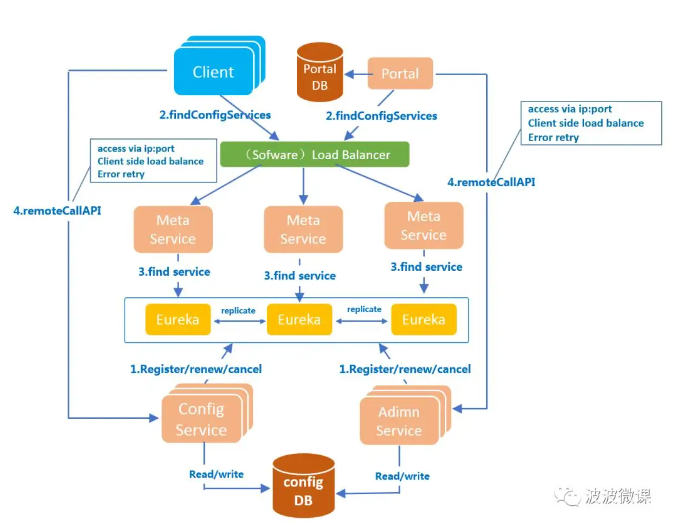
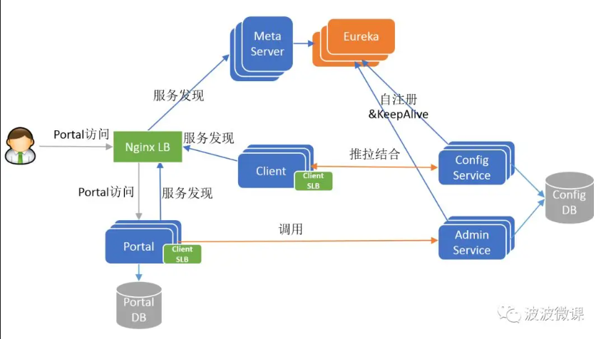
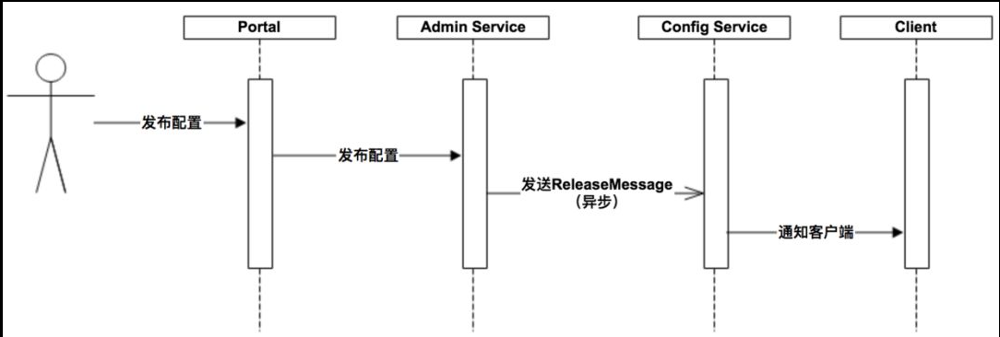
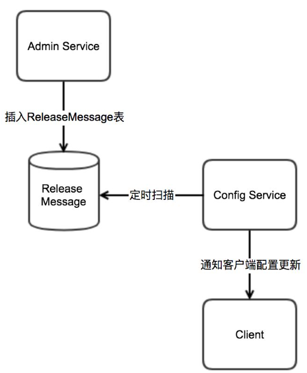
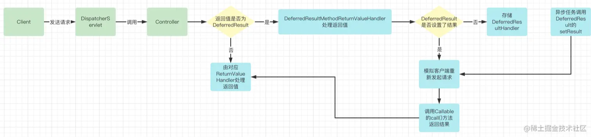

# apollo

## 简介

> 官方文档地址：
>
> [Apollo配置中心介绍](https://www.apolloconfig.com/#/zh/design/apollo-introduction)

> apollo是一个==可靠的分布式配置管理中心。携程开源。==
>
> ==可以集中管理应用不同环境、不同集群的配置，支持配置热发布==，并且具备权限治理、流程治理特性。
>
> 支持特性
>
> 1、可以==统一管理不同环境、不同集群==
>
> 2、配置修改实时生效，==热发布==
>
> 3、==支持版本管理==，可以回滚
>
> 4、支持==灰度发布==，对应用部分实例生效，没问题再推给所有实例
>
> 5、==统一管理界面，支持权限、审计功能==

## 管理维度

支持四个维度的配置

1. ==application (应用)==
2. ==environment (环境)==
3. ==cluster (集群)==
4. ==namespace (命名空间)==

## 架构图





## 角色理解

> - ==Config Service提供配置的读取、推送==等功能，服务对象是==Apollo客户端==
> - ==Admin Service提供配置的修改、发布==等功能，服务对象是==Apollo Portal（管理界面）==
> - Config Service和Admin Service都是多实例、无状态部署，所以需要将自己注册到Eureka中并保持心跳
> - Eureka之上我们架了一层Meta Server用于封装Eureka的服务发现接口
> - Client通过域名访问Meta Server获取Config Service服务列表（IP+Port），而后直接通过IP+Port访问服务，同时在Client侧会做load balance、错误重试
> - Portal通过域名访问Meta Server获取Admin Service服务列表（IP+Port），而后直接通过IP+Port访问服务，同时在Portal侧会做load balance、错误重试
> - 为了简化部署，我们实际上会把==Config Service、Eureka和Meta Server三个逻辑角色部署在同一个JVM进程中==

> ==ConfigService==
>
> 1、提供配置获取接口给客户端
>
> 2、提供配置更新推送接口（基于Http long polling）
>
> - 服务端使用[Spring DeferredResult](http://docs.spring.io/spring/docs/current/javadoc-api/org/springframework/web/context/request/async/DeferredResult.html)实现异步化，从而大大增加长连接数量
> - 目前使用的tomcat embed默认配置是最多10000个连接（可以调整），使用了4C8G的虚拟机实测可以支撑10000个连接，所以满足需求（一个应用实例只会发起一个长连接）。
>
> 3、接口服务对象为Apollo客户端
>
> ==AdminService==
>
> - 提供配置管理接口
> - 提供配置修改、发布、检索等接口
> - 接口服务对象为Portal
>
> ==MetaServer==
>
> - Portal通过域名访问Meta Server获取Admin Service服务列表（IP+Port）
> - Client通过域名访问Meta Server获取Config Service服务列表（IP+Port）
> - ==Meta Server从Eureka获取Config Service和Admin Service的服务信息==，相当于是一个Eureka Client
> - 增设一个Meta Server的角色主要是为了==封装服务发现的细节，对Portal和Client而言，永远通过一个Http接口获取Admin Service和Config Service的服务信息==，而不需要关心背后实际的服务注册和发现组件
> - Meta Server只是一个==逻辑角色，在部署时和Config Service是在一个JVM进程中的，所以IP、端口和Config Service一致==
>
> ==Eureka==
>
> - 基于[Eureka](https://github.com/Netflix/eureka)和[Spring Cloud Netflix](https://cloud.spring.io/spring-cloud-netflix/)提供服务注册和发现
> - Config Service和Admin Service会向Eureka注册服务，并保持心跳
> - 为了简单起见，目前Eureka在部署时和Config Service是在一个JVM进程中的（通过Spring Cloud Netflix）
>
> ==Portal==
>
> - 提供Web界面供用户管理配置
> - 通过Meta Server获取Admin Service服务列表（IP+Port），通过IP+Port访问服务
> - 在Portal侧做load balance、错误重试
>
> ==Client==
>
> - Apollo提供的客户端程序，为应用提供配置获取、实时更新等功能
> - 通过Meta Server获取Config Service服务列表（IP+Port），通过IP+Port访问服务
> - 在Client侧做load balance、错误重试

## 服务端设计

### 实时推送设计



> - 用户在Portal中进行配置的编辑和发布
> - Portal会调用Admin Service提供的接口进行发布操作
> - Admin Service收到请求后，发送ReleaseMessage给各个Config Service，通知Config Service配置发生变化
> - Config Service收到ReleaseMessage后，通知对应的客户端，基于Http长连接实现

### 发生ReleaseMessage设计



> - Admin Service在配置发布后会往ReleaseMessage表插入一条消息记录
> - ==Config Service会启动一个线程定时扫描ReleaseMessage表，去查看是否有新的消息记录==
> - Config Service发现有新的消息记录，那么就会通知到所有的消息监听器
> - 消息监听器得到配置发布的信息后，则会通知对应的客户端

### ConfigService通知客户端的设计

> 通知是采用基于Http长连接实现，主要分为下面几个步骤：
>
> - ==客户端会发起一个Http请求到Config Service的notifications/v2接口==
> - ==v2接口通过Spring DeferredResult把请求挂起，不会立即返回==
> - 如果在60秒内没有该客户端关心的配置发布，那么会返回Http状态码304给客户端
> - 如果==发现配置有修改，则会调用DeferredResult的setResult方法，传入有配置变化的namespace信息==，同时该请求会立即返回
> - **客户端从返回的结果中获取到配置变化的namespace后，会立即请求Config Service获取该namespace的最新配置**

## 客户端设计

> 1. 客户端和服务端保持了一个长连接，从而能第一时间获得配置更新的推送。（通过Http Long Polling实现）
> 2. 客户端还会==定时从Apollo配置中心服务端拉取应用的最新配置==。
>    - 这是一个fallback机制，为了防止推送机制失效导致配置不更新
>    - 客户端定时拉取会上报本地版本，所以一般情况下，对于定时拉取的操作，服务端都会返回304 - Not Modified
>    - 定时频率默认为==每5分钟拉取一次==，客户端也可以通过在运行时指定System Property: `apollo.refreshInterval`来覆盖，单位为分钟。
> 3. ==客户端从Apollo配置中心服务端获取到应用的最新配置后，会保存在内存中==
> 4. 客户端会把从服务端获取到的配置在本地文件系统缓存一份
>    - 在遇到服务不可用，或网络不通的时候，依然==能从本地恢复配置==
> 5. 应用程序可以从Apollo客户端获取最新的配置、订阅配置更新通知

## DeferredResult

> 是spring MVC 提供的一种异步处理机制
>
> 1. 浏览器发起异步请求
> 2. 请求到达服务端被挂起
> 3. 向浏览器进行响应，分为两种情况：
>    3.1 调用`DeferredResult.setResult()`，请求被唤醒，返回结果
>    3.2 超时，返回一个你设定的结果
> 4. 浏览得到响应，再次重复1，处理此次响应结果

> ==原理==
>
> 1、如果控制器中定义方法返回值为`DeferredResult`，会立即释放`Tomcat`线程，使用业务线程处理业务
>
> 2、由`DeferredResultMethodReturnValueHandler`处理返回结果，开启异步处理并设置`DeferredResultHandler`（ tomcat 每秒扫描等待的异步请求是否超时来触发是否返回默认值，或者应用线程手动塞值到 DeferredResult  触发返回）
>
> 3、业务执行完成后调用`setResult()`方法，紧接着回调`DeferredResultHandler`的`handleResult()`
>
> 4、设置结果并调度请求
>
> 5、创建`Callable`对象并设置调用方法为`call()`
>
> 6、通过**反射方式调用`call()`得到返回值**
>
> 7、使用返回值处理器处理返回值



```java
@GetMapping("/deferredResultUser")
public DeferredResult<ResponseEntity<List<User>>> deferredResultListUser() {
    DeferredResult<ResponseEntity<List<User>>> deferredResult =
        new DeferredResult<>(20000L, new ResponseEntity<>(HttpStatus.NOT_MODIFIED));
    deferredResult.onTimeout(() -> {
        log.info("调用超时");
    });

    deferredResult.onCompletion(() -> {
        log.info("调用完成");
    });

    new Thread(() -> {
        try {
            TimeUnit.SECONDS.sleep(10);
            deferredResult.setResult(new ResponseEntity<>(userService.listUser(), HttpStatus.OK));
        } catch (InterruptedException e) {
            e.printStackTrace();
        }
    }).start();
    return deferredResult;
}
```

