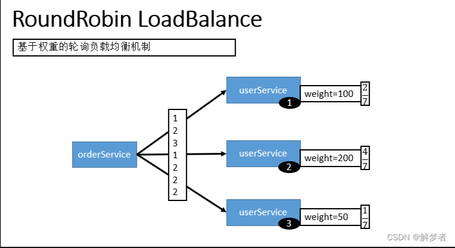
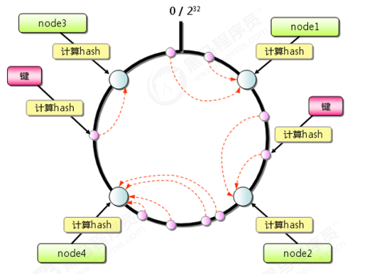

# Dubbo

## 介绍

> [Dubbo 文档 | Apache Dubbo](https://cn.dubbo.apache.org/zh-cn/overview/home/)

> - RPC分布式服务框架
> - 解决微服务架构下的服务治理与通信问题（SOA面向服务的架构（Service Oriented Architecture服务治理方案）

## Dubbo3.3

> ### 支持全面的流量管理与高效通信
>
> 在复杂的微服务架构中，南北向流量（客户端到服务器）和东西向流量（服务间通信）需要采用不同的技术进行处理
>
> Triple X 协议通过统一的通信协议，同时支持南北向与东西向流量
>
> ```java
> package org.apache.test;
> 
> @DubboService
> public class UserServiceImpl implements UserService {
>     // 处理东西向请求
> }
> 
> // Triple X 也支持南北向流量处理
> @DubboService
> public class OrderService {
>     @GetMapping("/order/{orderId}")
>     public Order getOrderById(@PathVariable("orderId") String orderId) {}
> }
> ```
>
> ### 遵循 gRPC 协议标准
>
> Triple X 遵循 **gRPC 协议标准**，通过 Protobuf 实现与 gRPC 的无缝交互，简化了开发流程，增强了跨语言和跨平台通信能力
>
> ### 基于 HTTP 协议，原生支持云原生架构
>
> Triple X 同时支持 **HTTP/1、HTTP/2 和 HTTP/3** 协议
>
> Triple X 支持复用 Spring Boot 现有 **Servlet** 端口接入 HTTP 流量，无需新增 Netty 监听端口
>
> ### 高性能优化，提升 5 倍 QPS
>
> Triple X 通过 **Radix Tree** 和 **Zero Copy** 等技术降低了 CPU 使用和内存用量，显著提升了系统性能，尤其在高并发和弱网环境下表现突出：
>
> - **高效路由**：采用 Radix Tree 前缀树结构进行路由匹配，优化 key hash 算法并支持动态更新，减少内存占用，提高匹配效率。
> - **内存使用优化**：结合 Zero Copy 技术和对象复用技术，减少数据复制和对象创建开销，降低垃圾回收压力，提升吞吐量。
> - **HTTP/3 支持**：引入基于 QUIC 的 HTTP/3 协议，显著提升弱网环境下的性能表现，解决队头阻塞问题，减少延迟并提高连接可靠性。
> - **多协议压测优化**：Dubbo 团队对各种协议进行了全面压测，基于测试结果进行了多轮性能优化，确保在不同场景下都能达到最佳表现
>
> ###  平滑迁移与框架兼容
>
> Triple X 支持零侵入式的迁移方案
>
> ### Native Image AOT 支持
>
> Dubbo 3.3 引入了对 **Native Image AOT（Ahead-of-Time 编译）** 的支持，开发者可以将 Dubbo 应用编译为原生二进制文件，极大缩短启动时间，降低内存占用，特别适合无服务器（Serverless）场景。


## RPC

> RPC（Remote Procedure Call）：
>
> 远程过程调用，它是一种==通过网络从远程计算机程序上请求服务，而不需要了解底层网络技术的协议==。比如两个不同的服务 A、B 部署在两台不同的机器上，那么服务A如果想要调用服务B中的某个方法该怎么办呢？使用HTTP请求当然可以，但是可能会比较麻烦。 RPC的出现就是为了让你调用远程方法像调用本地方法一样简单
>
> 
>
> - 服务消费方（client）调用以本地调用方式调用服务；
>
> - client stub接收到调用后负责将方法、参数等组装成能够进行网络传输的消息体；
> - client stub找到服务地址，并将消息发送到服务端；
> - server stub收到消息后进行解码；
> - server stub根据解码结果调用本地的服务；
> - 本地服务执行并将结果返回给server stub；
> - server stub将返回结果打包成消息并发送至消费方；
> - client stub接收到消息，并进行解码；
> - 服务消费方得到最终结果。

## 核心

> 1.远程通讯，
>
> 提供对多种基于长连接的NiO框架抽象封装，包括多种线程模型，序列化，以及“请求一响应”模式的信息交换方式。
>
> `透明化的远程方法调用`，就像调用本地方法一样调用远程方法，只需简单配置，没有任何API入侵
>
> 2.集群容错: 
>
> 提供基于接口方法的透明远程过程调用，包括多协议支持。以及负载均衡，失败容错，地址路由，动态配置等集群支持。
>
> `软负载均衡及容错机制`，可在内网替代F5等硬件负载均衡器，降低成本
>
> 3.自动发现:
>
> 基于注册中心目录服务，使用服务消费能动态查找服务提供方,使地址透明,使用服务提供方可以平滑增加或减少服务器
>
> `服务自动注册与发现`，不再需要写死服务提供方地址，注册中心基于接口名查询服务提供者的IP地址，并且能平滑添加或删除服务提供者

## 特性

> 1、连通性
>   1）注册中心负责服务地址的注册与查找，相当于目录服务，服务提供者和消费者只在启动时与注册中心交互，注册中心不转发请求，压力较小。
>   2）监控中心负责统计各服务调用次数，调用时间等，统计先在内存汇总后每分钟一次发送到监控中心服务器，并以报表展示。
>   3）服务提供者向注册中心注册其提供的服务，并汇报调用时间到监控中心，此时间不包含网络开销。
>   4）服务消费者向注册中心获取服务提供者地址列表，并根据负载算法直接调用提供者，同时汇报调用时间到监控中心，此时间包含网络开销。
>   5）==注册中心，服务提供者，服务消费者三者之间均为长连接==，监控中心除外。
>   6）注册中心通过长连接感知服务提供者的存在，服务提供者宕机，注册中心将立即推送事件通知消费者。
>   7）注册中心和监控中心全部宕机，不影响已运行的提供者和消费者，消费者在本地缓存了提供者列表。
>   8）注册中心和监控中心都是可选的，服务消费者可以直连服务提供者。
> 2、健状性
>   1）监控中心宕掉不影响使用，只是丢失部分采样数据。
>   2）==数据库宕掉后，注册中心仍能通过缓存提供服务列表查询，但不能注册新服务==。
>   3）注册中心对等集群，任意一台宕掉后，将自动切换到另一台。
>   4）注册中心全部宕掉后，服务提供者和服务消费者仍能通过本地缓存通讯。
>   5）服务提供者无状态，任意一台宕掉后，不影响使用。
>   6）服务提供者全部宕掉后，服务消费者应用将无法使用，并无限次重连等待服务提供者恢复。
> 3、伸缩性
>   1）注册中心为对等集群，可动态增加机器部署实例，所有客户端将自动发现新的注册中心。
>   2）服务提供者无状态，可动态增加机器部署实例，注册中心将推送新的服务提供者信息给消费者

## 和SpringCloud比较

> - 核心要素和开发成本：Spring Cloud 在开发过程中通过整合子项目可以顺利完成组件融合，而 Dubbo 需要通过实现各种 Filter 进行定制，开发成本和技术难度相对较高。
> - ==通信协议==：Dubbo ==默认使用单一长连接和 NIO 异步通讯，适合小数据量大并发的服务调用，支持多种通信协议==；Spring Cloud 使用 ==HTTP 协议的 REST API==，在通信速度上 Dubbo 略胜。
> - 服务依赖方式：Dubbo 服务依赖较重，需要版本管理机制，程序入侵较少；Spring Cloud 使用 JSON 进行交互，省略了版本管理问题，为跨平台调用提供基础。
> - 组件运行流程：Dubbo 的组件需要部署在单独服务器上，而 Spring Cloud 所有请求通过 API 网关（如 Zuul）访问内部服务，由注册中心（如 Eureka）和 Ribbon 进行服务发现和负载均衡。
> - ==初始定位和生态==：==Spring Cloud 定位为微服务架构下的一站式解决方案==，依托于 Spring 生态；Dubbo 起初==关注服务调用和治理==，生态相对不足但逐渐丰富。
> - ==微服务集群规模==：==Spring Cloud 更适用于小规模微服务集群，而 Dubbo 可以在超大规模集群中实现水平扩容，应对集群增长带来的问题==。
> - ==多语言支持：Dubbo 提供 Java 外的多语言实现，支持构建多语言异构的微服务体系；Spring Cloud 主要围绕 Java 生态。==


## 架构图解


### 角色

> Provider：暴露服务的服务提供方。
> Consumer：调用远程服务的服务消费方 。
> Registry：服务注册与发现的注册中心 。
> Monitor：统计服务的调用次调和调用时间的监控中心。
> Container ：服务运行容器。

### 服务注册和发现（角色维度理解）

> 1、服务容器负责启动，加载，运行服务提供者。
> 2、服务提供者在启动时，向注册中心注册自己提供的服务（发送本机IP、端口、应用信息和提供服务信息发送至注册中心存储）。
> 3、服务消费者在启动时，向注册中心订阅自己所需的服务（并发送应用信息、所求服务信息至注册中心）。
> 4、注册中心返回服务提供者地址列表给消费者，如果有变更，注册中心将基于长连接推送变更数据给消费者。
> 5、服务消费者，从提供者地址列表中，基于软负载均衡算法，选一台提供者进行调用，如果调用失败，再选另一台调用。服务提供者状态变更会实时通知注册中心、在由注册中心实时推送至服务消费者。
> 6、服务消费者和提供者，在内存中累计调用次数和调用时间，定时每分钟发送一次统计数据到监控中心。

### 分层架构


> 1、服务接口层（Service）
>   给服务提供者和消费者来实现的。
> 2、配置层（Config）
>   主要是对dubbo进行各种配置的。
> 3、服务代理层（Proxy）
>   无论是 consumer 还是 provider，dubbo 都会给你生成代理，代理之间进行网络通信。
> 4、服务注册层（Registry）
>   封装服务地址的注册与发现。
> 5、集群层（Cluster）
>   封装多个服务提供者的路由以及负载均衡，将多个实例组合成一个服务。
> 6、监控层（Monitor）
>   对rpc接口的调用次数和调用时间进行监控。
> 7、远程调用层（Protocol）
>   封装rpc调用。
> 8、信息交换层（Exchange）
>   封装请求响应模式，同步转异步。
> 9、网络传输层（Transport）
>   抽象mina和netty为统一接口。
> 10、数据序列化层（Serialize）
>   数据传输的序列化和反序列化。

## 线程模型


> Dubbo默认的底层网络通讯使用的是Netty，服务提供方NettyServer使用两级线程池，其中EventLoopGroup(boss)主要用来接受客户端的链接请求，并把接受的请求分发给EventLoopGroup(worker) 来处理，boss和worker线程组我们称之为IO线程。
> 如果事件处理的逻辑能迅速完成，并且不会发起新的IO请求，比如只是在内存中记个标识，则直接在IO线程上处理更快，因为减少了线程池调度。
> 但如果事件处理逻辑较慢，或者需要发起新的IO请求，比如需要查询数据库，则必须派发到线程池，否则IO线程阻塞，将导致不能接收其它请求

```xml
	<dubbo:protocol name="dubbo" dispatcher="all" 
		threadpool="fixed" threads="100" />
```

> ==根据请求的消息类被IO线程处理还是被业务线程池处理==，Dubbo提供了下面几种线程模型：
> all：所有消息都派发到线程池，包括请求、响应、连接事件、断开事件、心跳等。
> direct：所有消息都不派发到线程池，全部在IO线程上直接执行。
> ==message==：只有请求响应消息派发到线程池，其它连接断开事件、心跳等消息，直接在IO线程上执行。
> execution：只请求消息派发到线程池，不含响应，响应和其它连接断开事件，心跳等消息，直接在IO线程上执行。
> connection：在IO线程上，将连接断开事件放入队列，有序逐个执行，其它消息派发到线程池。

> ==Dubbo提供的线程池策略==，扩展接口ThreadPool的SPI实现有如下几种：
> fixed：固定大小线程池，启动时建立线程，不关闭，一直持有(缺省)。
> cached：缓存线程池，空闲一分钟自动删除，需要时重建。
> limited：可伸缩线程池，但池中的线程数只会增长不会收缩。只增长不收缩的目的是为了避免收缩时突然来了大流量引起的性能问题。

## 协议比较

> ==dubbo==
>
> - ==单一长连接和NIO异步通讯==
> - Hessian二进制序列化
> - ==适合大并发小数据量的服务调用，以及消费者远大于提供者==。
> - 常规远程服务方法调用
> - Dubbo协议适用常见：传入传出参数数据包较小（建议小于100K），消费者比提供者个数多，单一消费者无法压满提供者（并发量很高），尽量不要用Dubbo协议传输大文件或超大字符串。
>   为了要支持高并发场景，一般是服务提供者就几台机器，但是服务消费者有上百台，可能每天调用量达到上亿次！此时用长连接是最合适的，就是跟每个服务消费者维持一个长连接就可以，可能总共就 100 个连接。然后后面直接==基于长连接 NIO 异步通信，可以支撑高并发请求==。长连接，通俗点说，就是建立连接过后可以持续发送请求，无须再建立连接
>
> ==rmi==
>   采用JDK标准的rmi协议实现，传输参数和返回参数对象需要实现Serializable接口，使用Java标准序列化机制，使用阻塞式短连接，传输数据包大小混合，消费者和提供者个数差不多，可传文件。在依赖低版本的Common-Collections包，Java序列化存在安全漏洞。
>   连接个数：多连接；
>   连接方式：短连接；
>   传输协议：TCP；
>   传输方式：同步传输；
>   序列化：Java 标准二进制序列化；
>   适用范围：传入传出参数数据包大小混合，消费者与提供者个数差不多，可传文件，一般较少用。
>   适用场景：常规远程服务方法调用，与原生RMI服务互操作。
> ==webservice==
>   基于CXF的frontend-simple和transports-http实现。
>   基于WebService的远程调用协议。
>   连接个数：多连接。
>   连接方式：短连接。
>   传输协议：HTTP。
>   传输方式：同步传输。
>   序列化：SOAP文本序列化。
>   适用场景：系统集成，跨语言调用。
> ==http==
>   采用Spring的HttpInvoker实现。
>   基于http表单的远程调用协议。
>   连接个数：多连接。
>   连接方式：短连接。
>   传输协议：HTTP。
>   传输方式：同步传输。
>   序列化：表单序列化（JSON）。
>   适用范围：传入传出参数数据包大小混合，提供者比消费者个数多，可用浏览器查看，可用表单或URL传入参数，暂不支持传文件。
>   适用场景：需同时给应用程序和浏览器JS使用的服务。
> ==hessian==
>   Hessian协议用于集成Hessian的服务，Hessian底层采用Http通讯，采用Servlet暴露服务，Dubbo缺省内嵌Jetty作为服务器实现。
>   基于 Hessian 的远程调用协议。
>   连接个数：多连接。
>   连接方式：短连接。
>   传输协议：HTTP。
>   传输方式：同步传输。
>   序列化：Hessian二进制序列化。
>   适用范围：传入传出参数数据包较大，提供者比消费者个数多，提供者压力较大，可传文件，一般较少用。
>   适用场景：页面传输，文件传输，或与原生hessian服务互操作。
> ==memcache==
>   基于memcached实现的RPC协议。
> ==redis==
>   基于redis实现的RPC协议。

## dubbo协议的特点

==约束==

- 参数及返回值需实现Serializable接口。
- 参数及返回值不能自定义实现List、Map、Number、Date、Calendar等接口，只能用JDK自带的实现，因为hessian会做特殊处理，自定义实现类中的属性值都会丢失。
- Hessian序列化，只传成员属性值和值的类型，不传方法或静态变量，兼容情况。

| **数据通讯** | **情况**                                                     | **结果**                                     |
| ------------ | ------------------------------------------------------------ | -------------------------------------------- |
| A -> B       | 类A多一种属性（或者说类B少一种属性）                         | 不抛异常，A多的那个属性的值，B没有，其他正常 |
| A -> B       | 枚举A多一种枚举（或者说B少一种枚举），A使用多出来的枚举进行传输 | 抛异常                                       |
| A -> B       | 枚举A多一种枚举（或者说B少一种枚举），A不使用多出来的枚举进行传输 | 不抛异常，B正常接收数据                      |
| A -> B       | A和B的属性名相同，但类型不同                                 | 抛异常                                       |
| A -> B       | 序列化ID不同                                                 | 正常传输                                     |

- 接口增加方法，对客户端无影响，如果该方法不是客户端需要的，客户端不需要重新部署。
- 输入参数和结果集中增加属性，对客户端无影响，如果客户端并不需要新属性，不用重新部署。
- 输入参数和结果集属性名变化，对客户端序列化无影响，但是如果客户端不重新部署，不管输入还是输出，属性名变化的属性值是获取不到的。
- ==总结：服务器端和客户端对领域对象并不需要完全一致，而是按照最大匹配原则。==

## 架构特性

### 集群容错


> - Invoker是Provider的一个可调用Service的抽象， ==Invoker封装了Provider地址及Service接口信息==。
>
> - Directory代表多个Invoker，可以把它看成List<Invoker>，但与List不同的是，它的值可能是动态变化的，比如注册中心推送变更。
> - Cluster将Directory中的多个Invoker伪装成一个Invoker，对上层透明，伪装过程包含了容错逻辑，调用失败后，重试另一个.
> - Router负责从多个Invoker中按路由规则选出子集，比如读写分离，应用隔离等。
> - LoadBalance负责从多个Invoker中选出具体的一个用于本次调用，选的过程包含了负载均衡算法，调用失败后，需要重选。

> **Failover Cluster**
>
> 失败自动切换，当出现失败，重试其它服务器。通常用于读操作，但重试会带来更长延迟。可通过retries="2"来设置重试次数(不含第一次). cluster="failover"可以不用写，因为默认就是failover。
>
> ```xml
> 	<!--2种写法-->
> 	<dubbo:service retries="2" cluster="failover"/>
> 	<dubbo:reference retries="2" cluster="failover"/>
> ```
>
> **Failfast Cluster**
>
> 快速失败，只发起一次调用，失败立即报错。通常用于非幂等性的写操作，比如新增记录。（cluster="failfast"和 把 cluster=“failover”、retries="0"是一样的效果，retries="0"就是不重试。）
>
> ```xml
>     <!--2种写法-->
> 	<dubbo:service cluster="failfast" />
> 	<dubbo:reference cluster="failfast" />
> ```
>
> **Failsafe Cluster**
>
> 失败安全，出现异常时，直接忽略。通常用于写入审计日志等操作。
>
> ```xml
> 	<!--2种写法-->
> 	<dubbo:service cluster="failsafe" />
> 	<dubbo:reference cluster="failsafe" />
> 
> ```
>
> **Failback Cluster**
>
> 失败自动恢复，后台记录失败请求，定时重发。通常用于消息通知操作
>
> ```xml
> 	<!--2种写法-->
> 	<dubbo:service cluster="failback" />
> 	<dubbo:reference cluster="failback" />
> ```
>
> **Forking Cluster**
>
> 并行调用多个服务器，只要一个成功即返回。通常用于实时性要求较高的读操作，但需要浪费更多服务资源。可通过 forks=“2” 来设置最大并行数
>
> ```xml
>    <!--2种写法-->
> 	<dubbo:service cluster="forking" forks="2"/>
> 	<dubbo:reference cluster="forking" forks="2"/>
> ```
>
> **Broadcast Cluster**
>
> 广播调用所有提供者，逐个调用，任意一台报错则报错 。通常用于通知所有提供者更新缓存或日志等本地资源信息。可以在不同的级别配置
>
> ```xml
>     <!--服务端服务级别-->
> 	<dubbo:service interface="..." loadbalance="roundrobin" />
>     <!--客户端服务级别-->
>    <dubbo:reference interface="..." loadbalance="roundrobin" />
>     <!--服务端方法级别-->
> 	<dubbo:service interface="..."> <dubbo:method name="..." loadbalance="roundrobin" />
>     <!--客户端方法级别-->
> 	<dubbo:reference interface="..."> <dubbo:method name="..." loadbalance="roundrobin" />
> ```

### 负载均衡

> ==**Random LoadBalance(默认，基于权重的随机负载均衡机制)**==
>
> 随机，按权重设置随机概率。
> 调用量越大分布越均匀，而且按概率使用权重后也比较均匀，有利于动态调整提供者权重（权重可以在dubbo控制台配置）
>
> 
>
> **RoundRobin LoadBalance(均匀的轮询负载均衡机制)**
>
> 轮循，按公约后的权重设置轮训比率。
> 存在慢的提供者累积请求的问题，比如：第二台机器很慢，但没挂，当请求调到第二台时就卡在那，久而久之，所有请求都卡在调到第二台上
>
> 
>
> **LeastActive LoadBalance**
>
> 最少活跃调用数，相同活跃数的随机，活跃数指调用前后计数差。
> 使慢的提供者收到更少请求，因为越慢的提供者的调用前后计数差会越大。
> 每个服务维护一个活跃数计数器。当A机器开始处理请求，该计数器加1，此时A还未处理完成。若处理完毕则计数器减1。而B机器接受到请求后很快处理完毕。那么A、B的活跃数分别是1、0。当又产生了一个新的请求，则选择B机器去执行(B活跃数最小)，这样使慢的机器A收到少的请求
>
> **ConsistentHash LoadBalance**
>
> 一致性Hash，相同参数的请求总是发到同一提供者。
>
> hash环，计算hash值离的最新的节点。
>
> 
>
> 当某一台提供者挂时，原本发往该提供者的请求，基于虚拟节点，平摊到其它提供者，不会引起剧烈变动。
> 缺省只对第一个参数Hash，如果要修改
>
> ```xml
> 	<dubbo:parameter key="hash.arguments" value="0,1" />
> 	<dubbo:parameter key="hash.nodes" value="320" />
> ```

> ==配置方式==
>
> xml和注解方式
>
> ```xml
>     <!--服务端服务级别-->
>     <dubbo:service interface="..." loadbalance="roundrobin" />
>     <!--客户端服务级别-->
>     <dubbo:reference interface="..." loadbalance="roundrobin" />
>     <!--服务端方法级别-->
>    <dubbo:service interface="...">
>         <dubbo:method name="..." loadbalance="roundrobin"/>
>    </dubbo:service>
>    <!--客户端方法级别-->
>    <dubbo:reference interface="...">
>        <dubbo:method name="..." loadbalance="roundrobin"/>
>    </dubbo:reference>
> 
> ```
>
> ```java
>     @Reference(loadbalance = "roundrobin")
>     HelloService helloService;
> ```

> ==原理解读==
>
> dubbo的负载均衡策略，主体向外暴露出来是一个接口，名字叫做loadBlace,位于com.alibaba.dubbo.rpc.cluster包下，很明显根据包名就可以看出它是用来管理集群的。
>   1、RandomLoadBalance类。首先遍历每个提供服务的机器，获取每个服务的权重，然后累加权重值，判断每个服务的提供者权重是否相同，如果每个调用者的权重不相同，并且每个权重大于0，那么就会根据权重的总值生成一个随机数，再用这个随机数，根据调用者的数量每次减去调用者的权重，直到计算出当前的服务提供者随机数小于0，就选择那个提供者！另外，如果每个机器的权重的都相同，那么权重就不会参与计算，直接选择随机算法生成的某一个选择，完全随机。
>   2、RoundRobinLoadBlance类（轮询调用）。轮询调用的过程主要是维护了局部变量的一个LinkdesHashMap（有顺序的Map）去存储调用者和权重值的对应关系，然后遍历每个调用者,把调用者和当前大于0的权重值放进去，再累加权重值。还有一个全局变量的map，找到第一个服务调用者，首先是找到每个服务的key值和method，这里可以理解为标识第一个调用者的唯一key，然后再给它对应的值保证原子性的+1（AtomicPositiveInteger是原子的），再对这个值取模总权重，再每次对其权重值-1，知道它取模与总权重值等于0就选择该调用者，可以称之为"降权取模"（只是一种的计算层面,而不是真正降权）。总结：轮询调用并不是简单的一个接着一个依次调用，它是根据权重的值进行循环的。
>   3、LeastActiveLoadBlance类（最少活跃数调用法）。这个方法的主要作用根据服务的提供者的运行状态去选择服务器,主要的思路就是遍历每个调用者，然后获取每个服务器的运行状态，如果当前运行的运行状态小于最小的状态-1，把它保存在leastIndexs中的第一个位置，并且认定所有的调用者权重都相同，然后直接返回那个调用者(这里的逻辑是：找到最少活跃数(在代码层反应就是：active的值))。如果计算出的权重值和最少的权重值相同，那么把它保存在leastIndexs数组里面，累加权重值，如果当前的权重值不等于初始值firstWeight，那么就认定不是所有的调用者的权重不同。然后再遍历lestIndexs，取权重累加值的随机数生成权重偏移量，在累减它，到它小于0的时候返回那个调用者。如果这些都不符合，就从leastIndexs随机选一个index，返回那个调用者。
>   4、ConsistentHashLoadBalance（一致性Hash算法）。doSelect方法进行选择。一致性Hash负载均衡涉及到两个主要的配置参数为hash.arguments与hash.nodes：当进行调用时候根据调用方法的哪几个参数生成key，并根据key来通过一致性hash算法来选择调用节点。
>   可以看到除了一致性Hash算法，其它都是根据权重进行计算的。

### 服务治理

> ==服务降级==
>
> 可以通过服务降级功能临时屏蔽某个出错的非关键服务，并定义降级后的返回策略 可以向注册中心写入动态配置覆盖规则 
>
> ```java
> RegistryFactory registryFactory =  ExtensionLoader.getExtensionLoader(RegistryFactory.class).getAdaptiveExtensi on(); Registry registry =  registryFactory.getRegistry(URL.valueOf("zookeeper://10.20.153.10:2181")); registry.register(URL.valueOf("override://0.0.0.0/com.foo.BarService? category=configurators&dynamic=false&application=foo&mock=force:return+null" )); 
> ```
>
> mock=force:return+null 表示消费方对该服务的方法调用都直接返回 null 值，不发起远 程调用。用来屏蔽不重要服务不可用时对调用方的影响。 还可以改为 mock=fail:return+null 表示消费方对该服务的方法调用在失败后，再返回 null 值，不抛异常。用来容忍不重要服务不稳定时对调用方的影响。

## Dubbo功能

### SPI

> spi：service provider interface，比如你有个接口，现在这个接口有 3 个实现类，那么在系统运行的时候对这个接口到底选择哪个实现类呢？这就需要 spi 了，需要根据指定的配置或者是默认的配置，去找到对应的实现类加载进来，然后用这个实现类的实例对象。你通过配置 接口 A = 实现 A2 ，那么在系统实际运行的时候，会加载你的配置，用实现 A2 实例化一个对象来提供服务。
>   spi 机制一般用在哪儿？==插件扩展的场景，比如说你开发了一个给别人使用的开源框架，如果你想让别人自己写个插件，插到你的开源框架里面，从而扩展某个功能，这个时候 spi 思想就用上了==
>
> 比如说 jdbc。Java 定义了一套 jdbc 的接口，但是 Java 并没有提供 jdbc 的实现类。实际上项目跑的时候，要使用 jdbc 接口的哪些实现类呢？一般来说，我们要根据自己使用的数据库，比如 mysql，你就将 mysql-jdbc-connector.jar 引入进来；oracle，你就将oracle-jdbc-connector.jar 引入进来
>
> - 比较常见的例子：
>   1、数据库驱动加载接口实现类的加载、JDBC 加载不同类型数据库的驱动
>   2、日志门面接口实现类加载、SLF4J 加载不同提供商的日志实现类
>   3、Spring 中大量使用了SPI,比如：对servlet3.0 规范对ServletContainerInitializer 的实现、自动类型转换Type Conversion SPI(Converter SPI、Formatter SPI)等

> DubboSPI
>
> ```java
> Protocol = ExtensionLoader.getExtensionLoader(Protocol.class).getA
> ```
>
> 1、META-INF/dubbo 路径下.（配置接口的全限定名文件）
>
> 2、通过键值对的方式进行配置，接口的实现类，这样我们可以按需加载指定。
>
> 3、引入@SPI  @Adaptive @Activate 注解来扩展SPI应用场景
>
> 4、在生成Spi扩展实例的时候支持依赖注入
>
> （dubbo有一个AdaptiveExtensionFactory扩展点工程， 在内部持有了所有的factory 实现工厂，即后两个实现类。一个为SPI 工厂（依赖类是扩展接口时发挥作用，由于OrderServiceImpl中的infoService为扩展接口，所以会根据url适配infoService的实现类），一个为Spring 工厂（依赖的是springbean 时发挥作用）。于是，当我们需要为某个生成的对象注入依赖时，直接调用此对象即可。）
>
> ==@Acticate==
>
> 某种时候存在这样的情形，需要同时启用某个接口的多个实现类，如Filter 过滤器。我们希望某种条件下启用这一批实现，而另一种情况下启用那一批实现
>
> **Activate 注解表示一个扩展是否被激活(使用),可以放在类定义和方法上**，dubbo 用它在spi 扩展类定义上，**表示这个扩展实现激活条件和时机**。它有两个设置过滤条件的字段，group，value 都是字符数组。用来指定这个扩展类在什么条件下激活。
>
> 下面以com.alibaba.dubbo.rpc.filter 接口的几个扩展来说明。
>
> @Activate(group = {Constants.PROVIDER, Constants.CONSUMER})
> public class testActivate1 implements Filter {}
> //表示如果过滤器使用方（通过group 指定）属于Constants.PROVIDER（服务提供方）或者Constants.CONSUMER（服务消费方）就激活使用这个过滤器。
>
> //再看这个扩展
> @Activate(group = Constants.PROVIDER, value = Constants.TOKEN_KEY)
> public class testActivate2 implements Filter {}
> //表示如果过滤器使用方（通过group 指定）属于Constants.PROVIDER（服务提供方）并且URL 中有参数Constants.TOKEN_KEY（token）时就激活使用这个过滤器
>
> ==@Adaptive==
>
> 扩展点对应的实现类不能在程序运行时动态指定，就是extensionLoader.getExtension 方法写死了扩展点对应的实现类.Adaptive注解，也就是dubbo 的自适应机制
>
> 
>
> 现在的InfoService 的调用对象adaptiveExtension ，在
> 当前，还只是个代理类，因此我们还有在代理内选择哪个目标实现的机会。
>
> 我们运行代码，会发现还真就是调用的A 实现类
> 使用重点，URL 的格式：
> info.service=a 的参数名格式，是接口类InfoService 的驼峰大小写拆分
>
> ==javaSpi缺点==
>
> - 所有实现类无论是否使用，直接被加载，可能存在浪费
> - 不能够灵活控制什么时候什么时机，匹配什么实现，功能太弱。Dubbo 基于自己的需要，增强了这套SPI 机制，下面介绍Dubbo 中的SPI用法。
>
> ==javaSpi实现==
>
> 1、当服务提供者提供了接口的一种具体实现后，在jar 包的META-INF/services 目录下创建一个以“接口全限定名”为命名的文件，内容为实现类的全限定名；
> 2、接口实现类所在的jar包放在主程序的classpath 中；
> 3、主程序通过java.util.ServiceLoder 动态装载实现模块，它通过扫描META-INF/services 目录下的配置文件找到实现类的全限定名，把类加载到JVM；
> 4、SPI 的实现类必须携带一个不带参数的构造方法；定义一个接口，两个实现
>
> 
>
> 

## 服务暴露

> Dubbo会在 Spring实例化完bean之后，在刷新容器最后一步发布ContextRefreshEvent事件的时候，通知实现了ApplicationListener的ServiceBean类进行回调onApplicationEvent事件方法，Dubbo会在这个方法中调用ServiceBean父类ServiceConfig的export方法，而该方法真正实现了服务的（异步或者非异步）发布。
>

## dubbo设计模式

> **工厂模式**
>
> Provider在export服务时，会调用ServiceConfig的export方法。ServiceConfig中有个字段
>
> ```java
> 	private static final Protocol protocol = 
> 		ExtensionLoader.getExtensionLoader(Protocol.class).getAdaptiveExtension();
> ```
>
> Dubbo里有很多这种代码。这也是一种工厂模式，只是实现类的获取采用了JDK SPI的机制。这么实现的优点是可扩展性强，想要扩展实现，只需要在classpath下增加个文件就可以了，代码零侵入。另外，像上面的Adaptive实现，可以做到调用时动态决定调用哪个实现，但是由于这种实现采用了动态代理，会造成代码调试比较麻烦，需要分析出实际调用的实现类
> **装饰器模式**
>
> Dubbo在启动和调用阶段都大量使用了装饰器模式。以Provider提供的调用链为例，具体的调用链代码是在ProtocolFilterWrapper的buildInvokerChain完成的，具体是将注解中含有group=provider的Filter实现，按照order排序，最后的调用顺序是：EchoFilter -> ClassLoaderFilter -> GenericFilter -> ContextFilter ->ExecuteLimitFilter -> TraceFilter -> TimeoutFilter -> MonitorFilter ->ExceptionFilter。
>   更确切地说，这里是装饰器和责任链模式的混合使用。例如，EchoFilter的作用是判断是否是回声测试请求，是的话直接返回内容，这是一种责任链的体现。而像ClassLoaderFilter则只是在主功能上添加了功能，更改当前线程的ClassLoader，这是典型的装饰器模式。
>
> **观察者模式**
>
> Dubbo的Provider启动时，需要与注册中心交互，先注册自己的服务，再订阅自己的服务，订阅时，采用了观察者模式，开启一个listener。注册中心会每5秒定时检查是否有服务更新，如果有更新，向该服务的提供者发送一个notify消息，provider接受到notify消息后，即运行NotifyListener的notify方法，执行监听器方法
>
> **动态代理模式**
>
>  Dubbo扩展JDK SPI的类ExtensionLoader的Adaptive实现是典型的动态代理实现。Dubbo需要灵活地控制实现类，即在调用阶段动态地根据参数决定调用哪个实现类，所以采用先生成代理类的方法，能够做到灵活的调用。生成代理类的代码是ExtensionLoader的createAdaptiveExtensionClassCode 方法。代理类的主要逻辑是，获取URL参数中指定参数的值作为获取实现类的key
>

## dubbo核心配置

| 配置              | 配置说明     | 解释                                                         |
| ----------------- | ------------ | ------------------------------------------------------------ |
| dubbo:service     | 服务配置     | 用于暴露一个服务，定义服务的元信息，一个服务可以用多个协议暴露，一个服务也可以注册到多个注册中心 |
| dubbo:reference   | 引用配置     | 用于创建一个远程服务代理，一个引用可以指向多个注册中心       |
| dubbo:protocol    | 协议配置     | 用于配置提供服务的协议信息，协议由提供方指定，消费方被动接受 |
| dubbo:application | 应用配置     | 用于配置当前应用信息，不管该应用是提供者还是消费者           |
| dubbo:module      | 模块配置     | 用于配置当前模块信息，可选                                   |
| dubbo:registry    | 注册中心配置 | 用于配置连接注册中心相关信息                                 |
| dubbo:monitor     | 监控中心配置 | 用于配置连接监控中心相关信息，可选                           |
| dubbo:provider    | 提供方配置   | 当 ProtocolC onfig 和 ServiceCo nfig 某属 性没有配置时，采用此缺省值，可选 |
| dubbo:consumer    | 消费方配置   | 当 Reference Config 某属性没有配置时，采用此缺省值，可选     |
| dubbo:method      | 方法配置     | 用于 ServiceCo nfig 和 Reference Config 指 定方法级的配置信息 |
| dubbo:argument    | 参数配置     | 用于指定方法参数配置                                         |


# 提问篇

## 协议

> 1、为什么要消费者比提供者个数多?
>   因Dubbo协议采用单一长连接，假设网络为千兆网卡 ，根据测试经验数据每条连接最多只能压满7MByte(不同的环境可能不一样，供参考)，理论上1个服务提供者需要20个服务消费者才能压满网卡。

> 2、为什么不能传大包?
>   因Dubbo协议采用单一长连接，如果每次请求的数据包大小为500KByte，假设网络为千兆网卡 ，每条连接最大7MByte(不同的环境可能不一样，供参考)，单个服务提供者的TPS(每秒处理事务数)最大为：128MByte/500KByte=262。单个消费者调用单个服务提供者的 TPS(每秒处理事务数)最大为：7MByte/500KByte=14。如果能接受，可以考虑使用，否则网络将成为瓶颈。

> 3、为什么采用异步单一长连接?
>   因为服务的现状大都是服务提供者少，通常只有几台机器，而服务的消费者多，可能整个网站都在访问该服务，比如Morgan的提供者只有6台提供者，却有上百台消费者，每天有1.5亿次调用，如果采用常规的hessian服务，服务提供者很容易就被压跨，通过单一连接，保证单一消费者不会压死提供者，长连接，减少连接握手验证等，并使用异步IO，复用线程池，防止C10K问题。
>   网络服务在处理数以万计的客户端连接时，往往出现效率底下甚至完全瘫痪，这被成为C10K问题。(C10K = connection 10 kilo问题)。k表示kilo，即1000。比如：kilometer(千米)，kilogram(千克)。

> 4、Dubbo支持服务多协议吗？
>   Dubbo允许配置多协议，在不同服务上支持不不同协议或者同一服务上同时支持多种协议。

> **Spring2.x初始化死锁问题**
>
> 在Spring解析到dubbo:service时，就已经向外暴露了服务，而Spring还在接着初始化其他Bean。如果这时有请求进来，并且服务的实现类里有调用applicationContext.getBean()的用法。getBean线程和Spring初始化线程的锁的顺序不一样，导致了线程死锁，不能提供服务，启动不了。
>   解决：不要在服务的实现类中使用applicationContext.getBean();，如果不想依赖配置顺序，可以将dubbo:provider的deplay属性设置为-1，使dubbo在容器初始化完成后再暴露服务。

> AllDispatcher策略异常超时问题
>
> 就是当配置了消息派发策略为AllDispatcher时，当服务端线程池满了之后，当消费端再次发送请求，就会一直傻傻等待超时导致没有任何服务端响应。那么问题就出现在AllChannelHandler，了AllDispatcher策略就是所有消息都派发到线程池，包括请求，响应，连接事件，断开事件，心跳等。即worker 线程接收到事件后，将该事件提交到业务线程池中，自己再去处理其他IO 事件。
>
> 问题出现原因：
>
> 那么当服务端线程池打满之后，此时又再次来了一个请求，此时依然会提交给线程池执行，那么了解线程池原理的就清楚线程池任务满了之后会执行拒绝策略抛出RejectedExecutionException异常，此时就会进入到received的catch方法中去，然后就又再次抛出ExecutionException异常。
>
> 那么抛出的异常就又会被netty捕获，进而继续执行nettyHandler的caught方法，可以看到这里又再次将任务丢到了线程池中。但是此时线程池依然是满的，业务线程池所有线程都堵住了，所以也不能将异常消息返回给客户端，然后客户端消费者只能傻傻等到超时。
>
> ```java
>             
> public void received(Channel channel, Object message) throws RemotingException {
> 	ExecutorService executor = getPreferredExecutorService(message);
> 	try {
> 		executor.execute(new ChannelEventRunnable(channel, handler, ChannelState.RECEIVED, message));
> 	} catch (Throwable t) {
> 		
> 		throw new ExecutionException(message, channel, getClass() + " error when process received event .", t);
> 	}
> }
> public void caught(Channel channel, Throwable exception) throws RemotingException {
> 	ExecutorService executor = getSharedExecutorService();
> 	try {
> 		executor.execute(new ChannelEventRunnable(channel, handler, ChannelState.CAUGHT, exception));
> 	} catch (Throwable t) {
> 		throw new ExecutionException("caught event", channel, getClass() + " error when process caught event .", t);
> 	}
> }
> ```
>
> 解决
>
> 解决办法可以设置dispatcher为message，只有请求和响应交给业务线程池处理，其他的在IO线程处理
>
> <dubbo:protocol name="dubbo" dispatcher="message" />
>
> 后面dubbo也修复了这个问题，received方法的catch中新加了一部分逻辑，注释的大致意思也就是说：修复当线程池满了之后异常信息无法被发送给消费端的问题（当线程池满了，拒绝执行任务，会引起消费端等待超时），所以代码中判断了下当抛出异常为RejectedExecutionException时，就不把异常抛出交给AllChannelHandler#caught方法中的线程池执行，而是直接用IO线程在通过channel将消息及时反馈给消费者，消费者也就会收到服务端的“threadpool is exhausted ,detail msg”等响应消息。
>
> ```java
> public void received(Channel channel, Object message) throws RemotingException {
> 	ExecutorService cexecutor = getExecutorService();
> 	try {
> 		cexecutor.execute(new ChannelEventRunnable(channel, handler, ChannelState.RECEIVED, message));
> 	} catch (Throwable t) {
> 		//TODO A temporary solution to the problem that the exception information can not be sent to the opposite end after the thread pool is full. 
> 		//fix The thread pool is full, refuses to call, does not return, and causes the consumer to wait for time out
> 		if(message instanceof Request && t instanceof RejectedExecutionException){
> 			Request request = (Request)message;
> 			if(request.isTwoWay()){
> 				String msg = "Server side(" + url.getIp() + "," + url.getPort() + ") threadpool is exhausted ,detail msg:" + t.getMessage();
> 				Response response = new Response(request.getId(), request.getVersion());
> 				response.setStatus(Response.SERVER_THREADPOOL_EXHAUSTED_ERROR);
> 				response.setErrorMessage(msg);
> 				channel.send(response);
> 				return;
> 			}
> 		}
> 		throw new ExecutionException(message, channel, getClass() + " error when process received event .", t);
> 	}
> }
> ```
>
> 
>

# 资料篇

> [Dubbo-CSDN博客](https://blog.csdn.net/m0_37741420/article/details/125014139)
>
> [一草三心-CSDN博客](https://blog.csdn.net/qq_40228720?type=blog)
