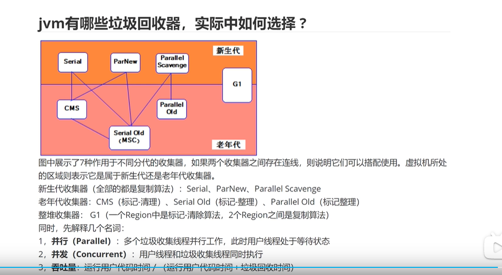
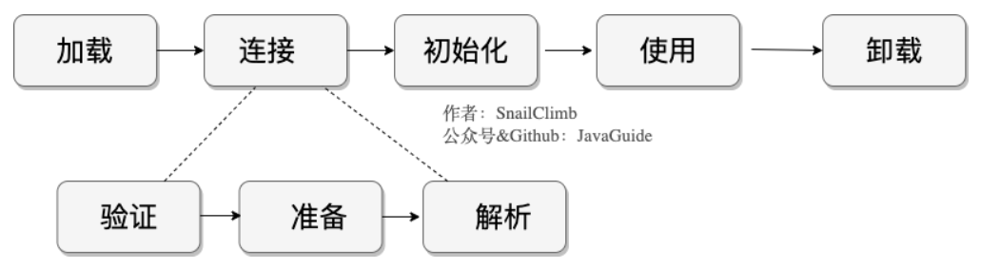
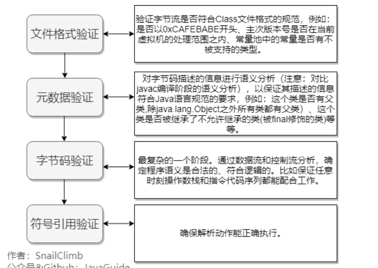
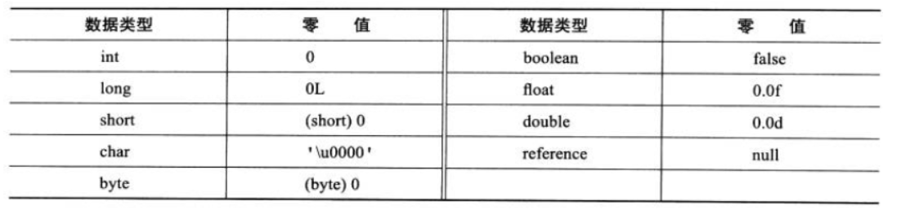

# jvm

### 1、JVM内存结构

#### 1、程序计数器 

较小的内存空间，线程私有。随着线程的创建而创建，销毁而销毁。可以看作是当前线程所执行的字节码的行号指示器。不会出现OutOfMemoryError

- 节码解释器通过改变程序计数器来依次读取指令，从而实现代码的流程控制。
- 在多线程情况下，程序计数器记录的是当前线程执行的位置，从而当线程切换回来时，就知道上次线程执行到哪了。

#### 2、虚拟机栈

描述 Java 方法运行过程的内存模型。

Java 虚拟机栈会为**每一个即将运行的 Java 方法创建一块叫做“栈帧”的区域**，用于存放该方法运行过程中的一些信息，如：

- 局部变量表
- 操作数栈
- 动态链接
- 方法出口信息
- ...

特点：

- 局部变量表随着栈帧的创建而创建，它的**大小在编译时确定**，创建时只需分配事先规定的大小即可。在方法运行过程中，局部变量表的大小不会发生改变。
- Java 虚拟机栈会出现两种异常：StackOverFlowError 和 OutOfMemoryError。
  - StackOverFlowError 若 Java 虚拟机栈的**大小不允许动态扩展，那么当线程请求栈的深度超过当前 Java 虚拟机栈的最大深度时**，抛出 StackOverFlowError 异常。
  - OutOfMemoryError 若允**许动态扩展，那么当线程请求栈时内存用完了，无法再动态扩展时，抛出 OutOfMemoryError** 异常。
- Java 虚拟机栈也**是线程私有，随着线程创建而创建，随着线程的结束而销毁。**

***<u>栈中存放一些基本类型的变量数据（int/short/long/byte/float/double/Boolean/char）和对象引用**</u>*

*<u>**数组引用变量是存放在栈内存中，数组元素是存放在堆内存中。</u>***

#### 3、本地方法栈

为 JVM 运行 Native 方法准备的空间

#### 4、堆

堆是用来存放对象的内存空间，**几乎所有的对象都存储在堆中。**

##### 对象和数组并不是都在堆上分配内存的？

逃逸分析(Escape Analysis)，可以**有效减少**Java 程序中**同步负载和内存堆分配压力**的跨函数全局数据流分析算法。分析出一个新的对象的引用的使用范围从而决定是否要将这个对象分配到堆上。

逃逸分析的基本行为就是分析对象动态作用域：**当一个对象在方法中被定义后，它可能被外部方法所引用，例如作为调用参数传递到其他地方中，称为方法逃逸。**

###### 逃逸分析优化点

一、同步省略。如果一个对象被发现只能从一个线程被访问到，那么**对于这个对象的操作可以不考虑同步**。

二、将**堆分配转化为栈分配**。如果一个对象在子程序中被分配，要使指向该对象的指针永远不会逃逸，对象可能是栈分配的候选，而不是堆分配。

三、**分离对象或标量替换**。有的对象可能不需要作为一个连续的内存结构存在也可以被访问到，那么**对象的部分（或全部）可以不存储在内存，而是存储在CPU寄存器中。**


开启逃逸（-XX:+DoEscapeAnalysis)

-XX:-DoEscapeAnalysis  关闭

jdk 1.7开始已经默认开始逃逸分析，如需关闭，需要指定`-XX:-DoEscapeAnalysis`

###### 结论

不一定，随着JIT编译器的发展，在编译期间，如果JIT经过逃逸分析，发现有些对象没有逃逸出方法，那么有可能**堆内存分配会被优化成栈内存分配**。但是这也并不是绝对的。在开启逃逸分析之后，也并不是所有User对象都没有在堆上分配。


JIT（即时编译）

当JVM发现某个方法或代码块运行特别频繁的时候，就会认为这是“热点代码”（Hot Spot Code)。然后JIT会把部分“热点代码”翻译成本地机器相关的机器码，并进行优化，然后再把翻译后的机器码缓存起来，以备下次使用。


特点：

- 线程共享，整个 Java 虚拟机只有一个堆，所有的线程都访问同一个堆。而程序计数器、Java 虚拟机栈、本地方法栈都是一个线程对应一个。
- 在虚拟机启动时创建。
- 是**垃圾回收的主要场所**。
- 进一步可分为：新生代(Eden 区 From Survior To Survivor)、老年代。

#### 5、方法区

Java 虚拟机规范中定义方法区**是堆的一个逻辑部分**。方法区存放以下信息：

- 已经被虚拟机加载的类信息
- 常量（存放在方法区的**运行时常量池中**）
- 静态变量
- 即时编译器编译后的代码

特点：

- 线程共享。 方法区是堆的一个逻辑部分，因此和堆一样，都是线程共享的。整个虚拟机中只有一个方法区。

- 永久代。 方法区中的信息一般需要长期存在，而且它又是堆的逻辑分区，**因此用堆的划分方法，把方法区称为“永久代”。**（ **方法区和永久代的关系很像 Java 中接口和类的关系，类实现了接口，而永久代就是 HotSpot 虚拟机对虚拟机规范中方法区的一种实现方式。** 也就是说，永久代是 HotSpot 的概念，方法区是 Java 虚拟机规范中的定义，是一种规范，而永久代是一种实现，一个是标准一个是实现，

  JDK1.8 hotspot移除了永久代用元空间(Metaspace)取而代之, 这时候字符串常量池还在堆, 运行时常量池还在方法区, 只不过**方法区的实现从永久代变成了元空间(Metaspace)****）

- 内存回收效率低。 方法区中的信息一般需要长期存在，回收一遍之后可能只有少量信息无效。主要回收目标是：对常量池的回收；对类型的卸载。

- Java 虚拟机规范对方法区的要求比较宽松。 和堆一样，允许固定大小，也允许动态扩展，还允许不实现垃圾回收。

**直接内存**

直接内存是除 Java 虚拟机之外的内存，但也可能被 Java 使用。

在 NIO 中引入了一种基于通道和缓冲的 IO 方式**。它可以通过调用本地方法直接分配 Java 虚拟机之外的内存，然后通过一个存储在堆中的`DirectByteBuffer`对象直接操作该内存，而无须先将外部内存中的数据复制到堆中再进行操作，从而提高了数据操作的效率。**

直接内存的大小不受 Java 虚拟机控制，但既然是内存，当内存不足时就会抛出 OutOfMemoryError 异常。

### 2、HotSpot 虚拟机对象探秘

#### 1、对象创建

1. 类加载检查

   虚拟机在解析`.class`文件时，若遇到一条 new 指令，首先它会去检查常量池中是否有这个类的符号引用，并且检查这个符号引用所代表的类是否已被加载、解析和初始化过。如果没有，那么必须先执行相应的类加载过程。

2. 分配内存

   - **指针碰撞**
     如果 Java **堆中内存绝对规整**（说明采用的是“**复制算法**”或“**标记整理法**”），空闲内存和已使用内存中间放着一个指针作为分界点指示器，那么分配内存时只需要把指针向空闲内存挪动一段与对象大小一样的距离，这种分配方式称为“**指针碰撞**”。
   - **空闲列表**
     如果 Java **堆中内存并不规整**，已使用的内存和空闲内存交错（说明采用的是**标记-清除法**，有碎片），此时没法简单进行指针碰撞， VM 必须维护一个列表，记录其中哪些内存块空闲可用。分配之时从空闲列表中找到一块足够大的内存空间划分给对象实例。这种方式称为“**空闲列表**”。

3. 初始化

   分配完内存后，为对象中的成员变量赋上初始值，设置对象头信息，调用对象的构造函数方法进行初始化。

#### 2、对象访问方式

**所有对象的存储空间都是在堆中分配的，但是这个对象的引用却是在堆栈中分配的**。也就是说在建立一个对象时两个地方都分配内存，在堆中分配的内存实际建立这个对象，而在堆栈中分配的内存只是一个指向这个堆对象的指针（引用）而已。 那么根据引用存放的地址类型的不同，对象有不同的访问方式。

##### 1、句柄访问方式

堆中需要有一块叫做“句柄池”的内存空间，句柄中包含了对象实例数据与类型数据各自的具体地址信息。

引用类型的变量存放的是该对象的句柄地址（reference）。访问对象时，**首先需要通过引用类型的变量找到该对象的句柄，然后根据句柄中对象的地址找到对象。**

##### 2、直接指针访问方式

引用类型的变量直接存放对象的地址，从而不需要句柄池，通过引用能够直接访问对象。但对象所在的内存空间需要额外的策略存储对象所属的类信息的地址。

需要说明的是，HotSpot 采用第二种方式，即直接指针方式来访问对象，只需要一次寻址操作，所以在性能上比句柄访问方式快一倍。但像上面所说，它需要**额外的策略**来存储对象在方法区中类信息的地址。

使用句柄来访问的最大好处是 reference 中存储的是稳定的句柄地址，在对象被移动时只会改变句柄中的实例数据指针，而 reference 本身不需要修改。

#### 3、对象内存布局

**对象头**、**实例数据**和**对齐填充**。

**Hotspot 虚拟机的对象头包括两部分信息**，**第一部分用于存储对象自身的运行时数据**（哈希码、GC 分代年龄、锁状态标志等等），**另一部分是类型指针**，即对象指向它的类元数据的指针，虚拟机通过这个指针来确定这个对象是那个类的实例。

**实例数据部分是对象真正存储的有效信息**，也是在程序中所定义的各种类型的字段内容。

**对齐填充部分不是必然存在的，也没有什么特别的含义，仅仅起占位作用。** 因为 Hotspot 虚拟机的自动内存管理系统要求对象起始地址必须是 8 字节的整数倍，换句话说就是对象的大小必须是 8 字节的整数倍。而对象头部分正好是 8 字节的倍数（1 倍或 2 倍），因此，当对象实例数据部分没有对齐时，就需要通过对齐填充来补全。

### 3、垃圾回收策略和算法

#### 1、判断对象是否存活

若一个对象不被任何对象或变量引用，那么它就是无效对象，需要被回收。

##### 引用计数法

在对象头维护着一个 counter 计数器，对象被引用一次则计数器 +1；若引用失效则计数器 -1。当计数器为 0 时，就认为该对象无效了。

引用计数算法的实现简单，判定效率也很高，在大部分情况下它都是一个不错的算法。但是主流的 Java 虚拟机里没有选用引用计数算法来管理内存，主要是因为它很难解决对象之间循环引用的问题。

> 举个栗子 👉 对象 objA 和 objB 都有字段 instance，令 objA.instance = objB 并且 objB.instance = objA，由于它们互相引用着对方，导致它们的引用计数都不为 0，于是引用计数算法无法通知 GC 收集器回收它们。

##### 可达性分析法

所有和 GC Roots 直接或间接关联的对象都是有效对象，和 GC Roots 没有关联的对象就是无效对象。

GC Roots 是指：

- Java 虚拟机栈（栈帧中的本地变量表）中引用的对象
- 本地方法栈中引用的对象
- 方法区中常量引用的对象
- 方法区中类静态属性引用的对象

GC Roots 并不包括堆中对象所引用的对象，这样就不会有循环引用的问题

#### 2、引用种类

##### 强引用（Strong Reference）

类似于**必不可少的生活用品**，类似 "Object obj = new Object()" 这类的引用，就是强引用，只要强引用存在，垃圾收集器永远不会回收被引用的对象。但是，如果我们**错误地保持了强引用**，比如：赋值给了 static 变量，那么对象在很长一段时间内不会被回收，会产生内存泄漏。

##### 软引用（Soft Reference）

类似于**可有可无的生活用品**，软引用是一种相对强引用弱化一些的引用，可以让对象豁免一些垃圾收集，只有当 JVM 认为内存不足时，才会去试图回收软引用指向的对象。JVM 会确保在抛出 OutOfMemoryError 之前，清理软引用指向的对象。软引用通常用来**实现内存敏感的缓存**，如果还有空闲内存，就可以暂时保留缓存，当内存不足时清理掉，这样就保证了使用缓存的同时，不会耗尽内存。

##### 弱引用（Weak Reference）

弱引用的**强度比软引用更弱**一些。当 JVM 进行垃圾回收时，**无论内存是否充足，都会回收**只被弱引用关联的对象。

##### 虚引用（Phantom Reference）

虚引用也称幽灵引用或者幻影引用，它是**最弱**的一种引用关系。一个对象是否有虚引用的存在，完全不会对其生存时间构成影响。它仅仅是提供了一种确保对象被 finalize 以后，做某些事情的机制，比如，通常用来做所谓的 Post-Mortem 清理机制**。虚引用必须和引用队列（ReferenceQueue）联合使用**

#### 3、判断废弃常量

**只要常量池中的常量不被任何变量或对象引用，那么这些常量就会被清除掉**。比如，一个字符串 "bingo" 进入了常量池，但是当前系统没有任何一个 String 对象引用常量池中的 "bingo" 常量，也没有其它地方引用这个字面量，必要的话，"bingo"常量会被清理出常量池。

#### 4、判断无用类

判定一个类是否是“无用的类”，条件较为苛刻。

- 该类的所有对象都已经被清除
- 加载该类的 ClassLoader 已经被回收
- 该类的 java.lang.Class 对象没有在任何地方被引用，无法在任何地方通过反射访问该类的方法。

> 一个类被虚拟机加载进方法区，那么在堆中就会有一个代表该类的对象：java.lang.Class。这个对象在类被加载进方法区时创建，在方法区该类被删除时清除。

#### 5、垃圾收集算法

##### 1、标记-清除算法

**标记**的过程是：遍历所有的 `GC Roots`，然后将所有 `GC Roots` 可达的对象**标记为存活的对象**。

**清除**的过程将遍历堆中所有的对象，将没有标记的对象全部清除掉。与此同时，清除那些被标记过的对象的标记，以便下次的垃圾回收。

这种方法有两个**不足**：

- 效率问题：标记和清除两个过程的效率都不高。
- 空间问题：标记清除之后会产生大量不连续的内存碎片，碎片太多可能导致以后需要分配较大对象时，无法找到足够的连续内存而不得不提前触发另一次垃圾收集动作。

##### 2、复制算法（新生代）

为了解决效率问题，“复制”收集算法出现了。它将可用内存按容量划分为大小相等的两块，每次只使用其中的一块。当这一块内存用完，需要进行垃圾收集时，就将存活者的对象复制到另一块上面，然后将第一块内存全部清除。这种算法有优有劣：

- 优点：不会有内存碎片的问题。
- 缺点：内存缩小为原来的一半，浪费空间。

为了解决空间利用率问题，可以将内存分为三块： Eden、From Survivor、To Survivor，比例是 8:1:1，每次使用 Eden 和其中一块 Survivor。回收时，将 Eden 和 Survivor 中还存活的对象一次性复制到另外一块 Survivor 空间上，最后清理掉 Eden 和刚才使用的 Survivor 空间。这样只有 10% 的内存被浪费。

但是我们无法保证每次回收都只有不多于 10% 的对象存活，当 Survivor 空间不够，需要依赖其他内存（指老年代）进行分配担保。

###### 分配担保

为对象分配内存空间时，如果 Eden+Survivor 中空闲区域无法装下该对象，会触发 MinorGC 进行垃圾收集。但如果 Minor GC 过后依然有超过 10% 的对象存活，这样存活的对象直接通过分配担保机制进入老年代，然后再将新对象存入 Eden 区。

##### 3、标记-整理算法（老年代）

**标记**：它的第一个阶段与**标记/清除算法**是一模一样的，均是遍历 `GC Roots`，然后将存活的对象标记。

**整理**：移动所有**存活的对象**，**且按照内存地址次序依次排列，然后将末端内存地址以后的内存全部回收。**因此，第二阶段才称为整理阶段。

这是一种老年代的垃圾收集算法。老年代的对象一般寿命比较长，因此每次垃圾回收会有大量对象存活，如果采用复制算法，每次需要复制大量存活的对象，效率很低。

##### 4、分代收集算法

根据对象存活周期的不同，将内存划分为几块。一般是把 Java 堆分为新生代和老年代，针对各个年代的特点采用最适当的收集算法。

- **新生代：复制算法**
- **老年代：标记-清除算法、标记-整理算法**

#### 6、垃圾收集器

##### 1、新生代垃圾收集器

###### 1、Serial 垃圾收集器（单线程）

只开启**一条** GC 线程进行垃圾回收，并且在垃圾收集过程中停止一切用户线程(Stop The World)。

一般客户端应用所需内存较小，不会创建太多对象，而且堆内存不大，因此垃圾收集器回收时间短，即使在这段时间停止一切用户线程，也不会感觉明显卡顿。因此 Serial 垃圾收集器**适合客户端**使用。

由于 Serial 收集器只使用一条 GC 线程，避免了线程切换的开销，从而简单高效。

###### 2、ParNew 垃圾收集器（多线程）

ParNew 是 Serial 的多线程版本。由多条 GC 线程并行地进行垃圾清理。但清理过程依然需要 Stop The World。

ParNew 追求“**低停顿时间**”,与 Serial 唯一区别就是使用了多线程进行垃圾收集，在多 CPU 环境下性能比 Serial 会有一定程度的提升；但**线程切换需要额外的开销**，因此在单 CPU 环境中表现不如 Serial。

###### 3、Parallel Scavenge 垃圾收集器（多线程）

Parallel Scavenge 和 ParNew 一样，都是多线程、新生代垃圾收集器。但是两者有巨大的不同点：

- Parallel Scavenge：**追求 CPU 吞吐量，能够在较短时间内完成指定任务，因此适合没有交互的后台计算**。
- ParNew：追求降低用户停顿时间，适合交互式应用。

吞吐量 = 运行用户代码时间 / (运行用户代码时间 + 垃圾收集时间)

追求高吞吐量，可以通过减少 GC 执行实际工作的时间，然而，仅仅偶尔运行 GC 意味着每当 GC 运行时将有许多工作要做，因为在此期间积累在堆中的对象数量很高。单个 GC 需要花更多的时间来完成，从而导致更高的暂停时间。而考虑到低暂停时间，最好频繁运行 GC 以便更快速完成，反过来又导致吞吐量下降。

- 通过参数 -XX:GCTimeRadio 设置垃圾回收时间占总 CPU 时间的百分比。
- 通过参数 -XX:MaxGCPauseMillis 设置垃圾处理过程最久停顿时间。
- 通过命令 -XX:+UseAdaptiveSizePolicy 开启自适应策略。我们只要设置好堆的大小和 MaxGCPauseMillis 或 GCTimeRadio，收集器会自动调整新生代的大小、Eden 和 Survivor 的比例、对象进入老年代的年龄，以最大程度上接近我们设置的 MaxGCPauseMillis 或 GCTimeRadio。

##### 2、老年代垃圾收集器

###### 1、Serial Old 垃圾收集器（单线程）

Serial Old 收集器是 Serial 的老年代版本，都是单线程收集器，只启用一条 GC 线程，都适合客户端应用。它们唯一的区别就是：**Serial Old 工作在老年代，使用“标记-整理”算法；Serial 工作在新生代，使用“复制”算法。**

###### 2、Parallel Old 垃圾收集器（多线程）

Parallel Old 收集器是 Parallel Scavenge 的老年代版本，追求 CPU 吞吐量。

###### 3、CMS 垃圾收集器

**CMS(Concurrent Mark Sweep，**并发标记清除)收集器是以获取最短回收停顿时间为目标的收集器（追求低停顿），它在垃圾收集时使得用户线程和 GC 线程并发执行，因此在垃圾收集过程中用户也不会感到明显的卡顿。

- 初始标记：Stop The World，仅使用一条初始标记线程对所有与 GC Roots 直接关联的对象进行标记。
- 并发标记：使用**多条**标记线程，与用户线程并发执行。此过程进行可达性分析，标记出所有废弃对象。速度很慢。
- 重新标记：Stop The World，使用多条标记线程并发执行，将刚才并发标记过程中新出现的废弃对象标记出来。
- 并发清除：只使用一条 GC 线程，与用户线程并发执行，清除刚才标记的对象。这个过程非常耗时。

并发标记与并发清除过程耗时最长，且可以与用户线程一起工作，因此，**总体上说**，CMS 收集器的内存回收过程是与用户线程**一起并发执行**的。

CMS 的缺点：

- 吞吐量低
- 无法处理浮动垃圾，导致频繁 Full GC
- 使用“标记-清除”算法产生碎片空间

对于产生碎片空间的问题，可以通过开启 -XX:+UseCMSCompactAtFullCollection，在每次 Full GC 完成后都会进行一次内存压缩整理，将零散在各处的对象整理到一块。设置参数 -XX:CMSFullGCsBeforeCompaction 告诉 CMS，经过了 N 次 Full GC 之后再进行一次内存整理。

##### 3、G1 通用垃圾收集器

G1 是一款面向服务端应用的垃圾收集器，**它没有新生代和老年代的概念，而是将堆划分为一块块独立的 Region（区域）。当要进行垃圾收集时，首先估计每个 Region 中垃圾的数量，每次都从垃圾回收价值最大的 Region 开始回收，因此可以获得最大的回收效率。**

从整体上看， G**1 是基于“标记-整理”算法实现的收集器，从局部（两个 Region 之间）上看是基于“复制”算法实现的**，这意味着运行期间不会产生内存空间碎片。

这里抛个问题 👇
一个对象和它内部所引用的对象可能不在同一个 Region 中，那么当垃圾回收时，是否需要扫描整个堆内存才能完整地进行一次可达性分析？

并不！每个 **Region 都有一个 Remembered Set，用于记录本区域中所有对象引用的对象所在的区域**，进行可达性分析时，只要在 GC Roots 中再加上 Remembered Set 即可防止对整个堆内存进行遍历。

如果不计算维护 Remembered Set 的操作，G1 收集器的工作过程分为以下几个步骤：

- 初始标记：Stop The World，仅使用一条初始标记线程对所有与 GC Roots 直接关联的对象进行标记。
- 并发标记：使用**一条**标记线程与用户线程并发执行。此过程进行可达性分析，速度很慢。
- 最终标记：Stop The World，使用多条标记线程并发执行。
- 筛选回收：回收废弃对象，此时也要 Stop The World，并使用多条筛选回收线程并发执行。



关于gc的选择
除非应用程序有非常严格的暂停时间要求，否则请先运行应用程序并允许VM选择收集器(如果没有特别要求。使用VM提供给的默认GC就好)。
如有必要，调整堆大小以提高性能。 如果性能仍然不能满足目标，请使用以下准则作为选择收集器的起点:

- 如果应用程序的数据集较小(最大约100 MB)，则选择带有选项-XX: + UsSerialGC的串行收集器.
- 如果应用程序将在单个处理器上运行，并且没有暂停时间要求，则选择带有选项-XX: + UseSerialGC的串行收集器。
- 如果(a)峰值应用程序性能是第一要务，并且(b) 没有暂停时间要求或可接受一秒或更长时间的暂停，则让VM选择收集器或使用-XX: + UseParallelGC选择并行收集器。
- 如果响应时间比整体吞吐量更重要，并且垃圾收集暂停时间必须保持在大约一秒钟以内，则选择具有-XX:+UseG1GC。 (值得注意的是]DK9中CMS已经被Deprecated，不可使用! 移除该选项)
- 如果使用的是idk8，并且堆内存达到了16G，那么推荐使用G1收集器，来控制每次垃圾收集的时间。如果响应时间是高优先级，或使用的堆非常大，请使用-XX: UseZGC选择完全并发的收集器。 (值得注意的是JDK11开始可以启动ZGC，但是此时2GC具有实验性质，在]DK15中[202009发布]才取消实验性质的标签可以直接显示启用，但是IDK15默认GC仍然是G1)

总体原则: 减少STOP THE WORD时间，使用并发收集器(比如CMS+ParNew，G1)来减少暂停时间，加快响应
并使用并行收集器来增加多处理器硬件上的总体吞吐量

#### 7、内存分配和回收策略

##### 1、对象优先在 Eden 分配

大多数情况下，对象在新生代 Eden 区中分配。当 Eden 区没有足够空间进行分配时，虚拟机将发起一次 Minor GC。

👇**Minor GC** vs **Major GC**/**Full GC**：

- Minor GC：回收新生代（包括 Eden 和 Survivor 区域），因为 Java 对象大多都具备朝生夕灭的特性，所以 Minor GC 非常频繁，一般回收速度也比较快。
- Major GC / Full GC: 回收老年代，出现了 Major GC，经常会伴随至少一次的 Minor GC，但这并非绝对。Major GC 的速度一般会比 Minor GC 慢 10 倍 以上。

> 在 JVM 规范中，Major GC 和 Full GC 都没有一个正式的定义，所以有人也简单地认为 Major GC 清理老年代，而 Full GC 清理整个内存堆。

##### 2、大对象直接进入老年代

大对象是指需要大量连续内存空间的 Java 对象，如很长的字符串或数据。

一个大对象能够存入 Eden 区的概率比较小，发生分配担保的概率比较大，而分配担保需要涉及大量的复制，就会造成效率低下。

虚拟机提供了一个 -XX:PretenureSizeThreshold 参数，令大于这个设置值的对象直接在老年代分配，这样做的目的是避免在 Eden 区及两个 Survivor 区之间发生大量的内存复制。（还记得吗，新生代采用复制算法回收垃圾）

##### 3、长期存活的对象将进入老年代

JVM 给每个对象定义了一个对象年龄计数器。当新生代发生一次 Minor GC 后，存活下来的对象年龄 +1，当年龄超过一定值时，就将超过该值的所有对象转移到老年代中去。

使用 -XXMaxTenuringThreshold 设置新生代的最大年龄，只要超过该参数的新生代对象都会被转移到老年代中去。

##### 4、动态对象年龄判定

**如果当前新生代的 Survivor 中，相同年龄所有对象大小的总和大于 Survivor 空间的一半，年龄 >= 该年龄的对象就可以直接进入老年代，无须等到 MaxTenuringThreshold 中要求的年龄。**

##### 5、空间分配担保

JDK 6 Update 24 之前的规则是这样的：
在发生 Minor GC 之前，虚拟机会先检查**老年代最大可用的连续空间是否大于新生代所有对象总空间**， 如果这个条件成立，Minor GC 可以确保是安全的； 如果不成立，则虚拟机会查看 HandlePromotionFailure 值是否设置为允许担保失败， 如果是，那么会继续检查老年代最大可用的连续空间是否大于历次晋升到老年代对象的平均大小， 如果大于，将尝试进行一次 Minor GC,尽管这次 Minor GC 是有风险的； 如果小于，或者 HandlePromotionFailure 设置不允许冒险，那此时也要改为进行一次 Full GC。

JDK 6 Update 24 之后的规则变为：
**只要老年代的连续空间大于新生代对象总大小或者历次晋升的平均大小，就会进行 Minor GC，否则将进行 Full GC。**

**通过清除老年代中废弃数据来扩大老年代空闲空间，以便给新生代作担保。**

这个过程就是分配担保。

------

👇 总结一下有哪些情况可能会触发 JVM 进行 Full GC。

1. System.gc() 方法的调用
   此方法的调用是建议 JVM 进行 Full GC，注意这**只是建议而非一定**，但在很多情况下它会触发 Full GC，从而增加 Full GC 的频率。通常情况下我们只需要让虚拟机自己去管理内存即可，我们可以通过 -XX:+ DisableExplicitGC 来禁止调用 System.gc()。
2. 老年代空间不足
   老年代空间不足会触发 Full GC 操作，若进行该操作后空间依然不足，则会抛出如下错误：
   `java.lang.OutOfMemoryError: Java heap space`
3. 永久代空间不足
   JVM 规范中运行时数据区域中的方法区，在 HotSpot 虚拟机中也称为永久代（Permanet Generation），存放一些类信息、常量、静态变量等数据，当系统要加载的类、反射的类和调用的方法较多时，永久代可能会被占满，会触发 Full GC。如果经过 Full GC 仍然回收不了，那么 JVM 会抛出如下错误信息：
   `java.lang.OutOfMemoryError: PermGen space`
4. CMS GC 时出现 promotion failed 和 concurrent mode failure
   promotion failed，就是上文所说的担保失败，而 concurrent mode failure 是在执行 CMS GC 的过程中同时有对象要放入老年代，而此时老年代空间不足造成的。
5. 统计得到的 Minor GC 晋升到旧生代的平均大小大于老年代的剩余空间

#### 8、内存溢出/内存泄漏

###### **内存溢出：**

（out of memory）通俗理解就是**内存不够**，通常在运行大型软件或游戏时，软件或游戏所需要的内存远远超出了你主机内安装的内存所承受大小，就叫内存溢出。

###### **内存泄漏：**

（Memory Leak）是指程序中**己动态分配的堆内存由于某种原因程序未释放或无法释放**，造成系统内存的浪费，导致程序运行速度减慢甚至系统崩溃等严重后果

**场景**

 **1.内存中加载的**数据量过于庞大，如一次从数据库取出过多数据； **

**2.集合类中有对对象的引用，使用完后未清空，使得JVM不能回收；**

3.代码中存在死循环或循环产生过多重复的对象实体； 

4.使用的第三方软件

**解决**

**1、修改JVM启动参数，直接增加内存。(-Xms，-Xmx参数一定不要忘记加。) **

**第二步，检查错误日志，查看“OutOfMemory”错误前是否有其它异常或错误。**

第三步，对代码进行走查和分析，找出可能发生内存溢出的位置。**（

 **1.检查代码中是否有死循环或递归调用。 2.检查是否有大循环重复产生新对象实体。3.检查List、MAP等集合对象是否有使用完后，未清除的问题。List、MAP等集合对象会始终存有对对象的引用，使 得这些对象不能被GC回收**）

###### 内存泄漏实战分析

[分析过程](https://blog.csdn.net/fishinhouse/article/details/80781673)

### 4、类文件结构


##### 1、Class 文件结构

Class 文件是二进制文件，它的内容具有严格的规范，文件中没有任何空格，全都是连续的 0/1。Class 文件 中的所有内容被分为两种类型：无符号数、表。

- 无符号数 无符号数表示 Class 文件中的值，这些值没有任何类型，但有不同的长度。u1、u2、u4、u8 分别代表 1/2/4/8 字节的无符号数。
- 表 由多个无符号数或者其他表作为数据项构成的复合数据类型。

Class 文件具体由以下几个构成:

- 魔数
- 版本信息
- 常量池
- 访问标志
- 类索引、父类索引、接口索引集合
- 字段表集合
- 方法表集合
- 属性表集合

##### 2、魔数

Class 文件的头 4 个字节称为魔数，用来表示这个 Class 文件的类型。

Class 文件的魔数是用 16 进制表示的“CAFE BABE”，是不是很具有浪漫色彩？

> 魔数相当于文件后缀名，只不过后缀名容易被修改，不安全，因此在 Class 文件中标识文件类型比较合适。

##### 3、版本信息

紧接着魔数的 4 个字节是版本信息，5-6 字节表示次版本号，7-8 字节表示主版本号，它们表示当前 Class 文件中使用的是哪个版本的 JDK。

高版本的 JDK 能向下兼容以前版本的 Class 文件，但不能运行以后版本的 Class 文件，即使文件格式并未发生任何变化，虚拟机也必需拒绝执行超过其版本号的 Class 文件。

##### 4、常量池

版本信息之后就是常量池，常量池中存放两种类型的常量：

- 字面值常量

  字面值常量就是我们在程序中定义的字符串、被 final 修饰的值。

- 符号引用

  符号引用就是我们定义的各种名字：类和接口的全限定名、字段的名字和描述符、方法的名字和描述符。

###### 常量池的特点

- 常量池中常量数量不固定，因此常量池开头放置一个 u2 类型的无符号数，用来存储当前常量池的容量。
- 常量池的每一项常量都是一个表，表开始的第一位是一个 u1 类型的标志位（tag），代表当前这个常量属于哪种常量类型。

###### 常量池中常量类型

| 类型                             | tag  | 描述                   |
| -------------------------------- | ---- | ---------------------- |
| CONSTANT_utf8_info               | 1    | UTF-8 编码的字符串     |
| CONSTANT_Integer_info            | 3    | 整型字面量             |
| CONSTANT_Float_info              | 4    | 浮点型字面量           |
| CONSTANT_Long_info               | 5    | 长整型字面量           |
| CONSTANT_Double_info             | 6    | 双精度浮点型字面量     |
| CONSTANT_Class_info              | 7    | 类或接口的符号引用     |
| CONSTANT_String_info             | 8    | 字符串类型字面量       |
| CONSTANT_Fieldref_info           | 9    | 字段的符号引用         |
| CONSTANT_Methodref_info          | 10   | 类中方法的符号引用     |
| CONSTANT_InterfaceMethodref_info | 11   | 接口中方法的符号引用   |
| CONSTANT_NameAndType_info        | 12   | 字段或方法的符号引用   |
| CONSTANT_MethodHandle_info       | 15   | 表示方法句柄           |
| CONSTANT_MethodType_info         | 16   | 标识方法类型           |
| CONSTANT_InvokeDynamic_info      | 18   | 表示一个动态方法调用点 |

对于 CONSTANT_Class_info（此类型的常量代表一个类或者接口的符号引用），它的二维表结构如下：

| 类型 | 名称       | 数量 |
| ---- | ---------- | ---- |
| u1   | tag        | 1    |
| u2   | name_index | 1    |

tag 是标志位，用于区分常量类型；name_index 是一个索引值，它指向常量池中一个 CONSTANT_Utf8_info 类型常量，此常量代表这个类（或接口）的全限定名，这里 name_index 值若为 0x0002，也即是指向了常量池中的第二项常量。

CONSTANT_Utf8_info 型常量的结构如下：

| 类型 | 名称   | 数量   |
| ---- | ------ | ------ |
| u1   | tag    | 1      |
| u2   | length | 1      |
| u1   | bytes  | length |

tag 是当前常量的类型；length 表示这个字符串的长度；bytes 是这个字符串的内容（采用缩略的 UTF8 编码）

##### 5、访问标志

在常量池结束之后，紧接着的两个字节代表访问标志，这个标志用于识别一些类或者接口层次的访问信息，包括：这个 Class 是类还是接口；是否定义为 public 类型；是否被 abstract/final 修饰。

##### 6、类索引、父类索引、接口索引集合

类索引和父类索引都是一个 u2 类型的数据，而接口索引集合是一组 u2 类型的数据的集合，Class 文件中由这三项数据来确定类的继承关系。类索引用于确定这个类的全限定名，父类索引用于确定这个类的父类的全限定名。

由于 Java 不允许多重继承，所以父类索引只有一个，除了 java.lang.Object 之外，所有的 Java 类都有父类，因此除了 java.lang.Object 外，所有 Java 类的父类索引都不为 0。一个类可能实现了多个接口，因此用接口索引集合来描述。这个集合第一项为 u2 类型的数据，表示索引表的容量，接下来就是接口的名字索引。

类索引和父类索引用两个 u2 类型的索引值表示，它们各自指向一个类型为 CONSTANT_Class_info 的类描述符常量，通过该常量总的索引值可以找到定义在 CONSTANT_Utf8_info 类型的常量中的全限定名字符串。

##### 7、字段表集合

字段表集合存储本类涉及到的成员变量，包括实例变量和类变量，但不包括方法中的局部变量。

每一个字段表只表示一个成员变量，本类中的所有成员变量构成了字段表集合。字段表结构如下：

| 类型 | 名称             | 数量             | 说明                                                         |
| ---- | ---------------- | ---------------- | ------------------------------------------------------------ |
| u2   | access_flags     | 1                | 字段的访问标志，与类稍有不同                                 |
| u2   | name_index       | 1                | 字段名字的索引                                               |
| u2   | descriptor_index | 1                | 描述符，用于描述字段的数据类型。 基本数据类型用大写字母表示； 对象类型用“L 对象类型的全限定名”表示。 |
| u2   | attributes_count | 1                | 属性表集合的长度                                             |
| u2   | attributes       | attributes_count | 属性表集合，用于存放属性的额外信息，如属性的值。             |

> 字段表集合中不会出现从父类（或接口）中继承而来的字段，但有可能出现原本 Java 代码中不存在的字段，譬如在内部类中为了保持对外部类的访问性，会自动添加指向外部类实例的字段。

##### 8、方法表集合

方法表结构与属性表类似。

volatile 关键字 和 transient 关键字不能修饰方法，所以方法表的访问标志中没有 ACC_VOLATILE 和 ACC_TRANSIENT 标志。

方法表的属性表集合中有一张 Code 属性表，用于存储当前方法经编译器编译后的字节码指令。

##### 9、属性表集合

每个属性对应一张属性表，属性表的结构如下：

| 类型 | 名称                 | 数量             |
| ---- | -------------------- | ---------------- |
| u2   | attribute_name_index | 1                |
| u4   | attribute_length     | 1                |
| u1   | info                 | attribute_length |

### 5、类加载过程

一个类的完整生命周期如下：



#### 1、加载

类加载过程的第一步，主要完成下面3件事情：

1. 通过全类名获取定义此类的二进制字节流
2. **将字节流所代表的静态存储结构转换为方法区的运行时数据结构**
3. **在内存中生成一个代表该类的 Class 对象,作为方法区这些数据的访问入口**

虚拟机规范多上面这3点并不具体，因此是非常灵活的。比如："通过全类名获取定义此类的二进制字节流" 并没有指明具体从哪里获取、怎样获取。比如：比较常见的就是从 ZIP 包中读取（日后出现的JAR、EAR、WAR格式的基础）、其他文件生成（典型应用就是JSP）等等。

**一个非数组类的加载阶段（加载阶段获取类的二进制字节流的动作）是可控性最强的阶段，这一步我们可以去完成还可以自定义类加载器去控制字节流的获取方式（重写一个类加载器的 `loadClass()` 方法）。数组类型不通过类加载器创建，它由 Java 虚拟机直接创建。**

类加载器、双亲委派模型也是非常重要的知识点，这部分内容会在后面的文章中单独介绍到。

加载阶段和连接阶段的部分内容是交叉进行的，加载阶段尚未结束，连接阶段可能就已经开始了。

#### 2、验证

**验证阶段确保 Class 文件的字节流中包含的信息符合当前虚拟机的要求，并且不会危害虚拟机自身的安全。**



#### 3、准备

**准备阶段是正式为类变量分配内存并设置类变量初始值的阶段****，这些内存都将在方法区中分配。**对于该阶段有以下几点需要注意：

1. 这时候进行内存分配的仅包括类变量（static），而不包括实例变量，实例变量会在对象实例化时随着对象一块分配在 Java 堆中。
2. 这里所设置的初始值"通常情况"下是数据类型默认的零值（如0、0L、null、false等），比如我们定义了`public static int value=111` ，那么 value 变量在准备阶段的初始值就是 0 而不是111（初始化阶段才会赋值）。特殊情况：比如给 value 变量加上了 fianl 关键字`public static final int value=111` ，那么准备阶段 value 的值就被赋值为 111。

**基本数据类型的零值：**



#### 4、解析

**解析阶段是虚拟机将常量池内的符号引用替换为直接引用的过程。**解析动作主要针对类或接口、字段、类方法、接口方法、方法类型、方法句柄和调用限定符7类符号引用进行。**（符号引用比如我现在import java.util.ArrayList这就算符号引用，直接引用就是指针或者对象地址，注意引用对象一定是在内存进行）**

符号引用就是一组符号来描述目标，可以是任何字面量。**直接引用**就是直接指向目标的指针、相对偏移量或一个间接定位到目标的句柄。在程序实际运行时，只有符号引用是不够的，举个例子：在程序执行方法时，系统需要明确知道这个方法所在的位置。Java 虚拟机为每个类都准备了一张方法表来存放类中所有的方法。当需要调用一个类的方法的时候，只要知道这个方法在方发表中的偏移量就可以直接调用该方法了。通过解析操作符号引用就可以直接转变为目标方法在类中方法表的位置，从而使得方法可以被调用。

综上，解析阶段是虚拟机将常量池内的符号引用替换为直接引用的过程，也就是得到类或者字段、方法在内存中的指针或者偏移量。

#### 5、初始化

初始化是类加载的最后一步，也是真正执行类中定义的 Java 程序代码(字节码)，初始化阶段是执行初始化方法 `<clinit> ()`方法的过程。

对于`<clinit>（）` 方法的调用，虚拟机会自己确保其在多线程环境中的安全性。因为 `<clinit>（）` 方法是带锁线程安全，所以在多线程环境下进行类初始化的话可能会引起死锁，并且这种死锁很难被发现。

对于初始化阶段，虚拟机严格规范了有且只有5种情况下，必须对类进行初始化(只有主动去使用类才会初始化类)：

1. 当遇到 new 、 getstatic、putstatic或invokestatic 这4条直接码指令时，比如 new 一个类，读取一个静态字段(未被 final 修饰)、或调用一个类的静态方法时。
   - 当jvm执行new指令时会初始化类。即当程序创建一个类的实例对象。
   - 当jvm执行getstatic指令时会初始化类。即程序访问类的静态变量(不是静态常量，常量会被加载到运行时常量池)。
   - 当jvm执行putstatic指令时会初始化类。即程序给类的静态变量赋值。
   - 当jvm执行invokestatic指令时会初始化类。即程序调用类的静态方法。
2. 使用 `java.lang.reflect` 包的方法对类进行反射调用时如Class.forname("..."),newInstance()等等。 ，如果类没初始化，需要触发其初始化。
3. 初始化一个类，如果其父类还未初始化，则先触发该父类的初始化。
4. 当虚拟机启动时，用户需要定义一个要执行的主类 (包含 main 方法的那个类)，虚拟机会先初始化这个类。
5. MethodHandle和VarHandle可以看作是轻量级的反射调用机制，而要想使用这2个调用， 就必须先使用findStaticVarHandle来初始化要调用的类。
6. 当一个接口中定义了JDK8新加入的默认方法（被default关键字修饰的接口方法）时，如果有这个接口的实现类发生了初始化，那该接口要在其之前被初始化。

#### 6、卸载

**卸载类即该类的Class对象被GC。**

卸载类需要满足3个要求:

1. 该类的所有的实例对象都已被GC，也就是说堆不存在该类的实例对象。
2. 该类没有在其他任何地方被引用
3. 该类的类加载器的实例已被GC

所以，在JVM生命周期类，由jvm自带的类加载器加载的类是不会被卸载的。但是由我们自定义的类加载器加载的类是可能被卸载的。

只要想通一点就好了，jdk自带的BootstrapClassLoader,PlatformClassLoader,AppClassLoader负责加载jdk提供的类，所以它们(类加载器的实例)肯定不会被回收。而我们自定义的类加载器的实例是可以被回收的，所以使用我们自定义加载器加载的类是可以被卸载掉的。

### 6、类加载器

- **启动类加载器（Bootstrap ClassLoader）**： 负责将存放在 `<JAVA_HOME>\lib` 目录中的，并且能被虚拟机识别的（仅按照文件名识别，如 rt.jar，名字不符合的类库即使放在 lib 目录中也不会被加载）类库加载到虚拟机内存中。
- **扩展类加载器（Extension ClassLoader**）： 负责加载 `<JAVA_HOME>\lib\ext` 目录中的所有类库，开发者可以直接使用扩展类加载器。
- **应用程序类加载器（Application ClassLoader）**： 由于这个类加载器是 ClassLoader 中的 getSystemClassLoader() 方法的返回值，所以一般也称它为“系统类加载器”。**它负责加载用户类路径（classpath）上所指定的类库，**开发者可以直接使用这个类加载器，如果应用程序中没有自定义过自己的类加载器，一般情况下这个就是程序中默认的类加载器。

### 7、双亲委派模型

#### 1、什么是双亲委派模型

**双亲委派模型是描述类加载器之间的层次关系**。它要求除了顶层的启动类加载器外，其余的类加载器都应当有自己的父类加载器。（父子关系一般不会以继承的关系实现，而是以组合关系来复用父加载器的代码）

#### 2、工作过程

如果一个类加载器收到了类加载的请求，它首先不会自己去尝试加载这个类，而是**把这个请求委派给父类加载器去完成**，每一个层次的类加载器都是如此，因此所有的加载请求最终都应该传送到顶层的启动类加载器中，**只有当父加载器反馈自己无法完成这个加载请求（找不到所需的类）时，子加载器才会尝试自己去加载。**

在 java.lang.ClassLoader 中的 loadClass() 方法中实现该过程。

#### 3、为什么使用双亲委派模型

像 java.lang.Object 这些存放在 rt.jar 中的类，无论使用哪个类加载器加载，最终都会委派给最顶端的启动类加载器加载，从而使得不同加载器加载的 Object 类都是同一个。

相反，如果没有使用双亲委派模型，**由各个类加载器自行去加载的话，如果用户自己编写了一个称为 java.lang.Object 的类，并放在 classpath 下，那么系统将会出现多个不同的 Object 类，Java 类型体系中最基础的行为也就无法保证。**

#### 4、如何打破双亲委派模型

1、自定义类加载器加载一个类需要：继承ClassLoader，==重写findClass==，如果不想打破双亲委派模型，那么只需要重写findClass；如果==想打破双亲委派模型，那么就重写整个loadClass方法==，设定自己的类加载逻辑**

2、==使用线程上下文类加载器==  **Java应用的线程上下文类加载器默认就是系统类加载器****SPI 接口的代码中使用线程上下文类加载器，就可以成功的加载到 SPI 实现的类**

### 8、jvm性能调优

#### jvm参数

| 堆初始大小       | -Xms                                                       |
| ---------------- | ---------------------------------------------------------- |
| 堆最大大小       | -Xmx 或-XXMaxHeapSize=size                                 |
| 新生代大小       | -Xmn 或(-XNewSize=size + -XX MaxNewSize=size )             |
| 幸存区比例(动志) | -XXInitiallSurvivorRatio=ratio 和-XX+UseAdaptiveSizePolicy |
| 幸存区比例       | -xx:SurvivorRatio=ratio                                    |
| 晋升闽值         | -Xx:MaxTenuringThreshold=threshold                         |
| 晋升详情         | -XX+PrintTenuringDistribution                              |
| GC详情           | -XX+PrintGCDetails -verbose:gc                             |
| FullGC前 MinorGC | -XX+ScavengeBeforeFullGC                                   |

[参考](https://blog.csdn.net/weixin_42447959/article/details/81637909)

#### 1、目标

使用较小的内存占用来获得较高的吞吐量或者较低的延迟。

- 内存占用：程序正常运行需要的内存大小。
- 延迟：由于垃圾收集而引起的程序停顿时间。
- 吞吐量：用户程序运行时间占用户程序和垃圾收集占用总时间的比值。

#### 2、问题

cpu load过高、请求延迟、tps降低等，甚至出现内存泄漏（每次垃圾收集使用的时间越来越长，垃圾收集频率越来越高，每次垃圾收集清理掉的垃圾数据越来越少）、内存溢出导致系统崩溃

#### 3、调优工具

##### 1、日志数据等分析

参考的数据有**系统运行日志**、**堆栈错误信息**、**gc日志**、**线程快照**、**堆转储快照**等。

###### ①系统运行日志：

系统运行日志就是在程序代码中打印出的日志，描述了代码级别的系统运行轨迹（执行的方法、入参、返回值等），一般系统出现问题，系统运行日志是首先要查看的日志。

###### ②堆栈错误信息：

当系统出现异常后，可以根据堆栈信息初步定位问题所在，比如根据“java.lang.OutOfMemoryError: Java heap space”可以判断是堆内存溢出；根据“java.lang.StackOverflowError”可以判断是栈溢出；根据“java.lang.OutOfMemoryError: PermGen space”可以判断是方法区溢出等。

###### ③GC日志：

程序启动时用 **-XX:+PrintGCDetails** 和 **-Xloggc:/data/jvm/gc.log** 可以在程序运行时把gc的详细过程记录下来，或者直接配置“**-verbose:gc**”参数把gc日志打印到控制台，通过记录的gc日志可以分析每块内存区域gc的频率、时间等，从而发现问题，进行有针对性的优化。

 ```shell
2018-08-02T14:39:11.560-0800: 10.171: [GC [PSYoungGen: 30128K->4091K(30208K)] 51092K->50790K(98816K), 0.0140970 secs] [Times: user=0.02 sys=0.03, real=0.01 secs] 
2018-08-02T14:39:11.574-0800: 10.185: [Full GC [PSYoungGen: 4091K->0K(30208K)] [ParOldGen: 46698K->50669K(68608K)] 50790K->50669K(98816K) [PSPermGen: 2635K->2634K(21504K)], 0.0160030 secs] [Times: user=0.03 sys=0.00, real=0.02 secs] 
2018-08-02T14:39:14.045-0800: 12.656: [GC [PSYoungGen: 14097K->4064K(30208K)] 64766K->64536K(98816K), 0.0117690 secs] [Times: user=0.02 sys=0.01, real=0.01 secs] 
2018-08-02T14:39:14.057-0800: 12.668: [Full GC [PSYoungGen: 4064K->0K(30208K)] [ParOldGen: 60471K->401K(68608K)] 64536K->401K(98816K) [PSPermGen: 2634K->2634K(21504K)], 0.0102020 secs] [Times: user=0.01 sys=0.00, real=0.01 secs]

 ```

“2018-08-02T14:39:11.560-0800”是精确到了毫秒级别的UTC 通用标准时间格式，配置了“-XX:+PrintGCDateStamps”这个参数可以跟随gc日志打印出这种时间戳.

“10.171”是从JVM启动到发生gc经过的秒数。

第一行日志正文开头的“[GC”说明这次GC没有发生Stop-The-World（用户线程停顿），第二行日志正文开头的“[Full GC”说明这次GC发生了Stop-The-World，所以说，[GC和[Full GC跟新生代和老年代没关系，和垃圾收集器的类型有关系，如果直接调用System.gc()，将显示[Full GC(System)。

接下来的“[PSYoungGen”、“[ParOldGen”表示GC发生的区域，具体显示什么名字也跟垃圾收集器有关，比如这里的“[PSYoungGen”表示Parallel Scavenge收集器，“[ParOldGen”表示Serial Old收集器，此外，Serial收集器显示“[DefNew”，ParNew收集器显示“[ParNew”等。

再往后的“30128K->4091K(30208K)”表示进行了这次gc后，该区域的内存使用空间由30128K减小到4091K，总内存大小为30208K。

每个区域gc描述后面的“51092K->50790K(98816K), 0.0140970 secs”进行了这次垃圾收集后，整个堆内存的内存使用空间由51092K减小到50790K，整个堆内存总空间为98816K，gc耗时0.0140970秒。

###### ④线程快照：

顾名思义，根据线程快照可以看到线程在某一时刻的状态，<u>当系统中可能存在请求超时、死循环、死锁等情况是，可以根据线程快照来进一步确定问题</u>。通过执行虚拟机自带的“**jstack pid**”命令，可以dump出当前进程中线程的快照信息，更详细的使用和分析网上有很多例，这篇文章写到这里已经很长了就不过多叙述了，贴一篇博客供参考：http://www.cnblogs.com/kongzhongqijing/articles/3630264.html

###### ⑤堆转储快照：

程序启动时可以使用 “**-XX:+HeapDumpOnOutOfMemory**” 和 “**-XX:HeapDumpPath=/data/jvm/dumpfile.hprof**”，当程序发生内存溢出时，把当时的内存快照以文件形式进行转储（也可以直接用**jma**p命令转储程序运行时任意时刻的内存快照），事后对当时的内存使用情况进行分析。

##### 2、调优工具

###### 1、jps(jvm process status)

查看虚拟机启动的所有**进程、执行主类的全名、JVM启动参数**，比如当执行了JPSTest类中的main方法后（**main方法持续执行**），执行 **jps -l**可看到下面的JPSTest类的pid为31354，加上**-v参数**还可以看到JVM启动参数

```powershell
3265 
32914 sun.tools.jps.Jps
31353 org.jetbrains.jps.cmdline.Launcher
31354 com.danny.test.code.jvm.JPSTest
380
```

###### 2、jstat（JVM Statistics Monitoring Tool）

**监视虚拟机信息** 

jstat -gc pid 500 10 ：**每500毫秒**打印一次Java堆状况（各个区的**容量、使用容量、gc时间**等信息），**打印10次**

```shell
[admin@bak-RiskQuota ~]$ jstat -gc 106768  500 10
 S0C    S1C    S0U    S1U      EC       EU        OC         OU       MC     MU    CCSC   CCSU   YGC     YGCT    FGC    FGCT     GCT   
14848.0 32256.0 14482.8  0.0   1138176.0 257035.2  374272.0   270407.8  141720.0 138523.5 17328.0 16674.8    184    4.585   4      1.493    6.078
14848.0 32256.0 14482.8  0.0   1138176.0 257035.2  374272.0   270407.8  141720.0 138523.5 17328.0 16674.8    184    4.585   4      1.493    6.078
14848.0 32256.0 14482.8  0.0   1138176.0 257035.2  374272.0   270407.8  141720.0 138523.5 17328.0 16674.8    184    4.585   4      1.493    6.078
14848.0 32256.0 14482.8  0.0   1138176.0 257035.2  374272.0   270407.8  141720.0 138523.5 17328.0 16674.8    184    4.585   4      1.493    6.078
14848.0 32256.0 14482.8  0.0   1138176.0 257035.2  374272.0   270407.8  141720.0 138523.5 17328.0 16674.8    184    4.585   4      1.493    6.078
14848.0 32256.0 14482.8  0.0   1138176.0 257035.2  374272.0   270407.8  141720.0 138523.5 17328.0 16674.8    184    4.585   4      1.493    6.078
14848.0 32256.0 14482.8  0.0   1138176.0 257035.2  374272.0   270407.8  141720.0 138523.5 17328.0 16674.8    184    4.585   4      1.493    6.078
14848.0 32256.0 14482.8  0.0   1138176.0 257035.2  374272.0   270407.8  141720.0 138523.5 17328.0 16674.8    184    4.585   4      1.493    6.078
14848.0 32256.0 14482.8  0.0   1138176.0 257035.2  374272.0   270407.8  141720.0 138523.5 17328.0 16674.8    184    4.585   4      1.493    6.078
14848.0 32256.0 14482.8  0.0   1138176.0 257035.2  374272.0   270407.8  141720.0 138523.5 17328.0 16674.8    184    4.585   4      1.493    6.078

```

###### 3、jmap（Memory Map for Java）

**查看堆内存信息** 

执行**jmap -histo pid**可以打印出当前堆中所有每个类的实例数量和内存占用，如下，class name是每个类的类名（[B是byte类型，[C是char类型，[I是int类型），bytes是这个类的所有示例占用内存大小，instances是这个类的实例数量

```shell
num     #instances         #bytes  class name
----------------------------------------------
  1:          2291       29274080  [B
  2:         15252        1961040  <methodKlass>
  3:         15252        1871400  <constMethodKlass>
  4:         18038         721520  java.util.TreeMap$Entry
  5:          6182         530088  [C
  6:         11391         273384  java.lang.Long
  7:          5576         267648  java.util.TreeMap
  8:            50         155872  [I
  9:          6124         146976  java.lang.String
 10:          3330         133200  java.util.LinkedHashMap$Entry
 11:          5544         133056  javax.management.openmbean.CompositeDataSupport
```

 **jmap -dump:format=b,file=/data/jvm/dumpfile_jmap.hprof 3361** 可以把当前堆内存的快照转储到dumpfile_jmap.hprof文件中，然后可以对内存快照进行分析   **idea 使用jprofier 导入分析**  eclipse 用mat分析 或者 jvisualvm 也可以

###### 4、jconsole、jvisualvm

jconsole、jvisualvm分析内存信息(各个区如Eden、Survivor、Old等内存变化情况)，如果查看的是远程服务器的JVM，程序启动需要加上如下参数

```shell
"-Dcom.sun.management.jmxremote=true" 
"-Djava.rmi.server.hostname=12.34.56.78" 
"-Dcom.sun.management.jmxremote.port=18181" 
"-Dcom.sun.management.jmxremote.authenticate=false" 
"-Dcom.sun.management.jmxremote.ssl=false"
```

可以观测堆内存使用量、线程数、类加载数和CPU占用率

###### 5、分析堆转储快照

jhat（JVM Heap Analysis Tool） 命令来分析内存快照，它的本质实际上内嵌了一个微型的服务器

 jhat -port 9810 -J-Xmx4G /data/jvm/dumpfile_jmap.hprof 表示以9810端口启动 jhat 内嵌的服务器

```shell
Reading from /Users/dannyhoo/data/jvm/dumpfile_jmap.hprof...
Dump file created Fri Aug 03 15:48:27 CST 2018
Snapshot read, resolving...
Resolving 276472 objects...
Chasing references, expect 55 dots.......................................................
Eliminating duplicate references.......................................................
Snapshot resolved.
Started HTTP server on port 9810
Server is ready.
```

http://127.0.0.1:9810/ 可以看到对快照中的每个类进行分析的结果

##### 3、调优经验

- -Xms和-Xmx的值设置成相等，堆大小默认为-Xms指定的大小，默认空闲堆内存小于40%时，JVM会扩大堆到-Xmx指定的大小；空闲堆内存大于70%时，JVM会减小堆到-Xms指定的大小。如果在Full GC后满足不了内存需求会动态调整，这个阶段比较耗费资源。
- **新生代尽量设置大一些**，让对象在新生代多存活一段时间，每次Minor GC 都要尽可能多的收集垃圾对象，防止或延迟对象进入老年代的机会，以减少应用程序发生Full GC的频率。
- **老年代如果使用CMS收集器，新生代可以不用太**大，因为CMS的并行收集速度也很快，收集过程比较耗时的并发标记和并发清除阶段都可以与用户线程并发执行。
- 方法区大小的设置，1.6之前的需要考虑系统运行时动态增加的常量、静态变量等，1.7只要差不多能装下启动时和后期动态加载的类信息就行。
- **避免创建过大的对象及数组**：过大的对象或数组在新生代没有足够空间容纳时会直接进入老年代，如果是短命的大对象，会提前出发Full GC。
- **避免同时加载大量数据**，如一次从数据库中取出大量数据，或者一次从Excel中读取大量记录，可以分批读取，用完尽快清空引用。
- 当集合中有对象的引用，这些**对象使用完之后要尽快把集合中的引用清空**，这些无用对象尽快回收避免进入老年代。
- 可以在合适的场景（如实现缓存）采用软引用、弱引用，比如用软引用来为ObjectA分配实例：SoftReference objectA=new SoftReference(); 在发生内存溢出前，会将objectA列入回收范围进行二次回收，如果这次回收还没有足够内存，才会抛出内存溢出的异常。 
  避免产生死循环，产生死循环后，循环体内可能重复产生大量实例，导致内存空间被迅速占满。
- 尽量**避免长时间等待外部资源（数据库、网络、设备资源等）的情况**，缩小对象的生命周期，避免进入老年代，如果不能及时返回结果可以适当采用异步处理的方式等。

##### 4、jvm参数参考

| 参数                    | 说明                                                         | 实例                     |
| :---------------------- | :----------------------------------------------------------- | :----------------------- |
| -Xms                    | 初始堆大小，默认物理内存的1/64                               | -Xms512M                 |
| -Xmx                    | 最大堆大小，默认物理内存的1/4                                | -Xms2G                   |
| -Xmn                    | 新生代内存大小，官方推荐为整个堆的3/8                        | -Xmn512M                 |
| -Xss                    | 线程堆栈大小，jdk1.5及之后默认1M，之前默认256k               | -Xss512k                 |
| -XX:NewRatio=n          | 设置新生代和年老代的比值。如:为3，表示年轻代与年老代比值为1：3，年轻代占整个年轻代年老代和的1/4 | -XX:NewRatio=3           |
| -XX:SurvivorRatio=n     | 年轻代中Eden区与两个Survivor区的比值。注意Survivor区有两个。如:8，表示Eden：Survivor=8:1:1，一个Survivor区占整个年轻代的1/8 | -XX:SurvivorRatio=8      |
| -XX:PermSize=n          | 永久代初始值，默认为物理内存的1/64                           | -XX:PermSize=128M        |
| -XX:MaxPermSize=n       | 永久代最大值，默认为物理内存的1/4                            | -XX:MaxPermSize=256M     |
| -verbose:class          | 在控制台打印类加载信息                                       |                          |
| -verbose:gc             | 在控制台打印垃圾回收日志                                     |                          |
| -XX:+PrintGC            | 打印GC日志，内容简单                                         |                          |
| -XX:+PrintGCDetails     | 打印GC日志，内容详细                                         |                          |
| -XX:+PrintGCDateStamps  | 在GC日志中添加时间戳                                         |                          |
| -Xloggc:filename        | 指定gc日志路径                                               | -Xloggc:/data/jvm/gc.log |
| -XX:+UseSerialGC        | 年轻代设置串行收集器Serial                                   |                          |
| -XX:+UseParallelGC      | 年轻代设置并行收集器Parallel Scavenge                        |                          |
| -XX:ParallelGCThreads=n | 设置Parallel Scavenge收集时使用的CPU数。并行收集线程数。     | -XX:ParallelGCThreads=4  |
| -XX:MaxGCPauseMillis=n  | 设置Parallel Scavenge回收的最大时间(毫秒)                    | -XX:MaxGCPauseMillis=100 |
| -XX:GCTimeRatio=n       | 设置Parallel Scavenge垃圾回收时间占程序运行时间的百分比。公式为1/(1+n) | -XX:GCTimeRatio=19       |
| -XX:+UseParallelOldGC   | 设置老年代为并行收集器ParallelOld收集器                      |                          |
| -XX:+UseConcMarkSweepGC | 设置老年代并发收集器CMS                                      |                          |
| -XX:+CMSIncrementalMode | 设置CMS收集器为增量模式，适用于单CPU情况。                   |                          |

##### 5、jvm调优案例

JVM服务问题排查 https://blog.csdn.net/jacin1/article/details/44837595

次让人难以忘怀的排查频繁Full GC过程 http://caogen81.iteye.com/blog/1513345

线上FullGC频繁的排查 https://blog.csdn.net/wilsonpeng3/article/details/70064336/

【JVM】线上应用故障排查 https://www.cnblogs.com/Dhouse/p/7839810.html

一次JVM中FullGC问题排查过程 http://iamzhongyong.iteye.com/blog/1830265

JVM内存溢出导致的CPU过高问题排查案例 https://blog.csdn.net/nielinqi520/article/details/78455614

一个java内存泄漏的排查案例 https://blog.csdn.net/aasgis6u/article/details/54928744

***linux排查java程序CPU占用过高问题。***

```shell
top # 查看系统资源占用情况   shift + h 会排序 可以看到高占用的进程  ->获取进程ID
```

```shell
ps -mp pid -o THREAD,tid,time # 显示 该进程的线程信息 tid线程ID time线程已运行时间  ->获取具体cpu占用高的线程ID -m显示所有线程 -p pid 进程使用cpu的时间 -o自定义显示格式
```

```shell
printf “%x\n” number # 转换线程ID 为16进制  方便在 jstack中查找  ->获取16进制  如3ec7
```

```shell
jstack -pid|grep 3ec7 # 根据 进程ID 以及线程ID的16进制数据   查看进程堆栈信息，定位到具体执行类以及方法
```

# 提问


### 3、堆中存放？

> 对象实例
>
> **字符串常量池**  串池  存储的是string对象的直接引用，而不是直接存放的对象
>
> **静态变量**  static修饰的变量
>
> **线程分配缓冲区**  线程需要创建对象，JVM就会优先在该线程的TLAB上进行分配 避免多线程下加锁，提升对象分配时的效率

### 4、常量池、运行时常量池？

> 运行时常量池   **方法区**中   加载类和接口到虚拟机后，就会创建对应的运行时常量池   **符号引用解析为直接地址**
> 常量池  **字节码文件内部**    包含**字面量**（数量值和字符串值）和**类型**(class interface enum等)、**域**(理解为全局变量Field)和**方法**(method)的**符号引用**

### 5、直接内存

> 基于NIO操作，避免java堆和native堆来回复制数据的考虑
>
> 堆外内存的申请主要是通过unsafe 分配  或者回收 freeMemory  内存
>
> ByteBuffer构建的时候，使用**Cleaner（虚引用）来检测 ByteBuffer** 。一旦ByteBuffer 被垃圾回收，这个对象放入到引用队列（ ReferenceQueue ）， JVM中会有一个优先级很低的线程( ReferenceHandler)会去将该队列中的 虚引用对象 取出来，然后调 clean（） 方法 内部还是 freeMemory 来释放内存

### 6、非堆内存？

> MetaSpace
> CodeCache **本地代码缓存池**    JVM会将[字节码](https://so.csdn.net/so/search?q=字节码&spm=1001.2101.3001.7020)编译为本地机器码，并使用 Code Cache 来保存。 JIT 即时编译器 使用
> Compressed Class Space  是一种用来减少JVM内存占用的技术。它的作用是将类元数据信息(例如类名、访问修饰符等)进行压缩，从而减少类加载器所需的内存空间。

### 7、为什么元空间代替永久代？

> 永久代**设置最大空间大小是难以确定**，动态加载类过多，容易产生Perm区的OOM

### 8、成员变量、局部变量、类变量分别存储在内存的什么地方？

> 局部变量  == 方法中的变量 **存放在虚拟机栈**
>
> 成员变量  == 类中，没有static修饰  **堆中**
>
> 类变量 **堆中**

### 9、类常量池、运行时常量池、字符串常量池有什么关系？有什么区别？

> 类常量池与运行时常量池都存储在**方法区**     类常量池 存储字面量和符号引用    运行时常量池 就是直接引用
>
> 字符串常量池   串池 **堆中**
>
> **字面量一部分是文本字符，就是来源于串池中的直接引用。**

### 10、深拷贝和浅拷贝

> 都是新增了指针，区别在于是否开辟新的内存空间。

### 11、说一下堆栈的区别？

> 堆：址分配对对象是不连续的 **性能差**   运行期 确认空间，**大小不固定 **    **关注数据的存储**        **对于整个应用共享**
>
> 栈：物理地址分配是连续的。所以**性能快**    编译期 就确认，**大小是固定的 ** **关注程序方法的执行 **  **线程私有**

### 12、Java  中提供的几种对象创建方式

> 使用**new关键字**   调用了构造函数
> 使用**Class的newInstance**方法   调用了构造函数
> 使用Constructor类的newInstance方法    调用了构造函数
> 使用**clone方法**     没有调用构造函数
> 使用**反序列化**    没有调用构造函数

### 13、为对象分配内存的方式

> 指针碰撞：如果Java堆的**内存是规整**，即所有**用过的内存放在一边，而空闲的的放在另一边**。分配内存时**将位于中间的指针指示器向空闲的内存移动一段与对象大小相等的距离**，这样便完成分配内存工作。
> 空闲列表：如果Java堆的内存**不是规整的**，则需要由**虚拟机维护一个列表来记录那些内存是可用的**，这样在分配的时候可以**从列表中查询到足够大的内存分配给对象**，并在分配后更新列表记录。

### 14、对象创建处理并发安全问题？

> 对**分配内存空间的动作进行同步处理**（采用 CAS + 失败重试来保障更新操作的原子性）；
> **每个线程在 Java 堆中预先分配一小块内存**，称为**本地线程分配缓冲**（Thread Local Allocation Buffer, TLAB）。**隔离操作**

### 15、对象头

> 存储对象自身的运行时数据**（哈希码、GC 分代年龄、锁状态标志等等），**
>
> **类型指针**，即对象指向它的类元数据的指针，虚拟机**通过这个指针来确定这个对象是那个类的实例**。

### 16、对象访问方式

> 句柄访问方式   包含了**对象实例数据**与**类型数据**各自的具体地址信息。
>
> 引用类型的变量存放的是该对象的句柄地址（reference）。访问对象时，**首先需要通过引用类型的变量找到该对象的句柄，然后根据句柄中对象的地址找到对象。**
>
> 直接指针访问方式  引用类型的变量**直接存放对象的地址**，从而不需要句柄池，通过引用能够直接访问对象

### 17、强引用、软引用、弱引用、虚引用的区别？

> 强引用  平时**new了一个对象**就是强引用 **即使在内存不足的情况下**，JVM宁愿抛出OutOfMemory错误也**不会回收这种对象**。
>
> 软引用  **内存空间不足了，就会回收这些对象的内存**
>
> `强 软 在caffeine中使用了`
>
> 弱引用  **不管当前内存空间足够与否，都会回收它的内存**   WeakReference<String> abcWeakRef = new WeakReference<String>(str); 等价于  str = null 
>
> `ThreadLocalMap使用了弱引用`
>
> 虚引用  如果一个对象仅持有虚引用，那么它**就和没有任何引用一样**，在任何时候都可能被垃圾回收器回收。虚引用主要**用来跟踪对象被垃圾回收器回收的活动 **虚引用必须和引用队列（ReferenceQueue）联合使用  `JDK 的 堆外内存使用了虚引用 ` 

### 18、如何判断对象是否可以被回收？

> 引用计数器法：为每个对象创建一个引用计数，有对象引用时计数器 +1，引用被释放时计数 -1，当计数器为 0 时就可以被回收。它有一个缺点**不能解决循环引用**的问题；
> 可达性分析算法：从 GC Roots 开始向下搜索，搜索所走过的路径称为引用链，GCROOTS不可达时，证明可以回收。

### 19、JVM 运行时堆内存如何分代?

> 默认  新生代 ( Young ) = 1/3 的堆空间大小。老年代 ( Old ) = 2/3 的堆空间大小  以通过参数 **–XX:NewRatio**
>
> 默认 Eden: from : to = 8 :1 : 1 ( 可以通过参数**–XX:SurvivorRatio** 来设定 )，即： Eden = 8/10 的新生代空间大小，from = to = 1/10 的新生代空间大小
>
> JVM `每次只会使用 Eden 和其中的一块 Survivor 区域来为对象服务`，所以无论什么时候，总是有一块Survivor区域是空闲着的
>
> **Eden 区**：Java 新对象的出生地 ，  新创建的对象占用内存很大，则直接分配到老年代
>
> **Servivor from 区**：上一次 GC 的幸存者，作为这一次 GC 的被扫描者
>
> **Servivor to 区**： 保留了一次 MinorGC 过程中的幸存者。
>
> `MinorGC 的过程（复制->清空->互换）`
>
> ​    1.eden、 servicorFrom 复制到 ServicorTo，年龄+1 
> ​       首先，**把 Eden 和 ServivorFrom 区域中存活的对象复制到 ServicorTo 区域**（如果有对象的年龄以及达到了老年的标准，则赋值到老年代区），同时把这些对象的年龄+1（如果 ServicorTo 不够位置了就放到老年区）；  晋升阈值  可以通过 -XX:**+MaxTenuringThreshold**调整
>
> 2. 清空 eden、 servicorFrom 
>    然后，**清空 Eden 和 ServicorFrom 中的对象**；
> 3. ServicorTo 和 ServicorFrom 互换 
>    最后， **ServicorTo 和 ServicorFrom 互换**，原 ServicorTo 成为下一次 GC 时的 ServicorFrom区

### 20、一次完整的GC流程是怎样的，对象如何晋升到老年代？分代收集？

> 1、首先Eden 区，满了， 触发一次 Minor GC 存活下来的对象，则会转移到 Survivor**区**
>
> 2、**大对象**（需要**大量连续内存空间的Java对象**，如那种很长的字符串）**直接进入老年代**
>
> 3、Survivor中长期存活的对象进入老年代(年龄超过一定限制（15))
>
> 4、老年代满了而无法容纳更多的对象，Minor GC 之后通常就会进行Full GC，Full GC 清理整个内存堆 – 包括年轻代和年老代。

### 21、什么是分代，分代的必要性？

> 提高对象内存分配和垃圾回收的效率。
>
> **新生代中的对象存活时间短**，只需要在新生代区域中**频繁 GC**，**老年代中对象生命周期长**，内存**回收频率相对较低**，不需要频繁进行回收，
> **永久代（或者元空间）**中回收效果太差，**一般不进行垃圾回收**，
>
> 还可以根据不同年代的特点采用合适的垃圾收集算法

### 22、垃圾回收算法

> **标记-清除**算法：标记无用对象，然后进行清除回收。缺点：效率不高，无法清除垃圾碎片。
> **复制算法**：**按照容量划分二个大小相等的内存区域**，当一块用完的时候将活着的对象复制到另一块上，然后再把已使用的内存空间一次清理掉。缺点：内存使用率不高，只有原来的一半。
> **标记-整理算法**：标记无用对象，让所有存活的对象都向一端移动，然后直接**清除掉端边界以外的内存**。 仍需要进行局部对象移动，一定程度上降低了效率
> **分代算法**：根据对象存活周期的不同将内存划分为几块，一般是新生代和老年代，**新生代基本采用复制算法**，**老年代采用标记整理算法**。
>
> `新生代与复制算法理解`
>
> 每次垃圾收集都能发现大批对象已死, **只有少量存活. 因此选用复制算法**, 只需要付出少量存活对象的复制成本就可以完成收集。**所以Survivor 空间很小**
>
> `老年代与标记清理或者标记整理算法`
>
> 老年代对象存活率高、**没有额外空间对它进行分配担保**，需要直接腾出空闲内存。

### 23、垃圾收集器？

> **新生代 **  **复制算法**
>
> Serial收集器（复制算法): 新生代单线程收集器，**标记和清理都是单线程**，优点是简单高效；
> ParNew收集器 (复制算法): 新生代收并行集器，实际上是Serial收集器的**多线程版本**，可以通过**-XX:ParallelGCThreads** 参数来限制垃圾收集器的线程数
> Parallel Scavenge收集器 (复制算法): 新生代并行收集器，追求**高吞吐量**，高效利用 CPU。吞吐量 = 用户线程时间/(用户线程时间+GC线程时间)，高吞吐量可以高效率的利用CPU时间，尽快完成程序的运算任务，适合后台应用等对交互相应要求不高的场景；
>
> **老年代 ** **标记-整理算法**  **CMS采用标记清除算法**
>
> Serial Old收集器 (标记-整理算法): 老年代单线程收集器**，Serial收集器的老年代版本**；
> Parallel Old收集器 (标记-整理算法)： 老年代并行收集器，吞吐量优先，Parallel Scavenge收集器的老年代版本；
> CMS(Concurrent Mark Sweep)收集器（**标记-清除算法**）： 老年代并行收集器，以获取最短回收停顿时间为目标的收集器，具有高并发、**低停顿**的特点，追求最短GC回收停顿时间。运作过程：**初始标记，并发标记，重新标记，并发清除**，收集结束会产生大量空间碎片。
>
> **新生代，老年代都行的**
>
> G1(Garbage First)收集器 (标记-整理算法)： Java堆并行收集器，G1收集器是JDK1.7提供的一个新收集器，G1收集器基于“标记-整理”算法实现，也就是说不会产生内存碎片。 运作流程主要包括以下：**初始标记，并发标记，最终标记，筛选标记**。**不会产生空间碎片**，可以精确地控制停顿
>
> 


### 24、Serial 与 Parallel GC 之间的不同之处？

> Serial 与 Parallel 在 GC 执行的时候都会引起 stop-the-world。
>
> 它们之间主要不同 serial 执行 GC 的时候只有一个线程，而parallel 收集器使用多个 GC 线程来执行

### 25、CMS和G1区别？

> CMS收集器是**老年代的收集器**，可以**配合新生代的Serial和ParNew收集器一起使用**；
> **G1收集器收集范围是老年代和新生代**，不需要结合其他收集器使用；
> **CMS收集器以最小的停顿时间为目标的收集器**；
> **G1收集器可预测垃圾回收的停顿时间**
>
> CMS收集器是使用**“标记-清除”**算法进行的垃圾回收，容易产生内存碎片
> G1收集器使用的是**“标记-整理”算法，进行了空间整合**，降低了内存空间碎片

### 26、详细介绍一下 CMS 垃圾回收器？

> 1、牺牲吞吐量为代价来获得**最短回收停顿时间的垃圾回收器 ** 要求服务器响应速度的应用上，这种垃圾回收器非常适合 XX:+UseConcMarkSweepGC”来指定使用 CMS 垃圾回收器
>
> 2、标记-清除的算法实现。
>
> 3、内存不足时，临时 CMS 会采用 Serial Old 回收器进行垃圾清除  `看图`
>
> 4、
>
> 
>
> **初始标记** 
> 只是**标记一下 GC Roots 能直接关联的对象**，速度很快，仍然需要暂停所有的工作线程。 
> **并发标记** 
> 进行 GC Roots 跟踪的过程，和用**户线程一起工作**，不需要暂停工作线程。 
> **重新标记** 
> 为了修正在并发标记期间，因用户程序继续运行而导致标记产生变动的那一部分对象的标记记录，仍然
> 需要**暂停所有的工作线程**。 
> **并发清除** 
> **清除 GC Roots 不可达对象，和用户线程一起工作**，不需要暂停工作线程。由于耗时最长的并发标记和并发清除过程中，垃圾收集线程可以和用户现在一起并发工作， 所以**总体上来看CMS 收集器的内存回收和用户线程是一起并发地执行**。

### 27、G1 收集器？

> 无分代  G1 采取内存分区策略 堆内存划分为大小固定的几个独立区域。在分区中，同时存在新生代与老年代；
>
> `-XX:+UseG1GC -Xmx32g -XX:MaxGCPauseMillis=200`
>
> 标记-整理算法
>
> 新生代区域 
>
> 老年代区域 ：G1 收集器通过将对象从一个区域复制到另外一个区域，以此来完成老年代的清理工作
>
> Humongous区域：巨型对象区域，如果 H 区装不下一个巨型对象，那么 G1 会寻找连续的 H 分区来存储

### 28、G1对象分配策略

> 1、TLAB(Thread Local Allocation Buffer)线程本地分配缓冲区。 **Eden空间中，每一个线程都有一个固定的分区用于分配对象**，即一个TLAB。分配对象时，线程之间不再需要进行任何的同步
>
> 2、对TLAB空间中无法分配的对象，JVM会尝试在Eden空间中进行分配
>
> 3、如果Eden空间无法容纳该对象，就只能在老年代中进行分配空间

### 29、G1的GC模式

> Young GC
>
>     1. 根扫描：静态和本地对象被扫描；
>    
>     2. 更新RS: 处理 Dirty Card 队列更新 RS（Remembered Set，作用是跟踪指向某个 Heap 区内的对
>        象引用）；
>     3. 处理RS: 检测从年轻代指向年老代的对象；
>     4. 对象拷贝：**拷贝存活的对象到 Survivor/Old 区域**；
>     5. 处理引用队列: 软引用，弱引用，虚引用处理。
>
> Mix GC
>
>    1. 全局并发标记（global concurrent marking）
>
>       1.1. 初始标记（initial mark，STW）：在此阶段，G1 GC 对根进行标记。该阶段与常规的 (STW) 年轻代垃圾回收密切相关
>
>       1.2. 根区域扫描（root region scan）：G1 GC **在初始标记的存活区扫描对老年代的引用，并标**
>       **记被引用的对象**。该阶段与应用程序（非 STW）同时运行，并且只有完成该阶段后，才能开始下
>       一次 STW 年轻代垃圾回收； 
>       1.3. 并发标记（Concurrent Marking）：G1 GC **在整个堆中查找可访问的（存活的）对象**。该
>       阶段与应用程序同时运行，可以被 STW 年轻代垃圾回收中断； 
>       1.4. 最终标记（Remark，STW）： 该阶段是 STW 回收，帮助完成标记周期。G1 GC 清空 SATB 
>       缓冲区，跟踪未被访问的存活对象，并执行引用处理； 
>       1.5. 清除垃圾（Cleanup，STW）：在这个最后阶段，G1 GC 执行统计和 RSet 净化的 STW 操
>       作。在统计期间，G1 GC 会识别完全空闲的区域和可供进行混合垃圾回收的区域。清理阶段在将
>       空白区域重置并返回到空闲列表时为部分并发
>
>           2. 拷贝存活对象（evacuation）

### 30、什么时候会触发FullGC？

> 1. System.gc() 方法的调用
>    此方法的调用是建议 JVM 进行 Full GC，注意这**只是建议而非一定**，但在很多情况下它会触发 Full GC，从而增加 Full GC 的频率。通常情况下我们只需要让虚拟机自己去管理内存即可，我们可以通过 -XX:+ DisableExplicitGC 来禁止调用 System.gc()。
> 2. 老年代空间不足
>    老年代空间不足会触发 Full GC 操作，若进行该操作后空间依然不足，则会抛出如下错误：
>    `java.lang.OutOfMemoryError: Java heap space`
> 3. 永久代空间不足
>    JVM 规范中运行时数据区域中的方法区，在 HotSpot 虚拟机中也称为永久代（Permanet Generation），存放一些类信息、常量、静态变量等数据，当**系统要加载的类、反射的类和调用的方法较多时，永久代可能会被占满**，会触发 Full GC。如果经过 Full GC 仍然回收不了，那么 JVM 会抛出如下错误信息：
>    `java.lang.OutOfMemoryError: PermGen space`
> 4. CMS GC 时出现 promotion failed 和 concurrent mode failure
>    promotion failed，就是上文所说的担保失败，而 concurrent mode failure 是在执行 CMS GC 的过程中同时有对象要放入老年代，而此时老年代空间不足造成的。
> 5. 统计得到的 Minor GC 晋升到旧生代的平均大小大于老年代的剩余空间

### 31、废弃常量？

> 只要常量池中的常量不被任何变量或对象引用，那么这些常量就会被清除掉

### 32、判断无用类

> - 该类的所有对象都已经被清除
> - 加载该类的 ClassLoader 已经被回收
> - 该类的 java.lang.Class 对象没有在任何地方被引用，无法在任何地方通过反射访问该类的方法。

### 33、解决方法区的OOM？

> dump出来的堆转储快照文件进行分析
>
> 确认内存中的对象是否还都是必要存活的，即要先分清楚到底是出现了 内存泄漏（Memory Leak） 还是 内存溢出（Memory Overflow） 。
>
> ​      如果是内存泄漏，查看泄漏对象到GC Roots的引用链，
>
> ​       不存在内存泄漏，即内存中的对象确实都还必须存活着，就应当根据机器物理内存，检查**虚拟机的堆参数（-Xmx与-Xms），看是否还可以调大**；从**代码上检査是否存在某些对象生命周期过长**、持有状态时间过长的情况（其实也算是内存泄漏），尝试减少程序运行期的内存消耗

### 34、如何设置方法区内存的大小？

> JDK8及之后：通过设置参数 -XX:MetaspaceSize 和 -XX:MaxMetaspaceSize 来设置元空间的初始分配空间和最大可分配空间。
>
> 通过-XX:Metaspacesize设置的初始元空间大小是一个初始的高水位线，一旦触及这个水位线，Full GC将会被触发并卸载不再使用的类，然后这个高水位线将会重置。新的高水位线的值取决于GC后释放了多少元空间，如果释放的空间不足，那么在不超过 MaxMetaspaceSize时，适当提高该值。如果释放空间过多，则适当降低该值。所以，如果初始化的高水位线设置过低，高水位线调整情况会发生很多次，通过垃圾回收器的日志，可以观察到Full GC多次调用。为了**避免频繁Full GC，建议将-XX:MetaspaceSize设置为一个相对较高的值。**

### 35、对象分配规则？

> 1. **对象优先分配在Eden区**，如果Eden区没有足够的空间时，虚拟机执行一次Minor GC。
> 2. **大对象直接进入老年代**（大对象是指需要大量连续内存空间的对象）。这样做的目的是避免在Eden区和两个Survivor区之间发生大量的内存拷贝（新生代采用复制算法收集内存）。
> 3. **长期存活的对象进入老年代**。虚拟机为每个对象定义了一个年龄计数器，如果对象经过了1次Minor GC那么对象会进入Survivor区，之后每经过一次Minor GC那么对象的年龄加1，知道达到阀值对象进入老年区。
> 4. **动态判断对象的年龄**。如果Survivor区中相同年龄的所有对象大小的总和大于Survivor空间的一半，年龄大于或等于该年龄的对象可以直接进入老年代。
> 5. **空间分配担保**。每次进行Minor GC时，JVM会计算Survivor区移至老年区的对象的平均大小，如果这个值大于老年区的剩余值大小则进行一次Full GC，如果小于检查HandlePromotionFailure设置，如果true则只进行Monitor GC,如果false则进行Full GC

### 36、GCROOTS	

> （1）虚拟机中引用的对象 
> （2）方法区中类静态属性引用的对象 
> （3）方法区中常量引用的对象 
> （4）本地方法栈中引用的对象

### 37、堆内存设置参数

> -Xms：初始堆大小（默认：物理内存的1/64）
> -Xmx：最大堆大小（默认：物理内存的1/4）
> -Xmn：新生代大小
> -XX:SurvivorRatio：设置eden/form/ro的比例 （默认：8：1：1）
> -XX:NewRatio：设置老年代/新生代的比例（默认：2）
> -XX:+PrintGC/-XX:+PrintGCDetails   ：打印   GC   的过程信息
> -XX:MaxTenuringThreshold：设置年轻代超过多少要进入老年代（默认：15）

### 38、JVM运行管理工具

> （1）jps：查看当前系统运行的Java进程（进程号+名字；-m进程参数；-l程序的全路径；-v：传递给
> Java的main函数的函数参数） 
> （2）jstat：查看堆信息 
> （3）jinfo：查看虚拟机参数（也可以修改某些参数） 
> （4）jstack：**查看线程的堆栈信息**（查看线程拥有的锁，分析死锁的原因） 
> （5）jstatd：查看远程的Java进程 
> （6）jcmd：jdk7新增；可以查看Java进程，导出进程信息，执行GC等操作。
>
> **JVM可视化管理工具（jdk自带的）有哪些?**
>
> （1）jconsole(jconsole) 
> （2）jvisualvm（visual VM） 
> （3）jmc(Mission Control) 
> 查看堆内存，线程，加载类，cpu，dump等信息，检查死锁，内存溢出的原因

### 39、有没有JVM调优经验？JVM调优方案有哪些？

> 1. 调优时机： 
>    a. heap **内存（老年代）持续上涨**，达到设置的最大内存值； 
>    b. **Full GC 次数频繁**； 
>    c. **GC 停顿时间过长**（超过1秒）； 
>    d. 应用出现**OutOfMemory** 等内存异常； 
>    e. 应用中有使用本地缓存，且占用大量内存空间； 
>    f. **系统吞吐量与响应性能不高或下降**。
>
> 2. `调优原则：` 
>    a. 多数的Java应用不需要在服务器上进行JVM优化； 
>    b. 多数导致GC问题的Java应用，都不是因为我们参数设置错误，而是代码问题； 
>    c. 在**应用上线之前，先考虑将机器的JVM参数设置到最优**（最适合）； 
>    d. **减少创建对象的数量**； 
>    e. **减少使用全局变量和大对象**； 
>    f. JVM优化，是到最后不得已才采用的⼿段； 
>    g. 在实际使用中，**分析GC情况优化代码**比优化JVM参数更好；
>
> 3. 调优目标： 
>    a. GC低停顿； 
>    b. GC低频率； 
>    c. 低内存占用； 
>    d. 高吞吐量；
>
>
> 4. 调优步骤： 
>    a. **分析GC⽇志及dump⽂件，判断是否需要优化**，确定瓶颈问题点； 
>    b. 确定jvm调优量化目标； 
>    c. **确定jvm调优参数**（根据历史jvm参数来调整）； 
>    d. **调优⼀台服务器，对比观察调优前后的差异**； 
>    e. 不断的分析和调整，知道找到合适的jvm参数配置； 
>    f. 找到最合适的参数，将这些参数应用到所有服务器，并进行后续跟踪

### 40、如何排查JVM问题的？

> **对于还在正常运行的系统：**
>
> 1. 可以使用**jmap来查看JVM中各个区域的使用情况**
> 2. 可以通过**jstack来查看线程的运行情况**，比如哪些线程阻塞、 是否出现了死锁
> 3. 可以通过**jstat命令来查看垃圾回收的情况**，特别是fullgc，如果发现fullgc比较频繁，那么就得进行
>    调优了
> 4. 通过各个命令的结果，或者jvisualvm等⼯具来进行分析
> 5. ⾸先，初步猜测频繁发送fullgc的原因，如果**频繁发⽣fullgc但是⼜⼀直没有出现内存溢出**，那么**表**
>    **示 fullgc实际上是回收了很多对象**了，所以这些对象最好能在younggc过程中就直接回收掉，避免这些对象进⼊到老年代，对于这种情况，就要考虑这些存活时间不⻓的对象是不是比较大，导致年轻代放不下，直接进⼊到了老年代，**尝试加大年轻代的大⼩，如果改完之后，fullgc减少，则证明**
>    **修改有效**
> 6. 同时，还可以**找到占用CPU最多的线程，定位到具体的方法，优化这个方法的执行**，看是否能避免某些对象的创建，从而节省内存
>
> **对于已经发⽣了OOM的系统：**
>
> 1. ⼀般⽣产系统中都会设置当系统发⽣了OOM时，⽣成当时的dump⽂件（- 
>    **XX:+HeapDumpOnOutOfMemoryError -XX:HeapDumpPath=/usr/local/base**）
> 2. 我们可以利用jsisualvm等⼯具来**分析dump⽂件**
> 3. 根据dump⽂件找到异常的实例

### 41、如何查看线程死锁？

> 可以通过j**stack命令来进行查看**，jstack命令中会显示发⽣了死锁的线程
>
> 或者两个线程去操作数据库时，**数据库发⽣了死锁，这是可以查询数据库的死锁情况**  INNODB_LOCKS   INNODB_LOCK_WAITS

### 42、每天100w次登陆请求, 8G 内存该如何设置JVM参

数？

> 计算业务系统**每秒钟创建的对象会佔用多大的内存空间**(高峰期,qps多少，每次创建对象估值) 比如1s产生1m数据，然后计算集群下的每个系统每秒的内存佔用空间（对象创建速度）
> 设置一个机器配置，**估算新生代的空间** 比如2G内存，新生代只有几百兆，可能几百秒就MinorGC，比较不同新生代大小之下，**多久触发一次MinorGC**。

### 43、该如何进行垃圾回收器的选择?

> 业务系统，延迟敏感的推荐CMS；
> 大内存服务，要求高吞吐的，采用G1回收器！

### 44、如何对各个分区的比例、大小进行规划？

> -Xms 初始堆大小，-Xmx 最大堆大小，后台Java服务中一般都指定为系统内存的一半，过大会佔用服务器的系统资源，过小则无法发挥JVM的最佳性能
>
> -Xmn新生代的大小   sun官方推荐为3/8大小  `无状态或者轻状态服务`（现在最常见的业务系统如Web应用）来说，一`般新生代甚至可以给到堆内存的3/4大小` ，对于`有状态服务，新生代可以按照默认比例1/3来设置`，。**服务有状态，则意味著会有更多的本地缓存和会话状态信息常驻内存，应为要给老年代设置更大的空间来存放这些对象。**
>
> Xss栈内存大小，设置单个线程栈大小，默认值和JDK版本、系统有关，一般默认512~1024kb。

### 45、什么是JVM动态年龄判断规则呢？

> 对象进入老年代的动态年龄判断规则（动态晋升年龄计算阈值）：Minor GC 时，Survivor 中年龄 1 到 N 的对象大小超过 Survivor 的 50% 时，则将**大于等于年龄 N 的对象放入老年代**。
>
> 核心的优化策略是：**是让短期存活的对象尽量都留在survivor里，不要进入老年代**，这样在minor gc的时候这些对象都会被回收，不会进到老年代从而导致full gc。

### 46、对象年龄应该为多少才移动到老年代比较合适？

> **假设一次minor gc要间隔二三十秒**，并且，大多数对象一般在几秒内就会变为垃圾，
>
> 如果对象这么长时间都没被回收，比如2分钟没有回收，可以认为这些对象是会存活的比较长的对象，
> 从而移动到老年代，而不是继续一直占用survivor区空间。
> 所以，可以将默认的15岁改小一点，比如改为5，
> 那么意味着对象要经过**5次minor gc才会进入老年代，整个时间也有一两分钟了（5*30s= 150s）**，和几秒的时间相比，对象已经存活了足够长时间了。
>
> **主要是看minorGC 间隔，根据间隔*对象年龄 和 对象的存活时间做一个预估比较**
>
> -XX:MaxTenuringThreshold=5

### 47、多大的对象，可以直接到老年代比较合适？

> -XX:PretenureSizeThreshold=1M 
>
> 一般可以结合自己系统看下有没有什么大对象 生成，预估下大对象的大小，**一般来说设置为1M就差不多了**

### 48、垃圾回收器CMS老年代的参数优化？

> JDK8默认的垃圾回收器是-XX:+UseParallelGC(年轻代)和-XX:+UseParallelOldGC(老年代)
>
> 内存较大(超过4个G，只是经验 值)，还是建议使用G1
>
> 4G以内，又是主打“低延时” 的业务系统  ParNew+CMS(-XX:+UseParNewGC -XX:+UseConcMarkSweepGC) ，新生代的采用ParNew回收器 复制算法 加快了MinorGC速度，老生代的采用CMS。再去优化老年代参数
>
> 响应优先的参数调优：  XX:CMSInitiatingOccupancyFraction=70 设定CMS在对内存占用率达到70%的时候开始GC(因为CMS会有浮动垃圾,所以一般都较早启动GC)  XX:+UseCMSInitiatinpOccupancyOnly 和上面搭配使用，否则只生效一次，
>
> -XX:+AlwaysPreTouch   强制操作系统把内存真正分配给IVM，而不是用时才分配。

> -Xms3072M -Xmx3072M -Xmn2048M -Xss1M -XX:MetaspaceSize=256M 
> -XX:MaxMetaspaceSize=256M -XX:SurvivorRatio=8  -XX:MaxTenuringThreshold=5 
> -XX:PretenureSizeThreshold=1M -XX:+UseParNewGC -XX:+UseConcMarkSweepGC 
> -XX:CMSInitiatingOccupancyFraction=70 -XX:+UseCMSInitiatingOccupancyOnly 
> -XX:+AlwaysPreTouch
>
> 参数解释
> 1.‐Xms3072M ‐Xmx3072M 最小最大堆设置为3g，**最大最小设置为一致防止内存抖动**
> 2.‐Xss1M 线程栈1m
> 3.‐Xmn2048M ‐XX:SurvivorRatio=8 年轻代大小2g，eden与survivor的比例为8:1:1，也就是
> 1.6g:0.2g:0.2g
> 4.-XX:MaxTenuringThreshold=5 年龄为5进入老年代 5.‐XX:PretenureSizeThreshold=1M 大于1m的大
> 对象直接在老年代生成
> 6.‐XX:+UseParNewGC ‐XX:+UseConcMarkSweepGC 使用ParNew+cms垃圾回收器组合
> 7.‐XX:CMSInitiatingOccupancyFraction=70 老年代中对象达到这个比例后触发fullgc
> 8.‐XX:+UseCMSInitiatinpOccupancyOnly   老年代中对象达到这个比例后触发fullgc，每次
> 9.‐XX:+AlwaysPreTouch 强制操作系统把内存真正分配给IVM，而不是用时才分配。

### 49、配置OOM时候的内存dump文件和GC日志？

> **OOM自动dump**
>
> XX:+HeapDumpOnOutOfMemoryError 
> -XX:HeapDumpPath=${LOGDIR}/   路径只指向目录，JVM会保持文件名的唯一性，叫java_pid${pid}.hprof。


> **GC的日志**
>
> -Xloggc:/dev/xxx/gc.log 
> -XX:+PrintGCDateStamps 
> -XX:+PrintGCDetails

### 50、基于4C8G系统的ParNew+CMS回收器模板（响应优先） 通用


> -Xms4g
> -Xmx4g
> -Xmn2g
> -Xss1m
> -XX:SurvivorRatio=8
> -XX:MaxTenuringThreshold=10
> -XX:+UseConcMarkSweepGC
> -XX:CMSInitiatingOccupancyFraction=70
> -XX:+UseCMSInitiatingOccupancyOnly
> -XX:+AlwaysPreTouch
> -XX:+HeapDumpOnOutOfMemoryError
> -verbose:gc
> -XX:+PrintGCDetails
> -XX:+PrintGCDateStamps
> -XX:+PrintGCTimeStamps
> -Xloggc:gc.log

### 51、如果是GC的吞吐优先，推荐使用G1，基于8C16G系统的G1回收器模板？

> -Xms8g
> -Xmx8g
> -Xss1m
> -XX:+UseG1GC
> -XX:MaxGCPauseMillis=150   默认200 
> -XX:InitiatingHeapOccupancyPercent=40  默认45
> -XX:+HeapDumpOnOutOfMemoryError
> -verbose:gc
> -XX:+PrintGCDetails
> -XX:+PrintGCDateStamps
> -XX:+PrintGCTimeStamps
> -Xloggc:gc.log
>
> 针对 -XX:MaxGCPauseMillis 来说，参数的设置带有明显的倾向性： 
> 调低↓：延迟更低，但MinorGC频繁，MixGC回收老年代区减少，增大Full GC的风险。 
> 调高↑：单次回收更多的对象，但系统整体响应时间也会被拉长。
> 针对 InitiatingHeapOccupancyPercent 来说，调参大小的效果也不一样： 
> 调低↓：更早触发MixGC，浪费cpu。 
> 调高↑：堆积过多代回收region，增大FullGC的风险。