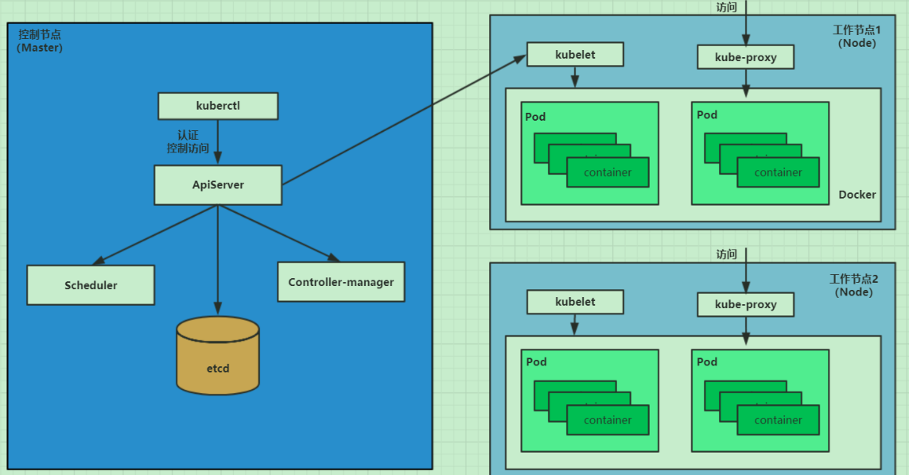
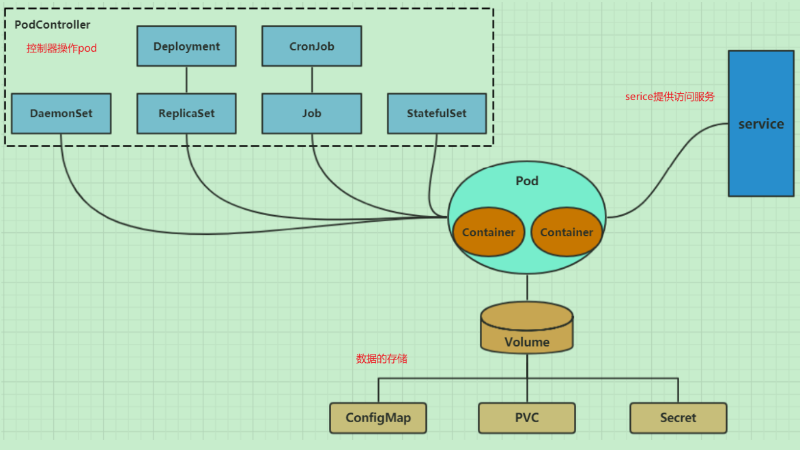
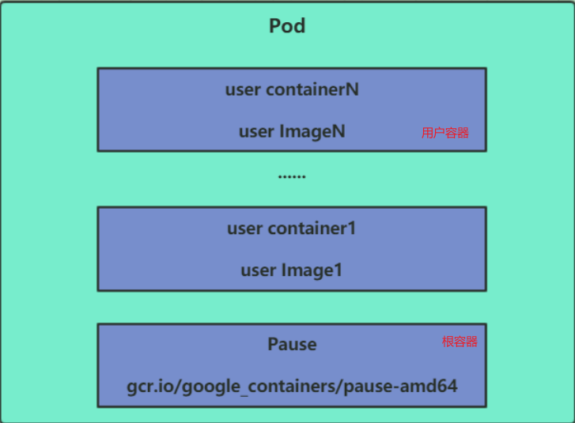
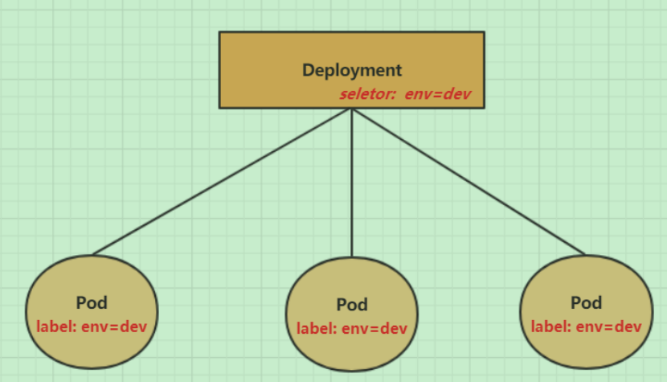
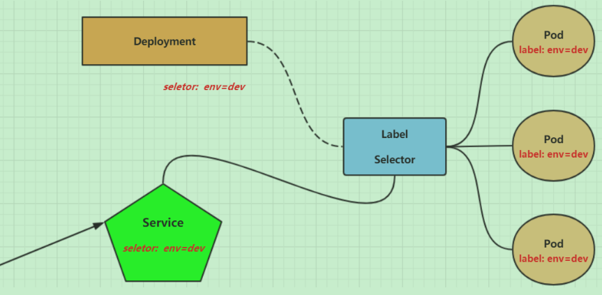

# k8s

## 概述

> 容器编排工具，本质是**一组服务器集群**。可以在集群的每个节点运行特定的程序，对节点的容器进行管理。目的是实现资源的自动化管理
>
> - **自我修复**：一旦某一个容器崩溃，能够在1秒中左右迅速启动新的容器
> - **弹性伸缩**：可以根据需要，自动对集群中正在运行的容器数量进行调整
> - **服务发现**：服务可以通过自动发现的形式找到它所依赖的服务
> - **负载均衡**：如果一个服务起动了多个容器，能够自动实现请求的负载均衡
> - **版本回退**：如果发现新发布的程序版本有问题，可以立即回退到原来的版本
> - **存储编排**：可以根据容器自身的需求自动创建存储卷

## :imp: 架构图解



> kubernetes集群由master节点+工作节点node组成。每个节点安装不同的组件
>
> ==master==
>
> 集群控制平面，负责集群的决策。
>
> ==node==
>
> 集群的数据平面，负责为容器提供运行环境。

> ==**ApiServer**==:**资源操作的唯一入口**，接收用户输入的命令，提供认证、授权、API注册和发现等机制
>
> ==Scheduler== : 负责集群资源调度，**按照预定的调度策略将Pod调度到相应的node节点上**
>
> ==ControllerManager== : 负责维护集群的状态，比如**程序部署安排**、故障检测、自动扩展、滚动更新等
>
> ==Etcd== ：负责存储集群中各种资源对象的信息
>
> ==Kubelet== : 负责维护容器的生命周期，即通过**控制docker，来创建、更新、销毁容器**
> ==KubeProxy== : 负责提供**集群内部的服务发现和负载均衡**
> ==Docker== : 负责节点上容器的各种操作

### :imp: nginx为例介绍组件的调用关系

> 1. 首先要明确，一旦kubernetes环境启动之后，master和node都会将自身的信息存储到etcd数据库中
> 2. 一个nginx服务的安装请求会首先被发送到master节点的**apiServe**r组件
> 3. apiServer组件会调用**scheduler**组件来**决定到底应该把这个服务安装到哪个node节点上**在此时，它会从etcd中读取各个node节点的信息，然后按照一定的算法进行选择，并将结果告知apiServer
> 4. apiServer调用**controller-manager去调度Node节点安装nginx服**务
> 5. **kubelet**接收到指令后，会**通知docker**，然后由docker来**启动一个nginx的pod**，pod是kubernetes的最小操作单元，容器必须跑在pod中至此，
> 6. 一个nginx服务就运行了，如果需要访问nginx，就需要通**过kube-proxy来对pod产生访问的代理**，这样，外界用户就可以访问集群中的nginx服务了

## 相关概念

> ==Master==：集群控制节点，每个集群需要至少一个master节点负责集群的管控
> ==Node==：工作负载节点，由master分配容器到这些node工作节点上，然后node节点上的docker负责容器的运行
> ==Pod==：**kubernetes的最小控制单元**，容器都是运行在pod中的，一个pod中可以有1个或者多个容器
> ==Controller==：**控制器，通过它来实现对pod的管理，比如启动pod、停止pod、伸缩pod的数量等等**。  这个控制器是泛指，有很多
> ==Service==：pod对外服务的统一入口，下面可以维护者同一类的多个pod
> ==Label==：标签，用于对pod进行分类，同一类pod会拥有相同的标签
> ==NameSpace==：命名空间，用来隔离pod的运行环境

## 集群和环境

> 一主多从：一台Master节点和多台Node节点，搭建简单，但是有单机故障风险，适合用于测试环境
> 多主多从：多台Master节点和多台Node节点，搭建麻烦，安全性高，适合用于生产环境

> ==主流部署方式==
>
> minikube：一个用于快速搭建单节点kubernetes的工具
> **kubeadm：一个用于快速搭建kubernetes集群的工具**
> 二进制包 ：从官网下载每个组件的二进制包，依次去安装，此方式对于理解kubernetes组件更加有效

## 资源管理

> kubernetes中，所有的内容都抽象为资源，用户需要通过操作资源来管理kubernetes    `类似java一切皆对象`
>

### :imp:资源关系图



> ==资源管理方式==
>
> **命令式对象管理**：直接使用命令去操作kubernetes资源                         操作对象=》对象   测试/简单/只能操作活动对象，无法审计、跟踪
> kubectl run nginx-pod --image=nginx:1.17.1 --port=80               
> **命令式对象配置**：通过命令配置和配置文件去操作kubernetes资源                 操作对象=》文件   开发/可以审计、跟踪/项目大时，配置文件多，操作麻烦
>
> kubectl create/patch -f nginx-pod.yaml
> **声明式对象配置**：通过apply命令和配置文件去操作kubernetes资源                操作对象=》目录   开发/支持目录操作/意外情况下难以调试
> kubectl apply -f nginx-pod.yaml
>
> ==使用推荐==
>
> 创建/更新资源 使用声明式对象配置 kubectl apply -f XXX.yaml
> 删除资源 使用命令式对象配置 kubectl delete -f XXX.yaml
> 查询资源 使用命令式对象管理 kubectl get(describe) 资源名称

### 命令式对象管理

> ==kubectl命令==
>
> kubectl是kubernetes集群的命令行工具，通过它能够对集群本身进行管理，并能够在集群上进行容器化应用的安装部署
>
> kubectl的运行是需要进行配置的，它的配置文件是$HOME/.kube.如果node节点想要运行，需要拷贝至node节点  scp  -r  HOME/.kube   node1: HOME/
>
> ```shell
> kubectl [command] [type] [name] [flags]
> ```
>
> **comand**：指定要对资源执行的操作，例如create、get、delete
> **type**：指定资源类型，比如deployment、pod、service
> **name**：指定资源的名称，名称大小写敏感
> flags：指定额外的可选参数
>
> ```shell
> kubectl get pod   # 查看所有pod
> kubectl get pod pod_name   # 查看某个pod
> kubectl get pod pod_name -o yaml  # 查看某个pod,以yaml格式展示结果
> ```
>
> 

> ==资源类型==
>
> ```shell
> kubectl api-resources  #查看资源
> ```
>
> <table>
> 	<tr>
> 	    <th>资源分类</th>
> 	    <th>资源名称</th>
> 		<th>缩写</th>
> 		<th>资源作用</th>
> 	</tr>
> 	<tr>
> 	    <td rowspan="2">集群级别资源</td>
>         <td>nodes</td>
> 	    <td>no</td>
> 		<td>集群组成部分</td>
> 	</tr>
> 	<tr>
> 		<td>namespaces</td>
> 	    <td>ns</td>
> 		<td>隔离Pod</td>
> 	</tr>
> 	<tr>
> 		<td>pod资源</td>
> 	    <td>pods</td>
> 	    <td>po</td>
> 		<td>装载容器</td>
> 	</tr>
> 	<tr>
> 		<td rowspan="8">pod资源控制器</td>
> 	    <td>replicationcontrollers</td>
> 	    <td>rc</td>
> 		<td>控制pod资源</td>
> 	</tr>
> 	<tr>
> 	    <td>replicasets</td>
> 	    <td>rs</td>
> 		<td>控制pod资源</td>
> 	</tr>
> 	<tr>
> 	    <td>deployments</td>
> 	    <td>deploy</td>
> 		<td>控制pod资源</td>
> 	</tr>
> 	<tr>
> 	    <td>daemonsets</td>
> 	    <td>ds</td>
> 		<td>控制pod资源</td>
> 	</tr>
> 	<tr>
> 	    <td>jobs</td>
> 	    <td></td>
> 		<td>控制pod资源</td>
> 	</tr>	
> 	<tr>
> 	    <td>cronjobs</td>
> 	    <td>cj</td>
> 		<td>控制pod资源</td>
> 	</tr>	
> 	<tr>
> 	    <td>horizontalpodautoscalers</td>
> 	    <td>hpa</td>
> 		<td>控制pod资源</td>
> 	</tr>	
> 	<tr>
> 	    <td>statefulsets</td>
> 	    <td>sts</td>
> 		<td>控制pod资源</td>
> 	</tr>
> 	<tr>
> 		<td rowspan="2">服务发现资源</td>
> 	    <td>services</td>
> 	    <td>svc</td>
> 		<td>统一pod对外接口</td>
> 	</tr>
>     <tr>
> 	    <td>ingress</td>
> 	    <td>ing</td>
> 		<td>统一pod对外接口</td>
> 	</tr>
> 	<tr>
> 		<td rowspan="3">存储资源</td>
> 	    <td>volumeattachments</td>
> 	    <td></td>
> 		<td>存储</td>
> 	</tr>
> 	<tr>
> 	    <td>persistentvolumes</td>
> 	    <td>pv</td>
> 		<td>存储</td>
> 	</tr>
> 	<tr>
> 	    <td>persistentvolumeclaims</td>
> 	    <td>pvc</td>
> 		<td>存储</td>
> 	</tr>
> 	<tr>
> 		<td rowspan="2">配置资源</td>
> 	    <td>configmaps</td>
> 	    <td>cm</td>
> 		<td>配置</td>
> 	</tr>
> 	<tr>
> 	    <td>secrets</td>
> 	    <td></td>
> 		<td>配置</td>
> 	</tr>
> </table>

> ==操作命令==
>
> ```shell
> kubectl --help  #查看命令支持
> ```
>
> <table>
> 	<tr>
> 	    <th>命令分类</th>
> 	    <th>命令</th>
> 		<th>翻译</th>
> 		<th>命令作用</th>
> 	</tr>
> 	<tr>
> 	    <td rowspan="6">基本命令</td>
> 	    <td>create</td>
> 	    <td>创建</td>
> 		<td>创建一个资源</td>
> 	</tr>
> 	<tr>
> 		<td>edit</td>
> 	    <td>编辑</td>
> 		<td>编辑一个资源</td>
> 	</tr>
> 	<tr>
> 		<td>get</td>
> 	    <td>获取</td>
> 	    <td>获取一个资源</td>
> 	</tr>
>    <tr>
> 		<td>patch</td>
> 	    <td>更新</td>
> 	    <td>更新一个资源</td>
> 	</tr>
> 	<tr>
> 	    <td>delete</td>
> 	    <td>删除</td>
> 		<td>删除一个资源</td>
> 	</tr>
> 	<tr>
> 	    <td>explain</td>
> 	    <td>解释</td>
> 		<td>展示资源文档</td>
> 	</tr>
> 	<tr>
> 	    <td rowspan="10">运行和调试</td>
> 	    <td>run</td>
> 	    <td>运行</td>
> 		<td>在集群中运行一个指定的镜像</td>
> 	</tr>
> 	<tr>
> 	    <td>expose</td>
> 	    <td>暴露</td>
> 		<td>暴露资源为Service</td>
> 	</tr>
> 	<tr>
> 	    <td>describe</td>
> 	    <td>描述</td>
> 		<td>显示资源内部信息</td>
> 	</tr>
> 	<tr>
> 	    <td>logs</td>
> 	    <td>日志</td>
> 		<td>输出容器在 pod 中的日志</td>
> 	</tr>	
> 	<tr>
> 	    <td>attach</td>
> 	    <td>缠绕</td>
> 		<td>进入运行中的容器</td>
> 	</tr>	
> 	<tr>
> 	    <td>exec</td>
> 	    <td>执行</td>
> 		<td>执行容器中的一个命令</td>
> 	</tr>	
> 	<tr>
> 	    <td>cp</td>
> 	    <td>复制</td>
> 		<td>在Pod内外复制文件</td>
> 	</tr>
> 		<tr>
> 		<td>rollout</td>
> 	    <td>首次展示</td>
> 		<td>管理资源的发布</td>
> 	</tr>
> 	<tr>
> 		<td>scale</td>
> 	    <td>规模</td>
> 		<td>扩(缩)容Pod的数量</td>
> 	</tr>
> 	<tr>
> 		<td>autoscale</td>
> 	    <td>自动调整</td>
> 		<td>自动调整Pod的数量</td>
> 	</tr>
> 	<tr>
> 		<td rowspan="2">高级命令</td>
> 	    <td>apply</td>
> 	    <td>rc</td>
> 		<td>通过文件对资源进行配置</td>
> 	</tr>
> 	<tr>
> 	    <td>label</td>
> 	    <td>标签</td>
> 		<td>更新资源上的标签</td>
> 	</tr>
> 	<tr>
> 		<td rowspan="2">其他命令</td>
> 	    <td>cluster-info</td>
> 	    <td>集群信息</td>
> 		<td>显示集群信息</td>
> 	</tr>
> 	<tr>
> 	    <td>version</td>
> 	    <td>版本</td>
> 		<td>显示当前Server和Client的版本</td>
> 	</tr>
> </table>

> ==样例==
>
> ```shell
> [root@master ~]# kubectl create namespace dev  #创建一个namespace
> namespace/dev created
> 
> [root@master ~]# kubectl get ns  # 获取namespace
> NAME              STATUS   AGE
> default           Active   21h
> dev               Active   21s
> kube-node-lease   Active   21h
> kube-public       Active   21h
> kube-system       Active   21h
> 
> [root@master ~]# kubectl run pod --image=nginx -n dev  #在此namespace下创建并运行一个nginx的Pod
> kubectl run --generator=deployment/apps.v1 is DEPRECATED and will be removed in a future version. Use kubectl run --generator=run-pod/v1 or kubectl create instead.
> deployment.apps/pod created
> 
> [root@master ~]# kubectl get pod -n dev   #查看新创建的pod
> NAME                   READY   STATUS    RESTARTS   AGE
> pod-864f9875b9-pcw7x   1/1     Running   0          21s
> 
> [root@master ~]# kubectl delete pod pod-864f9875b9-pcw7x  #删除指定的pod
> pod "pod-864f9875b9-pcw7x" deleted
> 
> [root@master ~]# kubectl delete ns dev  #删除指定的namespace
> namespace "dev" deleted
> ```
>

### 命令式对象**配置**

> 命令式对象配置就是使用命令+配置文件一起来操作kubernetes资源。
>
> ==样例==
>
> **1、创建一个nginxpod.yaml**
>
> ```yaml
> apiVersion: v1
> kind: Namespace
> metadata:
>   name: dev
> ---
> apiVersion: v1
> kind: Pod
> metadata:
>   name: nginxpod
>   namespace: dev
> spec:
>   containers:
>   - name: nginx-containers
>     image: nginx:1.17.1
> ```
>
> **2、命令操作**
>
> ```sh
> [root@master ~]# kubectl create -f nginxpod.yaml  #创建资源
> namespace/dev created
> pod/nginxpod created
> [root@master ~]#  kubectl get -f nginxpod.yaml  #查看资源
> NAME            STATUS   AGE
> namespace/dev   Active   18s
> NAME            READY   STATUS    RESTARTS   AGE
> pod/nginxpod    1/1     Running   0          17s
> [root@master ~]# kubectl delete -f nginxpod.yaml      #删除资源
> namespace "dev" deleted
> pod "nginxpod" deleted
> ```

### 声明式对象配置

> 声明式对象配置跟命令式对象配置很相似，但是它**只有一个命令apply**。
>
> 如果资源不存在，就创建，相当于 kubectl create
> 如果资源已存在，就更新，相当于 kubectl patch
>
> ==样例==
>
> ```sh
> [root@master ~]#  kubectl apply -f nginxpod.yaml  # 首先执行一次kubectl apply -f yaml文件，发现创建了资源
> namespace/dev created
> pod/nginxpod created
> 
> [root@master ~]#  kubectl apply -f nginxpod.yaml  # 再次执行一次kubectl apply -f yaml文件，发现说资源没有变动
> namespace/dev unchanged
> pod/nginxpod unchanged
> ```

## 资源命令实战

### NameSpace

> 多套环境的资源隔离或者多租户的资源隔离。
>
> ```sh
> [root@master ~]# kubectl get ns  # 1 查看所有的ns  命令：kubectl get ns
> NAME              STATUS   AGE
> default           Active   45h
> kube-node-lease   Active   45h
> kube-public       Active   45h     
> kube-system       Active   45h
> 
> [root@master ~]# kubectl get ns default  # 2 查看指定的ns   命令：kubectl get ns ns名称
> NAME      STATUS   AGE
> default   Active   45h
> 
> # kubernetes支持的格式有很多，比较常见的是wide、json、yaml
> [root@master ~]# kubectl get ns default -o yaml   # 3 指定输出格式  命令：kubectl get ns ns名称  -o 格式参数
> apiVersion: v1
> kind: Namespace
> metadata:
>   creationTimestamp: "2020-04-05T04:44:16Z"
>   name: default
>   resourceVersion: "151"
>   selfLink: /api/v1/namespaces/default
>   uid: 7405f73a-e486-43d4-9db6-145f1409f090
> spec:
>   finalizers:
>   - kubernetes
> status:
>   phase: Active
> 
> [root@master ~]# kubectl describe ns default   # 4 查看ns详情  命令：kubectl describe ns ns名称
> Name:         default
> Labels:       <none>
> Annotations:  <none>
> Status:       Active  # Active 命名空间正在使用中  Terminating 正在删除命名空间
> # ResourceQuota 针对namespace做的资源限制
> # LimitRange针对namespace中的每个组件做的资源限制
> No resource quota.
> No LimitRange resource.
> ```
>
> ==样例==
>
> **命令式**
>
> ```sh
> # 创建namespace
> [root@master ~]# kubectl create ns dev
> namespace/dev created
> # 删除namespace
> [root@master ~]# kubectl delete ns dev
> namespace "dev" deleted
> ```
>
> **配置式**
>
> 1、准备ns-dev.yaml
>
> ```yaml
> apiVersion: v1
> kind: Namespace
> metadata:
>   name: dev
> ```
>
> 2、命令执行
>
> ```sh
> kubectl create -f ns-dev.yaml #创建
> kubectl delete -f ns-dev.yaml #删除
> ```

### pod

> Pod是kubernetes集群进行管理的最小单元，程序要运行必须部署在容器中，而容器必须存在于Pod中
>
> 
>
> ==样例==
>
> **命令式**
>
> ```sh
> [root@master ~]# kubectl get pod -n kube-system  #kube-system 命令空间下 pod查看
> NAMESPACE     NAME                             READY   STATUS    RESTARTS   AGE
> kube-system   coredns-6955765f44-68g6v         1/1     Running   0          2d1h
> kube-system   coredns-6955765f44-cs5r8         1/1     Running   0          2d1h
> 。。。省略
> # 命令格式： kubectl run (pod控制器名称) [参数] 
> # --image  指定Pod的镜像
> # --port   指定端口
> # --namespace  指定namespace
> [root@master ~]# kubectl run nginx --image=nginx:1.17.1 --port=80 --namespace dev 
> deployment.apps/nginx created
> 
> [root@master ~]# kubectl get pods -n dev   # 查看Pod基本信息
> NAME                     READY   STATUS    RESTARTS   AGE
> nginx-5ff7956ff6-fg2db   1/1     Running   0          43s
> 
> [root@master ~]# kubectl describe pod nginx-5ff7956ff6-fg2db -n dev   # 查看Pod的详细信息
> Name:         nginx-5ff7956ff6-fg2db
> Namespace:    dev
> Priority:     0
> Node:         node1/192.168.109.101
> Start Time:   Wed, 08 Apr 2020 09:29:24 +0800
> 。。。略
> 
> [root@master ~]# kubectl get pods -n dev -o wide   # 获取podIP
> NAME                     READY   STATUS    RESTARTS   AGE    IP             NODE   
>  ... 
> nginx-5ff7956ff6-fg2db   1/1     Running   0          190s   10.244.1.23   node1   ...
> 
> [root@master ~]# kubectl delete pod nginx-5ff7956ff6-fg2db -n dev   # 删除指定Pod
> pod "nginx-5ff7956ff6-fg2db" deleted
> # 此时，显示删除Pod成功，但是再查询，发现又新产生了一个 
> [root@master ~]# kubectl get pods -n dev
> NAME                     READY   STATUS    RESTARTS   AGE
> nginx-5ff7956ff6-jj4ng   1/1     Running   0          21s
> # 这是因为当前Pod是由Pod控制器创建的，控制器会监控Pod状况，一旦发现Pod死亡，会立即重建
> # 此时要想删除Pod，必须删除Pod控制器
> 
> [root@master ~]# kubectl get deploy -n  dev   # 先来查询一下当前namespace下的Pod控制器
> NAME    READY   UP-TO-DATE   AVAILABLE   AGE
> nginx   1/1     1            1           9m7s
> 
> [root@master ~]# kubectl delete deploy nginx -n dev  # 接下来，删除此PodPod控制器
> deployment.apps "nginx" deleted
> # 稍等片刻，再查询Pod，发现Pod被删除了
> [root@master ~]# kubectl get pods -n dev
> No resources found in dev namespace.
> ```
>
> **配置式**
>
> 1、新建yaml文件
>
> ```yaml
> apiVersion: v1
> kind: Pod
> metadata:
>   name: nginx
>   namespace: dev
> spec:
>   containers:
>   - image: nginx:1.17.1
>     name: pod
>     ports:
>     - name: nginx-port
>       containerPort: 80
>       protocol: TCP
> ```
>
> 2、命令
>
> ```sh
> kubectl create -f pod-nginx.yaml  #创建：
> kubectl delete -f pod-nginx.yaml # 删除：
> ```

### label

> 它的作用就是在**资源上添加标识**，用来对它们进行区分和选择。通过Label实现资源的多维度分组，以便灵活、方便地进行资源分配、调度、配置、部署等管理工
> 作。
>
> **特点**
>
> - 一个Label会以key/value键值对的形式附加到各种对象上，如Node、Pod、Service等等
> - 一个资源对象可以定义任意数量的Label ，同一个Label也可以被添加到任意数量的资源对象上去
> - Label通常在资源对象定义时确定，当然也可以在对象创建后动态添加或者删除
>
> **Label用于给某个资源对象定义标识**
> **Label Selector用于查询和筛选拥有某些标签的资源对象**    `是不是有点类似rabbitmq 交换机对于toplic筛选定位queue`
>
> ==Label Selector种类==
>
> **基于等式的Label Selector**
> name = slave: 选择所有包含Label中key="name"且value="slave"的对象
> env != production: 选择所有包括Label中的key="env"且value不等于"production"的对象
> **基于集合的Label Selector**
> name in (master, slave): 选择所有包含Label中的key="name"且value="master"或"slave"的对象
> name not in (frontend): 选择所有包含Label中的key="name"且value不等于"frontend"的对象
>
> `标签的选择条件可以使用多个，逗号","进行分隔`
>
> name=slave，env!=production
> name not in (frontend)，env!=production
>
> ==样例==
>
> **命令式**
>
> ```sh
> [root@master ~]# kubectl label pod nginx-pod version=1.0 -n dev   # 为pod资源打标签
> pod/nginx-pod labeled
> 
> [root@master ~]# kubectl label pod nginx-pod version=2.0 -n dev --overwrite    # 为pod资源更新标签
> pod/nginx-pod labeled
> 
> [root@master ~]# kubectl get pod nginx-pod  -n dev --show-labels    # 查看标签
> NAME        READY   STATUS    RESTARTS   AGE   LABELS
> nginx-pod   1/1     Running   0          10m   version=2.0
> 
> [root@master ~]# kubectl get pod -n dev -l version=2.0  --show-labels    # 筛选标签
> NAME        READY   STATUS    RESTARTS   AGE   LABELS
> nginx-pod   1/1     Running   0          17m   version=2.0
> [root@master ~]# kubectl get pod -n dev -l version!=2.0 --show-labels
> No resources found in dev namespace.
> 
> [root@master ~]# kubectl label pod nginx-pod version- -n dev    #删除标签
> pod/nginx-pod labeled
> ```
>
> **配置式**
>
> 1、新建yaml文件
>
> ```yaml
> apiVersion: v1
> kind: Pod
> metadata:
>   name: nginx
>   namespace: dev
>   labels:
>     version: "3.0" 
>     env: "test"
> spec:
>   containers:
>   - image: nginx:1.17.1
>     name: pod
>     ports:
>     - name: nginx-port
>       containerPort: 80
>       protocol: TCP
> ```
>
> 2、命令
>
> ```sh
> kubectl apply -f pod-nginx.yaml
> ```

### Deployment

> pod控制器的一种
>
> 
>
> ==样例==
>
> **命令式**
>
> ```sh
> # 命令格式: kubectl run deployment名称  [参数] 
> # --image  指定pod的镜像
> # --port   指定端口
> # --replicas  指定创建pod数量
> # --namespace  指定namespace
> [root@master ~]# kubectl run nginx --image=nginx:1.17.1 --port=80 --replicas=3 -n dev
> deployment.apps/nginx created
> 
> [root@master ~]# kubectl get pods -n dev   # 查看创建的Pod
> NAME                     READY   STATUS    RESTARTS   AGE
> nginx-5ff7956ff6-6k8cb   1/1     Running   0          19s
> nginx-5ff7956ff6-jxfjt   1/1     Running   0          19s
> nginx-5ff7956ff6-v6jqw   1/1     Running   0          19s
> 
> [root@master ~]# kubectl get deploy -n dev    # 查看deployment的信息
> NAME    READY   UP-TO-DATE   AVAILABLE   AGE
> nginx   3/3     3            3           2m42s
> # UP-TO-DATE：成功升级的副本数量
> # AVAILABLE：可用副本的数量
> [root@master ~]# kubectl get deploy -n dev -o wide
> NAME    READY UP-TO-DATE  AVAILABLE   AGE     CONTAINERS   IMAGES             
>  SELECTOR
> nginx   3/3     3         3           2m51s   nginx        nginx:1.17.1       
>  run=nginx
> 
> [root@master ~]# kubectl describe deploy nginx -n dev   # 查看deployment的详细信息
> Name:                   nginx
> Namespace:              dev
> ....略
> 
> [root@master ~]# kubectl delete deploy nginx -n dev   # 删除 
> deployment.apps "nginx" deleted
> ```
>
> **配置式**
>
> 1、新建yaml
>
> ```yaml
> apiVersion: apps/v1
> kind: Deployment
> metadata:
>   name: nginx
>   namespace: dev
> spec:
>   replicas: 3
>   selector:
>     matchLabels:
>       run: nginx
>   template:
>     metadata:
>       labels:
>         run: nginx
>     spec:
>       containers:
>       - image: nginx:1.17.1
>         name: nginx
>         ports:
>         - containerPort: 80
>           protocol: TCP
> ```
>
> 2、命令执行
>
> ```sh
> kubectl create -f deploy-nginx.yaml  #创建
> kubectl delete -f deploy-nginx.yaml  #删除
> ```

### service

> Service可以看作是**一组同类Pod对外的访问接口**。借助Service，应用可以方便地实现服务发现和负载均衡
>
> 
>
> ==样例==
>
> **命令式**
>
> ```sh
> # 暴露Service
> [root@master ~]# kubectl expose deploy nginx --name=svc-nginx1 --type=ClusterIP --port=80 --target-port=80 -n dev  #集群内部可访问的Service
> service/svc-nginx1 exposed
> 
> [root@master ~]# kubectl get svc svc-nginx -n dev -o wide  # 查看service
> NAME         TYPE        CLUSTER-IP       EXTERNAL-IP   PORT(S)   AGE     SELECTOR
> svc-nginx1   ClusterIP   10.109.179.231   <none>        80/TCP    3m51s   run=nginx
> # 这里产生了一个CLUSTER-IP，这就是service的IP，在Service的生命周期中，这个地址是不会变动的
> # 可以通过这个IP访问当前service对应的POD
> [root@master ~]# curl 10.109.179.231:80
> <!DOCTYPE html>
> <html>
> <head>...略
> 
> # 上面创建的Service的type类型为ClusterIP，这个ip地址只用集群内部可访问
> # 如果需要创建外部也可以访问的Service，需要修改type为NodePort
> [root@master ~]# kubectl expose deploy nginx --name=svc-nginx2 --type=NodePort --port=80 --target-port=80 -n dev   #外部也可访问的Service
> service/svc-nginx2 exposed
> # 此时查看，会发现出现了NodePort类型的Service，而且有一对Port（80:31928/TC）
> [root@master ~]# kubectl get svc  svc-nginx-1  -n dev -o wide
> NAME          TYPE        CLUSTER-IP       EXTERNAL-IP   PORT(S)        AGE   
>  SELECTOR
> svc-nginx2    NodePort    10.100.94.0      <none>        80:31928/TCP   9s     
> run=nginx
> # 接下来就可以通过集群外的主机访问 节点IP:31928访问服务了
> # 例如在的电脑主机上通过浏览器访问下面的地址
> http://192.168.109.100:31928/
> 
> [root@master ~]# kubectl delete svc svc-nginx-1 -n dev        #删除Service                           
>   service "svc-nginx-1" deleted
> ```
>
> **配置式**
>
> 1、yaml创建
>
> ```yaml
> apiVersion: v1
> kind: Service
> metadata:
>   name: svc-nginx
>   namespace: dev
> spec:
>   clusterIP: 10.109.179.231
>   ports:
>   - port: 80
>     protocol: TCP
>     targetPort: 80
>   selector:
>     run: nginx
>   type: ClusterIP
> ```
>
> 2、命令
>
> ```sh
> kubectl create -f svc-nginx.yaml  #创建：
> kubectl delete -f svc-nginx.yaml  #删除：
> ```

## 资源详解

### pod

> pod容器分类
>
> - **用户程序所在的容器**，数量可多可少
> - **Pause容器**，这是每个Pod都会有的一个**根容器**，它的作用有两个：
>   -可以以它为依据，评估整个Pod的健康状态
>   -可以在根容器上设置Ip地址，其它容器都此Ip（Pod IP），以实现Pod内部的网路通信
>
> `这里是Pod内部的通讯，Pod的之间的通讯采用虚拟二层网络技术来实现，我们当前环境用的是Flannel`

### :imp: 资源清单

> ```yaml
> apiVersion: v1     #必选，版本号，例如v1
> kind: Pod         #必选，资源类型，例如 Pod
> metadata:         #必选，元数据
>   name: string     #必选，Pod名称
>   namespace: string  #Pod所属的命名空间,默认为"default"
>   labels:           #自定义标签列表
>     - name: string                 
> spec:  #必选，Pod中容器的详细定义
>   containers:  #必选，Pod中容器列表
>   - name: string   #必选，容器名称
>     image: string  #必选，容器的镜像名称
>     imagePullPolicy: [ Always|Never|IfNotPresent ]  #获取镜像的策略 
>     command: [string]   #容器的启动命令列表，如不指定，使用打包时使用的启动命令
>     args: [string]      #容器的启动命令参数列表
>     workingDir: string  #容器的工作目录
>     volumeMounts:       #挂载到容器内部的存储卷配置
>     - name: string      #引用pod定义的共享存储卷的名称，需用volumes[]部分定义的的卷名
>       mountPath: string #存储卷在容器内mount的绝对路径，应少于512字符
>       readOnly: boolean #是否为只读模式
>     ports: #需要暴露的端口库号列表
>     - name: string        #端口的名称
>       containerPort: int  #容器需要监听的端口号
>       hostPort: int       #容器所在主机需要监听的端口号，默认与Container相同
>       protocol: string    #端口协议，支持TCP和UDP，默认TCP
>     env:   #容器运行前需设置的环境变量列表
>     - name: string  #环境变量名称
>       value: string #环境变量的值
>     resources: #资源限制和请求的设置
>       limits:  #资源限制的设置
>         cpu: string     #Cpu的限制，单位为core数，将用于docker run --cpu-shares参数
>         memory: string  #内存限制，单位可以为Mib/Gib，将用于docker run --memory参数
>       requests: #资源请求的设置
>         cpu: string    #Cpu请求，容器启动的初始可用数量
>         memory: string #内存请求,容器启动的初始可用数量
>     lifecycle: #生命周期钩子
>         postStart: #容器启动后立即执行此钩子,如果执行失败,会根据重启策略进行重启
>         preStop: #容器终止前执行此钩子,无论结果如何,容器都会终止
>     livenessProbe:  #对Pod内各容器健康检查的设置，当探测无响应几次后将自动重启该容器
>       exec:         #对Pod容器内检查方式设置为exec方式
>         command: [string]  #exec方式需要制定的命令或脚本
>       httpGet:       #对Pod内个容器健康检查方法设置为HttpGet，需要制定Path、port
>         path: string
>         port: number
>         host: string
>         scheme: string
>         HttpHeaders:
>         - name: string
>           value: string
>       tcpSocket:     #对Pod内个容器健康检查方式设置为tcpSocket方式
>          port: number
>        initialDelaySeconds: 0       #容器启动完成后首次探测的时间，单位为秒
>        timeoutSeconds: 0          #对容器健康检查探测等待响应的超时时间，单位秒，默认1秒
>        periodSeconds: 0           #对容器监控检查的定期探测时间设置，单位秒，默认10秒一次
>        successThreshold: 0
>        failureThreshold: 0
>        securityContext:
>          privileged: false
>   restartPolicy: [Always | Never | OnFailure]  #Pod的重启策略
>   nodeName: <string> #设置NodeName表示将该Pod调度到指定到名称的node节点上
>   nodeSelector: obeject #设置NodeSelector表示将该Pod调度到包含这个label的node上
>   imagePullSecrets: #Pull镜像时使用的secret名称，以key：secretkey格式指定
>   - name: string
>   hostNetwork: false   #是否使用主机网络模式，默认为false，如果设置为true，表示使用宿主机网络
>   volumes:   #在该pod上定义共享存储卷列表
>   - name: string    #共享存储卷名称 （volumes类型有很多种）
>     emptyDir: {}       #类型为emtyDir的存储卷，与Pod同生命周期的一个临时目录。为空值
>     hostPath: string   #类型为hostPath的存储卷，表示挂载Pod所在宿主机的目录
>       path: string                #Pod所在宿主机的目录，将被用于同期中mount的目录
>     secret:          #类型为secret的存储卷，挂载集群与定义的secret对象到容器内部
>       scretname: string  
>       items:     
>       - key: string
>         path: string
>     configMap:         #类型为configMap的存储卷，挂载预定义的configMap对象到容器内部
>       name: string
>       items:
>       - key: string
>         path: string
> ```
>
> 