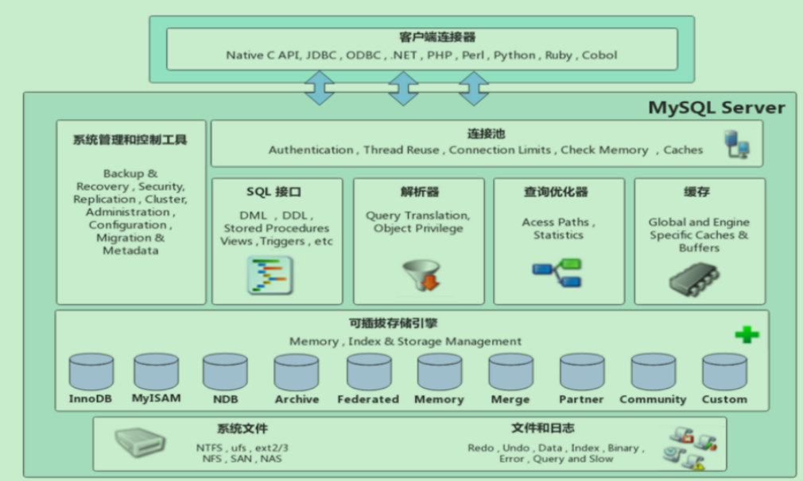
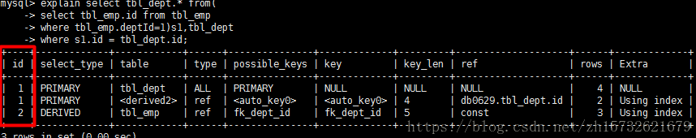
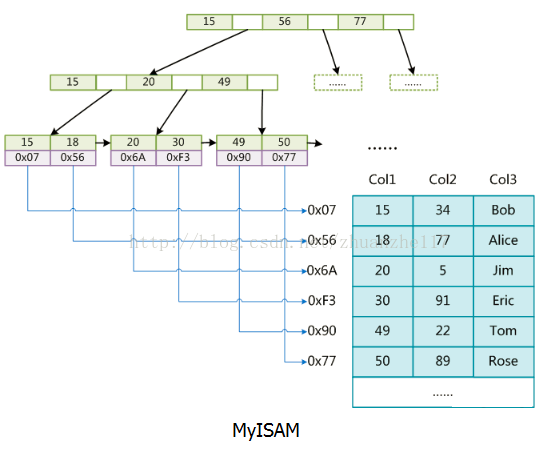
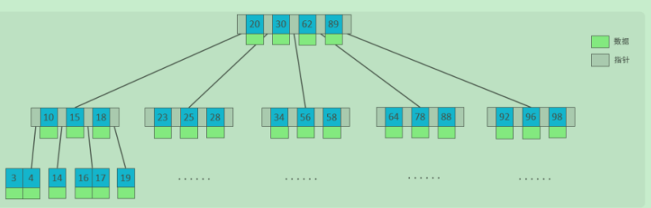
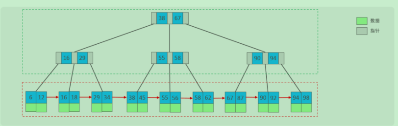
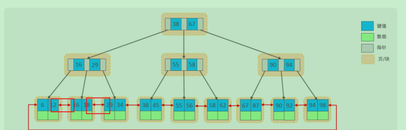

# Mysql

#### 体系结构



#### 优化思路

> 1. 表结构、字段类型，创建合理，**遵循三范式** ，有时候也可**合理的反规范** ，比如**经常连接的字段建立冗余字段** 或者 **需要 计算的字段 可以增加派生列** ，避免每次查询计算。
> 2. **SQL及索引的优化** 索引合理 **过多索引也会影响写入效率**、**定位慢sql优化** **基于最左前缀法则**
> 3. **数据量过大** 采用 **分表 分库** 思想 垂直分表、分库、水平分表、分库 使用**shardingJDBC** sdk方式在应用端 **mycat**介于应用和 mysql之间代理方式
> 4. 优化硬件
> 5. **IO压力过大，使用缓存** 本地缓存 ehcache caffine HashMap 缓存服务 redis memcache
> 6. 结合具体业务，可**借助es 这种搜索引擎** 来存储
> 7. **应用服务层面优化**，如JVM调优、多线程优化等

> ==Mysql慢查询该如何优化?==
>
> 1.检查是否走了索引 ，**如果没有则优化SQL利用索引** 
>
> 2.检查所利用的索引，**是否是最优索引** 
>
> 3.检查所查字段是否都是必须的，**是否查询了过多字段** ，查出了多余数据 
>
> 4，检查表中数据是否过多，**是否应该进行分库分表** 了 
>
> 5，检查数据库实例所在机器的性能配置 ，是否太低，是否可以适当增加资源
>
> ==mysql性能分析方式==
>
> 1、支持**show [session|global] status** 以查看当前数据库的INSERT、UPDATE、DELETE、SELECT的访问频次。 也就是**执行频率的分 析**。 
>
> 2、slow_query_log = 1 long_query_time=2 **打开慢查询开关，进行慢查询日志记录分析**。 也就是慢查询分析 。 
>
> 3、show profiles 能够在做SQL优化时帮助我们了解时间都耗费到哪里去了 。 也就是profile 分析 耗时。 
>
> 4、**explain 执行计划分析** 

> ==EXPLAIN执行计划==
>
> **作用**
>
> - 分析出表的读取顺序
> - 数据读取操作的操作类型
> - 哪些索引可以使用
> - 哪些索引被实际使用
> - 表之间的引用
> - 每张表有多少行被优化器查询
>
> **图示**
>
> 
>
> **图解**
>
> **关注**
>
> type：访问类型，查看SQL到底是以何种类型访问数据的。 
>
> key：使用的索引，MySQL用了哪个索引，有时候MySQL用的索引不是最好的，需要force index()。 
>
> rows：最大扫描的列数。 
>
> extra：重要的额外信息，特别注意损耗性能的两个情况，using filesort和using temporary。
>
> |                              id                              | id相同,执行顺序由上至下；<br>id不同,如果是子查询,id的序号会递增,id值越大,优先级越高,越先被执行<br>id相同和不同,同时存在,遵从优先级高的优先执行,优先级相同的按照由上至下的顺序执行 |
> | :----------------------------------------------------------: | :----------------------------------------------------------- |
> |                       **select_type**                        | 查询的类型,主要用于区别普通查询,联合查询,子查询等复杂查询simple:<br/>**select**查询,查询中不包含子查询或union查询<br/>**primary**:查询中若包含任何复杂的子部分,最外层查询则被标记为primary<br/>**subquery** 在select 或where 列表中包含了子查询<br/>**derived** 在from列表中包含的子查询被标记为derived,mysql会递归这些子查询,把结果放在临时表里<br/>**union** 做第二个select出现在union之后,则被标记为union,若union包含在from子句的子查询中,外层select将被标记为derived<br/>**union result** 从union表获取结果的select<br/> |
> |                            table                             | 显示一行的数据时关于哪张表的                                 |
> | **type**<br/>（访问类型，查看SQL到底是以何种类型访问数据的） | system > const > eq_ref > ref > fulltext > ref_or_null > index_merge > unique_subquery > index_subquery > range > index > ALL<br/>查询类型从最好到最差依次是:system>const>eq_ref>ref>range>index>All,一般情况下,得至少保证达到range级别,最好能达到ref<br/>**system:表只有一行记录,这是const类型的特例,平时不会出现**<br/>**const:表示通过索引一次就找到了**,const即常量,它用于比较primary key或unique索引,因为只匹配一行数据,所以效率很快,如将主键置于where条件中,mysql就能将该查询转换为一个常量<br/>**eq_ref**:唯一性索引扫描,对于每个索引键,表中只有一条记录与之匹配,常见于主键或唯一索引扫描<br/>**ref:非唯一性索引扫描**,返回匹配某个单独值的行,它可能会找到多个符合条件的行,所以他应该属于查找和扫描的混合体<br/>**range:只检索给定范围的行**,使用一个索引来选择行,如where语句中出现了between,<,>,in等查询,这种范围扫描索引比全表扫描要好，因为它只需要开始于索引的某一点，而结束于另一点，不用扫描全部索引。<br/>**index:index类型只遍历索引树,这通常比All快**,因为索引文件通常比数据文件小,index是从索引中读取,all从硬盘中读取<br/>all:全表扫描,是最差的一种查询类型<br/> |
> |                        possible_keys                         | 显示可能应用在这张表中的索引,一个或多个,查询到的索引不一定是真正被用到的 |
> |                           **key**                            | **实际使用的索引**,如果为null,则没有使用索引,因此会出现possible_keys列有可能被用到的索引,但是key列为null,表示实际没用索引 |
> |                           key_len                            | 表示索引中使用的字节数,而通过该列计算查询中使用的 索引长度,在不损失精确性的情况下,长度越短越好,key_len显示的值为索引字段的最大可能长度,并非实际使用长度,即,key_len是根据表定义计算而得,而不是通过表内检索出的 |
> |                           **ref**                            | 显示索引的哪一列被使用了,如果可能的话是一个常数,哪些列或常量被用于查找索引列上的值 |
> |                           **rows**                           | 根据表统计信息及索引选用情况,大只估算出找到所需的记录所需要读取的行数 |
> |                          **Extra**                           | **Using filesort**:说明mysql会对数据使用一个外部的索引排序,而不是按照表内的索引顺序进行读取,mysql中无法利用索引完成的排序操作称为"文件排序"<br/>**Using temporary** :使用了**临时表保存中间结果**,mysql在对查询结果排序时使用临时表,常见于order by和分组查询group by<br/>**Using index**:表示相应的**select操作中使用了覆盖索引（Covering Index**），避免访问了表的数据行，效率不错。如果同时出现using where，表明索引被用来执行索引键值的查找；如果没有同时出现using where，表明索引用来读取数据而非执行查找动作。 其中的覆盖索引含义是所查询的列是和建立的索引字段和个数是一一对应的<br/>**Using where**:表明使用了where过滤<br/>**Using join buffer**:表明使用了连接缓存,如在**查询的时候会有多次join,则可能会产生临时表**<br/>**impossible where**:表示where子句的值总是false,不能用来获取任何元素<br/><u>select * from t1 where id='1' and id='2';<br/></u>**select tables optimized away**<br/>在没有GROUPBY子句的情况下，基于索引优化MIN/MAX操作或者对于MyISAM存储引擎优化COUNT(*)操作，不必等到执行阶段再进行计算，查询执行计划生成的阶段即完成优化。<br/>**distinct**<br/>优化distinct操作，在找到第一匹配的元组后即停止找同样值的动作<br/> |

#### 三范式

> 1. 原子约束 **每列不可再分**（看业务要求） 
> 2. 保证唯一  主键 
> 3. **不要有冗余**（一个数据库表中不包含其它表中的非主关键字信息）

#### 索引

> ==分类==
>
> - 普通索引：即一个索引只包含单个列，一个表可以有多个单列索引 
>
> - 唯一索引：索引列的值必须唯一，但**允许有空值** 
>
> - 复合索引：即一个索引包含多个列 
>
>   ```mysql
>   (1) select * from myTest where a=3 and b=5 and c=4; ---- abc顺序
>   abc三个索引都在where条件里面用到了，而且都发挥了作用
>   (2) select * from myTest where c=4 and b=6 and a=3;
>   where里面的条件顺序在查询之前会被mysql自动优化，效果跟上一句一样
>   (3) select * from myTest where a=3 and c=7;
>   a用到索引，b没有用，所以c是没有用到索引效果的
>   (4) select * from myTest where a=3 and b>7 and c=3; ---- b范围值，断点，阻塞了c的索引
>   a用到了，b也用到了，c没有用到，这个地方b是范围值，也算断点，只不过自身用到了索引
>   (5) select * from myTest where b=3 and c=4; --- 联合索引必须按照顺序使用，并且需要全部使用
>   因为a索引没有使用，所以这里 bc都没有用上索引效果
>   (6) select * from myTest where a>4 and b=7 and c=9;
>   a用到了 b没有使用，c没有使用
>   (7) select * from myTest where a=3 order by b;
>   a用到了索引，b在结果排序中也用到了索引的效果，a下面任意一段的b是排好序的
>   (8) select * from myTest where a=3 order by c;
>   a用到了索引，但是这个地方c没有发挥排序效果，因为中间断点了，使用 explain 可以看到 filesort
>   (9) select * from mytable where b=3 order by a;
>   b没有用到索引，排序中a也没有发挥索引效果
>   ```
>
> 
>
> - 聚簇索引(聚集索引)：一种**数据存储方式**。对于**Innodb，将数据存储与索引放到了一块，索引结构的叶子节点保存了行数据**。 必须有。 
>
> ​    [InnoDB聚集索引的叶子节点存储行记录，因此， InnoDB必须要有，且**只有一个聚集索引**]
>
> ​    [（1）如果表定义了PK，则PK就是聚集索引； 
>
> ​     （2）如果表没有定义PK，则第一个**not NULL unique列**是聚集索引；
>
> ​     （3）否则，InnoDB会创建一个**隐藏的row-id**作为聚集索引； nnoDB普通索引的叶子节点存储主键值。
>
> ​    ]
>
> - 非聚簇索引（二级索引）：将**数据与索引分开存储**，索引结构的**叶子节点关联的是对应的主键**。

> ==使用==
>
> - 查看索引 
>
>   ```mysql
>   SHOW INDEX FROM table_name
>   ```
>
> - 创建索引 
>
>   ```mysql
>   CREATE [UNIQUE ] INDEX indexName ON mytable(columnname(length)); 
>   ALTER TABLE 表名 ADD [UNIQUE ] INDEX [indexName] ON (columnname(length))
>   ```
>
> - 删除索引 
>
>   ```mysql
>   DROP INDEX [indexName] ON mytable;
>   ```

> ==索引列及建立原则==
>
> - 在经常需要**搜索的列**上，可以加快搜索的速度； 
> - 在作为**主键的列**上，**强制该列的唯一性和组织表中数据的排列结构**； 
> - 在经常**用在连接的列**上，可以加快连接的速度； 
> - 在经常需要**根据范围进行搜索的列**,**需要排序的列上，分组的列上**，上创建索引，因为索引已经排序； 
> - 如果是字符串类型的字段， **字段的长度较长** ，可以针对于字段的特点， **建立前缀索引**
> - 在经常使用在 **WHERE 子句中的列**上面创建索引，加快条件的判断速度
> - **尽量使用联合索引 ，减少单列索引**，查询时， **联合索引很多时候可以覆盖索引** ，节省存储空间， 避免回表，提高查询效率。
> - 要 **控制索引的数量** ，索引并不是多多益善，索引越多，维护索引结构的代价也就越大，会影响增 删改的效率。
> - 如果 **索引列不能存储NULL值，请在创建表时使用NOT NULL约束它** 。当优化器知道每列是否包含 NULL值时，它可以更好地确定哪个索引最有效地用于查询。
>
> ==优化==
>
> - 全值匹配我最爱，**最左前缀要遵守**； 
> - 带头大哥不能死，中间兄弟不能断； 
> - **索引列上少计算**，**范围之后全失效**； 
> - **LIKE百分写最右，覆盖索引不写**； 
> - 不等空值还有OR**，索引影响要注意； **
> - VARCHAR引号不可丢**，SQL优化有诀窍
>
> - count(字段) < count(主键 id) < count(1) ≈ count(\*)，所以**尽量使用 count（\*)**。
>
> | COUNT(常量) | InnoDB 引擎遍历整张表，但不取值。server 层对于返回的每一行，放一个数字“1”进去，判断是不可能为空的，按行累加。 |
> | ----------- | ------------------------------------------------------------ |
> | count(id)   | **对于 count(主键 id) 来说**，InnoDB 引擎会遍历整张表，把每一行的 id 值都取出来，返回给 server 层。server 层拿到 id 后，判断是不可能为空的，就按行累加。 |
> | COUNT(列名) | 查询符合条件的列的值**不为NULL**的行数                       |
> | COUNT(*)    | SQL92定义的标准统计行数的语法.<br/>MyISAM把表的总行数单独记录下来，如果执行`count(*)`时可以直接返回,前提是不能有where条件。MyISAM是表级锁，不会有并发的行操作，所以查到的结果是准确的。<br/>InnoDB不能使用这种缓存操作，因为支持事务，大部分操作都是行级锁，行可能被并行修改，那么缓存记录不准确.**MySQL会优先选择最小的非聚簇索引来扫表。**<br/>**相同数量的二级索引记录可以比聚簇索引记录占用更少的存储空间**，所以二级索引树比聚簇索引树小，这样遍历二级索引的 I/O 成本比遍历聚簇索引的 I/O 成本小，因此「优化器」优先选择的是二级索引 |
>
> ==回表查询==这种先到二级索引中查找数据，找到主键值，然后再到聚集索引中根据主键值，获取数据的方式，就称之为回表查询.
>
> ==覆盖索引==（只访问索引的查询（索引列和查询列一致）
>
> ==覆盖索引优化场景== 
>
> 1. 全表count查询优化：select count(name) from user; // **name添加索引** 
> 2. 列查询回表优化*：select id,name,sex ... where name='shenjian';* //**设置联合索引 避免 回表** 
> 3. 分页查询select id,name,sex ... order by name limit 500,100;*//**单列索引(name)升级为联合索引(name, sex)**，也可以避免回表。

#### 存储引擎

> ==查询==
>
> ```mysql
> #看你的mysql现在已提供什么存储引擎:
> mysql> show engines;
> #看你的mysql当前默认的存储引擎:
> mysql> show variables like '%storage_engine%';
> ```
>
> **存储引擎是基于表的 逻辑存储结构**
>
> ==图示==
>
> 

#### MyISAM和InnoDB

> ==比较==
>
> |        | 数据结构                                                     | 事务支持                                   | 锁     | 外键支持 | 全文索引支持 |
> | ------ | ------------------------------------------------------------ | ------------------------------------------ | ------ | -------- | ------------ |
> | MyISAM | MyISAM 使用**B+树索引结构**， **索引文件和数据文件是分离的 ，它的索引文件仅仅保存数据记录的地址** 。 <br/>主索引（主键）和辅助索引（其他索引）在结构上没有区别，只是主键key是唯一的。 <br>MyISAM中索引检索的算法为首先按照B+Tree搜索算法搜索索引，如果指定的Key存在，则取出其data域的值，然后以data域的值为地址，读 取相应数据记录。 MyISAM的索引方式也叫做“非聚集”的。<br> | 非事务，大量select操作可选择               | 表级锁 | 不支持   | 支持全文索引 |
> | InnoDB | InnoDB的数据文件本身就是索引文件 ，表数据文件本身就是按B+Tree组织的一个索引结构，这棵树的**叶节点data域保存了完整的数据记录 。称为聚集索引** 。 <br>这个索引的key是数据表的主键，因此InnoDB表数据文件本身就是主索引。 <br>InnoDB的**辅助索引data域存储相应记录主键的值而不是地址** 。换句话说，InnoDB的所有辅助索引都引用主键作为data域 首先检索辅助索引获得主键，然后用主键到主索引中检索获得记录。 | 支持事务，大量insert和update操作，可选择。 | 行级锁 | 支持外键 | 不支持       |
>
> ==选择==
>
> **InnoDB**: 是Mysql的默认存储引擎，支持事务、外键。如果**应用对事务的完整性有比较高的要求** ，在并发条件下要求数据的一致性，数据操作 除了插入和查询之外，还包含很多的更新、删除操 作，那么InnoDB存储引擎是比较合适的选择。 
>
> **MyISAM** ： 如果应用是以读操作和插入操作为主，**只有很少的更新和删除操作，并且对事务的完整性、并发性要求不是很高** ，那么选择这个 存储引擎是非常合适的。 **MEMORY**：将所有数据**保存在内存中，访问速度快 ，通常用于临时表及缓存** 。MEMORY的缺陷就是对表的大小有限制，**太大的表无法缓存 在内存中** ，而且**无法保障数据的安全性。**

#### Mysql日志

> ==binlog作用是什么?== 
>
> 用来记录MySQL中**增删改时的记录日志**最大的用处就是进行**主从复制**，以及数据库的恢复。 
>
> ==redolog作用是什么?== 
>
> 最后刷用来在MySOL宕机情况下将**不完整的事务执行数据纠正**。**数据库的更新操作会在内存中先执行入磁盘。redolog就是为了恢复更新了内存 但是由于宕机等原因没有刷入磁盘中的那部分数据** 
>
> ==undolog作用是什么?== 
>
> **用来回滚到某一个版本**，是一种逻辑日志。记录的是修改之前的数据 当delete一条记录时，undolog中会记录一条对应的insert记录，从而保证能恢复到数据修改之前。在执行 事务回滚的时候，就可以通过undolog中的记录内容并以此进行回滚

#### MVCC

> ==定义==
>
> MVCC muti-version Concurrency Control ，指的是维护一个数据的多个版本，使得读写没有冲突。 
>
> 快照读为mvcc 提供了一个非阻塞的读功能 
>
> mvcc具体实现 依赖于 数据库记录中三个隐藏字段 、undolog日志 、readview

> ==三个隐藏字段== 
>
> DB_TRX_ID：最近修改的事务ID 
>
> DB_ROLL_PTR:回滚指针，指向这条记录的上个版本。用于配合Undolog指向上个版本 
>
> DB_ROW_ID：隐藏主键，没有指定主键的话，会生成该字段

> ==版本链==
>
> 不同事务或者相同事务对同一条记录做修改时，会在undolog中生成一条记录版本链表，链表的头部是最新的旧记录，尾部是最早的旧记录。

> ==readview 也叫读视图，==
>
> 是快照读sql执行时mvcc**提取数据的依据**(提取版本链中数据的依据)，记录并维护系统当前活跃的事务ID(未提交) 包含四个字段 （不做描述），通过这四个字段结合当前undolog版本链中的事务ID,来定位版本链中的具体记录。 
>
> **READ COMMITTED** ：在事务中每一次执行快照读时生成ReadView。 
>
> **REPEATABLE READ**：仅在事务中第一次执行快照读时生成ReadView，后续复用该ReadView

> ==MVCC的实现原理==
>
> 其实就是 依据**数据库记录中三个隐藏字段**、**undolog日志**、**readview**来实现的。
>
> DB_TRX_ID(当前事务ID)结合readview， 来定位undolog版本链中符合规则的记录. 
>
> **MVCC+锁实现了隔离性** 
>
> **redolog+undolog 实现了一致性** 
>
> **undolog实现了原子性** 
>
> **redolog 实现了持久性**

#### 主从复制

> ==定义== 
>
> 复制是指将主数据库的 DDL和 DML 操作通过二进制日志传到复制服务器(也叫从库)上,然后在从库上对这些日志重新执行(也叫重做),从而使得从库和 主库的数据保持同步。
>
> MysQL支持一台主库同时向多台从库进行复制,从库同时也可以作为其他服务器的主库,实现链状的复制 。 
>
> **注意**: 由于MySQL实现的是并不是完全同步的复制,所以主从库之间存在一定的差距,在从库上进行的査询操作需要考虑到这些数据的差异, 一般只有更新不频繁的数据或者对实时性要求不高的数据可以通过从库查询, 实时性要求高的数据仍然需要从主数据库获得。 
>
> ==名称解释==
>
> DML（data manipulation language）数据操纵语言： 就是我们最经常用到的 SELECT、UPDATE、INSERT、DELETE。 主要用来对数据库的数据进行一些操作。 
>
> DDL（data definition language）数据库定义语言： 其实就是我们在创建表的时候用到的一些sql，比如说：CREATE、ALTER、DROP等。DDL主要是用在定义或改变表的结构，数据类型，表之间的链 接和约束等初始化工作上
>
> ==主从复制过程==
>
> 1、MySQL**主库在事务提交时会把数据变更作为事件 Events 记录在二进制日志文件Binlog中**(MySQL主库上的 sync_binlog参数控制 Binlog 日志刷新到磁盘。) 
>
> 2、**从库和主库建立连接后**，**从库IO线程读取主库推送的二进制日志文件 Binlog ，写入到从库的中继日志 Relay Log** 。 
>
> 3、**从库 SQL线程重做中继日志中的事件 ，将改变反映它自己的数据**。
>
> ==过程分析==
>
> **<u>Binlog Dump线程跑在主库上, I/0线程和 SQL线程跑在从库上</u>**
>
> 可以通过 **SHOW PROCESSLIST**命令在主库上査看 BinlogDump线程,从 BinlogDump 线程的状态可以看到, **Mysql的复制是主库主动推送日志到从库 去的,是属于“推”日志的方式来做同步。** 
>
> 同样地,在从库上通过 SHOW PROCESSLIST可以看到l/O线程和 SQL线程, **l/O线程等待主库上的 Binlog Dump线程.**发送事件并更新到中继日志 RelayLog, SQL线程读取中继日志并应用变更到数据库。

#### 分库分表

> ==垂直分表的原则== 
>
> 1、**不常用的字段单独放在一个表，热门数据或者经常组合查询的列放在一张表中**。 
>
> 2、**把text、blob大字段拆出来放在一个附表中**。 
>
> 解决 1、**对热门数据的操作效率得到提高**。 样例：商品表 将商品详情信息拆出一个表(冷门字段)

> ==垂直分库的原则==
>
> 1、按照 业务将表分类，分布到不同的数据库中。 **专库专用**。 
>
> 解决： 1、**业务层面通过表的分库进行解耦**。 2、高并发场景下，垂直分库一定程度的提升IO、数据库连接数、降低单机硬件资源的瓶颈 样例：店铺 和商品表 分库

> ==水平分库、分表==
>
> 按数据行进行拆分，分散到同一个库中不同表中或者不同库相同表中。

> ==分库分表的问题==
>
> 1、事务问题 
>
> 2、关联查询、分页、排序、函数计算等问题 
>
> 3、主键重复，同一个表水平拆分后，使用自增ID，无法保证全局唯一。 
>
> 4、公共表 比如字典需要冗余存储，各个分库都要保存

> ==解决方案==
>
> ==shardingJDBC==
>
> **基于AOP原理**，在应用程序中**对本地执行的SQL进行 拦截，解析、改写、路由处理** 。需要自行编码配置实现，只支持java语言，性能较高。可以 理解为 **增强版的JDBC** .需要人工进行分库、分表 
>
> 读写分离场景：只负责sql路由，不负责主从同步
>
> ==MyCat==
>
> 数据库分库分表中间件，不用调整代码即可实现分库分表，支持多种语言，性能不及前者
>
> ==MyCat分片规则==
>
> 1、 **范围分片** 。**根据 指定的字段及其配置的范围与数据节点的对应情况**， 来决定该数据属于哪一个分片 比如node1 存放0~500w node2 500w~1000w node3 1000w~1500w 
>
> 2、 **取模分片** 。**指定的 字段值与节点数量进行求模运算** ，根据运算结果 比如按ID %3 ==0 node1 ID %3 ==1 node1 ID %3 ==2 node2 
>
> 3、 **一致性hash分片** **相同的hash因子总会被分配到相同的分区表中**。不会因为扩充表而改变原有的位置。 **解决了分布式数据扩容问题**。 
>
> 4、 **枚举分片** 在配置文件中配置可能的枚举值，**不同的枚举值对应不同的分片**。比如 枚举值 1 ==node 0 2 ==node1 3 ==node2 
>
> 5、 **应用指定算法** 直接**根据字符串(数字) 计算分片号**。 比如id=05-100000002 截取2位 05 就是分区号 
>
> 6、 **字符串hash解析算法** 就是**截取字符串中 指定范围的字符串进行hash 求取分片** 
>
> 7、 **按天分片** 比如 从开始时间开始，每10天为一个分片，到达结束时间之后，会重复开始分片插入。 
>
> 8、 **按月分片** 比如 从开始时间开始，每10月为一个分片，到达结束时间之后，会重复开始分片插入。 
>
> ==Mycat原理==
>
> MyCat中，当执行一条SQL语句时，M**yCat需要进行SQL解析、分片分析、路由分析、读写分离分析 等操作**
>
> 最终经过一系列的分析**决定将当前的SQL语句到底路由到那几个(或哪一个)节点数据库** ，
>
> 数据库将数据执行完毕后，如果有返回的结果，则将**结果返回给MyCat，最终还需要在MyCat中进行结果合并、聚合处理、排序处理、分页处理等操作** 
>
> **最终再将结果返回给客户端**

#### 事务

> ==Spring事务隔离级别==
>
> spring有五大隔离级别，其在TransactionDefinition接口中定义。看源码可知，其默isolation_default（底层数据库默认级别），其他四个隔离级别跟数据库隔离级别一致
>
> | ISOLATION_DEFAULT                          | 底层数据库的默认隔离级别，数据库管理员设置什么就是什么。     |
> | ------------------------------------------ | ------------------------------------------------------------ |
> | ISOLATION_**READ_UNCOMMITTED（未提交读）** | 最低隔离级别、事务未提交前，就可被其他事务读取（会出现幻读、脏读、不可重复读） |
> | ISOLATION_**READ_COMMITTED（提交读）**     | 一个事务提交后才能被其他事务读取到（该隔离级别禁止其他事务读取到未提交事务的数据、所以 还是会造成幻读、不可重复读）、sql server默认级别 |
> | ISOLATION_**REPEATABLE_READ（可重复读）**  | 可重复读，保证多次读取同一个数据时，其值都和事务开始时候的内容是一致，禁止读取到别的 事务未提交的数据<br>（**该隔离基本可防止脏读，不可重复读（重点在修改），但会出现幻读（重点在增加与删除）**）<br>（MySql默认级别，更改可通过set transaction isolation level 级别） |
> | ISOLATION_**SERIALIZABLE（序列化）**       | 代价最高最可靠的隔离级别（该隔离级别能防止脏读、不可重复读、幻读） |
>
> | 丢失更新   | 两个事务同时更新一行数据，最后一个事务的更新会覆盖掉第一个事务的更新，从而导致第一个事务更新的数据丢失，这是由于没有加锁 造成的； |
> | ---------- | ------------------------------------------------------------ |
> | 幻读       | **同样的事务操作过程中，不同时间段多次读取同一数据，读取到的内容不一致**（一般是行数变多或变少）<br>事务A首先根据条件索引得到N条数据，然后**事务B改变了这N条数据之外的M条或者增添了M条符合事务A搜索条件的数据**，导致事务A再次 搜索发现有N+M条数据了，就产生了幻读。**针对的是insert或者删除** |
> | 脏读       | 所谓的脏读，其实就是**读到了别的事务回滚前的脏数据**。比如事务B执行过程中修改了数据X，在未提交前，事务A读取了X，而事务B却回滚 了，这样事务A就形成了脏读。 |
> | 不可重复读 | 事务A首先读取了一条数据，然后执行逻辑的时候，事务B将这条数据改变了，然后事务A再次读取的时候，发现数据不匹配了，就是 所谓的不可重复读了 **针对update** |
>
> ==选择==
>
> 数据库隔离级别越高，执行代价越高，并发执行能力越差，因此在实际项目开发使用时要综合考虑，为了**考虑并发性能**一般使用**提交读隔离级别**，它能避免丢失更新和脏读，尽管不可重复读和幻读不能避免，但可以在**可能出现的场合使用悲观锁或乐观锁来解决这些问题**。

#### 锁

> 1、锁的作用：并发访问时，解决数据访问的一致性、有效性问题 
>
> 2、全局锁：对整个数据库实例加锁，加锁后整个实例处于只读状态。性能差，数据逻辑备份时使用。 
>
> 2、表级锁： 
>
> 3、行级锁：包括间隙锁
>
> ==间隙锁==
>
> 比如 产生主键ID为6 以及8 的数据，库里不存在7的主键，那么如果我想避免其他事务插入，我可以开启间隙锁 ，where id = 7 这个更新为0 但是事务不提交，其他事务就无法插入间隙值。 
>
> **间隙锁唯一目的是防止其他事务插入间隙** 。间隙锁可以共存，一个事务采用的间隙锁不会阻止另一个事务在同一间隙上采用间隙锁

#### Mysql和ES比较

> 1、MySQL更擅长的是事务类型的操作，可以确保数据的安全和一致性；如果是有事务要求，如商品的下单支付等业务操作，无疑使用MySQL。
> 2、ES更擅长的是海量数据的搜索，分析和计算；如果是复杂搜索，无疑可以使用Elasticsearch。
> 3、两者是一个互补而不是替代的关系
>
> Elasticsearch:       index(索引)-->type(类型)-->document(文档)-->field(字段)
>
> mysql:   database(数据库)-->table(表)-->row(行)-->line(列)
>
> ==区别:==
>
> 1：遍历方式
>
> Elasticsearch有分片的概念，**一个大的索引会被分成多个分片来进行存储数据**，使用分布式的架构对分片进行并行搜索(基于倒排)
>
> 传统数据库的遍历，属于**正向全表扫描**
>
> 2: 索引
>
> Elasticsearch采用**倒排索引,通过把文档字段分词**,生成**一个term index,  term dictionary,  posting list建立倒排索引**
>
> mysql通过**B+树建立正排索引,通过索引正向查询**
>
> 3:事物
>
> **Elasticsearch没有事物,数据修改,删除不能回滚**
>
> **mysql支持事物**
>
> 4:数据量
>
> 在面对大数据量简单计算的时候Elasticsearch的效率原高于mysql等传统数据库，但是在定位某一个唯一值(如用会员id找会员)时并不需要es
> 但在**大数据的相似计算与查找或简单计算时，Elasticsearch的分布式并行计算有绝对的优势**
>
> 5:协议
>
> Elasticsearch**支持http**
> mysql**支持jdbc**

#### 存储结构选择B、B+、二叉树、红黑树

> 解释两个概念
>
> **局部性原理**与**磁盘预读**：
>
> 由于存储介质的特性，**磁盘本身存取就比主存慢很多**，再加上机械运动耗费，磁盘的存取速度往往是主存的几百分分之一，因此**为了提高效率**，要尽量减少磁盘I/O。为了达到这个目的，磁盘往往不是严格按需读取，而是**每次都会预读**，即使只需要一个字节，磁盘**也会从这个位置开始，顺序向后读取一定长度的数据放入内存**。这样做的理论依据是计算机科学中著名的局部性原理： 
> `当一个数据被用到时，其附近的数据也通常会马上被使用`。 
> 程序运行期间所需要的数据通常比较集中。 
> 由于磁盘顺序读取的效率很高（不需要寻道时间，只需很少的旋转时间），因此对于具有局部性的程序来说，**预读可以提高I/O效率**。

> ==为什么不选择二叉树？== 
>
> 顺序插入时，会形成一个链表，查询性能大大降低。 大数据量情况下，层级较深，检索速度慢。 
>
> ==为什么不选择红黑树？== 
>
> 红黑树是一颗自平衡二叉树，**大数据量情况下，层级较深**，检索速度慢。
>
> 红黑树这种结构，h明显要深的多。由于逻**辑上很近的节点（父子）物理上可能很远，无法利用局部性**，所以红黑树的I/O渐进复杂度也为O(h)，效率明显比B-Tree差很多
>
> ==为什么不选择B树？==
>
> 
>
> - 5阶的B树，每一个节点最多存储4个key，对应5个指针。 
> - 一旦节点存储的key数量到达5，就会**裂变，中间元素向上分裂**。 
> - 在B树中， **非叶子节点和叶子节点都会存放数据**
>
> ==为什么选择B+树？==
>
> 
>
> - **所有的数据都会出现在叶子节点**。 
>
> - **非叶子节点仅仅起到索引数据作用**，具体的数据都是在叶子节点存放的。 
>
> - **单一节点存储的元素更多**，**使得查询的IO次数更少（ 矮胖结构** ），所以也就使得它更适合做为数据库MySQL的底层数据结构了。 
>
> - **所有的查询都要查找到叶子节点，查询性能是稳定的**，而B树，每个节点都可以查找到数据，所以不稳定。 
>
> - **每个叶子节点增加一个指向相邻叶子节点的指针**【mysql对于B+树进行了优化，原B+Tree的基础上，增加一个指向相邻叶子节点的链表指针，就**形成了带有顺序指针的B+Tree**，提高区间访问的性 能，利于排序。】
>
>   [数据库索引采用B+树的主要原因是**B树在提高了磁盘IO性能的同时并没有解决元素遍历的效率低下的问题**。正是为了解决这个问题，B+树应运而生。
>   **B+树只要遍历叶子节点就可以实现整棵树的遍历**。而且在数据库中基于范围的查询是非常频繁的，而B树不支持这样的操作（或者说效率太低）。]
>   
>   
>
> ==选择比较==
>
> A. 相对于二叉树，层级更少，搜索效率高 ； 
>
> B. 对于B-tree，无论是叶子节点还是非叶子节点，都会保存数据，这样导致一页中存储的键值减少，指针跟着减少，要同样保存大量数据，只能增加 树的高度，导致性能降低； C. 相对Hash索引，B+tree支持范围匹配及排序操作。
>
> > 比如说，我们要查找关键字范围在3到7的关键字，在找到第一个符合条件的数字3后，访问完第一个关键字所在的块后，得遍历这个B树，获取下一个块，直到遇到一个不符合条件的关键字。遍历的过程是比较复杂的。
> >
> > **B+树(叶节点保存数据，其他的节点 全部存放索引)：** 
> >
> > 相比之下，B+树的基于范围的查询简洁很多。由于叶子节点有指向下一个叶子节点的指针，因此从块1到块2的访问，通过块1指向块2的指针即可。从块2到块3也是通过一个指针即可。
>
> `B树 B+树  相比较二叉树来说解决了磁盘IO效率的问题`
>
> `B+树 相比较B树，又解决了节点遍历效率的问题。`


