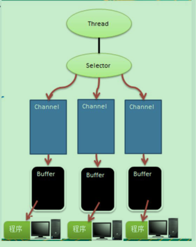
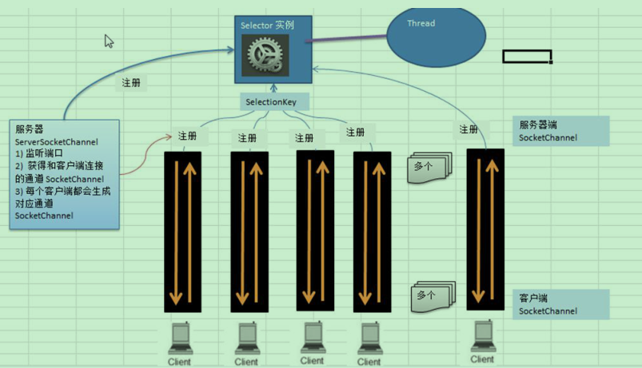
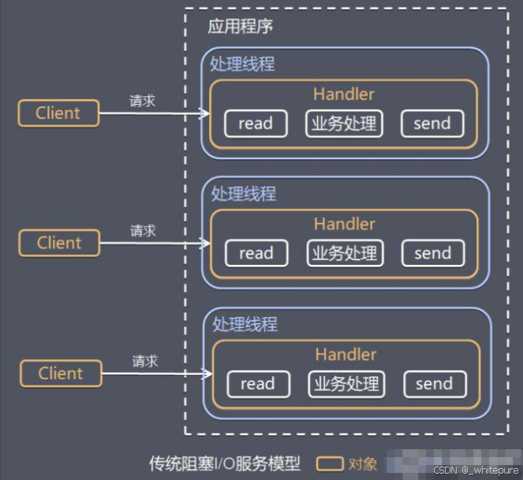
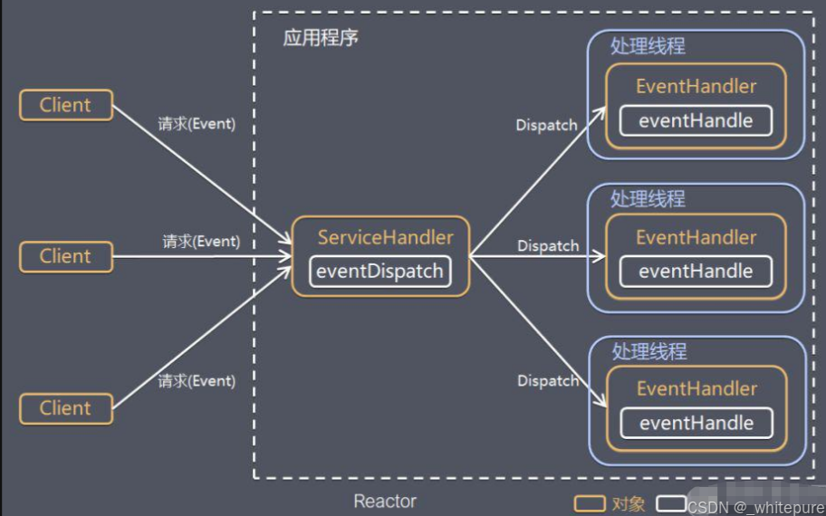
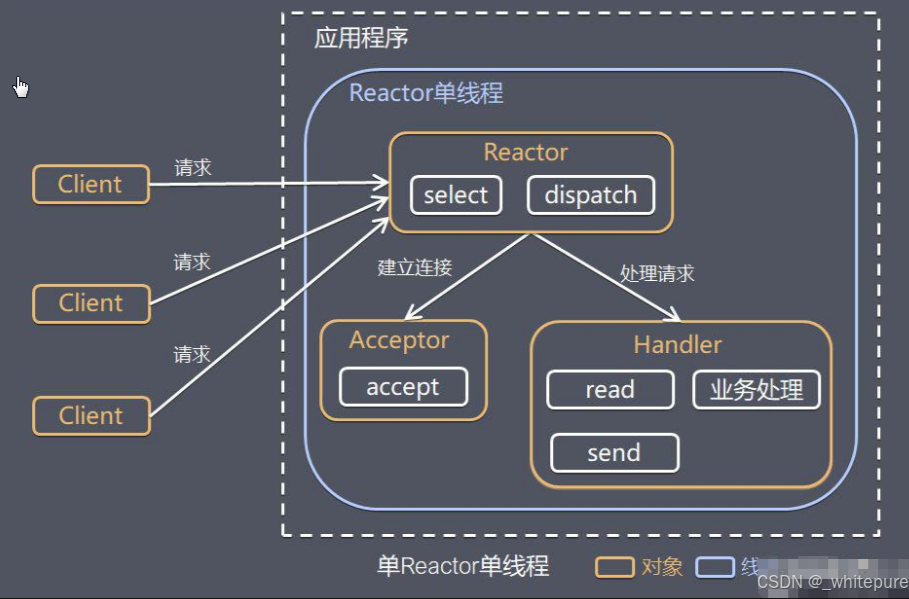
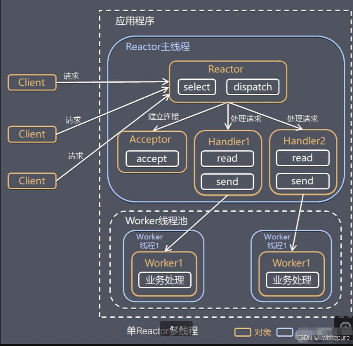
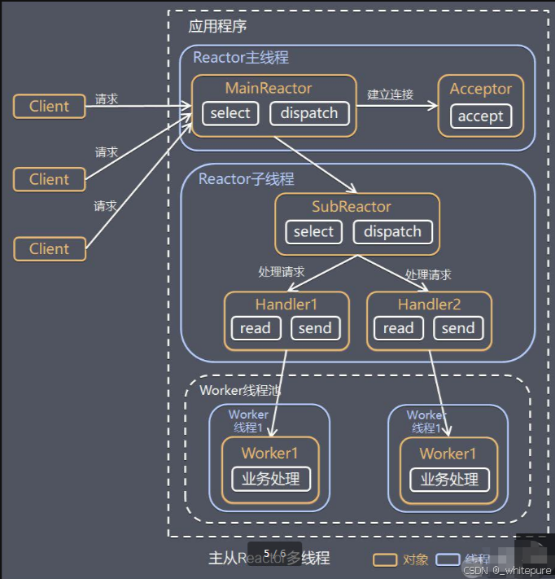
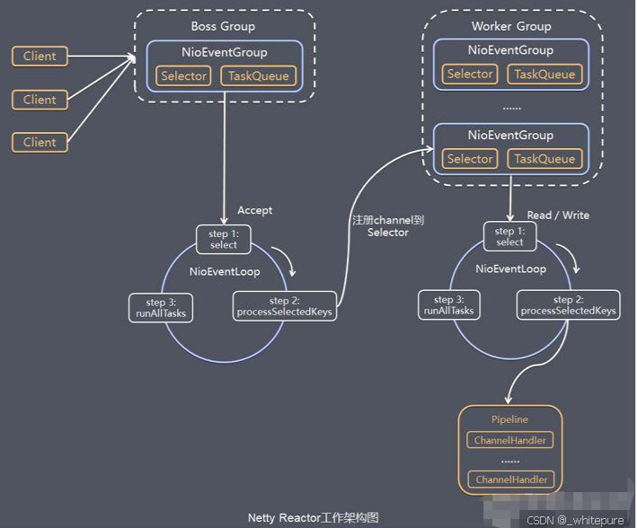

# netty

## 介绍

Netty 是一个**异步的、基于事件驱动的网络应用框架**，用以快速开发高性能、高可靠性的网络 IO 程序。

Netty 主要针对在 **TCP 协议下，面向 Clients 端的高并发应用**，或者 Peer-to-Peer 场景下的大量数据持续传输的
应用。
Netty **本质是一个 NIO 框架**，适用于服务器通讯相关的多种应用场景

`Netty`是一个高效的网络框架，专注于处理大量[并发](https://so.csdn.net/so/search?q=并发&spm=1001.2101.3001.7020)连接。它通过异步IO处理来避免阻塞，这让它在处理高并发时表现出色。`Netty`还利用了优化的内存管理和[零拷贝](https://so.csdn.net/so/search?q=零拷贝&spm=1001.2101.3001.7020)技术，降低了性能开销。框架的灵活性也很高，开发者可以通过管道机制自定义数据处理流程，API和文档丰富，帮助简化网络编程。

## 应用

阿里分布式服务框架 **Dubbo** 的 RPC 框架使用 Dubbo 协议进行节点间通信，**Dubbo 协议默认使用 Netty 作为基础通信组件**，用于实现各进程节点之间的内部通信

地图服务器之间可以方便的通过 Netty 进行高性能的通信及游戏、手游。

## IO模型

I/O 模型简单的理解：就是**用什么样的通道进行数据的发送和接收**，很大程度上决定了程序通信的性能
Java 共支持 3 种网络编程模型/IO 模式：**BIO、NIO、AIO**

### BIO

#### 介绍

BIO(blocking I/O) ： **同步阻塞**，服务器实现模式为一个连接一个线程，即**客户端有连接请求时服务器端就需要启动一个线程进行处理**，如果这个连接不做任何事情会造成不必要的线程开销，可以通过线程池机制改善(实现多个客户连接服务器)。

适用于**<u>*连接数目比较小且固定的架构*</u>**，这种方式对服务器资源要求比较高，并发局限于应用中，JDK1.4以前的唯一选择，程序简单易理解

#### 流程

1)服务器端启动一个 ServerSocket
2)客户端启动 Socket 对服务器进行通信，默认情况下服务器端需要对每个客户 建立一个线程与之通讯

3)客户端发出请求后, 先咨询服务器是否有线程响应，如果没有则会等待，或者被拒绝
4)如果有响应，客户端线程会等待请求结束后，在继续执行

### NIO

#### 介绍

java non-blocking IO  **同步非阻塞的**

NIO 有三大核心部分：**Channel(通道)，Buffer(缓冲区), Selector(选择器选择器)**

NIO 是 **面向缓冲区 ，或者面向 块 编程的编程的。**

通俗理解：NIO 是可以做到用一个线程来处理多个操作的。假设有 10000 个请求过来,根据实际情况，可以分配50 或者 100 个线程来处理。不像之前的阻塞 IO 那样，非得分配 10000 个。
**HTTP2.0 使用了多路复用的技术，做到同一个连接并发处理多个请求，而且并发请求的数量比 HTTP1.1 大了好**几个数量级**

####  NIO 的 Selector 、 Channel 和 Buffer 的关系



1)每个 channel 都会对应一个 Buffer
2)**Selector 对应一个线程， 一个线程对应多个 channel(连接)**
3)该图反应了有三个 channel 注册到 该 selector //程序
4)程序切换到哪个 channel 是有事件决定的, Event 就是一个重要的概念
5)Selector 会根据不同的事件，在各个通道上切换
6)**Buffer 就是一个内存块 ， 底层是有一个数组**
7)**数据的读取写入是通过 Buffer**, 这个和 BIO , BIO 中要么是输入流，或者是输出流, 不能双向，但是 **NIO 的 Buffer 是可以读也可以写, 需要 flip 方法切换**
**channel 是双向的, 可以返回底层操作系统的情况**, 比如 Linux ， 底层的操作系统通道就是双向的.

#### buffer

缓冲区（Buffer）：缓冲区**本质上是一个可以读写数据的内存块**，可以理解成是**一个容器对象容器对象(含数组含数组)**，该对象提供了一组方法，可以更轻松地使用内存块，，缓冲区对象内置了一些机制，能够跟踪和记录缓冲区的状态变化

Channel 提供从文件、网络读取数据的渠道，但是读取或写入的数据都必须经由 Buffer。

#### channel

1)NIO 的通道类似于流，但有些区别如下：
通道可以**同时进行读写**，而流只能读或者只能写
通道可以实现**异步读写数据**
通道可以从缓冲读数据，也可以写数据到缓冲:
2)BIO 中的 stream 是单向的，例如 FileInputStream 对象只能进行读取数据的操作，而 **NIO 中的通道(Channel)是双向的，可以读操作，也可以写操作**。
3)Channel 在 NIO 中是一个接口

```java
public interface Channel extends Closeable{}
```

4)常 用 的Channel 类 有 ： FileChannel 、 DatagramChannel 、 ServerSocketChannel 和SocketChannel 。【ServerSocketChanne 类似 ServerSocket , SocketChannel 类似 Socket】
5)<u>**FileChannel 用 于 文 件 的 数 据 读 写， DatagramChannel 用 于UDP 的 数 据读 写 ， ServerSocketChannel 和SocketChannel 用于 TCP 的数据读写**</u>

#### selector

Selector 能够检测多个注册的通道上是否有事件发生(注意:**多个 Channel 以事件的方式可以注册到同一个Selector**)，如果有事件发生，便获取事件然后针对每个事件进行相应的处理。这样就可以只用一个单线程去管理多个通道，也就是管理多个连接和请求。

```java
selector.select()//阻塞
selector.select(1000);//阻塞 1000 毫秒，在 1000 毫秒后返回
selector.wakeup();//唤醒 selector
selector.selectNow();//不阻塞，立马返还
```

#### SelectionKey

表示 Selector 和网络通道的注册关系

int OP_ACCEPT：有新的网络连接可以 accept，值为 16
int OP_CONNECT：代表连接已经建立，值为 8
int OP_READ：代表读操作，值为 1
int OP_WRITE：代表写操作，值为 4
源码中：
public static final int OP_READ = 1 << 0;
public static final int OP_WRITE = 1 << 2;
public static final int OP_CONNECT = 1 << 3;
public static final int OP_ACCEPT = 1 << 4;

#### ServerSocketChannel

 ServerSocketChannel 在服务器端监听新的客户端 Socket 连接

#### SocketChannel

网络 IO 通道，具体负责进行读写操作


#### NIO 非阻塞 网络编程原理分析图




1)当**客户端连接时，会通过 ServerSocketChannel 得到 SocketChannel**
2)**Selector 进行监听**select 方法, 返回有事件发生的通道的个数.
3)将 **socketChannel 注册到 Selector** 上, register(Selector sel, int ops), 一个 selector 上可以注册多个 SocketChannel
4)**注册后返回一个 SelectionKey, 会和该 Selector 关联**(集合)

5) **(有事件发生)，进一步得到各个 SelectionKey**
6)在**通过 SelectionKey反向获取 SocketChannel , 方法 channel()**
7)可以通过得到的 channel, 完成业务处理


#### 零拷贝

零拷贝描述的是**CPU不执行拷贝数据**从一个存储区域到另一个存储区域的任务，这通常用于通过网络传输一个文件时以减少CPU周期和内存带宽。

mmp

mmap 通过内存映射，将文件映射到内核缓冲区，同时，用户空间可以共享内核空间的数据。这样，在进行网
络传输时，就可以减少内核空间到用户空间的拷贝次数

sendFile

Linux 2.1 版本 提供了 sendFile 函数，其基本原理如下：数据根本不经过用户态，直接从内核缓冲区进入到
Socket Buffer，同时，由于和用户态完全无关，就减少了一次上下文切换

比较

1)mmap 适合小数据量读写，sendFile 适合大文件传输。
2)mmap 需要 4 次上下文切换，3 次数据拷贝；sendFile 需要 3 次上下文切换，最少 2 次数据拷贝。
3)sendFile 可以利用 DMA 【directmemory access 直接内存拷贝(不使用 CPU)】方式，减少 CPU 拷贝，mmap 则不能（必须从内核拷贝到 Socket 缓冲区）。


### AIO

Asynchronous I/O，即 AIO

AIO 即 NIO2.0，叫做**异步不阻塞的 IO**。AIO 引入异步通道的概念，采用了 **Proactor** 模式，简化了程序编写，有效的请求才启动线程，它的特点是先由操作系统完成后才通知服务端程序启动线程去处理，一般适用于**连接数较多且连接时间较长的应用**


### NIO和BIO比较

1)**BIO 以流的方式处理数据,**而 **NIO 以块的方式处理数据**,块 I/O 的效率比流 I/O 高很多
2)BIO 是阻塞的，**NIO 则是非阻塞的**
3)BIO 基于字节流和字符流进行操作，而 **NIO 基于 Channel(通道)和 Buffer(缓冲区)进行操作**，数据总是从通道读取到缓冲区中，或者从缓冲区写入到通道中。**Selector(选择器)用于监听多个通道的事件（比如：连接请求，数据到达等）**，因此使用单个线程就可以监听多个客户端通道

## 线程模型

### 传统IO模型



> 传统IO模型通常使用阻塞方式处理IO操作，其中每个IO请求都会分配一个线程，该线程在等待数据传输时会被阻塞。这种方式简单易理解
>
> 但在高并发环境下，线程的创建、销毁和上下文切换开销较大，导致性能问题。每个线程的阻塞状态使得系统资源利用效率低，处理大量并发连接时表现不佳。

### Reactor模型



> 1. 它基于IO复用模型，多个连接共用一个阻塞对象，应用程序只需要在一个阻塞对象等待，无需阻塞等待所有连接。
> 2. 当某个连接有新的数据可以处理时，操作系统通知应用程序，线程从阻塞状态返回，开始进行业务处理
>
> 当客户端发起请求时，通过`DispatcherHandler`进行分发请求处理到线程池，线程池中在使用具体的线程进行事件处理。服务器端程序处理传入的多个请求，并将它们同步分派到相应的处理线程，因此`Reactor`模式也叫`Dispatcher`模式

#### 单Reactor单线程



> `工作原理`
>
> 1. Reactor对象通过Select监控客户端请求事件，收到事件后通过Dispatch进行分发；
>
> 2. 如果是建立连接请求事件，则由Acceptor通过Accept处理连接请求，然后创建一个Handler对象处理连接完成后的后续业务处理；
> 3. 如果不是建立连接事件，则Reactor会分发调用连接对应的Handler来响应；
> 4. Handler会完成 Read → 业务处理 → Send 的完整业务流程；
>
> `优点`
>
> 其简单性和高效的资源利用。由于只有一个线程负责处理所有的IO事件，这种模型避免了多线程管理的复杂性，减少了上下文切换和线程开销，使得系统资源消耗较少。在低并发环境下，这种模型可以有效地处理IO操作，降低了系统的复杂性和开发难度。
>
> `缺点`
>
> - 在高并发场景中，单线程可能成为性能瓶颈，无法处理大量的并发请求
> - 如果某个IO操作发生阻塞，可能会影响到其他事件的处理，导致整体系统性能下降
>
> `适用场景`
>
> 适用于连接数目较少、负载不高的应用场景

#### 单Reactor多线程



> `工作原理`
>
> 1. Reactor对象通过对select监听请求事件，收到请求事件后交给Dispatch进行转发；
>
> 2. 如果是建立连接请求，则通过accept处理连接请求，然后创建一个handler对象处理完成连接后的事件；
> 3. 如果不是建立连接请求，则直接交给handler对象；
> 4. handler只负责响应事件，不做具体的业务处理，通过read读取完后，分发给下面的 worker线程池中某个线程处理；
> 5. worker 线程负责处理具体业务，处理完成后会将具体的结果返回给handler；
> 6. handler线程通过send方法返回给客户端；
>
> `优缺点`
>
> 单`Reactor`多线程模型通过引入多个工作线程来处理IO操作，能够更好地利用多核CPU的资源，提升了系统的并发处理能力和整体性能。但是`Reactor`对象在处理所有事件的监听和响应都是单线程的，在高并发场景容易出现性能瓶颈。

Netty 线程模式(**Netty 主要基于主从 Reactor 多线程模型做了一定的改进，其中主从 Reactor 多线程模型有多个 Reactor**)

#### 主从Reactor多线程



> `工作原理`
>
> 1. Reactor主线程MainReactor对象通过select监听连接事件，收到事件后，通过Acceptor处理连接事件；
>
> 2. 当Acceptor处理连接事件后，MainReactor 将连接分配给SubReactor；
> 3. SubReactor将连接加入到连接队列进行监听，并创建handler进行各种事件处理；
> 4. 当有新事件发生时，SubReactor就会调用对应的handler处理；
> 5. handler只负责响应事件，不做具体的业务处理，通过read读取完后，分发给下面的worker线程池中某个线程处理；
> 6. worker线程负责处理具体业务，处理完成后会将具体的结果返回给handler；
> 7. handler线程通过send方法返回给客户端；
>
> `优点`
>
> 主Reactor线程负责监听和接收所有IO事件，而从Reactor线程池则处理具体的事件和业务逻辑。通过将事件的监听和处理分离，主Reactor线程可以专注于高效地接受新的连接和事件，而从Reactor线程池则可以并行处理实际的IO操作。这种设计充分利用了多核CPU的资源，显著提升了系统的并发处理能力和响应速度。
>

## netty模型

基于主从reactor模型优化




> `工作流程`
>
> - Netty抽象出两组线程池 BossGroup专门负责接收客户端的连接，WorkerGroup专门负责网络的读写；BossGroup和WorkerGroup类型都是NioEventLoopGroup；
>
> - NioEventLoopGroup相当于一个事件循环组，这个组中含有多个事件循环，每一个事件循环是NioEventLoop，每个NioEventLoop都有一个Selector，用于监听绑定在其上的socket的网络通讯；
>
> - NioEventLoopGroup可指定多个NioEventLoop；
>
> - 每个BossNioEventLoop循环执行的步骤：
>
>   轮询accept事件；
>
>   处理accept事件，与client建立连接，生成NioSocketChannel，并将其注册到某个workerNioEventLoop上的Selector；
>
>   处理任务队列的任务，即runAllTasks；
>
> - 每个WorkerNioEventLoop循环执行的步骤：
>
>   轮询read，write事件；
>
>   处理IO事件，即read，write事件，在对应NioSocketChannel处理；
>
>   处理任务队列的任务，即runAllTasks；
>
>   每个WorkerNioEventLoop处理业务时，会使用pipeline，pipeline中包含了channel，即通过pipeline可以获取到对应通道，管道中维护了很多的处理器

## 核心组件

- Bootstrap/ServerBootstrap: Bootstrap 用于客户端的启动配置，指定服务器地址、端口等参数。ServerBootstrap 用于服务端配置，处理客户端连接请求。这两个组件通过 EventLoopGroup 配置 IO 线程池，管理网络 IO 操作的线程资源。

- EventLoopGroup: 这个组件管理着多个 EventLoop 实例，每个 EventLoop 负责处理网络 IO 操作。EventLoopGroup 通过线程池分配线程给 EventLoop，使得网络事件的处理更加高效。启动工具通过 EventLoopGroup 配置和管理这些线程池。
- EventLoop: EventLoop 是一个单线程的组件，处理多个 Channel 的网络 IO 操作。每个 EventLoop 负责处理自己的 Channel 读写任务，减少了线程切换的开销，提升了 IO 操作的效率。
- Channel: Channel 代表一个网络连接，用于数据的发送和接收。每个 Channel 由一个 EventLoop 进行管理。Channel 使用 ChannelPipeline 处理数据流，负责实际的数据传输工作。
- ChannelPipeline: ChannelPipeline 是 Channel 内的数据处理链。它包含多个 ChannelHandler，按顺序处理传入和传出的数据。数据流通过 ChannelPipeline 进行一系列处理，执行编解码、业务逻辑等操作。
- ChannelHandler: ChannelHandler 是处理数据的组件，执行特定的逻辑，如编解码、业务处理等。它们被添加到 ChannelPipeline 中，并按顺序处理数据流。每个 ChannelHandler 处理完数据后，将结果传递给下一个 ChannelHandler。
- ByteBuf: ByteBuf 是用于高效存储和处理数据的缓冲区。与传统的 Java NIO 缓冲区相比，它支持动态扩展和更高效的内存管理。ByteBuf 用于存储和操作网络传输的数据，提升了数据处理的性能。
- ChannelFuture: ChannelFuture 表示一个异步操作的结果。它跟踪操作的状态，允许查询操作是否完成，并在操作完成后执行回调。ChannelFuture 提供了获取操作结果和处理异步操作的机制。
- ChannelPromise: ChannelPromise 是 ChannelFuture 的一个特定形式，表示异步操作的结果。与 ChannelFuture 类似，它允许设置操作的完成状态或异常，并通知其他组件操作的结果，用于异步操作完成后的结果通知。
- ByteBufAllocator: ByteBufAllocator 负责创建和管理 ByteBuf 实例。它提供了多种缓冲区分配方法，以满足不同性能需求。这个组件帮助高效管理 ByteBuf 的创建和释放，优化内存使用。
- FutureListener: FutureListener 是一个接口，用于监听 ChannelFuture 的完成状态。当异步操作完成时，FutureListener 执行特定的回调逻辑，处理操作结果或异常，提供了处理异步操作结果的机制。
- Callback Handler: Callback Handler 处理 FutureListener 的回调。当异步操作完成后，Callback Handler 接收回调通知，并执行相应的业务处理逻辑，确保操作结果能够被适当地处理

## Bootstrap

`Bootstrap`作为整个`Netty`客户端和服务端的程序入口，可以把`Netty`的核心组件像搭积木一样组装在一起。`Netty`服务端的启动过程大致分为三个步骤：

1.  配置线程池：`Netty` 是采用 `Reactor`模型进行开发的，可以非常容易切换三种 `Reactor` 模式：单线程模式、多线程模式、主从多线程模式

- 单线程模式：`Reactor`单线程模型所有IO操作都由一个线程完成，所以只需要启动一个`EventLoopGroup`即可。

```java
EventLoopGroup group = new NioEventLoopGroup(1);
ServerBootstrap b = new ServerBootstrap();
b.group(group)
```

- 多线程模式：在`Netty`中使用`Reactor`多线程模型与单线程模型非常相似，区别是`NioEventLoopGroup`可以不需要任何参数，它默认会启动2倍CPU核数的线程。当然你也可以自己手动设置固定的线程数。

```java
EventLoopGroup group = new NioEventLoopGroup();
ServerBootstrap b = new ServerBootstrap();
b.group(group)

```

- 主从多线程模式：`Boss`是主`Reactor`，`Worker`是从`Reactor`。它们分别使用不同的`NioEventLoopGroup`，主`Reactor`负责处理`Accept`，然后把`Channel`注册到从`Reactor`上，从`Reactor`主要负责`Channel`生命周期内的所有IO事件

```java
EventLoopGroup bossGroup = new NioEventLoopGroup();
EventLoopGroup workerGroup = new NioEventLoopGroup();
ServerBootstrap b = new ServerBootstrap();
b.group(bossGroup, workerGroup)
```

2.`Channel`初始化

- 设置`Channel`类型：NIO模型是`Netty`中最成熟且被广泛使用的模型。因此，推荐`Netty`服务端采用`NioServerSocketChannel`作为`Channel`的类型，客户端采用`NioSocketChannel`。

```java
b.channel(NioServerSocketChannel.class);
```

- 注册`ChannelHandler`：在`Netty`中可以通过`ChannelPipeline`去注册多个`ChannelHandler`，每个`ChannelHandler`各司其职，这样就可以实现最大化的代码复用。

  Channel初始化时都会绑定一个Pipeline，它主要用于服务编排。Pipeline管理了多个ChannelHandler。IO事件依次在ChannelHandler中传播，ChannelHandler负责业务逻辑处理。上述HTTP服务器示例中使用链式的方式加载了多个ChannelHandler，包含HTTP编解码处理器、HTTPContent压缩处理器、HTTP消息聚合处理器、自定义业务逻辑处理器


```java
b.childHandler(new ChannelInitializer<SocketChannel>() {
    @Override
    public void initChannel(SocketChannel ch) {
        ch.pipeline()
                .addLast("codec", new HttpServerCodec())
                .addLast("compressor", new HttpContentCompressor())
                .addLast("aggregator", new HttpObjectAggregator(65536)) 
                .addLast("handler", new HttpServerHandler());
    }
})

```

- 设置`Channel`参数：`Netty`提供了十分便捷的方法，用于设置`Channel`参数。关于`Channel`的参数数量非常多，如果每个参数都需要自己设置，那会非常繁琐。`Netty`提供了默认参数设置，实际场景下默认参数已经满足我们的需求，我们仅需要修改自己关系的参数即可.`ServerBootstrap`设置`Channel`属性有`option`和`childOption`两个方法，`option`主要负责设置`Boss`线程组，而`childOption`对应的是`Worker`线程组。

```java
b.option(ChannelOption.SO_KEEPALIVE, true);
```

3.端口绑定：在完成上述`Netty`的配置之后，`bind`方法会真正触发启动，`sync`方法则会阻塞，直至整个启动过程完成。

```java
ChannelFuture f = b.bind().sync();
```

## EventLoop

Netty中EventLoop是Netty Reactor线程模型的事件处理引擎。每个EventLoop线程都维护一个Selector选择器和任务队列taskQueue。它主要负责处理IO事件、普通任务和定时任务。Netty中推荐使用NioEventLoop作为实现类，NioEventLoop最核心的run()方法源码如下

```java
protected void run() {
    for (;;) {
        try {
            try {
                switch (selectStrategy.calculateStrategy(selectNowSupplier, hasTasks())) {
                case SelectStrategy.CONTINUE:
                    continue;
                case SelectStrategy.BUSY_WAIT:
                case SelectStrategy.SELECT:
                    select(wakenUp.getAndSet(false)); // 轮询 IO 事件
                    if (wakenUp.get()) {
                        selector.wakeup();
                    }
                default:
                }
            } catch (IOException e) {
                rebuildSelector0();
                handleLoopException(e);
                continue;
            }
            cancelledKeys = 0;
            needsToSelectAgain = false;
            final int ioRatio = this.ioRatio;
            if (ioRatio == 100) {
                try {
                    processSelectedKeys(); // 处理 IO 事件
                } finally {
                    runAllTasks(); // 处理所有任务
                }
            } else {
                final long ioStartTime = System.nanoTime();
                try {
                    processSelectedKeys(); // 处理 IO 事件
                } finally {
                    final long ioTime = System.nanoTime() - ioStartTime;
                    runAllTasks(ioTime * (100 - ioRatio) / ioRatio); // 处理完 IO 事件，再处理异步任务队列
                }
            }
        } catch (Throwable t) {
            handleLoopException(t);
        }
        try {
            if (isShuttingDown()) {
                closeAll();
                if (confirmShutdown()) {
                    return;
                }
            }
        } catch (Throwable t) {
            handleLoopException(t);
        }
    }
}

```

NioEventLoop每次循环的处理流程都包含事件轮询select、事件处理processSelectedKeys、任务处理runAllTasks几个步骤，是典型的Reactor线程模型的运行机制。而且Netty提供了一个参数ioRatio，可以调整IO事件处理和任务处理的时间比例。

## `NioEventLoop`的事件处理机制

NioEventLoop的事件处理机制采用的是无锁串行化的设计思路。

- BossEventLoopGroup和WorkerEventLoopGroup包含一个或者多个NioEventLoop。BossEventLoopGroup负责监听客户端的Accept事件，当事件触发时，将事件注册至WorkerEventLoopGroup中的一个NioEventLoop上。每新建一个Channel， 只选择一个NioEventLoop与其绑定。所以说Channel生命周期的所有事件处理都是线程独立的，不同的NioEventLoop线程之间不会发生任何交集。

- NioEventLoop完成数据读取后，会调用绑定的ChannelPipeline进行事件传播，ChannelPipeline也是线程安全的，数据会被传递到ChannelPipeline的第一个ChannelHandler中。数据处理完成后，将加工完成的数据再传递给下一个ChannelHandler，整个过程是串行化执行，不会发生线程上下文切换的问题。

## 空轮询

在 JDK中，`Epoll`的实现是存在漏洞的，即使`Selector`轮询的事件列表为空，`NIO`线程一样可以被唤醒，导致CPU100%占用。这就是臭名昭著的JDK `epoll`空轮询的Bug。

`1、Netty采用了机制来检测线程是否可能陷入空轮询。在执行select()操作之前，记录当前时间。通过比较事件轮询的持续时间与预期的超时时间，Netty能够判断是否发生了空轮询。`

`2、Netty引入了计数变量selectCnt，每完成一次空的select操作进行一次计数。当selectCnt达到阈值时，会重建Selector对象。这种方法避免了JDK epoll的空轮询Bug`

## TCP粘包拆包

粘包就是多个数据包被合并成一个包进行发送。在接收端，数据包无法区分它们的边界，导致接收到的数据流是混合的。

拆包是一个数据包被拆分成多个包进行发送。在接收端，可能会将多个数据包的内容错误地合并为一个包

`比较通用的做法就是每次发送一个应用数据包前在前面加上四个字节的包长度值，指明这个应用包的真实长度`

### 一个完备的网络协议需要具备的基本要素：

```
+---------------------------------------------------------------+

| 魔数 2byte | 协议版本号 1byte | 序列化算法 1byte | 报文类型 1byte  |

+---------------------------------------------------------------+

| 状态 1byte |        保留字段 4byte     |      数据长度 4byte     | 

+---------------------------------------------------------------+
|                   数据内容 （长度不定）                          |
+---------------------------------------------------------------+

```

1. 魔数：魔数是通信双方协商的一个暗号，通常采用固定的几个字节表示。魔数的作用是防止任何人随便向服务器的端口上发送数据。服务端在接收到数据时会解析出前几个固定字节的魔数，然后做正确性比对。如果和约定的魔数不匹配，则认为是非法数据，可以直接关闭连接或者采取其他措施以增强系统的安全防护。魔数的思想在压缩算法、Java Class 文件等场景中都有所体现，例如 Class 文件开头就存储了魔数 0xCAFEBABE，在加载 Class 文件时首先会验证魔数的正确性。

2. 协议版本号：随着业务需求的变化，协议可能需要对结构或字段进行改动，不同版本的协议对应的解析方法也是不同的。所以在生产级项目中强烈建议预留协议版本号这个字段。
3. 序列化算法：序列化算法字段表示数据发送方应该采用何种方法将请求的对象转化为二进制，以及如何再将二进制转化为对象，如 JSON、Hessian、Java 自带序列化等。
4. 报文类型：在不同的业务场景中，报文可能存在不同的类型。例如在 RPC 框架中有请求、响应、心跳等类型的报文，在 IM 即时通信的场景中有登陆、创建群聊、发送消息、接收消息、退出群聊等类型的报文。
5. 长度域字段：长度域字段代表请求数据的长度，接收方根据长度域字段获取一个完整的报文。
6. 请求数据：请求数据通常为序列化之后得到的二进制流，每种请求数据的内容是不一样的。
7. 状态：状态字段用于标识请求是否正常。一般由被调用方设置。例如一次 RPC 调用失败，状态字段可被服务提供方设置为异常状态。
8. 保留字段：保留字段是可选项，为了应对协议升级的可能性，可以预留若干字节的保留字段，以备不时之需

## Netty内存池管理

`PooledByteBufAllocator`是`Netty`提供的内存池实现。它用于分配和管理`ByteBuf`对象，减少频繁的内存分配和释放操作，提高性能

`内存分配过程`

1. 分配请求处理：当应用程序需要分配内存时，Netty首先检查是否可以从 PoolThreadCache中获得所需的内存块。PoolThreadCache 是Netty为每个线程维护的缓存，它用于存储和管理小块内存。这种缓存机制目的是提高内存分配的速度，减少线程间的竞争。

2. 线程缓存检查：如果 PoolThreadCache 中有足够的空闲内存块，Netty将直接从缓存中分配内存。这种方式比从全局内存池中分配内存要快，因为它避免了对全局内存池的访问和管理开销。线程缓存的使用可以显著减少内存分配和释放的延迟。
3. 请求PoolArena：当线程缓存中的内存不足以满足请求时，Netty将向PoolArena请求内存PoolArena 负责管理整个内存池中的内存块，它会根据内存块的大小选择适当的管理策略。
4. PoolArena内存分配：PoolArena 处理内存分配时，会根据内存块的大小选择不同的管理策略。对于较小的内存块，PoolArena 使用 PoolSubpage 进行内存分配。PoolSubpage 使用位图来跟踪和管理内存块的使用状态，来减少内存碎片。对于较大的内存块，PoolArena 使用 PoolChunk，PoolChunk通过伙伴算法或其他内存管理策略来处理大块内存。PoolChunk 负责分配较大的内存区域，能够应对不同的内存请求。
5. 内存分配和回收：内存块从PoolArena的PoolSubpage或PoolChunk中分配后，会被返回给应用程序使用。释放内存时，内存块将被归还到相应的内存管理区域。根据内存块的大小和当前的缓存状态，内存块可能会被归还到线程缓存中，或者直接归还到 PoolArena 中进行进一步管理。
6. 线程缓存整理：为了保持线程缓存的有效性，Netty 定期对 PoolThreadCache 中的内存块进行整理。这一过程可以减少内存碎片，提高内存使用效率。当线程结束时，与该线程相关的线程缓存内存也会被释放和整理。

## Netty零拷贝

假设我们有一个大文件，需要将其内容发送到客户端。传统的文件传输流程如下：

1. 将文件内容从磁盘读取到内存中的缓冲区。这一步需要将文件的数据从磁盘拷贝到操作系统的内核空间，再拷贝到用户空间。
2. 将内存中的数据通过网络发送到客户端。这需要将数据从用户空间再次拷贝到内核空间，并通过网络传输

`netty零拷贝过程`

1. 创建直接内存缓冲区：Netty使用DirectByteBuf创建直接内存缓冲区，该缓冲区不在Java堆内存中，而是在操作系统的内存中。允许Netty直接操作内核空间的缓冲区。

2. 使用FileRegion直接传输文件内容：Netty提供了FileRegion接口和DefaultFileRegion实现，可以直接将文件内容从磁盘传输到网络通道。 FileRegion可以通过FileChannel的transferTo方法实现数据的零拷贝传输，不需要将文件内容加载到内存中。

`Netty的零拷贝实现`

1. 首先依赖于底层操作系统对零拷贝的支持。在UNIX和Linux系统中，这种支持主要体现在sendfile()方法的调用上。当Netty调用sendfile()时，数据从文件系统的内核缓冲区直接被传输到网络接口的内核缓冲区。这个过程完全在内核空间完成，不涉及用户空间，从而减少了内存拷贝和 CPU 的使用。
2. netty使用DirectByteBuf类来创建直接内存缓冲区。这些缓冲区分配在操作系统的直接内存中，而不是Java堆内存中。数据在网络通道和直接内存缓冲区之间传输，避免了数据在堆内存和直接内存之间的拷贝

## Netty心跳机制

> 所谓心跳，即在 TCP 长连接中，客户端和服务器之间定期发送的一种特殊的数据包，通知对方自己还在线，以确保 TCP 连接的有效性
> 在 Netty 中，实现心跳机制的关键是 IdLeStateHandler,构造配置
> readerIdleTimeSeconds: 读超时，即当在指定的时间间隔内没有从 Channel 读取到数据时，会触发 一个 READER_IDLE 的 IdleStateEvent 事件.
> writerIdleTimeSeconds: 写超时，即当在指定的时间间隔内没有数据写入到 Channel 时，会触发- 个 WRITER_IDLE 的 IdleStateEvent 事件。
> allIdleTimeSeconds: 读/写超时。即当在指定的时间间隔内没有读或写操作时，会触发一个ALL_IDLE 的 IdleStateEvent 事件.
