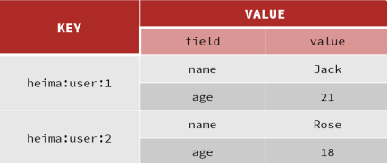
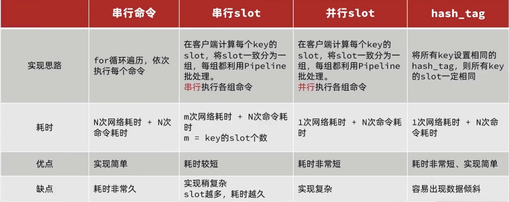
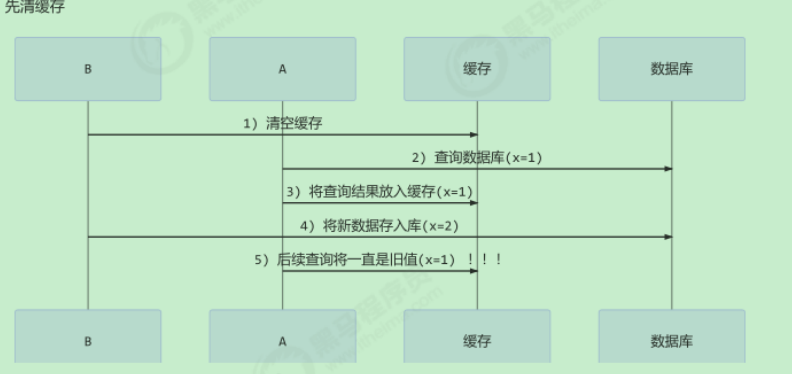
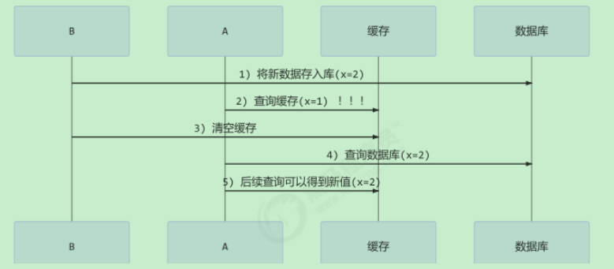
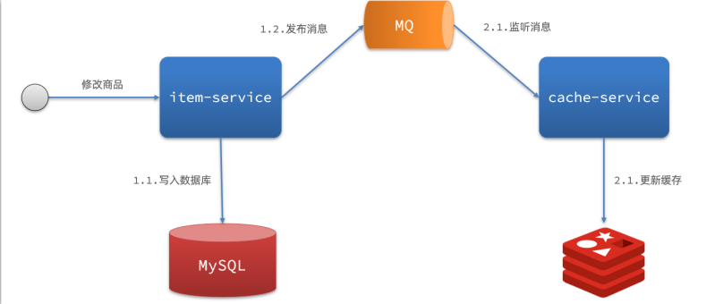
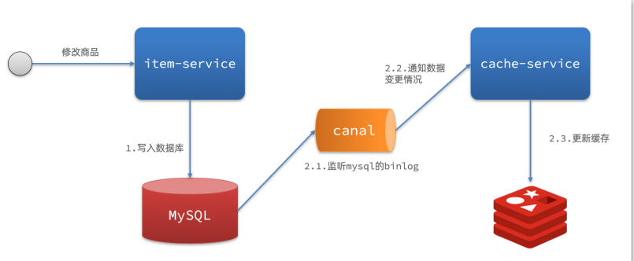

# Redis

### 介绍

> ==Redis remote dictionary server==
>
> 高性能key-value数据库，支持数据持久化，master-slave数据备份、提供string、set、list、hash、zset等数据结构存储。

### 数据类型支持

> ==数据类型支持==
>
> | 数据类型   | 样例                                                         | 命令                                                         | 存储的值                               | 读写能力                                                     |
> | ---------- | ------------------------------------------------------------ | ------------------------------------------------------------ | -------------------------------------- | ------------------------------------------------------------ |
> | String     | hello world 实际使用key的定义<br> • **[项目名]:[业务名]:[类型]:[id]** | SET：添加或者修改已经存在的一个String类 型的键值对 <br/>GET：根据key获取String类型的value <br/>MSET：批量添加多个String类型的键值对 <br/>MGET：根据多个key获取多个String类型的 value <br/>**INCR：让一个整型的key自增1** <br/>INCRBY:让一个整型的key自增并指定步长， 例如：incrby num 2 让num值自增2 <br/>INCRBYFLOAT：让一个浮点类型的数字自 增并指定步长 <br/>**SETNX**：**添加一个String类型的键值对，前提是这个key不存在，否则不执行** <br/>**SETEX**：添加一个String类型的键值对，并且**指定有效期** | 字符串 String，整数 int 或浮点数 float | 对字符串或一部分字符串执行操作；对整数进行自增和自减操作等 最大512m |
> | Hash       | {name: "Jack", age: 21} | HSET key field value：添加或者修改hash类型key的field的值 <br/>HGET key field：获取一个hash类型key的 field的值 <br/>HMSET：批量添加多个hash类型key的field 的值 <br/>HMGET：批量获取多个hash类型key的field 的值 <br/>HGETALL：获取一个hash类型的key中的所 有的field和value <br/>HKEYS：获取一个hash类型的key中的所有 的field <br/>HVALS：获取一个hash类型的key中的所有 的value <br/>HINCRBY:让一个hash类型key的字段值自增 并指定步长<br/>HSETNX：添加一个hash类型的key的field 值，前提是这个field不存在，否则不执行 | 包含键值对的 无序散列表                | 对 **单个 元素进行增、删、改** ；获取所以的键值对 等         |
> | List       | [A -> B -> C -> C]                                           | LPUSH key element ... ：向列表左侧插入一 个或多个元素 <br/>LPOP key：移除并返回列表左侧的第一个元 素，没有则返回nil <br/>RPUSH key element ... ：向列表右侧插入一 个或多个元素 <br/>RPOP key：移除并返回列表右侧的第一个元 素 <br/>LRANGE key star end：返回一段角标范围 内的所有元素<br/>BLPOP和BRPOP ：与LPOP和RPOP类 似，只不过 在没有元素时等待指定时间 ， 而不是直接返回nil | 链表上的节点 字符串元素                | 可以看作是双向链表结构。既可以支持正向检索和 也可以支持反向检索。 有序元素可以重复 插入和删除快 查询速度一般, 如 **朋友圈点赞列表，评论列表** |
> | Set        | {A, B, C}                                                    | SADD key member ... ：向set中添加一个或 多个元素 <br/>SREM key member ... : 移除set中的指定元 素 <br/>SCARD key： 返回set中元素的个数 <br/>SISMEMBER key member：判断一个元素 是否存在于set中 SMEMBERS：获取set中的所有元素 <br/>SINTER key1 key2 ... ：求key1与key2的交 集 <br/>SDIFF key1 key2 ... ：求key1与key2的差集 <br/>SUNION key1 key2 ..：求key1和key2的并集 | 元素不可重 复，查找快                  | 对单个 元素进行增、删、改； **计算集合 交，并补 集等**       |
> | Sorted Set | {A: 1, B: 2, C: 3}                                           | ZADD key score member：添加一个或多个 元素到sorted set ，如果已经存在则更新其 score值 <br/>ZREM key member：删除sorted set中的一 个指定元素 <br/>ZSCORE key member : 获取sorted set中的 指定元素的score值 <br/>ZRANK key member：获取sorted set 中的 指定元素的排名 <br/>ZCARD key：获取sorted set中的元素个数 <br/>ZCOUNT key min max：统计score值在给定 范围内的所有元素的个数<br/>ZINCRBY key increment member：让sorted set中的指定元素自增，步长为指定的 increment值 <br/>ZRANGE key min max：按照score排序 后，获取指定排名范围内的元素 <br/>ZRANGEBYSCORE key min max：按照 score排序后，获取指定score范围内的元素 <br/>ZDIFF、ZINTER、ZUNION：求差集、交 集、并集 注意：所有的排名默认都是升序，如果要降 序则在命令的Z后面添加REV即可 | 可排序 元素不重复 查询速度快           | 对单个 元素进行增、删、改；**按照分数范围查元素 等. 底层的实现是一个跳表（SkipList）加 hash 表。 排行榜使用** |
> | GEO        | {A:（120.3， 30.5）}                                         |                                                              | 地理坐标                               |                                                              |
> | Bitmap     | 0110110101110101011                                          |                                                              | 过滤 类型布 隆过滤器                   |                                                              |
> | hyperlog   | 0110110101110101011                                          |                                                              | pv 访问量之 类                         |                                                              |
>
> ==通用指令==
>
> 官网：http://doc.redisfans.com/
>
> KEYS：查看符合模板的所有key 
>
> DEL：删除一个指定的key 
>
> EXISTS：判断key是否存在 
>
> EXPIRE：给一个key设置有效期，有效期到期时该key会被自动删除 
>
> TTL：查看一个KEY的剩余有效期 通过help [command] 可以查看一个命令的具体用法，例如： help set 
>
> redis-server --service-install redis.windows-service.conf --loglevel verbose # 指定文件 安装到服务 windows 
>
> redis-server --service-start redis.windows-service.conf # 指定文件启动 
>
> redis-server --service-stop # 停止 
>
> config set requirepass 123456 #设置密码 或者配置文件也设置 requirepass 123456 重启
>
> | set key value      | 设置 key 值为 value                                      |
> | ------------------ | -------------------------------------------------------- |
> | get key            | 读取 key 的值                                            |
> | del key            | 删除 key                                                 |
> | expire key seconds | 设置 key 的生存时间（seconds 秒后自动删除）              |
> | ttl key            | 查看 key 剩余生存时间                                    |
> | exists key         | 判断 key 是否存在                                        |
> | ping               | 测试与服务端是否联通                                     |
> | keys *             | 匹配数据库中所有 key                                     |
> | dbsize             | 查询当前数据库中 key 的数量                              |
> | info               | 返回关于 Redis 服务器的各种信息和统计数值                |
> | flushdb            | 清空当前数据库中的所有 key                               |
> | flushall           | 清空整个 Redis 服务器的数据( 删除所有数据库的所有 key ） |
> | quit               | 请求服务器关闭与当前客户端的连接( 断开连接 )             |

### 应用

> 解决数据库压力，比如短息验证码有效期、session共享 
>
> 缓存 
>
> 计数器 
>
> 分布式会话 
>
> 排行榜 
>
> 最新列表 
>
> 分布式锁 
>
> 消息队列

### 集群方式

> ==客户端如何感知？==
>
> 客户端自动感知letture主从切换

#### 主从复制

> ==全量同步==
>
> 1：当一个从节点启动时，会向主数据库发送sync命令， 
>
> 2：主数据库接收到sync命令后会开始在后台保存快照（执行rdb操作），并将保存期间接收到的命令缓存起来记录在repl_backlog中 
>
> 3：当快照完成后，redis会将快照文件发送到slave，slave保存到磁盘上，然后加载到内存中 
>
> 4、master将RDB期间的命令记录在repl_baklog，并持续将log中的命令发送给slave。 
>
> 5、slave执行接收到的命令，保持与master之间的同步。 
>
> ==同步时间点：== 
>
> slave节点**第-次连接master节点时** 
>
> slave节点断开时间太久，**repl_baklog中的offset已经被覆盖时**
>
> [repl_baklog，**环状的数组**，**会记录Redis处理过的命令日志及offset，包括master当前的offset，和slave已经拷贝到的offset：**]
>
> ==增量同步==
>
> 1、slave提交自己的offset到master 
>
> 2、master获取 repl_baklog中从offset之后的命令给slave ，如果断开时间过久，则导致slave的offset被覆盖，需要进行全量同步。 
>
> ==同步时间点==
>
> slave节点断开又恢复，并且在repl_baklog中能找到offset时
>
> ==主从模式特性==
>
> **优点**
>
> - 主从模式的一个作用是**备份数据**，这样当一个节点损坏（指不可恢复的硬件损坏）时，数据因为有备份，可以方便恢复。 
> - 另一个作用是**负载均衡(也就是独写分离)**，所有客户端都访问一个节点肯定会影响Redis工作效率，有了主从以后，**查询操作就可以通过查询从节点来完成**。 
> - 一个Master可以有多个Slave 
> - 默认配置下，master节点可以进行读和写，slave节点只能进行读操作，写操作被禁止
>
> **缺点**
>
> master节点挂了以后，redis就不能对外提供写服务了，因为**剩下的slave不能成为master**
>
> **特性**
>
> - **支持断点续传**：master node会在内存中维护一个backlog，master和slave都会保存一个replica offset还有一个master id，在backlog中的。如果 master和slave网络连接断掉了，**slave会让master从上次的replica offset开始继续复制**。但是如果没有找到对应的offset，那么就会执行一次 resynchronization (** 依据repl_backlog中的offset实现 ） 
> - **无磁盘化复制**：master在内存中直接创建rdb，然后发送给slave，不会在自己本地落地磁盘了 ；repl-diskless-sync：无磁盘化同步 ；repl-diskless-sync-delay，等待一定时长再开始复制，因为要等更多slave重新连接过来 
> - **过期key处理** slave不会过期key，只会等待master过期key。如果**master过期了一个key**，或者通过LRU淘汰了一个key，那么会**模拟一条del命令发送给slave。**

#### 哨兵模式sentinel

> ==介绍==
>
> 哨兵(sentinel) 是一个**分布式系统** ,你可以在一个架构中运行多个**哨兵(sentinel) 进程**,**这些进程使用流言协议(gossipprotocols)来接收关于 Master是否下线的信息**, 并使用**投票协议(agreement protocols)来决定是否执行自动故障迁移 ,以及选择哪个Slave作为新的Master**. 其实是一个**运行在特殊模式下的 Redis 服务器** ，你可以在启动一个普通 Redis 服务器时通过给定 **--sentinel 选项来启动哨兵(sentinel).**
>
> ==特性==
>
> **监控**：哨兵(sentinel) 会不断地检查你的Master和Slave是否运作正常。 
>
> **通知**：当被监控的某个 Redis出现问题时, 哨兵(sentinel) 可以通过 API 向管理员或者其他应用程序发送通知 
>
> **自动故障转移**：当一个Master不能正常工作时，哨兵(sentinel) 会开始一次自动故障迁移操作,它会将失效Master的其中一个Slave升级为新的Master, 并让失效Master的其他Slave改为复制新的Master; 当客户端试图连接失效的Master时,集群也会向客户端返回新Master的地址,使得集群可以使用 Master代替失效Master
>
> ==选举(故障恢复原理)==
>
> 1、首先会判断**slave节点与master节点断开时间长短**，如果超过指定值down-after-milliseconds * 10)则会排除该slave节点、 
>
> 2、然后判断slave节点的**slave-priority值，越小优先级越高，如果是0则永不参与选举**、 
>
> 3、如果slave-prority一样，则判断**slave节点的offset值，越大说明数据越新，优先级越高** 
>
> 4、最后是判断**slave节点的运行id大小，越小优先级越高**
>
> ==切换(自动故障转移)==
>
> 1、sentinel**给备选的slave1节点发送 slaveof no one命令**，让该节点成为master 
>
> 2、sentinel**给所有其它slave发送slaveof 192,168.150.101 7802 命令**，让这些slave成为新master的从节点,、 
>
> 3、开始**从新的master上同步数据**，最后，**sentinel将故障节点标记为slave，自动成为新的master的slave节点**
>
> ==监控==
>
> Sentinel如何判断个redis实例是否健康? 
>
> 每隔1秒发送一次ping命令 ，如果**超过一定时间没有相向则认为是主观下线 如果大多数sentine1都认为实例主观下线 ，则判定服务下线**
>
> ==理解==
>
> - sentinel模式是**建立在主从模式的基础**上，如果**只有一个Redis节点，sentinel就没有任何意义** 
> - 当master节点挂了以后，sentinel会在slave中选择一个做为master，并修改它们的配置文件，其他slave的配置文件也会被修改，比如slaveof属性会指向新的master
> - 当master节点重新启动后，它将不再是master而是做为slave接收新的master节点的同步数据 
> - sentinel因为也是一个进程有挂掉的可能，所以**sentinel也会启动多个形成一个sentinel集群** 
> - 当主从模式配置密码时，sentinel也会同步将配置信息修改到配置文件中，不需要担心。 
> - 一个sentinel或sentinel集群可以管理多个主从Redis。 
> - sentinel最好不要和Redis部署在同一台机器，不然Redis的服务器挂了以后，sentinel也挂了 
> - sentinel监控的Redis集群都会定义一个master名字，这个名字代表Redis集群的master Redis。 
> - 当使用sentinel模式的时候，客户端就不要直接连接Redis，而是**连接sentinel的ip和port**，由sentinel来提供具体的可提供服务的Redis实现，这样当 master节点挂掉以后，sentinel就会感知并将新的master节点提供给使用者。 
> - sentinel模式基本可以满足一般生产的需求，具备高可用性。但是**当数据量过大到一台服务器存放不下的情况时，主从模式或sentinel模式就不能 满足需求**了，这个时候需要对存储的数据进行分片，将数据存储到多个Redis实例中，

#### cluster模式

> ==应用==
>
> 海量数据存储问题 
>
> 高并发写的问题
>
> ==特性==
>
> - 集群中有**多个master， 每个master保存不同数据** 
> - 每个master都可以有多个slave节点 
> - **master之间通过ping监测彼此健康状态** 
> - **客户端请求可以访问集群任意节点，最终都会被转发到正确节点**
>
> ==插槽原理==
>
> - Redis会**把每个master节点映射到0~16383共16384个插槽(hash slot)上** 
> - **数据key不是与节点绑定，而是与插槽绑定**。
> - redis会**根据key的有效部分计算插槽值**，分两种情况: key中包含”(》”，且”(》”中至少包含1个字符，“小"中的部分是有效部分, key中不包含”}”，整个key都是有效部分 
> - **计算方式是利用CRC16算法得到一个hash值，然后对16384取余 得到的结果就是slot**
>
> ```
> 如何将同一类数据固定的保存在同一个Redis实例? 
> 这类数据 使用相同的有效部分 ，例key都以typeld]为前缀值.
> ```
>
> ==理解==
>
> - cluster可以说是sentinel和主从模式的结合体，通过cluster可以实现主从和master重选功能，所以如果配置两个副本三个分片的话，就需要六个 Redis实例。 
> - 因为Redis的数据是根据一定规则分配到cluster的不同机器的，当**数据量过大时，可以新增机器进行扩容** 这种模式适合数据量巨大的缓存要求，当数据量不是很大使用sentinel即可。

### 事务

> Redis 事务可以一次执行多个命令，隔离操作、原子操作。
>
> 步骤：开始事务-》命令入队-》执行事务 
>
> el: **MULTI 开始一个事务， 然后将多个命令入队到事务中， 最后由 EXEC 命令触发事务**

### 持久化

#### RDB（快照）

> ==介绍==
>
> 默认开启。是在某个时间点将数据写入一个临时文件，持久化结束后，用这个临时文件替换上次持久化的文件，达到数据恢复。 
>
> **单独子线程来持久化**，保证了高性能，但是如果持久化期间redis发生故障，会有数据丢失。
>
> ```
> 1)rdb持久化为redis开启的默认持久化方式，可通过配置文件灵活配置，默认如下
> 1
> save 900 1 //15分钟内有一条数据写入时触发rdb持久化
> save 300 10 //5分钟内有10条数据写入时触发rdb持久化
> save 60 10000 //1分钟内有10000条数据写入时触发rdb持久化
> 1
> 2
> 3
> (2)除了默认触发之外，我们也可以通过redis客户端发送命令主动触发rdb持久化，具体命令如下：
> 1
> >save //主进程执行rdb持久化操作
> >bgsave //生成后台进程执行rdb持久化(默认方式)
> ```
>
> ==rdb持久化模式下，当机器宕机，会丢失多少数据？== 
>
> 答: 从最近一次rdb保存到宕机时的数据都会丢失 这个执行数据写入到临时文件的时间点是可以通过配置来自己确定的，通过配置redis 在 n 秒内如果超过 m 个 key 被修改这执行一次 RDB操作

#### AOF（append-only file）

> ==介绍==
>
> **默认关闭。**将“操作 + 数据”以格式化 **指令的方式追加到操作日志文件的尾部** ，“日志文件”保存了历史所有的操作过程； 
>
> 当 server 需要数据恢复时， 可以直接 replay 此日志文件 ，即可还原所有的操作过程。 保证了数据安全，但是**文件会过大。恢复时间慢**。 恢复时需要人工检测文件的完整性。
>
> ==配置==
>
> redis默认不开启aof持久化方式，可通过修改如下配置开启
>
> ```
> appendonly yes #yes开启no关
> ```
>
> aof持久化刷盘频率控制
>
> ```
> appendfsync always //每次命令都刷盘
> appendfsync everysec //每秒刷盘一次(默认)
> appendfsync no //从不刷盘，由内核去刷盘
> ```
>
> always：每一条 aof 记录都立即同步到文件，这是最安全的方式，也以为更多的磁盘操作和阻塞延迟，是 IO 开支较大。 
>
> **everysec**：每秒同步一次，性能和安全都比较中庸的方式，也是 **redis 推荐的方式**。如果遇到物理服务器故障，有可能导致最近一秒内 aof 记录丢 失(可能为部分丢失)。 no：redis 并不直接调用文件同步，而是交给操作系统来处理，操作系统可以根据 buffer 填充情况 / 通道空闲时间等择机触发同步；这是一种普通的 文件操作方式。性能较好，在物理服务器故障时，数据丢失量会因 OS 配置有关
>
> ==aof重写== 
>
> 1. **REWRITE**: 在主线程中重写AOF，会阻塞工作线程，在生产环境中很少使用，处于废弃状态； 
> 1. **BGREWRITE**: 在 **后台（子进程）重写AOF**, 不会阻塞工作线程，能正常服务，此方法最常用。

### 发布和订阅

> Redis 发布订阅(pub/sub)是一种消息通信模式：发送者(pub)发送消息，订阅者(sub)接收消息。

### Key的失效处理

> **定期删除和惰性删除** 
>
> 定期删除:指的是redis默认是每隔100ms就随机抽取一些设置了过期时间的key，检查其是否过期，如果过期就删除。 
>
> 惰性删除:在你获取某个key的时候，redis会检查一下 ，这个key如果设置了过期时间那么是否过期了,如果过期了此时就会删除，不会给你返回任何 东西。 
>
> ==定期删除漏掉了很多过期key，然后你也没及时去查，也就没走惰性删除，此时会怎么样？如果大量过期key堆积在内存里，导致redis内存块耗尽了，咋整？==
>
> **内存淘汰机制**
>
> | noeviction      | 当内存不足以容纳新写入数据时，**新写入操作会报错**，这个一般没人用 |
> | --------------- | ------------------------------------------------------------ |
> | allkeys-lru     | 当内存不足以容纳新写入数据时，在键空间中，**移除最近最少使用的key**（这个是最常用的） |
> | allkeys-random  | 当内存不足以容纳新写入数据时，在键空间中，**随机移除某个key**，这个一般没人用吧，为啥要随机，肯定是把最近最少使用的 key给干掉啊 |
> | volatile-lru    | 当内存不足以容纳新写入数据时，在**设置了过期时间的键空间中，移除最近最少使用的ke y**（这个一般不太合适） |
> | volatile-random | 当内存不足以容纳新写入数据时，在**设置了过期时间的键空间中，随机移除某个key** |
> | volatile-ttl    | 当内存不足以容纳新写入数据时，在**设置了过期时间的键空间中，有更早过期时间的key优先移除** |

### BigKey处理

> ==推荐值==
>
> 单个key的value小于10KB 
>
> 对于集合类型的key，建议元素数量小于1000 
>
> ==危害== 
>
> - 网络阻塞 对BigKey执行读请求时，少量的QPS就可能导致带宽使用率被占满，导致Redis实例，乃至所在物理机变慢 
> - 数据倾斜 BigKey所在的Redis实例内存使用率远超其他实例，无法使数据分片的内存资源达到均衡 
> - Redis阻塞 对元素较多的hash、list、zset等做运算会耗时较旧，使主线程被阻塞 
> - CPU压力 对BigKey的数据序列化和反序列化会导致CPU的使用率飙升，影响Redis实例和本机其它应用
>
> ==发现bigkey== 
>
> redis-cli -a 密码 --bigkeys 
>
> scan扫描Redis中的所有key，利用**strlen、hlen等命令判断key的长度** 
>
> 第三方工具 Redis-Rdb-Tools 分析RDB快照文件 
>
> 监控进出Redis的网络数据，超出预警值时主动告警 
>
> ==删除== 
>
> Redis在4.0后提供了异步删除的命令：**unlink**

### 批处理优化

> ==命令==
>
> 1、met hmet 命令 只能操作部分类型 
>
> 2、pipline
>
> ==pipline使用案例==
>
> ```java
> @Test
> void testPipeline() {
>  // 创建管道
>  Pipeline pipeline = jedis.pipelined();
>  long b = System.currentTimeMillis();
>  for (int i = 1; i <= 100000; i++) {
>      // 放入命令到管道
>      pipeline.set("test:key_" + i, "value_" + i);
>      if (i % 1000 == 0) {
>          // 每放入1000条命令，批量执行
>          pipeline.sync();
>      }
>  }
>  long e = System.currentTimeMillis();
>  System.out.println("time: " + (e - b));
> }
> ```
>
> ==集群下批量方案==
>
> **MSET或Pipeline这样的批处理需要在一次请求中携带多条命令，而此时如果Redis是一个集群，那批处理命令的多个key必须落在一个插槽中，否则 就会导致执行失败 集群下又该如何处理呢？**  ==选择第三种==
>
> 
>
> 

### 缓存更新策略

> 1、低一致性： **利用redis的内存淘汰机制，内存不足时，淘汰部分数据**，下次查询时更新缓存。 
>
> 2、高一致性：**主动更新，在修改数据库的同时，更新缓存**。同时给**缓存设置过期时间TTL作为兜底方案**。

### 数据库缓存不一致的解决方案

|            | Cache Aside Pattern(旁路缓存模式)                            | Read/Write Through Pattern(读写穿透模式)                     | Write Behind Pattern (异步缓存写入模式)                      |
| ---------- | ------------------------------------------------------------ | ------------------------------------------------------------ | ------------------------------------------------------------ |
| 说明       | 缓存调用者在更新完数据库后再去更新缓存，也称之为双写方案<br> | 应用程序只操作缓存，由缓存操作数据库。<br>Read-Through（穿透读模式/直读模式）：应用程序读缓存，缓存没有，由缓存回源到数据库，并写入缓存。（guavacache）<br>Write-Through（穿透写模式/直写模式）：应用程序写缓存，缓存写数据库。 | 调用者只操作缓存，其他线程去**异步处理数据库**，实现最终一致.<br> |
| 问题及解答 | ==删除缓存还是更新缓存？==<br>更新缓存： 每次更新数据库都更新缓存，无效写操作较多 <br>**删除缓存**：更新数据库时让缓存失效，查询时再更新缓存<br>==如何保证缓存与数据库的操作的同时成功或失败？==<br>单体系统，将缓存与数据库操作放在一个事务 <br>分布式系统，利用TCC等分布式事务方案<br>==先清除缓存还是数据库?==<br>选择**先更新数据库再清除缓存** |                                                              |                                                              |
| 图解协助   | ==先清除缓存==<br>==先清除数据库== | ==MQ实现==<br>==Canal实现== |                                                              |

### Canal解读

> ==介绍==
>
> Canal就是把自己伪装成MySQL的一个slave节点，从而监听master的binary log变化。
>
> 再把得到的变化信息通知给Canal的客户端，进而完成对 其它数据库的同步 
>
> ==使用==
>
> 、引入canal依赖 
>
> 2、配置canal集群地址 
>
> 3、实现 EntryHandler 接口，指定实体类泛型 ，实现类通过 @CanalTable("tb_item") 指定监听的表信息 
>
> 4、复写insert update delete方法实现缓存同步操作

### 缓存常见问题

| 问题         | 原因                                                         | 解决方案                                                     |
| ------------ | ------------------------------------------------------------ | ------------------------------------------------------------ |
| 缓存穿透     | 用户请求的数据在**缓存中和数据库中都不存在**，不断发起这样的请求，**给数据库带来巨大压力** | **缓存null值** <br>布隆过滤 <br/>增强id的复杂度，避免被猜测id规律 <br/>做好数据的基础格式校验 <br/>加强用户权限校验 <br/>**做好热点参数的限流** |
| 缓存雪崩     | 缓存雪崩是指在**同一时段大量的缓存key同时失效**或者**Redis服务宕机**，导致**大量请求到达数据库，带来巨大压力**。 | 给不同的Key的**TTL添加随机值** <br/>利用Redis集群提高服务的可用性 <br/>给缓存业务添加**降级限流策略** <br/>给业务添加**多级缓存** |
| 缓存击穿     | 缓存击穿问题也叫**热点Key问题**，就是**一个被高并发访问**并且缓存重建,业务较复杂的**key突然失效了，无数的请求访问会在瞬间给数据库带来巨大的冲击** | ==互斥锁== <br/>当缓存失效时，不立即去 load db，先**使用如 Redis 的 setnx 去设 置一个互斥锁，当操作成功返回时再进行load db 的操作并回设缓存**，否则重试get缓存的方法 <br/>==逻辑过期== <br/>线程读取过程中不需要等待，性能好，有一个额外的线程持有锁去进行重构数据，但是在重构数据完成前，其他的线程只能返回之前 的数据，且实现起来麻烦(<u>就是在获取到值的时候，如果过期了，则加锁新起一个线程来重构数据，重构完释放锁，其他线程如果也发现过期也会尝试获取锁，失败则直接返回过期数据</u>，) |
| 超卖问题     |                                                              | 悲观锁、乐观锁(根据version，或者**直接判断库存是否>0**) 高并发下效率还是低下， |
| 一人一单问题 |                                                              | 属于**新增，乐观锁就解决不了**了**。单体 synchronized lock 加锁 ，分布式环境下就要采用分布式锁**了。 |

### Redission

> ==介绍==
>
> 可以理解为针对分布式环境下，为redis提供了一系列的分布式服务支持，比如分布式锁
>
> |                | set nx                                      | redission                                                    |
> | -------------- | ------------------------------------------- | ------------------------------------------------------------ |
> | 锁重入问题     | 同一个线程，再次获取锁，无法获取            | 1、基于lua脚本实现原子性。 <br/>2、**基于redis hash数据结构，field 存储该线程ID， value存储重入次数** ，基于hinceby 命令 自增，然后设置过期时间ttl<br/>==分析==<br>加锁首先判断该线程下,是否存在锁，不存在则设置线程ID，同时设置过期时间 <br/>存在，则判断是否是同一线程，相同则hincrby 自增重入次数，设置过期时间 <br/>否则直接返回该锁的 过期时间TTL，同时进行while死循环 自旋抢锁。 <br/>解锁也是，根据线程判断当前锁是否存在，存在则hincrby -1自减， 当锁重入次数<=0时，则删除锁，并且发布这个线程ID事件，告诉别的线程 锁释放了 |
> | 不可重试问题   | 其他线程获取不到直接失败                    | 配置了锁过期时间 <br/>首先会 **订阅这个线程ID的事件，如果剩余等待时间已经过了，就取消订阅** ，返回获取锁失败。 <br/>如果剩余等待时间还有，**死循环重试 (基于信号量)**， 不是无休止等待，基于发布订阅、信号量 方式。 |
> | 超时释放问题   | 业务执行时间长，锁ttl过期 ，释放锁          | 没有配置锁过期时间的话，通过**看门狗机制**来实现。 <br/>会新启一个线程 (放在一个map里)，使用 **看门狗默认时间30 s，然后延期执行，频率三分之一也就是10s，来进行 续约**，也就是**重置这个线程 的有效期** 。 <br/>**递归调用这个线程的任务，无限续期** 。 <br/>当然 **释放锁的时候，也会取消续约 ，会把这个线程移除**。 |
> | 主从一致性解决 | master宕机，但是还没有同步至slave，出现死锁 | mutilock<br/>不使用主从了，每个节点的地位都是一样的， 这把锁加锁的逻辑需要写入到每一个主丛节点上，只有所有的服务器都写入成功，此时才是加锁 成功， <br/>假设现在某个节点挂了，那么他去获得锁的时候，只要有一个节点拿不到，都不能算是加锁成功，就保证了加锁的可靠性<br/>==mutilock原理：== <br/>当我们去设置了多个锁时， redission会将多个锁添加到一个集合中，然后用while循环去不停去尝试拿锁 ，但是会有一个 总共的加锁时间 ， 这个时间是用需要加锁的个数 * 1500ms ，假设有3个锁，那么时间就是4500ms，假设在这4500ms内，所有的锁都加锁成功， 那么此时才算 是加锁成功，如果在4500ms有线程加锁失败，则会再次去进行重试。 |

### Redis消息队列支持

|        | 介绍                                                         | 优点                                                         | 缺点                                                         |
| ------ | ------------------------------------------------------------ | ------------------------------------------------------------ | ------------------------------------------------------------ |
| list   | LPUSH 结合 RPOP、或者 RPUSH 结合 LPOP来实现,使用 BRPOP或者BLPOP来实现阻塞效果 | 利用Redis存储，不受限于JVM内存上限 <br/>基于Redis的 持久化机制 ，数据安全性有保证 <br/>可以 满足消息有序性 | 无法避免消息丢失 <br/>只支持单消费者                         |
| pubsub |                                                              | 采用发布订阅模型， 支持多生产、多消费                        | 不支持数据持久化 <br/>无法避免消息丢失 <br/>消息堆积有上限，超出时数据丢失 |
| stream | XREAD                                                        | 消息可回溯 <br/>一个消息可以被多个消费者读取 <br/>可以阻塞读取 <br/> | 有消息漏读的风险                                             |

### 高可用/高并发

> 1、选用合适的架构 
>
> 2、数据支持持久化 
>
> 3、完全内存操作，效率高

### 和其他缓存中间件比较

|              | redis                                                       | memcached                                  |
| ------------ | ----------------------------------------------------------- | ------------------------------------------ |
| 存储方式     | 内存存储                                                    | 内存存储                                   |
| 数据支持类型 | redis比较丰富                                               | memcache只支持k-v ，但是支持图片和视频缓存 |
| 数据安全方面 | redis支持持久化和数据恢复                                   | memcache不支持                             |
| 底层结构     | 单进程redis                                                 | memcache多线程非阻塞                       |
| 使用场景     | 如果有持久方面的需求或对数据类型和处理有要求的应该选择redis | 如果简单的key/value 存储应该选择memcached  |

### 项目集成

> ==Jedis==
>
> jedis 线程不安全的，并且频繁的创建和销毁连接会有性能损耗，因此我们推荐大家使用Jedis连接池代替Jedis的直连方式
>
> ==springDataRedis== 
>
> 提供了对不同Redis客户端的整合（Lettuce和Jedis） 
>
> 提供了RedisTemplate统一API来操作Redis 
>
> 支持Redis的发布订阅模型 
>
> 支持Redis哨兵和Redis集群 
>
> 支持基于Lettuce的响应式编程 
>
> 支持基于JDK、JSON、字符串、Spring对象的数据序列化及反序列化 
>
> 支持基于Redis的JDKCollection实现
>
> ==RedisTemplate的两种序列化实践方案： 自动转换 和自己手动转换==
>
> **方案一：** 
>
> 1.自定义RedisTemplate 
>
> 2.修改RedisTemplate的序列化器为GenericJackson2JsonRedisSerializer 
>
> **方案二：** 
>
> 1.使用StringRedisTemplate 
>
> 2.写入Redis时，手动把对象序列化为JSON 
>
> 3.读取Redis时，手动把读取到的JSON反序列化为对象


