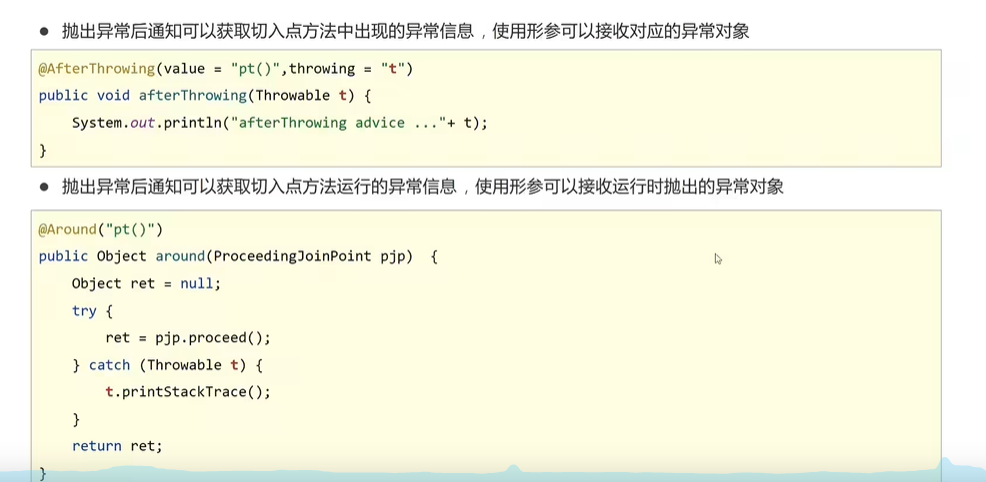
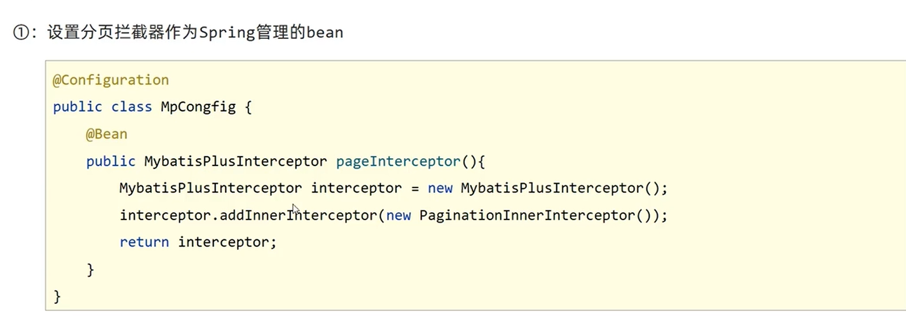
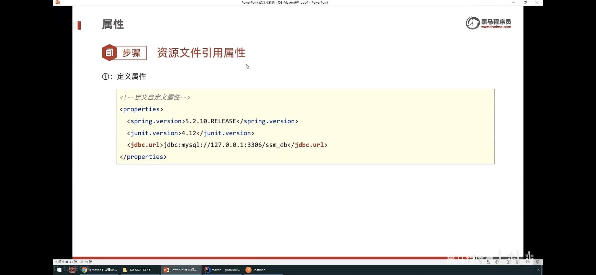
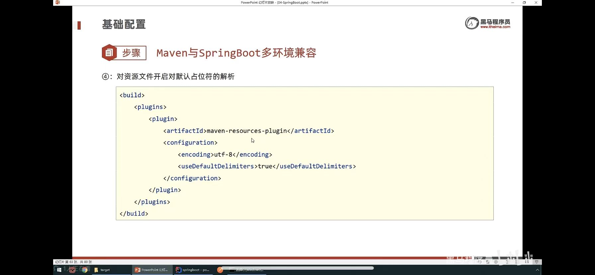
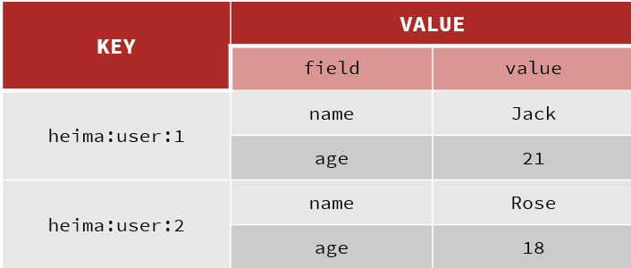
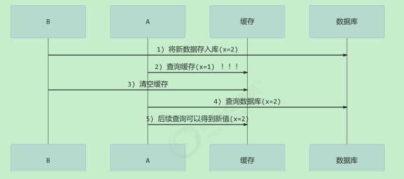
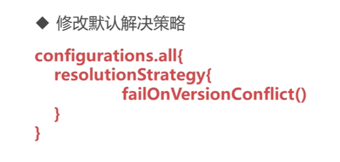
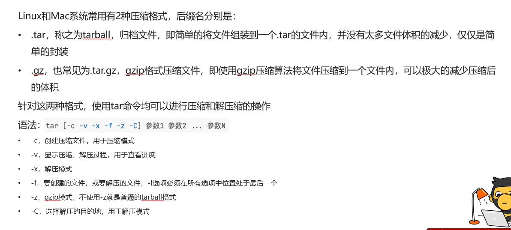
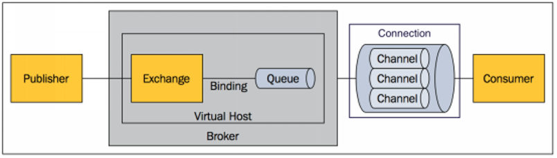

# 学习杂记

## 	一、基础

1、面向过程，是分析解决问题的步骤，每个步骤挨个实现。性能高于面向对象。比如单片机、嵌入式开发
2、面向对象，描述的是事务在解决问题中的行为。属于行为的抽象。具有封装、继承、多态的特性。
3、byte 1字节 1b  short 2    int 4  long 8  float 4  double  8  char   2   boolean 1
4、装箱是自动将基本数据类型转换为包装器类型，拆箱相反。
5、重载是同一个类中多态的表现，方法名一致，参数不一致，返回值可相同，可不同。
6、重写发生在父子类中，方法名一致，参数一致，返回一致，方法修饰符的权限需要大于父类public>protected>default>private
异常方面不要抛出新的异常，就是异常也需要在父类的范围下。
7、 == 比较内存地址， equals 比较值大小。 
8、HashCode 是为了提高集合中查找元素的效率。  （equals 对于数据量大的性能有影响。） hashcode返回的是对象内存地址换算的
值，这样集合新增元素是，会根据hashcode直接找到存放位置，如果没有直接存放，如果有就equals，减少equals次数，提升效率。
9、String 是只读字符串，一经定义，不可改动，对String的操作都会生成新的String对象。
10、对字符串频繁操作，使用StringBuffer（线程安全，加了同步锁）和StringBuilder 都继承AbstractStringBuilder。
11、ArrayList (底层是数组)和LinkList（底层是双向链表） 基于List 实现。 有序，可重复。 

12、HashMap(父类是 AbstractMap) 和 HashTable (父类是Dictionary)，同时都实现了map、Cloneable（可复制）、Serializable（可序列化） 三个接口
13、对外提供的接口，HashTable 多了elments（）和contains()  ；elments() 方法继承自Dictionnary。elements() 方法用于返回此Hashtable中的 value的枚举。contains()方法判断该Hashtable是否包含传入的value。
14、HashTable key value不支持null  HashMap key 可以为null 唯一 ，可以value多个null
15、HashTable 线程安全，HashMap 线程不安全,效率高。 多线程可以采用ConcurrentHashMap
16、初始容量大小和扩容不一样以及计算hash方法不通。

17、强 - 软 -  弱  - 虚  引用。对象本身的引用。  强 OOM不会回收   / 软 内存不足时， jvm优先回收早期创建的对象   /  弱 jvm发现即处理  / 虚 回收之前放在ReferenceQueue引用队列中，其他引用时回收之后放，并且创建虚引用，必须带有ReferenceQueue。 
18、java创建对象  new / 反射/  clone /序列化

19、hash冲突 
拉链法:每个哈希表节点都有一个next指针,多个哈希表节点可以用next指针构成一个单向链表，被 分配到同一个索引上的多个节点可以用这个单向链表进行存储. 
开放定址法:一旦发生了冲突,就去寻找下一个空的散列地址,只要散列表足够大,空的散列地址总能找 到,并将记录存入 
再哈希:又叫双哈希法,有多个不同的Hash函数.当发生冲突时,使用第二个,第三个….等哈希函数计算 地址,直到无冲突.
20、浅拷贝仅仅复制所考虑的对象,而不复制它所引用的对象 / 深拷贝把要复制的对象所引用的对象都 复制了一遍. 

21、被final修饰的类不可以被继承 / 被final修饰的方法不可以被重写  / 被final修饰的变量不可以被改，如果修饰引用,那么表示引用不可变,引用指向的内容可变. 
22、 被final修饰的常量,在编译阶段会存入常量池

23、static 修饰 静态变量 和静态方法  、 静态块 、 静态内部类、 静态导入 import static ，不需要使用类名 直接使用资源名。
24、+= 操作符会进行隐式自动类型转换,此处a+=b隐式的将加操作的结果类型强制转换为持有结果的类型。
25、 运行时异常 ClassCastException（类转换异常） /  IndexOutOfBoundsException（数组越界）
NullPointerException（空指针异常） /  ArrayStoreException（数据存储异常，操作数组是类型不一致） / BufferOverflowException 
26、被检查异常    CloneNotSupportedException / IOException /  FileNotFoundException / SQLException
27、错误  OutOfMemoryError
28、线程，是同类的多个线程共享同一块内存空间和一组系统资源，称为轻量级进程。
29、程序是含有指令和数据的文件，被存储在磁盘或其他的数据存储设备中，也就是说程序是静态的代码。
30、进程是程序的一次执行过程，是系统运行程序的基本单位。线程和进程大的不同在于基本上各进程是独立的，而各线程则不一定。，进程属于操作系统的范畴。
31、不想进行序列化的变量，使用 transient 关键字修饰。 。transient 只能修饰变量，不能修饰类和方法
32、反射  Class.forName(“类的路径”)； /  类名.class  / 对象名.getClass()  / 基本类型的包装类，可以调用包装类的Type属性来获得该包装类的Class对象 

33、hashmap

> 为什么大小是2的幂
> (n-1)&hash和这个下标定位方式有关n=2的n次幕时，n-1的二进制数据，呈现111111”#*111，就是高低位普遍都是1的形式，这样和hashcode与时，能够充分的散列，每一位都能进行位运算，减少hasl碰撞，元素能够均匀散列在每个位置上

1. HashMap 是基于 Map 接口的非同步实现，==线程不安全==，允许使用 null 键和 null 值，但==只允许存在一个键为 null，允许存在多个 value 为 null== 的情况。

2. ==JDK7 及之前的版本 数组+链表==    ==JDK8 及之后的版本 数组+链表+红黑树==，链表的长度超过一定的阈值时，就会转换成红黑树。转换的目的是当链表中元素较多时，也能保证HashMap的存取效率（==链表转为红黑树只有在数组的长度大于等于64才会触==）

3. 采用 ==Fail-Fast 机制==，底层通过一个 ==modCount 值记录修改的次数==，对 HashMap 的修改操作都会增加这个值。迭代器在<u>初始过程中会将这个值赋给 exceptedModCount ，在迭代的过程中，如果发现 modCount 和 exceptedModCount 的值不一致，代表有其他线程修改了Map，就立刻抛出异常</u>。

4. put添加元素

   ```java
   1、计算key的hash值 让hashCode 的高16位(右移16位)参与异或运算，目的是即使 table 数组的长度较小，在计算元素存储位置时，也能让高位也参与运算。（key == null）? 0 : ( h = key.hashcode()) ^ (h >>> 16)
   2、 hash 值与 (tablel.length-1) 进行位与&运算，得出元素应该放入数组的哪个位置。为什么 HashMap 的底层数组长度总是2的n次方幂？（2的n次幂-1 二进制数据位大多数都是1，和n-1进行位与运算保证散列平均，且位置可以快速定位 基本新位置 = 旧位置+原数组容量大小）
   3、如果计算出的数组位置上为空，那么直接插入
   4、如果数组该位置上已经存在链表，则使用 equals() 比较链表上是否存在 key 相同的节点，如果为true，则替换原元素；如果不存在，则在链表的尾部插入新节点（Jdk1.7及以前的版本使用的头插法）
   5、 如果插入元素后，如果链表的节点数是否超过8个，则调用 treeifyBin() 将链表节点转为红黑树节点。
   6、最后判断 HashMap 总容量是否超过阈值 threshold，则调用 resize() 方法进行扩容，扩容后数组的长度变成原来的2倍。
   
   HashMap 中，当发生hash冲突时，解决方式是采用拉链法，也就是将所有哈希值相同的记录都放在同一个链表中
   ```

   5.扩容过程

   ```java
   1、重新建立一个新的数组，长度为原数组的两倍
   2、遍历旧数组的每个数据，重新计算每个元素在新数组中的存储位置。使用节点的hash值与旧数组长度进行位与运算，如果运算结果为0，表示元素在新数组中的位置不变；否则，则在新数组中的位置下标=原位置+原数组长度
   3、将旧数组上的每个数据使用尾插法逐个转移到新数组中，并重新设置扩容阈值。
   ```

   6、转为红黑树

   ```java
   1、数组中某个位置的节点达到8个时，会触发 treeifyBin() 方法将链表节点（Node）转红黑树节点（TreeNode，间接继承Node.链表的结构还存在，通过next属性维持
   2、当数组中某个位置的节点在移除后达到6个时，并且该索引位置的节点为红黑树节点，会触发 untreeify() 将红黑树节点转化成链表节点。
   3、HashMap 在进行插入和删除时有可能会触发红黑树的插入平衡调整（balanceInsertion方法）或删除平衡调整（balanceDeletion ）方法，调整的方式主要有以下手段：左旋转（rotateLeft方法）、右旋转（rotateRight方法）、改变节点颜色（x.red = false、x.red = true），进行调整的原因是为了维持红黑树的数据结构。
       
       当链表长过长时会转换成红黑树，那能不能使用AVL树替代呢？
       
   AVL树是完全平衡二叉树，要求每个结点的左右子树的高度之差的绝对值最多为1，而红黑树通过适当的放低该条件（红黑树限制从根到叶子的最长的可能路径不多于最短的可能路径的两倍长，结果是这个树大致上是平衡的），以此来减少插入/删除时的平衡调整耗时，从而获取更好的性能，虽然会导致红黑树的查询会比AVL稍慢，但相比插入/删除时获取的时间，这个付出在大多数情况下显然是值得的。
   ```

   7、线程不安全体现

   ```
   在JDK7及以前的版本，表现为在多线程环境下进行扩容，由于采用头插法，位于同一索引位置的节点顺序会反掉，导致可能出现死循环的情况
   在JDK8及以后的版本，表现为在多线程环境下添加元素，可能会出现数据丢失的情况
   ```

   6、hashMap和hashTable比较

   ```java
   1、继承的父类：两者都实现了 Map 接口，但 HashMap 继承自 AbstractMap 类，而 Hashtable 继承自 Dictionary 类
   2、遍历方式：HashMap 仅支持 Iterator 的遍历方式，但 Hashtable 实现了 Enumeration 接口，所以支持Iterator和Enumeration两种遍历方式
   3、使用方式：HashMap 允许 null 键和 null 值，Hashtable 不允许 null  键和 null 值
   4、数据结构：HashMap 底层使用“数组+链表+红黑树”，Hashtable 底层使用“数组+链表”
   5、初始容量及扩容方式：HashMap 的默认初始容量为16，每次扩容为原来的2倍；Hashtable 默认初始容量为11，每次扩容为原来的2倍+1。
   6、元素的hash值：HashMap的hash值是重新计算过的，Hashtable直接使用Object的hashCode；
   ```

34、concurrentHashMap

  1、实现原理

```java
在 JDK8 及以上的版本中，ConcurrentHashMap 的底层数据结构依然采用“数组+链表+红黑树”，但是在实现线程安全性方面，抛弃了 JDK7 版本的 Segment分段锁的概念，而是采用了 synchronized + CAS 算法来保证线程安全。
大量使用 Unsafe.compareAndSwapXXX 的方法，这类方法是利用一个CAS算法实现无锁化的修改值操作
 
    DK7的锁是segment，是基于ReentronLock实现的，包含多个HashEntry；JDK8 降低了锁的粒度，采用 table 数组元素作为锁，从而实现对每行数据进行加锁，进一步减少并发冲突的概率，并使用 synchronized 来代替 ReentrantLock
   
```

   2、扩容transfer()

ConcurrentHashMap 为了减少扩容带来的时间影响，在扩容过程中没有进行加锁，并且支持多线程进行扩容操作。在扩容过程中主要使用 sizeCtl 和 transferIndex 这两个属性来协调多线程之间的并发操作，并且在扩容过程中大部分数据可以做到访问不阻塞，整个扩容操作分为以下几个步骤：

​      2.1、根据 CPU 核数和数组长度，计算每个线程应该处理的桶数量，如果CPU为单核，则使用一个线程处理所有桶

​      2.2、根据当前数组长度n，新建一个两倍长度的数组 nextTable（该这个步骤是单线程执行的）

​      2.3、将原来 table 中的元素复制到 nextTable 中，这里允许多线程进行操作，具体操作步骤如下：

​        （1）初始化 ForwardingNode 对象，充当占位节点，hash 值为 -1，该占位对象存在时表示集合正在扩容状态。

>    ForwardingNode 的 key、value、next 属性均为 null ，nextTable 属性指向扩容后的数组，它的作用主要有以下两个：
>
>    占位作用，用于标识数组该位置的桶已经迁移完毕
>    作为一个转发的作用，扩容期间如果遇到查询操作，遇到转发节点，会把该查询操作转发到新的数组上去，不会阻塞查询操作。

​        （2）通过 for 循环从右往左依次迁移当前线程所负责数组：

```
① 如果当前桶没有元素，则直接通过 CAS 放置一个 ForwardingNode 占位对象，以便查询操作的转发和标识当前位置已经被处理过。

② 如果线程遍历到节点的 hash 值为 MOVE，也就是 -1（即 ForwardingNode 节点），则直接跳过，继续处理下一个桶中的节点

③ 如果不满足上面两种情况，则直接给当前桶节点加上 synchronized 锁，然后重新计算该桶的元素在新数组中的应该存放的位置，并进行数据迁移。重计算节点的存放位置时，通过 CAS 把低位节点 lowNode 设置到新数组的 i 位置，高位节点 highNode 设置到 i+n 的位置（i 表示在原数组的位置，n表示原数组的长度）

如果数组中的节点是链表结构，则顺序遍历链表并使用头插法进行构造新链表
如果数组中的节点是红黑树结构，则for循环以链表方式遍历整棵红黑树，使用尾插法拼接
④ 当前桶位置的数据迁移完成后，将 ForwardingNode 占位符对象设置到当前桶位置上，表示该位置已经被处理了
```

​       2.4、每当一条线程扩容结束就会更新一次 sizeCtl 的值，进行减 1 操作，当最后一条线程扩容结束后，需要重新检查一遍数组，防止有遗漏未成功迁移的桶。扩容结束后，将 nextTable 设置为 null，表示扩容已结束，将 table 指向新数组，sizeCtl 设置为扩容阈值。

> sizeCtl：是一个控制标识符，在不同的地方有不同用途，它不同的取值不同也代表不同的含义。在扩容时，它代表的是当前并发扩容的线程数量
>
> 负数代表正在进行初始化或扩容操作：-1代表正在初始化，-N 表示有N-1个线程正在进行扩容操作
> 正数或0代表hash表还没有被初始化或下一次进行扩容的大小，这一点类似于扩容阈值的概念。

## 二、spring

### ***1、IOC***

控制反转也叫依赖注入。工厂模式 ，对象交给容器管理，只需在spring配置文件总配置相应的bean，以及设置相关的属性，让 spring容器来生成类的实例对象以及管理对象。
（在spring容器启动的时候，spring会把你在配置文件 中配置的bean都初始化好，然后在你需要调用的时候，就把它已经初始化好的那些bean分配给你需要 调用这些bean的类（假设这个类名是A），分配的方法就是调用A的setter方法来注入，而不需要你在 A里面new这些bean了。 ）

### ***2、AOP***

**面向切面编程。（Aspect-Oriented Programming） ，处理的是公共行为**。包括动态代理，截取消息然后处理，取代原有对象的执行/ 静态织入，引入特定的语法创建“方面”，从而使得编 译器可以在编译期间织入有关“方面”的代码.


#### 使用


#### 工作流程


1. @Async注解的方法， 只有外部类调用才有效果
2. @Cache注解的方法， 只有外部类调用才有效果 ...` `**几乎所有spring特性必须要从外部调用才可以生效。自己调用自己类方法无效的。**  **通过this来调用是走的类自身的函数调用，而没有经过代理类，所以代理类的相关前置、后置等方法是不生效的。**`!!!!!!!!

#### **pointCut使用**





##### wildcards通配符


##### operators运算符


##### designators标识符


#### advice使用


#### 实现原理


#### 使用场景


### ***3、@Autowired 和 @Resource***

org.springframework.beans.factory.annotation.Autowired;只按照byType注入 ，可以写在字段和setter方法
（如果我们想使用按照名称（byName）来装配，可以结 合@Qualifier注解一起使用。 
 @Autowired   
 @Qualifier("userDao")    
 private UserDao userDao
）
**@Resource**默认按照ByName自动注入 导入包javax.annotation.Resource ， 有name 和type 注入方式。
(最好是将@Resource放在setter方法上，因为这样更符合面向对象的思想，通过set、get去操作属 性，而不是直接去操作属性。)

### ***4、Bean实例化方式***

####  常规方式

构造器（配置元信息：xml、java注解和Java API）

```xml
<bean id="userBean" class="com.powernode.spring6.bean.User"/>
```

静态工厂方法(配置元信息：xml和java api)

```java
public class VipFactory {
    public static Vip get(){
        return new Vip();
    }
}
```

```xml
<bean id="vipBean" class="com.powernode.spring6.bean.VipFactory" factory-method="get"/>
```

Bean工厂方法(配置元信息：xml和java api)

```java
public class OrderFactory {
    public Order get(){
        return new Order();
    }
}
```

```xml
<bean id="orderFactory" class="com.powernode.spring6.bean.OrderFactory"/>
<bean id="orderBean" factory-bean="orderFactory" factory-method="get"/>
```

FactoryBean （配置元信息：xml、java注解和Java API）

```java
public class PersonFactoryBean implements FactoryBean<Person> {

    @Override
    public Person getObject() throws Exception {
        return new Person();
    }

    @Override
    public Class<?> getObjectType() {
        return null;
    }

    @Override
    public boolean isSingleton() {
        // true表示单例
        // false表示原型
        return true;
    }
}
```

```xml
<bean id="personBean" class="com.powernode.spring6.bean.PersonFactoryBean"/>
```


#### 特殊方式

通过ServiceLoaderFactoryBean（配置元信息：xml、java注解和Java API）

通过AutowireCapableBeanFactory#Object createBean(Class<?> var1, int var2, boolean var3) throws BeansException;

通过BeanDefinitionRegistry#void registerBeanDefinition(String var1, BeanDefinition var2) throws BeanDefinitionStoreException;


5、Spring是一个轻量级的IoC和AOP容器框架。：基于XML的 配置、基于注解的配置、基于Java的配置。  主要模块
Spring Core：核心类库，提供IOC服务；
Spring Context：提供框架式的Bean访问方式，以及企业级功能（JNDI、定时任务等）； 
Spring AOP：AOP服务；
Spring DAO：对JDBC的抽象，简化了数据访问异常的处理；
 Spring ORM：对现有的ORM框架的支持；
 Spring Web：提供了基本的面向Web的综合特性，例如多方文件上传；
Spring MVC：提供面向Web应用的Model-View-Controller实现。 

### ***5、springmvc 流程***


1、 用户发送请求至前端控制器DispatcherServlet。
2、 DispatcherServlet收到请求调用HandlerMapping处理器映射器。
3、 处理器映射器找到具体的处理器(可以根据xml配置、注解进行查找)，生成处理器对象及处理器拦截 器(如果有则生成)一并返回给DispatcherServlet。 

4、 DispatcherServlet调用HandlerAdapter处理器适配器。
5、 HandlerAdapter经过适配调用具体的处理器(Controller，也叫后端控制器)。 
6、 Controller执行完成返回ModelAndView。 
7、 HandlerAdapter将controller执行结果ModelAndView返回给DispatcherServlet。
8、 DispatcherServlet将ModelAndView传给ViewReslover视图解析器。 
9、 ViewReslover解析后返回具体View。
10、DispatcherServlet根据View进行渲染视图（即将模型数据填充至视图中）。 公众号：Java专栏
11、 DispatcherServlet响应用户。 

### ***6、动态代理和静态代理***

1. 动态代理

   JDK只提供接口的代理，不支持类的代理。核心**InvocationHandler**接口和Proxy类， InvocationHandler 通过invoke()方法反射来调用目标类中的代码，动态地将横切逻辑和业务编织在一 起；接着，Proxy利用 InvocationHandler动态创建一个符合某一接口的的实例,  生成目标类的代理对 象。
   如果代理类没有实现 InvocationHandler 接口，那么Spring AOP会选择使用CGLIB来动态代理目 标类。

   

   **其实就是动态的对目标类的方法进行增强，动态的生成了多个增强方法，而不需要像静态代理一般写多个方法。**

   

   CGLIB（Code Generation Library），是一个代码生成的类库，可以在运行时动态的生成指定类 的一个子类对象，并覆盖其中特定方法并添加增强代码，从而实现AOP。CGLIB是通过继承的方式做的动态代 理，因此如果某个类被标记为final，那么它是无法使用CGLIB做动态代理的。

   

   

   

   

2. AspectJ是静态代理的增强，所谓静态代理，就是AOP框架会在编译阶段生成AOP代理类，因此也 称为编译时增强，他会在编译阶段将AspectJ(切面)织入到Java字节码中，运行的时候就是增强之后的 AOP对象。 （*<u>如果目标类的方法很多，静态代理需要对多个方法进行增强，而增强的方法一致，容易产生冗余代码。</u>*）

3. Spring AOP使用的动态代理，所谓的动态代理就是说AOP框架不会去修改字节码，而是**每次运行 时在内存中临时为方法生成一个AOP对象，这个AOP对象包含了目标对象的全部方法，并且在特定的切 点做了增强处理，并回调原对象的方法**。

   

   ```java
   public class DefaultAopProxyFactory implements AopProxyFactory, Serializable {
       public DefaultAopProxyFactory() {
       }
   
       public AopProxy createAopProxy(AdvisedSupport config) throws AopConfigException {
           if (!config.isOptimize() && !config.isProxyTargetClass() && !this.hasNoUserSuppliedProxyInterfaces(config)) {
               return new JdkDynamicAopProxy(config);
           } else {
               Class<?> targetClass = config.getTargetClass();
               if (targetClass == null) {
                   throw new AopConfigException("TargetSource cannot determine target class: Either an interface or a target is required for proxy creation.");
               } else {
                   return (AopProxy)(!targetClass.isInterface() && !Proxy.isProxyClass(targetClass) ? new ObjenesisCglibAopProxy(config) : new JdkDynamicAopProxy(config));
               }
           }
       }
   
       private boolean hasNoUserSuppliedProxyInterfaces(AdvisedSupport config) {
           Class<?>[] ifcs = config.getProxiedInterfaces();
           return ifcs.length == 0 || ifcs.length == 1 && SpringProxy.class.isAssignableFrom(ifcs[0]);
       }
   }
   ```

   

   

   

   

   

   

   

   

### ***7、bean 生命周期***

.jpg)

```
1、实例化bean:反射的方式生成对象
2、填充bean的属性:populateBean(),循环依赖的问题(三级缓存)
3、调用aware接口相关的方法: invokeAwareMethod(完成BeanName,BeanFactory,BeanClassLoader对象的属性设置
4、调用BeanPostProcessor中的前置处理方法: 使用比较多的有 (ApplicationContextPostProcessor,设置ApplicationContext,Environment,ResourceLoader,EmbeddValueResolver等对象)
5、调用initmethod方法: invokelnitmethod0,判断是否实现了initializingBean接口，如果有，调用aterPropertiesSet方法，没有就不调用
6、调用BeanPostProcessor的后置处理方法: spring的aop就是在此处实现的，AbstractAutoProxvCreator注册Destuction相关的回调接口: 钩子函数
7、获取到完整的对象，可以通过getBean的方式来进行对象的获取
8、销毁流程，1;判断是否实现了DispoableBean接口，2，调用destroyMethod方法
```

**1、 实例化bean** 
对于BeanFactory容器，当客户向容器请求一个尚未初始化的bean时，或初始化bean的时候需要注入 另一个尚未初始化的依赖时，容器就会调用createBean进行实例化。对于ApplicationContext容器，当 容器启动结束后，通过获取BeanDefinition对象中的信息，实例化所有的bean。 
**2、设置对象属性（依赖注入）**：
实例化后的对象被封装在BeanWrapper对象中，紧接着，Spring根据BeanDefinition中的信息 以及 通 过BeanWrapper提供的设置属性的接口完成依赖注入。
**3、处理Aware接口**： 接着，Spring会检测该对象是否实现了xxxAware接口，并将相关的xxxAware实例注入给Bean：
①如果这个Bean已经实现了BeanNameAware接口，会调用它实现的setBeanName(String beanId)方 法，此处传递的就是Spring配置文件中Bean的id值； 
②如果这个Bean已经实现了BeanFactoryAware接口，会调用它实现的setBeanFactory()方法，传递的 是Spring工厂自身。 
③如果这个Bean已经实现了ApplicationContextAware接口，会调用 setApplicationContext(ApplicationContext)方法，传入Spring上下文；
**4、BeanPostProcessor**： 如果想对Bean进行一些自定义的处理，那么可以让Bean实现了BeanPostProcessor接口，那将会调用 postProcessBeforeInitialization(Object obj, String s)方法。


ApplicationContextAwareProcessor#invokeAwareInterfaces 实现

```java
public interface BeanPostProcessor {
    @Nullable
    default Object postProcessBeforeInitialization(Object bean, String beanName) throws BeansException {
        return bean;
    }
    @Nullable
    default Object postProcessAfterInitialization(Object bean, String beanName) throws BeansException {
        return bean;
    }
}
```

```java
class ApplicationContextAwareProcessor implements BeanPostProcessor {
    private final ConfigurableApplicationContext applicationContext;
    private final StringValueResolver embeddedValueResolver;


    @Nullable
    public Object postProcessBeforeInitialization(Object bean, String beanName) throws BeansException {
        AccessControlContext acc = null;
        if (System.getSecurityManager() != null && (bean instanceof EnvironmentAware || bean instanceof EmbeddedValueResolverAware || bean instanceof ResourceLoaderAware || bean instanceof ApplicationEventPublisherAware || bean instanceof MessageSourceAware || bean instanceof ApplicationContextAware)) {
            acc = this.applicationContext.getBeanFactory().getAccessControlContext();
        }

        if (acc != null) {
            AccessController.doPrivileged(() -> {
                this.invokeAwareInterfaces(bean);
                return null;
            }, acc);
        } else {
            this.invokeAwareInterfaces(bean);
        }

        return bean;
    }

    private void invokeAwareInterfaces(Object bean) {
        if (bean instanceof Aware) {
            if (bean instanceof EnvironmentAware) {
                ((EnvironmentAware)bean).setEnvironment(this.applicationContext.getEnvironment());
            }

            if (bean instanceof EmbeddedValueResolverAware) {
                ((EmbeddedValueResolverAware)bean).setEmbeddedValueResolver(this.embeddedValueResolver);
            }

            if (bean instanceof ResourceLoaderAware) {
                ((ResourceLoaderAware)bean).setResourceLoader(this.applicationContext);
            }

            if (bean instanceof ApplicationEventPublisherAware) {
                ((ApplicationEventPublisherAware)bean).setApplicationEventPublisher(this.applicationContext);
            }

            if (bean instanceof MessageSourceAware) {
                ((MessageSourceAware)bean).setMessageSource(this.applicationContext);
            }

            if (bean instanceof ApplicationContextAware) {
                ((ApplicationContextAware)bean).setApplicationContext(this.applicationContext);
            }
        }

    }

    public Object postProcessAfterInitialization(Object bean, String beanName) {
        return bean;
    }
}

```


5、InitializingBean 与 init-method**： 如果Bean在Spring配置文件中配置了 init-method 属性，则会自动调用其配置的初始化方法。 

**6、如果这个Bean实现了BeanPostProcessor接口**，将会调用postProcessAfterInitialization(Object obj, String s)方法；由于这个方法是在Bean初始化结束时调用的，所以可以被应用于内存或缓存技术；
以上几个步骤完成后，Bean就已经被正确创建了，之后就可以使用这个Bean了。 

**7、DisposableBean：**
当Bean不再需要时，会经过清理阶段，如果Bean实现了DisposableBean这个接口，会调用其实现的 destroy()方法； 
**8、destroy-method：**
如果这个Bean的Spring配置中配置了destroy-method属性，会自动调用其配置的销毁方法

### ***8、bean作用域***

（1）singleton：默认，每个容器中只有一个bean的实例，单例的模式由BeanFactory自身来维护。 
（2）prototype：为每一个bean请求提供一个实例。
（3）request：为每一个网络请求创建一个实例，在请求完成以后，bean会失效并被垃圾回收器回 收。
（4）session：与request范围类似，确保每个session中有一个bean的实例，在session过期后，bean 会随之失效。
（5）global-session：全局作用域，global-session和Portlet应用相关。当你的应用部署在Portlet容器 中工作时，它包含很多portlet。如果你想要声明让所有的portlet共用全局的存储变量的话，那么这全局 变量需要存储在global-session中。全局作用域与Servlet中的session作用域效果相同。

**Prototype 适合有状态的 Bean，而 Singleton 则更适合无状态的情况**

<u>singleton Bean 是否在应用中唯一？</u>

**否，仅在spring IOC容器 （BeanFactory）中 是单例对象。**  应用可能存在多个应用上下文（层次性上下文）

<u>静态字段在jvm是否唯一？</u>

**否，在classLoader中是唯一的。**张三的classloader和李四的classloader可能维护不同的静态变量，在同一个类中。


### **9、 **依赖注入方式

==注入的理解是A类中使用了B作为属性，如何为A对象注入B对象，也就是B的注入方式，注入到其他类中==

#### **xml注入方式**

==set方式注入、通过构造方法注入、自动注入no或byName或byType或 constructor或 default==

（1）Set方法注入(property形式)； （2）构造器注入()：①通过index设置参数的位置；②通过type设置参数类型； （3）静态工厂注入；
（4）实例工厂


#### **依赖注入方式**

构造器注入（少依赖 强制依赖） /  setter注入（多依赖  非强制依赖） / 字段注入 （开发便利） / 方法注入（做声明 比如@Bean） / 接口回调注入 (生命周期回调 比如setApplicationContext setBeanFactory回调)

**构造器和setter注入都可以使用，如果必须依赖推荐构造物器注入，如果可选依赖，用setter**


**依赖注入和依赖查找来源**

来源不同，**依赖查找的来源仅限于Spring BeanDefinition （有完整的生命周期管理）以及单例对象（java api 调用registry 生存的方法）， 而依赖注入的来源还包括Resolvable Dependency（ConfigurableListableBeanFactory#registerResolvableDependency实现）以及@value所标注的外部化配置。**


```java
    public void freezeConfiguration() {
        this.configurationFrozen = true;
        this.frozenBeanDefinitionNames = StringUtils.toStringArray(this.beanDefinitionNames);
    }
// BeanDefinition 默认实现DefaultListableBeanFactory 进行了冻结注册的操作，而单例实现类DefaultSingletonBeanRegistry 则是DefaultListableBeanFactory的父类 ，换言之 子类的状态无法控制父类的行为。所以是无限制的。
```


### ***10、spring设计模式例子***

1.工厂模式，在各种BeanFactory以及ApplicationContext创建中都用到了
2.模版模式，在各种BeanFactory以及ApplicationContext实现中也都用到了
3.代理模式，Spring AOP 利用了 Aspect] AOP实现的! Aspect] AOP 的底层用了动态代理
4.策略模式，加载资源文件的方式，使用了不同的方法，比如: ClassPathResourece，FileSystemResource，ServletContextResource, UrlResource但他们都有共同的借口Resource; 在Aop的实现中，采用了两种不同的方式，JDK动态代理和CGLIB代理
5.单例模式，比如在创建bean的时候。
6.观察者模式，spring中的ApplicationEvent，ApplicationListener,ApplicationEventPublisher
7.适配器模式，MethodBeforeAdviceAdapter,ThrowsAdviceAdapter,AfterReturningAdapter
8.装饰者模式，源码中类型带Wrapper或者Decorator的都是

### 11、重点类、接口描述

#### BeanFactory

BeanFactory是提供了IOC容器最基本的形式，给**具体的IOC容器的实现提供了规范**

```java
//
// Source code recreated from a .class file by IntelliJ IDEA
// (powered by Fernflower decompiler)
//

package org.springframework.beans.factory;

import org.springframework.beans.BeansException;
import org.springframework.core.ResolvableType;

public interface BeanFactory {
    String FACTORY_BEAN_PREFIX = "&";

    Object getBean(String var1) throws BeansException;

    <T> T getBean(String var1, Class<T> var2) throws BeansException;

    <T> T getBean(Class<T> var1) throws BeansException;

    Object getBean(String var1, Object... var2) throws BeansException;

    <T> T getBean(Class<T> var1, Object... var2) throws BeansException;

    boolean containsBean(String var1);

    boolean isSingleton(String var1) throws NoSuchBeanDefinitionException;

    boolean isPrototype(String var1) throws NoSuchBeanDefinitionException;

    boolean isTypeMatch(String var1, ResolvableType var2) throws NoSuchBeanDefinitionException;

    boolean isTypeMatch(String var1, Class<?> var2) throws NoSuchBeanDefinitionException;

    Class<?> getType(String var1) throws NoSuchBeanDefinitionException;

    String[] getAliases(String var1);
}

```

**BeanFactory.getBean 是线程安全的。默认实现DefaultListableBeanFactory 中，对应BeanDefinition的获取加了synchronized互斥锁**。

```java
   synchronized(this.beanDefinitionMap) {
                    this.beanDefinitionMap.put(beanName, beanDefinition);
                    List<String> updatedDefinitions = new ArrayList(this.beanDefinitionNames.size() + 1);
                    updatedDefinitions.addAll(this.beanDefinitionNames);
                    updatedDefinitions.add(beanName);
                    this.beanDefinitionNames = updatedDefinitions;
                    this.removeManualSingletonName(beanName);
                }
```


#### FactoryBean

FactoryBean可以**说为IOC容器中Bean的实现提供了更加灵活的方式，**FactoryBean在IOC容器的基础上给Bean的实现加上了一个简单工厂模式和装饰模式，我们可以在getObject()方法中灵活配置。

```java
//
// Source code recreated from a .class file by IntelliJ IDEA
// (powered by Fernflower decompiler)
//

package org.springframework.beans.factory;

public interface FactoryBean<T> {
    T getObject() throws Exception;

    Class<?> getObjectType();

    boolean isSingleton();
}
```

```java
public class FactoryBeanPojo implements FactoryBean{
	private String type;
    // 重写getObject 简单工厂模式  对于bean的实现  增加了更加灵活的方式
	@Override
	public Object getObject() throws Exception {
		if("student".equals(type)){
			return new Student();			
		}else{
			return new School();
		}
    }
		
```

#### ApplicationContext

ApplicationContext是**具备应用特性的BeanFactory的超集**。

#### BeanDefinition

是spring Framework **定义Bean的配置元信息接口**，包含

Bean的类名

Bean的行为配置元素，如作用域、自动绑定的模式、生命周期回调等

其他Bean的引用，又称合作者或者依赖

配置设置，比如Bean属性Properties


<u>BeanDefinition 通过BeanDefinitionBuilder 或者 AbstractBeanDefinition以及派生类 创建</u>

##### BeanDefinition注册

###### xml配置元信息 

```xml
<bean name ="" />
```

###### java注解配置

@Bean @Component @Import

###### Java api配置元信息

命名方式 BeanDefinitionRegistry#void registerBeanDefinition(String var1, BeanDefinition var2) throws BeanDefinitionStoreException

非命名方式 

BeanDefinitionReaderUtils#registerWithGeneratedName

```java
  public static String registerWithGeneratedName(AbstractBeanDefinition definition, BeanDefinitionRegistry registry) throws BeanDefinitionStoreException {
        String generatedName = generateBeanName(definition, registry, false);
        registry.registerBeanDefinition(generatedName, definition);
        return generatedName;
    }
```

AnnotatedBeanDefinitionReader#register

```java
  public void register(Class<?>... annotatedClasses) {
        Class[] var2 = annotatedClasses;
        int var3 = annotatedClasses.length;

        for(int var4 = 0; var4 < var3; ++var4) {
            Class<?> annotatedClass = var2[var4];
            this.registerBean(annotatedClass);
        }

    }
```


### 12、循环依赖

#### 分类

##### 构造器注入循环依赖

```java
@Service
public class A {
    public A(B b) {
    }
}
@Service
public class B {
    public B(A a) {
    }
}
```

Spring解决循环依赖依靠的是Bean的“中间态”这个概念，而这个中间态指的是**`已经实例化`**，但还没初始化的状态。而构造器是完成实例化的东东，所以构造器的循环依赖无法解决~~~

##### singleton模式field属性注入循环依赖

```java
@Service
public class A {
    @Autowired
    private B b;
}
 
@Service
public class B {
    @Autowired
    private A a;
}
```

启动成功

##### prototype模式field属性注入循环依赖

````java
@Scope(ConfigurableBeanFactory.SCOPE_PROTOTYPE)
@Service
public class A {
    @Autowired
    private B b;
}
 
@Scope(ConfigurableBeanFactory.SCOPE_PROTOTYPE)
@Service
public class B {
    @Autowired
    private A a;
}
````

**需要注意的是**本例中**启动时是不会报错的**（因为非单例Bean**`默认`**不会初始化，而是使用时才会初始化），所以很简单咱们只需要手动**`getBean()`**或者在一个单例Bean内**`@Autowired`**一下它即可

```java
// 在单例Bean内注入
    @Autowired
    private A a;
```

不能解决

#### 原理分析

1、对Bean的创建最为核心三个方法解释如下：

- createBeanInstance：例化，其实也就是调用对象的构造方法实例化对象
- populateBean：填充属性，这一步主要是对bean的依赖属性进行注入(@Autowired)   循环依赖主要发生在**第二步**
- initializeBean：回到一些形如initMethod、InitializingBean等方法

2、spring使用`三级缓存`处理

DefaultSingletonBeanRegistry 中

- singletonObjects：用于存放完全初始化好的 bean，从该缓存中取出的 bean 可以直接使用
- earlySingletonObjects：提前曝光的单例对象的cache，存放原始的 bean 对象（尚未填充属性），用于解决循环依赖
- singletonFactories：单例对象工厂的cache，存放 bean 工厂对象，用于解决循环依赖


### 13、事务传播机制

#### PROPAGATION_REQUIRED

**若当前存在事务，则加入该事务，若不存在事务，则新建一个事务。**

**出现异常，都未进行捕获，同时回滚。**这点也有区别，PAOPAGATION_REQUIRE_NEW中functionOne出异常是不影响functionTwo正常提交的，但是functionTwo异常是整体回滚。

functionOne捕获funtionTwo的异常，则回滚。事务冲突。 **这点和PAOPAGATION_REQUIRE_NEW不一致，PAOPAGATION_REQUIRE_NEWfunctionOne是可以提交的，不是同一个事务。**

若functionTwo方法抛出异常，functionTwo方法内部捕获，functionOne、functionTwo都不会回滚。

A、B可操作同一条记录，因为处于同一个事务中

```java
 @Transactional(propagation = Propagation.REQUIRED,rollbackFor = Exception.class)
    @Override
    public void functionOne(){
        AttendanceRecord attendanceRecord=new AttendanceRecord();
        attendanceRecord.setUserName("test");
        saveAttendanceRecord(attendanceRecord);
        try {
        leaveRecordService.functionTwo();  // functionOne 进行异常捕捉,functionTwo抛出异常。 事务回滚。
            // Participating transaction failed - marking existing transaction as rollback-only 
        }catch (Exception e){
            log.error(e.getMessage());
        }

    }
```

```java
 @Override
    @Transactional(propagation = Propagation.REQUIRED,rollbackFor = Exception.class)
    public void functionTwo() {
        this.baseMapper.deleteById(749);
        throw new RuntimeException();
    }
```

#### PAOPAGATION_REQUIRE_NEW

若当前没有事务，则新建一个事务。若当前存在事务，则新建一个事务，**新老事务相互独立**。外部事务抛出异常回滚不会影响内部事务的正常提交。

**functionTwo抛出异常，functionOne捕获异常，functionTwo回滚，functionOne正常提交。**

functionTwo方法抛出异常，functionTwo方法内部捕获，functionTwo和functionOne都不会回滚。

**若functionOne方法抛出异常，不会影响functionTwo正常执行**。

**若functionTwo方法抛出异常，functionOne、functionTwo方法都没有处理，则functionOne、functionTwo都会回滚。**

A、B不可操作同一条记录，因为处于不同事务中，会产生死锁。

```java
    @Transactional(propagation = Propagation.REQUIRED,rollbackFor = Exception.class)
    @Override
    public void functionOne(){
        AttendanceRecord attendanceRecord=new AttendanceRecord();
        attendanceRecord.setUserName("test");
        saveAttendanceRecord(attendanceRecord);
        try {
        leaveRecordService.functionTwo();  // 
        }catch (Exception e){
            log.error(e.getMessage());
        }

    }
```

```java
@Override
    @Transactional(propagation = Propagation.REQUIRES_NEW,rollbackFor = Exception.class)
    public void functionTwo() {
        this.baseMapper.deleteById(749);
        throw new RuntimeException();
    }
```

#### PROPAGATION_NESTED

如果当前存在事务，则嵌套在当前事务中执行。如果当前没有事务，则新建一个事务，类似于REQUIRE_NEW

若functionTwo方法抛出异常，functionOne方法进行捕获，functionTwo方法回滚，functionOne方法正常执行。 **这点等同于REQUIRE_NEW**

若functionTwo或者functionOne抛出异常，不做任何处理的话，functionOne、functionTwo都要回滚。**这点等同于REQUIRED**

functionTwo、functionOne可操作同一条记录，因为处于同一个事务中。**这点等同于REQUIRED**

```java
  @Override
    @Transactional(propagation = Propagation.NESTED,rollbackFor = Exception.class)
    public void functionTwo() {
        this.baseMapper.deleteById(749);
//        throw new RuntimeException();
    }
```

#### PROPAGATION_SUPPORTS

支持当前事务，若当前不存在事务，以非事务的方式执行。

functionOne捕获funtionTwo的异常，则回滚。事务冲突。 这点和REQUIRED一致。

**出现异常，都未进行捕获，同时回滚。 这点和REQUIRED一致。**


```java
 @Override
    @Transactional(propagation = Propagation.SUPPORTS,rollbackFor = Exception.class)
    public void functionTwo() {
        this.baseMapper.deleteById(749);
        throw new RuntimeException();
    }
```

#### PROPAGATION_NOT_SUPPORTED

以**非事务的方式执行**，若当前存在事务，则把当前事务挂起。（事务在我functionTwo上不适用）

A、B不可操作同一条记录，因为A是事务执行，B在A尚未提交前再操作同一条记录，会产生死锁。

functionTwo 或者functionOne抛出异常，functionTwo都能正常提交，functionOne会回滚。**因为functionTwo非事务。**

```java
 @Override
    @Transactional(propagation = Propagation.NOT_SUPPORTED,rollbackFor = Exception.class)
    public void functionTwo() {
        this.baseMapper.deleteById(749);
        throw new RuntimeException();

    }
```

#### PROPAGATION_MANDATORY

强制事务执行，若当前不存在事务，则抛出异常(functionOne不存在事务，functionTwo强制事务)

functionOne捕获funtionTwo的异常，则回滚。事务冲突。 **这点和REQUIRED一致。**

任意出现异常，都未捕获，回滚。

```java
 No existing transaction found for transaction marked with propagation 'mandatory
```

#### PROPAGATION_NEVER

以非事务的方式执行，如果当前存在事务，则抛出异常。

### 14、Bean初始化及销毁


执行顺序 @PostConstruct 先执行 然后 afterPropertiesSet 最后自定义初始化方法


**延迟初始化**


**销毁**


**Bean GC**


### 15、spring5.x特性

基于 Java8，运行时兼容 JDK9
Spring5 已经移除 Log4jConfigListener，官方建议使用 Log4j2，Spring5 框架整合 Log4j2
新功能（Webflux） 响应式编程出现的框架。 Webflux 是一种**异步非阻塞**的框架，异步非阻塞的框架在 **Servlet3.1 以后才支持，核心是基于 Reactor 的相关 API 实现**
**Lambda 表达式注册 bean**
JUnit 5 全面接纳了 Java 8 流和 lambda 表达式

### 16、java常用注解汇总

[java常用注解汇总](https://blog.csdn.net/weixin_53601359/article/details/114378460)

@Controller标记此类是一个控制器，可以返回视图解析器指定的html页面，通过@ResponseBody可以将结果返
回ison、xml数据。@RestController 相当于@ResponseBody加@Controller，实现rest接口开发，返回ison数据，不能返回htmI页面。
@RequestMapping定义接口地址，可以标记在类上也可以标记在方法上支持http的post、putget等方法@PostMapping定义post接口，只能标记在方法上，用于添加记录，复杂条件的查询接口。
@GetMapping定义get接口，只能标记在方法上，用于查询接口的定义。
@PutMapping定义put接口，只能标记在方法上，用于修改接口的定义。
@DeleteMapping定义delete接口，只能标记在方法上，用于删除接口的定义。
@RequestBody定义在方法上，用于将ison串转成iava对象。
@PathVarible接收请求路径中占位符的值
@ApiOperationswagger注解，对接口方法进行说明。
@Apiwagger注解，对接口类进行说明。
R
@Autowired基于类型注入。
@Resourc基于名称注入，如果基于名称注入失败转为基于类型注入。

### 17、统一异常处理

[异常处理demo](https://juejin.cn/post/6943570205758980126?utm_source=gold_browser_extension)

### 加载properties


### 创建容器


### 容器层次结构

beaFactory 早期的创建bean的方式，延迟加载 ，后续不满足了 ，applicationcontext(立即加载)进行了增强


### 纯注解开发


### 第三方bean管理

==推荐第一种==


### 整合mybatis


### 整合junit


### 请求和响应


### restful


### 异常


### 拦截器


或者


### maven


### 配置文件优先级

file代表你实际部署目录下，新增yml文件


### mybatis-plus




### mybatis-plus乐观锁

1、数据库加字段

2、设置@version注解

3、增加拦截器

4、操作时，version必须有值


### 代码生成器


其他属性自行设置

### springmvc


### pom资源文件引用属性




### maven多环节开发


### 私服


## 三、springcloud


### ***1、Eureka***

保证了AP(可用性（**A**vailability）\分区容错性（**P**artition tolerance）),无法保证C一致性（**C**onsistency）

1、Eureka Server 启动成功，等待服务端注册。在启动过程中如果配置了集群，集群之间定时通过 Replicate（复制） 同步注册表，每个 Eureka Server 都存在独立完整的服务注册表信息

2、Eureka Client 启动时根据配置的 Eureka Server 地址去注册中心注册服务

3、Eureka Client 会每 30s 向 Eureka Server 发送一次心跳请求，证明客户端服务正常

4、当 Eureka Server 90s 内没有收到 Eureka Client 的心跳，注册中心则认为该节点失效，会注销该实例

5、单位时间内 Eureka Server 统计到有大量的 Eureka Client 没有上送心跳，则认为可能为网络异常，进入自我保护机制，不再剔除没有发送心跳的客户端

6、当 Eureka Client 心跳请求恢复正常之后，Eureka Server 自动退出自我保护模式

7、Eureka Client 定时全量或者增量从注册中心获取服务注册表，并且将获取到的信息缓存到本地

8、服务调用时，Eureka Client 会先从本地缓存找寻调取的服务。如果获取不到，先从注册中心刷新注册表，再同步到本地缓存

9、Eureka Client 获取到目标服务器信息，发起服务调用

10、Eureka Client 程序关闭时向 Eureka Server 发送取消请求，Eureka Server 将实例从注册表中删除

### ***2、Feign***

是一个声明式的伪Http客户端.使用Feign，只需要创建一个接口并注解。它具有可插拔的注解特性，可使用Feign 注解和JAX-RS注解。Feign支持可插拔的编码器和解码器。Feign默认集成了Ribbon，并和Eureka结合，默认实现了负载均衡的效果。  @FeignClient    动态代理实现。

基于 Feign 的动态代理机制，根据注解和选择的机器，拼接请求 URL 地址，发起请求。

<u>Feign的动态代理会根据你在接口上的 @RequestMapping 等注解，来动态构造出你要请求的服务的地址。</u>

支持服务降级（配置fallbackfactory类）和异常过滤（过滤器是对异常信息的再封装，把 feign 的异常信息封装成我们系统的通用异常对象）

### ***3、ribbon***

是一个负载均衡客户端  @LoadBalanced 默认Round Robin 轮询算法

> Ribbon 简单来说 底层采用了一个拦截器LoadBalancerIntercepor，拦截了RestTemplate发出的请求从请求ur1中获取服务名称，根据服务名称到eureka拉取服务列表，用内置负载均衡规则，从列表中选择一个，然后修改请求地址，进行真实请求。

#### 负载均衡策略

- 默认的实现就是ZoneAvoidanceRule，是一种轮询方案
  RoundRobinRule   轮询来获取。
- AvailabilityFilteringRule忽略(故障并发过高) 服务器:
  (1)在默认情况下，这台服务器如果3次连接失败，这台服务器就会被设置为
  "短路”状态。短路状态将持续30秒，如果再次连接失败，短路的持续时间就会几何级地增加。
  (2)并发数过高的服务器。如果一个服务器的并发连接数过高，配置了AvailabilityFilteringRule规则的客户端也会将其忽
  略。并发连接数的上限，可以由客户端的.ActiveConnectionsLimit属性进行配置
- WeightedResponseTimeRule  权重(越大访问几率大)。
- ZoneAvoidanceRule  分区域，使用Zone对服务器进行分类，再对Zone内的多个服务做轮询 
- BestAvailableRule 忽略那些短路的服务器，并选择并发数较低的服务器。
- RandomRule 随机选择一个可用的服务器。
- RetryRule 重试机制的选择逻辑


### **4、*Zuul***

的主要功能是路由转发和过滤器  zuul默认和Ribbon结合实现了负载均衡的功能， 类似于nginx转发。 @EnableZuulProxy  /  服务过滤功能

<u>统一的降级、限流、认证授权、安全</u>

**路由的转发**

**过滤访问**

**安全访问**

**熔断**

|              | gateway                                                      | zuul                                                         |
| ------------ | ------------------------------------------------------------ | ------------------------------------------------------------ |
| 基本介绍     | Spring Cloud Gateway是Spring官方基于Spring 5.0，Spring Boot 2.0和Project Reactor等技术开发的网关，Spring Cloud Gateway旨在为微服务架构提供一种简单而有效的统一的API路由管理方式。Spring Cloud Gateway作为Spring Cloud生态系中的网关，目标是替代Netflix ZUUL，其不仅提供统一的路由方式，并且基于Filter链的方式提供了网关基本的功能，例如：**安全，监控/埋点，和限流等。** | Zuul1 是基于 Servlet 框架构建，如图所示，采用的是阻塞和多线程方式，即一个线程处理一次连接请求，这种方式在内部延迟严重、设备故障较多情况下会引起存活的连接增多和线程增加的情况发生 |
| 性能         | WebFlux 模块的名称是 spring-webflux，名称中的 Flux 来源于 Reactor 中的类 Flux。Spring webflux 有一个全新的非堵塞的函数式 Reactive Web 框架，可以用来构建异步的、非堵塞的、事件驱动的服务，在伸缩性方面表现非常好。使用非阻塞API。 Websockets得到支持，并且由于它与Spring紧密集成，所以将会是一个更好的 开发 体验。 | 本文的Zuul，指的是Zuul 1.x，是一个基于阻塞io的API Gateway。Zuul已经发布了Zuul 2.x，基于Netty，也是非阻塞的，支持长连接，但Spring Cloud暂时还没有整合计划。 |
| 源码维护组织 | `pring-cloud-Gateway`是spring旗下`spring-cloud`的一个子项目。还有一种说法是因为`zuul2`连续跳票和`zuul1`的性能表现不是很理想，所以催生了spring孵化`Gateway`项目。 | `zuul`则是`netflix`公司的项目，只是spring将`zuul`集成在spring-cloud中使用而已。关键目前spring不打算集成zuul2.x。 |
| 版本         | springboot2.0                                                | springboot1.x                                                |


```
计数器算法是什么?
计数器算法，是指在指定的时间周期内累加访问次数，达到设定的阈值时，触发限流策略。下一个时间周期进行访问时，访问次数清零。此算法无论在单机还是分布式环境下实现都非常简单，使用redis的incr原子自增性，再结合key的过期时间，即可轻松实现。
key 10

语法
Redis INCR 命令的基本语法如下：
INCR key
返回值
执行 INCR 命令加 1 操作后 key 的值。
```


```
漏桶限流算法是什么?
漏桶算法的原理就像它的名字一样，我们维持一个漏斗，它有恒定的流出速度，不管水流流入的速度有多快，漏斗出水的速度始终保持不变，类似于消息中间件，不管消息的生产者请求量有多大，消息的处理能力取决于消费者。
漏桶的容量=漏桶的流出速度"可接受的等待时长。在这个容量范围内的请求可以排队等待系统的处理，超过这个容量的请求，才会被抛弃。
在漏桶限流算法中，存在下面几种情况:
1.当请求速度大于漏桶的流出速度时，也就是请求量大于当前服务所能处理的最大极限值时，触发限流策略。
2. 请求速度小于或等于漏桶的流出速度时，也就是服务的处理能力大于或等于请求量时，正常执行。
漏桶算法有一个缺点: 当系统在短时间内有突发的大流量时，漏桶算法处理不了。
```

```
今牌桶限流算法是什么?
令牌桶算法，是增加一个大小固定的容器，也就是令牌桶，系统以恒定的速率向令牌桶中放入令牌，如果有客户端来请求，先需要从令牌桶中拿一个令牌，拿到令牌，才有资格访问系统，这时令牌桶中少一个令牌。当令牌桶满的时候，再向令牌桶生成令牌时，令牌会被抛弃。
在令牌桶算法中，存在以下几种情况:
1.请求速度大于令牌的生成速度:那么令牌桶中的令牌会被取完，后续再进来的请求，由于拿不到令牌，会被限
流。
2.请求速度等于令牌的生成速度: 那么此时系统处于平稳状态
3.请求速度小于令牌的生成速度: 那么此时系统的访问量远远低于系统的并发能力，请求可以被正常处理。
令牌桶算法，由于有一个桶的存在，可以处理短时间大流量的场景。这是令牌桶和漏桶的一个区别。
```


### **5、*断路器*Hystrix**

#### 工作流程

1. 构造一个 HystrixCommand或HystrixObservableCommand对象，用于封装请求，并在构造方法配置请求被执行需要的参数；

2. 执行命令，Hystrix提供了4种执行命令的方法，后面详述；

3. 判断是否使用缓存响应请求，若启用了缓存，且缓存可用，直接使用缓存响应请求。Hystrix支持请求缓存，但需要用户自定义启动；

4. 判断熔断器是否打开，如果打开，跳到第8步；

5. 判断线程池/队列/信号量是否已满，已满则跳到第8步；

6. **执行HystrixObservableCommand.construct()或HystrixCommand.run()**，如果执行失败或者超时，跳到第8步；否则，跳到第9步；

7. 统计熔断器监控指标；

8. 走Fallback备用逻辑

9. 返回请求响应

   

#### 执行命令方法

以上 执行方法部分 Hystrix提供了4种执行命令的方法，**execute()和queue() 适用于HystrixCommand对象**，而**observe()和toObservable()适用于HystrixObservableCommand对象。**

**execute()**

以**同步堵塞方式执行run()，只支持接收一个值对象**。hystrix会从线程池中取一个线程来执行run()，并等待返回值。

**queue()**

以**异步非阻塞方式执行run()，只支持接收一个值对象**。调用queue()就直接返回一个Future对象。可通过 Future.get()拿到run()的返回结果，但Future.get()是阻塞执行的。若执行成功，Future.get()返回单个返回值。当执行失败时，如果没有重写fallback，Future.get()抛出异常。

**observe()**

**事件注册前执行run()/construct()，支持接收多个值对象**，取决于发射源。调用observe()会返回一个hot Observable，也就是说，调用observe()自动触发执行run()/construct()，**无论是否存在订阅者**。

如果继承的是HystrixCommand，hystrix会从线程池中取一个线程以非阻塞方式执行run()；如果继承的是HystrixObservableCommand，将以调用线程阻塞执行construct()。

observe()使用方法：

1. 调用observe()会返回一个Observable对象
2. 调用这个Observable对象的subscribe()方法完成事件注册，从而获取结果

**toObservable()**

**事件注册后执行run()/construct()，支持接收多个值对象**，取决于发射源。调用toObservable()会返回一个cold Observable，也就是说，调用toObservable()不会立即触发执行run()/construct()，**必须有订阅者订阅Observable时才会执行**。

如果继承的是HystrixCommand，hystrix会从线程池中取一个线程以非阻塞方式执行run()，调用线程不必等待run()；如果继承的是HystrixObservableCommand，将以调用线程堵塞执行construct()，调用线程需等待construct()执行完才能继续往下走。

toObservable()使用方法：

1. 调用observe()会返回一个Observable对象
2. 调用这个Observable对象的subscribe()方法完成事件注册，从而获取结果

需注意的是，**HystrixCommand也支持toObservable()和observe()，但是即使将HystrixCommand转换成Observable，它也只能发射一个值对象。只有HystrixObservableCommand才支持发射多个值对象。**

- execute()实际是调用了queue().get()
- queue()实际调用了toObservable().toBlocking().toFuture()
- observe()实际调用toObservable()获得一个cold Observable，再创建一个ReplaySubject对象订阅Observable，将源Observable转化为hot Observable。因此调用observe()会自动触发执行run()/construct()。

**Hystrix总是以Observable的形式作为响应返回，不同执行命令的方法只是进行了相应的转换。**

（隔离 -》 熔断-》降级）

@HystrixCommand 作用:服务发生错误，回调方法。

@EnableHystrix 启动断路器

#### **隔离**

<u>不同的服务，**默认使用不同的线程池 来进行隔离**，避免服务雪崩</u> 

**信号量隔离**是采用一个全局变量来控制并发量，一个请求过来全局变量加 1，单加到跟配置 中的大小相等是就不再接受用户请求了。

**Hystrix默认使用线程池做线程隔离**，使用信号量隔离需要显示地将属性execution.isolation.strategy设置为ExecutionIsolationStrategy.SEMAPHORE，同时配置信号量个数，默认为10。客户端需向依赖服务发起请求时，首先要获取一个信号量才能真正发起调用，由于信号量的数量有限，当并发请求量超过信号量个数时，后续的请求都会直接拒绝，进入fallback流程。

**信号量隔离主要是通过控制并发请求量，防止请求线程大面积阻塞，从而达到限流和防止雪崩的目的。**

|              | 线程池隔离                                                   | 信号量隔离                                                   |
| ------------ | ------------------------------------------------------------ | ------------------------------------------------------------ |
| 线程         | 与调用线程非相同线程                                         | 与调用线程相同（jetty线程）                                  |
| 开销         | 排队、调度、上下文开销等                                     | 无线程切换，开销低                                           |
| 异步         | 可以是异步，也可以是同步。看调用的方法                       | 同步调用，不支持异步                                         |
| 并发支持     | 支持（最大线程池大小hystrix.threadpool.default.maximumSize） | 支持（最大信号量上限maxConcurrentRequests）                  |
| 是否超时     | 支持，可直接返回                                             | 不支持，如果阻塞，只能通过调用协议（如：socket超时才能返回） |
| 是否支持熔断 | 支持，当线程池到达maxSize后，再请求会触发fallback接口进行熔断 | 支持，当信号量达到maxConcurrentRequests后。再请求会触发fallback |
| 隔离原理     | 每个服务单独用线程池                                         | 通过信号量的计数器                                           |
| 资源开销     | 大，大量线程的上下文切换，容易造成机器负载高                 | 小，只是个计数器                                             |


#### **降级**

服务降级是对服务调用过程的出现的异常的友好封装，当出现异常时，我们不希 望直接把异常原样返回，所以当出现异常时我们需要对异常信息进行包装，抛一 个友好的信息给前端。

指定降级方法 **定义降级方法fallbackmethod**，降级方法的返回值和业务方法的方法值要一样

##### 降级逻辑场景：

- 执行construct()或run()抛出异常
- 熔断器打开导致命令短路
- 命令的线程池和队列或信号量的容量超额，命令被拒绝
- 命令执行超时

##### 降级回退方式

建议重写getFallBack或resumeWithFallback提供自己的备用逻辑，但不建议在回退逻辑中执行任何可能失败的操作。

###### **Fail Fast 快速失败**

快速失败是最普通的命令执行方法，命令没有重写降级逻辑。 如果命令执行发生任何类型的故障，它将直接抛出异常。

###### **Fail Silent 无声失败**

指在降级方法中通过**返回null，空Map，空List或其他类似的响应**来完成。

```java
@Override
protected Integer getFallback() {
   return null;
}
@Override
protected List<Integer> getFallback() {
   return Collections.emptyList();
}
@Override
protected Observable<Integer> resumeWithFallback() {
   return Observable.empty();
}
```

###### **Fallback: Static**

指在降级方法中**返回静态默认值**。 这不会导致服务以“无声失败”的方式被删除，而是导致默认行为发生。如：应用根据命令执行返回true / false执行相应逻辑，但命令执行失败，则默认为true

```java
@Override
protected Boolean getFallback() {
    return true;
}
@Override
protected Observable<Boolean> resumeWithFallback() {
    return Observable.just( true );
}
```

###### **Fallback: Stubbed（多梗株的 多个字段）**

当命令返回一个包含多个字段的复合对象时，适合以Stubbed 的方式回退。

```java
@Override
protected MissionInfo getFallback() {
   return new MissionInfo("missionName","error");
}
```

###### **Fallback: Cache via Network**

如果调用依赖服务失败，可以从缓存服务（如redis）中查询旧数据版本。由于又会发起远程调用，所以建议重新封装一个Command，使用不同的ThreadPoolKey，与主线程池进行隔离。

```java
@Override
protected Integer getFallback() {
   return new RedisServiceCommand(redisService).execute();
}
```

###### **Primary + Secondary with Fallback**

有时系统具有两种行为- 主要和次要，或主要和故障转移。**主要和次要逻辑涉及到不同的网络调用和业务逻辑，所以需要将主次逻辑封装在不同的Command中，使用线程池进行隔离**。为了实现主从逻辑切换，可以将主次command封装在外观HystrixCommand的run方法中，并结合配置中心设置的开关切换主从逻辑。由于主次逻辑都是经过线程池隔离的HystrixCommand，因此外观HystrixCommand可以使用信号量隔离，而没有必要使用线程池隔离引入不必要的开销。原理图如下


```java
public class CommandFacadeWithPrimarySecondary extends HystrixCommand<String> {
 
    private final static DynamicBooleanProperty usePrimary = DynamicPropertyFactory.getInstance().getBooleanProperty("primarySecondary.usePrimary", true);
 
    private final int id;
 
    public CommandFacadeWithPrimarySecondary(int id) {
        super(Setter
                .withGroupKey(HystrixCommandGroupKey.Factory.asKey("SystemX"))
                .andCommandKey(HystrixCommandKey.Factory.asKey("PrimarySecondaryCommand"))
                .andCommandPropertiesDefaults(
                        // 由于主次command已经使用线程池隔离，Facade Command使用信号量隔离即可
                        HystrixCommandProperties.Setter()
                                .withExecutionIsolationStrategy(ExecutionIsolationStrategy.SEMAPHORE)));
        this.id = id;
    }
 
    @Override
    protected String run() {
        if (usePrimary.get()) {
            return new PrimaryCommand(id).execute();
        } else {
            return new SecondaryCommand(id).execute();
        }
    }
 
    @Override
    protected String getFallback() {
        return "static-fallback-" + id;
    }
 
    @Override
    protected String getCacheKey() {
        return String.valueOf(id);
    }
 
    private static class PrimaryCommand extends HystrixCommand<String> {
 
        private final int id;
 
        private PrimaryCommand(int id) {
            super(Setter
                    .withGroupKey(HystrixCommandGroupKey.Factory.asKey("SystemX"))
                    .andCommandKey(HystrixCommandKey.Factory.asKey("PrimaryCommand"))
                    .andThreadPoolKey(HystrixThreadPoolKey.Factory.asKey("PrimaryCommand"))
                    .andCommandPropertiesDefaults(                          HystrixCommandProperties.Setter().withExecutionTimeoutInMilliseconds(600)));
            this.id = id;
        }
 
        @Override
        protected String run() {
            return "responseFromPrimary-" + id;
        }
 
    }
 
    private static class SecondaryCommand extends HystrixCommand<String> {
 
        private final int id;
 
        private SecondaryCommand(int id) {
            super(Setter
                    .withGroupKey(HystrixCommandGroupKey.Factory.asKey("SystemX"))
                    .andCommandKey(HystrixCommandKey.Factory.asKey("SecondaryCommand"))
                    .andThreadPoolKey(HystrixThreadPoolKey.Factory.asKey("SecondaryCommand"))
                    .andCommandPropertiesDefaults(  HystrixCommandProperties.Setter().withExecutionTimeoutInMilliseconds(100)));
            this.id = id;
        }
 
        @Override
        protected String run() {
            return "responseFromSecondary-" + id;
        }
 
    }
 
    public static class UnitTest {
 
        @Test
        public void testPrimary() {
            HystrixRequestContext context = HystrixRequestContext.initializeContext();
            try {
                ConfigurationManager.getConfigInstance().setProperty("primarySecondary.usePrimary", true);
                assertEquals("responseFromPrimary-20", new CommandFacadeWithPrimarySecondary(20).execute());
            } finally {
                context.shutdown();
                ConfigurationManager.getConfigInstance().clear();
            }
        }
 
        @Test
        public void testSecondary() {
            HystrixRequestContext context = HystrixRequestContext.initializeContext();
            try {
                ConfigurationManager.getConfigInstance().setProperty("primarySecondary.usePrimary", false);
                assertEquals("responseFromSecondary-20", new CommandFacadeWithPrimarySecondary(20).execute());
            } finally {
                context.shutdown();
                ConfigurationManager.getConfigInstance().clear();
            }
        }
    }
}
```


**hystrix数据监控**

Hystrix 进行服务熔断时会对调用结果进行统计，比如超时数、bad 请求数、降 级数、异常数等等都会有统计，那么统计的数据就需要有一个界面来展示， hystrix-dashboard 就是这么一个展示 hystrix 统计结果的服务。

#### **熔断**

##### **熔断发生的三个必要条件：** 

1、**有一个统计的时间周期**，滚动窗口 相应的配置属性 metrics.rollingStats.timeInMilliseconds 默认 10000 毫秒 

2、**请求次数必须达到一定数量** 相应的配置属性 circuitBreaker.requestVolumeThreshold 默认 20 次 

3、**失败率达到默认失败率** 相应的配置属性 circuitBreaker.errorThresholdPercentage 默认 50% 

上述 3 个条件缺一不可，必须全部满足才能开启 hystrix 的熔断功能。

##### **熔断器的三个状态**： 

1、关闭状态 关闭状态时用户请求是可以到达服务提供方的 

2、开启状态 开启状态时用户请求是不能到达服务提供方的，直接会走降级方法 

3、半开状态 当 hystrix 熔断器开启时，过一段时间后，熔断器就会由开启状态变成半开状态。 

**半开状态的熔断器是可以接受用户请求并把请求传递给服务提供方的**，这时候如果远程调用 返回成功，那么熔断器就会有半开状态变成关闭状态，反之，如果调用失败，熔断器就会有 半开状态变成开启状态。 <u>Hystrix 功能建议在并发比较高的方法上使用，并不是所有方法都得使用的。</u>

##### **熔断器工作的详细过程如下：**

**第一步**，调用**allowRequest()判断是否允许将请求提交到线程池**

1. 如果熔断器强制打开，circuitBreaker.forceOpen为true，不允许放行，返回。
2. 如果熔断器强制关闭，circuitBreaker.forceClosed为true，允许放行。此外不必关注熔断器实际状态，也就是说熔断器仍然会维护统计数据和开关状态，只是不生效而已。

**第二步**，调用**isOpen()判断熔断器开关是否打开**

1. 如果熔断器开关打开，进入第三步，否则继续；
2. 如果一个周期内总的请求数小于circuitBreaker.requestVolumeThreshold的值，允许请求放行，否则继续；
3. 如果一个周期内错误率小于circuitBreaker.errorThresholdPercentage的值，允许请求放行。否则，打开熔断器开关，进入第三步。

**第三步**，调用**allowSingleTest()判断是否允许单个请求通行**，**检查依赖服务是否恢复**

1. 如果熔断器打开，且距离熔断器打开的时间或上一次试探请求放行的时间超过circuitBreaker.sleepWindowInMilliseconds的值时，熔断器器进入半开状态，允许放行一个试探请求；否则，不允许放行。

### **6、*spring* cloud config**

配置中心

### **7、*Spring* Cloud Bus**

 我们通过向服务实例请求Spring Cloud Bus的`/bus/refresh`接口，从而触发总线上其他服务实例的`/refresh`

刷新微服务中某个具体实例的配置

1、提交配置触发post请求给server端的bus/refresh接口

2、server端接收到请求并发送给Spring Cloud Bus总线

3、Spring Cloud bus接到消息并通知给其它连接到总线的客户端

4、其它客户端接收到通知，请求Server端获取最新配置

5、全部客户端均获取到最新的配置

**Spring Cloud Bus**对这种场景也有很好的支持：`/bus/refresh`接口还提供了`destination`参数，用来定位具体要刷新的应用程序。比如，我们可以请求`/bus/refresh?destination=服务名字:9000`，此时总线上的各应用实例会根据`destination`属性的值来判断是否为自己的实例名，

若符合才进行配置刷新，若不符合就忽略该消息。

`　　destination`参数除了可以定位具体的实例之外，还可以用来定位具体的服务。定位服务的原理是通过使用Spring的PathMatecher（路径匹配）来实现，比如：`/bus/refresh?destination=customers:**`，该请求会触发`customers`服务的所有实例进行刷新。

### 8、gateway

> Spring 5.0，Spring Boot 2.8 和 Project Reactor 等响应式编程和事件流技术开发的网关Zuul是基于Servlet的实现属于阻塞式编程而springcloudateway则是基于Spring5中提供的WebFlux，属于响应式编程的实现，具备更好的性能。
> 核心特性:
> 请求路由   对路由的请求或响应做加工处理，比如添加请求头
> 权限控制
> 限流

配置在路由下的过滤器只对当前路由的请求生效    defaultFilters的作用 对所有路由都生效的过滤器

```yml
spring:
application:
name: gateway # 服务名称
cloud :
nacos :
server-addr: localhost:8848 # nacos地排
gateway :
default-filters: # 默认过滤项
-AddRequestHeader=Truth, Itcast is freaking awesome!
routes:# 网关路由配置
-id: user-service # 路由id，自定义，只要唯一即可
# uri: http://127..0.1:8881 # 路由的目标地址 http就是固定地址uri: lb://userservice # 路由的目标地址 b就是负载均衡，后面跟服务名称
predicates:# 路由断言，也就是判断请求是否符合路由规则的条件
- Path=/user/** # 这个是按照路径匹配，只要以/user/开头就符合要求
filters: # 过滤器
-AddRequestHeader=Truth， Itcast is freaking awesome! # 添加请求头 仅对userservice有效
Path 规则的一切请求，都代理到 uri 参数指定的地址本例中，我们将 /user/**开头的请求，代理到 1b://userservice ，1b是负载均衡，根据服务名拉取服务列表，实现负载均衡

#1。路由id:路由的唯一标示
#2.路由目标(uri):路由的目标地址，http代表固定地址，1b代表根据服务名负载均衡
#3.路由断言(predicates):判断路由的规则，
#4。路由过滤器 (filters):对请求或响应做处理
```

```java
public interface GlobalFilter {
    /**
大大
*处理当前请求，有必要的话通过{@link GatewayFilterchain)将请求交给下一个过滤器处理
*@param exchange 请求上下文，里面可以获取Request、Response等信息*@param chain 用来把请求委托给下一个过滤器
*@return {@code MonosVoids) 返回标示当前过滤器业务结束
    **/
Mono<Void> filter(ServerWebExchange exchange, GatewayFilterChain chain) ;
}
// 实现GlobalFilter接口 实现自定义
// 在filter中编写自定义逻辑，可以实现下列功能:
// 登录状态判断
//权限校验
//请求限流等

/* 请求路由后，会将当前路由过滤器和DefaultFilter、GlobalFilter，合并到一个过滤器链(集合)中，排序后依次执行每个过滤器过滤器的order值一样时，会按照 defaultFilter > 路由过滤器 GlobalFilter的顺序执行*/
```

### 9、sentinel

> 服务雪崩:微服务之间相互调用，因为调用链中的一个服务故障，引起整个链路都无法访问的情况。
> 默认信号量隔离 支持线程池隔离
> 降级策略:基于慢调用比例、异常比例
> 实时指标实现:滑动窗口

#### 簇点链路

当请求进入微服务时，首先会访问DispatcherServlet，然后进入Controller、ServiceMapper，这样的-个调用链就叫做簇点链路。簇点链路中被监控的每一个接口就是一个资源

#### 限流

##### 流控模式

直接:统计当前资源的请求，触发值时对当前资源直接限流，也是默认的模式
关联:统计与当前资源相关的另一个资源，触发闻值时，对当前资源限流高优先级资源触发闻值，对低优先级资源限流
连路:统计从指定链路访问到本资源的请求，触发闽值时，对指定链路限济

全局参数，热点参数限流。
热点参数限流是分别统计参数值相同的请求，判断是否超过QPS阀值

##### 流控效果

快速失败:达到闻值后，新的请求会被立即拒绝并抛出F1owException异常。是默认的处理方式
war up:预热模式，对超出闻值的请求同样是拒绝并抛出异常。但这种模式闻值会动态变化，从一个较小值渐增加到最大闻值。
warmup也叫预热模式，是应对服务冷启动的一种方案。请求闻值初始值是 maxThreshold /coldFactor，持续指定时长后，逐渐提高到
maxThreshold值。而coldFactor的默认值是3
例如，我设置QPS的maxThreshold为18，预热时间为5秒，那么初始闻值就是 10/3，也就是3，然后在5秒后逐渐增长到18.
排队等待:让所有的请求按照先后次序排队执行，两个请求的间隔不能小于指定时长 如果请求预期等待时长大于超时时间，直接拒绝

#### 断路器

##### 工作过程

断路器控制熔断和放行是通过状态机来完成的:closed;关闭状态，断路器放行所有请求，并开始统计异常比例、慢请求比例。超过闻值则切换到open状态open:打开状态，服务调用被熔断，访问被熔断服务的请求会被拒绝，快速失败，直接走降级逻辑。Open状态
5秒后会进入half-open状态
half-open:半开状态，放行一次请求，根据执行结果来判断接下来的操作
请求成功:则切换到closed状态
请求失败:则切换到open状态
断路器熔断策略有三种:慢调用、异常比例、异常数

##### 断路规则

慢调用:业务的响应时长(RT大于指定时长的请求认定为慢调用请求。在指定时间内，如果请求数量超过设定的最小数量，慢调用比例大于设定的闻值，则触发熔断。
异常比例或异常数:统计指定时间内的调用，如果调用次数超过指定请求数，并且出现异常的比例达到
设定的比例闯值(或超过指定异常数)，则触发熔断

#### 授权

授权规则可以对调用方的来源做控制，有白名单和黑名单两种方式。
白名单:来源(origin)在白名单内的调用者允许访问黑名单:来源(origin)在黑名单内的调用者不允许访问

#### 源码

源码:采用责任链方式。processorSlotChain
责任链的slot分为两种类型

### 限流方案

#### ·计数器限流

比如规定10分钟内，调用接口的频率不允许超过3次
redisincr命令结合同时redis的key比如"INTERFACE_用户ID"就是操作标识+用户ID ，key设置过期时间10分钟
解决不了临界问题，10分钟前后都调用3次，超过上限

#### ·时间窗口限流方案

解决临界问题，计数器其实是一种固定窗口方案
将时间窗划分出来多个时间窗口，每个窗口有独立的计数器。并且每个窗口被分为多个单位，比如600:一个窗口，窗口分为200s一个单位，每过200向后滑动。当在窗口后调用时，其实已经滑动了一个小的单位，这个窗口范围就变化了。
时间单位格子划分的越小，滑动越平缓，统计越精确

#### ·令牌桶方案

1.初始化令牌桶，设置最大令牌数，当桶内的令牌达到闻值时，拒绝新加的令牌或者丢弃。
2.根据限流大小，启动一个线程，按一定速率向令牌中不断增加新的令牌。
3.任何处于限流访问的请求，都需要获取到一个可用令牌，再处理。
4.获取到令牌时，执行，执行完成，从桶内移除令牌。
5.桶也会设置最小闻值。桶内令牌数低于最小阙值时，不会移除，会还给桶。

#### ·漏桶方案

请求进入的速率大于漏桶下方的处理速率时，多出来的请求放入桶中等待，当阻塞超过最大限制时，丢弃或拒绝。宽进严出

### 幂等性方案

幂等性控制
场景:表单重复提交、接口非法调用、失败重试、重复消息

#### ·前端解决

1.按钮置灰
2.提交后重定向新的提示页面，避免刷新，回退，用户需要再进行录入

#### ·后端解决

1.唯一KEY方案redisset key nxpx成功代表已经第一次失败，不操作
2防重表方案唯一索引单独的防重表
3.状态机表增加状态字段有一个变换123更新某一次的时候状态是前一个update set status=2 where status =1
4.数据库乐观锁加version、或者表字段唯一索引限制
5.token方案
进入表单，去后端申请token，放入redis,同时返回给前端存储cookie或者变量中
表单提交时，header携带token，后端先尝试删除，删除成功则代表第一次，否则代表之前已经删
除过，属于重复请求
6分布式锁

## 四、springboot

### 1、基础、

- 项目构建  http://start.aliyun.com或https://start.aliyun.com   或者idea默认   或者使用spring 官网
- <font color="#ff0000"><b>使用parent可以帮助开发者进行版本的统一管理。不进行依赖导入</b></font>
- starter：使用某种技术时需要搭配哪些固定依赖，<font color="#ff0000"><b>使用starter可以帮助开发者减少依赖配置</b></font>。

### 2、内嵌服务器选择

- tomcat(默认)：apache出品，粉丝多，应用面广，负载了若干较重的组件

- jetty：更轻量级，负载性能远不及tomcat

- undertow：负载性能勉强跑赢tomcat

### 3、配置及优先级

```yml
application.properties  >  application.yml  >  application.yaml
#不同配置文件中相同配置按照加载优先级相互覆盖，不同配置文件中不同配置全部保留 
```

#### 常见使用

```yml
boolean: TRUE  						#TRUE,true,True,FALSE,false，False均可
float: 3.14    						#6.8523015e+5  #支持科学计数法
int: 123       						#0b1010_0111_0100_1010_1110    #支持二进制、八进制、十六进制
null: ~        						#使用~表示null
string: HelloWorld      			#字符串可以直接书写
string2: "Hello World"  			#可以使用双引号包裹特殊字符
date: 2018-02-17        			#日期必须使用yyyy-MM-dd格式
datetime: 2018-02-17T15:02:31+08:00  #时间和日期之间使用T连接，最后使用+
subject:
	- Java
	- 前端
	- 大数据
enterprise:
	name: itcast
    age: 16
    subject:
    	- Java
        - 前端
        - 大数据
likes: [王者荣耀,刺激战场]			#数组书写缩略格式
users:							 #对象数组格式一
  - name: Tom
   	age: 4
  - name: Jerry
    age: 5
users:							 #对象数组格式二
  -  
    name: Tom
    age: 4
  -   
    name: Jerry
    age: 5			    
users2: [ { name:Tom , age:4 } , { name:Jerry , age:5 } ]	#对象数组缩略格式
```

#### 配置读取

- 使用@Value配合SpEL读取单个数据
- @Autowired  Environment对象getProperties（String）
- 使用@ConfigurationProperties注解绑定配置信息到封装类中  `封装类需要定义为Spring管理的bean，否则无法进行属性注入`
- 使用@ConfigurationProperties注解为第三方bean进行属性绑定，注意前缀是全小写的datasource

```java
@Bean
@ConfigurationProperties(prefix = "datasource")
public DruidDataSource datasource(){
    DruidDataSource ds = new DruidDataSource();
    return ds;
}
// 添加到方法上是为spring容器管理的当前方法的返回值对象绑定属性
```

> 当使用@EnableConfigurationProperties声明进行属性绑定的bean后，无需使用@Component注解再次进行bean声明

使用@ConfigurationProperties注解时，会出现一个提示信息


​		出现这个提示后只需要添加一个坐标此提醒就消失了

```XML
<dependency>
    <groupId>org.springframework.boot</groupId>
    <artifactId>spring-boot-configuration-processor</artifactId>
</dependency>
```

#### yml内部数据引用

```yml
baseDir: /usr/local/fire
center:
    dataDir: ${baseDir}/data
    tmpDir: ${baseDir}/tmp
    logDir: ${baseDir}/log
    msgDir: ${baseDir}/msgDir
    
    
lesson: "Spring\tboot\nlesson"  #使用转义字符，需要将数据字符串使用双引号包裹起来
```

#### 配置文件优先级

1. file ：config/application.yml **【最高】**   项目部署目录
2. file ：application.yml
3. classpath：config/application.yml
4. classpath：application.yml  **【最低】**

#### 多环境

方式一：

```yml
spring:
	profiles:
		active: pro		# 启动pro
---
spring:
	profiles: pro
server:
	port: 80
---
spring:
	profiles: dev
server:
	port: 81
---
spring:
	profiles: test
server:
	port: 82
```

```yml
spring:
	config:
    	activate:
        	on-profile: pro
```

方式二：可以使用独立配置文件定义环境属性

#### 多环境配置隔离

```yml
spring:
	profiles:
    	active: dev
        include: devDB,devRedis,devMVC #加载dev配置时，再加载对应的3组配置
        #当主环境dev与其他环境有相同属性时，主环境属性生效；其他环境中有相同属性时，最后加载的环境属性生效
```

```yml
spring:
	profiles:
    	active: dev
        group:
        	"dev": devDB,devRedis,devMVC
      		"pro": proDB,proRedis,proMVC
      		"test": testDB,testRedis,testMVC  #SpringBoot从2.4版开始使用group属性替代include属性
```

#### maven application.yml联动

maven设置多环境

```xml
<profiles>
    <profile>
        <id>env_dev</id>
        <properties>
            <profile.active>dev</profile.active>
        </properties>
        <activation>
            <activeByDefault>true</activeByDefault>		<!--默认启动环境-->
        </activation>
    </profile>
    <profile>
        <id>env_pro</id>
        <properties>
            <profile.active>pro</profile.active>
        </properties>
    </profile>
</profiles>
```

springboot读取

```yml
spring:
	profiles:
    	active: @profile.active@ #@属性名@就是读取maven中配置的属性值的语法格式。
```

> 1. 当Maven与SpringBoot同时对多环境进行控制时，以Mavn为主，SpringBoot使用@..@占位符读取Maven对应的配置属性值
> 2. 基于SpringBoot读取Maven配置属性的前提下，如果在Idea下测试工程时pom.xml每次更新需要手动compile方可生效

#### 计量单位绑定

```java
@Component
@Data
@ConfigurationProperties(prefix = "servers")
public class ServerConfig {
    @DurationUnit(ChronoUnit.HOURS)
    private Duration serverTimeOut;
    @DataSizeUnit(DataUnit.MEGABYTES)
    private DataSize dataSize;
}
// 起到说明作用
// **Duration**：表示时间间隔，可以通过@DurationUnit注解描述时间单位，例如上例中描述的单位为小时（ChronoUnit.HOURS）

// **DataSize**：表示存储空间，可以通过@DataSizeUnit注解描述存储空间单位，例如上例中描述的单位为MB（DataUnit.MEGABYTES）
```

#### 配置文件属性校验

步骤①**：开启校验框架

```xml
<!--1.导入JSR303规范-->
<dependency>
    <groupId>javax.validation</groupId>
    <artifactId>validation-api</artifactId>
</dependency>
<!--使用hibernate框架提供的校验器做实现-->
<dependency>
    <groupId>org.hibernate.validator</groupId>
    <artifactId>hibernate-validator</artifactId>
</dependency>
```

**步骤②**：在需要开启校验功能的类上使用注解@Validated开启校验功能

```java
@Component
@Data
@ConfigurationProperties(prefix = "servers")
//开启对当前bean的属性注入校验
@Validated
public class ServerConfig {
}
```

**步骤③**：对具体的字段设置校验规则

```JAVA
@Component
@Data
@ConfigurationProperties(prefix = "servers")
//开启对当前bean的属性注入校验
@Validated
public class ServerConfig {
    //设置具体的规则
    @Max(value = 8888,message = "最大值不能超过8888")
    @Min(value = 202,message = "最小值不能低于202")
    private int port;
}
```

通过设置数据格式校验，就可以有效避免非法数据加载，其实使用起来还是挺轻松的，基本上就是一个格式。

#### 加载临时测试属性

```java
//properties属性可以为当前测试用例添加临时的属性配置
@SpringBootTest(properties = {"test.prop=testValue1"})
public class PropertiesAndArgsTest {

    @Value("${test.prop}")
    private String msg;
    
    @Test
    void testProperties(){
        System.out.println(msg);
    }
}

//args属性可以为当前测试用例添加临时的命令行参数
@SpringBootTest(args={"--test.prop=testValue2"})
public class PropertiesAndArgsTest {
    
    @Value("${test.prop}")
    private String msg;
    
    @Test
    void testProperties(){
        System.out.println(msg);
    }
}
```


​		args属性配置优先于properties属性配置加载。

### 4、springboot介绍

Spring Boot 的目标是==简化 Spring 应用和服务的创建、开发与部署==，简化了配置文件.

使用嵌入式 Web 服务器，含有诸多开箱即用的微服务功能，可以和 Spring Cloud 联合部署。

Spring Boot 的核心思想是==约定大于配置，应用只需要很少的配置即可==，简化了应用开发模式

### 5、内置数据源

springboot提供了3款内嵌数据源技术，分别如下：

- HikariCP
- Tomcat提供DataSource
- Commons DBCP

​		第一种，HikartCP，这是springboot官方推荐的数据源技术，作为默认内置数据源使用。

​		第二种，Tomcat提供的DataSource，

​		第三种，DBCP，这个使用的条件就更苛刻了，既不使用HikartCP也不使用tomcat的DataSource时，默认给你用这个。

​		之前我们配置druid时使用druid的starter对应的配置如下：

```YAML
spring:
  datasource:
    druid:	
   	  url: jdbc:mysql://localhost:3306/ssm_db?serverTimezone=UTC
      driver-class-name: com.mysql.cj.jdbc.Driver
      username: root
      password: root
```

​		换成是默认的数据源HikariCP后，直接吧druid删掉就行了，如下：

```YAML
spring:
  datasource:
    url: jdbc:mysql://localhost:3306/ssm_db?serverTimezone=UTC
    driver-class-name: com.mysql.cj.jdbc.Driver
    username: root
    password: root
```

​		 当然，也可以写上是对hikari做的配置，但是url地址要单独配置，如下：

```YAML
spring:
  datasource:
    url: jdbc:mysql://localhost:3306/ssm_db?serverTimezone=UTC
    hikari:
      driver-class-name: com.mysql.cj.jdbc.Driver
      username: root
      password: root
```

​		这就是配置hikari数据源的方式。如果想对hikari做进一步的配置，可以继续配置其独立的属性。例如：

```yaml
spring:
  datasource:
    url: jdbc:mysql://localhost:3306/ssm_db?serverTimezone=UTC
    hikari:
      driver-class-name: com.mysql.cj.jdbc.Driver
      username: root
      password: root
      maximum-pool-size: 50
```

​		如果不想使用hikari数据源，使用tomcat的数据源或者DBCP配置格式也是一样的。学习到这里，以后我们做数据层时，数据源对象的选择就不再是单一的使用druid数据源技术了，可以根据需要自行选

### 6、整合redis

> - jedis连接Redis服务器是直连模式，当多线程模式下使用jedis会存在线程安全问题，解决方案可以通过配置连接池使每个连接专用，这样整体性能就大受影响
> - lettcus基于Netty框架进行与Redis服务器连接，底层设计中采用StatefulRedisConnection。 StatefulRedisConnection自身是线程安全的，可以保障并发访问安全问题，所以一个连接可以被多线程复用。当然lettcus也支持多连接实例一起工作


### 配置


### 多环境启动





### **1、*启动流程*：**


### **2、*自动装配原理***

通过@@SpringbootApplication注解实现，由@SpringbootConfiguration @ComponentScan @EnableAutoConfiguration  实现


 @EnableAutoConfiguration 注解通过@Import注解导入 ImportSelector 的子类 AutoConfigurationImportSelector 类，

该类通过selectImports方法加载读取所有 spring-boot-autoconfigure 依赖下的 spring-autoconfigure-metadata.properties 配置文件和spring.factories 配置文件的内容，

并根据 AutoConfigurationImportSelector 类下的 AutoConfigurationImportFilter过滤器的过滤规则和 spring-autoconfigure-metadata.properties 配置文件的内容过滤掉 spring.factories文件中需要被过滤掉的组件元素（当然这之前还有一步根据@EnableAutoConfiguration注解的 exclude 和 excludeName属性过滤 spring.factories 配置文件的内容，由于 @EnableAutoConfiguration注解的这两个属性默认为空，所以这步操作什么都没做），最终返回spring.factories文件中剩余组件的类全名数组，并由IOC容器注册为Bean


自动配置分析

1. springboot启动时先加载spring.factories文件中的org.springframework.boot.autoconfigure.EnableAutoConfiguration配置项，将其中配置的所有的类都加载成bean
2. 在加载bean的时候，bean对应的类定义上都设置有加载条件，因此有可能加载成功，也可能条件检测失败不加载bean
3. 对于可以正常加载成bean的类，通常会通过@EnableConfigurationProperties注解初始化对应的配置属性类并加载对应的配置
4. 配置属性类上通常会通过@ConfigurationProperties加载指定前缀的配置，当然这些配置通常都有默认值。如果没有默认值，就强制你必须配置后使用了


- **@SpringBootConfiguration 注解标记启动类为配置类**
- **@ComponentScan 注解实现启动时扫描启动类所在的包以及子包下所有标记为bean的类由IOC容器注册为bean**
- **@EnableAutoConfiguration通过 @Import 注解导入 AutoConfigurationImportSelector类，然后通过AutoConfigurationImportSelector 类的 selectImports 方法去读取需要被自动装配的组件依赖下的spring.factories文件配置的组件的类全名，并按照一定的规则过滤掉不符合要求的组件的类全名，将剩余读取到的各个组件的类全名集合返回给IOC容器并将这些组件注册为bean**

### 3、Undertow,Tomcat和Jetty服务器之间的区别

Undertow 是红帽公司开发的一款**基于 NIO 的高性能 Web 嵌入式服务器**

它由两个核心 Jar 包组成，加载一个 Web 应用可以小于 10MB 内存

**Servlet3.1 支持**：它提供了对 Servlet3.1 的支持

**WebSocket 支持**：对 Web Socket 完全支持，用以满足 Web 应用巨大数量的客户端

**嵌套性**：它不需要容器，只需通过 API 即可快速搭建 Web 服务器

jetty 和undertow都是基于NIO实现。

**高并发情况下，undertow高于tomcat 和jetty**

springboot可以pom配置exclusion排除默认tomcat，来引用undertow。

```xml
<dependency>
            <groupId>org.springframework.boot</groupId>
            <artifactId>spring-boot-starter-web</artifactId>
            <exclusions>
                <exclusion>
                    <groupId>org.springframework.boot</groupId>
                    <artifactId>spring-boot-starter-tomcat</artifactId>
                </exclusion>
            </exclusions>
        </dependency>
<!--替换内置默认容器-->
        <dependency>
            <groupId>org.springframework.boot</groupId>
            <artifactId>spring-boot-starter-undertow</artifactId>
            <version>1.5.10.RELEASE</version>
        </dependency>
```

### 4、任务

#### 异步任务

@EnableAysnc、@Aysnc

#### 定时任务

@EnableScheduling、@Scheduled

#### 邮件任务

```xml
<dependency>
			<groupId>org.springframework.boot</groupId>
			<artifactId>spring-boot-starter-mail</artifactId>
		</dependency>
```

```properties
spring.mail.username=534096094@qq.com
spring.mail.password=gtstkoszjelabijb
spring.mail.host=smtp.qq.com
spring.mail.properties.mail.smtp.ssl.enable=true
```

```java
@Autowired
	JavaMailSenderImpl mailSender;

	@Test
	public void contextLoads() {
		SimpleMailMessage message = new SimpleMailMessage();
		//邮件设置
		message.setSubject("通知-今晚开会");
		message.setText("今晚7:30开会");

		message.setTo("17512080612@163.com");
		message.setFrom("534096094@qq.com");

		mailSender.send(message);
	}

	@Test
	public void test02() throws  Exception{
		//1、创建一个复杂的消息邮件
		MimeMessage mimeMessage = mailSender.createMimeMessage();
		MimeMessageHelper helper = new MimeMessageHelper(mimeMessage, true);

		//邮件设置
		helper.setSubject("通知-今晚开会");
		helper.setText("<b style='color:red'>今天 7:30 开会</b>",true);

		helper.setTo("17512080612@163.com");
		helper.setFrom("534096094@qq.com");

		//上传文件
		helper.addAttachment("1.jpg",new File("C:\\Users\\lfy\\Pictures\\Saved Pictures\\1.jpg"));
		helper.addAttachment("2.jpg",new File("C:\\Users\\lfy\\Pictures\\Saved Pictures\\2.jpg"));

		mailSender.send(mimeMessage);

	}
```

### security

WebSecurityConfigurerAdapter：自定义Security策略

AuthenticationManagerBuilder：自定义认证策略

@EnableWebSecurity：开启WebSecurity模式

#### 使用

```java
/**
 * 1、引入SpringSecurity；
 * 2、编写SpringSecurity的配置类；
 * 		@EnableWebSecurity   extends WebSecurityConfigurerAdapter
 * 3、控制请求的访问权限：
 * 		configure(HttpSecurity http) {
 * 		 	http.authorizeRequests().antMatchers("/").permitAll()
 * 		 		.antMatchers("/level1/**").hasRole("VIP1")
 * 		}
 * 4、定义认证规则：
 * 		configure(AuthenticationManagerBuilder auth){
 * 		 	auth.inMemoryAuthentication()
 * 		 		.withUser("zhangsan").password("123456").roles("VIP1","VIP2")
 * 		}
 * 5、开启自动配置的登陆功能：
 * 		configure(HttpSecurity http){
 * 		 	http.formLogin();
 * 		}
 * 6、注销：http.logout();
 * 7、记住我：Remeberme()；
 */
```

```java
package com.atguigu.security.config;

import org.springframework.security.config.annotation.authentication.builders.AuthenticationManagerBuilder;
import org.springframework.security.config.annotation.web.builders.HttpSecurity;
import org.springframework.security.config.annotation.web.configuration.EnableWebSecurity;
import org.springframework.security.config.annotation.web.configuration.WebSecurityConfigurerAdapter;

@EnableWebSecurity
public class MySecurityConfig extends WebSecurityConfigurerAdapter {

    @Override
    protected void configure(HttpSecurity http) throws Exception {
        //super.configure(http);
        //定制请求的授权规则
        http.authorizeRequests().antMatchers("/").permitAll()
                .antMatchers("/level1/**").hasRole("VIP1")
                .antMatchers("/level2/**").hasRole("VIP2")
                .antMatchers("/level3/**").hasRole("VIP3");

        //开启自动配置的登陆功能，效果，如果没有登陆，没有权限就会来到登陆页面
        http.formLogin().usernameParameter("user").passwordParameter("pwd")
                .loginPage("/userlogin");
        //1、/login来到登陆页
        //2、重定向到/login?error表示登陆失败
        //3、更多详细规定
        //4、默认post形式的 /login代表处理登陆
        //5、一但定制loginPage；那么 loginPage的post请求就是登陆


        //开启自动配置的注销功能。
        http.logout().logoutSuccessUrl("/");//注销成功以后来到首页
        //1、访问 /logout 表示用户注销，清空session
        //2、注销成功会返回 /login?logout 页面；

        //开启记住我功能
        http.rememberMe().rememberMeParameter("remeber");
        //登陆成功以后，将cookie发给浏览器保存，以后访问页面带上这个cookie，只要通过检查就可以免登录
        //点击注销会删除cookie

    }

    //定义认证规则
    @Override
    protected void configure(AuthenticationManagerBuilder auth) throws Exception {
        //super.configure(auth);
        auth.inMemoryAuthentication()
                .withUser("zhangsan").password("123456").roles("VIP1","VIP2")
                .and()
                .withUser("lisi").password("123456").roles("VIP2","VIP3")
                .and()
                .withUser("wangwu").password("123456").roles("VIP1","VIP3");

    }
}

```

```html
<!DOCTYPE html>
<html xmlns:th="http://www.thymeleaf.org"
	  xmlns:sec="http://www.thymeleaf.org/thymeleaf-extras-springsecurity4">  <!--使用thymeleaf 安全引用 -->
<head>
<meta http-equiv="Content-Type" content="text/html; charset=UTF-8">
<title>Insert title here</title>
</head>
<body>
<h1 align="center">欢迎光临武林秘籍管理系统</h1>
<div sec:authorize="!isAuthenticated()">  <!--是否授权 -->
	<h2 align="center">游客您好，如果想查看武林秘籍 <a th:href="@{/userlogin}">请登录</a></h2>
</div>
<div sec:authorize="isAuthenticated()">
	<h2><span sec:authentication="name"></span>，您好,您的角色有：
		<span sec:authentication="principal.authorities"></span></h2>
	<form th:action="@{/logout}" method="post">
		<input type="submit" value="注销"/>
	</form>
</div>

<hr>

<div sec:authorize="hasRole('VIP1')">    <!--是否有角色 -->
	<h3>普通武功秘籍</h3>
	<ul>
		<li><a th:href="@{/level1/1}">罗汉拳</a></li>
		<li><a th:href="@{/level1/2}">武当长拳</a></li>
		<li><a th:href="@{/level1/3}">全真剑法</a></li>
	</ul>

</div>
```

### starter

> 1. 自定义starter其实就是做一个独立的功能模块，核心技术是利用自动配置的效果在加载模块后加载对应的功能
> 2. 通常会为自定义starter的自动配置功能添加足够的条件控制，而不会做成100%加载对功能的效果
> 3. 本例中使用map保存数据，如果换用redis方案，在starter开发模块中就要导入redis对应的starter
> 4. 对于配置属性务必开启提示功能，否则使用者无法感知配置应该如何书写


## 五、dubbo

### 1、***定义***

Duubbo是一个RPC远程调用框架， 分布式服务治理框架

十层模型


### 工作原理

1. 服务启动的时候，provider和consumer根据配置信息，连接到注册中心register，分别向注册中心注册和订阅服务
2. register根据服务订阅关系，返回provider信息到consumer，同时consumer会把provider信息缓存到本地。如果信息有变更，consumer会收到来自register的推送
3. consumer生成代理对象，同时根据负载均衡策略，选择一台provider，同时定时向monitor记录接口的调用次数和时间信息
4. 拿到代理对象之后，consumer通过代理对象发起接口调用
5. provider收到请求后对数据进行反序列化，然后通过代理调用具体的接口实现
6. 

### 为什么通过代理实现

实现接口的透明代理，封装调用细节，让用户可以像调用本地方法一样调用远程方法，同时还可以通过代理实现一些其他的策略，比如：

1、调用的负载均衡策略

2、调用失败、超时、降级和容错机制

3、做一些过滤操作，比如加入缓存、mock数据

4、接口调用数据统计


### 服务暴露

1. 在容器启动的时候，通过ServiceConfig解析标签，创建dubbo标签解析器来解析dubbo的标签，容器创建完成之后，触发ContextRefreshEvent事件回调开始暴露服务
2. 通过ProxyFactory获取到invoker，invoker包含了需要执行的方法的对象信息和具体的URL地址
3. 再通过DubboProtocol的实现把包装后的invoker转换成exporter，然后启动服务器server，监听端口
4. 最后RegistryProtocol保存URL地址和invoker的映射关系，同时注册到服务中心


### 服务引用

1. 首先客户端根据配置文件信息从注册中心订阅服务
2. 之后DubboProtocol根据订阅的得到provider地址和接口信息连接到服务端server，开启客户端client，然后创建invoker
3. invoker创建完成之后，通过invoker为服务接口生成代理对象，这个代理对象用于远程调用provider，服务的引用就完成了


### *2、Dubbo**服务治理***

服务与服务之间会有很多个Url、依赖关系、负载均衡、容错、自动注册服务。

### 3、***协议***

默认用的dubbo协议、Http、RMI、Hessian

[协议选用参考](https://www.cnblogs.com/barrywxx/p/8589374.html)

thrift原生协议性能表现卓越，是dubbo原生性能的6倍

```properties
dubbo 协议
连接个数：单连接 
连接方式：长连接 
传输协议：TCP 
传输方式：NIO异步传输 
序列化：Hessian二进制序列化 
适用范围：传入传出参数数据包较小（建议小于100K），消费者比提供者个数多，单一消费者无法压满提供者，尽量不要用dubbo协议传输大文件或超大字符串。 
适用场景：常规远程服务方法调用

1、dubbo默认采用dubbo协议，dubbo协议采用单一长连接和NIO异步通讯，适合于小数据量大并发的服务调用，以及服务消费者机器数远大于服务提供者机器数的情况 
2、他不适合传送大数据量的服务，比如传文件，传视频等，除非请求量很低。 
配置如下：
```

```yaml
Hessian
连接个数：多连接 
连接方式：短连接 
传输协议：HTTP 
传输方式：同步传输 
序列化：表单序列化 
适用范围：传入传出参数数据包大小混合，提供者比消费者个数多，可用浏览器查看，可用表单或URL传入参数，暂不支持传文件。 
适用场景：页面传输，文件传输，或与原生hessian服务互操作。

1、Hessian协议用于集成Hessian的服务，Hessian底层采用Http通讯，采用Servlet暴露服务，Dubbo缺省内嵌Jetty作为服务器实现。 
2、Hessian是Caucho开源的一个RPC框架：http://hessian.caucho.com，其通讯效率高于WebService和Java自带的序列化。
```

**RPC请求的效率是HTTP请求的1.6倍左右，性能明显比HTTP请求要高很多，因为HTTP协议包含大量的请求头、响应头信息**

### ***4、负载均衡策略***

随机负载均衡 randomLoadBalance  获取权重和，进行随机，找到第一个大于随机数的权重提供者。权重一致则以个数进行随机获取提供者。

轮询负债均衡：RoundRobinLoadBalance:依次从最大权重的invoker开始选择，然后将选中的项放到最后，轮流选中。使用一个 ConcurrentHashMap 来保存每个url的权重信息，且维护其活跃性

最少活跃调用数：leastActiveLoadBalance：最少活跃调用数，相同活跃数的随机。如果权重不相同且权重大于0则按总权重数随机，确定随机值落在哪个片断上（第一个相减为负的值）

一致性负载均衡：ConsistentHashLoadBalance：取第多少个参数，参与hashCode的计算，然后按照一致性hash算法，定位invoker. 它使用一个 TreeMap 来保存一致性哈希虚拟节点，hashCode->invoker形式存储，使用 **ceilingEntry(hash)** 的方式获取最近的虚拟节点（天然的一致性hash应用

### 5、容错策略

[dubbo熔断、限流、降级的分析理解](https://blog.csdn.net/world_snow/article/details/79080314)

***\*Failover Cluster\**** 失败自动切换，当出现失败，重试其它服务器。通常用于读操作，但重试会带来更长延迟。可通过 retries="2" 来设置重试次数(不含第一次)。

***\*Failfast Cluster\****快速失败，只发起一次调用，失败立即报错。通常用于非幂等性的写操作，比如新增记录。

***\*Failsafe Cluster\**** 失败安全，出现异常时，直接忽略。通常用于写入审计日志等操作。

***\*Failback Cluster\**** 失败自动恢复，后台记录失败请求，定时重发。通常用于消息通知操作。

***\*Forking Cluster\**** 并行调用多个服务器，只要一个成功即返回。通常用于实时性要求较高的读操作，但需要浪费更多服务资源。可通过 forks="2" 来设置最大并行数。

***\*Broadcast Cluster\**** 广播调用所有提供者，逐个调用，任意一台报错则报错 [2]。通常用于通知所有提供者更新缓存或日志等本地资源信息。


### ***5、Dubbo架构流程***


分为四大模块

生产者、消费者、注册中心、监控中心

生产者：提供服务

消费者: 调用服务

注册中心:注册信息(redis、zk)

监控中心:调用次数、关系依赖等。

首先生产者将服务注册到注册中心（zk），使用zk持久节点进行存储，消费订阅zk节点，一旦有节点变更，zk通过事件通知传递给消费者，消费可以调用生产者服务。

服务与服务之间进行调用，都会在监控中心中，存储一个记录。

### ***6、Dubbox与Dubbo区别***

Dubox使用http协议+rest风格传入json或者xml格式进行远程调用。

Dubbo使用Dubbo协议。

### ***7、RPC远程调用框架***

SpringCloud、dubbo、Dubbox、thint、Hessian…

Rpc其实就是远程调用，服务与服务之间相互进行通讯。

目前主流 用http+json

### ***8、SpringCloud与Dubbo区别***

相同点:

**dubbo****与****springcloud****都可以实现****RPC****远程调用。**

**dubbo****与****springcloud****都可以使用分布式、微服务场景下。**

区别:

dubbo有比较强的背景,在国内有一定影响力。

dubbo使用zk或redis作为作为注册中心

springcloud使用eureka作为注册中心

dubbo支持多种协议，默认使用dubbo协议。

Springcloud只能支持http协议。

Springcloud是一套完整的微服务解决方案。

Dubbo目前已经停止更新,SpringCloud更新速度快。

### 9、RPC

RPC（**Remote Procedure Call）— 远程过程调用**，是一个**计算机通信协议**。该协议允许运行于一台计算机的程序调用另一台计算机的子程序，而程序员无需额外地为这个交互作用编程

两个或多个应用程序都分布在不同的服务器上，它们之间的调用都像是本地方法调用一样(如图)


1)**服务消费方(client)以本地调用方式调用服务**
2)client stub 接收到调用后负责将方法、参数等封装成能够进行网络传输的消息体
3)client stub 将消息进行编码并发送到服务端
4)server stub 收到消息后进行解码
5)server stub 根据解码结果调用本地的服务
6)本地服务执行并将结果返回给 server stub
7)server stub 将返回导入结果进行编码并发送至消费方
8)client stub 接收到消息并进行解码
9)服务消费方(client)得到结果

### 10、SPI机制

#### JAVA SPI

##### 描述

SPI，全名：Service Provider Interface

<u>**接口服务提供方**</u>，是JDK内置的一种**动态服务发现**机制。它的主要实现是"**基于接口的编程＋策略模式＋配置文件"**组合实现的动态加载机制。

为某个接口寻找服务实现的机制。有点类似IOC的思想，**就是将装配的控制权移到程序之外**。所以SPI的核心思想就是**解耦**。

##### 使用场景

- **JDBC数据库驱动实现**

  JDBC4.0以前， 开发人员还需要基于Class.forName("xxx")的方式来装载驱动；JDBC4.0也是基于Java SPI机制来发现驱动服务，可以通过**META-INF/services/java.sql.Driver文件里指定实现类的方式来暴露驱动提供者.**

- **common-logging 日志实现统一接口**

  Apache最早提供的日志的门面接口。只有接口，没有实现。具体方案由各提供商实现，发现日志提供商是通过扫描 META-INF/services/org.apache.commons.logging.LogFactory配置文件，通过读取该文件的内容找到日志提供商的实现类。只要我们的日志实现里包含了这个文件，并在文件里制定 LogFactory工厂接口的实现类即可。 

- **Dubbo 框架很多组件使用到SPI机制**

  Dubbo框架中大量使用了SPI技术，不过它对Java提供的原生SPI做了封装，例如：Dubbo中发布不同协议的Protocol接口

##### 使用规范

遵循"约定优于配置"原则，要使用Java SPI，需要遵循如下约定：

     1.当服务提供者提供了接口的一种具体实现后，在resources/META-INF/services目录下创建一个以"接口全限定名"为命名的文件，内容为实现类的全限定名；
    
     2.主程序通过java.util.ServiceLoder动态装载实现模块，它通过扫描META-INF/services目录下的配置文件找到实现类的全限定名，把类加载到JVM；
    
     3.如果SPI的实现类为Jar包，则需要放在主程序的ClassPath路径中
    
     4.接口的具体实现类，必须有一个无参构造方法

##### ServiceLoader

SPI机制，主要用到ServiceLoader这个类，ServiceLoader通过读取resources/META-INF/services/com.xxx.xxx.xxxService文件下的xxxService的spi实现类，通过反射获取对应类实例，并调用对应方法。

#### Dubbo SPI

##### 描述

**Dubbo框架就是通过 Dubbo SPI 机制，从而实现 Dubbo 自定义协议、Dubbo 自定义路由......等很多模块的自定义**。

##### 和java spi 比较

Dubbo SPI

    ①配置文件存放路径不同：META-INF/dubbo/、META-INF/dubbo/internal/、META-INF/services/(3种)
    
    ②配置文件中内容不同：KV键值对形式（key=value形式）
    
    ③增加了Spring IOC 和 AOP 的支持

Java SPI

    ①配置文件存放路径不同：META-INF/services/(1种)
    
    ②配置文件中内容不同：接口实现类的全限定名

##### 扩展

 由于文件中内容的不同，也就直接导致了Dubbo中无法直接使用JDK中提供的ServiceLoader类，来动态装载实现模块 。与之对应，Dubbo中提供了**ExtensionLoader**类。ExtensionLoader是扩展点载入器，用于载入Dubbo中的各种可配置组件，比如：动态代理方式（ProxyFactory）、负载均衡策略（LoadBalance）、RCP协议（Protocol）、拦截器（Filter）、容器类型（Container）、集群方式（Cluster）和注册中心类型（RegistryFactory）等。

**Dubbo直接通过服务接口（上面提到的ProxyFactory、LoadBalance、Protocol、Filter等）和配置的K从ExtensionLoader拿到服务提供的实现类**

##### SPI实例

[参考Dubbo spi protocol 协议](https://blog.csdn.net/lzb348110175/article/details/98484451)

## 六、分布式锁


### *1、**数据库实现分布式锁***。

参考连接：https://honeypps.com/architect/distribute-lock-based-on-database/

**方式1：**建立一个锁表，添加唯一性约束。当想获得锁的时候，插入数据，释放锁的时候，删除数据。

多个请求的话，只有一个成功，其他都会插入失败。

**<u>优缺点：</u>**

1. 这种锁没有失效时间，一旦释放锁的操作失败就会导致锁记录一直在数据库中，其它线程无法获得锁。这个缺陷也很好解决，比如可以做一个定时任务去定时清理。
2. 这种锁的可靠性依赖于数据库。建议设置备库，避免单点，进一步提高可靠性。
3. 这种锁是非阻塞的，因为插入数据失败之后会直接报错，想要获得锁就需要再次操作。如果需要阻塞式的，可以弄个for循环、while循环之类的，直至INSERT成功再返回。
4. 这种锁也是非可重入的，因为同一个线程在没有释放锁之前无法再次获得锁，因为数据库中已经存在同一份记录了。想要实现可重入锁，可以在数据库中添加一些字段，比如获得锁的主机信息、线程信息等，那么在再次获得锁的时候可以先查询数据，如果当前的主机信息和线程信息等能被查到的话，可以直接把锁分配给它。

**2、乐观锁**

version 版本概念，更新的时候，获取开始查询的version，判断是否一致，一致则更新。

作用于同一行数据记录上，这就导致一个明显的缺点，在一些特殊场景，如大促、秒杀等活动开展的时候，大量的请求同时请求同一条记录的行锁，会对数据库产生很大的写压力。乐观锁比较适合并发量不高，并且写操作不频繁的场景。

**3、悲观锁**

查询语句后面增加FOR UPDATE，数据库会在查询过程中给数据库表增加悲观锁，也称排他锁。

悲观锁中，每一次行数据的访问都是独占的，只有当正在访问该行数据的请求事务提交以后，其他请求才能依次访问该数据，否则将阻塞等待锁的获取。

悲观锁可以严格保证数据访问的安全。但是缺点也明显，即每次请求都会额外产生加锁的开销且未获取到锁的请求将会阻塞等待锁的获取，在高并发环境下，容易造成大量请求阻塞，影响系统可用性。另外，悲观锁使用不当还可能产生死锁的情况。

### ***2、redis实现***

[具体实现以及原理分析]: https://www.jianshu.com/p/47fd7f86c848

```
Redis做分布式锁死锁有哪些情况，如何解决?
情况1: 加锁，没有释放锁。需要加释放锁的操作。比如delete key。
情况2: 加锁后，程序还没有执行释放锁，程序挂了。需要用的key的过期机制。I
```


#### 1、简单分布式锁（不具备重入性）

##### 加锁

SET lock_key random_value NX PX 5000

`random_value` 是客户端生成的唯一的字符串。
`NX` 代表只在键不存在时，才对键进行设置操作。
`PX 5000` 设置键的过期时间为5000毫秒。

##### 解锁

为了保证解锁操作的原子性，我们用LUA脚本完成这一操作。先判断当前锁的字符串是否与传入的值相等，是的话就删除Key，解锁成功。

```kotlin
if redis.call('get',KEYS[1]) == ARGV[1] then 
   return redis.call('del',KEYS[1]) 
else
   return 0 
end
```

##### 实现

###### 1、引入依赖

```xml
<dependency>
    <groupId>redis.clients</groupId>
    <artifactId>jedis</artifactId>
    <version>3.0.1</version>
</dependency>
```

###### 2、具体逻辑

```java
@Service
public class RedisLock {
    Logger logger = LoggerFactory.getLogger(this.getClass());
    private String lock_key = "redis_lock"; //锁键
    protected long internalLockLeaseTime = 30000;//锁过期时间
    private long timeout = 999999; //获取锁的超时时间
 
    //SET命令的参数 
    SetParams params = SetParams.setParams().nx().px(internalLockLeaseTime);
    @Autowired
    JedisPool jedisPool;
    
    /**
     * 加锁
     * @param id
     * @return
     */
    public boolean lock(String id){
        Jedis jedis = jedisPool.getResource();
        Long start = System.currentTimeMillis();
        try{
            for(;;){
                //SET命令返回OK ，则证明获取锁成功
                String lock = jedis.set(lock_key, id, params);
                if("OK".equals(lock)){
                    return true;
                }
                //否则循环等待，在timeout时间内仍未获取到锁，则获取失败
                long l = System.currentTimeMillis() - start;
                if (l>=timeout) {
                    return false;
                }
                try {
                    Thread.sleep(100);
                } catch (InterruptedException e) {
                    e.printStackTrace();
                }
            }
        }finally {
            jedis.close();
        }
    }
}
```

```java
    /**
     * 解锁
     * @param id
     * @return
     */
    public boolean unlock(String id){
        Jedis jedis = jedisPool.getResource();
        String script =
                "if redis.call('get',KEYS[1]) == ARGV[1] then" +
                        "   return redis.call('del',KEYS[1]) " +
                        "else" +
                        "   return 0 " +
                        "end";
        try {
            Object result = jedis.eval(script, Collections.singletonList(lock_key), 
                                    Collections.singletonList(id));
            if("1".equals(result.toString())){
                return true;
            }
            return false;
        }finally {
            jedis.close();
        }
    }
```

#### 2、redisson实现

[Redisson](https://redisson.org/)是架设在[Redis](http://redis.cn/)基础上的一个Java驻内存数据网格（In-Memory Data Grid），具有分布式特性的常用工具类。

##### 实现

###### 引入依赖，直接调用lock 和unlock方法

```java
public static void main(String[] args) {

    Config config = new Config();
    config.useSingleServer().setAddress("redis://127.0.0.1:6379");
    config.useSingleServer().setPassword("redis1234");  
    final RedissonClient client = Redisson.create(config);  
    RLock lock = client.getLock("lock1");
    try{
        lock.lock();
    }finally{
        lock.unlock();
    }
}
```

###### 加锁底层实现逻辑

tryAcquire 有两种处理方式，一种是带有过期时间的锁，一种是不带过期时间的锁。

```java
private <T> RFuture<Long> tryAcquireAsync(long leaseTime, TimeUnit unit, final long threadId) {

    //如果带有过期时间，则按照普通方式获取锁
    if (leaseTime != -1) {
        return tryLockInnerAsync(leaseTime, unit, threadId, RedisCommands.EVAL_LONG);
    }
    
    //先按照30秒的过期时间来执行获取锁的方法
    RFuture<Long> ttlRemainingFuture = tryLockInnerAsync(
        commandExecutor.getConnectionManager().getCfg().getLockWatchdogTimeout(),
        TimeUnit.MILLISECONDS, threadId, RedisCommands.EVAL_LONG);
        
    //如果还持有这个锁，则开启定时任务不断刷新该锁的过期时间
    ttlRemainingFuture.addListener(new FutureListener<Long>() {
        @Override
        public void operationComplete(Future<Long> future) throws Exception {
            if (!future.isSuccess()) {
                return;
            }

            Long ttlRemaining = future.getNow();
            // lock acquired
            if (ttlRemaining == null) {
                scheduleExpirationRenewal(threadId);
            }
        }
    });
    return ttlRemainingFuture;
}
```

```java
<T> RFuture<T> tryLockInnerAsync(long leaseTime, TimeUnit unit,     
                            long threadId, RedisStrictCommand<T> command) {

        //过期时间
        internalLockLeaseTime = unit.toMillis(leaseTime);

        return commandExecutor.evalWriteAsync(getName(), LongCodec.INSTANCE, command,
                  //如果锁不存在，则通过hset设置它的值，并设置过期时间
                  "if (redis.call('exists', KEYS[1]) == 0) then " +
                      "redis.call('hset', KEYS[1], ARGV[2], 1); " +
                      "redis.call('pexpire', KEYS[1], ARGV[1]); " +
                      "return nil; " +
                  "end; " +
                  //如果锁已存在，并且锁的是当前线程，则通过hincrby给数值递增1
                  "if (redis.call('hexists', KEYS[1], ARGV[2]) == 1) then " +
                      "redis.call('hincrby', KEYS[1], ARGV[2], 1); " +
                      "redis.call('pexpire', KEYS[1], ARGV[1]); " +
                      "return nil; " +
                  "end; " +
                  //如果锁已存在，但并非本线程，则返回过期时间ttl
                  "return redis.call('pttl', KEYS[1]);",
        Collections.<Object>singletonList(getName()), 
                internalLockLeaseTime, getLockName(threadId));
    }
```

###### 结论

**通过exists判断，如果锁不存在，则设置值和过期时间，加锁成功**

**通过hexists判断，如果锁已存在，并且锁的是当前线程，则证明是重入锁，加锁成功**

**如果锁已存在，但锁的不是当前线程，则证明有其他线程持有锁。返回当前锁的过期时间，加锁失败**

加锁之后redis内存中数据结构如下：

```shell
127.0.0.1:6379> hgetall lock1
1) "b5ae0be4-5623-45a5-8faa-ab7eb167ce87:1"
2) "1"
```

###### 解锁底层逻辑

```java
public RFuture<Void> unlockAsync(final long threadId) {
    final RPromise<Void> result = new RedissonPromise<Void>();
    
    //解锁方法
    RFuture<Boolean> future = unlockInnerAsync(threadId);

    future.addListener(new FutureListener<Boolean>() {
        @Override
        public void operationComplete(Future<Boolean> future) throws Exception {
            if (!future.isSuccess()) {
                cancelExpirationRenewal(threadId);
                result.tryFailure(future.cause());
                return;
            }
            //获取返回值
            Boolean opStatus = future.getNow();
            //如果返回空，则证明解锁的线程和当前锁不是同一个线程，抛出异常
            if (opStatus == null) {
                IllegalMonitorStateException cause = 
                    new IllegalMonitorStateException("
                        attempt to unlock lock, not locked by current thread by node id: "
                        + id + " thread-id: " + threadId);
                result.tryFailure(cause);
                return;
            }
            //解锁成功，取消刷新过期时间的那个定时任务
            if (opStatus) {
                cancelExpirationRenewal(null);
            }
            result.trySuccess(null);
        }
    });

    return result;
}
```

```java
protected RFuture<Boolean> unlockInnerAsync(long threadId) {
    return commandExecutor.evalWriteAsync(getName(), LongCodec.INSTANCE, EVAL,
    
            //如果锁已经不存在， 发布锁释放的消息
            "if (redis.call('exists', KEYS[1]) == 0) then " +
                "redis.call('publish', KEYS[2], ARGV[1]); " +
                "return 1; " +
            "end;" +
            //如果释放锁的线程和已存在锁的线程不是同一个线程，返回null
            "if (redis.call('hexists', KEYS[1], ARGV[3]) == 0) then " +
                "return nil;" +
            "end; " +
            //通过hincrby递减1的方式，释放一次锁
            //若剩余次数大于0 ，则刷新过期时间
            "local counter = redis.call('hincrby', KEYS[1], ARGV[3], -1); " +
            "if (counter > 0) then " +
                "redis.call('pexpire', KEYS[1], ARGV[2]); " +
                "return 0; " +
            //否则证明锁已经释放，删除key并发布锁释放的消息
            "else " +
                "redis.call('del', KEYS[1]); " +
                "redis.call('publish', KEYS[2], ARGV[1]); " +
                "return 1; "+
            "end; " +
            "return nil;",
    Arrays.<Object>asList(getName(), getChannelName()), 
        LockPubSub.unlockMessage, internalLockLeaseTime, getLockName(threadId));

}
```

**如果锁已经不存在，通过publish发布锁释放的消息，解锁成功**

**如果解锁的线程和当前锁的线程不是同一个，解锁失败，抛出异常**

**通过hincrby递减1，先释放一次锁。若剩余次数还大于0，则证明当前锁是重入锁，刷新过期时间；若剩余次数小于0，删除key并发布锁释放的消息，解锁成功**


### ***3、zookeeper实现***

临时节点+事件通知 实现（这里针对大量请求来竞争锁是不利的，比如产品促销，很多人就买不到。应该是取最小临时节点来作为锁，其他未获取锁的也只会监听比自身大的临时节点。）

```java
package com.abner.test;

import org.I0Itec.zkclient.ZkClient;

public  abstract  class ZookeeperAbstractLock implements  Lock {

    // zk连接地址
    private static final String CONNECTSTRING = "127.0.0.1:2181";
    // 创建zk连接
    protected ZkClient zkClient = new ZkClient(CONNECTSTRING);
    protected static final String PATH = "/lock";

    public void getLock() {
        if (tryLock()) {
            System.out.println("##获取lock锁的资源####");
        } else {
            // 等待
            waitLock();
            // 重新获取锁资源
            getLock();
        }

    }

    // 获取锁资源
    abstract boolean tryLock();

    // 等待
    abstract void waitLock();

    public void unLock() {
        if (zkClient != null) {
            zkClient.close();
            System.out.println("释放锁资源...");
        }
    }

}

```

```java
package com.abner.test;

import org.I0Itec.zkclient.IZkDataListener;

import java.util.concurrent.CountDownLatch;

public class ZookeeperDistrbuteLock  extends ZookeeperAbstractLock  {
    private CountDownLatch countDownLatch = null;
    @Override
    boolean tryLock() {
        try {
            zkClient.createEphemeral(PATH);
            return true;
        } catch (Exception e) {
            return false;
        }

    }

    @Override
    void waitLock() {
        IZkDataListener iZkDataListener=new IZkDataListener() {
            public void handleDataChange(String s, Object o) throws Exception {
                // 唤醒被等待的线程
                if (countDownLatch != null) {
                    countDownLatch.countDown();
                }

            }
            public void handleDataDeleted(String s) throws Exception {

            }
        };
        // 注册事件
        zkClient.subscribeDataChanges(PATH, iZkDataListener);
        if (zkClient.exists(PATH)) {
            countDownLatch = new CountDownLatch(1);
            try {
                countDownLatch.await();
            } catch (Exception e) {
                e.printStackTrace();
            }
        }
        // 删除监听
        zkClient.unsubscribeDataChanges(PATH, iZkDataListener);


    }
}

```

```java
package com.abner.test;

public class OrderService implements Runnable {
    private OrderNumGenerator orderNumGenerator = new OrderNumGenerator();
    private Lock lock = new ZookeeperDistrbuteLock();
    public void run() {
        getNumber();
    }
    public void getNumber() {
        try {
            lock.getLock();
            String number = orderNumGenerator.getNumber();
            System.out.println(Thread.currentThread().getName() + ",生成订单ID:" + number);
        } catch (Exception e) {
            e.printStackTrace();
        } finally {
            lock.unLock();
        }
    }
    public static void main(String[] args) {
        System.out.println("####生成唯一订单号###");
        for (int i = 0; i < 100; i++) {
            new Thread( new OrderService()).start();
        }
    }
}

```


## 七、分布式事务

> 2pc 是分布式事务的一种协议，而XA是数据库方面针对这个2pc协议的的实现方案
>
> TM：事务管理器，发起点。服务集成的jar，收集RM的事务状态，向TC报告，由TC进行决定提交或回滚。
>
> RM：资源管理器，也就是分布式下的多个数据库。也就是服务集成的jar    mysql oracle
>
> TC：事务协调器 独立部署的服务

### ***1、两阶段提交/XA方案  Two Phase Commit*** 

 XA 方案。这个方案是 X/Open 国际联盟基于二阶2pc段提交协议提出的，也叫作 X/Open Distributed Transaction Processing（DTP）模型

应用程序(Application Program ，简称AP)：
资源管理器(Resource Manager，简称RM)：如数据库、文件系统
等，并提供访问资源的方式。
事务管理器(Transaction Manager ，简称TM)：负责分配事务唯一
标识，监控事务的执行进度，并负责事务的提交、回滚等。
通信资源管理器(Communication Resource Manager，简称
CRM)：控制一个TM域(TM domain)内或者跨TM域的分布式应用之间
的通信。
通信协议(Communication Protocol，简称CP)：

XA中大致分为两部分：事务管理器和本地资源管理器。其中本地资源管理器往往由数据库实现，事务管理器作为全局的调度者，负责各个本地资源的提交和回滚。

2PC，将事务的提交过程分为：

准备阶段和提交阶段。

事务的发起者称协调者，事务的执行者称参与者。

**阶段1：准备阶段**

1、协调者（**事务管理器（TM）**）向所有参与者（**多个资源管理器（RM）**）发送事务内容，询问是否可以提交事务，并等待所有参与者答复。

2、<u>**各参与者执行事务操作，但不提交事务**</u>。

3、如参与者执行成功，给协调者反馈YES，即可以提交；如执行失败，给协调者反馈NO，即不可提交。

**阶段2：提交阶段**

此阶段分两种情况：所有参与者均反馈YES、或任何一个参与者反馈NO。

所有参与者均反馈YES时，即提交事务。

任何一个参与者反馈NO时，即中断事务。

**优点：** 

尽量保证了数据的强一致，实现成本较低，在各大主流数据库都有自己实现，对于 MySQL 是从 5.5 开始支持。 

**缺点：**

单点问题：事务管理器在整个流程中扮演的角色很关键，如果其宕机，比如在第一阶段已经完成，在第二阶段正准备提交 的时候事务管理器宕机，资源管理器就会一直阻塞，导致数据库无法使用。

同步阻塞：在准备就绪之后，资源管理器中的资源一直处于阻塞，直到提交完成，释放资源。

数据不一致：两阶段提交协议虽然为分布式数据强一致性所设计，但仍然存在数据不一致性的可能。 比如在第二阶段中，假设协调者发出了事务 Commit 的通知，但是因为网络问题该通知仅被一部分参与者所收到并执行 了 Commit 操作，其余的参与者则因为没有收到通知一直处于阻塞状态，这时候就产生了数据的不一致性。

### ***2、三阶段提交协议--- 3PC（对2pc优化）***

3PC，三阶段提交协议，是2PC的改进版本，

即将事务的提交过程分为**CanCommit、PreCommit、do Commit**三个阶段来进行处理。

**阶段1：CanCommit**

1、协调者向参与者发出CanCommit请求，询问是否可以提交事务，并等待所有参与者答复。

2、参与者收到CanCommit请求后，如果认为可以执行事务操作，则反馈YES，否则反馈NO。

<u>（这一阶段主要是确定分布式事务的参与者是否具备了完成 commit 的条件，并不会执行事务操作）</u>

**阶段2：PreCommit**　

1、所有参与者均反馈YES，即执行事务预提交。

2、任何一个参与者反馈NO，或者等待超时后协调者尚无法收到所有参与者的反馈，即中断事务。

**（发送预提交请求**：协调者向所有参与者节点发出 preCommit 的请求，并进入 prepared 状态。

**事务预提交：**参与者受到 preCommit 请求后，会执行事务操作，对应 2PC 中的 “执行事务”，也会 Undo 和 Redo 信息记录到事务日 志中。

 各参与者向协调者反馈事务执行的结果：如果参与者成功执行了事务，就反馈 Ack 响应，同时等待指令：提交（commit） 或终止（abor）。 

中断事务也分为 2 个步骤：

**发送中断请求**：协调者向所有参与者节点发出 abort 请求 。

**中断事务：**参与者如果收到 abort 请求或者超时了，都会中断事务。）

**阶段3：do Commit**　　

1、所有参与者均反馈Ack响应，即执行真正的事务提交。

2、任何一个参与者反馈NO，或者等待超时后协调者尚无法收到所有参与者的反馈，即中断事务。

<u>协调者中断事务流程</u>

1、协调者向所有的参与者节点发送 abort 请求。

2、参与者接收到 abort 请求后，会利用其在二阶段记录的 undo 信息来执行事务回滚操作，并在完成回滚之后释放整个事务执行 期间占用的资源。

3、参与者在完成事务回滚之后，想协调者发送 Ack 消息。

4、协调者接收到所有的 Ack 消息后，中断事务。

### *3、TCC*

其<u>将整个业务逻辑的每个分支显式的分成了 Try、Confirm、Cancel 三个操作</u>

1）Try阶段：这个阶段说的是对各个服务的资源做检测以及对资源进行锁定或者预留

2）Confirm阶段：这个阶段说的是在各个服务中执行实际的操作

3）Cancel阶段：如果任何一个服务的业务方法执行出错，那么这里就需要进行补偿，就是执行已经执行成功的业务逻辑的回滚操作

<u>TCC 属于应用层的一种**补偿方式**，所以需要程序员在实现的时候多写很多补偿的代码，而且补偿的时候也有可能失败，在一些场景中，一些 业务流程可能用 TCC 不太好定义及处理</u>**（2PC通常都是在跨库的DB层面，而TCC则在应用层面处理，需要通过业务逻辑来实现）**

为了实现一致 性，**确认操作和补偿操作必须是等幂的，因为这 2 个操作可能会失败重试。**

### **4、*本地消息表***

1）A系统在自己本地一个事务里操作同时，插入一条数据到消息表

2）启动独立的线程，定时对消息日志表中的消息进行扫描并发送至消息中间件，在消息中间件反馈发送成功后删除该消息日志，否则等待定时任务下一周期重试。

3）B系统接收到消息之后，**业务处理完成后向MQ发送ack（即消息确认）**，此时说明消费者正常消费消息完成，MQ将不再向消费者推送消息，否则消费者会不断重试向消费者来发送消息。

<u>最大的问题就在于严重依赖于数据库的消息表来管理事务</u>

### 5、***可靠消息最终一致性方案***

**1、Producer 发送事务消息**

　　Producer （MQ发送方）发送事务消息至MQ Server，MQ Server将消息状态标记为**Prepared（预备状态**），注意此时这条消息消费者（MQ订阅方）是无法消费到的。本例中，Producer 发送 ”增加积分消息“ 到MQ Server。

**2、MQ Server回应消息发送成功**

　　MQ Server接收到Producer 发送给的消息则回应发送成功表示MQ已接收到消息。

**3、Producer 执行本地事务**

　　Producer 端执行业务代码逻辑，通过本地数据库事务控制。本例中，Producer 执行添加用户操作。

**4、消息投递**

　　若Producer 本地事务执行成功则自动向MQServer发送commit消息，MQ Server接收到commit消息后将”增加积分消息“ 状态标记为可消费，此时MQ订阅方（积分服务）即正常消费消息；

　　若Producer 本地事务执行失败则自动向MQServer发送rollback消息，MQ Server接收到rollback消息后 将删除”增加积分消息“ 。

MQ订阅方（积分服务）消费消息，消费成功则向MQ回应ack，否则将重复接收消息。这里ack默认自动回应，即程序执行正常则自动回应ack。

**5、事务回查**

　　如果执行Producer端本地事务过程中，执行端挂掉，或者超时，MQ Server将会不停的询问同组的其他 Producer 来获取事务执行状态，这个过程叫事务回查。MQ Server会根据事务回查结果来决定是否投递消息。

　　以上主干流程已由RocketMQ实现，对用户侧来说，用户需要分别实现本地事务执行以及本地事务回查方法，因此只需关注本地事务的执行状态即可。

典型的场景：注册送积分，登陆送优惠券等

### ***6、最大努力通知方案***

- <u>**可靠消息一致性关注的是交易过程的事务一致，以异步的方式完成交易**</u>
- <u>**最大努力通知关注的是交易后的通知事务，即将交易结果可靠的通知出去**</u>


- 利用MQ的ack机制由MQ向接收通知方发送消息通知，发起方将普通消息发送到MQ
- 接收通知监听MQ，接收消息，业务处理完成回应ACK
- 接收通知方如果没有回应ACK则MQ会重复通知，按照时间间隔的方式，逐步拉大通知间隔
- 此方案适用于内部微服务之间的通知，不适应与通知外部平台

方案二：增加一个**通知服务区进行通知，**提供外部第三方时适用


1. 方案1中接收通知方与MQ接口，即接收通知方案监听 MQ，此方案主要应用与内部应用之间的通知。
2. 方案2中由通知程序与MQ接口，**通知程序监听MQ**，收到MQ的消息后由通知程序**通过互联网接口协议调用接收 通知**方。此方案主要应用于外部应用之间的通知，例如**支付宝、微信的支付结果通知。**

### 7、方案比较

- 2PC 最大的一个诟病是一个**阻塞协议**。RM在执行分支事务后需要等待TM的决定，此时服务会阻塞锁定资源。由于其阻塞机制和最差时间复杂度高，因此，这种设计**不能适应随着事务涉及的服务数量增加而扩展的需要**，很难用于并发较高以及子事务生命周期较长的分布式服务中

- 如果拿TCC事务的处理流程与2PC两阶段提交做比较，**2PC通常都是在跨库的DB层面，而TCC则在应用层面处理**，需要通过业务逻辑来实现。这种分布式事务的优势在于，可以让应用自定义数据操作的粒度，使得降低锁冲突，提高吞吐量成为可能。而不足之处在于对应用的侵入性非常强，业务逻辑的每个分支都需要实现三个操作。此外，其实现难度也比较大，需要按照网络状态，系统故障等不同失败原因实现不同的策略。

- 可靠消息最终一致性事务**适合执行周期长且实时性要求不高的场景**。引入消息机制后，同步的事务操作变为基于消息执行的异步操作，避免了分布式事务中的同步阻塞操作的影响，并实现了两个服务的解耦，<u>典型的场景：注册送积分，登陆送优惠券等</u>

- 最大努力通知是分布式事务中要求最低的一种，**适用于一些最终一致性时间敏感度低的业务**，允许发起通知方业务处理失败，在接收通知方收到通知后积极进行失败处理，无论发起通知方如何处理结果都不会影响到接收通知方的后续处理，发起通知方需提供查询执行情况接口，用于接收通知方校对结果，典型的应用场景：**银行通知，支付结果通知等。**

- 

  **最大努力通知与可靠消息一致性有什么不同**

  1、解决方案思想不同

  可靠消息一致性，发起通知方需要保证将消息发出去，并且将消息发到接收通知方，**消息的可靠性关键由发起通知 方来保证**。

  最大努力通知，发起通知方尽最大的努力将业务处理结果通知为接收通知方，但是可能消息接收不到，**此时需要接 收通知方主动调用发起通知方的接口查询业务处理结果，通知的可靠性关键在接收通知方**

  2、两者的业务应用场景不同

  可靠消息一致性关注的是交易过程的事务一致，以异步的方式完成交易。

  **最大努力通知关注的是交易后的通知事务，即将交易结果可靠的通知出去。**

  3、技术解决方向不同

  可靠消息一致性要解决消息从发出到接收的一致性，即消息发出并且被接收到。

  最大努力通知无法保证消息从发出到接收的一致性，只提供消息接收的可靠性机制。可靠机制是，最大努力的将消 息通知给接收方，当消息无法被接收方接收时，由接收方主动查询消息（业务处理结果）。

  

### 8、LCN、TCC、TXC事务模式

#### 1、LCN

##### 1、介绍

- 锁定事务单元（lock）
- 确认事务模块状态(confirm)
- 通知事务(notify)

避免区分LCN模式，特此将LCN分布式事务改名为TX-LCN分布式事务框架。

TX-LCN定位于一款**事务协调性框架**，框架其本身并不操作事务，而是基于对事务的协调从而达到事务一致性的效果

##### 2、事务控制原理

TX-LCN由两大模块组成, **TxClient、TxManager**，TxClient作为模块的依赖框架，提供TX-LCN的标准支持，TxManager作为分布式事务的控制方。事务发起方或者参与反都由TxClient端来控制。

**核心步骤：**

创建事务组：是指在**事务发起方开始执行业务代码之前先调用TxManager创建事务组对象，然后拿到事务标示GroupId的过程。**
加入事务组：添加事务组是指**参与方在执行完业务方法以后**，**将该模块的事务信息通知给TxManage**r的操作。
通知事务组：是指在发起方执行完业务代码以后，将**发起方执行结果状态通知给TxManager,TxManager将根据事务最终状态和事务组的信息来通知相应的参与模块提交或回滚事务，并返回结果给事务发起方。**


##### 3、事务模式

**原理介绍:**
 LCN模式是通过**代理Connection的方式实现对本地事务的操作**，然后在由TxManager统一协调控制事务。当本地事务提交回滚或者关闭连接时将会执行假操作，该代理的连接将由LCN连接池管理。
**特点:**
该模式对代码的**嵌入性为低**。
该模式仅限于本地存在连接对象且可通过连接对象控制事务的模块。
该模式下的事务提交与回滚是由本地事务方控制，对于数据一致性上有较高的保障。
该模式缺陷在于代理的连接需要**随事务发起方一共释放连接，增加了连接占用的时间**。

#### 2、TXC

原理介绍：
TXC模式命名来源于淘宝，实现原理是在执行SQL之前，先查询SQL的影响数据，然后保存执行的SQL信息和创建锁。当需要回滚的时候就采用这些记录数据回滚数据库，目前锁实现依赖redis分布式锁控制。
特点:
该模式同样对代码的侵入性低。
该模式仅限于对支持SQL方式的模块支持。
该模式由于每次执行SQL之前需要先查询影响数据，因此相比LCN模式消耗资源与时间要多。
该模式不会占用数据库的连接资源。

### 9、JTA

#### 1、介绍

java平台上事务规范JTA（**Java Transaction API**）也定义了对XA事务的支持

JTA 中，基于XA架构上建模，事务管理器抽象为javax.transaction.TransactionManager接口，并通过底层事务服务（即JTS）实现

JTA仅仅定义了接口，具体的实现则是由供应商(如J2EE厂商)负责提供

目前JTA的实现主要由以下几种：

1.J2EE容器所提供的JTA实现(JBoss)
 2.独立的JTA实现:如JOTM，**Atomikos**.这些实现可以应用在那些不使用J2EE应用服务器的环境里用以提供分布事事务保证。如Tomcat,Jetty以及普通的java应用。

#### 2、

## 八、并发编程

### ***1、进程***

系统正在运行的应用程序。

### ***2、线程***

进程的一条执行路径、指令的集合。轻量级进程。

### *3、多线程*

提高程序效率。

### 4、***应用场景***

多线程下载、批量发送短息。

### 5、***线程实现方式***

**继承Thread/** 

**实现Runnable接口 /**

**线程池创建线程**（源码来看，通过DefaultThreadFactory创建线程，设置名字优先级之类，最终还是new Thread()实现）

**callable创建 有返回值  实现callable接口，传入线程池中执行**

```java
public class ThreadCallableDemo implements Callable<Integer> {
    @Override
    public Integer call() throws Exception {
        return new Random().nextInt();
    }

    public static void main(String[] args) throws ExecutionException, InterruptedException {
        ExecutorService executorService =   Executors.newFixedThreadPool(10);
        Future<Integer> result = executorService.submit(new ThreadCallableDemo());
        System.out.println(result.get());
    }
}
```

**定时器Timer，**源码还是通过继承Thread的TimerThread实现。

匿名内部类

**<u>【其实本质上都是构造一个Thread类来执行Run方法】</u>**

比较：实现Runnable优于继承。

<u>与Thread类解耦，Thread负责线程的启动和属性设置等，权责分明。</u>

<u>实现Runnable可以传入线程池执行，不用每次新建、销毁线程，降低性能消耗。</u>

<u>java不支持双继承，继承不利于代码扩展。</u>

**Callable 和 Runnable 的不同之处**

方法名，Callable 规定的执行方法是 call()，而 Runnable 规定的执行方法是 run()；
**返回值**，Callable 的任务执行后有返回值，而 Runnable 的任务执行后是没有返回值的；
抛出异常，**call() 方法可抛出异常，而 run() 方法是不能抛出受检查异常的；**
**和 Callable 配合的有一个 Future 类，**通过 Future 可以了解任务执行情况，或者取消任务的执行，还可获取任务执行的结果，这些功能都是 Runnable 做不到的，Callable 的功能要比 Runnable 强大。

**Future**

Future 的作用
Future 最主要的作用是，比如当做一定运算的时候，运算过程可能比较耗时，有时会去查数据库，或是繁重的计算，比如压缩、加密等，在这种情况下，如果我们一直在原地等待方法返回，显然是不明智的，整体程序的运行效率会大大降低。我们可以把运算的过程放到子线程去执行，再通过 Future 去控制子线程执行的计算过程，最后获取到计算结果。这样一来就可以把整个程序的运行效率提高，是一种异步的思想。

Callable 和 Future 的关系
接下来我们介绍下 Callable 和 Future 的关系，前面讲过，Callable 接口相比于 Runnable 的一大优势是可以有返回结果，那这个返回结果怎么获取呢？就可以用 Future 类的 get 方法来获取 。因此，**Future 相当于一个存储器，它存储了 Callable 的 call 方法的任务结果。**除此之外，我们还可以通过 **Future 的 isDone 方法来判断任务是否已经执行完毕了，还可以通过 cancel 方法取消这个任务，或限时获取任务的结果等**，总之 Future 的功能比较丰富。有了这样一个从宏观上的概念之后，我们就来具体看一下 Future 类的主要方法。

Future 的方法和用法
首先看一下 Future 接口的代码，一共有 5 个方法，代码如下所示：

复制代码
public interface Future<V> {

```java
boolean cancel(boolean mayInterruptIfRunning);

boolean isCancelled();

boolean isDone();

V get() throws InterruptedException, ExecutionException;

V get(long timeout, TimeUnit unit)
    throws InterruptedException, ExecutionException, TimeoutExceptio
```

}
其中，第 5 个方法是对第 4 个方法的重载，方法名一样，但是参数不一样。

get() 方法：获取结果
get 方法最主要的作用就是获取任务执行的结果，该方法在执行时的行为取决于 Callable 任务的状态，可能会发生以下 5 种情况。

（1）最常见的就是当执行 get 的时候，任务已经执行完毕了，可以立刻返回，获取到任务执行的结果。

（2）任务还没有结果，这是有可能的，比如我们往线程池中放一个任务，线程池中可能积压了很多任务，还没轮到我去执行的时候，就去 get 了，在这种情况下，相当于任务还没开始；还有一种情况是任务正在执行中，但是执行过程比较长，所以我去 get 的时候，它依然在执行的过程中。无论是任务还没开始或在进行中，我们去调用 get 的时候，都会把当前的线程阻塞，直到任务完成再把结果返回回来。

（3）任务执行过程中抛出异常，一旦这样，我们再去调用 get 的时候，就会抛出 ExecutionException 异常，不管我们执行 call 方法时里面抛出的异常类型是什么，在执行 get 方法时所获得的异常都是 ExecutionException。

（4）任务被取消了，如果任务被取消，我们用 get 方法去获取结果时则会抛出 CancellationException。

（5）任务超时，我们知道 get 方法有一个重载方法，那就是带延迟参数的，调用了这个带延迟参数的 get 方法之后，如果 call 方法在规定时间内正常顺利完成了任务，那么 get 会正常返回；但是如果到达了指定时间依然没有完成任务，get 方法则会抛出 TimeoutException，代表超时了。

### 6、***线程***api

| start()                          |                      启动线程                      |
| -------------------------------- | :------------------------------------------------: |
| currentThread()                  |                  获取当前线程对象                  |
| getID()                          |     获取当前线程ID   Thread-编号 该编号从0开始     |
| getName()                        |                  获取当前线程名称                  |
| sleep(long mill)                 |                      休眠线程                      |
| Stop（）                         |                     停止线程,                      |
| **常用线程构造函数**             |                                                    |
| Thread（String name）            | 分配一个新的 Thread对象，具有指定的 name正如其名。 |
| Thread（Runable r）              |              分配一个新的 Thread对象               |
| Thread（）                       |              分配一个新的 Thread 对象              |
| Thread（Runable r, String name） |              分配一个新的 Thread对象               |

### 7、***守护线程***

**主线程和守护线程一起销毁。**setDaemon(true)

**非守护线程和主线程无关系。**

### ***8、多线程运行状态***

*新建-》就绪-》运行-》阻塞-》死亡*

​                                                           运行-》 休眠-》就绪-》运行

### *9、synchronized和线程方法说明*

**阻塞分为Blocked 被阻塞（未获取到synchronize 的 Monitor锁）/ **

**Waiting 等待 （等待某个条件,比如Join执行完毕） /** Object.wait()  Thread.join() LockSupport.park()

**TimeWaiting 计时等待**

**join()**:把指定的线程加入到当前线程,让其他线程变为等待。

**线程安全(数据同步)**:synchronized （自动挡） / lock（手动挡）    保证多个线程之间共享同个全局变量或静态变量，保证数据的一致性、原子性。

同步代码块/ 同步函数（方法）/静态同步函数

**synchronized 修饰方法使用锁是当前this锁。**

**synchronized 修饰静态方法使用锁是当前类的字节码文件**

### 10、***死锁***

同步中嵌套同步,导致锁无法释放。死锁就是两个或多个线程（或进程）**被无限期地阻塞，相互等待对方手中资源**的一种状态。

```java
/**

 * 描述：     必定死锁的情况

 */

public class MustDeadLock implements Runnable {
    public int flag;
    static Object o1 = new Object();
    static Object o2 = new Object();
    public void run() {
        System.out.println("线程"+Thread.currentThread().getName() + "的flag为" + flag);
        if (flag == 1) {
            synchronized (o1) {
                try {
                    Thread.sleep(500);
                } catch (Exception e) {
                    e.printStackTrace();
                }
                synchronized (o2) {
                    System.out.println("线程1获得了两把锁");
                }
            }
        }
        if (flag == 2) {
            synchronized (o2) {
                try {
                    Thread.sleep(500);
                } catch (Exception e) {
                    e.printStackTrace();
                }
                synchronized (o1) {
                    System.out.println("线程2获得了两把锁");
                }
            }
        }
    }

    public static void main(String[] argv) {
        MustDeadLock r1 = new MustDeadLock();
        MustDeadLock r2 = new MustDeadLock();
        r1.flag = 1;
        r2.flag = 2;
        Thread t1 = new Thread(r1, "t1");
        Thread t2 = new Thread(r2, "t2");
        t1.start();
        t2.start();

    }

}
//当第 1 个线程运行的时候，它会发现自己的 flag 是 1 ，所以它会尝试先获得 o1 这把锁，然后休眠 500 毫秒。

//在线程 1 启动并休眠的期间，线程 2 同样会启动起来。由于线程 2 的 flag 是 2，所以它会进入到下面 的 if (flag == 2) 对应的代码块中，然后线程 2 首先会去获取 o2 这把锁。也就是说在线程 1 启动并获取到 o1 这把锁之后进行休眠的期间，线程 2 获取到了 o2 这把锁，然后线程 2 也开始 500 毫秒的休眠。

//当线程 1 的 500 毫秒休眠时间结束后，它将尝试去获取 o2 这把锁，此时 o2 这个锁正被线程 2 持有，所以线程 1 无法获取到的 o2。

//紧接着线程 2 也会苏醒过来，它将尝试获取 o1 这把锁，此时 o1 已被线程 1 持有。
//线程 1 卡在获取 o2 这把锁的位置，而线程 2 卡在获取 o1 这把锁的位置，

```

**条件**

- 第 1 个叫**互斥条件**，它的意思是每个资源每次只能被一个线程（或进程，下同）使用，为什么资源不能同时被多个线程或进程使用呢？这是因为如果每个人都可以拿到想要的资源，那就不需要等待，所以是不可能发生死锁的。

- 第 2 个是**请求与保持条件**，它是指当一个线程因请求资源而阻塞时，则需对已获得的资源保持不放。如果在请求资源时阻塞了，并且会自动释放手中资源（例如锁）的话，那别人自然就能拿到我刚才释放的资源，也就不会形成死锁。

- 第 3 个是**不剥夺条件**，它是指线程已获得的资源，在未使用完之前，不会被强行剥夺。比如我们在上一课时中介绍的数据库的例子，它就有可能去强行剥夺某一个事务所持有的资源，这样就不会发生死锁了。所以要想发生死锁，必须满足不剥夺条件，也就是说当现在的线程获得了某一个资源后，别人就不能来剥夺这个资源，这才有可能形成死锁。

- 第 4 个是**循环等待条件**，只有若干线程之间形成一种头尾相接的循环等待资源关系时，才有可能形成死锁，比如在两个线程之间，这种“循环等待”就意味着它们互相持有对方所需的资源、互相等待；而在三个或更多线程中，则需要形成环路，例如依次请求下一个线程已持有的资源等

  

**死锁定位**

${JAVA_HOME}/bin/jps

```shell
56402 MustDeadLock
56403 Launcher
56474 Jps
55051 KotlinCompileDaemon
```

可以看到第一行是 MustDeadLock 这类的 pid 56402；然后我们继续执行下一个命令， ${JAVA_HOME}/bin/jstack 56402 

```powershell
Found one Java-level deadlock:
=============================
"t2":
  waiting to lock monitor 0x00007fa06c004a18 (object 0x000000076adabaf0, a java.lang.Object),
  which is held by "t1"
"t1":
  waiting to lock monitor 0x00007fa06c007358 (object 0x000000076adabb00, a java.lang.Object),
  which is held by "t2"
Java stack information for the threads listed above:
===================================================
"t2":
	at lesson67.MustDeadLock.run(MustDeadLock.java:31)
	- waiting to lock <0x000000076adabaf0> (a java.lang.Object)
	- locked <0x000000076adabb00> (a java.lang.Object)
	at java.lang.Thread.run(Thread.java:748)
"t1":
	at lesson67.MustDeadLock.run(MustDeadLock.java:19)
	- waiting to lock <0x000000076adabb00> (a java.lang.Object)
	- locked <0x000000076adabaf0> (a java.lang.Object)
	at java.lang.Thread.run(Thread.java:748)
Found 1 deadlock
```

在这里它首先会打印“Found one Java-level deadlock”，表明“找到了一个死锁”，然后是更详细的信息，从中间这部分的信息中可以看出，t2 线程想要去获取这个尾号为 af0 的锁对象，但是它被 t1 线程持有，同时 t2 持有尾号为 b00 的锁对象；相反，t1 想要获取尾号为 b00 的锁对象，但是它被 t2 线程持有，同时 t1 持有的却是尾号为 af0 的锁对象，这就形成了一个依赖环路，发生了死锁。最后它还打印出了“Found 1 deadlock.”


**ThreadMXBean定位**

```java
Thread.sleep(1000);
        ThreadMXBean threadMXBean = ManagementFactory.getThreadMXBean();
        long[] deadlockedThreads = threadMXBean.findDeadlockedThreads();
        if (deadlockedThreads != null && deadlockedThreads.length > 0) {
            for (int i = 0; i < deadlockedThreads.length; i++) {
                ThreadInfo threadInfo = threadMXBean.getThreadInfo(deadlockedThreads[i]);
                System.out.println("线程id为"+threadInfo.getThreadId()+",线程名为" + threadInfo.getThreadName()+"的线程已经发生死锁，需要的锁正被线程"+threadInfo.getLockOwnerName()+"持有。");
            }
        }
```

在 main 函数中，在启动 t1 和 t2 之后的代码，是我们本次新加入的代码，我们用 Thread.sleep(1000) 来确保已经形成死锁，然后利用 ThreadMXBean 来检查死锁。

通过 ThreadMXBean 的 findDeadlockedThreads 方法，可以获取到一个 deadlockedThreads 的数组，然后进行判断，当这个数组不为空且长度大于 0 的时候，我们逐个打印出对应的线程信息。比如我们打印出了**线程 id，也打印出了线程名，同时打印出了它所需要的那把锁正被哪个线程所持有**，


### 11、***线程三大特性***

原子性/可见性/有序性

### 12、***java***内存模型JMM

也叫共享内存模型，定义了主内存和线程之间的关系。线程之间的共享变量存在主内存中，每个线程有各自的本地的私有的内存，本地内存中

存放共享变量的副本。

JMM通过控制主内存与每个线程的本地内存之间的交互，来为java程序员提供内存可见性保证。当多个线程同时访问一个数据的时候，可能本地内存没有及时刷新到主内存，所以就会发生线程安全问题


### 12、**volatile**

:保证变量在多线程之间可见。强制线程每次读取该变量的时候都去主内存中取值。 **非原子性。**

i++实际为load、Increment、store、Memory Barriers 四个操作。

内存屏障是线程安全的,但是内存屏障之前的指令并不是.在某一时刻线程1将i的值load取出来，放置到cpu缓存中，然后再将此值放置到寄存器A中，然后A中的值自增1（寄存器A中保存的是中间值，没有直接修改i，因此其他线程并不会获取到这个自增1的值）。如果在此时线程2也执行同样的操作，获取值i==10,自增1变为11，然后马上刷入主内存。此时由于线程2修改了i的值，实时的线程1中的i==10的值缓存失效，重新从主内存中读取，变为11。接下来线程1恢复。将自增过后的A寄存器值11赋值给cpu缓存i。这样就出现了线程安全问题。


线程1从主内存中拿了一个值为1的数据到自己的工作空间里面进行加1的操作，值变为2，写回主内存，然后*<u>**还没有来得及通知其他线程，线程1就被线程2抢占了，CPU分配，线程1被挂起，线程2还是拿着原来主内存中的数据值为1进行加1**</u>*，值变成2，写回主内存，将主内存值为2的替换成2，这时线程1的通知到了，线程2重新去主内存拿值为2的数据

**适用场合：**

布尔标记位：如果某个共享变量自始至终只是被各个线程所赋值或读取，而没有其他的操作（比如读取并在此基础上进行修改这样的复合操作）的话，那么我们就可以使用 volatile 来代替 synchronized 或者代替原子类，因为赋值操作自身是具有原子性的，volatile 同时又保证了可见性，这就足以保证线程安全了。

作为触发器：

**作用：**

第一层的作用是保证可见性。

第二层的作用就是禁止重排序


**AtomicInteger：**原子操作的Integer类，保证了线程安全。

volatile轻量级，只能修饰变量。synchronized重量级，还可修饰方法

volatile只能保证数据的可见性，不能用来同步，因为多个线程并发访问volatile修饰的变量不会阻塞。

synchronized不仅保证可见性，而且还保证原子性，因为，只有获得了锁的线程才能进入临界区，从而保证临界区中的所有语句都全部执行。多个线程争抢synchronized锁对象时，会出现阻塞。

使用volatile并不能保证线程安全性。而synchronized则可实现线程的安全性。

**线程间对于共享变量的可见性问题，并不是直接由多核引起的，而是由我们刚才讲到的这些 L3 缓存、L2 缓存、L1 缓存，也就是多级缓存引起的**


*假设 core 1 修改了变量 a 的值，并写入到了 core 1 的 L1 缓存里，但是还没来得及继续往下同步，由于 core 1 有它自己的的 L1 缓存，core 4 是无法直接读取 core 1 的 L1 缓存的值的，那么此时对于 core 4 而言，变量 a 的值就不是 core 1 修改后的最新的值，core 4 读取到的值可能是一个过期的值，从而引起多线程时可见性问题的发生。*

**主内存和工作内存的关系**


（1）所有的变量都存储在主内存中，同时每个线程拥有自己独立的工作内存，而工作内存中的变量的内容是主内存中该变量的拷贝；

（2）线程不能直接读 / 写主内存中的变量，但可以操作自己工作内存中的变量，然后再同步到主内存中，这样，其他线程就可以看到本次修改；

（3） 主内存是由多个线程所共享的，但线程间不共享各自的工作内存，如果线程间需要通信，则必须借助主内存中转来完成。

**happens-before**

第一个操作和第二个操作之间满足 happens-before 关系，那么我们就说第一个操作对于第二个操作一定是可见的，也就是第二个操作在执行时就一定能保证看见第一个操作执行的结果。

### 13、*多线程通讯*

多个线程操作同一个资源，动作不通。比如读、取

**wait() / notify()  / notifyAll() :**三个方法最终调用的都是jvm级的native方法。

wait ：持有该对象控制权的线程将控制权交出去，处于等待状态

notify:通知正在等待该对象控制权的线程可以继续运行。

notifyAll:通知所有等待这个对象控制权的线程继续运行

**wait和sleep方法**：wait属于object ，sleep属于thread  / sleep只是程序暂停，仍然是锁的控制者，wait 交出控制权 / sleep必须定义时间，wait则是永久等待/

**<u>wait必须定义在synchronized保护的代码中</u>**（不加锁的话，否正容易永远等待）

**lock**:（手动控制）

```java
Lock lock  = new ReentrantLock();
lock.lock();
try{
//可能会出现线程安全的操作
}finally{
//一定在finally中释放锁
//也不能把获取锁在try中进行，因为有可能在获取锁的时候抛出异常
  lock.ublock();
}

```

**condition**:作用和Object.wait  Object.notify 相似

```java
Condition condition = lock.newCondition();
res. condition.await();  //  类似wait
res. Condition. Signal()  // 类似notify

```

### 14、***停止线程***

1、使用退出线程标识 比如false （valatile修饰变量）退出。部分场景适用。

<u>阻塞队列BlockingQueue 存满，消费者开始消费。在某些业务下，消费者不想消费了，但是队列还是满的，执行put方法会阻塞，进入循环体条件判断标识是否停止。</u>

 2、 stop 强行停止，不建议，数据错乱，过时。supend()和resume()结合也不行，容易造成死锁

影响程序 

**3、使用Interrupt 中断**

### 15、***ThreadLocal***

为每个使用该变量的线程维护一个对立的变量副本。  **实现原理：通过map集合Map.put(“当前线程”,值)；**

- void     set(Object value)设置当前线程的线程局部变量的值。

- public     Object get()该方法返回当前线程所对应的线程局部变量。

- public     void remove()将当前线程局部变量的值删除，目的是为了减少内存的占用，该方法是JDK     5.0新增的方法。需要指出的是，当线程结束后，对应该线程的局部变量将自动被垃圾回收，所以显式调用该方法清除线程的局部变量并不是必须的操作，但它可以加快内存回收的速度。

- protected     Object initialValue()返回该线程局部变量的初始值，该方法是一个protected的方法，显然是为了让子类覆盖而设计的。这个方法是一个延迟调用方法，在线程第1次调用get()或set(Object)时才执行，并且仅执行1次。ThreadLocal中的缺省实现直接返回一个null。

  **应用场景**

  场景1，ThreadLocal 用作**保存每个线程独享的对象，为每个线程都创建一个副本，每个线程都只能修改自己所拥有的副本, 而不会影响其他线程的副本**，这样就让原本在并发情况下，线程不安全的情况变成了线程安全的情况。

  场景2，ThreadLocal 用作每个线程内需要独立保存信息的场景，**供其他方法更方便得获取该信息，**每个线程获取到的信息都可能是不一样的，前面执行的方法设置了信息后，后续方法可以通过 ThreadLocal 直接获取到，避免了传参。

  **Thread、 ThreadLocal 及 ThreadLocalMap 三者之间的关系**

  <u>一个 Thread 里面只有一个ThreadLocalMap</u> ，而在一个 ThreadLocalMap， key 就是 ThreadLocal 的引用。 <u>里面却可以有很多的 ThreadLocal</u>，每一个 ThreadLocal 都对应一个 value。因为一个 Thread 是可以调用多个 ThreadLocal 的，所以 Thread 内部就采用了 ThreadLocalMap 这样 Map 的数据结构来存放 ThreadLocal 和 value。

  **为什么要remove**

  它都会扫描 key 为 null 的 Entry，如果发现某个 Entry 的 key 为 null，则代表它所对应的 value 也没有作用了，所以它就会把对应的 value 置为 null，这样，value 对象就可以被正常回收了。

  但是假设 ThreadLocal 已经不被使用了，那么实际上 set、remove、rehash 方法也不会被调用，与此同时，如果这个线程又一直存活、不终止的话，那么刚才的那个调用链就一直存在，也就**导致了 value 的内存泄漏。**
  调用 ThreadLocal 的 remove 方法。**调用这个方法就可以删除对应的 value 对象，可以避免内存泄漏。**

```java
class Res {
	// 生成序列号共享变量
	public static Integer count = 0;
	public static ThreadLocal<Integer> threadLocal = new ThreadLocal<Integer>() {
		protected Integer initialValue() {

			return 0;
		};

	};

	public Integer getNum() {
		int count = threadLocal.get() + 1;
		threadLocal.set(count);
		return count;
	}
}

```

### ***16、实现生产-消费者模式***

 blockingQueue（阻塞队列）  condition 实现  wait/notify实现

### ***17、多线程问题***

运行结果错误（全局变量的操作）

发布和初始化导致的线程安全问题（线程初始化集合数据，没初始化结束，就调用取值）

活跃性问题（死锁、活锁(线程一直忙碌，得不到结果。不停重试)、饥饿（获取不到cpu资源【优先级设置问题10大，1小】或者一直获取不到锁））

**哪些场景需要额外注意呢**

访问共享变量活或资源 /   依赖时许的操作  /  不同数据之间存在绑定关系（IP和端口号绑定） /  对方没有声明自己是 线程安全的 （ArrayList）

**多线程带来的性能问题**（比如服务器响应慢、吞吐量低、内存占用过多）

<u>线程调度和线程协作导致性能问题</u>

**调度开销：**上下问切换 （cpu对各个线程分配时间片，调度执行时会保存当前线程状态，查找下一个即将恢复执行的线程。如果切换频繁，影响性能。） /缓存失效（为了加速程序运行，可能会添加缓存，但是上下文切换之后，缓存可能失效，需要重新刷新缓存。）

**协作开销**（对于共享数据来说，为了保证线程安全，会禁止编译器和CPU进行重排序优化，也会同步刷新数据到主内存，然后有主内存刷新到工作内存）

### ***18、并发包***

##### Vector 和ArrayList

底层都是数组，Vector 线程jie安全，通过synchronized 实现。

##### HashTable 和HashMap

[HashMap在jdk1.7和1.8种的实现](https://yuanrengu.com/2020/ba184259.html)

[HashMap，HashTable,ConcurrentHashMap区别](https://www.cnblogs.com/heyonggang/p/9112731.html)

HashMap不允许重复键，可以包含重复值。HashMap允许null key和null value，而hashtable不允许。HashTable线程安全。

**Collections.synchronizedMap();**将线程不安全集合变为线程安全集合。

- 1.7中采用数组+链表，1.8采用的是数组+链表/红黑树，即在1.8中链表长度超过一定长度后就改成红黑树存储。
- 1.7扩容时需要重新计算哈希值和索引位置，1.8并不重新计算哈希值，巧妙地采用和扩容后容量进行&操作来计算新的索引位置。
- jdk1.8不会出现环形链表，但是在多线程环境下，会发生数据覆盖的情况，如果没有hash碰撞的时候，它会直接插入元素。如果线程A和线程B同时进行put操作，刚好这两条不同的数据hash值一样。

**为什么说HashMap是线程不安全的？**

在接近临界点时，若此时两个或者多个线程进行put操作，都会进行**resize（扩容）和reHash（为key重新计算所在位置）**，而reHash在并发的情况下可能会形成`链表环`

总结来说就是在多线程环境下，使用HashMap进行put操作会引起死循环，导致CPU利用率接近100%，所以在并发情况下不能使用HashMap。为什么在并发执行put操作会引起死循环？是因为**多线程会导致HashMap的Entry链表形成环形数据结构，一旦形成环形数据结构，Entry的next节点永远不为空，就会产生死循环获取Entry。****jdk1.7的情况下，并发扩容时容易形成链表环**，此情况在1.8时就好太多太多了。因为在1.8中当链表长度大于阈值（默认长度为8）时，链表会被改成树形（红黑树）结构。

 <u>*在1.7中采用表头插入法，在扩容时会改变链表中元素原本的顺序，以至于在并发场景下导致链表成环的问题；在1.8中采用尾部插入法，在扩容时会保持链表元素原本的顺序，就不会出现链表成环的问题了*</u>

**红黑树**

因为**对于搜索，插入，删除操作多的情况**下，使用红黑树的效率要高一些。因为红黑树是一种特殊的**二叉查找树**，二叉查找树**所有节点的左子树都小于该节点，所有节点的右子树都大于该节点，就可以通过大小比较关系来进行快速的检索**。在红黑树上插入或者删除一个节点之后，红黑树就发生了变化，但它不再是一颗红黑树时，**可以通过左旋和右旋，保证每次插入最多只需要三次旋转就能达到平衡，**因为红黑树强制约束了**从根到叶子的最长的路径不多于最短的路径的两倍长**，插入、删除和查找某个值的最坏情况时间都要求与树的高度成比例，这个在高度上的理论上限允许红黑树在最坏情况下都是高效的。


##### **CopyOnWrite**

当容器需要被修改的时候，不直接修改当前容器，而是先将当前容器进行 Copy，复制出一个新的容器，然后修改新的容器，完成修改之后，再将原容器的引用指向新的容器。这样就完成了整个修改过程。

迭代期间允许修改集合内容.因为迭代器使用的依然是旧数组，只不过迭代的内容可能已经过时了.

**缺点**
这些缺点不仅是针对 CopyOnWriteArrayList，其实同样也适用于其他的 CopyOnWrite 容器：

<u>内存占用问题</u>
因为 CopyOnWrite 的写时复制机制，所以在进行写操作的时候，内存里会同时驻扎两个对象的内存，这一点会占用额外的内存空间。

<u>在元素较多或者复杂的情况下，复制的开销很大</u>
复制过程不仅会占用双倍内存，还需要消耗 CPU 等资源，会降低整体性能。

<u>数据一致性问题</u>
由于 CopyOnWrite 容器的修改是先修改副本，所以这次修改对于其他线程来说，并不是实时能看到的，只有在修改完之后才能体现出来。如果你希望写入的的数据马上能被其他线程看到，CopyOnWrite 容器是不适用的。

------

##### **ConcurrenHashMap**: 

JDK1.7ConcurrentHashMap内部使用段(Segment)来表示这些不同的部分，每一个分段上都用lock锁进行保护,锁的粒度更细。

把一个整体分成了16个段(Segment.也就是最高支持16个线程的并发修改操作）。

JDK1.8Node数组+链表+红黑树的数据结构来实现，并发控制使用Synchronized和CAS来操作，

ConcurrentHashMap是使用**了锁分段技术来保证线程安全的**。

**比较**

**并发度**
Java 7 中，每个 Segment 独立加锁，最大并发个数就是 Segment 的个数，默认是 16。

但是到了 Java 8 中，锁粒度更细，理想情况下 table 数组元素的个数（也就是数组长度）就是其支持并发的最大个数，并发度比之前有提高。

**保证并发安全的原理**
Java 7 采用 Segment 分段锁来保证安全，而 Segment 是继承自 ReentrantLock。

Java 8 中放弃了 Segment 的设计，采用 Node + CAS + synchronized 保证线程安全。

**遇到 Hash 碰撞**
Java 7 在 Hash 冲突时，会使用拉链法，也就是链表的形式。

Java 8 先使用拉链法，在链表长度超过一定阈值时，将链表转换为红黑树，来提高查找效率。

**定位数组索引**

根据Key的hash值和当前数组长度求模  hash值 &（数组长度-1）= 下标

**查询时间复杂度**
Java 7 遍历链表的时间复杂度是 O(n)，n 为链表长度。

Java 8 如果变成遍历红黑树，那么时间复杂度降低为 O(log(n))，n 为树的节点个数。

```java
final V putVal(K key, V value, boolean onlyIfAbsent) {
    if (key == null || value == null) {
        throw new NullPointerException();
    }
    //计算 hash 值
    int hash = spread(key.hashCode());
    int binCount = 0;
    for (Node<K, V>[] tab = table; ; ) {
        Node<K, V> f;
        int n, i, fh;
        //如果数组是空的，就进行初始化
        if (tab == null || (n = tab.length) == 0) {
            tab = initTable();
        }
        // 找该 hash 值对应的数组下标
        else if ((f = tabAt(tab, i = (n - 1) & hash)) == null) {
            //如果该位置是空的，就用 CAS 的方式放入新值
            if (casTabAt(tab, i, null,
                    new Node<K, V>(hash, key, value, null))) {
                break;
            }
        }
        //hash值等于 MOVED 代表在扩容
        else if ((fh = f.hash) == MOVED) {
            tab = helpTransfer(tab, f);
        }
        //槽点上是有值的情况
        else {
            V oldVal = null;
            //用 synchronized 锁住当前槽点，保证并发安全
            synchronized (f) {
                if (tabAt(tab, i) == f) {
                    //如果是链表的形式
                    if (fh >= 0) {
                        binCount = 1;
                        //遍历链表
                        for (Node<K, V> e = f; ; ++binCount) {
                            K ek;
                            //如果发现该 key 已存在，就判断是否需要进行覆盖，然后返回
                            if (e.hash == hash &&
                                    ((ek = e.key) == key ||
                                            (ek != null && key.equals(ek)))) {
                                oldVal = e.val;
                                if (!onlyIfAbsent) {
                                    e.val = value;
                                }
                                break;
                            }
                            Node<K, V> pred = e;
                            //到了链表的尾部也没有发现该 key，说明之前不存在，就把新值添加到链表的最后
                            if ((e = e.next) == null) {
                                pred.next = new Node<K, V>(hash, key,
                                        value, null);
                                break;
                            }
                        }
                    }
                    //如果是红黑树的形式
                    else if (f instanceof TreeBin) {
                        Node<K, V> p;
                        binCount = 2;
                        //调用 putTreeVal 方法往红黑树里增加数据
                        if ((p = ((TreeBin<K, V>) f).putTreeVal(hash, key,
                                value)) != null) {
                            oldVal = p.val;
                            if (!onlyIfAbsent) {
                                p.val = value;
                            }
                        }
                    }
                }
            }
            if (binCount != 0) {
                //检查是否满足条件并把链表转换为红黑树的形式，默认的 TREEIFY_THRESHOLD 阈值是 8
                if (binCount >= TREEIFY_THRESHOLD) {
                    treeifyBin(tab, i);
                }
                //putVal 的返回是添加前的旧值，所以返回 oldVal
                if (oldVal != null) {
                    return oldVal;
                }
                break;
            }
        }
    }
    addCount(1L, binCount);
    return null;
}
```

```java
public V get(Object key) {
    Node<K,V>[] tab; Node<K,V> e, p; int n, eh; K ek;
    //计算 hash 值
    int h = spread(key.hashCode());
    //如果整个数组是空的，或者当前槽点的数据是空的，说明 key 对应的 value 不存在，直接返回 null
    if ((tab = table) != null && (n = tab.length) > 0 &&
            (e = tabAt(tab, (n - 1) & h)) != null) {
        //判断头结点是否就是我们需要的节点，如果是则直接返回
        if ((eh = e.hash) == h) {
            if ((ek = e.key) == key || (ek != null && key.equals(ek)))
                return e.val;
        }
        //如果头结点 hash 值小于 0，说明是红黑树或者正在扩容，就用对应的 find 方法来查找
        else if (eh < 0)
            return (p = e.find(h, key)) != null ? p.val : null;
        //遍历链表来查找
        while ((e = e.next) != null) {
            if (e.hash == h &&
                    ((ek = e.key) == key || (ek != null && key.equals(ek))))
                return e.val;
        }
    }
    return null;
}
```

**get**:

计算 Hash 值，并由此值找到对应的槽点；
如果数组是空的或者该位置为 null，那么直接返回 null 就可以了；
如果该位置处的节点刚好就是我们需要的，直接返回该节点的值；
如果该位置节点是红黑树或者正在扩容，就用 find 方法继续查找；
否则那就是链表，就进行遍历链表查找。

**<font color="red">为什么Map桶中超过8转为红黑树</font>**

事实上，链表长度超过 8 就转为红黑树的设计，**更多的是为了防止用户自己实现了不好的哈希算法时导致链表过长，从而导致查询效率低**，而此时转为红黑树更多的是一种保底策略，用来保证极端情况下查询的效率。

通常如果 hash 算法正常的话，那么链表的长度也不会很长，那么红黑树也不会带来明显的查询时间上的优势，反而会增加空间负担。所以通常情况下，并没有必要转为红黑树，所以就选择了概率非常小，小于千万分之一概率，也就是长度为 8 的概率，把长度 8 作为转化的默认阈值。

所以如果平时开发中发现 HashMap 或是 ConcurrentHashMap 内部出现了红黑树的结构，这个时候往往就说明我们的哈希算法出了问题，需要留意是不是我们实现了效果不好的 hashCode 方法，并对此进行改进，以便减少冲突。


##### **CountDownLatch：**

计数器。任务A等待其他任务执行完毕再执行。

```java
public static void main(String[] args) throws InterruptedException {
		System.out.println("等待子线程执行完毕...");
		CountDownLatch countDownLatch = new CountDownLatch(2);
		new Thread(new Runnable() {

			@Override
			public void run() {
				System.out.println("子线程," + Thread.currentThread().getName() + "开始执行...");
				countDownLatch.countDown();// 每次减去1
				System.out.println("子线程," + Thread.currentThread().getName() + "结束执行...");
			}
		}).start();
		new Thread(new Runnable() {

			@Override
			public void run() {
				System.out.println("子线程," + Thread.currentThread().getName() + "开始执行...");
				countDownLatch.countDown();
				System.out.println("子线程," + Thread.currentThread().getName() + "结束执行...");
			}
		}).start();

		countDownLatch.await();// 调用当前方法主线程阻塞  countDown结果为0, 阻塞变为运行状态
		System.out.println("两个子线程执行完毕....");
		System.out.println("继续主线程执行..");
	}

}

```

##### CyclicBarrier:

循环栅栏，CyclicBarrier初始化时规定一个数目，然后计算调用了CyclicBarrier.await()进入等待的线程数。当线程数达到了这个数目时，所有进入等待状态的线程被唤醒并继续。

```java
class Writer extends Thread {
	private CyclicBarrier cyclicBarrier;
	public Writer(CyclicBarrier cyclicBarrier){
		 this.cyclicBarrier=cyclicBarrier;
	}
	@Override
	public void run() {
		System.out.println("线程" + Thread.currentThread().getName() + ",正在写入数据");
		try {
			Thread.sleep(3000);
		} catch (Exception e) {
			// TODO: handle exception
		}
		System.out.println("线程" + Thread.currentThread().getName() + ",写入数据成功.....");
		
		try {
			cyclicBarrier.await();
		} catch (Exception e) {
		}
		System.out.println("所有线程执行完毕..........");
	}

}

public class Test001 {

	public static void main(String[] args) {
		CyclicBarrier cyclicBarrier=new CyclicBarrier(5);
		for (int i = 0; i < 5; i++) {
			Writer writer = new Writer(cyclicBarrier);
			writer.start();
		}
	}

}

```

1. CountDownLatch**是线程组之间的等待，即一个(或多个)线程等待N个线程完成某件事情之后再执行；**而CyclicBarrier则是线程组内的等待，即**每个线程相互等待，即N个线程都被拦截之后，然后依次执行。**
2. **CountDownLatch是减计数方式，而CyclicBarrier是加计数方式。**
3. **CountDownLatch计数为0无法重置，而CyclicBarrier计数达到初始值，则可以重置。**
4. CountDownLatch不可以复用，而CyclicBarrier可以复用。

##### **semaphore:**

是一种基于计数的信号量。它可以设定一个阈值，基于此，多个线程竞争获取许可信号，做自己的申请后归还，超过阈值后，线程申请许可信号将会被阻塞

创建计数为1的Semaphore，将其作为一种类似互斥锁的机制，这也叫二元信号量，表示两种互斥状态。它的用法如下：

**比如上厕所问题，10个人上，2个坑位，阈值就是2，其余人等待。上完接着按顺序上。**

availablePermits函数用来获取当前可用的资源数量

wc.acquire(); //申请资源

wc.release();// 释放资源

```java
// 创建一个计数阈值为5的信号量对象  
    	// 只能5个线程同时访问  
    	Semaphore semp = new Semaphore(5);  
    	  
    	try {  
    	    // 申请许可  
    	    semp.acquire();  
    	    try {  
    	        // 业务逻辑  
    	    } catch (Exception e) {  
    	  
    	    } finally {  
    	        // 释放许可  
    	        semp.release();  
    	    }  
    	} catch (InterruptedException e) {  
    	  
    	}  

```

### **19、*并发队列***

##### **concurrentLinkedQueue:**

**非阻塞，**适用**于高并发、无锁、无界线程安全队列**。add 和offer() 都是加入元素的方法(在ConcurrentLinkedQueue中这俩个方法没有任何区别)
 poll() 和peek() 都是取头元素节点，区别在于前者会删除元素，后者不会.(使用CAS非阻塞算法+不停重试)

#### **BlockingQueue:**

**阻塞队列。** **线程安全**。在队列为空时，获取元素的线程会等待队列变为非空。
 当队列满时，存储元素的线程会等待队列可用。 阻塞队列常用于生产者和消费者的场景，生产者是往队列里添加元素的线程，消费者是从队列里拿元素的线程。阻塞队列就是生产者存放元素的容器，而消费者也只从容器里拿元素。（内部使用reentrantlock保证）

##### ArrayBlockingQueue:

**先进先出，有边界的阻塞队列****，它的内部实现是一个**数组**.**其初始化的时候指定它的容量大小，容量大小一旦指定就不可改变**

##### LinkedBlockingQueue：

**先进先出**，大小的配置是可选的，如果我们初始化时指定一个大小，它就是有边界的，如果不指定，它就是无边界的。说是**无边界，其实是采用了默认大小为Integer.MAX_VALUE的容量** 。它的内部实现是一个<u>链表</u>。

##### **PriorityBlockingQueue**

无边界，可以插入null对象，所有插入PriorityBlockingQueue的对象必须实现 java.lang.Comparable接口，实现自定义排序。

##### **SynchronousQueue**

**SynchronousQueue**队列内部仅允许容纳一个元素。**容量是0，不是持有元素，直接传递，**当一个线程插入一个元素后会被阻塞，除非这个元素被另一个线程消费。

##### DelayQueue

DelayQueue 这个队列比较特殊，**具有“延迟”的功能。我们可以设定让队列中的任务延迟多久之后执行**，比如 10 秒钟之后执行，这在例如“30 分钟后未付款自动取消订单”等需要延迟执行的场景中被大量使用。

它是**无界队列**，放**入的元素必须实现 Delayed 接口**，而 Delayed 接口又继承了 Comparable 接口，所以自然就拥有了比较和排序的能力，

```java
public interface Delayed extends Comparable<Delayed> {
    long getDelay(TimeUnit unit);
}
```

这里的 getDelay 方法返回的是“还剩下多长的延迟时间才会被执行”，如果返回 0 或者负数则代表任务已过期。

**元素会根据延迟时间的长短被放到队列的不同位置，越靠近队列头代表越早过期。**

DelayQueue **内部使用了 PriorityQueue** 的能力来进行排序，

**blockingQueue模拟生产和消费：**

```java
package com.abner.concurrent;

import java.util.concurrent.BlockingQueue;
import java.util.concurrent.LinkedBlockingQueue;
import java.util.concurrent.TimeUnit;
import java.util.concurrent.atomic.AtomicInteger;

class ProducerThread implements  Runnable{
    private BlockingQueue queue;
    private volatile boolean flag = true;
    private static AtomicInteger count = new AtomicInteger();
    public ProducerThread(BlockingQueue queue) {
        this.queue = queue;
    }

    @Override
    public void run() {
        try {
            System.out.println("生产线程启动...");
            while (flag) {
//                System.out.println("正在生产数据....");
                String data = count.incrementAndGet()+"";
                // 将数据存入队列中
                boolean offer = queue.offer(data, 2, TimeUnit.SECONDS);
                if (offer) {
                    System.out.println("生产者,存入" + data + "到队列中,成功.");
                } else {
                    System.out.println("生产者,存入" + data + "到队列中,失败.");
                }
                Thread.sleep(1000);
            }
        } catch (Exception e) {

        } finally {
            System.out.println("生产者退出线程");
        }

    }
}


class ConsumerThread implements Runnable {
    private BlockingQueue<String> queue;
    private volatile boolean flag = true;

    public ConsumerThread(BlockingQueue<String> queue) {
        this.queue = queue;

    }

    @Override
    public void run() {
        System.out.println("消费线程启动...");
        try {
            while (flag) {
//                System.out.println("消费者,正在从队列中获取数据..");
                String data = queue.poll(2, TimeUnit.SECONDS);
                if (data != null) {
                    System.out.println("消费者,拿到队列中的数据data:" + data);
                    Thread.sleep(1000);
                } else {
                    System.out.println("消费者,超过2秒未获取到数据..");
                    flag = false;
                }


            }
        } catch (Exception e) {
            e.printStackTrace();
        } finally {
            System.out.println("消费者退出线程...");
        }

    }

}


public class BlocklingQueueDemo {

    public static void main(String[] args) throws InterruptedException {
        BlockingQueue<String> queue = new LinkedBlockingQueue<String>(10);
        ProducerThread producerThread1 = new ProducerThread(queue);
        ProducerThread producerThread2 = new ProducerThread(queue);
        ConsumerThread consumerThread1 = new ConsumerThread(queue);
        Thread t1 = new Thread(producerThread1);
        Thread t2 = new Thread(producerThread2);
        Thread c1 = new Thread(consumerThread1);
        t1.start();
        t2.start();
        c1.start();

        // 执行10s
        Thread.sleep(10 * 1000);
        t1.stop();
        t2.stop();

    }
}

```

##### 操作方法


#### deque

```java
public interface Deque<E> extends Queue<E> {//...}
```

Deque 的意思是**双端队列，**音标是 [dek]，是 double-ended-queue 的缩写，它**从头和尾都能添加和删除元素**；而普通的 Queue 只能从一端进入，另一端出去。这是 Deque 和 Queue 的不同之处

### 20、*原子类*

java.util.concurrent.atomic 下的类，就是具有原子性的类，可以原子性地执行添加、递增、递减等操作。比如之前多线程下的线程不安全的 i++ 问题，到了原子类这里，就可以用功能相同且线程安全的 getAndIncrement 方法来优雅地解决。

原子类的作用和锁有类似之处，是为了保证并发情况下线程安全。不过原子类相比于锁，有一定的优势：

**粒度更细：**原子变量可以把竞争范围缩小到变量级别，通常情况下，锁的粒度都要大于原子变量的粒度。
**效率更高：**除了高度竞争的情况之外，使用原子类的效率通常会比使用同步互斥锁的效率更高，因为原子类底层利用了 CAS 操作，不会阻塞线程。

#### 原子类和volatile比较

如果我们有一个**可见性问题，那么可以使用 volatile 关键字**，但如果我们的问题是**一个组合操作，需要用同步来解决原子性问题的话**，那么可以使用原子变量，而不能使用 volatile 关键字。

#### 原子类和synchronized比较

1、原子类cas原理，synchronized采用monitorenter 和monitorexit它实现

2、使用范围原子类仅仅是一个对象，synchronized比较广泛，如方法、代码等。

3、原子类的粒度到变量，synchronized锁粒度大于原子变量的粒度。

4、性能上来考虑的话，悲观锁的操作相对来讲是比较重量级的。因为 synchronized 在竞争激烈的情况下，会让拿不到锁的线程阻塞，而原子类是永远不会让线程阻塞的。不过，虽然 synchronized 会让线程阻塞，但是这并不代表它的性能就比原子类差。

因为悲**观锁的开销是固定的，也是一劳永逸的。随着时间的增加，这种开销并不会线性增长。**

而乐观锁虽然在短期内的开销不大，但是随着时间的增加，它的开销也是逐步上涨的。

所以从性能的角度考虑，它们没有一个孰优孰劣的关系，而是要区分具体的使用场景。在**竞争非常激烈的情况下，推荐使用 synchronized；而在竞争不激烈的情况下，使用原子类会得到更好的效果**

#### Atomic* 基本类型原子类

 AtomicInteger、AtomicLong、AtomicBoolean

```java
AtomicInteger 类有以下几个常用的方法：

public final int get() //获取当前的值
因为它本身是一个 Java 类，而不再是一个基本类型，所以要想获取值还是需要一些方法，比如通过 get 方法就可以获取到当前的值。

public final int getAndSet(int newValue) //获取当前的值，并设置新的值
接下来的几个方法和它平时的操作相关：

public final int getAndIncrement() //获取当前的值，并自增
public final int getAndDecrement() //获取当前的值，并自减
public final int getAndAdd(int delta) //获取当前的值，并加上预期的值
boolean compareAndSet(int expect, int update) //如果输入的数值等于预期值，则以原子方式将该值更新为输入值（update）
// 这个方法也是 CAS 的一个重要体现。
```


#### Atomic*Array 数组类型原子类 *

*AtomicIntegerArray、AtomicLongArray、AtomicReferenceArray*

```java
AtomicIntegerArray：整形数组原子类；
AtomicLongArray：长整形数组原子类；
AtomicReferenceArray ：引用类型数组原子类。
Atomic\Reference 引用类型原子类
```


#### Atomic*Reference 引用类型原子类 *

*AtomicReference、AtomicStampedReference、AtomicMarkableReference*

```java
AtomicStampedReference：它是对 AtomicReference 的升级，在此基础上还加了时间戳，用于解决 CAS 的 ABA 问题。
AtomicMarkableReference：和 AtomicReference 类似，多了一个绑定的布尔值，可以用于表示该对象已删除等场景
```


#### Atomic*FieldUpdater 升级类型原子类

 AtomicIntegerfieldupdater、AtomicLongFieldUpdater、AtomicReferenceFieldUpdater

```java
AtomicIntegerFieldUpdater：原子更新整形的更新器；
AtomicLongFieldUpdater：原子更新长整形的更新器；
AtomicReferenceFieldUpdater：原子更新引用的更新器。
```

如果我们之前已经有了一个变量，比如是整型的 int，实际它并不具备原子性。可是木已成舟，这个变量已经被定义好了，此时我们有没有办法可以让它拥有原子性呢？办法是有的，就是利用 Atomic*FieldUpdater，如果它是整型的，就**使用 AtomicIntegerFieldUpdater 把已经声明的变量进行升级，这样一来这个变量就拥有了 CAS 操作的能力。**

这里的非互斥同步手段，是把我们已经声明好的变量进行 CAS 操作以达到同步的目的。那么你可能会想，既然想让这个变量具备原子性，为什么不在一开始就声明为 AtomicInteger？这样也免去了升级的过程，难道是一开始设计的时候不合理吗？这里有以下几种情况：

第一种情况是出于历史原因考虑，那么如果出于历史原因的话，**之前这个变量已经被声明过了而且被广泛运用，那么修改它成本很高，所以我们可以利用升级的原子类。**

另外还有一个使用场景，如果我们在大部分情况下并不需要使用到它的原子性，只在少数情况，比如每天只有定时一两次需要原子操作的话，我们其实没有必要把原来的变量声明为原子类型的变量，因为 AtomicInteger 比普通的变量更加耗费资源。所以如果我们有成千上万个原子类的实例的话，它占用的内存也会远比我们成千上万个普通类型占用的内存高。所以在这种情况下，我们可以利用 AtomicIntegerFieldUpdater **进行合理升级，节约内存。**

下面我们看一段代码：

```java
public class AtomicIntegerFieldUpdaterDemo implements Runnable{
 
   static Score math;
   static Score computer;
 
   public static AtomicIntegerFieldUpdater<Score> scoreUpdater = AtomicIntegerFieldUpdater
           .newUpdater(Score.class, "score");
 
   @Override
   public void run() {
       for (int i = 0; i < 1000; i++) {
           computer.score++;
           scoreUpdater.getAndIncrement(math);
       }
   }
 
   public static class Score {
       volatile int score;
   }
 
   public static void main(String[] args) throws InterruptedException {
       math =new Score();
       computer =new Score();
       AtomicIntegerFieldUpdaterDemo2 r = new AtomicIntegerFieldUpdaterDemo2();
       Thread t1 = new Thread(r);
       Thread t2 = new Thread(r);
       t1.start();
       t2.start();
       t1.join();
       t2.join();
       System.out.println("普通变量的结果："+ computer.score);
       System.out.println("升级后的结果："+ math.score);
   }
}
```

这段代码就演示了这个类的用法，比如说我们有两个类，它们都是 Score 类型的，Score 类型内部会有一个分数，也叫作 core，那么这两个分数的实例分别叫作数学 math 和计算机  computer，然后我们还声明了一个 AtomicIntegerFieldUpdater，在它构造的时候传入了两个参数，第一个是 Score.class，这是我们的类名，第二个是属性名，叫作 score。

接下来我们看一下 run 方法，run 方法里面会对这两个实例分别进行自加操作。

第一个是 computer，这里的 computer 我们调用的是它内部的 score，也就是说我们直接调用了 int 变量的自加操作，这在多线程下是线程非安全的。

第二个自加是利用了刚才声明的 scoreUpdater 并且使用了它的 getAndIncrement 方法并且传入了 math，这是一种正确使用AtomicIntegerFieldUpdater 的用法，这样可以线程安全地进行自加操作。

接下来我们看下 main 函数。在 main 函数中，我们首先把 math 和 computer 定义了出来，然后分别启动了两个线程，每个线程都去执行我们刚才所介绍过的 run 方法。这样一来，两个 score，也就是 math 和 computer 都会分别被加 2000 次，最后我们在 join 等待之后把结果打印了出来，这个程序的运行结果如下：

普通变量的结果：1942
升级后的结果：2000

可以看出，正如我们所预料的那样，普通变量由于不具备线程安全性，所以在多线程操作的情况下，它虽然看似进行了 2000 次操作，但有一些操作被冲突抵消了，所以最终结果小于 2000。可是使用 AtomicIntegerFieldUpdater  这个工具之后，就可以做到把一个普通类型的 score 变量进行原子的自加操作，最后的结果也和加的次数是一样的，也就是 2000。可以看出，这个类的功能还是非常强大的。


#### Adder 累加器

 LongAdder、DoubleAdder

**高并发下 LongAdder 比 AtomicLong 效率更高。**

**LongAdder 引入了分段累加的概念**，内部<u>一共有两个参数参与计数：第一个叫作 base，它是一个变量，第二个是 Cell[] ，是一个数组。</u>

其中的 base 是用在竞争不激烈的情况下的，可以直接把累加结果改到 base 变量上。

那么，当竞争激烈的时候，就要用到我们的 Cell[] 数组了。一旦竞争激烈，各个线程会分散累加到自己所对应的那个 Cell[] 数组的某一个对象中，而不会大家共用同一个。

这样一来，LongAdder 会把不同线程对应到不同的 Cell 上进行修改，降低了冲突的概率，这是一种分段的理念，提高了并发性，这就和 Java 7 的 ConcurrentHashMap 的 16 个 Segment 的思想类似。

竞争激烈的时候，**LongAdder 会通过计算出每个线程的 hash 值来给线程分配到不同的 Cell 上去，每个 Cell 相当于是一个独立的计数器，这样一来就不会和其他的计数器干扰，Cell 之间并不存在竞争关系，所以在自加的过程中，就大大减少了刚才的 flush 和 refresh，以及降低了冲突的概率**，这就是为什么 LongAdder 的吞吐量比 AtomicLong 大的原因，本质是空间换时间，因为它有多个计数器同时在工作，所以占用的内存也要相对更大一些。

那么 LongAdder 最终是如何实现多线程计数的呢？答案就在最后一步的求和 sum 方法，执行 LongAdder.sum() 的时候，会把各个线程里的 Cell 累计求和，并加上 base，形成最终的总和。代码如下：

```java
public long sum() {
   Cell[] as = cells; Cell a;
   long sum = base;
   if (as != null) {
       for (int i = 0; i < as.length; ++i) {
           if ((a = as[i]) != null)
               sum += a.value;
       }
   }
   return sum;
}
```

**LongAdder 只提供了 add、increment 等简单的方法，适合的是统计求和计数的场景，场景比较单一，而 AtomicLong 还具有 compareAndSet 等高级方法，可以应对除了加减之外的更复杂的需要 CAS 的场景。**

**如果我们的场景仅仅是需要用到加和减操作的话，那么可以直接使用更高效的 LongAdder，但如果我们需要利用 CAS 比如 compareAndSet 等操作的话，就需要使用 AtomicLong 来完成**

#### Accumulator 积累器

实际上是一个更通用版本的Adder累加器

 LongAccumulator、DoubleAccumulator

#### **以 AtomicInteger 为例**，分析在 Java 中如何利用 CAS 实现原子操作？

让我们回到标题中的问题，在充分了解了原子类的作用和种类之后，我们来看下  AtomicInteger 是如何通过 CAS 操作实现并发下的累加操作的，以其中一个重要方法 getAndAdd 方法为突破口。

getAndAdd方法
这个方法的代码在 Java 1.8 中的实现如下：

复制代码

```java
//JDK 1.8实现
public final int getAndAdd(int delta) {
   return unsafe.getAndAddInt(this, valueOffset, delta);
}
```


Unsafe 类
Unsafe 其实是 CAS 的核心类。由于 Java 无法直接访问底层操作系统，而是需要通过 native 方法来实现。不过尽管如此，JVM 还是留了一个后门，在 JDK 中有一个 **Unsafe 类，****它提供了硬件级别的原子操作，我们可以利用它直接操作内存数据**。

那么我们就来看一下 AtomicInteger 的一些重要代码，如下所示：

复制代码

```java
public class AtomicInteger extends Number implements java.io.Serializable {
   // setup to use Unsafe.compareAndSwapInt for updates
   private static final Unsafe unsafe = Unsafe.getUnsafe();
   private static final long valueOffset;

   static {
       try {
           valueOffset = unsafe.objectFieldOffset
               (AtomicInteger.class.getDeclaredField("value"));
       } catch (Exception ex) { throw new Error(ex); }
   }

   private volatile int value;
   public final int get() {return value;}
   ...
}
```

可以看出，在数据定义的部分，首先还获取了 Unsafe 实例，并且定义了 valueOffset。我们往下看到 static 代码块，这个代码块会在类加载的时候执行，执行时我们会调用 Unsafe 的 objectFieldOffset 方法，从而得到当前这个原子类的 value 的偏移量，并且赋给 valueOffset 变量，这样一来我们就获取到了 value 的偏移量，它的含义是在内存中的偏移地址，因为 **Unsafe 就是根据内存偏移地址获取数据的原值的**，这样我们就能通过 Unsafe 来实现 CAS 了。

value 是用 volatile 修饰的，它就是我们原子类存储的值的变量，由于它被 volatile 修饰，我们就可以保证在多线程之间看到的 value 是同一份，保证了可见性。

接下来继续看 Unsafe 的 getAndAddInt 方法的实现，代码如下：

复制代码

```java
public final int getAndAddInt(Object var1, long var2, int var4) {
   int var5;
   do {
       var5 = this.getIntVolatile(var1, var2);
   } while(!this.compareAndSwapInt(var1, var2, var5, var5 + var4));
   return var5;
}
```


首先我们看一下结构，它是一个 do-while 循环，所以这是一个死循环，直到满足循环的退出条件时才可以退出。

那么我们来看一下 do 后面的这一行代码 v**ar5 = this.getIntVolatile(var1, var2)** 是什么意思。这是个 native 方法，**作用就是获取在 var1 中的 var2 偏移处的**值。

那传入的是什么呢？传入的两个参数，第一个就是当前原子类，第二个是我们最开始获取到的 offset，这样一来我们就可以获取到当前内存中偏移量的值，并且保存到 var5 里面。此时 var5 实际上代表当前时刻下的原子类的数值。

现在再来看 while 的退出条件，也就是 compareAndSwapInt 这个方法，它一共传入了 4 个参数，这 4 个参数是 var1、var2、var5、var5 + var4，为了方便理解，我们给它们取了新了变量名，分别 object、offset、expectedValue、newValue，具体含义如下：

第一个参数 object 就是将要操作的对象，传入的是 this，也就是 atomicInteger 这个对象本身；
第二个参数是 offset，也就是偏移量，借助它就可以获取到 value 的数值；
第三个参数 expectedValue，代表“期望值”，传入的是刚才获取到的 var5；
而最后一个参数 <u>newValue 是希望修改的数值 ，等于之前取到的数值 var5 再加上 var4，而 var4 就是我们之前所传入的 delta，delta 就是我们希望原子类所改变的数值，比如可以传入 +1，也可以传入 -1。</u>
所以 compareAndSwapInt 方法的作用就是，判断如果现在原子类里 value 的值和之前获取到的 var5 相等的话，那么就把计算出来的 var5 + var4 给更新上去，所以说这行代码就实现了 CAS 的过程。

一旦 CAS 操作成功，就会退出这个 while 循环，但是也有可能操作失败。如果操作失败就意味着在获取到 var5 之后，并且在 CAS 操作之前，value 的数值已经发生变化了，证明有其他线程修改过这个变量。

这样一来，就会再次执行循环体里面的代码，重新获取 var5 的值，也就是获取最新的原子变量的数值，并且再次利用 CAS 去尝试更新，直到更新成功为止，所以这是一个死循环。

我们总结一下，**Unsafe 的 getAndAddInt 方法是通过循环 + CAS 的方式来实现的，在此过程中，它会通过 compareAndSwapInt 方法来尝试更新 value 的值，如果更新失败就重新获取，然后再次尝试更新，直到更新成功。**

### *21、Future*

### 22、重排序

编译器、JVM 或者 CPU 都有可能出于优化等目的，对于实际指令执行的顺序进行调整，这就是重排序。

**重排序场景**

编译器（包括 JVM、JIT 编译器等）出于优化的目的

CPU 重排序。CPU 同样会有优化行为，这里的优化和编译器优化类似，都是通过乱序执行的技术来提高整体的执行效率。

内存的“重排序”：内存系统内不存在真正的重排序，但是内存会带来看上去和重排序一样的效果，所以这里的“重排序”打了双引号。由于内存有缓存的存在，在 JMM 里表现为主存和本地内存，而主存和本地内存的内容可能不一致，所以这也会导致程序表现出乱序的行为。

**原子操作**

除了 long 和 double 之外的基本类型（int、byte、boolean、short、char、float）的读/写操作，都天然的具备原子性；

所有引用 reference 的读/写操作；

加了 volatile 后，所有变量的读/写操作（包含 long 和 double）。这也就意味着 long 和 double 加了 volatile 关键字之后，对它们的读写操作同样具备原子性；

在 java.concurrent.Atomic 包中的一部分类的一部分方法是具备原子性的，比如 AtomicInteger 的 incrementAndGet 方法。

【long 和 double 的值需要占用 64 位的内存空间，而对于 64 位值的写入，可以分为两个 32 位的操作来进行。

这样一来，本来是一个整体的赋值操作，就可能被拆分为低 32 位和高 32 位的两个操作。如果在这两个操作之间发生了其他线程对这个值的读操作，就可能会读到一个错误、不完整的值。】

### 23、单例模式的双重检查锁模式为什么必须加 volatile？

````java
public class Singleton {
    private static volatile Singleton singleton;
    private Singleton() {
    }
    public static Singleton getInstance() {
        if (singleton == null) {
            synchronized (Singleton.class) {
                if (singleton == null) {
                    singleton = new Singleton();
                }
            }
        }
        return singleton;
    }
}
// 双重检查锁模式  线程安全，而且延迟加载、效率也更高。

````

**为什么要 double-check?**
我们先来看第二次的 check，这时你需要考虑这样一种情况，有两个线程同时调用 getInstance 方法，由于 singleton 是空的 ，因此两个线程都可以通过第一重的 if 判断；然后由于锁机制的存在，会有一个线程先进入同步语句，并进入第二重 if 判断 ，而另外的一个线程就会在外面等待。

不过，当第一个线程执行完 new Singleton() 语句后，就会退出 synchronized 保护的区域，这时**如果没有第二重 if (singleton == null) 判断的话，那么第二个线程也会创建一个实例，此时就破坏了单例，这肯定是不行的。**

而**对于第一个 check 而言，如果去掉它，那么所有线程都会串行执行**，效率低下，所以两个 check 都是需要保留的。

**在双重检查锁模式中为什么需要使用** volatile 关键字?

禁止相关语句的重排序,要在于它可以防止避免拿到没完成初始化的对象，从而保证了线程安全。


## 九、线程池

### ***1、优点：***

 第一：降低资源消耗。通过重复利用已创建的线程降低线程创建和销毁造成的消耗。
 第二：提高响应速度。当任务到达时，任务可以不需要等到线程创建就能立即执行。
 第三：提高线程的可管理性。线程是稀缺资源，如果无限制地创建，不仅会消耗系统资源，
 还会降低系统的稳定性，使用线程池可以进行统一分配、调优和监控。

### ***2、属性***

**corePoolSize：** 核心池的大小。 当有任务来之后，就会创建一个线程去执行任务，当线程池中的线程数目达到corePoolSize后，就会把到达的任务放到缓存队列当中
 **maximumPoolSize：** 线程池最大线程数，它表示在线程池中最多能创建多少个线程；
 **keepAliveTime：** 表示线程没有任务执行时最多保持多久时间会终止。
 **unit：** 参数keepAliveTime的时间单位，有7种取值，在TimeUnit类中有7种静态属性：

**ThreadFactory:线**程工厂，用户生产线程执行任务。默认线程工厂创建的线程属于同一线程组，优先级一样，非守护线程。也可以自定义线程工厂，定制不同线程名。

**workQueue和handle：**阻塞队列和任务拒绝策略

### ***3、拒绝策略***

调用线程shutDown方法  / 线程池没有能力处理新提交的任务  ，会拒绝任务。

**AbortPolicy**：丢弃任务并抛出RejectedExecutionException异常。用户可以感知然后自己处理。

**DiscardPolicy：**丢弃任务，静默丢弃，不通知。容易数据丢失。

**DiscardOldestPolicy**：丢弃队列头节点，通常时存活时间最长的，这样可以腾出空间给新的任务。也存在数据丢失风险。

**CallerRunsPolicy：**任务交与提交任务的线程执行。谁提交任务，谁来执行。<u>这样新提交的任务不会丢失，不会造成业务丢失。二是</u>

<u>提交任务执行时，是比较耗时的，此线程被占用之后，后续不会有新的线程提交。然后线程池中任务也可以趁机消耗，相当于给了线程池缓冲。</u>


### ***4、分类：***

###### **1、newCachedThreadPool**

（线程数无限，不需要任务队列存储任务）

创建一个可缓存线程池，**如果线程池长度超过处理需要，可灵活回收空闲线程**，若无可回收，则新建线程。**线程池为无限大（最大线程2^31 - 1 基本无限大），当执行第二个任务时第一个任务已经完成，会复用执行第一个任务的线程，而不用每次新建线程。**核心线程0

######  **2、newFixedThreadPool** 

（任务队列容量无限）

创建一个定长线程池（核心线程和最大线程数一样），可控制线程最大并发数，**超出的线程会在队列中等待**。不需要考虑线程回收

######  **3、newScheduledThreadPool** 

创建一个定长线程池，支持**定时及周期性任务执行**。

**.schedule**，延时指定时间执行

**.scheduleAtFixedRate:**延时指定时间后，以固定频率执行。时间点一到就执行。

**.scheduleWithFixedDeley:**类似上一个，但是是任务执行完毕的时间点为下一次执行任务的时间点。

######  **4、newSingleThreadExecutor**

 创建一个单线程化的线程池，它只会用唯一的工作线程来执行任务，保证所有任务按照指定顺序(FIFO, LIFO, 优先级)执行。


###### **5、singleScheduledThreadPool**

类似**newScheduledThreadPool** 只有一个线程


###### **6、ForkJoinPool**（分裂->汇总）

jdk7加入  非斐波那契数列  0 1 1 2 3 5 8 13 21 34 

采取分裂-》 汇总的 模式来执行任务。（每个线程都有自己的双端队列来存储自己分裂的子任务）

工作队列的线程会分裂多个子任务，存储在自己的双端队列中deque。这样线程可以直接在自己的任务队列中获取处理，较少线程竞争。

第二，如果线程1任务繁重，分裂多个子线程。（线程1双端队列中，获取任务是LIFO 后进先出）， 而任务2空闲，线程2会偷取线程1的任务来执行（线程2双端队列中，获取任务是FIFO 先进先出），可以很好的平衡负载。这种模式叫'work-stealing'

##### **7、如何选择**


**功能**

第 1 个需要考虑的就是功能层面，比如是否需要阻塞队列帮我们排序，如**优先级排序、延迟执行等。如果有这个需要，我们就必须选择类似于 PriorityBlockingQueue 之类的有排序能力的阻塞队列。**
**容量**

第 2 个需要考虑的是容量，或者说是否有存储的要求，还是只需要“直接传递”。在考虑这一点的时候，我们知道前面介绍的那几种阻塞队列，有的是容量固定的，如 ArrayBlockingQueue；有的默认是容量无限的，如 LinkedBlockingQueue；而有的里面没有任何容量，如 SynchronousQueue；而对于 DelayQueue 而言，它的容量固定就是 Integer.MAX_VALUE。

所以不同阻塞队列的容量是千差万别的，我们需要根据任务数量来推算出合适的容量，从而去选取合适的 BlockingQueue。
**能否扩容**

第 3 个需要考虑的是能否扩容。因为有时我们并不能在初始的时候很好的准确估计队列的大小，因为业务可能有高峰期、低谷期。

如果一开始就固定一个容量，可能无法应对所有的情况，也是不合适的，有可能需要动态扩容。如果我们需要动态扩容的话，那么就不能选择 ArrayBlockingQueue ，因为它的容量在创建时就确定了，无法扩容。相反，PriorityBlockingQueue 即使在指定了初始容量之后，后续如果有需要，也可以自动扩容。

所以我们可以根据是否需要扩容来选取合适的队列。
**内存结构**

第 4 个需要考虑的点就是内存结构。在上一课时我们分析过 ArrayBlockingQueue 的源码，看到了它的内部结构是“数组”的形式。

和它不同的是，LinkedBlockingQueue 的内部是用链表实现的，所以这里就需要我们考虑到，ArrayBlockingQueue 没有链表所需要的“节点”，空间利用率更高。所以如果我们对性能有要求可以从内存的结构角度去考虑这个问题。
**性能**

第 5 点就是从性能的角度去考虑。比如 LinkedBlockingQueue 由于拥有两把锁，它的操作粒度更细，在并发程度高的时候，相对于只有一把锁的 ArrayBlockingQueue 性能会更好。

另外，SynchronousQueue 性能往往优于其他实现，因为它只需要“直接传递”，而不需要存储的过程。如果我们的场景需要直接传递的话，可以优先考虑 SynchronousQueue

### ***5、阻塞队列***

DelayedWorkQueue:内部元素按照延迟的时间长短对任务排序，采用堆的数据结构

### ***6、线程池原理：***

提交一个任务到线程池中，线程池的处理流程如下：

1、判断线程池里的核心线程是否都在执行任务，如果不是（核心线程空闲或者还有核心线程没有被创建）则创建一个新的工作线程来执行任务。如果核心线程都在执行任务，则进入下个流程。

2、线程池判断工作队列是否已满，如果工作队列没有满，则将新提交的任务存储在这个工作队列里。如果工作队列满了，则进入下个流程。

3、判断线程池里的线程是否都处于工作状态，如果没有，则创建一个新的工作线程来执行任务。如果已经满了，则交给饱和策略来处理这个任务。


### *7、配置线程池*

CPU密集型时，任务可以少配置线程数，大概是机器的cpu核数1~2倍，这样可以使得每个线程都在执行任务

IO密集型时，大部分线程都阻塞，故需要多配置线程数，2*cpu核数（**<u>推荐计算方法 线程数 = CPU核心数 * (1+平均等待时间/平均工作时间)）</u>**

某些进程花费了**绝大多数时间在计算上**、压缩、解密、加密等，而其他则在**等待I/O上**花费了大多是时间，如数据库、文件读写、网络通信，

前者称为计算密集型（CPU密集型）computer-bound，后者称为I/O密集型，I/O-bound。

```markdown
注：IO密集型（某大厂实践经验）
       核心线程数 = CPU核数 / （1-阻塞系数）
或着
CPU密集型：核心线程数 = CPU核数 + 1
IO密集型：核心线程数 = CPU核数 * 2

```


ThreadPoolTaskExecutor 配置 

```java
//获取当前机器的核数
public static final int cpuNum = Runtime.getRuntime().availableProcessors();

@Override
    public Executor getAsyncExecutor() {
        ThreadPoolTaskExecutor taskExecutor = new ThreadPoolTaskExecutor();
        taskExecutor.setCorePoolSize(cpuNum);//核心线程大小
        taskExecutor.setMaxPoolSize(cpuNum * 2);//最大线程大小
        taskExecutor.setQueueCapacity(500);//队列最大容量
        //当提交的任务个数大于QueueCapacity，就需要设置该参数，但spring提供的都不太满足业务场景，可以自定义一个，也可以注意不要超过QueueCapacity即可
        taskExecutor.setRejectedExecutionHandler(new ThreadPoolExecutor.CallerRunsPolicy());
        taskExecutor.setWaitForTasksToCompleteOnShutdown(true); //任务全部结束 关闭线程池
        taskExecutor.setAwaitTerminationSeconds(60);
        taskExecutor.setThreadNamePrefix("BCarLogo-Thread-");
        taskExecutor.initialize();
        return taskExecutor;
    }


```


### ***8、关闭线程池***

**shutDown()**:不接受新任务提交，但是线程池中和工作队列中可能存在正在执行的任务。

**isShutDown()**:返回true不代表已经彻底关闭，仅代表开始了关闭的流程。但是线程池中和工作队列中可能存在正在执行的任务。

**isTerminated()：**线程池关闭，内部为空，为true,否则为false.

**awaitTermination(10, TimeUnit.SECONDS)**:判断线程池状态，调用之后等待一段时间，在此期间内，线程池关闭，内部为空返回true，否则超时返回false。

等待期间线程被中断，返回InterrupterException异常。

**shutDownNow()**:立即关闭，给线程池中线程发送中断信号，尝试中断（有可能不会中断，所有编写的代码需要有响应中断信号的功能），将任务队列中的正在等待的任务转移到List中 返回，便于根据返回结果做出补救措施（记录重试）。

```java
 public List<Runnable> shutdownNow() {
        List<Runnable> tasks;
        final ReentrantLock mainLock = this.mainLock;
        mainLock.lock();
        try {
            checkShutdownAccess();
            advanceRunState(STOP);
            interruptWorkers();
            tasks = drainQueue();
        } finally {
            mainLock.unlock();
        }
        tryTerminate();
        return tasks;
    }
```


### ***9、线程池复用原理***

execute - > addworker -> worker.runWorker(这里实现复用)

```java
 public void execute(Runnable command) {
        if (command == null)
            throw new NullPointerException();
   
        int c = ctl.get();
        if (workerCountOf(c) < corePoolSize) { // 小于 核心线程数  添加线程
            if (addWorker(command, true))
                return;
            c = ctl.get();
        }
        if (isRunning(c) && workQueue.offer(command)) { //大于核心线程数 ，线程池运行正常  添加线程至工作队列
            int recheck = ctl.get();
            if (! isRunning(recheck) && remove(command)) // 如果非运行 移除任务 执行拒绝策略
                reject(command);
            else if (workerCountOf(recheck) == 0)  // 否正 可能线程被回收或者意外终止 ，需要重新添加线程
                addWorker(null, false);
        }
        else if (!addWorker(command, false)) //  addWorker 第二个参数 true 代表比对核心线程数  false 比对最大线程数
            reject(command);
    }
```

```java
private boolean addWorker(Runnable firstTask, boolean core) {
        retry:
        for (;;) {
            int c = ctl.get();
            int rs = runStateOf(c);

            // Check if queue empty only if necessary.
            if (rs >= SHUTDOWN &&
                ! (rs == SHUTDOWN &&
                   firstTask == null &&
                   ! workQueue.isEmpty()))
                return false;

            for (;;) {
                int wc = workerCountOf(c);
                if (wc >= CAPACITY ||
                    wc >= (core ? corePoolSize : maximumPoolSize)) // 判断跟核心还是最大比较
                    return false;
                if (compareAndIncrementWorkerCount(c))
                    break retry;
                c = ctl.get();  // Re-read ctl
                if (runStateOf(c) != rs)
                    continue retry;
                // else CAS failed due to workerCount change; retry inner loop
            }
        }

        boolean workerStarted = false;
        boolean workerAdded = false;
        Worker w = null;
        try {
            w = new Worker(firstTask);
            final Thread t = w.thread;
            if (t != null) {
                final ReentrantLock mainLock = this.mainLock;
                mainLock.lock();
                try {
                    // Recheck while holding lock.
                    // Back out on ThreadFactory failure or if
                    // shut down before lock acquired.
                    int rs = runStateOf(ctl.get());

                    if (rs < SHUTDOWN ||
                        (rs == SHUTDOWN && firstTask == null)) {
                        if (t.isAlive()) // precheck that t is startable
                            throw new IllegalThreadStateException();
                        workers.add(w);
                        int s = workers.size();
                        if (s > largestPoolSize)
                            largestPoolSize = s;
                        workerAdded = true;
                    }
                } finally {
                    mainLock.unlock();
                }
                if (workerAdded) {
                    t.start(); // worker具体执行 见下
                    workerStarted = true;
                }
            }
        } finally {
            if (! workerStarted)
                addWorkerFailed(w);
        }
        return workerStarted;
    }
```

```java
final void runWorker(Worker w) { /
        Thread wt = Thread.currentThread();
        Runnable task = w.firstTask;
        w.firstTask = null;
        w.unlock(); // allow interrupts
        boolean completedAbruptly = true;
        try {
            while (task != null || (task = getTask()) != null) { // 这里 通过循环 来获取任务 而不是新建线程
                w.lock();
                // If pool is stopping, ensure thread is interrupted;
                // if not, ensure thread is not interrupted.  This
                // requires a recheck in second case to deal with
                // shutdownNow race while clearing interrupt
                if ((runStateAtLeast(ctl.get(), STOP) ||
                     (Thread.interrupted() &&
                      runStateAtLeast(ctl.get(), STOP))) &&
                    !wt.isInterrupted())
                    wt.interrupt();
                try {
                    beforeExecute(wt, task);
                    Throwable thrown = null;
                    try {
                        task.run();
                    } catch (RuntimeException x) {
                        thrown = x; throw x;
                    } catch (Error x) {
                        thrown = x; throw x;
                    } catch (Throwable x) {
                        thrown = x; throw new Error(x);
                    } finally {
                        afterExecute(task, thrown);
                    }
                } finally {
                    task = null;
                    w.completedTasks++;
                    w.unlock();
                }
            }
            completedAbruptly = false;
        } finally {
            processWorkerExit(w, completedAbruptly);
        }
    }
```


## 十、锁

### ***1、偏向锁/轻量级锁/重量级锁***

三种锁特指 synchronized 锁的状态，通过在对象头中的 mark word 来表明锁的状态

**偏向锁：**一个对象被初始化后，还没有任何线程来获取它的锁时，那么它就是可偏向的，当有第一个线程来访问它并尝试获取锁的时候，它就将这个线程记录下来，以后如果尝试获取锁的线程正是偏向锁的拥有者，就可以直接获得锁，开销很小，性能最好。

**轻量级锁**：指当锁原来是偏向锁的时候，被另一个线程访问，说明存在竞争，那么偏向锁就会升级为轻量级锁，线程会通过自旋的形式尝试获取锁，而不会陷入阻塞。

**重量级锁：**重量级锁是互斥锁，它是利用操作系统的同步机制实现的。当多个线程直接有实际竞争，且锁竞争时间长的时候，轻量级锁不能满足需求，锁就会膨胀为重量级锁。重量级锁会让其他申请却拿不到锁的线程进入阻塞状态

**<u>锁升级的路径：无锁→偏向锁→轻量级锁→重量级锁</u>**

综上<u>偏向锁性能最好，可以避免执行 CAS 操作。而轻量级锁利用自旋和 CAS 避免了重量级锁带来的线程阻塞和唤醒，性能中等。重量级锁则会把获取不到锁的线程阻塞，性能最差</u>

### ***2、可重入锁/非可重入锁***

可重入锁指的是线程当前**已经持有这把锁了，能在不释放这把锁的情况下，再次获取这把锁**。同理，不可重入锁指的是虽然线程当前持有了这把锁，但是如果想再次获取这把锁，也必须要先释放锁后才能再次尝试获取。

对于可重入锁而言，最典型的就是 ReentrantLock 了，正如它的名字一样，reentrant 的意思就是可重入，它也是 Lock 接口最主要的一个实现

ReentrantLock 和synchronized 都是 可重入锁

### ***3、共享锁/独占锁***

共享锁指的是我们同一把锁**可以被多个线程同时获得**，而独占锁指的就是，这把锁只能同时被一个线程获得。

<u>读写锁，就最好地诠释了共享锁和独占锁的理念。读写锁中的读锁，是共享锁，而写锁是独占锁。读锁可以被同时读，可以同时被多个线程持有，而写锁最多只能同时被一个线程持有。</u>

### ***4、公平锁/非公平锁***

公平锁的公平的含义在于如果线程现在拿不到这把锁，那么线程就都会进入等待，开始排队，在等待队列里等待时间长的线程会优先拿到这把锁，有**先来先得**的意思。而非公平锁就不那么“完美”了，它会在一定情况下，忽略掉已经在排队的线程，发生插队现象。**但由此也提高了整体的效率。**

**区别就在于**公平锁在获取锁时多了一个限制条件：**hasQueuedPredecessors() 为 false，**这个方法就是判断在等待队列中是否已经有线程在排队了。这也就是公平锁和非公平锁的核心区别，如果是公平锁，那么一旦已经有线程在排队了，当前线程就不再尝试获取锁；对于非公平锁而言，无论是否已经有线程在排队，都会尝试获取一下锁，获取不到的话，再去排队。

### ***5、悲观锁/乐观锁***

悲观锁的概念是在获取资源之前，必须先拿到锁，以便达到“独占”的状态，当前线程在操作资源的时候，其他线程由于不能拿到锁，所以其他线程不能来影响我。比如行锁，表锁等。synchronized  ReentrantLock

而乐观锁恰恰相反，它并不要求在获取资源前拿到锁，也不会锁住资源；相反，**乐观锁利用 CAS 理念**，在不独占资源的情况下，完成了对资源的修改。利用版本字段控制  原子类AutomicInteger

### ***6、自旋锁/非自旋锁***

自旋锁的理念是如果线程现在拿不到锁，**并不直接陷入阻塞或者释放 CPU 资源，而是开始利用循环，不停地尝试获取锁**，这个循环过程被形象地比喻为“自旋”，就像是线程在“自我旋转”。相反，非自旋锁的理念就是没有自旋的过程，如果拿不到锁就直接放弃，或者进行其他的处理逻辑，例如去排队、陷入阻塞等。

【自旋锁不会使线程状态发生切换，一直处于用户态，即线程一直都是active的；不会使线程进入阻塞状态，减少了不必要的上下文切换，执行速度快

非自旋锁在获取不到锁的时候会进入阻塞状态，从而进入内核态，当获取到锁的时候需要从内核态恢复，需要线程上下文切换。 （线程被阻塞后便进入内核（Linux）调度状态，这个会导致系统在用户态与内核态之间来回切换，严重影响锁的性能）】

### ***7、可中断锁/不可中断锁***

**synchronized** 关键字修饰的锁代表的是**不可中断锁**，一旦线程申请了锁，就没有回头路了，只能等到拿到锁以后才能进行其他的逻辑处理。而我们的 **ReentrantLock 是一种典型的可中断锁**，例如使用 lockInterruptibly 方法在获取锁的过程中，突然不想获取了，那么也可以在中断之后去做其他的事情，不需要一直傻等到获取到锁才离开。

### 8、CAS*无锁机制*

CAS 有三个操作数：内存值 V、预期值 A、要修改的值 B。CAS 最核心的思路就是，**仅当预期值 A 和当前的内存值 V 相同时，才将内存值修改为 B**。

**流程：**

CAS 会提前假定当前内存值 V 应该等于值 A，而**值 A 往往是之前读取到当时的内存值 V**。在执行 CAS 时，如果发现当前的内存值 V 恰好是值 A 的话，那 CAS 就会把内存值 V 改成值 B，而**值 B 往往是在拿到值 A 后，在值 A 的基础上经过计算而得到的**。如果执行 CAS 时发现此时内存值 V 不等于值 A，则说明在刚才计算 B 的期间内，内存值已经被其他线程修改过了，那么本次 CAS 就不应该再修改了，可以避免多人同时修改导致出错。这就是 CAS 的主要思路和流程。

**缺点：**

**ABA 问题**。从 A 变成了 B，再由 B 变回了 A，CAS 会认为变量的值在此期间没有发生过变化。所以，CAS 并不能检测出在此期间值是不是被修改过，它只能检查出现在的值和最初的值是不是一样。（添加一个**版本号**就可以解决。**1A→2B→3A**，）**AtomicStampedReference** 这个类，它是专门用来解决 ABA 问题的，解决思路正是利用版本号，AtomicStampedReference 会维护一种类似 <Object,int> 的数据结构，其中的 int 就是用于计数的，也就是版本号，它可以对这个对象和 int 版本号同时进行原子更新，从而也就解决了 ABA 问题

**自旋时间过长。**单次 CAS 不一定能执行成功，所以 **CAS 往往是配合着循环来实现的**，有的时候甚至是死循环，不停地进行重试，直到线程竞争不激烈的时候，才能修改成功。在高并发的场景下，通常 CAS 的效率是不高的。

**不能灵活控制线程安全的范围。**不能针对多个共享变量同时进行 CAS 操作。利用一个新的类，来整合刚才这一组共享变量，这个新的类中的多个成员变量就是刚才的那多个共享变量，然后再利用 atomic 包中的 AtomicReference 来把这个新对象整体进行 CAS 操作，这样就可以保证线程安全。


### 9、synchronized***锁原理***

通过javap查看汇编结果

同步代码块通过monitorenter 和 monitorexit指令实现加锁和解锁。

同步方法同年ACC_SYNCHTONIZED标识实现，本质还是通过monitorenter 和 monitorexit指令实现加锁和解锁。

### 10、synchronized和lock比较

1、都可保证可见性。

2、都具有可重入特点。

3、synchronized自动，synchronized内置锁，由jvm控制锁和释放锁。同时只能被一个线程拥有，不能设置是否公平。lock手动，同时可以被多个线程拥有。如读锁，可以设置是否公平。

1、来源:
lock是一个接口，而synchronized是java的一个关键字，synchronized是内置的语言实现;
2、异常是否释放锁:
synchronized在发生异常时候会自动释放占有的锁，因此不会出现死锁; 而lock发生异常时候，不会主动释放占有的锁，必须手动unlock来释放锁，可能引起死锁的发生。 (所以最好将同步代码块用try catch包起来，finally中写入unlock，避免死锁的发生。)
3、是否响应中断lock等待锁过程中可以用interrupt来中断等待，而synchronized只能等待锁的释放，不能响应中断;、、

4、是否知道获取锁
Lock可以通过trylock来知道有没有获取锁，而synchronized不能;

5、Lock可以提高多个线程进行读操作的效率。 (可以通过readwritelock实现读写分离)

7、在性能上来说，如果竞争资源不激烈，两者的性能是差不多的，而当竞争资源非常激烈时(即有大量线程同时竞争)，此时Lock的性能要远远优于synchronized。所以说，在具体使用时要根据适当情况选择

8、synchronized使用Object对象本身的wait 、notify、 notifyAll调度机制，而Lock可以使用Condition进行线程
之间的调度，


**同步实现机制不同**

- synchronized 通过 Java 对象头锁标记和 Monitor 对象实现同步。
- ReentrantLock 通过CAS、AQS（AbstractQueuedSynchronizer）和 LockSupport（用于阻塞和解除阻塞）实现同步。

**可见性实现机制不同**

- synchronized 依赖 JVM 内存模型保证包含共享变量的多线程内存可见性。
- ReentrantLock 通过 AQS 的 volatile state 保证包含共享变量的多线程内存可见性。

**使用方式不同**

- synchronized 可以修饰实例方法（锁住实例对象）、静态方法（锁住类对象）、代码块（显示指定锁对象）。
- ReentrantLock 显示调用 tryLock 和 lock 方法，需要在 finally 块中释放锁。

**功能丰富程度不同**

- synchronized 不可设置等待时间、不可被中断（interrupted）。
- ReentrantLock 提供有限时间等候锁（设置过期时间）、可中断锁（lockInterruptibly）、condition（提供 await、condition（提供 await、signal 等方法）等丰富功能

**锁类型不同**

- synchronized 只支持非公平锁。
- ReentrantLock 提供公平锁和非公平锁实现。当然，在大部分情况下，非公平锁是高效的选择。


### ***11、Lock方法介绍***

#### lock()

```java
Lock lock = ...;
lock.lock();
try{
    //获取到了被本锁保护的资源，处理任务
    //捕获异常
}finally{
    lock.unlock();   //释放锁
}
```

lock() 方法不能被中断

#### tryLock()

tryLock() 用来尝试获取锁，如果当前锁没有被其他线程占用，则获取成功，返回 true，否则返回 false，代表获取锁失败。该方法会立即返回，即便在拿不到锁时也不会一直等待

不遵守设定的公平原则。

```java
public boolean tryLock() {
    return sync.nonfairTryAcquire(1);
}
```


```java
Lock lock = ...;
if(lock.tryLock()) {
     try{
         //处理任务
     }finally{
         lock.unlock();   //释放锁
     } 
}else {
    //如果不能获取锁，则做其他事情
}
```

创建 lock() 方法之后使用 tryLock() 方法并用 if 语句判断它的结果

#### tryLock(long time, TimeUnit unit)

会有一个超时时间，在拿不到锁时会等待一定的时间，如果在时间期限结束后，还获取不到锁，就会返回 false；如果一开始就获取锁或者等待期间内获取到锁，则返回 true。解决了 lock() 方法容易发生死锁的问题。

#### lockInterruptibly()

这个方法的作用就是去获取锁，如果这个锁当前是可以获得的，那么这个方法会立刻返回，但是如果这个锁当前是不能获得的（被其他线程持有），那么当前线程便会开始等待，除非它等到了这把锁或者是在等待的过程中被中断了，否则这个线程便会一直在这里执行这行代码。一句话总结就是，**<u>除非当前线程在获取锁期间被中断，否则便会一直尝试获取直到获取到为止。是可以响应中断的</u>**

```java
 public void lockInterruptibly() {
        try {
            lock.lockInterruptibly();
            try {
                System.out.println("操作资源");
            } finally {
                lock.unlock();
            }
        } catch (InterruptedException e) {
            e.printStackTrace();
        }
    }
```

#### unlock()

执行 unlock() 的时候，内部会把锁的“被持有计数器”减 1，直到减到 0 就代表当前这把锁已经完全释放了，如果减 1 后计数器不为 0，说明这把锁之前被“重入”了，那么锁并没有真正释放，仅仅是减少了持有的次数

### 12、***读写锁***

如果有一个线程已经占用了读锁，则此时其他线程如果要申请读锁，可以申请成功。

如果有一个线程已经占用了读锁，则此时其他线程如果要申请写锁，则申请写锁的线程会一直等待释放读锁，因为读写不能同时操作。

如果有一个线程已经占用了写锁，则此时其他线程如果申请写锁或者读锁，都必须等待之前的线程释放写锁，同样也因为读写不能同时，并且两个线程不应该同时写。

所以我们用一句话总结：要么是一个或多个线程同时有读锁，要么是一个线程有写锁，但是两者不会同时出现。也可以总结为：**读读共享、其他都互斥（写写互斥、读写互斥、写读互斥）**

### 13、***ReentrantLock插队/升降级策略***

插队策略

公平策略下，只要队列里有线程已经在排队，就不允许插队。

非公平策略下：

如果允许读锁插队，那么由于读锁可以同时被多个线程持有，所以可能造成源源不断的后面的线程一直插队成功，导致读锁一直不能完全释放，从而导致写锁一直等待，为了防止“饥饿”，在等待队列的头结点是尝试获取写锁的线程的时候，不允许读锁插队。

写锁可以随时插队，因为写锁并不容易插队成功，写锁只有在当前没有任何其他线程持有读锁和写锁的时候，才能插队成功，同时写锁一旦插队失败就会进入等待队列，所以很难造成“饥饿”的情况，允许写锁插队是为了提高效率。

升降级策略：只能从写锁降级为读锁，不能从读锁升级为写锁。

### ***14、JVM对锁的优化***

##### **自适应的自旋锁**

JDK 1.6 中引入了自适应的自旋锁来解决长时间自旋的问题。自适应意味着自旋的时间不再固定，而是会根据最近自旋尝试的成功率、失败率，以及当前锁的拥有者的状态等多种因素来共同决定。**自旋的持续时间是变化的，自旋锁变“聪明”了**。比如，如果最近尝试自旋获取某一把锁成功了，那么下一次可能还会继续使用自旋，并且允许自旋更长的时间；但是如果最近自旋获取某一把锁失败了，那么可能会省略掉自旋的过程，以便减少无用的自旋，提高效率

##### **锁消除**

如果发现某些对象不可能被其他线程访问到，那么就可以把它们当成栈上数据，栈上数据由于只有本线程可以访问，自然是线程安全的，也就无需加锁，所以会把这样的锁给自动去除掉。

##### **锁粗化**

如果我们释放了锁，紧接着什么都没做，又重新获取锁，例如下面这段代码所示：

```java
public void lockCoarsening() {
    synchronized (this) {
        //do something
    }
    synchronized (this) {
        //do something
    }
    synchronized (this) {
        //do something
    }
}
```

那么其实这种释放和重新获取锁是完全没有必要的，如果我们把同步区域扩大，也就是只在最开始加一次锁，并且在最后直接解锁，那么就可以把中间这些无意义的解锁和加锁的过程消除，相当于是把几个 synchronized 块合并为一个较大的同步块。这样做的好处在于在线程执行这些代码时，就无须频繁申请与释放锁了，这样就减少了性能开销。

锁粗化不适用于循环的场景，仅适用于非循环的场景。

锁粗化功能是默认打开的，用 -XX:-EliminateLocks 可以关闭该功能。

##### **偏向锁/轻量级锁/重量级锁**

## 十一、中间件

### **1、ngnix**

**正向代理**：为客户端代理。（访问国外服务器，国外搭建代理服务器，由服务器来转发。）

**反向代理**：为服务器代理。（我打电话给10086，10086总机会转发到具体的服务器来服务）

[nginx 分析总结](https://juejin.cn/post/6942607113118023710?utm_source=gold_browser_extension)

### 2、Mycat

#### 定义

开源的分布式数据库系统，是一个实现了MySQL 协议的的Server.

应用可以把它看作是一个**数据库代理**，用MySQL 客户端工具和命令行访问，而其本身可以用MySQL 原生（Native）协议与多个MySQL 服务器通信，也可以用JDBC 协议与大多数主流数据库服务器通信

**数据库中间件**，不仅仅可以用作读写分离、以及分表分库、容灾备份，而且可以用于多租户应用开发、云平台基础设施、让你的架构具备很强的适应性和灵活性。

#### 原理

Mycat 的原理中最重要的一个动词是“拦截”，它拦截了用户发送过来的SQL 语句，首先对SQL 语句做了一些特定的分析：如分片分析、路由分析、读写分离分析、缓存分析等，然后将此SQL 发往后端的真实数据库，

并将返回的结果做适当的处理，最终再返回给用户。

**当Mycat 收到一个SQL 时，会先解析这个SQL，查找涉及到的表，然后看此表的定义，如果有分片规则，则获取到SQL 里分片字段的值，并匹配分片函数，得到该SQL 对应的分片列表，然后将SQL 发往这些分片去执行，最后收集和处理所有分片返回的结果数据，并输出到客户端。**


## 十二、数据库

> 数据库优化思路
>
> 1、表结构创建合理，遵循三范式，字段类型也需要设置合理，  有时候也可合理的反规范 ，比如经常连接的字段建立  冗余字段  或者 需要计算的字段 可以增加派生列 ，避免每次查询计算。
>
> 2、SQL及索引的优化 索引合理   过多索引也会影响写入效率、定位慢sql优化
>
> 3、硬件优化
>
> 4、数据量过大 采用 分表  分库思想
>
> 5、IO压力过大，使用缓存     本地缓存 ehcache caffine  HashMap    缓存服务   redis memcache
>
> 6、借助es 这种搜索引擎 来存储 
>
> 7、服务的 JVM调优  、   多线程 优化等
>
> 

### mysql

#### 体系结构


#### 主从复制

> ​    1.Master 主库在事务提交时，会把数据变更记录在二进制日志文件 Binlog 中。
>
> 2. 从库IO线程读取主库的二进制日志文件 Binlog ，写入到从库的中继日志 Relay Log 。
> 3. slave  SQL线程重做中继日志中的事件，将改变反映它自己的数据。

#### 分库分表

垂直分库、分表

> `垂直分表`的原则：
>
> 1、不常用的字段单独放在一个表，热门数据或者经常组合查询的列放在一张表中。
>
> 2、把text、blob大字段拆出来放在一个附表中。
>
> 解决
>
> 1、对热门数据的操作效率得到提高。
>
> 样例：商品表  将商品详情信息拆出一个表(冷门字段)  

> `垂直分库`的原则：
>
> 1、按照`业务将表分类，分布到不同的数据库`中。 专库专用。
>
> 解决：
>
> 1、业务层面通过表的分库进行解耦。
>
> 2、高并发场景下，垂直分库一定程度的提升IO、数据库连接数、降低单机硬件资源的瓶颈
>
> 样例：店铺 和商品表 分库

水平分库、分表

> 按数据行进行拆分，分散到同一个库中不同表中或者不同库相同表中。

分库分表的问题

> 1、事务问题
>
> 2、关联查询、分页、排序、函数计算等问题
>
> 3、主键重复，同一个表水平拆分后，使用自增ID，无法保证全局唯一。
>
> 4、公共表 比如字典需要冗余存储，各个分库都要保存。

shardingJDBC：

> 基于AOP原理，在应用程序中对本地执行的SQL进行`拦截，解析、改写、路由处理`。需要自行编码配置实现，只支持java语言，性能较高。可以理解为`增强版的JDBC`.需要人工进行分库、分表
>
> 读写分离场景：只负责sql路由，不负责主从同步

MyCat：数据库分库分表中间件，不用调整代码即可实现分库分表，支持多种语言，性能不及前者。

> mycat分片规则
>
> 1、==范围分片==。根据==指定的字段及其配置的范围与数据节点的对应情==况， 来决定该数据属于哪一个分片  比如node1 存放0~500w  node2 500w~1000w  node3  1000w~1500w
>
> 2、==取模分片==。指定的==字段值与节点数量进行求模运算==，根据运算结果 比如按ID %3 ==0   node1  ID %3 ==1   node1   ID %3 ==2   node2 
>
> 3、==一致性hash分片==    相同的hash因子总会被分配到相同的分区表中。不会因为扩充表而改变原有的位置。   解决了分布式数据扩容问题。
>
> 4、==枚举分片==   在配置文件中配置可能的枚举值，不同的枚举值对应不同的分片。比如 枚举值 1 ==node  0    2 ==node1  3 ==node2
>
> 5、==应用指定算法==    直接根据字符串(数字) 计算分片号。 比如id=05-100000002    截取2位 05 就是分区号
>
> 6、==字符串hash解析算法==   就是截取字符串中 指定范围的字符串进行hash 求取分片
>
> 7、==按天分片==  比如  从开始时间开始，每10天为一个分片，到达结束时间之后，会重复开始分片插入。
>
> 8、==按月分片== 比如  从开始时间开始，每10月为一个分片，到达结束时间之后，会重复开始分片插入。 
>
> ==hash算取 分片 可以按hashmap hash然后与分片长度位与运算记忆。实际不是==

> mycat原理
>
> MyCat中，当执行一条SQL语句时，MyCat需要进行S==QL解析、分片分析、路由分析、读写分离分析==
> 等操作，最终经过一系列的==分析决定将当前的SQL语句到底路由到那几个(或哪一个)节点数据库==，数据
> 库将数据执行完毕后，如果有返回的结果，则将==结果返回给MyCat，最终还需要在MyCat中进行结果合==
> ==并、聚合处理、排序处理、分页处理等操作==，最终再将结果返回给客户端


#### 存储引擎

==存储引擎是基于表的==


InnoDB引擎与MyISAM引擎的区别 ?
 ①. InnoDB引擎, 支持事务, 而MyISAM不支持。
 ②. InnoDB引擎, 支持行锁和表锁, 而MyISAM仅支持表锁, 不支持行锁。
 ③. InnoDB引擎, 支持外键, 而MyISAM是不支持的。

```
InnoDB: 是Mysql的默认存储引擎，支持事务、外键。如果应用对事务的完整性有比较高的要
求，在并发条件下要求数据的一致性，数据操作除了插入和查询之外，还包含很多的更新、删除操
作，那么InnoDB存储引擎是比较合适的选择。
MyISAM ： 如果应用是以读操作和插入操作为主，只有很少的更新和删除操作，并且对事务的完
整性、并发性要求不是很高，那么选择这个存储引擎是非常合适的。
MEMORY：将所有数据保存在内存中，访问速度快，通常用于临时表及缓存。MEMORY的缺陷就是
对表的大小有限制，太大的表无法缓存在内存中，而且无法保障数据的安全性。
```


#### 慢查询优化

```
Mysql慢查询该如何优化?
1.检查是否走了索引，如果没有则优化SQL利用索引
2.检查所利用的索引，是否是最优索引
3.检查所查字段是否都是必须的，是否查询了过多字段，查出了多余数据
4，检查表中数据是否过多，是否应该进行分库分表了
5，检查数据库实例所在机器的性能配置，是否太低，是否可以适当增加资源
```

#### 日志分类

binlog作用是什么?
用来记录MySQL中增删改时的记录日志最大的用处就是进行主从复制，以及数据库的恢复。

redolog作用是什么?
最后刷用来在MySOL宕机情况下将不完整的事务执行数据纠正。数据库的更新操作会在内存中先执行入磁盘。redolog就是为了恢复更新了内存但是由于宕机等原因没有刷入磁盘中的那部分数据

undolog作用是什么?
用来回滚到某一个版本，是一种逻辑日志。记录的是修改之前的数据
当delete一条记录时，undolog中会记录一条对应的insert记录，从而保证能恢复到数据修改之前。在执行
事务回滚的时候，就可以通过undolog中的记录内容并以此进行回滚

#### 索引

为什么不选择二叉树？

- 顺序插入时，会形成一个链表，查询性能大大降低。 
- 大数据量情况下，层级较深，检索速度慢。

为什么不选择红黑树？

红黑树是一颗自平衡二叉树，大数据量情况下，层级较深，检索速度慢。

为什么不选择B树？


- 5阶的B树，每一个节点最多存储4个key，对应5个指针。
- 一旦节点存储的key数量到达5，就会裂变，中间元素向上分裂。
- 在B树中，==非叶子节点和叶子节点都会存放数据==。

B+树选择


- 所有的数据都会出现在叶子节点。 
- ==叶子节点形成一个单向链表==。
- 非叶子节点仅仅起到索引数据作用，具体的数据都是在叶子节点存放的。

**==mysql对于B+树进行了优化，原B+Tree的基础上，增加一个指向相邻叶子节点的链表指针，就形成了带有顺序指针的B+Tree，提高区间访问的性能，利于排序。==**


选择原因：

A. ==相对于二叉树，层级更少，搜索效率高==；
B. 对于B-tree，无论是叶子节点还是非叶子节点，都会保存数据，这样导致一页中存储的键值减少，指针跟着减少，要同样保存大量数据，只能增加树的高度，导致性能降低；
C. 相对Hash索引，B+tree支持范围匹配及排序操作。

##### 聚集和二级

###### 聚集索引

将数据存储与索引放到了一块，索引结构的叶子节点保存了行数据。  必须有。

二级索引（非聚集索引）

将数据与索引分开存储，索引结构的叶子节点关联的是对应的主键。

> 聚集索引选取规则：
>
> 1、如果存在主键，主键索引就是聚集索引。
>
> 2、如果不存在主键，将使用第一个唯一（UNIQUE）索引作为聚集索引。
> 3、如果表没有主键，或没有合适的唯一索引，则InnoDB会自动生成一个rowid作为隐藏的聚集索
> 引。

###### 回表查询

这种先到二级索引中查找数据，找到主键值，然后再到聚集索引中根据主键值，获取数据的方式，就称之为回表查询。

###### 设计原则

1). 针对于==数据量较大，且查询比较频繁==的表建立索引。
2). 针对于常作为查询条件（==where）、排序（order by）、分组（group by）==操作的字段建立索引。
3). 尽量选择区分度高的列作为索引，尽量建立唯一索引，区分度越高，使用索引的效率越高。
4). 如果是字符串类型的字段，==字段的长度较长==，可以针对于字段的特点，==建立前缀索引==。
5). ==尽量使用联合索引==，减少单列索引，查询时，==联合索引很多时候可以覆盖索引==，节省存储空间，
避免回表，提高查询效率。
6). 要==控制索引的数量==，索引并不是多多益善，索引越多，维护索引结构的代价也就越大，会影响增
删改的效率。
create unique index idx_user_phone_name on tb_user(phone,name);1

7). 如果==索引列不能存储NULL值，请在创建表时使用NOT NULL约束它==。当优化器知道每列是否包含
NULL值时，它可以更好地确定哪个索引最有效地用于查询。

#### 性能分析

> 1、支持show [session|global] status 以查看当前数据库的INSERT、UPDATE、DELETE、SELECT的访问频次。 也就是执行频率的分析。
>
> 2、slow_query_log   = 1  long_query_time=2  打开慢查询开关，进行慢查询日志记录分析。     也就是慢查询分析。
>
> 3、show profiles 能够在做SQL优化时帮助我们了解时间都耗费到哪里去了  。   也就是profile 分析 耗时。
>
> 4、explain   执行计划分析。

#### sql优化

count(字段) < count(主键 id) < count(1) ≈ count(*)，所以尽量使用 count(*)。


#### 锁

##### 间隙锁

> 比如 产生主键ID为6    以及8 的数据，库里不存在7的主键，那么如果我想避免其他事务插入，我可以开启间隙锁 ，where id = 7  这个更新为0 但是事务不提交，其他事务就无法插入间隙值。
>
> ==间隙锁唯一目的是防止其他事务插入间隙==。间隙锁可以共存，一个事务采用的间隙锁不会阻止另一个事务在同一间隙上采用间隙锁


### **1、redis ** remote dictionary server


#### **1、介绍**

高性能key-value数据库，支持数据持久化，master-slave数据备份、提供string、set、list、hash、zset等数据结构存储。

| 数据类型   | 样例                                                         | 命令                                                         | 存储的值                             | 读写能力                                                     |
| ---------- | ------------------------------------------------------------ | ------------------------------------------------------------ | ------------------------------------ | ------------------------------------------------------------ |
| String     | hello world  实际使用key的定义    •==[项目名]:[业务名]:[类型]:[id]== | SET：添加或者修改已经存在的一个String类型的键值对<br/>GET：根据key获取String类型的value<br/>MSET：批量添加多个String类型的键值对<br/>MGET：根据多个key获取多个String类型的value<br/>==INCR：让一个整型的key自增1==<br/>INCRBY:让一个整型的key自增并指定步长，例如：incrby num 2 让num值自增2<br/>INCRBYFLOAT：让一个浮点类型的数字自增并指定步长<br/>==SETNX：添加一个String类型的键值对，前提是这个key不存在，否则不执行==<br/>==SETEX：添加一个String类型的键值对，并且指定有效期== | 字符串String，整数int 或浮点数float  | 对字符串或一部分字符串执行操作；对整数进行自增和自减操作等  ==最大512m== |
| Hash       | {name: "Jack", age: 21} | HSET key field value：添加或者修改hash类型key的field的值<br/>HGET key field：获取一个hash类型key的field的值<br/>HMSET：批量添加多个hash类型key的field的值<br/>HMGET：批量获取多个hash类型key的field的值<br/>HGETALL：获取一个hash类型的key中的所有的field和value<br/>HKEYS：获取一个hash类型的key中的所有的field<br/>HVALS：获取一个hash类型的key中的所有的value<br/>HINCRBY:让一个hash类型key的字段值自增并指定步长<br/>HSETNX：添加一个hash类型的key的field值，前提是这个field不存在，否则不执行 | 包含键值对的无序散列表               | 对==单个 元素进行增、删、改==；获取所以的键值对等            |
| List       | [A -> B -> C -> C]                                           | LPUSH key  element ... ：向列表左侧插入一个或多个元素<br/>LPOP key：移除并返回列表左侧的第一个元素，没有则返回nil<br/>RPUSH key  element ... ：向列表右侧插入一个或多个元素<br/>RPOP key：移除并返回列表右侧的第一个元素<br/>LRANGE key star end：返回一段角标范围内的所有元素<br/>==BLPOP和BRPOP==：与LPOP和RPOP类似，只不过==在没有元素时等待指定时间==，而不是直接返回nil | 链表上的节点字符串元素               | 可以看作是双向链表结构。既可以支持正向检索和也可以支持反向检索。<br>有序<br/>元素可以重复<br/>插入和删除快<br/>查询速度一般,  如==朋友圈点赞列表，评论列表== |
| Set        | {A, B, C}                                                    | SADD key member ... ：向set中添加一个或多个元素<br/>SREM key member ... : 移除set中的指定元素<br/>SCARD key： 返回set中元素的个数<br/>==SISMEMBER key member：判断一个元素是否存在于set中==<br/>SMEMBERS：获取set中的所有元素<br/>==SINTER key1 key2 ... ：求key1与key2的交集==<br>SDIFF key1 key2 ... ：求key1与key2的差集<br/>SUNION key1 key2 ..：求key1和key2的并集<br> | 元素不可重复，查找快                 | 对单个 元素进行增、删、改；==计算集合 交，并补集等==         |
| Sorted Set | {A: 1, B: 2, C: 3}                                           | ZADD key score member：添加一个或多个元素到sorted set ，如果已经存在则更新其score值<br/>ZREM key member：删除sorted set中的一个指定元素<br/>ZSCORE key member : 获取sorted set中的指定元素的score值<br/>ZRANK key member：获取sorted set 中的指定元素的排名<br/>ZCARD key：获取sorted set中的元素个数<br/>ZCOUNT key min max：统计score值在给定范围内的所有元素的个数<br/>ZINCRBY key increment member：让sorted set中的指定元素自增，步长为指定的increment值<br/>==ZRANGE key min max：按照score排序后，获取指定排名范围内的元素==<br/>==ZRANGEBYSCORE key min max：按照score排序后，获取指定score范围内的元素==<br/>ZDIFF、ZINTER、ZUNION：求差集、交集、并集<br/>注意：所有的排名默认都是升序，如果要降序则在命令的Z后面添加REV即可 | 可排序<br/>元素不重复<br/>查询速度快 | 对单个 元素进行增、删、改；按照分数范围查元素等.==底层的实现是一个跳表（SkipList）加 hash表。==  ==排行榜使用== |
| GEO        | {A:（120.3， 30.5）}                                         |                                                              | 地理坐标                             |                                                              |
| Bitmap     | 0110110101110101011                                          |                                                              | 过滤 类型布隆过滤器                  |                                                              |
| hyperlog   | 0110110101110101011                                          |                                                              | pv 访问量之类                        |                                                              |

> 通用指令
>
> KEYS：查看符合模板的所有key
>
> DEL：删除一个指定的key
>
> EXISTS：判断key是否存在
>
> EXPIRE：给一个key设置有效期，有效期到期时该key会被自动删除
>
> TTL：查看一个KEY的剩余有效期
>
> 通过help [command] 可以查看一个命令的具体用法，例如： help  set


[各个数据类型的命令演示或者参照redis官网api](https://www.cnblogs.com/dmego/p/9770613.html)


#### **2、应用**

解决数据库压力，比如短息验证码有效期、session共享

缓存
计数器
分布式会话
排行榜
最新列表
分布式锁
消息队列


#### 3、集群方式

客户端自动感知letture主从切换

##### **1、主从复制**

###### `全量同步`

> 1：当一个从节点启动时，会向主数据库发送sync命令，
>
> 2：主数据库接收到sync命令后会开始在后台保存快照（执行rdb操作），并将保存期间接收到的命令缓存起来记录在repl_backlog中
>
> 3：当快照完成后，redis会将快照文件发送到slave，slave保存到磁盘上，然后加载到内存中
>
> 4、master将RDB期间的命令记录在repl_baklog，并持续将log中的命令发送给slave。
>
> 5、slave执行接收到的命令，保持与master之间的同步。
>
> // 同步时间点：
>
> slave节点第-次连接master节点时
> slave节点断开时间太久，repl_baklog中的offset已经被覆盖时

###### `增量同步`:

> repl_baklog，环状的数组，中会记录Redis处理过的命令日志及offset，包括master当前的offset，和slave已经拷贝到的offset：

> 1、slave提交自己的offset到master
>
> 2、master获取==repl_baklog中从offset之后的命令给slave==，如果断开时间过久，则导致slave的offset被覆盖，需要进行全量同步。
>
> // 同步时间点：
>
> slave节点断开又恢复，并且在repl_baklog中能找到offset时

###### **优点：**

- 主从模式的一个作用是**备份数据**，这样当一个节点损坏（指不可恢复的硬件损坏）时，数据因为有备份，可以方便恢复。
- 另一个作用是**负载均衡**(**也就是独写分离**)，所有客户端都访问一个节点肯定会影响Redis工作效率，有了主从以后，查询操作就可以通过查询从节点来完成。

1. 一个Master可以有多个Slaves
2. 默认配置下，master节点可以进行读和写，slave节点只能进行读操作，写操作被禁止

###### **缺点**

- **master节点挂了以后，redis就不能对外提供写服务了，因为剩下的slave不能成为master**

###### **特性**

**支持断点续传：**master node会在内存中常见一个backlog，master和slave都会保存一个replica offset还有一个master id，在backlog中的。如果master和slave网络连接断掉了，slave会让master从上次的replica offset开始继续复制。但是如果没有找到对应的offset，那么就会执行一次resynchronization**(****==依据repl_backlog中的offset实现==**）**

**无磁盘化复制：master在内存中直接创建rdb，然后发送给slave，不会在自己本地落地磁盘了**

repl-diskless-sync：无磁盘化同步
repl-diskless-sync-delay，等待一定时长再开始复制，因为要等更多slave重新连接过来

**过期key处理**

slave不会过期key，只会等待master过期key。如果master过期了一个key，或者通过LRU淘汰了一个key，那么会模拟一条del命令发送给slave。

##### **2、哨兵模式sentine**l

###### 特性

**监控**：哨兵(sentinel) 会不断地检查你的Master和Slave是否运作正常。

**通知**：当被监控的某个 Redis出现问题时, 哨兵(sentinel) 可以通过 API 向管理员或者其他应用程序发送通知

**自动故障转移：**当一个Master不能正常工作时，哨兵(sentinel) 会开始一次自动故障迁移操作,它会将失效Master的其中一个Slave升级为新的Master, 并让失效Master的其他Slave改为复制新的Master; 当客户端试图连接失效的Master时,集群也会向客户端返回新Master的地址,使得集群可以使用Master代替失效Master。

> <u>哨兵(sentinel) 是一个**分布式系统**,你可以在一个架构中运行多个哨兵(sentinel) 进程,这些进程使用**流言协议(gossipprotocols)**来接收关于Master是否下线的信息,</u>
>
> <u>并使用**投票协议(agreement protocols)来决定是否执行自动故障迁移**,以及选择哪个Slave作为新的Master.</u>
>
> 其实是一个**运行在特殊模式下的 Redis 服务器**，你可以在启动一个普通 Redis 服务器时通过给定 --sentinel 选项来启动哨兵(sentinel).

###### 选举(故障恢复原理)

1、首先会判断**slave节点与master节点断开时间长短**，如果超过指定值down-after-milliseconds * 10)则会排除该slave节点、

2、然后判断**slave节点的slave-priority值，越小优先级越高**，如果是0则永不参与选举、

3、如果slave-prority一样，则判断**slave节点的offset值，越大说明数据越新**，优先级越高

4、最后是判断**slave节点的运行id大小，越小优先级越高**

###### 切换(自动故障转移)

1、sentinel给备选的slave1节点发送slaveof no one命令，让该节点成为master

2、sentinel给所有其它slave发送slaveof 192,168.150.101 7802 命令，让这些slave成为新master的从节点,、

3、开始从新的master上同步数据，最后，sentinel将故障节点标记为slave，动成为新的master的slave节点

###### 监控

Sentinel如何判断个redis实例是否健康?
每隔1秒发送一次ping命令，如果超过一定时间没有相向则认为是主观下线
如果大多数sentine1都认为实例主观下线，则判定服务下线


**理解**

- sentinel模式是**建立在主从模式的基础上**，如果只有一个Redis节点，sentinel就没有任何意义
- 当master节点挂了以后，sentinel会在slave中选择一个做为master，并修改它们的配置文件，其他slave的配置文件也会被修改，比如slaveof属性会指向新的master
- 当master节点重新启动后，它将不再是master而是做为slave接收新的master节点的同步数据
- sentinel因为也是一个进程有挂掉的可能，所以**sentinel也会启动多个形成一个sentinel集群**
- 当主从模式配置密码时，sentinel也会同步将配置信息修改到配置文件中，不许要担心。
- 一个sentinel或sentinel集群可以管理多个主从Redis。
- sentinel最好不要和Redis部署在同一台机器，不然Redis的服务器挂了以后，sentinel也挂了
- sentinel监控的Redis集群都会定义一个master名字，这个名字代表Redis集群的master Redis。

 　**当使用sentinel模式的时候，客户端就不要直接连接Redis，而是连接sentinel的ip和port，**由sentinel来提供具体的可提供服务的Redis实现，这样当master节点挂掉以后，sentinel就会感知并将新的master节点提供给使用者。

　　sentinel模式基本可以满足一般生产的需求，具备高可用性。但是当数据量过大到一台服务器存放不下的情况时，主从模式或sentinel模式就不能满足需求了，这个时候需要对存储的数据进行分片，将数据存储到多个Redis实例中，

##### 3、cluster模式

> 海量数据存储问题
> 高并发写的问题

###### cluster特征

- 集群中有多个master，每个master保存不同数据
- 每个master都可以有多个slave节点
- master之间通过ping监测彼此健康状态
- 客户端请求可以访问集群任意节点，最终都会被转发到正确节点

###### 插槽原理

Redis会把每 个master节点映射到0~16383共16384个插槽(hash slot)上
数据key不是与节点绑定，而是与插槽绑定。redis会根据key的有效部分计算插槽值，分两种情况:
key中包含”(》”，且”(》”中至少包含1个字符，“小"中的部分是有效部分
key中不包含”}”，整个ey都是有效部分
计算方式是利用CRC16算法得到一个hash值，然后对16384取余
得到的结果就是slot

如何将同一类数据固定的保存在同一个Redis实例? 这-类数据使用相同的有效部分，例key都以typeld]为前缀值


- cluster可以说是sentinel和主从模式的结合体，通过cluster可以实现主从和master重选功能，所以如果配置两个副本三个分片的话，就需要六个Redis实例。
- 因为Redis的**数据是根据一定规则分配到cluster的不同机器的**，当数据量过大时，可以新增机器进行扩容

　　这种模式适合数据量巨大的缓存要求，当数据量不是很大使用sentinel即可。


#### **5、事务**

Redis 事务可以一次执行多个命令，隔离操作、原子操作。步骤：开始事务-》命令入队-》执行事务

**<u>el:** MULTI 开始一个事务， 然后将多个命令入队到事务中， 最后由 EXEC 命令触发事务</u>

#### **6、持久化**

**RDB：快照。**默认开启。是在某个时间 点将数据写入一个临时文件，持久化结束后，用这个临时文件替换上次持久化的文件，达到数据恢复。

<u>单独子线程来持久化，保证了高性能，但是如果持久化期间redis发生故障，会有数据丢失。</u>

```markdown
1)rdb持久化为redis开启的默认持久化方式，可通过配置文件灵活配置，默认如下
1
save 900 1          //15分钟内有一条数据写入时触发rdb持久化
save 300 10        //5分钟内有10条数据写入时触发rdb持久化
save 60 10000     //1分钟内有10000条数据写入时触发rdb持久化
1
2
3
(2)除了默认触发之外，我们也可以通过redis客户端发送命令主动触发rdb持久化，具体命令如下：
1
>save          //主进程执行rdb持久化操作
>bgsave      //生成后台进程执行rdb持久化(默认方式)
```

**: rdb持久化模式下，当机器宕机，会丢失多少数据？**
答: 从最近一次rdb保存到宕机时的数据都会丢失


这个执行数据写入到临时文件的时间点是可以通过配置来自己确定的，通过配置**redis 在 n 秒内如果超过 m 个 key 被修改**这执行一次 RDB 操

**AOF:append-only file：****默认关闭。**将“操作 + 数据”以格式化指令的方式追加到操作日志文件的尾部，“日志文件”保存了历史所有的操作过程；当 server 需要数据恢复时，可以直接 replay 此日志文件，即可还原所有的操作过程。

<u>保证了数据安全，但是文件会过大。恢复时间慢。</u> 恢复时需要人工检测文件的完整性。

#### **7、aof记录同步选项：**

**触发条件：**

redis默认不开启aof持久化方式，可通过修改如下配置开启

```sql
	appendonly yes #yes开启no关闭
1
```

aof持久化刷盘频率控制

```sql
	appendfsync always  //每次命令都刷盘
	appendfsync everysec //每秒刷盘一次(默认)
	appendfsync no  //从不刷盘，由内核去刷盘
```


**always**：每一条 aof 记录都**立即同步到文件**，这是最安全的方式，也以为更多的磁盘操作和阻塞延迟，是 IO 开支较大。

**everysec：每秒同步一次**，性能和安全都比较中庸的方式，也是 redis 推荐的方式。如果遇到物理服务器故障，有可能导致最近一秒内 aof 记录丢失(可能为部分丢失)。

no：redis 并不直接调用文件同步，而是交**给操作系统来处理**，操作系统可以根据 buffer 填充情况 / 通道空闲时间等择机触发同步；这是一种普通的文件操作方式。性能较好，在物理服务器故障时，数据丢失量会因 OS 配置有关

#### **8、aof重写：**

1. REWRITE: 在主线程中重写AOF，会阻塞工作线程，在生产环境中很少使用，处于废弃状态；
2. BGREWRITE: 在 后台（子进程）重写AOF, 不会阻塞工作线程，能正常服务，此方法最常用。

#### **9、发布和订阅**

Redis 发布订阅(pub/sub)是一种消息通信模式：发送者(pub)发送消息，订阅者(sub)接收消息。

#### **10、集群**

主从/sentinel/ cluster(cluster模式的出现就是为了解决单机Redis容量有限的问题，将Redis的数据根据一定的规则分配到多台机器。)

#### 12、key的失效处理

**定期删除和惰性删除**

定期删除:指的是redis默认是每隔100ms就随机抽取一些设置了过期时间的key，检查其是否过期，如果过期就删除。

惰性删除:在你获取某个key的时候，redis会检查一下 ，这个key如果设置了过期时间那么是否过期了,如果过期了此时就会删除，不会给你返回任何东西。

<u><font color=red>定期删除漏掉了很多过期key，然后你也没及时去查，也就没走惰性删除，此时会怎么样？如果大量过期key堆积在内存里，导致redis内存块耗尽了，咋整？</font></u>

**内存淘汰机制**

1）noeviction：当内存不足以容纳新写入数据时，新写入操作会报错，这个一般没人用吧，实在是太恶心了

2）allkeys-lru：当内存不足以容纳新写入数据时，在键空间中，移除最近最少使用的key（这个是最常用的）

3）allkeys-random：当内存不足以容纳新写入数据时，在键空间中，随机移除某个key，这个一般没人用吧，为啥要随机，肯定是把最近最少使用的key给干掉啊

4）volatile-lru：当内存不足以容纳新写入数据时，在设置了过期时间的键空间中，移除最近最少使用的key（这个一般不太合适）

5）volatile-random：当内存不足以容纳新写入数据时，在设置了过期时间的键空间中，随机移除某个key

6）volatile-ttl：当内存不足以容纳新写入数据时，在设置了过期时间的键空间中，有更早过期时间的key优先移除

#### 13、高并发/高可用

主从架构 -> 读写分离 -> 支撑10万+读QPS的架构，所有从节点负责读。

redis replicationI(根据以上主从复制)

redis主从架构 -> 读写分离架构 -> 可支持水平扩展的读高并发架构

master 持久化  本地备份数据

#### 14、与memcached比较

都是内存存储。

1、数据支持类型，redis比较丰富，memcache只支持k-v ，但是支持图片和视频缓存

2、数据安全方面呢，redis支持持久化和数据恢复，memcache不支持。

3、底层结构。单进程redis，memcache多线程非阻塞。

#### 15、使用场景

1、如果有持久方面的需求或对数据类型和处理有要求的应该选择redis。 2、如果简单的key/value 存储应该选择memcached。

#### 16、redis相关命令

```shell
redis-server --service-install redis.windows-service.conf --loglevel verbose # 指定文件 安装到服务 windows
redis-server --service-start redis.windows-service.conf # 指定文件启动
redis-server --service-stop # 停止
keys * # 查看所有key
config set requirepass 123456 #设置密码  或者配置文件也设置 requirepass 123456 重启
```

| set key value      | 设置 key 值为 value                                      |
| ------------------ | -------------------------------------------------------- |
| get key            | 读取 key 的值                                            |
| del key            | 删除 key                                                 |
| expire key seconds | 设置 key 的生存时间（seconds 秒后自动删除）              |
| ttl key            | 查看 key 剩余生存时间                                    |
| exists key         | 判断 key 是否存在                                        |
| ping               | 测试与服务端是否联通                                     |
| keys *             | 匹配数据库中所有 key                                     |
| dbsize             | 查询当前数据库中 key 的数量                              |
| info               | 返回关于 Redis 服务器的各种信息和统计数值                |
| flushdb            | 清空当前数据库中的所有 key                               |
| flushall           | 清空整个 Redis 服务器的数据( 删除所有数据库的所有 key ） |
| quit               | 请求服务器关闭与当前客户端的连接( 断开连接 )             |

watch

有些应用场景需要在事务之前，确保事务中的key没有被其他客户端修改过，才执行事务，否则不执行(类似乐观锁)。Redis提供了watch命令来解决这类问题

#### 17、bigkey

推荐值：

- 单个key的value小于10KB
- 对于集合类型的key，建议元素数量小于1000

==危害==

- 网络阻塞
  - 对BigKey执行读请求时，少量的QPS就可能导致带宽使用率被占满，导致Redis实例，乃至所在物理机变慢
- 数据倾斜
  - BigKey所在的Redis实例内存使用率远超其他实例，无法使数据分片的内存资源达到均衡
- Redis阻塞
  - 对元素较多的hash、list、zset等做运算会耗时较旧，使主线程被阻塞
- CPU压力
  - 对BigKey的数据序列化和反序列化会导致CPU的使用率飙升，影响Redis实例和本机其它应用

==发现bigkey==

`redis-cli -a 密码 --bigkeys`

scan扫描Redis中的所有key，利用strlen、hlen等命令判断key的长度

第三方工具 Redis-Rdb-Tools 分析RDB快照文件

监控进出Redis的网络数据，超出预警值时主动告警

==删除==

Redis在4.0后提供了异步删除的命令：unlink

#### 批处理优化

> 1、met hmet 命令    只能操作部分类型
>
> 2、 pipline 

```java
@Test
void testPipeline() {
    // 创建管道
    Pipeline pipeline = jedis.pipelined();
    long b = System.currentTimeMillis();
    for (int i = 1; i <= 100000; i++) {
        // 放入命令到管道
        pipeline.set("test:key_" + i, "value_" + i);
        if (i % 1000 == 0) {
            // 每放入1000条命令，批量执行
            pipeline.sync();
        }
    }
    long e = System.currentTimeMillis();
    System.out.println("time: " + (e - b));
}
```

MSET或Pipeline这样的批处理需要在一次请求中携带多条命令，而此时如果Redis是一个集群，那批处理命令的多个key必须落在一个插槽中，否则就会导致执行失败

集群下又该如何处理呢？


**==选择第三种==**


#### 18、项目集成

> 1、jedis  线程不安全的，并且频繁的创建和销毁连接会有性能损耗，因此我们推荐大家使用Jedis连接池代替Jedis的直连方式

> 2、springDataRedis
>
> 提供了对不同Redis客户端的整合（Lettuce和Jedis）
>
> 提供了RedisTemplate统一API来操作Redis
>
> 支持Redis的发布订阅模型
>
> 支持Redis哨兵和Redis集群
>
> 支持基于Lettuce的响应式编程
>
> 支持基于JDK、JSON、字符串、Spring对象的数据序列化及反序列化
>
> 支持基于Redis的JDKCollection实现

> RedisTemplate的两种序列化实践方案：  自动转换  和自己手动转换
>
> 方案一：
>
> 1.自定义RedisTemplate
>
> 2.修改RedisTemplate的序列化器为GenericJackson2JsonRedisSerializer
>
> 方案二：
>
> 1.使用StringRedisTemplate
>
> 2.写入Redis时，手动把对象序列化为JSON
>
> 3.读取Redis时，手动把读取到的JSON反序列化为对象

#### 19、业务缓存更新策略

> 1、低一致性： 利用redis的内存淘汰机制，内存不足时，淘汰部分数据，下次查询时更新缓存。
>
> 2、高一致性：主动更新，在修改数据库的同时，更新缓存。同时给缓存设置过期时间TTL作为兜底方案。

#### 20、数据库缓存不一致的解决方案

方式一：Cache Aside Pattern  （旁路缓存）==缓存调用者在更新完数据库后再去更新缓存，也称之为双写方案==

方式二：Read/Write Through Pattern  

 ==应用程序只操作缓存，缓存操作数据库。 交由系统本身去处理==
 Read-Through（穿透读模式/直读模式）：应用程序读缓存，缓存没有，由缓存回源到数据库，并写入缓存。（guavacache）‘’
 Write-Through（穿透写模式/直写模式）：应用程序写缓存，缓存写数据库。

方式三：Write Behind Caching Pattern

调用者只操作缓存，其他线程去异步处理数据库，实现最终一致

##### cache aside分析

* 删除缓存还是更新缓存？
  * 更新缓存：==每次更新数据库都更新缓存，无效写操作较多==
  * 删除缓存：更新数据库时让缓存失效，查询时再更新缓存

* 如何保证缓存与数据库的操作的同时成功或失败？
  * ==单体系统，将缓存与数据库操作放在一个事务==
  * 分布式系统，利用TCC等分布式事务方案

先清除缓存还是数据库  ==选择先更新数据库再清除缓存==   ==理论上可能也会有问题 但是 缓存写入比数据库快的多==

先更新缓存


先更新数据库



##### write behind caching pattern 异步通知方式

借助MQ实现  少量代码侵入


借助canal实现


没有任何代码侵入Canal监听MySQL变化，当发现变化后，立即通知缓存服务缓存服务接收到canal通知，更新缓存

> Canal就是把自己伪装成MySQL的一个slave节点，从而监听master的binary log变化。再把得到的变化信息通知给Canal的客户端，进而完成对其它数据库的同步
>
> 具体使用就是 1、引入canal依赖  2、配置canal集群地址 3、 实现`EntryHandler<T>` 接口，指定实体类泛型 ，实现类通过`@CanalTable("tb_item")`指定监听的表信息 4、复写insert update delete方法实现缓存同步操作


#### 22、缓存穿透

缓存穿透产生的原因是什么？

* 用户请求的数据在缓存中和数据库中都不存在，不断发起这样的请求，给数据库带来巨大压力

缓存穿透的解决方案有哪些？

* 缓存null值
* 布隆过滤
* 增强id的复杂度，避免被猜测id规律
* 做好数据的基础格式校验
* 加强用户权限校验
* 做好热点参数的限流

#### 23、缓存雪崩

缓存雪崩是指在同一时段大量的缓存key同时失效或者Redis服务宕机，导致大量请求到达数据库，带来巨大压力。

解决方案：

* 给不同的Key的TTL添加随机值
* 利用Redis集群提高服务的可用性
* 给缓存业务添加降级限流策略
* 给业务添加多级缓存

#### 24、缓存击穿

缓存击穿问题也叫热点Key问题，就是一个被高并发访问并且缓存重建业务较复杂的key突然失效了，无数的请求访问会在瞬间给数据库带来巨大的冲击。

常见的解决方案有两种：

* 互斥锁    当缓存失效时，不立即去 load db，先使用如 Redis 的 setnx 去设 置一个互斥锁，当操作成功返回时再进行 load db 的操作并回设缓存，否则重试 get 缓存的 方法
* 逻辑过期   线程读取过程中不需要等待，性能好，有一个额外的线程持有锁去进行重构数据，但是在重构数据完成前，其他的线程只能返回之前的数据，且实现起来麻烦


==就是在获取到值的时候，如果过期了，则加锁新起一个线程来重构数据，重构完释放锁，其他线程如果也发现过期也会尝试获取锁，失败则直接返回过期数据，==

#### 25、超卖问题

悲观锁、乐观锁(根据version，或者直接判断库存是否>0)  高并发下效率还是低下， 

#### 26、一人一单问题

属于新增，乐观锁就解决不了了。单体 synchronized  lock 加锁 ，分布式环境下就要采用分布式锁了。

#### 27、redission

> 可以理解为针对分布式环境下，为redis提供了一系列的分布式服务支，比如分布式锁
>
> 解决了set nx下  
>
> 锁重入问题  同一个线程，再次获取锁，无法获取
>
> 不可重试问题  其他线程获取不到直接失败
>
> 超时释放问题  业务执行时间长，锁ttl过期 ，释放锁
>
> 主从一致性问题  master宕机，但是还没有同步至slave，出现死锁

##### 可重入解决

> 1、基于lua脚本实现原子性。
>
> 2、基于redis  hash数据结构，field 存储该线程ID， value存储重入次数 ，基于hinceby 命令 自增，然后设置过期时间ttl 

- 加锁首先判断该线程下,是否存在锁，不存在则设置线程ID，同时设置过期时间
- 存在，则判断是否是同一线程，相同则hincrby 自增重入次数，设置过期时间
- 否则直接返回该锁的 过期时间TTL，同时进行while死循环 自旋抢锁。
- 解锁也是，根据线程判断当前锁是否存在，存在则hincrby -1自减， 当锁重入次数<=0时，则删除锁，并且发布这个线程ID事件，告诉别的线程锁释放了。

##### 锁重试解决

配置了锁过期时间

- 首先会==订阅这个线程ID的事件，如果剩余等待时间已经过了，就取消订阅==，返回获取锁失败。
- 如==果剩余等待时间还有，死循环重试==(基于信号量)，==不是无休止等待，基于发布订阅、信号量==方式。

##### 超时释放解决

没有配置锁过期时间的话，通过看门狗机制来实现。

- 会==新启一个线程==(放在一个map里)，使用==看门狗默认时间30==s，然后延期执行，频率三分之一也就是10s，来进行==续约，也就是重置这个线程的有效期==。
- ==递归调用这个线程的任务，无限续期==。
- 当然==释放锁的时候，也会取消续约==，会把这个线程移除。

##### mutilock（连锁） 主从一致性解决

> 不使用主从了，每个节点的地位都是一样的， 这把锁加锁的逻辑需要写入到每一个主丛节点上，只有所有的服务器都写入成功，此时才是加锁成功，
>
> 假设现在某个节点挂了，那么他去获得锁的时候，只要有一个节点拿不到，都不能算是加锁成功，就保证了加锁的可靠性
>
> ==== 运维成本高==


> 原理：
>
> 当我们去设置了多个锁时，==redission会将多个锁添加到一个集合中，然后用while循环去不停去尝试拿锁==，但是会有一个==总共的加锁时间==，这个时间是用需要加锁的个数 * 1500ms ，假设有3个锁，那么时间就是4500ms，假设在这4500ms内，所有的锁都加锁成功， 那么此时才算是加锁成功，如果在4500ms有线程加锁失败，则会再次去进行重试。


#### 28、redis消息队列

##### list

LPUSH 结合 RPOP、或者 RPUSH 结合 LPOP来实现,使用==BRPOP或者BLPOP来实现阻塞效果==

优点：

* 利用Redis存储，不受限于JVM内存上限
* 基于Redis的==持久化机制==，数据安全性有保证
* 可以==满足消息有序性==

缺点：

* 无法避免消息丢失
* ==只支持单消费者==

##### pubsub

优点：

* 采用发布订阅模型，==支持多生产、多消费==

缺点：

* ==不支持数据持久化==
* 无法避免消息丢失
* ==消息堆积有上限，超出时数据丢失==

##### stream

STREAM类型消息队列的XREAD命令特点：

* 消息可回溯
* 一个消息可以被多个消费者读取
* 可以阻塞读取
* 有消息漏读的风险


### 2、mongoDB

MongoDB 是一个基于【分布式文件存储】的数据库，它属于NoSQL数据库。由 C++ 语言编写

它支持的数据结构非常松散，是**类似json的bson格式**，因此可以存储比较复杂的数据类型。**支持对数据建立索引。**

MongoDB就是**文档型NoSQL数据库**


一个collection（集合）中的所有field（域）是collection（集合）中所有document（文档）中包含的field（域） 的并集。

Mongodb的部署方案有单机部署、主从部署、副本集（主备）部署、分片部署、副本集与分片混合部署。

**副本集与分片混合部署**

 Mongodb的集群部署方案有三类角色：

实际数据存储节点，配置文件存储节点和路由接入节点。

 **实际数据存储节点**的作用就是存储数据，

 **路由接入节点**的作用是在分片的情况下起到负载均衡的作用。

 **存储配置存储节点**的作用其实存储的是片键与chunk 以及chunk 与server 的映射关系，

### 3、memcached

#### 介绍

是一个免费开源的、高性能的、具有分布式内存对象的缓存系统，它通过减轻数据库负载加速动态Web应用。**单进程多线程**

#### 特性

l 本质上就是一个内存key-value缓存；

l 协议简单，使用的是基于**文本行的协议**；

l **不支持数据的持久化**，服务器关闭之后数据全部丢失；

l 互不通信的Memcached之间具有分布特征 ；

l **没有安全机制**

支持集群，memcached节点之间是不会进行任何通信的

#### 适用场景

适合变化频繁，查询频繁，重点是不是要入库的场景。电商场景中用于页面数据的缓存，这是memcached适合的场景

page view（pv）页面展示次数，如果一些页面都没什么访问量就不要考虑memcached了。

#### hash算法

##### 余数分散


##### 一致性hash算法

#### 内存分配

l 内存被拆分为多个SlabClass 

l 每个Slab Class中有多个Slab 每个Slab=1M 

l 每个Slab下有多个大小相等的Chunk 

l 不同Slab中的Chunk大小不等 

l 数据存储在Chunk中

#### 缓存过期策略

Memcached不会释放已分配的内存，其存储空间可以重复使用

Memcached内部不会监视数据是否过期，而是在**get时查看数据的时间戳，查看数据是否过期**。被称为lazy expiration(惰性过期) 

Memcached内存空间不足，即无法从slab class中获取到新的空间时，就从**最近未被使用的数据中搜索，将其空间分配给新的数据**。（如果要禁用LRU，使用-M参数，超出会报错）

### elasticsearch

基于lucene、分布式的全文搜索引擎，基于restful接口。
倒排索引，正常来说我们查找数据是基于某条记录，再找某个属性值，但是elasticsearch基于属性值找记录。
lucene封装了全文检索的引擎、搜索的算法代码


文档的存储后会将文档的内容也就是每一项进行拆分，存放在项字典中，这个字典与Term Dictionary文档的ID集合Posting list形成映射关系。同时在内存里会存一份Termindex数据，存储的是Term，基于这个可以快速定位到Term Dictionary，继而找到文档ID

简单来说，倒排索引是将查询内容分词之后，与文档的词汇列表进行匹配，从而定位到具体文档


索引文档如何确定分片位置对文件的ID进行hash 然后对分片数 取余
集群下索引的操作各个节点包含 pop1node 1 =- master
新增
1.客户端向Node1发送新建、索引或者删除请求。
2节点使用文档的_id确定文档属于分片0。
3.请求会被转发到Node3，因为分片0的主分片目前被分配在Node3上
4.Node3在主分片上面执行请求如果成功了，它将请求并行转发到Node1和Node2的副本分片上。一旦所有的副本分片都报告成功,Node3将向协调节点报告成功，协调节点向客户端报告成功。
读
1.客户端向Node1发送获取请求2节点使用文档的id来确定文档属于分片0。分片0的副本分片存在于所有的三个节点上。在这种情况下，它将请求转发到Node2。3.Node2将文档返回给Node1，然后将文档返回给客户端
es内部通过文档的version实际上是一种乐观锁的思想来控制

## 十三、主流服务注册中心比较

### 1、Nacos 

支持基于 DNS 和基于 RPC 的服务发现（可以作为springcloud的注册中心）、**动态配置服务**（可以做配置中心，，Nacos采用Netty保持TCP长连接实时推送）、动态 DNS 服务

Nacos = Spring Cloud注册中心 + Spring Cloud配置中心。

#### 配置功能

- 引入入 spring-cloud-starter-alibaba-nacos-config
- 读取顺序--本地bootstrap.xml =>nacos配文件 =》 本地application.yml =》合并 然后加载
- 配置热更新 @Value注入的变量所在类上添加注解@RefreshScop / @ConfigurationProperties注解代营@Value注解
- 配置共享 [spring.application.name].yam] 不包含环境，因此可以被多个环境共享。
- 配置共享的优先级 nacos中服务名-profile.yaml>nacos中 服务名yaml>本地配置

通知遵循**CP原则（一致性+分离容忍） 和AP原则（可用性+分离容忍）**,根据服务注册选择临时和永久来决定走AP模式还是CP模式,

Nacos集群默认采用AP方式，当集群中存在非临时实例时，采用CP模式(非临时==永久，可能服务不可用，A不满足)Eureka采用AP方式
consulCP在Leader挂掉时重新选举期间真个consul不可用
zookeeper cp

```yaml
#临时实例:如果实例宕机超过一定时间，会从服务列表剔除，默认的类型非临时实例:如果实例宕机，不会从服务列表剔除，也可以叫永久实例.
spring:
  cloud:
    nacos:
      discovery:
         ephemeral:false # 设置为非临时实例
```

Nacos采用了数据的分级存储模型，最外层是Namespace，用来隔离环境。然后是Group，用来对服务分组。接下来就是服务(Service)了，一个服
务包含多个实例，但是可能处于不同机房，因此Service下有多个集群(luster)，Cluster下是不同的实例(Instance)
Nacos采用了一个多层的Map来表示。结构为Map*String，Map<String，Service>，其中最外层Map的key就是namespaceId.值是一个Map。内层Map的key是group拼接serviceName，值是Service对象。Service对象内部又是一个Map，key是集群名称，值是cluster对象。而
cluster对象内部维护了Instance的集合(SET集合)

支持Dubbo 、SpringCloud、K8S集成

属于外部应用，侵入性小

在线服务治理


Nacos如何保证并发写的安全性?
答:首先，在注册实例时，会对service加锁，不同service之间本身就不存在并发写问题，互不影响。相同service时通过锁来互斥。并且，在更新实例列表时，是基于异步的线程池来完成，而线程池的线程数量为
Nacos如何避免并发读写的冲突?
答:Nacos在更新实例列表时，会采用CopyonWrite技术首先将old实例列表拷贝一份，然后更新拷贝的实例列表，再用更新后的实例列表来覆盖旧的实例列表Nacos如何应对阿里内部数十万服务的并发写请求?
答:Nacos内部会将服务注册的任务放入阻塞队列，采用线程池异步来完成实例更新，从而提高并发写育O


### 2、consul

遵循CP原则（一致性+分离容忍） 服务注册稍慢，由于其一致性导致了在Leader挂掉时重新选举期间真个consul不可用。

要求必须过半数的节点都写入成功才认为注册成功

Raft算法，比zookeeper使用的Paxos算法更加简单

支持SpringCloud K8S集成

HTTP/DNS

### 3、eureka

直接集成到应用中，依赖于应用自身完成服务的注册与发现

遵循AP（可用性+分离容忍）原则，有较强的可用性，服务注册快，但牺牲了一定的一致性。

目前已经不进行升级

只支持SpringCloud集成

HTTP

Eureka需要配合MQ实现配置动态刷新配置

Spring Cloud原生全家桶


### 4、zookeeper

zab协议

cp

## 十四、网络编程

### 1、socket

### 2、TCP和UDP

Transmission Control Protocol

User Datagram Protocol

|              | UDP                                            | TCP                                        |
| :----------- | :--------------------------------------------- | ------------------------------------------ |
| 是否连接     | **无连接**                                     | **面向连接**                               |
| 是否可靠     | 不可靠传输，不使用流量控制和拥塞控制           | 可靠传输，使用流量控制和拥塞控制           |
| 连接对象个数 | 支持一对一，一对多，多对一和多对多交互通信     | 只能是一对一通信                           |
| 传输方式     | **面向报文**                                   | **面向字节流**                             |
| 首部开销     | 首部开销小，仅8字节                            | 首部最小20字节，最大60字节                 |
| 适用场景     | 适用于**实时应用**（IP电话、视频会议、直播等） | 适用于要求**可靠传输的**应用，例如文件传输 |
|              | UDP不保证。                                    | TCP保证数据顺序                            |

### 3、三次握手

[参考](https://zhuanlan.zhihu.com/p/86426969)

第一次握手：主机A通过向主机B 发送一个**含有同步序列号的标志位**的数据段给主机B，向主机B 请求建立连接，通过这个数据段， 主机A告诉主机B 两件事：我想要和你通信；你可以用哪个序列号作为起始数据段来回应我。（**<u>同步位SYN=1，序号SEQ=x（表明传送数据时的第一个数据字节的序号是x</u>**））

第二次握手：主机B 收到主机A的请求后，用一个**带有确认应答（ACK）和同步序列号（SYN）标志位的数据段响应主机A**，也告诉主机A两件事：我已经收到你的请求了，你可以传输数据了；你要用那个序列号作为起始数据段来回应我（**<u>该报文段中同步位SYN=1，确认号ACK=x+1，序号SEQ=y；</u>**）

第三次握手：主机A收到这个数据段后，**再发送一个确认应答**，（**<u>ACK(ack=y+1)</u>**）确认已收到主机B 的数据段："我已收到回复，我现在要开始传输实际数据了，这样3次握手就完成了，主机A和主机B 就可以传输数据了。

*<u>为了保证服务端能收接受到客户端的信息并能做出正确的应答而进行前两次(第一次和第二次)握手，为了保证客户端能够接收到服务端的信息并能做出正确的应答而进行后两次(第二次和第三次)握手。</u>*


#### **1.1 为什么需要三次握手，两次不行吗？**

第一次握手：客户端发送网络包，服务端收到了。

这样服务端就能得出结论：客户端的发送能力、服务端的接收能力是正常的。

第二次握手：服务端发包，客户端收到了。

这样客户端就能得出结论：服务端的接收、发送能力，客户端的接收、发送能力是正常的。不过此时服务器并不能确认客户端的接收能力是否正常。

第三次握手：客户端发包，服务端收到了。

这样服务端就能得出结论：客户端的接收、发送能力正常，服务器自己的发送、接收能力也正常。

因此，需要三次握手才能确认双方的接收与发送能力是否正常。

#### **1.2 什么是半连接队列？**

服务器第一次收到客户端的 SYN 之后，就会处于 SYN_RCVD 状态，此时**双方还没有完全建立其连接，**服务器会把此种状态下请求连接放在一个队列里，我们把这种队列称之为**半连接队列**。

当然还有一个全连接队列，就是已经完成三次握手，建立起连接的就会放在全连接队列中。如果队列满了就有可能会出现丢包现象。

#### **1.3 ISN(Initial Sequence Number)是固定的吗？**

当一端为建立连接而发送它的SYN时，它为连接选择一个初始序号。**ISN随时间而变化**，因此每个连接都将具有不同的ISN。ISN可以看作是一个32比特的计数器**，每4ms加1** 。这样选择序号的目的在于防止在网络中被延迟的分组在以后又被传送，而导致某个连接的一方对它做错误的解释。

三次握手的其中一个重要功能是客户端和服务端交换 ISN(Initial Sequence Number)，以便让对方知道接下来接收数据的时候如何按序列号组装数据。如果 **ISN 是固定的，攻击者很容易猜出后续的确认号，因此 ISN 是动态生成的。**

#### **1.4 三次握手过程中可以携带数据吗？**

其实**第三次握手的时候，是可以携带数据的。但是，第一次、第二次握手不可以携带数据**

为什么这样呢?大家可以想一个问题，假如第一次握手可以携带数据的话，如果有人要恶意攻击服务器，那他每次都在第一次握手中的 SYN 报文中放入大量的数据。因为攻击者根本就不理服务器的接收、发送能力是否正常，然后疯狂着重复发 SYN 报文的话，这会让服务器花费很多时间、内存空间来接收这些报文。

也就是说，第一次握手不可以放数据，其中一个简单的原因就是会**让服务器更加容易受到攻击了**。而对于第三次的话，此时客户端已经处于 ESTABLISHED 状态。对于客户端来说，他已经建立起连接了，并且也已经知道服务器的接收、发送能力是正常的了，所以能携带数据也没啥毛病。

#### **1.5 SYN攻击是什么？**

服务器端的资源分配是在二次握手时分配的，而客户端的资源是在完成三次握手时分配的，所以服务器容易受到SYN洪泛攻击。SYN攻击就是**Client在短时间内伪造大量不存在的IP地址，并向Server不断地发送SYN包，Server则回复确认包，并等待Client确认，由于源地址不存在，因此Server需要不断重发直至超时，这些伪造的SYN包将长时间占用未连接队列，导致正常的SYN请求因为队列满而被丢弃，从而引起网络拥塞甚至系统瘫痪**。SYN 攻击是一种典型的 DoS/DDoS 攻击。

检测 SYN 攻击非常的方便，当你在服务器上看到大量的半连接状态时，特别是源IP地址是随机的，基本上可以断定这是一次SYN攻击。在 Linux/Unix 上可以使用系统自带的 netstats 命令来检测 SYN 攻击。

```java
netstat -n -p TCP | grep SYN_RECV
```

常见的防御 SYN 攻击的方法有如下几种：

- 缩短超时（SYN Timeout）时间
- 增加最大半连接数
- 过滤网关防护
- SYN cookies技术


### 4、四次挥手

第一次： 当主机A完成数据传输后,将**控制位FIN置1**，提出停止TCP连接的请求 ；

第二次： 主机B收到FIN后对其作出响应，确认这一方向上的TCP连接将关闭,**将ACK置1；**

第三次： 由B 端再提出**反方向的关闭请求,将FIN置1** ；

第四次： 主机A对主机B的请求进行确认，**将ACK置1**，双方向的关闭结束.。

1、**ACK** 是TCP报头的控制位之一，对**数据进行确认**。确认由目的端发出， 用它来告诉发送端这个序列号之前的数据段都收到了。 比如确认号为X，则表示前X-1个数据段都收到了，只有当**ACK=1时,确认号才有效**，当ACK=0时，确认号无效，这时会要求重传数据，保证数据的完整性。

2、**SYN** 同步序列号，**TCP建立连接时将这个位置1**。

3、**FIN** 发送端完成发送任务位，当TCP完成数据传输**需要断开时,，提出断开连接的一方将这位置1。**


##### **2.1 挥手为什么需要四次？**

因为当服务端收到客户端的SYN连接请求报文后，可以直接发送SYN+ACK报文。其中ACK报文是用来应答的，SYN报文是用来同步的。但是关闭连接时，当**服务端收到FIN报文时，很可能并不会立即关闭SOCKET，所以只能先回复一个ACK报文，告诉客户端，“你发的FIN报文我收到了”。只有等到我服务端所有的报文都发送完了，我才能发送FIN报文，因此不能一起发送**。故需要四次挥手。

##### **2.2 2MSL等待状态**

**TIME_WAIT状态也成为2MSL等待状态**。每个具体TCP实现必须选择一个报文段最大生存时间MSL（Maximum Segment Lifetime），它是**任何报文段被丢弃前在网络内的最长时间**。这个时间是有限的，因为TCP报文段以IP数据报在网络内传输，而IP数据报则有限制其生存时间的TTL字段。

对一个具体实现所给定的MSL值，处理的原则是：当TCP执行一个主动关闭，并发回最后一个ACK，**该连接必须在TIME_WAIT状态停留的时间为2倍的MSL**。这样可让TCP再次发送最后的ACK以防这个ACK丢失（另一端超时并重发最后的FIN）。

这种2MSL等待的另一个结果是这个TCP连接在2MSL等待期间，定义这个连接的插口（**客户的IP地址和端口号，服务器的IP地址和端口号）不能再被使用。这个连接只能在2MSL结束后才能再被使用。**

##### **2.3 四次挥手释放连接时，等待2MSL的意义?**

MSL是Maximum Segment Lifetime的英文缩写，可译为“最长报文段寿命”，它是任何报文在网络上存在的最长时间，超过这个时间报文将被丢弃。

为了保证客户端发送的最后一个ACK报文段能够到达服务器。因为这个ACK有可能丢失，从而导致处在LAST-ACK状态的服务器收不到对FIN-ACK的确认报文。服务器会超时重传这个FIN-ACK，接着客户端再重传一次确认，重新启动时间等待计时器。最后客户端和服务器都能正常的关闭。假设客户端不等待2MSL，而是在发送完ACK之后直接释放关闭，一但这个**ACK丢失的话，服务器就无法正常的进入关闭连接状态**。

两个理由：

- **保证客户端发送的最后一个ACK报文段能够到达服务端。**

这个ACK报文段有可能丢失，使得处于LAST-ACK状态的B收不到对已发送的FIN+ACK报文段的确认，服务端超时重传FIN+ACK报文段，而客户端能在2MSL时间内收到这个重传的FIN+ACK报文段，接着客户端重传一次确认，重新启动2MSL计时器，最后客户端和服务端都进入到CLOSED状态，若客户端在TIME-WAIT状态不等待一段时间，而是发送完ACK报文段后立即释放连接，则无法收到服务端重传的FIN+ACK报文段，所以不会再发送一次确认报文段，则服务端无法正常进入到CLOSED状态。

- **防止“已失效的连接请求报文段”出现在本连接中。**

客户端在发送完最后一个ACK报文段后，再经过2MSL，就可以使本连接持续的时间内所产生的所有报文段都从网络中消失，使下一个新的连接中不会出现这种旧的连接请求报文段

##### **2.4 为什么TIME_WAIT状态需要经过2MSL才能返回到CLOSE状态？**

理论上，四个报文都发送完毕，就可以直接进入CLOSE状态了，但是可能网络是不可靠的，有可能最后一个ACK丢失。所以**TIME_WAIT状态就是用来重发可能丢失的ACK报文。**

### 5、NIO

Non-blocking IO（非阻塞IO）

标准的IO基于字节流和字符流进行操作的，而NIO是基于通道（Channel）和缓冲区（Buffer）进行操作，数据总是从通道读取到缓冲区中，或者从缓冲区写入到通道中。

Java NIO引入了选择器Selectors（选择器）的概念，选择器用于监听多个通道的事件（比如：连接打开，数据到达）。因此，单个的线程可以监听多个数据通道。

### 7、Buffer

1）容量（capacity）：表示Buffer最大数据容量，缓冲区容量不能为负，并且建立后不能修改。

2）限制（limit）：第一个不应该读取或者写入的数据的索引，即位于limit后的数据不可以读写。缓冲区的限制不能为负，并且不能大于其容量（capacity）。

3）位置（position）：下一个要读取或写入的数据的索引。缓冲区的位置不能为负，并且不能大于其限制（limit）。

4）标记（mark）与重置（reset）：标记是一个索引，通过Buffer中的mark()方法指定Buffer中一个特定的position，之后可以通过调用reset()方法恢复到这个position。

```java
 // 1.指定缓冲区大小1024
        ByteBuffer buf = ByteBuffer.allocate(1024);
        System.out.println("--------------------");
        System.out.println(buf.position());
        System.out.println(buf.limit());
        System.out.println(buf.capacity());
        // 2.向缓冲区存放5个数据
        buf.put("abcd1".getBytes());
        System.out.println("--------------------");
        System.out.println(buf.position());
        System.out.println(buf.limit());
        System.out.println(buf.capacity());
        // 3.开启读模式
        buf.flip();
        System.out.println("----------开启读模式...----------");
        System.out.println(buf.position());
        System.out.println(buf.limit());
        System.out.println(buf.capacity());
        byte[] bytes = new byte[buf.limit()];
        buf.get(bytes);
        System.out.println(new String(bytes, 0, bytes.length));
        System.out.println("----------重复读模式...----------");
        // 4.开启重复读模式
        buf.rewind();
        System.out.println(buf.position());
        System.out.println(buf.limit());
        System.out.println(buf.capacity());
        byte[] bytes2 = new byte[buf.limit()];
        buf.get(bytes2);
        System.out.println(new String(bytes2, 0, bytes2.length));
        // 5.clean 清空缓冲区  数据依然存在,只不过数据被遗忘
        System.out.println("----------清空缓冲区...----------");
        buf.clear();
        System.out.println(buf.position());
        System.out.println(buf.limit());
        System.out.println(buf.capacity());
        System.out.println((char)buf.get());
/*
* --------------------
0
1024
1024
--------------------
5
1024
1024
----------开启读模式...----------
0
5
1024
abcd1
----------重复读模式...----------
0
5
1024
abcd1
----------清空缓冲区...----------
0
1024
1024
a
* */
```


标记（mark）与重置（reset）：标记是一个索引，通过Buffer中的mark()方法指定Buffer中一个特定的position，之后可以通过调用reset()方法恢复到这个position

```java
ByteBuffer buf = ByteBuffer.allocate(1024);
        String str = "abcd1";
        buf.put(str.getBytes());
        // 开启读取模式
        buf.flip();
        byte[] dst = new byte[buf.limit()];
        buf.get(dst, 0, 2);
        buf.mark();
        System.out.println(new String(dst, 0, 2));
        System.out.println(buf.position());
        buf.get(dst, 2, 2);
        System.out.println(new String(dst, 2, 2));
        System.out.println(buf.position());
        buf.reset();
        System.out.println("重置恢复到mark位置..");
        System.out.println(buf.position());
//    ab
//2
//    cd
//4
//    重置恢复到mark位置..
//            2
```

### 8、直接缓冲区和非直接缓冲区

非直接缓冲区：通过 allocate() 方法分配缓冲区，将缓冲区建立在 **JVM 的内存**中

直接缓冲区：通过 allocateDirect() 方法分配直接缓冲区，将缓冲区建立在**物理内存**中。可以提高效率

### 9、 Netty 

是一个基于 JAVA NIO 类库的异步通信框架，它的架构特点是：异步非阻塞、基于事件驱动、高性能、高可靠性和高可定制性。

1.分布式开源框架中dubbo、Zookeeper，RocketMQ底层rpc通讯使用就是netty。

2.游戏开发中，底层使用netty通讯

### 多路复用

单线程可以配合 Selector完成对多个 Channel 可读写事件的监控，这称之为多路复用K
*多路复用仅针对网络 工0普通文件 I0没法利用多路复用上如果不用 Selector 的非阻塞模式，线程大部分时间都在做无用功，而 Selector 能够保证*

有可连接事件时才去连接

*有可读事件才去读取*

有可写事件才去写入*

限于网络传输能力，，channe]未必时时可写，一旦 Channel 可写，会触发 Selector 的可写事件

### netty内存回收

etty 这里采用了引用计数法来控制回收内存，每个 ByteBuf 都实现了 Referted接
*每个ByteBuf 对象的初始计数为1EBBAN*调用 release方法计数减1，如果计数为 ，ByteBuf 内存被回收*调用retain方法计数加 1，表示调用者没用完之前，其它 handler 即使调用了 release 也不会造成回收
当计数为@时，底层内存会被回收，这时即使 ByteBuf 对象还在，其各个方法均无法正常使用

### 零拷贝

，并不是真正无拷贝，而是在不会拷贝重复数据到jvm内存中，零拷贝的优点有
NIO方式通过直接内存方式，减少了一次拷贝


1.java调用transferTo方法后，要从Java程序的用户态切换至内核态使用DMA将数据读入内核缓冲区，不会使用cpu2.只会将一些offset和length信息拷入socket缓冲区，几乎无消耗3使用DMA将内核缓冲区的数据写入网卡，不会使用cpu

### 10、粘包和拆包

一个完整的业务可能会被TCP拆分成多个包进行发送，也有可能把多个小的包封装成一个大的数据包发送，这个就是TCP的拆包和封包问题。

粘包
·现象，发送abcdef，接收abcdef
。原因
。应用层:接收方ByteBuf设置太大(Netty默认1024)。滑动窗口:假设发送方256bytes表示一个完整报文，但由于接收方处理不及时且窗口大小足够大，这256bytes字节就会缓冲在接收方的滑动窗口中，当滑动窗口中缓冲了多个报文就会
粘包
。Nagle 算法:会造成粘包(累积一定内容在发送)
半包
。现象，发送abcdef，接收abc def
。原因
。应用层:接收方ByteBuf小于实际发送数据量
滑动窗口:假设接收方的窗口只剩了128bytes，发送方的报文大小是256bytes，这时放不下了，只能先发送前128bytes，等待ack后才能发送剩余部分，这就造成了半包
。MSS限制:当发送的数据超过MSS限制后，会将数据切分发送，就会造成半包(网卡限制)
本质是因为TCP是流式协议，消息无边界

### 滑动窗口

滑动窗口实际就起到一个缓冲区的作用，同时也能起到流量控制的作用
。窗口内的数据才允许被发送，当应答未到达前，窗口必须停止滑动
。ack回来了，窗口就可以向前滑动
。接收方也会维护一个窗口，只有落在窗口内的数据才能允许接收

### MSS MTU

链路层对一次能够发送的最大数据有限制，这个限制称之为MTU(maximumtransmission unit)，不同的链路设备的MTU值也有所不同，
MSS是最大段长度(maximum segment size)，它是MTU创去tcp头和ip头后剩余能够作为数据传输的字节数

### 11、序列化

序列化（serialization）就是将对象序列化为二进制形式（字节数组），一般也将序列化称为编码（Encode），主要用于网络传输、数据持久化等；

反序列化（deserialization）则是将从网络、磁盘等读取的字节数组还原成原始对象，以便后续业务的进行，一般也将反序列化称为解码（Decode），主要用于网络传输对象的解码，以便完成远程调用。

### 12、http和https

#### 1、http

##### 介绍

HTTP协议是**超文本传输协议**的缩写，英文是Hyper Text Transfer Protocol。它是从WEB服务器传输超文本标记语言(HTML)到本地浏览器的传送协议.

最初的目的是为了提供一种发布和接收HTML页面的方法。目前广泛使用的是HTTP/1.1版本。

##### 原理

HTTP是一个**基于TCP/IP通信协议来传递数据的协议**，传输的数据类型为HTML 文件,、图片文件, 查询结果等。

HTTP协议一般用于B/S架构（）。浏览器作为HTTP客户端通过URL向HTTP服务端即WEB服务器发送所有请求。

##### 特点

1. http协议支持客户端/服务端模式，也是一种请求/响应模式的协议。
2. 简单快速：客户向服务器请求服务时，只需传送请求方法和路径。请求方法常用的有GET、HEAD、POST。
3. 灵活：HTTP允许传输任意类型的数据对象。**传输的类型由Content-Type加以标记**。
4. 无连接：限制每次连接只处理一个请求。服务器处理完请求，并收到客户的应答后，即断开连接，但是却不利于客户端与服务器保持会话连接，为了弥补这种不足，产生了两项记录http状态的技术，一个叫做Cookie,一个叫做Session。
5. 无状态：无状态是指协议对于事务处理没有记忆，后续处理需要前面的信息，则必须重传。

##### URL和URI

HTTP使用统一资源标识符（Uniform Resource Identifiers, URI）来传输数据和建立连接。

- URI：Uniform Resource Identifier 统一资源**标识**符
- URL：Uniform Resource Location 统一资源**定位**符

URI 是用来**标示 一个具体的资源的**，我们可以通过 URI 知道一个资源是什么。

URL 则是用来**定位具体的资源的，**标示了一个具体的资源位置。互联网上的每个文件都有一个唯一的URL。

##### 问题

- 请求信息明文传输，容易被窃听截取。
- 数据的完整性未校验，容易被篡改
- 没有验证对方身份，存在冒充危险

#### 2、https

##### 介绍

**HTTPS 协议（HyperText Transfer Protocol over Secure Socket Layer）**：一般理解为HTTP+SSL/TLS，**通过 SSL证书来验证服务器的身份**，并为浏览器和服务器之间的通信进行加密。

**SSL（Secure Socket Layer，安全套接字层）**：1994年为 Netscape 所研发，SSL 协议位于 TCP/IP 协议与各种应用层协议之间，为数据通讯提供安全支持。

**TLS（Transport Layer Security，传输层安全）**：其前身是 SSL，它最初的几个版本（SSL 1.0、SSL 2.0、SSL 3.0）由网景公司开发，1999年从 3.1 开始被 IETF 标准化并改名，发展至今已经有 TLS 1.0、TLS 1.1、TLS 1.2 三个版本。SSL3.0和TLS1.0由于存在安全漏洞，已经很少被使用到。TLS 1.3 改动会比较大，目前还在草案阶段，目前使用最广泛的是TLS 1.1、TLS 1.2。

##### https传输流程


1. 首先客户端通过URL访问服务器**建立SSL连接**。
2. 服务端收到客户端请求后，会**将网站支持的证书信息（证书中包含公钥）传送一份给客户端**。
3. 客户端的服务器开始**协商SSL连接的安全等级**，也就是信息加密的等级。
4. 客户端的浏览器根据双方同意的安全等级，**建立会话密钥，然后利用网站的公钥将会话密钥加密，并传送给网站**。
5. 服务器利用自己的**私钥解密出会话密钥**。
6. 服务器利用**会话密钥加密与客户端之间的通信**。

##### 缺点

- HTTPS协议多次握手，导致**页面的加载时间延长近50%**；
- HTTPS连接**缓存不如HTTP高效，会增加数据开销和功耗**；
- **申请SSL证书需要钱，功能越强大的证书费用越高**。
- SSL**涉及到的安全算法会消耗 CPU 资源**，对服务器资源消耗较大。

#### 3、总结

- HTTPS是HTTP协议的安全版本，HTTP协议的数据传输是明文的，是不安全的，HTTPS使用了SSL/TLS协议进行了加密处理。
- http和https使用连接方式不同，默认端口也不一样，http是80，https是443。

### 13、七层模型


## 十五、JVM

[大白话汇总](https://github.com/Snailclimb/JavaGuide/blob/master/docs/java/jvm/%5B%E5%8A%A0%E9%A4%90%5D%E5%A4%A7%E7%99%BD%E8%AF%9D%E5%B8%A6%E4%BD%A0%E8%AE%A4%E8%AF%86JVM.md)

### 1、JVM内存结构

#### 1、程序计数器 

较小的内存空间，线程私有。随着线程的创建而创建，销毁而销毁。可以看作是当前线程所执行的字节码的行号指示器。不会出现OutOfMemoryError

- 节码解释器通过改变程序计数器来依次读取指令，从而实现代码的流程控制。
- 在多线程情况下，程序计数器记录的是当前线程执行的位置，从而当线程切换回来时，就知道上次线程执行到哪了。

#### 2、虚拟机栈

描述 Java 方法运行过程的内存模型。

Java 虚拟机栈会为**每一个即将运行的 Java 方法创建一块叫做“栈帧”的区域**，用于存放该方法运行过程中的一些信息，如：

- 局部变量表
- 操作数栈
- 动态链接
- 方法出口信息
- ...

特点：

- 局部变量表随着栈帧的创建而创建，它的**大小在编译时确定**，创建时只需分配事先规定的大小即可。在方法运行过程中，局部变量表的大小不会发生改变。
- Java 虚拟机栈会出现两种异常：StackOverFlowError 和 OutOfMemoryError。
  - StackOverFlowError 若 Java 虚拟机栈的**大小不允许动态扩展，那么当线程请求栈的深度超过当前 Java 虚拟机栈的最大深度时**，抛出 StackOverFlowError 异常。
  - OutOfMemoryError 若允**许动态扩展，那么当线程请求栈时内存用完了，无法再动态扩展时，抛出 OutOfMemoryError** 异常。
- Java 虚拟机栈也**是线程私有，随着线程创建而创建，随着线程的结束而销毁。**

***<u>栈中存放一些基本类型的变量数据（int/short/long/byte/float/double/Boolean/char）和对象引用**</u>*

*<u>**数组引用变量是存放在栈内存中，数组元素是存放在堆内存中。</u>***

#### 3、本地方法栈

为 JVM 运行 Native 方法准备的空间

#### 4、堆

堆是用来存放对象的内存空间，**几乎所有的对象都存储在堆中。**

##### 对象和数组并不是都在堆上分配内存的？

逃逸分析(Escape Analysis)，可以**有效减少**Java 程序中**同步负载和内存堆分配压力**的跨函数全局数据流分析算法。分析出一个新的对象的引用的使用范围从而决定是否要将这个对象分配到堆上。

逃逸分析的基本行为就是分析对象动态作用域：**当一个对象在方法中被定义后，它可能被外部方法所引用，例如作为调用参数传递到其他地方中，称为方法逃逸。**

###### 逃逸分析优化点

一、同步省略。如果一个对象被发现只能从一个线程被访问到，那么**对于这个对象的操作可以不考虑同步**。

二、将**堆分配转化为栈分配**。如果一个对象在子程序中被分配，要使指向该对象的指针永远不会逃逸，对象可能是栈分配的候选，而不是堆分配。

三、**分离对象或标量替换**。有的对象可能不需要作为一个连续的内存结构存在也可以被访问到，那么**对象的部分（或全部）可以不存储在内存，而是存储在CPU寄存器中。**


开启逃逸（-XX:+DoEscapeAnalysis)

-XX:-DoEscapeAnalysis  关闭

jdk 1.7开始已经默认开始逃逸分析，如需关闭，需要指定`-XX:-DoEscapeAnalysis`

###### 结论

不一定，随着JIT编译器的发展，在编译期间，如果JIT经过逃逸分析，发现有些对象没有逃逸出方法，那么有可能**堆内存分配会被优化成栈内存分配**。但是这也并不是绝对的。在开启逃逸分析之后，也并不是所有User对象都没有在堆上分配。


JIT（即时编译）

当JVM发现某个方法或代码块运行特别频繁的时候，就会认为这是“热点代码”（Hot Spot Code)。然后JIT会把部分“热点代码”翻译成本地机器相关的机器码，并进行优化，然后再把翻译后的机器码缓存起来，以备下次使用。


特点：

- 线程共享，整个 Java 虚拟机只有一个堆，所有的线程都访问同一个堆。而程序计数器、Java 虚拟机栈、本地方法栈都是一个线程对应一个。
- 在虚拟机启动时创建。
- 是**垃圾回收的主要场所**。
- 进一步可分为：新生代(Eden 区 From Survior To Survivor)、老年代。

#### 5、方法区

Java 虚拟机规范中定义方法区**是堆的一个逻辑部分**。方法区存放以下信息：

- 已经被虚拟机加载的类信息
- 常量（存放在方法区的**运行时常量池中**）
- 静态变量
- 即时编译器编译后的代码

特点：

- 线程共享。 方法区是堆的一个逻辑部分，因此和堆一样，都是线程共享的。整个虚拟机中只有一个方法区。

- 永久代。 方法区中的信息一般需要长期存在，而且它又是堆的逻辑分区，**因此用堆的划分方法，把方法区称为“永久代”。**（ **方法区和永久代的关系很像 Java 中接口和类的关系，类实现了接口，而永久代就是 HotSpot 虚拟机对虚拟机规范中方法区的一种实现方式。** 也就是说，永久代是 HotSpot 的概念，方法区是 Java 虚拟机规范中的定义，是一种规范，而永久代是一种实现，一个是标准一个是实现，

  JDK1.8 hotspot移除了永久代用元空间(Metaspace)取而代之, 这时候字符串常量池还在堆, 运行时常量池还在方法区, 只不过**方法区的实现从永久代变成了元空间(Metaspace)****）

- 内存回收效率低。 方法区中的信息一般需要长期存在，回收一遍之后可能只有少量信息无效。主要回收目标是：对常量池的回收；对类型的卸载。

- Java 虚拟机规范对方法区的要求比较宽松。 和堆一样，允许固定大小，也允许动态扩展，还允许不实现垃圾回收。

**直接内存**

直接内存是除 Java 虚拟机之外的内存，但也可能被 Java 使用。

在 NIO 中引入了一种基于通道和缓冲的 IO 方式**。它可以通过调用本地方法直接分配 Java 虚拟机之外的内存，然后通过一个存储在堆中的`DirectByteBuffer`对象直接操作该内存，而无须先将外部内存中的数据复制到堆中再进行操作，从而提高了数据操作的效率。**

直接内存的大小不受 Java 虚拟机控制，但既然是内存，当内存不足时就会抛出 OutOfMemoryError 异常。

### 2、HotSpot 虚拟机对象探秘

#### 1、对象创建

1. 类加载检查

   虚拟机在解析`.class`文件时，若遇到一条 new 指令，首先它会去检查常量池中是否有这个类的符号引用，并且检查这个符号引用所代表的类是否已被加载、解析和初始化过。如果没有，那么必须先执行相应的类加载过程。

2. 分配内存

   - **指针碰撞**
     如果 Java **堆中内存绝对规整**（说明采用的是“**复制算法**”或“**标记整理法**”），空闲内存和已使用内存中间放着一个指针作为分界点指示器，那么分配内存时只需要把指针向空闲内存挪动一段与对象大小一样的距离，这种分配方式称为“**指针碰撞**”。
   - **空闲列表**
     如果 Java **堆中内存并不规整**，已使用的内存和空闲内存交错（说明采用的是**标记-清除法**，有碎片），此时没法简单进行指针碰撞， VM 必须维护一个列表，记录其中哪些内存块空闲可用。分配之时从空闲列表中找到一块足够大的内存空间划分给对象实例。这种方式称为“**空闲列表**”。

3. 初始化

   分配完内存后，为对象中的成员变量赋上初始值，设置对象头信息，调用对象的构造函数方法进行初始化。

#### 2、对象访问方式

**所有对象的存储空间都是在堆中分配的，但是这个对象的引用却是在堆栈中分配的**。也就是说在建立一个对象时两个地方都分配内存，在堆中分配的内存实际建立这个对象，而在堆栈中分配的内存只是一个指向这个堆对象的指针（引用）而已。 那么根据引用存放的地址类型的不同，对象有不同的访问方式。

##### 1、句柄访问方式

堆中需要有一块叫做“句柄池”的内存空间，句柄中包含了对象实例数据与类型数据各自的具体地址信息。

引用类型的变量存放的是该对象的句柄地址（reference）。访问对象时，**首先需要通过引用类型的变量找到该对象的句柄，然后根据句柄中对象的地址找到对象。**

##### 2、直接指针访问方式

引用类型的变量直接存放对象的地址，从而不需要句柄池，通过引用能够直接访问对象。但对象所在的内存空间需要额外的策略存储对象所属的类信息的地址。

需要说明的是，HotSpot 采用第二种方式，即直接指针方式来访问对象，只需要一次寻址操作，所以在性能上比句柄访问方式快一倍。但像上面所说，它需要**额外的策略**来存储对象在方法区中类信息的地址。

使用句柄来访问的最大好处是 reference 中存储的是稳定的句柄地址，在对象被移动时只会改变句柄中的实例数据指针，而 reference 本身不需要修改。

#### 3、对象内存布局

**对象头**、**实例数据**和**对齐填充**。

**Hotspot 虚拟机的对象头包括两部分信息**，**第一部分用于存储对象自身的运行时数据**（哈希码、GC 分代年龄、锁状态标志等等），**另一部分是类型指针**，即对象指向它的类元数据的指针，虚拟机通过这个指针来确定这个对象是那个类的实例。

**实例数据部分是对象真正存储的有效信息**，也是在程序中所定义的各种类型的字段内容。

**对齐填充部分不是必然存在的，也没有什么特别的含义，仅仅起占位作用。** 因为 Hotspot 虚拟机的自动内存管理系统要求对象起始地址必须是 8 字节的整数倍，换句话说就是对象的大小必须是 8 字节的整数倍。而对象头部分正好是 8 字节的倍数（1 倍或 2 倍），因此，当对象实例数据部分没有对齐时，就需要通过对齐填充来补全。

### 3、垃圾回收策略和算法

#### 1、判断对象是否存活

若一个对象不被任何对象或变量引用，那么它就是无效对象，需要被回收。

##### 引用计数法

在对象头维护着一个 counter 计数器，对象被引用一次则计数器 +1；若引用失效则计数器 -1。当计数器为 0 时，就认为该对象无效了。

引用计数算法的实现简单，判定效率也很高，在大部分情况下它都是一个不错的算法。但是主流的 Java 虚拟机里没有选用引用计数算法来管理内存，主要是因为它很难解决对象之间循环引用的问题。

> 举个栗子 👉 对象 objA 和 objB 都有字段 instance，令 objA.instance = objB 并且 objB.instance = objA，由于它们互相引用着对方，导致它们的引用计数都不为 0，于是引用计数算法无法通知 GC 收集器回收它们。

##### 可达性分析法

所有和 GC Roots 直接或间接关联的对象都是有效对象，和 GC Roots 没有关联的对象就是无效对象。

GC Roots 是指：

- Java 虚拟机栈（栈帧中的本地变量表）中引用的对象
- 本地方法栈中引用的对象
- 方法区中常量引用的对象
- 方法区中类静态属性引用的对象

GC Roots 并不包括堆中对象所引用的对象，这样就不会有循环引用的问题

#### 2、引用种类

##### 强引用（Strong Reference）

类似于**必不可少的生活用品**，类似 "Object obj = new Object()" 这类的引用，就是强引用，只要强引用存在，垃圾收集器永远不会回收被引用的对象。但是，如果我们**错误地保持了强引用**，比如：赋值给了 static 变量，那么对象在很长一段时间内不会被回收，会产生内存泄漏。

##### 软引用（Soft Reference）

类似于**可有可无的生活用品**，软引用是一种相对强引用弱化一些的引用，可以让对象豁免一些垃圾收集，只有当 JVM 认为内存不足时，才会去试图回收软引用指向的对象。JVM 会确保在抛出 OutOfMemoryError 之前，清理软引用指向的对象。软引用通常用来**实现内存敏感的缓存**，如果还有空闲内存，就可以暂时保留缓存，当内存不足时清理掉，这样就保证了使用缓存的同时，不会耗尽内存。

##### 弱引用（Weak Reference）

弱引用的**强度比软引用更弱**一些。当 JVM 进行垃圾回收时，**无论内存是否充足，都会回收**只被弱引用关联的对象。

##### 虚引用（Phantom Reference）

虚引用也称幽灵引用或者幻影引用，它是**最弱**的一种引用关系。一个对象是否有虚引用的存在，完全不会对其生存时间构成影响。它仅仅是提供了一种确保对象被 finalize 以后，做某些事情的机制，比如，通常用来做所谓的 Post-Mortem 清理机制**。虚引用必须和引用队列（ReferenceQueue）联合使用**

#### 3、判断废弃常量

**只要常量池中的常量不被任何变量或对象引用，那么这些常量就会被清除掉**。比如，一个字符串 "bingo" 进入了常量池，但是当前系统没有任何一个 String 对象引用常量池中的 "bingo" 常量，也没有其它地方引用这个字面量，必要的话，"bingo"常量会被清理出常量池。

#### 4、判断无用类

判定一个类是否是“无用的类”，条件较为苛刻。

- 该类的所有对象都已经被清除
- 加载该类的 ClassLoader 已经被回收
- 该类的 java.lang.Class 对象没有在任何地方被引用，无法在任何地方通过反射访问该类的方法。

> 一个类被虚拟机加载进方法区，那么在堆中就会有一个代表该类的对象：java.lang.Class。这个对象在类被加载进方法区时创建，在方法区该类被删除时清除。

#### 5、垃圾收集算法

##### 1、标记-清除算法

**标记**的过程是：遍历所有的 `GC Roots`，然后将所有 `GC Roots` 可达的对象**标记为存活的对象**。

**清除**的过程将遍历堆中所有的对象，将没有标记的对象全部清除掉。与此同时，清除那些被标记过的对象的标记，以便下次的垃圾回收。

这种方法有两个**不足**：

- 效率问题：标记和清除两个过程的效率都不高。
- 空间问题：标记清除之后会产生大量不连续的内存碎片，碎片太多可能导致以后需要分配较大对象时，无法找到足够的连续内存而不得不提前触发另一次垃圾收集动作。

##### 2、复制算法（新生代）

为了解决效率问题，“复制”收集算法出现了。它将可用内存按容量划分为大小相等的两块，每次只使用其中的一块。当这一块内存用完，需要进行垃圾收集时，就将存活者的对象复制到另一块上面，然后将第一块内存全部清除。这种算法有优有劣：

- 优点：不会有内存碎片的问题。
- 缺点：内存缩小为原来的一半，浪费空间。

为了解决空间利用率问题，可以将内存分为三块： Eden、From Survivor、To Survivor，比例是 8:1:1，每次使用 Eden 和其中一块 Survivor。回收时，将 Eden 和 Survivor 中还存活的对象一次性复制到另外一块 Survivor 空间上，最后清理掉 Eden 和刚才使用的 Survivor 空间。这样只有 10% 的内存被浪费。

但是我们无法保证每次回收都只有不多于 10% 的对象存活，当 Survivor 空间不够，需要依赖其他内存（指老年代）进行分配担保。

###### 分配担保

为对象分配内存空间时，如果 Eden+Survivor 中空闲区域无法装下该对象，会触发 MinorGC 进行垃圾收集。但如果 Minor GC 过后依然有超过 10% 的对象存活，这样存活的对象直接通过分配担保机制进入老年代，然后再将新对象存入 Eden 区。

##### 3、标记-整理算法（老年代）

**标记**：它的第一个阶段与**标记/清除算法**是一模一样的，均是遍历 `GC Roots`，然后将存活的对象标记。

**整理**：移动所有**存活的对象**，**且按照内存地址次序依次排列，然后将末端内存地址以后的内存全部回收。**因此，第二阶段才称为整理阶段。

这是一种老年代的垃圾收集算法。老年代的对象一般寿命比较长，因此每次垃圾回收会有大量对象存活，如果采用复制算法，每次需要复制大量存活的对象，效率很低。

##### 4、分代收集算法

根据对象存活周期的不同，将内存划分为几块。一般是把 Java 堆分为新生代和老年代，针对各个年代的特点采用最适当的收集算法。

- **新生代：复制算法**
- **老年代：标记-清除算法、标记-整理算法**

#### 6、垃圾收集器

##### 1、新生代垃圾收集器

###### 1、Serial 垃圾收集器（单线程）

只开启**一条** GC 线程进行垃圾回收，并且在垃圾收集过程中停止一切用户线程(Stop The World)。

一般客户端应用所需内存较小，不会创建太多对象，而且堆内存不大，因此垃圾收集器回收时间短，即使在这段时间停止一切用户线程，也不会感觉明显卡顿。因此 Serial 垃圾收集器**适合客户端**使用。

由于 Serial 收集器只使用一条 GC 线程，避免了线程切换的开销，从而简单高效。

###### 2、ParNew 垃圾收集器（多线程）

ParNew 是 Serial 的多线程版本。由多条 GC 线程并行地进行垃圾清理。但清理过程依然需要 Stop The World。

ParNew 追求“**低停顿时间**”,与 Serial 唯一区别就是使用了多线程进行垃圾收集，在多 CPU 环境下性能比 Serial 会有一定程度的提升；但**线程切换需要额外的开销**，因此在单 CPU 环境中表现不如 Serial。

###### 3、Parallel Scavenge 垃圾收集器（多线程）

Parallel Scavenge 和 ParNew 一样，都是多线程、新生代垃圾收集器。但是两者有巨大的不同点：

- Parallel Scavenge：**追求 CPU 吞吐量，能够在较短时间内完成指定任务，因此适合没有交互的后台计算**。
- ParNew：追求降低用户停顿时间，适合交互式应用。

吞吐量 = 运行用户代码时间 / (运行用户代码时间 + 垃圾收集时间)

追求高吞吐量，可以通过减少 GC 执行实际工作的时间，然而，仅仅偶尔运行 GC 意味着每当 GC 运行时将有许多工作要做，因为在此期间积累在堆中的对象数量很高。单个 GC 需要花更多的时间来完成，从而导致更高的暂停时间。而考虑到低暂停时间，最好频繁运行 GC 以便更快速完成，反过来又导致吞吐量下降。

- 通过参数 -XX:GCTimeRadio 设置垃圾回收时间占总 CPU 时间的百分比。
- 通过参数 -XX:MaxGCPauseMillis 设置垃圾处理过程最久停顿时间。
- 通过命令 -XX:+UseAdaptiveSizePolicy 开启自适应策略。我们只要设置好堆的大小和 MaxGCPauseMillis 或 GCTimeRadio，收集器会自动调整新生代的大小、Eden 和 Survivor 的比例、对象进入老年代的年龄，以最大程度上接近我们设置的 MaxGCPauseMillis 或 GCTimeRadio。

##### 2、老年代垃圾收集器

###### 1、Serial Old 垃圾收集器（单线程）

Serial Old 收集器是 Serial 的老年代版本，都是单线程收集器，只启用一条 GC 线程，都适合客户端应用。它们唯一的区别就是：**Serial Old 工作在老年代，使用“标记-整理”算法；Serial 工作在新生代，使用“复制”算法。**

###### 2、Parallel Old 垃圾收集器（多线程）

Parallel Old 收集器是 Parallel Scavenge 的老年代版本，追求 CPU 吞吐量。

###### 3、CMS 垃圾收集器

**CMS(Concurrent Mark Sweep，**并发标记清除)收集器是以获取最短回收停顿时间为目标的收集器（追求低停顿），它在垃圾收集时使得用户线程和 GC 线程并发执行，因此在垃圾收集过程中用户也不会感到明显的卡顿。

- 初始标记：Stop The World，仅使用一条初始标记线程对所有与 GC Roots 直接关联的对象进行标记。
- 并发标记：使用**多条**标记线程，与用户线程并发执行。此过程进行可达性分析，标记出所有废弃对象。速度很慢。
- 重新标记：Stop The World，使用多条标记线程并发执行，将刚才并发标记过程中新出现的废弃对象标记出来。
- 并发清除：只使用一条 GC 线程，与用户线程并发执行，清除刚才标记的对象。这个过程非常耗时。

并发标记与并发清除过程耗时最长，且可以与用户线程一起工作，因此，**总体上说**，CMS 收集器的内存回收过程是与用户线程**一起并发执行**的。

CMS 的缺点：

- 吞吐量低
- 无法处理浮动垃圾，导致频繁 Full GC
- 使用“标记-清除”算法产生碎片空间

对于产生碎片空间的问题，可以通过开启 -XX:+UseCMSCompactAtFullCollection，在每次 Full GC 完成后都会进行一次内存压缩整理，将零散在各处的对象整理到一块。设置参数 -XX:CMSFullGCsBeforeCompaction 告诉 CMS，经过了 N 次 Full GC 之后再进行一次内存整理。

##### 3、G1 通用垃圾收集器

G1 是一款面向服务端应用的垃圾收集器，**它没有新生代和老年代的概念，而是将堆划分为一块块独立的 Region（区域）。当要进行垃圾收集时，首先估计每个 Region 中垃圾的数量，每次都从垃圾回收价值最大的 Region 开始回收，因此可以获得最大的回收效率。**

从整体上看， G**1 是基于“标记-整理”算法实现的收集器，从局部（两个 Region 之间）上看是基于“复制”算法实现的**，这意味着运行期间不会产生内存空间碎片。

这里抛个问题 👇
一个对象和它内部所引用的对象可能不在同一个 Region 中，那么当垃圾回收时，是否需要扫描整个堆内存才能完整地进行一次可达性分析？

并不！每个 **Region 都有一个 Remembered Set，用于记录本区域中所有对象引用的对象所在的区域**，进行可达性分析时，只要在 GC Roots 中再加上 Remembered Set 即可防止对整个堆内存进行遍历。

如果不计算维护 Remembered Set 的操作，G1 收集器的工作过程分为以下几个步骤：

- 初始标记：Stop The World，仅使用一条初始标记线程对所有与 GC Roots 直接关联的对象进行标记。
- 并发标记：使用**一条**标记线程与用户线程并发执行。此过程进行可达性分析，速度很慢。
- 最终标记：Stop The World，使用多条标记线程并发执行。
- 筛选回收：回收废弃对象，此时也要 Stop The World，并使用多条筛选回收线程并发执行。


关于gc的选择
除非应用程序有非常严格的暂停时间要求，否则请先运行应用程序并允许VM选择收集器(如果没有特别要求。使用VM提供给的默认GC就好)。
如有必要，调整堆大小以提高性能。 如果性能仍然不能满足目标，请使用以下准则作为选择收集器的起点:

- 如果应用程序的数据集较小(最大约100 MB)，则选择带有选项-XX: + UsSerialGC的串行收集器.
- 如果应用程序将在单个处理器上运行，并且没有暂停时间要求，则选择带有选项-XX: + UseSerialGC的串行收集器。
- 如果(a)峰值应用程序性能是第一要务，并且(b) 没有暂停时间要求或可接受一秒或更长时间的暂停，则让VM选择收集器或使用-XX: + UseParallelGC选择并行收集器。
- 如果响应时间比整体吞吐量更重要，并且垃圾收集暂停时间必须保持在大约一秒钟以内，则选择具有-XX:+UseG1GC。 (值得注意的是]DK9中CMS已经被Deprecated，不可使用! 移除该选项)
- 如果使用的是idk8，并且堆内存达到了16G，那么推荐使用G1收集器，来控制每次垃圾收集的时间。如果响应时间是高优先级，或使用的堆非常大，请使用-XX: UseZGC选择完全并发的收集器。 (值得注意的是JDK11开始可以启动ZGC，但是此时2GC具有实验性质，在]DK15中[202009发布]才取消实验性质的标签可以直接显示启用，但是IDK15默认GC仍然是G1)

总体原则: 减少STOP THE WORD时间，使用并发收集器(比如CMS+ParNew，G1)来减少暂停时间，加快响应
并使用并行收集器来增加多处理器硬件上的总体吞吐量

#### 7、内存分配和回收策略

##### 1、对象优先在 Eden 分配

大多数情况下，对象在新生代 Eden 区中分配。当 Eden 区没有足够空间进行分配时，虚拟机将发起一次 Minor GC。

👇**Minor GC** vs **Major GC**/**Full GC**：

- Minor GC：回收新生代（包括 Eden 和 Survivor 区域），因为 Java 对象大多都具备朝生夕灭的特性，所以 Minor GC 非常频繁，一般回收速度也比较快。
- Major GC / Full GC: 回收老年代，出现了 Major GC，经常会伴随至少一次的 Minor GC，但这并非绝对。Major GC 的速度一般会比 Minor GC 慢 10 倍 以上。

> 在 JVM 规范中，Major GC 和 Full GC 都没有一个正式的定义，所以有人也简单地认为 Major GC 清理老年代，而 Full GC 清理整个内存堆。

##### 2、大对象直接进入老年代

大对象是指需要大量连续内存空间的 Java 对象，如很长的字符串或数据。

一个大对象能够存入 Eden 区的概率比较小，发生分配担保的概率比较大，而分配担保需要涉及大量的复制，就会造成效率低下。

虚拟机提供了一个 -XX:PretenureSizeThreshold 参数，令大于这个设置值的对象直接在老年代分配，这样做的目的是避免在 Eden 区及两个 Survivor 区之间发生大量的内存复制。（还记得吗，新生代采用复制算法回收垃圾）

##### 3、长期存活的对象将进入老年代

JVM 给每个对象定义了一个对象年龄计数器。当新生代发生一次 Minor GC 后，存活下来的对象年龄 +1，当年龄超过一定值时，就将超过该值的所有对象转移到老年代中去。

使用 -XXMaxTenuringThreshold 设置新生代的最大年龄，只要超过该参数的新生代对象都会被转移到老年代中去。

##### 4、动态对象年龄判定

**如果当前新生代的 Survivor 中，相同年龄所有对象大小的总和大于 Survivor 空间的一半，年龄 >= 该年龄的对象就可以直接进入老年代，无须等到 MaxTenuringThreshold 中要求的年龄。**

##### 5、空间分配担保

JDK 6 Update 24 之前的规则是这样的：
在发生 Minor GC 之前，虚拟机会先检查**老年代最大可用的连续空间是否大于新生代所有对象总空间**， 如果这个条件成立，Minor GC 可以确保是安全的； 如果不成立，则虚拟机会查看 HandlePromotionFailure 值是否设置为允许担保失败， 如果是，那么会继续检查老年代最大可用的连续空间是否大于历次晋升到老年代对象的平均大小， 如果大于，将尝试进行一次 Minor GC,尽管这次 Minor GC 是有风险的； 如果小于，或者 HandlePromotionFailure 设置不允许冒险，那此时也要改为进行一次 Full GC。

JDK 6 Update 24 之后的规则变为：
**只要老年代的连续空间大于新生代对象总大小或者历次晋升的平均大小，就会进行 Minor GC，否则将进行 Full GC。**

**通过清除老年代中废弃数据来扩大老年代空闲空间，以便给新生代作担保。**

这个过程就是分配担保。

------

👇 总结一下有哪些情况可能会触发 JVM 进行 Full GC。

1. System.gc() 方法的调用
   此方法的调用是建议 JVM 进行 Full GC，注意这**只是建议而非一定**，但在很多情况下它会触发 Full GC，从而增加 Full GC 的频率。通常情况下我们只需要让虚拟机自己去管理内存即可，我们可以通过 -XX:+ DisableExplicitGC 来禁止调用 System.gc()。
2. 老年代空间不足
   老年代空间不足会触发 Full GC 操作，若进行该操作后空间依然不足，则会抛出如下错误：
   `java.lang.OutOfMemoryError: Java heap space`
3. 永久代空间不足
   JVM 规范中运行时数据区域中的方法区，在 HotSpot 虚拟机中也称为永久代（Permanet Generation），存放一些类信息、常量、静态变量等数据，当系统要加载的类、反射的类和调用的方法较多时，永久代可能会被占满，会触发 Full GC。如果经过 Full GC 仍然回收不了，那么 JVM 会抛出如下错误信息：
   `java.lang.OutOfMemoryError: PermGen space`
4. CMS GC 时出现 promotion failed 和 concurrent mode failure
   promotion failed，就是上文所说的担保失败，而 concurrent mode failure 是在执行 CMS GC 的过程中同时有对象要放入老年代，而此时老年代空间不足造成的。
5. 统计得到的 Minor GC 晋升到旧生代的平均大小大于老年代的剩余空间

#### 8、内存溢出/内存泄漏

###### **内存溢出：**

（out of memory）通俗理解就是**内存不够**，通常在运行大型软件或游戏时，软件或游戏所需要的内存远远超出了你主机内安装的内存所承受大小，就叫内存溢出。

###### **内存泄漏：**

（Memory Leak）是指程序中**己动态分配的堆内存由于某种原因程序未释放或无法释放**，造成系统内存的浪费，导致程序运行速度减慢甚至系统崩溃等严重后果

**场景**

 **1.内存中加载的**数据量过于庞大，如一次从数据库取出过多数据； **

**2.集合类中有对对象的引用，使用完后未清空，使得JVM不能回收；**

3.代码中存在死循环或循环产生过多重复的对象实体； 

4.使用的第三方软件

**解决**

**1、修改JVM启动参数，直接增加内存。(-Xms，-Xmx参数一定不要忘记加。) **

**第二步，检查错误日志，查看“OutOfMemory”错误前是否有其它异常或错误。**

第三步，对代码进行走查和分析，找出可能发生内存溢出的位置。**（

 **1.检查代码中是否有死循环或递归调用。 2.检查是否有大循环重复产生新对象实体。3.检查List、MAP等集合对象是否有使用完后，未清除的问题。List、MAP等集合对象会始终存有对对象的引用，使 得这些对象不能被GC回收**）

###### 内存泄漏实战分析

[分析过程](https://blog.csdn.net/fishinhouse/article/details/80781673)

### 4、类文件结构


##### 1、Class 文件结构

Class 文件是二进制文件，它的内容具有严格的规范，文件中没有任何空格，全都是连续的 0/1。Class 文件 中的所有内容被分为两种类型：无符号数、表。

- 无符号数 无符号数表示 Class 文件中的值，这些值没有任何类型，但有不同的长度。u1、u2、u4、u8 分别代表 1/2/4/8 字节的无符号数。
- 表 由多个无符号数或者其他表作为数据项构成的复合数据类型。

Class 文件具体由以下几个构成:

- 魔数
- 版本信息
- 常量池
- 访问标志
- 类索引、父类索引、接口索引集合
- 字段表集合
- 方法表集合
- 属性表集合

##### 2、魔数

Class 文件的头 4 个字节称为魔数，用来表示这个 Class 文件的类型。

Class 文件的魔数是用 16 进制表示的“CAFE BABE”，是不是很具有浪漫色彩？

> 魔数相当于文件后缀名，只不过后缀名容易被修改，不安全，因此在 Class 文件中标识文件类型比较合适。

##### 3、版本信息

紧接着魔数的 4 个字节是版本信息，5-6 字节表示次版本号，7-8 字节表示主版本号，它们表示当前 Class 文件中使用的是哪个版本的 JDK。

高版本的 JDK 能向下兼容以前版本的 Class 文件，但不能运行以后版本的 Class 文件，即使文件格式并未发生任何变化，虚拟机也必需拒绝执行超过其版本号的 Class 文件。

##### 4、常量池

版本信息之后就是常量池，常量池中存放两种类型的常量：

- 字面值常量

  字面值常量就是我们在程序中定义的字符串、被 final 修饰的值。

- 符号引用

  符号引用就是我们定义的各种名字：类和接口的全限定名、字段的名字和描述符、方法的名字和描述符。

###### 常量池的特点

- 常量池中常量数量不固定，因此常量池开头放置一个 u2 类型的无符号数，用来存储当前常量池的容量。
- 常量池的每一项常量都是一个表，表开始的第一位是一个 u1 类型的标志位（tag），代表当前这个常量属于哪种常量类型。

###### 常量池中常量类型

| 类型                             | tag  | 描述                   |
| -------------------------------- | ---- | ---------------------- |
| CONSTANT_utf8_info               | 1    | UTF-8 编码的字符串     |
| CONSTANT_Integer_info            | 3    | 整型字面量             |
| CONSTANT_Float_info              | 4    | 浮点型字面量           |
| CONSTANT_Long_info               | 5    | 长整型字面量           |
| CONSTANT_Double_info             | 6    | 双精度浮点型字面量     |
| CONSTANT_Class_info              | 7    | 类或接口的符号引用     |
| CONSTANT_String_info             | 8    | 字符串类型字面量       |
| CONSTANT_Fieldref_info           | 9    | 字段的符号引用         |
| CONSTANT_Methodref_info          | 10   | 类中方法的符号引用     |
| CONSTANT_InterfaceMethodref_info | 11   | 接口中方法的符号引用   |
| CONSTANT_NameAndType_info        | 12   | 字段或方法的符号引用   |
| CONSTANT_MethodHandle_info       | 15   | 表示方法句柄           |
| CONSTANT_MethodType_info         | 16   | 标识方法类型           |
| CONSTANT_InvokeDynamic_info      | 18   | 表示一个动态方法调用点 |

对于 CONSTANT_Class_info（此类型的常量代表一个类或者接口的符号引用），它的二维表结构如下：

| 类型 | 名称       | 数量 |
| ---- | ---------- | ---- |
| u1   | tag        | 1    |
| u2   | name_index | 1    |

tag 是标志位，用于区分常量类型；name_index 是一个索引值，它指向常量池中一个 CONSTANT_Utf8_info 类型常量，此常量代表这个类（或接口）的全限定名，这里 name_index 值若为 0x0002，也即是指向了常量池中的第二项常量。

CONSTANT_Utf8_info 型常量的结构如下：

| 类型 | 名称   | 数量   |
| ---- | ------ | ------ |
| u1   | tag    | 1      |
| u2   | length | 1      |
| u1   | bytes  | length |

tag 是当前常量的类型；length 表示这个字符串的长度；bytes 是这个字符串的内容（采用缩略的 UTF8 编码）

##### 5、访问标志

在常量池结束之后，紧接着的两个字节代表访问标志，这个标志用于识别一些类或者接口层次的访问信息，包括：这个 Class 是类还是接口；是否定义为 public 类型；是否被 abstract/final 修饰。

##### 6、类索引、父类索引、接口索引集合

类索引和父类索引都是一个 u2 类型的数据，而接口索引集合是一组 u2 类型的数据的集合，Class 文件中由这三项数据来确定类的继承关系。类索引用于确定这个类的全限定名，父类索引用于确定这个类的父类的全限定名。

由于 Java 不允许多重继承，所以父类索引只有一个，除了 java.lang.Object 之外，所有的 Java 类都有父类，因此除了 java.lang.Object 外，所有 Java 类的父类索引都不为 0。一个类可能实现了多个接口，因此用接口索引集合来描述。这个集合第一项为 u2 类型的数据，表示索引表的容量，接下来就是接口的名字索引。

类索引和父类索引用两个 u2 类型的索引值表示，它们各自指向一个类型为 CONSTANT_Class_info 的类描述符常量，通过该常量总的索引值可以找到定义在 CONSTANT_Utf8_info 类型的常量中的全限定名字符串。

##### 7、字段表集合

字段表集合存储本类涉及到的成员变量，包括实例变量和类变量，但不包括方法中的局部变量。

每一个字段表只表示一个成员变量，本类中的所有成员变量构成了字段表集合。字段表结构如下：

| 类型 | 名称             | 数量             | 说明                                                         |
| ---- | ---------------- | ---------------- | ------------------------------------------------------------ |
| u2   | access_flags     | 1                | 字段的访问标志，与类稍有不同                                 |
| u2   | name_index       | 1                | 字段名字的索引                                               |
| u2   | descriptor_index | 1                | 描述符，用于描述字段的数据类型。 基本数据类型用大写字母表示； 对象类型用“L 对象类型的全限定名”表示。 |
| u2   | attributes_count | 1                | 属性表集合的长度                                             |
| u2   | attributes       | attributes_count | 属性表集合，用于存放属性的额外信息，如属性的值。             |

> 字段表集合中不会出现从父类（或接口）中继承而来的字段，但有可能出现原本 Java 代码中不存在的字段，譬如在内部类中为了保持对外部类的访问性，会自动添加指向外部类实例的字段。

##### 8、方法表集合

方法表结构与属性表类似。

volatile 关键字 和 transient 关键字不能修饰方法，所以方法表的访问标志中没有 ACC_VOLATILE 和 ACC_TRANSIENT 标志。

方法表的属性表集合中有一张 Code 属性表，用于存储当前方法经编译器编译后的字节码指令。

##### 9、属性表集合

每个属性对应一张属性表，属性表的结构如下：

| 类型 | 名称                 | 数量             |
| ---- | -------------------- | ---------------- |
| u2   | attribute_name_index | 1                |
| u4   | attribute_length     | 1                |
| u1   | info                 | attribute_length |

### 5、类加载过程

一个类的完整生命周期如下：


#### 1、加载

类加载过程的第一步，主要完成下面3件事情：

1. 通过全类名获取定义此类的二进制字节流
2. **将字节流所代表的静态存储结构转换为方法区的运行时数据结构**
3. **在内存中生成一个代表该类的 Class 对象,作为方法区这些数据的访问入口**

虚拟机规范多上面这3点并不具体，因此是非常灵活的。比如："通过全类名获取定义此类的二进制字节流" 并没有指明具体从哪里获取、怎样获取。比如：比较常见的就是从 ZIP 包中读取（日后出现的JAR、EAR、WAR格式的基础）、其他文件生成（典型应用就是JSP）等等。

**一个非数组类的加载阶段（加载阶段获取类的二进制字节流的动作）是可控性最强的阶段，这一步我们可以去完成还可以自定义类加载器去控制字节流的获取方式（重写一个类加载器的 `loadClass()` 方法）。数组类型不通过类加载器创建，它由 Java 虚拟机直接创建。**

类加载器、双亲委派模型也是非常重要的知识点，这部分内容会在后面的文章中单独介绍到。

加载阶段和连接阶段的部分内容是交叉进行的，加载阶段尚未结束，连接阶段可能就已经开始了。

#### 2、验证

**验证阶段确保 Class 文件的字节流中包含的信息符合当前虚拟机的要求，并且不会危害虚拟机自身的安全。**


#### 3、准备

**准备阶段是正式为类变量分配内存并设置类变量初始值的阶段****，这些内存都将在方法区中分配。**对于该阶段有以下几点需要注意：

1. 这时候进行内存分配的仅包括类变量（static），而不包括实例变量，实例变量会在对象实例化时随着对象一块分配在 Java 堆中。
2. 这里所设置的初始值"通常情况"下是数据类型默认的零值（如0、0L、null、false等），比如我们定义了`public static int value=111` ，那么 value 变量在准备阶段的初始值就是 0 而不是111（初始化阶段才会赋值）。特殊情况：比如给 value 变量加上了 fianl 关键字`public static final int value=111` ，那么准备阶段 value 的值就被赋值为 111。

**基本数据类型的零值：**


#### 4、解析

**解析阶段是虚拟机将常量池内的符号引用替换为直接引用的过程。**解析动作主要针对类或接口、字段、类方法、接口方法、方法类型、方法句柄和调用限定符7类符号引用进行。**（符号引用比如我现在import java.util.ArrayList这就算符号引用，直接引用就是指针或者对象地址，注意引用对象一定是在内存进行）**

符号引用就是一组符号来描述目标，可以是任何字面量。**直接引用**就是直接指向目标的指针、相对偏移量或一个间接定位到目标的句柄。在程序实际运行时，只有符号引用是不够的，举个例子：在程序执行方法时，系统需要明确知道这个方法所在的位置。Java 虚拟机为每个类都准备了一张方法表来存放类中所有的方法。当需要调用一个类的方法的时候，只要知道这个方法在方发表中的偏移量就可以直接调用该方法了。通过解析操作符号引用就可以直接转变为目标方法在类中方法表的位置，从而使得方法可以被调用。

综上，解析阶段是虚拟机将常量池内的符号引用替换为直接引用的过程，也就是得到类或者字段、方法在内存中的指针或者偏移量。

#### 5、初始化

初始化是类加载的最后一步，也是真正执行类中定义的 Java 程序代码(字节码)，初始化阶段是执行初始化方法 `<clinit> ()`方法的过程。

对于`<clinit>（）` 方法的调用，虚拟机会自己确保其在多线程环境中的安全性。因为 `<clinit>（）` 方法是带锁线程安全，所以在多线程环境下进行类初始化的话可能会引起死锁，并且这种死锁很难被发现。

对于初始化阶段，虚拟机严格规范了有且只有5种情况下，必须对类进行初始化(只有主动去使用类才会初始化类)：

1. 当遇到 new 、 getstatic、putstatic或invokestatic 这4条直接码指令时，比如 new 一个类，读取一个静态字段(未被 final 修饰)、或调用一个类的静态方法时。
   - 当jvm执行new指令时会初始化类。即当程序创建一个类的实例对象。
   - 当jvm执行getstatic指令时会初始化类。即程序访问类的静态变量(不是静态常量，常量会被加载到运行时常量池)。
   - 当jvm执行putstatic指令时会初始化类。即程序给类的静态变量赋值。
   - 当jvm执行invokestatic指令时会初始化类。即程序调用类的静态方法。
2. 使用 `java.lang.reflect` 包的方法对类进行反射调用时如Class.forname("..."),newInstance()等等。 ，如果类没初始化，需要触发其初始化。
3. 初始化一个类，如果其父类还未初始化，则先触发该父类的初始化。
4. 当虚拟机启动时，用户需要定义一个要执行的主类 (包含 main 方法的那个类)，虚拟机会先初始化这个类。
5. MethodHandle和VarHandle可以看作是轻量级的反射调用机制，而要想使用这2个调用， 就必须先使用findStaticVarHandle来初始化要调用的类。
6. 当一个接口中定义了JDK8新加入的默认方法（被default关键字修饰的接口方法）时，如果有这个接口的实现类发生了初始化，那该接口要在其之前被初始化。

#### 6、卸载

**卸载类即该类的Class对象被GC。**

卸载类需要满足3个要求:

1. 该类的所有的实例对象都已被GC，也就是说堆不存在该类的实例对象。
2. 该类没有在其他任何地方被引用
3. 该类的类加载器的实例已被GC

所以，在JVM生命周期类，由jvm自带的类加载器加载的类是不会被卸载的。但是由我们自定义的类加载器加载的类是可能被卸载的。

只要想通一点就好了，jdk自带的BootstrapClassLoader,PlatformClassLoader,AppClassLoader负责加载jdk提供的类，所以它们(类加载器的实例)肯定不会被回收。而我们自定义的类加载器的实例是可以被回收的，所以使用我们自定义加载器加载的类是可以被卸载掉的。

### 6、类加载器

- **启动类加载器（Bootstrap ClassLoader）**： 负责将存放在 `<JAVA_HOME>\lib` 目录中的，并且能被虚拟机识别的（仅按照文件名识别，如 rt.jar，名字不符合的类库即使放在 lib 目录中也不会被加载）类库加载到虚拟机内存中。
- **扩展类加载器（Extension ClassLoader**）： 负责加载 `<JAVA_HOME>\lib\ext` 目录中的所有类库，开发者可以直接使用扩展类加载器。
- **应用程序类加载器（Application ClassLoader）**： 由于这个类加载器是 ClassLoader 中的 getSystemClassLoader() 方法的返回值，所以一般也称它为“系统类加载器”。**它负责加载用户类路径（classpath）上所指定的类库，**开发者可以直接使用这个类加载器，如果应用程序中没有自定义过自己的类加载器，一般情况下这个就是程序中默认的类加载器。

### 7、双亲委派模型

#### 1、什么是双亲委派模型

**双亲委派模型是描述类加载器之间的层次关系**。它要求除了顶层的启动类加载器外，其余的类加载器都应当有自己的父类加载器。（父子关系一般不会以继承的关系实现，而是以组合关系来复用父加载器的代码）

#### 2、工作过程

如果一个类加载器收到了类加载的请求，它首先不会自己去尝试加载这个类，而是**把这个请求委派给父类加载器去完成**，每一个层次的类加载器都是如此，因此所有的加载请求最终都应该传送到顶层的启动类加载器中，**只有当父加载器反馈自己无法完成这个加载请求（找不到所需的类）时，子加载器才会尝试自己去加载。**

在 java.lang.ClassLoader 中的 loadClass() 方法中实现该过程。

#### 3、为什么使用双亲委派模型

像 java.lang.Object 这些存放在 rt.jar 中的类，无论使用哪个类加载器加载，最终都会委派给最顶端的启动类加载器加载，从而使得不同加载器加载的 Object 类都是同一个。

相反，如果没有使用双亲委派模型，**由各个类加载器自行去加载的话，如果用户自己编写了一个称为 java.lang.Object 的类，并放在 classpath 下，那么系统将会出现多个不同的 Object 类，Java 类型体系中最基础的行为也就无法保证。**

#### 4、如何打破双亲委派模型

1、自定义类加载器加载一个类需要：继承ClassLoader，==重写findClass==，如果不想打破双亲委派模型，那么只需要重写findClass；如果==想打破双亲委派模型，那么就重写整个loadClass方法==，设定自己的类加载逻辑**

2、==使用线程上下文类加载器==  **Java应用的线程上下文类加载器默认就是系统类加载器****SPI 接口的代码中使用线程上下文类加载器，就可以成功的加载到 SPI 实现的类**

### 8、jvm性能调优

#### jvm参数

| 堆初始大小       | -Xms                                                       |
| ---------------- | ---------------------------------------------------------- |
| 堆最大大小       | -Xmx 或-XXMaxHeapSize=size                                 |
| 新生代大小       | -Xmn 或(-XNewSize=size + -XX MaxNewSize=size )             |
| 幸存区比例(动志) | -XXInitiallSurvivorRatio=ratio 和-XX+UseAdaptiveSizePolicy |
| 幸存区比例       | -xx:SurvivorRatio=ratio                                    |
| 晋升闽值         | -Xx:MaxTenuringThreshold=threshold                         |
| 晋升详情         | -XX+PrintTenuringDistribution                              |
| GC详情           | -XX+PrintGCDetails -verbose:gc                             |
| FullGC前 MinorGC | -XX+ScavengeBeforeFullGC                                   |

[参考](https://blog.csdn.net/weixin_42447959/article/details/81637909)

#### 1、目标

使用较小的内存占用来获得较高的吞吐量或者较低的延迟。

- 内存占用：程序正常运行需要的内存大小。
- 延迟：由于垃圾收集而引起的程序停顿时间。
- 吞吐量：用户程序运行时间占用户程序和垃圾收集占用总时间的比值。

#### 2、问题

cpu load过高、请求延迟、tps降低等，甚至出现内存泄漏（每次垃圾收集使用的时间越来越长，垃圾收集频率越来越高，每次垃圾收集清理掉的垃圾数据越来越少）、内存溢出导致系统崩溃

#### 3、调优工具

##### 1、日志数据等分析

参考的数据有**系统运行日志**、**堆栈错误信息**、**gc日志**、**线程快照**、**堆转储快照**等。

###### ①系统运行日志：

系统运行日志就是在程序代码中打印出的日志，描述了代码级别的系统运行轨迹（执行的方法、入参、返回值等），一般系统出现问题，系统运行日志是首先要查看的日志。

###### ②堆栈错误信息：

当系统出现异常后，可以根据堆栈信息初步定位问题所在，比如根据“java.lang.OutOfMemoryError: Java heap space”可以判断是堆内存溢出；根据“java.lang.StackOverflowError”可以判断是栈溢出；根据“java.lang.OutOfMemoryError: PermGen space”可以判断是方法区溢出等。

###### ③GC日志：

程序启动时用 **-XX:+PrintGCDetails** 和 **-Xloggc:/data/jvm/gc.log** 可以在程序运行时把gc的详细过程记录下来，或者直接配置“**-verbose:gc**”参数把gc日志打印到控制台，通过记录的gc日志可以分析每块内存区域gc的频率、时间等，从而发现问题，进行有针对性的优化。

 ```shell
2018-08-02T14:39:11.560-0800: 10.171: [GC [PSYoungGen: 30128K->4091K(30208K)] 51092K->50790K(98816K), 0.0140970 secs] [Times: user=0.02 sys=0.03, real=0.01 secs] 
2018-08-02T14:39:11.574-0800: 10.185: [Full GC [PSYoungGen: 4091K->0K(30208K)] [ParOldGen: 46698K->50669K(68608K)] 50790K->50669K(98816K) [PSPermGen: 2635K->2634K(21504K)], 0.0160030 secs] [Times: user=0.03 sys=0.00, real=0.02 secs] 
2018-08-02T14:39:14.045-0800: 12.656: [GC [PSYoungGen: 14097K->4064K(30208K)] 64766K->64536K(98816K), 0.0117690 secs] [Times: user=0.02 sys=0.01, real=0.01 secs] 
2018-08-02T14:39:14.057-0800: 12.668: [Full GC [PSYoungGen: 4064K->0K(30208K)] [ParOldGen: 60471K->401K(68608K)] 64536K->401K(98816K) [PSPermGen: 2634K->2634K(21504K)], 0.0102020 secs] [Times: user=0.01 sys=0.00, real=0.01 secs]

 ```

“2018-08-02T14:39:11.560-0800”是精确到了毫秒级别的UTC 通用标准时间格式，配置了“-XX:+PrintGCDateStamps”这个参数可以跟随gc日志打印出这种时间戳.

“10.171”是从JVM启动到发生gc经过的秒数。

第一行日志正文开头的“[GC”说明这次GC没有发生Stop-The-World（用户线程停顿），第二行日志正文开头的“[Full GC”说明这次GC发生了Stop-The-World，所以说，[GC和[Full GC跟新生代和老年代没关系，和垃圾收集器的类型有关系，如果直接调用System.gc()，将显示[Full GC(System)。

接下来的“[PSYoungGen”、“[ParOldGen”表示GC发生的区域，具体显示什么名字也跟垃圾收集器有关，比如这里的“[PSYoungGen”表示Parallel Scavenge收集器，“[ParOldGen”表示Serial Old收集器，此外，Serial收集器显示“[DefNew”，ParNew收集器显示“[ParNew”等。

再往后的“30128K->4091K(30208K)”表示进行了这次gc后，该区域的内存使用空间由30128K减小到4091K，总内存大小为30208K。

每个区域gc描述后面的“51092K->50790K(98816K), 0.0140970 secs”进行了这次垃圾收集后，整个堆内存的内存使用空间由51092K减小到50790K，整个堆内存总空间为98816K，gc耗时0.0140970秒。

###### ④线程快照：

顾名思义，根据线程快照可以看到线程在某一时刻的状态，<u>当系统中可能存在请求超时、死循环、死锁等情况是，可以根据线程快照来进一步确定问题</u>。通过执行虚拟机自带的“**jstack pid**”命令，可以dump出当前进程中线程的快照信息，更详细的使用和分析网上有很多例，这篇文章写到这里已经很长了就不过多叙述了，贴一篇博客供参考：http://www.cnblogs.com/kongzhongqijing/articles/3630264.html

###### ⑤堆转储快照：

程序启动时可以使用 “**-XX:+HeapDumpOnOutOfMemory**” 和 “**-XX:HeapDumpPath=/data/jvm/dumpfile.hprof**”，当程序发生内存溢出时，把当时的内存快照以文件形式进行转储（也可以直接用**jma**p命令转储程序运行时任意时刻的内存快照），事后对当时的内存使用情况进行分析。

##### 2、调优工具

###### 1、jps(jvm process status)

查看虚拟机启动的所有**进程、执行主类的全名、JVM启动参数**，比如当执行了JPSTest类中的main方法后（**main方法持续执行**），执行 **jps -l**可看到下面的JPSTest类的pid为31354，加上**-v参数**还可以看到JVM启动参数

```powershell
3265 
32914 sun.tools.jps.Jps
31353 org.jetbrains.jps.cmdline.Launcher
31354 com.danny.test.code.jvm.JPSTest
380
```

###### 2、jstat（JVM Statistics Monitoring Tool）

**监视虚拟机信息** 

jstat -gc pid 500 10 ：**每500毫秒**打印一次Java堆状况（各个区的**容量、使用容量、gc时间**等信息），**打印10次**

```shell
[admin@bak-RiskQuota ~]$ jstat -gc 106768  500 10
 S0C    S1C    S0U    S1U      EC       EU        OC         OU       MC     MU    CCSC   CCSU   YGC     YGCT    FGC    FGCT     GCT   
14848.0 32256.0 14482.8  0.0   1138176.0 257035.2  374272.0   270407.8  141720.0 138523.5 17328.0 16674.8    184    4.585   4      1.493    6.078
14848.0 32256.0 14482.8  0.0   1138176.0 257035.2  374272.0   270407.8  141720.0 138523.5 17328.0 16674.8    184    4.585   4      1.493    6.078
14848.0 32256.0 14482.8  0.0   1138176.0 257035.2  374272.0   270407.8  141720.0 138523.5 17328.0 16674.8    184    4.585   4      1.493    6.078
14848.0 32256.0 14482.8  0.0   1138176.0 257035.2  374272.0   270407.8  141720.0 138523.5 17328.0 16674.8    184    4.585   4      1.493    6.078
14848.0 32256.0 14482.8  0.0   1138176.0 257035.2  374272.0   270407.8  141720.0 138523.5 17328.0 16674.8    184    4.585   4      1.493    6.078
14848.0 32256.0 14482.8  0.0   1138176.0 257035.2  374272.0   270407.8  141720.0 138523.5 17328.0 16674.8    184    4.585   4      1.493    6.078
14848.0 32256.0 14482.8  0.0   1138176.0 257035.2  374272.0   270407.8  141720.0 138523.5 17328.0 16674.8    184    4.585   4      1.493    6.078
14848.0 32256.0 14482.8  0.0   1138176.0 257035.2  374272.0   270407.8  141720.0 138523.5 17328.0 16674.8    184    4.585   4      1.493    6.078
14848.0 32256.0 14482.8  0.0   1138176.0 257035.2  374272.0   270407.8  141720.0 138523.5 17328.0 16674.8    184    4.585   4      1.493    6.078
14848.0 32256.0 14482.8  0.0   1138176.0 257035.2  374272.0   270407.8  141720.0 138523.5 17328.0 16674.8    184    4.585   4      1.493    6.078

```

###### 3、jmap（Memory Map for Java）

**查看堆内存信息** 

执行**jmap -histo pid**可以打印出当前堆中所有每个类的实例数量和内存占用，如下，class name是每个类的类名（[B是byte类型，[C是char类型，[I是int类型），bytes是这个类的所有示例占用内存大小，instances是这个类的实例数量

```shell
num     #instances         #bytes  class name
----------------------------------------------
  1:          2291       29274080  [B
  2:         15252        1961040  <methodKlass>
  3:         15252        1871400  <constMethodKlass>
  4:         18038         721520  java.util.TreeMap$Entry
  5:          6182         530088  [C
  6:         11391         273384  java.lang.Long
  7:          5576         267648  java.util.TreeMap
  8:            50         155872  [I
  9:          6124         146976  java.lang.String
 10:          3330         133200  java.util.LinkedHashMap$Entry
 11:          5544         133056  javax.management.openmbean.CompositeDataSupport
```

 **jmap -dump:format=b,file=/data/jvm/dumpfile_jmap.hprof 3361** 可以把当前堆内存的快照转储到dumpfile_jmap.hprof文件中，然后可以对内存快照进行分析   **idea 使用jprofier 导入分析**  eclipse 用mat分析 或者 jvisualvm 也可以

###### 4、jconsole、jvisualvm

jconsole、jvisualvm分析内存信息(各个区如Eden、Survivor、Old等内存变化情况)，如果查看的是远程服务器的JVM，程序启动需要加上如下参数

```shell
"-Dcom.sun.management.jmxremote=true" 
"-Djava.rmi.server.hostname=12.34.56.78" 
"-Dcom.sun.management.jmxremote.port=18181" 
"-Dcom.sun.management.jmxremote.authenticate=false" 
"-Dcom.sun.management.jmxremote.ssl=false"
```

可以观测堆内存使用量、线程数、类加载数和CPU占用率

###### 5、分析堆转储快照

jhat（JVM Heap Analysis Tool） 命令来分析内存快照，它的本质实际上内嵌了一个微型的服务器

 jhat -port 9810 -J-Xmx4G /data/jvm/dumpfile_jmap.hprof 表示以9810端口启动 jhat 内嵌的服务器

```shell
Reading from /Users/dannyhoo/data/jvm/dumpfile_jmap.hprof...
Dump file created Fri Aug 03 15:48:27 CST 2018
Snapshot read, resolving...
Resolving 276472 objects...
Chasing references, expect 55 dots.......................................................
Eliminating duplicate references.......................................................
Snapshot resolved.
Started HTTP server on port 9810
Server is ready.
```

http://127.0.0.1:9810/ 可以看到对快照中的每个类进行分析的结果

##### 3、调优经验

- -Xms和-Xmx的值设置成相等，堆大小默认为-Xms指定的大小，默认空闲堆内存小于40%时，JVM会扩大堆到-Xmx指定的大小；空闲堆内存大于70%时，JVM会减小堆到-Xms指定的大小。如果在Full GC后满足不了内存需求会动态调整，这个阶段比较耗费资源。
- **新生代尽量设置大一些**，让对象在新生代多存活一段时间，每次Minor GC 都要尽可能多的收集垃圾对象，防止或延迟对象进入老年代的机会，以减少应用程序发生Full GC的频率。
- **老年代如果使用CMS收集器，新生代可以不用太**大，因为CMS的并行收集速度也很快，收集过程比较耗时的并发标记和并发清除阶段都可以与用户线程并发执行。
- 方法区大小的设置，1.6之前的需要考虑系统运行时动态增加的常量、静态变量等，1.7只要差不多能装下启动时和后期动态加载的类信息就行。
- **避免创建过大的对象及数组**：过大的对象或数组在新生代没有足够空间容纳时会直接进入老年代，如果是短命的大对象，会提前出发Full GC。
- **避免同时加载大量数据**，如一次从数据库中取出大量数据，或者一次从Excel中读取大量记录，可以分批读取，用完尽快清空引用。
- 当集合中有对象的引用，这些**对象使用完之后要尽快把集合中的引用清空**，这些无用对象尽快回收避免进入老年代。
- 可以在合适的场景（如实现缓存）采用软引用、弱引用，比如用软引用来为ObjectA分配实例：SoftReference objectA=new SoftReference(); 在发生内存溢出前，会将objectA列入回收范围进行二次回收，如果这次回收还没有足够内存，才会抛出内存溢出的异常。 
  避免产生死循环，产生死循环后，循环体内可能重复产生大量实例，导致内存空间被迅速占满。
- 尽量**避免长时间等待外部资源（数据库、网络、设备资源等）的情况**，缩小对象的生命周期，避免进入老年代，如果不能及时返回结果可以适当采用异步处理的方式等。

##### 4、jvm参数参考

| 参数                    | 说明                                                         | 实例                     |
| :---------------------- | :----------------------------------------------------------- | :----------------------- |
| -Xms                    | 初始堆大小，默认物理内存的1/64                               | -Xms512M                 |
| -Xmx                    | 最大堆大小，默认物理内存的1/4                                | -Xms2G                   |
| -Xmn                    | 新生代内存大小，官方推荐为整个堆的3/8                        | -Xmn512M                 |
| -Xss                    | 线程堆栈大小，jdk1.5及之后默认1M，之前默认256k               | -Xss512k                 |
| -XX:NewRatio=n          | 设置新生代和年老代的比值。如:为3，表示年轻代与年老代比值为1：3，年轻代占整个年轻代年老代和的1/4 | -XX:NewRatio=3           |
| -XX:SurvivorRatio=n     | 年轻代中Eden区与两个Survivor区的比值。注意Survivor区有两个。如:8，表示Eden：Survivor=8:1:1，一个Survivor区占整个年轻代的1/8 | -XX:SurvivorRatio=8      |
| -XX:PermSize=n          | 永久代初始值，默认为物理内存的1/64                           | -XX:PermSize=128M        |
| -XX:MaxPermSize=n       | 永久代最大值，默认为物理内存的1/4                            | -XX:MaxPermSize=256M     |
| -verbose:class          | 在控制台打印类加载信息                                       |                          |
| -verbose:gc             | 在控制台打印垃圾回收日志                                     |                          |
| -XX:+PrintGC            | 打印GC日志，内容简单                                         |                          |
| -XX:+PrintGCDetails     | 打印GC日志，内容详细                                         |                          |
| -XX:+PrintGCDateStamps  | 在GC日志中添加时间戳                                         |                          |
| -Xloggc:filename        | 指定gc日志路径                                               | -Xloggc:/data/jvm/gc.log |
| -XX:+UseSerialGC        | 年轻代设置串行收集器Serial                                   |                          |
| -XX:+UseParallelGC      | 年轻代设置并行收集器Parallel Scavenge                        |                          |
| -XX:ParallelGCThreads=n | 设置Parallel Scavenge收集时使用的CPU数。并行收集线程数。     | -XX:ParallelGCThreads=4  |
| -XX:MaxGCPauseMillis=n  | 设置Parallel Scavenge回收的最大时间(毫秒)                    | -XX:MaxGCPauseMillis=100 |
| -XX:GCTimeRatio=n       | 设置Parallel Scavenge垃圾回收时间占程序运行时间的百分比。公式为1/(1+n) | -XX:GCTimeRatio=19       |
| -XX:+UseParallelOldGC   | 设置老年代为并行收集器ParallelOld收集器                      |                          |
| -XX:+UseConcMarkSweepGC | 设置老年代并发收集器CMS                                      |                          |
| -XX:+CMSIncrementalMode | 设置CMS收集器为增量模式，适用于单CPU情况。                   |                          |

##### 5、jvm调优案例

JVM服务问题排查 https://blog.csdn.net/jacin1/article/details/44837595

次让人难以忘怀的排查频繁Full GC过程 http://caogen81.iteye.com/blog/1513345

线上FullGC频繁的排查 https://blog.csdn.net/wilsonpeng3/article/details/70064336/

【JVM】线上应用故障排查 https://www.cnblogs.com/Dhouse/p/7839810.html

一次JVM中FullGC问题排查过程 http://iamzhongyong.iteye.com/blog/1830265

JVM内存溢出导致的CPU过高问题排查案例 https://blog.csdn.net/nielinqi520/article/details/78455614

一个java内存泄漏的排查案例 https://blog.csdn.net/aasgis6u/article/details/54928744

***linux排查java程序CPU占用过高问题。***

```shell
top # 查看系统资源占用情况   shift + h 会排序 可以看到高占用的进程  ->获取进程ID
```

```shell
ps -mp pid -o THREAD,tid,time # 显示 该进程的线程信息 tid线程ID time线程已运行时间  ->获取具体cpu占用高的线程ID -m显示所有线程 -p pid 进程使用cpu的时间 -o自定义显示格式
```

```shell
printf “%x\n” number # 转换线程ID 为16进制  方便在 jstack中查找  ->获取16进制  如3ec7
```

```shell
jstack -pid|grep 3ec7 # 根据 进程ID 以及线程ID的16进制数据   查看进程堆栈信息，定位到具体执行类以及方法
```


## 十六、分布式session

分布式session是解决分布式环境session不一致问题的

### 1、基于nginx的ip_hash

 nginx中的ip_hash技术能够将某个ip的请求固定到同一台后端应用服务器，这样一来这个ip下的某个客户端和某个后端就能建立起稳固的session，ip_hash是在upstream配置中定义的：

```
upstream backend {
server 127.0.0.1:8001;
server 127.0.0.1:8002;
server 127.0.0.1:8003;
ip_hash;
}
```

​    优点：ip_hash算法可以把一个ip映射到一台服务器上，这样可以解决session同步的问题。这样每个访客固定访问一个后端服务器，可以解决session的问题；

​    缺点：使用ip_hash进行session共享，它的原理是为每个访问者提供一个固定的访问ip，让用户只能在当前访问的服务器上进行操作，保持了session同步的，但是也造成了负载不均衡的问题，**如果当前用户访问的服务器挂了的话，那就会出现问题了，session会失效，另外ip_hash需要重新计算**；

### 2、tomcat + redis

`Tomcat RedisSessionManager` 的东西，让所有我们部署的 tomcat 都将 session 数据存储到 redis 即可

```xml
<Valve className="com.orangefunction.tomcat.redissessions.RedisSessionHandlerValve" />

<Manager className="com.orangefunction.tomcat.redissessions.RedisSessionManager"
         host="{redis.host}"
         port="{redis.port}"
         database="{redis.dbnum}"
         maxInactiveInterval="60"/>
```

```xml
<Valve className="com.orangefunction.tomcat.redissessions.RedisSessionHandlerValve" />
<Manager className="com.orangefunction.tomcat.redissessions.RedisSessionManager"
	 sentinelMaster="mymaster"
	 sentinels="<sentinel1-ip>:26379,<sentinel2-ip>:26379,<sentinel3-ip>:26379"
	 maxInactiveInterval="60"/>
```

与 tomcat 容器重耦合，**依赖于web容器**

### 3、spring session + redis

session 相关操作都会交给 spring session 来管理。接着在代码中，就用原生的 session 操作，就是直接基于 spring sesion 从 redis 中获取数据了。

总体思路是**通过一个过滤器SessionRepositoryFilter，然后重新包装request和reponse以及session。** 在SpringSession实现过程中DelegatingFilterProxy就是这个过滤器入口。

#### 1、引入依赖

```xml
<dependencies>
	<!-- ... -->

	<dependency>
		<groupId>org.springframework.session</groupId>
		<artifactId>spring-session-data-redis</artifactId>
	</dependency>
</dependencies>
```

#### 2、springboot配置

```properties
spring.session.store-type = redis ＃会话存储类型，等同于手动添加@EnableRedisHttpSession注释的配置
server.servlet.session.timeout =＃会话超时。如果未指定持续时间后缀，则使用秒。
spring.session.redis.flush-mode = on_save＃会话刷新模式。
spring.session.redis.namespace = spring：session＃用于存储会话的键的命名空间。
spring.redis.host = localhost＃Redis服务器主机。
spring.redis.password =＃Redis服务器的登录密码。
spring.redis.port = 6379＃Redis服务器端口
```

或者spring配置

```xml
<bean id="redisHttpSessionConfiguration"
     class="org.springframework.session.data.redis.config.annotation.web.http.RedisHttpSessionConfiguration">
    <property name="maxInactiveIntervalInSeconds" value="600"/>
</bean>

<bean id="jedisPoolConfig" class="redis.clients.jedis.JedisPoolConfig">
    <property name="maxTotal" value="100" />
    <property name="maxIdle" value="10" />
</bean>

<bean id="jedisConnectionFactory"
      class="org.springframework.data.redis.connection.jedis.JedisConnectionFactory" destroy-method="destroy">
    <property name="hostName" value="${redis_hostname}"/>
    <property name="port" value="${redis_port}"/>
    <property name="password" value="${redis_pwd}" />
    <property name="timeout" value="3000"/>
    <property name="usePool" value="true"/>
    <property name="poolConfig" ref="jedisPoolConfig"/>
</bean>
```

web.xml配置

```xml
<filter>
    <filter-name>springSessionRepositoryFilter</filter-name>
    <filter-class>org.springframework.web.filter.DelegatingFilterProxy</filter-class>
</filter>
<filter-mapping>
    <filter-name>springSessionRepositoryFilter</filter-name>
    <url-pattern>/*</url-pattern>
</filter-mapping>
```

#### 3、代码

```java
@RestController
@RequestMapping("/test")
public class TestController {

    @RequestMapping("/putIntoSession")
    public String putIntoSession(HttpServletRequest request, String username) {
        request.getSession().setAttribute("name",  "leo");
        return "ok";
    }

    @RequestMapping("/getFromSession")
    public String getFromSession(HttpServletRequest request, Model model){
        String name = request.getSession().getAttribute("name");
        return name;
    }
}
```

### 4、基于shiro的session共享

第一步：我们需要自定义SessionDAO，比如RedisSessionDAO继承AbstractSessionDAO，实现对session操作的方法，可以用redis、mongoDB等进行实现

第二步: 我们需要自定义redis缓存的RedisCacheManager存储实现类

第三步：我们需要自定义session管理器

参考：[shiro方案文章尾部](https://blog.csdn.net/qq_28089993/article/details/109093269)

## 十七、mybatis

MyBatis 是一款优秀的持久层框架，它支持自定义 SQL、存储过程以及高级映射。可以通过简单的 XML 或注解来配置和映射原始类型、接口和 Java POJO（Plain Old Java Objects，普通老式 Java 对象）为数据库中的记录

## mybatis-plus MP

https://baomidou.com/pages/24112f/

## 十八、认证

### OAuth

[OAuth认证方式理解](http://www.ruanyifeng.com/blog/2019/04/oauth-grant-types.html)

#### 理解

**简单说，OAuth 就是一种授权机制。数据的所有者告诉系统，同意授权第三方应用进入系统，获取这些数据。系统从而产生一个短期的进入令牌（token），用来代替密码，供第三方应用使用。**

（1）令牌是短期的，到期会自动失效，用户自己无法修改。密码一般长期有效，用户不修改，就不会发生变化。

（2）令牌可以被数据所有者撤销，会立即失效。以上例而言，屋主可以随时取消快递员的令牌。密码一般不允许被他人撤销。

（3）令牌有权限范围（scope），比如只能进小区的二号门。对于网络服务来说，只读令牌就比读写令牌更安全。密码一般是完整权限。

#### 授权方式

注意，不管哪一种授权方式，第三方应用申请令牌之前，都必须先到系统备案，说明自己的身份，然后会拿到两个身份识别码：客户端 ID（client ID）和客户端密钥（client secret）。这是为了防止令牌被滥用，没有备案过的第三方应用，是不会拿到令牌的

##### **授权码（authorization code）**

**第三方应用先申请一个授权码，然后再用该码获取令牌**

授权码通过前端传送，令牌则是储存在后端，而且所有与资源服务器的通信都在后端完成。这样的前后端分离，可以避免令牌泄漏。

##### 隐藏式（implicit）

纯前端应用。没有后端。**允许直接向前端颁发令牌。这种方式没有授权码这个中间步骤，所以称为（授权码）"隐藏式"（implicit）**

##### 密码式

**如果你高度信任某个应用，RFC 6749 也允许用户把用户名和密码，直接告诉该应用。该应用就使用你的密码，申请令牌，这种方式称为"密码式"（password）**

##### **凭证式（client credentials）**

**适用于没有前端的命令行应用，即在命令行下请求令牌**

## 十九、性能优化

### JProfiler

[激活码](https://www.cnblogs.com/yjd_hycf_space/p/7743049.html)

[IDEA安装和使用以及JRebel与JProfiler同时使用](https://blog.csdn.net/wytocsdn/article/details/79258247)

[JProfiler性能优化实践](https://segmentfault.com/a/1190000017795841)

### 埋点

[代码埋点、可视化买点、无埋点的区别](https://www.jianshu.com/p/37cbb7607ca4)

[埋点的意义](https://www.zhihu.com/question/36411025)

## 二十、VUE

### 生命周期

 **beforeCreate**(创建前)   实例初始化之后，此时的数据观察和事件机制都未形成，**不能获得DOM节点**。

**created**(创建后)  vue实例已经创建，**仍然不能获取DOM元素。**

**beforeMount**(载入前)  依然得不到具体的DOM元素，但**vue挂载的根节点已经创建**，beforeMount这个阶段是过渡性的，一般一个项目只能用到一两次。

 **mounted**(载入后)  <u>**数据和DOM都已被渲染出来。**</u>

 **beforeUpdate**(更新前) vue遵循数据驱动DOM的原则。beforeUpdate函数在数据更新后虽然没立即更新数据，但是DOM中的数据会改变，这是Vue双向数据绑定的作用。

**updated**（更新后)   DOM会和更改过的内容同步。

**beforeDestroy(**销毁前)  上一阶段Vue已经成功的通过数据驱动DOM更新，当我们不再需要vue操纵DOM时， 就要销毁Vue,也就是清除vue实例与DOM的关联，调用destroy方法可以销毁当前组件。在销毁前会触发beforeDestroy钩 子函数。

**destroyed**（销毁后) 在销毁后，会触发destroyed钩子函数。

**组件之间切换以上八种生命周期钩子将失效。取而代之的时activate和deactivated**

activate：是在被包裹组件被激活的状态下使用的生命周期钩子 

deactivated：在被包裹组件停止使用时调用

### 路由传参

#### 一、router-link路由导航

**父组件:** 使用`<router-link to = "/跳转路径/传入的参数"></router-link>`

例如：`<router-link to="/a/123">routerlink传参</router-link>`

**子组件:** this.$route.params.num接收父组件传递过来的参数

```text
mounted () {
  this.num = this.$route.params.num
}
```

**路由配置:**：`{path: '/a/:num', name: A, component: A}`

**地址栏中的显示:**：`http://localhost:8080/#/a/123`

#### 二、调用$router.push实现路由传参

**父组件:** 绑定点击事件，编写跳转代码

```text
<button @click="deliverParams(123)">push传参</button>
  methods: {
    deliverParams (id) {
      this.$router.push({
        path: `/d/${id}`
      })
    }
  }
```

**子组件:** this.$route.params.id接收父组件传递过来的参数

```text
mounted () {
  this.id = this.$route.params.id
}
```

**路由配置:**：`{path: '/d/:id', name: D, component: D}`

**地址栏中的显示:**：`http://localhost:8080/#/d/123`

#### 三、通过路由属性中的name匹配路由，再根据params传递参数

**父组件:** 匹配路由配置好的属性名

```text
<button @click="deliverByName()">params传参</button>
    deliverByName () {
      this.$router.push({
        name: 'B',
        params: {
          sometext: '一只羊出没'
        }
      })
    }
```

**子组件:**

```text
<template>
  <div id="b">
    This is page B!
    <p>传入参数：{{this.$route.params.sometext}}</p>
  </div>
</template>
```

**路由配置:** 路径后面不需要再加传入的参数，但是name必须和父组件中的name一致
`{path: '/b', name: 'B', component: B}`

**地址栏中的显示:** 可以看出地址栏**不会带**有传入的参数，且再次刷新页面后**参数会丢失**
`http://localhost:8080/#/b`

#### 四、通过query来传递参数

**父组件:**

```text
<button @click="deliverQuery()">query传参</button>
    deliverQuery () {
      this.$router.push({
        path: '/c',
        query: {
          sometext: '这是小羊同学'
        }
      })
    }
```

**子组件:**

```text
<template>
  <div id="C">
    This is page C!
    <p>这是父组件传入的数据: {{this.$route.query.sometext}}</p>
  </div>
</template>
```

**路由配置:** 不需要做任何修改
`{path: '/c', name: 'C', component: C}`


## 二十一、分布式ID

| UUID           | UUID是通用唯一标识码的缩写，其目的是让分布式系统中的所有元素都有唯一的辨识信息，而不需要通过中央控制器来指定唯一标识。 | 1.降低全局节点的压力，使得主键生成速度更快; <br/>2.生成的主键全局唯一; <br/>3.跨服务器合并数据方便。 | UUID占用16个字符，空间占用较多;br<br/>2.不是递增有序的数字，数据写入IO随机性很大，且索引效率下降 |
| -------------- | ------------------------------------------------------------ | ------------------------------------------------------------ | ------------------------------------------------------------ |
| 数据库主键自据 | MySQL数据库设置主键且主键自动增长                            | 1.INT和BIGINT类型占用空间较<br/>小;<br<br/>2.主键自动增长，10写入连续性好; <br/><br/>3.数字类型查询速度优于字符串 | .并发性能不高，:爱限于数据库性能;<br/>a1<br/>2.分库分表，需要改造，复杂; <br/3.自增: 数据和数据量泄露 |
| Redis自增      | Redis计数器，原子性自增                                      | 便用内存，并发性能好                                         | 1.数据丢失; <br/>2.自增: 数据量泄露                          |
| 雪花算法       | 大名鼎鼎的雪花算法，分布式ID的经典解决方案                   | 1.不依赖外部组件;<br/;<br/>2.性能好                          | 时钟回拨                                                     |


### 要求

- 全局唯一，区别于单点系统的唯一，全局是要求分布式系统内唯一。
- 有序性，通常都需要保证生成的 ID 是有序递增的。例如，在数据库存储等场景中，有序 ID 便于确定数据位置，往往更加高效。

### 方案

1、基于数据库自增序列的实现。这种方式优缺点都非常明显，好处是简单易用，但是在扩展性和可靠性等方面存在局限性。

2、基于 Twitter 早期开源的[Snowflake](https://github.com/twitter/snowflake)的实现，以及相关改动方案。这是目前应用相对比较广泛的一种方式，其结构定义你可以参考下面的示意图。


整体长度通常是 64 （1 + 41 + 10+ 12 = 64）位，适合使用 Java 语言中的 long 类型来存储。

头部是 1 位的**正负标识位**。

紧跟着的高位部分包含 **41 位时间戳**，通常使用 System.currentTimeMillis()。

后面是 10 位的 **WorkerID**，标准定义是 5 位数据中心 + 5 位机器 ID，组成了机器编号，以区分不同的集群节点。

最后的 12 位就**是单位毫秒内可生成的序列号数目的理论极限。**

3、MongoDB 的[ObjectId](http://mongodb.github.io/node-mongodb-native/2.0/tutorials/objectid/)提供了一个 12 byte（96 位）的 ID 定义，其中 32 位用于记录以秒为单位的时间，机器 ID 则为 24 位，16 位用作进程 ID，24 位随机起始的计数序列。

**Snowflake 是否受冬令时切换影响？**

它是返回当前时间和 1970 年 1 月 1 号 UTC 时间相差的毫秒数，这个数值与夏 / 冬令时并没有关系，所以并不受其影响。

## 二十二、分布式协议和算法、理论

### 拜占庭将军问题

#### 方式一

n位将军，最多容忍(n-1)/3位叛将

如果叛将人数为 m，将军人数不能少于 3m + 1

#### 方式二

**签名消息型拜占庭问题之解**

忠诚将军的签名无法伪造，而且对他签名消息的内容进行任何更改都会被发现； 任何人都能验证将军签名的真伪。

在计算机分布式系统中，最常用的是**非拜占庭容错算法**，即故障容错算法（**Crash Fault Tolerance，CFT**）。CFT 解决的是分布式的系统中存在故障，但不存在恶意节点的场景下 的共识问题。 也就是说，这个场景可能会丢失消息，或者有消息重复，但不存在错误消 息，或者伪造消息的情况。常见的算法有 **Paxos 算法、Raft 算法、ZAB 协议**

### CAP

CAP 指的是：一致性（Consistency）、可用性（Availability）、分区容错性（Partition tolerance）。

用户访问分布式系统中的任意节点，得到的数据必须一致。

用户访问集群中的任意健康节点，必须能得到响应，而不是超时或拒绝。

因为网络故障或其它原因导致分布式系统中的部分节点与其它节点失去连接，形成独立分区。

**分布式系统理论上 不可能选择 CA 架构，只能选择 CP 或者 AP 架构。**

<u>一致性强调 的不是数据完整，而是各节点间的数据一致</u>。

<u>可用性强调的是服务可用，但不保证数据的一致。</u>

分区容错性：当节点间出现任意数量的消息丢失或高延迟的时候，系统仍然可 以继续提供服务。<u>强调的是集群对分区故障的容 错能力。</u>


### BASE

往往在分布式系统中无法实现完全一致性.

 BASE 理论，它是对 CAP 定律的进一步扩充,指的是： 

 Basically Available（基本可用） ： 分布式系统在出现故障时，允许损失部分可用功能，保证核心功能可用 （流量削峰、延迟响应、体验降级、过载 保护）

Soft state（软状态） ： 允许系统中存在中间状态，这个状态不影响系统可用性 

Eventually consistent（最终一致性） ： 经过一段时间后，所有节点数据都将会达到一致 

**最终一致性实现方式：**

(**读时修复**：在读取数据时，检测数据的不一致，进行修复。比如 Cassandra 的 Read Repair 实现，具体来说，在向 Cassandra 系统查询数据的时候，如果检测到不同节点 的副本数据不一致，系统就自动修复数据。 

**写时修复**：在写入数据，检测数据的不一致时，进行修复。<u>优先。不需要做数据一致性对比，性能消耗比较低</u> 

**异步修复**：这个是最常用的方式，通过定时对账检测副本数据的一致性，并修复。)

 BASE 理论核心思想就是：我们无法做到强一致，但每个应用都可以根据自身的业务特点，采用适当的方式来使系统达到最终一致性

### PAXOS

一个是 Basic Paxos 算法，描述的是多节点之间如何就某个值（提案 Value）达成共 识； 

另一个是 Multi-Paxos 思想，描述的是执行多个 Basic Paxos 实例，就一系列值达成共 识。

**提议者代表的是接入和协调功能**，收到客户端请求后，发起二阶段提交，进行共识协 商；

 **接受者代表投票协商和存储数据，对提议的值进行投票，并接受达成共识的值**，存储保 存；

 **学习者代表存储数据，不参与共识协商，只接受达成共识的值**，存储保存。一般来说，<u>学习者是数据备份节点</u>，比如“Master-Slave”模型中的 Slave，被 动地接受数据，容灾备份。

<u>Basic Paxos 是通过二阶段提交的方式来达成共识的</u>

### Raft算法

从本质上说，Raft 算法是通过一切以 领导者为准的方式，实现一系列值的共识和各节点日志的一致

#### 节点通讯

是远程过程调用（RPC）

1. 请求投票（RequestVote）RPC，是由**候选人在选举期间发起，通知各节点进行投票**； 
2. 日志复制（AppendEntries）RPC，是由**领导者**发起，用来**复制日志和提供心跳消息**。

#### 任期

每个任期由单调递增的数字（任期编号）标识，任期编号是随着选举的举行而变化的。

1、在 Raft 算法中约定，如果一个候选人或者领导者，**发现自己的任期编号比其他节点小， 那么它会立即恢复成跟随者状态**。比如分区错误恢复后，任期编号为 3 的领导者节点 B，收到来自新领导者的，包含任期编号为 4 的心跳消息，那么节点 B 将立即恢复成跟 随者状态。 

2、还约定如果**一个节点接收到一个包含较小的任期编号值的请求，那么它会直接拒绝这个 请求**。比如节点 C 的任期编号为 4，收到包含任期编号为 3 的请求投票 RPC 消息，那 在这里 它将拒绝这个消息

## 二十三、设计模式

### 行为型模式

**关注对象之间的通信**

#### 责任链模式

chain of responsibility

##### 定义

**将接收者对象连成一条链，并在该链上传递请求，直到有一个接收者对象处理它。**通过让更多对象有机会处理请求，**避免了发送者和接收者之间的耦合**。

在责任链中，作为请求接收者的多个对象**通过对其后继的引用而连接起来形成一条链。**

##### 实现

基础版  封装版 参照 `E:\codeSpace\study\design-pattern\src\com\abner\pattern\chain\advance`

```java
package com.abner.pattern.chain.base;

public abstract  class ChainHandler {

    public void setSuccessor(ChainHandler successor) {
        this.successor = successor;
    }

   /**
    * 后继者
    */
    protected  ChainHandler successor;

    /**
     *  1 业务方法调用 2 后继者的调用  出发链条向 下一个节点 调用
     */
    public  void handle(){
        handleProcess();
        if(successor!=null){
            // 后继者的继续调用
            successor.handle();
        }
    }

    /**
     * 实际业务方法
     *@author  wyz
     *@date 2020/12/23 16:18
     */
    public  abstract  void handleProcess();
}

```

```java
package com.abner.pattern.chain.base;

/**
 * 责任链模式的 基础使用
 *@author  wyz
 *@date 2020/12/23 16:20
 */
public class ChainClient {
    static  class  ChainHandlerA extends ChainHandler {

        @Override
        public void handleProcess() {
            System.out.printf("%s 处理\n",this.getClass().getName());
        }
    }
    static  class  ChainHandlerB extends ChainHandler {
        @Override
        public void handleProcess() {
            System.out.printf("%s 处理\n",this.getClass().getName());
        }
    }

    public static void main(String[] args) {
        ChainHandler handlera=new ChainHandlerA();
        ChainHandler handlerb=new ChainHandlerB();
        // 设置 后继者
        handlera.setSuccessor(handlerb);
        handlera.handle();
    }
}
     /*
        * com.abner.pattern.chain.base.ChainClient$ChainHandlerA 处理
     com.abner.pattern.chain.base.ChainClient$ChainHandlerB 处理
* */
```

##### 应用场景

在请求处理者不明确的情况下向对个对象中的一个提交一个请求。
需要动态处理一组对象处理请求。

比如

Spring Security 使用责任链模式，可以动态地添加或删除责任（处理 request 请求）

Spring AOP 通过责任链模式来管理 Advisor

#### 模板方法模式

##### 定义

定义一个操作中的算法的骨架（**抽象基类**），而将一些步骤延迟到子类中。自类重写一些方法，和钩子函数，可以不改变一个算法的结构即可重定义该算法的某些特定步骤。

**继承**实现、 **final关键词修饰避免子类修改** 、 protected 修饰 重写的方法 适用于 子类  朋友 等。 所谓钩子函数，就是影响整体步骤的判断。可以是默认的空的实现。

##### 实现

##### 使用场景

### 创建型模式

**创建对象的同时隐藏创建逻辑的方式，而不是使用 new 运算符直接实例化对象**

### 结构型模式

**类和对象的组合。**继承的概念被用来组合接口和定义组合对象获得新功能的方式

### J2EE模式

**关注表示层**

## 二十四、gradle

### 定义

开源的项目自动化构建工具，在ant 和maven概念基础上，引入基于Groovy的特定领域语言（DSL  Domain Specific Language），而不再使用xml形式管理构建脚本。

**相比较maven ，更加使用groovy脚本更加简洁，而task机制比maven插件更加灵活。**

### Groovy


**与java比较**

1、完全兼容java语法、

2、分号可选

3、类、方法是public

4、编译器自动给属性添加setter/getter方法

5、属性可以直接用点号获取

6、最后一个表达式的值会被作为返回值。

7、== 等同于equals，不会有NullPointerExceptions

**特性**

assert语句 / 可选类型定义  / 可选括号 / 字符串形式多样  / 集合API / 闭包

```groovy
//public class ProjectVersion{
//
//    private int major;
//    private int minor  // 分号可选
//
//    ProjectVersion(int major, int minor) {
//        this.major = major
//        this.minor = minor
//    }
//
//    int getMinor() {
//       minor   // 最后一个表达式的值会被作为返回值
//    }
//
//    void setMinor(int minor) {
//        this.minor = minor
//    }
//}
//
//ProjectVersion v1=new ProjectVersion(1,2);
//println v1.major;
//ProjectVersion v2=null  // 这里会报异常 version已经是1  断言报错
//println v1==v2

//def version =1
//
//println(version)
//
////assert  version =2
//
//def s1='1' // 普通字符串
//def s2="version is ${version}"  // 可进行变量的替换
//// 三个引号 可进行换行
//def s3='''ceshi huan
//hang'''
//println s1
//println s2
//println s3

// 集合
def list=['ant','maven']
list << 'gradle'
assert  list.size()==3
assert  list.getClass() == ArrayList
// map
def map=['ant':2000]
map.maven=3000
println map.ant
println map['ant']
println map.getClass()
println map.size()

// 闭包  简单来说 是一个代码块   可以被赋值为变量 也可以 作为变量传递
def c1={
    v-> println v
}

def c2={
    println 'hello'
}

def method1(Closure closure){
    closure("param")
}
def method2(Closure closure){
    closure()
}

method1(c1)
method2(c2)
```

### 实战

#### 应用程序版本

、

#### 自定义任务


#### 构建生命周期


初始化：初始化哪些项目参与到构建中

配置：生成task的依赖关系和执行图

执行：执行task的动作


#### 常用仓库


#### 依赖关系图


#### 依赖版本冲突

gradle默认按最高版本解决



解决


#### 依赖传递


依赖另一个模块 通过

```groovy
commpile project(":moduleName")
```

#### 多模块引用

**所有模块引用java 部署  1.8编译  allprojects标 识来引入统一配置     subprojects来统一引入依赖**


**统一配置group 和version,根项目建立gradle.properties添加**

#### 发布


配置Publish插件 /  配置 发布仓库 /  发布

## 二十五、DDD领域驱动

> DDD是一种思想，并不一定是整体按DDD设计。

### 核心思想

个人理解：基于（领域）业务驱动行为。领域划分、领域协作。

### 角色职权

#### 领域事件

比如 订单提交

#### 技术事件

比如表单提交

#### 命令

请求执行

事件 执行完成   在浏览器中填写完表单，单击“提交”按钮，后端系统将执行，然后返回结果。

#### 微服务有限上下文

服务内部（的上下文）/ 服务的API（的上下文）  / 服务集群（的上下文） / 服务之间的交互（的上下文）

#### 子域

 核心子域 / 支持子域  / 通用子域

#### 上下文关系   

**共享内核**  ---指两个有界上下文共同使用一份代码内核（例如一个库）。这种方式已经很少使用，因为共享一份代码，如同共享一个数
据库一样，单点风险大。
**开放主机服务** ---也是一种上下文关系的映射，也称为上下游关系映射或API调用，一个上下文通过RPC等同步方式调用另外一个上下文的API，调用者是被调用者的客户端。
注意<u>网络中断</u>等问题，引入断路器等模式防止故障级联爆炸，进行<u>业务事务的重试，同时确保服务的幂等性</u>。断路器模式会有很多中间件去实现。但是这些实现大都没有从业务事务的角度考虑，而只是从弹性角度设计。仅仅有弹性是不够的，怎样保证服务之间的调用故障不会影响业务流程？调用失败再重试后，业务流程是否重新执行了一遍？对业务规则的执行有没有影响？会不会发生数据重复等？如果重试失败或快速失败后，是不是这个调用流程中涉及的所有步骤都能回滚，都恢复到调用之前的状态？  
需要引入**防腐层，防止两个上下文系统直接耦合**，旧的上下文系统会影响新上下文系统的代码编写思路，因此必须引入第三层解耦。
**发布/订阅模式**：---一个有界上下文是发布者，另外一个有界上下文订阅这个发布者，当发布者有事件发生时，及时将事件发布给所有订阅者（这非常类似微信，当你订阅公众号以后，它们有更新时会及时通知你），这样两个上下文之间不再互相依赖，而是只依赖事件或消息，使得两者之间实现最大化的松耦合，这也是集成模式的主要实现方式

#### 聚合Aggregation

聚合是DDD中的一个重要概念，它对外代表的是一个整体，类似于一个大的对象，**内部是由有主从之分的很多对象组成的**。
**聚合是一个行为在逻辑上高度一致的对象群，注意，它是一个对象群体的总称**。
聚合的内部结构如同一棵树，每个聚合都有一个根，其他对象和聚合根之间都是枝叶与树根的关系
**传递性**：如果A是B的一部分，B是C的部分，那么A就是C的一部分。
**反对称性**：如果A是B的一部分，那么B不会是A的一部分。
组合是一种较强的聚合关系，这两种关系基本相同，不同之处在于，在**组合关系中，部件对象任何时候只能从属于一个整体对象，两者的生命周期是一样的。**
业务逻辑的一致性需要从两个方面去保证：业务数据和业务行为。
迪米特法则（Law of Demeter，LOD）可以帮助设计聚合根的行为方法。一个对象（聚合根）的行为方法只应该调用下面这些对象（聚合边界内的对象）的行为方法。
将<u>聚合根对象看成一个演员</u>（拟人化），演员如果扮演一个角色，那他应该知道哪些事情、会做那些事情，能够控制或决定什么事情？可以从这些途径收集职责：业务规则、当前有界上下文、特别的需求和特征、命令和领域事件。如果对职责还不是很理解，可以使用责任、能力、权力等词语来近似理解。

#### 聚合根

> 简单来说，聚合就是针对逻辑一致的对象，进行封装。比如订单对象 里包含账户对象、地址对象等，这些对象在行为逻辑上都是属于订单。那么订单就是一个聚合。
>
> 聚合根呢就是 外部访问聚合对象的唯一入口。  就是如果访问地址对象，必须通过订单聚合根对象(订单)才访问，才有意义，在这个订单业务下。

#### 实体

**实体的标识主要涉及实体对象实例的创建以及它从生到死的生命周期管理**，这个过程需要标识来标记，如果没有标识，将无法管理一个个实体对象实例，也就无法管理它们代表的业务数据和逻辑。
实体命名和标识发现
复杂的对象创建推荐使用Builder模式，所谓复杂有两种情况。
1）构造函数输入参数超过三个。
2）构造函数输入参数有其他对象类型，而不都是基本类型。

> 简单来说就是具备唯一标识的且这个对象存在状态变化的。

#### 值对象

**值对象是没有唯一标识的对象，是一堆数据值的容器**
值对象中的数据值一旦被构建，就不能改变，这是不变性的特性，
值对象的**构建一般是由聚合根实体负责**的，任何聚合外界需要使用聚合内的信息，都需要通过聚合根访问。

> 简单来说，这个值对象是没有唯一标识的，在某些场景下，可以作为固定值引入至实体。类似于引入一些常量，在这个业务场景下，且记录一旦确认，不会发生变化。

#### 仓储

仓储与DAO的主要区别是：**仓储主要为了保证聚合根对象的加载和保存，同时兼顾一些实体的直接访问**；但是DAO没有这些约束，可以说它是数据库的直接访问接口，没有数据所有权概念，没有聚合概念。

> 简单来说，对于传统的service  serviceImpl   在DDD里 替换成了respository  respositoryImpl 仓储层 以及仓储实现类  这个实现类里  可以注入dao 来实现数据库的直接访问  也可以注入业务对象的工厂类，这个类 更多的是对数据库bo的转换 。  也就是调用仓储接口，只负责返回需要的实体对象或者封装对象，而不管这个对象是它与数据库交互得到，还是经过了二次封装。

#### 六边形架构

六边形架构体现了一种**关注点分离**：将对**业务逻辑的关注和对技术架构的关注实现分离领域**（六边形的内部）是隔离的，并且与技术部分（六边形外
部的基础结构）无关，

#### 清洁架构

清洁（Clean）架构是**内部不依赖外部，而外部则依赖内部**。这种依赖包含代码名称、类的函数、变量或任何其他命名软件实体。

#### 防腐层

> 简单来说就是对接外部服务的时候，需要将实际调用过程隔离。需要在本服务设立一个防腐层，来封装外部服务的调用结果。确保本服务内，只调用我们定义的防腐层，确保调用稳定。而不是直接调用RPC。当然这个防腐层需要进行一定意义的抽象。而不是简单的以调用的服务命令接口。
>
> 其次对于这个隔离层需要的参数对象，也需要进行一定的抽象。

#### 失血、贫血、充血

失血、贫血、充血和胀血模型应该是老马提出的（此老马非马老师，是 Martin Fowler），讲述的是基于领域模型的丰满程度下如何定义一个模型，有点像：瘦、中等、健壮和胖。胀血（胖）模型太胖。

##### **失血模型**：

基于数据库的领域设计方式其实就是典型的失血模型，以 Java 为例，POJO 只有简单的基于 field 的 setter、getter 方法，POJO 之间的关系隐藏在对象的某些 ID 里，由外面的 manager 解释，比如 son.fatherId，Son 并不知道他跟 Father 有关系，但 manager 会通过 son.fatherId 得到一个 Father。

##### **贫血模型**：

儿子不知道自己的父亲是谁是不对的，不能每次都通过中间机构（Manager）验 DNA(son.fatherId) 来找爸爸，领域模型可以更丰富一点。

> 简单来说就是之前的三层的pojo类，只有属性和getter setter方法，看不出涉及到啥业务。

````java
public class Son{
    private Father father;
    public Father getFather(){return this.father;}
}
````

##### **充血模型**

充血模型的存在让 domain object 失去了血统的纯正性，他不再是一个纯的内存对象，这个对象里埋藏了一个对数据库的操作，这对测试是不友好的

> 简单来说就是pojo类添加一些实际的业务方法，注意：这些方法一定是涉及到状态变化的。

```java
public class Father{
    //private Son son; 删除这个引用
    private SonRepository sonRepo;// 添加一个 Son 的 repo
    private getSon(){return sonRepo.getByFatherId(this.id);}
}

```

##### 

### 工程样例

#### user interface

该层包含与其他系统/客户进行交互的接口与通信设施。该层主要由facade、dto和assembler三类组件构成，三类组件均是典型的j2ee模式

 dto的作用最初主要是以粗粒度的[数据结构](http://www.makaidong.com/search.jspx?q=数据结构)减少[网络通信](http://www.makaidong.com/search.jspx?q=网络通信)并简化调用接口。在领域驱动设计中，采用dto模型，可以起到隐藏领域细节，帮助实现独立封闭的领域模型的作用。

**dto与领域对象之间的相互转换工作多由assembler（汇编器）承担，**也有一些系统使用反射机制自动实现dto与领域对象之间的相互转换，如apache common beanutils。

**facade（门面）的用意在于为远程客户端提供粗粒度的调用接口**。facade本身不处理任何的业务逻辑，它的主要工作就是将一个用户请求委派给一个或多个service进行处理，同时借助assembler将service传入或传出的领域对象转化为dto进行传输。

#### application

 application层中主要组件就是service.service只负责协调并委派业务逻辑给领域对象进行处理。和传统面向过程设计是不一致的。

#### domain

domain层是整个系统的核心层，该层维护一个使用[面向对象](http://www.makaidong.com/search.jspx?q=面向对象)技术实现的领域模型，几乎全部的业务逻辑会在该层实现。domain层包含**entity（实体）、valueobject(值对象)、domain event（领域事件）和repository（仓储）**等多种重要的领域组件。

#### infrastructure（['ɪnfrə.strʌktʃər]）

infrastructure（基础设施层）为interfaces、application和domain三层提供支撑。所有与具体平台、框架相关的实现会在infrastructure中提供，避免三层特别是domain层掺杂进这些实现，从而“污染”领域模型。infrastructure中最常见的一类设施是对象持久化的具体实现。

### 实战疑问

### 参考

[领域驱动设计理解](https://blog.csdn.net/wwd0501/article/details/95062535)

## 二十六、service mesh(服务网格)

一代service mesh 它将**分布式服务的通信抽象为单独一层**，在这一层中实现负载均衡、服务发现、认证授权、监控追踪、流量控制等分布式系统所需要的功能，作为一个和服务对等的代理服务，**和服务部署在一起，接管服务的流量**，通过代理之间的通信间接完成服务之间的通信请求.


二代service mesh **为了提供统一的上层运维入口，演化出了集中式的控制面板**，所有的单机代理组件**通过和控制面板交互进行网络拓扑策略的更新和单机数据的汇报。**


服务网格是一个***基础设施层\***，用于处理服务间通信。云原生应用有着复杂的服务拓扑，服务网格保证***请求在这些拓扑中可靠地穿梭\***。在实际应用当中，服务网格通常是由一系列轻量级的***网络代理\***组成的，它们与应用程序部署在一起，但***对应用程序透明\***

***基础设施层\***+***请求在这些拓扑中可靠穿梭\***：这两个词加起来描述了Service Mesh的定位和功能，是不是似曾相识？没错，你一定想到了TCP；

***网络代理\***：这描述了Service Mesh的实现形态；

***对应用透明\***：这描述了Service Mesh的关键特点，正是由于这个特点，Service Mesh能够解决以Spring Cloud为代表的第二代微服务框架所面临的三个本质问题；


**优点：**

- 屏蔽分布式系统通信的复杂性(负载均衡、服务发现、认证授权、监控追踪、流量控制等等)，服务只用关注业务逻辑；
- 真正的语言无关，服务可以用任何语言编写，只需和Service Mesh通信即可；
- 对应用透明，Service Mesh组件可以单独升级；

**Service Mesh目前也面临一些挑战**：

- Service Mesh组件**以代理模式计算并转发请求，一定程度上会降低通信系统性能，并增加系统资源开销**；
- Service Mesh组件接管了网络流量，因此**服务的整体稳定性依赖于Service Mesh，同时额外引入的大量Service Mesh服务实例的运维和管理也是一个挑战；**

## 二十七、springCloud Alibaba

### 描述

Spring Cloud Alibaba 是阿里巴巴提供的微服务开发一站式解决方案，是阿里巴巴开源中间件与 Spring Cloud 体系的融合。

### 组件


#### **开源**

Nacos：一个更易于构建云原生应用的**动态服务发现、配置管理和服务管理**平台。

Sentinel：把流量作为切入点，从**流量控制、熔断降级、系统负载保护**等多个维度保护服务的稳定性。

RocketMQ：开源的分布式消息系统，基于高可用分布式集群技术，提供低延时的、高可靠的消息发布与订阅服务。

Dubbo：这个就不用多说了，在国内应用非常广泛的一款高性能 Java RPC 框架。

Seata：阿里巴巴开源产品，一个易于使用的高性能微服务**分布式事务解决方案**。

Arthas：开源的**Java动态追踪工具，基于字节码增强技术**，功能非常强大。

#### **商业**

Alibaba Cloud ACM：一款在分布式架构环境中对应用配置进行集中管理和推送的**应用配置中心产品**。

Alibaba Cloud OSS：阿里云**对象存储服务**（Object Storage Service，简称 OSS），是阿里云提供的云存储服务。

Alibaba Cloud SchedulerX：阿里中间件团队开发的一款**分布式任务调度产品，**提供秒级、精准的定时（基于 Cron 表达式）任务调度服务。

### 功能描述

#### 服务注册与发现

Spring Cloud Alibaba 基于 Nacos 提供 **spring-cloud-alibaba-starter-nacos-discovery** & **spring-cloud-alibaba-starter-nacos-config** 实现了**服务注册 & 配置管理**功能。依靠 @EnableDiscoveryClient 进行服务的注册，兼容 RestTemplate & OpenFeign 的客户端进行服务调用。

适配 Spring Cloud 服务注册与发现标准，**默认集成了 Ribbon 的**支持。

#### 支持多协议的服务调用

Spring Cloud 默认的服务调用依赖 OpenFeign 或 RestTemplate 使用 REST 进行调用。

使用 **@DubboTransported** 注解可将底层的 Rest 协议无缝切换成 Dubbo RPC 协议，进行 RPC 调用。

```java
@FeignClient("dubbo-provider")
@DubboTransported(protocol = "dubbo")
public interface DubboFeignRestService {
  @GetMapping(value = "/param")
  String param(@RequestParam("param") String param);

  @PostMapping("/saveB")
  String saveB(@RequestParam("a") int a, @RequestParam("b") String b);
}
```

#### 服务限流降级

Spring Cloud Alibaba 基于 **Sentinel**( ['sentɪn(ə)l] )，对 Spring 体系内基本所有的客户端，网关进行了适配，

默认支持 WebServlet、WebFlux, OpenFeign、RestTemplate、Spring Cloud Gateway, Zuul, Dubbo 和 RocketMQ 限流降级功能的接入。

<u>Sentinel应用比较简单，只需引入 starter，即可生效，可以在运行时通过控制台实时修改限流降级规则，还支持查看限流降级 Metrics 监控。</u>

#### 微服务消息驱动

支持为微服务应用构建消息驱动能力，基于 Spring Cloud Stream 提供 Binder 的新实现: Spring Cloud Stream RocketMQ Binder，

也新增了 Spring Cloud Bus 消息总线的新实现 Spring Cloud Bus RocketMQ。

#### 分布式事务

使用 **Seata** 解决微服务场景下面临的分布式事务问题。

使用 **@GlobalTransactional** 注解，在微服务中传递事务上下文，可以对业务零侵入地解决分布式事务问题

### spring cloud alibaba和组件版本关系

| Spring Cloud Alibaba Version                    | Sentinel Version | Nacos Version | RocketMQ Version | Dubbo Version | Seata Version |
| :---------------------------------------------- | :--------------- | :------------ | :--------------- | :------------ | :------------ |
| 2.2.1.RELEASE                                   | 1.7.1            | 1.2.1         | 4.4.0            | 2.7.6         | 1.1.0         |
| 2.2.0.RELEASE                                   | 1.7.1            | 1.1.4         | 4.4.0            | 2.7.4.1       | 1.0.0         |
| 2.1.2.RELEASE or 2.0.2.RELEASE                  | 1.7.1            | 1.2.1         | 4.4.0            | 2.7.6         | 1.1.0         |
| 2.1.1.RELEASE or 2.0.1.RELEASE or 1.5.1.RELEASE | 1.7.0            | 1.1.4         | 4.4.0            | 2.7.3         | 0.9.0         |
| 2.1.0.RELEASE or 2.0.0.RELEASE or 1.5.0.RELEASE | 1.6.3            | 1.1.1         | 4.4.0            | 2.7.3         | 0.7.1         |

### 和spring cloud spring boot 版本关系

| Spring Cloud Version        | Spring Cloud Alibaba Version | Spring Boot Version |
| :-------------------------- | :--------------------------- | :------------------ |
| Spring Cloud Hoxton.SR3     | 2.2.1.RELEASE                | 2.2.5.RELEASE       |
| Spring Cloud Hoxton.RELEASE | 2.2.0.RELEASE                | 2.2.X.RELEASE       |
| Spring Cloud Greenwich      | 2.1.2.RELEASE                | 2.1.X.RELEASE       |
| Spring Cloud Finchley       | 2.0.2.RELEASE                | 2.0.X.RELEASE       |
| Spring Cloud Edgware        | 1.5.1.RELEASE                | 1.5.X.RELEASE       |

### 实战

#### nacos

##### 描述

[下载地址](https://github.com/alibaba/nacos/releases)

[参考学习](https://cloud.tencent.com/developer/inventory/778/article/1727271)

支持模式：

- 单机模式 - 用于测试和单机试用。
- 集群模式 - 用于生产环境，确保高可用。
- 多集群模式 - 用于多数据中心场景。

- nacos默认端口是：8848
- 默认用户名：nacos
- 默认密码：nacos

访问http://127.0.0.1:8848/nacos/index.html

##### 使用

###### **作为服务注册中心使用**

1、引入依赖

````xml
<dependency>
      <groupId>com.alibaba.cloud</groupId>
      <artifactId>spring-cloud-starter-alibaba-nacos-discovery</artifactId>
    </dependency>
````

2、配置

```yaml
server:
  port: 9001
spring:
  application:
    name: nacos-discovery-server
  cloud:
    nacos:
      discovery:
        server-addr: 127.0.0.1:8848
```

```yaml
在springcloud E版本的时候，对服务注册进行了优化，在依赖了spring-cloud-starter-alibaba-nacos-discovery之后，默认会将服务注册到注册中心。
如果我们不想让我们的服务注册到nacos应该怎么做？
spring:
  cloud:
    nacos:
      discovery:
        enabled: false
```

###### **作为配置中心使用**

1、引入依赖

```xml
<dependency>
      <groupId>com.alibaba.cloud</groupId>
      <artifactId>spring-cloud-starter-alibaba-nacos-config</artifactId>
    </dependency>
```

**注意：不能使用原来的application.yml作为配置文件，而是新建一个bootstrap.yml作为配置文件**

**配置文件加载的优先级（由高到低）**

**bootstrap.properties ->bootstrap.yml -> application.properties -> application.yml**

2、配置

```properties
server:
  port: 9002
spring:
  profiles:
    active: dev
  application:
    name: nacos-config-server
  cloud:
    nacos:
      config:
        server-addr: 127.0.0.1:8848 # 配置中心
        file-extension: yaml # 这里指定的文件格式需要和nacos上新建的配置文件后缀相同，否则读不到
```


- Data ID：默认为 ${spring.application.name}-${spring.profile.active}.${spring.cloud.nacos.config.file-extension} 或 ${spring.application.name}.${spring.cloud.nacos.config.file-extension}
- Group：对应配置文件中的${spring.cloud.nacos.config.group}，默认为DEFAULT_GROUP
- 配置格式：对应配置文件中的${spring.cloud.nacos.config.file-extension}，
- 配置内容：根据你的配置格式按对应的格式填写即可。

**@Value注解可以获取到配置中心的值**

在TestController上加个**@RefreshScope注解**，然后我们去nacos客户端手动修改config.info的信息，然后重新调用这个/test接口，会发现响应的是修改后的内容。

###### 多环境配置的三种方式

最开始的时候我们也说过微服务项目会有多个环境，我们如何实现和管理这些环境呢？

**1.通过Data ID 和profiles实现**

我们可以在配置文件中指定spring.profiles.active = **，然后在nocas客户端新建对应的${spring.cloud.nacos.config.prefix}`-`${spring.profiles.active}`.`${spring.cloud.nacos.config.file-extension}配置来区分不同的环境。

**2.通过Group实现**

我们可以为不同的环境新建不同的分组，然后的配置文件中指定spring.cloud.nacos.config.group=组名，这样也可以实现不同环境的区分。

**3.通过Namespace实现**

这种方式是**官方建议**的方式，在nacos客户端中新建不同的分组，然后再配置文件中指定namespace就可以区分不同的环境了。 

###### 自定义扩展的Data ID

大多数时候我们可能更加倾向于将不同的配置分开写到不同的配置文件中，比如我想把文件类和日志类的配置拆分开写到两个配置中，nacos也是支持这种写法的。

1. 我们在nacos中新建两个Data ID 分别是log.yaml 和 file.yaml 的文件。

我们在配置文件中分别加入以下内容：log:level: 2，file:url: "[http://123.com](http://123.com/)"。

1. 如何配置呢

```properties
spring:
  cloud:
    nacos:
      config:
        extension-configs[0]:
          data-id: log.yaml
          group: DEFAULT_GROUP   # 默认为DEFAULT_GROUP
          refresh: true   # 是否动态刷新，默认为false
        extension-configs[1]:
          data-id: file.yaml
          group: DEFAULT_GROUP
          refresh: true
```

为了更加清晰的在多个应用间配置共享的 Data Id，官方推荐使用如下配置：

```properties
spring:
  cloud:
    nacos:
      config:
        shared-configs[0]:
          data-id: log.yaml
          group: DEFAULT_GROUP   # 默认为DEFAULT_GROUP
          refresh: true   # 是否动态刷新，默认为false
        shared-configs[1]:
          data-id: file.yaml
          group: DEFAULT_GROUP
          refresh: true
```

1. 深入思考，既然我们有两个配置文件，假如两个配置文件中出现一样的key值，这样我们程序中会加载哪个配置呢，其实nacos在设计的时候也考虑到了优先级问题，下面我们一起来看看。

我们将file.yaml中的配置改成log:level: 22。这时候我们加载写个接口取一下配置。看看它取到的是哪个文件的内容。

```js
	RestController
    @RefreshScope
    class TestController {
        
        @Value("${log.level}")
        private String log;

        @GetMapping("/test")
        public String hello() {
            return "log.lelve="+log;
        }

    }
```

结果取到的是file.yaml中的配置，这是因为**多个 Data Id 同时配置时，他的优先级关系是 `spring.cloud.nacos.config.extension-configs[n].data-id` 其中 n 的值越大，优先级越高。**

**注意：`spring.cloud.nacos.config.extension-configs[n].data-id` 的值必须带文件扩展名，文件扩展名既可支持 properties，又可以支持 yaml/yml。 此时 `spring.cloud.nacos.config.file-extension` 的配置对自定义扩展配置的 Data Id 文件扩展名没有影响。**

###### 扩展：不同方式配置加载优先级

Spring Cloud Alibaba Nacos Config 目前提供了三种配置能力从 Nacos 拉取相关的配置。

- A: 通过 `spring.cloud.nacos.config.shared-configs[n].data-id` 支持多个共享 Data Id 的配置
- B: 通过 `spring.cloud.nacos.config.extension-configs[n].data-id` 的方式支持多个扩展 Data Id 的配置
- C: 通过内部相关规则(spring.cloud.nacos.config.prefix`、`spring.cloud.nacos.config.file-extension`、`spring.cloud.nacos.config.group)自动生成相关的 Data Id 配置

当三种方式共同使用时，他们的一个优先级关系是:A < B < C

#### gateway

[参考文档](https://cloud.tencent.com/developer/inventory/778/article/1727272)

#### sentinel

[官方文档](https://sentinelguard.io/zh-cn/)

[参考文档](https://cloud.tencent.com/developer/inventory/778/article/1727370)

#### seata

[参考文档](https://cloud.tencent.com/developer/inventory/778/article/1494598)

## 二十八、Resilience4J

### 描述

Resilience4j 是一个**轻量级的容错组件**，其灵感来自于 [Hystrix](https://www.oschina.net/p/hystrix)，但主要**为 Java 8 和函数式编程所设**计。轻量级体现在其**只用 [Vavr](https://www.oschina.net/p/vavr) 库**（前身是 Javaslang），没有任何外部依赖。而 Hystrix 依赖了 Archaius ，Archaius 本身又依赖很多第三方包，例如 Guava、Apache Commons Configuration 等。

[rɪ'zɪljəns]


https://www.e-learn.cn/topic/3728612

https://www.oschina.net/p/vavr

https://www.oschina.net/p/resilience4j?hmsr=aladdin1e1

https://blog.csdn.net/qwe86314/article/details/98873884

## linux

> 本机oracle vm  192.168.56.101  22  root 123456

### java环境配置

```shell
- https://www.oracle.com/java/technologies/downloads/#java8  下载文件
- *tar* -zxvf jdk-8u333-linux-x64.tar.gz -C /usr/local/java/     解压
- vi /etc/profile  # 加到最后
- export JAVA_HOME=/usr/local/java/jdk1.8.0_333
  export JRE_HOME=${JAVA_HOME}/jre
  export CLASSPATH=.:${JAVA_HOME}/lib:${JRE_HOME}/lib
  export PATH=${JAVA_HOME}/bin:$PATH
- source /etc/profile  # 生效
- ln -s /usr/local/java/jdk1.8.0_271/bin/java /usr/bin/java #创建软连接  就是windows 快捷方式
- java -version # 验证版本
```

### Linux运维

#### 端口查询

```shell
# 查询端口
netstat -ano
```


==CPU占用过高排查流程==
利用 top 命令可以查出占 CPU 最高的的进程pid ，如果pid为 9876
然后查看该进程下占用最高的线程id [top -Hp 9876]

假设占用率最高的线程ID 为 6900，将其转换为 16 进制形式(因为 ava native 线程以 16 进制形式输出)[printf %x\n' 6900]
利用 istack 打印出 java 线程调用栈信息[istack 9876| grep 0x1af4 -A 50 -color]，这样就可以更好定位问题


==内存占用过高排查流程==

查找进程id:[top -d 2 -c]
查看VM堆内存分配情况: map -heap pid
查看占用内存比较多的对象 imap -histo pid l head -n 100
查看占用内存比较多的存活对象 imap -histo:live pid l head -n 100





```
1. 使用ping命令可以测试到某服务器是否可联通
语法：
选项：-c，测试的次数
2. 使用wget命令可以进行网络文件下载
语法：
选项：-b，后台下载
3. 使用curl命令可以发起网络请求
语法：
选项：-O，用于下载使用

ctrl + d 退出或登出

nmap IP地址，查看指定IP的对外暴露端口

netstat -anp | grep 端口号，查看本机指定端口号的占用情况


ps -ef 查看进程信息

ps -ef | grep 关键字 过滤指定关键字进程信息

kill [-9] 进程号 关闭指定进程号的进程

使用df命令，可以查看硬盘的使用情况
语法：df [-h]

可以使用iostat查看CPU、磁盘的相关信息
语法：iostat [-x] [num1] [num2]
选项：-x，显示更多信息
num1：数字，刷新间隔，num2：数字，刷新几次

echo $PATH
就可以取得PATH这个环境变量的值，并通过echo语句输出出来。

echo ${PATH}ABC 当和其它内容混合在一起的时候，可以通过{}来标注取的变量是谁


Linux环境变量可以用户自行设置，其中分为：
临时设置，语法：export 变量名=变量值
永久生效
针对当前用户生效，配置在当前用户的：	~/.bashrc文件中
针对所有用户生效，配置在系统的：	/etc/profile文件中
并通过语法：source 配置文件，进行立刻生效，或重新登录FinalShell生效


使用：vim hello.txt，编辑一个新文件，执行后进入的是命令模式
在命令模式内，按键盘 i ，进入输入模式
在输入模式内输入：itheima and itcast.
输入完成后，按esc回退会命令模式
在命令模式内，按键盘 : ，进入底线命令模式
在底线命令内输入：wq，保存文件并退出vi编辑器


grep 从文件中通过关键字过滤文件行
语法：
选项-n，可选，表示在结果中显示匹配的行的行号。
参数，关键字，必填，表示过滤的关键字，建议使用””将关键字包围起来
参数，文件路径，必填，表示要过滤内容的文件路径，可作为管道符的输入
2. wc命令
命令统计文件的行数、单词数量、字节数、字符数等
语法：
不带选项默认统计：行数、单词数、字节数
-c字节数、-m字符数、-l行数、-w单词数
参数，被统计的文件路径，可作为管道符的输入
3. 管道符 |
将管道符左边命令的结果，作为右边命令的输入


```

## 跨域

> 跨域:域名不一致就是跨域，主要包括:
> 域名不同: www.taobao.com 和 www.taobao.org 和 www.jd.com 和 miaosha.jd.com
> 域名相同，端口不同: localhost:8080和localhost8081
> 跨域问题:浏览器禁止请求的发起者与服务端发生跨域ajax请求，请求被浏览器拦截的问题

## 消息队列

### **1、消息中间件定义**

客户端和服务端进行异步通信，消息服务器将信息放在队列中，消费方接受消息进行消费。

如果存在上万个消息，不会宕机，mq本身存在解决高并发能力。

#### **解耦、异步、削峰**

Ø解耦

Ø异步处理能力

Ø缓冲能力

Ø伸缩性

Ø扩展性

#### **AMQP协议**

Advanced Message Queuing Protocol,

提供统一消息服务的应用层标准高级消息队列协议

### 2、消息队列比较

| 特性                    | ActiveMQ                                                     | RabbitMQ                                                     | RocketMQ                                                     | Kafka                                                        |
| ----------------------- | ------------------------------------------------------------ | ------------------------------------------------------------ | ------------------------------------------------------------ | ------------------------------------------------------------ |
| 单机吞吐量              | 万级，吞吐量比RocketMQ和Kafka要低了一个数量级                | 万级，吞吐量比RocketMQ和Kafka要低了一个数量级                | 10万级，RocketMQ也是可以支撑高吞吐的一种MQ                   | 10万级别，这是kafka最大的优点，就是吞吐量高。     一般配合大数据类的系统来进行实时数据计算、日志采集等场景 |
| topic数量对吞吐量的影响 |                                                              |                                                              | topic可以达到几百，几千个的级别，吞吐量会有较小幅度的下降     这是RocketMQ的一大优势，在同等机器下，可以支撑大量的topic | topic从几十个到几百个的时候，吞吐量会大幅度下降     所以在同等机器下，kafka尽量保证topic数量不要过多。如果要支撑大规模topic，需要增加更多的机器资源 |
| 时效性                  | ms级                                                         | 微秒级，这是rabbitmq的一大特点，延迟是最低的                 | ms级                                                         | 延迟在ms级以内                                               |
| 可用性                  | 高，基于主从架构实现高可用性                                 | 高，基于主从架构实现高可用性                                 | 非常高，分布式架构                                           | 非常高，kafka是分布式的，一个数据多个副本，少数机器宕机，不会丢失数据，不会导致不可用 |
| 消息可靠性              | 有较低的概率丢失数据                                         |                                                              | 经过参数优化配置，可以做到0丢失                              | 经过参数优化配置，消息可以做到0丢失                          |
| 功能支持                | MQ领域的功能极其完备                                         | 基于erlang开发，所以并发能力很强，性能极其好，延时很低       | MQ功能较为完善，还是分布式的，扩展性好                       | 功能较为简单，主要支持简单的MQ功能，在大数据领域的实时计算以及日志采集被大规模使用，是事实上的标准 |
| 优劣势总结              | 非常成熟，功能强大，在业内大量的公司以及项目中都有应用     偶尔会有较低概率丢失消息     而且现在社区以及国内应用都越来越少，官方社区现在对ActiveMQ 5.x维护越来越少，几个月才发布一个版本     而且确实主要是基于解耦和异步来用的，较少在大规模吞吐的场景中使用 | erlang语言开发，性能极其好，延时很低；     吞吐量到万级，MQ功能比较完备     而且开源提供的管理界面非常棒，用起来很好用     社区相对比较活跃，几乎每个月都发布几个版本分     在国内一些互联网公司近几年用rabbitmq也比较多一些     但是问题也是显而易见的，RabbitMQ确实吞吐量会低一些，这是因为他做的实现机制比较重。     而且erlang开发，国内有几个公司有实力做erlang源码级别的研究和定制？如果说你没这个实力的话，确实偶尔会有一些问题，你很难去看懂源码，你公司对这个东西的掌控很弱，基本职能依赖于开源社区的快速维护和修复bug。     而且rabbitmq集群动态扩展会很麻烦，不过这个我觉得还好。其实主要是erlang语言本身带来的问题。很难读源码，很难定制和掌控。 | 接口简单易用，而且毕竟在阿里大规模应用过，有阿里品牌保障     日处理消息上百亿之多，可以做到大规模吞吐，性能也非常好，分布式扩展也很方便，社区维护还可以，可靠性和可用性都是ok的，还可以支撑大规模的topic数量，支持复杂MQ业务场景     而且一个很大的优势在于，阿里出品都是java系的，我们可以自己阅读源码，定制自己公司的MQ，可以掌控     社区活跃度相对较为一般，不过也还可以，文档相对来说简单一些，然后接口这块不是按照标准JMS规范走的有些系统要迁移需要修改大量代码     还有就是阿里出台的技术，你得做好这个技术万一被抛弃，社区黄掉的风险，那如果你们公司有技术实力我觉得用RocketMQ挺好的 | kafka的特点其实很明显，就是仅仅提供较少的核心功能，但是提供超高的吞吐量，ms级的延迟，极高的可用性以及可靠性，而且分布式可以任意扩展     同时kafka最好是支撑较少的topic数量即可，保证其超高吞吐量     而且kafka唯一的一点劣势是有可能消息重复消费，那么对数据准确性会造成极其轻微的影响，在大数据领域中以及日志采集中，这点轻微影响可以忽略     这个特性天然适合大数据实时计算以及日志收集 |

### 消息协议比较

|              | JMS                                                          | AMQP                                                         |
| ------------ | ------------------------------------------------------------ | ------------------------------------------------------------ |
| 定义         | Java  api                                                    | 网络线级协议                                                 |
| 跨语言       | 否                                                           | 是                                                           |
| 跨平台       | 否                                                           | 是                                                           |
| Model        | 提供两种消息模型：  （1）、Peer-2-Peer  （2）、Pub/sub       | 提供了五种消息模型：  （1）、direct  exchange  （2）、fanout  exchange  （3）、topic  change  （4）、headers  exchange  （5）、system  exchange  本质来讲，后四种和JMS的pub/sub模型没有太大差别，仅是在路由机制上做了更详细的划分； |
| 支持消息类型 | 多种消息类型：  TextMessage  MapMessage  BytesMessage  StreamMessage  ObjectMessage  Message  （只有消息头和属性） | byte[]  当实际应用时，有复杂的消息，可以将消息序列化后发送。 |
| 综合评价     | JMS  定义了JAVA  API层面的标准；在java体系中，多个client均可以通过JMS进行交互，不需要应用修改代码，但是其对跨平台的支持较差； | AMQP定义了wire-level层的协议标准；天然具有跨平台、跨语言特性。 |


### 3、保证消息幂等性（避免消息消费重复）

结合业务，判断是否重复数据。


### 4、保证数据一致性（处理信息丢失）

生产者->MQ->消费者

**rabbitmq**

生产者到MQ,通过事务（同步）或者confirm机制（异步）

MQ:持久化

消费端：ack机制，关闭rabbitmq自动ack，通过程序调用。


### 5、保证消息顺序性（避免消息消费错乱）

**rabbitmq：**拆分多个queue，每个queue一个consumer；或者就一个queue但是对应一个consumer，然后这个consumer内部用内存队列做排队，然后分发给底层不同的worker来处理。


### 6、消息堆积延时/丢失/队列将满

消息堆积延时：查找消费端问题，修复。扩大queue，写一个分发的程序将现有队列消息分发到其他队列，然后扩容consumer来消费。

丢失：重新灌入数据。

将满：一和二方式结合，先手动消耗掉，然后重新灌入。


### 7、ActiveMQ

#### 1、消息处理方式

1、自动签收

2、事务消息： 生产者，发送消息完成之后，必须提交给队列。消费者消费信息，必须提交事务。如果没有，默认表示没有进行消费。默认自动重试。

3、手动签收：消费者没有手动签收信息，默认表示没有进行消费。


### 8、RabbitMQ

#### 简介

RabbitMQ是一个由erlang开发的AMQP(Advanved Message Queue Protocol)的开源实现。

#### 核心概念

**Message**

消息，消息是不具名的，它由消息头和消息体组成。消息体是不透明的，而消息头则由一系列的可选属性组成，这些属性包括routing-key（路由键）、priority（相对于其他消息的优先权）、delivery-mode（指出该消息可能需要持久性存储）等。

**Publisher**

消息的生产者，也是一个向交换器发布消息的客户端应用程序。

**Exchange**

交换器，**用来接收生产者发送的消息并将这些消息路由给服务器中的队列。**

Exchange有4种类型：direct(默认)，fanout, topic, 和headers，不同类型的Exchange转发消息的策略有所区别

**Queue**

消息队列，用来保存消息直到发送给消费者。它是消息的容器，也是消息的终点。一个消息可投入一个或多个队列。消息一直在队列里面，等待消费者连接到这个队列将其取走。

**Binding**

**绑定，用于消息队列和交换器之间的关联。**一个绑定就是基于路由键将交换器和消息队列连接起来的路由规则，所以可以将交换器理解成一个由绑定构成的路由表。

Exchange 和Queue的绑定可以是多对多的关系。

**Connection**

网络连接，比如一个TCP连接。

**Channel**

**信道，多路复用连接中的一条独立的双向数据流通道**。信道是建立在真实的TCP连接内的虚拟连接，AMQP 命令都是通过信道发出去的，不管是发布消息、订阅队列还是接收消息，这些动作都是通过信道完成。因为对于操作系统来说建立和销毁 TCP 都是非常昂贵的开销，所以引入了信道的概念，**以复用一条 TCP 连接。**

**Consumer**

消息的消费者，表示一个从消息队列中取得消息的客户端应用程序。

**Virtual Host**

**虚拟主机，表示一批交换器、消息队列和相关对象**。虚拟主机是共享相同的身份认证和加密环境的独立服务器域。每个 vhost 本质上就是一个 mini 版的 RabbitMQ 服务器，拥有自己的队列、交换器、绑定和权限机制。vhost 是 AMQP 概念的基础，必须在连接时指定，RabbitMQ 默认的 vhost 是 / 。

**Broker**

**表示消息队列服务器实体**




#### 工作过程

**消息（message）被发布者（publisher）发送给交换机（exchange）**，交换机常常被比喻成邮局或者邮箱。然后**交换机将收到的消息根据路由规则分发给绑定的队列（queue）。最后AMQP代理会将消息投递给订阅了此队列的消费者，或者消费者按照需求自行获取**

**队列，交换机和绑定统称为AMQP实体（AMQP entities）**

#### 交换机分类

| Name（交换机类型）            | Default pre-declared names（预声明的默认名称） |
| ----------------------------- | ---------------------------------------------- |
| Direct exchange（直连交换机） | (Empty string) and amq.direct                  |
| Fanout exchange（扇型交换机） | amq.fanout                                     |
| Topic exchange（主题交换机）  | amq.topic                                      |
| Headers exchange（头交换机）  | amq.match (and amq.headers in RabbitMQ)        |

除交换机类型外，在声明交换机时还可以附带许多其他的属性，其中最重要的几个分别是：

- Name
- Durability （消息代理重启后，交换机是否还存在）
- Auto-delete （当所有与之绑定的消息队列都完成了对此交换机的使用后，删掉它）
- Arguments（依赖代理本身）

交换机可以有两个状态**：持久（durable）**、**暂存（transient）**。持久化的交换机会在消息代理（broker）重启后依旧存在，而暂存的交换机则不会（它们需要在代理再次上线后重新被声明）。然而并不是所有的应用场景都需要持久化的交换机。

##### 直连交换机


直连型交换机（direct exchange）**是根据消息携带的路由键（routing key）将消息投递给对应队列的**。直连交换机用来处理消息的单播路由（unicast routing）

- 将一个队列绑定到某个交换机上，同时赋予该绑定一个路由键（routing key）
- 当一个携带着路由键为`R`的消息被发送给直连交换机时，交换机会把它路由给绑定值同样为`R`的队列。

##### 扇型交换机


扇型交换机（Fanout exchange）将消息路由给绑定到它身上的所有队列，**而不理会绑定的路由键。**如果N个队列绑定到某个扇型交换机上，当有消息发送给此扇型交换机时，交换机会将消息的拷贝分别发送给这所有的N个队列。**扇型用来交换机处理消息的广播路由**（broadcast routing）。

###### **应用场景**

- 大规模多用户在线（MMO）游戏可以使用它来处理排行榜更新等全局事件
- 体育新闻网站可以用它来近乎实时地将比分更新分发给移动客户端
- 分发系统使用它来广播各种状态和配置更新
- 在群聊的时候，它被用来分发消息给参与群聊的用户。（AMQP没有内置presence的概念，因此XMPP可能会是个更好的选择）

##### 主题交换机


主题交换机（topic exchanges）**通过对消息的路由键和队列到交换机的绑定模式之间的匹配，将消息路由给一个或多个队列**。主题交换机经常用来实现各种分发/订阅模式及其变种。主题交换机通常用来实现消息的多播路由（multicast routing）

\* **(星号) 用来表示一个单词 (必须出现的)**
\# **(井号) 用来表示任意数量（零个或多个）单词**
通配的绑定键是跟队列进行绑定的，举个小例子
队列Q1 绑定键为 *.TT.*     队列Q2绑定键为 TT.#
如果一条消息携带的路由键为 A.TT.B，那么队列Q1将会收到；
如果一条消息携带的路由键为TT.AA.BB，那么队列Q2将会收到；

###### **应用场景**

- 分发有关于特定地理位置的数据，例如销售点
- 由多个工作者（workers）完成的后台任务，每个工作者负责处理某些特定的任务
- 股票价格更新（以及其他类型的金融数据更新）
- 涉及到分类或者标签的新闻更新（例如，针对特定的运动项目或者队伍）
- 云端的不同种类服务的协调
- 分布式架构/基于系统的软件封装，其中每个构建者仅能处理一个特定的架构或者系统。

##### 头交换机

头交换机（headers exchange），头交换机**使用多个消息属性来代替路由键建立路由规则**。通过判断消息头的值能否与指定的绑定相匹配来确立路由规则。

它需要考虑**某条消息（message）是需要部分匹配还是全部匹配**。上边说的“更多一段消息”就是"x-match"参数。当"x-match"设置为“any”时，消息头的任意一个值被匹配就可以满足条件，而当"x-match"设置为“all”的时候，就需要消息头的所有值都匹配成功。

头交换机可以视为直连交换机的另一种表现形式。**不同之处在于头交换机的路由规则是建立在头属性值之上，而不是路由键**。路由键必须是一个字符串，而头属性值则没有这个约束，它们甚至可以是整数或者哈希值（字典）等。

###### 队列

存储着即将被应用消费掉的消息。队列跟交换机共享某些属性，但是队列也有一些另外的属性。

- Name
- Durable（消息代理重启后，队列依旧存在）
- Exclusive 默认也是false，只能被当前创建的连接使用，而且当连接关闭后队列即被删除。此参考优先级高于durable
- Auto-delete（当最后一个消费者退订后即被删除）是否自动删除，当没有生产者或者消费者使用此队列，该队列会自动删除。
- Arguments（一些消息代理用他来完成类似与TTL的某些额外功能）

#### 消息确认

**自动确认模式 ** automatic acknowledgement model **AcknowledgeMode.NONE**

- 当消息代理（broker）将消息发送给应用后立即删除。（使用AMQP方法：basic.deliver或basic.get-ok）

**显式确认模式**  explicit acknowledgement model

- 待应用（application）发送一个确认回执（acknowledgement）后再删除消息。（使用AMQP方法：basic.ack）

消费者收到消息后，手动调用basic.ack/basic.nack/basic.reject后，RabbitMQ收到这些消息后，才认为本次投递成功。
**basic.ack用于肯定确认** 
**basic.nack用于否定确认**（注意：这是AMQP 0-9-1的RabbitMQ扩展） 
**basic.reject用于否定确认**，但与basic.nack相比有一个限制:一次只能拒绝单条消息 

*channel.basicReject(deliveryTag, true); 拒绝消费当前消息，如果第二参数传入true，就是将数据重新丢回队列里，那么下次还会消费这消息。**设置false**，就是告诉服务器，我已经知道这条消息数据了，因为一些原因拒绝它，而且服**务器也把这个消息丢掉就行。 下次不想再消费这条消息了。***

*使用拒绝后重新入列这个确认模式要谨慎，因为一般都是出现异常的时候，catch异常再拒绝入列，选择是否重入列。*

*但是如果**使用不当会导致一些每次都被你重入列的消息一直消费-入列-消费-入列这样循环，会导致消息积压。***

*nack，这个也是相当于设置不消费某条消息。*

*channel.basicNack(deliveryTag, false, true);
第一个参数依然是当前消息到的数据的唯一id;
第二个参数是指是否针对多条消息；如果是true，也就是说一次性针对当前通道的消息的tagID小于当前这条消息的，都拒绝确认。
第三个参数是指是否重新入列，也就是指不确认的消息是否重新丢回到队列里面去。*

*同样使用不确认后重新入列这个确认模式要谨慎，因为这里也可能因为考虑不周出现消息一直被重新丢回去的情况，导致积压。*


#### 拒绝消息

应用可以向消息代理表明，本条消息由于“拒绝消息（Rejecting Messages）”的原因处理失败了（或者未能在此时完成）。当拒绝某条消息时，应用可以告诉消息代理如何处理这条消息——**销毁它或者重新放入队列。**

#### 消息属性

- Content type（内容类型）
- Content encoding（内容编码）
- Routing key（路由键）
- Delivery mode (persistent or not)
  投递模式（持久化 或 非持久化）
- Message priority（消息优先权）
- Message publishing timestamp（消息发布的时间戳）
- Expiration period（消息有效期）
- Publisher application id（发布应用的ID）

#### 死信交换机

消费者使用basic.reject或 basicnack声明消费失败，并且消息的requeue参数设置为false

消息是一个过期消息，超时无人消费
要投递的队列消息满了，无法投递

死信交换机的使用场景是什么?

如果队列绑定了死信交换机，死信会投递到死信交换机;可以利用死信交换机收集所有消费者处理失败的消息(死信)，交由人工处理，进一步提高消息队列的可靠性


一个队列中的消息如果超时未消费，则会变为死信，超时分为两种情况:
消息所在的队列设置了超时时间 (给队列设置ttl属性，进入队列后超过tt时间的消息变为死信
消息本身设置了超时时间(给消息设置tl属性，队列接收到消息超过tt时间后变为死信


如何实现发送一个消息20秒后消费者才收到消息?

给消息的目标队列指定死信交换机
将消费者监听的队列绑定到死信交换机发送消息时给消息设置超时时间为20秒
其实就是一个目标队列不消费，肯定超时，转由死信队队列处理消费端只监听死信队列，迂回做了延时处理

#### DelayExchange 延迟交换机

·声明一个交换机，添加delayed属性为true·发送消息时，添加x-delay头，值为超时时

#### 消息堆积处理

增加更多消费者，提高消费速度。使用惰性队列。 (接收到消息后直接存入磁盘而非内存，消费者要消费消息时才会从磁盘中读取并加载到内存，支持数百万条的消息存储)

#### 可靠性保证

开启生产者确认机制，确保生产者的消息能到达队列
==》生产发送到交换机添加confirmCallBack回调机制 交换机到队列添加returnCallBack机制
开启持久化功能，确保消息未消费前在队列中不会丢失
==》交换机、队列以及消息数据持久化，默认都是持久化的
开启消费者确认机制为auto，由spring确认消息处理成功后完成ack
=》确认消息机制设置定auto

none模式下，消息投递是不可靠的，可能丢失auto模式类似事务机制，出现异常时返回nack，消息回滚到mq;没有异常，返回ack
manual:自己根据业务情况，判断什么时候该ack

开启消费者失败重试机制，并设置MessageRecoverer(关联指定的交换机和队列)，多次重试失败后将消息投递到异常交换机，交由人工处理
ejectAndDontRequeueRecoverer:重试耗尽后，直接reject，丢弃消息。默认就是这种方式

ImmediateRequeueMessageRecoverer:重试耗尽后，返回nack，消息重新入队

RepublishMessageRecoverer:重试耗尽后，将失败消息投递到指定的交换机


#### 使用模式：

**单机模式**

**普通集群模式：**只是同步元素据，Queue（存放消息的队列）的完整数据则只会存在于它所创建的那个节点上。其他节点只知道这个queue的metadata信息和一个指向queue的owner node的指针。（起到转发的功能）【考虑到存储空间和性能问题未同步所有信息】

**镜像集群模式**（高可用）**：基于普通的集群模式的，然后再添加一些策略，所以还是得先配置普通集群，然后才能设置镜像队列

#### 集成springboot

[实战](https://blog.csdn.net/qq_35387940/article/details/100514134)

#### 样例

**启用注解以及 使用**

```java
/**
 * 自动配置
 *  1、RabbitAutoConfiguration
 *  2、有自动配置了连接工厂ConnectionFactory；
 *  3、RabbitProperties 封装了 RabbitMQ的配置
 *  4、 RabbitTemplate ：给RabbitMQ发送和接受消息；
 *  5、 AmqpAdmin ： RabbitMQ系统管理功能组件;
 *  	AmqpAdmin：创建和删除 Queue，Exchange，Binding
 *  6、@EnableRabbit +  @RabbitListener 监听消息队列的内容
 *
 */
@EnableRabbit  //开启基于注解的RabbitMQ模式
@SpringBootApplication
public class Springboot02AmqpApplication {

	public static void main(String[] args) {
		SpringApplication.run(Springboot02AmqpApplication.class, args);
	}
}
```

```java
@Service
public class BookService {

    @RabbitListener(queues = "atguigu.news")
    public void receive(Book book){
        System.out.println("收到消息："+book);
    }

    @RabbitListener(queues = "atguigu")
    public void receive02(Message message){
        System.out.println(message.getBody());
        System.out.println(message.getMessageProperties());
    }
}

```

**自定义消息转换**

```java
@Configuration
public class MyAMQPConfig {

    @Bean
    public MessageConverter messageConverter(){
        return new Jackson2JsonMessageConverter();
    }
}
```

**测试消息发送和接受以及通过AmqpAdmin 管理组件 创建exchange 和queue等操作**

```java
@RunWith(SpringRunner.class)
@SpringBootTest
public class Springboot02AmqpApplicationTests {

	@Autowired
	RabbitTemplate rabbitTemplate;

	@Autowired
	AmqpAdmin amqpAdmin;

	@Test
	public void createExchange(){

//		amqpAdmin.declareExchange(new DirectExchange("amqpadmin.exchange"));
//		System.out.println("创建完成");

//		amqpAdmin.declareQueue(new Queue("amqpadmin.queue",true));
		//创建绑定规则

//		amqpAdmin.declareBinding(new Binding("amqpadmin.queue", Binding.DestinationType.QUEUE,"amqpadmin.exchange","amqp.haha",null));

		//amqpAdmin.de
	}

	/**
	 * 1、单播（点对点）
	 */
	@Test
	public void contextLoads() {
		//Message需要自己构造一个;定义消息体内容和消息头
		//rabbitTemplate.send(exchage,routeKey,message);

		//object默认当成消息体，只需要传入要发送的对象，自动序列化发送给rabbitmq；
		//rabbitTemplate.convertAndSend(exchage,routeKey,object);
		Map<String,Object> map = new HashMap<>();
		map.put("msg","这是第一个消息");
		map.put("data", Arrays.asList("helloworld",123,true));
		//对象被默认序列化以后发送出去
		rabbitTemplate.convertAndSend("exchange.direct","atguigu.news",new Book("西游记","吴承恩"));

	}

	//接受数据,如何将数据自动的转为json发送出去
	@Test
	public void receive(){
		Object o = rabbitTemplate.receiveAndConvert("atguigu.news");
		System.out.println(o.getClass());
		System.out.println(o);
	}

	/**
	 * 广播
	 */
	@Test
	public void sendMsg(){
		rabbitTemplate.convertAndSend("exchange.fanout","",new Book("红楼梦","曹雪芹"));
	}

}
```


### 9、RocketMQ

#### 工作过程


- Broker都注册到Nameserver上
- Producer发消息的时候会从Nameserver上获取发消息的topic信息
- Producer向提供服务的所有master建立长连接，且定时向master发送心跳
- Consumer通过NameServer集群获得Topic的路由信息
- Consumer会与所有的Master和所有的Slave都建立连接进行监听新消息

#### 角色说明

##### Broker

- 理解成RocketMQ本身
- broker主要用于producer和consumer接收和发送消息
- broker会定时向nameserver提交自己的信息
- 是消息中间件的消息存储、转发服务器
- 每个Broker节点，在启动时，都会遍历NameServer列表，与每个NameServer建立长连接，注册自己的信息，之后定时上报

##### Nameserver

- 理解成zookeeper的效果，只是他没用zk，而是自己写了个nameserver来替代zk
- 底层由netty实现，提供了路由管理、服务注册、服务发现的功能，是一个无状态节点
- nameserver是服务发现者，集群中各个角色（producer、broker、consumer等）都需要定时向nameserver上报自己的状态，以便互相发现彼此，超时不上报的话，nameserver会把它从列表中剔除
- nameserver可以部署多个，当多个nameserver存在的时候，其他角色同时向他们上报信息，以保证高可用，
- NameServer集群间互不通信，没有主备的概念
- nameserver内存式存储，nameserver中的broker、topic等信息默认不会持久化，所以他是无状态节点

##### Producer

- 消息的生产者
- 随机选择其中一个NameServer节点建立长连接，获得Topic路由信息（包括topic下的queue，这些queue分布在哪些broker上等等）
- 接下来向提供topic服务的master建立长连接（因为rocketmq只有master才能写消息），且定时向master发送心跳

##### Consumer

- 消息的消费者
- 通过NameServer集群获得Topic的路由信息，连接到对应的Broker上消费消息
- 由于Master和Slave都可以读取消息，因此Consumer会与Master和Slave都建立连接进行消费消息


#### 集成springboot

[实战](https://blog.csdn.net/qq_18603599/article/details/81172866)


### 10、Kafka

#### 定义

是个现代分布式系统，以集群的方式运行，可以自由伸缩。

可以按照要求存储数据，保存多久都可以

不仅仅是一个消息中间件，同时它是一个**流平台**，这个平台上可以发布和订阅数据流（Kafka的流，有一个单独的包Stream的处理），并把他们保存起来，进行处理，不仅仅是个消息中间件。

<u>Hadoop可以存储和定期处理大量的数据文件，往往以TB计数，而Kafka可以存储和持续处理大型的数据流。</u>

Kafka是**scala语言**写的，小众语言

#### 基本概念

##### 消息和批次

**消息**，Kafka里的数据单元，由字节数组组成。消息还可以包含键（可选元数据，也是字节数组），主要用于对消息选取分区。

消息可以被分批写入Kafka。**批次**就是一组消息，这些消息**属于同一个主题和分区**。

<u>分成批次传输**可以减少这网络开销**，这个需要权衡（时间延迟和吞吐量之间），批次里包含的消息越多，单位时间内处理的消息就越多，单个消息的传输时间就越长（**吞吐量高延时也高**）。如果进行压缩，可以提升数据的传输和存储能力，但需要更多的计算处理。</u>


消息是晦涩难懂的字节数组，一般我们**使用序列化和反序列化技术**，格式常用的有**JSON和XML**，还有Avro（Hadoop开发的一款序列化框架），具体怎么使用依据自身的业务来定。

##### 主题和分区

Kafka里的消息用**主题**进行分类（主题好比数据库中的表），主题下有可以被分为若干个**分区（分表技术）**。分区本质上是个**提交日志文件**，有新消息，这个消息就会以追加的方式写入分区（写文件的形式），然后用先入先出的顺序读取。


**整个主题的范围内，是无法保证消息的顺序的，单个分区则可以保证。**

**Kafka通过分区来实现数据冗余和伸缩性，因为分区可以分布在不同的服务器上，**那就是说一个主题可以跨越多个服务器（这是Kafka高性能的一个原因，多台服务器的磁盘读写性能比单台更高）。

很多时候，我们**会把一个主题的数据看成一个流，不管有多少个分区。**


##### 分区

ProducerRecord对象中可以看到，ProducerRecord包含了目标主题，键和值，Kafka的消息都是一个个的键值对。键可以设置为默认的nul。
键的主要用途有两个:一，用来决 定消息被写往主题的哪个分区，拥有相同键的消息将被写往同一个分区，二，还可以作为消息的附加消息。
。为空，用默认的分区器，分区器使用轮询算法将消息均衡地分布到各个分区上
。键不为空，并且使用默认的分区器，Kafka对键进行散列。同一个键总是被映射到同一个分。(创建
主题的时候把分区规划好，而且永远不要增加新分区)


##### 生产者和消费者、偏移量、消费者群组

消费者订阅主题，一个或者多个，并且按照消息的生成顺序读取。消费者通过检查所谓的**偏移量**来区分消息是否读取过。

偏移量是一种元数据，一个不断递增的整数值。（理解为唯一的标识）

一个分区只有一个消费者，而一个消费者可以有多个分区。


##### 生产者发送确认

同步、异步、发送并忘记
发送配置
acks=0:生产者在写入消息之前不会等待任何来自服务器的响应，容易丢消息，但是吞吐量高
acks=1:只要集群的首领节点收到消息，生产者会收到来自服务器的成功响应
acks=all:只有当所有参与复制的节点

##### 消费者

消费者配置
·auto.offset.reset: latest，读取一个没有偏移量的分区或者偏移量无效 (消费者长时间失效，包含的偏移量记录已经过时并被删除)的情况，从最新的记录开始读取，另一个值是earliest，表示消费
者从起始位置读取分区的记录。
enable.auto.commit:是否自动提交偏移
partitionassignment.strategy:分区分配给消费者的策略Range主题的连续分区分配给消费者RoundRobin主题的分区循环分配给消费者


消费者通过subscribe订阅主题，可以订阅多个，使用poll取消息
消费者更新自己读取到哪个消息的操作，我们称之为提交。消费者会往一个叫做 consumer offsett特殊主题发送一个消息，里面会包括每个分区的偏移量。
消费者消费哪个分区，由群主(第一个加入群的消费者)分配，分配完毕，发送给群组协调器，调器再把这些信息发送给所有的消费者。

##### broker和集群

一个独立的Kafka服务器叫Broker。broker的主要工作是**，接收生产者的消息，设置偏移量，提交消息到磁盘保存**；**为消费者提供服务，响应请求，返回消息**。在合适的硬件上，单个broker可以处理上千个分区和每秒百万级的消息量。

多个broker可以组成一个集群。每个集群中broker会选举出一个集群控制器。控制器会进行管理，包括将分区分配给broker和监控broker。

集群里，**一个分区从属于一个broker**，这个broker被称为首领。但是**分区可以被分配给多个broker，这个时候会发生分区复制**。

集群中Kafka内部一般使用管道技术进行高效的复制。

##### 保留消息

Kafka broker默认的保留策略是：要么保留一段时间（7天），要么保留一定大小（比如1个G）。到了限制，旧消息过期并删除。

#### 优点

多生产者和多消费者

基于磁盘的数据存储，换句话说，Kafka的数据天生就是**持久化**的。

**高伸缩性**，Kafka一开始就被设计成一个具有灵活伸缩性的系统，对在线集群的伸缩丝毫不影响整体系统的可用性。

高性能，结合横向扩展生产者、消费者和broker，Kafka可以轻松处理巨大的信息流（LinkedIn公司每天处理万亿级数据），同时保证亚秒级的消息延迟。

#### 高吞吐

消息可以按批次发送

#### 分区再均衡

当消费者群组里的消费者发生变化，或者主题里的分区发生了变化，都会导致再均衡现象的发生。再均衡期间，消费者是无法读取消息的，会造成整个群组一小段时间的不可用

ISR

In-Sync Replica: 每个分片的Leader都会维护这样-个列表，该列表中，包含了所有与之同步的Replic(包含Leader自己)。每次数据写入时，只有ISR中的所有Replica都复制完，Leader才会将其置为Commit，它才能被Consumer所消费
LEO: 指的是每个副本最大的 offset; HW: 指的是消费者能见到的最大的 offset，ISR 队列中最小的 LEO(Log End offset)

HW(High Watermark) LEO(Log End offset)

由于Leader可移除不能及时与之同步的Follower，故与同步复制相比可避免最慢的Follower拖慢整体速度，也即ISR提高了系统可用性
其实就是实现分区副本数据的一致。
理解:每个分区可以有多个副本，其中一个副本是首领。所有的事件都直接发送给首领副本，或者直按从首领副本读取事件。其他 副本只需要与首领保持同步，并及时复制最新的事件。当首领副本不可用时，其中一个同步副本将成为新首领

#### 控制器

,Kafka使用Zookeeper的临时节点来选举控制器,并在节点加入集群或退出集群时通知控制器。控制器负责在节点加入或离开集群时进行分区首领选举

#### 顺序性、可靠性

单个分区保证顺序，一个分区只能被一个消费者读取保证可靠
主题只有且只有一个分区，同时生产者按照一定的顺序发送消息，broker就会按照这个顺序把它们写.
分区，消费者也会按照同样的顺序读取它们。

一个主题，一个分区，生产者按照一定的顺序发送消息，broker就会按照这个顺序把它们写入分区，消费者也会按照同样的顺序读取它们
retires配置:失败重试，如果第一批次发送失败，第二批次成功了，但是第一批次重试，也写入成功造成顺序错乱。

可以设置重试，但是maxinflightrequestper.connection设为1，第一批发送处理完成之前，不允许第批处理。但是严重影响吞吐量。


Kafka broker默认的保留策略是: 要么保留一段时间(7天)，要么保留一定大小(比如1个G)
Kafka通过分区来实现数据冗余和伸缩性，因为分区可以分布在不同的服务器上，那就是说一个主题可

#### 应用场景

- 跟踪网站用户和前端应用发生的交互，比如页面访问次数和点击。
- 标准消息中间件的功能
- 收集应用程序和系统的度量监控指标，或者收集应用日志信息
- 操作实时数据流，进行统计、转换、复杂计算等等

#### 基本操作

```shell
执行kafka-server-start.bat ../../config/server.properties，出现以下画面表示成功
##列出所有主题
kafka-topics.bat --zookeeper localhost:2181 --list
##列出所有主题的详细信息
kafka-topics.bat --zookeeper localhost:2181 --describe
##创建主题 主题名 my-topic，1副本，8分区
kafka-topics.bat --zookeeper localhost:2181 --create --topic my-topic --replication-factor 1 --partitions 8
##增加分区，注意：分区无法被删除
kafka-topics.bat --zookeeper localhost:2181 --alter --topic my-topic --partitions 16
##创建生产者（控制台）
kafka-console-producer.bat --broker-list localhost:9092 --topic my-topic
##创建消费者（控制台）
kafka-console-consumer.bat --bootstrap-server localhost:9092 --topic my-topic --from-beginning
##列出消费者群组（仅Linux）
kafka-topics.sh --new-consumer --bootstrap-server localhost:9092 --list
##列出消费者群组详细信息（仅Linux）
kafka-topics.sh --new-consumer --bootstrap-server localhost:9092 --describe --group 群组名

```

## 缓存

### jetcache

阿里系  不能灵活的选择缓存进行搭配使用

- 本地缓存（Local）
  - LinkedHashMap
  - Caffeine
- 远程缓存（Remote）
  - Redis
  - Tair

### j2cache

1. j2cache是一个缓存框架，自身不具有缓存功能，它提供多种缓存整合在一起使用的方案
2. j2cache需要通过复杂的配置设置各级缓存，以及缓存之间数据交换的方式
3. j2cache操作接口通过CacheChannel实现

# Java-Counter

## 楔子

`counter引用于游戏，是指在阵容选择上对对方所选英雄进行针对、克制。而java-counter意在了解java，进而熟练使用java的技术栈。`


## 技能图谱


**基础知识**分为计算机基础与 Java 体系两大部分，包括了进程、线程管理；TCP、HTTP 网络协议；数据结构、经典算法；常用设计模式等。面试加分的内容，比如，新技术方面：Java 8~11 新特性，G1、ZGC 垃圾回收算法、最新网络协议 HTTP2、QUIC；知识深度方面：内存屏障、指令重排，JIT 编译器、逃逸分析等。

**项目经验**部分讲解如何展现自身的项目经验，包括项目的描述、流程图、项目难点、项目问题分析与改进等。

**应用知识**部分兼顾知识的广度与重点框架的知识深度。包括常用工具、常用框架、缓存、队列及数据库等几个方面。其中工具集以知识广度与实用性为主， 例如 JVM 工具 JFR、tcpdump、Git、vmstat、iostat 等；应用框架以经典架构的常考点为主，包括 Spring、Netty 等主流框架的重点知识。缓存、队列、数据库将以应用场景为主。

**架构能力**以微服务架构介绍为主，讲解架构理念与应用场景，也包括一些重点机制的实现方式。例如 Docker、K8s 和 Spring Cloud 等。

### 操作系统和计算机网络


## :1st_place_medal:Java

### Java版本特性


### JVM


#### JVM内存模型


栈也叫方法栈，是线程私有的，线程在执行每个方法时都会同时创建一个栈帧，用来存储局部变量表、操作栈、动态链接、方法出口等信息。调用方法时执行入栈，方法返回时执行出栈。

本地方法栈与栈类似，也是用来保存线程执行方法时的信息，不同的是，执行 Java 方法使用栈，而执行 native 方法使用本地方法栈。

程序计数器保存着当前线程所执行的字节码位置，每个线程工作时都有一个独立的计数器。程序计数器为执行 Java 方法服务，执行 native 方法时，程序计数器为空。

       栈、本地方法栈、程序计数器这三个部分都是线程独占的。

堆是 JVM 管理的内存中最大的一块，堆被所有线程共享，目的是为了存放对象实例，几乎所有的对象实例都在这里分配。当堆内存没有可用的空间时，会抛出 OOM 异常。根据对象存活的周期不同，JVM 把堆内存进行分代管理，由垃圾回收器来进行对象的回收管理。

方法区也是各个线程共享的内存区域，又叫非堆区。用于存储已被虚拟机加载的类信息、常量、静态变量、即时编译器编译后的代码等数据，JDK 1.7 中的永久代和 JDK 1.8 中的 Metaspace 都是方法区的一种实现。

#### 类加载机制


加载是**文件到内存的过程。通过类的完全限定名查找此类字节码文件，并利用字节码文件创建一个 Class 对象。**

验证是对类文件内容验证**。目的在于确保 Class 文件符合当前虚拟机要求，不会危害虚拟机自身安全**。主要包括四种：文件格式验证，元数据验证，字节码验证，符号引用验证。

准备阶段是进行内存分配**。为类变量也就是类中由 static 修饰的变量分配内存，并且设置初始值**。这里要注意，初始值是 0 或者 null，而不是代码中设置的具体值，代码中设置的值是在初始化阶段完成的。另外这里也不包含用 final 修饰的静态变量，因为 final 在编译的时候就会分配。

解析主要是解析字段、接口、方法。**主要是将常量池中的符号引用替换为直接引用的过程。直接引用就是直接指向目标的指针、相对偏移量等。**

初始化，主**要完成静态块执行与静态变量的赋值。这是类加载最后阶段，若被加载类的父类没有初始化，则先对父类进行初始化。**

       只有对类主动使用时，才会进行初始化，初始化的触发条件包括在创建类的实例时、访问类的静态方法或者静态变量时、Class.forName() 反射类时、或者某个子类被初始化时。

 


如上图所示，浅绿的两个部分表示类的生命周期，就是从类的加载到类实例的创建与使用，再到类对象不再被使用时可以被 GC 卸载回收。这里要注意一点，由 Java 虚拟机自带的三种类加载器加载的类在虚拟机的整个生命周期中是不会被卸载的，只有用户自定义的类加载器所加载的类才可以被卸载

## :goal_net:网络

### 三次握手


首先建立链接前需要 Server 端先监听端口，因此 **Server 端建**立链接前的初始状态就是 **LISTEN 状态**，这时 **Client 端**准备建立链接，先发**送一个 SYN 同****步包**，发送完同步包后，**Client 端的链接状态变成了 SYN_SENT 状态**。Server 端收到 SYN 后，同意建立链接，会向 Client 端回复一个 ACK。

 

由于 TCP 是双工传输，Server 端也会同时向 Client 端发送一个 SYN，申请 Server 向 Client 方向建立链接。发送完 ACK 和 SYN 后，Server 端的链接状态就变成了 SYN_RCVD。

 

Client 收到 Server 的 ACK 后，Client 端的链接状态就变成了 ESTABLISHED 状态，同时，Client 向 Server 端发送 ACK，回复 Server 端的 SYN 请求。

 

Server 端收到 Client 端的 ACK 后，Server 端的链接状态也就变成了的 ESTABLISHED 状态，此时建连完成，双方随时可以进行数据传输。

 

在面试时需要明白三次握手是为了建立双向的链接，需要记住 Client 端和 Server 端的链接状态变化。另外回答建连的问题时，可以提到 SYN 洪水攻击发生的原因，就是 Server 端收到 Client 端的 SYN 请求后，发送了 ACK 和 SYN，但是 Client 端不进行回复，导致 Server 端大量的链接处在 SYN_RCVD 状态，进而影响其他正常请求的建连。可以设置 tcp_synack_retries = 0 加快半链接的回收速度，或者调大 tcp_max_syn_backlog 来应对少量的 SYN 洪水攻击

### 四次挥手


TCP 链接的关闭，通信双方都可以先发起，我们暂且把先发起的一方看作 Client，从图中看出，**通信中 Client 和 Server 两端的链接都是 ESTABLISHED 状态，**然后 Client 先主动发起了关闭链接请求，**Client 向 Server 发送了一个 FIN 包**，表示 Client 端已经没有数据要发送了，然后 Client 进入了 FIN_WAIT_1 状态。

 

Server 端收到 FIN 后，返回 ACK，然后进入 CLOSE_WAIT 状态。此时 Server 属于半关闭状态，因为此时 Client 向 Server 方向已经不会发送数据了，可是 Server 向 Client 端可能还有数据要发送。

 

当 Server 端数据发送完毕后，Server 端会向 Client 端发送 FIN，表示 Server 端也没有数据要发送了，此时 Server 进入 LAST_ACK 状态，就等待 Client 的应答就可以关闭链接了。

 

Client 端收到 Server 端的 FIN 后，回复 ACK，然后进入 TIME_WAIT 状态。TIME_WAIT 状态下需要等待 2 倍的最大报文段生存时间，来保证链接的可靠关闭，之后才会进入 CLOSED 关闭状态。而 Server 端收到 ACK 后直接就进入 CLOSED 状态。

 

这里面试官可能会问为什么需要等待 2 倍最大报文段生存时间之后再关闭链接，原因有两个：

**保证 TCP 协议的全双工连接能够可靠关闭；**

保**证这次连接的重复数据段从网络中消失，防止端口被重用时可能产生数据混淆。**

 

从这个交互流程可以看出，无论是建连还是断链，都是需要在两个方向上进行，只不过建连时，Server 端的 SYN 和 ACK 合并为一次发送，而断链时，两个方向上数据发送停止的时间可能不同，所以不能合并发送 FIN 和 ACK。这就是建连三次握手而断链需要四次的原因。

 

另外回答断链的问题时，可以提到实际应用中有可能遇到大量 Socket 处在 TIME_WAIT 或者 CLOSE_WAIT 状态的问题。一般开启 tcp_tw_reuse 和 tcp_tw_recycle 能够加快 TIME-WAIT 的 Sockets 回收；而大量 CLOSE_WAIT 可能是被动关闭的一方存在代码 bug，没有正确关闭链接导致的。

## :dog:数据库

### Oracle


### Mysql

#### 复制流程

1. 主服务器 把更新记录到二进制日志文件中。

2. 从服务器把主服务器的二进制日志拷贝 到自己的中继日志（replay log）中。

3. 从服务器重做中继日志中的时间， 把更新应用到自己的数据库上。

   

#### 复制类型

1. 基于语句的复制： 在主服务器上执行的 SQL 语句，在从服务器上执行 同样的语句。MySQL 默认采用基于语句的复制，效率比较高。 一旦发 现没法精确复制时，会自动选着基于行的复制。 
2. 基于行的复制：把改变的内容复制过去，而不是把命令在从服务器上执 行一遍. 从 mysql5.0 开始支持 
3. 混合类型的复制: 默认采用基于语句的复制，一旦发现基于语句的无法 精确的复制时，就会采用基于行的复制。


### 使用

#### :one:In和Exist

- In

  ```sql
  select * from A
  where id in(select id from B)
  ```

  in()只执行一次,它查出B表中的所有id字段并缓存起来.之后,检查A表的id是否与B表中的id相等,如果相等则将A表的记录加入结果集中,直到遍历完A表的所有记录.

- Exist

  将外查询表的每一行，代入内查询作为检验，如果内查询返回的结果取非空值，则EXISTS子句返回TRUE，这一行行可作为外查询的结果行，否则不能作为结果。

  **通常情况下采用exists要比in效率高，因为IN不走索引**.
  **IN适合于外表大而内表小的情况；EXISTS适合于外表小而内表大的情况**。

   mysql默认接受sql的大小是4194304(4M)，即第三种方式若数据量超过4M会报如下异常：（可通过调整MySQL安装目录下的my.ini文件中[mysqld]段的＂max_allowed_packet = 4M＂）
   **mysql对 In的个数 是不限制的  oracle 最大时1000个**，<u>in数据量太大 ，可使用 in (...) or (...)   / union / union all /</u>   改为左连接、右连接的方式 /  关联临时表查询

#### :two:分页

- mysql  limit实现

  ```sql
  select * from table WHERE … LIMIT 10; #返回前10行 
  select * from table WHERE … LIMIT 0,10; #返回前10行
  select * from table WHERE … LIMIT 10,20; #返回第10-20行数据 
  ```

    limit 默认从0开始

- oracle   rownum实现

  ```sql
  ---第一种：利用分析函数row_number() 方法
  select * from(
  select t.*,row_number() over (order by t1.id) rowno from TABLE1
  )
  where rowno between 21 and 40;
   
  ---第二种：直接使用rownum 虚列  效果好 不用order by语句，会提高检索数据的速度的
  select * from 
  (select t.*,rownum as rowno from TABLE1 )
  where rowno between 10 and 20;
  ```

  

- sqlserver  top 结合max 或者ROW_NUMBER()【SQLServer2005提供的】 实现

  ```sql
  select top 页大小 *
  from table1 
  where id>
        (select max (id) from 
        (select top ((页码-1)*页大小) id from table1 order by id) as T
         )     
    order by id;
    
  SELECT TOP 10 *  FROM 
  (
         SELECT top 10 ROW_NUMBER() OVER (ORDER BY ReportID) AS RowNo 
         FROM TABLE 
        ) AS A
        WHERE RowNo > " + pageIndex*10;
  ---pageIndex就是我们需要数据的页数. 
    
    
  ```

#### :three:慢查询

慢查询就是sql查询超过long_query_time参数设定的时间阈值。慢查询日志，默认关闭。开启之后，会记录查询语句、修改语句、回滚语句。

##### **基本配置**

```sql
slow_query_log 启动停止技术慢查询日志
slow_query_log_file 指定慢查询日志得存储路径及文件（默认和数据文件放一起）
long_query_time 指定记录慢查询日志SQL执行时间得伐值（单位：秒，默认10秒）
log_queries_not_using_indexes  是否记录未使用索引的SQL
log_output 日志存放的地方【TABLE】【FILE】【FILE,TABLE】
```

##### **使用**

```sql
show VARIABLES like '%slow_query_log%'
show VARIABLES like '%slow_query_log_file%'
show VARIABLES like '%long_query_time%'
show VARIABLES like '%log_queries_not_using_indexes%'
show VARIABLES like 'log_output'

set global long_query_time=0;   ---默认10秒，这里为了演示方便设置为0 
set GLOBAL  slow_query_log = 1; --开启慢查询日志
set global log_output='FILE,TABLE'  --项目开发中日志只能记录在日志文件中，不能记表中
```

```shell
cat /usr/local/mysql/data/mysql-slow.log  # 查询日志
```

```sql
# User@Host: root[root] @ localhost [::1]  Id:    10  ---用户名 、用户的IP信息、线程ID号
# Query_time: 0.035101   ---执行花费的时间【单位：毫秒】
Lock_time: 0.001017 ---执行获得锁的时间
Rows_sent: 29871  ---获得的结果行数
Rows_examined: 14068 ---扫描的数据行数
SET timestamp=1606978970; ---这SQL执行的具体时间
SELECT  a.* from  t_attendance_record  a INNER JOIN t_leave_record  b 
on a.user_name=b.applicant; ---具体的SQL语句
```

##### **工具**

Mysqldumpslow 和pt_query_digest。（都是perl脚本文件，要在perl环境下才能运行）

##### **原因分析**

1. 未加索引
2. 索引失效
3. 锁、死锁
4. 内存、网络
5. 查询语句的缺陷

#### :four:索引

##### **分类**

普通索引：即一个索引只包含单个列，一个表可以有多个单列索引

唯一索引：索引列的值必须唯一，但允许有空值

复合索引：即一个索引包含多个列

聚簇索引(聚集索引)：并不是一种单独的索引类型，而是一种数据存储方式。具体细节取决于不同的实现，**InnoDB的聚簇索引其实就是在同一个结构中保存了B-Tree索引(技术上来说是B+Tree)和数据行。**

非聚簇索引：不是聚簇索引，就是非聚簇索引

##### **添加策略**

1、在经常需要**搜索的列上**，可以加快搜索的速度；

2、在作为**主键的列**上，强制该列的唯一性和组织表中数据的排列结构；

3、在经常用在**连接的列上**，可以加快连接的速度；

4、在经常需要**根据范围进行搜索的列**上创建索引，因为索引已经排序，其指定的范围是连续的；

5、在经常**需要排序的列上**创建索引，因为索引已经排序，这样查询可以利用索引的排序，加快排序查询时间；

6、在经常使用在 **WHERE 子句中的列**上面创建索引，加快条件的判断速度。

##### **优化策略**

1. 全值匹配

2. 最左前缀法则

3. 不在索引列上做操作，比如函数、转换

4. 范围条件放最后，中间有范围查询会失效

5. 覆盖索引尽量用。不用select *（<u>**即需要查询的字段正好是索引的字段，那么直接根据该索引，就可以查到数据了， 而无需回表查询**</u>）

6. null not 慎用。（在字段为not null的情况下，使用is null 或 is not null 会导致索引失效）**定要使用,请用覆盖索引**

7. like百分号写左边会失效。**定要使用,请用覆盖索引**

8. 字符串不加单引号索引失效。

9. or改为union 效率高。**定要使用,请用覆盖索引**

10. 不等于要慎用。（**定要使用,请用覆盖索引**）

    

#### :five:drop、delete、truncate

drop 直接删掉表 truncate 删除表中数据，再插入时自增长 id 又从 1 开始 delete 删除表中数据，可以加 where 字句

1.  DELETE 语句执行删除的过程是每次从表中删除一行，并且同时将该行的 删除操作作为事务记录在日志中保存以便进行进行回滚操作。**TRUNCATE** TABLE 则一次性地从表中删除所有的数据并不把单独的删除操作记录记入日志保存，**删 除行是不能恢复的**。并且在删除的过程中**不会激活与表有关的删除触发器。执行 速度快。**
2.  表和索引所占空间。当表被 TRUNCATE 后，这个表和索引所占用的空间 会恢复到初始大小，而 DELETE 操作不会减少表或索引所占用的空间。drop 语句 将表所占用的空间全释放掉。
3.  TRUNCATE 只能对 TABLE；DELETE 可以是 table 和 view

#### :six:连接种类

##### 左连接

left join 或 left outer join (1)左向外联接的结果集包括 LEFT OUTER 子句中指定的**左表的所有行**，而不仅仅是联接列所匹配的行。如果左表的某行在 右表中没有匹配行，则在相关联的结果集行中右表的所有选择列表列均为空值。

##### 右连接

right join 或 right outer join (1)右向外联接是左向外联接的反向联接。 **将返回右表的所有行**。如果右表的某行在左表中没有匹配行，则将为左表返回空 值。

##### 完整外部联接

full join 或 full outer join (1)完整外部联接**返回左表和右表中的 所有行**。当某行在另一个表中没有匹配行时，则另一个表的选择列表列包含空值。 如果表之间有匹配行，则整个结果集行包含基表的数据值。

##### 内连接

join 或 inner join 只返回符合条件的 table1 和 table2 的列

##### 交叉连接(完全) 

没有 WHERE 子句的交叉联接将产生联接所涉及的表的笛卡尔积。第一 个表的行数乘以第二个表的行数等于笛卡尔积结果集的大小。

cross join (不带条件 where...)

```sql
select * from table1 cross join table2  等价于  select * from table1,table2
```

#### :seven:sql优化

1）应尽量避免在 where 子句中使用!=或<>操作符，否则将引擎放弃使用索引 而进行全表扫描。

2）应尽量避免在 where 子句中对字段进行 null 值判断，否则将导致引擎放弃 使用索引而进行全表扫描。

3）很多时候用 exists 代替 in 是一个好的选择 

**以上及索引优化部分**

4）用 Where 子句替换 HAVING 子句 因为 HAVING 只会在检索出所有记录之 后才对结果集进行过滤 

5）范式优化： 比如消除冗余（节省空间。。） 

6）反范式优化：比如适当加冗余等（减少 join）

7）拆分表：水平/垂直拆分

#### :eight:操作命令

##### mysql

```mysql
1. MySQL 是否处于运行状态:Debian 上运行命令 service mysql
status，在 RedHat 上运行命令 service mysqld status
2. 开启或停止 MySQL 服务 :运行命令 service mysqld start 开启服
务；运行命令 service mysqld stop 停止服务
3. Shell 登入 MySQL: 运行命令 mysql -u root -p
4. 列出所有数据库:运行命令 show databases;
5. 切换到某个数据库并在上面工作:运行命令 use databasename; 进入
名为 databasename 的数据库
6. 列出某个数据库内所有表: show tables;
7. 获取表内所有 Field 对象的名称和类型 :describe table_name;

```

#### :nine:排序

mysql : myisam 默认按照插入顺序排序 / innodb 根据主键来排序 从小到大

## :car:框架

### Spring


#### 核心特性

##### IOC


##### spring事件(Events)


##### 资源管理


##### 校验


##### 数据绑定


##### 类型转换


##### spring表达式


##### 面向切面编程AOP


#### 数据存储

##### JDBC

##### 事务抽象

##### DAO支持

##### ORM映射

##### xml编列（xml Marshalling）


#### web技术

##### webServlet技术

###### spring mvc

###### websocket

###### sockJS

##### WebReactive技术

###### spring webFlux

###### webClient

###### webSocket

#### 技术整合

##### 远程调用remoting

##### java消息服务JMS

##### java连接架构JCA

##### java管理扩展JMX

##### java邮件客户端

##### 本地任务tasks

##### 本地调度scheduling

##### 缓存抽象cacheing

##### spirng测试testing

#### 测试

##### 模拟对象Mock Objects

##### TestContext框架（TestContext Framework）

##### spring mvc测试

##### web测试


### Mybatis

#### 1、介绍


#### 2、使用

##### 批量插入

- 普通for循环,插入，统一commit。

- ```java
  sqlSessionTemplate.getSqlSessionFactory().openSession(ExecutorType.BATCH, false) // 开启批量处理    一次处理sql，然后commit
  ```

- ```xml
  insertBatch(list) // 传递List 或数组方式  采用foreach 标签方式 collection(list 或 array)    效率最高
      
  <insert id="insertBatch">
      INSERT INTO t_user
              (id, name, del_flag)
      VALUES
      <foreach collection ="list" item="user" separator =",">
           (#{user.id}, #{user.name}, #{user.delFlag})
      </foreach >
  </insert>
   // mysql默认接受sql的大小是4194304(4M)，即第三种方式若数据量超过1M会报如下异常：（可通过调整MySQL安装目录下的my.ini文件中[mysqld]段的＂max_allowed_packet = 4M＂）
  // mysql对 In的个数 是不限制的  oracle 最大时1000个
  
  ```

  

##### Dao接口工作原理

Dao 接口，就是人们常说的 Mapper 接口，<u>接口的全限名，就是映射文件中的 namespace 的值，接口的方法名，就是映射文件中 MappedStatement 的 id 值，接口方法内的参数， 就是传递给 sql 的参数。</u>Mapper 接口是没有实现类的，当调用接口方法时，接口全限名+ 方法名拼接字符串作为 key 值，可唯一定位一个 MappedStatement，举例： com.mybatis3.mappers.StudentDao.findStudentById，可以唯一找到 namespace 为 com.mybatis3.mappers.StudentDao 下面 id = findStudentById 的 MappedStatement。在 Mybatis 中，每一个、、、 标签，都会被解析为一个 MappedStatement 对象。 Dao 接口里的方法，是不能重载的，因为是全限名+方法名的保存和寻找策略。 

Dao 接口的工作原理是 **JDK 动态代理**，Mybatis 运行时会使用 JDK 动态代理**为 Dao 接 口 生 成 代 理 proxy 对 象** ， 代 理 对 象 proxy 会 拦 截 接 口 方 法 ， 转 而 执 行 **MappedStatement 所代表的 sql，然后将 sql 执行结果返回**

##### 分页

Mybatis 使用 RowBounds 对象进行分页，它是针对 ResultSet 结果集执行的内存分页， 而非物理分页。（Mybatis的逻辑分页比较简单，简单来说就是取出所有满足条件的数据，然后舍弃掉前面offset条数据，然后再取剩下的数据的limit条）

可以在 sql 内直接书写带有物理分页的参数来完成物理分页功能，也可以使 用分页插件来完成物理分页。

 分页插件的基本原理是使用 Mybatis 提供的插件接口，实现自定义插件，在插件的 拦截方法内拦截待执行的 sql，然后重写 sql，根据 dialect 方言，添加对应的物理分 页语句和物理分页参数。

##### xml标签

```xml
trim|where|set|foreach|if|choose|when|otherwise|bind|select|insert|update|delete
```

##### mybatis-plus/jpa/hibernate区别

mybatis比较接近原生sql

**jpa呢是对hibernate的封装，底层是hibernate。JPA是持久化规范**，而Hibernate实现了JPA

**mybatis-plus是mybatis的增强，同时也兼容，像jpa一样提取的通用的方法。** **lambda形式调用**

Hibernate 对数据库结构提供了完整的封装，实现了 POJO 对象与数据库表之间的映射，能够自动生成并执行 SQL 语句。只要定义了 POJO 到数据库表的映射关系，就可以通过 Hibernate 提供的方法完成数据库操作。Hibernate 符合 JPA 规范，就是 Java 持久层 API。

MyBatis 通过映射配置文件，将 SQL 所需的参数和返回的结果字段映射到指定对象，MyBatis 不会自动生成 SQL，需要自己定义 SQL 语句，不过更方便对 SQL 语句进行优化

### SpringBoot


### SpringCloud


### Vue


### Netty

#### 介绍

Netty 是一个**异步的、基于事件驱动的网络应用框架**，用以快速开发高性能、高可靠性的网络 IO 程序。

Netty 主要针对在 **TCP 协议下，面向 Clients 端的高并发应用**，或者 Peer-to-Peer 场景下的大量数据持续传输的
应用。
Netty **本质是一个 NIO 框架**，适用于服务器通讯相关的多种应用场景

因为 Netty5 出现重大 bug，已经被官网废弃了，目前推荐使用的是 Netty4.x 的稳定版本

#### 应用

阿里分布式服务框架 **Dubbo** 的 RPC 框架使用 Dubbo 协议进行节点间通信，**Dubbo 协议默认使用 Netty 作为基础通信组件**，用于实现各进程节点之间的内部通信

地图服务器之间可以方便的通过 Netty 进行高性能的通信及游戏、手游。

#### BIO

I/O 模型简单的理解：就是**用什么样的通道进行数据的发送和接收**，很大程度上决定了程序通信的性能
Java 共支持 3 种网络编程模型/IO 模式：**BIO、NIO、AIO**

##### 介绍

BIO(blocking I/O) ： **同步阻塞**，服务器实现模式为一个连接一个线程，即**客户端有连接请求时服务器端就需要启动一个线程进行处理**，如果这个连接不做任何事情会造成不必要的线程开销，可以通过线程池机制改善(实现多个客户连接服务器)。

适用于**<u>*连接数目比较小且固定的架构*</u>**，这种方式对服务器资源要求比较高，并发局限于应用中，JDK1.4以前的唯一选择，程序简单易理解

##### 流程

1)服务器端启动一个 ServerSocket
2)客户端启动 Socket 对服务器进行通信，默认情况下服务器端需要对每个客户 建立一个线程与之通讯

3)客户端发出请求后, 先咨询服务器是否有线程响应，如果没有则会等待，或者被拒绝
4)如果有响应，客户端线程会等待请求结束后，在继续执行

#### NIO

##### 介绍

java non-blocking IO  **同步非阻塞的**

NIO 有三大核心部分：**Channel(通道)，Buffer(缓冲区), Selector(选择器选择器)**

NIO 是 **面向缓冲区 ，或者面向 块 编程的编程的。**

通俗理解：NIO 是可以做到用一个线程来处理多个操作的。假设有 10000 个请求过来,根据实际情况，可以分配50 或者 100 个线程来处理。不像之前的阻塞 IO 那样，非得分配 10000 个。
**HTTP2.0 使用了多路复用的技术，做到同一个连接并发处理多个请求，而且并发请求的数量比 HTTP1.1 大了好**几个数量级**

#####  NIO 的 Selector 、 Channel 和 Buffer 的关系


1)每个 channel 都会对应一个 Buffer
2)**Selector 对应一个线程， 一个线程对应多个 channel(连接)**
3)该图反应了有三个 channel 注册到 该 selector //程序
4)程序切换到哪个 channel 是有事件决定的, Event 就是一个重要的概念
5)Selector 会根据不同的事件，在各个通道上切换
6)**Buffer 就是一个内存块 ， 底层是有一个数组**
7)**数据的读取写入是通过 Buffer**, 这个和 BIO , BIO 中要么是输入流，或者是输出流, 不能双向，但是 **NIO 的 Buffer 是可以读也可以写, 需要 flip 方法切换**
**channel 是双向的, 可以返回底层操作系统的情况**, 比如 Linux ， 底层的操作系统通道就是双向的.

##### buffer

缓冲区（Buffer）：缓冲区**本质上是一个可以读写数据的内存块**，可以理解成是**一个容器对象容器对象(含数组含数组)**，该对象提供了一组方法，可以更轻松地使用内存块，，缓冲区对象内置了一些机制，能够跟踪和记录缓冲区的状态变化

Channel 提供从文件、网络读取数据的渠道，但是读取或写入的数据都必须经由 Buffer。

##### channel

1)NIO 的通道类似于流，但有些区别如下：
通道可以**同时进行读写**，而流只能读或者只能写
通道可以实现**异步读写数据**
通道可以从缓冲读数据，也可以写数据到缓冲:
2)BIO 中的 stream 是单向的，例如 FileInputStream 对象只能进行读取数据的操作，而 **NIO 中的通道(Channel)是双向的，可以读操作，也可以写操作**。
3)Channel 在 NIO 中是一个接口

```java
public interface Channel extends Closeable{}
```

4)常 用 的Channel 类 有 ： FileChannel 、 DatagramChannel 、 ServerSocketChannel 和SocketChannel 。【ServerSocketChanne 类似 ServerSocket , SocketChannel 类似 Socket】
5)<u>**FileChannel 用 于 文 件 的 数 据 读 写， DatagramChannel 用 于UDP 的 数 据读 写 ， ServerSocketChannel 和SocketChannel 用于 TCP 的数据读写**</u>

##### selector

Selector 能够检测多个注册的通道上是否有事件发生(注意:**多个 Channel 以事件的方式可以注册到同一个Selector**)，如果有事件发生，便获取事件然后针对每个事件进行相应的处理。这样就可以只用一个单线程去管理多个通道，也就是管理多个连接和请求。

```java
selector.select()//阻塞
selector.select(1000);//阻塞 1000 毫秒，在 1000 毫秒后返回
selector.wakeup();//唤醒 selector
selector.selectNow();//不阻塞，立马返还
```

##### SelectionKey

表示 Selector 和网络通道的注册关系

int OP_ACCEPT：有新的网络连接可以 accept，值为 16
int OP_CONNECT：代表连接已经建立，值为 8
int OP_READ：代表读操作，值为 1
int OP_WRITE：代表写操作，值为 4
源码中：
public static final int OP_READ = 1 << 0;
public static final int OP_WRITE = 1 << 2;
public static final int OP_CONNECT = 1 << 3;
public static final int OP_ACCEPT = 1 << 4;

##### ServerSocketChannel

 ServerSocketChannel 在服务器端监听新的客户端 Socket 连接

##### SocketChannel

网络 IO 通道，具体负责进行读写操作


#### NIO 非阻塞 网络编程原理分析图


1)当**客户端连接时，会通过 ServerSocketChannel 得到 SocketChannel**
2)**Selector 进行监听**select 方法, 返回有事件发生的通道的个数.
3)将 **socketChannel 注册到 Selector** 上, register(Selector sel, int ops), 一个 selector 上可以注册多个 SocketChannel
4)**注册后返回一个 SelectionKey, 会和该 Selector 关联**(集合)
5) **(有事件发生)，进一步得到各个 SelectionKey**
6)在**通过 SelectionKey反向获取 SocketChannel , 方法 channel()**
7)可以通过得到的 channel, 完成业务处理


#### 零拷贝

零拷贝描述的是**CPU不执行拷贝数据**从一个存储区域到另一个存储区域的任务，这通常用于通过网络传输一个文件时以减少CPU周期和内存带宽。

##### mmp

mmap 通过内存映射，将文件映射到内核缓冲区，同时，用户空间可以共享内核空间的数据。这样，在进行网
络传输时，就可以减少内核空间到用户空间的拷贝次数

##### sendFile

Linux 2.1 版本 提供了 sendFile 函数，其基本原理如下：数据根本不经过用户态，直接从内核缓冲区进入到
Socket Buffer，同时，由于和用户态完全无关，就减少了一次上下文切换

##### 比较

1)mmap 适合小数据量读写，sendFile 适合大文件传输。
2)mmap 需要 4 次上下文切换，3 次数据拷贝；sendFile 需要 3 次上下文切换，最少 2 次数据拷贝。
3)sendFile 可以利用 DMA 【directmemory access 直接内存拷贝(不使用 CPU)】方式，减少 CPU 拷贝，mmap 则不能（必须从内核拷贝到 Socket 缓冲区）。


#### AIO

Asynchronous I/O，即 AIO

AIO 即 NIO2.0，叫做**异步不阻塞的 IO**。AIO 引入异步通道的概念，采用了 **Proactor** 模式，简化了程序编写，有效的请求才启动线程，它的特点是先由操作系统完成后才通知服务端程序启动线程去处理，一般适用于**连接数较多且连接时间较长的应用**


#### NIO和BIO比较

1)**BIO 以流的方式处理数据,**而 **NIO 以块的方式处理数据**,块 I/O 的效率比流 I/O 高很多
2)BIO 是阻塞的，**NIO 则是非阻塞的**
3)BIO 基于字节流和字符流进行操作，而 **NIO 基于 Channel(通道)和 Buffer(缓冲区)进行操作**，数据总是从通道读取到缓冲区中，或者从缓冲区写入到通道中。**Selector(选择器)用于监听多个通道的事件（比如：连接请求，数据到达等）**，因此使用单个线程就可以监听多个客户端通道

#### 线程模型

目前存在的线程模型有：传统阻塞 I/O 服务模型、Reactor 模式

Reactor 的数量和处理资源池线程的数量不同，有 3 种典型的实现
单 Reactor 单线程；
单 Reactor 多线程；
主从 Reactor 多线程

Netty 线程模式(**Netty 主要基于主从 Reactor 多线程模型做了一定的改进，其中主从 Reactor 多线程模型有多个 Reactor**)

##### 主从Reactor多线程


1)Reactor 主线程 **MainReactor 对象通过 select 监听连接事件, 收到事件后，通过 Acceptor 处理连接事件**
2)当 Acceptor处理连接事件后，**MainReactor 将连接分配给 SubReactor**
3)**subreactor 将连接加入到连接队列进行监听,并创建 handler 进行各种事件处理**
4)当有新事件发生时， **subreactor 就会调用对应的 handler 处理**
5)**handler 通过 read 读取数据**，**分发给后面的 worker** 线程处理
6)**worker 线程池分配独立的 worker 线程进行业务处理**，并返回结果
7)handler 收到响应的结果后，再通过 send 将结果返回给 client
8)Reactor 主线程可以对应多个 Reactor 子线程, 即 MainRecator 可以关联多个 SubReactor


**<u>*Netty 主要基于主从 Reactors 多线程模型（如图）做了一定的改进*</u>**


## :snail:中间件

### ElasticSearch


## :crossed_fingers:数据结构和算法


## :medal_military:工具集


### 团队协作工具

如上图所示，先看左边的团队协作类工具。

Ant+ivy、Maven、Gradle 都是用来构建项目、管理依赖的工具。其中 Ant 通过直接引用 jar 文件来进行依赖管理，通过脚本来描述，执行不同的构建目标。目前 Ant 使用得已经比较少，Maven 是比较主流的项目管理工具。

Maven 通过 POM 文件对项目进行描述，通过约定提供可执行的目标，通过 GroupId、artifactId、version等坐标对依赖关系进行管理，Maven 可以从远程或本地仓库中自动下载依赖。

Gradle 是结合了 Ant 与 Maven 优点的自动化构建工具，基于 Groovy 的 DSL 也就是领域专用语言。既有 Ant 的强大和灵活，又有 Maven 的生命周期管理，可以自动下载依赖。目前使用 Gradle 管理项目的团队也越来越多。

Git 和 SVN 都是版本管理工具，最主要区别是 SVN 是集中式的，Git 是分布式的，分支管理更灵活。目前 SVN 使用的已经相对较少了，Git 是大部分互联网公司使用的版本管理工具，后面的详解部分会专门针对 Git 的使用及 Git 工作流进行讲解。

### 质量保证工具

质量保证类工具有 CheckStyle、FindBugs、SonarQube 等等。

其中 CheckStyle、FindBugs 是静态代码检测工具，可以通过 IDE 集成，对本地代码进行检测。

SonarQube 是代码质量管理平台，默认集成了前面提到的两种工具，比较适合对项目质量进行整体保障。

### 压测工具

压测工具类有 LoadRunner、JMeter、AB、JMH。

LoadRunner 和 JMeter 都是比较专业的测试工具，可以提供专业的报表和数据分析，比较适合 QA 人员使用。

AB 是 Apache 提供的一个简洁方便的压测工具，比较适合研发人员对 HTTP 接口进行简单并发压测。

JMH 主要是针对 JVM 进行基准测试，更关注方法层面的性能基准，如果想知道方法在两种不同实现下的吞吐量，就可以使用 JMH。对于应聘 Java 研发岗位的同学来说，测试工具部分可以重点了解一下 JMH。

### 容器与代理工具

容器与代理部分，目前主流的 Java Web 容器是 Tomcat，主流的代理是 Nginx。不过这里要多了解一些趋势，就是随着微服务的盛行，Envoy、OpenResty、Kong、Zuul 等的 API Gateway 网关的使用也越来越普遍。随着 DevOps 理念的普及，CI/CD 也就是持续集成、持续部署，也越来越被大家所重视，这部分我们需要知道比较常用的 Jenkins 和 GitLab CI。

Jenkins，老牌的持续集成框架，可以支持不同类型的项目的构建、测试、部署，支持丰富的插件功能，和易用的管理界面。

GitLab CI 作为 GitLab 提供的一个持续集成的套件，完美和 GitLab 进行集成，更加简单易用，比较适合 CI 流程比较简单的项目。

Travis 和 CircleCI 都是开源项目中比较常用的持续集成框架，如果是研发开源项目可以进一步了解这两个框架的使用方式。

### 文档管理工具

如上图右边，JVM 工具和 Linux 系统分析工具，在后面会重点讲解，这里略过。来看文档管理工具。

JavaDoc 通过注解方式，来对 Java 类和方法进行描述，并生成描述文档。

Swagger 是一个规范、完整的框架，用于生成、描述 RESTful API，Swagger 支持多种语言，提供了可视化的 Swagger UI，Java 中 Swagger 使用注解方式描述接口、参数、返回值等，非常适合用来对 RESTful 接口进行管理，特别是跨语言的 Web 服务。

### 网络工具

服务之间一般都要通过网络进行交互，所以工程师在调试、排查问题时需要掌握常用的网络工具。 这里介绍几种常用网络工具。

Postman 是调试网页的 Chrome 插件，相当于一个客户端，可以模拟用户发起的 HTTP 请求，是高效的接口测试工具，非常适合用来对 HTTP 接口进行联调与测试。

Wireshark 是个功能强大的网络包分析工具，支持各种协议的网络包分析，可以直接抓包，也可以配合 tcpdump 来使用，分析 tcpdump 抓包的结果。例如分析 HTTP 服务发、收包时间，链接的建立、关闭过程，请求包的分包大小与时序，TCP 窗口大小等等。

Fiddler 只针对 HTTP 请求进行抓包，可以修改请求或者模拟慢网速，是 Web 前端、移动端调试的利器，Charles 与 Fiddler 功能类似，支持 mac 系统，比较适合移动端抓包使用。

### 详解 JVM 工具

#### JMC

首先是 JVM 的相关工具，第一个要介绍的是 JMC，就是 Java Mission Control。JMC 是 JDK1.7 中提供的图形化 JVM 监控与分析工具，如下图所示，JMC 包括 JVM 浏览器和 JMX 控制台，以及 JFR 也就是飞行记录器三部分。


##### JVM 浏览器

可以列出正在运行的 Java 程序的 JVM，每个 JVM 实例叫作一个 JVM 连接。JVM 浏览器使用 JDP 也就是 Java 发现协议，可以连接到本地和远程运行的 JVM。

 

##### JMX

 是 Java 管理扩展规范，能够管理并监控 JVM。JMX 通过对 Mbean 的管理，可以实时收集 JVM 信息，比如类实例信息、堆使用情况、CPU 负载、线程信息等，以及其他可以通过 MBeans 管理的一些运行时属性。

 

##### JFR

 提供了深入到 JVM 内部去看运行时状态的能力，是一个非常强大的性能 Profile 工具，适合对程序进行调优和问题排查。JFR对JVM运行时产生的事件进行采集，可以通过指定采集的事件类型和频率来收集非常全面的数据信息。这里我主要介绍一下使用JFR可以分析到哪些信息。

 

如下图所示，JFR 可以采集、分析五大类信息。


内存信息，可以获取到 GC 的不同阶段及耗时情况、GC 的停顿时间、GC 的分代大小等配置信息，能够查看到对象分配，包括 TLAB 栈上分配情况，以及对象统计信息等等。

代码信息，可以分析出热点的类、热点的方法、热点的调用树、运行时的异常信息、编译情况包括 OSR 栈上替换等信息，以及类的加载与卸载情况。

线程信息部分，可以分析到：热点的线程、线程的争用情况、线程的等待时间、以及锁相关的信息。

IO 信息部分，可以获得收集期间的磁盘 IO，也就是文件读写信息，以及网络 IO 等信息。

系统信息，可以获取到操作系统信息、进程相关信息以及环境变量等信息。


总结一下：JMX 和 JFR 都可以获得 JVM 运行的信息。JMX 主要用来对 JVM 进行监控与管理，通过扩展 Mbean 支持自定义的管理能力。JFR 主要用来对 JVM 运行信息进行周期性采集，用来对运行状况进行分析。

#### BTrace

如果分析线上问题时，发现日志打的不全、无法定位怎么办？添加日志重新上线肯定不是个好主意，特别是调试时，可能需要反复添加日志来定位问题。或者，线上出现的问题很难复现，你根本没有机会添加日志再继续分析，这时就需要使用到 BTrace了。BTrace 是一个 JVM 实时监控工具，被 Java 工程师奉为性能调优和线上题诊断的神器。

 

BTrace 基于动态字节码修改技术来实现对运行时的 Java 程序进行跟踪和替换。也就是说可以在不重启 JVM 的情况下监控系统运行情况，获取 JVM 运行时的数据信息，比如方法参数、返回值、全局变量、堆栈信息等。

 

BTrace 可以做什么：

可以对方法进行定位拦截，获取方法的入参、返回值、执行时间等信息

可以查看某类对象的创建情况

可以对内存使用情况进行统计，可以查看对象大小

可以查看同步块执行情况

可以查看异常抛出情况及导致异常的参数信息

能够支持定时执行检测任务

能够查看类加载的信息

能够进行死锁检测

可以打印线程栈信息

可以监控文件或网络的读写情况。


如上所述，BTrace 的功能非常强大，几乎无所不能。因为 Btrace 会把逻辑直接植入到运行的 JVM 中，为了保证安全，在使用上进行了一些限制。

 

那么，BTrace 不能做什么：

BTrace 不能创建新的对象

不能抛出或捕获异常

不能使用循环，例如 for、while

BTrace 脚本的属性和方法必须使用 static 修饰

不能使用 synchronized 的同步块或同步方法

不能调用实例方法或静态方法，只能使用 BTraceUtils 类中提供的方法。


可见，使用 BTrace 的条件还是非常严格的。需要注意三点：

不恰当地使用 BTrace 可能导致 JVM 崩溃；

BTrace 所做的修改是会一直生效的，直到重新启动 JVM 后才会消除；

可以通过设置 JVM 参数取消 BTrace 的安全限制。

#### 其他 JVM 工具


jps 用来查看 Java 进程的信息，包括进程 id、主类名称、主类全路径等。

jmap 可以查看JVM中对象的统计信息，包括内存占用、实例个数、对象类型等等，jmap 可以把堆 dump 下来配合内存分析工具 MAT 进行分析。

jstat 对 JVM 的资源和性能进行实时监控，统计项主要包括：类加载情况、内存容量及使用量、 GC 次数和时间等等。

jstack 可以查看 JVM 线程栈的信息，包括：线程名称、序号、优先级 prio、线程状态、锁状态等。

jinfo 可以查看运行中 JVM 的全部参数，还可以设置部分参数。

jcmd 是 JDK1.7 后提供的工具，可以向 JVM 发送诊断命令。它的功能非常强大，基本上包括了 jmap、jstack、jstat 的功能。可以重点了解这个工具。

其他还有 jconsole、JProfiler、jvisualVM 等，功能跟 JMC 基本重合，建议直接使用 JMC 即可。


列举几个实际应用场景。

当你排查线上问题，需要查看 GC 日志，发现没有打印 GC 的详细信息，可以通过 jinfo 开启 JVM 参数 PrintGCDetails 来动态生效。

当你分析内存泄露风险时，可以通过 jmap 或 jcmd 定期获取堆对象的统计信息，来发现持续增长的可疑对象。

当你遇到某一时刻所有服务都出现耗时较高的问题，可以通过 jstat 来观察 GC 回收状况，看看 GC 停顿耗时是否过高。

当你遇到 JVM 中某一个服务卡死或者停止处理时，可以通过 jstack 查看线程栈，看是否有多个线程处于 BLOCKED 状态产生了死锁。

当你的服务上线后发现性能达不到预期，可以使用 JMC 来分析 JVM 运行信息，看看有哪些热点方法可以优化，哪些线程争用可以避免。

### 详解 Git

#### Git 常用命令

Git 与 SVN 的区别在前面知识点汇总时已经简单介绍过了。再看 Git 的常用命令及对应的使用场景。

 

Git 对版本是分布式管理，因此有四个保存数据的区域，如下图中浅绿色的部分，分别是本地工作区 Workspace、本地暂存区 Stage、本地仓库和远程仓库。


开发时先从远程拉取代码到工作区，可以有 clone、pull、fetch+checkout 几种方式，如图中向左的几个箭头所示。在提交代码时，先通过 add 命令添加到暂存区，然后 commit 提交到本地仓库，最后使用 push 推送到远程仓库。如图中向右的几个箭头所示。

 

稍微注意一下 fetch 与 pull 的区别。

fetch 是从远程仓库同步到本地仓库，但并不会合并到工作区。

pull 相当于执行 fetch 命令+merge 命令，先同步到本地仓库，然后在 merge 到工作区。

Git 的命令行提示非常友好，对常用 Git 操作的说明非常完善，其他的命令不展开介绍。

Git 常用工作流
使用 Git 进行团队协作开发时，多人协作、多分支开发是很常见的。为了更好得管理代码，需要制定一个工作流程，这就是我们说的工作流，也可以叫分支管理策略。常见的基于 Git 的工作流有 Git-flow工作流、GitHub 工作流和 GitLab 工作流，如下图所示。


 

#### Git-Flow 工作流

如上图左侧所示，Git-Flow 按功能来说，分为 5 条分支，在图中以不同颜色表示，其中 master 和 develop 是长期分支。master 分支上的代码都是版本发布状态；develop 分支则代表最新的开发进度。

当需要开发某些功能时，就从 develop 拉出 feature 分支进行开发，开发完成并验证后就可以合并回 develop 分支。当 develop 上的代码达到一个稳定的状态，可以发布版本的时候，会从 develop 合并到 release 分支进行发布，如果验证有问题就在 release 分支进行修复，修复验证通过后进行正式发布，然后合并到 master 分支和 develop 分支。还有一个 hotfix 分支用来做线上的紧急 bug 修复，hotfix 直接从 master 拉出分支修改，修改验证完成后直接合并回 master，并同步到 develop 分支。

Git-Flow 流程非常完善，但对于很多开发人员和团队来说，会稍微有些复杂，而且没有图形页面。

#### GitHub 工作流

现在来看另一种更简单的工作流，如上图所示，中间的 GitHub 工作流。

GitHub 工作流只有一个长期分支 master，而且 master 分支的代码永远是可发布状态。如果有新功能开发，可以从 master 分支上检出新分支，开发完成需要合并时，创建一个合并到 master 到 PR，也就是 pull request。当 review 通过或者验证通过后，代码合并到 master 分支。GitHub 工作流中 hotfix 热修复的流程和 feature 分支完全一

#### GitLab 工作流

如上图所示，看右面的 GitLab 工作流。前两种工作流各有优缺点，Git-Flow 稍微复杂，GitHub 的单一主分支有时会略显不足。GitLab 结合了两者的优势，既支持 Git-Flow 的多分支策略，也有 GitHub Flow 的一些机制，比如 Merge Request和 issue 跟踪。GitLab工作流使用 pre-production 分支来进行预发管理，使用 prodution 分支来发布版本。我的团队目前使用的就是 GitLab 工作流。

### Linux 工具

来看 Linux 系统下常用的分析工具。首先是如下图表格中列出的 stat 系列。


vmstat 可以获得有关进程、内存页面交换、虚拟内存、线程上下文切换、等待队列等信息。能够反映系统的负载情况。一般用来查看进程等待数量、内存换页情况、系统上下文切换是否频繁等。

iostat 工具可以对系统的磁盘操作活动进行监视，同时也可以显示 CPU 使用情况，一般用来排查与文件读写有关的问题，例如排查文件写入耗时较高时，可以查看 await 和 util 是否过高。iotop 是查看磁盘 I/O 使用状况的 top 类工具，想知道到底哪个进程产生了大量的 IO 时可以使用 iotop。

ifstat 是简洁的实时网络流量监控工具，可以查看系统的网络出口、入口使用情况。iftop 可以用来监控网卡的实时流量、反向解析 IP、显示端口信息等，通过iftop很容易找到哪个ip在霸占网络流量。

netstat 是一个监控系统网络状态的工具，它可以查看网络连接状态，监听了哪些接口、链接相关的进程等信息，能够显示与 IP、TCP、UDP 和 ICMP 协议相关的统计数据，是非常常用的网络工具。

dstat 是一个全能实时系统信息统计工具，能够统计 CPU 占用，内存占用，网络状况，系统负载，进程信息，磁盘信息等等，可以用来替换 vmstat、iostat、netstat 和i fstat 这些工具。


再来看如下图的几个工具。


strace 是一个用于诊断、调试程序运行时系统调用的工具，可以动态跟踪程序的运行，能够清楚地看到一个程序运行时产生的系统调用过程及其使用的参数、返回值和执行耗时。

JVM 执行 native 方法时，可以很方便的通过 strace 来进行调试，例如在执行系统读写时，线程卡住很长时间，就可以用 strace 来查看系统调用的参数和耗时。

GDB 是一个强大的命令行调试工具，可以让程序在受控的环境中运行，让被调试的程序在指定的断点处停住，也可以动态的改变程序的执行环境。当 JVM 因为未知原因 crash 时，可以通过 GDB 来分析 crash 时产生的 coredump 文件，来分析定位问题。

lsof 是一个列出当前系统打开文件的工具。Linux 中一切皆文件，包括设备、链接等都是以文件形式管理的，因此通过 lsof 工具查看文件列表对系统监测以及排错都很有帮助。

tcpdump 是一个强大的网络抓包工具，在分析服务之间调用时非常有用。可以将网络中传送的数据包抓取下来进行分析。tcpdump 提供灵活的抓取策略，支持针对网络层、协议、主机、网络或端口的过滤，并提供 and、or、not 等逻辑语句来去掉不想要的信息。

traceroute 是一个网络路由分析工具，利用 ICMP 协议定位本地计算机和目标计算机之间的所有路由。traceroute 对服务，特别是经过公网的服务之间的网络问题排查非常有帮助。


## :computer:系统

### linux

#### 常用命令

```shell
free # 查看系统内存  或者top
[test@gd-dvdbmgr01 ~]$ free
              total        used        free      shared  buff/cache   available
Mem:        7992340     2131548      498636      408076     5362156     4972708
Swap:      16777212      447300    16329912
[test@gd-dvdbmgr01 ~]$ 
#total 总内存
#used 已用内存
#free 空闲内存
#buff/cache 已使用的缓存
#avaiable 可用内存

#清理已使用的缓存吗(buff/cache)


```

```shell
ps -ef|grep $APP_NAME  #包含了程序以及grep 的进程信息
#admin     35652  33694  0 16:02 pts/0    00:00:00 grep --color=auto rics
#admin    106768      1 14 14:37 ?        00:12:22 java -Dchamc.storage.profiles.active=bak -server -jar rics.jar --#spring.profiles.active=bak

ps -ef|grep $APP_NAME|grep -v grep   # 排除了grep的进程信息
#admin    106768      1 14 14:37 ?        00:12:22 java -Dchamc.storage.profiles.active=bak -server -jar rics.jar --spring.profiles.active=bak

ps -ef|grep $APP_NAME|grep -v grep|awk '{print $2}'   #打印了pid 信息
#106768
```

```shell
nohup java -Dchamc.storage.profiles.active=bak -server -jar $APP_NAME --spring.profiles.active=bak  > /dev/null 2>&1 &
	status
	
=-=-=-=-=-=-=-=-=-=-=-=-=-=-=-=-=-=-=-=-=-=-=-=-=-=-=-=-=-=-=--=
命令	             标准输出	           错误输出
>/dev/null 2>&1	丢弃	丢弃
2>&1 >/dev/null	丢弃	屏幕

2>&1 >/dev/null
意思就是把错误输出2重定向到标准出书1，也就是屏幕，标准输出进了“黑洞”，也就是标准输出进了黑洞，错误输出打印到屏幕
“2>&1”表示标准输出和错误输出合并了，输出进了“黑洞”

=-=-=-=-=-=-=-=-=-=-=-=-=-=-=-=-=-=-=-=-=-=-=-=-=-=-=-=-=-=-=--=
当执行shell命令时，会默认打开3个文件，每个文件有对应的文件描述符来方便我们使用：

类型	文件描述符	默认情况	对应文件句柄位置
标准输入（standard input）	0	从键盘获得输入	/proc/slef/fd/0
标准输出（standard output）	1	输出到屏幕（即控制台）	/proc/slef/fd/1
错误输出（error output）	2	输出到屏幕（即控制台）	/proc/slef/fd/2

=-=-=-=-=-=-=-=-=-=-=-=-=-=-=-=-=-=-=-=-=-=-=-=-=-=-=-=-=-=-=--=
nohup 命令

用途：不挂断地运行命令。

=-=-=-=-=-=-=-=-=-=-=-=-=-=-=-=-=-=-=-=-=-=-=-=-=-=-=-=-=-=-=--=
重定向的符号有两个：>或>>，两者的区别是：前者会先清空文件，然后再写入内容，后者会将重定向的内容追加到现有文件的尾部。	
```

```shell
#根据进程查 端口
netstat -nap|grep 48279
#根据端口 查进程
lsof -i:8081
```

```shell
pkill - 9 java    #批量kill  9信号来强制杀死关联的进程，信号9是不会被忽略的强制性执行信号。
killall 
```

```shell
rm -rf #删除
tail -f xxx.log #查看日志  tail -f 查看文件结尾 f 表示 动态
tail  -n 5 xxx.log #查看文件 后5行
head -n 10 xxx.log #查看文件前10行

head -n 10 /etc/profile >>/home/test
tail  -n 5 /etc/profile>>/home/test
cat /home/test  # 将文件前10行 和后5行重定向 然后查看

cat filename | tail -n +3000 | head -n 1000 #从第3000行开始，显示1000行。即显示3000~3999行

cat filename| head -n 3000 | tail -n +1000  #显示1000行到3000行

grep  target xxx.log # 文件查找指定内容
grep "target" filename1 filename2.... filenamen # 多个文件查找
grep "target" *.sql # 多个文件查找
grep  -n "target" *.sql #  包括目标字符串的所在行 
grep -i "target"  *.sql #忽略大小写


ps -ef |grep java #查看java进程
ps -ef #查看进程命令 -e 显示所有进程 -f全格式


clear #清屏
tar xvzf jdk-XXX_linux-x64_bin.tar.gz #解压
chmod # 设置权限
ifconfig  #查看ip地址
ip addr  #查看ip地址
```


## :book:资源


