# tomcat&jetty

## 前置

> Servlet 简单理解为运行在服务端的 Java 小程序，但是 Servlet 没有 main 方法，不能独立运行，因此必须把它部署到 Servlet 容器中，由容器来实例化并调用 Servlet
>
> Tomcat 和 Jetty 就是一个 Servlet 容器。为了方便使用，它们也具有 HTTP 服务器的功能，因此Tomcat 或者 Jetty 就是一个“HTTP 服务器 + Servlet 容器”，我们也叫它们Web 容器。
>
> Servlet 接口其实是Servlet 容器跟具体业务类之间的接口

```java
public interface Servlet {
    void init(ServletConfig config) throws ServletException;
    
    ServletConfig getServletConfig();
    
    void service(ServletRequest req, ServletResponse res）throws ServletException, IOExc
    
    String getServletInfo();
    
    void destroy();
}
```

> ==ServletContext？==
>
> Servlet 规范里定义了==ServletContext这个接口来对应一个 Web 应用==。
>
> Web 应用部署好后，Servlet 容器在启动时会加载 Web 应用，并为每个 Web 应用创建唯一的ServletContext 对象。你可以把 ServletContext 看成是一个全局对象，一个 Web 应用可能有多个 Servlet，这些 Servlet 可以通过全局的 ServletContext 来共享数据，这些数据包括 Web 应用的初始化参数、Web 应用目录下的文件资源等。由于 ==ServletContext 持有所有 Servlet 实例==，你还可以通过它来实现 ==Servlet 请求的转发==。
>
> <u>Spring 就实现了自己的监听器，来监听 ServletContext 的启动事件，目的是当 Servlet 容器启动时，创建并初始化全局的 Spring 容器。</u>

> ==tomcat目录==
>
> /bin：存放 Windows 或 Linux 平台上启动和关闭 Tomcat 的脚本文件。 
> /conf：存放 Tomcat 的各种全局配置文件，其中最重要的是 server.xml。 
> /lib：存放 Tomcat 以及所有 Web 应用都可以访问的 JAR 文件。 
> /logs：存放 Tomcat 执行时产生的日志文件。 
> /work：存放 JSP 编译后产生的 Class 文件。 
> /webapps：Tomcat 的 Web 应用目录，默认情况下把 Web 应用放在这个目录下

> ==tomcat日志==
>
> catalina.***.log    主要是记录 Tomcat 启动过程的信息，在这个文件可以看到启动的 JVM 参数以及操作系统等日志信息。
>
> catalina.out catalina.out  是 Tomcat 的标准输出（stdout）和标准错误（stderr），这是在 Tomcat的启动脚本里指定的，如果没有修改的话 stdout 和 stderr 会重定向到这里。
> localhost.**.log    主要记录Web 应用在初始化过程中遇到的未处理的异常，会被 Tomcat 捕获而输出这个日志文件。
> localhost_access_log.**.txt 存放访问 Tomcat 的请求日志，包括 IP 地址以及请求的路径、时间、请求协议以及状态码等信息。
> manager.***.log/host-manager.***.log 存放 Tomcat 自带的 manager 项目的日志信息

> ==Tomcat 支持的 I/O 模型==
>
> NIO：非阻塞 I/O，采用 Java NIO 类库实现。
> NIO2：异步 I/O，采用 JDK 7 最新的 NIO2 类库实现。
> APR：采用 Apache 可移植运行库实现，是 C/C++ 编写的本地库

> ==Tomcat 支持的应用层协议==
>
> HTTP/1.1：这是大部分 Web 应用采用的访问协议。
> AJP：用于和 Web 服务器集成（如 Apache）。
> HTTP/2：HTTP 2.0 大幅度的提升了 Web 性能

## tomcat架构分析

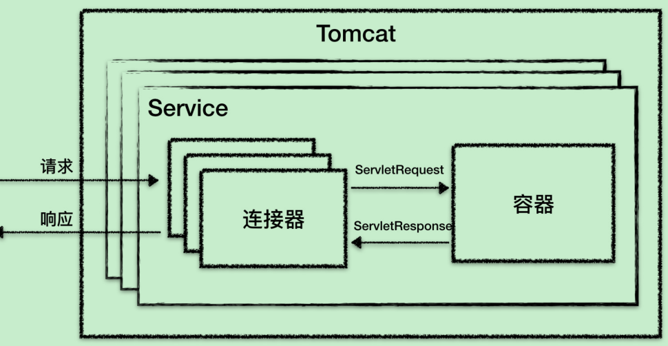

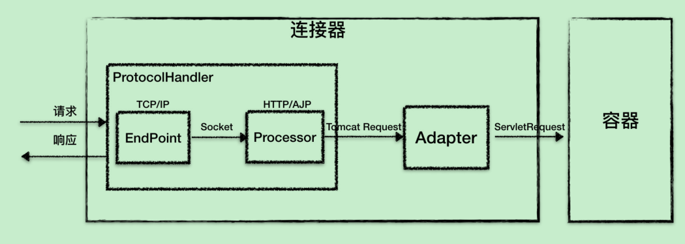

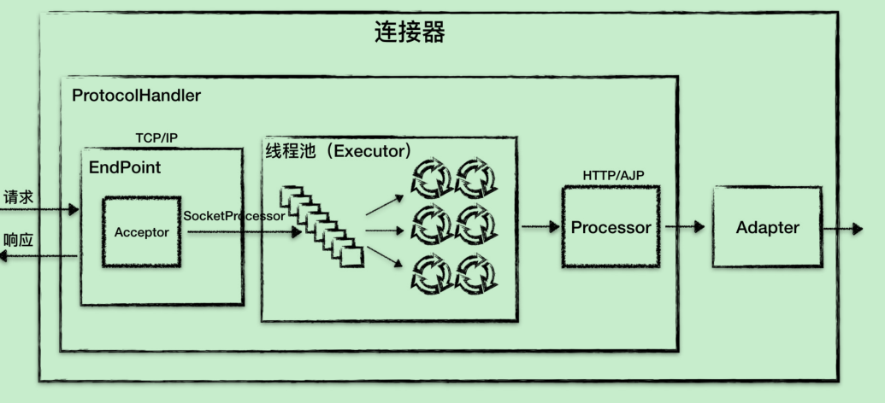

> ==架构分析==
>
> Tomcat 的整体架构包含了两个核心组件连接器和容器。
>
> 连接器负责对外交流，容器负责内部处理。连接器用 ProtocolHandler 接口来封装通信协议和 I/O 模型的差异，
> ProtocolHandler 内部又分为 EndPoint 和 Processor 模块，
>
> EndPoint 负责底层 Socket通信，Proccesor 负责应用层协议解析。连接器通过适配器 Adapter 调用容器

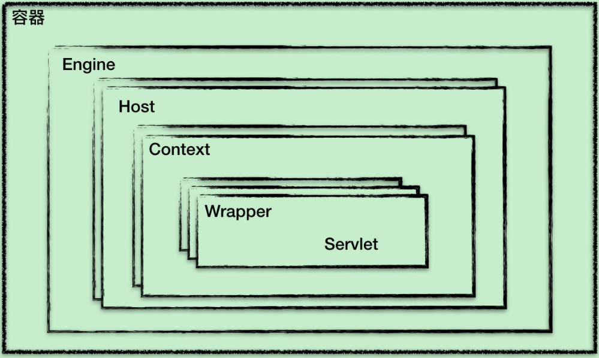

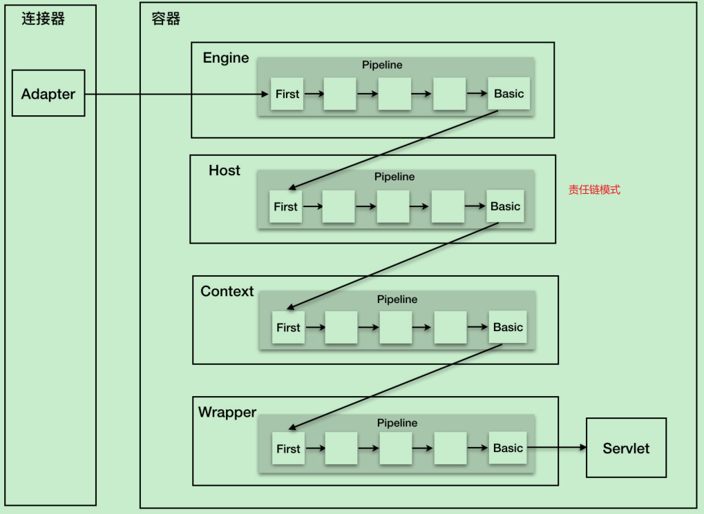

> Context 表示一个 Web 应用程序；
>
> Wrapper 表示一个 Servlet，一个 Web 应用程序中可能会有多个 Servlet；
>
> Host 代表的是一个虚拟主机，或者说一个站点，可以给 Tomcat 配置多个虚拟主机地址，而一个虚拟主机下可以部署多个 Web 应用程序；
>
> Engine 表示引擎，用来管理多个虚拟站点，一个 Service 最多只能有一个 Engine。

> ==请求定位 Servlet 的过程==
> Tomcat 是用 Mapper 组件来完成这个任务的。
> Mapper 组件的功能就是将用户请求的 URL 定位到一个 Servlet，它的工作原理是：
> Mapper 组件里保存了 Web 应用的配置信息，其实就是容器组件与访问路径的映射关系，比如 Host 容器里配置的域名、Context 容器里的 Web 应用路径，以及 Wrapper 容器里Servlet 映射的路径，你可以想象这些配置信息就是一个多层次的 Map。
>
> 当一个请求到来时，Mapper 组件通过解析请求 URL 里的域名和路径，再到自己保存的Map 里去查找，就能定位到一个 Servlet。
>
> ==访问一个 URL过程？==
>
> 首先，根据协议和端口号选定 Service 和 Engine。
>
> 根据域名选定 Host。
>
> 根据 URL 路径找到 Context 组件
>
> 最后，根据 URL 路径找到 Wrapper（Servlet）

==虚线表示一个请求在 Tomcat 中流转的过程==

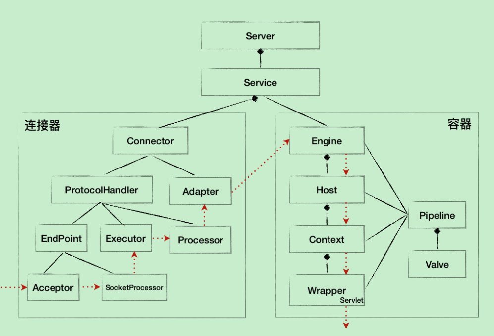

==Tomcat 的 /bin 目录下的脚本 startup.sh启动分析==

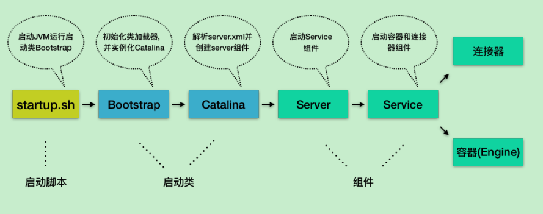

## jetty架构分析

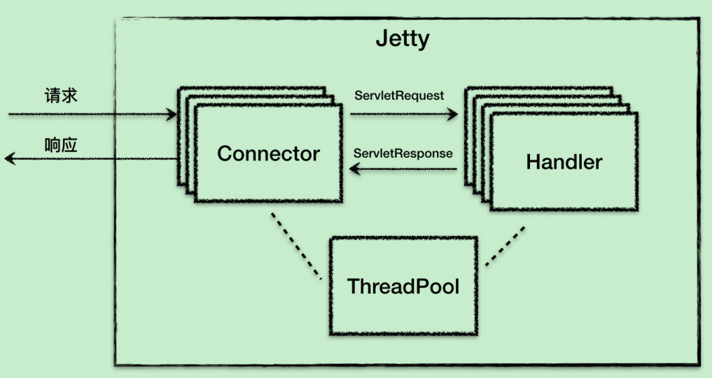

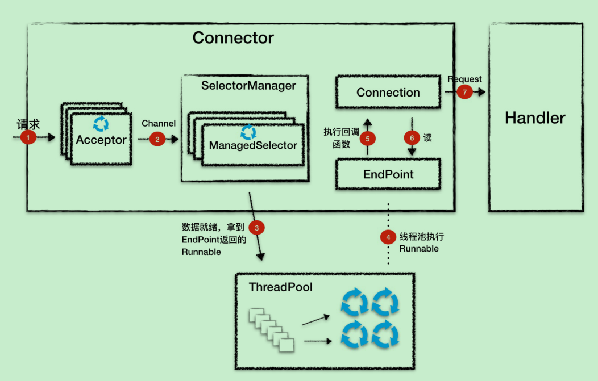

> 1.Acceptor 监听连接请求，当有连接请求到达时就接受连接，一个连接对应一个Channel，Acceptor 将 Channel 交给 ManagedSelector 来处理。
> 2.ManagedSelector 把 Channel 注册到 Selector 上，并创建一个 EndPoint 和Connection 跟这个 Channel 绑定，接着就不断地检测 I/O 事件。
> 3.I/O 事件到了就调用 EndPoint 的方法拿到一个 Runnable，并扔给线程池执行。
>
> 4. 线程池中调度某个线程执行 Runnable。
> 5. Runnable 执行时，调用回调函数，这个回调函数是 Connection 注册到 EndPoint 中的。
> 6. 回调函数内部实现，其实就是调用 EndPoint 的接口方法来读数据。
> 7. Connection 解析读到的数据，生成请求对象并交给 Handler 组件去处理。

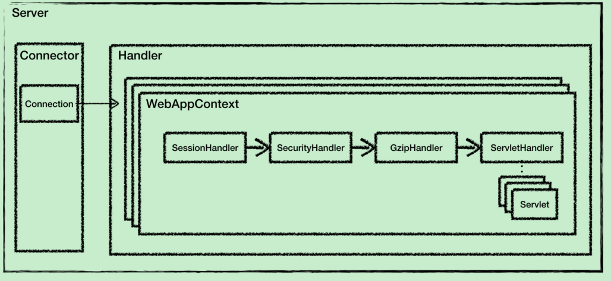

> Jetty 的 Handler 组件和 Tomcat 中的容器组件是大致是对等的概念，
>
> Jetty 中的 WebAppContext 相当于 Tomcat 的 Context 组件，都是对应一个 Web 应用；
>
> 而 Jetty 中的 ServletHandler 对应 Tomcat 中的 Wrapper 组件，它负责初始化和调用 Servlet，并实现了 Filter 的功能

## tomcat启动优化

> 具体可参考E:\baiduDiskData\50-深入拆解Tomcat & Jetty\03-模块二 整体架构 (9讲) 中tomcat启动优化速度讲解
>
> 1. 清理不必要的 Web 应用
>
>    首先我们要做的是删除掉 webapps 文件夹下不需要的工程，一般是 host-manager、example、doc 等这些默认的工程，可能还有以前添加的但现在用不着的工程，最好把这些全都删除掉。如果你看过 Tomcat 的启动日志，可以发现每次启动 Tomcat，都会重新布署这些工程。
>
> 2. 清理 XML 配置文件
>
> 3. 删除所有不需要的 JAR 文件
>
>    Web 应用中的 lib 目录下不应该出现 Servlet API 或者 Tomcat 自身的 JAR，这些 JAR 由 Tomcat 负责提供。如果你是使用 Maven 来构建你的应用，对 Servlet API 的依赖应该指定为<scope>provided</scope>
>
> 4. 清理其他文件
>
>    及时清理日志，删除 logs 文件夹下不需要的日志文件。同样还有 work 文件夹下的 catalina文件夹
>
> 5. 禁止 Tomcat TLD 扫描
>
>    tomcat.util.scan.StandardJarScanFilter.jarsToSkip=xxx.jar
>
> 6. 关闭 WebSocket 支持
>
> 7. 关闭 JSP 支持
>
> 8. 禁止 Servlet 注解扫描
>
> 9. 配置 Web-Fragment 扫描
>
> 10. 随机数熵源优化
>
> 11. 并行启动多个 Web 应用

## tomcat核心点分析

==NioEndpoint组件：Tomcat如何实现非阻塞I/O？==

> LimitLatch 
>
> 用来控制连接个数，当连接数到达最大时阻塞线程，直到后续组件处理完一个连接后将连接数减 1。
>
> Acceptor 
>
> 实现了 Runnable 接口，因此可以跑在单独线程里。一个端口号只能对应一个ServerSocketChannel，因此这个 ServerSocketChannel 是在多个 Acceptor 线程之间共享的，它是 Endpoint 的属性，由 Endpoint 完成初始化和端口绑定。
>
> Poller 
>
> 本质是一个 Selector，它内部维护一个 Queue，Poller 不断的通过内部的 Selector 对象向内核查询 Channel 的状态，一旦可读就生成任务类 SocketProcessor 交给 Executor 去处理。Poller 的另一个重要任务是循环遍历检查自己所管理的 SocketChannel 是否已经超时，如果有超时就关闭这个 SocketChannel。
>
> SocketProcessor
> 实现了 Runnable 接口，用来定义 Executor 中线程所执行的任务，主要就是调用Http11Processor 组件来处理请求。Http11Processor 读取 Channel 的数据来生成ServletRequest 对象
>
> Executor 
>
> 是 Tomcat 定制版的线程池，就是执行 SocketProcessor 的 run 方法，也就是解析请求并通过容器来处理请求，最终会调用到我们的 Servlet

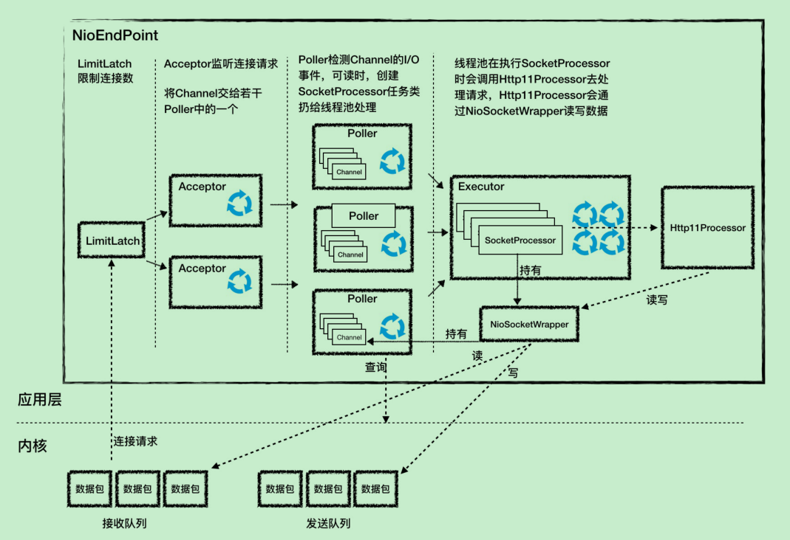

==Nio2Endpoint组件：Tomcat如何实现异步I/O？==

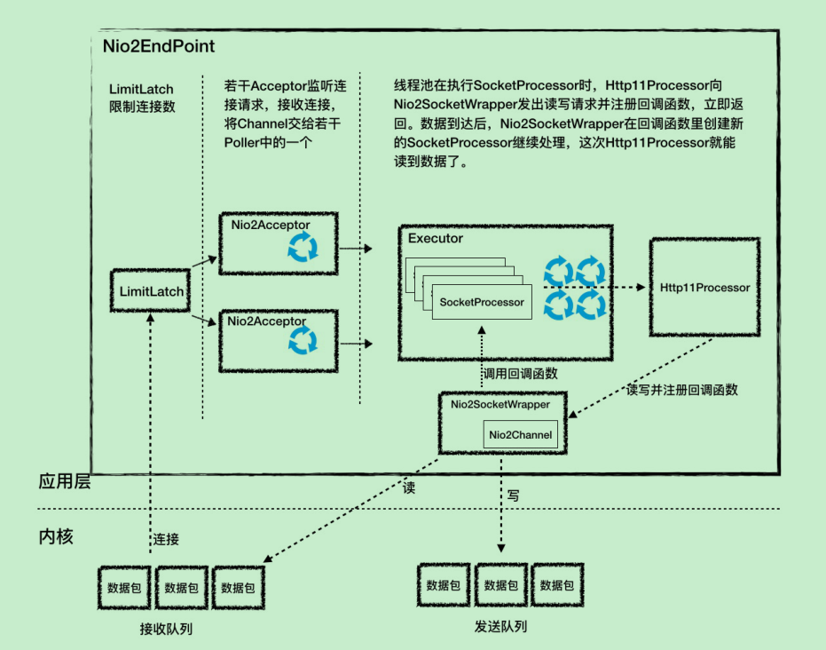

> LimitLatch 是连接控制器，它负责控制最大连接数。
>
> Nio2Acceptor 
>
> 扩展了 Acceptor，用异步 I/O 的方式来接收连接，跑在一个单独的线程里，也是一个线程组。Nio2Acceptor 接收新的连接后，得到一个AsynchronousSocketChannel，Nio2Acceptor 把 AsynchronousSocketChannel 封装成一个 Nio2SocketWrapper，并创建一个 SocketProcessor 任务类交给线程池处理，并且 SocketProcessor 持有 Nio2SocketWrapper 对象。
>
> Executor 
>
> 在执行 SocketProcessor 时，SocketProcessor 的 run 方法会调用Http11Processor 来处理请求，Http11Processor 会通过 Nio2SocketWrapper 读取和解析请求数据，请求经过容器处理后，再把响应通过 Nio2SocketWrapper 写出

==AprEndpoint组件：Tomcat APR提高I/O性能的秘密==

TODO

> ==Executor组件：Tomcat如何扩展Java线程池？==
>
> 1. Tomcat 有自己的定制版任务队列(<u>通过维护变量submittedCount，在任务队列的长度无限制的情况下，让线程池有机会创建新的线程</u>)和线程工厂，并且可以限制任务队列的长度，它的最大长度是maxQueueSize。
> 2. Tomcat 对线程数也有限制，设置了核心线程数（minSpareThreads）和最大线程池数（maxThreads）
> 3. 总线程数达到 maximumPoolSize，则继续尝试把任务添加到任务队列中去，添加失败再执行拒绝策略,而不是像java线程池一样直接执行拒绝策略

