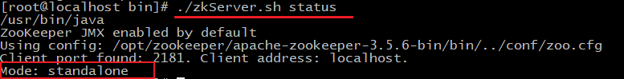

# zookeeper

## 定义

Zookeeper是一个==分布式开源框架==，用来==协调分布式应用==。


## 应用场景

1、作为==注册中心（命名服务）结合RPC调用框架==。

2、发布-订阅（watcher），对zk节点监控，发生改变，进行事件通知。

3、负载均衡实现。

4、分布式通知。

5、zookeeper==分布式锁==。

6、==分布式配置中心==。


## 数据结构

树状存储结构

*zookeeper 为了保证 高吞吐和低延迟，在内存中维护了这个树状的目录结构，这种特性使得 zookeeper 不能用于存放大量的数据，每个节点的存放数据上限为 1M。*

节点名称不允许重复。

**节点包括：**

persistent:持久化节点

persistent_SEQUENTIAL（[sɪ'kwenʃ(ə)l] ）:顺序自动编号持久化节点，这种节点会根据当前已存在的节点数自动加 1

ephemeral（[ɪ'fem(ə)rəl] ）:临时节点，客户端session超时这类节点就会被自动删除

ephemeral_sequential:临时自动编号节点


## 安装

**windows：**

> 环境要求:必须要有jdk环境,本次讲课使用jdk1.8
>
> 1.安装jdk
>
> 2.安装Zookeeper. 在官网http://zookeeper.apache.org/下载zookeeper.我下载的是zookeeper-3.4.6版本。
>
> 解压zookeeper-3.4.6至D:\machine\zookeeper-3.4.6.
>
> 在D:\machine 新建data及log目录。
>
> 3.ZooKeeper的安装模式分为三种，分别为：单机模式（stand-alone）、集群模式和集群伪分布模式。ZooKeeper 单机模式的安装相对比较简单，如果第一次接触ZooKeeper的话，建议安装ZooKeeper单机模式或者集群伪分布模式。
>
> 安装单击模式。 至D:\machine\zookeeper-3.4.6\conf 复制 zoo_sample.cfg 并粘贴到当前目录下，命名zoo.cfg.
>

**linux**

> ## 1.1 下载安装
>
> **1、环境准备**
>
> ZooKeeper服务器是用Java创建的，它运行在JVM之上。需要安装JDK 7或更高版本。
>
> **2、上传**
>
> 将下载的ZooKeeper放到/opt/ZooKeeper目录下
>
> ```shell
> #上传zookeeper alt+p
> put f:/setup/apache-zookeeper-3.5.6-bin.tar.gz
> #打开 opt目录
> cd /opt
> #创建zooKeeper目录
> mkdir  zooKeeper
> #将zookeeper安装包移动到 /opt/zooKeeper
> mv apache-zookeeper-3.5.6-bin.tar.gz /opt/zookeeper/
> ```
>
> **3、解压**
>
> 将tar包解压到/opt/zookeeper目录下
>
> ```shell
> tar -zxvf apache-ZooKeeper-3.5.6-bin.tar.gz 
> ```
>
> ## 1.2 配置启动
>
> **1、配置zoo.cfg**
>
> 进入到conf目录拷贝一个zoo_sample.cfg并完成配置
>
> ```shell
> #进入到conf目录
> cd /opt/zooKeeper/apache-zooKeeper-3.5.6-bin/conf/
> #拷贝
> cp  zoo_sample.cfg  zoo.cfg
> ```
>
> 
>
> 修改zoo.cfg
>
> ```shell
> #打开目录
> cd /opt/zooKeeper/
> #创建zooKeeper存储目录
> mkdir  zkdata
> #修改zoo.cfg
> vim /opt/zooKeeper/apache-zooKeeper-3.5.6-bin/conf/zoo.cfg
> ```
>
> 
>
> 修改存储目录：dataDir=/opt/zookeeper/zkdata
>
> **2、启动ZooKeeper**
>
> ```shell
> cd /opt/zooKeeper/apache-zooKeeper-3.5.6-bin/bin/
> #启动
>  ./zkServer.sh  start
> ```
>
> 
>
> 看到上图表示ZooKeeper成功启动
>
> **3、查看ZooKeeper状态**
>
> ```shell
> ./zkServer.sh status
> ```
>
> zookeeper启动成功。standalone代表zk没有搭建集群，现在是单节点
>
> 
>
> zookeeper没有启动
>
> 

## 命令

使用 zkCli.sh -server 127.0.0.1:2181 连接到 ZooKeeper 服务，连接成功后，系统会输出 ZooKeeper 的相关环境以及配置信息。

> **./zkCli.sh –server** **ip:port**

服务端常用命令

> 1. 显示根目录下、文件： ls / 使用 ls 命令来查看当前 ZooKeeper 中所包含的内容
>
> 2. 显示根目录下、文件： ls2 / 查看当前节点数据并能看到更新次数等数据
>
> 3. 创建文件，并设置初始内容： create /zk "test" 创建一个新的 znode节点“ zk ”以及与它关联的字符串
>
> 4. 获取文件内容： get /zk 确认 znode 是否包含我们所创建的字符串
>
> 5. 修改文件内容： set /zk "zkbak" 对 zk 所关联的字符串进行设置
>
> 6. 删除文件： delete /zk 将刚才创建的 znode 删除
>
> 7. 退出客户端： quit
>
> 8. 帮助命令： help
> 9. ls -s /节点 path #•查询节点详细信息
>
> •启动 ZooKeeper 服务: ./zkServer.sh start
>
> •查看 ZooKeeper 服务状态: ./zkServer.sh status
>
> •停止 ZooKeeper 服务: ./zkServer.sh stop 
>
> •重启 ZooKeeper 服务: ./zkServer.sh restart 

> ==详细信息说明==
>
> •czxid：节点被创建的事务ID
>
> •ctime: 创建时间 
>
> •mzxid: 最后一次被更新的事务ID 
>
> •mtime: 修改时间 
>
> •pzxid：子节点列表最后一次被更新的事务ID
>
> •cversion：子节点的版本号
>
> •dataversion：数据版本号
>
> •aclversion：权限版本号
>
> •ephemeralOwner：用于临时节点，代表临时节点的事务ID，如果为持久节点则为0
>
> •dataLength：节点存储的数据的长度
>
> •numChildren：当前节点的子节点个数

## Curator操作zookeeper

Curator

> http://curator.apache.org/

### pom引入

```xml
 <!--curator-->
        <dependency>
            <groupId>org.apache.curator</groupId>
            <artifactId>curator-framework</artifactId>
            <version>4.0.0</version>
        </dependency>

        <dependency>
            <groupId>org.apache.curator</groupId>
            <artifactId>curator-recipes</artifactId>
            <version>4.0.0</version>
        </dependency>
```

### 节点操作

```java
package com.itheima.curator;

import org.apache.curator.RetryPolicy;
import org.apache.curator.framework.CuratorFramework;
import org.apache.curator.framework.CuratorFrameworkFactory;
import org.apache.curator.framework.api.BackgroundCallback;
import org.apache.curator.framework.api.CuratorEvent;
import org.apache.curator.retry.ExponentialBackoffRetry;
import org.apache.zookeeper.CreateMode;
import org.apache.zookeeper.data.Stat;
import org.junit.After;
import org.junit.Before;
import org.junit.Test;

import java.util.List;

public class CuratorTest {


    private CuratorFramework client;

    /**
     * 建立连接
     */
    @Before
    public void testConnect() {

        /*
         *
         * @param connectString       连接字符串。zk server 地址和端口 "192.168.149.135:2181,192.168.149.136:2181"
         * @param sessionTimeoutMs    会话超时时间 单位ms
         * @param connectionTimeoutMs 连接超时时间 单位ms
         * @param retryPolicy         重试策略
         */
       /* //重试策略
        RetryPolicy retryPolicy = new ExponentialBackoffRetry(3000,10);
        //1.第一种方式
        CuratorFramework client = CuratorFrameworkFactory.newClient("192.168.149.135:2181",
                60 * 1000, 15 * 1000, retryPolicy);*/
        //重试策略
        RetryPolicy retryPolicy = new ExponentialBackoffRetry(3000, 10);
        //2.第二种方式
        //CuratorFrameworkFactory.builder();
        client = CuratorFrameworkFactory.builder()
                .connectString("192.168.149.135:2181")
                .sessionTimeoutMs(60 * 1000)
                .connectionTimeoutMs(15 * 1000)
                .retryPolicy(retryPolicy)
                .namespace("itheima")
                .build();

        //开启连接
        client.start();

    }
//==============================create=============================================================================

    /**
     * 创建节点：create 持久 临时 顺序 数据
     * 1. 基本创建 ：create().forPath("")
     * 2. 创建节点 带有数据:create().forPath("",data)
     * 3. 设置节点的类型：create().withMode().forPath("",data)
     * 4. 创建多级节点  /app1/p1 ：create().creatingParentsIfNeeded().forPath("",data)
     */
    @Test
    public void testCreate() throws Exception {
        //2. 创建节点 带有数据
        //如果创建节点，没有指定数据，则默认将当前客户端的ip作为数据存储
        String path = client.create().forPath("/app2", "hehe".getBytes());
        System.out.println(path);

    }

    @Test
    public void testCreate2() throws Exception {
        //1. 基本创建
        //如果创建节点，没有指定数据，则默认将当前客户端的ip作为数据存储
        String path = client.create().forPath("/app1");
        System.out.println(path);

    }

    @Test
    public void testCreate3() throws Exception {
        //3. 设置节点的类型
        //默认类型：持久化
        String path = client.create().withMode(CreateMode.EPHEMERAL).forPath("/app3");
        System.out.println(path);


    }

    @Test
    public void testCreate4() throws Exception {
        //4. 创建多级节点  /app1/p1
        //creatingParentsIfNeeded():如果父节点不存在，则创建父节点
        String path = client.create().creatingParentsIfNeeded().forPath("/app4/p1");
        System.out.println(path);
    }
//===========================get================================================================================

    /**
     * 查询节点：
     * 1. 查询数据：get: getData().forPath()
     * 2. 查询子节点： ls: getChildren().forPath()
     * 3. 查询节点状态信息：ls -s:getData().storingStatIn(状态对象).forPath()
     */

    @Test
    public void testGet1() throws Exception {
        //1. 查询数据：get
        byte[] data = client.getData().forPath("/app1");
        System.out.println(new String(data));
    }

    @Test
    public void testGet2() throws Exception {
        // 2. 查询子节点： ls
        List<String> path = client.getChildren().forPath("/");

        System.out.println(path);
    }

    @Test
    public void testGet3() throws Exception {


        Stat status = new Stat();
        System.out.println(status);
        //3. 查询节点状态信息：ls -s
        client.getData().storingStatIn(status).forPath("/app1");

        System.out.println(status);

    }

    //===========================set================================================================================

    /**
     * 修改数据
     * 1. 基本修改数据：setData().forPath()
     * 2. 根据版本修改: setData().withVersion().forPath()
     * * version 是通过查询出来的。目的就是为了让其他客户端或者线程不干扰我。
     *
     * @throws Exception
     */
    @Test
    public void testSet() throws Exception {
        client.setData().forPath("/app1", "itcast".getBytes());
    }


    @Test
    public void testSetForVersion() throws Exception {

        Stat status = new Stat();
        //3. 查询节点状态信息：ls -s
        client.getData().storingStatIn(status).forPath("/app1");


        int version = status.getVersion();//查询出来的 3
        System.out.println(version);
        client.setData().withVersion(version).forPath("/app1", "hehe".getBytes());
    }

    //===========================delete================================================================================

    /**
     * 删除节点： delete deleteall
     * 1. 删除单个节点:delete().forPath("/app1");
     * 2. 删除带有子节点的节点:delete().deletingChildrenIfNeeded().forPath("/app1");
     * 3. 必须成功的删除:为了防止网络抖动。本质就是重试。  client.delete().guaranteed().forPath("/app2");
     * 4. 回调：inBackground
     * @throws Exception
     */


    @Test
    public void testDelete() throws Exception {
        // 1. 删除单个节点
        client.delete().forPath("/app1");
    }

    @Test
    public void testDelete2() throws Exception {
        //2. 删除带有子节点的节点
        client.delete().deletingChildrenIfNeeded().forPath("/app4");
    }
    @Test
    public void testDelete3() throws Exception {
        //3. 必须成功的删除
        client.delete().guaranteed().forPath("/app2");
    }

    @Test
    public void testDelete4() throws Exception {
        //4. 回调
        client.delete().guaranteed().inBackground(new BackgroundCallback(){

            @Override
            public void processResult(CuratorFramework client, CuratorEvent event) throws Exception {
                System.out.println("我被删除了~");
                System.out.println(event);
            }
        }).forPath("/app1");
    }

    @After
    public void close() {
        if (client != null) {
            client.close();
        }
    }


}

```

### watch

```java
package com.itheima.curator;

import org.apache.curator.RetryPolicy;
import org.apache.curator.framework.CuratorFramework;
import org.apache.curator.framework.CuratorFrameworkFactory;
import org.apache.curator.framework.api.BackgroundCallback;
import org.apache.curator.framework.api.CuratorEvent;
import org.apache.curator.framework.recipes.cache.*;
import org.apache.curator.retry.ExponentialBackoffRetry;
import org.apache.zookeeper.CreateMode;
import org.apache.zookeeper.data.Stat;
import org.junit.After;
import org.junit.Before;
import org.junit.Test;

import java.util.List;

public class CuratorWatcherTest {


    private CuratorFramework client;

    /**
     * 建立连接
     */
    @Before
    public void testConnect() {

        /*
         *
         * @param connectString       连接字符串。zk server 地址和端口 "192.168.149.135:2181,192.168.149.136:2181"
         * @param sessionTimeoutMs    会话超时时间 单位ms
         * @param connectionTimeoutMs 连接超时时间 单位ms
         * @param retryPolicy         重试策略
         */
       /* //重试策略
        RetryPolicy retryPolicy = new ExponentialBackoffRetry(3000,10);
        //1.第一种方式
        CuratorFramework client = CuratorFrameworkFactory.newClient("192.168.149.135:2181",
                60 * 1000, 15 * 1000, retryPolicy);*/
        //重试策略
        RetryPolicy retryPolicy = new ExponentialBackoffRetry(3000, 10);
        //2.第二种方式
        //CuratorFrameworkFactory.builder();
        client = CuratorFrameworkFactory.builder()
                .connectString("192.168.149.135:2181")
                .sessionTimeoutMs(60 * 1000)
                .connectionTimeoutMs(15 * 1000)
                .retryPolicy(retryPolicy)
                .namespace("itheima")
                .build();

        //开启连接
        client.start();

    }

    @After
    public void close() {
        if (client != null) {
            client.close();
        }
    }

    /**
     * 演示 NodeCache：给指定一个节点注册监听器
     */

    @Test
    public void testNodeCache() throws Exception {
        //1. 创建NodeCache对象
        final NodeCache nodeCache = new NodeCache(client,"/app1");
        //2. 注册监听
        nodeCache.getListenable().addListener(new NodeCacheListener() {
            @Override
            public void nodeChanged() throws Exception {
                System.out.println("节点变化了~");

                //获取修改节点后的数据
                byte[] data = nodeCache.getCurrentData().getData();
                System.out.println(new String(data));
            }
        });

        //3. 开启监听.如果设置为true，则开启监听是，加载缓冲数据
        nodeCache.start(true);


        while (true){

        }
    }


    /**
     * 演示 PathChildrenCache：监听某个节点的所有子节点们
     */

    @Test
    public void testPathChildrenCache() throws Exception {
        //1.创建监听对象
        PathChildrenCache pathChildrenCache = new PathChildrenCache(client,"/app2",true);

        //2. 绑定监听器
        pathChildrenCache.getListenable().addListener(new PathChildrenCacheListener() {
            @Override
            public void childEvent(CuratorFramework client, PathChildrenCacheEvent event) throws Exception {
                System.out.println("子节点变化了~");
                System.out.println(event);
                //监听子节点的数据变更，并且拿到变更后的数据
                //1.获取类型
                PathChildrenCacheEvent.Type type = event.getType();
                //2.判断类型是否是update
                if(type.equals(PathChildrenCacheEvent.Type.CHILD_UPDATED)){
                    System.out.println("数据变了！！！");
                    byte[] data = event.getData().getData();
                    System.out.println(new String(data));

                }
            }
        });
        //3. 开启
        pathChildrenCache.start();

        while (true){

        }
    }


    /**
     * 演示 TreeCache：监听某个节点自己和所有子节点们
     */

    @Test
    public void testTreeCache() throws Exception {
        //1. 创建监听器
        TreeCache treeCache = new TreeCache(client,"/app2");

        //2. 注册监听
        treeCache.getListenable().addListener(new TreeCacheListener() {
            @Override
            public void childEvent(CuratorFramework client, TreeCacheEvent event) throws Exception {
                System.out.println("节点变化了");
                System.out.println(event);
            }
        });

        //3. 开启
        treeCache.start();

        while (true){

        }
    }

}

```

### 锁

```java
package com.itheima.curator;

import org.apache.curator.RetryPolicy;
import org.apache.curator.framework.CuratorFramework;
import org.apache.curator.framework.CuratorFrameworkFactory;
import org.apache.curator.framework.recipes.locks.InterProcessMutex;
import org.apache.curator.retry.ExponentialBackoffRetry;

import java.util.concurrent.TimeUnit;

public class Ticket12306 implements Runnable{

    private int tickets = 10;//数据库的票数

    private InterProcessMutex lock ;


    public Ticket12306(){
        //重试策略
        RetryPolicy retryPolicy = new ExponentialBackoffRetry(3000, 10);
        //2.第二种方式
        //CuratorFrameworkFactory.builder();
        CuratorFramework client = CuratorFrameworkFactory.builder()
                .connectString("192.168.149.135:2181")
                .sessionTimeoutMs(60 * 1000)
                .connectionTimeoutMs(15 * 1000)
                .retryPolicy(retryPolicy)
                .build();

        //开启连接
        client.start();

        lock = new InterProcessMutex(client,"/lock");
    }

    @Override
    public void run() {

        while(true){
            //获取锁
            try {
                lock.acquire(3, TimeUnit.SECONDS);
                if(tickets > 0){

                    System.out.println(Thread.currentThread()+":"+tickets);
                    Thread.sleep(100);
                    tickets--;
                }
            } catch (Exception e) {
                e.printStackTrace();
            }finally {
                //释放锁
                try {
                    lock.release();
                } catch (Exception e) {
                    e.printStackTrace();
                }
            }


        }

    }
}

public class LockTest {


    public static void main(String[] args) {
        Ticket12306 ticket12306 = new Ticket12306();

        //创建客户端
        Thread t1 = new Thread(ticket12306,"携程");
        Thread t2 = new Thread(ticket12306,"飞猪");

        t1.start();
        t2.start();
    }

}

```


## watcher节点监听

> •ZooKeeper 允许用户在指定节点上注册一些Watcher，并且在一些特定事件触发的时候，ZooKeeper 服务端会将事件通知到感兴趣的客户端上去，该机制是 ZooKeeper 实现分布式协调服务的重要特性。
>
> •==ZooKeeper 中引入了Watcher机制来实现了发布/订阅功能能，能够让多个订阅者同时监听某一个对象，当一个对象自身状态变化时，会通知所有订阅者==。
>
> •ZooKeeper 原生支持通过注册Watcher来进行事件监听，但是其使用并不是特别方便,需要开发人员自己反复注册Watcher，比较繁琐。
>
> •Curator引入了 Cache 来实现对 ZooKeeper 服务端事件的监听。
>
> •ZooKeeper提供了三种Watcher：
>
> •==NodeCache== : 只是监听某一个特定的节点
>
> •==PathChildrenCache== : 监控一个ZNode的子节点. 
>
> •==TreeCache== : 可以监控整个树上的所有节点，类似于PathChildrenCache和NodeCache的组合


## 分布式锁

### ***数据库实现分布式锁。***

参考连接：https://honeypps.com/architect/distribute-lock-based-on-database/

**方式1：**建立一个锁表，添加唯一性约束。当想获得锁的时候，插入数据，释放锁的时候，删除数据。

多个请求的话，只有一个成功，其他都会插入失败。

**<u>优缺点：</u>**

1. 这种锁没有失效时间，一旦释放锁的操作失败就会导致锁记录一直在数据库中，其它线程无法获得锁。这个缺陷也很好解决，比如可以做一个定时任务去定时清理。
2. 这种锁的可靠性依赖于数据库。建议设置备库，避免单点，进一步提高可靠性。
3. 这种锁是非阻塞的，因为插入数据失败之后会直接报错，想要获得锁就需要再次操作。如果需要阻塞式的，可以弄个for循环、while循环之类的，直至INSERT成功再返回。
4. 这种锁也是非可重入的，因为同一个线程在没有释放锁之前无法再次获得锁，因为数据库中已经存在同一份记录了。想要实现可重入锁，可以在数据库中添加一些字段，比如获得锁的主机信息、线程信息等，那么在再次获得锁的时候可以先查询数据，如果当前的主机信息和线程信息等能被查到的话，可以直接把锁分配给它。

**2、乐观锁**

version 版本概念，更新的时候，获取开始查询的version，判断是否一致，一致则更新。

作用于同一行数据记录上，这就导致一个明显的缺点，在一些特殊场景，如大促、秒杀等活动开展的时候，大量的请求同时请求同一条记录的行锁，会对数据库产生很大的写压力。乐观锁比较适合并发量不高，并且写操作不频繁的场景。

**3、悲观锁**

查询语句后面增加FOR UPDATE，数据库会在查询过程中给数据库表增加悲观锁，也称排他锁。

悲观锁中，每一次行数据的访问都是独占的，只有当正在访问该行数据的请求事务提交以后，其他请求才能依次访问该数据，否则将阻塞等待锁的获取。

悲观锁可以严格保证数据访问的安全。但是缺点也明显，即每次请求都会额外产生加锁的开销且未获取到锁的请求将会阻塞等待锁的获取，在高并发环境下，容易造成大量请求阻塞，影响系统可用性。另外，悲观锁使用不当还可能产生死锁的情况。

### redis实现

[具体实现以及原理分析]: https://www.jianshu.com/p/47fd7f86c848


### zookeeper实现(zkclient)

临时节点+事件通知 实现

```java
package com.abner.test;

import org.I0Itec.zkclient.ZkClient;

public  abstract  class ZookeeperAbstractLock implements  Lock {

    // zk连接地址
    private static final String CONNECTSTRING = "127.0.0.1:2181";
    // 创建zk连接
    protected ZkClient zkClient = new ZkClient(CONNECTSTRING);
    protected static final String PATH = "/lock";

    public void getLock() {
        if (tryLock()) {
            System.out.println("##获取lock锁的资源####");
        } else {
            // 等待
            waitLock();
            // 重新获取锁资源
            getLock();
        }

    }

    // 获取锁资源
    abstract boolean tryLock();

    // 等待
    abstract void waitLock();

    public void unLock() {
        if (zkClient != null) {
            zkClient.close();
            System.out.println("释放锁资源...");
        }
    }

}

```

```java
package com.abner.test;

import org.I0Itec.zkclient.IZkDataListener;

import java.util.concurrent.CountDownLatch;

public class ZookeeperDistrbuteLock  extends ZookeeperAbstractLock  {
    private CountDownLatch countDownLatch = null;
    @Override
    boolean tryLock() {
        try {
            zkClient.createEphemeral(PATH);
            return true;
        } catch (Exception e) {
            return false;
        }

    }

    @Override
    void waitLock() {
        IZkDataListener iZkDataListener=new IZkDataListener() {
            public void handleDataChange(String s, Object o) throws Exception {
                // 唤醒被等待的线程
                if (countDownLatch != null) {
                    countDownLatch.countDown();
                }

            }
            public void handleDataDeleted(String s) throws Exception {

            }
        };
        // 注册事件
        zkClient.subscribeDataChanges(PATH, iZkDataListener);
        if (zkClient.exists(PATH)) {
            countDownLatch = new CountDownLatch(1);
            try {
                countDownLatch.await();
            } catch (Exception e) {
                e.printStackTrace();
            }
        }
        // 删除监听
        zkClient.unsubscribeDataChanges(PATH, iZkDataListener);


    }
}

```

```java
package com.abner.test;

public class OrderService implements Runnable {
    private OrderNumGenerator orderNumGenerator = new OrderNumGenerator();
    private Lock lock = new ZookeeperDistrbuteLock();
    public void run() {
        getNumber();
    }
    public void getNumber() {
        try {
            lock.getLock();
            String number = orderNumGenerator.getNumber();
            System.out.println(Thread.currentThread().getName() + ",生成订单ID:" + number);
        } catch (Exception e) {
            e.printStackTrace();
        } finally {
            lock.unLock();
        }
    }
    public static void main(String[] args) {
        System.out.println("####生成唯一订单号###");
        for (int i = 0; i < 100; i++) {
            new Thread( new OrderService()).start();
        }
    }
}

```


## zookeeper服务注册和发现

1、服务器端将启动的服务注册到，zk注册中心上，采用临时节点

2、客户端从zk节点上获取最新服务节点信息，本地使用负载均衡算法，随机分配服务器。

3、当服务提供者下线时，它创建的临时节点会被删除，Zookeeper会通知服务消费者节点的变化

取模算法   调用次数/服务器集群数量

step1:服务器注册至zk 

step2:客户端监听节点。获取节点下服务器信息。

step3:客户端根据服务器信息，采用取模算法，发送请求。


## zookeeper选举

### 选举过程

> 1==、全新集群选举（第一次启动）：==
> 假设目前有三台服务器，分别是1号、2号、3号；
> 首先1号启动，启动一次选举，1号投给自己一票，由于其他服务器没有启动，无法收到1号的投票信息，此时1号处于Looking（竞选状态）；
> 2号启动，启动选举，2号给自己投一票，并且与1号交换信息，此时1号发现2号的myId比自己投票服务器（服务器1）的myId大，此时1号0票，2号2票，2>(3/2)，服务器2的票数最多，超过半数，那么2号当选leader，1号更改状态为following，2号更改状态为leading；
> 3号启动，启动选举，给自己投一票，此时与之前启动的1号、2号交换信息，此时1号、2号并没有处于Looking（竞选中）状态，不会更改选举状态，3号一票，服从多数，此时3号更改状态为following；
> 注意：当集群服务器有5台时，前面的服务器1和服务器2，都是LOOKING，服务器1票数为0，服务器2票数为2，当启动第三台服务器时，服务器3的myid大，服务器2会把票数给服务器3，（服务器启动会给自己投一票）这时服务器3票数为3选为Leader，其他的都是follow，之后启动的服务器也是follow；
> ==非全新集群选举（非第一次启动）：==
> 如果leader服务器挂了，那么整个集群将暂停对外服务，进入新一轮leader选举，其过程和启动时期的leader选举过程基本一致。
>
> Leader挂掉后，余下的服务器都将自己的服务器状态变更为looking，然后开始进入Leader选举过程。服务器1号、2号、3号，此时2号是Leader，如果2号停电挂掉之后，1号、3号无法连接到Leader，知道Leader挂了，他们就知道必须选出一个新的 Leader，于是纷纷将自己的状态都修改为 LOOKING 状态：**（按选举原则选择）**
> 比如1号的ZXID（事物id）为：77，Epoch（任期代号）为：1，myid（服务器id）：1；3号的ZXID（事物id）为：80，Epoch（任期代号）为：1，myid（服务器id）：3；此时3号为leader。
>
> 如果follow挂掉了，此时集群还是可以对外提供服务，挂掉一个是达到整个集群总数的半数以上的，如果挂掉的follow恢复之后，还是以 Follower 的身份加入到集群中来，并且仍然以当前 Leader 的信息来同步，即使它的Epoch大于其他的服务器。
>

### 选举原则

> Leader选举：
>
> ==•Serverid：服务器ID==比如有三台服务器，编号分别是1,2,3。**编号越大在选择算法中的权重越大。**
>
> ==•Zxid：数据ID==**服务器中存放的最大数据ID.值越大说明数据 越新，在选举算法中数据越新权重越大**。
>
> - ==逻辑时钟(epoch-logicalclock)==：同一轮投票过程中的逻辑时钟值是相同的，每投完一次值会增加
>
> •在Leader选举的过程中，如果某台ZooKeeper获得了**超过半数的选票**，则此ZooKeeper就可以成为Leader了。
>
> 1. 优先比较 epoch
> 2. 检查 zxid，zxid 比较大的服务器优先作为 leader
> 3. 如果 zxid 相同，那么就比较 myid，myid 较大的服务器作为 leader 服务器

### Zxid解读

> zookeeper 是通过 ZXID 事务 ID 来确认的，ZXID 是一个长度为 64 位的数字，其中低 32 位是按照数字来递增，==任何数据的变更都会导致低 32 位数字简单加 1==。
>
> **高 32 位是 leader 周期编号**，**每当选举出一个新的 Leader 时，新的 Leader 就从本地事务日志中取出 ZXID，然后解析出高 32 位的周期编号，进行加** 1，**再将低 32 位的全部设置为 0**。
>
> 这样就保证了每次选举新的 Leader 后，保证了 ZXID 的唯一性而且是保证递增的。

### 数据同步流程

> 依赖 ZAB 协议来实现==分布式数据一致性。==
>
> ZAB 协议分为两部分：
>
> - 消息广播  （正常情况下）
> - 崩溃恢复  （节点宕机后。数据恢复的过程）
>
> #### **1、消息广播**
>
> Zookeeper 使用**单一的主进程 Leader 来接收和处理客户端所有事务请求**，并采用 ZAB 协议的原子广播协议，将事务请求以 Proposal **提议广播到所有 Follower 节点**，当集群中有**过半的Follower 服务器进行正确的 ACK 反馈，那么Leader就会再次向所有的 Follower 服务器发送commit 消息，将此次提案进行提交。这个过程可以简称为 2pc 事务提交**，注意 Observer 节点只负责同步 Leader 数据，不参与 2PC [数据同步](https://cloud.tencent.com/product/datainlong?from_column=20065&from=20065)过程。==（数据一致性的保证）==
>
> #### **2、崩溃恢复**
>
> 在正常情况消息下广播能运行良好，但是一旦 Leader 服务器出现崩溃，或者由于网络原理导致 Leader 服务器失去了与过半 Follower 的通信，那么就会进入崩溃恢复模式，需要选举出一个新的 Leader 服务器。在这个过程中可能会出现两种数据不一致性的隐患，需要 ZAB 协议的特性进行避免。
>
> - Leader 服务器将消息 commit 发出后，立即崩溃
> - Leader 服务器刚提出 proposal 后，立即崩溃
>
> ZAB 协议的恢复模式使用了以下策略：
>
> - ==选举 zxid 最大的节点作为新的 leader==
> - ==新 leader 将事务日志中尚未提交的消息进行处理==

### **选举状态**

> - **LOOKING**: 竞选状态
> - **FOLLOWING**: 随从状态，同步 leader 状态，参与投票
> - **OBSERVING**: 观察状态，同步 leader 状态，不参与投票
> - **LEADING**: 领导者状态

## 集群角色

> •==Leader 领导者== ：     
>
> 1. 处理事务请求
>
> 2. 集群内部各服务器的调度者
>
> ==•Follower 跟随者 ：==
>
> 1. 处理客户端非事务请求，转发事务请求给Leader服务器
>
> 2. 参与Leader选举投票
>
> ==•Observer 观察者：==
>
> 1. 处理客户端非事务请求，转发事务请求给Leader服务器

## 羊群效应

**一个特定的znode 改变的时候ZooKeper 触发了所有watches 的事件。导致大量的通知需要被发送，将会导致在这个通知期间的其他操作提交的延迟**

解决：（分布式锁原理来解决）

1. 客户端调用create()方法创建名为“_locknode_/guid-lock-”的节点，需要注意的是，这里节点的创建类型需要设置为EPHEMERAL_SEQUENTIAL。
2. 客户端调用getChildren(“_locknode_”)方法来**获取所有已经创建的子节点**，注意，**这里不注册任何Watcher**。
3. 客户端获取到所有子节点path之后，**如果发现自己在步骤1中创建的节点序号最小，那么就认为这个客户端获得了锁**。
4. 如果在步骤3中发现自己并非所有子节点中最小的，说明自己还没有获取到锁。此时**客户端需要找到比自己小的那个节点，然后对其调用exist()方法，同时注册事件监听。**
5. 之后当这个被关注的节点被移除了，客户端会收到相应的通知。这个时候客户端需要再次调用getChildren(“_locknode_”)方法来获取所有已经创建的子节点，确保自己确实是最小的节点了，然后进入步骤3。

## 分布式锁原理

> 1.客户端获取锁时，在lock节点下创建==临时顺序节点==。
>
> 2.==客户端获取到lock下面所有的子节点之后，如果发现自己创建的子节点序号最小==，那么就认为该客户端==获取到了锁。使用完锁后，将该节点删除==。
>
> 3.如果发现自己创建的节点并非lock所有子节点中最小的，说明自己还没有获取到锁，此时客户端需要==找到比自己小的那个节点，同时对其注册事件监听器，监听删除事件==。
>
> 4.如果发现比自己小的那个节点被删除，则客户端的Watcher会收到相应通知，此时==再次判断自己创建的节点是否是lock子节点中序号最小的==，如果是则获取到了锁，如果不是则重复以上步骤继续获取到比自己小的一个节点并注册监听。

## Curator实现分布式锁API

> ==•在Curator中有五种锁方案：==
>
> •InterProcessSemaphoreMutex：分布式排它锁（非可重入锁）
>
> •**InterProcessMutex**：分布式可重入排它锁
>
> •InterProcessReadWriteLock：分布式读写锁
>
> •InterProcessMultiLock：将多个锁作为单个实体管理的容器
>
> •InterProcessSemaphoreV2：共享信号量

## 集群搭建

### **1.1 搭建要求**

真实的集群是需要部署在不同的服务器上的，但是在我们测试时同时启动很多个虚拟机内存会吃不消，所以我们通常会搭建**伪集群**，也就是把所有的服务都搭建在一台虚拟机上，用端口进行区分。

我们这里要求搭建一个三个节点的Zookeeper集群（伪集群）。

### **1.2 准备工作**

重新部署一台虚拟机作为我们搭建集群的测试服务器。

（1）安装JDK  【此步骤省略】。

（2）Zookeeper压缩包上传到服务器
（3）将Zookeeper解压 ，建立/usr/local/zookeeper-cluster目录，将解压后的Zookeeper复制到以下三个目录

/usr/local/zookeeper-cluster/zookeeper-1

/usr/local/zookeeper-cluster/zookeeper-2

/usr/local/zookeeper-cluster/zookeeper-3

```shell
[root@localhost ~]# mkdir /usr/local/zookeeper-cluster
[root@localhost ~]# cp -r  apache-zookeeper-3.5.6-bin /usr/local/zookeeper-cluster/zookeeper-1
[root@localhost ~]# cp -r  apache-zookeeper-3.5.6-bin /usr/local/zookeeper-cluster/zookeeper-2
[root@localhost ~]# cp -r  apache-zookeeper-3.5.6-bin /usr/local/zookeeper-cluster/zookeeper-3
```

（4）创建data目录 ，并且将 conf下zoo_sample.cfg 文件改名为 zoo.cfg

```shell
mkdir /usr/local/zookeeper-cluster/zookeeper-1/data
mkdir /usr/local/zookeeper-cluster/zookeeper-2/data
mkdir /usr/local/zookeeper-cluster/zookeeper-3/data

mv  /usr/local/zookeeper-cluster/zookeeper-1/conf/zoo_sample.cfg  /usr/local/zookeeper-cluster/zookeeper-1/conf/zoo.cfg
mv  /usr/local/zookeeper-cluster/zookeeper-2/conf/zoo_sample.cfg  /usr/local/zookeeper-cluster/zookeeper-2/conf/zoo.cfg
mv  /usr/local/zookeeper-cluster/zookeeper-3/conf/zoo_sample.cfg  /usr/local/zookeeper-cluster/zookeeper-3/conf/zoo.cfg
```


（5） 配置每一个Zookeeper 的dataDir 和 clientPort 分别为2181  2182  2183

修改/usr/local/zookeeper-cluster/zookeeper-1/conf/zoo.cfg

```shell
vim /usr/local/zookeeper-cluster/zookeeper-1/conf/zoo.cfg

clientPort=2181
dataDir=/usr/local/zookeeper-cluster/zookeeper-1/data
```

修改/usr/local/zookeeper-cluster/zookeeper-2/conf/zoo.cfg

```shell
vim /usr/local/zookeeper-cluster/zookeeper-2/conf/zoo.cfg

clientPort=2182
dataDir=/usr/local/zookeeper-cluster/zookeeper-2/data
```

修改/usr/local/zookeeper-cluster/zookeeper-3/conf/zoo.cfg

```shell
vim /usr/local/zookeeper-cluster/zookeeper-3/conf/zoo.cfg

clientPort=2183
dataDir=/usr/local/zookeeper-cluster/zookeeper-3/data
```


### **1.3 配置集群**

（1）在每个zookeeper的 data 目录下创建一个 myid 文件，内容分别是1、2、3 。这个文件就是记录每个服务器的ID

```shell
echo 1 >/usr/local/zookeeper-cluster/zookeeper-1/data/myid
echo 2 >/usr/local/zookeeper-cluster/zookeeper-2/data/myid
echo 3 >/usr/local/zookeeper-cluster/zookeeper-3/data/myid
```


（2）在每一个zookeeper 的 zoo.cfg配置客户端访问端口（clientPort）和集群服务器IP列表。

集群服务器IP列表如下

```shell
vim /usr/local/zookeeper-cluster/zookeeper-1/conf/zoo.cfg
vim /usr/local/zookeeper-cluster/zookeeper-2/conf/zoo.cfg
vim /usr/local/zookeeper-cluster/zookeeper-3/conf/zoo.cfg

server.1=192.168.149.135:2881:3881
server.2=192.168.149.135:2882:3882
server.3=192.168.149.135:2883:3883
```

解释：server.服务器ID=服务器IP地址：服务器之间通信端口：服务器之间投票选举端口


 

### **1.4 启动集群**

启动集群就是分别启动每个实例。

```shell
/usr/local/zookeeper-cluster/zookeeper-1/bin/zkServer.sh start
/usr/local/zookeeper-cluster/zookeeper-2/bin/zkServer.sh start
/usr/local/zookeeper-cluster/zookeeper-3/bin/zkServer.sh start
```


 

启动后我们查询一下每个实例的运行状态

```shell
/usr/local/zookeeper-cluster/zookeeper-1/bin/zkServer.sh status
/usr/local/zookeeper-cluster/zookeeper-2/bin/zkServer.sh status
/usr/local/zookeeper-cluster/zookeeper-3/bin/zkServer.sh status
```


先查询第一个服务

 

Mode为follower表示是**跟随者**（从）

再查询第二个服务Mod 为leader表示是**领导者**（主）

 

查询第三个为跟随者（从）

 

### **1.5 模拟集群异常**

（1）首先我们先测试如果是从服务器挂掉，会怎么样

把3号服务器停掉，观察1号和2号，发现状态并没有变化

```shell
/usr/local/zookeeper-cluster/zookeeper-3/bin/zkServer.sh stop

/usr/local/zookeeper-cluster/zookeeper-1/bin/zkServer.sh status
/usr/local/zookeeper-cluster/zookeeper-2/bin/zkServer.sh status
```

 

由此得出结论，3个节点的集群，从服务器挂掉，集群正常

（2）我们再把1号服务器（从服务器）也停掉，查看2号（主服务器）的状态，发现已经停止运行了。

```shell
/usr/local/zookeeper-cluster/zookeeper-1/bin/zkServer.sh stop

/usr/local/zookeeper-cluster/zookeeper-2/bin/zkServer.sh status
```


 

由此得出结论，3个节点的集群，2个从服务器都挂掉，主服务器也无法运行。因为可运行的机器没有超过集群总数量的半数。

（3）我们再次把1号服务器启动起来，发现2号服务器又开始正常工作了。而且依然是领导者。

```shell
/usr/local/zookeeper-cluster/zookeeper-1/bin/zkServer.sh start

/usr/local/zookeeper-cluster/zookeeper-2/bin/zkServer.sh status
```


 

（4）我们把3号服务器也启动起来，把2号服务器停掉,停掉后观察1号和3号的状态。

```shell
/usr/local/zookeeper-cluster/zookeeper-3/bin/zkServer.sh start
/usr/local/zookeeper-cluster/zookeeper-2/bin/zkServer.sh stop

/usr/local/zookeeper-cluster/zookeeper-1/bin/zkServer.sh status
/usr/local/zookeeper-cluster/zookeeper-3/bin/zkServer.sh status
```


 

发现新的leader产生了~  

由此我们得出结论，当集群中的主服务器挂了，集群中的其他服务器会自动进行选举状态，然后产生新得leader 

（5）我们再次测试，当我们把2号服务器重新启动起来启动后，会发生什么？2号服务器会再次成为新的领导吗？我们看结果

```shell
/usr/local/zookeeper-cluster/zookeeper-2/bin/zkServer.sh start

/usr/local/zookeeper-cluster/zookeeper-2/bin/zkServer.sh status
/usr/local/zookeeper-cluster/zookeeper-3/bin/zkServer.sh status
```


 

我们会发现，2号服务器启动后依然是跟随者（从服务器），3号服务器依然是领导者（主服务器），没有撼动3号服务器的领导地位。

由此我们得出结论，当领导者产生后，再次有新服务器加入集群，不会影响到现任领导者。


