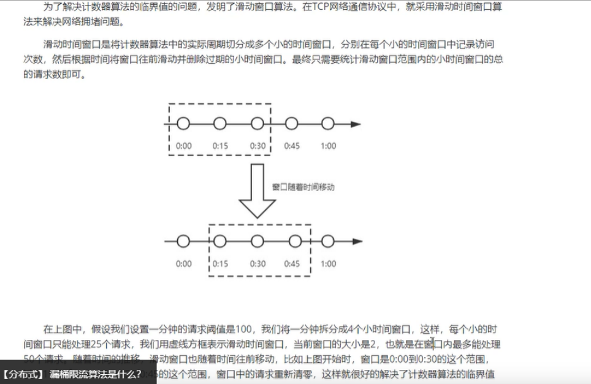

# 微服务

## 注册中心

|                | Nacos                                                        | consul                                                       | eureka                                                       | zookeeper |
| -------------- | ------------------------------------------------------------ | ------------------------------------------------------------ | ------------------------------------------------------------ | --------- |
| 描述           | 支持基于 DNS 和基于 RPC 的服务发现（可以作为springcloud的注册中心） 动态配置服务（可以做配置中心， Nacos采用Netty保持TCP长连接实时 推送） 动态 DNS 服务  **Nacos = Spring Cloud注册中心 + Spring Cloud配置中心。** | 要求必须过半数的节点都写入成功才认为注册成功  Raft算法，比zookeeper使用的Paxos算法更加简单 | 直接集成到应用中，依赖于应用自身完成服务的注册与发现         | zab协议   |
| 配置特性       | 引入入 spring-cloud-starter-alibaba-nacos-config  读取顺序--本地bootstrap.xml =>nacos配文件 =》 本地application.yml =》合并 然后加载  配置热更新 @Value注入的变量所在类上添加注解@RefreshScop / @ConfigurationProperties注解代营@Value注解  配置共享 [spring.application.name].yam] 不包含环境，因此可以被多个环境共享。  配置共享的优先级 nacos中服务名-profile.yaml>nacos中服务名yaml>本地配置 |                                                              |                                                              |           |
| 支持分布式原则 | **CP原则**（一致性+分离容忍） 和**AP原则**（可用性+分离容忍） 根据服务注册选择**临时和永久来决定走AP模式还是CP模式** Nacos集群**默认采用AP方式**，当集群中**存在非临时实例时，采用CP模式**(非临时==永久，可能服务不可用，A不满足) | **CP** 服务注册稍慢 在Leader挂掉时重新选举期间真个consul不可用 | **AP** 有较强的可用性，服务注册快，但牺牲了一定的一致性。 | **cp**    |
| 配置说明       | \#临时实例:如果实例宕机超过一定时间，会从服务列表剔除，默认的类型非临时实例:**如果实例宕机，不会从服务列表剔除，也可以叫永久实例**.  spring:     cloud:       nacos:         discovery:           ephemeral:false # 设置为非临时实例 |                                                              |                                                              |           |
| 存储分析       | ==Nacos采用了数据的分级存储模型==， 最外层是**Namespace**，用来隔离环境。然后是**Group**，用来对服务分组。接下来就是服务(**Service**)了，一个服 务包含多个实例，但是可能处于不同机房，因此Service下有多个集群(**Cluster**)，Cluster下是不同的实例(**Instance**) ==Nacos采用了一个多层的Map来表示==。 结构为Map*String，Map，其中最外层Map的key就是**namespaceId**.值是一个Map。内层Map的 key是**group**拼接serviceName，值是Service对象。Service对象内部又是一个Map，key是**集群名称**，值是cluster对象。而 cluster对象内部维护了I**nstance的集合(SET集合)** |                                                              |                                                              |           |
| 其他特性       | 支持Dubbo 、SpringCloud、K8S集成  属于外部应用，侵入性小  在线服务治理 | 支持SpringCloud K8S集成 HTTP/DNS                         | 目前已经不进行升级  只支持SpringCloud集成  HTTP  Eureka需要配合MQ实现配置动态刷新配置  Spring Cloud原生全家桶 |           |
| 问答           | ==Nacos如何保证并发写的安全性?==  答:首先，在注册实例时，会对service加锁，不同service之间本身就不存在并发写问题，互不影响。相同service时通过锁来互斥。 并且，在更新实例列表 时，是基于异步的线程池来完成，而线程池的线程数量为  ==Nacos如何避免并发读写的冲突?==  答:Nacos在更新实例列表时，会采用CopyonWrite技术首先将old实例列表拷贝一份，然后更新拷贝的实例列表，再用更新后的实例列表来覆盖旧的实例列表 N==acos如何应对阿里内部数十万服务的并发写请求?==  答:Nacos内部会将服务注册的任务放入阻塞队列，采用线程池异步来完成实例更新，从而提高并发写入 |                                                              |                                                              |           |

### Eureka

> 保证了AP(可用性（A vailability）\分区容错性（Partition tolerance）),无法保证C一致性（C onsistency）
>
> ==工作过程==
>
>  1、Eureka Server 启动成功，等待服务端注册。在启动过程中如果配置了集群，集群之间定时通过 Replicate（复制） 同步注册表，**每个 Eureka Server 都存在独立完整的服务注册表信息** 
>
> 2、**Eureka Client 启动时根据配置的 Eureka Server 地址去注册中心注册服务** 
>
> 3、Eureka Client 会每 **30s 向 Eureka Server 发送一次心跳请求**，证明客户端服务正常 
>
> 4、当 Eureka Server **90s 内没有收到 Eureka Client 的心跳，注册中心则认为该节点失效，会注销该实例** 
>
> 5、单位时间内 Eureka Server **统计到有大量的 Eureka Client 没有上送心跳，则认为可能为网络异常，进入自我保护机制，不再剔除**没有发送心跳的客户 端 
>
> 6、当 Eureka **Client 心跳请求恢复正常之后，Eureka Server 自动退出自我保护模式** 
>
> 7、Eureka Client **定时全量或者增量从注册中心获取服务注册表，并且将获取到的信息缓存到本地** 
>
> 8、服务调用时，Eureka **Client 会先从本地缓存找寻调取的服务。如果获取不到，先从注册中心刷新注册表，再同步到本地缓存** 
>
> 9、Eureka Client 获取到目标服务器信息，发起服务调用 
>
> 10、Eureka Client **程序关闭时向 Eureka Server 发送取消请求，Eureka Server 将实例从注册表中删除**

## Feign

> ==描述==
>
> - 是一个**声明式的伪Http客户端**.使用Feign，只需要创建一个接口并注解。
> - 它具有可插拔的注解特性，
> - **可使用Feign注解和JAX-RS注解**。
> - Feign支持可插拔的编码器和解码器。
> - Feign**默认集成了Ribbon**，并和Eureka结合，**默认实现了负载均衡的效果**。
> - @FeignClient **动态代理实现**。  
> - Feign的动态代理会**根据你在接口上的 @RequestMapping 等注解，来动态构造出你要请求的服务的地址**
> - 支持**服务降级**（配置fallbackfactory类）和**异常过滤**（过滤器是对异常信息的再封装，把 feign 的异常信息封装成我们系统的通用异常对象）

## Ribbon

> ==描述==
>
> - 是一个负载均衡客户端 @LoadBalanced 默认Round Robin 轮询算法 
> - **Ribbon 简单来说 底层采用了一个拦截器LoadBalancerIntercepor，拦截了RestTemplate发出的请求从请求ur1中获取服务名称，根据服务名称到 eureka拉取服务列表，用内置负载均衡规则，从列表中选择一个，然后修改请求地址，进行真实请求**。
>
> ==负载均衡策略==
>
> | ZoneAvoidanceRule         | **默认** 分区域，使用Zone对服务器进行分类，再对Zone内的多个服务做轮询 |
> | ------------------------- | ------------------------------------------------------------ |
> | RoundRobinRule            | 轮询                                                         |
> | AvailabilityFilteringRule | 忽略(故障/并发过高) 服务器 (1)在默认情况下，这台服务器如果3次连接失败，这台服务器就会被设置为 "短路”状态。短路状态将持续30秒，如果再次连接失败，短路的持续时间就会几何级地增加。  (2)并发数过高的服务器。如果一个服务器的并发连接数过高，配置了AvailabilityFilteringRule规则的客户端也会将其忽 略。并发连接数的上限，可以由客户端的.ActiveConnectionsLimit属性进行配置 |
> | WeightedResponseTimeRule  | 权重(越大访问几率大)                                         |
> | BestAvailableRule         | 忽略那些短路的服务器，并选择并发数较低的服务器               |
> | RandomRule                | 随机选择一个可用的服务器                                     |
> | RetryRule                 | 重试机制的选择逻辑                                           |

## Zuul

> ==特性==
>
> 主要功能是路由转发和过滤器 
>
> zuul默认和Ribbon结合实现了负载均衡的功能， 类似于nginx转发。 
>
> @EnableZuulProxy / 服务过滤功能 统一的降级、限流、认证授权、安全 
>
> 路由的转发 
>
> 过滤访问 
>
> 安全访问 
>
> 熔断
>
> ==和gateway比较==
>
> |                   | gateway                                                      | zuul                                                         |
> | ----------------- | ------------------------------------------------------------ | ------------------------------------------------------------ |
> | 基 本 介 绍       | Spring Cloud Gateway是Spring官方基于Spring 5.0，Spring Boot 2.0和Project Reactor等技 术开发的网关，Spring Cloud Gateway旨在为微服务架构提供一种简单而有效的统一的API路 由管理方式。Spring Cloud Gateway作为Spring Cloud生态系中的网关，目标是替代Netflix ZUUL，其不仅提供统一的路由方式，并且基于Filter链的方式提供了网关基本的功能，例 如：安全，监控/埋点，和限流等。 | Zuul1 是基于 Servlet 框架构建，如图所示， 采用的是阻塞和多线程方式，即一个线程处 理一次连接请求，这种方式在内部延迟严 重、设备故障较多情况下会引起存活的连接 增多和线程增加的情况发生 |
> | 性 能             | WebFlux 模块的名称是 spring-webflux，名称中的 Flux 来源于 Reactor 中的类 Flux。Spring webflux 有一个全新的非堵塞的函数式 Reactive Web 框架，可以用来构建异步的、非堵塞 的、事件驱动的服务，在伸缩性方面表现非常好。使用非阻塞API。 Websockets得到支持， 并且由于它与Spring紧密集成，所以将会是一个更好的 开发 体验。 | 本文的Zuul，指的是Zuul 1.x，是一个基于阻 塞io的API Gateway。Zuul已经发布了Zuul 2.x，基于Netty，也是非阻塞的，支持长连 接，但Spring Cloud暂时还没有整合计划。 |
> | 源 码 维 护 组 织 | pring-cloud-Gateway 是spring旗下 spring-cloud 的一个子项目。还有一种说法是因为 zuul2 连续跳票和 zuul1 的性能表现不是很理想，所以催生了spring孵化 Gateway 项目。 | zuul 则是 netflix 公司的项目，只是spring 将 zuul 集成在spring-cloud中使用而已。关 键目前spring不打算集成zuul2.x。 |
> | 版 本             | springboot2.0                                                | springboot1.x                                                |

## 限流算法

| 计数器算法     | 计数器算法，是指在**指定的时间周期内累加访问次数，达到设定的阈值时，触发限流策略。**下一个时间周期进行访问时，访问次数清零。此算法无论在单机还是分布式 环境下实现都非常简单，使用redis的incr原子自增性，再结合key的过期时间，即可轻松实现。 | 语法 Redis INCR 命令的基本语法如下： INCR key 返回值 执行 INCR 命令加 1 操作后 key 的值。 |
| -------------- | ------------------------------------------------------------ | ------------------------------------------------------------ |
| 漏桶限流算法   | 漏桶算法的原理就像它的名字一样，我们维持一个漏斗，它有恒定的流出速度，不管水流流入的速度有多快，漏斗出水的速度始终保持不变，类似于消息中间件，不管 消息的生产者请求量有多大，消息的处理能力取决于消费者。 漏桶的容量=漏桶的流出速度"可接受的等待时长。在这个容量范围内的请求可以排队等待系统的处理，超过这个容量的请求，才会被抛弃。  ==在漏桶限流算法中，存在下面几种情况==:  1.当请求速度大于漏桶的流出速度时，也就是**请求量大于当前服务所能处理的最大极限值时，触发限流策略**。  2. 请求速度小于或等于漏桶的流出速度时，也就是服务的处理能力大于或等于请求量时，正常执行。  漏桶算法有一个缺点: 当**系统在短时间内有突发的大流量时，漏桶算法处理不了**。 |                                                              |
| 今牌桶限流算法 | 令牌桶算法，是增加一个大小固定的容器，也就是令牌桶，系统以恒定的速率向令牌桶中放入令牌，如果有客户端来请求，先需要从令牌桶中拿一个令牌，拿到令牌， 才有资格访问系统，这时令牌桶中少一个令牌。 当令牌桶满的时候，再向令牌桶生成令牌时，令牌会被抛弃。  ==在令牌桶算法中，存在以下几种情况==:  1.**请求速度大于令牌的生成速度:那么令牌桶中的令牌会被取完，后续再进来的请求，由于拿不到令牌，会被限 流**。  2.请求速度等于令牌的生成速度: 那么此时系统处于平稳状态  3.请求速度小于令牌的生成速度: 那么此时系统的访问量远远低于系统的并发能力，请求可以被正常处理。  令牌桶算法，由于有一个桶的存在，**可以处理短时间大流量的场景**。这是令牌桶和漏桶的一个区别。 |                                                              |
| 滑动窗口算法   |  |                                                              |

## Hystrix

