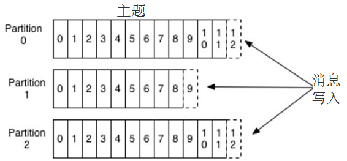
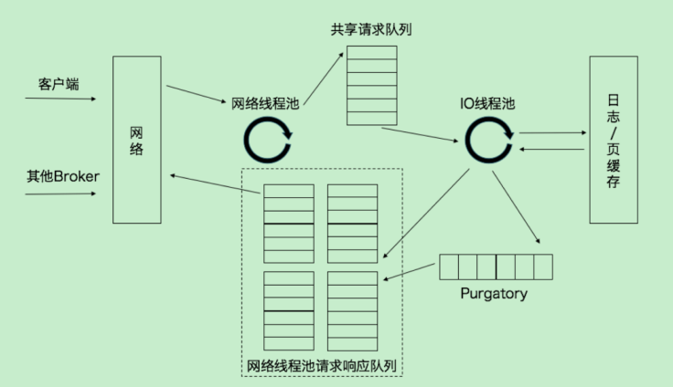
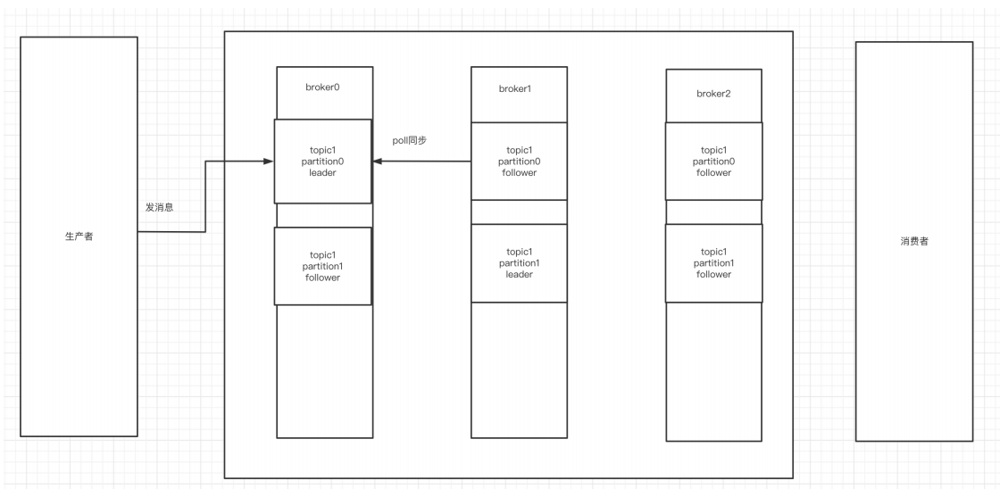
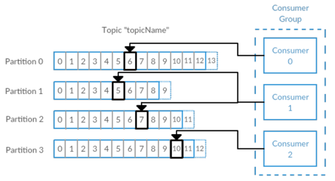

## 消息队列

### 描述

> 客户端和服务端进行**异步通信**，消息服务器将信息放在队列中，消费方接受消息进行消费。

### 特性

> **解耦、异步、削峰**

### 常见消息队列协议

|              | JMS（Java Message Service）                                  | AMQP（Advance Message Queuing Protocol）                     | MQTT**消息队列遥测传输**（Message Queuing Telemetry Transport） | STOMP，即**流文本定向消息协议**（Streaming Text Orientated Messaging Protocal） |
| ------------ | ------------------------------------------------------------ | ------------------------------------------------------------ | ------------------------------------------------------------ | ------------------------------------------------------------ |
| 定义         | Java  api                                                    | 网络线级协议                                                 | **广泛用于物联网公司**                                       | 一个相对简单的文本消息传输协议，主要特点就是简单易懂，没有特别多的套路 |
| 跨语言       | 否                                                           | **是**                                                       |                                                              |                                                              |
| 跨平台       | 否                                                           | **是**                                                       |                                                              |                                                              |
| Model        | 提供两种消息模型:<br>（1）点对点 Peer-2-Peer  <br/>（2）发布订阅 Pub/sub | 提供了五种消息模型：  <br/>（1）、direct  exchange  <br/>（2）、fanout  exchange  <br/>（3）、topic  change  <br/>（4）、headers  exchange  <br/>（5）、system  exchange  <br/>本质来讲，后四种和JMS的pub/sub模型没有太大差别，仅是在路由机制上做了更详细的划分； |                                                              |                                                              |
| 支持消息类型 | 多种消息类型：  TextMessage  MapMessage  BytesMessage  StreamMessage  ObjectMessage  Message  （只有消息头和属性） | byte[]  当实际应用时，有复杂的消息，可以将消息序列化后发送。 |                                                              |                                                              |
| 综合评价     | JMS  定义了JAVA  API层面的标准；<br>在java体系中，多个client均可以通过JMS进行交互，不需要应用修改代码，但是其对跨平台的支持较差；<br>**是一种规范，是对AMQP，MQTT，STOMP等协议更高一层的抽象** | AMQP定义了wire-level层的协议标准；天然具有跨平台、跨语言特性。 | 它常用于很多计算能力有限、带宽低、网络不可靠的远程通信应用场景。 |                                                              |
| 消息队列应用 |                                                              | RabbitMQ                                                     |                                                              | ActiveMQ                                                     |

### 常见消息队列比较

| 特性                    | ActiveMQ                                                     | RabbitMQ                                                     | RocketMQ                                                     | Kafka                                                        |
| ----------------------- | ------------------------------------------------------------ | ------------------------------------------------------------ | ------------------------------------------------------------ | ------------------------------------------------------------ |
| 单机吞吐量              | 万级，吞吐量比RocketMQ和Kafka要低了一个数量级                | 万级，吞吐量比RocketMQ和Kafka要低了一个数量级                | 10万级，RocketMQ也是可以支撑高吞吐的一种MQ                   | 10万级别，这是kafka最大的优点，就是吞吐量高。     一般配合大数据类的系统来进行实时数据计算、日志采集等场景 |
| topic数量对吞吐量的影响 |                                                              |                                                              | topic可以达到几百，几千个的级别，吞吐量会有较小幅度的下降     这是RocketMQ的一大优势，在同等机器下，可以支撑大量的topic | **topic从几十个到几百个的时候，吞吐量会大幅度下降     所以在同等机器下，kafka尽量保证topic数量不要过多**。如果要支撑大规模topic，需要增加更多的机器资源 |
| 时效性                  | ms级                                                         | **微秒级**，这是rabbitmq的一大特点，延迟是最低的             | ms级                                                         | 延迟在ms级以内                                               |
| 可用性                  | 高，基于主从架构实现高可用性                                 | 高，基于主从架构实现高可用性                                 | 非常高，**分布式架构**                                       | 非常高，kafka是**分布式的**，一个数据多个副本，少数机器宕机，不会丢失数据，不会导致不可用 |
| 消息可靠性              | 有较低的概率丢失数据                                         |                                                              | 经过参数优化配置，可以做到0丢失                              | 经过参数优化配置，消息可以做到0丢失                          |
| 功能支持                | MQ领域的功能极其完备                                         | 基于**erlang开发，所以并发能力很强，性能极其好，延时很低**   | MQ功能较为完善，还是分布式的，扩展性好                       | 功能较为简单，主要支持简单的MQ功能，在**大数据领域的实时计算以及日志采集**被大规模使用，是事实上的标准 |
| 优劣势总结              | 非常成熟，功能强大，在业内大量的公司以及项目中都有应用     偶尔会有较低概率丢失消息     而且现在社区以及国内应用都越来越少，官方社区现在对ActiveMQ 5.x维护越来越少，几个月才发布一个版本     而且确实主要是基于解耦和异步来用的，较少在大规模吞吐的场景中使用 | 1、**erlang语言开发，性能极其好，延时很低**；     吞吐量到万级，MQ功能比较完备     <br>而且开源提供的管理界面非常棒，用起来很好用     <br/>2、社区相对比较活跃，几乎每个月都发布几个版本     3、erlang**源码级别的研究和定制困难**，基本职能依赖于开源社区的快速维护和修复bug。 | 1、接口简单易用，而且毕竟在阿里**大规模应用过**，有阿里品牌保障     日处理消息上百亿之多，可以做到大规模吞吐，性能也非常好，分布式扩展也很方便，<br/>2、**社区维护还可以**，可靠性和可用性都是ok的，还可以支撑大规模的topic数量，支持复杂MQ业务场景<br/>3、而且一个很大的优势在于，阿里出品都是**java系的，我们可以自己阅读源码，定制自己公司的MQ**，可以掌控     社区活跃度相对较为一般， | 1、超高的吞吐量，ms级的延迟，极高的可用性以及可靠性，而且**分布式可以任意扩展**     同时kafka最好是支撑**较少的topic数量即可，保证其超高吞吐量**     <br/>2、而且kafka唯一的一点劣势是有可能消息重复消费，那么对数据准确性会造成极其轻微的影响，<br/>3、在大**数据领域中以及日志采集中**，这点轻微影响可以忽略     这个特性天然适合大数据实时计算以及日志收集 |

### 常见问题解答

> ==kafka==
>
> | 防止消息丢失(一致性) | 发送方： ack是 1 或者-1/all 可以防止消息丢失，如果要做到99.9999%，ack设成all，把min.insync.replicas配置成 分区备份数<br>消费方：把自动提交改为手动提交。<br>broker：持久化 |
> | -------------------- | ------------------------------------------------------------ |
> | 防止重复消费(幂等性) | 生产端 ：重试机制关闭  这种不建议做  会导致数据丢失<br/>**消费端幂等性保证即可**<br>   方案：mysql 插入业务id作为主键，主键是唯一的，所以一次只能插入一条 使用redis或zk的分布式锁 set nx  或者 zk 节点唯一 |
> | 如何顺序消费(顺序性) | 发送方：在发送时将ack不能设置 0 ，**关闭重试，使用同步发送**，等到发送成功再发送下一条。`确保消息是顺序发送`的。<br/>接收方：消息是发送到一个分区中，只能有**一个消费组的消费者来接收消息**。因此，kafka的顺序消费会牺牲掉性能。  <br>说明：<br/>    一个主题，一个分区，生产者按照一定的顺序发送消息，broker就会按照这个顺序把它们写入分区，消费者也会按照同样的顺序读取它们<br/>    retires配置:失败重试，如果第一批次发送失败，第二批次成功了，但是第一批次重试，也写入成功造成顺序错乱。<br>   `可以设置重试，但是maxinflightrequestper.connection设为1，第一批发送处理完成之前，不允许第批处理`。但是严重影响吞吐量。 |
> | 解决消息积压         | 方案一：在**一个消费者中启动多个线程，让多个线程同时消费**。——`提升一个消费者的消费能力`（`增加分区增加消费者`）。<br/>方案二：可以启动多个消费者(多个消费者组)，多个消费者部署在不同的服务器上。其实多个消费者部署在同一服务器上也可以提高消费能力——充分利用服务器的cpu资源。<br>方案三：让一个消费者去把收到的消息往另外一个topic上发，另一个topic设置多个分区和多个消费者 ，进行具体的业务消费。 |
>
> ==rabbitMQ==
>
> | 防止消息丢失(一致性) | 发送方： 生产者到MQ,通过事务（同步）或者confirm机制（异步）<br>消费方：ack机制，关闭rabbitmq自动ack，通过程序调用<br>MQ：持久化 |
> | -------------------- | ------------------------------------------------------------ |
> | 防止重复消费(幂等性) | **消费端幂等性保证**<br>   方案：mysql 插入业务id作为主键，主键是唯一的，所以一次只能插入一条 使用redis或zk的分布式锁 set nx  或者 zk 节点唯一 |
> | 如何顺序消费(顺序性) | 拆分多个queue，每个queue一个consumer；<br/>或者就一个queue但是对应一个consumer，然后这个consumer内部用内存队列做排队，然后分发给底层不同的worker来处理。 |
> | 解决消息积压         | 消息堆积延时：查找消费端问题，修复。扩大queue，写一个分发的程序将现有队列消息分发到其他队列，然后扩容consumer来消费<br/>丢失：重新灌入数据。<br>将满：一和二方式结合，先手动消耗掉，然后重新灌入。 |

### Kafka

#### 介绍

> 分布式的、支持分区的、多副本的这样一个消息系统，本质这些消息系统都是为了解决通讯问题。
>
> scale+java语言
>
> 通讯RT过大，是不是可以通过**解耦**步骤、**异步**来处理数据，达到**削峰**的目的。**也就是解决了响应慢的问题**。
>
> **重topic模式**

#### 基本概念

##### 消息和批次

> 类似于数据库中的一条记录或者一批记录

**消息**，Kafka里的数据单元，由字节数组组成。消息还可以包含键（可选元数据，也是字节数组），主要用于对消息选取分区。

消息可以被分批写入Kafka。**批次**就是一组消息，这些消息**属于同一个主题和分区**。

<u>分成批次传输**可以减少这网络开销**，这个需要权衡（时间延迟和吞吐量之间），批次里包含的消息越多，单位时间内处理的消息就越多，单个消息的传输时间就越长（**吞吐量高延时也高**）。如果进行压缩，可以提升数据的传输和存储能力，但需要更多的计算处理。</u>


一般我们**使用序列化和反序列化技术**，格式常用的有**JSON和XML**，还有Avro（Hadoop开发的一款序列化框架），具体怎么使用依据自身的业务来定。

##### 主题

> 一种逻辑上对数据的分类

Kafka里的消息用**主题**进行分类（`主题好比数据库中的表`），主题下有可以被分为若干个`分区（分表技术）`。分区本质上是个**提交日志文件**，有新消息，这个消息就会以追加的方式写入分区（写文件的形式），然后用先入先出的顺序读取。



**整个主题多个分区的范围内，是无法保证消息的顺序的，`单个分区则可以保证`。**

`Kafka通过分区来实现数据冗余和伸缩性，因为分区可以分布在不同的服务器上`。

##### broker和集群

> 一个独立的Kafka服务器叫Broker。
>
> 多个broker可以组成一个集群。每个集群中broker会选举出一个集群控制器。控制器会进行管理，包括将分区分配给broker和监控broker。
>
> 集群中Kafka内部一般使用**管道技术**进行高效的复制。
>

> ==broker 请求处理过程==
>
> 1、采用reactor 反应器模式
> 2、Kafka 的 Broker_端有个 SocketServer 组件，类似于 Reactor 模式中的 Dispatcher，它也有对应的 Acceptor 线程和一个工作线程池，只不过在 Kafka 中，这个工作线程池有个专属的名字，叫网络线程池。Kafka 提供了 Broker 端参数 num.network.threads，用于调整该网络线程泄的线程数。其默认值是 3，表示每台 Broker 启动时会创建 3 个网络线程，专门处理客户端发送的请求
> 3、Acceptor 线程采用**轮询的方式将入站请求公平地发到所有网络线程中**，  网络线程拿到请求后,它不是自己处理，而是将请求放入到一个共享请求队列中
>
> 
>
> 4.I0 线程池中的线程才是执行请求逻辑的线程。Broker 端参数num.io.threads控制了这个线程池中的线程数。目前该参数默认值是 8，表示每台 Broker 启动后自动创建 8 个 IO线程处理请求,你可以根据实际硬件条件设置此线程池的个数
>
> 5、**请求队列是所有网络线程共享的，而响应队列则是每个网络线程专属的**
>
> 6、Purgatory 的组件，这是 Kafka 中著名的“炼狱”组件。它是用来**缓存延时请求 (DelayedRequest)的**。所谓延时请求，就是那些一时未满足条件不能立刻处理的请求。比如设置了 acks=all的 PRODUCE 请求，一旦设置了 acks=all，那么该请求就必须 等待 ISR 中所有副本都接收了消息才能返回，此时处理该请求的 I0 线程就必须等待其他 Broker 的写入结果。当请求不能立刻处理时，它就会暂存在 Purgatory 中。稍后一旦满足了完成条件，I0 线程会继续处理该请求，并将Response 放入对应网络线程的响应队列中。

##### 控制器

> Kafka集群中的broker在zk中创建临时序号节点，**序号最小的节点（最先创建的节点）将作为集群的controller**，负责管理整个集群中的所有分区和副本的状态：
>
> - 当某个分区的leader副本出现故障时，由控制器负责为该分区**选举新的leader**副本。
> - 当检测到某个分区的**ISR集合发生变化**时，由控制器负责**通知所有broker更新其元数据信息**。
> - 当使用kafka-topics.sh脚本为某个topic增加分区数量时，同样还是由控制器负责让新分区被其他节点感知到。
>

##### 分区

> 在Kafka文件存储中，同一个topic下有多个不同partition,每个partition为一个目录，
> partiton命名规则为：
> topic名称+有序序号
> 第一个partiton序号从0开始，序号最大值为partitions数量减1。
> **partition是以文件夹的形式存储数据的**。文件存放位置，可以通过配置文件server.properties中的log.dirs指定
>
> ==segment==
>
> 一个partition又进一步的细分为segment
> ·每个partition(目录)相当于一个大型文件被细分到多个大小相等的segment文件中。
> ·每个segment中的消息数量不一定相等。

> ==segment==
>
> segment分段
> 由3大部分组成，分别为index file和data file,timeindex file
> 此3个文件一一对应，成对出现**，后缀".index"和'.log"分别表示为segment索引文件、数据文件、时间戳索引文件**
> log、index和timeindex三个文件，它有以下几个特点。
> (1)log文件名是以文件中第一条message的offset来命名的，实际offset长度是64位，但是这里只使用了20位，应付生产是足够的。
> (2)一组lindex+-log+timeindex文件的名字是一样的，并且log文件默认写满1G后，会进行log rolling形成一个新的组合来记录消息，这个是通过brokert端log.segment.bytes=:1073741824指定的，可以修改这个值进行调整。
> (3)index和timeindex在刚使用时会分配10M的大小，当进行log rolling后，它会修剪为实际的大小，所以看到前几个索引文件的大小，只有几百K。
> segment的文件配置项：
> #segment大小，默认为1G
> log.segment.bytes 1024*1024*1024
> #segment保留文件的最大时长，超时将被明除
> log.retention.hours=24*7

> 物理上对主题下数据的拆分，各个分区数据是不一样的，类似数据库解决单表压力的水平分表策略。
>
> **可以分布式存储**
>
> **可以并行写入**

ProducerRecord对象中可以看到，ProducerRecord包含了**目标主题，键和值**，Kafka的消息都是一个个的键值对。键可以设置为默认的null。
键的主要用途有两个:

> 1、决定消息被写往主题的哪个分区，拥有**相同键的消息将被写往同一个分区**(`这不就是数据库分表后对id的hash再路由到具体分片吗`)
>
> 2、还可以作为消息的附加消息。
> 3、**为空，用默认的分区器，分区器使用轮询算法将消息均衡地分布到各个分区上**
> 4、**键不为空**，并且使用默认的分区器，Kafka对键进行散列。同一个键总是被映射到同一个分区。(创建主题的时候把分区规划好，而且永远不要增加新分区)

> partition 与topic 的关系:
> **partition 是实际物理上的概念，而 topic 是逻辑上的概念**。可以理解为实际存储数据里并没有 topic 的文件夹，而只有 partition 的目录文件。

##### 副本

> 1、就是分区的备份。
>
> 2、这些副本中，有leader、follower概念。leader 用来读写消息，**follower同步leader的消息，不提供读写**，用来数据的备份。
>
> 3、当leader所在的broker宕机，剩余的follower选举新的leader。

> ==副本机制的优点==
> 1.**提供数据冗余**。即使系统部分组件失效，系统依然能够继续运转，因而增加了整体可用性以及数据持久性。
> 2.**提供高伸缩性**。支持横向扩展，能够通过增加机器的方式来提升读性能，进而提高读操作吞吐量。
>
> 3.**改善数据局部性**。允许将数据放入与用户地理位置相近的地方，从而降低系统延时
> kafka 只支持优点1
> ==kafka副本机制的好处==
> Read-your-writes 使用生产者 API 向 Kafka 成功写入消息后，马上使用消费者 API 去读取刚才生产的消息 (副本不提供读写)
>
> 方便实现单调读 对于一个消费者用户而言，在多次消费消息时，它不会看到某条消息一会儿存在会儿不存在,如果允许副本机制读服务，存在多个副本拉取不一致，导致有的读存在数据，有的读不存在数据

##### 关系图



##### 偏移量

> 1、首先明确一点并不是消息读取被消费完毕，马上就被broker删除了。broker会持久化消息。而**消费消息，只是记录一下这个消息的标识而已**。
>
> 2、消费消息是`消费者往broker中的一个consumer_offset主题提交偏移量`。提交的数据包括<consumerGroupId+topic+分区号，offset>，是这样的数据结构。
>
> ​     hash(consumerGroupId) % __consumer_offsets主题的分区数，来找到具体的偏移量主题的分区(默认50个)
>
> 3、`偏移量可以简单理解为数据库中的主键字段。`

##### _consumer_offset

> **__consumer_offsets 的主要作用是保存 Kafka 消费者的位移信息**
>
> Consumer 端有个参数叫 enable.auto.commit，如果值是 true，则 Consumer 在后台默默地为你定期提交位移，提交间隔由一个专属的参数 auto.commit.interval.ms 来控制
>
> **Kafka 使用Compact 策略来删除位移主题中的过期消息，避免该主题无限期膨胀.kafka 提供了专门的后台线程定期地巡检待 Compact 的主题，看看是否存在满足条件的可删除数据。这个后台线程叫 Log Cleaner。**

##### 单播消息、多播消息

**`单播多播的场景产生，本质是这一批消息(分片只是数据的拆分，还是唯一的)，是不能被同一个消费组中多个消费者来消费的`。**

> 单播消息指的就是一个消费者组里，只有一个消费者来消费partition的消息。

> 多播消息，就是利用多个消费者组中的不同消费者来消费同一个partition中的消息。

##### 消费者、消费者组

##### 消费者组

> Consumer Group 下可以有一个或多个 Consumer 实例。这里的实例可以是一个单独的进程，也可以是同一进程下的线程。在实际场景中，使用进程更为常见一些。
>
> Group ID 是一个字符串，在一个 Kafka 集群中，它标识唯一的一个 Consumer Group。
>
> Consumer Group 下所有实例订阅的主题的单个分区，只能分配给组内的某个 Consumer 实例消费。这个分区当然也可以被其他的 Group 消费。

##### 消费者读取配置

> **·auto.offset.reset:** 
> latest 从最新的记录开始读取，
> earliest 表示消费者从起始位置读取分区的记录。

> **enable.auto.commit:是否自动提交偏移**

> ==partitionassignment.strategy:分区分配给消费者的策略==
>
> **Range**主题的连续分区分配给消费者  分区数/消费者数 + 1     10个分区  1个消费者组3个消费者  10/3+1 =4    4+ 3+3 模式
>
> **RoundRobin** 主题的分区循环分配给消费者
>
> **sticky** 粘性的  再均衡下，原先的映射关系不变，然后基于 range也好,roundrobin也好，将变化的分片或者消费者进行关联。

> ==consumer创建时机==
> 1、发起FindCoordinator 请求时 确定协调者和获取集群元数据
> 2、连接协调者时   令其执行组成员管理操作
> 3、消费数据时  执行实际的消息获取
> **关闭时机**
> 手动调用 KafkaConsumer.close() 方法，或者是执行 KilL 命令
> kafka 自动关闭是由消费者端参数 connection.max.idle.ms控制的，该参数现在的默认值是 9 分钟，即如果某个 Socket 连接上连续 9 分钟都没有任请求“过境”的话，那么消费者会强行“杀掉”这个 Socket 连接
>
> 当第三类 TCP 连接成功创建后，消费者程序就会弃第一类 TC 连接，之后在定期请求元数据时，它会改为使用第三类 TCP 连接

> ==消费者组进度监控方式==
>
> 1、使用 Kafka 自带的命令行工具 bin/kafka-consumer-groups.sh(bat)kafka-consumel-groups 脚本是 Kafka 为我们提供的最直接的监控消费者消费进度的工具。当然，除了监控 Lag 之外，它还有其他的功能
> s bin/kafka-consumer-groups.sh --bootstrap-server <Kafka broker 连接信息 >-describe --group <group 名称 >
>
> 2、Java Consumer API 分别提供了查询当分区最新消息位移和消费者组最新消费消息位移两组方法调用 
>
> AdmincLient.listConsumerGroupffsets 方法获取给定消费者组的最新消费消息的位移
> 获取订阅分区的最新消息位移  consumer.endoffsets(consumedoffsets.keySet());
>
> 执行相应的减法操作，获取 Lag 值并封装进一个 Map 对象。
> 3、使用Kafka 默认提供的 JMX 监控指标来监控消费者的 Lag 值
> Kafka 消费者提供了一个名为 kafka.consumer:type=consumer-fetch-manager-metrics,client-id=“{client-id}”的 JMX 指标，里面有很多属性。有两组属性: records-Lag-max 和 records-lead-min Lead 值是指消费者最新消费消息的位移与分区当前第一条消息位移的差值
> Kafka 消费者还在分区级别提供了额外的 JMX 指标，用于单独监控分区级别的 Lag 和 Lead 值。JMX 名称为: kafka.consumer:type=nsumer-fetch-managemetrics,partition="{partition}",topic="{topic}",client-id="{client-id}"

> ==消费端的重平衡==
>
> **重平衡的通知机制正是通过心跳线程来完成的**。
>
> 当协调者决定开启新一轮重平衡后，它会将"REBALANCE_IN_PROGRESS”封装进心跳请求的响应中，发还给消费者实例。
>
> 当消费者实例发现心跳响应中包含了“REBALANCE_IN_PROGRESS”，就能立马知道重平衡又开始。 消费者端参数heartbeat.interval.ms 从字面上看，它就是设置了心跳的间隔时间，但这个参数的**真正作用是控制重平衡通知的频率。**

> ==状态变化==
> 一个消费者组最开始是 Empty 状态(没有组成员)，当重平衡过程开启后，它会被置于PreparingRebalance 状态等待成员加入，之后变更到 CompletingRebalance 状态等待分配方案，最后流转到 stable 状态完成重平衡
> Kafka 定期自动删除过期位移的条件就是，组要处于 Empty 状态

> ==消费端重平衡过程==
>
> **JoinGroup 请求**
> 当组内成员加入组时，它会向协调者发送 JoinGroup 请求。在该请求中，每个成员都要将自己订阅的主题上报，这样**协调者就能收集到所有成员的订阅信息**。一旦收集了全部成员的 JoinGroup 请后，协调者会从这些成员中**选择一个担任这个消费者组的领导者**
>
> 选出领导者之后，**协调者**会把消费者组订阅信息封装进 JoinGroup 请求的响应体中，然后**发给领号者**，由领导者统一做出分配方案后。
>
> **SyncGroup 请求**
> 领导者向协调者发送 SyncGroup 请求，**将刚刚做出的分配方案发给协调者**。**协调者**接收分配方案然后统一以 **SyncGroup 响应的方式分发给所有成员**，这样组内所有成员就都知道自己该消费哪些分区

##### **一些结论**

>消费者消费哪个分区，由群主(第一个加入群的消费者)分配，分配完毕，发送给群组协调器，调器再把这些信息发送给所有的消费者。
>
>消费组中消费者的数量不能比一个topic中的partition数量多，否则多出来的消费者消费不到消息




#### 使用解读

##### 提交消息

###### 自动提交

```java
// 是否自动提交offset，默认就是true
props.put(ConsumerConfig.ENABLE_AUTO_COMMIT_CONFIG, "true");
// 自动提交offset的间隔时间
props.put(ConsumerConfig.AUTO_COMMIT_INTERVAL_MS_CONFIG, "1000");
```

> 消费者poll到消息后默认情况下，会自动向broker的_consumer_offsets主题提交当前主题-分区消费的偏移量。
>
> ~~自动提交会丢消息：因为如果消费者还没消费完poll下来的消息就自动提交了偏移量，那么此 时消费者挂了，于是下一个消费者会从已提交的offset的下一个位置开始消费消息。之前未被消费的消息就丢失掉了~~
>
> **从顺序上来说，poll 方法的逻辑是先提交上一批消息的位移，再处理下一批消息，因此它能保证不出现消费丢失的情况。但自动提交位移的一个问题在于，它可能会出现重复消费。**

###### 手动提交

手动提交分为手动同步提交、异步提交

```java
if (records.count() > 0 ) {
// 手动同步提交offset，当前线程会阻塞直到offset提交成功
// 一般使用同步提交，因为提交之后一般也没有什么逻辑代码了
consumer.commitSync();
}
```

```java
if (records.count() > 0 ) {
// 手动异步提交offset，当前线程提交offset不会阻塞，可以继续处理后面的程序逻辑  
consumer.commitAsync(new OffsetCommitCallback() {
@Override
public void onComplete(Map<TopicPartition, OffsetAndMetadata>offsets, Exception exception) {
            if (exception != null) {
                System.err.println("Commit failed for " + offsets);
                System.err.println("Commit failed exception: " +exception.getStackTrace());
            }
         }
    });
}


1. 我们可以利用 commitSync 的自动重试来规避那些瞬时错误，比如网络的瞬时抖动，Broker 端 GC 等。因为这些问题都是短暂的，自动重试通常都会成功，因此，我们不想自己重试，而是希望 Kafka Consumer 帮我们做这件事。
2. 我们不希望程序总处于阻塞状态，影响 TPS。 

try {
            while (true) {
                        ConsumerRecords<String, String> records = 
                                    consumer.poll(Duration.ofSeconds(1));
                        process(records); // 处理消息
                        commitAysnc(); // 使用异步提交规避阻塞
            }
} catch (Exception e) {
            handle(e); // 处理异常
} finally {
            try {
                        consumer.commitSync(); // 最后一次提交使用同步阻塞式提交
 } finally {
      consumer.close();
}
}

```

> 倘若提交失败后自动重试，那么它重试时提交的位移值可能早已经“过期”或不是最新值了。因此，异步提交的重试其实没有意义，所以 **commitAsync 是不会重试的。**

> ==更精细化的提交方式==
>
> Kafka Consumer API 为手动提交提供了这样的方法：commitSync(Map<TopicPartition, OffsetAndMetadata>) 和commitAsync(Map<TopicPartition, OffsetAndMetadata>)。它们的参数是一个 Map对象，键就是 TopicPartition，即消费的分区，而值是一个 OffsetAndMetadata 对象，保存的主要是位移数据。

##### poll过程

> 1、消费者建立了与broker之间的⻓连接，开始poll消息
>
> 2、默认一次poll 500条消息 
>
> ​      props.put(ConsumerConfig.MAX_POLL_RECORDS_CONFIG, 500 );
>
> 3、可以根据消费速度的快慢来设置，因为**如果两次poll的时间如果超出了30s的时间间隔，kafka会认为其消费能力过弱，将其踢出消费组**。将分区分配给其他消费者。
>
> ​        props.put(ConsumerConfig.MAX_POLL_INTERVAL_MS_CONFIG, 30 * 1000 );   
>
> 4、每隔1s内没有poll到任何消息，则继续去poll消息，循环往复，直到poll到消息。如果超出了1s，则此次⻓轮询结束
>
> ​       ConsumerRecords<String, String> records =consumer.poll(Duration.ofMillis( 1000 ));
>
> 5、消费者发送心跳的时间间隔
>
> ​      props.put(ConsumerConfig.HEARTBEAT_INTERVAL_MS_CONFIG, 1000 );
> 6、kafka如果超过 10 秒没有收到消费者的心跳，则会把消费者踢出消费组，进行rebalance，把分区分配给其他消费者。
>
> ​      props.put(ConsumerConfig.SESSION_TIMEOUT_MS_CONFIG, 10 * 1000 );

##### 指定分区消费

```java
consumer.assign(Arrays.asList(new TopicPartition(TOPIC_NAME, 0 )));
```

##### 消息回溯消费

```java
consumer.assign(Arrays.asList(new TopicPartition(TOPIC_NAME, 0 )));
consumer.seekToBeginning(Arrays.asList(new TopicPartition(TOPIC_NAME,0 ))); // 从开始进行消费
```

##### 指定offset消费

```java
consumer.assign(Arrays.asList(new TopicPartition(TOPIC_NAME, 0 )));
consumer.seek(new TopicPartition(TOPIC_NAME, 0 ), 10 );// 这里指定从10开始消费
```

##### 指定时间消费

> 这里就是到该主题下的每个分区内，找符合时间要求的，比如一小时前的偏移量，然后基于这个偏移量，开始消费

> **时间戳索引文件**，它的作用是可以让用户查询
> ·某个时间段内的消息，
> ·或者一小时之内的消息
> 它一条数据的结构是时间戳(8byte)+相对offset(4byte),
> 如果要使用这个索引文件，首先需要通过时间范围，找到对应的相对offset,然后再去对应的index.文件找到position信息，然后才能遍历

```java
List<PartitionInfo> topicPartitions =consumer.partitionsFor(TOPIC_NAME);
//从 1 小时前开始消费
long fetchDataTime = new Date().getTime() - 1000 * 60 * 60 ;
Map<TopicPartition, Long> map = new HashMap<>();
for (PartitionInfo par : topicPartitions) {
    map.put(new TopicPartition(TOPIC_NAME, par.partition()),fetchDataTime);
}
Map<TopicPartition, OffsetAndTimestamp> parMap =consumer.offsetsForTimes(map);
for (Map.Entry<TopicPartition, OffsetAndTimestamp> entry :parMap.entrySet()) {
    TopicPartition key = entry.getKey();
    OffsetAndTimestamp value = entry.getValue();
    if (key == null || value == null) continue;
    Long offset = value.offset();
    System.out.println("partition-" + key.partition() +"|offset-" + offset);
    System.out.println();
    //根据消费里的timestamp确定offset
    if (value != null) {
        consumer.assign(Arrays.asList(key));
        consumer.seek(key, offset);
    }
}
```

##### 新的消费者组消费== 消费者读取配置

当消费主题的是一个新的消费组，或者指定offset的消费方式，offset不存在，那么应该如何消费?

- latest(默认) ：只消费自己启动之后发送到主题的消息

- earliest：第一次从头开始消费，以后按照消费offset记录继续消费，这个需要区别于consumer.seekToBeginning(每次都从头开始消费)

- ```java
  props.put(ConsumerConfig.AUTO_OFFSET_RESET_CONFIG, "earliest");
  ```

#### 特性分析

##### 生产者

> ==kafka producer端管理TCP方式==
>
> 1. **KafkaProducer 实例创建时启动 Sender 线程**，从而创建与 bootstrap.servers 中所有Broker 的 TCP 连接。
> 2. KafkaProducer 实例**首次更新元数据信息**之后，还会再次创建与集群中所有 Broker 的 TCP 连接
> 3. 如果 Producer 端**发送消息到某台 Broker 时发现没有与该 Broker 的 TCP 连接，那么也会立即创建连接**。
> 4. 如果设置 Producer 端 connections.max.idle.ms 参数大于0 ，则步骤 1 中创建的 TCP连接会被自动关闭;如果设置该参数 =-1，那么步  中创建的 TCP 连接无法被关，从而成为“僵尸”连接

##### 发送方式

同步、异步、发送并忘记

##### 发送配置

> acks=0:生产者在写入消息之前不会等待任何来自服务器的响应，容易丢消息，但是吞吐量高
> acks=1:只要leader收到消息，并持久化到broker日志中，生产者会收到来自服务器的成功响应
> acks=-1或all： 需要等待 min.insync.replicas(默认为 1 ，推荐配置大于等于2) 这个参数配置的副本个数都成功写入日志

> - 发送会默认会重试 3 次，每次间隔100ms
> - **`发送的消息会先进入到本地缓冲区RecordAccumulator（32mb），kakfa会跑一个线程，该线程去缓冲区中取16k(batch)的数据，发送到kafka，如果到 10 毫秒数据没取满16k，也会发送一次`**。

##### 保留消息策略

Kafka broker默认的保留策略是：要么保留一段时间（7天），要么保留一定大小（比如1个G）。到了限制，旧消息过期并删除。

> 日志的清理第略有两个：
> **1.时间维度的清理策略：**
> 根据消息的保留时间，当消息在kafka中保存的时间超过了指定的时间，就会触发清理过程  按消息体中维护的时间戳 来比较   早期按日志段的最新修改时间，避免人为修改
> **2.空间维度的清理第略：**
> 根据topic存储的数据大小，当topic所占的日志文件大小大于一定的阀值，则可以开始删除最旧的消息。 **超过阈值的部分必须要大于一个日志段的大小，否则不会进行删除**
> kafka会启动一个后台线程，定期检查是否存在可以删除的消息
> 通过log.retention..bytes和log.retention.hours这两个参数来设置，当其中任意一个达到要求，都会执行删除。
> 默认的保留时间是：7天

##### 分区再均衡

**消费者没有指明分区消费。**

**再均衡期间，消费者是无法读取消息的，会造成整个群组一小段时间的不可用**

> 1. **组成员数发生变更**。比如有新的 Consumer 实例加入组或者离开组，抑或是有 Consumer 实例崩溃被“踢出”组。
> 2. **订阅主题数发生变更**。Consumer Group 可以使用正则表达式的方式订阅主题，比如consumer.subscribe(Pattern.compile(“t.*c”)) 就表明该 Group 订阅所有以字母 t 开头、字母 c 结尾的主题。在 Consumer Group 的运行过程中，你新创建了一个满足这样条件的主题，那么该 Group 就会发生Rebalance。
> 3. **订阅主题的分区数发生变更**。Kafka 当前只能允许增加一个主题的分区数。当分区数增加时，就会触发订阅该主题的所有 Group 开启 Rebalance。

> ==Coordinator==
>
> 为 Consumer Group 服务，负责为 Group 执行Rebalance 以及提供位移管理和组成员管理等
>
> 具体来讲，Consumer 端应用程序在提交位移时，其实是向 Coordinator 所在的 Broker提交位移。
>
> 同样地，当 Consumer 应用启动时，也是向 Coordinator 所在的 Broker 发送各种请求，然后由 Coordinator 负责执行消费者组的注册、成员管理记录等元数据管理操作。
>
> 所有 Broker 在启动时，都会创建和开启相应的 Coordinator 组件
>
> ==Consumer Group 如何确定为它服务的Coordinator 在哪台 Broker 上呢==
>
> 第 1 步：确定由位移主题的哪个分区来保存该 Group 数据：
> partitionId=Math.abs(groupId.hashCode() % offsetsTopicPartitionCount)。
> 第 2 步：找出该分区 Leader 副本所在的 Broker，该 Broker 即为对应的 Coordinator

> ==哪些 Rebalance 是“不必要的”==
>
> 第一类非必要 Rebalance 是因为未能及时发送心跳，导致 Consumer 被“踢出”Group而引发的
>
> 设置 session.timeout.ms = 6s。
> 设置 heartbeat.interval.ms = 2s。
> 要保证 Consumer 实例在被判定为“dead”之前，能够发送至少 3 轮的心跳请求，即session.timeout.ms >= 3 * heartbeat.interval.ms。将 session.timeout.ms 设置成 6s 主要是为了让 Coordinator 能够更快地定位已经挂掉的Consumer。
>
> 第二类非必要 Rebalance 是 Consumer 消费时间过长导致的
>
> max.poll.interval.ms 根据消费端处理时间设置的大点
>
> 第三类 查看是否消费端GC 导致

> ==判断Kafka FolLower 是否与 Leader 同步的标准==
> 不是看相差的消息数
> 标准是: Broker 端参数 replica.lag.time.max.ms，参数值。这个参数的含义是 **Follower 副本能够落后 Leader 副本的最长时间间隔**，当前默认值是 10 秒。这就是说，只要一个 FoLLower 副本落后 Leader 副本的时间不连续超过 10 秒，那么 Kafka 就认为该 FoLLwer 副本与 Leader是同步的，即使此时 Follower 副本中保存的消息明显少于 Leader 副本中的消息。

> ==UncLean 领导者选举 (Unclean Leader ELection)==
>
> 针对 Kafka 把所有不在 ISR 中的存活副本都称为非同步副本.
>
> 这些副本的选举过程 称为Unclean领导者选举。 Broker 端参数unclean.Leader.eLection.enable 控制是否允许 Unclean 领号者选举。建议禁用

ISR

In-Sync Replica: 每个分片的Leader都会维护这样-个列表，该列表中，包含了所有与之同步的Replic(包含Leader自己)。每次数据写入时，`只有ISR中的所有Replica都复制完，Leader才会将其置为Commit，它才能被Consumer所消费`
LEO: 指的是每个副本最大的 offset; **其实也就是总共消息记录数**

HW: 指的是消费者能见到的最大的 offset，ISR 队列中最小的 LEO(Log End offset)

HW(High Watermark) LEO(Log End offset)

由于Leader可移除不能及时与之同步的Follower，故与同步复制相比可避免最慢的Follower拖慢整体速度，也即**ISR提高了系统可用性**
`其实就是实现分区副本数据的一致。`
理解:每个分区可以有多个副本，其中一个副本是首领。所有的事件都直接发送给首领副本，或者直按从首领副本读取事件。其他 副本只需要与首领保持同步，并及时复制最新的事件。当首领副本不可用时，其中一个同步副本将成为新首领

#### 问题解决

##### 防止消息丢失

> 发送方： ack是 1 或者-1/all 可以防止消息丢失，如果要做到99.9999%，ack设成all，把min.insync.replicas配置成 分区备份数
>
> 消费方：把自动提交改为手动提交。
>
> broker 持久化

##### 防止重复消费

> 生产端的重试机制关闭  这种不建议做  会导致数据丢失
>
> **消费端幂等性保证即可**
>
> - mysql 插入业务id作为主键，主键是唯一的，所以一次只能插入一条
> - 使用redis或zk的分布式锁 set nx  或者 zk 节点唯一

##### 如何顺序消费

> 发送方：在发送时将ack不能设置 0 ，**关闭重试，使用同步发送**，等到发送成功再发送下一条。`确保消息是顺序发送`的。
>
> 接收方：消息是发送到一个分区中，只能有**一个消费组的消费者来接收消息**。因此，kafka的顺序消费会牺牲掉性能。

一个主题，一个分区，生产者按照一定的顺序发送消息，broker就会按照这个顺序把它们写入分区，消费者也会按照同样的顺序读取它们

retires配置:失败重试，如果第一批次发送失败，第二批次成功了，但是第一批次重试，也写入成功造成顺序错乱。

`可以设置重试，但是maxinflightrequestper.connection设为1，第一批发送处理完成之前，不允许第批处理`。但是严重影响吞吐量。

##### 如何解决消息积压

> 方案一：在**一个消费者中启动多个线程，让多个线程同时消费**。——`提升一个消费者的消费能力`（`增加分区增加消费者`）。
>
> 方案二：可以启动多个消费者(多个消费者组)，多个消费者部署在不同的服务器上。其实多个消费者部署在同一服务器上也可以提高消费能力——充分利用服务器的cpu资源。
>
> 方案三：让一个消费者去把收到的消息往另外一个topic上发，另一个topic设置多个分区和多个消费者 ，进行具体的业务消费。

##### 消息读取过程

> 第一步查找index file
> **使用二分查找算法能根据作offset快速定位到segment指定的索引文件**
> 第2步查找index file中的索引
> 找到索引文件后，根据offset进行定位，找到索引文件中的符合范围的索引。 也就是**物理索引查找**
> 段内的偏移：offset-文件名称=516
> 根据二分查找，找到第513个offset,对应的position地址为(512)*1K
> *第3步查找indexlog file中的消息
> 得到position以后，再**到对应的log文件中，从position出开始查找offset对应的消息，将每条消息的offset与目标offset进行比较**
> **直到找到消息**
> 从上述过程可知这样做的优点，segment **index file采取稀疏索引存储方式**，它减少索引文件大小，通过map可以直接内存操作，稀疏索引为数据文件的对应message设置一个元数据指针，它比稠密索引节省了更多的存储空间，但查找起来需要消耗更多的时间。
> kafka将基础偏移量作为key存在concurrentSkipListMap中

##### 延时队列

> 其实就是 消息发送时设有时间戳，消费端比对当前时间和时间戳，超过30分钟，则更新订单为取消
>
> 否则，则可以认定当前消息的后置消息都没有超过(最新发的)，那么就可以记录当前消息的offset，并且后置的都不消费，等下次轮询再进行消费。

延迟队列的应用场景：在订单创建成功后如果超过 30 分钟没有付款，则需要取消订单，此时可用延时队列来实现

- 创建多个topic，每个topic表示延时的间隔
  - topic_5s: 延时5s执行的队列
  - topic_1m: 延时 1 分钟执行的队列
  - topic_30m: 延时 30 分钟执行的队列
- 消息发送者发送消息到相应的topic，并带上消息的发送时间
- 消费者订阅相应的topic，消费时轮询消费整个topic中的消息
  - 如果消息的发送时间，和消费的当前时间超过预设的值，比如 30 分钟
  - 如果消息的发送时间，和消费的当前时间没有超过预设的值，则不消费当前的offset及之后的offset的所有消息都消费
  - 下次继续消费该offset处的消息，判断时间是否已满足预设值

##### CommitFailedException

> ==原因==
>
> 本次提交位移失败了，原因是消费者组已经开启了 Rebalance过程，并且**将要提交位移的分区分配给了另一个消费者实例**。
>
> 出现这个情况的原因是，你的**消费者实例连续两次调用 poll 方法的时间间隔超过了期望的 max.poll.interval.ms 参数值**。这通常表明，你的消费者实例花费了太长的时间进行消息处理，耽误了调用 poll 方法。
>
> ==解决==
>
> 1. 增加期望的时间间隔 max.poll.interval.ms 参数值。
> 2. 减少 poll 方法一次性返回的消息数量，即减少 max.poll.records 参数值。
> 3. 缩短单条消息处理的时间
> 4. 下游系统使用多线程来加速消费
>
> ==特殊场景==
>
> 如果你的应用中同时出现了**设置相同 group.id 值的消费者组程序和独立消费者程序**，那么**当独立消费者程序手动提交位移时**，Kafka 就会立即抛出CommitFailedException 异常

##### kafka 实现消息exactly once 交付一次保证

> 。幂等性producer props.put("enable.idempotence”，true) broker针对producer发送的消息做记录，进行唯一判重处理。**只支持单分区、单会话幂等性**。
> 。事务producer 1) 开启 enable.idempotence = true 2) 设置transctional.id 3)事务api包裹发送逻辑  支持跨分区 跨会话 性能低
> 消费端针对producer事务提供支持设置 isolation.level
> 1.read_uncommitted: 这是默认值，表明 Consumer 能够读取到 Kafka 写入的任何消息，不论事务型 Producer 提交事务还是终止事务，其写入的消息都可以读取。很显然，如果用事务型 Producer，那么对应的 Consumer 就不要使用这个值。
> 2.read_committed: 表明 Consumer 只会读取事务型 Producer 成功提交事务写入的消息.当然了，它也能看到非事务型 Producer 写入的所有消息

##### Broker 的 Heap Size 如何设置?

> 
>
> 常见的 做法是，以默认的初始 JVM 堆大小运行序，当系统达到稳定状态后，手动触发一次 FULLGC.
> 然后通 过 JVM 工查看 GC 后的存活对象大小。
> 之后，将堆大小设 置成存活对象总大小的 1.5~2 倍。
> 业界有 个最佳实践，那就是将 Broker 的 Heap size 固定 为 6GB。

##### Leader 总是 -1，怎么破?

>删除 ZooKeeper 节点 /controller，触发 Controller 重选举。 Controller 重选举能够为所有主题分区重刷分区状态，可以有效解决因不一致导致的 Leader 不可用问题

##### Kafka 能手动删除消息吗?

> 1、对于设置了 Key 且参数 cLeanup.policy=compact 的主题而言，我们可以构造一条 的 消息发送给 Broker，依靠 Log cleaner 组件提供的功能删除掉该 Key 的消息。
> 2、对于普通主题而言，我们可以使用 kafka-delete-records 命令，或编写程序调用Admin.deleteRecords 方法来删除消息。这两种方法殊途同归，底层都是调用 Admin 的deleteRecords 方法，通过将分区 Log start offset 值抬高的方式间接删除消息。

##### Kafka 为什么不支持读写分离?

> 自 Kafka 2.4 之后，Kafka 提供了有限度的读写分 离，也就是说，FoLower 副本能够对外提供过服务。
> 。场景不适用。**读写分离适用于那种读负载很大，而写操作相对不频繁的场景，可 Kafka 不属于这样的场景**。
> 。同步机制。Kafka 采用 PULL 方式实现 FoLLower 的同步，因此，FolLower 与 Leader 存在不一致 性窗口。如果**允许读 Follower 副本，就势必要处理消息滞后(Lagging)的问题**

##### Kafka 的哪些场景中使用了零拷贝(Zero Copy)?

> 索引都是基于 MappedByteBuffer 的，也就是让用户态和内核态共享内核态 的数据缓冲 区，此时，数据不需要复制到用户态空间
> TransportLaver 是 Kafka 传输层的接口。它的某个实现类使用了 FileChannel 的transferTo 方法。该方法底层使用 sendfile 实现了 Zero Copy。直接将页缓存中的数据发送到网卡的 Buffer中，避免中间的多次拷贝

##### consumer多线程方案

> 方案一、消费者程序启动多个线程，每个线程维护专属的 KafkaConsumer 实例，负责完整的消息获取、消息处理流程
>
> 
>
> **优点**
>
> 1. 实现起来简单，因为它比较符合目前我们使用 Consumer API 的习惯。我们在写代码的时候，使用多个线程并在每个线程中创建专属的 KafkaConsumer 实例就可以了。
> 2. 多个线程之间彼此没有任何交互，省去了很多**保障线程安全方面**的开销。
> 3. 由于每个线程使用专属的 KafkaConsumer 实例来执行消息获取和消息处理逻辑，因此，K**afka 主题中的每个分区都能保证只被一个线程处理，这样就很容易实现分区内的消息消费顺序**。这对在乎事件先后顺序的应用场景来说，是非常重要的优势。
>
> **缺点**
>
> 1. 每个线程都维护自己的 KafkaConsumer 实例，必然会**占用更多的系统资源，比如内存、TCP 连接等**。在资源紧张的系统环境中，方案 1 的这个劣势会表现得更加明显。
> 2. 这个方案能使用的线程数**受限于 Consumer 订阅主题的总分区数**。我们知道，在一个消费者组中，每个订阅分区都只能被组内的一个消费者实例所消费。假设一个消费者组订阅了 100 个分区，那么方案 1 最多只能扩展到 100 个线程，多余的线程无法分配到任何分区，只会白白消耗系统资源。当然了，这种扩展性方面的局限可以被多机架构所缓解。除了在一台机器上启用 100 个线程消费数据，我们可以选择在 100 台机器上分别创建 1 个线程，效果是一样的。因此，如果你的机器资源很丰富，这个劣势就不足为虑了。
> 3. 每个线程完整地执行消息获取和消息处理逻辑。**一旦消息处理逻辑很重，造成消息处理速度慢，就很容易出现不必要的 Rebalance，从而引发整个消费者组的消费停滞**。这个劣势你一定要注意。我们之前讨论过如何避免 Rebalance，
>
> 方案二、消费者程序使用单或多线程获取消息，同时创建多个消费线程执行消息处理逻辑。获取消息的线程可以是一个，也可以是多个，每个线程维护专属的 KafkaConsumer 实例，处理消息则交由特定的线程池来做，从而实现消息获取与消息处理的真正解耦
>
> 
>
> **优点**
>
> 将任务切分成了消息获取和消息处理两个部分，分别由不同的线程处理它们。比起方案 1，方案 2 的最大优势就在于它的**高伸缩性**，就是说我们可以**独立地调节消息获取的线程数，以及消息处理的线程数**，而不必考虑两者之间是否相互影响。如果你的消费获取速度慢，那么增加消费获取的线程数即可；如果是消息的处理速度慢，那么增加 Worker 线程池线程数即可
>
> **缺点**
>
> 1.它的实现难度要比方案 1 大得多，毕竟它有两组线程，你需要分别管理它们。
>
> 2. 因为该方案将消息获取和消息处理分开了，也就是说获取某条消息的线程不是处理该消息的线程，因此**无法保证分区内的消费顺序**
> 3. 方案 2 引入了多组线程，使得整个消息消费链路被拉长，最终导致**正确位移提交会变得异常困难**，结果就是可能会出现消息的重复消费

##### kafka消息无丢失配置

> 1，不要使用 produce.send(msg)，而要使用 producer.send(msg，callback)。记住，一定要**使用带有回调通知的 send 方法**。
> 2，设置 **acks = all**。acks 是 Producer 的一个参数，表了你对”已提交”消息的定义。如果置成 all，则表明所有副本 Broker 都要接收到消息，该消息才算是“已提交”。这是最高等级的“已提交"定义。
> 3。设置 **retries 为一个较大的值**。这里的 retries 同样是 Producer 的参数，对应前面提到Producer 自动重试。当出现网的瞬时抖动时，消息发送可能会失败，此时配置了 retries >0 的 Producer 能够自动重试消息发送，避免消息丢失
>
> 4.设置 unclean.leader.election.enable = false。这是 Broker 端的参数，，它控制的是哪些 Broker 有资格竞选分区的 Leader。**如果一个 Broker 落后原先的 Leader太多**，那么一旦成为新的 Leader，必然会造成消息的丢失。故一般都要将该参数设置成 false，即**不允许这和情况的发生**
>
> 5.设置 replication.factor > 3。这也是 Broker 端的参数。其实这里想表述的是，最好将**消息多保存几份**，毕竟目前防止消息丢失的主要机制就是冗余。
>
> 6.设置 min.insync.replicas > 1.这依然是 Broker 端参数，**控制的是消息至少要被写入到多少个副本才算是”已提交”**。设置成大于 1 可以提升消息持久性。在实际环境中千万不要使用默认值
> 7.确保 replication.factor >min.insync.replicas。如果两者相等，那么只要有一个副本持机，整个分区就无法正常工作了。我们不仅要改善消息的持久性，防止数据丢失，还要在不降低可用性的基础上完成。推荐设置成 replication.factor = min.insync.replicas + 1
>
> 8.**确保消息消费完成再提交**。Consume端有个参数 enable.auto.commit，最好把它设置成false，并采用手动提交位移的方式。就像前面说的，这对于单 Consumer 多线程处理的场景而言是至关重要的。

#### springboot集成

##### kafka拦截器

> kafka拦截器
> producer端和consumer端应用于包括客户端监控、 端到端系统性能检测、消息审计等多种功能在内的场景

##### 集成

```xml
<dependency>
    <groupId>org.springframework.kafka</groupId>
    <artifactId>spring-kafka</artifactId>
</dependency>
```

```yaml
server:
    port: 8080
spring:
    kafka:
        bootstrap-servers: 172.16.253.21: 9093
        producer: # 生产者
            retries: 3 # 设置大于 0 的值，则客户端会将发送失败的记录重新发送
            batch-size: 16384
            buffer-memory: 33554432
            acks: 1
            # 指定消息key和消息体的编解码方式
            key-serializer: org.apache.kafka.common.serialization.StringSerializer
            value-serializer: org.apache.kafka.common.serialization.StringSerializer
        consumer:
            group-id: default-group
            enable-auto-commit: false
            auto-offset-reset: earliest
            key-deserializer: org.apache.kafka.common.serialization.StringDeserializer
            value-deserializer: org.apache.kafka.common.serialization.StringDeserializer
            max-poll-records: 500
        listener:
        # 当每一条记录被消费者监听器（ListenerConsumer）处理之后提交
        # RECORD
        # 当每一批poll()的数据被消费者监听器（ListenerConsumer）处理之后提交
        # BATCH
        # 当每一批poll()的数据被消费者监听器（ListenerConsumer）处理之后，距离上次提交时间大于TIME时提交
        # TIME
        # 当每一批poll()的数据被消费者监听器（ListenerConsumer）处理之后，被处理record数量大于等于COUNT时提交
        # COUNT
        # TIME | COUNT　有一个条件满足时提交
        # COUNT_TIME
        # 当每一批poll()的数据被消费者监听器（ListenerConsumer）处理之后, 手动调用Acknowledgment.acknowledge()后提交
        # MANUAL
        # 手动调用Acknowledgment.acknowledge()后立即提交，一般使用这种
        # MANUAL_IMMEDIATE
            ack-mode: MANUAL_IMMEDIATE
    redis:
        host: 172.16.253.21
```

```java
@RestController
public class KafkaController {
    private final static String TOPIC_NAME = "my-replicated-topic";
    @Autowired
    private KafkaTemplate<String, String> kafkaTemplate;
    @RequestMapping("/send")
    public void send() {
        kafkaTemplate.send(TOPIC_NAME, 0 , "key", "this is a msg");
    }
}
```

`// 这里消费单条消息  如果消费多个 就传入集合`

```java
@KafkaListener(topics = "my-replicated-topic",groupId = "MyGroup1")
public void listenGroup(ConsumerRecord<String, String> record,Acknowledgment ack) {  
    String value = record.value();
    System.out.println(value);
    System.out.println(record);
    //手动提交offset
    ack.acknowledge();
}
```

```java
@KafkaListener(groupId = "testGroup", topicPartitions = {
@TopicPartition(topic = "topic1", partitions = {"0", "1"}),
@TopicPartition(topic = "topic2", partitions = "0",partitionOffsets = @PartitionOffset(partition = "1",initialOffset = "100"))}
,concurrency = "3")//concurrency就是同组下的消费者个数，就是并发消费数，建议小于等于分区总数
public void listenGroup(ConsumerRecord<String, String> record,Acknowledgment ack) {
    String value = record.value();
    System.out.println(value);
    System.out.println(record);
    //手动提交offset
    ack.acknowledge();
}
```

## 