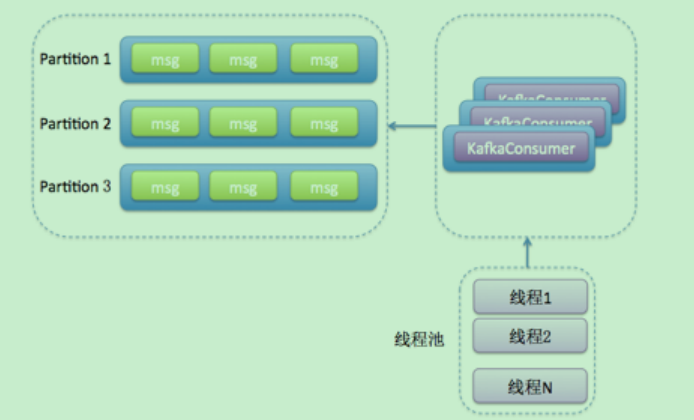

# 消息队列概览

### 描述

> 客户端和服务端进行**异步通信**，消息服务器将信息放在队列中，消费方接受消息进行消费。

### 特性

> **解耦、异步、削峰**

### 常见消息队列协议

|              | JMS（Java Message Service）                                  | AMQP（Advance Message Queuing Protocol）                     | MQTT**消息队列遥测传输**（Message Queuing Telemetry Transport） | STOMP，即**流文本定向消息协议**（Streaming Text Orientated Messaging Protocal） |
| ------------ | ------------------------------------------------------------ | ------------------------------------------------------------ | ------------------------------------------------------------ | ------------------------------------------------------------ |
| 定义         | Java  api                                                    | 网络线级协议                                                 | **广泛用于物联网公司**                                       | 一个相对简单的文本消息传输协议，主要特点就是简单易懂，没有特别多的套路 |
| 跨语言       | 否                                                           | **是**                                                       |                                                              |                                                              |
| 跨平台       | 否                                                           | **是**                                                       |                                                              |                                                              |
| Model        | 提供两种消息模型:<br>（1）点对点 Peer-2-Peer  <br/>（2）发布订阅 Pub/sub | 提供了五种消息模型：  <br/>（1）、direct  exchange  <br/>（2）、fanout  exchange  <br/>（3）、topic  change  <br/>（4）、headers  exchange  <br/>（5）、system  exchange  <br/>本质来讲，后四种和JMS的pub/sub模型没有太大差别，仅是在路由机制上做了更详细的划分； |                                                              |                                                              |
| 支持消息类型 | 多种消息类型：  TextMessage  MapMessage  BytesMessage  StreamMessage  ObjectMessage  Message  （只有消息头和属性） | byte[]  当实际应用时，有复杂的消息，可以将消息序列化后发送。 |                                                              |                                                              |
| 综合评价     | JMS  定义了JAVA  API层面的标准；<br>在java体系中，多个client均可以通过JMS进行交互，不需要应用修改代码，但是其对跨平台的支持较差；<br>**是一种规范，是对AMQP，MQTT，STOMP等协议更高一层的抽象** | AMQP定义了wire-level层的协议标准；天然具有跨平台、跨语言特性。 | 它常用于很多计算能力有限、带宽低、网络不可靠的远程通信应用场景。 |                                                              |
| 消息队列应用 |                                                              | RabbitMQ                                                     |                                                              | ActiveMQ                                                     |

### 常见消息队列比较

| 特性                    | ActiveMQ                                                     | RabbitMQ                                                     | RocketMQ                                                     | Kafka                                                        |
| ----------------------- | ------------------------------------------------------------ | ------------------------------------------------------------ | ------------------------------------------------------------ | ------------------------------------------------------------ |
| 单机吞吐量              | 万级，吞吐量比RocketMQ和Kafka要低了一个数量级                | 万级，吞吐量比RocketMQ和Kafka要低了一个数量级                | 10万级，RocketMQ也是可以支撑高吞吐的一种MQ                   | 10万级别，这是kafka最大的优点，就是吞吐量高。     一般配合大数据类的系统来进行实时数据计算、日志采集等场景 |
| topic数量对吞吐量的影响 |                                                              |                                                              | topic可以达到几百，几千个的级别，吞吐量会有较小幅度的下降     这是RocketMQ的一大优势，在同等机器下，可以支撑大量的topic | **topic从几十个到几百个的时候，吞吐量会大幅度下降     所以在同等机器下，kafka尽量保证topic数量不要过多**。如果要支撑大规模topic，需要增加更多的机器资源 |
| 时效性                  | ms级                                                         | **微秒级**，这是rabbitmq的一大特点，延迟是最低的             | ms级                                                         | 延迟在ms级以内                                               |
| 可用性                  | 高，基于主从架构实现高可用性                                 | 高，基于主从架构实现高可用性                                 | 非常高，**分布式架构**                                       | 非常高，kafka是**分布式的**，一个数据多个副本，少数机器宕机，不会丢失数据，不会导致不可用 |
| 消息可靠性              | 有较低的概率丢失数据                                         |                                                              | 经过参数优化配置，可以做到0丢失                              | 经过参数优化配置，消息可以做到0丢失                          |
| 功能支持                | MQ领域的功能极其完备                                         | 基于**erlang开发，所以并发能力很强，性能极其好，延时很低**   | MQ功能较为完善，还是分布式的，扩展性好                       | 功能较为简单，主要支持简单的MQ功能，在**大数据领域的实时计算以及日志采集**被大规模使用，是事实上的标准 |
| 优劣势总结              | 非常成熟，功能强大，在业内大量的公司以及项目中都有应用     偶尔会有较低概率丢失消息     而且现在社区以及国内应用都越来越少，官方社区现在对ActiveMQ 5.x维护越来越少，几个月才发布一个版本     而且确实主要是基于解耦和异步来用的，较少在大规模吞吐的场景中使用 | 1、**erlang语言开发，性能极其好，延时很低**；     吞吐量到万级，MQ功能比较完备     <br>而且开源提供的管理界面非常棒，用起来很好用     <br/>2、社区相对比较活跃，几乎每个月都发布几个版本     3、erlang**源码级别的研究和定制困难**，基本职能依赖于开源社区的快速维护和修复bug。 | 1、接口简单易用，而且毕竟在阿里**大规模应用过**，有阿里品牌保障     日处理消息上百亿之多，可以做到大规模吞吐，性能也非常好，分布式扩展也很方便，<br/>2、**社区维护还可以**，可靠性和可用性都是ok的，还可以支撑大规模的topic数量，支持复杂MQ业务场景<br/>3、而且一个很大的优势在于，阿里出品都是**java系的，我们可以自己阅读源码，定制自己公司的MQ**，可以掌控     社区活跃度相对较为一般， | 1、超高的吞吐量，ms级的延迟，极高的可用性以及可靠性，而且**分布式可以任意扩展**     同时kafka最好是支撑**较少的topic数量即可，保证其超高吞吐量**     <br/>2、而且kafka唯一的一点劣势是有可能消息重复消费，那么对数据准确性会造成极其轻微的影响，<br/>3、在大**数据领域中以及日志采集中**，这点轻微影响可以忽略     这个特性天然适合大数据实时计算以及日志收集 |

### 常见问题解答

> ==kafka==
>
> | 防止消息丢失(一致性) | 发送方： ack是 1 或者-1/all 可以防止消息丢失，如果要做到99.9999%，ack设成all，把min.insync.replicas配置成 分区备份数<br>消费方：把自动提交改为手动提交。<br>broker：持久化 |
> | -------------------- | ------------------------------------------------------------ |
> | 防止重复消费(幂等性) | 生产端 ：重试机制关闭  这种不建议做  会导致数据丢失<br/>**消费端幂等性保证即可**<br>   方案：mysql 插入业务id作为主键，主键是唯一的，所以一次只能插入一条 使用redis或zk的分布式锁 set nx  或者 zk 节点唯一 |
> | 如何顺序消费(顺序性) | 发送方：在发送时将ack不能设置 0 ，**关闭重试，使用同步发送**，等到发送成功再发送下一条。`确保消息是顺序发送`的。<br/>接收方：消息是发送到一个分区中，只能有**一个消费组的消费者来接收消息**。因此，kafka的顺序消费会牺牲掉性能。  <br>说明：<br/>    一个主题，一个分区，生产者按照一定的顺序发送消息，broker就会按照这个顺序把它们写入分区，消费者也会按照同样的顺序读取它们<br/>    retires配置:失败重试，如果第一批次发送失败，第二批次成功了，但是第一批次重试，也写入成功造成顺序错乱。<br>   `可以设置重试，但是maxinflightrequestper.connection设为1，第一批发送处理完成之前，不允许第批处理`。但是严重影响吞吐量。 |
> | 解决消息积压         | 方案一：在**一个消费者中启动多个线程，让多个线程同时消费**。——`提升一个消费者的消费能力`（`增加分区增加消费者`）。<br/>方案二：可以启动多个消费者(多个消费者组)，多个消费者部署在不同的服务器上。其实多个消费者部署在同一服务器上也可以提高消费能力——充分利用服务器的cpu资源。<br>方案三：让一个消费者去把收到的消息往另外一个topic上发，另一个topic设置多个分区和多个消费者 ，进行具体的业务消费。 |
>
> ==rabbitMQ==
>
> | 防止消息丢失(一致性) | 发送方： 生产者到MQ,通过事务（同步）或者confirm机制（异步）<br>消费方：ack机制，关闭rabbitmq自动ack，通过程序调用<br>MQ：持久化 |
> | -------------------- | ------------------------------------------------------------ |
> | 防止重复消费(幂等性) | **消费端幂等性保证**<br>   方案：mysql 插入业务id作为主键，主键是唯一的，所以一次只能插入一条 使用redis或zk的分布式锁 set nx  或者 zk 节点唯一 |
> | 如何顺序消费(顺序性) | 拆分多个queue，每个queue一个consumer；<br/>或者就一个queue但是对应一个consumer，然后这个consumer内部用内存队列做排队，然后分发给底层不同的worker来处理。 |
> | 解决消息积压         | 消息堆积延时：查找消费端问题，修复。扩大queue，写一个分发的程序将现有队列消息分发到其他队列，然后扩容consumer来消费<br/>丢失：重新灌入数据。<br>将满：一和二方式结合，先手动消耗掉，然后重新灌入。 |

## Mns

阿里云消息服务MNS（Message Service）是一种高效、可靠、安全、便捷、可弹性扩展的分布式消息服务。MNS能够帮助应用开发者在他们应用的分布式组件上自由的传递数据、通知消息，构建松耦合系统。

# ActiveMQ

### 1、消息处理方式

1、自动签收

2、事务消息： 生产者，发送消息完成之后，必须提交给队列。消费者消费信息，必须提交事务。如果没有，默认表示没有进行消费。默认自动重试。

3、手动签收：消费者没有手动签收信息，默认表示没有进行消费。

# RabbitMQ

### 简介

RabbitMQ是一个由erlang开发的AMQP(Advanved Message Queue Protocol)的开源实现。

### 核心概念

**Message**

消息，消息是不具名的，它由消息头和消息体组成。消息体是不透明的，而消息头则由一系列的可选属性组成，这些属性包括routing-key（路由键）、priority（相对于其他消息的优先权）、delivery-mode（指出该消息可能需要持久性存储）等。

**Publisher**

消息的生产者，也是一个向交换器发布消息的客户端应用程序。

**Exchange**

交换器，**用来接收生产者发送的消息并将这些消息路由给服务器中的队列。**

Exchange有4种类型：direct(默认)，fanout, topic, 和headers，不同类型的Exchange转发消息的策略有所区别

**Queue**

消息队列，用来保存消息直到发送给消费者。它是消息的容器，也是消息的终点。一个消息可投入一个或多个队列。消息一直在队列里面，等待消费者连接到这个队列将其取走。

**Binding**

**绑定，用于消息队列和交换器之间的关联。**一个绑定就是基于路由键将交换器和消息队列连接起来的路由规则，所以可以将交换器理解成一个由绑定构成的路由表。

Exchange 和Queue的绑定可以是多对多的关系。

**Connection**

网络连接，比如一个TCP连接。

**Channel**

**信道，多路复用连接中的一条独立的双向数据流通道**。信道是建立在真实的TCP连接内的虚拟连接，AMQP 命令都是通过信道发出去的，不管是发布消息、订阅队列还是接收消息，这些动作都是通过信道完成。因为对于操作系统来说建立和销毁 TCP 都是非常昂贵的开销，所以引入了信道的概念，**以复用一条 TCP 连接。**

**Consumer**

消息的消费者，表示一个从消息队列中取得消息的客户端应用程序。

**Virtual Host**

**虚拟主机，表示一批交换器、消息队列和相关对象**。虚拟主机是共享相同的身份认证和加密环境的独立服务器域。每个 vhost 本质上就是一个 mini 版的 RabbitMQ 服务器，拥有自己的队列、交换器、绑定和权限机制。vhost 是 AMQP 概念的基础，必须在连接时指定，RabbitMQ 默认的 vhost 是 / 。

**Broker**

**表示消息队列服务器实体**


### 工作过程

**消息（message）被发布者（publisher）发送给交换机（exchange）**，交换机常常被比喻成邮局或者邮箱。然后**交换机将收到的消息根据路由规则分发给绑定的队列（queue）。最后AMQP代理会将消息投递给订阅了此队列的消费者，或者消费者按照需求自行获取**

**队列，交换机和绑定统称为AMQP实体（AMQP entities）**

### 交换机分类

| Name（交换机类型）            | Default pre-declared names（预声明的默认名称） |
| ----------------------------- | ---------------------------------------------- |
| Direct exchange（直连交换机） | (Empty string) and amq.direct                  |
| Fanout exchange（扇型交换机） | amq.fanout                                     |
| Topic exchange（主题交换机）  | amq.topic                                      |
| Headers exchange（头交换机）  | amq.match (and amq.headers in RabbitMQ)        |

除交换机类型外，在声明交换机时还可以附带许多其他的属性，其中最重要的几个分别是：

- Name
- Durability （消息代理重启后，交换机是否还存在）
- Auto-delete （当所有与之绑定的消息队列都完成了对此交换机的使用后，删掉它）
- Arguments（依赖代理本身）

交换机可以有两个状态**：持久（durable）**、**暂存（transient）**。持久化的交换机会在消息代理（broker）重启后依旧存在，而暂存的交换机则不会（它们需要在代理再次上线后重新被声明）。然而并不是所有的应用场景都需要持久化的交换机。

#### 直连交换机


直连型交换机（direct exchange）**是根据消息携带的路由键（routing key）将消息投递给对应队列的**。直连交换机用来处理消息的单播路由（unicast routing）

- 将一个队列绑定到某个交换机上，同时赋予该绑定一个路由键（routing key）
- 当一个携带着路由键为`R`的消息被发送给直连交换机时，交换机会把它路由给绑定值同样为`R`的队列。

#### 扇型交换机


扇型交换机（Fanout exchange）将消息路由给绑定到它身上的所有队列，**而不理会绑定的路由键。**如果N个队列绑定到某个扇型交换机上，当有消息发送给此扇型交换机时，交换机会将消息的拷贝分别发送给这所有的N个队列。**扇型用来交换机处理消息的广播路由**（broadcast routing）。

**应用场景**

- 大规模多用户在线（MMO）游戏可以使用它来处理排行榜更新等全局事件
- 体育新闻网站可以用它来近乎实时地将比分更新分发给移动客户端
- 分发系统使用它来广播各种状态和配置更新
- 在群聊的时候，它被用来分发消息给参与群聊的用户。（AMQP没有内置presence的概念，因此XMPP可能会是个更好的选择）

#### 主题交换机


主题交换机（topic exchanges）**通过对消息的路由键和队列到交换机的绑定模式之间的匹配，将消息路由给一个或多个队列**。主题交换机经常用来实现各种分发/订阅模式及其变种。主题交换机通常用来实现消息的多播路由（multicast routing）

\* **(星号) 用来表示一个单词 (必须出现的)**
\# **(井号) 用来表示任意数量（零个或多个）单词**
通配的绑定键是跟队列进行绑定的，举个小例子
队列Q1 绑定键为 *.TT.*     队列Q2绑定键为 TT.#
如果一条消息携带的路由键为 A.TT.B，那么队列Q1将会收到；
如果一条消息携带的路由键为TT.AA.BB，那么队列Q2将会收到；

**应用场景**

- 分发有关于特定地理位置的数据，例如销售点
- 由多个工作者（workers）完成的后台任务，每个工作者负责处理某些特定的任务
- 股票价格更新（以及其他类型的金融数据更新）
- 涉及到分类或者标签的新闻更新（例如，针对特定的运动项目或者队伍）
- 云端的不同种类服务的协调
- 分布式架构/基于系统的软件封装，其中每个构建者仅能处理一个特定的架构或者系统。

#### 头交换机

头交换机（headers exchange），头交换机**使用多个消息属性来代替路由键建立路由规则**。通过判断消息头的值能否与指定的绑定相匹配来确立路由规则。

它需要考虑**某条消息（message）是需要部分匹配还是全部匹配**。上边说的“更多一段消息”就是"x-match"参数。当"x-match"设置为“any”时，消息头的任意一个值被匹配就可以满足条件，而当"x-match"设置为“all”的时候，就需要消息头的所有值都匹配成功。

头交换机可以视为直连交换机的另一种表现形式。**不同之处在于头交换机的路由规则是建立在头属性值之上，而不是路由键**。路由键必须是一个字符串，而头属性值则没有这个约束，它们甚至可以是整数或者哈希值（字典）等。

### 队列

存储着即将被应用消费掉的消息。队列跟交换机共享某些属性，但是队列也有一些另外的属性。

- Name
- Durable（消息代理重启后，队列依旧存在）
- Exclusive 默认也是false，只能被当前创建的连接使用，而且当连接关闭后队列即被删除。此参考优先级高于durable
- Auto-delete（当最后一个消费者退订后即被删除）是否自动删除，当没有生产者或者消费者使用此队列，该队列会自动删除。
- Arguments（一些消息代理用他来完成类似与TTL的某些额外功能）

### 消息确认

**自动确认模式 ** automatic acknowledgement model **AcknowledgeMode.NONE**

- 当消息代理（broker）将消息发送给应用后立即删除。（使用AMQP方法：basic.deliver或basic.get-ok）

**显式确认模式**  explicit acknowledgement model

- 待应用（application）发送一个确认回执（acknowledgement）后再删除消息。（使用AMQP方法：basic.ack）

消费者收到消息后，手动调用basic.ack/basic.nack/basic.reject后，RabbitMQ收到这些消息后，才认为本次投递成功。
**basic.ack用于肯定确认** 
**basic.nack用于否定确认**（注意：这是AMQP 0-9-1的RabbitMQ扩展） 
**basic.reject用于否定确认**，但与basic.nack相比有一个限制:一次只能拒绝单条消息 

*channel.basicReject(deliveryTag, true); 拒绝消费当前消息，如果第二参数传入true，就是将数据重新丢回队列里，那么下次还会消费这消息。**设置false**，就是告诉服务器，我已经知道这条消息数据了，因为一些原因拒绝它，而且服**务器也把这个消息丢掉就行。 下次不想再消费这条消息了。***

*使用拒绝后重新入列这个确认模式要谨慎，因为一般都是出现异常的时候，catch异常再拒绝入列，选择是否重入列。*

*但是如果**使用不当会导致一些每次都被你重入列的消息一直消费-入列-消费-入列这样循环，会导致消息积压。***

*nack，这个也是相当于设置不消费某条消息。*

*channel.basicNack(deliveryTag, false, true);
第一个参数依然是当前消息到的数据的唯一id;
第二个参数是指是否针对多条消息；如果是true，也就是说一次性针对当前通道的消息的tagID小于当前这条消息的，都拒绝确认。
第三个参数是指是否重新入列，也就是指不确认的消息是否重新丢回到队列里面去。*

*同样使用不确认后重新入列这个确认模式要谨慎，因为这里也可能因为考虑不周出现消息一直被重新丢回去的情况，导致积压。*


### 拒绝消息

应用可以向消息代理表明，本条消息由于“拒绝消息（Rejecting Messages）”的原因处理失败了（或者未能在此时完成）。当拒绝某条消息时，应用可以告诉消息代理如何处理这条消息——**销毁它或者重新放入队列。**

### 消息属性

- Content type（内容类型）
- Content encoding（内容编码）
- Routing key（路由键）
- Delivery mode (persistent or not)
  投递模式（持久化 或 非持久化）
- Message priority（消息优先权）
- Message publishing timestamp（消息发布的时间戳）
- Expiration period（消息有效期）
- Publisher application id（发布应用的ID）


### 使用模式：

**单机模式**

**普通集群模式：**只是同步元素据，Queue（存放消息的队列）的完整数据则只会存在于它所创建的那个节点上。其他节点只知道这个queue的metadata信息和一个指向queue的owner node的指针。（起到转发的功能）【考虑到存储空间和性能问题未同步所有信息】

**镜像集群模式**（高可用）**：基于普通的集群模式的，然后再添加一些策略，所以还是得先配置普通集群，然后才能设置镜像队列

### 集成springboot

[实战](https://blog.csdn.net/qq_35387940/article/details/100514134)

#### 样例

**启用注解以及 使用**

```java
/**
 * 自动配置
 *  1、RabbitAutoConfiguration
 *  2、有自动配置了连接工厂ConnectionFactory；
 *  3、RabbitProperties 封装了 RabbitMQ的配置
 *  4、 RabbitTemplate ：给RabbitMQ发送和接受消息；
 *  5、 AmqpAdmin ： RabbitMQ系统管理功能组件;
 *  	AmqpAdmin：创建和删除 Queue，Exchange，Binding
 *  6、@EnableRabbit +  @RabbitListener 监听消息队列的内容
 *
 */
@EnableRabbit  //开启基于注解的RabbitMQ模式
@SpringBootApplication
public class Springboot02AmqpApplication {

	public static void main(String[] args) {
		SpringApplication.run(Springboot02AmqpApplication.class, args);
	}
}
```

```java
@Service
public class BookService {

    @RabbitListener(queues = "atguigu.news")
    public void receive(Book book){
        System.out.println("收到消息："+book);
    }

    @RabbitListener(queues = "atguigu")
    public void receive02(Message message){
        System.out.println(message.getBody());
        System.out.println(message.getMessageProperties());
    }
}

```

**自定义消息转换**

```java
@Configuration
public class MyAMQPConfig {

    @Bean
    public MessageConverter messageConverter(){
        return new Jackson2JsonMessageConverter();
    }
}
```

**测试消息发送和接受以及通过AmqpAdmin 管理组件 创建exchange 和queue等操作**

```java
@RunWith(SpringRunner.class)
@SpringBootTest
public class Springboot02AmqpApplicationTests {

	@Autowired
	RabbitTemplate rabbitTemplate;

	@Autowired
	AmqpAdmin amqpAdmin;

	@Test
	public void createExchange(){

//		amqpAdmin.declareExchange(new DirectExchange("amqpadmin.exchange"));
//		System.out.println("创建完成");

//		amqpAdmin.declareQueue(new Queue("amqpadmin.queue",true));
		//创建绑定规则

//		amqpAdmin.declareBinding(new Binding("amqpadmin.queue", Binding.DestinationType.QUEUE,"amqpadmin.exchange","amqp.haha",null));

		//amqpAdmin.de
	}

	/**
	 * 1、单播（点对点）
	 */
	@Test
	public void contextLoads() {
		//Message需要自己构造一个;定义消息体内容和消息头
		//rabbitTemplate.send(exchage,routeKey,message);

		//object默认当成消息体，只需要传入要发送的对象，自动序列化发送给rabbitmq；
		//rabbitTemplate.convertAndSend(exchage,routeKey,object);
		Map<String,Object> map = new HashMap<>();
		map.put("msg","这是第一个消息");
		map.put("data", Arrays.asList("helloworld",123,true));
		//对象被默认序列化以后发送出去
		rabbitTemplate.convertAndSend("exchange.direct","atguigu.news",new Book("西游记","吴承恩"));

	}

	//接受数据,如何将数据自动的转为json发送出去
	@Test
	public void receive(){
		Object o = rabbitTemplate.receiveAndConvert("atguigu.news");
		System.out.println(o.getClass());
		System.out.println(o);
	}

	/**
	 * 广播
	 */
	@Test
	public void sendMsg(){
		rabbitTemplate.convertAndSend("exchange.fanout","",new Book("红楼梦","曹雪芹"));
	}

}
```


# RocketMQ

### 工作过程


- Broker都注册到Nameserver上
- Producer发消息的时候会从Nameserver上获取发消息的topic信息
- Producer向提供服务的所有master建立长连接，且定时向master发送心跳
- Consumer通过NameServer集群获得Topic的路由信息
- Consumer会与所有的Master和所有的Slave都建立连接进行监听新消息

### 角色说明

#### Broker

- 理解成RocketMQ本身
- broker主要用于producer和consumer接收和发送消息
- broker会定时向nameserver提交自己的信息
- 是消息中间件的消息存储、转发服务器
- 每个Broker节点，在启动时，都会遍历NameServer列表，与每个NameServer建立长连接，注册自己的信息，之后定时上报

#### Nameserver

- 理解成zookeeper的效果，只是他没用zk，而是自己写了个nameserver来替代zk
- 底层由netty实现，提供了路由管理、服务注册、服务发现的功能，是一个无状态节点
- nameserver是服务发现者，集群中各个角色（producer、broker、consumer等）都需要定时向nameserver上报自己的状态，以便互相发现彼此，超时不上报的话，nameserver会把它从列表中剔除
- nameserver可以部署多个，当多个nameserver存在的时候，其他角色同时向他们上报信息，以保证高可用，
- NameServer集群间互不通信，没有主备的概念
- nameserver内存式存储，nameserver中的broker、topic等信息默认不会持久化，所以他是无状态节点

#### Producer

- 消息的生产者
- 随机选择其中一个NameServer节点建立长连接，获得Topic路由信息（包括topic下的queue，这些queue分布在哪些broker上等等）
- 接下来向提供topic服务的master建立长连接（因为rocketmq只有master才能写消息），且定时向master发送心跳

#### Consumer

- 消息的消费者
- 通过NameServer集群获得Topic的路由信息，连接到对应的Broker上消费消息
- 由于Master和Slave都可以读取消息，因此Consumer会与Master和Slave都建立连接进行消费消息


### 集成springboot

[实战](https://blog.csdn.net/qq_18603599/article/details/81172866)

# Kafka

## 介绍

> [Apache Kafka](https://kafka.apache.org/)
>
> [Kafka 中文网 官网](https://kafka.p2hp.com/#google_vignette)
>
> [【万字长文】Kafka最全知识点整理（建议收藏）-腾讯云开发者社区-腾讯云](https://cloud.tencent.com/developer/article/2005281)
>
> [kafka全解-CSDN博客](https://blog.csdn.net/General_zy/article/details/129227041)

> 开源的高吞吐量的分布式消息中间件
>
> ==支持特性==
>
> - **缓冲和削峰**：上游数据时有突发流量，下游可能扛不住，或者下游没有足够多的机器来保证冗余，kafka在中间可以起到一个缓冲的作用，把消息暂存在kafka中，下游服务就可以按照自己的节奏进行慢慢处理。
> - **解耦和扩展性**：项目开始的时候，并不能确定具体需求。消息队列可以作为一个接口层，解耦重要的业务流程。只需要遵守约定，针对数据编程即可获取扩展能力。
> - 冗余：可以采用一对多的方式，一个生产者发布消息，可以被多个订阅topic的服务消费到，供多个毫无关联的业务使用。
> - **健壮性**：消息队列可以堆积请求，所以消费端业务即使短时间死掉，也不会影响主要业务的正常进行。
> - **异步通信**：很多时候，用户不想也不需要立即处理消息。消息队列提供了异步处理机制，允许用户把一个消息放入队列，但并不立即处理它。想向队列中放入多少消息就放多少，然后在需要的时候再去处理它们。

## 应用场景

- 跟踪网站用户和前端应用发生的交互，比如页面访问次数和点击。
- 标准消息中间件的功能
- 收集应用程序和系统的度量监控指标，或者收集应用日志信息
- 操作实时数据流，进行统计、转换、复杂计算等等

## 架构图


## 架构图解

> - Broker ：一台kafka服务器就是一个broker。一个集群由多个broker组成。一个broker可以容纳多个topic。
> - Producer：消息生产者，向kafka broker发送消息的客户端。
> - Consumer：消息消费者，向kafka broker取消息的客户端。
> - Topic：队列，生产者和消费者通过此进行对接。
> - Consumer Group （CG）：若干个Consumer组成的集合。这是==kafka用来实现一个topic消息的广播（发给所有的consumer）和单播（发给任意一个consumer）的手段==。一个topic可以有多个CG。topic的消息会复制（不是真的复制，是概念上的）到所有的CG，但每个CG只会把消息发给该CG中的一个consumer。如果需要实现广播，只要每个consumer有一个独立的CG就可以了。要实现单播只要所有的consumer在同一个CG。用CG还可以将consumer进行自由的分组而不需要多次发送消息到不同的topic。
> - Partition：分区，为了实现扩展性，一个topic可以分布在多个broker上，一个topic可以分为多个partition，每个partition都是一个有序的队列。partition中的每条消息都会被分配一个有序的id（offset）。kafka只保证同一个partition中的消息顺序，不保证一个topic的整体（多个partition之间）的顺序。生产者和消费者使用时可以指定topic中的具体partition。
> - 副本：在kafka中，每个主题可以有多个分区，每个分区又可以有多个副本。这多个副本中，只有一个是leader，而其他的都是follower副本。仅有leader副本可以对外提供服务。多个follower副本通常存放在和leader副本不同的broker中。通过这样的机制实现了高可用，当某台机器挂掉后，其他follower副本也能迅速”转正“，开始对外提供服务。
> - offset：消费偏移量，topic中的每个分区都是有序且顺序不可变的记录集，并且不断地追加到结构化的log文件。分区中的每一个记录都会分配一个id号来表示顺序，我们称之为offset，offset用来唯一的标识分区中每一条记录。可以设置为“自动提交”与“手动提交”。

## 基本概念

### 消息和批次

> 类似于数据库中的一条记录或者一批记录

**消息**，Kafka里的数据单元，由字节数组组成。消息还可以包含键（可选元数据，也是字节数组），主要用于对消息选取分区。

消息可以被分批写入Kafka。**批次**就是一组消息，这些消息**属于同一个主题和分区**。

<u>分成批次传输**可以减少这网络开销**，这个需要权衡（时间延迟和吞吐量之间），批次里包含的消息越多，单位时间内处理的消息就越多，单个消息的传输时间就越长（**吞吐量高延时也高**）。如果进行压缩，可以提升数据的传输和存储能力，但需要更多的计算处理。</u>

一般我们**使用序列化和反序列化技术**，格式常用的有**JSON和XML**，还有Avro（Hadoop开发的一款序列化框架），具体怎么使用依据自身的业务来定。

### 主题

> 一种逻辑上对数据的分类

Kafka里的消息用**主题**进行分类（`主题好比数据库中的表`），主题下有可以被分为若干个`分区（分表技术）`。分区本质上是个**提交日志文件**，有新消息，这个消息就会以追加的方式写入分区（写文件的形式），然后用先入先出的顺序读取。


**整个主题多个分区的范围内，是无法保证消息的顺序的，`单个分区则可以保证`。**

`Kafka通过分区来实现数据冗余和伸缩性，因为分区可以分布在不同的服务器上`。

### broker和集群

> 一个独立的Kafka服务器叫Broker。
>
> 多个broker可以组成一个集群。每个集群中broker会选举出一个集群控制器。控制器会进行管理，包括将分区分配给broker和监控broker。
>
> 集群中Kafka内部一般使用**管道技术**进行高效的复制。
>

> ==broker 请求处理过程==
>
> 1、采用reactor 反应器模式
> 2、Kafka 的 Broker_端有个 SocketServer 组件，类似于 Reactor 模式中的 Dispatcher，它也有对应的 Acceptor 线程和一个工作线程池，只不过在 Kafka 中，这个工作线程池有个专属的名字，叫网络线程池。Kafka 提供了 Broker 端参数 num.network.threads，用于调整该网络线程泄的线程数。其默认值是 3，表示每台 Broker 启动时会创建 3 个网络线程，专门处理客户端发送的请求
> 3、Acceptor 线程采用**轮询的方式将入站请求公平地发到所有网络线程中**，  网络线程拿到请求后,它不是自己处理，而是将请求放入到一个共享请求队列中
>
> 
>
> 4.I0 线程池中的线程才是执行请求逻辑的线程。Broker 端参数num.io.threads控制了这个线程池中的线程数。目前该参数默认值是 8，表示每台 Broker 启动后自动创建 8 个 IO线程处理请求,你可以根据实际硬件条件设置此线程池的个数
>
> 5、**请求队列是所有网络线程共享的，而响应队列则是每个网络线程专属的**
>
> 6、Purgatory 的组件，这是 Kafka 中著名的“炼狱”组件。它是用来**缓存延时请求 (DelayedRequest)的**。所谓延时请求，就是那些一时未满足条件不能立刻处理的请求。比如设置了 acks=all的 PRODUCE 请求，一旦设置了 acks=all，那么该请求就必须 等待 ISR 中所有副本都接收了消息才能返回，此时处理该请求的 I0 线程就必须等待其他 Broker 的写入结果。当请求不能立刻处理时，它就会暂存在 Purgatory 中。稍后一旦满足了完成条件，I0 线程会继续处理该请求，并将Response 放入对应网络线程的响应队列中。

> ==控制器==
>
> Kafka集群中的broker在zk中创建临时序号节点，**序号最小的节点（最先创建的节点）将作为集群的controller**，负责管理整个集群中的所有分区和副本的状态：
>
> - 当某个分区的leader副本出现故障时，由控制器负责为该分区**选举新的leader**副本。
> - 当检测到某个分区的**ISR集合发生变化**时，由控制器负责**通知所有broker更新其元数据信息**。
> - 当使用kafka-topics.sh脚本为某个topic增加分区数量时，同样还是由控制器负责让新分区被其他节点感知到。
>

### 分区

> 在Kafka文件存储中，同一个topic下有多个不同partition,每个partition为一个目录，
> partiton命名规则为：
> topic名称+有序序号
> 第一个partiton序号从0开始，序号最大值为partitions数量减1。
> **partition是以文件夹的形式存储数据的**。文件存放位置，可以通过配置文件server.properties中的log.dirs指定
>
> ==segment==
>
> 一个partition又进一步的细分为segment
> ·每个partition(目录)相当于一个大型文件被细分到多个大小相等的segment文件中。
> ·每个segment中的消息数量不一定相等。

> ==segment==
>
> segment分段
> 由3大部分组成，分别为index file和data file,timeindex file
> 此3个文件一一对应，成对出现**，后缀".index"和'.log"分别表示为segment索引文件、数据文件、时间戳索引文件**
> log、index和timeindex三个文件，它有以下几个特点。
> (1)log文件名是以文件中第一条message的offset来命名的，实际offset长度是64位，但是这里只使用了20位，应付生产是足够的。
> (2)一组lindex+-log+timeindex文件的名字是一样的，并且log文件默认写满1G后，会进行log rolling形成一个新的组合来记录消息，这个是通过brokert端log.segment.bytes=:1073741824指定的，可以修改这个值进行调整。
> (3)index和timeindex在刚使用时会分配10M的大小，当进行log rolling后，它会修剪为实际的大小，所以看到前几个索引文件的大小，只有几百K。
> segment的文件配置项：
> #segment大小，默认为1G
> log.segment.bytes 1024*1024*1024
> #segment保留文件的最大时长，超时将被明除
> log.retention.hours=24*7

> 物理上对主题下数据的拆分，各个分区数据是不一样的，类似数据库解决单表压力的水平分表策略。
>
> **可以分布式存储**
>
> **可以并行写入**

ProducerRecord对象中可以看到，ProducerRecord包含了**目标主题，键和值**，Kafka的消息都是一个个的键值对。键可以设置为默认的null。
键的主要用途有两个:

> 1、决定消息被写往主题的哪个分区，拥有**相同键的消息将被写往同一个分区**(`这不就是数据库分表后对id的hash再路由到具体分片吗`)
>
> 2、还可以作为消息的附加消息。
> 3、**为空，用默认的分区器，分区器使用轮询算法将消息均衡地分布到各个分区上**
> 4、**键不为空**，并且使用默认的分区器，Kafka对键进行散列。同一个键总是被映射到同一个分区。(创建主题的时候把分区规划好，而且永远不要增加新分区)

> partition 与topic 的关系:
> **partition 是实际物理上的概念，而 topic 是逻辑上的概念**。可以理解为实际存储数据里并没有 topic 的文件夹，而只有 partition 的目录文件。

### 副本

> 1、就是分区的备份。
>
> 2、这些副本中，有leader、follower概念。leader 用来读写消息，**follower同步leader的消息，不提供读写**，用来数据的备份。
>
> 3、当leader所在的broker宕机，剩余的follower选举新的leader。

> ==副本机制的优点==
> 1.**提供数据冗余**。即使系统部分组件失效，系统依然能够继续运转，因而增加了整体可用性以及数据持久性。
> 2.**提供高伸缩性**。支持横向扩展，能够通过增加机器的方式来提升读性能，进而提高读操作吞吐量。
>
> 3.**改善数据局部性**。允许将数据放入与用户地理位置相近的地方，从而降低系统延时
> kafka 只支持优点1
> ==kafka副本机制的好处==
> Read-your-writes 使用生产者 API 向 Kafka 成功写入消息后，马上使用消费者 API 去读取刚才生产的消息 (副本不提供读写)
>
> 方便实现单调读 对于一个消费者用户而言，在多次消费消息时，它不会看到某条消息一会儿存在会儿不存在,如果允许副本机制读服务，存在多个副本拉取不一致，导致有的读存在数据，有的读不存在数据


### 偏移量

> 1、首先明确一点并不是消息读取被消费完毕，马上就被broker删除了。broker会持久化消息。而**消费消息，只是记录一下这个消息的标识而已**。
>
> 2、消费消息是`消费者往broker中的一个consumer_offset主题提交偏移量`。提交的数据包括<consumerGroupId+topic+分区号，offset>，是这样的数据结构。
>
> ​     hash(consumerGroupId) % __consumer_offsets主题的分区数，来找到具体的偏移量主题的分区(默认50个)
>
> 3、`偏移量可以简单理解为数据库中的主键字段。`

> **__consumer_offsets 的主要作用是保存 Kafka 消费者的位移信息**
>
> Consumer 端有个参数叫 enable.auto.commit，如果值是 true，则 Consumer 在后台默默地为你定期提交位移，提交间隔由一个专属的参数 auto.commit.interval.ms 来控制
>
> **Kafka 使用Compact 策略来删除位移主题中的过期消息，避免该主题无限期膨胀.kafka 提供了专门的后台线程定期地巡检待 Compact 的主题，看看是否存在满足条件的可删除数据。这个后台线程叫 Log Cleaner。**

### 单播消息、多播消息

**`单播多播的场景产生，本质是这一批消息(分片只是数据的拆分，还是唯一的)，是不能被同一个消费组中多个消费者来消费的`。**

> 单播消息指的就是一个消费者组里，只有一个消费者来消费partition的消息。

> 多播消息，就是利用多个消费者组中的不同消费者来消费同一个partition中的消息。

> Consumer Group 下可以有一个或多个 Consumer 实例。这里的实例可以是一个单独的进程，也可以是同一进程下的线程。在实际场景中，使用进程更为常见一些。
>
> Group ID 是一个字符串，在一个 Kafka 集群中，它标识唯一的一个 Consumer Group。
>
> Consumer Group 下所有实例订阅的主题的单个分区，只能分配给组内的某个 Consumer 实例消费。这个分区当然也可以被其他的 Group 消费。

### AR、ISR、OSR

> - AR:Assigned Replicas 指当前分区中的所有副本。
> - ISR:==In-Sync Replicas 副本同步队列==。==ISR中包括Leader和Foller==。如果Leader进程挂掉，会在ISR队列中选择一个服务作为新的Leader。有replica.lag.max.message(延迟条数)和replica.lag.time.max.ms(延迟时间)两个参数决定一台服务器是否可以加入ISR副本队列，在0.10版本之后移除了replica.lag.max.message(延迟条数)参数，防治服务频繁的进出队列。任意一个维度超过阈值都会把Follower踢出ISR，存入OSR（Outof-Sync Replicas）列表，新加入的Follower也会先存放在OSR中。
> - OSR：（Out-of-Sync Replicas）==非同步副本队列。与leader副本同步滞后过多的副本（不包括leader副本）组成OSR==。如果OSR集合中有follower副本“追上”了leader副本，那么leader副本会把它从OSR集合转移至ISR集合。默认情况下，当leader副本发生故障时，只有在ISR集合中的副本才有资格被选举为新的leader，而在OSR集合中的副本则没有任何机会（不过这个原则也可以通过修改unclean.leader.election.enable参数配置来改变）。unclean.leader.election.enable 为true的话，意味着非ISR集合的broker 也可以参与选举，这样就有可能发生数据丢失和数据不一致的情况，Kafka的可靠性就会降低；而如果unclean.leader.election.enable参数设置为false，Kafka的可用性就会降低。
>
> 
>
> ISR的伸缩：1）Leader跟踪维护ISR中follower滞后状态，落后太多或失效时，leade把他们从ISR剔除。2）OSR中follower“追上”Leader，在ISR中才有资格选举leader。
>
> `其实就是实现分区副本数据的一致。`
> 理解:每个分区可以有多个副本，其中一个副本是首领。所有的事件都直接发送给首领副本，或者直按从首领副本读取事件。其他 副本只需要与首领保持同步，并及时复制最新的事件。当首领副本不可用时，其中一个同步副本将成为新首领

### HW、LEO


> - LEO （Log End Offset），标识==当前日志文件中下一条待写入的消息的offset==。上图中offset为9的位置即为当前日志文件的 LEO，LEO 的大小相当于当前日志分区中最后一条消息的offset值加1.分区 ISR 集合中的每个副本都会维护自身的 LEO ，而 ==ISR 集合中最小的 LEO 即为分区的 HW==，==对消费者而言只能消费 HW 之前的消息。==
> - HW：replica高水印值，副本中最新一条已提交消息的位移。leader 的HW值也就是实际已提交消息的范围，每个replica都有HW值，但==仅仅leader中的HW才能作为标示信息==。什么意思呢，就是说当按照参数标准成功完成消息备份（成功同步给follower replica后）才会更新HW的值，代表消息理论上已经不会丢失，可以认为“已提交”。

### 消费者读取配置

> **·auto.offset.reset:** 
> latest 从最新的记录开始读取，
> earliest 表示消费者从起始位置读取分区的记录。

> **enable.auto.commit:是否自动提交偏移**

> ==partitionassignment.strategy:分区分配给消费者的策略==
>
> **Range**主题的连续分区分配给消费者  分区数/消费者数 + 1     10个分区  1个消费者组3个消费者  10/3+1 =4    4+ 3+3 模式
>
> **RoundRobin** 主题的分区循环分配给消费者
>
> **sticky** 粘性的  再均衡下，原先的映射关系不变，然后基于 range也好,roundrobin也好，将变化的分片或者消费者进行关联。

> ==consumer创建时机==
> 1、发起FindCoordinator 请求时 确定协调者和获取集群元数据
> 2、连接协调者时   令其执行组成员管理操作
> 3、消费数据时  执行实际的消息获取
> **关闭时机**
> 手动调用 KafkaConsumer.close() 方法，或者是执行 KilL 命令
> kafka 自动关闭是由消费者端参数 connection.max.idle.ms控制的，该参数现在的默认值是 9 分钟，即如果某个 Socket 连接上连续 9 分钟都没有任请求“过境”的话，那么消费者会强行“杀掉”这个 Socket 连接
>
> 当第三类 TCP 连接成功创建后，消费者程序就会弃第一类 TC 连接，之后在定期请求元数据时，它会改为使用第三类 TCP 连接

> ==消费者组进度监控方式==
>
> 1、使用 Kafka 自带的命令行工具 bin/kafka-consumer-groups.sh(bat)kafka-consumel-groups 脚本是 Kafka 为我们提供的最直接的监控消费者消费进度的工具。当然，除了监控 Lag 之外，它还有其他的功能
> s bin/kafka-consumer-groups.sh --bootstrap-server <Kafka broker 连接信息 >-describe --group <group 名称 >
>
> 2、Java Consumer API 分别提供了查询当分区最新消息位移和消费者组最新消费消息位移两组方法调用 
>
> AdmincLient.listConsumerGroupffsets 方法获取给定消费者组的最新消费消息的位移
> 获取订阅分区的最新消息位移  consumer.endoffsets(consumedoffsets.keySet());
>
> 执行相应的减法操作，获取 Lag 值并封装进一个 Map 对象。
> 3、使用Kafka 默认提供的 JMX 监控指标来监控消费者的 Lag 值
> Kafka 消费者提供了一个名为 kafka.consumer:type=consumer-fetch-manager-metrics,client-id=“{client-id}”的 JMX 指标，里面有很多属性。有两组属性: records-Lag-max 和 records-lead-min Lead 值是指消费者最新消费消息的位移与分区当前第一条消息位移的差值
> Kafka 消费者还在分区级别提供了额外的 JMX 指标，用于单独监控分区级别的 Lag 和 Lead 值。JMX 名称为: kafka.consumer:type=nsumer-fetch-managemetrics,partition="{partition}",topic="{topic}",client-id="{client-id}"

> ==消费端的重平衡==
>
> **重平衡的通知机制正是通过心跳线程来完成的**。
>
> 当协调者决定开启新一轮重平衡后，它会将"REBALANCE_IN_PROGRESS”封装进心跳请求的响应中，发还给消费者实例。
>
> 当消费者实例发现心跳响应中包含了“REBALANCE_IN_PROGRESS”，就能立马知道重平衡又开始。 消费者端参数heartbeat.interval.ms 从字面上看，它就是设置了心跳的间隔时间，但这个参数的**真正作用是控制重平衡通知的频率。**

> ==状态变化==
> 一个消费者组最开始是 Empty 状态(没有组成员)，当重平衡过程开启后，它会被置于PreparingRebalance 状态等待成员加入，之后变更到 CompletingRebalance 状态等待分配方案，最后流转到 stable 状态完成重平衡
> Kafka 定期自动删除过期位移的条件就是，组要处于 Empty 状态

> ==消费端重平衡过程==
>
> **JoinGroup 请求**
> 当组内成员加入组时，它会向协调者发送 JoinGroup 请求。在该请求中，每个成员都要将自己订阅的主题上报，这样**协调者就能收集到所有成员的订阅信息**。一旦收集了全部成员的 JoinGroup 请后，协调者会从这些成员中**选择一个担任这个消费者组的领导者**
>
> 选出领导者之后，**协调者**会把消费者组订阅信息封装进 JoinGroup 请求的响应体中，然后**发给领号者**，由领导者统一做出分配方案后。
>
> **SyncGroup 请求**
> 领导者向协调者发送 SyncGroup 请求，**将刚刚做出的分配方案发给协调者**。**协调者**接收分配方案然后统一以 **SyncGroup 响应的方式分发给所有成员**，这样组内所有成员就都知道自己该消费哪些分区

>消费者消费哪个分区，由群主(第一个加入群的消费者)分配，分配完毕，发送给群组协调器，调器再把这些信息发送给所有的消费者。
>
>消费组中消费者的数量不能比一个topic中的partition数量多，否则多出来的消费者消费不到消息


## 特性分析

### ISR收缩性

> 启动 Kafka时候自动开启的两个定时任务，“isr-expiration"和”isr-change-propagation"。
>
> - isr-expiration：isr-expiration任务会周期性的检测每个分区是否需要缩减其ISR集合，相当于一个纪检委员，巡查尖子班时候发现有学生睡觉打牌看小说，就把它的座位移除尖子班，缩减ISR，宁缺毋滥。同样道理，如果follower数据同步赶上leader，那么该follower就能进入ISR尖子班，扩充。上面关于ISR尖子班人员的所见，都会记录到isrChangeSet中，想象成是一个名单列表，谁能进，谁要出，都记录在案。
> - isr-change-propagation：作用就是检查isrChangeSet，按照名单上的信息移除和迁入，一般是2500ms检查一次，但是为了防止频繁收缩扩充影响性能，不是每次都能做变动，必须满足：1、上一次ISR集合发生变化距离现在已经超过5秒，2、上一次写入zookeeper的时候距离现在已经超过60秒。这两个条件都满足，那么就开始换座位！这两个条件可以由我们来配置。
> - **Kafka使用这种ISR收缩的方式有效的权衡了数据可靠性与性能之间的关系。**

### follower如何与leader同步数据

> Kafka的复制机制既不是完全的同步复制，也不是单纯的异步复制。
>
> 完全同步复制要求All Alive Follower都复制完，这条消息才会被认为commit，这种复制方式极大的影响了吞吐率。
>
> 而异步复制方式下，Follower异步的从Leader复制数据，数据只要被Leader写入log就被认为已经commit，这种情况下，如果leader挂掉，会丢失数据。
>
> ==kafka使用ISR的方式很好的均衡了确保数据不丢失以及吞吐率。==
>
> Follower==可以批量的从Leader复制数据，而且Leader充分利用磁盘顺序读以及send file(zero copy)机制，这样极大的提高复制性能，内部批量写磁盘，大幅减少了Follower与Leader的消息量差。==

### Zookeeper 在 Kafka 中的作用

> zookeeper 是一个分布式的协调组件，==早期版本的kafka用zk做meta信息存储，consumer的消费状态，group的管理以及 offset的值==。考虑到zk本身的一些因素以及整个架构较大概率存在单点问题，新版本中逐渐弱化了zookeeper的作用。新的consumer使用了kafka内部的group coordination协议，也减少了对zookeeper的依赖，
>
> 但是broker依然依赖于ZK，==zookeeper 在kafka中还用来选举controller 和 检测broker是否存活等等==。
>
> **1. Broker注册：**Broker是分布式部署并且互相独立，此时需要有一个注册系统能够将整个集群中的Broker管理起来，此时就用到的Zookeeper。在Zookeeper上会有一个专门用来进行Broker服务器列表记录的节点：/brokes/ids
>
> **2.Topic注册：**在kafka中，同一个Topic的消息会被分成多个分区并将其分布在多个Broker上，这些分区信息以及与Broker的对应关系也都是由Zookeeper维护，由专门的节点记录：/brokers/topics
>
> **3.消费者注册：**消费者服务器在初始化启动时加入消费者分组的步骤如下：注册到消费者分组。每个消费者服务器启动时，都会到Zookeeper的指定节点下创建一个属于自己的消费者节点，例如/consumer/[groupid]/ids/[consumerid]，完成节点创建后，消费者就会将自己订阅的Topic信息写入该临时节点。
>
> - **对消费者分组中的消费者的变化注册监听**：每个消费者都需要关注所属消费者分组中的其他消费者服务器的变化情况，即对/consumer/[group_id]/ids节点注册子节点变化的Watcher监听，一旦发现消费者新增或减少，就触发消费者的负载均衡。
> - **对Broker服务器变化注册监听**：消费者需要对/broker/ids[0-N]中的节点进行监听，如果发现Broker服务器列表发生变化，那么就根据具体情况来决定是否需要进行消费者负载均衡。
> - **进行消费者负载均衡**：为了让同一个Topic下不同分区的消息尽量均衡地被多个消费者消费而进行消费者与消息分区分配的过程，通常对于一个消费者分组，如果组内的消费者服务器发生变更或Broker服务器发生变更，会进行消费者负载均衡。
> - **Offset记录** 在消费者对指定消息分区进行消费的过程中，需要定时地将分区消息的消费进度Offset记录到Zookeeper上，以便对该消费者进行重启或者其他消费者重新接管该消息分区的消息消费后，能够从之前的进度继续进行消息消费。Offset在Zookeeper中由一个专门节点进行记录，其节点路径为：/consumers/[groupid]/offsets/[topic]/[brokerid-partition_id] 节点内容就是Offset的值。
>
> **4.生产者负载均衡：**由于同一个Topic消息会被分区并将其分布在多个Broker上，因此生产者需要将消息合理地发送到这些分布式的Broker上，那么如何实现生产者的负载均衡，Kafka支持传统的四层负载均衡，也支持Zookeeper方式实现负载均衡。
>
> 1. 四层负载均衡：根据生产者的IP地址和端口来为其圈定一个相关联的Broker。通常，一个生产者只会对应单个Broker，然后该生产者产生的消息都发送到该Broker。这种方式逻辑简单，每个生产者不需要同其他系统建立额外的TCP链接，只需要和Broker维护单个TCP连接即可。但是无法做到真正的负载均衡，因为实际系统中的每个生产者产生的消息量及每个Broker的消息存储量都是不一样的，如果有些生产者产生的消息远多于其他生产者的话，那么会导致不同的Broker接收到的消息总数差异巨大，同时，生产者也无法实时感知到Broker的新增和删除。
> 2. 使用Zookeeper进行负载均衡，由于每个Broker启动时，都会完成Broker注册过程，生产者会通过该节点的变化来动态地感知到Broker服务器列表的变更，这样就可以实现动态的负载均衡机制。
>
> **5.消费者负载均衡：**与生产者相似，Kafka中的消费者同样需要进行负载均衡来实现多个消费者合理地从对应的Broker服务器上接收消息，每个消费者分组包含若干消费者，每条消息都只会发送给分组中的一个消费者，不同的消费者分组消费自己特定的Topic下面的消息，互不干扰。
>
> **6.分区与消费者的关系：**消费组consumer group下有多个Consumer（消费者）。对于每个消费者组（consumer group），Kafka都会为其分配一个全局唯一的Group ID，Group内部的所有消费者共享该ID。订阅的topic下的每个分区只能分配给某个group下的一个consumer（当然该分区还可以被分配给其他group） 同时，kafka为每个消费者分配一个Consumer ID，通常采用“Hostname：UUID”形式表示。在kafka中，规定了每个消息分区只能被同组的一个消费者进行消费，因此，需要在zookeeper上记录消息分区与Consumer之间的关系，每个消费者一旦确定了对一个消费分区的消费权利，需要将其Consumer ID写入到平Zookeeper对应消息分区的临时节点上，例如：/consumers/[groupid]/owners/topic/[brokerid-partitionid] 其中，[brokerid-partition_id]就是一个消息分区的表示，节点内容就是该消息分区上消费者的Consumer ID。
>
> **7.补充：**早期版本的 kafka 用 zk 做 meta 信息存储，consumer 的消费状态，group 的管理以及 offse t的值。考虑到zk本身的一些因素以及整个架构较大概率存在单点问题，新版本中确实逐渐弱化了zookeeper的作用。新的consumer使用了kafka内部的group coordination协议，也减少了对zookeeper的依赖

### Kafka如何快速读取指定offset的消息


> Kafka本地日志存储根据segement分段存储，默认1G
>
> 其中segement包括index稀疏索引文件和log数据文件。其中index文件索引通过offset与posttion来定位数据文件中指定message的消息。其中index和log的文件名都为当前segement的起始offset。
>
> 读取offset=170418的消息，首==先通过offset根据二分法定位到index索引文件==，==然后根据索引文件中的[offset,position]（position为物理偏移地址）去log中获取指定offset的message数据==

### 生产者管理TCP方式

> ==kafka producer端管理TCP方式==
>
> 1. **KafkaProducer 实例创建时启动 Sender 线程**，从而创建与 bootstrap.servers 中所有Broker 的 TCP 连接。
> 2. KafkaProducer 实例**首次更新元数据信息**之后，还会再次创建与集群中所有 Broker 的 TCP 连接
> 3. 如果 Producer 端**发送消息到某台 Broker 时发现没有与该 Broker 的 TCP 连接，那么也会立即创建连接**。
> 4. 如果设置 Producer 端 connections.max.idle.ms 参数大于0 ，则步骤 1 中创建的 TCP连接会被自动关闭;如果设置该参数 =-1，那么步  中创建的 TCP 连接无法被关，从而成为“僵尸”连接

### 生产者发送消息模式

> ==异步发送==
>
> 对于生产者的异步发送来说就是，我发送完当前消息后，并不需要你将当前消息的发送结果立马告诉我，而是可以随即进行下一条消息的发送。但是我会允许添加一个回调函数，接收你后续返回的发送结果。异步发送这块我们直接调用kafkaProducer的send方法即可实现异步发送。
>
> ==同步发送==
>
> 如果生产者需要使用同步发送的方式，只需要拿到 send 方法返回的future对象后，调用其 get() 方法即可。此时如果消息还未发送到broker中，get方法会被阻塞，等到 broker 返回消息发送结果后会跳出当前方法并将结果返回。

### 发送消息的分区策略

> 所谓分区写入策略，即是生产者将数据写入到kafka主题后，kafka如何将数据分配到不同分区中的策略。
>
> 常见的有三种策略，轮询策略，随机策略，和按键保存策略。其中==轮询策略是默认的分区策略==，而随机策略则是较老版本的分区策略，不过由于其分配的均衡性不如轮询策略，故而后来改成了轮询策略为默认策略。
>
> ==所谓轮询策略，即按顺序轮流将每条数据分配到每个分区中==。
>
> 举个例子，假设主题test有三个分区，分别是分区A，分区B和分区C。那么主题对接收到的第一条消息写入A分区，第二条消息写入B分区，第三条消息写入C分区，第四条消息则又写入A分区，依此类推。
>
> 轮询策略是默认的策略，故而也是使用最频繁的策略，它能最大限度保证所有消息都平均分配到每一个分区。除非有特殊的业务需求，否则使用这种方式即可。
>
> 
>
> ==随机策略==
>
> 随机策略，也就是每次都随机地将消息分配到每个分区。其实==大概就是先得出分区的数量，然后每次获取一个随机数，用该随机数确定消息发送到哪个分区。==
>
> 在比较早的版本，默认的分区策略就是随机策略，但其实使用随机策略也是为了更好得将消息均衡写入每个分区。但后来发现对这一需求而言，轮询策略的表现更优，所以社区后来的默认策略就是轮询策略了。
>
> 
>
> ### ==hash（Key）==
>
> 按键保存策略，就是当==生产者发送数据的时候，可以指定一个key，计算这个key的hashCode值，按照hashCode的值对不同消息进行存储==。
>
> kafka默认是实现了两个策略，没指定key的时候就是轮询策略，有的话按键保存策略了。
>
> 上面有说到一个场景，那就是要顺序发送消息到kafka。前面提到的方案是让所有数据存储到一个分区中，但其实更好的做法，就是使用这种按键保存策略。
>
> ==让需要顺序存储的数据都指定相同的键，而不需要顺序存储的数据指定不同的键，这样一来，即实现了顺序存储的需求，又能够享受到kafka多分区的优势==，岂不美哉。
>
> 
>
> ### ==粘性分区==
>
> 所以如果使用默认的轮询partition策略，可能会造成一个大的batch被轮询成多个小的batch的情况。鉴于此，kafka2.4的时候推出一种新的分区策略，即StickyPartitioning Strategy，StickyPartitioning Strategy会随机地选择另一个分区并会尽可能地坚持使用该分区——即所谓的粘住这个分区。
>
> 鉴于小batch可能导致延时增加，之前对于无Key消息的分区策略效率很低。社区于2.4版本引入了黏性分区策略（StickyPartitioning Strategy）。该策略是一种全新的策略，能够显著地降低给消息指定分区过程中的延时。使用StickyPartitioner有助于改进消息批处理，减少延迟，并减少broker的负载。
>
> ### ==自定义分区器==
>
> 实现partitioner接口
>
> 切记分区是实现负载均衡以及高吞吐量的关键，所以一定要在生产者这一端就要考虑好合适的分区策略，避免造成消息数据的“倾斜”，使得某些分区成为性能瓶颈，从而导致下游数据消费的性能下降的问题。

### Kafka可靠性保证（不丢消息）

> > Kafka精确一次性（Exactly-once）保障之一
>
> ==Kafka可靠性主要从三个方面来看，Broker、Producer、Consumer==。
>
> **1. Broker**==写数据时首先写到PageCache中，pageCache的数据通过linux的flusher程序异步批量存储至磁盘中，此过程称为刷盘==。而pageCache位于内存。这部分数据会在断电后丢失。刷盘触发条件有三：
>
> - 主动调用sync或fsync函数
> - 可用内存低于阀值
> - dirty data时间达到阀值。dirty是pagecache的一个标识位，当有数据写入到pageCache时，pagecache被标注为dirty，数据刷盘以后，dirty标志清除。
>
> kafka没有提供同步刷盘的方式，也就是说理论上要完全让kafka保证单个broker不丢失消息是做不到的，只能通过调整刷盘机制的参数缓解该情况，比如：
>
> ==减少刷盘间隔log.flush.interval.ms(在刷新到磁盘之前，任何topic中的消息保留在内存中的最长时间) 减少刷盘数据量大小log.flush.interval.messages(在将消息刷新到磁盘之前，在日志分区上累积的消息数量)。==
>
> ==时间越短，数据量越小，性能越差，但是丢失的数据会变少，可靠性越好==。这是一个选择题。
>
> 同时，Kafka通过producer和broker协同处理消息丢失的情况，==一旦producer发现broker消息丢失，即可自动进行retry==。retry次数可根据参数retries进行配置，超过指定次数会，此条消息才会被判断丢失。**producer和broker之间，通过ack机制来判断消息是否丢失**。
>
> - acks=0，producer不等待broker的响应，效率最高，但是消息很可能会丢。
> - acks=1，leader broker收到消息后，不等待其他follower的响应，即返回ack。也可以理解为ack数为1。此时，如果follower还没有收到leader同步的消息leader就挂了，那么消息会丢失。按照上图中的例子，如果leader收到消息，成功写入PageCache后，会返回ack，此时producer认为消息发送成功。但此时，按照上图，数据还没有被同步到follower。如果此时leader断电，数据会丢失。
> - acks=-1，leader broker收到消息后，挂起，等待所有ISR列表中的follower返回结果后，再返回ack。-1等效与all。这种配置下，只有leader写入数据到pagecache是不会返回ack的，还需要所有的ISR返回“成功”才会触发ack。如果此时断电，producer可以知道消息没有被发送成功，将会重新发送。如果在follower收到数据以后，成功返回ack，leader断电，数据将存在于原来的follower中。在重新选举以后，新的leader会持有该部分数据。数据从leader同步到follower，需要2步：
> - 数据从pageCache被刷盘到disk。因为只有disk中的数据才能被同步到replica。
> - 数据同步到replica，并且replica成功将数据写入PageCache。在producer得到ack后，哪怕是所有机器都停电，数据也至少会存在于leader的磁盘内。
> - 上面第三点提到了ISR的列表的follower，需要配合另一个参数才能更好的保证ack的有效性。ISR是Broker维护的一个“可靠的follower列表”，in-sync Replica列表，broker的配置包含一个参数：min.insync.replicas。该参数表示ISR中最少的副本数。如果不设置该值，ISR中的follower列表可能为空。此时相当于acks=1。
>
> **Topic 分区副本**
>
> 在 Kafka 0.8.0 之前，Kafka 是没有副本的概念的，那时候人们只会用 Kafka 存储一些不重要的数据，因为没有副本，数据很可能会丢失。但是随着业务的发展，支持副本的功能越来越强烈，所以为了保证数据的可靠性，Kafka 从 0.8.0 版本开始引入了分区副本（详情请参见 KAFKA-50）。也就是说每个分区可以人为的配置几个副本（比如创建主题的时候指定 replication-factor，也可以在 Broker 级别进行配置 default.replication.factor），一般会设置为3。
>
> Kafka 可以保证单个分区里的事件是有序的，分区可以在线（可用），也可以离线（不可用）。在众多的分区副本里面有一个副本是 Leader，其余的副本是 follower，所有的读写操作都是经过 Leader 进行的，同时 follower 会定期地去 leader 上的复制数据。当 Leader 挂了的时候，其中一个 follower 会重新成为新的 Leader。通过分区副本，引入了数据冗余，同时也提供了 Kafka 的数据可靠性。
>
> **Kafka 的分区多副本架构是 Kafka 可靠性保证的核心，把消息写入多个副本可以使 Kafka 在发生崩溃时仍能保证消息的持久性**。
>
> **2. Producer**
>
> producer在发送数据时可以将多个请求进行合并后异步发送，合并后的请求首先缓存在本地buffer中，正常情况下，producer客户端的异步调用可以通过callback回调函数来处理消息发送失败或者超时的情况，但是当出现以下情况，将会出现数据丢失
>
> 1. producer异常中断，buffer中的数据将丢失。
> 2. producer客户端内存不足，如果采取的策略是丢弃消息（另一种策略是block阻塞），消息也会丢失。
> 3. 消息产生（异步）过快，导致挂起线程过多，内存不足，导致程序崩溃，消息丢失。
>
> 针对以上情况，可以有以下解决思路。
>
> 1. ==producer采用同步方式发送消息，或者生产数据时采用阻塞的线程池，并且线程数不宜过多。整体思路就是控制消息产生速度。==
> 2. ==扩大buffer的容量配置，配置项为：buffer.memory。这种方法可以缓解数据丢失的情况，但不能杜绝。==
>
> **3.Consumer**
>
> Consumer消费消息有以下几个步骤：
>
> - 接收消息
> - 处理消息
> - 反馈处理结果
>
> 消费方式主要分为两种
>
> - 自动提交offset，Automatic Offset Committing （enable.auto.commit=true）
> - 手动提交offset，Manual Offset Control（enable.auto.commit=false）
>
> Consumer自动提交机制是根据一定的时间间隔，将收到的消息进行commit，具体配置为：auto.commit.interval.ms。commit和消费的过程是异步的，也就是说可能存在消费过程未成功，commit消息就已经提交，此时就会出现消息丢失。我们可将==提交类型改为手动提交，在消费完成后再进行提交，这样可以保证消息“至少被消费一次”（at least once），==但如果消费完成后在提交过程中出现故障，则会出现重复消费的情况

### Kafka 是怎么去实现负载均衡的（生产者层面）

> 分区器是生产者层面的负载均衡。Kafka 生产者生产消息时，根据分区器将消息投递到指定的分区中，所以 ==Kafka 的负载均衡很大程度上依赖于分区器==。Kafka 默认的分区器是 Kafka 提供的 DefaultPartitioner。它的分区策略是根据 Key 值进行分区分配的：
>
> 如==果 key 不为 null：对 Key 值进行 Hash 计算，从所有分区中根据 Key 的 Hash 值计算出一个分区号；拥有相同 Key 值的消息被写入同一个分区；如果 key 为 null：消息将以轮询的方式，在所有可用分区中分别写入消息。如果不想使用 Kafka 默认的分区器，用户可以实现 Partitioner 接口，自行实现分区方法。==
>
> > 注：在笔者的理解中，分区器的负载均衡与顺序性有着一定程度上的矛盾。
>
> - 负载均衡的目的是将消息尽可能平均分配，对于 Kafka 而言，就是尽可能将消息平均分配给所有分区；
> - 如果使用 Kafka 保证顺序性，则需要利用到 Kafka 的分区顺序性的特性。
> - 对于需要保证顺序性的场景，通常会利用 Key 值实现分区顺序性，那么所有 Key值相同的消息就会进入同一个分区。这样的情况下，对于大量拥有相同 Key值的消息，会涌入同一个分区，导致一个分区消息过多，其他分区没有消息的情况，即与负载均衡的思想相悖。

### Kafka 是怎么去实现负载均衡的（消费者层面）

主要根据消费者的Rebalance机制实现

### 生产者发送消息发送配置

> acks=0:生产者在写入消息之前不会等待任何来自服务器的响应，容易丢消息，但是吞吐量高
> acks=1:只要leader收到消息，并持久化到broker日志中，生产者会收到来自服务器的成功响应
> acks=-1或all： 需要等待 min.insync.replicas(默认为 1 ，推荐配置大于等于2) 这个参数配置的副本个数都成功写入日志

> - 发送会默认会重试 3 次，每次间隔100ms
> - **`发送的消息会先进入到本地缓冲区RecordAccumulator（32mb），kakfa会跑一个线程，该线程去缓冲区中取16k(batch)的数据，发送到kafka，如果到 10 毫秒数据没取满16k，也会发送一次`**。

### broker保留消息策略

Kafka broker默认的保留策略是：要么保留一段时间（7天），要么保留一定大小（比如1个G）。到了限制，旧消息过期并删除。

> 日志的清理第略有两个：
> **1.时间维度的清理策略：**
> 根据消息的保留时间，当消息在kafka中保存的时间超过了指定的时间，就会触发清理过程  按消息体中维护的时间戳 来比较   早期按日志段的最新修改时间，避免人为修改
> **2.空间维度的清理第略：**
> 根据topic存储的数据大小，当topic所占的日志文件大小大于一定的阀值，则可以开始删除最旧的消息。 **超过阈值的部分必须要大于一个日志段的大小，否则不会进行删除**
> kafka会启动一个后台线程，定期检查是否存在可以删除的消息
> 通过log.retention..bytes和log.retention.hours这两个参数来设置，当其中任意一个达到要求，都会执行删除。
> 默认的保留时间是：7天

### 分区再均衡Rebalance

> **什么是 Rebalance**
>
> Rebalance 本质上是一种协议，规定了一个 Consumer Group 下的所有 consumer 如何达成一致，来分配订阅 Topic 的每个分区。 例如：某 Group 下有 20 个 consumer 实例，它订阅了一个具有 100 个 partition 的 Topic。正常情况下，kafka 会为每个 Consumer 平均的分配 5 个分区。这个分配的过程就是 Rebalance。
>
> **触发 Rebalance 的时机**
>
> 1. 组成员个数发生变化。例如有新的 consumer 实例加入该消费组或者离开组。
> 2. 订阅的 Topic 个数发生变化。
> 3. 订阅 Topic 的分区数发生变化。
>
> Rebalance 发生时，Group 下所有 consumer 实例都会协调在一起共同参与，kafka 能够保证尽量达到最公平的分配。但是 Rebalance 过程对 consumer group 会造成比较严重的影响。在 ==Rebalance 的过程中 consumer group 下的所有消费者实例都会停止工作，等待 Rebalance 过程完成==。
>
> **Rebalance 过程**
>
> Rebalance 过程分为两步：JoinGroup 请求和 SyncGroup 请求。
>
> JoinGroup :JoinGroup 请求的主要作用是将组成员订阅信息发送给领导者消费者，待领导者制定好分配方案后，重平衡流程进入到 SyncGroup 请求阶段。
>
> SyncGroup：SyncGroup 请求的主要目的，就是让协调者把领导者制定的分配方案下发给各个组内成员。当所有成员都成功接收到分配方案后，消费者组进入到 Stable 状态，即开始正常的消费工作。

> ==Coordinator==
>
> 为 Consumer Group 服务，负责为 Group 执行Rebalance 以及提供位移管理和组成员管理等
>
> 具体来讲，Consumer 端应用程序在提交位移时，其实是向 Coordinator 所在的 Broker提交位移。
>
> 同样地，当 Consumer 应用启动时，也是向 Coordinator 所在的 Broker 发送各种请求，然后由 Coordinator 负责执行消费者组的注册、成员管理记录等元数据管理操作。
>
> 所有 Broker 在启动时，都会创建和开启相应的 Coordinator 组件
>
> ==Consumer Group 如何确定为它服务的Coordinator 在哪台 Broker 上呢==
>
> 第 1 步：确定由位移主题的哪个分区来保存该 Group 数据：
> partitionId=Math.abs(groupId.hashCode() % offsetsTopicPartitionCount)。
> 第 2 步：找出该分区 Leader 副本所在的 Broker，该 Broker 即为对应的 Coordinator

> ==哪些 Rebalance 是“不必要的”==
>
> 第一类非必要 Rebalance 是因为未能及时发送心跳，导致 Consumer 被“踢出”Group而引发的
>
> 设置 session.timeout.ms = 6s。
> 设置 heartbeat.interval.ms = 2s。
> 要保证 Consumer 实例在被判定为“dead”之前，能够发送至少 3 轮的心跳请求，即session.timeout.ms >= 3 * heartbeat.interval.ms。将 session.timeout.ms 设置成 6s 主要是为了让 Coordinator 能够更快地定位已经挂掉的Consumer。
>
> 第二类非必要 Rebalance 是 Consumer 消费时间过长导致的
>
> max.poll.interval.ms 根据消费端处理时间设置的大点
>
> 第三类 查看是否消费端GC 导致

> ==判断Kafka FolLower 是否与 Leader 同步的标准==
> 不是看相差的消息数
> 标准是: Broker 端参数 replica.lag.time.max.ms，参数值。这个参数的含义是 **Follower 副本能够落后 Leader 副本的最长时间间隔**，当前默认值是 10 秒。这就是说，只要一个 FoLLower 副本落后 Leader 副本的时间不连续超过 10 秒，那么 Kafka 就认为该 FoLLwer 副本与 Leader是同步的，即使此时 Follower 副本中保存的消息明显少于 Leader 副本中的消息。

> ==UncLean 领导者选举 (Unclean Leader ELection)==
>
> 针对 Kafka 把所有不在 ISR 中的存活副本都称为非同步副本.
>
> 这些副本的选举过程 称为Unclean领导者选举。 Broker 端参数unclean.Leader.eLection.enable 控制是否允许 Unclean 领号者选举。建议禁用

### Kafka 负载均衡会导致什么问题

在消费者组Rebalance期间，一直等到rebalance结束前，消费者会出现无法读取消息，造成整个消费者组一段时间内不可用。

### 如何增强消费者的消费能力

> 1、如果是Kafka消费能力不足，则可以考虑增加Topic的分区数，并且同时提升消费组的消费者数量，消费者数==分区数。两者缺一不可。
>
> 2、如果是下游的数据处理不及时：则提高每批次拉取的数量。批次拉取数据过少（拉取数据/处理时间<生产速度），使处理的数据小于生产的数据，也会造成数据积压。
>
> 3、优化消费者的处理逻辑，提高处理效率

### 消费者与Topic的分区策略

> ### ==Range==
>
> Range是对每个Topic而言的（即一个Topic一个Topic分），首先对同一个Topic里面的分区按照序号进行排序，并对消费者按照字母顺序进行排序。然后用Partitions分区的个数除以消费者线程的总数来决定每个消费者线程消费几个分区。如果除不尽，那么前面几个消费者线程将会多消费一个分区。
>
> ### ==RoundRobin==
>
> 将消费组内所有消费者以及消费者所订阅的所有topic的partition按照字典序排序，然后通过轮询方式逐个将分区以此分配给每个消费者。使用RoundRobin策略有两个前提条件必须满足：
>
> - 同一个消费者组里面的所有消费者的num.streams（消费者消费线程数）必须相等；
> - 每个消费者订阅的主题必须相同。
>
> ### ==StickyAssignor==
>
> 无论是RangeAssignor，还是RoundRobinAssignor，当前的分区分配算法都没有考虑上一次的分配结果。显然，在执行一次新的分配之前，如果能考虑到上一次分配的结果，尽量少的调整分区分配的变动，显然是能节省很多开销的。
>
> Sticky是“粘性的”，可以理解为分配结果是带“粘性的”——每一次分配变更相对上一次分配做最少的变动（上一次的结果是有粘性的），其目标有两点：
>
> 1. 分区的分配尽量的均衡
> 2. 每一次重分配的结果尽量与上一次分配结果保持一致
>
> StickyAssignor的模式比其他两种提供更加均衡的分配结果，在发生Consumer或者Partition变更的情况下，也能减少不必要的分区调整。

### 防止消息丢失

> 发送方： ack是 1 或者-1/all 可以防止消息丢失，如果要做到99.9999%，ack设成all，把min.insync.replicas配置成 分区备份数
>
> 消费方：把自动提交改为手动提交。
>
> broker 持久化

### 如何保证消息不被重复消费（消费者幂等性）

> - 幂等性：就是用户对于同一操作发起的一次请求或者多次请求的结果是一致的，不会因为多次点击而产生了副作用。
>
>   **出现原因：**
>
>   - 原因1：Consumer在消费过程中，被强行kill掉消费者线程或异常中断（消费系统宕机、重启等），导致实际消费后的数据，offset没有提交。
>   - 原因2：设置offset为自动提交，关闭kafka时，如果在close之前，调用 consumer.unsubscribe() 则有可能部分offset没提交，下次重启会重复消费。
>   - 原因3：消费超时导致消费者与集群断开连接，offset尚未提交，导致重平衡后重复消费。一般消费超时（session.time.out）有以下原因：并发过大，消费者突然宕机，处理超时等。
>
>   **解决思路：**
>
>   1. 提高消费能力，==提高单条消息的处理速度，例如对消息处理中比 较耗时的步骤可通过异步的方式进行处理、利用多线程处理等==。
>   2. 在缩短单条消息消费时常的同时，根据实际场景==可将session.time.out（Consumer心跳超时时间）和max.poll.interval.ms（consumer两次poll的最大时间间隔）值设置大一点，避免不必要的rebalance==，此外可==适当减小max.poll.records的值（ 表示每次消费的时候，获取多少条消息），默认值是500，可根据实际消息速率适当调小==。这种思路可解决因消费时间过长导致的重复消费问题， 对代码改动较小，但无法绝对避免重复消费问题。
>   3. 根据业务情况制定：==引入单独去重机制，例如生成消息时，在消息中加入唯一标识符如主键id==。写入时根据逐渐主键判断update还是insert。如果写==redis，则每次根据主键id进行set即可，天然幂等性==。或者使用redis作为缓冲，将id首先写入redis进行重复判断，然后在进行后续操作。
>   4. **开启生产者的精确一次性，也就是幂等性， 再引入producer事务 ，即客户端传入一个全局唯一的Transaction ID，这样即使本次会话挂掉也能根据这个id找到原来的事务状态**

### Kafka生产者幂等性

> 生产者幂等性主要避免生产者数据重复提交至Kafka broker中并落盘。在正常情况下，Producer向Broker发送消息，Broker将消息追加写到对应的流（即某一Topic的某一Partition）中并落盘，并向Producer返回ACK信号，表示确认收到。但是Producer和Broker之间的通信总有可能出现异常，如果消息已经写入，但ACK在半途丢失了，Producer就会进行retry操作再次发送该消息，造成重复写入。
>
> 为了实现Producer的幂等性，Kafka引入了==Producer ID（即PID）和Sequence Number。==
>
> - **PID。每个新的Producer在初始化的时候会被分配一个唯一的PID，这个PID对用户是不可见的。**
> - **Sequence Numbler。对于每个PID，该Producer发送数据的每个都对应一个从0开始单调递增的Sequence Number**
> - **Broker端在缓存中保存了这seq number,对于接收的每条消息,如果其序号比Broker缓存中序号大于1则接受它,否则将其丢弃,这样就可以实现了消息重复提交了.但是只能保证单个Producer对于同一个的Exactly Once语义**
>
> 
>
> 
>
> Producer使用幂等性的示例非常简单,与正常情况下Producer使用相比变化不大,只需要 把Producer的配置enable.idempotence设置为true即可,如下所示:
>
> 代码语言：javascript
>
> 复制
>
> ```javascript
> Properties props = new Properties();
> props.put(ProducerConfig.ENABLE_IDEMPOTENCE_CONFIG, "true");
> //当enable.idempotence为true时acks默认为 all
> // props.put("acks", "all");
> props.put("bootstrap.servers", "localhost:9092");
> props.put("key.serializer", "org.apache.kafka.common.serialization.StringSerializer");
> props.put("value.serializer", "org.apache.kafka.common.serialization.StringSerializer");
> KafkaProducer producer = new KafkaProducer(props);
> producer.send(new ProducerRecord(topic, "test");
> ```
>
> Prodcuer 幂等性对外保留的接口非常简单，其底层的实现对上层应用做了很好的封装，应用层并不需要去关心具体的实现细节，对用户非常友好
>
> Kafka的幂等性实现了对于单个Producer会话、单个TopicPartition级别的不重不漏，也就是最细粒度的保证。如果Producer重启（PID发生变化），或者写入是跨Topic、跨Partition的，单纯的幂等性就会失效，需要更高级别的事务性来解决了。当然事务性的原理更加复杂

### 为什么Kafka不支持读写分离

> 在 Kafka 中，生产者写入消息、消费者读取消息的操作都是与 leader 副本进行交互的，从 而实现的是一种主写主读的生产消费模型。
>
> Kafka 并不支持主写从读，因为主写从读有 2 个很明 显的缺点:
>
> 1. ==数据一致性问题==。数据从主节点转到从节点必然会有一个延时的时间窗口，这个时间 窗口会导致主从节点之间的数据不一致。某一时刻，在主节点和从节点中 A 数据的值都为 X， 之后将主节点中 A 的值修改为 Y，那么在这个变更通知到从节点之前，应用读取从节点中的 A 数据的值并不为最新的 Y，由此便产生了数据不一致的问题。
> 2. ==延时问题==。类似 Redis 这种组件，数据从写入主节点到同步至从节点中的过程需要经 历网络→主节点内存→网络→从节点内存这几个阶段，整个过程会耗费一定的时间。而在 Kafka 中，主从同步会比 Redis 更加耗时，它需要经历网络→主节点内存→主节点磁盘→网络→从节 点内存→从节点磁盘这几个阶段。对延时敏感的应用而言，主写从读的功能并不太适用。

### Kafka选举机制

> Kafka选举主要分为以下三种：
>
> 1. 控制器（Broker）选举机制
> 2. 分区副本选举机制
> 3. 消费组选举机制
>
> **控制器选举**
>
> 控制器是Kafka的核心组件，==它的主要作用是在Zookeeper的帮助下管理和协调整个Kafka集群包括所有分区与副本的状态==。集群中任意一个Broker都能充当控制器的角色，但在运行过程中，只能有一个Broker成为控制器。
>
> 集群中第一个启动的Broker会通过在Zookeeper中创建临时节点/controller来让自己成为控制器，其他Broker启动时也会在zookeeper中创建临时节点，但是发现节点已经存在，所以它们会收到一个异常，意识到控制器已经存在，那么就会在Zookeeper中创建watch对象，便于它们收到控制器变更的通知。如果控制器与Zookeeper断开连接或异常退出，其他broker通过watch收到控制器变更的通知，就会尝试创建临时节点/controller，如果有一个Broker创建成功，那么其他broker就会收到创建异常通知，代表控制器已经选举成功，其他Broker只需创建watch对象即可。
>
> **控制器作用**
>
> 1. 主题管理：创建、删除Topic，以及增加Topic分区等操作都是由控制器执行。
> 2. 分区重分配：执行Kafka的reassign脚本对Topic分区重分配的操作，也是由控制器实现。如果集群中有一个Broker异常退出，控制器会检查这个broker是否有分区的副本leader，如果有那么这个分区就需要一个新的leader，此时控制器就会去遍历其他副本，决定哪一个成为新的leader，同时更新分区的ISR集合。如果有一个Broker加入集群中，那么控制器就会通过Broker ID去判断新加入的Broker中是否含有现有分区的副本，如果有，就会从分区副本中去同步数据。
> 3. Preferred leader选举：因为在Kafka集群长时间运行中，broker的宕机或崩溃是不可避免的，leader就会发生转移，即使broker重新回来，也不会是leader了。在众多leader的转移过程中，就会产生leader不均衡现象，可能一小部分broker上有大量的leader，影响了整个集群的性能，所以就需要把leader调整回最初的broker上，这就需要Preferred leader选举。
> 4. 集群成员管理：控制器能够监控新broker的增加，broker的主动关闭与被动宕机，进而做其他工作。这也是利用Zookeeper的ZNode模型和Watcher机制，控制器会监听Zookeeper中/brokers/ids下临时节点的变化。同时对broker中的leader节点进行调整。
> 5. 元数据服务：控制器上保存了最全的集群元数据信息，其他所有broker会定期接收控制器发来的元数据更新请求，从而更新其内存中的缓存数据。
>
> **分区副本选举机制**
>
> 发生副本选举的情况：
>
> 1. 创建主题
> 2. 增加分区
> 3. 分区下线（分区中原先的leader副本下线，此时分区需要选举一个新的leader上线来对外提供服务）
> 4. 分区重分配
>
> 分区leader副本的选举由Kafka控制器负责具体实施。主要过程如下：
>
> 1. 从Zookeeper中读取当前分区的所有ISR(in-sync replicas)集合。
> 2. 调用配置的分区选择算法选择分区的leader。
>
> 分区副本分为ISR（同步副本）和OSR（非同步副本），当leader发生故障时，只有“同步副本”才可以被选举为leader。选举时按照集合中副本的顺序查找第一个存活的副本，并且这个副本在ISR集合中。同时kafka支持OSR（非同步副本）也参加选举，Kafka broker端提供了一个参数unclean.leader.election.enable，用于控制是否允许非同步副本参与leader选举；如果开启，则当 ISR为空时就会从这些副本中选举新的leader，这个过程称为 Unclean leader选举。可以根据实际的业务场景选择是否开启Unclean leader选举。开启 Unclean 领导者选举可能会造成数据丢失，但好处是，它使得分区 Leader 副本一直存在，不至于停止对外提供服务，因此提升了高可用性。一般建议是关闭Unclean leader选举，因为通常数据的一致性要比可用性重要。
>
> **消费组（Consumer Group）选主**
>
> 在Kafka的消费端，会有一个消费者协调器以及消费组，组协调器（Group Coordinator）需要为消费组内的消费者选举出一个消费组的leader。如果消费组内还没有leader，那么第一个加入消费组的消费者即为消费组的leader，如果某一个时刻leader消费者由于某些原因退出了消费组，那么就会重新选举leader，选举源码如下：
>
> ```java
> private val members = new mutable.HashMap[String, MemberMetadata]
> leaderId = members.keys.headOption
> ```
>
> 在组协调器中消费者的信息是以HashMap的形式存储的，其中key为消费者的member_id，而value是消费者相关的元数据信息。而leader的取值为HashMap中的第一个键值对的key（这种选举方式等同于随机）。
>
> 消费组的Leader和Coordinator没有关联。消费组的leader负责Rebalance过程中消费分配方案的制定。

### 脑裂问题

> controller挂掉后，Kafka集群会重新选举一个新的controller。这里面存在一个问题，很难确定之前的controller节点是挂掉还是只是短暂性的故障。如果之前挂掉的controller又正常了，他并不知道自己已经被取代了，那么此时集群中会出现两台controller。
>
> 其实这种情况是很容易发生。比如，某个controller由于GC而被认为已经挂掉，并选择了一个新的controller。在GC的情况下，在最初的controller眼中，并没有改变任何东西，该Broker甚至不知道它已经暂停了。因此，它将继续充当当前controller，这是分布式系统中的常见情况，称为脑裂。
>
> 假如，处于活跃状态的controller进入了长时间的GC暂停。它的ZooKeeper会话过期了，之前注册的/controller节点被删除。集群中其他Broker会收到zookeeper的这一通知。
>
> 
>
> 由于集群中必须存在一个controller Broker，所以现在每个Broker都试图尝试成为新的controller。假设Broker 2速度比较快，成为了最新的controller Broker。此时，每个Broker会收到Broker2成为新的controller的通知，由于Broker3正在进行"stop the world"的GC，可能不会收到Broker2成为最新的controller的通知。
>
> 
>
> 等到Broker3的GC完成之后，仍会认为自己是集群的controller，在Broker3的眼中好像什么都没有发生一样。
>
> 
>
> 现在，集群中出现了两个controller，它们可能一起发出具有冲突的命令，就会出现脑裂的现象。如果对这种情况不加以处理，可能会导致严重的不一致。所以需要一种方法来区分谁是集群当前最新的Controller。
>
> **Kafka是通过使用epoch number（纪元编号，也称为隔离令牌）来完成的。epoch number只是单调递增的数字，第一次选出Controller时，epoch number值为1，如果再次选出新的Controller，则epoch number将为2，依次单调递增。**
>
> **每个新选出的controller通过Zookeeper 的条件递增操作获得一个全新的、数值更大的epoch number 。其他Broker 在知道当前epoch number 后，如果收到由controller发出的包含较旧(较小)epoch number的消息，就会忽略它们，即Broker根据最大的epoch number来区分当前最新的controller。**
>
> 
>
> 上图，Broker3向Broker1发出命令:让Broker1上的某个分区副本成为leader，该消息的epoch number值为1。于此同时，Broker2也向Broker1发送了相同的命令，不同的是，该消息的epoch number值为2，此时Broker1只听从Broker2的命令(由于其epoch number较大)，会忽略Broker3的命令，从而避免脑裂的发生

### 如何为Kafka集群选择合适的Topics/Partitions数量

> **1、根据当前topic的消费者数量确认**
>
> 在kafka中，单个patition是kafka并行操作的最小单元。在producer和broker端，向每一个分区写入数据是可以完全并行化的，此时，可以通过加大硬件资源的利用率来提升系统的吞吐量，例如对数据进行压缩。在consumer段，kafka只允许单个partition的数据被一个consumer线程消费。因此，在consumer端，每一个Consumer Group内部的consumer并行度完全依赖于被消费的分区数量。综上所述，通常情况下，在一个Kafka集群中，==partition的数量越多，意味着可以到达的吞吐量越大。==
>
> **2、根据consumer端的最大吞吐量确定**
>
> 我们可以粗略地通过吞吐量来计算kafka集群的分区数量。假设对于单个partition，producer端的可达吞吐量为p，Consumer端的可达吞吐量为c，期望的目标吞吐量为t，那么集群所需要的partition数量至少为max(t/p,t/c)。在producer端，单个分区的吞吐量大小会受到批量大小、数据压缩方法、 确认类型（同步/异步）、复制因子等配置参数的影响。经过测试，在producer端，单个partition的吞吐量通常是在10MB/s左右。在consumer端，==单个partition的吞吐量依赖于consumer端每个消息的应用逻辑处理速度。因此，我们需要对consumer端的吞吐量进行测量==。

### Kafka事务

> 幂等性可以保证单个Producer会话、单个TopicPartition、单个会话session的不重不漏，如果Producer重启，或者是写入跨Topic、跨Partition的消息，幂等性无法保证。此时需要用到Kafka事务。**Kafka 的事务处理，主要是允许应用可以把消费和生产的 batch 处理（涉及多个 Partition）在一个原子单元内完成，操作要么全部完成、要么全部失败**。为了实现这种机制，我们需要应用能提供一个唯一 id，即使故障恢复后也不会改变，这个 id 就是 TransactionnalId（也叫 txn.id），txn.id 可以跟内部的 PID 1:1 分配，它们不同的是 txn.id 是用户提供的，而 PID 是 Producer 内部自动生成的（并且故障恢复后这个 PID 会变化），有了 txn.id 这个机制，就可以实现多 partition、跨会话的 EOS 语义。当用户使用 Kafka 的事务性时，Kafka 可以做到的保证：
>
> 1. 跨会话的幂等性写入：即使中间故障，恢复后依然可以保持幂等性；
> 2. 跨会话的事务恢复：如果一个应用实例挂了，启动的下一个实例依然可以保证上一个事务完成（commit 或者 abort）；
> 3. 跨多个 Topic-Partition 的幂等性写入，Kafka 可以保证跨多个 Topic-Partition 的数据要么全部写入成功，要么全部失败，不会出现中间状态。
>
> **事务性示例**
>
> Kafka 事务性的使用方法也非常简单，用户只需要在 **Producer 的配置中配置 transactional.id，通过 initTransactions() 初始化事务状态信息，再通过 beginTransaction() 标识一个事务的开始，然后通过 commitTransaction() 或 abortTransaction() 对事务进行 commit 或 abort**，示例如下所示：生产者：
>
> 代码语言：javascript
>
> 复制
>
> ```javascript
> Properties props = new Properties();
> props.put("key.serializer", "org.apache.kafka.common.serialization.StringSerializer");
> props.put("value.serializer", "org.apache.kafka.common.serialization.StringSerializer");
> props.put("client.id", "ProducerTranscationnalExample");
> props.put("bootstrap.servers", "localhost:9092");
> props.put("transactional.id", "test-transactional");
> props.put("acks", "all");
> KafkaProducer producer = new KafkaProducer(props);
> producer.initTransactions();
> try {
>     String msg = "matt test";
>     producer.beginTransaction();
>     producer.send(new ProducerRecord(topic, "0", msg.toString()));
>     producer.send(new ProducerRecord(topic, "1", msg.toString()));
>     producer.send(new ProducerRecord(topic, "2", msg.toString()));
>     producer.commitTransaction();
> } catch (ProducerFencedException e1) {
>     e1.printStackTrace();
>     producer.close();
> } catch (KafkaException e2) {
>     e2.printStackTrace();
>     producer.abortTransaction();
> }
> producer.close();
> ```
>
> ==消费者：消费者应该设置提交事务的隔离级别==
>
> ```javascript
> properties.put(ConsumerConfig.ISOLATION_LEVEL_CONFIG,"read_committed");
> ```
>
> Kafka中只有两种事务隔离级别：readcommitted、readuncommitted 
>
> 设置为readcommitted时候是生产者事务已提交的数据才能读取到。在执行 commitTransaction() 或 abortTransaction() 方法前，设置为“readcommitted”的消费端应用是消费不到这些消息的，不过在 KafkaConsumer 内部会缓存这些消息，直到生产者执行 commitTransaction() 方法之后它才能将这些消息推送给消费端应用。同时KafkaConsumer会根据分区对数据进行整合，推送时按照分区顺序进行推送。而不是按照数据发送顺序。反之，如果生产者执行了 abortTransaction() 方法，那么 KafkaConsumer 会将这些缓存的消息丢弃而不推送给消费端应用。设置为read_uncommitted时候可以读取到未提交的数据(报错终止前的数据)

### Kafka消息是采用Pull模式，还是Push模式

> push模式下，消费者速率主要由生产者决定，当消息生产速率远大于消费速率，消费者容易崩溃，如果为了避免consumer崩溃而采用较低的推送速率，将可能导致一次只推送较少的消息而造成浪费。
>
> Pull模式可以根据自己的消费能力拉取数据。Push模式必须在不知道下游consumer消费能力和消费策略的情况下决定是立即推送每条消息还是缓存之后批量推送。Pull有个缺点是，如果broker没有可供消费的消息，将导致consumer不断轮询。但是可以在消费者设置轮询间隔

### 如何保证消息的有序性

> 发送方：在发送时将ack不能设置 0 ，**关闭重试，使用同步发送**，等到发送成功再发送下一条。`确保消息是顺序发送`的。
>
> 接收方：消息是发送到一个分区中，只能有**一个消费组的消费者来接收消息**。因此，kafka的顺序消费会牺牲掉性能。

> ### ==单分区==
>
> Kafka在**特定条件下**可以保障单分区消息的有序性
>
> kafka在发送消息过程中，正常情况下是有序的，如果消息出现重试，则会造成消息乱序。导致乱序的原因是：max.in.flight.requests.per.connection默认值为5。
>
> > 该参数指定了生产者在收到服务器响应之前，请求队列中可以提交多少个请求，用于提高网络吞吐量。
>
> 图中，batch1-5在请求队列中，batch1作为最新数据进行提交，提交失败后如果开启重试机制，则batch1会重新添加到本地缓冲池的头部，然后提交至请求队列中重新发送。此时batch1的顺序会排在batch5之后，发生了乱序。
>
> 
>
> ==解决方式是将max.in.flight.requests.per.connection设置为1，消息队列中只允许有一个请求，这样消息失败后，可以第一时间发送，不会产生乱序，但是会降低网络吞吐量。==
>
> 或者==开启生产者幂等性设置==，开启后，该Producer发送的消息都对应一个单调增的Sequence Number。同样的Broker端也会为每个生产者的每条消息维护一个序号，并且每commit一条数据时就会将其序号递增。对于接收到的数据，如果其序号比Borker维护的序号大一（即表示是下一条数据），Broker会接收它，否则将其丢弃。如果消息序号比Broker维护的序号差值比一大，说明中间有数据尚未写入，即乱序，此时Broker拒绝该消息，Producer抛出InvalidSequenceNumber 如果消息序号小于等于Broker维护的序号，说明该消息已被保存，即为重复消息，Broker直接丢弃该消息，Producer抛出DuplicateSequenceNumber Sender发送失败后会重试，这样可以保证每个消息都被发送到broker

### Kafka 分区数可以增加或减少吗,为什么

> **kafka支持分区数增加**
>
> 例如我们可以使用 **bin/kafka-topics.sh -alter --topic --topic topic-name --partitions 3** 命令将原本分区数为1得topic-name设置为3。当主题中的消息包含有key时(即key不为null)，根据key来计算分区的行为就会有所影响。当topic-config的分区数为1时，不管消息的key为何值，消息都会发往这一个分区中；当分区数增加到3时，那么就会根据消息的key来计算分区号，原本发往分区0的消息现在有可能会发往分区1或者分区2中。如此还会影响既定消息的顺序，所以在增加分区数时一定要三思而后行。对于基于key计算的主题而言，建议在一开始就设置好分区数量，避免以后对其进行调整。
>
> **Kafka 不支持减少分区数。**
>
> 按照Kafka现有的代码逻辑而言，此功能完全可以实现，不过也会使得代码的复杂度急剧增大。实现此功能需要考虑的因素很多，比如删除掉的分区中的消息该作何处理？如果随着分区一起消失则消息的可靠性得不到保障；如果需要保留则又需要考虑如何保留。直接存储到现有分区的尾部，消息的时间戳就不会递增，如此对于Spark、Flink这类需要消息时间戳(事件时间)的组件将会受到影响；如果分散插入到现有的分区中，那么在消息量很大的时候，内部的数据复制会占用很大的资源，而且在复制期间，此主题的可用性又如何得到保障？与此同时，顺序性问题、事务性问题、以及分区和副本的状态机切换问题都是不得不面对的。反观这个功能的收益点却是很低，如果真的需要实现此类的功能，完全可以重新创建一个分区数较小的主题，然后将现有主题中的消息按照既定的逻辑复制过去即可。

### 如何解决消息积压

> 方案一：在**一个消费者中启动多个线程，让多个线程同时消费**。——`提升一个消费者的消费能力`（`增加分区增加消费者`）。
>
> 方案二：可以启动多个消费者(多个消费者组)，多个消费者部署在不同的服务器上。其实多个消费者部署在同一服务器上也可以提高消费能力——充分利用服务器的cpu资源。
>
> 方案三：让一个消费者去把收到的消息往另外一个topic上发，另一个topic设置多个分区和多个消费者 ，进行具体的业务消费。

### 消息读取过程

> 第一步查找index file
> **使用二分查找算法能根据作offset快速定位到segment指定的索引文件**
> 第2步查找index file中的索引
> 找到索引文件后，根据offset进行定位，找到索引文件中的符合范围的索引。 也就是**物理索引查找**
> 段内的偏移：offset-文件名称=516
> 根据二分查找，找到第513个offset,对应的position地址为(512)*1K
> *第3步查找indexlog file中的消息
> 得到position以后，再**到对应的log文件中，从position出开始查找offset对应的消息，将每条消息的offset与目标offset进行比较**
> **直到找到消息**
> 从上述过程可知这样做的优点，segment **index file采取稀疏索引存储方式**，它减少索引文件大小，通过map可以直接内存操作，稀疏索引为数据文件的对应message设置一个元数据指针，它比稠密索引节省了更多的存储空间，但查找起来需要消耗更多的时间。
> kafka将基础偏移量作为key存在concurrentSkipListMap中

### 延时队列

> 其实就是 消息发送时设有时间戳，消费端比对当前时间和时间戳，超过30分钟，则更新订单为取消
>
> 否则，则可以认定当前消息的后置消息都没有超过(最新发的)，那么就可以记录当前消息的offset，并且后置的都不消费，等下次轮询再进行消费。

延迟队列的应用场景：在订单创建成功后如果超过 30 分钟没有付款，则需要取消订单，此时可用延时队列来实现

- 创建多个topic，每个topic表示延时的间隔
  - topic_5s: 延时5s执行的队列
  - topic_1m: 延时 1 分钟执行的队列
  - topic_30m: 延时 30 分钟执行的队列
- 消息发送者发送消息到相应的topic，并带上消息的发送时间
- 消费者订阅相应的topic，消费时轮询消费整个topic中的消息
  - 如果消息的发送时间，和消费的当前时间超过预设的值，比如 30 分钟
  - 如果消息的发送时间，和消费的当前时间没有超过预设的值，则不消费当前的offset及之后的offset的所有消息都消费
  - 下次继续消费该offset处的消息，判断时间是否已满足预设值

### CommitFailedException

> ==原因==
>
> 本次提交位移失败了，原因是消费者组已经开启了 Rebalance过程，并且**将要提交位移的分区分配给了另一个消费者实例**。
>
> 出现这个情况的原因是，你的**消费者实例连续两次调用 poll 方法的时间间隔超过了期望的 max.poll.interval.ms 参数值**。这通常表明，你的消费者实例花费了太长的时间进行消息处理，耽误了调用 poll 方法。
>
> ==解决==
>
> 1. 增加期望的时间间隔 max.poll.interval.ms 参数值。
> 2. 减少 poll 方法一次性返回的消息数量，即减少 max.poll.records 参数值。
> 3. 缩短单条消息处理的时间
> 4. 下游系统使用多线程来加速消费
>
> ==特殊场景==
>
> 如果你的应用中同时出现了**设置相同 group.id 值的消费者组程序和独立消费者程序**，那么**当独立消费者程序手动提交位移时**，Kafka 就会立即抛出CommitFailedException 异常

### kafka 实现消息exactly once 交付一次保证

宏观上：可靠性 + at least once + 幂等性

具体实现：Kafka不丢消息-生产者幂等性-消费者幂等性

> **Kafka可靠性保证（不丢消息）**
>
> **如何保证消息不被重复消费（消费者幂等性）**
>
> **谈谈你对Kafka生产者幂等性的了解？**

> 。幂等性producer props.put("enable.idempotence”，true) broker针对producer发送的消息做记录，进行唯一判重处理。**只支持单分区、单会话幂等性**。
> 。事务producer 1) 开启 enable.idempotence = true 2) 设置transctional.id 3)事务api包裹发送逻辑  支持跨分区 跨会话 性能低
> 消费端针对producer事务提供支持设置 isolation.level
> 1.read_uncommitted: 这是默认值，表明 Consumer 能够读取到 Kafka 写入的任何消息，不论事务型 Producer 提交事务还是终止事务，其写入的消息都可以读取。很显然，如果用事务型 Producer，那么对应的 Consumer 就不要使用这个值。
> 2.read_committed: 表明 Consumer 只会读取事务型 Producer 成功提交事务写入的消息.当然了，它也能看到非事务型 Producer 写入的所有消息

### Broker 的 Heap Size 如何设置?

> 
>
> 常见的 做法是，以默认的初始 JVM 堆大小运行序，当系统达到稳定状态后，手动触发一次 FULLGC.
> 然后通 过 JVM 工查看 GC 后的存活对象大小。
> 之后，将堆大小设 置成存活对象总大小的 1.5~2 倍。
> 业界有 个最佳实践，那就是将 Broker 的 Heap size 固定 为 6GB。

### Leader 总是 -1，怎么破?

>删除 ZooKeeper 节点 /controller，触发 Controller 重选举。 Controller 重选举能够为所有主题分区重刷分区状态，可以有效解决因不一致导致的 Leader 不可用问题

### Kafka 能手动删除消息吗?

> 1、对于设置了 Key 且参数 cLeanup.policy=compact 的主题而言，我们可以构造一条 的 消息发送给 Broker，依靠 Log cleaner 组件提供的功能删除掉该 Key 的消息。
> 2、对于普通主题而言，我们可以使用 kafka-delete-records 命令，或编写程序调用Admin.deleteRecords 方法来删除消息。这两种方法殊途同归，底层都是调用 Admin 的deleteRecords 方法，通过将分区 Log start offset 值抬高的方式间接删除消息。

### Kafka 为什么不支持读写分离?

> 自 Kafka 2.4 之后，Kafka 提供了有限度的读写分 离，也就是说，FoLower 副本能够对外提供过服务。
> 。场景不适用。**读写分离适用于那种读负载很大，而写操作相对不频繁的场景，可 Kafka 不属于这样的场景**。
> 。同步机制。Kafka 采用 PULL 方式实现 FoLLower 的同步，因此，FolLower 与 Leader 存在不一致 性窗口。如果**允许读 Follower 副本，就势必要处理消息滞后(Lagging)的问题**

### Kafka 的哪些场景中使用了零拷贝(Zero Copy)?

> 索引都是基于 MappedByteBuffer 的，也就是让用户态和内核态共享内核态 的数据缓冲 区，此时，数据不需要复制到用户态空间
> TransportLaver 是 Kafka 传输层的接口。它的某个实现类使用了 FileChannel 的transferTo 方法。该方法底层使用 sendfile 实现了 Zero Copy。直接将页缓存中的数据发送到网卡的 Buffer中，避免中间的多次拷贝

### consumer多线程方案

> 方案一、消费者程序启动多个线程，每个线程维护专属的 KafkaConsumer 实例，负责完整的消息获取、消息处理流程
>
> 
>
> **优点**
>
> 1. 实现起来简单，因为它比较符合目前我们使用 Consumer API 的习惯。我们在写代码的时候，使用多个线程并在每个线程中创建专属的 KafkaConsumer 实例就可以了。
> 2. 多个线程之间彼此没有任何交互，省去了很多**保障线程安全方面**的开销。
> 3. 由于每个线程使用专属的 KafkaConsumer 实例来执行消息获取和消息处理逻辑，因此，K**afka 主题中的每个分区都能保证只被一个线程处理，这样就很容易实现分区内的消息消费顺序**。这对在乎事件先后顺序的应用场景来说，是非常重要的优势。
>
> **缺点**
>
> 1. 每个线程都维护自己的 KafkaConsumer 实例，必然会**占用更多的系统资源，比如内存、TCP 连接等**。在资源紧张的系统环境中，方案 1 的这个劣势会表现得更加明显。
> 2. 这个方案能使用的线程数**受限于 Consumer 订阅主题的总分区数**。我们知道，在一个消费者组中，每个订阅分区都只能被组内的一个消费者实例所消费。假设一个消费者组订阅了 100 个分区，那么方案 1 最多只能扩展到 100 个线程，多余的线程无法分配到任何分区，只会白白消耗系统资源。当然了，这种扩展性方面的局限可以被多机架构所缓解。除了在一台机器上启用 100 个线程消费数据，我们可以选择在 100 台机器上分别创建 1 个线程，效果是一样的。因此，如果你的机器资源很丰富，这个劣势就不足为虑了。
> 3. 每个线程完整地执行消息获取和消息处理逻辑。**一旦消息处理逻辑很重，造成消息处理速度慢，就很容易出现不必要的 Rebalance，从而引发整个消费者组的消费停滞**。这个劣势你一定要注意。我们之前讨论过如何避免 Rebalance，
>
> 方案二、消费者程序使用单或多线程获取消息，同时创建多个消费线程执行消息处理逻辑。获取消息的线程可以是一个，也可以是多个，每个线程维护专属的 KafkaConsumer 实例，处理消息则交由特定的线程池来做，从而实现消息获取与消息处理的真正解耦
>
> 
>
> **优点**
>
> 将任务切分成了消息获取和消息处理两个部分，分别由不同的线程处理它们。比起方案 1，方案 2 的最大优势就在于它的**高伸缩性**，就是说我们可以**独立地调节消息获取的线程数，以及消息处理的线程数**，而不必考虑两者之间是否相互影响。如果你的消费获取速度慢，那么增加消费获取的线程数即可；如果是消息的处理速度慢，那么增加 Worker 线程池线程数即可
>
> **缺点**
>
> 1.它的实现难度要比方案 1 大得多，毕竟它有两组线程，你需要分别管理它们。
>
> 2. 因为该方案将消息获取和消息处理分开了，也就是说获取某条消息的线程不是处理该消息的线程，因此**无法保证分区内的消费顺序**
> 3. 方案 2 引入了多组线程，使得整个消息消费链路被拉长，最终导致**正确位移提交会变得异常困难**，结果就是可能会出现消息的重复消费

### Kafka什么时候会丢数据

> ### ==broker端消费丢失==
>
> broker端的消息不丢失，其实就是用partition副本机制来保证。
>
> 1. unclean.leader.election为true，且选举出的首领分区为OSR时 可能就会发生消息丢失
> 2. min.insync.replicas为N，则至少要存在N个同步副本才能向分区写入数据。如果同步副本数量小于N时broker就会停止接收所有生产者的消息、生产者会出现异常，如果无法正确处理异常，则消息丢失。此时消费者仍然可以读取已有数据、变成只读状态。如果Topic只有一个同步副本，那么在这个副本变为不可用时,数据就可能会丢失。
> 3. kafka的数据一开始是存储在PageCache并定期flush到磁盘上的，如果出现断电或者机器故障等，PageCache上的数据就丢失了。
>
> ### ==生产者端==
>
> - ack有3种状态保证消息被安全生产 ack=0，消息传输到Broker端没收到Broker的反馈即发送下一条，网络故障导致小东西丢失。ack=1，如果刚好leader partition挂了，数据就会丢失。ack=all，min.insync.replicas如果小于N或者Topic只有一个同步副本。
> - 消息重试机制未开启。
> - 当前消息过大，超过max.request.size大小，默认为1MB
> - 生产者速率超过消费者，缓存池空间占满后，生产线程阻塞超过最大时间，此时生产者会抛出异常，如果没有处理好则会丢失数据。
>
> ### ==消费者端==
>
> enable.auto.commit=true，消费在处理之前提交了offset，则处理异常可能会造成消息的丢失。enable.auto.commit=false，Consumer手动批量提交位点，在批量位点中某个位点数据异常时，没有正确处理异常，而是将批量位点的最后一个位点提交，导致异常数据丢失

### kafka消息无丢失配置

> 1，不要使用 produce.send(msg)，而要使用 producer.send(msg，callback)。记住，一定要**使用带有回调通知的 send 方法**。
> 2，设置 **acks = all**。acks 是 Producer 的一个参数，表了你对”已提交”消息的定义。如果置成 all，则表明所有副本 Broker 都要接收到消息，该消息才算是“已提交”。这是最高等级的“已提交"定义。
> 3。设置 **retries 为一个较大的值**。这里的 retries 同样是 Producer 的参数，对应前面提到Producer 自动重试。当出现网的瞬时抖动时，消息发送可能会失败，此时配置了 retries >0 的 Producer 能够自动重试消息发送，避免消息丢失
>
> 4.设置 unclean.leader.election.enable = false。这是 Broker 端的参数，，它控制的是哪些 Broker 有资格竞选分区的 Leader。**如果一个 Broker 落后原先的 Leader太多**，那么一旦成为新的 Leader，必然会造成消息的丢失。故一般都要将该参数设置成 false，即**不允许这和情况的发生**
>
> 5.设置 replication.factor > 3。这也是 Broker 端的参数。其实这里想表述的是，最好将**消息多保存几份**，毕竟目前防止消息丢失的主要机制就是冗余。
>
> 6.设置 min.insync.replicas > 1.这依然是 Broker 端参数，**控制的是消息至少要被写入到多少个副本才算是”已提交”**。设置成大于 1 可以提升消息持久性。在实际环境中千万不要使用默认值
> 7.确保 replication.factor >min.insync.replicas。如果两者相等，那么只要有一个副本持机，整个分区就无法正常工作了。我们不仅要改善消息的持久性，防止数据丢失，还要在不降低可用性的基础上完成。推荐设置成 replication.factor = min.insync.replicas + 1
>
> 8.**确保消息消费完成再提交**。Consume端有个参数 enable.auto.commit，最好把它设置成false，并采用手动提交位移的方式。就像前面说的，这对于单 Consumer 多线程处理的场景而言是至关重要的。

### Kafka分区数越多越好吗

> **并非分区数量越多，效率越高**
>
> - Topic 每个 partition 在 Kafka 路径下都有一个自己的目录，该目录下有两个主要的文件：**base_offset.log** 和 **base_offset.index**。Kafka 服务端的 ReplicaManager 会为每个 Broker 节点保存每个分区的这两个文件的文件句柄。所以如果分区过多，ReplicaManager 需要保持打开状态的文件句柄数也就会很多。
> - 每个 Producer, Consumer 进程都会为分区缓存消息，如果分区过多，缓存的消息越多，占用的内存就越大；
> - n 个分区有 1 个 Leader，(n-1) 个 Follower，如果运行过程中 Leader 挂了，则会从剩余 (n-1) 个 Followers 中选举新 Leader；如果有成千上万个分区，那么需要很长时间的选举，消耗较大的性能。

### kafka缺点

1. 由于是批量发送，数据并非真正的实时；
2. 对于mqtt协议不支持；
3. 不支持物联网传感数据直接接入；
4. 仅支持统一分区内消息有序，无法实现全局消息有序；
5. 监控不完善，需要安装插件；
6. 依赖zookeeper进行元数据管理；3.0版本去除

- 

## 命令行操作

```shell
执行kafka-server-start.bat ../../config/server.properties，出现以下画面表示成功
##列出所有主题
kafka-topics.bat --zookeeper localhost:2181 --list
##列出所有主题的详细信息
kafka-topics.bat --zookeeper localhost:2181 --describe
##创建主题 主题名 my-topic，1副本，8分区
kafka-topics.bat --zookeeper localhost:2181 --create --topic my-topic --replication-factor 1 --partitions 8
##增加分区，注意：分区无法被删除
kafka-topics.bat --zookeeper localhost:2181 --alter --topic my-topic --partitions 16
##创建生产者（控制台）
kafka-console-producer.bat --broker-list localhost:9092 --topic my-topic
##创建消费者（控制台）
kafka-console-consumer.bat --bootstrap-server localhost:9092 --topic my-topic --from-beginning
##列出消费者群组（仅Linux）
kafka-topics.sh --new-consumer --bootstrap-server localhost:9092 --list
##列出消费者群组详细信息（仅Linux）
kafka-topics.sh --new-consumer --bootstrap-server localhost:9092 --describe --group 群组名

```

## 使用样例

##### 提交消息

###### 自动提交

```java
// 是否自动提交offset，默认就是true
props.put(ConsumerConfig.ENABLE_AUTO_COMMIT_CONFIG, "true");
// 自动提交offset的间隔时间
props.put(ConsumerConfig.AUTO_COMMIT_INTERVAL_MS_CONFIG, "1000");
```

> 消费者poll到消息后默认情况下，会自动向broker的_consumer_offsets主题提交当前主题-分区消费的偏移量。
>
> ~~自动提交会丢消息：因为如果消费者还没消费完poll下来的消息就自动提交了偏移量，那么此 时消费者挂了，于是下一个消费者会从已提交的offset的下一个位置开始消费消息。之前未被消费的消息就丢失掉了~~
>
> **从顺序上来说，poll 方法的逻辑是先提交上一批消息的位移，再处理下一批消息，因此它能保证不出现消费丢失的情况。但自动提交位移的一个问题在于，它可能会出现重复消费。**

###### 手动提交

手动提交分为手动同步提交、异步提交

```java
if (records.count() > 0 ) {
// 手动同步提交offset，当前线程会阻塞直到offset提交成功
// 一般使用同步提交，因为提交之后一般也没有什么逻辑代码了
consumer.commitSync();
}
```

```java
if (records.count() > 0 ) {
// 手动异步提交offset，当前线程提交offset不会阻塞，可以继续处理后面的程序逻辑  
consumer.commitAsync(new OffsetCommitCallback() {
@Override
public void onComplete(Map<TopicPartition, OffsetAndMetadata>offsets, Exception exception) {
            if (exception != null) {
                System.err.println("Commit failed for " + offsets);
                System.err.println("Commit failed exception: " +exception.getStackTrace());
            }
         }
    });
}


1. 我们可以利用 commitSync 的自动重试来规避那些瞬时错误，比如网络的瞬时抖动，Broker 端 GC 等。因为这些问题都是短暂的，自动重试通常都会成功，因此，我们不想自己重试，而是希望 Kafka Consumer 帮我们做这件事。
2. 我们不希望程序总处于阻塞状态，影响 TPS。 

try {
            while (true) {
                        ConsumerRecords<String, String> records = 
                                    consumer.poll(Duration.ofSeconds(1));
                        process(records); // 处理消息
                        commitAysnc(); // 使用异步提交规避阻塞
            }
} catch (Exception e) {
            handle(e); // 处理异常
} finally {
            try {
                        consumer.commitSync(); // 最后一次提交使用同步阻塞式提交
 } finally {
      consumer.close();
}
}

```

> 倘若提交失败后自动重试，那么它重试时提交的位移值可能早已经“过期”或不是最新值了。因此，异步提交的重试其实没有意义，所以 **commitAsync 是不会重试的。**

> ==更精细化的提交方式==
>
> Kafka Consumer API 为手动提交提供了这样的方法：commitSync(Map<TopicPartition, OffsetAndMetadata>) 和commitAsync(Map<TopicPartition, OffsetAndMetadata>)。它们的参数是一个 Map对象，键就是 TopicPartition，即消费的分区，而值是一个 OffsetAndMetadata 对象，保存的主要是位移数据。

##### poll过程

> 1、消费者建立了与broker之间的⻓连接，开始poll消息
>
> 2、默认一次poll 500条消息 
>
> ​      props.put(ConsumerConfig.MAX_POLL_RECORDS_CONFIG, 500 );
>
> 3、可以根据消费速度的快慢来设置，因为**如果两次poll的时间如果超出了30s的时间间隔，kafka会认为其消费能力过弱，将其踢出消费组**。将分区分配给其他消费者。
>
> ​        props.put(ConsumerConfig.MAX_POLL_INTERVAL_MS_CONFIG, 30 * 1000 );   
>
> 4、每隔1s内没有poll到任何消息，则继续去poll消息，循环往复，直到poll到消息。如果超出了1s，则此次⻓轮询结束
>
> ​       ConsumerRecords<String, String> records =consumer.poll(Duration.ofMillis( 1000 ));
>
> 5、消费者发送心跳的时间间隔
>
> ​      props.put(ConsumerConfig.HEARTBEAT_INTERVAL_MS_CONFIG, 1000 );
> 6、kafka如果超过 10 秒没有收到消费者的心跳，则会把消费者踢出消费组，进行rebalance，把分区分配给其他消费者。
>
> ​      props.put(ConsumerConfig.SESSION_TIMEOUT_MS_CONFIG, 10 * 1000 );

##### 指定分区消费

```java
consumer.assign(Arrays.asList(new TopicPartition(TOPIC_NAME, 0 )));
```

##### 消息回溯消费

```java
consumer.assign(Arrays.asList(new TopicPartition(TOPIC_NAME, 0 )));
consumer.seekToBeginning(Arrays.asList(new TopicPartition(TOPIC_NAME,0 ))); // 从开始进行消费
```

##### 指定offset消费

```java
consumer.assign(Arrays.asList(new TopicPartition(TOPIC_NAME, 0 )));
consumer.seek(new TopicPartition(TOPIC_NAME, 0 ), 10 );// 这里指定从10开始消费
```

##### 指定时间消费

> 这里就是到该主题下的每个分区内，找符合时间要求的，比如一小时前的偏移量，然后基于这个偏移量，开始消费

> **时间戳索引文件**，它的作用是可以让用户查询
> ·某个时间段内的消息，
> ·或者一小时之内的消息
> 它一条数据的结构是时间戳(8byte)+相对offset(4byte),
> 如果要使用这个索引文件，首先需要通过时间范围，找到对应的相对offset,然后再去对应的index.文件找到position信息，然后才能遍历

```java
List<PartitionInfo> topicPartitions =consumer.partitionsFor(TOPIC_NAME);
//从 1 小时前开始消费
long fetchDataTime = new Date().getTime() - 1000 * 60 * 60 ;
Map<TopicPartition, Long> map = new HashMap<>();
for (PartitionInfo par : topicPartitions) {
    map.put(new TopicPartition(TOPIC_NAME, par.partition()),fetchDataTime);
}
Map<TopicPartition, OffsetAndTimestamp> parMap =consumer.offsetsForTimes(map);
for (Map.Entry<TopicPartition, OffsetAndTimestamp> entry :parMap.entrySet()) {
    TopicPartition key = entry.getKey();
    OffsetAndTimestamp value = entry.getValue();
    if (key == null || value == null) continue;
    Long offset = value.offset();
    System.out.println("partition-" + key.partition() +"|offset-" + offset);
    System.out.println();
    //根据消费里的timestamp确定offset
    if (value != null) {
        consumer.assign(Arrays.asList(key));
        consumer.seek(key, offset);
    }
}
```

##### 新的消费者组消费== 消费者读取配置

当消费主题的是一个新的消费组，或者指定offset的消费方式，offset不存在，那么应该如何消费?

- latest(默认) ：只消费自己启动之后发送到主题的消息

- earliest：第一次从头开始消费，以后按照消费offset记录继续消费，这个需要区别于consumer.seekToBeginning(每次都从头开始消费)

- ```java
  props.put(ConsumerConfig.AUTO_OFFSET_RESET_CONFIG, "earliest");
  ```

## springboot集成

##### kafka拦截器

> kafka拦截器
> producer端和consumer端应用于包括客户端监控、 端到端系统性能检测、消息审计等多种功能在内的场景

##### 集成

```xml
<dependency>
    <groupId>org.springframework.kafka</groupId>
    <artifactId>spring-kafka</artifactId>
</dependency>
```

```yaml
server:
    port: 8080
spring:
    kafka:
        bootstrap-servers: 172.16.253.21: 9093
        producer: # 生产者
            retries: 3 # 设置大于 0 的值，则客户端会将发送失败的记录重新发送
            batch-size: 16384
            buffer-memory: 33554432
            acks: 1
            # 指定消息key和消息体的编解码方式
            key-serializer: org.apache.kafka.common.serialization.StringSerializer
            value-serializer: org.apache.kafka.common.serialization.StringSerializer
        consumer:
            group-id: default-group
            enable-auto-commit: false
            auto-offset-reset: earliest
            key-deserializer: org.apache.kafka.common.serialization.StringDeserializer
            value-deserializer: org.apache.kafka.common.serialization.StringDeserializer
            max-poll-records: 500
        listener:
        # 当每一条记录被消费者监听器（ListenerConsumer）处理之后提交
        # RECORD
        # 当每一批poll()的数据被消费者监听器（ListenerConsumer）处理之后提交
        # BATCH
        # 当每一批poll()的数据被消费者监听器（ListenerConsumer）处理之后，距离上次提交时间大于TIME时提交
        # TIME
        # 当每一批poll()的数据被消费者监听器（ListenerConsumer）处理之后，被处理record数量大于等于COUNT时提交
        # COUNT
        # TIME | COUNT　有一个条件满足时提交
        # COUNT_TIME
        # 当每一批poll()的数据被消费者监听器（ListenerConsumer）处理之后, 手动调用Acknowledgment.acknowledge()后提交
        # MANUAL
        # 手动调用Acknowledgment.acknowledge()后立即提交，一般使用这种
        # MANUAL_IMMEDIATE
            ack-mode: MANUAL_IMMEDIATE
    redis:
        host: 172.16.253.21
```

```java
@RestController
public class KafkaController {
    private final static String TOPIC_NAME = "my-replicated-topic";
    @Autowired
    private KafkaTemplate<String, String> kafkaTemplate;
    @RequestMapping("/send")
    public void send() {
        kafkaTemplate.send(TOPIC_NAME, 0 , "key", "this is a msg");
    }
}
```

`// 这里消费单条消息  如果消费多个 就传入集合`

```java
@KafkaListener(topics = "my-replicated-topic",groupId = "MyGroup1")
public void listenGroup(ConsumerRecord<String, String> record,Acknowledgment ack) {  
    String value = record.value();
    System.out.println(value);
    System.out.println(record);
    //手动提交offset
    ack.acknowledge();
}
```

```java
@KafkaListener(groupId = "testGroup", topicPartitions = {
@TopicPartition(topic = "topic1", partitions = {"0", "1"}),
@TopicPartition(topic = "topic2", partitions = "0",partitionOffsets = @PartitionOffset(partition = "1",initialOffset = "100"))}
,concurrency = "3")//concurrency就是同组下的消费者个数，就是并发消费数，建议小于等于分区总数
public void listenGroup(ConsumerRecord<String, String> record,Acknowledgment ack) {
    String value = record.value();
    System.out.println(value);
    System.out.println(record);
    //手动提交offset
    ack.acknowledge();
}
```

# kafka提问篇

## Kafka为什么这么快

> - ==利用 Partition 实现并行处理== ,不同 Partition 可位于不同机器，因此可以充分利用集群优势，实现机器间的并行处理。另一方面，由于 Partition 在物理上对应一个文件夹，即使多个 Partition 位于同一个节点，也可通过配置让同一节点上的不同 Partition 置于不同的磁盘上，从而实现磁盘间的并行处理，充分发挥多磁盘的优势。
> - ==利用了现代操作系统分页存储 Page Cache 来利用内存提高 I/O 效率==
> - ==顺序写== ==kafka的消息是不断追加到文件中的，这个特性使kafka可以充分利用磁盘的顺序读写性能== 由于现代的操作系统提供了预读和写技术，磁盘的顺序写大多数情况下比随机写内存还要快。顺序读写不需要硬盘磁头的寻道时间，只需很少的扇区旋转时间，所以速度远快于随机读写
> - ==Zero-copy 零拷技术减少拷贝次数==
> - 数据批量处理。合并小的请求，然后以流的方式进行交互，直顶网络上限。在很多情况下，系统的瓶颈不是 CPU 或磁盘，而是网络IO。因此，除了操作系统提供的低级批处理之外，==Kafka 的客户端和 broker 还会在通过网络发送数据之前，在一个批处理中累积多条记录 (包括读和写)。记录的批处理分摊了网络往返的开销，使用了更大的数据包从而提高了带宽利用率。==
> - ==Pull 拉模式 使用拉模式进行消息的获取消费，与消费端处理能力相符==。
> - ==数据压缩 Kafka还支持对消息集合进行压缩==，Producer可以通过GZIP、Snappy、LZ4格式对消息集合进行压缩，数据压缩一般都是和批处理配套使用来作为优化手段的。压缩的好处就是减少传输的数据量，减轻对网络传输的压力 Producer压缩之后，在Consumer需进行解压，虽然增加了CPU的工作，但在对大数据处理上，瓶颈在网络上而不是CPU，所以这个成本很值得