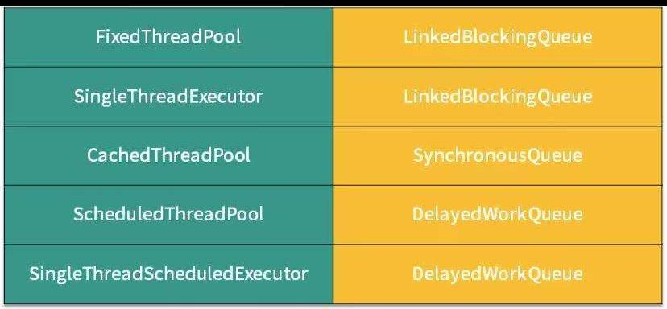
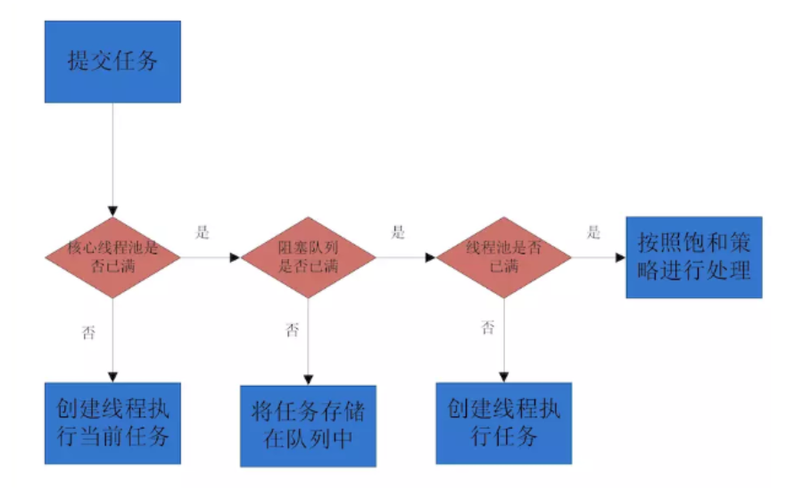

# 线程池

## 优点

>  第一：**降低资源消耗**。通过**重复利用已创建的线程**降低线程创建和销毁造成的消耗。
>  第二：**提高响应速度**。当任务到达时，任务可以**不需要等到线程创建**就能立即执行。
>  第三：**提高线程的可管理性**。线程是稀缺资源，如果无限制地创建，不仅会消耗系统资源，
>  还会降低系统的稳定性，使用线程池可以进行统一分配、调优和监控。

## 属性

| **corePoolSize**    | 核心池的大小。 当有任务来之后，就会创建一个线程去执行任务，当线程池中的线程数目达到corePoolSize后，就会把到达的任务放到缓存队列当中 |
| ------------------- | ------------------------------------------------------------ |
| **maximumPoolSize** | 线程池最大线程数，它表示在线程池中最多能创建多少个线程；     |
| keepAliveTime       | 表示线程没有任务执行时最多保持多久时间会终止                 |
| unit                | 参数keepAliveTime的时间单位，有7种取值，在TimeUnit类中有7种静态属性 |
| **ThreadFactory**   | 线程工厂，用户生产线程执行任务。默认线程工厂创建的线程属于同一线程组，优先级一样，非守护线程。也可以自定义线程工厂，定制不同线程名。 |
| **workQueue**       | 阻塞队列                                                     |
| **handle**          | 任务拒绝策略                                                 |

## 拒绝策略

> ==拒绝时机==
>
> 调用线程shutDown方法  / 线程池没有能力处理新提交的任务  ，会拒绝任务。
>
> ==拒绝策略==
>
> | **AbortPolicy**         | 丢弃任务并**抛出RejectedExecutionException异常**。用户可以感知然后自己处理。 |
> | ----------------------- | ------------------------------------------------------------ |
> | **DiscardPolicy**       | **丢弃任务，**静默丢弃，不通知。容易数据丢失                 |
> | **DiscardOldestPolicy** | **丢弃队列头节点，通常是存活时间最长的**，这样可以腾出空间给新的任务。也存在数据丢失风险 |
> | **CallerRunsPolicy**    | 1、任务**交与提交任务的线程执行。谁提交任务，谁来执行**。这样新提交的任务不会丢失，**不会造成业务丢失**。<br>2、提交任务执行时，是比较耗时的，此线程被占用之后，后续不会有新的线程提交。然后线程池中任务也可以趁机消耗，相当于给了线程池缓冲 |

## 分类

| newCachedThreadPool       | 创建一个可缓存线程池，**如果线程池长度超过处理需要，可灵活回收空闲线程**，若无可回收，则新建线程。**线程池为无限大（最大线程2^31 - 1 基本无限大），当执行第二个任务时第一个任务已经完成，会复用执行第一个任务的线程，而不用每次新建线程。**核心线程0<br>==（线程数无限，不需要任务队列存储任务）== |
| ------------------------- | ------------------------------------------------------------ |
| newFixedThreadPool        | 创建一个定长线程池（核心线程和最大线程数一样），可控制线程最大并发数，**超出的线程会在队列中等待**。不需要考虑线程回收<br/>==（任务队列容量无限）== |
| newScheduledThreadPool    | 创建一个定长线程池，支持**定时及周期性任务执行**。<br/>**.schedule**，延时指定时间执行<br/>**.scheduleAtFixedRate:**延时指定时间后，以固定频率执行。时间点一到就执行。<br/>**.scheduleWithFixedDeley:**类似上一个，但是是任务执行完毕的时间点为下一次执行任务的时间点。 |
| newSingleThreadExecutor   | 创建一个单线程化的线程池，它只会用唯一的工作线程来执行任务，保证所有任务按照指定顺序(FIFO, LIFO, 优先级)执行。 |
| singleScheduledThreadPool | 类似**newScheduledThreadPool** 只有一个线程                  |
| ForkJoinPool              | jdk7加入  非斐波那契数列  0 1 1 2 3 5 8 13 21 34 <br/>采取分裂-》 汇总的 模式来执行任务。（每个线程都有自己的双端队列来存储自己分裂的子任务）<br/>工作队列的线程会分裂多个子任务，存储在自己的双端队列中deque。这样线程可以直接在自己的任务队列中获取处理，较少线程竞争。<br/>第二，如果线程1任务繁重，分裂多个子线程。（线程1双端队列中，获取任务是LIFO 后进先出）， 而任务2空闲，线程2会偷取线程1的任务来执行（线程2双端队列中，获取任务是FIFO 先进先出），可以很好的平衡负载。这种模式叫'work-stealing' |

## 如何选择



**功能**

第 1 个需要考虑的就是功能层面，比如是否需要阻塞队列帮我们排序，如**优先级排序、延迟执行等。如果有这个需要，我们就必须选择类似于 PriorityBlockingQueue 之类的有排序能力的阻塞队列。**
**容量**

第 2 个需要考虑的是容量，或者说是否有存储的要求，还是只需要“直接传递”。在考虑这一点的时候，我们知道前面介绍的那几种阻塞队列，有的是容量固定的，如 ArrayBlockingQueue；有的默认是容量无限的，如 LinkedBlockingQueue；而有的里面没有任何容量，如 SynchronousQueue；而对于 DelayQueue 而言，它的容量固定就是 Integer.MAX_VALUE。

所以不同阻塞队列的容量是千差万别的，我们需要根据任务数量来推算出合适的容量，从而去选取合适的 BlockingQueue。
**能否扩容**

第 3 个需要考虑的是能否扩容。因为有时我们并不能在初始的时候很好的准确估计队列的大小，因为业务可能有高峰期、低谷期。

如果一开始就固定一个容量，可能无法应对所有的情况，也是不合适的，有可能需要动态扩容。如果我们需要动态扩容的话，那么就不能选择 ArrayBlockingQueue ，因为它的容量在创建时就确定了，无法扩容。相反，PriorityBlockingQueue 即使在指定了初始容量之后，后续如果有需要，也可以自动扩容。

所以我们可以根据是否需要扩容来选取合适的队列。
**内存结构**

第 4 个需要考虑的点就是内存结构。在上一课时我们分析过 ArrayBlockingQueue 的源码，看到了它的内部结构是“数组”的形式。

和它不同的是，LinkedBlockingQueue 的内部是用链表实现的，所以这里就需要我们考虑到，ArrayBlockingQueue 没有链表所需要的“节点”，空间利用率更高。所以如果我们对性能有要求可以从内存的结构角度去考虑这个问题。
**性能**

第 5 点就是从性能的角度去考虑。比如 LinkedBlockingQueue 由于拥有两把锁，它的操作粒度更细，在并发程度高的时候，相对于只有一把锁的 ArrayBlockingQueue 性能会更好。

另外，SynchronousQueue 性能往往优于其他实现，因为它只需要“直接传递”，而不需要存储的过程。如果我们的场景需要直接传递的话，可以优先考虑 SynchronousQueue

## 阻塞队列

DelayedWorkQueue:内部元素按照延迟的时间长短对任务排序，采用堆的数据结构

## 线程池原理

提交一个任务到线程池中，线程池的处理流程如下：

1、判断线程池里的核心线程是否都在执行任务，如果不是（核心线程空闲或者还有核心线程没有被创建）则创建一个新的工作线程来执行任务。如果核心线程都在执行任务，则进入下个流程。

2、线程池判断工作队列是否已满，如果工作队列没有满，则将新提交的任务存储在这个工作队列里。如果工作队列满了，则进入下个流程。

3、判断线程池里的线程是否都处于工作状态，如果没有，则创建一个新的工作线程来执行任务。如果已经满了，则交给饱和策略来处理这个任务。



## 配置线程池

CPU密集型时，任务可以少配置线程数，大概是机器的cpu核数1~2倍，这样可以使得每个线程都在执行任务

IO密集型时，大部分线程都阻塞，故需要多配置线程数，2*cpu核数（**<u>推荐计算方法 线程数 = CPU核心数 * (1+平均等待时间/平均工作时间)）</u>**

某些进程花费了**绝大多数时间在计算上**、压缩、解密、加密等，而其他则在**等待I/O上**花费了大多是时间，如数据库、文件读写、网络通信，

前者称为计算密集型（CPU密集型）computer-bound，后者称为I/O密集型，I/O-bound。

```markdown
注：IO密集型（某大厂实践经验）
       核心线程数 = CPU核数 / （1-阻塞系数）
或着
CPU密集型：核心线程数 = CPU核数 + 1
IO密集型：核心线程数 = CPU核数 * 2

```


ThreadPoolTaskExecutor 配置 

```java
//获取当前机器的核数
public static final int cpuNum = Runtime.getRuntime().availableProcessors();

@Override
    public Executor getAsyncExecutor() {
        ThreadPoolTaskExecutor taskExecutor = new ThreadPoolTaskExecutor();
        taskExecutor.setCorePoolSize(cpuNum);//核心线程大小
        taskExecutor.setMaxPoolSize(cpuNum * 2);//最大线程大小
        taskExecutor.setQueueCapacity(500);//队列最大容量
        //当提交的任务个数大于QueueCapacity，就需要设置该参数，但spring提供的都不太满足业务场景，可以自定义一个，也可以注意不要超过QueueCapacity即可
        taskExecutor.setRejectedExecutionHandler(new ThreadPoolExecutor.CallerRunsPolicy());
        taskExecutor.setWaitForTasksToCompleteOnShutdown(true); //任务全部结束 关闭线程池
        taskExecutor.setAwaitTerminationSeconds(60);
        taskExecutor.setThreadNamePrefix("BCarLogo-Thread-");
        taskExecutor.initialize();
        return taskExecutor;
    }


```

## 关闭线程池

**shutDown()**:不接受新任务提交，但是线程池中和工作队列中可能存在正在执行的任务。

**isShutDown()**:返回true不代表已经彻底关闭，仅代表开始了关闭的流程。但是线程池中和工作队列中可能存在正在执行的任务。

**isTerminated()：**线程池关闭，内部为空，为true,否则为false.

**awaitTermination(10, TimeUnit.SECONDS)**:判断线程池状态，调用之后等待一段时间，在此期间内，线程池关闭，内部为空返回true，否则超时返回false。

等待期间线程被中断，返回InterrupterException异常。

**shutDownNow()**:立即关闭，给线程池中线程发送中断信号，尝试中断（有可能不会中断，所有编写的代码需要有响应中断信号的功能），将任务队列中的正在等待的任务转移到List中 返回，便于根据返回结果做出补救措施（记录重试）。

```java
 public List<Runnable> shutdownNow() {
        List<Runnable> tasks;
        final ReentrantLock mainLock = this.mainLock;
        mainLock.lock();
        try {
            checkShutdownAccess();
            advanceRunState(STOP);
            interruptWorkers();
            tasks = drainQueue();
        } finally {
            mainLock.unlock();
        }
        tryTerminate();
        return tasks;
    }
```


## 线程池复用原理

execute - > addworker -> worker.runWorker(这里实现复用)

```java
 public void execute(Runnable command) {
        if (command == null)
            throw new NullPointerException();
   
        int c = ctl.get();
        if (workerCountOf(c) < corePoolSize) { // 小于 核心线程数  添加线程
            if (addWorker(command, true))
                return;
            c = ctl.get();
        }
        if (isRunning(c) && workQueue.offer(command)) { //大于核心线程数 ，线程池运行正常  添加线程至工作队列
            int recheck = ctl.get();
            if (! isRunning(recheck) && remove(command)) // 如果非运行 移除任务 执行拒绝策略
                reject(command);
            else if (workerCountOf(recheck) == 0)  // 否正 可能线程被回收或者意外终止 ，需要重新添加线程
                addWorker(null, false);
        }
        else if (!addWorker(command, false)) //  addWorker 第二个参数 true 代表比对核心线程数  false 比对最大线程数
            reject(command);
    }
```

```java
private boolean addWorker(Runnable firstTask, boolean core) {
        retry:
        for (;;) {
            int c = ctl.get();
            int rs = runStateOf(c);

            // Check if queue empty only if necessary.
            if (rs >= SHUTDOWN &&
                ! (rs == SHUTDOWN &&
                   firstTask == null &&
                   ! workQueue.isEmpty()))
                return false;

            for (;;) {
                int wc = workerCountOf(c);
                if (wc >= CAPACITY ||
                    wc >= (core ? corePoolSize : maximumPoolSize)) // 判断跟核心还是最大比较
                    return false;
                if (compareAndIncrementWorkerCount(c))
                    break retry;
                c = ctl.get();  // Re-read ctl
                if (runStateOf(c) != rs)
                    continue retry;
                // else CAS failed due to workerCount change; retry inner loop
            }
        }

        boolean workerStarted = false;
        boolean workerAdded = false;
        Worker w = null;
        try {
            w = new Worker(firstTask);
            final Thread t = w.thread;
            if (t != null) {
                final ReentrantLock mainLock = this.mainLock;
                mainLock.lock();
                try {
                    // Recheck while holding lock.
                    // Back out on ThreadFactory failure or if
                    // shut down before lock acquired.
                    int rs = runStateOf(ctl.get());

                    if (rs < SHUTDOWN ||
                        (rs == SHUTDOWN && firstTask == null)) {
                        if (t.isAlive()) // precheck that t is startable
                            throw new IllegalThreadStateException();
                        workers.add(w);
                        int s = workers.size();
                        if (s > largestPoolSize)
                            largestPoolSize = s;
                        workerAdded = true;
                    }
                } finally {
                    mainLock.unlock();
                }
                if (workerAdded) {
                    t.start(); // worker具体执行 见下
                    workerStarted = true;
                }
            }
        } finally {
            if (! workerStarted)
                addWorkerFailed(w);
        }
        return workerStarted;
    }
```

```java
final void runWorker(Worker w) { /
        Thread wt = Thread.currentThread();
        Runnable task = w.firstTask;
        w.firstTask = null;
        w.unlock(); // allow interrupts
        boolean completedAbruptly = true;
        try {
            while (task != null || (task = getTask()) != null) { // 这里 通过循环 来获取任务 而不是新建线程
                w.lock();
                // If pool is stopping, ensure thread is interrupted;
                // if not, ensure thread is not interrupted.  This
                // requires a recheck in second case to deal with
                // shutdownNow race while clearing interrupt
                if ((runStateAtLeast(ctl.get(), STOP) ||
                     (Thread.interrupted() &&
                      runStateAtLeast(ctl.get(), STOP))) &&
                    !wt.isInterrupted())
                    wt.interrupt();
                try {
                    beforeExecute(wt, task);
                    Throwable thrown = null;
                    try {
                        task.run();
                    } catch (RuntimeException x) {
                        thrown = x; throw x;
                    } catch (Error x) {
                        thrown = x; throw x;
                    } catch (Throwable x) {
                        thrown = x; throw new Error(x);
                    } finally {
                        afterExecute(task, thrown);
                    }
                } finally {
                    task = null;
                    w.completedTasks++;
                    w.unlock();
                }
            }
            completedAbruptly = false;
        } finally {
            processWorkerExit(w, completedAbruptly);
        }
    }
```


