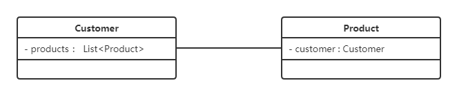
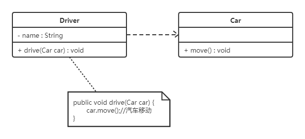

# 设计模式

## 描述

> 设计模式(Design Pattern)是一套被反复使用、多数人知晓的、经过分类编目的、代码设计经验的总结，使用设计模式是为了可重用代码、让代码更容易被他人理解并且保证代码可靠性。
>
> 

## UML

### 类的表示方式 

在UML类图中，类使用包含类名、属性(field) 和方法(method) 且带有分割线的矩形来表示，比如下图表示一个Employee类，它包含name,age和address这3个属性，以及work()方法。 

属性/方法名称前加的加号和减号表示了这个属性/方法的可见性，UML类图中表示可见性的符号有三种：

* +：表示public

* -：表示private

* #：表示protected

属性的完整表示方式是： **可见性  名称 ：类型 [ = 缺省值]**  

方法的完整表示方式是： **可见性  名称(参数列表) [ ： 返回类型]**

> 注意：
>
> ​	1，中括号中的内容表示是可选的
>
> ​	2，也有将类型放在变量名前面，返回值类型放在方法名前面

**举个栗子：**

上图Demo类定义了三个方法：

* method()方法：修饰符为public，没有参数，没有返回值。
* method1()方法：修饰符为private，没有参数，返回值类型为String。
* method2()方法：修饰符为protected，接收两个参数，第一个参数类型为int，第二个参数类型为String，返回值类型是int。

### 类与类之间关系的表示方式

####  关联关系

关联关系是对象之间的一种引用关系，用于表示一类对象与另一类对象之间的联系，如老师和学生、师傅和徒弟、丈夫和妻子等。关联关系是类与类之间最常用的一种关系，分为一般关联关系、聚合关系和组合关系。我们先介绍一般关联。

关联又可以分为单向关联，双向关联，自关联。

**1，单向关联**

在UML类图中单向关联用一个带箭头的实线表示。上图表示每个顾客都有一个地址，这通过让Customer类持有一个类型为Address的成员变量类实现。

**2，双向关联**

从上图中我们很容易看出，所谓的双向关联就是双方各自持有对方类型的成员变量。

在UML类图中，双向关联用一个不带箭头的直线表示。上图中在Customer类中维护一个List\<Product>，表示一个顾客可以购买多个商品；在Product类中维护一个Customer类型的成员变量表示这个产品被哪个顾客所购买。

**3，自关联**

自关联在UML类图中用一个带有箭头且指向自身的线表示。上图的意思就是Node类包含类型为Node的成员变量，也就是“自己包含自己”。

#### 聚合关系

聚合关系是关联关系的一种，是强关联关系，是整体和部分之间的关系。

聚合关系也是通过成员对象来实现的，其中成员对象是整体对象的一部分，但是成员对象可以脱离整体对象而独立存在。例如，学校与老师的关系，学校包含老师，但如果学校停办了，老师依然存在。

在 UML 类图中，聚合关系可以用带空心菱形的实线来表示，菱形指向整体。下图所示是大学和教师的关系图：

#### 组合关系

组合表示类之间的整体与部分的关系，但它是一种更强烈的聚合关系。

在组合关系中，整体对象可以控制部分对象的生命周期，一旦整体对象不存在，部分对象也将不存在，部分对象不能脱离整体对象而存在。例如，头和嘴的关系，没有了头，嘴也就不存在了。

在 UML 类图中，组合关系用带实心菱形的实线来表示，菱形指向整体。下图所示是头和嘴的关系图：

#### 依赖关系

依赖关系是一种使用关系，它是对象之间耦合度最弱的一种关联方式，是临时性的关联。在代码中，某个类的方法通过局部变量、方法的参数或者对静态方法的调用来访问另一个类（被依赖类）中的某些方法来完成一些职责。

在 UML 类图中，依赖关系使用带箭头的虚线来表示，箭头从使用类指向被依赖的类。下图所示是司机和汽车的关系图，司机驾驶汽车：

#### 继承关系

继承关系是对象之间耦合度最大的一种关系，表示一般与特殊的关系，是父类与子类之间的关系，是一种继承关系。

在 UML 类图中，泛化关系用带空心三角箭头的实线来表示，箭头从子类指向父类。在代码实现时，使用面向对象的继承机制来实现泛化关系。例如，Student 类和 Teacher 类都是 Person 类的子类，其类图如下图所示：

#### 实现关系

实现关系是接口与实现类之间的关系。在这种关系中，类实现了接口，类中的操作实现了接口中所声明的所有的抽象操作。

在 UML 类图中，实现关系使用带空心三角箭头的虚线来表示，箭头从实现类指向接口。例如，汽车和船实现了交通工具，其类图如图 9 所示。

## 设计原则

| 单一职责原则   | 就一个类而言，应该仅有一个引起它变化的原因。`简单来说职责需要单一` |
| -------------- | ------------------------------------------------------------ |
| `开放封闭原则` | 软件实体支持扩展，不支持修改。`简单来说对扩展开放，对修改关闭`   这种就需要对变化的地方进行一定的抽象。这个原则非常重要，使用恰当可以应对业务的不断变化。 |
| 依赖倒转原则   | A、抽象不依赖于细节，细节依赖于抽象。 B、高层模块不应该依赖于底层模块，而应该依赖于抽象 `简单来说就是针对接口编程，而不是实现编程。`可插拔的思想,就是我们实际三层架构  controller 不是直接调用serviceImpl，而是调用了service接口 |
| 里式代换原则   | 自类必须能够完全替换它们的父类型，`简单来说就是子类替换掉父类后，软件功能不受影响，父类才算真正的被复用。而子类也可以在父类的基础上增加新的行为` 正是由于里式代换原则，才印证了开放封闭原则，对扩展开放，修改关闭，才使得依赖倒转原则有了意义。 |
| 迪米特法则     | 如果两个类不必彼此直接通信，那么就不应该发生直接的相互作用。如果其中的一个类需要需要调用另一个类的方法时，可以通过第三者转发这个调用。`强调类之间的松耦合` |

## 设计模式

### 装饰模式decorator

> 动态的给对象增加一些额外的职责，比生成子类更加灵活。
>
> 1、并不需要严格意义上按照此方式来设置抽象，添加实现。
>
> 2、装饰的本质是在原有对象调用的基础上(可以理解为父类)，(子类)增加新的功能。`装饰类是需要包装它所要装饰的对象`，装饰类可以有多个，这样执行特殊行为时，就可以有需要的、按顺序对装饰对象进行装饰。
>
> 3、比如主类中增加新的字段、新的方法、新的逻辑，而这些加入都是特殊情况下才会执行。

### 代理模式proxy

> 为其他对象提供一种代理以控制对这个对象的访问。`简单来说就是实现了和被代理对象一样的方法(因为有同一个父类)，并且在代理类中注入了被代理对象的引用，来进行调用。`

### 简单工厂和工厂方法模式

> 简单工厂，通过工厂生产需要的类对象。里面包含了判断原则，**不符合开闭原则**。
>
> 工厂方法模式：定义了一个用于创建对象 的接口(也就是抽象工厂的子类)，由子类来决定具体实例化哪一个类。`实际上就是将原本类对象的创建过程延申到抽象工厂的子类中`。

### 原型模式prototype

> 用原型实例指定对象创建对象的种类，并且通过拷贝这些原型对象创建新的对象。**简单来说就是浅拷贝、深拷贝。**

### 模板方法模式

> 定义一个操作过程中算法的骨架，并且将一些步骤延迟到子类中进行实现。`简单来说就是在不改变一个算法的结构基础上，重新定义该算法的某些步骤`

### 外观模式Facade（门面）

> 为子系统一组接口提供一个统一的界面，此模式定义了一个高层的接口，这个接口使得子系统更加容易使用。`简单来说就是子系统的接口调用各有各的实现，抽象一个统一的接口来组合这些子系统的实现。前提是需要门面类需要注入这些子系统的实现。`

### 建造者模式builder

> 将一个复杂对象的构建与它的表示分离，`使得同样的构建过程可以创建不同的表示。`

### 观察者模式observer

> 定义了一种一对多的依赖关系，让多个观察者对象同时监听某一个主题的对象。当这个主题对象的状态发生变化时，会通知所有观察者对象，使得他们能够主动更新自家。
>
> `简单来说就是主题类注入了多个观察者对象，当主题子类状态发生变化时，主动通知所有观察者进行更新操作。当然观察者在构造时也需要具体主题的引用，方便状态的获取。`

### 抽象工厂模式abstract factory

> 提供了一个创建一系列相关或相互依赖对象的接口，而无需指定他们具体的实现类。

### 状态模式state

### 适配器模式Adapter

> 将一个类的接口转换成客户希望的另一个接口。`简单来说就是套了个壳，实际调用方式还是使用原本的目标接口实现类。`

### 备忘录模式memento

> 不破坏封装性的前提下，捕获一个对象的内部状态，并在**该对象之外保存这个状态**。这样以便能后续将该对象的状态恢复。
>
> `简单来说就是在需要保存初始状态的对象里，设置保存状态的方式以及恢复状态的方式。这个保存状态其实是构造一个备忘录对象，返回之后，交由管理者管理。到时候该对象状态恢复的时候，也从该管理者这边获取之前存的备忘录。`

### 组合模式composite

> 将对象组合成树形结构来表示‘部分-整体’的层次结构。**主要使得用户对单个对象和组合对象的使用具有一致性。**
>
> `简单来说对于单个对象leaf或者composite组合对象，它们的处理方式一致，通过组合对象的操作可以将所有的子类构造为树状的对象结构。`

### 命令模式command

> 将一个请求封装为一个对象，从而使你可用不同的请求(对象)对客户参数化；支持对请求排队或记录日志，以及可撤销的操作。
>
> 对客户参数化：可以简单理解为，请求是相对来说简单的动作，但是对象化后，这个请求操作整体就可以丰富起来，可以通过对象的属性法来丰富这个请求，也就是参数化。
>
> 简单来说，命令模式是对简单动作的丰富，Invoker执行命令的请求，拥有实际的命令对象，它的执行 最终落到 实际命令对象身上，而命令执行的最终却是落到receiver身上。可以看到这是个动作的延申。

### 中介者模式mediator

> 用一个中介者对象来封装一系列的对象交互。中介者使得各个对象不需要显式的相互引用，而使其耦合松散，而且可以独立的改变它们之间的交互。
>
> `简单来说，中介者需要注入交互对象，交互对象也需要注入中介者对象，在交互对象调用的时候，实际上是将自身注入至中介者，由中介者来进行交互对象的方法调用。`

