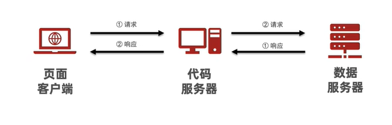
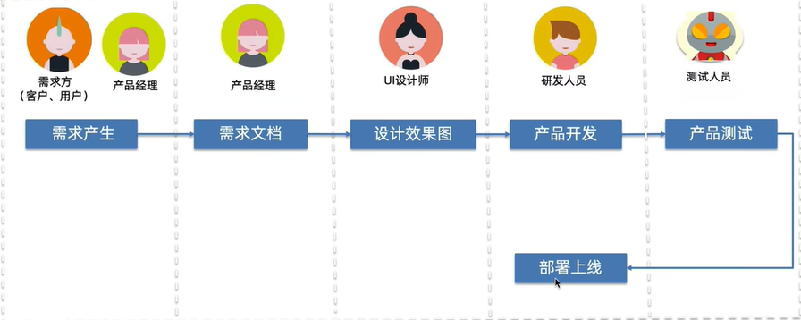

# 资料

关注学习路线/技能树/相关学习视频[软件测试全套教程，软件测试自学线路图-CSDN博客](https://blog.csdn.net/itcast_cn/article/details/80969185?ops_request_misc=%7B%22request%5Fid%22%3A%22169882156416800225567201%22%2C%22scm%22%3A%2220140713.130102334.pc%5Fall.%22%7D&request_id=169882156416800225567201&biz_id=0&utm_medium=distribute.pc_search_result.none-task-blog-2~all~first_rank_ecpm_v1~hot_rank-4-80969185-null-null.142^v96^pc_search_result_base2&utm_term=软件测试&spm=1018.2226.3001.4187)

关注学习阶段掌握内容/简历内容[想自学软件测试？一般人我还是劝你算了吧。。。_自动化软件测试的博客-CSDN博客](https://blog.csdn.net/m0_53918927/article/details/125278193?ops_request_misc=%7B%22request%5Fid%22%3A%22169882158116800182725207%22%2C%22scm%22%3A%2220140713.130102334.pc%5Fall.%22%7D&request_id=169882158116800182725207&biz_id=0&utm_medium=distribute.pc_search_result.none-task-blog-2~all~first_rank_ecpm_v1~times_rank-6-125278193-null-null.142^v96^pc_search_result_base2&utm_term=软件测试&spm=1018.2226.3001.4187)

[应聘软件测试岗位需要掌握的基础知识与技能（面试常考内容）_面试工作软件测试工程师考核哪些内容-CSDN博客](https://blog.csdn.net/chenlycly/article/details/124557409?ops_request_misc=%7B%22request%5Fid%22%3A%22169882158116800182725207%22%2C%22scm%22%3A%2220140713.130102334.pc%5Fall.%22%7D&request_id=169882158116800182725207&biz_id=0&utm_medium=distribute.pc_search_result.none-task-blog-2~all~first_rank_ecpm_v1~times_rank-8-124557409-null-null.142^v96^pc_search_result_base2&utm_term=软件测试&spm=1018.2226.3001.4187)

[2022年，软件测试怎么样？_2022年软件测试人才市场-CSDN博客](https://blog.csdn.net/xfw17397388089/article/details/127821104?ops_request_misc=%7B%22request%5Fid%22%3A%22169882158116800182725207%22%2C%22scm%22%3A%2220140713.130102334.pc%5Fall.%22%7D&request_id=169882158116800182725207&biz_id=0&utm_medium=distribute.pc_search_result.none-task-blog-2~all~first_rank_ecpm_v1~times_rank-16-127821104-null-null.142^v96^pc_search_result_base2&utm_term=软件测试&spm=1018.2226.3001.4187)

# 工具

# 职业规划

> **管理**
>
> 测试组长=》测试主管=》测试经理=》测试负责人=》总监
>
> **技术**
>
> 手工测试=》自动化测试=》测试开发=》测试架构=》测试专家

# 软件测试

## 描述

> 查找软件问题，保障软件质量。
>
> ==使用技术手段验证软件是否符合使用需求==

## 功能测试

### 测试基础

#### 软件定义

> ==软件定义==
>
> 控制计算机硬件工作的工具
>
> ==软件测试==
>
> 使用技术手段验证软件是否符合使用需求
>
> ==软件测试目的==
>
> 减少软件bug（缺陷），保障软件质量。

#### 软件组成

#### 软件生产过程

### 如何测试

### 缺陷管理

### 项目实战

