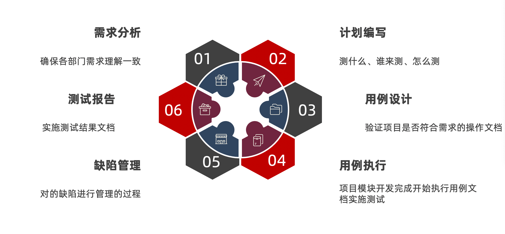
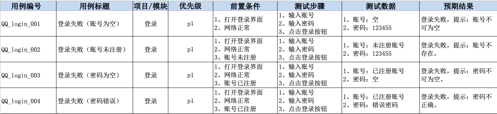
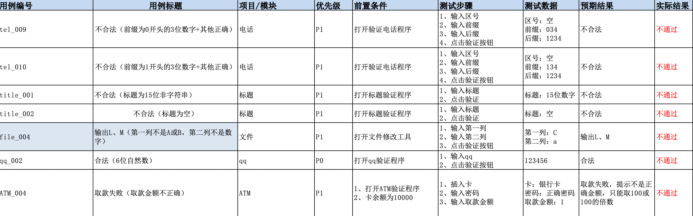
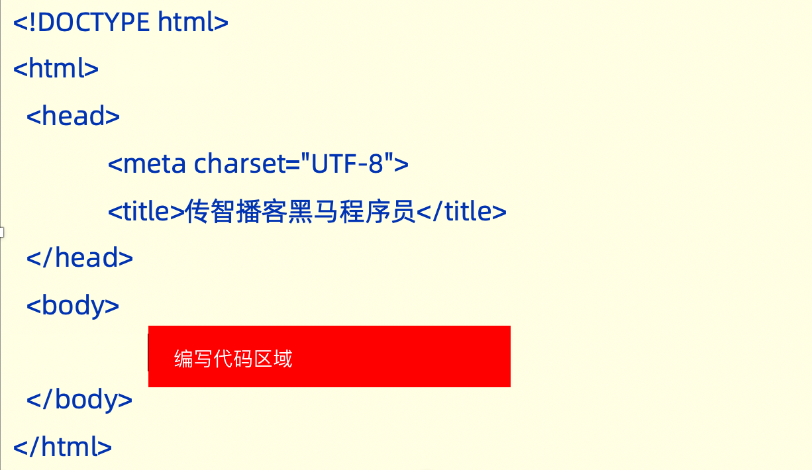

# 基础理论

## 测试理论

### 阶段目标

- 能独立针对web项目实施功能测试

---

### 一、测试介绍

- 什么是软件测试？

  ```
  使用技术手段验证软件是否满足需求
  ```

- 测试主流技能

  ```
  1、功能测试
  2、自动化测试
  3、接口测试
  4、性能测试
  
  主流方向建议：
  	1、功能测试+接口测试 
  	2、自动化测试+接口
  	3、功能+性能
  ```

### 二、测试常用分类

- 分类
  - 阶段划分（阶段：软件产出过程顺序）
  - 代码可见度

#### 2.1 阶段划分

- 单元测试
  - 说明：针对程序源代码进行测试（单元：最小独立功能代码段）
  - 提示：
    - 1、国内单元测试一般开发自测
    - 2、单元测试可以解决-快速定位缺陷
    - 3、提高测试执行效率
- 集成测试
  - 说明：针对单元与单元之间的接口进行测试
  - 提示：又称接口测试。
- 系统测试
  - 说明：针对系统整体功能+兼容+文档（说明、安装文档）
- 验收测试
  - 内测：公司内部人员使用，发觉缺陷并修复。
  - 公测：让用户帮忙测试
  - 提示：验收测试,一般要根据项目类型决定是否使用。

#### 2.2 代码可见度划分

> 代码可见度：代码可见的程度上划分


```
黑盒测试：主要针对功能（阶段划分->系统测试）
灰盒测试：针对接口测试（阶段划分->集成测试）
白盒测试：针对程序源代码进行测试（阶段划分->单元测试）
```

#### 2.3 总结

```
系统测试和黑盒测试重点核心是功能测试
集成测试和灰盒测试又称接口测试 
单元测试和白盒测试是对代码进行测试
自动化测试归属功能测试
性能测试、安全测试归属专项测试s
```

### 三、模型

- 角度

  ```
  1、质量模型
  2、测试模型
  ```

#### 3.1 质量模型

> 说明：质量模型能告诉我们，测试时应该考虑的方面


```
重点：功能、性能、兼容、易用性、安全
结论：无论测试硬件或软件，都应该从以上几点来进行分类验证
```

### 四、测试流程



- 需求分析（评审）

  ```
  前提：阅读1遍需求文档，记录不明确之处。
  参与人员：前端、后端、测试、产品
  目的：
  	1、确保各部门需求理解一致
  	2、各角色对需求进行查漏补缺
  	3、了解软件有些功能
  提示：需求分析阶段->软件还未实现（刚立项）
  ```

- 测试计划

  ```
  说明：指导测试执行的文档（重要）
  测什么（目标、范围）
  谁来测（人员进度及安排）
  怎么测（测试工具、测试策略）
  ```

- 用例设计

  ```
  说明：保证能准确验证软件测试点执行的文档。
  1、分析需求
  2、提取测试点
  3、设计用例覆盖测试点
  ```

- 用例执行

  ```
  说明：实施测试
  ```

- 缺陷管理

  ```
  提交->验证->关闭
  ```

- 测试报告

  ```
  1、bug分析及统计
  2、测试中遇到的问题
  3、测试总结（本次测试中的优点和不足）
  ```

### 五、测试用例

- 用例：**用**户使用的案**例**

- 生活中的用例：

  

- 用例的作用

  ```
  1、防止漏测
  2、衡量软件是否通过的标准
  ```

- 用例模板

  

  

- 八大要素编写规范

  

- 练习案例

  ```
  微信发朋友圈
  	1、成功（1张图片） 
  	2、成功（1段文字） 
  	3、失败（内容为空）
  ```

  

- 练习评审

  黄鑫

  

  ```
  秀！🌹
  ```

  

### 六、用例设计方法

- 目标

  ```
  1、能对穷举场景设计测试点
  2、能对限定边界规则设计测试点
  3、能对多条件依赖关系进行设计测试点
  4、能对于项目业务进行设计测试点
  ```

#### 6.1 能对穷举场景设计测试点

> 穷举：无穷无尽

- 方法：等价类划分法

- 介绍：

  

- 案例1（qq程序）

  ```
  要求:6~10位自然数
  ```

  

  

- 案例2（电话）

  ```
  要求：
  1. 区号:空或者是三位数字
  2. 前缀码:非“0”且非“1”开头的三位数字
  3. 后缀码:四位数字
  ```

       

### 七、作业


## 测试方法


---

### 今天目标

```
能对穷举场景设计测试点
能对限定边界规则设计测试点
能对多条件依赖关系进行设计测试点
能对于项目业务进行设计测试点
```

### 一、解决穷举场景

> 重点：使用等价类划分法

#### 1.1 等价类划分法


```
重点：有效等价和单个无效等价各取1个即可。
步骤：
	1、明确需求
	2、确定有效和无效等价
	3、根据有效和无效造数据编写用例
```


#### 1.2 案例（qq合法验证）

> 需求：验证6~10自然数的qq合法
>
> 自然数：*自然数*由0开始，一个接一个，组成一个无穷的集体


#### 1.3 案例（城市电话验证）


```
重点：
	1、正向用例：一条尽可能覆盖多条
	2、逆向用例：每一条数据，都是一条单独用例。
```

#### 1.4 总结（应用场景）

```
针对：需要有大量数据测试输入，但是没法穷举测试的地方。 
 输入框
 下拉列表
 单选复选框
典型代表：页面的输入框类测试。
```

**友情提示：**完整的用例应该是等价类和边界值一块写。

### 二、解决边界限制问题

> 说明：使用边界值解决边界位数限制问题。2.1 边界值说明


```
提示：
	1、有关范围限制，最多7条用例（暂时未优化）
	2、边界值能解决位数限制问题，但是不能解决类型问题（要结合等价类）
```

#### 2.2 步骤

```
1、明确需求
2、确定有效和无效等价
3、确定边界范围
4、提取数据编写用例
```

#### 2.3 案例1


#### 2.4 案例2


#### 2.5 优化（7点优化5点）

> 重点：开内闭外（开区间选包含的点，闭区选不包含的点）
>
> 开区间：不包含边界上的点（没有等号）。如：a<10
>
> 闭区间：包含边界上的点（有等号）。 如:a<=10

优化策略：


#### 2.6 总结

> 强调：单个输入框，常用的方式 边界+等价类
>
> 面试题：最常用的用例设计方法有哪些？--等价类、边界值

```
在等价类的基础上针对有边界范围的测试数据输入的地方(重点关注边界) 
常见词语描述:大小、尺寸、重量、最大、最小、至多、至少等修饰词语 
典型代表:有边界范围的输入框类测试
```

### 三、解决多条件有依赖关系测试

> 重点：使用判定表

#### 3.1 介绍


#### 3.2 步骤

```
1、明确需求
2、画出判定表
 	1）、列出条件桩和动作桩 
 	2）、填写条件项，对条件进行全组合 
 	3）、根据条件项的组合确定动作项 
 	4）、简化、合并相似规则(有相同的动作)
3、根据规则编写测试用例
```

#### 3.3 案例（订单）

- 需求

  

- 判定表

  

- 用例

  

#### 3.4 练习（文件修改）

- 需求

  

- 判定表

  

- 用例

  

#### 3.5 判定表总结


```
提示：
	1、多条件之间有依赖关系，使用判定表来进行测试覆盖。
	2、判定表一般适合4个以内条件依赖关系
	3、如果条件超过4个，就不适合覆盖所有条件，应采用（正交法）来解决。
```

### 四、业务测试覆盖

>  重点:
>
>  ​	1、覆盖业务测试,需要使用流程图法
>
>  ​	2、先测试业务，在测试单功能、单模块、单页面

#### 4.1 流程图

>  提示:业务用例是根据流程图来梳理的,需要先了解流程图


```
作用:梳理业务用例
```

练习流程图工具：

```
1、线上工具：https://processon.com/diagraming/605880af07912927bd71c388
2、离线工具：visio
3、其他工具：Excel
```

#### 4.2 案例（ATM）

- 流程图

  

  

- 用例

  

### 五、错误推荐法

> 应用场景：当项目用例都执行完毕，且BUG修复完成，离上线还有一段时间，在这段时间中可是使用错误推荐法复测主要业务或测试未覆盖的功能。


### 六、作业


## 缺陷管理

### 今天目标

- 执行用例（课上案例编写的用例）

- 缺陷相关知识

  ```
  能够说出软件缺陷判定标准
  能够说出项目中缺陷的管理流程
  能够使用Excel对于缺陷进行管理
  能使用工具管理缺陷
  ```

---

### 一、用例执行

> 说明：执行结果与用例的期望结果不一致（含义），为缺陷。


- 执行失败的用例



```
提示：用例执行不通过为缺陷，需要进行缺陷管理
```

### 二、缺陷

#### 2.1 定义

```
软件中存在的各种问题，都为缺陷，简称bug；
```

#### 2.2 缺陷标准

```
1、少功能
2、功能错误
3、多功能
4、缺少隐性功能
5、易用性（软件测试人员专业角度）
```

#### 3.3 缺陷产生的原因

```
1、需求文档
2、架构设计
3、编码实现
4、环境（硬件、软件）
```

#### 3.4 缺陷的生命周期


```
1、回归测试：
	①常规项目回归：项目本次发布新增2个模块，最基本要测新增模块功能及新增模块关联的旧模块。
	②非常规项目（银行、部队、航天）：新增功能，必须全部复测。
2、回归bug：上一个版本发现的缺陷，开发修复完毕，在下个版本进行重新验证。
```

#### 3.5 缺陷核心要素


#### 3.6 缺陷提交要素


#### 3.7 缺陷类型

```
1、功能错误
2、UI页面错误
3、兼容性
4、数据（数据库）
5、易用性
6、建议
7、架构缺陷
```

----

- 工作流程（小结）

```
设计用例->执行用例（执行测试）->缺陷（提交、验证、关闭）
缺陷定义：任何问题（Bug）
缺陷标准：多功能、少功能、错误、缺少隐性功能、易用性
描述缺陷重点：缺陷标题、前置条件、复现步骤、预期结果、实际结果、附件备注
提交缺陷信息：指派人、缺陷等级、修复优先级、类型、状态（统计缺陷）
```

----

### 三、缺陷管理

#### 3.1 excel示例


#### 3.2 缺陷跟踪流程


```
提示：知道测试和开发流程中涉及的工作即可。
```

#### 3.3 提交注意事项


```
面试题：发现缺陷后，首先回怎么办？--确定Bug可复现、确定是Bug。
提交时，要检查缺陷是否已存在。
```

#### 3.4 缺陷管理工具

```
1、项目管理工具-管理缺陷 (禅道、JIRA、TFS)
2、Excel管理缺陷
```

#### 3.5 禅道（项目管理工具）

- 地址：https://demo.zentao.net/user-login.html

- 特点：

  

- 使用流程图

  

- 使用禅道管理缺陷

  - 登录

  

  - 创建缺陷

  

  

  - 关闭缺陷

  

#### 3.6 缺陷标题扩展


### 作业讲解（day02）


### 今晚作业


```
将以上测试点/功能点，转为用例。
```

## HTML

### 今天目标

- 能够说出常见的html标签（10+）的作用
- 项目（登录）测试

---

### 一、html介绍

#### 1.1 前端三大核心

- html:超文本标记语言，由一套标记标签组成
- 标签：
  - 单标签：`<标签名 />`
  - 双标签:`<标签名></标签名>`
  - 属性：`描述某一特征 示例:<a 属性名="属性值">`

#### 1.2 html骨架标签

​	

```
html:根标签，所有的内容都应该放到html标签中
head：头部标签
body:身体标签（代码编写区域）
```

#### 1.3 注释

- 作用：描述的内容不会被浏览器执行
- 说明：解析程序给程序员看
- 快捷键：ctrl+/ `<!--注释区域-->`
- 测试点：`前端页面上线之前检查注释描述或去除注释`

#### 1.4 标签

- 标题：`h1~h6`

  - 说明：h1最大，h6最小

  - 示例：

    ```html
    <h1>我是h1</h1>
    <h6>我是h6</h6>
    ```

- 段落：`p`

  - 特点：语义化、独占一块（换行）

  - 示例：

    ```html
    <p>我是段落</p>
    ```

- 超链接`a`

  - 说明：`点击文本跳转到指定页面`
  - 语法：`<a href="https://www.baidu.com">文本</a>`
  - 属性：
    - href：跳转的地址或文件
    - target:打开窗口模式。`新窗口：target="_blank"`

- 图片

  - 说明：`在页面中插入一张图片`

  - 测试点：必须有title属性（悬停和未加载显示）

  - 示例

    ```html
    <!--
    			图像标签：img
    			属性：
    				src:图片路径
    				title：悬停显示文字
    				width:宽100px   px:像素
    				height:高 
    				alt:图片未加载显示
    		-->
    		
    ```

- 空格与换行

  - 空格：`&nbsp;`     `&->shift+7`
  - 换行：`<br />`

- 布局标签

  > 布局：设置页面布局，便于排版

  - 大盒子：div、独占一行
  - 小盒子：span、一行可以放多个

- 列表

  

  ```yacas
  script:js标签
  style:css标签
  link:外部加载css标签
  ```

- input标签

  - 文本框：`<input type="text" />`

  - 密码框：`<input type="password" />`

  - 单选按钮：<input type="radio">

  - 复选框：<input type="checkbox">

  - 按钮：

    - 普通：type=button

    - 提交：type=submit

    - 重置: type=reset

      ```yacas
      <!--
      				按钮测试点：统一使用value进行赋值
      			  提示：普通按钮默认没有执行效果，需要配合Js来实现。
      -->
      ```

- form标签

  - 作用：提交页面输入的数据到指定页面或后台

  ```yacas
  <!--
  			form
  				作用：将页面输入的数据提交到后台或指定页面
  				属性：
  					action：  指定将数据提交到那个页面。
  					method:提交参数的方法（get、post）
  						get:查询使用
  							1、参数url明文显示
  							2、提交速度快
  							3、提交参数有长度限制
  						post:提交数据、登录、注册
  							1、非明文显示
  							2、提交速度慢
  							3、提交参数的长度无限制
  -->
  ```

  ```html
  <form action="10-接受数据.html" method="get">
  			用户名：<input type="text" name="username"/>
  			<br />
  			密码框：<input type="password" name="password"/>
  			<br />
  			<!--
  				单选效果：
  					1、相同一组的radio才能做单选。
  					2、设置相同（组名）name属性值为一组。
  			-->
  			性别：
  			<input type="radio" name="one"/>男
  			<input type="radio" name="one"/>女
  			<br />
  			您的爱好：
  			<input type="checkbox" />挣钱
  			<input type="checkbox" />吃饭
  			<input type="checkbox" />欣赏美
  			<input type="checkbox" />个人发挥
  			<br />
  			<input type="submit" />
  			<input type="reset" />
  			<input type="button" value="点我试试"/>
  		</form>
  ```

### 二 、作业

```
登录模块设计用例
```


## 用例实战

### 今天目标

- 针对登录模块实施测试设计
- 针对发布文章模块实施测试设计

---

### 一、项目介绍

- 类型：web资讯管理平台（黑马头条）

- 子系统：

  

- 实施模块（功能测试）

  - 登录
  - 发布文章

### 二、项目实施

```
1、分析需求
2、设计测试点
3、编写用例覆盖测试点
4、执行用例
5、缺陷管理
6、测试总结
```

#### 2.1 登录

- 需求

  

- 测试点

  

- 用例（登录成功、手机号逆向）

  

- 用例（验证码逆向）

  

- 用例（兼容、布局）

  

- 滑块

  

#### 2.2 发布文章

- 需求

  

- 测试点

  

  

- 用例（发布文章）

  

  

  

  


- 上传图片

  

  

  

  # 

# 计算机基础

## 基础知识

计算机（ personal computer ）俗称电脑（ pc ），是现代一种用于高速计算的电子机器，
可以进行数值计算，又可以进行逻辑判断，还具有存储记忆功能，且能够按照程序的运行，
自动、高速处理数据。
计算机是 20 世纪最先进的科学技术发明之一。

## 计算机组成

一个完整的计算机系统，是由硬件系统和软件系统两大部分组成的。

