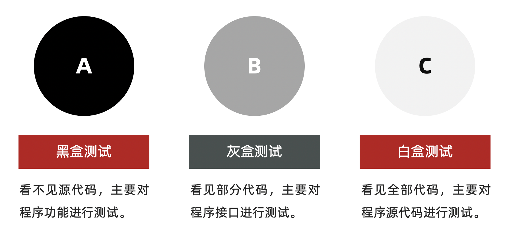
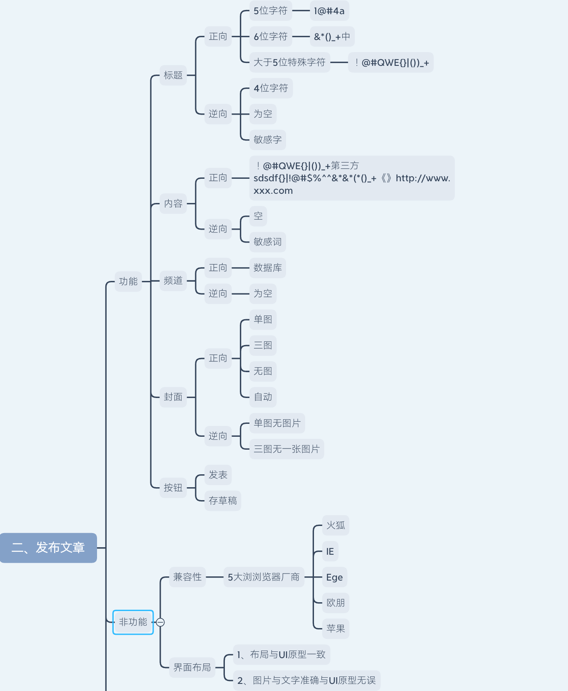
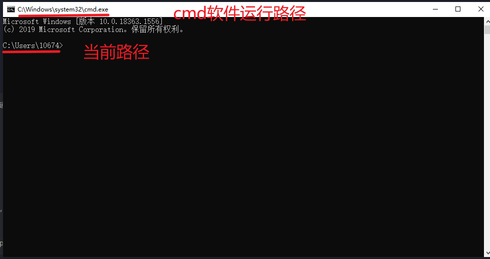
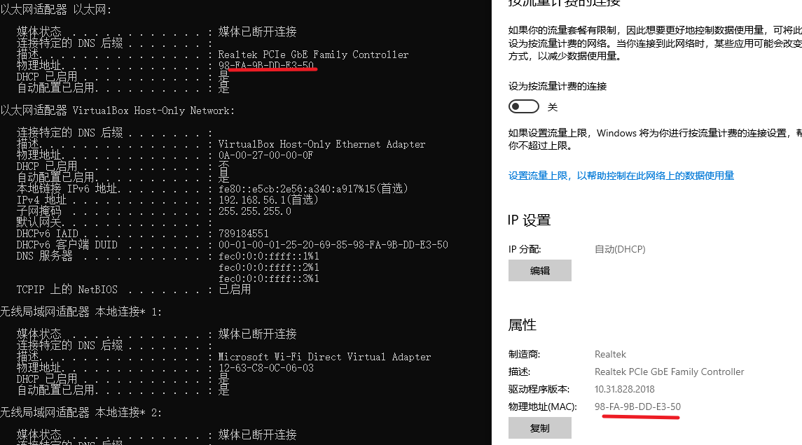

# 基础理论

## 测试理论

### 阶段目标

- 能独立针对web项目实施功能测试

---

### 一、测试介绍

- 什么是软件测试？

  ```
  使用技术手段验证软件是否满足需求
  ```

- 测试主流技能

  ```
  1、功能测试
  2、自动化测试
  3、接口测试
  4、性能测试
  
  主流方向建议：
  	1、功能测试+接口测试 
  	2、自动化测试+接口
  	3、功能+性能
  ```

### 二、测试常用分类

- 分类
  - 阶段划分（阶段：软件产出过程顺序）
  - 代码可见度

#### 2.1 阶段划分

- 单元测试
  - 说明：针对程序源代码进行测试（单元：最小独立功能代码段）
  - 提示：
    - 1、国内单元测试一般开发自测
    - 2、单元测试可以解决-快速定位缺陷
    - 3、提高测试执行效率
- 集成测试
  - 说明：针对单元与单元之间的接口进行测试
  - 提示：又称接口测试。
- 系统测试
  - 说明：针对系统整体功能+兼容+文档（说明、安装文档）
- 验收测试
  - 内测：公司内部人员使用，发觉缺陷并修复。
  - 公测：让用户帮忙测试
  - 提示：验收测试,一般要根据项目类型决定是否使用。

#### 2.2 代码可见度划分

> 代码可见度：代码可见的程度上划分



```
黑盒测试：主要针对功能（阶段划分->系统测试）
灰盒测试：针对接口测试（阶段划分->集成测试）
白盒测试：针对程序源代码进行测试（阶段划分->单元测试）
```

#### 2.3 总结

```
系统测试和黑盒测试重点核心是功能测试
集成测试和灰盒测试又称接口测试 
单元测试和白盒测试是对代码进行测试
自动化测试归属功能测试
性能测试、安全测试归属专项测试s
```

### 三、模型

- 角度

  ```
  1、质量模型
  2、测试模型
  ```

#### 3.1 质量模型

> 说明：质量模型能告诉我们，测试时应该考虑的方面


```
重点：功能、性能、兼容、易用性、安全
结论：无论测试硬件或软件，都应该从以上几点来进行分类验证
```

### 四、测试流程


- 需求分析（评审）

  ```
  前提：阅读1遍需求文档，记录不明确之处。
  参与人员：前端、后端、测试、产品
  目的：
  	1、确保各部门需求理解一致
  	2、各角色对需求进行查漏补缺
  	3、了解软件有些功能
  提示：需求分析阶段->软件还未实现（刚立项）
  ```

- 测试计划

  ```
  说明：指导测试执行的文档（重要）
  测什么（目标、范围）
  谁来测（人员进度及安排）
  怎么测（测试工具、测试策略）
  ```

- 用例设计

  ```
  说明：保证能准确验证软件测试点执行的文档。
  1、分析需求
  2、提取测试点
  3、设计用例覆盖测试点
  ```

- 用例执行

  ```
  说明：实施测试
  ```

- 缺陷管理

  ```
  提交->验证->关闭
  ```

- 测试报告

  ```
  1、bug分析及统计
  2、测试中遇到的问题
  3、测试总结（本次测试中的优点和不足）
  ```

### 五、测试用例

- 用例：**用**户使用的案**例**

- 生活中的用例：

  

- 用例的作用

  ```
  1、防止漏测
  2、衡量软件是否通过的标准
  ```

- 用例模板

  

  

- 八大要素编写规范

  

- 练习案例

  ```
  微信发朋友圈
  	1、成功（1张图片） 
  	2、成功（1段文字） 
  	3、失败（内容为空）
  ```

  

- 练习评审

  黄鑫

  

  ```
  秀！🌹
  ```

  

### 六、用例设计方法

- 目标

  ```
  1、能对穷举场景设计测试点
  2、能对限定边界规则设计测试点
  3、能对多条件依赖关系进行设计测试点
  4、能对于项目业务进行设计测试点
  ```

#### 6.1 能对穷举场景设计测试点

> 穷举：无穷无尽

- 方法：等价类划分法

- 介绍：

  

- 案例1（qq程序）

  ```
  要求:6~10位自然数
  ```

  

  

- 案例2（电话）

  ```
  要求：
  1. 区号:空或者是三位数字
  2. 前缀码:非“0”且非“1”开头的三位数字
  3. 后缀码:四位数字
  ```

       

### 七、作业


## 测试方法


---

### 今天目标

```
能对穷举场景设计测试点
能对限定边界规则设计测试点
能对多条件依赖关系进行设计测试点
能对于项目业务进行设计测试点
```

### 一、解决穷举场景

> 重点：使用等价类划分法

#### 1.1 等价类划分法


```
重点：有效等价和单个无效等价各取1个即可。
步骤：
	1、明确需求
	2、确定有效和无效等价
	3、根据有效和无效造数据编写用例
```


#### 1.2 案例（qq合法验证）

> 需求：验证6~10自然数的qq合法
>
> 自然数：*自然数*由0开始，一个接一个，组成一个无穷的集体


#### 1.3 案例（城市电话验证）


```
重点：
	1、正向用例：一条尽可能覆盖多条
	2、逆向用例：每一条数据，都是一条单独用例。
```

#### 1.4 总结（应用场景）

```
针对：需要有大量数据测试输入，但是没法穷举测试的地方。 
 输入框
 下拉列表
 单选复选框
典型代表：页面的输入框类测试。
```

**友情提示：**完整的用例应该是等价类和边界值一块写。

### 二、解决边界限制问题

> 说明：使用边界值解决边界位数限制问题。2.1 边界值说明


```
提示：
	1、有关范围限制，最多7条用例（暂时未优化）
	2、边界值能解决位数限制问题，但是不能解决类型问题（要结合等价类）
```

#### 2.2 步骤

```
1、明确需求
2、确定有效和无效等价
3、确定边界范围
4、提取数据编写用例
```

#### 2.3 案例1


#### 2.4 案例2


#### 2.5 优化（7点优化5点）

> 重点：开内闭外（开区间选包含的点，闭区选不包含的点）
>
> 开区间：不包含边界上的点（没有等号）。如：a<10
>
> 闭区间：包含边界上的点（有等号）。 如:a<=10

优化策略：


#### 2.6 总结

> 强调：单个输入框，常用的方式 边界+等价类
>
> 面试题：最常用的用例设计方法有哪些？--等价类、边界值

```
在等价类的基础上针对有边界范围的测试数据输入的地方(重点关注边界) 
常见词语描述:大小、尺寸、重量、最大、最小、至多、至少等修饰词语 
典型代表:有边界范围的输入框类测试
```

### 三、解决多条件有依赖关系测试

> 重点：使用判定表

#### 3.1 介绍


#### 3.2 步骤

```
1、明确需求
2、画出判定表
 	1）、列出条件桩和动作桩 
 	2）、填写条件项，对条件进行全组合 
 	3）、根据条件项的组合确定动作项 
 	4）、简化、合并相似规则(有相同的动作)
3、根据规则编写测试用例
```

#### 3.3 案例（订单）

- 需求

  

- 判定表

  

- 用例

  

#### 3.4 练习（文件修改）

- 需求

  

- 判定表

  

- 用例

  

#### 3.5 判定表总结


```
提示：
	1、多条件之间有依赖关系，使用判定表来进行测试覆盖。
	2、判定表一般适合4个以内条件依赖关系
	3、如果条件超过4个，就不适合覆盖所有条件，应采用（正交法）来解决。
```

### 四、业务测试覆盖

>  重点:
>
>  ​	1、覆盖业务测试,需要使用流程图法
>
>  ​	2、先测试业务，在测试单功能、单模块、单页面

#### 4.1 流程图

>  提示:业务用例是根据流程图来梳理的,需要先了解流程图


```
作用:梳理业务用例
```

练习流程图工具：

```
1、线上工具：https://processon.com/diagraming/605880af07912927bd71c388
2、离线工具：visio
3、其他工具：Excel
```

#### 4.2 案例（ATM）

- 流程图

  

  

- 用例

  

### 五、错误推荐法

> 应用场景：当项目用例都执行完毕，且BUG修复完成，离上线还有一段时间，在这段时间中可是使用错误推荐法复测主要业务或测试未覆盖的功能。


### 六、作业


## 缺陷管理

### 今天目标

- 执行用例（课上案例编写的用例）

- 缺陷相关知识

  ```
  能够说出软件缺陷判定标准
  能够说出项目中缺陷的管理流程
  能够使用Excel对于缺陷进行管理
  能使用工具管理缺陷
  ```

---

### 一、用例执行

> 说明：执行结果与用例的期望结果不一致（含义），为缺陷。


- 执行失败的用例


```
提示：用例执行不通过为缺陷，需要进行缺陷管理
```

### 二、缺陷

#### 2.1 定义

```
软件中存在的各种问题，都为缺陷，简称bug；
```

#### 2.2 缺陷标准

```
1、少功能
2、功能错误
3、多功能
4、缺少隐性功能
5、易用性（软件测试人员专业角度）
```

#### 3.3 缺陷产生的原因

```
1、需求文档
2、架构设计
3、编码实现
4、环境（硬件、软件）
```

#### 3.4 缺陷的生命周期


```
1、回归测试：
	①常规项目回归：项目本次发布新增2个模块，最基本要测新增模块功能及新增模块关联的旧模块。
	②非常规项目（银行、部队、航天）：新增功能，必须全部复测。
2、回归bug：上一个版本发现的缺陷，开发修复完毕，在下个版本进行重新验证。
```

#### 3.5 缺陷核心要素


#### 3.6 缺陷提交要素


#### 3.7 缺陷类型

```
1、功能错误
2、UI页面错误
3、兼容性
4、数据（数据库）
5、易用性
6、建议
7、架构缺陷
```

----

- 工作流程（小结）

```
设计用例->执行用例（执行测试）->缺陷（提交、验证、关闭）
缺陷定义：任何问题（Bug）
缺陷标准：多功能、少功能、错误、缺少隐性功能、易用性
描述缺陷重点：缺陷标题、前置条件、复现步骤、预期结果、实际结果、附件备注
提交缺陷信息：指派人、缺陷等级、修复优先级、类型、状态（统计缺陷）
```

----

### 三、缺陷管理

#### 3.1 excel示例


#### 3.2 缺陷跟踪流程


```
提示：知道测试和开发流程中涉及的工作即可。
```

#### 3.3 提交注意事项


```
面试题：发现缺陷后，首先回怎么办？--确定Bug可复现、确定是Bug。
提交时，要检查缺陷是否已存在。
```

#### 3.4 缺陷管理工具

```
1、项目管理工具-管理缺陷 (禅道、JIRA、TFS)
2、Excel管理缺陷
```

#### 3.5 禅道（项目管理工具）

- 地址：https://demo.zentao.net/user-login.html

- 特点：

  

- 使用流程图

  

- 使用禅道管理缺陷

  - 登录

  

  - 创建缺陷

  

  

  - 关闭缺陷

  

#### 3.6 缺陷标题扩展


### 作业讲解（day02）


### 今晚作业


```
将以上测试点/功能点，转为用例。
```

## HTML

### 今天目标

- 能够说出常见的html标签（10+）的作用
- 项目（登录）测试

---

### 一、html介绍

#### 1.1 前端三大核心

- html:超文本标记语言，由一套标记标签组成
- 标签：
  - 单标签：`<标签名 />`
  - 双标签:`<标签名></标签名>`
  - 属性：`描述某一特征 示例:<a 属性名="属性值">`

#### 1.2 html骨架标签

​	

```
html:根标签，所有的内容都应该放到html标签中
head：头部标签
body:身体标签（代码编写区域）
```

#### 1.3 注释

- 作用：描述的内容不会被浏览器执行
- 说明：解析程序给程序员看
- 快捷键：ctrl+/ `<!--注释区域-->`
- 测试点：`前端页面上线之前检查注释描述或去除注释`

#### 1.4 标签

- 标题：`h1~h6`

  - 说明：h1最大，h6最小

  - 示例：

    ```html
    <h1>我是h1</h1>
    <h6>我是h6</h6>
    ```

- 段落：`p`

  - 特点：语义化、独占一块（换行）

  - 示例：

    ```html
    <p>我是段落</p>
    ```

- 超链接`a`

  - 说明：`点击文本跳转到指定页面`
  - 语法：`<a href="https://www.baidu.com">文本</a>`
  - 属性：
    - href：跳转的地址或文件
    - target:打开窗口模式。`新窗口：target="_blank"`

- 图片

  - 说明：`在页面中插入一张图片`

  - 测试点：必须有title属性（悬停和未加载显示）

  - 示例

    ```html
    <!--
    			图像标签：img
    			属性：
    				src:图片路径
    				title：悬停显示文字
    				width:宽100px   px:像素
    				height:高 
    				alt:图片未加载显示
    		-->
    		
    ```

- 空格与换行

  - 空格：`&nbsp;`     `&->shift+7`
  - 换行：`<br />`

- 布局标签

  > 布局：设置页面布局，便于排版

  - 大盒子：div、独占一行
  - 小盒子：span、一行可以放多个

- 列表

  

  ```yacas
  script:js标签
  style:css标签
  link:外部加载css标签
  ```

- input标签

  - 文本框：`<input type="text" />`

  - 密码框：`<input type="password" />`

  - 单选按钮：<input type="radio">

  - 复选框：<input type="checkbox">

  - 按钮：

    - 普通：type=button

    - 提交：type=submit

    - 重置: type=reset

      ```yacas
      <!--
      				按钮测试点：统一使用value进行赋值
      			  提示：普通按钮默认没有执行效果，需要配合Js来实现。
      -->
      ```

- form标签

  - 作用：提交页面输入的数据到指定页面或后台

  ```yacas
  <!--
  			form
  				作用：将页面输入的数据提交到后台或指定页面
  				属性：
  					action：  指定将数据提交到那个页面。
  					method:提交参数的方法（get、post）
  						get:查询使用
  							1、参数url明文显示
  							2、提交速度快
  							3、提交参数有长度限制
  						post:提交数据、登录、注册
  							1、非明文显示
  							2、提交速度慢
  							3、提交参数的长度无限制
  -->
  ```

  ```html
  <form action="10-接受数据.html" method="get">
  			用户名：<input type="text" name="username"/>
  			<br />
  			密码框：<input type="password" name="password"/>
  			<br />
  			<!--
  				单选效果：
  					1、相同一组的radio才能做单选。
  					2、设置相同（组名）name属性值为一组。
  			-->
  			性别：
  			<input type="radio" name="one"/>男
  			<input type="radio" name="one"/>女
  			<br />
  			您的爱好：
  			<input type="checkbox" />挣钱
  			<input type="checkbox" />吃饭
  			<input type="checkbox" />欣赏美
  			<input type="checkbox" />个人发挥
  			<br />
  			<input type="submit" />
  			<input type="reset" />
  			<input type="button" value="点我试试"/>
  		</form>
  ```

### 二 、作业

```
登录模块设计用例
```


## 用例实战

### 今天目标

- 针对登录模块实施测试设计
- 针对发布文章模块实施测试设计

---

### 一、项目介绍

- 类型：web资讯管理平台（黑马头条）

- 子系统：

  

- 实施模块（功能测试）

  - 登录
  - 发布文章

### 二、项目实施

```
1、分析需求
2、设计测试点
3、编写用例覆盖测试点
4、执行用例
5、缺陷管理
6、测试总结
```

#### 2.1 登录

- 需求

  

- 测试点

  

- 用例（登录成功、手机号逆向）

  

- 用例（验证码逆向）

  

- 用例（兼容、布局）

  

- 滑块

  

#### 2.2 发布文章

- 需求

  

- 测试点

  

  

- 用例（发布文章）

  

  

  

  


- 上传图片

  

  

  

  # 

# 基础理论提问篇


# 计算机基础

## 基础知识

> bug是一个英文单词，本意是臭虫、缺陷、损坏、犯贫、窃听器、**小虫**等意思。现在人们将在电脑系统或程序中，隐藏着的一些未被发现的缺陷或问题统称为bug（漏洞）。
>
> “Bug”的创始人格蕾丝·赫柏（Grace Murray Hopper），是一位为美国海军工作的电脑专家，也是最早将人类语言融入到电脑程序的人之一。而代表电脑程序出错的“bug” 这名字，正是由赫柏所取的。1947年9月9日，赫柏对Harvard Mark II设置好17000个继电器进行编程后，技术人员正在进行整机运行时，它突然停止了工作。于是他们爬上去找原因，发现这台巨大的计算机内部一组继电器的触点之间有一只飞蛾，这显然是由于飞蛾受光和热的吸引，飞到了触点上，然后被高电压击死。所以在报告中，赫柏用胶条贴上飞蛾，并把“bug”来表示“一个在电脑程序里的错误”，“Bug”这个说法一直沿用到今天。

## 计算机组成

一个完整的计算机系统，是由硬件系统和软件系统两大部分组成的。


## 操作系统

> 白话理解：河床好比硬件，河水好比系统，河里的各种鱼、植物都属于系统软件

**1、桌面操作系统**

Windows 系列 用户群体大

macOS 适合于开发人员

Linux 应用软件少

2、**服务器操作系统**

Linux 安全、稳定、免费 占有率高

Windows Server 付费 占有率低

3、**嵌入式操作系统**

Linux ：运行稳定、对网络的良好支持性、低成本，且可以根据需要进行软件裁剪，内核最小可以达到几百 KB 等特点，使其近些年来在嵌入式领域的应用得到非常大的提高

主要应用：**机顶盒**、**数字电视**、**网络电话**、**程控交换机**、**手机**、**PDA**、等都是其应用领域，得到了 Google、三星、摩托罗拉、NEC 等公司的大力推广

4、 **移动设备操作系统**

iOS

Android（基于Linux）

## B/S架构；CS架构

> ==什么是 B/S架构：==
>
> Browser-Server，**浏览器和服务器架构**。包含客户端浏览器、web应用服务器、数据库服务器的软件系统。用户只需要一个浏览器就可以访问服务。系统更新时候，只需要更新服务端，不需要更新浏览器（**比如百度、淘宝、微博等网站**）。

> ==什么是 C/S架构：==
>
> Client-Server，**客户机和服务器结构**。这种结构与B/S最显著的区别是需要安装客户端，通过客户端程序来访问应用系统。所以更新时，既要更新服务端，也要更新客户端（**比如微信、王者荣耀手游、QQ音乐等软件）。**

> 1、硬件环境不同：
>
>   C/S建立在专用网络上，小范围的网络环境，局域网之间再通过专门服务器提供l连接和数据交换服务。
>
>   **B/S建立在广域网上，不需要专门的网络硬件环境**
>
> 2、安全要求不同：
>
>   C/S一般面向相对固定的用户群，对信息安全控制能力强，一般高度机密的信息系统采用
>
>   B/S建立在**广域网上**，对**安全的掌控能力弱**，面向不可知的用户的用户群。
>
> 3、系统维护不同：
>
>   C/S程序由于整体性，必须整体考察，升级困难，多建立在Windows上，表现方法有限，对程序员要求较高。
>
>   B/S系统无缝升级，维护开销小，有更加丰富的表现形式，**开发难度较低**。
>
> 4、处理问题不同：
>
>   C/S处理用户固定，安全需求高，要求相同操作系统。
>
>   B/S**面向所有用户，分散广，对系统要求小**。

## 常见进制

> 十进制：有10个基数：0、1、2、3、4、5、6、7、8、9 （逢10进1）
>
> 
>
> 二进制：有2 个基数：0、1 （逢2进1）
>
> 
>
> 八进制：有8个基数：0、1、2、3、4、5、6、7 （逢8进1）
>
> 
>
> 十六进制：有16个基数：0、1、2、3、4、5、6、7、8、9、A、B、C、D、E、F （逢16进1）
>
> 
>
> 在线转换工具 http://tool.oschina.net/hexconvert/

## 常见存储单位

> 位：计算机中表示信息的最小单位，用来表示一个二进制（0或1）信息，用bit表示；
>
> 字节：八位二进制信息为一个字节，字节是计算机处理信息的最小单位，B表示
>
> 1B=8b
>
> ==**1kb=1024B**==
>
> ==**1MB=1024kb**==
>
> ==**1GB=1024MB**==
>
> 1TB=1024GB
>
> 1PB=1024TB

## 计算机编程语言

> 1. **机器语言：由"0"和"1"组成的二进制数**。
>
> 2. **汇编语言**：为了减轻使用机器语言编程的痛苦，人们进行了一种有益的改进：用一些简洁的英文字母、符号串来替代一个特定的指令的二进制串（比如，用"ADD"代表加法，"MOV"代表数据传递等等），更容易识别和记忆，运行效率最高。
>
> 3.**高级语言**：主要是相对于汇编语言而言，它并不是特指某一种具体的语言，而是包括了很多编程语言，比如 **C、C++、Java、Python、PHP**等等。大大简化了程序中的指令。高级语言是绝大多数编程者的选择，也是目前主流的编程语言的选择方向。

## 计算机网络-OSI七层模型

OSI七层模型描述了网络活动的特点；

1、应用层：所有应用程序的网络在此展开

2、表示层：表示数据形式，完成对传输数据的转化（数据的加密解密）

3、会话层：负责建立、维护、拆除会话（session缓存）

4、传输层：负责建立一个可靠的端到端的链接

5、网络层：负责路由寻址和广播

6、数据链路层：负责将上层数据封装成帧

7、物理层：只负责传输01二进制比特（bit）流，不解释

## **TCP/IP协议**

定义：网络通讯协议

1、应用层：应用程序之间相互沟通的层

2、传输层：提供了数据传送，应用程序之间的通信服务

3、网络互联层：负责提供基本的数据封包传送功能，让每一块数据包都能够到达目的主机

4、网络接口层：接收数据，并进行传输

## IP地址

**IP地址是指互联网协议地址（Internet Protocol Address，又译为网际协议地址），是IP Address的缩写。IP地址是ip协议提供的一种统一的地址格式，它为互联网上的每一个网络和每一台主机分配一个逻辑地址，以此来屏蔽物理地址的差异。好比是门牌号**


Ipv4地址：4段数字组成(地址已经使用枯竭)

Ipv6地址：6段数字组成（地球上每一粒沙子都可以被分配地址）

地址分类：

  1、A类 第一组数组是1到126

  2、B类 第一组数组是128到191

  3、C类 第一组数组是192到223

## 常用dos命令

1、dos窗口打开方式

win+R 输入cmd  或者点击开始运行  输入 cmd 打开命令提示符(cmd窗口)

可以打开多个窗口 方便处理多种场景



2、==**ipconfig**==（记住）

查看ip地址


3、==ipconfig/all==（记住）

查看电脑ip和物理地址(= mac地址)等等

无线网物理地址和ip地址（家用）


以太网物理地址（正常公司用）



windows内部虚拟机ip（了解用）


4、简单命令


```cmd
cls  #清屏 （记住）
# 盘符进入   直接输入 英文盘符名： enter        举例   进入c盘  c:  enter     进入d盘  d: enter
cd 47.95.200.105bakup   #盘内 找文件夹  用   cd 文件夹名 （名称过程 可以输入名称前几个字符  敲击键盘tab 自动补全）
Dir    #显示当前文件夹中的文件内容
cd ..   #返回上一级
cd / #返回根目录
md 新建目录  # 举例 md test
rd 目录地址名称 # 举例 rd test
copy 想复制的目录结构和名字 目标目录  #  copy  test   不能copy空文件夹  文件夹里面得有文件才能拷贝    拷贝的是文件夹里的文件到目标目录
move 想剪切的目录结构和名字 目标目录   #同copy 只是这个剪切过去
type nul>test.txt #建空文件 nul是固定写法
echo abc>text2.txt #建非空文件    abc 就是内容
del 文件夹# 删除文件夹里面的所有文件   不删除 这个文件夹
#del *.* #删除当前目录中的所有文件（不是文件夹）    不可用！！！！！！！！！！！！！
del 具体的文件目录和名称# del test2.txt  只删除指定的文件


```

4、arp -a  (了解）

查看ip地址和物理地址的对应关系


==5、ping (记住)==

ping 网络地址    查看当前计算机和要访问的计算机之间的连通情况

举例 ping 192.168.21.10    ping www.baidu.com

正常


异常

可能原因

1、服务未启动

2、远程的服务器未开通与你本地的连通 黑名单（公司内部服务器）


6、**提示：键盘上下键可以快速生成写过的命令**

**删除命令以及格式化命令不要操作！！！！！！！！！！！！！！！！！！！！！**


## 网站上线条件

1、网页代码

2、域名  

> 域名就是我们常见的网址，好比家里的门牌号，通过域名（门牌号）才能找到你的网站代码（家）
>
> 中国著名域名提供商：
>
> •万网：www.net.cn
>
> •新网：www.xinnet.com
>
> •西部数码：www.west263.com
>
> com 国际域名、.net 网络公司、.cn  中国、.com.cn 中国公司、.org 非盈利组织、.edu 教育机构、.gov 政府
>
> 注意：自己的网站千万不能注册.cn和.com.cn，因为在中国大陆要备案才可以，备案很麻烦，时间长（20个工作日）。
>
> 域名和身份证一样是唯一的，不能注册相同域名
>
> 注册的域名为.com/.net/.cn/.gov.cn/.top/.xyz/.club/.ink/.vip/.shop/.中国/.公司/.网络类型，要求实名认证。

3、服务器

> 一般都是在IDC服务商租用或者托管服务器，也可以自己托管机房
>
> **云存储：**
>
> 理解为新一代的共享主机。主机公司将它的**硬件和网络线路**，做成一朵"云"，然后提供一些通向这朵"云"的**网络接口API**，供客户使用。每个客户共享的**不再是某一台特定的服务器**，而是云里的所有服务器。
>
> 
>
> 比如你将文件传到一台共享主机里和云主机里，效果是不一样的；前者是上传到某一台特定主机，后者则是传到云里。共享主机用户直接面对特定的服务器，而云主机用户直接面对网络接口，看不到服务器内部。


# 计算机基础提问篇


# linux

## 介绍  

##### 1、计算机由哪两个部分组成？

硬件和软件

##### 2、操作系统是什么？有什么作用？

操作系统是软件的一类。主要作用是协助用户调度硬件工作，充当用户和计算机之间的桥梁

##### 3、常见的操作系统有哪些？

PC端：windows、linux、macOS

移动端：Android、IOS、鸿蒙系统

##### 4、linux的诞生

linux由林纳斯 托瓦兹在1991年创立并发展至今成为服务器操作领域的核心系统

##### 5、什么是linux系统的内核？

内核提供了Linux系统的主要功能，如硬件调度管理的能力

linux内核是免费开源的，任何人都可以查看内核的源代码，甚至是贡献源代码。

##### 6、什么是linux系统发行版？

内核无法被用户直接使用，需要配合应用程序才能被用户使用。

在内核之上，封装系统及应用程序，组合在一起就称之为linux发行版

发行版众多，以centOS为主，Ubuntu为辅进行讲解

##### 7、什么是虚拟机？

通过虚拟化技术，在电脑内，虚拟出计算机硬件，并给虚拟的硬件安装操作系统，即可得到一台虚拟的电脑，称之为虚拟机

##### 8、为什么要使用虚拟机？

学习linux系统，需要有linux系统环境

我们不能给自己电脑重装系统为Linux，所以通过虚拟机的形式，得到可以用的linux系统环境，供后续学习使用

9、


> 文件/目录/客户端工具
>
> 操作系统：主要作用管理好硬件设备，并为用户和应用程序提供一个简单的接口，一遍使用，作为中间人，链接软件和硬件

## **不同领域主流操作系统：**

#### 1、桌面操作系统

（1）windows系列：用户群体大

（2）macOS：适合开发人员

（3）linux：应用软件少

#### 2、服务器操作系统

（1）linux：安全、稳定、免费

（2）windows server:付费、占有率低

#### 3、嵌入式操作系统：

（1）linux

#### 4、移动设备操作系统：

（1）ios

（2）Android(基于linux)

## **虚拟机（virtual Machine）**

指通过软件模拟得到具有完整硬件系统功能的，运行在一个完整隔离环境中的完整计算机系统

## **操作系统发展史：**

Unix-Minx-Linux

## **Linux发行版**

（Linux distribution）是Linux内核与各种应用程序和资源的集合。根据不同的发行版，可能会有不同的包管理器和预配置的软件包。

**Linux发行版本：**

(1)**Ubuntu**：界面做的比较漂亮,广泛使用的桌面发行版，有活跃的社区支持，面向桌面和服务器

(2)**CentOS**：服务器用的多,为企业提供的稳定发行版，依赖于Red Hat，提供长期支持。

(3)Debian：较为稳定的发行版，广泛用于服务器，有较低的依赖性和安全性。

(4)Fedora：面向个人用户和开发者的发行版，提供最新的软件包，通常是稳定版的先行者。

(5)Arch Linux：为发烧友设计的发行版，提供简单的安装过程，配置灵活。

1. Gentoo：高度定制的发行版，需要手动安装和配置。

每个发行版都有其特点和适用场景，选择哪一个取决于你的具体需求。

## linux的应用领域

（1）服务器领域

（2）嵌入式领域

（3）个人桌面领域应用的比较薄弱

## linux(CentOS)主要目录速查表：

/根目录：为企业提供的稳定发行版，依赖于Red Hat，提供长期支持。

/bin、/user/bin：可执行二进制文件的目录，如常用的命令ls、tar、mv、cat等 

/mnt:/media:光盘默认挂载点，通常光盘挂载于mnt/cdrom下，也不一定，可以选择任意位置进行挂载

/home/admian

/Root(超级管理员)

## **linux常用基础指令**

命令程序：终端：terminal

### cd  切换文件夹命令

> ```shell
> cd /home  绝对路径，以根目录开头
> cd admin  相对路径，不以根目录开头
> cd ..     返回上级目录
> cd ~      回到自己的家/home/admin
> cd -      电视回看功能
> ```
>

### pwd 查看当前目录

### ls 查看目录内容

> ```shell
> ls -l    等于ll，显示详细列表
> ls -lh   把文件大小以人性化方式显现
> ls -a    显示所有的文件，包含隐藏文件，隐藏文件是.开头的文件
> ls -lhS  排序由大到小
> ls -lhrS 排序由小到大
> ls *txt  查找当前目录下的所有以txt结尾的文件
> ls *     查找文件名中所有字符
> ls *a    查找以a开头的文件
> ls a*    查找以a结尾的文件
> ls a？
> ls a？？
> ls [abc]
> ```
>

### mkdir 创建文件夹

> ```shell
> mkdir /home/admin/a/tupian -p   如果上级目录不存在，加上-p自动创建父目录
> mkdir a/{tupian,shipin}         在指定目录下创建文件夹
> mkdir .abc                      以.开头是创建隐藏文件
> mkdir /home/admin/tupian        以绝对路径创建文件夹
> mkdir tupian                    在当前目录下创建文件夹
> mkdir tupian shipin             在当前目录下创建多个文件夹
> 任何目录下都至少有2个目录.和..     .代表当前目录 ..代表上级目录
> ```
>

### touch 创建空文件

> ```shell
> touch 1.txt    在当前目录下创建1.txt，如果指定了目录，必须保证上级目录存在
> touch .a       创建隐藏文件
> gedit a.txt    使用记事本打开文件
> ```
>

### rm 删除文件

> ```shell
> rm 1.txt 2.txt          删除单个或多个文件
> rm abc -r               删除文件夹
> rm * -r                 不能删除隐藏文件
> rm -f 1.txt             强制删除文件
> rm -rf directory/       不提示确认，直接删除目录下的所有内容
> ```
>

### 终端命令格式

> ```shell
> command(命令名）{-option(选项)}{paraneter传统参数}
> 帮助命令：命令名 --help 比如：ls --help
> 帮助命令： man command 比如：man pwd
> drwxrwxr-x：d开头代表文件夹
> -rwxrwxr-x：x开头代表文件
> rwx rwx r-x：r代表可读、w代表可写、x代表可执行
> rwx rwx r-x：第一组指文件拥有者权限，第二组代表文件拥有的组的权限，第三组代表其他用户的权限
> ```
>

### cp 拷贝文件

> ```shell
> cp 1.txt 2.txt           cp文件
> cp abc abc_bak -r        cp文件夹必须-r
> cp 1.txt 2.txt -a        -a代表属性全部复制过来一模一样
> cp命令的常用选项
> -a, --archive：递归地复制目录，并保留文件属性（类似于-dR选项的组合）。
> -r, --recursive：递归地复制目录及其内容。
> -u, --update：仅在源文件比目标文件新或目标文件不存在时进行复制。
> -v, --verbose：显示详细的复制过程。
> -i, --interactive：覆盖目标文件前提示确认。
> -f, --force：强制覆盖目标文件。
> -p, --preserve：保留文件的属性，如权限、所有者和时间
> ```
>

### mv 移动、重命名

> ```shell
> mv 1.txt 2.txt    重命名
> mv 1.txt ~        移动到指定目录
> 
> 
> ```
>

###  > 和 >> 重定向

> ```shell
> ls > 1.txt    把命令返回的结果输出到文件中，会覆盖之前的数据，默认情况命令返回的结果是显示在屏幕中
> ls >> 1.txt   把命令返回的结果输出到文件中，追加的方式
> ```
>

>    输出重定向会覆盖原来的内容
>
>    >   输出重定向则会追加到文件的尾部

### cat 查看文件

> ```shell
> cat 1.txt 把文件的内容全部显示到屏幕中
> cat 1.txt 2.txt
> cat 1.txt 2.txt > 3.txt  把多个文件内容合并到新的文件中
> ```
>

### more

分屏显示，查看文件内容，可以分页显示，用于查看内容多的文件

> ```shell
> more 1.txt 查看内容多的文件，按空格键往下翻页，b键往回翻页，按enter往下翻一行，按q键退出
> ```
>

### |管道

> ```shell
> ls -l | more   把左边命令返回的结果交给右边命令进行处理
> ls -al | grep 内容
> ```
>

### history 查看历史命令

### ln 链接

> ```shell
> ln -s 创建软链接（软连接本身不存储内容，只记录源文件的名称）
> ln -s 源文件 链接文件，举例如下：
> ln -s 1.txt 1.txt_soft_link                在当前目录下给1.txt创建一个软链接，相当于windows中的快捷键方式
> ln -s 1.txt ~/1.txt_soft_link              在其他目录下给1.txt创建一个软链接错误写法，如果源文件不写绝对路径，软链接指向的文件是不存在的，正确写法如下:
> ln -s /home/admin/1.txt ~/1.txt_soft_link  在其他目录下给1.txt创建一个软链接的正确写法
> ln -s abc abc_soft_link                    给目录创建一个软链接
> 
> ln    创建硬链接（硬链接本身占空间，相当于把源文件复制一份，与源文件同步变化，删除硬链接文件不影响源文件，不能给目录创建硬链接）
> ln 1.txt 1.txt_hard_link                   在当前目录下创建一个硬链接，使用ll查看时，数字是几个，代表有几个文件能同步发生变化
> ```
>


### grep 查找文件内容

> ```shell
> grep hello 1.txt                 在某个文件中查找内容包含hello的内容，只有一行中有hello会把整行显示
> grep -n hello 1.txt              n显示查找到的内容的行号
> grep -i hello 1.txt              i查找时不区分大小写
> grep -v hello 1.txt              v反向查找，查找不包含hello的行
> grep -n hello /home/admin -r     查找整个目录中的所有文件，包含hello内容
> grep -n '^a' 1.txt               搜寻以a开头的行
> grep -n 'a$' 1.txt               搜寻以a结尾的行
> grep -n 'e.e' 1.txt              匹配e和e之间有任意一个字符
> ```
>

### find 查找文件

> ```shell
> find /home -name 1.txt     在/home目录下，查找文件名为1.txt的文件
> find /home -name '*txt'    在/home目录下，查找以txt结尾的文件，按文件名匹配搜索文件或目录，区分大小写
> find /home -inname 1.txt   当前目录及其子目录中查找名为1.txt的文件，不区分大小写
> find /home -type d         查找/home目录下所有的目录
> find /home -type f         查找类型为文件
> find /home -type l         查找类型为链接
> find /home -type p         查找类型为管道文件
> find /home -size +100M     查找/home目录下大于100M文件
> find /home -size 100M      查询/home目录下等于100M文件
> find /home -size -100M     查询/home目录下小于100M文件
> find /home -perm 755       查找/home目录下权限为755的文件
> find /home -perm +x        查找/home目录下所有可执行文件
> 
> find命令的高级用法包括‌：
> find /var/log -name "*.log" -mtime -7 -exec rm {} \    删除7天内修改过的所有.log文件
> 说明：
> find ：查找命令
> /data/www/runtime/log/ ：需要查找的文件路径
> -mtime +7 ：按文件更改时间来查找文件，-7指7天以内，+7指7天以前
> -name “*.log” ：你要查找的文件名，可用通配符
> -exec ：将find查到的文件执行command操作,{} 和 ;之间有空格
> rm {} ; ：需要执行的command操作
> {}是一个占位符，它会被find命令找到的每个文件路径替换。
> \;是-exec选项的结束标志。
> ```
>

### tar 归档打包 

> ```shell
> tar cvf a.tar 1.txt 2.txt   打包，加上v显示打包的过程
> tar cf a.tar 1.txt 2.txt    打包，将文件1.txt,2.txt打包（必须放最后。f后面的第一个参数代表要生成的文件名，后面所有的参数时要打包的文件）
> tar xvf a.tar tar -C tar    解包，加上v显示解包的过程进度
> tar xf a.tar tar -C tar     解包，有指定文件夹，解包到指定文件夹，前提是文件夹得提前创建好
> tar xf a.tar tar            解包，如果没有写目录，把包里面的文件解放到当前目录
> tar tf a.tar                列出包里的文件
> tar vf a.tar                列出打包解包的详细过程，显示进度
> ```
>

> ```shell
> 压缩包
> gzip -r a.tar     生成a.tar.gz文件
> 解压包
> gzip -d a.tar.gz   生成a.tar文件
> ```
>

> ```shell
> 压缩：1、先打包 2、再压缩
> （1）打包 tar cf a.tar a
> （2）压缩 gzip -r a.tar 
> 解压：1、先解压 2、再解包
> （1）解压 gzip -d a.tar.gz
> （2）解包 tar xf a.tar -C ~/a
> 
> 一步到位 打包并且压缩
> tar czf b.tar.gz *txt      以gzip的方式打包并且压缩
> 一步到位 解压并且解包
> tar zxf b.tar.gz -C abc    以gzip的方式解压并解包到指定文件夹abc
> 
> 另外一种方式一步到位打包压缩/解压解包 bzip2
> tar jcf a.tar.bz2 *txt
> tar jxf a.tar.bz2 —C abc 
> ```
>

> ```shell
> zip压缩方式
> zip -r zz *txt     zz代表要生成的压缩文件，不需要写扩展名，会自动生成zip扩展名
> zip -d zz.zip      解压时会自动创建目录，不需要提前创建好目录
> 
> 压缩率 zip<gzip<bzip2
> 通用率 zip>gzip>bzip2
> ```
>

### which 查看命令位置

### su   

> ```shell
> centOS下切换到root账户的简单命令，从root用户切回admin用户使用命令：su admin
> ```
>

### passwd：设置用户密码 

Unix/Linux中，超级用户可以使用passwd命令为普通用户设置或修改用户密码。用户也可以直接使用该命令来修改自己的密码，而无需在命令后面使用用户名

### exit：退出登录账户：

> 如果是图形界面，退出当前终端
>
> 如果是使用ssh远程登录，退出当前账户
>
> 如果是切换后的登陆用户，退出则返回上一个登录账号

### who：查看登录用户

> who命令用于查看当前所有登录系统的用户信息
>
> 常用选项：
>
> -q或--count  只显示用户的登录账号和登录用户的数量
>
> -u或--heading 显示列标题
>
> ```shell
> admin  pts/0  #pts代表一个终端   
> admin  tty1   #tty代表用户登录了操作系统
> 
> pkill -kill  -t  tty1    含义：杀掉tty1用户
> pkil  -kill  -t  pts/0   含义：杀掉pst/0终端
> 
> ```

### reboot：关机重启（不需要root权限）

### shutdown：(需要root权限才能操作）

> ```shell
> reboot     重新启动操作系统
> shutdown -r now        重新启动操作系统，shutdown会给别的用户提示
> shutdown -h now        立刻关机，其中now相当于当前时间为0的状态
> shutdown -h 20:25      系统在今天的20：25会关机
> shutdown -h +10        系统再过十分钟会自动关机
> ```

### ctrl+z：取消命令

### chmod：设置权限 字母法

> ```shell
> chmod u+r test.txt                 给文件拥有者添加可读权限
> 
> chmod u=r , g+w , o-r test.txt     给自己设置权限可读，给自己组添加可写权限，给其他人删除可读权限
> 
> u：user:文件拥有者
> 
> g：group：文件拥有的组
> 
> o：other：其他用户
> 
> a：all：所有用户
> 
> +：增加权限
> 
> —：撤销权限
> 
> =：设定权限（把之前的权限换成新的权限）
> 
> r：read 可读取
> 
> w：write 可写入
> 
> x：excute 可执行
> 
> -：没有任何权限
> ```


### chmod 设置权限 数字法

```shell
chmod 777 1.txt    代表自己、自己组的用户、其他人对1.txt文件都有可读可写可执行权限（第一位数字代表自己的权限，第二位数字代表自己组的权限，第三位数字代表其他人的权限）

举例：7=4+2+1代表rwx(可读可写可执行)权限

chmod 324 1.txt    代表自己对1.txt文件有可写可执行权限，自己组的用户对1.txt文件有可写权限，其他人对1.txt文件只有可读权限

r：4

w：2

x：1

-：0
```


### vim/vi编辑器

#### **命令模式：**

vim 1.txt 回车自动进入命令模式界面，命令模式界面无法自由输入编辑，只能通过命令或快捷键来实现修改、复制、删除、上下左右移动等等，必须切入编辑模式/插入模式才能进行自由输入编辑文档

##### 移动光标：

键盘上，键盘K

键盘下，键盘j

键盘左，键盘h

键盘右,键盘l

0:移动光标到当前行的开头

$：移动光标到当前行的结尾

gg：跳到行首

G：跳到行尾

M：光标移动到中间行

L：光标移动到屏幕最后一行行首

G：移动到指定行，行号 -G

w：向后移动一个字

b：向前移动一个字

{：按段移动，上移

:}：按段移动，下移

##### 翻页命令：

pageup(pgup)     向上翻页

pagedown(pgdn)   向下翻页

ctrl+d           向下翻半屏

ctrl+u           向上翻半屏

ctrl+f           向下翻一屏

ctrl+b           向上翻一屏

##### 搜索/查找命令：

/：进入搜索模式

n：向下继续搜索

N：向上继续搜索

##### 删除命令：

dd：删除光标所在行的内容

ndd：删除指定行数

d0：从光标开始，删除到本行的开头，不包含光标所在字符

d$：从光标开始，删除到本行的结尾

dG：从当前行开始，向下全部删除

dgg：从当前行开始，向上全部删除

dw：删除光标开始位置的字，包含光标所在字符

x：删除光标最后一个字符，相当于del

X:删除光标开始位置的字，包含光标所在字符

##### 撤销命令：

u：撤销修改（一步步）

ctrl+r：反向撤销修改

##### 重复命令：

.重复上次操作的命令

##### 文本行移动：

》：文本行右移

《：文本行左移

##### 复制粘贴：

yy：复制，复制当前行

nyy：复制多行，n是数字，比如复制2行2yy，复制当前行和下面的行

p：粘贴复制的内容（在光标所在位置前新开辟一行，粘贴）

##### 可视化模式：

v：按字符移动，选中文本

v:按行移动，选中文本可视模式可以配合d,y,>>，<<实现对文本块的删除，复制，左右移动

##### 替换操作：

r：替换当前字符

R：替换当前行光标后的字符，直接按esc

#### **编辑模式：**

输入i、a、I、A、o、O进入编辑模式/插入模式

i：在当前光标位置进入，进入输入模式

a：在当前光标位置之后进入，进入输入模式

I：在当前行的开头，进入输入模式

A：在当前行的结尾，进入输入模式

o：在当前光标下一行，进入输入模式

O：在当前光标上一行，进入输入模式

> **从编辑模式进入        命令模式，按键盘ESC，即可进入命令模式**

#### **底线模式：**

在命令模式通过shift+: 即可进入底线模式

输入：即可进入底线命令模式

：wq         保存退出

:w           仅保存

:q           仅退出 

:q!          强制退出

:set nu      显示行号

:set paste   设置粘贴模式


# linux提问篇

## 1、说出常用的linux命令

未指定数量，就说5个左右。和项目相关的

> ```shell
> ls #
> mkdir #
> cp #
> mv #
> grep #   项目相关
> find #   项目相关
> tar #
> cat #    项目相关
> tail #   项目相关
> chmod #  
> vim #    项目相关
> touch #
> rm -r # 删除
> rz # 上传
> sz #下载
> chmod # 授权
> 
> ```

## 2、具体命令场景使用

> 1、比如说你们项目里面如何查看动态日志
>
> ```shell
> tail -f xxx.log  #
> ```
>
> 2、vim详细说下怎么操作呢
>
> ```
> vim包括命令模式、编辑模式、尾行命令模式。
> 
> 1、vim + 文件名 ，进入命令模式，如果文件不存在就新建
> 
> 2、命令模式下不能自由编辑，可以通过命令或者快捷键方式操作，比如yy 复制 ,p粘贴，dd删除本行（举2个例子说明）。    比如/ 可以搜索关键字，set paste 可以进行粘贴
> 
> 3、通过输入i 或者I 以及其他的命令方式（举2个例子就行），进入编辑模式
> 
> 4、自由编辑内容后，按ESC,退出编辑模式，重新进入命令模式。
> 
> 5、按:进入尾行命令，wq保存并退出
> ```
>
> 3、查看项目进程信息？
>
> ```shell
> ps -ef|grep java #查看java进程
> ps -ef|grep tomcat #查看tomcat进程
> ```
>
> 4、请说出5个操作文件的命令？
>
> ```shell
> cat #
> more #
> tail #
> head #
> vi#
> find #
> rm -rf#
> ```
>
> 5、查看端口是否被占用？
>
> ```shell
> netstat -apn #查看所有端口使用
> netstat -apn|grep 8081 #  查看指定端口是否被占用
> ```
>
> 6、杀掉进程？
>
> ```shell
> kill -9 进程ID # -9 强制杀死      kill -9  123
> ```
>
> 

# 数据库

# 数据库提问篇


# 接口测试

# 接口测试提问篇


# 性能测试

# 性能测试提问篇


# 自动化测试


# 自动化测试提问篇

   