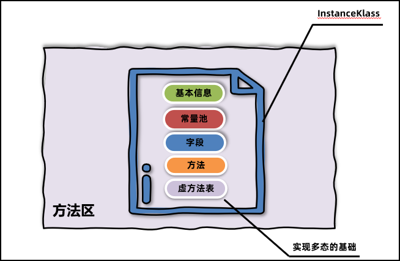

# :calendar:进度

> ==[设计模式](../设计模式/设计模式.md)==
>
> |        **UML**         |         **设计原则**         | 装饰模式decorator | **责任链模式** |
> | :--------------------: | :--------------------------: | :---------------: | -------------- |
> |     代理模式proxy      |    简单工厂和工厂方法模式    | 原型模式prototype |                |
> |    **模板方法模式**    |        外观模式Facade        | 建造者模式builder |                |
> | **观察者模式Observer** | 抽象工厂模式abstract factory |   状态模式state   |                |
> |   适配器模式Adapter    |      备忘录模式memento       | 组合模式composite |                |
> |    命令模式command     |      中介者模式mediator      |   **策略模式**    |                |
>
> ==[JVM](../jvm/JVM.md)==
>
> | 内存结构图 | 程序计数器            | 虚拟机栈    | 本地方法栈 |
> | ---------- | --------------------- | ----------- | ---------- |
> | 堆         | 方法区(jdk7/jdk8区别) | classloader | 执行引擎   |
> | 字节码组成 | 字节码查看工具        |             |            |
> |            |                       |             |            |
> |            |                       |             |            |
> |            |                       |             |            |
> |            |                       |             |            |
>
> 


# :question:提问

## 设计模式

### 设计原则有哪几个？

> 1. 单一职责原则：类的职责需要单一
> 2. 开放封闭原则：对扩展开放，对修改关闭。软件实体支持扩展，不支持修改
> 3. 依赖倒转原则：针对接口编程，而不是实现类编程。高层模块不应该依赖于底层模块，而应该依赖于抽象
> 4. 里式代换原则：子类必须能够完全替换它们的父类型，`简单来说就是子类替换掉父类后，软件功能不受影响，父类才算真正的被复用。而子类也可以在父类的基础上增加新的行为`
> 5. 迪米特法则：如果两个类不必彼此直接通信，那么就不应该发生直接的相互作用。如果其中的一个类需要需要调用另一个类的方法时，可以通过第三者转发这个调用。`强调类之间的松耦合`

### 项目中应用了哪些设计模式，展开说说?

> 1、华泰这边galaxy项目日结跑批时，
>
> 针对多业务部门以及多品种的，多使用策略模式进行解耦，
>
> 相同的业务操作流程采用模板模式进行步骤共用，不同的逻辑延申到子类实现，以及一些复杂的流程进行拆分，
>
> 使用观察者者模式进行一些通用功能的通知，比如借助spring event在接收处理一系列处理后，生成报表的操作，
>
> 或者在接收kafka消息流水时，通过observable，setchanged,通知所有的observer进行消息的处理
>
> 还有些比如，相对环节多的业务流程，比如接收到流水之后，校验、入库、生成确认书、客户信息，这种多环节的，使用责任链模式进行处理

## JVM

### JVM虚拟机组成包括哪些？


> - 类加载子系统：核心组件类加载器，**负责将字节码文件中的内容加载到内存中**。
> - 运行时数据区：JVM管理的内存，创建出来的对象、类的信息等等内容都会放在这块区域中。
> - 执行引擎：包含了即时编译器、解释器、垃圾回收器，执行引擎**使用解释器将字节码指令解释成机器码**，使用即时编译器优化性能，使用垃圾回收器回收不再使用的对象。
> - 本地接口：调用本地使用C/C++编译好的方法，本地方法在Java中声明时，都会带上native关键字，如下图所示。

==运行时数据区域==


> ==**程序计数器==：当前线程所执行的字节码的行号指示器，不会发生内存溢出。每个线程只存储一个固定长度的内存地址。**
>
> ------
>
> ==**虚拟机栈==：****线程运行时分配的内存区域**，用于**存储局部变量表、操作数栈、帧数据(动态链接、方法出口)**等信息。先进后出，每个方法的调用使用一个栈帧来保存  `存储方法的` 语法：-Xss栈大小 调整栈大小
>
> `局部变量表:的作用是在方法执行过程中存放所有的局部变量。局部变量表分为两种，一种是字节码文件中的，另外一种是栈帧中的也就是保存在内存中。栈帧中的局部变量表是根据字节码文件中的内容生成的。`
>
> `操作数栈:是栈帧中虚拟机在执行指令过程中用来存放中间数据的一块区域。他是一种栈式的数据结构，如果一条指令将一个值压入操作数栈，则后面的指令可以弹出并使用该值。`
>
> `帧数据主要包含动态链接、方法出口、异常表的引用。`
>
> `动态链接：当前类的字节码指令引用了其他类的属性或者方法时,需要将符号引用（编号）转换成对应的运行时常量池中的内存地址。动态链接就保存了编号到运行时常量池的内存地址的映射关系。`
>
> `方法出口:指的是方法在正确或者异常结束时，当前栈帧会被弹出，同时程序计数器应该指向上一个栈帧中的下一条指令的地址。所以在当前栈帧中，需要存储此方法出口的地址。`
>
> `异常表:存放的是代码中异常的处理信息，包含了异常捕获的生效范围以及异常发生后跳转到的字节码指令位置。`
>
> ------
>
> ==**本地方法栈**==：虚拟机调用 Native 方法服务
>
> ------
>
> ==堆==：线程共享，几乎所有的对象实例都在这里分配内存
>
> `堆空间有三个需要关注的值，used、total、max。used指的是当前已使用的堆内存，total是java虚拟机已经分配的可用堆内存，max是java虚拟机可以分配的最大堆内存。`
>
> 可以通过arthas 查看 dashboard –i  刷新频率(毫秒)  
>
> 要修改堆的大小，可以使用虚拟机参数 –Xmx（max最大值）和-Xms (初始的total)。 建议将-Xmx和-Xms设置为相同的值，，这样在程序启动之后可使用的总内存就是最大内存，而无需向java虚拟机再次申请，减少了申请并分配内存时间上的开销，同时也不会出现内存过剩之后堆收缩的情况。
>
> ------
>
> ==方法区==：存储已被虚拟机加载的**类信息、常量、静态变量、即时编译后的代码**等数据。  `存储类的`
>
> 包含：
>
> - 类的元信息，保存了所有类的基本信息
> - 运行时常量池，保存了字节码文件中的常量池内容
> - 字符串常量池，保存了字符串常量
>
> JDK7及之前的版本将方法区存放在堆区域中的永久代空间，堆的大小由虚拟机参数来控制。
>
> JDK8及之后的版本将方法区存放在元空间中，元空间位于操作系统维护的直接内存中，默认情况下只要不超过操作系统承受的上限，可以一直分配。
>
> 
>
> **类的元信息**
>
> 方法区是用来存储每个类的基本信息（元信息），一般称之为InstanceKlass对象。在类的加载阶段完成。其中就包含了类的字段、方法等字节码文件中的内容，同时还保存了运行过程中需要使用的虚方法表（实现多态的基础）等信息。
>
> 
>
> **运行时常量池**
>
> 字节码文件中通过编号查表的方式找到常量，这种常量池称为静态常量池。当常量池加载到内存中之后，可以通过内存地址快速的定位到常量池中的内容，这种常量池称为运行时常量池。
>
> 
>
> **字符串常量池**
>
> 字符串常量池存储在代码中定义的常量字符串内容。比如“abc” 这个abc就会被放入字符串常量池。
>
> 在堆上创建String对象，并通过局部变量s1引用堆上的对象。
>
> 
>
> **字符串常量池和运行时常量池关系？**
>
> 

### 直接内存？

并不在《Java虚拟机规范》中存在，所以并不属于Java运行时的内存区域。

直接内存解决

1、Java堆中的对象如果不再使用要回收，回收时会影响对象的创建和使用。

2、IO操作比如读文件，需要先把文件读入直接内存（缓冲区）再把数据复制到Java堆中。

### StackOverFlowError的原因？

> 无限**递归**循环调用（最常见）。   线程请求的栈深度大于虚拟机栈所允许的最大深度
>
> - **执行了大量方法，导致线程栈空间耗尽**。
> - 或者方法内声明了**海量的局部变量**。 无法申请到足够的内存去完成扩展

### JIT即时编辑？

> JIT（即时编译）
>
> 当JVM发现某个方法或代码块运行特别频繁的时候，就会认为这是“热点代码”（Hot Spot Code)。然后JIT会把部分“热点代码”翻译成本地机器相关的机器码，并进行优化，然后再把翻译后的机器码缓存起来，以备下次使用。

### 字节码文件的组成？

> - **基础信息**：魔数、字节码文件对应的Java版本号、访问标识(public final等等)、父类和接口信息
> - **常量池****：** 保存了字符串常量、类或接口名、字段名，主要在字节码指令中使用
> - **字段：** 当前类或接口声明的字段信息
> - **方法：** 当前类或接口声明的方法信息，核心内容为方法的字节码指令
> - **属性：** 类的属性，比如源码的文件名、内部类的列表等

### int i = 0; i = i++; 最终i的值是多少？

> 答案是0，我通过分析字节码指令发现，i++先把0取出来放入临时的操作数栈中，
>
> 接下来对i进行加1，i变成了1，最后再将之前保存的临时值0放入i，最后i就变成了0

### 字节码查看工具？

> `javap -v` 字节码文件名称 查看具体的字节码信息。如果jar包需要先使用 `jar –xvf` 命令解压。
>
> jclasslib 查看
>
> arthas dump命令可以将字节码文件保存到本地  dump -d /tmp/output java.lang.String  #将`java.lang.String` 的字节码文件保存到了/tmp/output目录下：

### 类的生命周期


### 类的生命周期-加载分析?

1、加载(Loading)阶段第一步是**类加载器根据类的全限定名通过不同的渠道以二进制流的方式获取字节码信息**，程序员可以使用Java代码拓展的不同的渠道。

- 从本地磁盘上获取文件
- 运行时通过动态代理生成，比如Spring框架
- Applet技术通过网络获取字节码文件

2、**类加载器在加载完类之后，Java虚拟机会将字节码中的信息保存到方法区中，方法区中生成一个InstanceKlass对象，保存类的所有信息，里边还包含实现特定功能比如多态的信息。**



4、Java虚拟机**同时会在堆上生成与方法区中数据类似的java.lang.Class对象，作用是在Java代码中去获取类的信息以及存储静态字段的数据（JDK8及之后）**（作为方法区这些数据的访问入口）。


### 类的生命周期-连接分析？


- 验证，验证内容是否满足《Java虚拟机规范》。
- 准备，给静态变量赋初值。  final修饰的基本数据类型的静态变量，准备阶段直接会将代码中的值进行赋值
- 解析，将常量池中的符号引用替换成指向内存的直接引用。

### 类的生命周期-初始化？

初始化阶段是执行初始化方法 `<clinit> ()`方法的过程。包含了静态代码块中的代码，并为静态变量赋值。

1.访问一个类的静态变量或者静态方法会初始化。注意变量是final修饰的并且等号右边是常量不会触发初始化。

2.调用Class.forName(String className)。

3.new一个该类的对象时。

4.执行Main方法的当前类。

5.初始化一个类，如果其父类还未初始化，则先触发该父类的初始化。

添加-XX:+TraceClassLoading 参数可以打印出加载并初始化的类

### 类加载器是什么作用？

类加载器（ClassLoader）是Java虚拟机提供给应用程序去实现获取类和接口字节码数据的技术，

类加载器会通过二进制流的方式获取到字节码文件的内容，接下来将获取到的数据交给Java虚拟机，虚拟机会在方法区和堆上生成对应的对象保存字节码信息。

### 类加载器的分类

Arthas中可以通过`sc -d 类名`的方式查看加载这个类的类加载器详细的信息

classloader  -l 查看当前有哪些类加载器

类加载器的加载路径可以通过classloader –c hash值 查看

> ==启动类加载器==
>
> - 启动类加载器（Bootstrap ClassLoader）是由Hotspot虚拟机提供的、使用C++编写的类加载器。
> - 默认**加载Java安装目录/jre/lib下的类文件**，比如rt.jar，tools.jar，resources.jar等
> - 启动类加载器在JDK8中是由C++语言来编写的，在Java代码中去获取既不适合也不安全，所以获取String.**class**.getClassLoader()才返回`null`
> - 如果用户想扩展一些比较基础的jar包，尽可能不在/jre/lib下扩展 。使用参数进行扩展。推荐，使用-Xbootclasspath/a:jar包目录/jar包名 进行扩展，参数中的/a代表新增。
>
> ==扩展类加载器==
>
> 默认加载Java安装目录/jre/lib/ext下的类文件。
>
> - 如果用户想扩展一些比较基础的jar包，尽可能不在/jre/lib/ext下扩展，使用参数进行扩展使用参数进行扩展。推荐，使用-Djava.ext.dirs=jar包目录 进行扩展,这种方式会覆盖掉原始目录，可以用;(windows):(macos/linux)追加上原始目录
>
> ==应用程序加载器==
>
> 应用程序类加载器会加载classpath下的类文件，默认加载的是项目中的类以及通过maven引入的第三方jar包中的类
>
> ==扩展类加载器和应用程序类加载器==
>
> - 扩展类加载器和应用程序类加载器都是JDK中提供的、使用Java编写的类加载器。
> - 它们的源码都位于sun.misc.Launcher中，是一个静态内部类。继承自URLClassLoader。具备通过目录或者指定jar包将字节码文件加载到内存中。
>
> 
>
> - ClassLoader类定义了具体的行为模式，简单来说就是先从本地或者网络获得字节码信息，然后调用虚拟机底层的方法创建方法区和堆上的对象。这样的好处就是让子类只需要去实现如何获取字节码信息这部分代码。
> - SecureClassLoader提供了证书机制，提升了安全性。
> - URLClassLoader提供了根据URL获取目录下或者指定jar包进行加载，获取字节码的数据。
> - 扩展类加载器和应用程序类加载器继承自URLClassLoader，获得了上述的三种能力。

### 双亲委派机制？

> 双亲委派模型是描述类加载器之间的层次关系
>
> 如果一个类加载器收到了类加载的请求，它首先不会自己去尝试加载这个类，而是**把这个请求委派给父类加载器去完成**，每一个层次的类加载器都是如此，因此所有的加载请求最终都应该传送到顶层的启动类加载器中，**只有当父加载器反馈自己无法完成这个加载请求（找不到所需的类）时，子加载器才会尝试自己去加载
>
> 1.保证类加载的安全性。通过双亲委派机制避免恶意代码替换JDK中的核心类库，比如java.lang.String，确保核心类库的完整性和安全性。
>
> 2.避免重复加载。双亲委派机制可以避免同一个类被多次加载。

### 在Java中如何使用代码的方式去主动加载一个类呢？

方式1：使用Class.forName方法，使用当前类的类加载器去加载指定的类。

方式2：获取到类加载器，通过类加载器的loadClass方法指定某个类加载器加载。

### 打破双亲委派机制

- **自定义类加载器并且重写loadClass方法**。Tomcat通过这种方式实现应用之间类隔离，（自定义类加载器的父类加载器是应用程序类加载器)。
- 线程上下文类加载器。**利用上下文类加载器加载类，比如JDBC和JNDI等**。
- Osgi框架的类加载器。历史上Osgi框架实现了一套新的类加载器机制，允许同级之间委托进行类的加载，目前很少使用。

### 两个自定义类加载器加载相同限定名的类，不会冲突吗？

不会冲突，在同一个Java虚拟机中，只有相同类加载器+相同的类限定名才会被认为是同一个类。

在Arthas中使用sc –d 类名的方式查看具体的情况。

### 使用阿里arthas不停机解决线上问题?

> 1. 在出问题的服务器上部署一个 arthas，并启动。
> 2. jad --source-only 类全限定名 > 目录/文件名.java      jad 命令反编译，然后可以用其它编译器，比如 vim 来修改源码
> 3. mc –c 类加载器的hashcode 目录/文件名.java -d 输出目录
>
> ​      mc 命令用来编译修改过的代码
>
> 1.  retransform class文件所在目录/xxx.class
>
> ​      用 retransform 命令加载新的字节码
>
> 程序重启之后，字节码文件会恢复，除非将class文件放入jar包中进行更新。
>
> 使用retransform**不能添加方法或者字段**，**也不能更新正在执行中的方法**

### JDK9类加载器的变化？

由于JDK9引入了module的概念，类加载器在设计上发生了很多变化。

1.启动类加载器使用Java编写，位于jdk.internal.loader.ClassLoaders类中。

   Java中的BootClassLoader继承自BuiltinClassLoader实现从模块中找到要加载的字节码资源文件。

   启动类加载器依然无法通过java代码获取到，返回的仍然是null，保持了统一。

2、扩展类加载器被替换成了平台类加载器（Platform Class Loader）。

​     平台类加载器遵循模块化方式加载字节码文件，所以继承关系从URLClassLoader变成了BuiltinClassLoader，BuiltinClassLoader实现了从模块中加载字节码文件。平台类加载器的存在更多的是为了与老版本的设计方案兼容，自身没有特殊的逻辑。

### 如何判断一个类是否可以被回收？

1、此类所有实例对象都已经被回收，在堆中不存在任何该类的实例对象以及子类对象。

2、加载该类的类加载器已经被回收。

3、该类对应的 java.lang.Class 对象没有在任何地方被引用。

### 判断对象是否可以被回收？

> ==引用计数法==
>
> 引用计数法会为每个对象维护一个引用计数器，当对象被引用时加1，取消引用时减1。
>
> 缺点：
>
> 1.每次引用和取消引用都需要维护计数器，对系统性能会有一定的影响
>
> 2.存在循环引用问题，所谓循环引用就是当A引用B，B同时引用A时会出现对象无法回收的问题。
>
> ==可达性分析法==
>
> Java使用的是可达性分析算法来判断对象是否可以被回收。`可达性分析将对象分为两类：垃圾回收的根对象（GC Root）和普通对象，对象与对象之间存在引用关系`。
>
> 可达性分析算法指的是如果从某个到GC Root对象是可达的，对象就不可被回收。
>
> **GCROOTS包括**
>
> - 线程Thread对象，引用线程栈帧中的方法参数、局部变量等。
> - 系统类加载器加载的java.lang.Class对象，引用类中的静态变量。
> - 监视器对象，用来保存同步锁synchronized关键字持有的对象。
> - 本地方法调用时使用的全局对象。
>
> 查看方式
>
> 通过arthas和eclipse Memory Analyzer (MAT) 工具可以查看GC Root，MAT工具是eclipse推出的Java堆内存检测工具。具体操作步骤如下：
>
> 1、使用arthas的heapdump命令将堆内存快照保存到本地磁盘中。  heapdump 目录/test2.hprof
>
> 2、使用MAT工具打开堆内存快照文件。
>
> 3、选择GC Roots功能查看所有的GC Root。
>
> 

### 常见的引用对象？

> ==强引用==
>
> 可达性算法中描述的对象引用，一般指的是强引用，即是GCRoot对象对普通对象有引用关系，只要这层关系存在，普通对象就不会被回收
>
> ### ==软引用==
>
> 如果一个对象只有软引用关联到它，当程序内存不足时，就会将软引用中的数据进行回收。
>
> 在JDK 1.2版之后提供了SoftReference类来实现软引用，软引用常用于缓存中。
>
> 使用方式
>
> 1.将对象使用软引用包装起来，new SoftReference<对象类型>(对象)。
>
> 2.内存不足时，虚拟机尝试进行垃圾回收。
>
> 3.如果垃圾回收仍不能解决内存不足的问题，回收软引用中的对象。
>
> 4.如果依然内存不足，抛出OutOfMemory异常。
>
> `软引用对象本身怎么回收呢？`
>
> 1、软引用创建时，通过构造器传入引用队列
>
> 2、在软引用中包含的对象被回收时，该软引用对象会被放入引用队列
>
> 3、通过代码遍历引用队列，将SoftReference的强引用删除
>
> ==弱引用==
>
> 弱引用的整体机制和软引用基本一致，区别在于弱引用包含的对象在垃圾回收时，不管内存够不够都会直接被回收。在JDK 1.2版之后提供了WeakReference类来实现弱引用，弱引用主要在ThreadLocal中使用。
>
> 弱引用对象本身也可以使用引用队列进行回收
>
> ### ==虚引用和终结器引用==
>
> 虚引用也叫幽灵引用/幻影引用，不能通过虚引用对象获取到包含的对象。`虚引用唯一的用途是当对象被垃圾回收器回收时可以接收到对应的通知`。Java中使用PhantomReference实现了虚引用，直接内存中为了及时知道直接内存对象不再使用，从而回收内存，使用了虚引用来实现
>
> 终结器引用指的是在对象需要被回收时，`终结器引用会关联对象并放置在Finalizer类中的引用队列中`，在稍后由一条由FinalizerThread线程从队列中获取对象，然后执行对象的finalize方法，在对象第二次被回收时，该对象才真正的被回收。在这个过程中可以在finalize方法中再将自身对象使用强引用关联上，但是不建议这样做

### 吞吐量？

吞吐量指的是 CPU 用于执行用户代码的时间与 CPU 总执行时间的比值，即吞吐量 = 执行用户代码时间 /（执行用户代码时间 + GC时间）。吞吐量数值越高，垃圾回收的效率就越高。

### 最大暂停时间

最大暂停时间指的是所有在垃圾回收过程中的STW时间最大值

### 垃圾回收算法？

> ### ==标记清除算法==
>
> 1.标记阶段，将所有存活的对象进行标记。Java中使用可达性分析算法，从GC Root开始通过引用链遍历出所有存活对象。
>
> 2.清除阶段，从内存中删除没有被标记也就是非存活对象。
>
> 优点：实现简单，只需要在第一阶段给每个对象维护标志位，第二阶段删除对象即可。
>
> 缺点：
>
> 1.碎片化问题 
>
> 2.分配速度慢。由于内存碎片的存在，需要维护一个空闲链表，极有可能发生每次需要遍历到链表的最后才能获得合适的内存空间.`我们需要用一个链表来维护，哪些空间可以分配对象，很有可能需要遍历这个链表到最后，才能发现这块空间足够我们去创建一个对象`
>
> ==复制算法==
>
> 1.准备两块空间From空间和To空间，每次在对象分配阶段，只能使用其中一块空间（From空间）。
>
> 2.在垃圾回收GC阶段，将From中存活对象复制到To空间。
>
> 3.将两块空间的From和To名字互换。
>
> 优点：
>
> - 吞吐量高，复制算法只需要遍历一次存活对象复制到To空间即可，比标记-整理算法少了一次遍历的过程，因而性能较好，但是不如标记-清除算法，因为标记清除算法不需要进行对象的移动
> - 不会发生碎片化，复制算法在复制之后就会将对象按顺序放入To空间中，所以对象以外的区域都是可用空间，不存在碎片化内存空间。
>
> 缺点：
>
> 内存使用效率低，每次只能让一半的内存空间来为创建对象使用。
>
> ==标记整理算法==（标记压缩算法）
>
> 1.标记阶段，将所有存活的对象进行标记。Java中使用可达性分析算法，从GC Root开始通过引用链遍历出所有存活对象。
>
> 2.整理阶段，将存活对象移动到堆的一端。清理掉存活对象的内存空间
>
> 优点：
>
> - 内存使用效率高，整个堆内存都可以使用，不会像复制算法只能使用半个堆内存
> - 不会发生碎片化，在整理阶段可以将对象往内存的一侧进行移动，剩下的空间都是可以分配对象的有效空间
>
> 缺点：
>
> 整理阶段的效率不高，整理算法有很多种，比如Lisp2整理算法需要对整个堆中的对象搜索3次，整体性能不佳。可以通过Two-Finger、表格算法、ImmixGC等高效的整理算法优化此阶段的性能
>
> ==分代垃圾回收算法(Generational GC)。==
>
> 1、分代回收时，创建出来的对象，首先会被放入Eden伊甸园区。
>
> 2、随着对象在Eden区越来越多，如果Eden区满，新创建的对象已经无法放入，就会触发年轻代的GC，称为Minor GC或者Young GC。
>
> Minor GC会把需要eden中和From需要回收的对象回收，把没有回收的对象放入To区。
>
> 3、接下来，S0会变成To区，S1变成From区。当eden区满时再往里放入对象，依然会发生Minor GC。
>
> 此时会回收eden区和S1(from)中的对象，并把eden和from区中剩余的对象放入S0
>
> 每次Minor GC中都会为对象记录他的年龄，初始值为0，每次GC完加1。
>
> 4、如果Minor GC后对象的年龄达到阈值（最大15，默认值和垃圾回收器有关），对象就会被晋升至老年代
>
> 5、当老年代中空间不足，无法放入新的对象时，先尝试minor gc如果还是不足，就会触发Full GC，Full GC会对整个堆进行垃圾回收。
>
> 如果Full GC依然无法回收掉老年代的对象，那么当对象继续放入老年代时，就会抛出Out Of Memory异常
>
> 
>
> 
>
> 

### 为什么分代GC算法要把堆分成年轻代和老年代？

首先我们要知道堆内存中对象的特性：

- 系统中的大部分对象，都是创建出来之后很快就不再使用可以被回收，比如用户获取订单数据，订单数据返回给用户之后就可以释放了。
- 老年代中会存放长期存活的对象，比如Spring的大部分bean对象，在程序启动之后就不会被回收了。
- 在虚拟机的默认设置中，新生代大小要远小于老年代的大小。

分代GC算法将堆分成年轻代和老年代主要原因有：

1、`可以通过调整年轻代和老年代的比例来适应不同类型的应用程序，提高内存的利用率和性能`。

2、`新生代和老年代使用不同的垃圾回收算法`，`新生代一般选择复制算法，老年代可以选择标记-清除和标记-整理算法`，由程序员来选择灵活度较高。

3、`分代的设计中允许只回收新生代（minor gc），如果能满足对象分配的要求就不需要对整个堆进行回收(full gc),STW时间就会减少`。

### 垃圾回收器

比较好的组合选择如下：

JDK8及之前：

ParNew + CMS（关注暂停时间）、Parallel Scavenge + Parallel Old (关注吞吐量)、 G1（JDK8之前不建议，较大堆并且关注暂停时间）

JDK9之后:

G1（默认）


#### 年轻代-Serial垃圾回收器


**回收年代和算法：**

年轻代

复制算法

**优点**

单CPU处理器下吞吐量非常出色

**缺点**

多CPU下吞吐量不如其他垃圾回收器，堆如果偏大会让用户线程处于长时间的等待

**适用场景**

Java编写的客户端程序或者硬件配置有限的场景

#### 老年代-SerialOld垃圾回收器

SerialOld是Serial垃圾回收器的老年代版本，采用单线程串行回收

-XX:+UseSerialGC 新生代、老年代都使用串行回收器。


**回收年代和算法：**

老年代

标记-整理算法

**优点**

单CPU处理器下吞吐量非常出色

**缺点**

多CPU下吞吐量不如其他垃圾回收器，堆如果偏大会让用户线程处于长时间的等待

**适用场景**

与Serial垃圾回收器搭配使用，或者在CMS特殊情况下使用

#### 年轻代-ParNew垃圾回收器

ParNew垃圾回收器本质上是对Serial在多CPU下的优化，使用多线程进行垃圾回收

-XX:+UseParNewGC 新生代使用ParNew回收器， 老年代使用串行回收器


**回收年代和算法：**

年轻代

复制算法

**优点**

多CPU处理器下停顿时间较短

**缺点**

吞吐量和停顿时间不如G1，所以在JDK9之后不建议使用

**适用场景**

 JDK8及之前的版本中，与CMS老年代垃圾回收器搭配使用

#### 老年代- CMS(Concurrent Mark Sweep)垃圾回收器

CMS垃圾回收器关注的是系统的暂停时间，允许用户线程和垃圾回收线程在某些步骤中同时执行，减少了用户线程的等待时间。

参数：XX:+UseConcMarkSweepGC


**回收年代和算法：**

老年代

标记清除算法

**优点**

系统由于垃圾回收出现的停顿时间较短，用户体验好

**缺点**

1、内存碎片问题

2、退化问题

3、浮动垃圾问题

**适用场景**

 大型的互联网系统中用户请求数据量大、频率高的场景，比如订单接口、商品接口等

CMS执行步骤：


1.初始标记，用极短的时间标记出GC Roots能直接关联到的对象。

2.并发标记,   标记所有的对象，用户线程不需要暂停。

3.重新标记，由于并发标记阶段有些对象会发生了变化，存在错标、漏标等情况，需要重新标记。

4.并发清理，清理死亡的对象，用户线程不需要暂停。

缺点：

1、CMS使用了标记-清除算法，在垃圾收集结束之后会出现大量的内存碎片，CMS会在Full GC时进行碎片的整理。这样会导致用户线程暂停，可以使用-XX:CMSFullGCsBeforeCompaction=N 参数（默认0）调整N次Full GC之后再整理。

2.、无法处理在并发清理过程中产生的“浮动垃圾”，不能做到完全的垃圾回收。

3、如果老年代内存不足无法分配对象，CMS就会退化成Serial Old单线程回收老年代。

#### 年轻代-Parallel Scavenge垃圾回收器

Parallel Scavenge是JDK8默认的年轻代垃圾回收器，多线程并行回收，关注的是系统的吞吐量。具备自动调整堆内存大小的特点。


**回收年代和算法：**

年轻代

复制算法

**优点**

吞吐量高，而且手动可控。为了提高吞吐量，虚拟机会动态调整堆的参数

**缺点**

不能保证单次的停顿时间

**适用场景**

后台任务，不需要与用户交互，并且容易产生大量的对象。比如：大数据的处理，大文件导出

**常用参数：**

Parallel Scavenge允许手动设置最大暂停时间和吞吐量。Oracle官方建议在使用这个组合时，不要设置堆内存的最大值，垃圾回收器会根据最大暂停时间和吞吐量自动调整内存大小。

- 最大暂停时间，`-XX:MaxGCPauseMillis=n` 设置每次垃圾回收时的最大停顿毫秒数
- 吞吐量，`-XX:GCTimeRatio=n` 设置吞吐量为n（用户线程执行时间 = n/n + 1）
- 自动调整内存大小, `-XX:+UseAdaptiveSizePolicy`设置可以让垃圾回收器根据吞吐量和最大停顿的毫秒数自动调整内存大小

#### 老年代-Parallel Old垃圾回收器

Parallel Old是为Parallel Scavenge收集器设计的老年代版本，利用多线程并发收集。

参数： -XX:+UseParallelGC  或

​           -XX:+UseParallelOldGC可以使用Parallel Scavenge + Parallel Old这种组合。

**回收年代和算法：**

老年代

标记-整理算法

**优点**

并发收集，在多核CPU下效率较高

**缺点**

暂停时间会比较长

**适用场景**

与Parallel Scavenge配套使用

#### G1垃圾回收器

JDK9之后默认的垃圾回收器是G1（Garbage First）垃圾回收器。Parallel Scavenge关注吞吐量，允许用户设置最大暂停时间 ，但是会减少年轻代可用空间的大小。CMS关注暂停时间，但是吞吐量方面会下降。

而G1设计目标就是将上述两种垃圾回收器的优点融合：

1.支持巨大的堆空间回收，并有较高的吞吐量。

2.支持多CPU并行垃圾回收。

3.允许用户设置最大暂停时间。

JDK9之后强烈建议使用G1垃圾回收器。


G1出现之前的垃圾回收器，年轻代和老年代一般是连续的

G1的整个堆会被划分成多个大小相等的区域，称之为区Region，区域不要求是连续的。分为Eden、Survivor、Old区。Region的大小通过堆空间大小/2048计算得到，也可以通过参数-XX:G1HeapRegionSize=32m指定(其中32m指定region大小为32M)，Region size必须是2的指数幂，取值范围从1M到32M。


G1垃圾回收有两种方式：

1、年轻代回收（Young GC）

2、混合回收（Mixed GC）

==年轻代回收==

年轻代回收（Young GC），回收Eden区和Survivor区中不用的对象。会导致STW，G1中可以通过参数

-XX:MaxGCPauseMillis=n（默认200）  设置每次垃圾回收时的最大暂停时间毫秒数，G1垃圾回收器会尽可能地保证暂停时间。

1、新创建的对象会存放在Eden区。当G1判断年轻代区不足（max默认60%），无法分配对象时需要回收时会执行Young GC。

2、标记出Eden和Survivor区域中的存活对象，

3、根据配置的最大暂停时间选择某些区域将存活对象复制到一个新的Survivor区中（年龄+1），清空这些区域


G1在进行Young GC的过程中会去记录每次垃圾回收时每个Eden区和Survivor区的平均耗时，以作为下次回收时的参考依据。这样就可以根据配置的最大暂停时间计算出本次回收时最多能回收多少个Region区域了。比如 -XX:MaxGCPauseMillis=n（默认200），每个Region回收耗时40ms，那么这次回收最多只能回收4个Region。

4、后续Young GC时与之前相同，只不过Survivor区中存活对象会被搬运到另一个Survivor区。

5、当某个存活对象的年龄到达阈值（默认15），将被放入老年代

6、部分对象如果大小超过Region的一半，会直接放入老年代，这类老年代被称为Humongous区。比如堆内存是4G，每个Region是2M，只要一个大对象超过了1M就被放入Humongous区，如果对象过大会横跨多个Region

7、多次回收之后，会出现很多Old老年代区，此时总堆占有率达到阈值时

（-XX:InitiatingHeapOccupancyPercent默认45%）会触发混合回收MixedGC。回收所有年轻代和部分老年代的对象以及大对象区。采用复制算法来完成。


==混合回收==

混合回收分为：初始标记（initial mark）、并发标记（concurrent mark）、最终标记（remark或者Finalize Marking）、并发清理（cleanup）

G1对老年代的清理会选择存活度最低的区域来进行回收，这样可以保证回收效率最高，这也是G1（Garbage first）名称的由来

注意：如果清理过程中发现没有足够的空Region存放转移的对象，会出现Full GC。单线程执行标记-整理算法，此时会导致用户线程的暂停。所以尽量保证应该用的堆内存有一定多余的空间。


参数1： `-XX:+UseG1GC`  打开G1的开关，JDK9之后默认不需要打开

参数2：`-XX:MaxGCPauseMillis=毫秒值` 最大暂停的时

**回收年代和算法：**

年轻代+老年代

复制算法

**优点**

对比较大的堆如超过6G的堆回收时，延迟可控

不会产生内存碎片

并发标记的SATB算法效率高

**缺点**

JDK8之前还不够成熟

**适用场景**

JDK8最新版本、JDK9之后建议默认使用

### 内存泄漏

内存泄漏（memory leak）：在Java中如果不再使用一个对象，但是该对象依然在GC ROOT的引用链上，这个对象就不会被垃圾回收器回收，这种情况就称之为内存泄漏

场景：

- 在处理用户的请求之后，没有及时将用户的数据删除。随着用户请求数量越来越多，内存泄漏的对象占满了堆内存最终导致内存溢出
- 任务调度时，被调度的Java应用在调度任务结束中出现了内存泄漏，最终导致多次调度之后内存溢出。

### 内存泄漏的监控工具

top命令是linux下用来查看系统信息的一个命令，它提供给我们去实时地去查看系统的资源，比如执行时的进程、线程和系统参数等信息。进程使用的内存为RES（常驻内存）- SHR（共享内存）

**优点：**

- 操作简单
- 无额外的软件安装

**缺点：**

只能查看最基础的进程信息，无法查看到每个部分的内存占用（堆、方法区、堆外） 


VisualVM

**优点：**

- 功能丰富，实时监控CPU、内存、线程等详细信息
- 支持Idea插件，开发过程中也可以使用

**缺点：**

对大量集群化部署的Java进程需要手动进行管理

如果需要进行远程监控，可以通过jmx方式进行连接。在启动java程序时添加如下参数：

```Java
-Djava.rmi.server.hostname=服务器ip地址
-Dcom.sun.management.jmxremote
-Dcom.sun.management.jmxremote.port=9122
-Dcom.sun.management.jmxremote.ssl=false
-Dcom.sun.management.jmxremote.authenticate=false
```

Arthas

**优点：**

- 功能强大，不止于监控基础的信息，还能监控单个方法的执行耗时等细节内容。
- 支持应用的集群管理

**缺点：**

部分高级功能使用门槛较高

**arthas tunnel**管理所有需要监控的程序

### 内存溢出的原因

> ==代码中的内存泄露==
>
> 总结了6种产生内存泄漏的原因，均来自于java代码的不当处理：
>
> - equals()和hashCode()，不正确的equals()和hashCode()实现导致内存泄漏
>
> `在定义新类时没有重写正确的equals()和hashCode()方法。在使用HashMap的场景下，如果使用这个类对象作为key，HashMap在判断key是否已经存在时会使用这些方法，如果重写方式不正确，会导致相同的数据被保存多份。`
>
> 解决方案：
>
> 1、在定义新实体时，始终重写equals()和hashCode()方法。
>
> 2、重写时一定要确定使用了唯一标识去区分不同的对象，比如用户的id等。
>
> 3、hashmap使用时尽量使用编号id等数据作为key，不要将整个实体类对象作为key存放。
>
> ------
>
> 
>
> - ThreadLocal的使用，由于线程池中的线程不被回收导致的ThreadLocal内存泄漏
>
> `如果仅仅使用手动创建的线程，就算没有调用ThreadLocal的remove方法清理数据，也不会产生内存泄漏。因为当线程被回收时，ThreadLocal也同样被回收。但是如果使用线程池就不一定了`
>
> 解决方案：
>
> 线程方法执行完，一定要调用ThreadLocal中的remove方法清理对象。
>
> ------
>
> 
>
> - 内部类引用外部类，非静态的内部类和匿名内部类的错误使用导致内存泄漏
>
> `1、非静态的内部类默认会持有外部类，尽管代码上不再使用外部类，所以如果有地方引用了这个非静态内部类，会导致外部类也被引用，垃圾回收时无法回收这个外部类。`
>
> `2、匿名内部类对象如果在非静态方法中被创建，会持有调用者对象，垃圾回收时无法回收调用者。`
>
> 1、这个案例中，使用内部类的原因是可以直接获取到外部类中的成员变量值，简化开发。如果不想持有外部类对象，应该使用静态内部类。
>
> 2、使用静态方法，可以避免匿名内部类持有调用者对象。
>
> ------
>
> 
>
> - String的intern方法，由于JDK6中的字符串常量池位于永久代，intern被大量调用并保存产生的内存泄漏
>
> `JDK6中字符串常量池位于堆内存中的Perm Gen永久代中，如果不同字符串的intern方法被大量调用，字符串常量池会不停的变大超过永久代内存上限之后就会产生内存溢出问题`
>
> 解决方案：
>
> 1、注意代码中的逻辑，尽量不要将随机生成的字符串加入字符串常量池
>
> 2、增大永久代空间的大小，根据实际的测试/估算结果进行设置-XX:MaxPermSize=256M
>
> ------
>
> 
>
> - 通过静态字段保存对象，大量的数据在静态变量中被引用，但是不再使用，成为了内存泄漏
>
> `如果大量的数据在静态变量中被长期引用，数据就不会被释放，如果这些数据不再使用，就成为了内存泄漏。`
>
> 解决方案：
>
> 1、尽量减少将对象长时间的保存在静态变量中，如果不再使用，必须将对象删除（比如在集合中）或者将静态变量设置为null。
>
> 2、使用单例模式时，尽量使用懒加载，而不是立即加载。
>
> ------
>
> 
>
> - 资源没有正常关闭，由于资源没有调用close方法正常关闭，导致的内存溢出
>
> `连接和流这些资源会占用内存，如果使用完之后没有关闭，这部分内存不一定会出现内存泄漏，但是会导致close方法不被执行。`
>
> 解决方案：
>
> 1、为了防止出现这类的资源对象泄漏问题，必须在finally块中关闭不再使用的资源。
>
> 2、从 Java 7 开始，使用try-with-resources语法可以用于自动关闭资源。
>
> ------
>
> ==并发请求问题==
>
> 并发请求问题指的是由于用户的并发请求量有可能很大，同时处理数据的时间很长，导致大量的数据存在于内存中，最终超过了内存的上限，导致内存溢出。
>
> 

## 并发编程


## 线程池


## 锁


## 网络编程


## redis


## 缓存


## spring


## springboot


## springcloud


## dubbo


## mybatis


## mybatisplus


## netty


## 分布式相关


## ngnix


## zk


## tomcat


## mysql


## es


## sharding-jdbc


## 微服务


## 消息队列


## docker


## k8s


## linux


## DDD


## java8


## vue


## python


