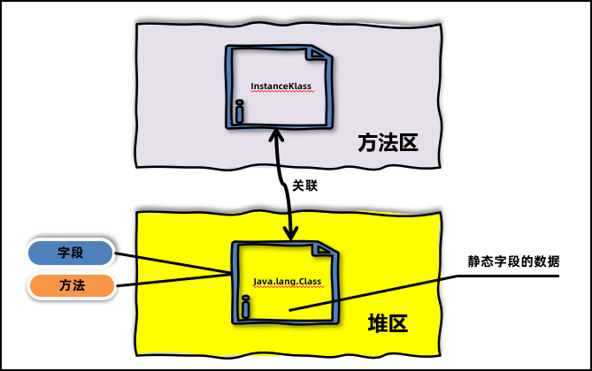
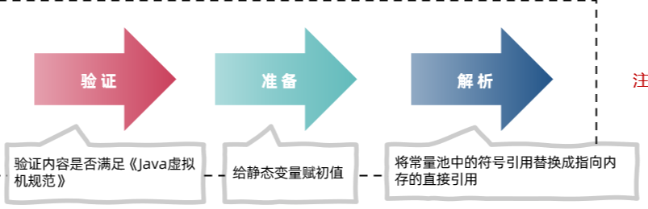
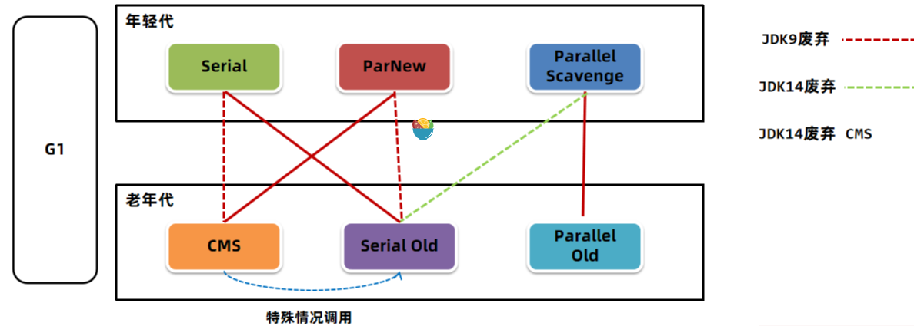
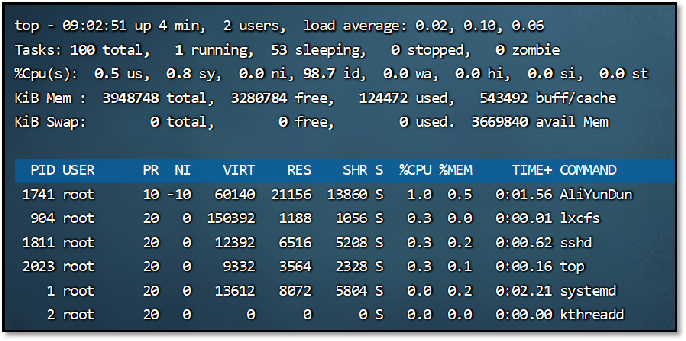
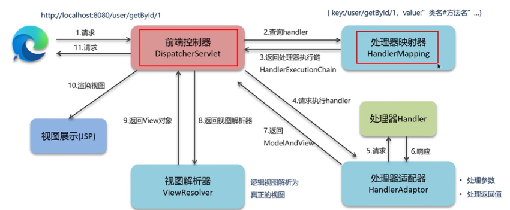

# :panda_face: :面板

| 基础知识 | [<font color=green>设计模式</font>](#设计模式) | [<font color=green>JVM</font>](#JVM) | [<font color=green>并发编程</font>]() | [<font color=green>线程池</font>]() |       锁       | [<font color=green>网络编程</font>]() | 项目管理 |   缓存   | redis |
| :------: | :--------------------------------------------: | :----------------------------------: | :-----------------------------------: | :---------------------------------: | :------------: | :-----------------------------------: | :------: | :------: | ----- |
|          |                    UML类图                     |               内存结构               |               进程/线程               |              属性解释               |   多种锁解释   |                TCP/UDP                |  gradle  | jetcache |       |
|          |                  常用设计模式                  |                  GC                  |                多线程                 |                分类                 | 字节码层面分析 |               粘包/拆包               |  maven   | j2cache  |       |
|          |                 使用及案例描述                 |                字节码                |               内存模型                |                原理                 |                |               滑动窗口                |          |          |       |
|          |                                                |                类加载                |              多线程通信               |                配置                 |                |               三次握手                |          |          |       |
|          |                                                |             JVM性能调优              |                原子类                 |              拒绝策略               |                |               四次挥手                |          |          |       |
|          |                                                |               双亲委派               |                并发包                 |                                     |                |               七层模型                |          |          |       |
|          |                                                |                                      |               并发队列                |                                     |                |               多路复用                |          |          |       |
|          |                                                |                                      |               volatile                |                                     |                |                零拷贝                 |          |          |       |
|          |                                                |                                      |              ThreadLocal              |                                     |                |                                       |          |          |       |

|   技术框架   |      分布式      |               中间件                |               数据库               | [<font color=green>微服务</font>]() | [<font color=green>消息队列</font>]() | [<font color=green>DDD</font>]() |  前端   |             容器编排             | linux    |
| :----------: | :--------------: | :---------------------------------: | :--------------------------------: | :---------------------------------: | :-----------------------------------: | :------------------------------: | :-----: | :------------------------------: | -------- |
|    spring    |     分布式锁     |              [nginx]()              | [<font color=green>mysql</font>]() |              注册中心               |               ActiveMQ                |           领域驱动理解           |   vue   |              docker              | shell    |
|  springboot  |     分布式ID     | [<font color=green>tomcat</font>]() |                 es                 |                熔断                 |               RabbitMQ                |             角色职权             | node.js | [<font color=green>k8s</font>]() | 常用命令 |
| springCloud  |    分布式事务    | [<font color=green>redis</font>]()  |              mongodb               |              请求/负载              |               RocketMQ                |             工程样例             |         |                                  |          |
|    dubbo     |    分布式缓存    |              zookeeper              |             memcached              |                配置                 |    <font color =green>Kafka</font>    |                                  |         |                                  |          |
|   mybatis    |  分布式session   |                gRpc                 |           sharding-jdbc            |                网关                 |                                       |                                  |         |                                  |          |
| mybatis-plus |  分布式任务调度  |                etcd                 |               mycat                |                限流                 |                                       |                                  |         |                                  |          |
|    netty     | 分布式协议和算法 |                canal                |                                    |         springcloud Alibaba         |                                       |                                  |         |                                  |          |
|              |                  |                 ELK                 |                                    |                                     |                                       |                                  |         |                                  |          |
|              |                  |                solr                 |                                    |                                     |                                       |                                  |         |                                  |          |
|              |                  |              Activity               |                                    |                                     |                                       |                                  |         |                                  |          |

| 算法和数据结构 | 理论 | 日志         | 其他     | 大数据     | java版本特性                       | 其他编程语言 | [软件测试]() |      |      |
| -------------- | ---- | ------------ | -------- | ---------- | ---------------------------------- | ------------ | ------------ | ---- | ---- |
|                | 架构 | log4j        | 认证     | [python]() | [<font color=green>java8</font>]() |              | [jmeter]()   |      |      |
|                |      | Resilience4j | 性能优化 |            |                                    |              |              |      |      |
|                |      |              | 服务网格 |            |                                    |              |              |      |      |
|                |      |              | 跨域     |            |                                    |              |              |      |      |
|                |      |              | 幂等方案 |            |                                    |              |              |      |      |


# :kiwi_fruit: 简历篇

## 简历建议

> **技术能力**
>
> - 技术技能不能模板化，需要细化，描述细节点
> - 提炼职业生涯遇到的组件和使用场景、提炼主要项目和经验积累
>
> **项目经验**
>
> - 主要在于个人职责上，需要细化职责
> - 落实技术细节，结合业务场景，解决了什么问题、技术亮点和难点。项目本身不具备的话，可以移花接木，掌握这块的技术就可以移植过来
> - 如果本身项目是CRUD，完全可以将自己手写的高并发、分布式项目写上

## 项目介绍篇

> **主要职责**
>
> 负责galaxy国际化多语言的后端改造工作以及境外雪球业务功能、11号牌申请业务功能的开发工作
>
> **项目介绍**
>
> galaxy运营业务平台是运营使用，主要帮助客户处理境内外场外衍生品簿记、清算、结算、估值一体化工作。
>
> 我在这期间主要处理的是场外衍生品的簿记模块功能。包含
>
> 境外雪球业务功能的开发工作，包括现金流、交易流水以及合约的接收处理、计算、复核以及确认书的生成等。数据来源上游通过kafka消息推送或者通过dubbo接口推送，galaxy这边接收，执行后续的处理流程，包括数据的校验以及数据的计算、组装、入库。自动或者手动复核数据，生成确认书文件等。
>
> 11号牌申请业务主要是针对原有境内功能，进行EQD、EST部门及业务品种的扩张，这里使用境外数据源。包括一些行情资讯、CA流水、对账、新品种监控等功能
>
> **难点**
> 1、针对境内外数据的隔离以及接口的隔离2、针对扩展部门及品种代码结构臃肿的问题3、针对部分业务表数据量过大的问题
> **解决**
>
> 1、数据源的隔离，针对韩国雪球业务，数据方案采用的是境内外独立schema存储数据的方案，针对境内外不同的业务实现动态切换数据源，实现数据在业务层面的隔离。主要包含三类场景
>
> web接口：通过拦截器方式，在请求进入阶段，获取用户权限或者指定url方式比如/hk/，判断用户境内还是境外数据权限
>
> 定时任务或者dubbo接口：通过部门标识判断数据源配置
>
> kafka消息：通过消息体中的部门或者subbook（境外的业务属性）来判断数据源配置
>
> 技术上 ：
>
> galaxy使用的技术栈是springboot，spring自身提供了AbstractRoutingDataSourcec能够解决多数据源场景。新建动态数据源类继承AbstractRoutingDataSource，同时采用TransmittableThreadLocal来存储当前数据源信息,方便子线程获取父线程的值。
>
> 2、业务部门以及品种的，多使用策略模式进行解耦，相同的业务操作流程采用模板模式进行步骤共用，以及一些复杂的流程进行拆分使用观察者者模式进行一些通用功能的接口，比如spring event在接收处理一系列处理后，生成报表的操作。
>
> 3、数据量过大的问题
>
> - 首先数据库的库表建立要增加必要的索引以支撑搜索查询
> - 大表的话采用月表的形式，针对历史数据进行归档。
> - 导出以及查询方面，陷定条数以及数据范围。支持异步导出,同步返回文件的名称，记录数等，异步下载记录redis标识，前端通过指定频率来检测后端是否下载完毕，下载完再通过浏览器进行文件下载
> - 还有些日常全量跑批的场景，通过分部门进行多线程跑批，同时针对个别单个部分体量较大的数据，对接并行计算平台进行分片处理，计算平台通过数据切片，进行多实例分发，回调galaxy系统进行业务数据。
> - 针对必要的计算公式以及固定配置，采用redis进行缓存，避免数据库的直接访问。 （db CPU过高问题）
>
> **实际的技术问题**
>
> 1、大表同步导出问题，多次点击导出，导致OOM.
>
> 解决：
>
> - 限制导出记录数 50000
> - 使用SXSSFWorkBook解决数据放在内存导致的oom问题（支持内容放在磁盘里）
> - 异步导出，返回最大允许的导出数量以及文件名、总数
> - 前端通过轮询接口查询是否完成excel写入，文件完成，前端下载
>
> 2、系统不定时假死问题
>
> 某一次上线后，半小时或者一小时系统http访问不通，页面请求无响应。
>
> 分析：
>
> - 查看系统日志看看有没有error，OOM或者GC overhead limit exceeded类似的日志。历史有过这种大数据量导出导致的。
> - 查看系统资源情况 top命令查看cpu和内存的情况  结合jstack查看异常线程的运行情况 看看有没有死锁之类的，使用jmap命令导出dump文件分析，是否存在大对象之类
> - 查看nginx日志看看是否有异常
> - 根据nginx轮询接口日志异常 怀疑系统轮询菜单计数接口问题。显示nginx屏蔽该接口调用，直接返回200.系统正常。
> - 分析代码，确认代码存在线程嵌套，导致线程数多倍使用，超过线程池最大线程数。进入等待。此时，用户多次点击或者前端轮询就会导致线程池无线程可用，达到tomcat线程数200时，线程耗尽，后续相关http请求来了，就会无响应。
> - 业务空闲时，取一台生产虚机进行验证，打开nginx限制，通过jmeter模拟并发请求，出现现象。通过jstack查看日志，发现total接口线程出现大量wait日志，确认原因。
> - 修复后不再出现。
>
> 
>
> <springframework.version>5.3.20</springframework.version>
>
> <spring.boot.version>2.21.RELEASE</spring.boot.version>

> **主要职责**
>
> 分布式调度平台的深度定制，基于源码级别以及项目提出的个性需求进行功能定制。
>
> **项目介绍**
>
> 批量任务调度平台
> 基于xxLjob开源组件做深度定制
> 实现单任务、流程类任务调度，以及任务生命周期的监控、管理.
> 定制和扩展体现在:
> 调度架构上，由调度服务和执行服务的交互，扩展一级调度服务、二级调度服务、执行服务的交互。(应对行内单元化的变革)
>
> 调度模式上，由简单任务调用、父子任务调用。扩展为流程任务调用。类似工作流的方式，形成任务流。支持对任务节点的控制，比如定时、循环(本质上是对任务定义的扩展，但是是基于每次流程版才而言，不是固定的)流程的控制(比如暂停、终止、恢复、重试等)
>
> 任务自身属性的丰富，比如对任务设置虚拟资源分、并行度，还有实际资源分等，本质上是一种资源的限制操作。
> 生命周期的监控，调度、回调环节的成功与否，通过日志状态的记录、事件的通知，告警(通知到统监控平台)，未名状态的补偿机制，比如服务下线、执行结果丢失等。。 执行器资源的动态启停等。
> **难点**
> 深度定制和原有的简单调度模式耦合过大，随着版本的迭代，功能之间互相影响,不稳定因素增加
> **解决**
> 进行定制功能的剥离，重构，比如资源分、cpass资源、运行态、单元化，单独构建模块。
> 对调度、回调环节中进行步骤的抽象，各个定制功能进行顶层接口的实现。通过一些设计模式，将固有功能和定制功能进行整合。
> 比如责任链，对于调度前置，存在默认实现和定时的实现比如pod启用，资源分消耗，根据依赖引入和配置开关决定是否状态。更细化的对于部分环节细分吗，根据不同的场景细分链条。
> 比如借助spring的事件通知机制，也就是观察者模式，实现一些业务逻辑的解摆，比如告警、pod资源的释放等
> 比如装饰器模式，对一些默认功能的增强，比如注册支持资源分的增强、
> 比如中介者模式 对于默认实现和定制实现的调用逻辑统一通过功能中介来进行逻辑选择
> **实际的技术问题**
> 比如流程调用并行节点的后置重复调度的问题。解决方式: 防重表
> 比如执行器服务有一个使用阻寨队列，批量回调方式，调度端同步接收回调处理超时问题。批量数据多了，整体超时。arthas检测，最后进行异步处理。
>
> <springframework.version>5.3.12</springframework.version>
>
> <spring.boot.version>2.5.6</spring.boot.version>
>
> <spring.cloud.version>2020.0.4</spring.cloud.version>

# :cherries: 基础篇

## HashMap

### HashMap和ConcurrentHashMap区别？

> 主要区别在多线程下线程安全上
>
> 1、hashMap在hash值存在冲突的情况下，采用拉链法。形成链表，**jdk1.7 采用头插法**，多线程下存在**死链**问题。**jdk1.8 多线程下存在值覆盖问题**。
>
> 2、多线程下put remove操作修改结构时，**hashMap会抛出ConcurrentModificationException异常，而ConcurrentHashMap不会**。
>
> 使用建议：
>
> HashMap 单线程运行环境使用
>
> 多线程下使用同步或加锁  Collections 提供线程安全方法synchronizedMap
>
> 使用ConcurrentHashMap

### ConcurrentHashMap数据结构？

> jdk1.7 
>
> ConcurrentHashMap维护了一个**Segment数组**，Segment这个类**继承了重入锁ReentrantLock**。
>
> 该类里面维护了一个 HashEntry<K,V>[] table数组，在写操作**put，remove，扩容的时候，会对Segment加锁**
>
> 所以解决了**线程的安全**问题，同时又采用了**分段锁也提升了并发的效率**
>
> jdk1.8
>
> **Node数组+链表+[红黑树](https://so.csdn.net/so/search?q=红黑树&spm=1001.2101.3001.7020)的数据结构来实现**，并发控制使用Synchronized和CAS

### 死链问题

> **多线程下，扩容的同一个链表**。
>
> 当线程一执行到e.next = new table[i] 的时候，由于线程二之前数据迁移的原因导致此时new table[i] 上就有ertry存在，所以线程一执行的时候，会将next节点，设置为自己，导致**自己互相使用next引用对方**，因此产生链表，导致死循环。
>
> 
>
> 解决
>
> - 使用synchronize
> - 使用collection.synchronizeXXX方法
> - 使用concurrentHashmap来解决。

### HashMap jdk1.7 jdk1.8区别？

> 1、数据结构上   
>
> JDK1.7的时候使用的是**数组+ 单链表**的数据结构。**数组和链表节点的实现类是Entry类**
>
> JDK1.8及之后时，使用的是**数组+链表+红黑树**的数据结构（当**链表的深度达到8**的时候，也就是默认阈值，就会**自动扩容把**链表转成红黑树的数据结构来把时间复杂度从O（n）变成O（logN）提高了效率）。**数组和链表节点的实现类是Node类**
>
> 2、Hash值计算上 
>
> jdk1.7  9次扰动处理
>
> jdk1.8  2次扰动处理=1次位运算+1次异或
>
> 3、链表数据插入方法上
>
> jdk1.7 头插法
>
> jdk.1.8 尾插法
>
> 4、内部Entry类的实现
>
> jDK1.7数组和链表节点的实现类是**Entry类**，实现了Map.entry接口。
>
> JDK1.8数组和链表节点的实现类是**Node类**，但是**还是实现了Map.entry接口**

### hash实现

(h = key.hashCode())^ (h >>> 16);
hash取值 = key的hashcode 与 hashcode右位移 16位进行一个异或。
==定位下标==
(n - 1) & hash 这是一个与的操作。
如果不进行右移异或，直接用hashcode进行与，当数组很小时，参与 与操作的只是低位，如果hashcode低位变化小，容易产生冲突。右移16位其实就是讲hashcode高位和低位进行异或，加大低位的随机性，混合后的低位具有高位的特性，不易产生冲突)。效率也高。

### 为什么大小是2的幂

(n - 1) & hash 和这个下标定位方式有关，n=2的n次幕时，n-1的二进制数据，呈现111111***111，就是高低位普遍都是1的形式，这样和hashcode与时，能够充分的散列)，每一位都能进行位运算，减少hash碰撞，元素够均匀散列在每个位置上。

### put实现

1.调用hash函数计算key的hash值，然后计算下标(与数组长度-1进行与的运算)

2。如果没有出现hash冲突，则直接放入数组，如果出现冲突，则以链表形式放在链表的后面

3.如果链表长度超多闻值8，则链表转为红黑树，链表长度低于6，则转回链表。

4.如果key已经存在，则替换value
5。如果集合中的键值对大于12了(数组长度*负载因子0.75)，进行resize扩容。

### 扩容

1.hashmap中元素个数超过数组大小*负载因子时，进行扩容，2倍扩容。
2，如果链表对象达到8个时，Node的数量没有到64，先进行扩容，如果到达64转为红黑树，节点Node类型变为treeNode类型，如果map元素被移除，导致树的节点数低于6，则再转回链表。

3，扩容的同时，伴随着rehash分配，但是(n-1)&hash 结果，只是多了一个Bit位，所以节点位置要么就在先位置，要么原位置+旧容量。

### 为什么选用红黑树而不是二又查找树

二叉查找树在特殊情况下会变成线性结构，跟原来的链表一样，遍历查找会比较慢。而红黑树在插入数据后，进行左旋、右旋、变色，保证平衡，查找比较快。

### 底层数据结构

1.8前数组+链表
1.8后数组+链表+红黑树
==concurrentHashMap==
JDK 1.8 之前是采用分段锁来现实的 Segment + HashEntry， Segment 数组大小默认是 16，2的 n次节
JDK 1.8 之后，采用 Node + CAS + Synchronized 来保证并发安全进行实现。

## semaphore

> 信号量，**用来限制同一时刻访问共享资源的线程上限**。
> 设置许可3个，5个线程来竞争。三个获取到许可进行处理。另外两个进入AQS队列park阻塞。thread0释放许可，thread4竞争成功，再次设置许可permits=0，同时unpark剩余线程进行竞争，由于许可为日，继续阻塞等待。

## countdownLatch

> 计数器，**允许多个线程阻塞在一个地方，直到所有线程执行完毕，再一起向下执行**。
> 用来协调线程同步协作 。 其中构造参数用来初始化等待计数值，await() 用 来等待计数归零，countDown()用来让计数减一。
> 人都走了，关门。
>
> ==共享锁的实现。==
> 默认构造AQS的state值为count,线程使用countDown方法时，本质是去调用tryReleaseShared去减少state的值，state=0代表所有线程都调用了countDown方法
>
> 当调用await方法时，发现state不为0，代表有线程未执行countDown方法，那么已经调用过countDown方法的线程会被放在阻塞队列里park，并自旋CAS判断是否state=0，直至最后的线程调用countDown方法state=0，则阻塞的线程判断成功，全部往下调用.

## cyclicsBarrier

> 循环栅栏，初始化时规定一个数目，每个线程执行到 某个需要”同步”的时刻,调用了CyclicBarrier.await()进入等待。当等待的线程数满足了初始计数个数]时，所有进入等待状 态的线程被唤醒并继续。人齐了出发的概念

## juc

> Abstract Queued Synchronized，AQS 抽象队列同步器是JUC包同步机制的基础设施，更是JUC锁框架的基础

> 内置锁和显式锁比较
>
> 限时抢锁 
>
> 可中断抢锁
>
> 多个等待队列：为锁维持多个等待队列，以便提高锁的效率
>
> Java对象锁还存在性能问题。在竞争稍微激烈的情况下，Java对象锁会膨胀为重量级锁（基于操作系统的Mutex Lock实现）

### LockSupport.park()和 Thread.sleep()的区别

>  1）**Thread.sleep()没法从外部唤醒**，只能自己醒过来；而被LockSupport.park()方法阻塞的线程,可以通过调用LockSupport.unpark()方法去唤醒。
>2）Thread.sleep()方法声明了InterruptedException中断异常，这是一个受检异常，调用者需要捕获这个异常或者再抛出；而使用LockSupport.park()方法时不需要捕获中断异常。
>  3）当被阻塞线程的**Thread.interrupt()方法调用时，LockSupport.park()方法不会抛出InterruptedException异常，仅仅设置了线程的中断标志**；而**Thread.sleep()方法还会抛出InterruptedException**异常。
>  4）与Thread.sleep()相比，调用LockSupport.park()能更精准、更加灵活地阻塞、唤醒指定线程。
>  5）Thread.sleep()本身就是一个原生（native）方法；LockSupport.park()并不是一个原生方法，只是调用了一个Unsafe类的原生方法（名字也叫park）去实现。
>  
>  6)**LockSupport.park()方法还允许设置一个Blocker对象，主要用来供监视工具或诊断工具确定线程受阻塞的原因**

### LockSupport.park()与 Object.wait()的区别

>  1)Object.wait()方法需要在synchronized块中执行，而LockSupport.park()可以在任意地方执行
>
>  2)当被阻塞线程中断时，Object.wait()方法抛出了中断异常，调用者需要捕获或者再抛出；当被阻塞线程中断时，LockSupport.park()不会抛出异常，调用时不需要处理中断异常。

### CLH锁

> CLH锁其实就是一种是基于队列（具体为单向链表）排队的自旋锁，由于是Craig、Landin和Hagersten三人一起发明的，因此被命名为CLH锁，也叫CLH队列锁
>
> 简单的CLH锁可以基于单向链表实现，申请加锁的线程首先**会通过CAS操作在单向链表的尾部增加一个节点**，之后该线程只需要在其前驱节点上进行普通自旋，等待前驱节点释放锁即可.(`有没有点类似zookeeper的加锁watch机制 监听前一个小的节点，这里普通自旋也是看前驱节点有没有释放锁`)
>
> 加锁表示前驱节点lock 状态为false  可以加锁，解锁就是设置自身锁状态为false，后置节点就可以自旋获取到锁

### 非公平锁

> 非公平锁是指多个线程获取锁的顺序并不一定是其申请锁的顺序，**有可能后申请的线程比先申请的线程优先获取锁**，**抢锁成功的次序不一定体现为FIFO（先进先出）顺序**。非公平锁的优点在于**吞吐量比公平锁大**，其缺点是有可能会导致线程优先级反转或者线程饥饿现象。

### 死锁

> 死锁是指**两个或以上线程因抢占锁而造成的互相等待**的现象
>
> 线程X先后按照先后次序去抢占锁A与锁B，线程Y先后按照先后次序去抢占锁B与锁A

> **JVM管理工厂ManagementFactory类提供静态方法，返回各种获取JVM信息的Bean实例**。我们
> 通过这些Bean实例能获取大量的**JVM运行时信息，比如JVM堆的使用情况、GC情况、线程信息**、`死锁监测`等

### 共享锁

> 共享锁就是在**同一时刻允许多个线程持有的锁**。当然，**获得共享锁的线程只能读取临界区数据，不能修改临界区的数据**。
>
> Semaphore（信号量）、ReadLock（读写锁）中的读锁、CountDownLatch倒数闩

> ReentrantReadWriteLock更适合于读多写少的场景（两把锁），可以提高并发读的效率；而ReentrantLock更适合于读写比例相差不大或写比读多的场景。

> StampedLock（印戳锁）是对ReentrantReadWriteLock读写锁的一种改进
>
> 主要的改进为：**在没有写只有读的场景下，StampedLock支持不用加读锁而是直接进行读操作**，最大程度提升读的效率，
> **只有在发生过写操作之后，再加读锁才能进行读操作**。

## AQS


> AbstractQuevedSynchronizer，是阻塞式锁和相关的同步器工具的框架。
>
> `AQS的设计思想是，在其内部维护了一个双向队列，用于管理请求锁的线程。当有线程请求锁时，AQS会将其封装成一个Node节点，并加入到等待队列中，线程则会进入阻塞状态。当持有锁的线程释放锁时，AQS会从等待队列中唤醒一个线程来获取锁，从而实现线程的同步和互斥`
>
> - AQS使用一个Volatile的int类型的成员变量来表示同步状态
> - 通过内置的FIFO队列来完成资源获取的排队工作
> - 通过CAS完成对State值的修改
>
> 用 state 属性来表示资源的状态(分独占模式和共享模式)，子类需要定义如何维护这个状态， 控制如何获取锁和释放锁
> getState  获取 state 状态 setstate -
> 设置 state 状态 compareAndSetState - cas 机制设置 state 状态

> AQS是CLH队列的一个变种   **模板模式**
>
> AQS队列`内部维护的是一个FIFO的双向链表`,**每个节点其实是由线程封装的**，当线程争抢锁失败后会封装成Node加入到AQS队列中去,释放锁以后，会从队列中唤醒一个阻塞的节点（线程)

> 1、AQS中维持了一个单一的volatile修饰的状态信息state
>
> 2、AbstractQueuedSynchronizer继承了AbstractOwnableSynchronizer，这个基类只有一个变量叫exclusiveOwnerThread，表示当前占用该锁的线程。（`是不是有点类似monitor的owner`）`其实就是java层面实现类jvm的monitor锁相关操作`
>
> 3、AQS的内部队列是CLH队列的变种，每当**线程通过AQS获取锁失败时，线程将被封装成一个Node节点，通过CAS原子操作插入队列尾部**。当有线程**释放锁时，AQS会尝试让队首的后驱节点占用锁**

> 显式锁与AQS之间是一种强依赖的聚合关系，如果显式锁的实例销毁，其聚合的AQS子类实例也被销毁，因此显式锁与AQS之间是组合关系
>
> ReentrantLock的显式锁操作是委托（或委派）给一个Sync内部类的实例完成的。
>
> 而**Sync内部类只是AQS的一个子类，**
>
> 所以**本质上ReentrantLock的显式锁操作是委托（或委派）给AQS完成的**。一个ReentrantLock对象的内部一定有一个AQS类型的组合实例，二
> 者之间是组合关系。

> **AQS抢占锁**
>
> 1、CAS操作state字段，成功获取到锁
>
> 2、失败，以当前线程构造Node节点，CAS自旋将节点添加到队列尾部。
>
> 3、当前Node节点在死循环中不断获取同步状态，并且不断在前驱节点上自旋，只有**当前驱节点是队首节点才能尝试获取锁**（队首节点的线程释放了同步状态以后，将会唤醒其后驱节点）（`自旋过程中会阻塞线程，等待前驱节点唤醒后才启动循环`）
>
> 4、**前驱节点是队首节点**并且**当前线程使用钩子方法tryAcquire(arg)获得了锁**，则移除队首节点，将当前节点设置为队首节点
>
> **AQS释放锁**
>
> 1、队首节点的状态变成初始状态，设置Owner为Null
>
> 2、唤醒后驱节点

> 非公平同步器ReentrantLock.NonfairSync的核心思想就是当前进程尝试获取锁的时候，**如果发现锁的状态位是0（也就是占用锁的节点释放锁了），就直接尝试将锁拿过来，然后执行setExclusiveOwnerThread()，根本不管同步队列中的排队节点**

> 公平抢占的钩子方法中，**首先判断是否有后驱节点，如果有后驱节点，并且当前线程不是锁的占有线程**，钩子方法就返回false，模板方法会**进入排队的执行流程**

> **await()方法的整体流程如下：**
>
> 1）执行await()时，会新**创建一个节点并放入到Condition队列尾部**。
> 2）然后**释放锁，并唤醒AQS同步队列中的队首节点的后一个节点**。
> 3）然后执行while循环，将该节点的线程阻塞，直到该节点离开等待队列，重新回到同步队列成为同步节点后，线程才退出while循环。
> 4）退出循环后，开始调用acquireQueued()不断尝试拿锁。
> 5）拿到锁后，会清空Condition队列中被取消的节点。

> **signal()方法的整体流程如下：**
> 1）通过enq()方法自旋，**将条件队列中的队首节点放入到AQS同步队列尾部**，**并获取它在AQS队列中的前驱节点**。
> 2）如果前驱节点的状态是取消状态，或者设置前驱节点为Signal状态失败，就唤醒当前节点的线程；否则节点在同步队列的尾部，参与排队。
> 3）同步队列中的线==程被唤醒==后，表示重新获取了显式锁，然后继续执行condition.await()语句后面的临界区代码。

> **节点入队的时机**
>
> 1、**调用tryAcquire(arg)尝试，如果不成功，则开始将线程加入等待队列**（加到尾部，存在竞争就CAS）
>
> 2、**Condition等待队列上的节点被signal()唤醒**，会通过enq(final Node node)**自旋入队，插入AQS的尾部**。

## Synchronized 

### monitor

> 监视器或者叫管程。thread0进入，synchronized 给对象上锁(重量级)，该对象与monitar对象关联，对象头的 Mark Word中就被设置为指向 Monitor 对象的指针。monitor此时owner为线程0，其余进入entryList阻塞
>
> 

### 对象头

Mark Word  指向类的指针  数组长度

`在 Java 对象的内存布局中，对象头包含了一些用于存储对象自身的运行时数据，其中的 Mark Word 就是其中的一部分。`

### mark word

> 无锁标记(hashcode、分代年龄、偏向锁标志)
>
> 偏向标记(偏向线程 id)
> 轻量级
> 重量级锁标记 (Monitor)
> GC标记

### 锁升级过程

> **偏向锁**:针对一个线程来说的，主要作用是优化(同一个线程多次获取一个锁的) 情况。当一个线程 执行了一个 synchronized 方法的时候，肯定能得到对象的 monitor ，加锁(**对象会在 Mark Word处设为偏向锁标记**，同时(一个字段指向拥有锁的这个线程的线程 ID。当这个线程再 次访问同一个 synconized 方法的时候，会检查这个对象的 Mark word 的偏向锁标记，再判断下这个字段记录的线程 ID 是不是跟第二个线程的 ID 是否相同的，如果相同，就无需再获取 monitor 了，直接入方法体中
>
> 1）线程抢锁时，JVM**首先检测内置锁对象Mark Word中biased_lock（偏向锁标识）**是否设置成1，lock（锁标志位）是否为01，如果都满足，确认内置锁对象为可偏向状态。
> 2）在内置锁对象确认为可偏向状态之后，JVM检查Mark Word中线程ID是否为抢锁线程ID，**如果是，就表示抢锁线程处于偏向锁状态**，抢锁线程快速**获得锁，开始执行临界区代码**。
> 3）如果Mark Word中**线程ID并未指向抢锁线程，就通过CAS操作竞争锁**。如果**竞争成功，就将Mark Word中线程ID设置为抢锁线程**，偏向标志位设置为1，锁标志位设置为01，然后执行临界区代码，此时内置锁对象处于偏向锁状态。
> 4）如果CAS操作**竞争失败**，就说明发生了竞争，撤销偏向锁，进而**升级为轻量级锁**。
> 5）JVM使用**CAS将锁对象的Mark Word替换为抢锁线程的锁记录lockrecord指针**，如果**成功，抢锁线程就获得锁**。如果替**换失败**，就表示其他线程竞争锁，JVM**尝试使用CAS`自旋`替换抢锁线程的锁记录**指针，如果自旋成功（抢锁成功），那么锁对象依然处于轻量级锁状态。
> 6）如果JVM的CAS替换锁记录指针**自旋失败，轻量级锁膨胀为重量级锁**，后面等待锁的线程也要进入阻塞状态，**进入EntryList等待执行**

### Synchronized 实现原理

> 1. 进入同步块： 当一个线程尝试进入一个同步代码块时，会首先尝试获取对象的锁。
> 2. 锁的获取：如果对象的 Mark Word 中的锁标志位为 0，表示该对象没有被锁定，那么线程将尝试获取锁，并将锁标志位设置为线程的 ID。如果对象已经被其他线程锁定，那么当前线程会进入 EntryList 队列等待。
> 3. 锁的释放：当线程退出同步块时，会释放对象的锁，将锁标志位清零。如果有其他线程在 EntryList 中等待，会选择其中一个线程唤醒，并将锁标志位设置为唤醒线程的 ID。
> 4. 锁的升级：
>
> - 初始时，Mark Word 的锁标志位为无锁状态（01）。
> - 当一个线程获取锁时，Mark Word 的锁标志位变为偏向锁状态（00），记录获取偏向锁的线程 ID。
> - 如果有其他线程尝试获取锁，会升级为轻量级锁状态，通过 CAS 操作进行加锁。
> - 如果多个线程争用轻量级锁，会升级为重量级锁，即使用 Monitor。
> - 总体而言，Synchronized 通过对对象头的 Mark Word 进行操作，以及通过 Monitor 进行锁的获取和释放，来实现对共享资源的同步控制。这种同步机制保证了对共享资源的互斥访问。需要注意的是，锁的升级过程旨在优化性能，避免过多的锁竞争。

## 线程池

### 工作原理

> 1，线程池中刚开始没有线程，当一个任务提交给线程池后，线程池会创建一个新线程来执行任 务。
>
> 2，当线程数达到 corePoolSize 并没有线程空闲，这时再加入任务，新加的任务会被加入 workQueue 队列排 队，直到有空闲的线程。
> 3.如果队列选择了有界队列，那么任务超过了队列大小时，会创建 maximumPoolSize - corePooLSize 数目的线 程来救急。
>
> 4，如果线程到达 maximumPoolSize 仍然有新任务这时会执行拒绝策略
>
> 

### 进程和程序

> 什么是进程呢?简单来说，进程是程序的一次启动执行。
> 什么是程序呢?程序是存放在硬盘中的可执行文件，主要包括代码指令和数据。
> 一个进程是一个程序的一次启动和执行，是操作系统将程序装入内存，给程序分配必要的系统资源，并且开始运行程序的指令。
>
> 进程与程序是什么关系呢?同一个程序可以多次启动，对应多个进程。比如，多次打开Chrome浏览器程序，在Process Explorer中可以看到多个Chrome浏览器进程。
>
> Java编写的程序都运行在Java虚拟机 (JVM)中，**每当使用Java命令启动一个Java应用程序时，就会启动一个JVM进程**。在这个JVM进程内部，所有Java程序代码都是以线程来运行的。JVM找到程序的入口点main()方然后运行main()方法，这样就产生了一个线程，这个线程称为主线程。当main()方法结束后，主线程运行完JVM进程也随即退出

### 线程状态

> **BLOCKED 状态**
> (1)线程等待获取一个锁，而该锁被其他线程持有，则该线程进入阻塞状态。当其他线程释放了该锁，并且线程调度器允许该线程持有该锁时，该线程退出阻塞状
>
> (2) I0阻线程发起了一个阻式I0作后，如果不备操作的条件，线程就会进入阻塞状态。I0包括磁盘I0、网络I0等。I0阻塞的一个简单例子: 线程等待用户输入内容后继续执行
>
> **WAITING 状态**
> 0bject.wait()方法，对应的唤醒方式为: 0bject.notify() / 0bject,notifyAll()。
> Thread.join()方法，对应的唤醒方式为: 被合入的线程执行完毕。
> LockSupport.park()方法，对应的唤醒方式为: LockSupport.unpark(Thread)。
>
> **进入BLOCKED状态、WAITING状态、TIMED_WAITING状态的线程都会让出CPU的使用权**

### 线程池任务被拒绝场景

> 线程池任务被拒绝
>
> 1) 线程池已经被关闭。
> 2) 工作队列已满且maximumPoolSize已满。

### **线程池状态**

> 1)RUNNING: 线程池创建之后的初始状态，这种状态下可以执行任务。
>2)SHUTDOWN: 该状态下线程池不再接受新任务，但是会将工作队列中的任务执行完毕。
> 3)STOP:该状态下线程池不再接受新任务，也不会处理工作队列中的剩余任务，并且将会中断所有工作线程
> 4)TIDYING: 该状态下所有任务都已终止或者处理完成，将会执行terminated()钩子方法。
> 5)TERMINATED: 执行完terminated()钩子方法之后的状态。

> **线程池的状态转换规则为:**
> 1)线程池创建之后状态为RUNNING。
> 2)执行线程池的shutdown实例方法，会使线程池状态从RUNNING转变为SHUTDOWN。此方法会**等待当前工队列中的剩余任务全部执行完成之后才会执行关闭**，但是此方法被调用之后线程池的状态转变为SHUTDOWN，线池不会再接收新的任务
> 3)执行线程池的shutdownNow()实例方法，会使线程池状态从RUNNING转变为STOP。此方法会打断正在执行的工作线程，并且会清空当前工作队列中的剩余任务，**返回的是尚未执行的任务**。
> 4)当线程池处于SHUTDOVN状态，执行其shutdownNow()方法会将其状态转变为STOP。
> 5)等待线程池的所有工作线程停止，工作队列清空之后，线程池状态会从STOP转变为TIDYING。
> 6)执行完terminated()钩子方法之后，线程池状态从TIDYING转变为TERMINATED。

> **awaitTermination**
>
> 等待线程池完成关闭。在调用线程池的shutdown()与shutdownNow()方法时，当前线程会立即返回，不会一直等待直到线程池完成关闭。如果需要等到线程池关闭完成，可以调用awaitTermination()方法

### 常见线程池说明

> (1)FixedThreadPool和SingleThreadPooL 这两个工厂方法所创建的线程池，**工作队列(任务排队的队列)长度都为Integer,MAX_VALUE，可能会堆积大量的任务，从而导致00M (即耗尽内存资源)**。
>
> (2) CachedThreadPool 和ScheduledThreadPool 这两个工厂方法所创建的**线程池允许创建的线程数量为Integer.MAX_VALUE，可能会导致创建大量的线程**，从而导致00M问题。

> 最佳线程数目 = (线程等时间与线程CPU时间之比 + 1) *CPU核数
>
> 通过公式可以看出: 
>
> **等待时间所占比例越高，需要的线程就越多**
>
> **CPU耗时所占比例越高，需要的线程就越少。**
>
> 下面举一个例子:比如在Web服务器处理HTTP请求时，假设平均线程CPU运行时间为100毫秒，而线程等待时间(比如包括DB操作、RPC操作、缓存操作等)为900毫秒，如果CPU核数为8，那么根据上面这个公式，估算如下(900ms+100ms) /100ms 8= 10 8 = 80

### 核心属性介绍下？

> **corePoolSize：** 核心池的大小。 当有任务来之后，就会创建一个线程去执行任务，当线程池中的线程数目达到corePoolSize后，就会把到达的任务放到缓存队列当中
> **maximumPoolSize：** 线程池最大线程数，它表示在线程池中最多能创建多少个线程；
> **keepAliveTime：** 表示线程没有任务执行时最多保持多久时间会终止。
> **unit：** 参数keepAliveTime的时间单位，有7种取值，在TimeUnit类中有7种静态属性：
>
> **ThreadFactory:线**程工厂，用户生产线程执行任务。默认线程工厂创建的线程属于同一线程组，优先级一样，非守护线程。也可以自定义线程工厂，定制不同线程名。
>
> **workQueue和handle：**阻塞队列和任务拒绝策略

### 拒绝策略有哪些？

> **AbortPolicy**：丢弃任务并抛出RejectedExecutionException异常。用户可以感知然后自己处理。
>
> **DiscardPolicy：**丢弃任务，静默丢弃，不通知。容易数据丢失。
>
> **DiscardOldestPolicy**：丢弃队列头节点，通常是存活时间最长的，这样可以腾出空间给新的任务。也存在数据丢失风险。
>
> **CallerRunsPolicy：**任务交与提交任务的线程执行。谁提交任务，谁来执行。<u>这样新提交的任务不会丢失，不会造成业务丢失。二是</u>
>
> <u>提交任务执行时，是比较耗时的，此线程被占用之后，后续不会有新的线程提交。然后线程池中任务也可以趁机消耗，相当于给了线程池缓冲。</u>

### 如何配置线程池？

通过构造ThreadPoolTaskExecutor对象，分别配置相关的属性值。

主要关注核心线程数，一般情况下

CPU密集型：核心线程数 = CPU核数 + 1      大概是机器的cpu核数1~2倍
IO密集型：核心线程数 = CPU核数 * 2 +1     （**<u>推荐计算方法 线程数 = CPU核心数 * (1+平均等待时间/平均工作时间)）</u>**

`某些进程花费了绝大多数时间在计算上、压缩、解密、加密等称为CPU密集型，而其他则在等待I/O上花费了大多是时间，如数据库、文件读写、网络通信成为IO密集型`

### 线程池复用原理？

从源码层面

当线程池调用execute方法时 - > 内部执行addworker方法 -> 进而调用worker.runWorker(这里不是一味的新建任务，而是通过while循环来不断获取任务实现任务的复用)

## ThreadLocal

### **ThreadLocal使用场景**

> 1、ThreadLocal的主要价值在于**线程隔离，提升了并发性的性能**。数据库连接独享、Session数据管理等
>
> 2、**跨函数传递数据**。同一个线程内，跨类、跨方法传递数据时，如果不用ThreadLocaL，那么相互之间的数据传递势必要靠返回值和参数，这样无形之中增加了这些类或者方法之间的耦合度。 (可以为每个线程绑定一个Session(用户会话)信息，这样一个线程所有调用到的代码都可以非常方便地访问这个本地会话，而不需要通过参数传递)

### 特性

> 
>
> 与早期版本的ThreadLocalMap实现相比，**新版本的主要变化**为:
> 1)拥有者发生了变化: **新版本的ThreadLocaMap拥有者为Thread(优势2)**，早期版本的ThreadLocalMap拥有者为ThreadLocal。
>
> 2)Key发生了变化: **新版本的Key为ThreadLocal实例(优势1)**，早期版本的Key为Thread实例。与早期版本的ThreadLocalMap实现相比,
> **新版本的主要优势为**
>
> 1)每个ThreadLocalMap存储的“Key-Value对"数量变少。早期版本的“KeyValue对”数量与线程个数强关联，若线程数量多，则ThreadLocalMap存储”Key-Value对”数量也多，**新版本的ThreadLocalMap的Key为ThreadLocal实例，多线程情况下ThreadLocal实例比线程数少。**
>
> 2)早期版本ThreadLocalMap的拥有者为ThreadLocal，在Thread (线程)实例被销毁后ThreadLocalMap还是存在的; **新版本的ThreadLocalMap的拥有者为Thread，现在当Thread实例被销毁后ThreadLocaLMap也会随之被销毁，在一定程度上能减少内存的消耗**

> ThreadLocalMap发生hash冲突，使用开放定址法找后面空的位置

> 由于ThreadLocalMap中Entry的Key使用了弱引用，在下次**GC发生时，就可以使那些没有被其他强引用指向、仅被Entry的Key所指向的ThreadLocal实例能被顺利回收**，并且，在Entry的Key引用被回收之后，其Entry的Key值变为null。后续**当ThreadLocal的get()、set()或remove()被调用时，ThreadLocalMap的内部代会清除这些Key为null的Entry，从而完成相应的内存释放**
>
> **如果是强引用的话，如果方法栈桢使用ThreadLocal，执行结束，ThreadLocal理应被释放，但是由于内部ThreadLocaLMap的key强引用ThreadLocal导致，无法被释放，容易造成内**存泄漏。
>
> 

## cas&juc

### cas源码解析

> public final native boolean compareAndSwapObject(Object o, long offset,Objectexpected,0bject update);
>
> Unsafe提供的CAS方法包含4个操作数-一字段所处的对象、字段内存位置、预期原值及新值。
>
> 在执行Unsafe的CAS方法时，这些方法首先**将内存位置的值与预期值(旧的值)比较**，如果相匹配，那么处理器会自动将该内存置的值更新为新值，并返回true; 如果不匹配，处理器不做任何操作，并返回false。
>
> **Unsafe的CAS操作会将第一个参数(对象的指针、地址) 与第二个参数(字段偏移量,这个是相对偏移量，从对象头markworld+kclass后算)组合在一起，计算出最终的内存操作地址**

> CAS 有三个操作数：内存值 V、预期值 A、要修改的值 B。CAS 最核心的思路就是，**仅当预期值 A 和当前的内存值 V 相同时，才将内存值修改为 B**。
>
> **弊端和规避措施**
>
> 1、ABA问题: 从 A 变成了 B，再由 B 变回了 A，CAS 会认为变量的值在此期间没有发生过变化。使用版本号 JDK提供了两个类AtomicStampedReference(印戳方式，类似数据库更新version)和AtomicMarkableReference（状态位方式 true false ）来解决ABA问题
>
> 2、只能保证一个共享变量之间的原子性操作 ：对多个共享变量操作时，**CAS无法保证操作的原子性  把多个共享变量合并成一个共享变量来操作** 比如AtomicReference
>
> 3、无效CAS会带来开销问题.**自旋时间过长。**单次 CAS 不一定能执行成功，所以 **CAS 往往是配合着循环来实现的**，有的时候甚至是死循环，不停地进行重试，直到线程竞争不激烈的时候，才能修改成功。在高并发的场景下，通常 CAS 的效率是不高的。
>
> 4、部分CPU平台上存在“总线风暴”问题
>
> CAS操作和volatile一样也需要CPU进行通过**MESI协议各个内核的“Cache一致性”**，**会通过**
> **CPU的BUS（总线）发送大量MESI协议相关的消息，产生“Cache一致性流量”**。因为总线被设计
> 为固定的“通信能力”，如果Cache一致性流量过大，总线将成为瓶颈，这就是所谓的“总线风暴”
>
> **提升 CAS 性能**
>
> `方式一：以空间换时间，分散竞争热点`
>
> 1、**分散操作热点**，使用LongAdder替代基础原子类AtomicLong，LongAdder将单个CAS热点（value值）分散到一个cells数组中
>
> 2、使用**队列削峰**，将发生CAS争用的线程加入一个队列中排队
>
> `方式二是使用线程本地变量，从根本上避免竞争`

### 引用原子类

> **引用原子类 引用原子类主要包括以下三个**
> AtomicReference: 引用类型原子类。
> AtomicMarkableReference: 带有更新标记位的原子引用类型。 类似 数据库更新加了版本号的概念
>
> AtomicStampedReference: 带有更新版本号的原子引用类型。 类似状态位概念 只有 true false
>
> AtomicMarkableReference类将boolean标记与引用关联起来，可以解决使用AtomicBoolean进行原子方式的更新时可能出现的ABA问题
> AtomicstampedReference类将整数值与引用关联起来，可以解决使用AtomicInteger进行原子方式的更新时可能出现的ABA问题。

### **LongAdder**

> 基本思路就是**分散热点，将value值分散到一个数组中，不同线程会命中到数组的不同槽(元素)中，各个线程只对自己槽中的那个值进行CAS操作**
>
> LongAdder继承于Striped64类，Striped64内部包含一个base和一个CelL[]类型的ceLLs数组，ceLLs数组又叫哈希表。在**没有竞争的情况**下，要累加的数通过**CAS累加到base**上; 如果**有竞争的话，会将要累加的数累加到CelLs数组中的某个ceLL元素里面**。所以striped64的整体值value =base+∑[0~n]cells

### **Copy0nWirite(写时复制)**

> 
> 就是在修改器对一块内存进行修改时，不直接在原有内存块上进行写操作，而是将内存复制一份，在新的内存中进行写操作，写完之后，**再将原来的指针(或者引用)指向新的内存**，原来的内存被回收
>
> 读取操作没有任何同步控制和锁操作，读取的是操作内存
> add()方法在执行时加了独占锁，底层都是重新复制了一份数组，再往新的数组中添加新元素，待添加完了，再将新的array引用指向新的数组。
> Copy0nyriteArrayList和ReentrantReadWriteLock读写锁的思想非常类似，即读读共享、写写互斥、读互斥、写读互斥。但是前者相比后者更进一步: 为了将读取的性能发挥到极致，Copy0nWriteArrayList**读取是完全不用加锁的，而且写入也不会阻塞读取操**作，只有写入和写入之间需要进行同步等待，于是读操作的性能得至大幅度提升

### 初始化单例分析

> //初始化单例 instance = new Singleton();
> 这行初始化单例代码转换成了汇编指令 (具有原子性的指令)后，大致会细分成三个:
> 1)分配一块内存M。
> 2)在内存M上初始化singleton对象。
> 3)M的地址赋值给instance变量。
>
> 编译器、CPU都可能对没有内存屏障、数据依赖关系的操作进行重排序，上述的三个指令优化后可能就变成了这
> 1)分配一块内存M
> 2)将M的地址赋值给instance变量。
> 3)在内存M上初始化Singleton对象。
> **静态内部类实例懒汉单例模式**只有在getInstance()被调用时才去加载内部类并且初始化单例，该方式既解决了线程安全问题，又解决了写法烦琐问题。**线程安全主要是静态内部类加载时，jvm虚拟机会保证线程安全，只加载一次，cinit方法**

### ForkJoin

> **ForkJoin框架的核心原理**:
>
> 1) ForkJoin框架的线程池ForkJoinPool的任务分为“外部任务”和“内部任务”。
>    2)“外部任务”是放在ForkJonPool的全局队列中。
>
> 2) ForkJoinPool池中的每个线程都维护着一个任务队列用于存放”内部任务”，线程切割任务得到的子任务就会作为“内部任务”放到内部队列中。
>
> 4)当工作线程想要拿到子任务的计算结果时，先判断子任务有没有完成，如果没有完成，再判断子任务有没有被其他线程“窃取”，如果子任务没有被窃取，就由本线程来完成;一旦子任务被窃取了，就去执行本线程“内部队列的其他任务，或者去扫描其他的任务队列并窃取任务。
>
> 5)当工作线程完成其“内部任务”，处于空闲的状态时，就会扫描其他的任务队列窃取任务，尽可能不会阻塞等
>
> **窃取算法: 简单来说，获取自己队列的任务时从头开始，窃取其他队列的任务时从尾开始**

## 可见性与有序性原理

### **原子性**

> 指不会被线程调度机制打断的操作，中间不会有任何线程的切换。
>
> sum++
>
> ① 获取当前sum变量的值，并且放入栈顶。
>② 将常量1放入栈顶。
> ③ 将当前栈顶中两个值（sum的值和1）相加，并把结果放入栈顶。
> ④ 把栈顶的结果再赋值给sum变量。

### **可见性**

> 一个线程对**共享变量的修改**，另一个线程能够立刻可见，我们称为**该共享变量具备内存可见性**
>
> 由于每个线程可能会运行在不同的CPU内核中，因此**每个线程拥有自己的高速缓存**。**同一份数据可能会被缓存到多个CPU内核中，在不同CPU内核中运行的线程看到同一个变量的缓存值就会不一样，就会存在内存的可见性问题**
>
> 为了解决内存的可见性问题，CPU主要提供了两种解决办法：`总线锁和缓存锁`。
>
> **`总线锁**
>
> 前端总线（也叫CPU总线）是**所有CPU与芯片组连接的主干道**，负责CPU与外界所有部件的通信，包括高速缓存、内存、北桥，其控制总线向各个部件发送
>控制信号、通过地址总线发送地址信号指定其要访问的部件、通过数据总线双向传输。
> 
> **某一个CPU访问主存时，总线锁把CPU和主存的通信给锁住了，其他CPU不能操作其他内存地址的数据**
>
> **缓存锁**
>
> 每个CPU通过嗅探在总线上传播的数据来检查自己高速缓存中的值是否过期，**当CPU发现自己缓存行对应的内存地址被修改时，就会将当前CPU的缓存行设置成无效状态**，当CPU对这个数据进行修改操作时，会**重新从系统主存中把数据读到CPU的高速缓存中**
>
> CPU对高速缓存副本如何与主存内容保持一致有几种写入方式供选择，主要的写入方式有以下两种：
>
> Write-Through（直写）模式  数据修改之后需要同时写入低一级的高速缓存和主存
>
> Write-Back（回写）模式  只写入高速缓存。只在**数据被替换出高速缓存或者变成共享（S）状态时**，如果发现数据有变动，才会将最新的数据更
>新到主存。

> 缓存一致性协议为**MESI写入失效协议**
>
> Modified、Exclusive、Share、Invalid
>
> M 处于Modified状态的缓存行数据，只有在本CPU中有缓存，且其**数据与主存中的数据不一致，数据被修改过**
>
> E 处于Exclusive状态的缓存行数据**只在本CPU中有缓存，且其数据与主存中一致**，**没有被修改过。**
>
> S 处于Shared状态的缓存行的数据在**多个CPU中都有缓存，且与主存一致**。
>
> I 该缓存行是无效的，可能有其他CPU修改了该缓存行。

> Store Buffer 
>
> 用于临时存放没有收到失效Ack（确认）的写入结果
>
> **本地内核将不再需要等待其他内核的响应结果**，只需要把修改的数据临时**写入到Store Buffer**，然后给其他CPU内核发送失效请求；接下来本地内核即可去执行其他指令。**当收到其他内核的失效Ack（响应结果）后，本地内核再把Store Buffer中的数据写入本地缓存行****，并
> 把缓存行状态修改为Modified。
>
> Invalidate Queue
>
> **用于临时存放接收到的失效请求（Invalidate Request**），一旦失效请求进入队列之后，缓存失效方立即进行Ack回复，而不是在执行完成缓存失效操作才进行回复
>
> `Store Buffer是属于缓存写入方（修改数据方）的异步优化措施，而Invalidate Queue可以理解为缓存失效方（失效请求的接收方）的异步优化措施`

### **JMM**

> 将所有的变量都存放在公共主内存中，当线程使用变量时会把主存中的变量复制到自己的工作空间（或者叫作私有内存）中，线程对变量的读写操作，是自己工作内存中的变量副本。

### **有序性**

> 所谓的程序的有序性，是指程序执行的顺序按照代码的先后顺序执行。如果**程序执行的顺序与代码的先后顺序不同，并导致了错误的结果，即发生了有序性问题**
> 

### volatile汇编指令

> 汇编指令中，volatile var之前多出一个lock前缀指令`lock addl`
>
> 这个lock的作用就是上面说的总线锁和缓存锁，新版CPU（如IA-32、Intel 64）通过**缓存锁实现对共享内存的独占性访问**，缓存锁（缓存一致性协议）**会阻止两个CPU同时修改共享内存的数据**
>
> 1、**将当前CPU缓存行的数据立即写回系统主存**
>
> 2、lock前缀指令会引起在**其他CPU中缓存了该内存地址的数据无效**  **以上缓存锁的描述**
>
> 3、lock前缀指令的最后一个作用是作为**内存屏障（Memory Barrier）使用，可以禁止指令重排序**，  `硬件层面`
>
> 编译器层面就是保证从主存读取最新值覆盖副本值，每次对变量的改变都会立即同步到主存中

> As-if-Serial规则的具体内容为：不管如何重排序，都必须保证代码在单线程下运行正确。**只能保障单内核指令重排序之后的执行结果正确**，不能保障多内核以及跨CPU指令重排序之后的执行结果正确

### Happens-Before（先行发生）规则

> Happens-Before（先行发生）规则，并且确保**只要两个Java语句之间必须存在Happens-Before关系**，JMM尽量确保这两个Java语句之间的内存可见性和指令有序性
>
> 1）程序顺序执行规则（as-if-serial规则）
>
> 2）volatile变量规则   对volatile（修饰的）变量的写操作必须先行发生于对volatile变量的读操作
>
> 3）传递性规则 如果A操作先行发生于B操作，而B操作又先行发生于C操作，那么A操作先行发生于C操作
>
> 4）监视锁规则（Monitor Lock Rule） 对一个监视锁的解锁操作先行发生于后续对这个监视锁的加锁操作
>
> 5）start规则 如果线程A执行 B.start()启动线程B，那么线程A的B.start()操作先行发生于线程B中的任意操作。
>
> 6）join规则   如果线程A执行了B.join()操作并成功返回 B中的任意操作肯定已经发生了

## 红黑树相关

> BST 二叉查找树
>
> 1. 左子树上所有结点的值均小于或等于它的根结点的值.
> 2. 右子树上所有结点的值均大于或等于它的根结点的值.
> 3. 左、右子树也分别为二叉排序树。
> 4. 退化为链表后，时间复度O(n)

> AVL 平衡二树
>
> 1、对于任何一颗子树的root根结点而言，它的左子树任何节点的key一定比root小，而右子树任何节点的key一定比root大 (和BST一致，本身就是一棵BST)
> 2、对于AVL树而言，其中任何子树仍然是AVL树
> 3、**每个节点的左右子节点的高度之差的绝对值最多为1** (插入删除的时候，会自平衡)
> AVL树，**本质上是带了平衡功能的二叉查找树**(二叉排序树，二叉搜索树)。

> **RBTree 红黑树**
> -红黑树也是一种自平衡二叉查找树，与AVL树相比，红黑树牲了部分平衡性，以换取插入/删除操作时较少的旋转操作，整体来说性能要优 于AVL树。
> -在0(logn)时间内做查找,插入和删除
> (颜色属性) 性质1: 节点非黑即红 
>
> (根属性)性质2: **根节点一定是黑色**
> (叶子属性) 性质3: **叶子节点《NIL) 一定是黑色**
> (红色属性)性质4:**每个红色节点的两个子节点，都为黑色**。(从每个叶子到根的所有路径上不能 有两个连续的红色节点)
> (黑色属性)性质5: **从任一节点到其每个叶子的所有路径，都包含相同数目的黑色节点**。

> **红黑树与AVL树区别**
> 1、调整平衡的实现机制不同
> 红黑树根据路径上黑色节点数目一致，来确定是否失衡，如果失衡，就通过变色和旋转来恢复
> AVL根据树的平衡因子(所有节点的左右子树高度差的绝对值不超过1)，来确定是否失衡，如果失衡，就 通过旋转来恢复
> 2、红黑树的插入效率更高
> 红黑树并不追求”完全平衡”，它只要求部分地达到平衡要求，降低了对旋转的要求
> 红黑树能够以0(log n) 的时间复度进行查询、插入、删除操作
> 3、红黑树统计性能比AVL树更高
> AVL树查找、插入和删除在平均和最坏情况下都是0(n)。
> 4、适用性: AVL查找效率高

## [java8](../java8/Java8.md)

## 设计模式

### 设计原则有哪几个？

> 1. 单一职责原则：类的职责需要单一
> 2. 开放封闭原则：对扩展开放，对修改关闭。软件实体支持扩展，不支持修改
> 3. 依赖倒转原则：针对接口编程，而不是实现类编程。高层模块不应该依赖于底层模块，而应该依赖于抽象
> 4. 里式代换原则：子类必须能够完全替换它们的父类型，`简单来说就是子类替换掉父类后，软件功能不受影响，父类才算真正的被复用。而子类也可以在父类的基础上增加新的行为`
> 5. 迪米特法则：如果两个类不必彼此直接通信，那么就不应该发生直接的相互作用。如果其中的一个类需要需要调用另一个类的方法时，可以通过第三者转发这个调用。`强调类之间的松耦合`

### 项目中应用了哪些设计模式，展开说说?

> 1、华泰这边galaxy项目日结跑批时，
>
> 针对多业务部门以及多品种的，多使用策略模式进行解耦，
>
> 相同的业务操作流程采用模板模式进行步骤共用，不同的逻辑延申到子类实现，以及一些复杂的流程进行拆分，
>
> 使用观察者者模式进行一些通用功能的通知，比如借助spring event在接收处理一系列处理后，生成报表的操作，
>
> 或者在接收kafka消息流水时，通过observable，setchanged,通知所有的observer进行消息的处理
>
> 还有些比如，相对环节多的业务流程，比如接收到流水之后，校验、入库、生成确认书、客户信息，这种多环节的，使用责任链模式进行处理

## [JVM]()

### Java中提供的几种对象创建方式

> 使用**new关键字**   调用了构造函数
> 使用**Class的newInstance**方法   调用了构造函数
> 使用Constructor类的newInstance方法    调用了构造函数
> 使用**clone方法**     没有调用构造函数
> 使用**反序列化**    没有调用构造函数

### 即时编译

将一些字节码编译为机器码，并存入 Code Cache，下次遇到相同的代码，直接执行，无需 再编译

### 类加载过程

> ==类加载过程==
> 加载-连接-初始化-使用-销毁
> 1，将类的(字节码文件装载进方法区)，1.8后也就是元空间，并且内存中生成一个 class对象和方法区的class文件互相保存了各自的地址用于访问。
>
> 2.**连接分为验证、准备、解析**
>
> 验证就是验证类是否符合ivm规范
>
> 准备就是对静态变量分配空间和赋值(如果是final 基本类型 直接赋值) 不是final的或者是final 但是是引用类型的，初始化的赋值
>
> 解析就是将常量池中的符号引用 替换为直接引用
> 3.初始化 是执行初始化方法 cinit()方法的过程
> main 方法所在的类，总会被首先初始化
> 首次访问这个类的静态变量或静态方法时
> 子类初始化，如果父类还没初始化，会引发
> 子类访问父类的静态变量，只会触发父类的初始化
> Class.forName
> new 会导致初始化
> 4.卸载自定义的加载器可能被卸载，jdk自带的不会
> 该类的所有的实例对象都已被GC，也就是说堆不存在该类的实例对象。
> 该类没有在其他任何地方被引用。
> 该类的类加载器的实例已被GC

### 完整的对象分配流程

> ==完整的对象分配流程==
>
> 1、首先Eden 区，满了， 触发一次 Minor GC ，存活下来的对象由ServivorFrom 区域复制到 ServicorTo 区域，年龄+1，**清空 Eden 和 ServicorFrom 中的对象**,**ServicorTo 和 ServicorFrom 互换**
>
> 2、**大对象**（需要**大量连续内存空间的Java对象**，如那种很长的字符串）**直接进入老年代**
>
> 3、Survivor中长期存活的对象进入老年代(年龄超过一定限制（15))
>
> 4、老年代满了而无法容纳更多的对象，Minor GC 之后通常就会进行Full GC，Full GC 清理整个内存堆 – 包括年轻代和年老代。

### JVM调优方案

> ==JVM调优方案==
>
> 1. 调优时机： 
>    a. **heap内存（老年代）持续上涨**，达到设置的最大内存值； 
>    b. **Full GC 次数频繁**； 
>    c. **GC 停顿时间过长（超过1秒**）； 
>    d. **应用出现OutOfMemory 等内存异常**； 
>    e. 应用中有使用本地缓存，且**占用大量内存空间**； 
>    f. 系统吞吐量与响应性能不高或下降。
> 2. 调优原则：
>    a. 多数的Java应用不需要在服务器上进行JVM优化； 
>    b. 多数导致GC问题的Java应用，都不是因为我们参数设置错误，而是代码问题； 
>    c. 在**应用上线之前，先考虑将机器的JVM参数设置到最优**（最适合）； 
>    d. ==**减少创建对象的数量**==； 
>    e. **减少使用全局变量和大对象**； **避免同时加载大量数据**，如一次从数据库中取出大量数据，或者一次从Excel中读取大量记录，可以分批读取，用完尽快清空引用
>    f. JVM优化，是到最后不得已才采用的⼿段； 
>    g. 在实际使用中，**分析GC情况优化代码**比优化JVM参数更好；
> 3. 调优目标： 
>    a. GC低停顿； 
>    b. GC低频率； 
>    c. 低内存占用； 
>    d. 高吞吐量；
>
>
> 4. 调优步骤： 
>    a. **分析GC⽇志及dump⽂件，判断是否需要优化**，确定瓶颈问题点； 
>    b. 确定jvm调优量化目标； 
>    c. **确定jvm调优参数**（根据历史jvm参数来调整）； 
>    d. **调优⼀台服务器，对比观察调优前后的差异**； 
>    e. 不断的分析和调整，知道找到合适的jvm参数配置； 
>    f. 找到最合适的参数，将这些参数应用到所有服务器，并进行后续跟踪

### jvm调优的参数有哪些

1）设置堆的初始大小和最大大小，为了防止垃圾收集器在初始大小、最大大小之间收缩堆而产生额外的时间，通常把最大、初始大小设置为相同的值。

> -Xms：设置堆的初始化大小
>
> -Xmx：设置堆的最大大小

2） 设置年轻代中Eden区和两个Survivor区的大小比例。该值如果不设置，则默认比例为8:1:1。Java官方通过增大Eden区的大小，来减少YGC发生的次数，但有时我们发现，虽然次数减少了，但Eden区满

的时候，由于占用的空间较大，导致释放缓慢，此时STW的时间较长，因此需要按照程序情况去调优。

> -XXSurvivorRatio=3，表示年轻代中的分配比率：survivor:eden = 2:3

3）年轻代和老年代默认比例为1：2。可以通过调整二者空间大小比率来设置两者的大小。

> -XX:newSize   设置年轻代的初始大小
>
> -XX:MaxNewSize   设置年轻代的最大大小，  初始大小和最大大小两个值通常相同

4）线程堆栈的设置：**每个线程默认会开启1M的堆栈**，用于存放栈帧、调用参数、局部变量等，但一般256K就够用。通常减少每个线程的堆栈，可以产生更多的线程，但这实际上还受限于操作系统。

> -Xss   对每个线程stack大小的调整,-Xss128k

5）一般来说，当survivor区不够大或者占用量达到50%，就会把一些对象放到老年区。通过设置合理的eden区，survivor区及使用率，可以将年轻对象保存在年轻代，从而避免full GC，使用-Xmn设置年轻代的大小

6）系统CPU持续飙高的话，首先先排查代码问题，如果代码没问题，则咨询运维或者云服务器供应商，通常服务器重启或者服务器迁移即可解决。

7）对于占用内存比较多的大对象，一般会选择在老年代分配内存。如果在年轻代给大对象分配内存，年轻代内存不够了，就要在eden区移动大量对象到老年代，然后这些移动的对象可能很快消亡，因此导致full GC。通过设置参数：-XX:PetenureSizeThreshold=1000000，单位为B，标明对象大小超过1M时，在老年代(tenured)分配内存空间。

8）一般情况下，年轻对象放在eden区，当第一次GC后，如果对象还存活，放到survivor区，此后，每GC一次，年龄增加1，当对象的年龄达到阈值，就被放到tenured老年区。这个阈值可以同构-XX:MaxTenuringThreshold设置。如果想让对象留在年轻代，可以设置比较大的阈值。

> （1）-XX:+UseParallelGC:年轻代使用并行垃圾回收收集器。这是一个关注吞吐量的收集器，可以尽可能的减少垃圾回收时间。
>
> （2）-XX:+UseParallelOldGC:设置老年代使用并行垃圾回收收集器。

9）尝试使用大的内存分页：使用大的内存分页增加CPU的内存寻址能力，从而系统的性能。

> -XX:+LargePageSizeInBytes 设置内存页的大小

10）使用非占用的垃圾收集器。

> -XX:+UseConcMarkSweepGC老年代使用CMS收集器降低停顿。

### 如何排查JVM问题

> ==如何排查JVM问题==
>
> **对于还在正常运行的系统：**
>
> 1. 可以使用**jmap来查看JVM中各个区域的使用情况**
> 2. 可以通过**jstack来查看线程的运行情况**，比如哪些线程阻塞、 是否出现了死锁
> 3. 可以通过**jstat命令来查看垃圾回收的情况**，特别是fullgc，如果发现fullgc比较频繁，那么就得进行
>    调优了
> 4. 通过各个命令的结果，或者jvisualvm等⼯具来进行分析
> 5. ⾸先，初步猜测频繁发送fullgc的原因，如果**频繁发⽣fullgc但是⼜⼀直没有出现内存溢出**，那么**表**
>    **示 fullgc实际上是回收了很多对象**了，所以这些对象最好能在younggc过程中就直接回收掉，避免这些对象进⼊到老年代，对于这种情况，就要考虑这些存活时间不⻓的对象是不是比较大，导致年轻代放不下，直接进⼊到了老年代，**尝试加大年轻代的大⼩，如果改完之后，fullgc减少，则证明**
>    **修改有效**
> 6. 同时，还可以**找到占用CPU最多的线程，定位到具体的方法，优化这个方法的执行**，看是否能避免某些对象的创建，从而节省内存
>
> **对于已经发⽣了OOM的系统：**
>
> 1. ⼀般⽣产系统中都会设置当系统发⽣了OOM时，⽣成当时的dump⽂件（- 
>    **XX:+HeapDumpOnOutOfMemoryError -XX:HeapDumpPath=/usr/local/base**）
> 2. 我们可以利用jsisualvm等⼯具来**分析dump⽂件**
> 3. 根据dump⽂件找到异常的实例

### GCR0TS

> ==GCR0TS==
> 虚拟机栈(栈帧中的本地变量表》 中引用的对象。
> 方法区中类静态属性引用的对象
> 方法区中常量引用的对象
> 本地方法栈中 JNI (即一般说的Native方法) 引用的对象

### Minor GC和Full GC触发条件

> `Minor GC触发条件`：
>
> 当Eden区满时，触发Minor GC。
> `Full GC触发条件`：
>
> - System.gc()方法的调用
> - 老年代空间不足
> - 方法区空间不足
> - 通过Minor GC后进入老年代的平均大小大于老年代的可用内存
> - 由Eden区、From Space区向To Space区复制时，对象大小大于To Space可用内存，则把该对象转存到老年代，且老年代的可用内存小于该对象大小

### JVM虚拟机组成包括哪些？


> - 类加载子系统：核心组件类加载器，**负责将字节码文件中的内容加载到内存中**。
> - 运行时数据区：JVM管理的内存，创建出来的对象、类的信息等等内容都会放在这块区域中。
> - 执行引擎：包含了即时编译器、解释器、垃圾回收器，执行引擎**使用解释器将字节码指令解释成机器码**，使用即时编译器优化性能，使用垃圾回收器回收不再使用的对象。
> - 本地接口：调用本地使用C/C++编译好的方法，本地方法在Java中声明时，都会带上native关键字，如下图所示。

==运行时数据区域==


> ==程序计数器==：当前线程所执行的字节码的行号指示器，不会发生内存溢出。每个线程只存储一个固定长度的内存地址。
>
> ------
>
> ==虚拟机栈==：线程运行时分配的内存区域**，用于**存储局部变量表、操作数栈、帧数据(动态链接、方法出口)等信息。先进后出，每个方法的调用使用一个栈帧来保存  `存储方法的` 语法：-Xss栈大小 调整栈大小
>
> 局部变量表的作用是在方法执行过程中存放所有的局部变量。局部变量表分为两种，一种是字节码文件中的，另外一种是栈帧中的也就是保存在内存中。栈帧中的局部变量表是根据字节码文件中的内容生成的。
>
> `操作数栈`:是栈帧中虚拟机在执行指令过程中用来存放中间数据的一块区域。他是一种栈式的数据结构，如果一条指令将一个值压入操作数栈，则后面的指令可以弹出并使用该值。
>
> `帧数据`主要包含动态链接、方法出口、异常表的引用。
>
> `动态链接`：当前类的字节码指令引用了其他类的属性或者方法时,需要将符号引用（编号）转换成对应的运行时常量池中的内存地址。动态链接就保存了编号到运行时常量池的内存地址的映射关系。
>
> `方法出口`:指的是方法在正确或者异常结束时，当前栈帧会被弹出，同时程序计数器应该指向上一个栈帧中的下一条指令的地址。所以在当前栈帧中，需要存储此方法出口的地址。
>
> `异常表`:存放的是代码中异常的处理信息，包含了异常捕获的生效范围以及异常发生后跳转到的字节码指令位置。
>
> ------
>
> ==**本地方法栈**==：虚拟机调用 Native 方法服务
>
> ------
>
> ==堆==：线程共享，几乎所有的对象实例都在这里分配内存
>
> `堆空间有三个需要关注的值，used、total、max。used指的是当前已使用的堆内存，total是java虚拟机已经分配的可用堆内存，max是java虚拟机可以分配的最大堆内存。`
>
> 可以通过arthas 查看 dashboard –i  刷新频率(毫秒)  
>
> 要修改堆的大小，可以使用虚拟机参数 –Xmx（max最大值）和-Xms (初始的total)。 建议将-Xmx和-Xms设置为相同的值，，这样在程序启动之后可使用的总内存就是最大内存，而无需向java虚拟机再次申请，减少了申请并分配内存时间上的开销，同时也不会出现内存过剩之后堆收缩的情况。
>
> ------
>
> ==方法区==：存储已被虚拟机加载的**类信息、常量、静态变量、即时编译后的代码**等数据。  `存储类的`
>
> 包含：
>
> - 类的元信息，保存了所有类的基本信息
> - 运行时常量池，保存了字节码文件中的常量池内容
> - 字符串常量池，保存了字符串常量
>
> JDK7及之前的版本将方法区存放在堆区域中的永久代空间，堆的大小由虚拟机参数来控制。
>
> JDK8及之后的版本将方法区存放在元空间中，元空间位于操作系统维护的直接内存中，默认情况下只要不超过操作系统承受的上限，可以一直分配。
>
> 
>
> 
>
> 
>
> 
>
> **类的元信息**
>
> 方法区是用来存储每个类的基本信息（元信息），一般称之为InstanceKlass对象。在类的加载阶段完成。其中就包含了类的字段、方法等字节码文件中的内容，同时还保存了运行过程中需要使用的虚方法表（实现多态的基础）等信息。
>
> 
>
> **运行时常量池**
>
> 字节码文件中通过编号查表的方式找到常量，这种常量池称为静态常量池。`当常量池加载到内存中之后，可以通过内存地址快速的定位到常量池中的内容，这种常量池称为运行时常量池`。
>
> 
>
> **字符串常量池**
>
> 字符串常量池存储在代码中定义的常量字符串内容。比如“abc” 这个abc就会被放入字符串常量池。
>
> 在堆上创建String对象，并通过局部变量s1引用堆上的对象。
>
> 
>
> **字符串常量池和运行时常量池关系？**
>
> 

### 直接内存？

不受 JVM 内存回收管理，是虚拟机的系统内存.

直接内存解决

1、Java堆中的对象如果不再使用要回收，回收时会影响对象的创建和使用。

2、IO操作比如读文件，需要先把文件读入直接内存（缓冲区）再把数据复制到Java堆中。

### StackOverFlowError的原因？

> 无限**递归**循环调用（最常见）。   线程请求的栈深度大于虚拟机栈所允许的最大深度
>
> - **执行了大量方法，导致线程栈空间耗尽**。
> - 或者方法内声明了**海量的局部变量**。 无法申请到足够的内存去完成扩展

### JIT即时编辑？

> JIT（即时编译）
>
> 当JVM发现某个方法或代码块运行特别频繁的时候，就会认为这是“热点代码”（Hot Spot Code)。然后JIT会把部分“热点代码”翻译成本地机器相关的机器码，并进行优化，然后再把翻译后的机器码缓存起来，以备下次使用。

### 字节码文件的组成？

> - **基础信息**：魔数、字节码文件对应的Java版本号、访问标识(public final等等)、父类和接口信息
> - **常量池****：** 保存了字符串常量、类或接口名、字段名，主要在字节码指令中使用
> - **字段：** 当前类或接口声明的字段信息
> - **方法：** 当前类或接口声明的方法信息，核心内容为方法的字节码指令
> - **属性：** 类的属性，比如源码的文件名、内部类的列表等

### int i = 0; i = i++; 最终i的值是多少？

> 答案是0，我通过分析字节码指令发现，i++先把0取出来放入临时的操作数栈中，
>
> 接下来对i进行加1，i变成了1，最后再将之前保存的临时值0放入i，最后i就变成了0

### 字节码查看工具？

> `javap -v` 字节码文件名称 查看具体的字节码信息。如果jar包需要先使用 `jar –xvf` 命令解压。
>
> jclasslib 查看
>
> arthas dump命令可以将字节码文件保存到本地  dump -d /tmp/output java.lang.String  #将`java.lang.String` 的字节码文件保存到了/tmp/output目录下：

### class文件

Class 文件是二进制文件，它的内容具有严格的规范，文件中没有任何空格，全都是连续的 0/1。Class 文件 中的所有内容被分为两种类型：无符号数、表。

- 无符号数 无符号数表示 Class 文件中的值，这些值没有任何类型，但有不同的长度。u1、u2、u4、u8 分别代表 1/2/4/8 字节的无符号数。
- 表 由多个无符号数或者其他表作为数据项构成的复合数据类型。

Class 文件具体由以下几个构成:

- 魔数
- 版本信息
- 常量池
- 访问标志
- 类索引、父类索引、接口索引集合
- 字段表集合
- 方法表集合
- 属性表集合

### 类的生命周期


### 类的生命周期-加载分析?

1、加载(Loading)阶段第一步是**类加载器`根据类的全限定名通过不同的渠道以二进制流的方式获取字节码信息`**，程序员可以使用Java代码拓展的不同的渠道。

- 从本地磁盘上获取文件
- 运行时通过动态代理生成，比如Spring框架
- Applet技术通过网络获取字节码文件

2、**类加载器在加载完类之后，Java虚拟机会`将字节码中的信息保存到方法区中`，`方法区中生成一个InstanceKlass对象，保存类的所有信息`，里边还包含实现特定功能比如多态的信息。**


4、Java虚拟机**`同时会在堆上生成与方法区中数据类似的java.lang.Class对象`，作用是在Java代码中去获取类的信息以及存储静态字段的数据（JDK8及之后）**（`作为方法区这个类的各种数据的访问入口`）。




### 类的生命周期-连接分析？



- 验证，验证内容是否满足《Java虚拟机规范》。
- 准备，给静态变量赋初值。  final修饰的基本数据类型的静态变量，准备阶段直接会将代码中的值进行赋值，不是final类型的基本类型或者final的引用类型在初始化阶段赋值。
- 解析，将常量池中的符号引用替换成指向内存的直接引用。

### 类的生命周期-初始化？

初始化阶段是执行初始化方法 `<clinit> ()`方法的过程。包含了静态代码块中的代码，并为静态变量赋值。

1.对一个类的静态变量或者静态方法会初始化。注意变量是final修饰的并且等号右边是常量不会触发初始化。

2.调用Class.forName(String className)。

3.new一个该类的对象时。

4.执行Main方法的当前类。

5.初始化一个类，如果其父类还未初始化，则先触发该父类的初始化。

添加-XX:+TraceClassLoading 参数可以打印出加载并初始化的类

### 类加载器是什么作用？

类加载器（ClassLoader）是Java虚拟机提供给应用程序去实现获取类和接口字节码数据的技术，

类加载器会通过二进制流的方式获取到字节码文件的内容，接下来将获取到的数据交给Java虚拟机，虚拟机会在方法区和堆上生成对应的对象保存字节码信息。

### 类加载器的分类

Arthas中可以通过`sc -d 类名`的方式查看加载这个类的类加载器详细的信息

classloader  -l 查看当前有哪些类加载器

类加载器的加载路径可以通过classloader –c hash值 查看

> ==启动类加载器==
>
> - 启动类加载器（Bootstrap ClassLoader）是由Hotspot虚拟机提供的、使用C++编写的类加载器。
> - 默认**加载Java安装目录/jre/lib下的类文件**，比如rt.jar，tools.jar，resources.jar等
> - 启动类加载器在JDK8中是由C++语言来编写的，在Java代码中去获取既不适合也不安全，所以获取String.**class**.getClassLoader()才返回`null`
> - 如果用户想扩展一些比较基础的jar包，尽可能不在/jre/lib下扩展 。使用参数进行扩展。推荐，使用-Xbootclasspath/a:jar包目录/jar包名 进行扩展，参数中的/a代表新增。
>
> ==扩展类加载器==
>
> 默认加载Java安装目录/jre/lib/ext下的类文件。
>
> - 如果用户想扩展一些比较基础的jar包，尽可能不在/jre/lib/ext下扩展，使用参数进行扩展使用参数进行扩展。推荐，使用-Djava.ext.dirs=jar包目录 进行扩展,这种方式会覆盖掉原始目录，可以用;(windows):(macos/linux)追加上原始目录
>
> ==应用程序加载器==
>
> 应用程序类加载器会加载classpath下的类文件，默认加载的是项目中的类以及通过maven引入的第三方jar包中的类
>
> ==扩展类加载器和应用程序类加载器==
>
> - 扩展类加载器和应用程序类加载器都是JDK中提供的、使用Java编写的类加载器。
> - 它们的源码都位于sun.misc.Launcher中，是一个静态内部类。继承自URLClassLoader。具备通过目录或者指定jar包将字节码文件加载到内存中。
>
> 
>
> - ClassLoader类定义了具体的行为模式，简单来说就是先从本地或者网络获得字节码信息，然后调用虚拟机底层的方法创建方法区和堆上的对象。这样的好处就是让子类只需要去实现如何获取字节码信息这部分代码。
> - SecureClassLoader提供了证书机制，提升了安全性。
> - URLClassLoader提供了根据URL获取目录下或者指定jar包进行加载，获取字节码的数据。
> - 扩展类加载器和应用程序类加载器继承自URLClassLoader，获得了上述的三种能力。

### 双亲委派机制？

> 双亲委派模型是描述类加载器之间的层次关系
>
> 如果一个类加载器收到了类加载的请求，它首先不会自己去尝试加载这个类，而是**把这个请求委派给父类加载器去完成**，每一个层次的类加载器都是如此，因此所有的加载请求最终都应该传送到顶层的启动类加载器中，只有当父加载器反馈自己无法完成这个加载请求（找不到所需的类）时，子加载器才会尝试自己去加载
>
> 1.保证类加载的安全性。通过双亲委派机制避免恶意代码替换JDK中的核心类库，比如java.lang.String，确保核心类库的完整性和安全性。
>
> 2.避免重复加载。双亲委派机制可以避免同一个类被多次加载。

### 在Java中如何使用代码的方式去主动加载一个类呢？

方式1：使用Class.forName方法，使用当前类的类加载器去加载指定的类。

方式2：获取到类加载器，通过类加载器的loadClass方法指定某个类加载器加载。

### 打破双亲委派机制

- **自定义类加载器并且重写loadClass方法**。Tomcat通过这种方式实现应用之间类隔离，（自定义类加载器的父类加载器是应用程序类加载器)。
- 线程上下文类加载器。**利用上下文类加载器加载类，比如JDBC和JNDI等**。
- Osgi框架的类加载器。历史上Osgi框架实现了一套新的类加载器机制，允许同级之间委托进行类的加载，目前很少使用。

### 两个自定义类加载器加载相同限定名的类，不会冲突吗？

不会冲突，在同一个Java虚拟机中，只有相同类加载器+相同的类限定名才会被认为是同一个类。

在Arthas中使用sc –d 类名的方式查看具体的情况。

### 使用阿里arthas不停机解决线上问题?

> 1. 在出问题的服务器上部署一个 arthas，并启动。
> 2. jad --source-only 类全限定名 > 目录/文件名.java      jad 命令反编译，然后可以用其它编译器，比如 vim 来修改源码
> 3. mc –c 类加载器的hashcode 目录/文件名.java -d 输出目录
>
> ​      mc 命令用来编译修改过的代码
>
> 1.  retransform class文件所在目录/xxx.class
>
> ​      用 retransform 命令加载新的字节码
>
> 程序重启之后，字节码文件会恢复，除非将class文件放入jar包中进行更新。
>
> 使用retransform**不能添加方法或者字段**，**也不能更新正在执行中的方法**

### JDK9类加载器的变化？

由于JDK9引入了module的概念，类加载器在设计上发生了很多变化。

1.启动类加载器使用Java编写，位于jdk.internal.loader.ClassLoaders类中。

   Java中的BootClassLoader继承自BuiltinClassLoader实现从模块中找到要加载的字节码资源文件。

   启动类加载器依然无法通过java代码获取到，返回的仍然是null，保持了统一。

2、扩展类加载器被替换成了平台类加载器（Platform Class Loader）。

​     平台类加载器遵循模块化方式加载字节码文件，所以继承关系从URLClassLoader变成了BuiltinClassLoader，BuiltinClassLoader实现了从模块中加载字节码文件。平台类加载器的存在更多的是为了与老版本的设计方案兼容，自身没有特殊的逻辑。

### 如何判断一个类是否可以被回收？

1、此类所有实例对象都已经被回收，在堆中不存在任何该类的实例对象以及子类对象。

2、加载该类的类加载器已经被回收。

3、该类对应的 java.lang.Class 对象没有在任何地方被引用。

### 判断对象是否可以被回收？

> ==引用计数法==
>
> 引用计数法会为每个对象维护一个引用计数器，当对象被引用时加1，取消引用时减1。
>
> 缺点：
>
> 1.每次引用和取消引用都需要维护计数器，对系统性能会有一定的影响
>
> 2.存在循环引用问题，所谓循环引用就是当A引用B，B同时引用A时会出现对象无法回收的问题。
>
> ==可达性分析法==
>
> Java使用的是可达性分析算法来判断对象是否可以被回收。`可达性分析将对象分为两类：垃圾回收的根对象（GC Root）和普通对象，对象与对象之间存在引用关系`。
>
> 可达性分析算法指的是如果从某个到GC Root对象是可达的，对象就不可被回收。
>
> **GCROOTS包括**
>
> - 线程Thread对象，引用线程栈帧中的方法参数、局部变量等。
> - 系统类加载器加载的java.lang.Class对象，引用类中的静态变量。
> - 监视器对象，用来保存同步锁synchronized关键字持有的对象。
> - 本地方法调用时使用的全局对象。
>
> 查看方式
>
> 通过arthas和eclipse Memory Analyzer (MAT) 工具可以查看GC Root，MAT工具是eclipse推出的Java堆内存检测工具。具体操作步骤如下：
>
> 1、使用arthas的heapdump命令将堆内存快照保存到本地磁盘中。  heapdump 目录/test2.hprof
>
> 2、使用MAT工具打开堆内存快照文件。
>
> 3、选择GC Roots功能查看所有的GC Root。
>
> 

### 常见的引用对象？

> ==强引用==
>
> 可达性算法中描述的对象引用，一般指的是强引用，即是GCRoot对象对普通对象有引用关系，只要这层关系存在，普通对象就不会被回收
>
> ### ==软引用==
>
> 如果一个对象只有软引用关联到它，当程序内存不足时，就会将软引用中的数据进行回收。
>
> 在JDK 1.2版之后提供了SoftReference类来实现软引用，软引用常用于缓存中。
>
> 使用方式
>
> 1.将对象使用软引用包装起来，new SoftReference<对象类型>(对象)。
>
> 2.内存不足时，虚拟机尝试进行垃圾回收。
>
> 3.如果垃圾回收仍不能解决内存不足的问题，回收软引用中的对象。
>
> 4.如果依然内存不足，抛出OutOfMemory异常。
>
> `软引用对象本身怎么回收呢？`
>
> 1、软引用创建时，通过构造器传入引用队列
>
> 2、在软引用中包含的对象被回收时，该软引用对象会被放入引用队列
>
> 3、通过代码遍历引用队列，将SoftReference的强引用删除
>
> ==弱引用==
>
> 弱引用的整体机制和软引用基本一致，区别在于弱引用包含的对象在垃圾回收时，不管内存够不够都会直接被回收。在JDK 1.2版之后提供了WeakReference类来实现弱引用，弱引用主要在ThreadLocal中使用。
>
> 弱引用对象本身也可以使用引用队列进行回收
>
> ### ==虚引用和终结器引用==
>
> 虚引用也叫幽灵引用/幻影引用，不能通过虚引用对象获取到包含的对象。`虚引用唯一的用途是当对象被垃圾回收器回收时可以接收到对应的通知`。Java中使用PhantomReference实现了虚引用，直接内存中为了及时知道直接内存对象不再使用，从而回收内存，使用了虚引用来实现
>
> 终结器引用指的是在对象需要被回收时，`终结器引用会关联对象并放置在Finalizer类中的引用队列中`，在稍后由一条由FinalizerThread线程从队列中获取对象，然后执行对象的finalize方法，在对象第二次被回收时，该对象才真正的被回收。在这个过程中可以在finalize方法中再将自身对象使用强引用关联上，但是不建议这样做

### 吞吐量？

吞吐量指的是 CPU 用于执行用户代码的时间与 CPU 总执行时间的比值，即吞吐量 = 执行用户代码时间 /（执行用户代码时间 + GC时间）。吞吐量数值越高，垃圾回收的效率就越高。

### 最大暂停时间

最大暂停时间指的是所有在垃圾回收过程中的STW时间最大值

### 垃圾回收算法？

> ### ==标记清除算法==
>
> 1.标记阶段，将所有存活的对象进行标记。Java中使用可达性分析算法，从GC Root开始通过引用链遍历出所有存活对象。
>
> 2.清除阶段，从内存中删除没有被标记也就是非存活对象。
>
> 优点：实现简单，只需要在第一阶段给每个对象维护标志位，第二阶段删除对象即可。
>
> 缺点：
>
> 1.碎片化问题 
>
> 2.分配速度慢。由于内存碎片的存在，需要维护一个空闲链表，极有可能发生每次需要遍历到链表的最后才能获得合适的内存空间.`我们需要用一个链表来维护，哪些空间可以分配对象，很有可能需要遍历这个链表到最后，才能发现这块空间足够我们去创建一个对象`
>
> ==复制算法==
>
> 1.准备两块空间From空间和To空间，每次在对象分配阶段，只能使用其中一块空间（From空间）。
>
> 2.在垃圾回收GC阶段，将From中存活对象复制到To空间。
>
> 3.将两块空间的From和To名字互换。
>
> 优点：
>
> - 吞吐量高，复制算法只需要遍历一次存活对象复制到To空间即可，比标记-整理算法少了一次遍历的过程，因而性能较好，但是不如标记-清除算法，因为标记清除算法不需要进行对象的移动
> - 不会发生碎片化，复制算法在复制之后就会将对象按顺序放入To空间中，所以对象以外的区域都是可用空间，不存在碎片化内存空间。
>
> 缺点：
>
> 内存使用效率低，每次只能让一半的内存空间来为创建对象使用。
>
> ==标记整理算法==（标记压缩算法）
>
> 1.标记阶段，将所有存活的对象进行标记。Java中使用可达性分析算法，从GC Root开始通过引用链遍历出所有存活对象。
>
> 2.整理阶段，将存活对象移动到堆的一端。清理掉存活对象的内存空间
>
> 优点：
>
> - 内存使用效率高，整个堆内存都可以使用，不会像复制算法只能使用半个堆内存
> - 不会发生碎片化，在整理阶段可以将对象往内存的一侧进行移动，剩下的空间都是可以分配对象的有效空间
>
> 缺点：
>
> 整理阶段的效率不高，整理算法有很多种，比如Lisp2整理算法需要对整个堆中的对象搜索3次，整体性能不佳。可以通过Two-Finger、表格算法、ImmixGC等高效的整理算法优化此阶段的性能
>
> ==分代垃圾回收算法(Generational GC)整个minor gc过程。==
>
> 1、分代回收时，创建出来的对象，首先会被放入Eden伊甸园区。
>
> 2、随着对象在Eden区越来越多，如果Eden区满，新创建的对象已经无法放入，就会触发年轻代的GC，称为Minor GC或者Young GC。
>
> Minor GC会把需要eden中和From需要回收的对象回收，把没有回收的对象放入To区。
>
> 3、接下来，S0会变成To区，S1变成From区。当eden区满时再往里放入对象，依然会发生Minor GC。
>
> 此时会回收eden区和S1(from)中的对象，并把eden和from区中剩余的对象放入S0
>
> 每次Minor GC中都会为对象记录他的年龄，初始值为0，每次GC完加1。
>
> 4、如果Minor GC后对象的年龄达到阈值（最大15，默认值和垃圾回收器有关），对象就会被晋升至老年代
>
> 5、当老年代中空间不足，无法放入新的对象时，先尝试minor gc如果还是不足，就会触发Full GC，Full GC会对整个堆进行垃圾回收。
>
> 如果Full GC依然无法回收掉老年代的对象，那么当对象继续放入老年代时，就会抛出Out Of Memory异常
>
> 
>
> 
>
> 

### 为什么分代GC算法要把堆分成年轻代和老年代？

首先我们要知道堆内存中对象的特性：

- 系统中的大部分对象，都是创建出来之后很快就不再使用可以被回收，比如用户获取订单数据，订单数据返回给用户之后就可以释放了。
- 老年代中会存放长期存活的对象，比如Spring的大部分bean对象，在程序启动之后就不会被回收了。
- 在虚拟机的默认设置中，新生代大小要远小于老年代的大小。

分代GC算法将堆分成年轻代和老年代主要原因有：

1、`可以通过调整年轻代和老年代的比例来适应不同类型的应用程序，提高内存的利用率和性能`。

2、`新生代和老年代使用不同的垃圾回收算法`，`新生代一般选择复制算法，老年代可以选择标记-清除和标记-整理算法`，由程序员来选择灵活度较高。

3、`分代的设计中允许只回收新生代（minor gc），如果能满足对象分配的要求就不需要对整个堆进行回收(full gc),STW时间就会减少`。

`理解`

**新生代基本采用复制算法**，**老年代采用标记整理算法**。

`新生代与复制算法理解`

每次垃圾收集都能发现大批对象已死, **只有少量存活. 因此选用复制算法**, 只需要付出少量存活对象的复制成本就可以完成收集。**所以Survivor 空间很小**

`老年代与标记清理或者标记整理算法`

老年代对象存活率高、**没有额外空间对它进行分配担保**，需要直接腾出空闲内存。


### 垃圾回收器

- 串行垃圾收集器
- 并行垃圾收集器
- CMS（并发）垃圾收集器
- G1垃圾收集器

比较好的组合选择如下：

JDK8及之前：

ParNew + CMS（关注暂停时间）、Parallel Scavenge + Parallel Old (关注吞吐量)、 G1（JDK8之前不建议，较大堆并且关注暂停时间）

JDK9之后:

G1（默认）



#### 年轻代-Serial垃圾回收器


**回收年代和算法：**

年轻代

复制算法

**优点**

单CPU处理器下吞吐量非常出色

**缺点**

多CPU下吞吐量不如其他垃圾回收器，堆如果偏大会让用户线程处于长时间的等待

**适用场景**

Java编写的客户端程序或者硬件配置有限的场景

#### 老年代-SerialOld垃圾回收器

SerialOld是Serial垃圾回收器的老年代版本，采用单线程串行回收

-XX:+UseSerialGC 新生代、老年代都使用串行回收器。


**回收年代和算法：**

老年代

标记-整理算法

**优点**

单CPU处理器下吞吐量非常出色

**缺点**

多CPU下吞吐量不如其他垃圾回收器，堆如果偏大会让用户线程处于长时间的等待

**适用场景**

与Serial垃圾回收器搭配使用，或者在CMS特殊情况下使用

#### 年轻代-ParNew垃圾回收器

ParNew垃圾回收器本质上是对Serial在多CPU下的优化，使用多线程进行垃圾回收

-XX:+UseParNewGC 新生代使用ParNew回收器， 老年代使用串行回收器


**回收年代和算法：**

年轻代

复制算法

**优点**

多CPU处理器下停顿时间较短

**缺点**

吞吐量和停顿时间不如G1，所以在JDK9之后不建议使用

**适用场景**

 JDK8及之前的版本中，与CMS老年代垃圾回收器搭配使用

#### 老年代- CMS(Concurrent Mark Sweep)垃圾回收器

CMS垃圾回收器关注的是系统的暂停时间，允许用户线程和垃圾回收线程在某些步骤中同时执行，减少了用户线程的等待时间。

参数：XX:+UseConcMarkSweepGC


**回收年代和算法：**

老年代

标记清除算法

**优点**

系统由于垃圾回收出现的停顿时间较短，用户体验好

**缺点**

1、内存碎片问题

2、退化问题

3、浮动垃圾问题

**适用场景**

 大型的互联网系统中用户请求数据量大、频率高的场景，比如订单接口、商品接口等

CMS执行步骤：


1.初始标记，用极短的时间标记出GC Roots能直接关联到的对象。

2.并发标记,   标记所有的对象，用户线程不需要暂停。

3.重新标记，由于并发标记阶段有些对象会发生了变化，存在错标、漏标等情况，需要重新标记。

4.并发清理，清理死亡的对象，用户线程不需要暂停。

缺点：

1、CMS使用了标记-清除算法，在垃圾收集结束之后会出现大量的内存碎片，CMS会在Full GC时进行碎片的整理。这样会导致用户线程暂停，可以使用-XX:CMSFullGCsBeforeCompaction=N 参数（默认0）调整N次Full GC之后再整理。

2.、无法处理在并发清理过程中产生的“浮动垃圾”，不能做到完全的垃圾回收。

3、如果老年代内存不足无法分配对象，CMS就会退化成Serial Old单线程回收老年代。

#### 年轻代-Parallel Scavenge垃圾回收器

Parallel Scavenge是JDK8默认的年轻代垃圾回收器，多线程并行回收，关注的是系统的吞吐量。具备自动调整堆内存大小的特点。


**回收年代和算法：**

年轻代

复制算法

**优点**

吞吐量高，而且手动可控。为了提高吞吐量，虚拟机会动态调整堆的参数

**缺点**

不能保证单次的停顿时间

**适用场景**

后台任务，不需要与用户交互，并且容易产生大量的对象。比如：大数据的处理，大文件导出

**常用参数：**

Parallel Scavenge允许手动设置最大暂停时间和吞吐量。Oracle官方建议在使用这个组合时，不要设置堆内存的最大值，垃圾回收器会根据最大暂停时间和吞吐量自动调整内存大小。

- 最大暂停时间，`-XX:MaxGCPauseMillis=n` 设置每次垃圾回收时的最大停顿毫秒数
- 吞吐量，`-XX:GCTimeRatio=n` 设置吞吐量为n（用户线程执行时间 = n/n + 1）
- 自动调整内存大小, `-XX:+UseAdaptiveSizePolicy`设置可以让垃圾回收器根据吞吐量和最大停顿的毫秒数自动调整内存大小

#### 老年代-Parallel Old垃圾回收器

Parallel Old是为Parallel Scavenge收集器设计的老年代版本，利用多线程并发收集。

参数： -XX:+UseParallelGC  或

​           -XX:+UseParallelOldGC可以使用Parallel Scavenge + Parallel Old这种组合。

**回收年代和算法：**

老年代

标记-整理算法

**优点**

并发收集，在多核CPU下效率较高

**缺点**

暂停时间会比较长

**适用场景**

与Parallel Scavenge配套使用

#### G1垃圾回收器

`JDK9之后默认的垃圾回收器是G1（Garbage First）垃圾回收器`。Parallel Scavenge关注吞吐量，允许用户设置最大暂停时间 ，但是会减少年轻代可用空间的大小。CMS关注暂停时间，但是吞吐量方面会下降。

而G1设计目标就是将上述两种垃圾回收器的优点融合：

1.支持巨大的堆空间回收，并有较高的吞吐量。

2.支持多CPU并行垃圾回收。

3.允许用户设置最大暂停时间。

JDK9之后强烈建议使用G1垃圾回收器。


G1出现之前的垃圾回收器，年轻代和老年代一般是连续的

G1的整个堆会被划分成多个大小相等的区域，称之为区Region，区域不要求是连续的。分为Eden、Survivor、Old区。Region的大小通过堆空间大小/2048计算得到，也可以通过参数-XX:G1HeapRegionSize=32m指定(其中32m指定region大小为32M)，Region size必须是2的指数幂，取值范围从1M到32M。


G1垃圾回收有两种方式：

1、年轻代回收（Young GC）

2、混合回收（Mixed GC）

==年轻代回收==

年轻代回收（Young GC），回收Eden区和Survivor区中不用的对象。会导致STW，G1中可以通过参数

-XX:MaxGCPauseMillis=n（默认200）  设置每次垃圾回收时的最大暂停时间毫秒数，G1垃圾回收器会尽可能地保证暂停时间。

1、新创建的对象会存放在Eden区。当G1判断年轻代区不足（max默认60%），无法分配对象时需要回收时会执行Young GC。

2、标记出Eden和Survivor区域中的存活对象，

3、根据配置的最大暂停时间选择某些区域将存活对象复制到一个新的Survivor区中（年龄+1），清空这些区域


G1在进行Young GC的过程中会去记录每次垃圾回收时每个Eden区和Survivor区的平均耗时，以作为下次回收时的参考依据。这样就可以根据配置的最大暂停时间计算出本次回收时最多能回收多少个Region区域了。比如 -XX:MaxGCPauseMillis=n（默认200），每个Region回收耗时40ms，那么这次回收最多只能回收4个Region。

4、后续Young GC时与之前相同，只不过Survivor区中存活对象会被搬运到另一个Survivor区。

5、当某个存活对象的年龄到达阈值（默认15），将被放入老年代

6、部分对象如果大小超过Region的一半，会直接放入老年代，这类老年代被称为Humongous区。比如堆内存是4G，每个Region是2M，只要一个大对象超过了1M就被放入Humongous区，如果对象过大会横跨多个Region

7、多次回收之后，会出现很多Old老年代区，此时总堆占有率达到阈值时

（-XX:InitiatingHeapOccupancyPercent默认45%）会触发混合回收MixedGC。回收所有年轻代和部分老年代的对象以及大对象区。`采用复制算法来完成`。


==混合回收==

混合回收分为：初始标记（initial mark）、并发标记（concurrent mark）、最终标记（remark或者Finalize Marking）、并发清理（cleanup）

`G1对老年代的清理会选择存活度最低的区域来进行回收，这样可以保证回收效率最高，这也是G1（Garbage first）名称的由来`

注意：如果清理过程中发现没有足够的空Region存放转移的对象，会出现Full GC。单线程执行标记-整理算法，此时会导致用户线程的暂停。所以尽量保证应该用的堆内存有一定多余的空间。


参数1： `-XX:+UseG1GC`  打开G1的开关，JDK9之后默认不需要打开

参数2：`-XX:MaxGCPauseMillis=毫秒值` 最大暂停的时

**回收年代和算法：**

年轻代+老年代

复制算法

**优点**

对比较大的堆如超过6G的堆回收时，延迟可控

不会产生内存碎片

并发标记的SATB算法效率高

**缺点**

JDK8之前还不够成熟

**适用场景**

JDK8最新版本、JDK9之后建议默认使用

### 内存泄漏

内存泄漏（memory leak）：在Java中如果不再使用一个对象，但是该对象依然在GC ROOT的引用链上，这个对象就不会被垃圾回收器回收，这种情况就称之为内存泄漏

场景：

- 在处理用户的请求之后，没有及时将用户的数据删除。随着用户请求数量越来越多，内存泄漏的对象占满了堆内存最终导致内存溢出
- 任务调度时，被调度的Java应用在调度任务结束中出现了内存泄漏，最终导致多次调度之后内存溢出。
- 集合类中有对对象的引用，使用完后未清空，使得JVM不能回收；
- 内存中加载的**数据量过于庞大，如一次从数据库取出过多数据； **

解决

**1、修改JVM启动参数，直接增加内存。(-Xms，-Xmx参数一定不要忘记加。) **

**第二步，检查错误日志，查看“OutOfMemory”错误前是否有其它异常或错误。**

第三步，对代码进行走查和分析，找出可能发生内存溢出的位置。

（

 **1.检查代码中是否有死循环或递归调用。 2.检查是否有大循环重复产生新对象实体。3.检查List、MAP等集合对象是否有使用完后，未清除的问题。List、MAP等集合对象会始终存有对对象的引用，使 得这些对象不能被GC回收**

）

###### 内存泄漏实战分析

### 内存泄漏的监控工具

top命令是linux下用来查看系统信息的一个命令，它提供给我们去实时地去查看系统的资源，比如执行时的进程、线程和系统参数等信息。进程使用的内存为RES（常驻内存）- SHR（共享内存）

**优点：**

- 操作简单
- 无额外的软件安装

**缺点：**

只能查看最基础的进程信息，无法查看到每个部分的内存占用（堆、方法区、堆外） 



VisualVM

**优点：**

- 功能丰富，实时监控CPU、内存、线程等详细信息
- 支持Idea插件，开发过程中也可以使用

**缺点：**

对大量集群化部署的Java进程需要手动进行管理

如果需要进行远程监控，可以通过jmx方式进行连接。在启动java程序时添加如下参数：

```Java
-Djava.rmi.server.hostname=服务器ip地址
-Dcom.sun.management.jmxremote
-Dcom.sun.management.jmxremote.port=9122
-Dcom.sun.management.jmxremote.ssl=false
-Dcom.sun.management.jmxremote.authenticate=false
```

Arthas

**优点：**

- 功能强大，不止于监控基础的信息，还能监控单个方法的执行耗时等细节内容。
- 支持应用的集群管理

**缺点：**

部分高级功能使用门槛较高

**arthas tunnel**管理所有需要监控的程序

### 内存溢出的原因

> ==1、代码中的内存泄露==
>
> 总结了6种产生内存泄漏的原因，均来自于java代码的不当处理：
>
> - equals()和hashCode()，不正确的equals()和hashCode()实现导致内存泄漏
>
> `在定义新类时没有重写正确的equals()和hashCode()方法。在使用HashMap的场景下，如果使用这个类对象作为key，HashMap在判断key是否已经存在时会使用这些方法，如果重写方式不正确，会导致相同的数据被保存多份。`
>
> 解决方案：
>
> 1、在定义新实体时，始终重写equals()和hashCode()方法。
>
> 2、重写时一定要确定使用了唯一标识去区分不同的对象，比如用户的id等。
>
> 3、hashmap使用时尽量使用编号id等数据作为key，不要将整个实体类对象作为key存放。
>
> ------
>
> 
>
> - ThreadLocal的使用，由于线程池中的线程不被回收导致的ThreadLocal内存泄漏
>
> `如果仅仅使用手动创建的线程，就算没有调用ThreadLocal的remove方法清理数据，也不会产生内存泄漏。因为当线程被回收时，ThreadLocal也同样被回收。但是如果使用线程池就不一定了`
>
> 解决方案：
>
> 线程方法执行完，一定要调用ThreadLocal中的remove方法清理对象。
>
> ------
>
> 
>
> - 内部类引用外部类，非静态的内部类和匿名内部类的错误使用导致内存泄漏
>
> `1、非静态的内部类默认会持有外部类，尽管代码上不再使用外部类，所以如果有地方引用了这个非静态内部类，会导致外部类也被引用，垃圾回收时无法回收这个外部类。`
>
> `2、匿名内部类对象如果在非静态方法中被创建，会持有调用者对象，垃圾回收时无法回收调用者。`
>
> 1、这个案例中，使用内部类的原因是可以直接获取到外部类中的成员变量值，简化开发。如果不想持有外部类对象，应该使用静态内部类。
>
> 2、使用静态方法，可以避免匿名内部类持有调用者对象。
>
> ------
>
> 
>
> - String的intern方法，由于JDK6中的字符串常量池位于永久代，intern被大量调用并保存产生的内存泄漏
>
> `JDK6中字符串常量池位于堆内存中的Perm Gen永久代中，如果不同字符串的intern方法被大量调用，字符串常量池会不停的变大超过永久代内存上限之后就会产生内存溢出问题`
>
> 解决方案：
>
> 1、注意代码中的逻辑，尽量不要将随机生成的字符串加入字符串常量池
>
> 2、增大永久代空间的大小，根据实际的测试/估算结果进行设置-XX:MaxPermSize=256M
>
> ------
>
> 
>
> - 通过静态字段保存对象，大量的数据在静态变量中被引用，但是不再使用，成为了内存泄漏
>
> `如果大量的数据在静态变量中被长期引用，数据就不会被释放，如果这些数据不再使用，就成为了内存泄漏。`
>
> 解决方案：
>
> 1、尽量减少将对象长时间的保存在静态变量中，如果不再使用，必须将对象删除（比如在集合中）或者将静态变量设置为null。
>
> 2、使用单例模式时，尽量使用懒加载，而不是立即加载。
>
> ------
>
> 
>
> - 资源没有正常关闭，由于资源没有调用close方法正常关闭，导致的内存溢出
>
> `连接和流这些资源会占用内存，如果使用完之后没有关闭，这部分内存不一定会出现内存泄漏，但是会导致close方法不被执行。`
>
> 解决方案：
>
> 1、为了防止出现这类的资源对象泄漏问题，必须在finally块中关闭不再使用的资源。
>
> 2、从 Java 7 开始，使用try-with-resources语法可以用于自动关闭资源。
>
> ------
>
> ==2、并发请求问题==
>
> 并发请求问题指的是由于用户的并发请求量有可能很大，同时处理数据的时间很长，导致大量的数据存在于内存中，最终超过了内存的上限，导致内存溢出。
>
> ==3、不合理的内存配置==
>
> 如果分配的内存不足以支持应用程序的需求，也会导致OOM

# :tangerine: 框架篇

## 算法&协议篇

> ==限流算法==
> **计数器限流**
> 比如规定10分钟内，调用接口的频率不允许超过3次
> redis.incr命令 结合 同时redis的key比如“INTERFACE_用户ID "就是操作标识+用户ID   key设置过期时间10分钟
> <u>解决不了临界问题，10分钟前后都调用3次，超过上限</u>
> **时间窗口限流方案**
> 解决临界问题，计数器其实是一种固定窗口方案。将时间窗划分出来多个时间窗口，每个窗口有独立的计数器。并且每个窗口被分为多个单位，比如600s一个窗口窗口分为200s一个单位，每过200向后滑动。 当在窗口后调用时，其实已经滑动了一个小的单位，这个窗口范围就变化了。
> 时间单位格子划分的越小，滑动越平缓，统计越精确。
> **令牌桶方案**
> 1。初始化令牌桶，设置最大令牌数，当桶内的令牌达到阈值时，拒绝新加的令牌或者丢弃。
> 2.根据限流大小，启动一个线程，按一定速率向令牌桶中不断增加新的令牌。
> 3。任何处于限流访问的请求，都需要获取到一个可用令牌，再处理。
> 4。获取到令牌时，执行，执行完成，从桶内移除令牌。
> 5，桶也会设置最小阈值。桶内令牌数低于最小阈值时，不会移除，会还给桶。
> **漏桶方案**
> 请求进入的速率大于漏桶下方的处理速率时，多出来的请求放入桶中等待，当阻塞超过最大限制时，丢弃或拒绝.
>
> 宽进严出

## 理论篇

### 微服务理解

> ==微服务理解？==
>
> 微服务把各个模块 拆分成不同的项目，每个模块都只关注一个特定的业务功能，发布时每一个项目都是一个独立的包，运行在独立的进程上。
> 优点:
> 解耦大的业务板块，可维护性高。
> 服务可以独立部署，风险降低
> 服务自身，易于扩展，技术栈也不受限制，通过轻量通信机制通信
> 缺点:
> 服务增多，运维要求高
> 分布式固有的复杂性，比如容错，存在服务调用了、数据一致性、通信成本、监控
> 接口修改成本高，需要排查影响范围
> 重复代码，功能

### 微服务设计原则

> ==微服务设计原则==
> **AKF划分原则** ，旨在提供一个系统化的扩展思路
> X轴:直接水平复制应用进程来扩展系统。(无状态服务，集群) 无法解决数据增长带来的压力
> Y 轴: 将功能拆分出来扩展系统(分库分表、引入缓存)。
> z 轴: 基于用户信息扩展系统(比如分地域，本质是拆分用户数据，用户路由至不同的数据库中)。
> **前后端分离**
> **高内聚、低糊合**
> **服务自身符合开闭原则，更改只影响自身**

### 负载均衡的意义

> ==负载均衡的意义==
> 负载平衡旨在优化资源使用，最大化吞吐量，最小化响应时间并避免任何单一 资源的过载.

### 微服务之间如何通信?

> ==微服务之间如何通信?==
> 同步进行远程过程调用，(RPC REST,服务注册和发现，直接调用远程服务)
> 使用异步消息来做服务间通信。服务间通过消息管道来交换消息，从而通信(消息队列)

## spring篇

### Spring框架中的单例bean是线程安全的吗？

`不是线程安全的`。当多用户同时请求一个服务时，容器会给每个请求分配一个线程，这些线程会并发执行业务逻辑。

如果处理逻辑中包含对单例状态的修改，比如`修改单例的成员属性，就必须考虑线程同步问题`。Spring框架本身并不对单例bean进行线程安全封装，线程安全和并发问题需要开发者自行处理。

`通常在项目中使用的Spring bean是不可变状态（如Service类和DAO类），因此在某种程度上可以说Spring的单例bean是线程安全的`。如果bean有多种状态（如ViewModel对象），就需要自行保证线程安全。`最简单的解决办法是将单例bean的作用域由“singleton”变更为“prototype”`。

### bean作用域

（1）singleton：默认，每个容器中只有一个bean的实例，单例的模式由BeanFactory自身来维护。 
（2）prototype：为每一个bean请求提供一个实例。
（3）request：为每一个网络请求创建一个实例，在请求完成以后，bean会失效并被垃圾回收器回 收。
（4）session：与request范围类似，确保每个session中有一个bean的实例，在session过期后，bean 会随之失效。
（5）global-session：全局作用域，global-session和Portlet应用相关。当你的应用部署在Portlet容器 中工作时，它包含很多portlet。如果你想要声明让所有的portlet共用全局的存储变量的话，那么这全局 变量需要存储在global-session中。全局作用域与Servlet中的session作用域效果相同。

### IOC/DI

> IOC/DI

### 代理

> AOP 静态代理 动态代理 cglib jdk
>
> Spring AOP使用的动态代理，所谓的动态代理就是说AOP框架不会去修改字节码，而是**每次运行 时在`内存中临时为方法生成一个AOP对象`，这个AOP对象包含了目标对象的全部方法，并且在特定的切 点做了增强处理，并回调原对象的方法**。
>
> CGLIB（Code Generation Library），是一个代码生成的类库，可以在`运行时动态的生成指定类 的一个子类对象，并覆盖其中特定方法并添加增强代码`，从而实现AOP

### 循环循赖

> **循环循赖**
> setter注入 入 三级缓存实现 singtonobjects earlysingtonobjects singtonFactories
>
> DefaultSingletonBeanRegistry 中
>
> - singletonObjects：用于存放`完全初始化好的 bean`，从该缓存中取出的 bean 可以直接使用
> - earlySingletonObjects：`提前曝光的单例对象的cache，存放原始的 bean 对象（尚未填充属性）`，用于解决循环依赖
> - singletonFactories：单例对象工厂的cache，`存放 bean 工厂对象（ObjectFactory）`，用于解决循环依赖
>
> `ObjectFactory 是一个函数式接口，它的主要作用是用于生成 bean。当一个 bean 被实例化后，会先将一个 ObjectFactory 存入三级缓存。这个 ObjectFactory 里面包含了一个 lambda 表达式，它的作用是在需要的时候（比如出现循环依赖的情况），能够获取到该 bean 的早期引用。`
>
> **具体流程**
>
> 1. 实例化A对象，并创建`ObjectFactory`存入三级缓存。
> 2. A在初始化时需要B对象，开始B的创建逻辑。
> 3. B实例化完成，也创建`ObjectFactory`存入三级缓存。
> 4. B需要注入A，通过三级缓存获取`ObjectFactory`生成A对象，存入二级缓存。
> 5. B通过二级缓存获得A对象后，B创建成功，存入一级缓存。
> 6. A对象初始化时，由于B已创建完成，可以直接注入B，A创建成功存入一级缓存。
> 7. 清除二级缓存中的临时对象A。

### 构造方法出现了循环依赖怎么解决？

由于构造函数是bean生命周期中最先执行的，Spring框架无法解决构造方法的循环依赖问题。可以使用`@Lazy`懒加载注解，延迟bean的创建直到实际需要时

### @trancsactional实现细节

> @trancsactional实现细节

### 常见注解

Spring的常见注解包括：

1. 声明Bean的注解：`@Component`、`@Service`、`@Repository`、`@Controller`。
2. 依赖注入相关注解：`@Autowired`、`@Qualifier`、`@Resource`。
3. 设置作用域的注解：`@Scope`。
4. 配置相关注解：`@Configuration`、`@ComponentScan`、`@Bean`。
5. AOP相关注解：`@Aspect`、`@Before`、`@After`、`@Around`、`@Pointcut`

SpringMVC的常见注解有：

- `@RequestMapping`：映射请求路径。
- `@RequestBody`：接收HTTP请求的JSON数据。
- `@RequestParam`：指定请求参数名称。
- `@PathVariable`：从请求路径中获取参数。
- `@ResponseBody`：将Controller方法返回的对象转化为JSON。
- `@RequestHeader`：获取请求头数据。
- `@PostMapping`、`@GetMapping`

Spring Boot的常见注解包括：

- `@SpringBootApplication`：由`@SpringBootConfiguration`、`@EnableAutoConfiguration`和`@ComponentScan`组成。
- 其他注解如`@RestController`、`@GetMapping`、`@PostMapping`等，用于简化Spring MVC的配置。

### SpringMVC的执行流程？



1、 用户发送请求至前端控制器DispatcherServlet。
2、 DispatcherServlet收到请求调用`HandlerMapping处理器映射器`。
3、 处理器映射器找到具体的处理器(可以根据xml配置、注解进行查找)，生成处理器对象及处理器拦截 器(如果有则生成)一并返回给DispatcherServlet。 

4、 DispatcherServlet调用HandlerAdapter处理器适配器。
5、 HandlerAdapter经过适配调用具体的处理器(Controller，也叫后端控制器)。 
6、 Controller执行完成返回ModelAndView。 
7、 HandlerAdapter将controller执行结果ModelAndView返回给DispatcherServlet。
8、 DispatcherServlet将ModelAndView传给ViewReslover视图解析器。 
9、 ViewReslover解析后返回具体View。
10、DispatcherServlet根据View进行渲染视图（将模型数据填充至视图中），响应给客户。

### Spring的bean的生命周期

**1、 实例化bean** 
通过`BeanDefinition`获取bean的定义信息，通过构造函数进行实例化。 
**2、设置对象属性（依赖注入）**：
例如通过setter方法或`@Autowired`注解（循环依赖的问题(三级缓存)）
**3、处理Aware接口**： 接着，Spring会检测该对象是否实现了xxxAware接口，并将相关的xxxAware实例注入给Bean：
①如果这个Bean已经实现了BeanNameAware接口，会调用它实现的setBeanName(String beanId)方 法，此处传递的就是Spring配置文件中Bean的id值； 
②如果这个Bean已经实现了BeanFactoryAware接口，会调用它实现的setBeanFactory()方法，传递的 是Spring工厂自身。 
③如果这个Bean已经实现了ApplicationContextAware接口，会调用 setApplicationContext(ApplicationContext)方法，传入Spring上下文；
**4、BeanPostProcessor前置方法调用**： 如果想对Bean进行一些自定义的处理，那么可以让Bean实现了BeanPostProcessor接口，那将会调用 postProcessBeforeInitialization(Object obj, String s)方法。

5、**InitializingBean 与 init-method**： 如果Bean在Spring配置文件中配置了 init-method 属性，则会自动调用其配置的初始化方法。 

**6、BeanPostProcessor后置方法调用**，将会调用postProcessAfterInitialization(Object obj, String s)方法；由于这个方法是在Bean初始化结束时调用的，所以可以被应用于内存或缓存技术；

**7、DisposableBean：**
当Bean不再需要时，会经过清理阶段，如果Bean实现了DisposableBean这个接口，会调用其实现的 destroy()方法； 
**8、destroy-method：**
如果这个Bean的Spring配置中配置了destroy-method属性，会自动调用其配置的销毁方法

### Spring中事务失效的场景有哪些？

1. 如果`方法内部捕获并处理了异常`，没有将异常抛出，会导致事务失效。因此，处理异常后应该确保异常能够被抛出。
2. 如果方法抛出检查型异常（checked exception），并且`没有在@Transactional注解上配置rollbackFor属性为Exception`，那么异常发生时事务可能不会回滚。
3. 如果事务注解的方法`不是公开（public）修饰的`，也可能导致事务失效。

### 事务传播级别

> Propagation.REQUIRED
> 默认的事务传播级别, 表示如果当前存在事务, 则加入该事务; 如果当前没有事务, 则创建一个新事物
>
> Propagation.SUPPORTS
> 如果当前存在事务, 则加入事务; 如果当前不存在事务, 则以非事务的方式继续运行
>
> Propagation.MANDATORY
> 如果当前存在事务, 则加入事务; 如果当前没有事务, 则抛出异常
>
> Propagation.REQUIRES_NEW
> 表示创建一个新的事物, 如果当前存在事务则把当前事务挂起. 即无论外部是否开启事务, REQUIRES_NEW 修饰的方法会新开启自己的事务, 并且开启的事务相互之间独立, 互不干扰
>
> Propagation.NOT_SUPPORTED
> 以非事务的方式运行, 如果当前存在事务则把当前事务挂起.
>
> Propagation.NEVER
> 以非事务的方式运行, 如果当前存在事务则抛出异常
>
> Propagation.NESTED
> 如果当前存在事务, 则创建一个事务作为当前事务的嵌套事务来运行; 如果当前不存在事务, 则等价于 Propagation.REQUIRED. 即创建一个新的事物
>
> 对于上面的七种事务, 根据是否支持当前事务可以划分为三类 :
>
> 支持当前事务 :
> REQUIRED ( 需要有 )
> SUPPORTS ( 可以有 )
> MANDATORY ( 强制有 )
> 不支持当前事务 :
> REQUIRES_NEW
> NOT_SUPPORTED
> NEVER
> 嵌套事务 :
> NESTED
>

### BeanFactory 和 ApplicationContext有什么区别

> ==(BeanFactory 和 ApplicationContext有什么区别?==
>
> 从依赖关系看
> BeanFactory: 是Spring里面最底层的接口，包含了各种Bean的定义，读取bean配置文档，管理bean的加载、实例化，控制bean的生命周期，维护bean之间的依赖关系。ApplicationContext接口作为BeanFactory的派生，除了提供BeanFactory所具有的功能外，还提供了 更完整的框架功能:
> 继承MessageSource，因此支持国际化
>
> 统一的资源文件访问方式。
> 提供在监听器中注册bean的事件。
> 同时加载多个配置文件。 载入多个 (有继承关系)上下文 ，使得每一个上下文都专注于一个特定的层次，比如应用的web 层。
>
> 从加载方式看
> BeanFactroy采用的是延迟加载形式来注入Bean的，即只有在使用到某个Bean时(调用getBean())，才 对该Bean进行加载实例化。
> ApplicationContext，它是在容器启动时，一次性创建了所有的Bean

### ApplicationContext通常的实现是什么

> ==ApplicationContext通常的实现是什么?==
>FileSystemXmlApplicationContext : 此容器从一个XML文件中加载beans的定义，XML Bean 配置 文件的全路径名必须提供给它的构造函数
> ClassPathXmLApplicationContext: 此容器也从一个XML文件中加载beans的定义，这里，你需要正确设置classpath因为这个容器将在classpath里找bean配置WebXmLApplicationContext: 此容器加载一个XML文件，此文件定义了一个WEB应用的所有bean.

### @Autowired注解自动装配的过程是怎样的

> ==@Autowired注解自动装配的过程是怎样的?==
>在启动spring IoC时，容器自动装载了一个AutowiredAnnotationBeanPostProcessor后置处
> 当 容器扫描到@Autowied、 @Resource或@Inject时，就会在IoC容器自动查找需要的bean，并装配给该对象的属性。
> 在使用@Autowired时，首先在容器中查询对应类型的bean:
> 如果查询结果刚好为一个，就将该bean装配给@Autowired指定的数据
>如果查询的结果不止一个，那么@Autowired会根据名称来查找;
> 如果上述查找的结果为空，那么会抛出异常。解决方法时，使用required=false。

### AbstractRoutingDataSource动态数据源实现

> ==AbstractRoutingDataSource动态数据源实现==
>
> 1、AbstractRoutingDataSource类持有多数据源map，默认数据源key。
>
> 2、web项目启动，bean初始化时会从配置文件中读取并转换获取数据源map，以及配置文件中读取的默认数据源key。
>
> 3、线程执行时，`使用本地线程栈，通过拦截器或手动的方式存入数据源key`，在后续sql执行时获取业务需要数据源key。
>
> 4、`在运行sql时会调用父类getConnection()方法，此方法中会通过子类重写的determineCurrentLookupKey方法决定业务需要数据源key，再从数据源map中获取需要的数据源`

## springboot篇

### 优势&介绍

> ==优势&介绍==
>
> springboot 使用“习惯优于配置”的理念让项目快速运行起来，
> 独立运行spring项目，springboot可以以jar包的形式独立运行,
>
> 内嵌servLet容器，可以内嵌tomcat，接天jetty，或者undertow，这样我们就可以不用war包形式部署项目
>
> 提供starter简化maven配置，spring提供了一系列starter pom 来简 化maven的依赖加载， 当使用了spring-boot-starter-web时，会自动加载所需要的依赖包
>
> 自动配置spring sprintboot 会根据在类路径的jar包，类，为jar包中的类自动配置bean，这样会极大的减少使用的配置，会根据启动类所在的目录，自动配置bean

### springboot 和spring区别?

> ==springboot 和spring区别?==
>
> 编码风格 restful 
>
> 配置 xml一 java config propertites xml -yml默认starter支持
>
> 部署 内嵌tomcat
>
> 监控 actuator restful接口获取

### 自动装配原理

> ==自动装配==
> 启动类的@SpringBootApplication注解由@SpringBootConfiguration，@EnableAutoConfiguration，@ComponentScan三个注解组成，三个注解共同完成自动装配;
>
> @SpringBootConfiguration 注解标记启动类为配置类
>
> @ComponentScan 注解实现启动时扫描启动类所在的包以及子包下所有标记为bean的类由IOC容器注册为bean
>
> @EnableAutoConfiguration通过 @Import 注解导入 AutoConfigurationImportSelector类(配置选择器)，配置选择器的 selectImports 方法去读取META-INF/spring.factories配置的组件的类全名，并根据条件注解（比如@conditionalOnClass注解）决定是否将配置类中的Bean导入到Spring容器中。

### 与springcloud区别

> SpringBoot专注于快速、方便的开发单个微服务个体，Springcloud关注全局的服务治理框架

### 内嵌服务器选择

- tomcat(默认)：apache出品，粉丝多，应用面广，负载了若干较重的组件

- jetty：更轻量级，负载性能远不及tomcat

- undertow：负载性能勉强跑赢tomcat

### 启动流程


## springcloud篇

### 项目使用版本

> ==项目使用版本==
>
> <springframework.version>5.3.12</springframework.version>
>
> <spring.boot.version>2.5.6</spring.boot.version>
>
> <spring.cloud.version>2020.0.4</spring.cloud.version>

### springcloud和dubbo区别

> ==springcloud和dubbo区别==
> (1) 服务调用方式: dubbo是RPC，Spring cloud是Rest Api。
> (2) 注册中心: dubbo 是zookeeper，spring cloud可以是zookeeper或其他。
> (3)服务网关: dubbo本身没有实现，只能通过其他第三方技术整合，springcloud有Zuul路由网关 作为路由服务器，进行消费者的请求分发,springcloud支持断路器，与git完美集成配置文件，支持版本控 制，事物总线实现配置文件的更新与服务自动装配等等一系列的微服务架构要素。
> (4) 架构完整度: Spring CLoud包含诸多微服务组件要素，完整度上比Dubbo高

### Feign Ribbon Hystrix 三者关系

> ==Feign Ribbon Hystrix 三者关系==
> 1介绍三个的定义和功能
> 2、如果微服务项目加上了spring-cloud-starter-netflix-hystrix依赖，那么，feign会通过代理模式自动 将所有的方法用 hystrix 进行包装
>
> 3、一方面，微服务之间的互相调用可以通过Feign进行声明式调用，在这个过程中Feign会通过Ribbon从服务册中心获取目标微服务的服务器地址列表，进行负债均衡调用。
>
> 另一方面微服务在互相调用的过程中，为了防止某个微服务的故障消耗掉整个系统所有微服务的连接资源，调用方会针对被调用微服务设置调用超时时间，一旦超就会进入熔断逻辑，而这个故障指标信息也会 返回给Hystrix组件，Hystrx组件会根据熔断情况判断被调微务的故障情况从而打开熔断器，之后所有针对该微服务的请求就会直接进入熔断逻辑，直到被调微服务故障恢复Hystrix断路器关闭为止。
>
> 
>
> 如果不启用Hystrix，Feign的超时时间则是Ribbon的超时时间，Feign自身的配置也会被覆 盖。如果启用，ribbon的超时时间需要小于hystrix配置的超时时间(由于ribbon需要重试)

### 服务注册和管理

#### [apollo](../apollo/apollo.md)

保证的是CP

##### 介绍

> apollo是一个==可靠的分布式配置管理中心。携程开源。==
>
> ==可以集中管理应用不同环境、不同集群的配置，支持配置热发布==，并且具备权限治理、流程治理特性。
>
> 支持特性
>
> 1、可以==统一管理不同环境、不同集群==
>
> 2、配置修改实时生效，==热发布==
>
> 3、==支持版本管理==，可以回滚
>
> 4、支持==灰度发布==，对应用部分实例生效，没问题再推给所有实例
>
> 5、==统一管理界面，支持权限、审计功能==

##### 管理维度

支持四个维度的配置

1. ==application (应用)==
2. ==environment (环境)==
3. ==cluster (集群)==
4. ==namespace (命名空间)==

##### 架构和角色


> - ==Config Service提供配置的读取、推送==等功能，服务对象是==Apollo客户端==
> - ==Admin Service提供配置的修改、发布==等功能，服务对象是==Apollo Portal（管理界面）==
> - Config Service和Admin Service都是多实例、无状态部署，所以需要将自己注册到Eureka中并保持心跳
> - Eureka之上我们架了一层Meta Server用于封装Eureka的服务发现接口
> - Client通过域名访问Meta Server获取Config Service服务列表（IP+Port），而后直接通过IP+Port访问服务，同时在Client侧会做load balance、错误重试
> - Portal通过域名访问Meta Server获取Admin Service服务列表（IP+Port），而后直接通过IP+Port访问服务，同时在Portal侧会做load balance、错误重试
> - 为了简化部署，我们实际上会把==Config Service、Eureka和Meta Server三个逻辑角色部署在同一个JVM进程中==

> ==ConfigService==
>
> 1、提供配置获取接口给客户端
>
> 2、提供配置更新推送接口（基于Http long polling）
>
> - 服务端使用[Spring DeferredResult](http://docs.spring.io/spring/docs/current/javadoc-api/org/springframework/web/context/request/async/DeferredResult.html)实现异步化，从而大大增加长连接数量
> - 目前使用的tomcat embed默认配置是最多10000个连接（可以调整），使用了4C8G的虚拟机实测可以支撑10000个连接，所以满足需求（一个应用实例只会发起一个长连接）。
>
> 3、接口服务对象为Apollo客户端
>
> ==AdminService==
>
> - 提供配置管理接口
> - 提供配置修改、发布、检索等接口
> - 接口服务对象为Portal
>
> ==MetaServer==
>
> - Portal通过域名访问Meta Server获取Admin Service服务列表（IP+Port）
> - Client通过域名访问Meta Server获取Config Service服务列表（IP+Port）
> - ==Meta Server从Eureka获取Config Service和Admin Service的服务信息==，相当于是一个Eureka Client
> - 增设一个Meta Server的角色主要是为了==封装服务发现的细节，对Portal和Client而言，永远通过一个Http接口获取Admin Service和Config Service的服务信息==，而不需要关心背后实际的服务注册和发现组件
> - Meta Server只是一个==逻辑角色，在部署时和Config Service是在一个JVM进程中的，所以IP、端口和Config Service一致==
>
> ==Eureka==
>
> - 基于[Eureka](https://github.com/Netflix/eureka)和[Spring Cloud Netflix](https://cloud.spring.io/spring-cloud-netflix/)提供服务注册和发现
> - Config Service和Admin Service会向Eureka注册服务，并保持心跳
> - 为了简单起见，目前Eureka在部署时和Config Service是在一个JVM进程中的（通过Spring Cloud Netflix）
>
> ==Portal==
>
> - 提供Web界面供用户管理配置
> - 通过Meta Server获取Admin Service服务列表（IP+Port），通过IP+Port访问服务
> - 在Portal侧做load balance、错误重试
>
> ==Client==
>
> - Apollo提供的客户端程序，为应用提供配置获取、实时更新等功能
> - 通过Meta Server获取Config Service服务列表（IP+Port），通过IP+Port访问服务
> - 在Client侧做load balance、错误重试

##### 服务端设计

###### 实时推送设计


> - 用户在Portal中进行配置的编辑和发布
> - Portal会调用Admin Service提供的接口进行发布操作
> - Admin Service收到请求后，发送ReleaseMessage给各个Config Service，通知Config Service配置发生变化
> - Config Service收到ReleaseMessage后，通知对应的客户端，基于Http长连接实现

###### 发生ReleaseMessage设计


> - Admin Service在配置发布后会往ReleaseMessage表插入一条消息记录
> - ==Config Service会启动一个线程定时扫描ReleaseMessage表，去查看是否有新的消息记录==
> - Config Service发现有新的消息记录，那么就会通知到所有的消息监听器
> - 消息监听器得到配置发布的信息后，则会通知对应的客户端

###### ConfigService通知客户端的设计

> 通知是采用基于Http长连接实现，主要分为下面几个步骤：
>
> - ==客户端会发起一个Http请求到Config Service的notifications/v2接口==
> - ==v2接口通过Spring DeferredResult把请求挂起，不会立即返回==
> - 如果在60秒内没有该客户端关心的配置发布，那么会返回Http状态码304给客户端
> - 如果==发现配置有修改，则会调用DeferredResult的setResult方法，传入有配置变化的namespace信息==，同时该请求会立即返回
> - **客户端从返回的结果中获取到配置变化的namespace后，会立即请求Config Service获取该namespace的最新配置**

##### 客户端设计

> 1. 客户端和服务端保持了一个长连接，从而能第一时间获得配置更新的推送。（通过Http Long Polling实现）
> 2. 客户端还会==定时从Apollo配置中心服务端拉取应用的最新配置==。
>    - 这是一个fallback机制，为了防止推送机制失效导致配置不更新
>    - 客户端定时拉取会上报本地版本，所以一般情况下，对于定时拉取的操作，服务端都会返回304 - Not Modified
>    - 定时频率默认为==每5分钟拉取一次==，客户端也可以通过在运行时指定System Property: `apollo.refreshInterval`来覆盖，单位为分钟。
> 3. ==客户端从Apollo配置中心服务端获取到应用的最新配置后，会保存在内存中==
> 4. 客户端会把从服务端获取到的配置在本地文件系统缓存一份
>    - 在遇到服务不可用，或网络不通的时候，依然==能从本地恢复配置==
> 5. 应用程序可以从Apollo客户端获取最新的配置、订阅配置更新通知

##### DeferredResult

> 是spring MVC 提供的一种异步处理机制
>
> 1. 浏览器发起异步请求
> 2. 请求到达服务端被挂起
> 3. 向浏览器进行响应，分为两种情况：
>    3.1 调用`DeferredResult.setResult()`，请求被唤醒，返回结果
>    3.2 超时，返回一个你设定的结果
> 4. 浏览得到响应，再次重复1，处理此次响应结果

> ==原理==
>
> 1、如果控制器中定义方法返回值为`DeferredResult`，会立即释放`Tomcat`线程，使用业务线程处理业务
>
> 2、由`DeferredResultMethodReturnValueHandler`处理返回结果，开启异步处理并设置`DeferredResultHandler`（ tomcat 每秒扫描等待的异步请求是否超时来触发是否返回默认值，或者应用线程手动塞值到 DeferredResult  触发返回）
>
> 3、业务执行完成后调用`setResult()`方法，紧接着回调`DeferredResultHandler`的`handleResult()`
>
> 4、设置结果并调度请求
>
> 5、创建`Callable`对象并设置调用方法为`call()`
>
> 6、通过**反射方式调用`call()`得到返回值**
>
> 7、使用返回值处理器处理返回值


```java
@GetMapping("/deferredResultUser")
public DeferredResult<ResponseEntity<List<User>>> deferredResultListUser() {
    DeferredResult<ResponseEntity<List<User>>> deferredResult =
        new DeferredResult<>(20000L, new ResponseEntity<>(HttpStatus.NOT_MODIFIED));
    deferredResult.onTimeout(() -> {
        log.info("调用超时");
    });

    deferredResult.onCompletion(() -> {
        log.info("调用完成");
    });

    new Thread(() -> {
        try {
            TimeUnit.SECONDS.sleep(10);
            deferredResult.setResult(new ResponseEntity<>(userService.listUser(), HttpStatus.OK));
        } catch (InterruptedException e) {
            e.printStackTrace();
        }
    }).start();
    return deferredResult;
}
```


#### eureka

> 保证了AP(可用性（A vailability）\分区容错性（Partition tolerance）),无法保证C一致性（C onsistency）

##### 工作过程

> ==工作过程==
>
> Eureka Server 启动成功，等待服务端注册。在启动过程中如果配置了集群，集群之间定时通过 Replicate（复制） 同步注册表，**每个 Eureka Server 都存在独立完整的服务注册表信息** 
>
> 服务注册：
>
> **Eureka Client 启动时根据配置的 Eureka Server 地址去注册中心注册服务** 
>
> 服务发现：
>
> 1、Eureka Client **定时全量或者增量从注册中心获取服务注册表，并且将获取到的信息缓存到本地** 
>
> 2、服务调用时，Eureka **Client 会先从本地缓存找寻调取的服务。如果获取不到，先从注册中心刷新注册表，再同步到本地缓存** 
>
> 3、Eureka Client 获取到目标服务器信息，发起服务调用 
>
> 4、Eureka Client **程序关闭时向 Eureka Server 发送取消请求，Eureka Server 将实例从注册表中删除**
>
> 服务监控：
>
> 1、Eureka Client 会每 **30s 向 Eureka Server 发送一次心跳请求**，证明客户端服务正常 
>
> 2、Eureka Server **90s 内没有收到 Eureka Client 的心跳，注册中心则认为该节点失效，会注销该实例** 
>
> 3、单位时间内 Eureka Server **统计到有大量的 Eureka Client 没有上送心跳，则认为可能为网络异常，进入自我保护机制，不再剔除**没有发送心跳的客户端 
>
> 4、当 Eureka **Client 心跳请求恢复正常之后，Eureka Server 自动退出自我保护模式** 

##### **eureka与zookeeper服务拉取方式**

> **eureka与zookeeper服务拉取方式**
>
> eureka 服务主动拉取策略，每隔30s去eureka拉取服务缓存在本地
> zk中服务首次启动去zk订阅自己需要的服务信息，缓存在本地，然后监听服务列表的变化，变化后zk会推送给消费者
>
> AP 模式
>
> - 服务注册：服务启动检查是否注册属性，为true，**携带自身元数据信息，向eureka server发送rest请求**，eureka保存数据Map<服务名称，服务实例ID>
> - 服务消费：服务启动检查是否拉取服务信息，为true，从rureka server**拉取数据缓存在本地**，30s拉取一次
> - 无效剔除：**eureka server开启定时任务扫描那些心跳过期的服务**，90s没有更新认为失效，进行剔除
> - 自我保护：Eureka会统计最近15分钟心跳失败的服务实例的比例是否超过了85%，超过进入**自我保护机制，不再剔除实例**。`基于所有服务的。`
> - 连接方式：基于短链接和注册中心联系
>

##### 存储机制

> 存储机制：
>
> 多级缓存机制
> 	1、拉取服务的时候首先从**readOnlycacheMap**中找，其次是**readWriteCacheMap**,最后是**注册表regisstry**
>    2、二级缓存也就是读写缓存数据来源于数据启动从注册表中加载
>     3、三级缓存可用开关开启，关闭则直接从读写缓存取，开启的化，会有一个定时任务从读写缓存到只读缓存的同步。
>    4、只**读缓存ConcurrentHashMap**    **读写缓存guava cache**
> 	**过期策略**
> 		主动过期，服务下线故障的时候，读写缓存过期
> 		**定时过期，读写缓存构建的时候就是180s默认过期**
> 		被动过期，定时30s比对读写缓存和只读缓存的数据，不一致的化，读写覆盖只读
> 
>通过过期的机制，可以发现一个问题，就是如果ReadwriteCacheMap发生了主动过期或定时过期， 此时里面缓存就被清空或部分被过期了， 但是在此之前 readnlyCacheMap刚执行了被动 过期，发现两个缓存是一致的，就会接着使用里面的缓存数据 所以可能会存在30秒的时间，read0nlyCacheMap和ReadWriteCacheMal的据不一致

##### eureka和zookeeper比较

> **eureka和zookeeper比较**
>1.ZooKeeper保证的是CP,Eureka保证的是AP
> ZooKeeper在选举期间注册服务瘫痪,虽然服务最终会恢复,但是选举期间不可用的 Eureka各个节点是平等关系只要有一台Eureka就可以保证服务可用，而查询到的数据并不是最新的
> 
>自我保护机制会导致 Eureka不再从注册列表移除因长时间没收到心跳而应该过期的服务 ,Eureka仍然能够接受服务的注册和查询请求,但是不会被同步到其他节点(高可用) ,当网络稳定时，当前实例新的注册信息会被同步到其他节点中(最终一致性)
> Eureka可以很好的应对因网络故障导致部分节点失去联系的情况,而不会像ZooKeeper一样使得整 个注册系统瘫痪
>2.ZooKeeper有Leader和Follower角色,Eureka各个节点平等
> 3.ZooKeeper采用过半数存活原 则,Eureka采用自我保护机制解决分区问题
> 4.Eureka本质上是一个工程,而ZooKeeper只是一个进程

#### nacos

> 临时节点 AP      永久节点CP   Spring Cloud注册中心 + Spring Cloud配置中心
>
> - 临时实例：临时实例会与注册中心保持心跳，不健康会被剔除。
>
> - 永久实例：不会主动向注册中心上报心跳，**注册中心主动探测的方式。**
>
> - 服务注册：也是openAPI方式，调用 Http 接口对服务进行注册
>
> - 连接方式：基于netty长连接方式与注册中心联系
>
> - 自我保护：当**基于某个service的**健康实例 (Instance) 占总服务实例(Instance) 的比例小于阈值时，无论实例 (Instance) 是否健康，都会将这个实例 (Instance) 返回给客户端。**基于某个service的**
>
> - 服务发现：
>
>   **主动拉取模式**，消费者定期主动从Nacos拉取服务列表并缓存起来，在服务调用时优先读取本地缓存中的服务列表。
>
>   订阅模式，消费者订阅Nacos中的服务列表，并基于UDP协议来接收服务变更通知。当Nacos中的服务列表发生更新时，会发送UDP广播给所有订阅者。
>
> 存储模型
>
> Nacos采用了数据的分级存储模型，最外层是**Namespace**，用来隔离环境。然后是**Group**，用来对服务分组。接下来就是**服务(Service)**了，一个服
> 务包含多个实例，但是可能处于不同机房，因此**Service下有多个集群(luster)**，**Cluster下是不同的实例(Instance)**，`对应java代码采用了多层的Map表示`
>
> Nacos = Spring CLoud注册中心 + Spring cloud配置中心，(可以做配置中心，，Nacos采用Netty保持TCP长连接实时推送)
>
> **配置功能**
> 引入 spring-cloud-starter-alibaba-nacos-config
>
> 读取顺序 --本地bootstrap.xml 一远程nacos配置文件 =》 本地application.yml = 》合并然后加载
>
> 配置热更新 @Value注入的变量所在类上添加注解@RefreshScop / @ConfigurationProperties注解代替@Value注解
>
> 配置共享优先级 [spring.application,name].yaml 不包含环境，因此可以被多个环境共享.
>
> 配置共享的优先级nacos中服务名-profile.yaml>nacos中 服务名yaml >本地配置
>
> **Nacos如何保证并发写的安全性?**
> 答: 首先，在注册实例时，会对service加锁，不同service之间本身就不存在并发写问题，互不影响。(相同service时通过锁来互斥)。并且，在更 新实例列表时，是基于异步的线程池来完成，而线程池的线程数量为
> **Nacos如何避免并发读写的冲突?**
> 答: Nacos在更新实例列表时，(会采用Copyonlirite技术)，首先将0Ld实例列表拷贝一份，然后更新拷贝的实例列表，再用更新后的实例列表来 覆盖旧的实例列表。
> **Nacos如何应对阿里内部数十万服务的并发写请求**?
> 答: Nacos内部会将服务注册的任务放入阻塞队列，采用线程池异步来完成实例更新，从而提高并发写能力。

#### consul

> CP模式
>
> Leader挂掉时重新选举期间整个consul不可用
>
> 遵循CP原则（一致性+分离容忍） 服务注册稍慢，由于其一致性导致了在Leader挂掉时重新选举期间真个consul不可用。
>
> 要求必须过半数的节点都写入成功才认为注册成功
>
> Raft算法，比zookeeper使用的Paxos算法更加简单
>
> 支持SpringCloud K8S集成

#### zookeeper

> CP 模式

##### 应用场景

1、作为==注册中心（命名服务）结合RPC调用框架==。

2、发布-订阅（watcher），对zk节点监控，发生改变，进行事件通知。

3、负载均衡实现。

4、分布式通知。

5、zookeeper==分布式锁==。

6、==分布式配置中心==。

##### 数据结构

树状存储结构

*zookeeper 为了保证 高吞吐和低延迟，在内存中维护了这个树状的目录结构，这种特性使得 zookeeper 不能用于存放大量的数据，每个节点的存放数据上限为 1M。*

节点名称不允许重复。

**节点包括：**

persistent:持久化节点

persistent_SEQUENTIAL（[sɪ'kwenʃ(ə)l] ）:顺序自动编号持久化节点，这种节点会根据当前已存在的节点数自动加 1

ephemeral（[ɪ'fem(ə)rəl] ）:临时节点，客户端session超时这类节点就会被自动删除

ephemeral_sequential:临时自动编号节点

##### 选举过程

> 1==、全新集群选举（第一次启动）：==
> 假设目前有三台服务器，分别是1号、2号、3号；
> 首先1号启动，启动一次选举，1号投给自己一票，由于其他服务器没有启动，无法收到1号的投票信息，此时1号处于Looking（竞选状态）；
> 2号启动，启动选举，2号给自己投一票，并且与1号交换信息，此时1号发现2号的myId比自己投票服务器（服务器1）的myId大，此时1号0票，2号2票，2>(3/2)，服务器2的票数最多，超过半数，那么2号当选leader，1号更改状态为following，2号更改状态为leading；
> 3号启动，启动选举，给自己投一票，此时与之前启动的1号、2号交换信息，此时1号、2号并没有处于Looking（竞选中）状态，不会更改选举状态，3号一票，服从多数，此时3号更改状态为following；
> 注意：当集群服务器有5台时，前面的服务器1和服务器2，都是LOOKING，服务器1票数为0，服务器2票数为2，当启动第三台服务器时，服务器3的myid大，服务器2会把票数给服务器3，（服务器启动会给自己投一票）这时服务器3票数为3选为Leader，其他的都是follow，之后启动的服务器也是follow；
> ==非全新集群选举（非第一次启动）：==
> 如果leader服务器挂了，那么整个集群将暂停对外服务，进入新一轮leader选举，其过程和启动时期的leader选举过程基本一致。
>
> Leader挂掉后，余下的服务器都将自己的服务器状态变更为looking，然后开始进入Leader选举过程。服务器1号、2号、3号，此时2号是Leader，如果2号停电挂掉之后，1号、3号无法连接到Leader，知道Leader挂了，他们就知道必须选出一个新的 Leader，于是纷纷将自己的状态都修改为 LOOKING 状态：**（按选举原则选择）**
> 比如1号的ZXID（事物id）为：77，Epoch（任期代号）为：1，myid（服务器id）：1；3号的ZXID（事物id）为：80，Epoch（任期代号）为：1，myid（服务器id）：3；此时3号为leader。
>
> 如果follow挂掉了，此时集群还是可以对外提供服务，挂掉一个是达到整个集群总数的半数以上的，如果挂掉的follow恢复之后，还是以 Follower 的身份加入到集群中来，并且仍然以当前 Leader 的信息来同步，即使它的Epoch大于其他的服务器。

##### 选举原则

> Leader选举：
>
> ==•Serverid：服务器ID==比如有三台服务器，编号分别是1,2,3。**编号越大在选择算法中的权重越大。**
>
> ==•Zxid：数据ID==**服务器中存放的最大数据ID.值越大说明数据 越新，在选举算法中数据越新权重越大**。
>
> - ==逻辑时钟(epoch-logicalclock)==：同一轮投票过程中的逻辑时钟值是相同的，每投完一次值会增加
>
> •在Leader选举的过程中，如果某台ZooKeeper获得了**超过半数的选票**，则此ZooKeeper就可以成为Leader了。
>
> 1. 优先比较 epoch
> 2. 检查 zxid，zxid 比较大的服务器优先作为 leader
> 3. 如果 zxid 相同，那么就比较 myid，myid 较大的服务器作为 leader 服务器

##### Zxid解读

> zookeeper 是通过 ZXID 事务 ID 来确认的，ZXID 是一个长度为 64 位的数字，其中低 32 位是按照数字来递增，==任何数据的变更都会导致低 32 位数字简单加 1==。
>
> **高 32 位是 leader 周期编号**，**每当选举出一个新的 Leader 时，新的 Leader 就从本地事务日志中取出 ZXID，然后解析出高 32 位的周期编号，进行加** 1，**再将低 32 位的全部设置为 0**。
>
> 这样就保证了每次选举新的 Leader 后，保证了 ZXID 的唯一性而且是保证递增的。

##### 数据同步流程

> 依赖 ZAB 协议来实现==分布式数据一致性。==
>
> ZAB 协议分为两部分：
>
> - 消息广播  （正常情况下）
> - 崩溃恢复  （节点宕机后。数据恢复的过程）
>
> #### **1、消息广播**
>
> Zookeeper 使用**单一的主进程 Leader 来接收和处理客户端所有事务请求**，并采用 ZAB 协议的原子广播协议，将事务请求以 Proposal **提议广播到所有 Follower 节点**，当集群中有**过半的Follower 服务器进行正确的 ACK 反馈，那么Leader就会再次向所有的 Follower 服务器发送commit 消息，将此次提案进行提交。这个过程可以简称为 2pc 事务提交**，注意 Observer 节点只负责同步 Leader 数据，不参与 2PC [数据同步](https://cloud.tencent.com/product/datainlong?from_column=20065&from=20065)过程。==（数据一致性的保证）==
>
> #### **2、崩溃恢复**
>
> 在正常情况消息下广播能运行良好，但是一旦 Leader 服务器出现崩溃，或者由于网络原理导致 Leader 服务器失去了与过半 Follower 的通信，那么就会进入崩溃恢复模式，需要选举出一个新的 Leader 服务器。在这个过程中可能会出现两种数据不一致性的隐患，需要 ZAB 协议的特性进行避免。
>
> - Leader 服务器将消息 commit 发出后，立即崩溃
> - Leader 服务器刚提出 proposal 后，立即崩溃
>
> ZAB 协议的恢复模式使用了以下策略：
>
> - ==选举 zxid 最大的节点作为新的 leader==
> - ==新 leader 将事务日志中尚未提交的消息进行处理==

##### **选举状态**

> - **LOOKING**: 竞选状态
> - **FOLLOWING**: 随从状态，同步 leader 状态，参与投票
> - **OBSERVING**: 观察状态，同步 leader 状态，不参与投票
> - **LEADING**: 领导者状态

##### 集群角色

> •==Leader 领导者== ：     
>
> 1. 处理事务请求
>
> 2. 集群内部各服务器的调度者
>
> ==•Follower 跟随者 ：==
>
> 1. 处理客户端非事务请求，转发事务请求给Leader服务器
>
> 2. 参与Leader选举投票
>
> ==•Observer 观察者：==
>
> 1. 处理客户端非事务请求，转发事务请求给Leader服务器

##### 羊群效应

**一个特定的znode 改变的时候ZooKeper 触发了所有watches 的事件。导致大量的通知需要被发送，将会导致在这个通知期间的其他操作提交的延迟**

解决：（分布式锁原理来解决）

1. 客户端调用create()方法创建名为“_locknode_/guid-lock-”的节点，需要注意的是，这里节点的创建类型需要设置为EPHEMERAL_SEQUENTIAL。
2. 客户端调用getChildren(“_locknode_”)方法来**获取所有已经创建的子节点**，注意，**这里不注册任何Watcher**。
3. 客户端获取到所有子节点path之后，**如果发现自己在步骤1中创建的节点序号最小，那么就认为这个客户端获得了锁**。
4. 如果在步骤3中发现自己并非所有子节点中最小的，说明自己还没有获取到锁。此时**客户端需要找到比自己小的那个节点，然后对其调用exist()方法，同时注册事件监听。**
5. 之后当这个被关注的节点被移除了，客户端会收到相应的通知。这个时候客户端需要再次调用getChildren(“_locknode_”)方法来获取所有已经创建的子节点，确保自己确实是最小的节点了，然后进入步骤3。

##### 分布式锁原理

> 1.客户端获取锁时，在lock节点下创建==临时顺序节点==。
>
> 2.==客户端获取到lock下面所有的子节点之后，如果发现自己创建的子节点序号最小==，那么就认为该客户端==获取到了锁。使用完锁后，将该节点删除==。
>
> 3.如果发现自己创建的节点并非lock所有子节点中最小的，说明自己还没有获取到锁，此时客户端需要==找到比自己小的那个节点，同时对其注册事件监听器，监听删除事件==。
>
> 4.如果发现比自己小的那个节点被删除，则客户端的Watcher会收到相应通知，此时==再次判断自己创建的节点是否是lock子节点中序号最小的==，如果是则获取到了锁，如果不是则重复以上步骤继续获取到比自己小的一个节点并注册监听。

#### apollo

> ==架构理解==
>
> 
>
> - ==Config Service提供配置的读取、推送==等功能，服务对象是==Apollo客户端==
> - ==Admin Service提供配置的修改、发布==等功能，服务对象是==Apollo Portal（管理界面）==
> - Config Service和Admin Service都是多实例、无状态部署，所以需要将自己注册到Eureka中并保持心跳
> - Eureka之上我们架了一层Meta Server用于封装Eureka的服务发现接口
> - Client通过域名访问Meta Server获取Config Service服务列表（IP+Port），而后直接通过IP+Port访问服务，同时在Client侧会做load balance、错误重试
> - Portal通过域名访问Meta Server获取Admin Service服务列表（IP+Port），而后直接通过IP+Port访问服务，同时在Portal侧会做load balance、错误重试
> - 为了简化部署，我们实际上会把==Config Service、Eureka和Meta Server三个逻辑角色部署在同一个JVM进程中==
>
> ------
>
> ==实时推送设计==
>
> 
>
> - 用户在Portal中进行配置的编辑和发布
> - Portal会调用Admin Service提供的接口进行发布操作
> - Admin Service收到请求后，发送ReleaseMessage给各个Config Service，通知Config Service配置发生变化
> - Config Service收到ReleaseMessage后，通知对应的客户端，基于Http长连接实现
>
> ------
>
> ==发送ReleaseMessage设计==
>
> - Admin Service在配置发布后会往ReleaseMessage表插入一条消息记录
> - ==Config Service会启动一个线程定时扫描ReleaseMessage表，去查看是否有新的消息记录==
> - Config Service发现有新的消息记录，那么就会通知到所有的消息监听器
> - 消息监听器得到配置发布的信息后，则会通知对应的客户端
>
> ------
>
> ==ConfigService通知客户端的设计==
>
> 通知是采用基于Http长连接实现，主要分为下面几个步骤：
>
> - ==客户端会发起一个Http请求到Config Service的notifications/v2接口==
> - ==v2接口通过Spring DeferredResult把请求挂起，不会立即返回==
> - 如果在60秒内没有该客户端关心的配置发布，那么会返回Http状态码304给客户端
> - 如果==发现配置有修改，则会调用DeferredResult的setResult方法，传入有配置变化的namespace信息==，同时该请求会立即返回
> - **客户端从返回的结果中获取到配置变化的namespace后，会立即请求Config Service获取该namespace的最新配置**
>
> ------
>
> ==客户端设计==
>
> 1. 客户端和服务端保持了一个长连接，从而能第一时间获得配置更新的推送。（通过Http Long Polling实现）
> 2. 客户端还会==定时从Apollo配置中心服务端拉取应用的最新配置==。
>    - 这是一个fallback机制，为了防止推送机制失效导致配置不更新
>    - 客户端定时拉取会上报本地版本，所以一般情况下，对于定时拉取的操作，服务端都会返回304 - Not Modified
>    - 定时频率默认为==每5分钟拉取一次==，客户端也可以通过在运行时指定System Property: `apollo.refreshInterval`来覆盖，单位为分钟。
> 3. ==客户端从Apollo配置中心服务端获取到应用的最新配置后，会保存在内存中==
> 4. 客户端会把从服务端获取到的配置在本地文件系统缓存一份
>    - 在遇到服务不可用，或网络不通的时候，依然==能从本地恢复配置==
> 5. 应用程序可以从Apollo客户端获取最新的配置、订阅配置更新通知
>
> ------
>
> ==DeferredResult理解==
>
> 是spring MVC 提供的一种异步处理机制
>
> 1. 浏览器发起异步请求
> 2. 请求到达服务端被挂起
> 3. 向浏览器进行响应，分为两种情况：
>    3.1 调用`DeferredResult.setResult()`，请求被唤醒，返回结果
>    3.2 超时，返回一个你设定的结果
> 4. 浏览得到响应，再次重复1，处理此次响应结果
>
> ==原理==
>
> 1、如果控制器中定义方法返回值为`DeferredResult`，会立即释放`Tomcat`线程，使用业务线程处理业务
>
> 2、由`DeferredResultMethodReturnValueHandler`处理返回结果，开启异步处理并设置`DeferredResultHandler`（ tomcat 每秒扫描等待的异步请求是否超时来触发是否返回默认值，或者应用线程手动塞值到 DeferredResult  触发返回）
>
> 3、业务执行完成后调用`setResult()`方法，紧接着回调`DeferredResultHandler`的`handleResult()`
>
> 4、设置结果并调度请求
>
> 5、创建`Callable`对象并设置调用方法为`call()`
>
> 6、通过**反射方式调用`call()`得到返回值**
>
> 7、使用返回值处理器处理返回值
>
> 

### zuul

> Zuul是spring cloud中的微服务网关。默认和Ribbon结合实现了负载均衡的功能.@EnableZuulProxy开启。
>
> 网关: 是一个网络整体系统中的前置门户入口。请求首先通过网 关，进行路径的路由，定位到具体的服务节点上。
>
> **使用策略**
>
> - 使用Zuul，一般在微服务数量较多(多于10个)的时候推荐使用
>
> - 对服务的管理有严格要求的时候推荐 使用
>
> - 当微服务权限要求严格的时候推荐使用
>
>   `特性`
>
>   统一入口:为全部为服务提供一个唯一的入口，网关起到外部和内部隔离的作用，保障了后台服务 的安全性。
>   鉴权校验:识别每个请求的权限，拒绝不符合要求的请求。
>   动态路由: 动态的将请求路由到不同的后端集群中。
>   减少客户端与服务端的耦合: 服务可以独立发展，通过网关层来做映射。

> 过滤器
> 继承父类ZuulFilter，过滤器类型包括;
> pre - 前置过滤器，在请求被路由前执行，通常用于处理身份认证，日志记录等;
> route --在路由执行后，服务调用前被调用;
> error  任意一个filter发生异常的时候执行或远程服务调用没有反馈的时候执行(超时)，通常用 于处理异常
> post - 在route或error执行后被调用，一般用于收集服务信息，统计服务性能指标等，也可以对 response结果做特殊处理。

> Zuul降级处理
> Zuul提供了ZuulFallbackProvider的子接口 FallbackProvider来提供fallback处理。
> 只针对timeout异常处理
> 限流处理
> 依赖spring-cloud-zuul-ratelimit组件
> 重试处理
> 使用spring-retry实现

> **Nginx 和 Zuu 的区别和共同点**
> 区别
> Nginx是C语言开发,而 Zuu 是Java语言开发
> Nginx采用服务器实现负载均衡,而Zuul负载均衡的实现是采用 Ribbon + Eureka 来实现本地负载均衡
> Nginx适合于服务器端负载均衡,Zuul适合微服务中实现网关
> Nginx 是一个高性能的HTTP 和反向代理服务器。 Zuul本质上是一个web servlet 应用
> 相同点
> 1、可以实现负载均衡(Zuul使用的是Ribbon实现负载均衡) 
>
> 2可以实现反向代理 (即隐藏实ip地址) 
>
> 3可以过滤请求,实现网关的效果

### gateway

> 1. Gateway 的 客 户 端 回 向 Spring Cloud Gateway 发 起 请 求 ， 请 求 首 先 会 被 **HttpWebHandlerAdapter**进行**提取组装成网关的上下文**，然后网关的上下文会传递到 DispatcherHandler
> 2. **DispatcherHandler是所有请求的分发处理器**，DispatcherHandler主要负责分发请求对应的处理器，比如将请求分发到对应RoutePredicateHandlerMapping(**路由断言处理器映射器**）
> 3. **路 由 断 言 处 理 映 射 器 主 要 用 于 路 由 的 查 找 ， 以 及 找 到 路 由 后 返 回 对 应 的 FilteringWebHandler**
> 4. FilteringWebHandler主要负责组**装Filter链表并调用Filter执行一系列Filter处理**，然后**把请求转到后端对应的代理服务处理，处理完毕后，将Response返回到Gateway客户端。**

> Spring 5.，Spring Boot 2.和 Poject Reactor 等响应式编程和事件流技术开发的网关Zuul是基于Servlet的实现，属于阻塞式编程。而SpringCloudGateway则是基于Spring5中提供的WebFLux，属于响应式编程的实现，，具备更好的性能核心特性:**请求路由、权限控制、限流**
> 对路由的请求或响应做加工处理，比如添加请求头
> 配置在路由下的过滤器只对当前路由的请求生效
>
> defaultFilters的作用对所有路由都生效的过滤器
>
> 1，路由id:路由的唯一标示
>
> 2.路由目标(uri):路由的目标地址，http代表固定地址，L代表根据服务名负载均衡
>
> 3。路由断言(predicates):判断路由的规则，
> 4。路由过滤器(filters):对请求或响应做处理
>
> 实现GLobalFilter接口 实现自定义在fitter中编写自定义逻辑，可以实现下列功能:登录状态判断权限校验请求限流等
> 请求路由后，会将当前路由过滤器和DefaultFilter、GLobalFilter，合并到一个过滤器链(集合)中,排序后依次执行每个过滤器过滤器的order值一样时，会按照 **defaultFilter > 路由过滤器 >GLobalFilter的顺序执行。**

> 限流
>
> 使用令牌桶限流，RequestRateLimiterGatewayFilterFactory结合Redis的lua脚本方式实现令牌桶限流

### 服务雪崩

服务雪崩是指一个服务的失败导致整个链路的服务相继失败。解决=》

- **服务降级**：在请求量突增时，主动降低服务的级别，确保核心服务可用。
- **服务熔断**：当服务调用失败率达到一定阈值时，熔断机制会启动，防止系统过载

### hystrix

> 1. 对于**一次依赖调用，会被封装在一个HystrixCommand对象中**，调用的执行有两种方式，一种是调用**execute()方法同步调用**，另一种是调用**queue()方法进行异步调用**。
>
> 2. 执行时会判断**断路器开关是否打开**，
>
>    如果断路器打开，则进入getFallback()降级逻辑；
>
>    **如果断路器关闭，则判断线程池/信号量资源是否已满**，如果资源满了，则进入 getFallback()降级逻辑；
>
>    如果没满，则执行run()方法。再判断执行**run()方法是否超时**，超时则进入getFallback()降级逻辑，
>
>    run()方法执行失败，则进入getFallback()降级逻辑，执行成功则报告Metrics。
>
>    Metrics中的数据包括执行成功、超时、失败等情况的数据，**Hystrix会计算一个断路器的健康值，也就是失败率，当失败率超过阈值后则会触发断路器开关打开**。
>
> 3. getFallback()逻辑为：如果**没有实现fallback()方法，则直接抛出异常**，另外fallback降级也是需要资源的，在fallback时需要获取一个针对fallback的信号量，只有获取成功才能fallback，获取信号量失败，则抛出异常，获取信号量成功，才会执行fallback方法并且会响应fallback方法中的内容

> `健康统计过程：`
>
> 1. HystrixCommand命令器的执行结果（失败、成功）会以事件的形式，形成执行完成事件流。
> 2. 调用HystrixCommandMetrics.appendEventToBucket ，以事件流作为来源，将**事件流中的事件按照固定时间长度**（桶时间间隔）**划分成滚动窗口**，并对时间桶滚动窗口内的事件**按照类型进行累积**，形成桶计数流（`比如桶时间间隔为3s，1s发出一个事件，那么就会有3个事件被添加到桶内`）
> 3. 桶滑动统计流以桶计数流作为来源，**按照(一定规则)**步长为1、长度为设定的桶数（配置的滑动窗口桶数）的规则**划分滑动窗口**，**并对滑动窗口内的所有的桶数据按照各事件类型进行汇总，汇总成最终**，形成最终的桶滑动统计流。(比如设置2个桶为一个滑动窗口，比如桶 1 2 3 4 ，那么步长为1 代表统计 12 两个桶的  2 3 两高桶的 34 两个桶的)

> `熔断器状态`
>
> 1）closed：熔断器关闭状态，这也是熔断器的初始状态，此状态下RPC调用正常放行。
> 2）open：失败比例到一定的阈值之后，熔断器进入开启状态，此状态下RPC将会快速失败，执行失败回退逻辑。
> 3）half-open：在打开一定时间之后（睡眠窗口结束），熔断器进入**半开启状态，小流量尝试进行RPC调用放行**。如果尝试成功则熔断器变为closed状态，RPC调用正常；如果尝试失败则熔断器变为open状态，RPC调用快速失败。
>
> `熔断发生的三个必要条件`
>
> 1、**有一个统计的时间周期**，滚动窗口 相应的配置属性 metrics.rollingStats.timeInMilliseconds 默认 10000 毫秒 
>
> 2、**请求次数必须达到一定数量** 相应的配置属性 circuitBreaker.requestVolumeThreshold 默认 20 次 
>
> 3、**失败率达到默认失败率** 相应的配置属性 circuitBreaker.errorThresholdPercentage 默认 50% 

> 限流
>
> `舱壁模式`
>
> 为每一个HystrixCommand命令关联上一个指定的线程池，来进行隔离RPC请求
>
> `信号量模式`
>
> 信号量的值就是每个命令的并发执行数量，当并发数高于信号量的值时，就不再执行命令。

> `源码分析`：
>
> 1、本质是AOP方式HystrixCommandAspect对使用@HystrixCommand或者@HystrixCollapser（合并请求）进行切面
>
> 2、根据注解配置的信息初始化MetaHolder元数据信息，根据方法的元数据信息，创建HystrixCommand对象（`命令模式，对请求进行参数化`）
>
> 3、结合RxJava响应式编程方式进行实际调用，最终反射调用该方法。

> `降级回退的方式`
>
> Fail Fast 快速失败：快速失败是最普通的命令执行方法，命令没有重写降级逻辑。 如果命令执行发生任何类型的故障，它将直接抛出异常。
>
> Fail Silent 无声失败：指在降级方法中通过**返回null，空Map，空List或其他类似的响应**来完成。
>
> Fallback: Static ： 指在降级方法中**返回静态默认值**。 这不会导致服务以“无声失败”的方式被删除，而是导致默认行为发生。如：应用根据命令执行返回true / false执行相应逻辑，但命令执行失败，则默认为true
>
> Fallback: Stubbed（多梗株的 多个字段）：当命令返回一个包含多个字段的复合对象时，适合以Stubbed 的方式回退。
>
> Fallback: Cache via Network：如果调用依赖服务失败，可以从缓存服务（如redis）中查询旧数据版本。由于又会发起远程调用，所以建议重新封装一个Command，使用不同的ThreadPoolKey，与主线程池进行隔离
>
> Primary + Secondary with Fallback：结合配置中心设置的开关切换主从。

### sentinel

> 什么是雪崩问题？
>
> - 微服务之间相互调用，因为调用链中的一个服务故障，引起整个链路都无法访问的情况。
>
> 解决
>
> **限流**是对服务的保护，避免因瞬间高并发流量而导致服务故障，进而避免雪崩。是一种**预防**措施。
>
> **超时处理、线程隔离、降级熔断**是在部分服务故障时，将故障控制在一定范围，避免雪崩。是一种**补救**措施。

> **簇点链路**
> 当请求进入微服务时，首先会访问DispatcherServlet，然后进入Controller、Service、 Mapper，这样的一个调用链就叫做点链路。簇点链路中被监 控的每一个接口就是一个资源

> 限流
>
> `流控模式`
>
> - 直接：统计当前资源的请求，触发阈值时对当前资源直接限流，也是默认的模式
> - 关联：统计与当前资源相关的另一个资源，触发阈值时，对当前资源限流
> - 链路：统计从指定链路访问到本资源的请求，触发阈值时，对指定链路限流
> - 热点参数限流
>
> `流控效果`
>
> - 快速失败：达到阈值后，新的请求会被立即拒绝并抛出FlowException异常。是默认的处理方式。
> - warm up：预热模式，对超出阈值的请求同样是拒绝并抛出异常。但这种模式阈值会动态变化，从一个较小值逐渐增加到最大阈值。
> - 排队等待：让所有的请求按照先后次序排队执行，两个请求的间隔不能小于指定时长
>
> `隔离方式`
>
> 限制资源能使用用的tomcat线程数的最大值。也就是通过限制线程数量，实现**线程隔离**（舱壁模式）。

> `熔断方式`
>
> **断路器****统计服务调用的异常比例、慢请求比例**，如果超出阈值则会**熔断**该服务。即拦截访问该服务的一切请求；而当服务恢复时，断路器会放行访问该服务的请求。
>
> `状态机`
>
> - closed：关闭状态，断路器放行所有请求，并开始统计异常比例、慢请求比例。超过阈值则切换到open状态
> - open：打开状态，服务调用被**熔断**，访问被熔断服务的请求会被拒绝，快速失败，直接走降级逻辑。Open状态5秒后会进入half-open状态
> - half-open：半开状态，放行一次请求，根据执行结果来判断接下来的操作。
>   - 请求成功：则切换到closed状态
>   - 请求失败：则切换到open状态
>
> `断路器熔断策略`
>
> **慢调用**：业务的响应时长（RT）大于指定时长的请求认定为慢调用请求
>
> **异常比例**：统计指定时间内的调用，如果调用次数超过指定请求数，并且出现**异常的比例**达到设定的比例阈值（或超过指定**异常数**），则触发熔断
>
> **异常数**

> 授权规则
>
> 支持黑白名单处理
>
> **规则管理模式**
>
> - 原始模式：Sentinel的默认模式，将规则保存在内存，重启服务会丢失。
> - pull模式  将配置的规则推送到Sentinel客户端，客户端会将配置规则保存在本地文件或数据库中。以后会定时去本地文件或数据库中查询，更新本地规则
> - push模式 将配置规则推送到远程配置中心，例如Nacos。Sentinel客户端监听Nacos，获取配置变更的推送消息，完成本地配置更新

> sentinel的限流降级等功能，主要是通过一个SlotChain实现的。在链式插槽中，有7个核心的Slot，这些Slot各司其职
> 一、进行资源调用路径构造的NodeSelectorSlot和ClusterBuilderSlot
> 二、进行资源的实时状态统计的StatisticsSlot
> 三、进行系统保护，限流，降级等规则校验的SystemSlot、AuthoritySlot、FlowSlot、DegradeSlot

### feign

> 一个声明式的伪Http客户端。
>
> Feign是一个HTTP请求调用的轻量级框架，可以以JAVA接口注解的方式调用HTTP请求
>
> 通过处理注解，将请求模板化，当实际调用的时候，基于 Feign 的动态代理机制，根据注解和选择的机器，拼接请求 URL 地址，发起请求。
>
> - Feign默认集成了Ribbon进行负载均衡
> - 支持服务降级（配置fallbackfactory类）
> - 异常过滤（过滤器是对异常信息的再封装，把 feign 的异常信息封装成我们系统的通用异常对象）
> - 具有可插拔的注解特性，可使用Feign 注解和JAX-RS注解。Feign支持可插拔的编码器和解码器

> **OpenFeign** 
>
> 是 spring 官方推出的一种声明式服务调用和负载均衡组件。
> 优化
> 1.修改 OpenFeign 的超时时间，让 OpenFeign 能够正确的处理业务;
>
> 2.通过配置专用的通信组件 Apache Httpclient 或 OKHttp,让 openFeign 可以更好地对 HTTP 连接对象进行重用和管理，以提高其性能
>
> 3。开启数据压缩功能，可以提高宽带利用率和加速教据传输速度:
>
> 4。使用合适的负载均衡策略来替换默认的轮询负载均衡策略，已获得更好的执行效率;
>
> 5。检查生产成环境中 0penFeign 的日志级别，选择合适的日志输出级别，防止无效的日志输出,

### ribbon

> 是一个基于HTTP和TCP的客户端的负载均衡工具。
>
> 微服务之间的Rest请求转为客户端的负载均衡的RPC调用

> ==工作流程==
>
> Ribbon 简单来说 底层采用了一个拦截器LoadBalancerIntercepor，拦截了RestTemplate发出的请求，
> 从请求url中获取服务名称以及client服务上下文环境里获取负债均衡器，
>
> 负债均衡器根据服务名称提取到服务实例集合(到eureka拉取服务列表)
>
> 用内置负载均衡规则，从列表中选择一个，然后修改请求地址，将请求包装为LoadBalancerCommand，进行真实请求。

> ==负载均衡策略==
> 默认的实现是轮询 可以通过继承 RoundRibbonRule 来实现自定义负载均衡策略。
>
> `RoundRobinRule` 轮询来获取
>
> `AvailabilityFilteringRule` 可用性敏感策略: 先过滤掉非健康的服务实例，然后再选择连接数较小的服务实例
>
> `WeightedResponseTimeRule` 权重(越大访问几率大)。根据每个服务提供者的响应时间分配一个权重,响应时间越 长，权重越小，被选中的可能性也就越低。
>
> 它的实现原理是，刚开始使用轮询策略并开启一个计时器， 每一段时间收集一次所有服务提供者的平均响应时间，然后再给每个服务提供者附上一个权重，权重越 高选中的概率也越大
>
> `ZoneAvoidanceRule` 分区域，使用Zone对服务器进行分类，再对Zone内的多个服务做轮询
>
> `BestAvailableRule` 忽略那些短路的服务器，并选择并发数较低的服务器。最小连接数策略也叫最小并发数策略，它是遍历服务提供者列表，选取连接数最小的一个服务实例。如果有相同的最小连接数，那么会调用轮询策略进行选取.
>
> `RandomRule`  随机选择一个可用的服务器。
>
> `RetryRule` 重试机制的选择逻辑 按照轮询策略来获取服务，如果获取的服务实例为null 或已经失效，则在指定 的时间之内不断地进行重试来获取服务，如果超过指定时间依然没获取到服务实则返回 null

### 限流方式？

`nginx方式`

使用**Nginx**进行限流，通过漏桶算法控制请求处理速率，按照IP进行限流。

`网关RequestRateLimiter方式`

使用**Spring Cloud Gateway**的**RequestRateLimiter**过滤器进行限流，采用令牌桶算法，可以基于IP或路径进行限流。基于redis实现。

`sentinel方式`

直接：统计当前资源的请求，触发阈值时对当前资源直接限流，也是默认的模式

关联：统计与当前资源相关的另一个资源，触发阈值时，对当前资源限流

链路：统计从指定链路访问到本资源的请求，触发阈值时，对指定链路限流

热点参数限流


## [dubbo篇](../dubbo/dubbo.md)

### 核心特性

> 1.远程通讯，
>
> 提供对多种基于长连接的NiO框架抽象封装，包括多种线程模型，序列化，以及“请求一响应”模式的信息交换方式。
>
> `透明化的远程方法调用`，就像调用本地方法一样调用远程方法，只需简单配置，没有任何API入侵
>
> 2.集群容错: 
>
> 提供基于接口方法的透明远程过程调用，包括多协议支持。以及负载均衡，失败容错，地址路由，动态配置等集群支持。
>
> `软负载均衡及容错机制`，可在内网替代F5等硬件负载均衡器，降低成本
>
> 3.自动发现:
>
> 基于注册中心目录服务，使用服务消费能动态查找服务提供方,使地址透明,使用服务提供方可以平滑增加或减少服务器
>
> `服务自动注册与发现`，不再需要写死服务提供方地址，注册中心基于接口名查询服务提供者的IP地址，并且能平滑添加或删除服务提供者

### dubbo3.3最新变化

> `支持全面的流量管理与高效通信`
>
> 在复杂的微服务架构中，南北向流量（客户端到服务器）和东西向流量（服务间通信）需要采用不同的技术进行处理
>
> Triple X 协议通过统一的通信协议，同时支持南北向与东西向流量
>
> ```java
> package org.apache.test;
> 
> @DubboService
> public class UserServiceImpl implements UserService {
>  // 处理东西向请求
> }
> 
> // Triple X 也支持南北向流量处理
> @DubboService
> public class OrderService {
>  @GetMapping("/order/{orderId}")
>  public Order getOrderById(@PathVariable("orderId") String orderId) {}
> }
> ```
>
> `遵循 gRPC 协议标准`
>
> Triple X 遵循 **gRPC 协议标准**，通过 Protobuf 实现与 gRPC 的无缝交互，简化了开发流程，增强了跨语言和跨平台通信能力
>
> 基于 HTTP 协议，原生支持云原生架构
>
> Triple X 同时支持 **HTTP/1、HTTP/2 和 HTTP/3** 协议
>
> Triple X 支持复用 Spring Boot 现有 **Servlet** 端口接入 HTTP 流量，无需新增 Netty 监听端口
>
> `高性能优化，提升 5 倍 QPS`
>
> Triple X 通过 **Radix Tree** 和 **Zero Copy** 等技术降低了 CPU 使用和内存用量，显著提升了系统性能，尤其在高并发和弱网环境下表现突出：
>
> - **高效路由**：采用 Radix Tree 前缀树结构进行路由匹配，优化 key hash 算法并支持动态更新，减少内存占用，提高匹配效率。
> - **内存使用优化**：结合 Zero Copy 技术和对象复用技术，减少数据复制和对象创建开销，降低垃圾回收压力，提升吞吐量。
> - **HTTP/3 支持**：引入基于 QUIC 的 HTTP/3 协议，显著提升弱网环境下的性能表现，解决队头阻塞问题，减少延迟并提高连接可靠性。
> - **多协议压测优化**：Dubbo 团队对各种协议进行了全面压测，基于测试结果进行了多轮性能优化，确保在不同场景下都能达到最佳表现
>
> `平滑迁移与框架兼容`
>
> Triple X 支持零侵入式的迁移方案
>
> `Native Image AOT 支持`
>
> Dubbo 3.3 引入了对 **Native Image AOT（Ahead-of-Time 编译）** 的支持，开发者可以将 Dubbo 应用编译为原生二进制文件，极大缩短启动时间，降低内存占用，特别适合无服务器（Serverless）场景。

### RPC

> RPC（Remote Procedure Call）：
>
> 远程过程调用，它是一种==通过网络从远程计算机程序上请求服务，而不需要了解底层网络技术的协议==。比如两个不同的服务 A、B 部署在两台不同的机器上，那么服务A如果想要调用服务B中的某个方法该怎么办呢？使用HTTP请求当然可以，但是可能会比较麻烦。 RPC的出现就是为了让你调用远程方法像调用本地方法一样简单
>
> 
>
> - 服务消费方（client）调用以本地调用方式调用服务；
>
> - client stub接收到调用后负责将方法、参数等组装成能够进行网络传输的消息体；
> - client stub找到服务地址，并将消息发送到服务端；
> - server stub收到消息后进行解码；
> - server stub根据解码结果调用本地的服务；
> - 本地服务执行并将结果返回给server stub；
> - server stub将返回结果打包成消息并发送至消费方；
> - client stub接收到消息，并进行解码；
> - 服务消费方得到最终结果。

### 和SpringCloud比较

> - 核心要素和开发成本：Spring Cloud 在开发过程中通过整合子项目可以顺利完成组件融合，而 Dubbo 需要通过实现各种 Filter 进行定制，开发成本和技术难度相对较高。
> - ==通信协议==：Dubbo ==默认使用单一长连接和 NIO 异步通讯，适合小数据量大并发的服务调用，支持多种通信协议==；Spring Cloud 使用 ==HTTP 协议的 REST API==，在通信速度上 Dubbo 略胜。
> - 服务依赖方式：Dubbo 服务依赖较重，需要版本管理机制，程序入侵较少；Spring Cloud 使用 JSON 进行交互，省略了版本管理问题，为跨平台调用提供基础。
> - 组件运行流程：Dubbo 的组件需要部署在单独服务器上，而 Spring Cloud 所有请求通过 API 网关（如 Zuul）访问内部服务，由注册中心（如 Eureka）和 Ribbon 进行服务发现和负载均衡。
> - ==初始定位和生态==：==Spring Cloud 定位为微服务架构下的一站式解决方案==，依托于 Spring 生态；Dubbo 起初==关注服务调用和治理==，生态相对不足但逐渐丰富。
> - ==微服务集群规模==：==Spring Cloud 更适用于小规模微服务集群，而 Dubbo 可以在超大规模集群中实现水平扩容，应对集群增长带来的问题==。
> - ==多语言支持：Dubbo 提供 Java 外的多语言实现，支持构建多语言异构的微服务体系；Spring Cloud 主要围绕 Java 生态。==

### 服务注册和发现过程


> 1、服务容器负责启动，加载，运行服务提供者。
> 2、服务提供者在启动时，向注册中心注册自己提供的服务（发送本机IP、端口、应用信息和提供服务信息发送至注册中心存储）。
> 3、服务消费者在启动时，向注册中心订阅自己所需的服务（并发送应用信息、所求服务信息至注册中心）。
> 4、注册中心返回服务提供者地址列表给消费者，如果有变更，注册中心将基于长连接推送变更数据给消费者。
> 5、服务消费者，从提供者地址列表中，基于软负载均衡算法，选一台提供者进行调用，如果调用失败，再选另一台调用。服务提供者状态变更会实时通知注册中心、在由注册中心实时推送至服务消费者。
> 6、服务消费者和提供者，在内存中累计调用次数和调用时间，定时每分钟发送一次统计数据到监控中心。

### 十层架构


> 1、服务接口层（Service）
>   给服务提供者和消费者来实现的。
> 2、配置层（Config）
>   主要是对dubbo进行各种配置的。
> 3、服务代理层（Proxy）
>   无论是 consumer 还是 provider，dubbo 都会给你生成代理，代理之间进行网络通信。
> 4、服务注册层（Registry）
>   封装服务地址的注册与发现。
> 5、集群层（Cluster）
>   封装多个服务提供者的路由以及负载均衡，将多个实例组合成一个服务。
> 6、监控层（Monitor）
>   对rpc接口的调用次数和调用时间进行监控。
> 7、远程调用层（Protocol）
>   封装rpc调用。
> 8、信息交换层（Exchange）
>   封装请求响应模式，同步转异步。
> 9、网络传输层（Transport）
>   抽象mina和netty为统一接口。
> 10、数据序列化层（Serialize）
>   数据传输的序列化和反序列化。

### protocol派发方式

Dubbo默认的底层网络通讯使用的是Netty，服务提供方NettyServer使用两级线程池，其中EventLoopGroup(boss)主要用来接受客户端的链接请求，并把接受的请求分发给EventLoopGroup(worker) 来处理，boss和worker线程组我们称之为IO线程。
如果事件处理的逻辑能迅速完成，并且不会发起新的IO请求，比如只是在内存中记个标识，则直接在IO线程上处理更快，因为减少了线程池调度。
但如果事件处理逻辑较慢，或者需要发起新的IO请求，比如需要查询数据库，则必须派发到线程池，否则IO线程阻塞，将导致不能接收其它请求

```xml
<dubbo:protocol name="dubbo" dispatcher="all" 
		threadpool="fixed" threads="100" />
```

> all：所有消息都派发到线程池，包括请求、响应、连接事件、断开事件、心跳等。
> direct：所有消息都不派发到线程池，全部在IO线程上直接执行。
> ==message==：只有请求响应消息派发到线程池，其它连接断开事件、心跳等消息，直接在IO线程上执行。
> execution：只请求消息派发到线程池，不含响应，响应和其它连接断开事件，心跳等消息，直接在IO线程上执行。
> connection：在IO线程上，将连接断开事件放入队列，有序逐个执行，其它消息派发到线程池。

### Dubbo提供的线程池策略

> fixed：固定大小线程池，启动时建立线程，不关闭，一直持有(缺省)。
> cached：缓存线程池，空闲一分钟自动删除，需要时重建。
> limited：可伸缩线程池，但池中的线程数只会增长不会收缩。只增长不收缩的目的是为了避免收缩时突然来了大流量引起的性能问题。

### 协议比较

> ==dubbo==
>
> - ==单一长连接和NIO异步通讯==
> - Hessian二进制序列化
> - ==适合大并发小数据量的服务调用，以及消费者远大于提供者==。
> - 常规远程服务方法调用
> - Dubbo协议适用常见：传入传出参数数据包较小（建议小于100K），消费者比提供者个数多，单一消费者无法压满提供者（并发量很高），尽量不要用Dubbo协议传输大文件或超大字符串。
>   为了要支持高并发场景，一般是服务提供者就几台机器，但是服务消费者有上百台，可能每天调用量达到上亿次！此时用长连接是最合适的，就是跟每个服务消费者维持一个长连接就可以，可能总共就 100 个连接。然后后面直接==基于长连接 NIO 异步通信，可以支撑高并发请求==。长连接，通俗点说，就是建立连接过后可以持续发送请求，无须再建立连接
>
> ==rmi==
>   采用JDK标准的rmi协议实现，传输参数和返回参数对象需要实现Serializable接口，使用Java标准序列化机制，使用阻塞式短连接，传输数据包大小混合，消费者和提供者个数差不多，可传文件。在依赖低版本的Common-Collections包，Java序列化存在安全漏洞。
>   连接个数：多连接；
>   连接方式：短连接；
>   传输协议：TCP；
>   传输方式：同步传输；
>   序列化：Java 标准二进制序列化；
>   适用范围：传入传出参数数据包大小混合，消费者与提供者个数差不多，可传文件，一般较少用。
>   适用场景：常规远程服务方法调用，与原生RMI服务互操作。
> ==webservice==
>   基于CXF的frontend-simple和transports-http实现。
>   基于WebService的远程调用协议。
>   连接个数：多连接。
>   连接方式：短连接。
>   传输协议：HTTP。
>   传输方式：同步传输。
>   序列化：SOAP文本序列化。
>   适用场景：系统集成，跨语言调用。
> ==http==
>   采用Spring的HttpInvoker实现。
>   基于http表单的远程调用协议。
>   连接个数：多连接。
>   连接方式：短连接。
>   传输协议：HTTP。
>   传输方式：同步传输。
>   序列化：表单序列化（JSON）。
>   适用范围：传入传出参数数据包大小混合，提供者比消费者个数多，可用浏览器查看，可用表单或URL传入参数，暂不支持传文件。
>   适用场景：需同时给应用程序和浏览器JS使用的服务。
> ==hessian==
>   Hessian协议用于集成Hessian的服务，Hessian底层采用Http通讯，采用Servlet暴露服务，Dubbo缺省内嵌Jetty作为服务器实现。
>   基于 Hessian 的远程调用协议。
>   连接个数：多连接。
>   连接方式：短连接。
>   传输协议：HTTP。
>   传输方式：同步传输。
>   序列化：Hessian二进制序列化。
>   适用范围：传入传出参数数据包较大，提供者比消费者个数多，提供者压力较大，可传文件，一般较少用。
>   适用场景：页面传输，文件传输，或与原生hessian服务互操作。
> ==memcache==
>   基于memcached实现的RPC协议。
> ==redis==
>   基于redis实现的RPC协议。

### 负载均衡策略

> ==**Random LoadBalance(默认，基于权重的随机负载均衡机制)**==
>
> 随机，按权重设置随机概率。
> 调用量越大分布越均匀，而且按概率使用权重后也比较均匀，有利于动态调整提供者权重（权重可以在dubbo控制台配置）
>
> 
>
> **RoundRobin LoadBalance(均匀的轮询负载均衡机制)**
>
> 轮循，按公约后的权重设置轮训比率。
> 存在慢的提供者累积请求的问题，比如：第二台机器很慢，但没挂，当请求调到第二台时就卡在那，久而久之，所有请求都卡在调到第二台上
>
> 
>
> **LeastActive LoadBalance**
>
> 最少活跃调用数，相同活跃数的随机，活跃数指调用前后计数差。
> 使慢的提供者收到更少请求，因为越慢的提供者的调用前后计数差会越大。
> 每个服务维护一个活跃数计数器。当A机器开始处理请求，该计数器加1，此时A还未处理完成。若处理完毕则计数器减1。而B机器接受到请求后很快处理完毕。那么A、B的活跃数分别是1、0。当又产生了一个新的请求，则选择B机器去执行(B活跃数最小)，这样使慢的机器A收到少的请求
>
> **ConsistentHash LoadBalance**
>
> 一致性Hash，相同参数的请求总是发到同一提供者。
>
> hash环，计算hash值离的最新的节点。
>
> 
>
> 当某一台提供者挂时，原本发往该提供者的请求，基于虚拟节点，平摊到其它提供者，不会引起剧烈变动。
> 缺省只对第一个参数Hash，如果要修改
>
> ```xml
> 	<dubbo:parameter key="hash.arguments" value="0,1" />
> 	<dubbo:parameter key="hash.nodes" value="320" />
> ```

### 容错策略

> **Failover Cluster**
>
> 失败自动切换，当出现失败，重试其它服务器。通常用于读操作，但重试会带来更长延迟。可通过retries="2"来设置重试次数(不含第一次). cluster="failover"可以不用写，因为默认就是failover。
>
> ```xml
> 	<!--2种写法-->
> 	<dubbo:service retries="2" cluster="failover"/>
> 	<dubbo:reference retries="2" cluster="failover"/>
> ```
>
> **Failfast Cluster**
>
> 快速失败，只发起一次调用，失败立即报错。通常用于非幂等性的写操作，比如新增记录。（cluster="failfast"和 把 cluster=“failover”、retries="0"是一样的效果，retries="0"就是不重试。）
>
> ```xml
>  <!--2种写法-->
> 	<dubbo:service cluster="failfast" />
> 	<dubbo:reference cluster="failfast" />
> ```
>
> **Failsafe Cluster**
>
> 失败安全，出现异常时，直接忽略。通常用于写入审计日志等操作。
>
> ```xml
> 	<!--2种写法-->
> 	<dubbo:service cluster="failsafe" />
> 	<dubbo:reference cluster="failsafe" />
> 
> ```
>
> **Failback Cluster**
>
> 失败自动恢复，后台记录失败请求，定时重发。通常用于消息通知操作
>
> ```xml
> 	<!--2种写法-->
> 	<dubbo:service cluster="failback" />
> 	<dubbo:reference cluster="failback" />
> ```
>
> **Forking Cluster**
>
> 并行调用多个服务器，只要一个成功即返回。通常用于实时性要求较高的读操作，但需要浪费更多服务资源。可通过 forks=“2” 来设置最大并行数
>
> ```xml
> <!--2种写法-->
> 	<dubbo:service cluster="forking" forks="2"/>
> 	<dubbo:reference cluster="forking" forks="2"/>
> ```
>
> **Broadcast Cluster**
>
> 广播调用所有提供者，逐个调用，任意一台报错则报错 。通常用于通知所有提供者更新缓存或日志等本地资源信息。可以在不同的级别配置
>
> ```xml
>  <!--服务端服务级别-->
> 	<dubbo:service interface="..." loadbalance="roundrobin" />
>  <!--客户端服务级别-->
> <dubbo:reference interface="..." loadbalance="roundrobin" />
>  <!--服务端方法级别-->
> 	<dubbo:service interface="..."> <dubbo:method name="..." loadbalance="roundrobin" />
>  <!--客户端方法级别-->
> 	<dubbo:reference interface="..."> <dubbo:method name="..." loadbalance="roundrobin" />
> ```

### 服务降级

> 可以通过服务降级功能临时屏蔽某个出错的非关键服务，并定义降级后的返回策略 可以向注册中心写入动态配置覆盖规则 
>
> ```java
> RegistryFactory registryFactory =  ExtensionLoader.getExtensionLoader(RegistryFactory.class).getAdaptiveExtensi on(); Registry registry =  registryFactory.getRegistry(URL.valueOf("zookeeper://10.20.153.10:2181")); registry.register(URL.valueOf("override://0.0.0.0/com.foo.BarService? category=configurators&dynamic=false&application=foo&mock=force:return+null" )); 
> ```
>
> mock=force:return+null 表示消费方对该服务的方法调用都直接返回 null 值，`不发起远 程调用`。用来屏蔽不重要服务不可用时对调用方的影响。 还可以改为 mock=fail:return+null 表示消费方`对该服务的方法调用在失败后，再返回 null 值，不抛异常`。用来容忍不重要服务不稳定时对调用方的影响。

### Dubbo的总体的调用过程

> 1**.Proxy持有一个Invoker对象，使用Invoker调用**
>2.之后通过**Cluster进行负载容错**，失败重试
> 3.调用**Directory获取远程服务的Invoker列表**
> 4.负载均衡用户配置了路由规则，则根据路由规则过滤获取到的Invoker列表用户没有配置路由规则或
> 配置路由后还有很多节点，则使用LoadBalance方法做**负载均衡，选用一个可以调用的Invoker**
> 5.经过一个一个**过滤器链，通常是处理上下文、限流、计数**等。
> 6.会使用**Client做数据传输**
> 
> 7.私有化协议的构造(Codec)
>8.进行序列化
> 
> 9.服务端收到这个Request请求，将其**分配到ThreadPool中进行处理**
>10.Server来处理这些Request
> 11.根据**请求查找对应的Exporter**
> 12.之后**经过一个服务提供者端的过滤器链**
> 13.然后**找到接口实现并真正的调用，将请求结果返回**

### 怎么实现动态感知服务下线的呢

> Dubbo ZooKeeper 注册中心采用是**事件通知与客户端拉取方式**
>
> 服务第一次订阅的时候将会拉取对应目录下全量数据，然后在订阅的节点注册一个 watcher。
>一旦目录节点下发生任何数据变化， ZooKeeper 将会通过 watcher 通知客户端。
> 客户端接到通知，将会重新拉取该目录下全量数据，并重新注册 watcher。

### Dubbo的服务暴露流程

> 1.通过**ServiceConfig对象解析标签**，并创建dubbo的标签解析器对象来解析dubbo标签，随后通过**触发ContextRefreshEvent事件的回调方法开始暴露服务的动作**。
> 2.通过调用proxyFactory对象的getInvoker方法，并用javassist或DdkProxyFactory来进行动态代理，把**服务暴露接口封装成invoker对象**，在该对象里包含需要执行的方法名、参数和对应的URL地址。
> 3.通过**DubboProtocol的实现类，把包装后的invoker转换成exporter对象**。随后**启动服务器端的server来监听端口，等待服务调用的到来**。
> 4.通过**RegistryProtocol对象，保存URL地址和invoker之间的映射关系，同时把这层映射关系注册到服务中心**，比如Zookeeper里。
>
> `简述`
>
> Dubbo会在 Spring实例化完bean之后，在刷新容器最后一步发布ContextRefreshEvent事件的时候，通知实现了ApplicationListener的ServiceBean类进行回调onApplicationEvent事件方法，Dubbo会在这个方法中调用ServiceBean父类ServiceConfig的export方法，而该方法真正实现了服务的（异步或者非异步）发布。
>
> 这里的export主要逻辑就是上面的部分

### Dubbo的服务引用的流程

> 1.Dubbo客户端根据config文件里的信息从注册中心里订阅服务，并缓存到本地，后续的服务相关信息
>的会动态更新到本地。
> 2.DubboProtocol根据provider的地址和接口连接到服务端server，开启客户端client，再创建
> invoker。
> 3.用invoker为服务接口生成代理对象，这个代理对象是用来远程调用。

### Dubbo SPI机制

> SPI(Service Provider Interface)，是**一种服务发现机制**，其实就是**将结构的实现类写入配置当中，在服务加载的时候将配置文件读取，加载实现类，这样就可以在运行的时候，动态的帮助接口替换实现类。**
>
> `使用场景`
>
> 比较常见的例子：
> 1、数据库驱动加载接口实现类的加载、JDBC 加载不同类型数据库的驱动
> 2、日志门面接口实现类加载、SLF4J 加载不同提供商的日志实现类
> 3、Spring 中大量使用了SPI,比如：对servlet3.0 规范对ServletContainerInitializer 的实现、自动类型转换Type Conversion SPI(Converter SPI、Formatter SPI)等
>
> Dubbo的SPI其实是对java的SPI进行了一种增强,可以**按需加载实现类之外**，增加了 IOC 和 AOP 的特性，还有自适应扩展机制。
>
> ==Java Spi==
> Java SPI 在查找扩展实现类的时候，遍历 SPI 的配置文件，并且将**实现类全部实例化**
> ==Dubbo Spi==
>
> 1、META-INF/dubbo 路径下.（配置接口的全限定名文件）
>
> 2、通过键值对的方式进行配置，接口的实现类，这样我们可以按需加载指定。
>
> 3、引入@SPI  @Adaptive @Activate 注解来扩展SPI应用场景
>
> 4、在生成Spi扩展实例的时候支持依赖注入
>
> （dubbo有一个AdaptiveExtensionFactory扩展点工程， 在内部持有了所有的factory 实现工厂，即后两个实现类。一个为SPI 工厂（依赖类是扩展接口时发挥作用，由于OrderServiceImpl中的infoService为扩展接口，所以会根据url适配infoService的实现类），一个为Spring 工厂（依赖的是springbean 时发挥作用）。于是，当我们需要为某个生成的对象注入依赖时，直接调用此对象即可。）
>
> ==@Acticate==
>
> 某种时候存在这样的情形，需要同时启用某个接口的多个实现类，如Filter 过滤器。我们希望某种条件下启用这一批实现，而另一种情况下启用那一批实现
>
> **Activate 注解表示一个扩展是否被激活(使用),可以放在类定义和方法上**，dubbo 用它在spi 扩展类定义上，**表示这个扩展实现激活条件和时机**。它有两个设置过滤条件的字段，group，value 都是字符数组。用来指定这个扩展类在什么条件下激活。
>
> ==@Adaptive==
>
> 扩展点对应的实现类不能在程序运行时动态指定，就是extensionLoader.getExtension 方法写死了扩展点对应的实现类.Adaptive注解，也就是dubbo 的自适应机制

### dubbo设计模式

> **工厂模式**
>
> Provider在export服务时，会调用ServiceConfig的export方法。ServiceConfig中有个字段
>
> ```java
>	private static final Protocol protocol = 
> 		ExtensionLoader.getExtensionLoader(Protocol.class).getAdaptiveExtension();
> ```
> 
> Dubbo里有很多这种代码。这也是一种工厂模式，只是实现类的获取采用了JDK SPI的机制。这么实现的优点是可扩展性强，想要扩展实现，只需要在classpath下增加个文件就可以了，代码零侵入。另外，像上面的Adaptive实现，可以做到调用时动态决定调用哪个实现，但是由于这种实现采用了动态代理，会造成代码调试比较麻烦，需要分析出实际调用的实现类
>**装饰器模式**
> 
> Dubbo在启动和调用阶段都大量使用了装饰器模式。以Provider提供的调用链为例，具体的调用链代码是在ProtocolFilterWrapper的buildInvokerChain完成的，具体是将注解中含有group=provider的Filter实现，按照order排序，最后的调用顺序是：EchoFilter -> ClassLoaderFilter -> GenericFilter -> ContextFilter ->ExecuteLimitFilter -> TraceFilter -> TimeoutFilter -> MonitorFilter ->ExceptionFilter。
>  更确切地说，这里是装饰器和责任链模式的混合使用。例如，EchoFilter的作用是判断是否是回声测试请求，是的话直接返回内容，这是一种责任链的体现。而像ClassLoaderFilter则只是在主功能上添加了功能，更改当前线程的ClassLoader，这是典型的装饰器模式。
> 
> **观察者模式**
>
> Dubbo的Provider启动时，需要与注册中心交互，先注册自己的服务，再订阅自己的服务，订阅时，采用了观察者模式，开启一个listener。注册中心会每5秒定时检查是否有服务更新，如果有更新，向该服务的提供者发送一个notify消息，provider接受到notify消息后，即运行NotifyListener的notify方法，执行监听器方法
>
> **动态代理模式**
>
>  Dubbo扩展JDK SPI的类ExtensionLoader的Adaptive实现是典型的动态代理实现。Dubbo需要灵活地控制实现类，即在调用阶段动态地根据参数决定调用哪个实现类，所以采用先生成代理类的方法，能够做到灵活的调用。生成代理类的代码是ExtensionLoader的createAdaptiveExtensionClassCode 方法。代理类的主要逻辑是，获取URL参数中指定参数的值作为获取实现类的key

### **Spring2.x初始化死锁问题**

> 在Spring解析到dubbo:service时，就已经向外暴露了服务，而Spring还在接着初始化其他Bean。如果这时有请求进来，并且服务的实现类里有调用applicationContext.getBean()的用法。getBean线程和Spring初始化线程的锁的顺序不一样，导致了线程死锁，不能提供服务，启动不了。
>  解决：不要在服务的实现类中使用applicationContext.getBean();，如果不想依赖配置顺序，可以将dubbo:provider的deplay属性设置为-1，使dubbo在容器初始化完成后再暴露服务。

### AllDispatcher策略异常超时问题

> 就是当配置了消息派发策略为All Dispatcher时，当服务端线程池满了之后，当消费端再次发送请求，就会一直傻傻等待超时导致没有任何服务端响应。那么问题就出现在AllChannelHandler，了AllDispatcher策略就是所有消息都派发到线程池，包括请求，响应，连接事件，断开事件，心跳等。即worker 线程接收到事件后，将该事件提交到业务线程池中，自己再去处理其他IO 事件。
>
> 问题出现原因：
>
> 那么当服务端线程池打满之后，此时又再次来了一个请求，此时依然会提交给线程池执行，那么了解线程池原理的就清楚线程池任务满了之后会执行拒绝策略抛出RejectedExecutionException异常，此时就会进入到received的catch方法中去，然后就又再次抛出ExecutionException异常。
>
> 那么抛出的异常就又会被netty捕获，进而继续执行nettyHandler的caught方法，可以看到这里又再次将任务丢到了线程池中。但是此时线程池依然是满的，业务线程池所有线程都堵住了，所以也不能将异常消息返回给客户端，然后客户端消费者只能傻傻等到超时。
>
> ```java
>public void received(Channel channel, Object message) throws RemotingException {
> 	ExecutorService executor = getPreferredExecutorService(message);
> 	try {
> 		executor.execute(new ChannelEventRunnable(channel, handler, ChannelState.RECEIVED, message));
> 	} catch (Throwable t) {
> 
> 		throw new ExecutionException(message, channel, getClass() + " error when process received event .", t);
> 	}
> }
> public void caught(Channel channel, Throwable exception) throws RemotingException {
> 	ExecutorService executor = getSharedExecutorService();
> 	try {
> 		executor.execute(new ChannelEventRunnable(channel, handler, ChannelState.CAUGHT, exception));
> 	} catch (Throwable t) {
> 		throw new ExecutionException("caught event", channel, getClass() + " error when process caught event .", t);
> 	}
> }
> ```
> 
> 解决
>
> 解决办法可以设置dispatcher为message，只有请求和响应交给业务线程池处理，其他的在IO线程处理
>
> <dubbo:protocol name="dubbo" dispatcher="message" />
>
> 后面dubbo也修复了这个问题，received方法的catch中新加了一部分逻辑，注释的大致意思也就是说：修复当线程池满了之后异常信息无法被发送给消费端的问题（当线程池满了，拒绝执行任务，会引起消费端等待超时），所以代码中判断了下当抛出异常为RejectedExecutionException时，就不把异常抛出交给AllChannelHandler#caught方法中的线程池执行，而是直接用IO线程在通过channel将消息及时反馈给消费者，消费者也就会收到服务端的“threadpool is exhausted ,detail msg”等响应消息。
>
> ```java
>public void received(Channel channel, Object message) throws RemotingException {
> 	ExecutorService cexecutor = getExecutorService();
> 	try {
> 		cexecutor.execute(new ChannelEventRunnable(channel, handler, ChannelState.RECEIVED, message));
> 	} catch (Throwable t) {
> 		//TODO A temporary solution to the problem that the exception information can not be sent to the opposite end after the thread pool is full. 
> 		//fix The thread pool is full, refuses to call, does not return, and causes the consumer to wait for time out
> 		if(message instanceof Request && t instanceof RejectedExecutionException){
> 			Request request = (Request)message;
> 			if(request.isTwoWay()){
> 				String msg = "Server side(" + url.getIp() + "," + url.getPort() + ") threadpool is exhausted ,detail msg:" + t.getMessage();
> 				Response response = new Response(request.getId(), request.getVersion());
> 				response.setStatus(Response.SERVER_THREADPOOL_EXHAUSTED_ERROR);
> 				response.setErrorMessage(msg);
> 				channel.send(response);
> 				return;
> 			}
> 		}
> 		throw new ExecutionException(message, channel, getClass() + " error when process received event .", t);
> 	}
> }
> ```
> 
> 

## tomcat篇

> ==tomcat监控==
>
> tomcat 的关键指标有吞吐量、响应时间、错误数、线程池、CPU 以及 JVM 内存
>
> Tomcat 可以通过 JMX 将上述指标暴露出来的,然后通过JConsole 监控 Tomcat
>
> **命令行查看指标**
>
> 1. ps -ef|grep tomcat
> 2. 查看进程状态的大致信 cat/proc/<pid>/status
> 3. 查看监控进程的 CPU 和内存资源使用情况 top -p 30943
> 4. 查看 Tomcat 的网络连接，比如 Tomcat 在 8080 端口上监听连接请求  netstat -na |grep 8080  还可以分别统计处在“已连接”状态和“TIME_WAIT”状态的连接数  netstat -na |grep ESTAB| grep 8080 |wc -l 12   netstat -na |grep TIME_WAIT| grep 8080 |wc -l 43
> 5. 通过 ifstat 来查看网络流量  ifstat

> ==tomcat IO调优==
>
> 所谓的 I/O 调优指的是选择 NIO、NIO.2 还是 APR
>
> - 默认都是 NIO  Linux 平台上，建议使用 NIO   Linux 内核没有很完善地支持异步 I/O 模型，因此 JVM 并没有采用原生的 Linux 异步 I/O，而是在应用层面通过epoll 模拟了异步 I/O 模型
> - Web 应用用到了 TLS 加密传输，而且对性能要求极高 考虑 APR APR 通过 OpenSSL 来处理 TLS 握手和加 / 解密。OpenSSL 本身用 C 语言实现，它还对 TLS 通信做了优化，所以性能比 Java 要高。
> - Tomcat 跑在 Windows平台上，并且 HTTP 请求的数据量比较大，可以考虑 NIO.2  Windows 从操作系统层面实现了真正意义上的异步 I/O
>
> ==tomcat线程池优化==
>
> 核心的就是如何确定 maxThreads 的值
>
> 小了，Tomcat 会发生线程饥饿，并且请求的处理会在队列中排队等待，导致响应时间变长
>
> 过大，服务器的 CPU 的核数有限，线程数太多会导致线程在 CPU 上来回切换，耗费大量的切换开销
>
> **依照公式**，一般来说，如果系统的 TPS 要求足够大，用第一个公式算出来的线程数往往会比公式二算出来的要大。我建议选取这两个值中间更靠近公式二的值。也就是先设置一个较小的线程数，然后进行压测
>
> 线程池大小 = 每秒请求数 × 平均请求处理时间
>
> 线程池大小 = （线程 I/O 阻塞时间 + 线程 CPU 时间 ）/ 线程 CPU 时间

> ==Tomcat内存溢出的原因分析及调优==
>
> **java.lang.OutOfMemoryError: Java heap space**
>
> - 内存泄漏  比如对象池和内存池中的对象无法被 GC 回收
>
> - 配置问题 通过 JVM 参数加大堆的大小
>
> - finalize 方法的过度使用
>
>   如果我们想在 Java 类实例被 GC 之前执行一些逻辑，比如清理对象持有的资源，可以在 Java 类中定义 finalize 方法，这样 JVM GC 不会立即回收这些对象实例，而是将对象实例添加到一个叫“java.lang.ref.Finalizer.ReferenceQueue”的队列中，执行对象的 finalize 方法，之后才会回收这些对象。Finalizer 线程会和主线程竞争 CPU 资源，但由于优先级低，所以处理速度跟不上主线程创建对象的速度，因此ReferenceQueue 队列中的对象就越来越多，最终会抛出 OutOfMemoryError。解决办法是尽量不要给 Java 类定义 finalize 方法。
>
> **java.lang.OutOfMemoryError: GC overhead limit exceeded**
>
> 垃圾收集器一直在运行，但是 GC 效率很低，比如 Java 进程花费超过 98％的 CPU 时间来进行一次 GC，但是回收的内存少于 2％的 JVM堆，并且连续 5 次 GC 都是这种情况，就会抛出 OutOfMemoryError
>
> 查看 GC 日志或者生成 Heap Dump，确认一下是不是内存泄漏，如果不是内存泄漏可以考虑增加 Java 堆的大小。当然你还可以通过参数配置来告诉 JVM 无论如何也不要抛出这个异常，方法是配置-XX:-UseGCOverheadLimit（不推荐）
>
> **java.lang.OutOfMemoryError: Requested array size exceeds VM limit**
>
> “请求的数组大小超过 JVM 限制 
>
> 配置问题（JVM 堆太小）
>
> **java.lang.OutOfMemoryError: MetaSpace**
>
> JVM 的元空间用尽，则会抛出这个异常
>
> 加大 MaxMetaSpaceSize 参数的值。
>
> **java.lang.OutOfMemoryError: Request size bytes for reason. Out of swap space**
>
> 当本地堆内存分配失败或者本地内存快要耗尽时，Java HotSpot VM 代码会抛出这个异常，VM 会触发“致命错误处理机制”，它会生成“致命错误”日志文件，其中包含崩溃时线程、进程和操作系统的有用信息。
>
> 据
> JVM 抛出的错误信息来进行诊断；或者使用操作系统提供的 DTrace 工具来跟踪系统调用，看看是什么样的程序代码在不断地分配本地内存。
>
> **java.lang.OutOfMemoryError: Unable to create native threads**
>
> 操作系统创建新的线程可能会失败
>
> - 内存大小限制 栈空间如果过小，可能会导致 StackOverflowError
> - ulimit 限制，在 Linux 下执行ulimit -a，你会看到 ulimit 对各种资源的限制  max user processes”就是一个进程能创建的最大线程数
> - 参数sys.kernel.threads-max限制 这个参数限制操作系统全局的线程数  在/etc/sysctl.conf配置文件中，加入sys.kernel.threads-max = 999999。
> - 参数sys.kernel.pid_max限制，这个参数表示系统全局的 PID 号数值的限制，每一个线程都有 ID，ID 的值超过这个数，线程就会创建失败 方法是在/etc/sysctl.conf配置
>   文件中，加入sys.kernel.pid_max = 999999

> ==Tomcat拒绝连接原因分析及网络优化==
>
> **java.net.SocketTimeoutException**
>
> 超时错误。超时分为连接超时和读取超时  连接超时往往是由于网络不稳定造成的，但是读取超时不一定是网络延迟造成的，很有可能是下游服务的响应时间过长
>
> **java.net.BindException: Address already in use: JVM_Bind**
>
> 端口被占用  netstat –an命令来查看端口
>
> **java.net.ConnectException: Connection refused: connect**
>
> 连接被拒绝 原因是指定 IP 地址的机器没有找到；或者是机器存在，但这个机器上没有开启指定的监听端口
>
> 从客户端机器 ping 一下服务端 IP，假如 ping 不通，可以看看 IP 是不是写错了；假如能 ping 通，需要确认服务端的服务是不是崩溃了
>
> **java.net.SocketException: Socket is closed**
>
> 通信的一方主动关闭了 Socket 连接（调用了Socket 的 close 方法），接着又对 Socket 连接进行了读写操作，这时操作系统会报“Socket 连接已关闭”的错误。
>
> **java.net.SocketException: Connection reset/Connect reset by peer: Socket write error**
>
> 连接被重置。这里有两种情况，分别对应两种错误：
>
> 第一种情况是通信的一方已经将Socket 关闭，可能是主动关闭或者是因为异常退出，这时如果通信的另一方还在写数据，就会触发这个异常（Connect reset by peer）；
>
> 如果对方还在尝试从 TCP 连接中读数据，则会抛出 Connection reset 异常
>
> 程序退出前要主动关闭所有的网络连接。
> 检测通信的另一方的关闭连接操作，当发现另一方关闭连接后自己也要关闭该连接。
>
> **java.net.SocketException: Broken pipe**
>
> 通信管道已坏。发生这个异常的场景是，通信的一方在收到“Connect reset by peer:Socket write error”后，如果再继续写数据则会抛出 Broken pipe 异常，解决方法同上
>
> **java.net.SocketException: Too many open files**
>
> 进程打开文件句柄数超过限制 并发用户数比较大时，服务器可能会报这个异常
>
> lsof -p pid命令查看进程打开了哪些文件，是不是有资源泄露，也就是说进程打开的这些文件本应该被关闭，但由于程序的 Bug 而没有被关闭
>
> 如果没有资源泄露，可以通过设置增加最大文件句柄数。具体方法是通过ulimit -a来查看系统目前资源限制，通过ulimit -n 10240修改最大文件数。
>
> //
>
> **Tomcat 的最大并发连接数等于maxConnections + acceptCount**。如果acceptCount 设置得过大，请求等待时间会比较长；如果 acceptCount 设置过小，高并发情况下，客户端会立即触发 Connection reset 异常
>
> acceptCount 用来控制内核的 TCP 连接队列长度，maxConnections用于控制 Tomcat 层面的最大连接数

> ==Tomcat进程占用CPU过高怎么办？==
>
> 1. top 命令 查看Java 进程的 CPU 使用率
> 2. top -H -p 4361 查看这个 Java 进程中各线程使用 CPU 的情况
> 3. jstack 命令生成线程快照  jstack 4361  或jstack 4361 > 4361.log  
> 4. 打开 定位 ，或者线程ID转换为16进制  进行查找  看看线程的状态 Block or Waiting 之类
> 5. vmstat 1 100 查看操作系统层面的线程上下文切换活动  cs 那一栏表示线程上下文切换次数，in 表示 CPU 中断次数，我们发现这两个数字非常高，基本证实了我们的猜测，线程上下文切切换消耗了大量 CPU。

> ==tomcat&jetty==
>
> jetty 在吞吐量和响应速度方面稍有优势，并且 Jetty 消耗的线程和内存资源明显比Tomcat 要少，这也恰好说明了 **Jetty 在设计上更加小巧和轻量级的特点**。
> 但是 Jetty 有 2.45% 的错误率，而 Tomcat 没有任何错误，并且我经过多次测试都是这个结果。因此我们可以认为 **Tomcat 比 Jetty 更加成熟和稳定**

## mybatis篇

### #{}和${}的区别是什么

> 1）#{}是预编译处理，${}是字符串替换。 
>2）Mybatis 在处理#{}时，会将 sql 中的#{}替换为?号，调用 PreparedStatement 的 set 方法来赋值； 
> 3）Mybatis 在处理${}时，就是把${}替换成变量的值。 
> 4）使用#{}可以有效的防止 SQL 注入，提高系统安全性

### 一级、二级缓存

> 1）一级缓存: 基于 PerpetualCache   的 HashMap 本地缓存，其存储作用域为 Session，当 Session flush 或 close 之后，该 Session 中的所有 Cache 就将 清空。 
>2）二级缓存与一级缓存其机制相同，默认也是采用 PerpetualCache，HashMap 存 储，不同在于其存储作用域为 Mapper(Namespace)，并且可自定义存储源，如Ehcache。要开启二级缓存，你需要在你的 SQL 映射文件中添加一行： 
> 3 ） 对 于 缓 存 数 据 更 新 机 制 ， 当 某 一 个 作 用 域 ( 一 级 缓 存 Session/ 二 级 缓 存 Namespaces)的进行了 C/U/D 操作后，默认该作用域下所有 select 中的缓存将 被 clear。

### Mybatis 是否支持延迟加载？如果支持，它的实现原理是什么

> Mybatis 仅支持 association 关联对象和 collection 关联集合对象的延迟加载
>
> ’association 指的就是一对一，collection 指的就是一对多查询。
>
> Mybatis 配置文 件中，可以配置是否启用延迟加载 lazyLoadingEnabled=true|false。 
>
> 它的原理是，使用 **CGLIB 创建目标对象的代理对象**，当调用目标方法时，进入拦截 器方法，比如调用 a.getB().getName()，拦截器 invoke()方法发现 a.getB()是 null 值，
>那么就会**单独发送事先保存好的查询关联 B 对象的 sql，把 B 查询上**来，然后调 用 a.setB(b)，于是 a 的对象 b 属性就有值了，接着完成 a.getB().getName()方法的 调用。

### Mybatis 都有哪些 Executor 执行器

> SimpleExecutor、ReuseExecutor、 BatchExecutor。
> 1）SimpleExecutor：每执行一次 update 或 select，就开启一个 Statement 对 象，用完立刻关闭 Statement 对象。
> 
>2）ReuseExecutor：执行 update 或 select，以 sql 作为  key 查找 Statement 对象，存在就使用，不存在就创建，用完后，不关闭 Statement 对象， 而是放置于 Map
> 3）BatchExecutor：完成批处理

### 工作原理/执行流程

> mybatis应用程序通过**SqlSessionFactoryBuilder从mybatis-config.xml配置文件**（也可以用Java文件配置的方式，需要添加@Configuration）来构建SqlSessionFactory（SqlSessionFactory是线程安全的）；
>
> 然后，**SqlSessionFactory的实例直接开启一个SqlSession，再通过SqlSession实例获得Mapper对象并运行Mapper映射的SQL语句，完成对数据库的CRUD和事务提交，之后关闭SqlSession。**
>==详细流程==
> 
> 1、`加载mybatis全局配置文件`（数据源、mapper映射文件等），解析配置文件，MyBatis基于XML配置文件`生成Configuration，和一个个MappedStatement`（包括了参数映射配置、动态SQL语句、结果映射配置），其对应着<select | update | delete | insert>标签项。
>
> 2、SqlSessionFactoryBuilder`通过Configuration对象生成SqlSessionFactory，用来开启SqlSession`。
>
> 3、`SqlSession对象完成和数据库的交互`：
>  a、用户程序调用mybatis接口层api时（即Mapper接口中的方法）
>   b、SqlSession`通过接口的Statement ID找到对应的MappedStatement对象`
>   c、`通过Executor`（负责动态SQL的生成和查询缓存的维护）`将MappedStatement对象进行解析`，sql参数转化、动态sql拼接，`生成jdbc Statement对象`
>   d、`JDBC执行sql`。
> 
>   e、`借助MappedStatement中的结果映射关系，将返回结果转化成HashMap、JavaBean等存储结构并返回`。

### mybatis延迟加载

MyBatis支持延迟加载，即在需要用到数据时才加载。可以通过配置文件中的`lazyLoadingEnabled`配置启用或禁用延迟加载。

延迟加载的底层原理主要使用`CGLIB动态代理实现`：

1. 使用CGLIB创建目标对象的代理对象。
2. `调用目标方法时，如果发现是null值，则执行SQL查询`。
3. 获取数据后，设置属性值并继续查询目标方法

### Mybatis的一级、二级缓存

MyBatis的一级缓存是基于`PerpetualCache`的HashMap本地缓存，作用域为Session，默认开启。

二级缓存需要单独开启，作用域为Namespace或mapper，默认也是采用`PerpetualCache`，HashMap存储

`二级缓存什么时候会清理？`

当作用域（一级缓存Session/二级缓存Namespaces）进行了新增、修改、删除操作后，默认该作用域下所有select中的缓存将被清空。

### 设计模式在Mybatis的应用

> `工厂模式`
>
> MyBatis 使用工厂模式来创建和管理 SqlSession 实例。SqlSessionFactoryBuilder 负责解析配置文件并创建 SqlSessionFactory 对象，而 SqlSessionFactory 则负责创建 SqlSession 对象。SqlSession 是与数据库交互的核心接口，它封装了底层的数据库操作。DefaultSqlSession 是 SqlSession 接口的默认实现类，它通过调用 Configuration 和 MappedStatement 对象来执行 SQL 语句并返回结果。
>
> `构建者模式`
>
> MyBatis 使用构建者模式来构建 Configuration 对象。ConfigurationBuilder 负责解析配置文件并创建 Configuration 对象，而 Configuration 是 MyBatis 的核心配置类，包含了全部的配置信息。MappedStatement 是对 SQL 语句进行封装的对象，包含了 SQL 语句的相关信息。通过构建者模式，可以方便地构建和配置 MyBatis 的核心对象，并提供相应的方法进行操作和访问
>
> `单例模式`
>
> MyBatis 使用单例模式确保关键组件的唯一实例。SqlSessionFactoryBuilder、SqlSessionFactory 和 Configuration 类都使用了单例模式。通过私有化构造方法和静态实例变量，在静态方法中返回单例对象，保证了只有一个实例被创建和使用。这样可以确保 MyBatis 的核心组件在整个应用程序中是唯一的，避免了多个实例带来的资源浪费和不一致性。
>
> `代理模式`
>
> MyBatis 使用代理模式来实现 Mapper 接口的动态代理。MapperProxyFactory 负责创建 Mapper 接口的代理对象，而 MapperProxy 是实际的代理类，实现了 InvocationHandler 接口，在 invoke 方法中拦截方法调用并执行相应的逻辑。通过动态代理，可以在 Mapper 接口的方法调用前后插入额外的逻辑，如执行 SQL 语句、处理参数等。这样可以简化开发并提供更灵活的数据访问能力。
>
> `责任链模式`
>
> MyBatis 使用责任链模式来实现拦截器的链式调用。Interceptor 接口定义了拦截器的方法，InterceptorChain 类负责管理和执行多个拦截器，并在拦截器链中依次调用拦截器的方法。通过责任链模式，可以在 MyBatis 的执行过程中插入额外的逻辑，如拦截方法调用、修改参数、处理结果等。这样可以灵活地扩展 MyBatis 的功能，实现自定义的拦截和处理逻辑
>
> ...

## 响应式编程

### RxJava

> 与传统的观察者模式不同：
>
> - RxJava中，在**主题内部有一个弹射器的角色**；而经典的观察者模式，主题所发送的是单个的消息，并不是一个消息序列
>
> - Observable 主题**还会负责消息序列缓存，这一点像经典的生产者消费者模式**

> 基于观察者模式设计
>
> **Observable类  等价于  观察者模式中的Subject（抽象主题）**
>
> **Subscriber类   等价于  观察者模式中的Observer（抽象观察者）**
>
> - Observable和Subscriber通过**subscribe()方法实现订阅关系**
> - Observable和Subscriber之间通过emitter.**onNext(…)弹射的方式实现主题的消息发布**
> - RxJava中主题的消息发布方式之一是通过内部的弹射器（Emitter）完成。弹射器除了调用
>   onNext()方法弹射消息之外，还定义了两个特殊的通知方法：onCompleted()和onError()
> - Subscriber有3个回调方法。其中，onNext(String s)回调方法用于响应
>   Observable主题的正常的弹射消息；onCompleted()回调方法用于响应Observable主题的结束消息；
>   onError(Throwable e)回调方法用于响应Observable主题的异常消息

> RxJava支持函数式编程，就是对subscribe()方法进行了重载，重载版本里对函数式接口进行了封装。实际上最终订阅者还是Subscriber。
>
> Hystrix大量使用RxJava里的函数式方式

> **背压问题**
>
> **当上下游的流操作处于不同的线程时**，如果**上游弹射数据的速度快于下游接收处理数据的速度**，这样对于那些没来得及处理的数据就会造成积压，这些**数据**既不会丢失，也不会被垃圾回收机制回收，而是**存放在一个异步缓存池中**，如果缓存池中的数据一直得不到处理，越积越多，最后就会造成**内存溢出**，这便是响应式编程中的背压问题。
>
> - Emitter.BackpressureMode.LATEST  **最近模式** 如果消费跟不上，则`仅缓存最近弹射出来的数据，将老旧一点的数据直接丢弃`
> - BackpressureMode.NONE和BackpressureMode.ERROR  **不使用背压模式**  在这两种模式中发送的数据，不使用背压。当上游Observable主题弹射数据的速度大于下游通
>   过Subscriber接收的速度，造成上游数据积压时，会抛出MissingBackpressureException异常
> - BackpressureMode.BUFFER  **缓冲模式**  在这种模式下，有一个无限的缓冲区（初始化时是128）。下游消费不了的元素，统统都会放
>   到缓冲区中。如果缓冲区中持续地积累，会导致内存耗尽，最终抛出OutOfMemoryException异常
> - BackpressureMode.DROP **固定缓冲区模式(丢弃模式)** 这种模式下Observable主题使用固定大小为1的缓冲区。如果下游订阅者无法处理，则流的第
>   一个元素会缓存下来，后续的会被丢弃

## netty篇

> **netty的反应器模式**
>
> - **通道注册** 封装了NIO的Selector组件和Thread线程实例，设计了自己的Reactor角色，名称叫做EventLoop（事件循环），封装了NIO的Channel组件也叫Channel，所以所谓通道注册就是将Netty的Channel注册到EventLoop上
> - **查询事件** EventLoop内部Thread不断地轮询(**一个线程会负责一个反应器**)，查询选择器Selector中的IO事件
> - **事件内部分发、数据读取和发射**  传统反应器模式是将分发和数据读取分开，netty这里有点不一样。反应器EventLoop这两个操作都接管了。**EventLoop能访问到通道的Unsafe成员，当IO事件发生时，直接通过Unsafe成员完成NIO底层的数据读取**。EventLoop**读取到的数据后，会把数据发射到Channel内部的Pipeline流水线通道**
> - **流水线传播和业务处理**  Netty通过责任链模式将多个业务处理器组织起来，成为一个pipeline（流水线）。由通道负责管理，属于通道的一部分。

> **netty中的通道**
>
> NioSocketChannel：异步非阻塞TCP Socket传输通道。
> NioServerSocketChannel：异步非阻塞TCP Socket服务器端监听通道。  。。。其他不说明了
>
> 比如 Netty的NioSocketChannel**内部封装了一个Java NIO的SelectableChannel**成员，通过对该内部的Java NIO通道的封装，对Netty的NioSocketChannel通道上的**所有IO操作**，**最终会落地到Java NIO的SelectableChannel底层通道**。

> **Netty中的Reactor 反应器**
>
> 1. Netty中的**反应器组件有多个实现类，这些实现类与其Channel通道类型相互匹配**
>
>    对应于**NioSocketChannel**通道，Netty的反应器类为**NioEventLoop ** 一个NioEventLoop拥有一个Thread线程，负责一个Java NIO Selector选择器的IO事件、轮询。

> **Netty中的Handler处理器**
>
> 第一类是**ChannelInboundHandler入站处理器**；负责接收（或者执行）
>
> 第二类**是ChannelOutboundHandler出站处理器 **指的是从**ChannelOutboundHandler处理器到通道的某次IO操作**

> **ChannelPipeline**（通道流水线）的默认实现，实际上被设计成一个**双向链表**。所有的Handler处理器实例被包装成了双向链表的节点，被加入到了ChannelPipeline（通道流水线）中。

> Bootstrap类是Netty提供的一个便利的工厂类，可以通过它来完成Netty的客户端或服务器端的Netty组件的组装，以及Netty程序的初始化和启动执行。

> **父子通道**
>
> 在Netty中，**将有接收关系的监听通道和传输通道，叫做父子通道**。
>
> 其中，**负责服务器连接监听和接收的监听通道**（如NioServerSocketChannel），也叫父通道（Parent Channel）。
> 对应于**每一个接收到的传输类通道**（如NioSocketChannel），也叫子通道（Child Channel）

> **EventLoopGroup  就是多线程版本的反应器模式**
>
> EventLoopGroup轮询组就是一个**多线程版本的反应器**，其中的**单个EventLoop线程对应于一个子反应器（SubReactor**）。
>
> EventLoopGroup的构造函数有一个参数，用于指定内部的线程数。在构造器初始化时，会按照传入的线程数量，在**内部构造多个Thread线程和多个EventLoop子反应器（一个线程对应一个EventLoop子反应器），进行多线程的IO事件查询和分发。**
>
> 如果使用EventLoopGroup的无参数的构造函数，默认的EventLoopGroup内部线程数量为最大可用的CPU处理器数量的2倍
>
> Boss）轮询组： 新连接的监听和接收
>
> Worker）轮询组：  查询所有子通道的IO事件，并且执行对应的Handler处理器完成IO处理

> Netty零拷贝实现方式？  `注意和操作系统的零拷贝区别`
>
> （1）Netty提供**CompositeByteBuf组合缓冲区类**, 可以**将多个ByteBuf合并为一个逻辑上的ByteBuf**, 避免了各个ByteBuf之间的拷贝。
> （2）Netty提供了ByteBuf的**浅层复制操作（slice、duplicate**），可以将ByteBuf**分解为多个共享同一个存储区域的ByteBuf,** 避免内存的拷贝。
> （3）在使用Netty进行**文件传输时**，可以调用**FileRegion包装的transferTo**方法，**直接将文件缓冲区的数据发送到目标Channel**，避免普通的循环读取文件数据和写入通道所导致的内存拷贝问题。
> （4）在将一个**byte数组转换为一个ByteBuf对象的场景**，Netty**提供了一系列的包装类，避免了转换过程中的内存拷贝。**(Unpooled了提供了一系列的wrap包装方法，帮助大家方便快速包装出CompositeByteBuf
> 实例或者ByteBuf实例，而不用进行内存的拷贝)
> （5）如果**Channel接收和发送ByteBuf都使用direct直接内存进行Socket读写，不需要进行缓冲区的二次拷贝**。

> ByteBuf 核心优势
>
> **池化机制**
> 可以重用池中 ByteBuf 实例，减少内存分配与释放的开销，减少内存溢出的机会。
> **读写指针分离**
> 读取和写入索引分开，不需要像 ByteBuffer 一样，调用flip()方法去切换读/写模式，使用起来更加便捷。
> **可以自动扩容**
> ByteBuffer的内部数组大小是固定的，初始化之后，不支持动态扩容。ByteBuf 实例可以自动进行扩容。
> **支持零拷贝**
> ByteBuffer所提供零拷贝机制更好的提高性能，例如 slice切片、duplicate浅层复制、CompositeByteBuf等等

> **池化**
>
> 创建一个缓冲区对象池，将没有被引用的 ByteBuf 对象，放入对象缓存池中；当需要时，则重新从对象缓存池中取出，而不需要重新创建
>
> **扩容**
>
> 写入后新的数据规模未超过64，则选择则扩容后 capacity 是 64；
> 写入后新的数据规模超过 64，则选择64的下一个 2^n，例如128/256/512等，一直到满足需要为止；
> 扩容不能超过 max capacity ，超过会报错。
>
> Netty的**ByteBuf的内存回收工作是**通过引用计数的方式管理的。（引用计数的一系列方法定义在ReferenceCounted 接口中，每个 ByteBuf 都实现了
> ReferenceCounted 接口）
>
> 在默认情况下，当创建完一个ByteBuf时，它的引用为1；每次调用retain()方法，它的引用就加1；每次调用release()方法，就是将引用计数减1；
> 如果引用为0，再次访问这个ByteBuf对象，将会抛出异常；如果引用为0，表示这个ByteBuf没有哪个进程引用它，它占用的内存需要回收
>
> **（这里的回收分为）**
>
> - 属于Pooled池化的ByteBuf内存，放入可以重新分配的ByteBuf池子，等待下一次分配
> - 未池化的ByteBuf缓冲区，如果是堆（Heap）结构缓冲，会被JVM的垃圾回收机制回收；如果是Direct直接内存的类型，则会调用本地方法释
>   放外部内存（unsafe.freeMemory）。

> (1) 粘包，指Receiver ((接收端) 收到一个BteBuf，包含了Sender (发送端)的多个ByteBuf)，发送端的多个ByteBuf在接收端“粘”在了一起。
>
> (2)半包，就是Receiver将Sender的一个ByteBuf“拆”开了收，收到多个破碎的包。换句话说，Receiver收到了Sender的一个ByteBuf的一小部分。

> ==拆分阶段(粘包、半包,原因)==
> DMA复制阶段，DMA设备会把内核缓冲区(Socket发送缓冲区) 中的数据复制到网卡设备中，会进行二进制数据的合并或者拆分
> TCP协议报文的有效数(净数据) 大小是有限制的，MSS,也会合并或者拆分

> ==解决方式==
> 将读取到的进程缓冲区ByteBuf，在应用层进行二次组装，重新组装我们应用层的数据包
> (1)**可以自定义解码器分包器:** 基于ByteToMessageDecoder或者ReplayingDecoder，定义自己的用户缓冲区分包器。
> (2)**使用Netty内置的解码器。**如可以使用Netty内置的(LengthFieldBasedFrameDecoder) 自定义长度敬据包解码器。对用户缓冲区ByteBuf进行正确的分包。
>
> FixedLengthFrameDecoder  LengthFiedBasedFrameDecoder ，固定长度是消息头指定消息长度的一种形式，进行粘包拆包处理的。
> LineBasedFrameDecoder 、DelimiterBasedFrameDecoder ，换行是于指定消息边界方式的-种形式，进行消息粘

> ==ByteToMessageDecoder(抽象类)解码的流程==
> 首先，它将上一站传过来的输入到Bytebuf中的数据进行解码，解码出一个List对象列表(这个List来源于子类解码后，添加到父类的集合中):
> 然后，迭代List列表，逐个将Java POJ0对象传入下一站Inbound入站处理器

> ==解码器有ByteToMessageDecoder和MessageToMessageDecoder两大基类==。
> 如果要从ByteBuf到POJ0解码，则可继承ByteToMessageDecoder基类; 如果要从某一种POJ0到另一种POJO解码，则可继承MessageToMessageDecoder基类。
> Netty提供了不少开箱即用的Decoder解码器，能满足很多解码的场景需求，几个比较基础的解码器如下:
> 1、固定长度数据包解码器-FixedLengthFrameDecoder
> 2、行分割数据包解码器-LineBasedFrameDecoder
> 3、自定义分隔符数据包解码器-DeLimiterBasedFrameDecoder
> 4、自定义长度数据包解码器-LengthFieldBasedFrameDecoder

> ==Netty 如何实现心跳机制?==
> 所谓心跳，即在 TCP 长连接中，客户端和服务器之间定期发送的一种特殊的数据包，通知对方自己还在线，以确保 TCP 连接的有效性
> 在 Netty 中，实现心跳机制的关键是 IdLeStateHandler,构造配置
> readerIdleTimeSeconds: 读超时，即当在指定的时间间隔内没有从 Channel 读取到数据时，会触发 一个 READER_IDLE 的 IdleStateEvent 事件.
> writerIdleTimeSeconds: 写超时，即当在指定的时间间隔内没有数据写入到 Channel 时，会触发- 个 WRITER_IDLE 的 IdleStateEvent 事件。
> allIdleTimeSeconds: 读/写超时。即当在指定的时间间隔内没有读或写操作时，会触发一个ALL_IDLE 的 IdleStateEvent 事件.

> ==Netty如何实现断线重连?==
> 1、检测断开 重写ChannelInboundHandler#channelInactive来实现，当连 接不可用，该方法会被触发
> 2、重试策略 使用指定的重连策略进行 重连操作，直到重新建立连接或重试次数耗尽

> ==Netty如何解决SeLector空轮询BUG==
> 1.对Selector的s**elect操作周期进行统计**，每完成一次空的select操作进行一次计数.
> 2。若在某个周期内连续发生N次空轮询，则触发了epoll死循环bug。
> 3，**重建SeLector**，判断是否是其他线程发起的重建请求，若不是则将原SocketChannel从旧的Selector上去除注册，重新注册到新的Selector上，并将原来的SeLector关闭。

> ### ==Netty对比Java NIO做了什么优化?==
>
> 1. 简化了编程模型：Netty 提供了更简单、更易用的编程模型，隐藏了 Java NIO 复杂的细节。它的事件驱动模型和回调机制使得编写高效、可扩展的网络应用更加简单。
>
> 2. 提供了更高级的抽象：Netty 提供了一系列高级的抽象组件，如 Channel、ChannelHandler 和 ChannelPipeline，它们使得网络应用的开发更加模块化和可扩展。同时，Netty 还提供了丰富的编解码器，简化了网络数据的编解码过程。
> 3. 内存管理优化：Netty 在内存管理上进行了优化，引入了零拷贝技术和内存池，减少了数据在内存之间的复制操作，提高了数据的传输效率。
> 4. 提供了更强大的并发模型：Netty 支持多种并发模型，包括单线程模型、多线程模型和多线程池模型。它提供了基于事件驱动的方式进行网络处理，避免了传统的阻塞式 I/O 的性能瓶颈。
> 5. 支持更多的协议和特性：Netty 提供了丰富的协议实现，包括 TCP、UDP、HTTP、WebSocket 等，同时还支持 SSL/TLS 加密和压缩、流量整形和拆包粘包处理等特性。

> `netty线程模型`
>
> 
>
> 基于主从reactor模型进行了优化
>
> `工作流程`
>
> - Netty抽象出两组线程池 BossGroup专门负责接收客户端的连接，WorkerGroup专门负责网络的读写；BossGroup和WorkerGroup类型都是NioEventLoopGroup；
>
> - NioEventLoopGroup相当于一个事件循环组，这个组中含有多个事件循环，每一个事件循环是NioEventLoop，每个NioEventLoop都有一个Selector，用于监听绑定在其上的socket的网络通讯；
>
> - NioEventLoopGroup可指定多个NioEventLoop；
>
> - 每个BossNioEventLoop循环执行的步骤：
>
>   轮询accept事件；
>
>   处理accept事件，与client建立连接，生成NioSocketChannel，并将其注册到某个workerNioEventLoop上的Selector；
>
>   处理任务队列的任务，即runAllTasks；
>
> - 每个WorkerNioEventLoop循环执行的步骤：
>
>   轮询read，write事件；
>
>   处理IO事件，即read，write事件，在对应NioSocketChannel处理；
>
>   处理任务队列的任务，即runAllTasks；
>
>   每个WorkerNioEventLoop处理业务时，会使用pipeline，pipeline中包含了channel，即通过pipeline可以获取到对应通道，管道中维护了很多的处理器

## 反应器模式 Reactor

> Reactor反应器模式**由Reactor反应器线程、Handlers处理器两大角色组成**，也叫Dispatcher模式  **`是一种线程模型`**
> （1）Reactor反应器线程的职责：负责响应IO事件，并且分发到Handlers处理器。
> （2）Handlers处理器的职责：非阻塞的执行业务处理逻辑

> 单线程Reactor反应器模式的缺点
>
> 单线程反应器模式中，**Reactor反应器和Handler处理器都执行在同一条线程上**  容易造成阻塞问题

> 多线程版本的反应器模式
>
> （1）将负责**数据传输处理的IOHandler处理器的执行，放入独立的线程池中**。这样，**业务处理线程与负责新连接监听的反应器线程就能相互隔离**，避免服务器的连接监听受到阻塞。
> （2）**如果服务器为多核的CPU**，可以将反应器线程拆分为多个子反应器（SubReactor）线程；同时，引入多个选择器，并且**为每一个SubReactor引入一个线程，一个线程负责一个选择器的事件轮询**。

> 1. 反应器模式和生产者消费者模式对比
>
>    一定程度上，反应器模式有点类似生产者消费者模式。但是**反应器模式没有专门的队列去缓冲存储IO事件**，是直接分发的。
>
> 2. 反应器模式和观察者模式（Observer Pattern）对比
>
>    相似之处在于分发的思想，不同之处在于反应器一个事件只能被一个Handler处理，观察者模式中，同一个主题可以被订阅过的多个观察者处理。

# :apple: 分布式篇

## cap&base

> ==CAP==
> Consistency(一致性):用户访问分布式系统中的任意节点，得到的数据必须一致。
>
> Availability (可用性):用户访问集群中的任意健康节点，必须能得到响应，而不是超时或拒绝
>
> Partition(分区):因为网络故障或其它原因导致分布式系统中的部分节点与其它节点失去连接，形成独立分区。`在分布式系统中，系统间的网络不能100%保证健康，一定会有故障的时候，而服务有必须对外保证服务。因此Partition Tolerance不可避免。`
> ==BASE==
> Basically Available (基本可用): 分布式系统在出现故障时，允许损失部分可用性，即保证核心可用.
>
> Soft state (软状态)在一定时间内，允许出现中间状态，比如临时的不一致状态。
>
> Eventually Consistent (最终一致性): 虽然无法保证强一致性，但是在软状态结束后，最终达到数据一致

## 分布式事务

分布式事务最大的问题是各个子事务的一致性问题，因此可以借鉴CAP定理和BASE理论，有两种解决思路：

- AP模式：各子事务分别执行和提交，允许出现结果不一致，然后采用弥补措施恢复数据即可，实现最终一致。

- CP模式：各个子事务执行后互相等待，同时提交，同时回滚，达成强一致。但事务等待过程中，处于弱可用状态。

> `名词解释`
>
> TX协议: 应用或者应用服务器与事务管理器的接口
> XA协议: 全局事务管理器与资源管理器的接口。是 X/Open 组织定义的分布式事务处理（DTP，Distributed Transaction Processing）标准，XA 规范 描述了全局的TM与局部的RM之间的接口，几乎所有主流的数据库都对 XA 规范 提供了支持。
> AP: 应用程序，可以理解为使用DTP (Data Tools PLatform) 的程序。
> RM: 资源管理器，这里可以是一个DBMS或者消息服务器管理系统
> TM:事务管理器，负责协调和管理事务，提供给AP编程接口以及管理资源管理器。事务管理器控制着全局事务，管理事务的生命周期，并且协调资源。
>
> **TC (Transaction Coordinator) -** **事务协调者：**维护全局和分支事务的状态，协调全局事务提交或回滚。

> 分布式锁解决的是分布式资源抢占的问题;分布式事务和本地事务是解决流程化提交问题。

> 幻读:在同一事务中，相同条件下，两次查询出来的 记录数 不一样
> 不可重复读:在同一事务中，相同条件下，两次查询出来的 数据 不一样;

> ==事务隔离级别==
>
> 未提交读(READ UNCOMMITTED) : 所有事务都可以看到其他事务未提交的修改。一般很少使用:
> 提交读(READ COMMITTED) : oracle默认隔离级别，事务之间只能看到彼此已提交的变更修改
> 可重复读(REPEATABLE READ): MySOL默认隔离级别，同一事务中的多次查询会看到相同的数据行: 可以解决不可重复读，但可能出现幻读;
> 可串行化(SERIALIZABLE) : 最高的隔离级别，事务串行的执行，前一个事务执行完，后面的事务会执行。读取每条数据都会加锁，会导致大量的超时和锁争用问题;

> ==定义==
>
> 分布式事务指事务的参与者、支持事务的服务器、资源服务器以及事务管理器分别位于不同的分布式系统的不同节点之上
> 在分布式系统上，一次大的操作由不同的小操作组成，这些小的操作分布在不同的服务节点上，且属于不同的应用，分布式事务需要保证这些小操作要么全部成功，要么全部失败
>
> ==场景==
>
> 1、跨库事务 service 操作两个库
> 2、分库分表 批量插入 路由至不同的库
> 3、微服务化 服务间调用

> ==CAP解读==
>
> c
>
> 操作成功并返回客户端完成后，所有节点在同一时间的数据完全一致，不能存在中间状态。
> 满足上述操作后，客户端看到的数据都是一致的 一 强一致性
> 经过一段时间后，数据最终是一致  一 最终一致性
> 允许存在部分数据不一致 一 弱一致性。
>
> A 
>
> 系统提供的服务必须一直处于可用的状态，对于用户的每一个操作请求总是能够在有限的时间内(合理的RT)返回结果(用户认知的结果)。
>
> P 
>
> 分布式系统在遇到任何网络分区故障时，仍然需要能够保证对外提供满足一致性和可用性的服务，除非是整个网络环境都发生了故障
>
> P不能舍弃，舍弃的话，分区故障时，直接不能对外提供 CA服务， 分区也就不存在意义，也就是扩展不存在意义，无法谈说分布式理念。 (也不是绝对的，银行钱财，C 必须保证。网络发生故障宁可停止服务，这是保证CA，舍弃 P)
> 还有一种是保证 CP，舍弃 A。例如网络故障是只读不写互联网应用的场景 保证 P 和 A，舍弃C (退而求其次保证最终一致性)。虽然某些地方会影响客户体验，但没达到造成用户流程的严重程度。
>
> CA不能同时满足
> 如果保证了一致性(C):对于节点N1和N2，当往N1里写数据时，N2上的操作必须被暂停，只有当N1同步数据至N2时才能对N2进行读写请求，在N2被暂停操作期间客户端提交的请求会收到失败或超时。显然，这与可用性是相悖的。 (就是必须同步完成保证一致性，那其他节点不可用)
> 如果保证了可用性(A):那就不能暂停N2的读写操作，但同时N1在写数据的话，这就违背了一致性的要求(节点都可用的话，数据可能未同步完成)

> ACID里的一致性指的是事务执行前后，数据库完整性，而CAP的一致性，指的是分布式节点的数据的一致性

> BA Basically Available 基本可用是指分布式系统在出现不可预知的故障的时候，允许损失部分可用性(RT增加 或者 降级)，但不等于系统不可用
>
> Soft state 允许系统中的数据存在中间状态，并认为该中间状态的存在不会影响系统的整体可用性，即允许系统在不同节点的数据副本之间进行数据同步的过程存在延时。
>
> Eventually consistent (最终一致性)  强调系统中所有的数据副本，在经过一段时间的同步后，最终能够达到一个一致的状态

> **刚性事务**:通常无业务改造，强一致性，原生支持回滚/隔离性，低并发，适合短事务,要使分布式事务，达到像本地式事务一样，具备数据强一致性，从CAP来看，就是说，要达到CP状态
>
> **柔性事务**的特点为:有业务改造，最终一致性，实现补偿接口，实现资源锁定接口，高并发，适合长事务
> 柔性事务分为:
> 补偿型
>
> 异步确保型
> 最大努力通知型。
> 柔型事务: TCC/FMT、Saga (状态机模式、Aop模式) 、本地事务消息、消息事务(半消息)
> 补偿型事务都是同步的，通知型事务都是异步的。

> **XA 协议的实现** 包括 2PC  JTA  JTS
> 3pc是对2pc的扩展
> 。必须要拿到所有数据源，而且数据源还要支持XA协议。目前MySQL中只有InnoDB存储引擎支持XA协议。
> 。性能比较差，要把所有涉及到的数据都要锁定，是强一致性的，会产生长事务
>
> **java平台上事务规范 JTA (Java Transaction API)**
> JTA是基于XA架构上建模的，在JTA 中，事务管理器抽象为javax.transaction.TransactionManager接口，并通过底层事务服务《即JTS) 实现
> JTA仅仅定义了接口，具体的实现则是由供应商(如J2EE厂商)负责提供，目前JTA的实现主要由以下几种:
>
> 1.J2EE容器所提供的JTA实现(JBoss)
>
> 2.独立的JTA实现:如JOTM，Atomikos
>
> JTA定义了一套接口，其中约定了几种主要的角色: TransactionManager、UserTransactionTransaction、XAResource，并定义了这些角色之间需要遵守的规范，如Transaction的委托给TransactionManager等。
> JTS也是一组规范，上面提到JTA中需要角色之间的交互，那应该如何交互? JTS就是约定了交互细节的规范,**JTA更多的是从框架的角度来约定程序角色的接口，而JTS则是从具体实现的角度来约定程序角色之间的接口**

> **2pc实现**
>
> seata、 atomikos、 Lcn
>
> `过程`
>
> 一阶段：
>
> - 事务协调者通知每个事物参与者执行本地事务
> - 本地事务执行完成后报告事务执行状态给事务协调者，此时事务不提交，继续持有数据库锁
>
> 二阶段：
>
> - 事务协调者基于一阶段的报告来判断下一步操作
>   - 如果一阶段都成功，则通知所有事务参与者，提交事务
>   - 如果一阶段任意一个参与者失败，则通知所有事务参与者回滚事务
>
> 
>
> 两阶段提交在处理分布式事务时分为两个阶段:
>
> voting (投票阶段，有的地方会叫做prepare阶段)和commit阶段
>
> 2pc中存在两个角色，事务协调者 (seata  atomikos、Lcn)和事务参与者，事务参与者通常是指应用的数据库
>
> - 2PC方案比较适合单体应用
> - 最大缺点就在于它的执行过程中间，节点都处于阻塞状态，各个操作数据库的节点此时都占用着数据库资源.性能问题
> - 协调者单点故障问题 一旦事务协调者节点挂掉，会导致参与者收不到提交或回滚的通知，从而导致参与者节点始终处于事务无法完成的中间状态,
> - 丢失消息导致的数据不一致问题 发生局部网络问题，一部分事务参与者收到了提交消息，另一部分事务参与者没收到提交消息，那么就会导致节点间数据的不一致问题

> **3pc**
>
> 三阶段提交协议**在协调者和参与者中都引入 超时机制**，2PC只有协调者才拥有超时机制
> 并且把两阶段提交协议的第一个阶段拆分成了两步: 询问，然后再锁资源，最后真正提交。三阶段提交的三个阶段分别为: can_commit，pre_commit，do_commit。，相较于2PC而言，多设置了一个缓冲阶段保证了在最后提交阶段之前各参与节点的状态是一致的。

### seata

- XA模式：强一致性分阶段事务模式，牺牲了一定的可用性，无业务侵入
- TCC模式：最终一致的分阶段事务模式，有业务侵入
- AT模式：最终一致的分阶段事务模式，无业务侵入，也是`Seata的默认模式`
- SAGA模式：长事务模式，有业务侵入

#### XA

Seata对原始的XA模式做了简单的封装和改造，以适应自己的事务模型

RM一阶段的工作：

​	① 注册分支事务到TC

​	② 执行分支业务sql但不提交

​	③ 报告执行状态到TC

TC二阶段的工作：

- TC检测各分支事务执行状态

  a.如果都成功，通知所有RM提交事务

  b.如果有失败，通知所有RM回滚事务

RM二阶段的工作：

- 接收TC指令，提交或回滚事务

`优缺点`

XA模式的优点是什么？

- 事务的强一致性，满足ACID原则。
- 常用数据库都支持，实现简单，并且没有代码侵入

XA模式的缺点是什么？

- 因为一阶段需要锁定数据库资源，等待二阶段结束才释放，性能较差
- 依赖关系型数据库实现事务


#### AT模式

AT模式同样是分阶段提交的事务模型，不过缺弥补了XA模型中资源锁定周期过长的缺陷。

AT模式中的快照生成、回滚等动作都是由框架自动完成，没有任何代码侵入，因此实现非常简单。

只不过，AT模式需要一个表来记录全局锁、另一张表来记录数据快照undo_log。


阶段一RM的工作：

- 注册分支事务
- 记录undo-log（数据快照）
- 执行业务sql并提交
- 报告事务状态

阶段二提交时RM的工作：

- 删除undo-log即可

阶段二回滚时RM的工作：

- 根据undo-log恢复数据到更新前

`优缺点`

AT模式的优点：

- 一阶段完成直接提交事务，释放数据库资源，性能比较好
- 利用全局锁实现读写隔离
- 没有代码侵入，框架自动完成回滚和提交

AT模式的缺点：

- 两阶段之间属于软状态，属于最终一致
- 框架的快照功能会影响性能，但比XA模式要好很多

#### AT和XA区别

- XA模式一阶段不提交事务，锁定资源；AT模式一阶段直接提交，释放数据库资源，性能比较好
- XA模式依赖数据库机制实现回滚；AT模式利用数据快照实现数据回滚。
- XA模式强一致；AT模式最终一致

#### TCC

TCC模式与AT模式非常相似，每阶段都是独立事务，不同的是TCC通过人工编码来实现数据恢复。需要实现三个方法：

- Try：资源的检测和预留； 

- Confirm：完成资源操作业务；要求 Try 成功 Confirm 一定要能成功。

- Cancel：预留资源释放，可以理解为try的反向操作。


`优缺点`

TCC的优点是什么？

- 一阶段完成直接提交事务，释放数据库资源，性能好
- 相比AT模型，无需生成快照，无需使用全局锁，性能最强
- 不依赖数据库事务，而是依赖补偿操作，可以用于非事务型数据库

TCC的缺点是什么？

- 有代码侵入，需要人为编写try、Confirm和Cancel接口，太麻烦
- 软状态，事务是最终一致
- 需要考虑Confirm和Cancel的失败情况，做好幂等处理

`空回滚问题`

当某分支事务的try阶段**阻塞**时，可能导致全局事务超时而触发二阶段的cancel操作。在未执行try操作时先执行了cancel操作，这时cancel不能做回滚，就是**空回滚**。

解决：执行cancel操作时，应当判断try是否已经执行，如果尚未执行，则应该空回滚。

`业务悬挂问题`

对于已经空回滚的业务，之前被阻塞的try操作恢复，继续执行try，就永远不可能confirm或cancel ，事务一直处于中间状态，这就是**业务悬挂**。

执行try操作时，应当判断cancel是否已经执行过了，如果已经执行，应当阻止空回滚后的try操作，避免悬挂

#### SAGA

在 Saga 模式下，分布式事务内有多个参与者，每一个参与者都是一个冲正补偿服务，需要用户根据业务场景实现其正向操作和逆向回滚操作。

分布式事务执行过程中，依次执行各参与者的正向操作，如果所有正向操作均执行成功，那么分布式事务提交。

如果任何一个正向操作执行失败，那么分布式事务会去退回去执行前面各参与者的逆向回滚操作，回滚已提交的参与者，使分布式事务回到初始状态。

Saga也分为两个阶段：

- 一阶段：直接提交本地事务
- 二阶段：成功则什么都不做；失败则通过编写补偿业务来回滚

`优缺点`

优点：

- 事务参与者可以基于事件驱动实现异步调用，吞吐高
- 一阶段直接提交事务，无锁，性能好
- 不用编写TCC中的三个阶段，实现简单

缺点：

- 软状态持续时间不确定，时效性差
- 没有锁，没有事务隔离，会有脏写


#### 比较


## 分布式ID

| UUID           | UUID是通用唯一标识码的缩写，其目的是让分布式系统中的所有元素都有唯一的辨识信息，而不需要通过中央控制器来指定唯一标识。 | 1.降低全局节点的压力，使得主键生成速度更快; <br/>2.生成的主键全局唯一; <br/>3.跨服务器合并数据方便。 | UUID占用16个字符，空间占用较多;br<br/>2.不是递增有序的数字，数据写入IO随机性很大，且索引效率下降 |
| -------------- | ------------------------------------------------------------ | ------------------------------------------------------------ | ------------------------------------------------------------ |
| 数据库主键自据 | MySQL数据库设置主键且主键自动增长                            | 1.INT和BIGINT类型占用空间较<br/>小;<br<br/>2.主键自动增长，10写入连续性好; <br/><br/>3.数字类型查询速度优于字符串 | .并发性能不高，:爱限于数据库性能;<br/>a1<br/>2.分库分表，需要改造，复杂; <br/3.自增: 数据和数据量泄露 |
| Redis自增      | Redis计数器，原子性自增                                      | 便用内存，并发性能好                                         | 1.数据丢失; <br/>2.自增: 数据量泄露                          |
| 雪花算法       | 大名鼎鼎的雪花算法，分布式ID的经典解决方案                   | 1.不依赖外部组件;<br/;<br/>2.性能好                          | 时钟回拨                                                     |

> 雪花花法
>
> - 1bit 符号位
> - 41bit 时间戳位
> - 10bit 工作进程位以及
> - 12bit 序列号位。
>
> 在同一个进程中，它首先是通过时间位保证不重复，如果时间相同则是通过序列位保证。同时由于时间位是单调逆增的，且各个服务器如果大体做了时间同步，那么生成的主键在分布式环境可以认为是总体有序的，这就保证了对索引字段的播入的高效性。
>
> ==服务器时钟回拨==
>
> 会导致产生重复序列，因此默认分布式主键生成器提供了一个最大容忍的时钟回拨毫秒数。
>
> 如果时钟回拨的时间超过最大容忍的毫秒数阀值，则程序报错;
>
> 如果在可容忍的范围内，默认分布式主键生成器会等待时钟同步到最后一次主键生成的时间后再继续工作。
> 最大容忍的时钟回拨毫秒数的默认值为0 ，可通过属性设置
> ==涉及场景==
>
> 实例停机，时钟回拨>实例重启>计算ID
> 实例运行中，时钟回拨，计算ID
> 造成时钟回拨的原因多种多样，可能是闰秒回拨，可能是NTP同步，还可能是服务器时间手动调整。总之就是时间回到了过去
> ==方案:==
> 1.少量服务器部署ID生成器实例，关闭NTP服务器，严格管理服务器。这种方案不需要从代码层面解决，完全人为管理
> 2.针对回退时间断的情况，如闰秒回拨仅回拨了1s，可以在代码层面通过判断暂停一定时间内的ID生成器使用，虽然少了几秒钟可用时间，但时钟正常后，业务即可恢复正常
> 3.实例启动后，改用内存生成时间。该方案为baidu开源的UidGeneratar使用的方案，由于实例启动后，时间不再从服务器获取，所以不管服务器时钟如何回拔，都影响不了SnowFLake的执行
>
> 4.实例停机)时钟回拨>实例重启计算ID 的情况，可以通过实例启动的时候，采用未使用过的workerId (采分布式存储，存储下来，比如redis zookeeper)

## 分布式缓存

### 如何保证MySQL 和 Redis 的数据-致性?

> ==如何保证MySQL 和 Redis 的数据-致性?==
>
> **Cache-Aside Pattern (旁路缓存模式):** 旁路路由策略，在这种模式中，缓存和数据库的操作都是在应用程序中完成。
>
> 此模式是业务系统最常用的缓存策略。
>
> 读缓存:  先读缓存，缓存命中的话，直接返回数据;如果缓存没有命中的话，就去读数据库，从数据库取出数据，放入缓存后，同时返回响应
>
> 写缓存: step 1: 接收用户的数据写入的请求; step 2: 先写入数据库; step 3: 再写入缓存

> ==数据什么时候从数撼库(Mysql集群) 加 到存(如Redis群) 呢?==
> 懒汉模式:使用时临时加载缓存，当需要使用数据时，就从数据库中把它查询出来，然后写入缓存
>
> 饿汉模式，就是提前预加载缓存。在项目启动的时候，预加载数据到缓存

> ==Cache-Aside如何保证双写的数据一致性?==
>
> 策略一:先更数据库，再更缓存
>
> 策略二: 先删缓存，再更新数据库
>
> 策略三: 先更数据库，再删缓存。 
>
> 策略四: 延迟双删策略
>
> 策略五: 逻辑删除策略。 
>
> 策略六:先更数据库，再基于队列删缓存
> 并发场景下，微服务Provider实例A、 B同时进行同一个数据的更新操作，也就是两个线程同时操作。
>
> ==为何不更新缓存而是删除缓存?==
> 除了能够减少脏数据之外，更新缓存相对于删除缓存，还有两点劣势:
> (1)如果写入Cache的值，**是经过复杂计算才得到的话。更新缓存频率高的话，就会大大降低性能**
>
> (2)**及时更新缓存属于饿汉模式，适用于数据读取高频的场景。**在**写多读少的**情况下，数据很多时候还没被读取到，又被更新了，这也**浪费了Cache的空间，也降低了性能**
>
> 策略-: A update db => B update db => B update cache => A update cache  出现脏数据 3 4步骤操作存属于高并发很难保证先后
> 策略二: A delete cache => B select null,load db,update cache =>A update db  db 和数据不一致 ，中间环节刷入的cache过期时间较长的话，脏数据存活时间过长
>
> 策略三: A update db => B load cache => A delete cache  中间短暂不一致 以及 如果了 步出现卡顿或者失败 会出现cache长期不一致
> 策略四: 延迟双删是基于策略二进行改进，就是先删Cache，后写DB，最后延迟一定时间，再次删Cache A delete cache =>B select null,load db,update cache => A update db =》 A delay deletecache 写操作比较频繁，可能会对Redis造成一定的压力,极端情况下，第二次延迟删Cache失败，操作的效果遇化到策略二。DB和Cache存在较长时间的数据不一致，这个时间会一直持续到Cache过期
> 策略五:查询的时候，检查 逻辑过期时间 LogicExpireTme ，如果发现到时间了，另外有一个缓存的重建线程，异步重建。
> 策略六: 针对策略三的改进
> 第1种细分的方案:基于内存队列删除缓存  支持重试、db和cache操作职责解 / 队列任务多，效率低，可以引入多线程，jvm崩溃，队列数据丢失
> 第2种细分的方案: 基于消息队列删除缓存比1种 更可靠，避免丢失 rocketmg 同步发送
>
> 第3种细分的方案: 基于binlog+消息队列删除缓存 完全解耦  canal 采数据写Mysql时生成binlog日志，然后将日志发送到RocketMq队列。在消费端，可以编写一个专门的消费者(Cache DeletenConsumer)完成缓存binlog日志订阅，筛选出其中的更新类型Log，解析之后进行对cache的删除操作并且通过RocketMq队列ACK机制确认处理这条更新Log，保证Cache除能够得到最终的删除

## 分布式session

### **Session粘滞（Sticky Session）**

#### 基于nginx的ip_hash

 nginx中的ip_hash技术能够将某个ip的请求固定到同一台后端应用服务器，这样一来这个ip下的某个客户端和某个后端就能建立起稳固的session.

 优点：ip_hash算法可以把一个ip映射到一台服务器上，这样可以解决session同步的问题。这样每个访客固定访问一个后端服务器，可以解决session的问题；

 缺点：使用ip_hash进行session共享，它的原理是为每个访问者提供一个固定的访问ip，让用户只能在当前访问的服务器上进行操作，保持了session同步的，但是也造成了负载不均衡的问题，**如果当前用户访问的服务器挂了的话，那就会出现问题了，session会失效，另外ip_hash需要重新计算**；

### **Session复制（Session Replication）**

#### tomcat + redis

`Tomcat RedisSessionManager` 的东西，让所有我们部署的 tomcat 都将 session 数据存储到 redis 即可.与 tomcat 容器重耦合，**依赖于web容器**

### **集中式Session存储**

#### Redis存储/数据库存储


## 分布式锁

`分布式锁是一种用于在分布式系统中实现并发控制的机制，用于协调多个节点之间对共享资源的访问。它可以防止多个节点同时访问共享资源，从而避免竞争条件和数据不一致的问题。`

### 应用场景

- **分布式任务调度：** 确保某个任务在某个时间点只由一个节点执行，防止重复调度。
- **分布式事务控制：** 在多服务参与的分布式事务中，确保事务的各个阶段按照预定顺序执行。
- **资源竞争**： 防止多个节点同时修改相同的资源（如数据库记录、缓存数据）导致的数据不一致问题。

### 数据库实现

1. 创建锁表：在数据库中创建一个专门的表，用于存储锁的状态。锁表可以包含`锁的名称（作为主键或唯一索引）、锁的持有者、锁的状态`等字段。

2. 获取锁：当一个节点或进程需要获取锁时，可以在数据库中尝试插入一条锁记录。如果插入成功，说明获取到了锁，可以执行对应的操作。如果插入失败，说明锁已经被其他节点持有，获取锁失败，可以选择等待重试或者返回失败。
3. 释放锁：当持有锁的节点或进程完成操作时，需要释放锁。可以通过删除对应的锁记录来释放锁。
4. 锁的超时机制：为了防止节点在持有锁的情况下崩溃或者异常退出导致锁无法释放，可以为锁设置超时机制。例如，在`锁表中可以添加一个字段记录锁的到期时间，定期清理超时的锁记录，以确保锁的有效释放。`
5. 锁的并发控制：在使用数据库作为分布式锁的时候，需要注意并发控制，以避免多个节点同时尝试获取同一个锁导致的并发问题，例如竞态条件。`可以使用数据库提供的事务和唯一性约束来实现并发控制，例如使用事务包裹获取锁和释放锁的操作，通过数据库的唯一性约束来确保同一时刻只有一个节点可以成功获取锁`

### redis实现

适用于高并发的场景

`工作过程`

加锁: `SET key value NX EX seconds` 命令尝试获取锁

解锁：Del key删除key来释放锁

防止死锁：设置ttl，合理的过期时间，即使程序未能显式的释放，也会在ttl到期后自动释放。

`问题`

1. `非原子性操作`：锁的获取与锁的过期时间设置不是原子操作。假设在 SETNX 成功后，但在设置过期时间之前，程序崩溃或出现异常，那么锁将一直存在，导致其他线程无法获取锁，从而产生死锁。
2. `锁误解除`：当持有锁的线程被阻塞或出现延迟，锁的过期时间到期后自动释放，此时如果有其他线程获取了同一个锁，原本持有锁的线程执行完毕后仍然会执行 DEL 操作，从而误解锁，破坏了其他线程的业务逻辑。
3. `业务超时自动解锁导致并发问题`：由于业务执行时间不确定，如果锁的 TTL 到期，锁会自动释放，可能导致多个线程同时执行临界区代码，从而引发并发问题。
4. `不可重入性`：该实现不支持可重入性，即同一线程无法多次获得同一把锁。如果线程因递归或重复调用需要再次获取锁，会因为锁已经存在而获取失败。

`解决`

[Redission](###Redission)

1、非原子性操作：Lua脚本，Lua 脚本可以将多个 Redis 操作封装为一个原子操作，确保获取锁、设置过期时间、判断标识符和删除锁的操作按预期执行

2、锁超市自动解锁：给获取锁的线程单独开一个守护线程，检测当前线程的运行情况。当发现锁的 TTL 即将到期时，守护线程可以自动为该锁续期，从而保证业务逻辑能够顺利执行完毕。看门狗机制。

3、误删和不可重入：锁存储时记录锁的所有者信息，比如线程ID，释放锁时，先检查当前锁的值是否与线程的唯一标识符匹配。只有当标识符匹配时，才执行 `DEL` 操作以释放锁。同样重入时检查是否是同一线程，相同则直接获取锁

### zookeeper实现

使用`临时有序节点（EPHEMERAL_SEQUENTIAL）来实现`  强一致性保证，适合对一致性要求较高的场景

1. 创建ZooKeeper连接：在Java中，可以使用ZooKeeper客户端库（例如Apache Curator、ZooKeeper原生客户端等）创建与ZooKeeper服务器的连接。

2. 创建锁节点：使用ZooKeeper客户端库在ZooKeeper上创建一个持久节点，作为锁的根节点。这个节点用于存储锁的状态信息，例如锁是否被持有等。
3. 获取锁：当一个进程或线程需要获取锁时，它在`锁节点下创建一个临时有序节点`，并设置节点的路径和数据。这个节点的创建操作是原子的，并且在ZooKeeper中保持有序。
4. 检查锁状态：获取锁后，`进程或线程需要检查自己创建的临时节点的序号是否是当前锁节点下的最小序号。如果是最小序号，则表示当前进程或线程获取到了锁`，可以执行临界区操作。
5. 未获取到锁：如果进程或线程没有获取到锁，它需要`监听自己创建的节点的前一个节点（即比自己序号小1的节点），并等待该节点删除`。一旦前一个节点删除，表示轮到当前节点获取锁，进程或线程会再次尝试创建临时有序节点并检查锁状态。
6. 释放锁：当进程或线程完成临界区操作后，它需要`删除自己创建的临时节点，释放锁资源`。这样其他等待锁的进程或线程可以继续尝试获取锁。
7. 异常处理：在使用ZooKeeper实现分布式锁时，需要考虑到可能出现的网络异常、ZooKeeper节点宕机等情况，并进行相应的错误处理，例如重试、监听节点状态等，以保证锁的可靠性。

### 分布式算法实现

1. 基于Raft协议的分布式锁：Raft是一种分布式一致性算法，用于在多个节点之间实现数据一致性。基于Raft协议的分布式锁可以利用Raft的选举机制和日志复制特性来实现分布式锁的功能。当一个节点获得锁时，它将在Raft日志中写入一条包含锁信息的记录，其他节点可以通过复制该记录来实现锁的同步。当释放锁时，节点可以在Raft日志中删除相应的记录。

2. 基于Chandy-Lamport算法的分布式锁：Chandy-Lamport算法是一种分布式快照算法，用于在分布式系统中实现全局状态一致性。基于Chandy-Lamport算法的分布式锁可以通过在分布式系统中定期进行快照，并将快照中包含的锁信息传播给其他节点来实现分布式锁的功能。当一个节点获得锁时，它会在快照中记录锁信息，其他节点可以通过查看快照来了解当前的锁状态。当释放锁时，节点可以在快照中删除相应的记录。


# :pear: 数据库篇

## redis篇

### 数据类型支持

| 数据类型   | 样例                                                         | 命令                                                         | 存储的值                               | 读写能力                                                     |
| ---------- | ------------------------------------------------------------ | ------------------------------------------------------------ | -------------------------------------- | ------------------------------------------------------------ |
| String     | hello world 实际使用key的定义<br> • **[项目名]:[业务名]:[类型]:[id]** | SET：添加或者修改已经存在的一个String类 型的键值对 <br/>GET：根据key获取String类型的value <br/>MSET：批量添加多个String类型的键值对 <br/>MGET：根据多个key获取多个String类型的 value <br/>**INCR：让一个整型的key自增1** <br/>INCRBY:让一个整型的key自增并指定步长， 例如：incrby num 2 让num值自增2 <br/>INCRBYFLOAT：让一个浮点类型的数字自 增并指定步长 <br/>**SETNX**：**添加一个String类型的键值对，前提是这个key不存在，否则不执行** <br/>**SETEX**：添加一个String类型的键值对，并且**指定有效期** | 字符串 String，整数 int 或浮点数 float | 对字符串或一部分字符串执行操作；对整数进行自增和自减操作等 最大512m |
| Hash       | {name: "Jack", age: 21} | HSET key field value：添加或者修改hash类型key的field的值 <br/>HGET key field：获取一个hash类型key的 field的值 <br/>HMSET：批量添加多个hash类型key的field 的值 <br/>HMGET：批量获取多个hash类型key的field 的值 <br/>HGETALL：获取一个hash类型的key中的所 有的field和value <br/>HKEYS：获取一个hash类型的key中的所有 的field <br/>HVALS：获取一个hash类型的key中的所有 的value <br/>HINCRBY:让一个hash类型key的字段值自增 并指定步长<br/>HSETNX：添加一个hash类型的key的field 值，前提是这个field不存在，否则不执行 | 包含键值对的 无序散列表                | 对 **单个 元素进行增、删、改** ；获取所以的键值对 等         |
| List       | [A -> B -> C -> C]                                           | LPUSH key element ... ：向列表左侧插入一 个或多个元素 <br/>LPOP key：移除并返回列表左侧的第一个元 素，没有则返回nil <br/>RPUSH key element ... ：向列表右侧插入一 个或多个元素 <br/>RPOP key：移除并返回列表右侧的第一个元 素 <br/>LRANGE key star end：返回一段角标范围 内的所有元素<br/>BLPOP和BRPOP ：与LPOP和RPOP类 似，只不过 在没有元素时等待指定时间 ， 而不是直接返回nil | 链表上的节点 字符串元素                | 可以看作是双向链表结构。既可以支持正向检索和 也可以支持反向检索。 有序元素可以重复 插入和删除快 查询速度一般, 如 **朋友圈点赞列表，评论列表** |
| Set        | {A, B, C}                                                    | SADD key member ... ：向set中添加一个或 多个元素 <br/>SREM key member ... : 移除set中的指定元 素 <br/>SCARD key： 返回set中元素的个数 <br/>SISMEMBER key member：判断一个元素 是否存在于set中 SMEMBERS：获取set中的所有元素 <br/>SINTER key1 key2 ... ：求key1与key2的交 集 <br/>SDIFF key1 key2 ... ：求key1与key2的差集 <br/>SUNION key1 key2 ..：求key1和key2的并集 | 元素不可重 复，查找快                  | 对单个 元素进行增、删、改； **计算集合 交，并补 集等**       |
| Sorted Set | {A: 1, B: 2, C: 3}                                           | ZADD key score member：添加一个或多个 元素到sorted set ，如果已经存在则更新其 score值 <br/>ZREM key member：删除sorted set中的一 个指定元素 <br/>ZSCORE key member : 获取sorted set中的 指定元素的score值 <br/>ZRANK key member：获取sorted set 中的 指定元素的排名 <br/>ZCARD key：获取sorted set中的元素个数 <br/>ZCOUNT key min max：统计score值在给定 范围内的所有元素的个数<br/>ZINCRBY key increment member：让sorted set中的指定元素自增，步长为指定的 increment值 <br/>ZRANGE key min max：按照score排序 后，获取指定排名范围内的元素 <br/>ZRANGEBYSCORE key min max：按照 score排序后，获取指定score范围内的元素 <br/>ZDIFF、ZINTER、ZUNION：求差集、交 集、并集 注意：所有的排名默认都是升序，如果要降 序则在命令的Z后面添加REV即可 | 可排序 元素不重复 查询速度快           | 对单个 元素进行增、删、改；**按照分数范围查元素 等. 底层的实现是一个跳表（SkipList）加 hash 表。 排行榜使用** |
| GEO        | {A:（120.3， 30.5）}                                         |                                                              | 地理坐标                               |                                                              |
| Bitmap     | 0110110101110101011                                          |                                                              | 过滤 类型布 隆过滤器                   |                                                              |
| hyperlog   | 0110110101110101011                                          |                                                              | pv 访问量之 类                         |                                                              |

### 项目中redis key值设置？

项目名+环境名+功能名+业务值

### 项目中使用redis的场景？

- 用户的资源权限集合会存储redis，然后访问接口会进行一些认证。Set存储，元素不可重复，查找快。
- 常用的字典值或者公式存储，方便高频业务使用时缓解数据库压力。string存储
- 比如异步下载，使用redis存储临时变量，前端轮询接口获取变量确认是否完成
- 使用redis的发布订阅模式，提供了业务参数管理的功能，可以针对一些配置修改直接生效。更新后，缓存存储，同时更新spring的@value值

### 你们项目中使用redis哪种方式？展开说说

cluster集群模式

海量数据存储问题
高并发写的问题

> - 集群中有多个master，每个master保存不同数据
> - 每个master都可以有多个slave节点
> - master之间通过ping监测彼此健康状态
> - 客户端请求可以访问集群任意节点，最终都会被转发到正确节点

`数据存储通过插槽方式`

1. Redis会把每 个master节点映射到0~16383共16384个插槽(hash slot)上
2. 数据key不是与节点绑定，而是与插槽绑定。redis会根据key的有效部分计算插槽值，分两种情况:
3. key中包含”(》”，且”(》”中至少包含1个字符，“小"中的部分是有效部分
4. key中不包含”}”，整个ey都是有效部分
5. 计算方式是利用CRC16算法得到一个hash值，然后对16384取余
6. 得到的结果就是slot

**如何将同一类数据固定的保存在同一个Redis实例**? 这一类数据使用相同的有效部分，例如key都以{typeId}为前缀

### Redis是单线程的，但是为什么还那么快？

1. 完全基于内存的，C语言编写。
2. 采用单线程，避免不必要的上下文切换和竞争条件。
3. 使用多路I/O复用模型，非阻塞IO。

例如：`BGSAVE`和`BGREWRITEAOF`都是在后台执行操作，不影响主线程的正常使用，不会产生阻塞


### 主从模式和哨兵模式展开说说？

> ==主从模式==
>
> 1. 一个Master可以有多个Slaves
> 2. 默认配置下，master节点可以进行读和写，slave节点只能进行读操作，写操作被禁止
>
> **特性**
>
> 1、支持断点续传：master node会在内存中常见一个backlog，master和slave都会保存一个replica offset还有一个master id，在backlog中的。如果master和slave网络连接断掉了，slave会让master从上次的replica offset开始继续复制。但是如果没有找到对应的offset，那么就会执行一次resynchronization**(****==依据repl_backlog中的offset实现==**）**
>
> 2、无磁盘化复制：master在内存中直接创建rdb，然后发送给slave，不会在自己本地落地磁盘了**
>
> repl-diskless-sync：无磁盘化同步
> repl-diskless-sync-delay，等待一定时长再开始复制，因为要等更多slave重新连接过来
>
> 3、过期key处理：slave不会过期key，只会等待master过期key。如果master过期了一个key，或者通过LRU淘汰了一个key，那么会模拟一条del命令发送给slave。`
>
> **优点**
>
> - 主从模式的一个作用是**备份数据**，这样当一个节点损坏（指不可恢复的硬件损坏）时，数据因为有备份，可以方便恢复。
> - 另一个作用是**负载均衡**(**也就是独写分离**)，所有客户端都访问一个节点肯定会影响Redis工作效率，有了主从以后，查询操作就可以通过查询从节点来完成。
>
> **缺点**
>
> - **master节点挂了以后，redis就不能对外提供写服务了，因为剩下的slave不能成为master**
>
> **同步数据过程**
>
> `全量同步`
>
> 1：当一个从节点启动时，会向主数据库发送sync命令，
>
> 2：主数据库接收到sync命令后会开始在后台保存快照（执行rdb操作），并将保存期间接收到的命令缓存起来记录在repl_backlog中
>
> 3：当快照完成后，redis会将快照文件发送到slave，slave保存到磁盘上，然后加载到内存中
>
> 4、master将RDB期间的命令记录在repl_baklog，并持续将log中的命令发送给slave。
>
> 5、slave执行接收到的命令，保持与master之间的同步。
>
> // 同步时间点：
>
> slave节点第-次连接master节点时
> slave节点断开时间太久，repl_baklog中的offset已经被覆盖时
>
> `增量同步`
>
> 通过repl_baklog实现，它是环状的数组，中会记录Redis处理过的命令日志及offset，包括master当前的offset，和slave已经拷贝到的offset：
>
> 1、slave提交自己的offset到master
>
> 2、master获取==repl_baklog中从offset之后的命令给slave==，如果断开时间过久，则导致slave的offset被覆盖，需要进行全量同步。
>
> // 同步时间点：
>
> slave节点断开又恢复，并且在repl_baklog中能找到offset时

> ==哨兵模式sentinel==
>
> 运行在特殊模式下的 Redis 服务器,用来
>
> **监控**：哨兵(sentinel) 会不断地检查你的Master和Slave是否运作正常。
>
> **通知**：当被监控的某个 Redis出现问题时, 哨兵(sentinel) 可以通过 API 向管理员或者其他应用程序发送通知
>
> **自动故障转移：**当一个Master不能正常工作时，哨兵(sentinel) 会开始一次自动故障迁移操作,它会将失效Master的其中一个Slave升级为新的Master, 并让失效Master的其他Slave改为复制新的Master; 当客户端试图连接失效的Master时,集群也会向客户端返回新Master的地址,使得集群可以使用Master代替失效Master。
>
> `切换(自动故障转移)`
>
> 1、sentinel给备选的slave1节点发送slaveof no one命令，让该节点成为master
>
> 2、sentinel给所有其它slave发送slaveof 192,168.150.101 7802 命令，让这些slave成为新master的从节点,、
>
> 3、开始从新的master上同步数据，最后，sentinel将故障节点标记为slave，动成为新的master的slave节点
>
> ###### `选举(故障恢复原理),针对上面的该节点为何成为master`
>
> 1、首先会判断**slave节点与master节点断开时间长短**，如果超过指定值down-after-milliseconds * 10)则会排除该slave节点、
>
> 2、然后判断**slave节点的slave-priority值，越小优先级越高**，如果是0则永不参与选举、
>
> 3、如果slave-prority一样，则判断**slave节点的offset值，越大说明数据越新**，优先级越高
>
> 4、最后是判断**slave节点的运行id大小，越小优先级越高**
>
> `监控`
>
> Sentinel如何判断个redis实例是否健康?
> 每隔1秒发送一次ping命令，如果超过一定时间没有相向则认为是主观下线
> 如果大多数sentine1都认为实例主观下线，则判定服务下线
>
> `redis集群脑裂`
>
> 有的时候由于网络等原因可能会出现脑裂的情况，就是说，由于Redis master节点和Redis slave节点和Sentinel处于不同的网络分区，使得Sentinel没有能够心跳感知到master，所以通过选举的方式提升了一个slave为master，这样就存在了两个master
>
> 解决：第一可以设置最少的slave节点个数，比如设置至少要有一个从节点才能同步数据，第二个可以设置主从数据复制和同步的延迟时间，达不到要求就拒绝请求，就可以避免大量的数据丢失。

### 持久化的方式?

> ==RDB==
>
> **RDB：快照。**默认开启。它是把redis内存存储的数据写到磁盘上。当redis实例宕机恢复数据的时候，可以从RDB的快照文件中恢复数据
>
> 优点：RDB因为是二进制文件，保存时体积也比较小，所以它恢复得比较快.
>
> 使用：通过配置**redis 在 n 秒内如果超过 m 个 key 被修改**这执行一次 RDB 操作。
>
> 缺点：宕机的话，从最近一次rdb保存到宕机时的数据都会丢失
>
> ==AOF==
>
> append-only file：默认关闭。将“操作 + 数据”`以格式化指令的方式追加到操作日志文件的尾部`，“日志文件”保存了历史所有的操作过程；`当 server 需要数据恢复时，可以直接 replay 此日志文件，即可还原所有的操作过程。`
>
> 优点：保证了数据安全，
>
> 缺点：但是文件会过大。恢复时间慢
>
> 使用：BGREWRITE: 在 后台（子进程）重写AOF, 不会阻塞工作线程，能正常服务，此方法最常用。
>
> `配置选项`
>
> **always**：每一条 aof 记录都**立即同步到文件**，这是最安全的方式，也以为更多的磁盘操作和阻塞延迟，是 IO 开支较大。
>
> **everysec：每秒同步一次**，性能和安全都比较中庸的方式，也是 redis 推荐的方式。如果遇到物理服务器故障，有可能导致最近一秒内 aof 记录丢失(可能为部分丢失)。
>
> no：redis 并不直接调用文件同步，而是交**给操作系统来处理**，操作系统可以根据 buffer 填充情况 / 通道空闲时间等择机触发同步；这是一种普通的文件操作方式。性能较好，在物理服务器故障时，数据丢失量会因 OS 配置有关

### Key的失效处理

> **定期删除和惰性删除** 
>
> 定期删除:指的是redis默认是每隔100ms就随机抽取一些设置了过期时间的key，检查其是否过期，如果过期就删除。 
>
> 惰性删除:在你获取某个key的时候，redis会检查一下 ，这个key如果设置了过期时间那么是否过期了,如果过期了此时就会删除，不会给你返回任何 东西。 
>
> ==定期删除漏掉了很多过期key，然后你也没及时去查，也就没走惰性删除，此时会怎么样？如果大量过期key堆积在内存里，导致redis内存块耗尽了，咋整？==

#### key内存淘汰机制

> **内存淘汰机制**
>
> | noeviction      | 当内存不足以容纳新写入数据时，**新写入操作会报错**，这个一般没人用 |
>| --------------- | ------------------------------------------------------------ |
> | allkeys-lru     | 当内存不足以容纳新写入数据时，在键空间中，**移除最近最少使用的key**（这个是最常用的） |
>| allkeys-random  | 当内存不足以容纳新写入数据时，在键空间中，**随机移除某个key**，这个一般没人用吧，为啥要随机，肯定是把最近最少使用的 key给干掉啊 |
> | volatile-lru    | 当内存不足以容纳新写入数据时，在**设置了过期时间的键空间中，移除最近最少使用的ke y**（这个一般不太合适） |
>| volatile-random | 当内存不足以容纳新写入数据时，在**设置了过期时间的键空间中，随机移除某个key** |
> | volatile-ttl    | 当内存不足以容纳新写入数据时，在**设置了过期时间的键空间中，有更早过期时间的key优先移除** |

### LRU实现方案

1. 每个键都有一个字段来记录其最后一次访问的时间戳（timestamp）。

2. 当一个键被访问时，Redis会更新该键的时间戳为当前时间。
3. 当Redis需要淘汰键时，它会选择最久未被访问的键作为候选。
4. Redis会比较候选键的时间戳与当前时间的差值，选择最久未被访问的键进行淘汰。
5. 如果有多个键的时间戳相同，Redis会根据一个先进先出（FIFO）的规则进行选择。

### BigKey处理

> ==推荐值==
>
> 单个key的value小于10KB 
>
> 对于集合类型的key，建议元素数量小于1000 
>
> ==危害== 
>
> - 网络阻塞 对BigKey执行读请求时，少量的QPS就可能导致带宽使用率被占满，导致Redis实例，乃至所在物理机变慢 
> - 数据倾斜 BigKey所在的Redis实例内存使用率远超其他实例，无法使数据分片的内存资源达到均衡 
> - Redis阻塞 对元素较多的hash、list、zset等做运算会耗时较旧，使主线程被阻塞 
> - CPU压力 对BigKey的数据序列化和反序列化会导致CPU的使用率飙升，影响Redis实例和本机其它应用
>
> ==发现bigkey== 
>
> redis-cli -a 密码 --bigkeys 
>
> scan扫描Redis中的所有key，利用**strlen、hlen等命令判断key的长度** 
>
> 第三方工具 Redis-Rdb-Tools 分析RDB快照文件 
>
> 监控进出Redis的网络数据，超出预警值时主动告警 
>
> ==删除== 
>
> Redis在4.0后提供了异步删除的命令：**unlink**

### 批处理优化

> ==命令==
>
> 1、met hmet 命令 只能操作部分类型 
>
> 2、pipline
>
> ==pipline使用案例==
>
> ```java
> @Test
> void testPipeline() {
> // 创建管道
> Pipeline pipeline = jedis.pipelined();
> long b = System.currentTimeMillis();
> for (int i = 1; i <= 100000; i++) {
>   // 放入命令到管道
>   pipeline.set("test:key_" + i, "value_" + i);
>   if (i % 1000 == 0) {
>       // 每放入1000条命令，批量执行
>       pipeline.sync();
>   }
> }
> long e = System.currentTimeMillis();
> System.out.println("time: " + (e - b));
> }
> ```
>
> ==集群下批量方案==
>
> **MSET或Pipeline这样的批处理需要在一次请求中携带多条命令，而此时如果Redis是一个集群，那批处理命令的多个key必须落在一个插槽中，否则 就会导致执行失败 集群下又该如何处理呢？**  ==选择第三种==
>
> 
>
> 

### 缓存更新策略

> 1、低一致性： **利用redis的内存淘汰机制，内存不足时，淘汰部分数据**，下次查询时更新缓存。 
>
> 2、高一致性：**主动更新，在修改数据库的同时，更新缓存**。同时给**缓存设置过期时间TTL作为兜底方案**。

### 数据库缓存不一致的解决方案

#### Cache Aside Pattern(旁路缓存模式)

> 系统先查询 Redis 缓存，如果缓存中没有数据，再从 MySQL 中查询并将数据写入 Redis 缓存。
>
> 更新数据时，更新 MySQL 并删除 Redis 缓存，使缓存数据失效，保证下次读取时能拿到最新数据。

`删除缓存还是更新缓存？`

* 更新缓存：==每次更新数据库都更新缓存，无效写操作较多==
* 删除缓存：更新 MySQL 并删除 Redis 缓存，使缓存数据失效，保证下次读取时能拿到最新数据。

`先清除缓存还是数据库?  `

`选择先更新数据库再清除缓存`   理论上可能也会有问题 但是 缓存写入比数据库快的多(多线程时，如果先清楚缓存，可能线程2同时查询把历史数据放到缓存里了，后续拿到的一直是历史数据)

`如何保障一致性?`

- **缓存淘汰策略**：MySQL 数据更新后立即删除 Redis 缓存，确保下次读取时能获取到最新数据。即通过 "删除缓存" 的方式避免脏数据存在于缓存中。
- **并发问题**：当并发请求较高时，可能会出现“缓存雪崩”或“缓存击穿”问题。例如：A 更新 MySQL 数据，B 在缓存失效的瞬间读取了旧数据，再次缓存到 Redis。为解决此问题，可以采用 **延迟双删策略**：
  1. 更新 MySQL。
  2. 删除 Redis 缓存。
  3. 适当延迟（如 500ms），再次删除 Redis 缓存，确保在并发情况下不存在缓存不一致问题。

#### **双写操作（缓存与数据库同时更新）**

典型业务场景：

- **积分系统**：用户消费时增加或减少积分，需要同时更新 Redis 和 MySQL 中的积分记录。

方案分析：

- **同步写入**：当更新用户积分时，Redis 和 MySQL 同时更新数据。由于需要保证两个存储的同步性，必须考虑事务性问题。
- **分布式事务**：如果系统架构分布式，可能需要使用分布式事务（如 `2PC`，或者更轻量的解决方案如 `TCC`）来确保一致性。

如何保障一致性：

- **双写一致性问题**：如果同时写 Redis 和 MySQL，可能会面临一致性问题。常见解决方案是通过**事务补偿机制**来实现。具体步骤：
  1. 使用数据库事务保证 MySQL 写入成功。
  2. 如果 Redis 写入失败，可以尝试重试，或在事务结束后通过补偿机制将失败的数据写入 Redis。

事务性保障：

- **本地事务**：在单体系统中，可以依赖数据库事务和 Redis 的操作保证一致性。如果操作失败，通过重试机制来恢复一致性。
- **分布式事务**：在微服务架构中，双写操作涉及分布式事务，可能需要使用 `TCC`（Try, Confirm, Cancel）等模式，或使用消息队列进行最终一致性补偿。

#### Write Behind Pattern (异步缓存写入模式)

典型业务场景：

- **秒杀系统**：例如商品库存的扣减，用户购买商品时，首先更新 Redis 中的库存数量，保证极低延迟的实时性体验。然后将变更异步写入 MySQL，确保持久化存储的一致性。

方案分析：

- **读取路径**：读取 Redis 缓存的库存信息，能够提供快速的读取响应。
- **写入路径**：更新 Redis 中的库存数量后，使用消息队列或其他异步机制将更新同步到 MySQL。

如何保障一致性：

- **数据最终一致性**：Redis 作为前端实时数据的缓存，MySQL 作为后端数据的持久化存储，采用异步更新策略时，一致性无法保证是**强一致性**，但可以通过使用**消息队列**等手段来保证**最终一致性**。异步写入 MySQL 时，如果操作失败，可以通过重试机制或补偿机制恢复一致性。

一致性保证策略：

- **幂等性保障**：确保消息的处理是幂等的，即相同的消息即使被处理多次，也不会导致库存重复扣减。
- **消息重试机制**：如果消费消息时更新 MySQL 失败，可以设置重试机制或消息补偿机制，保证最终数据一致性。

#### **数据回写（Write Back）策略**

场景：

数据回写模式适用于 Redis 作为缓存层，MySQL 作为持久化存储层，但 Redis 中数据修改后并不立即同步更新 MySQL，而是在特定时机触发数据回写。

典型业务场景：

- **广告计费系统**：广告点击量保存在 Redis 中，以减少频繁的数据库写入压力，定期将 Redis 中的统计数据批量写入 MySQL。

方案分析：

- **延迟回写**：可以通过定时任务或者触发器将 Redis 中的数据定期回写到 MySQL，这样既减少了 MySQL 的压力，又保证了数据一致性。

如何保障一致性：

- **持久化与批量同步**：通过 Redis 的持久化机制（如 RDB、AOF），在 Redis 崩溃时不会丢失数据。通过定时器或事件驱动系统触发批量同步 MySQL

### Canal解读

> ==介绍==
>
> Canal就是把自己伪装成MySQL的一个slave节点，从而监听master的binary log变化。
>
> 再把得到的变化信息通知给Canal的客户端，进而完成对 其它数据库的同步 
>
> ==使用==
>
> 、引入canal依赖 
>
> 2、配置canal集群地址 
>
> 3、实现 EntryHandler 接口，指定实体类泛型 ，实现类通过 @CanalTable("tb_item") 指定监听的表信息 
>
> 4、复写insert update delete方法实现缓存同步操作

### 缓存常见问题

#### 缓存穿透

用户请求的数据在**缓存中和数据库中都不存在**，不断发起这样的请求，**给数据库带来巨大压力**

`解决`

**缓存null值** <br>布隆过滤 <br/>增强id的复杂度，避免被猜测id规律 <br/>做好数据的基础格式校验 <br/>加强用户权限校验 <br/>**做好热点参数的限流**

#### 缓存雪崩

缓存雪崩是指在**同一时段大量的缓存key同时失效**或者**Redis服务宕机**，导致**大量请求到达数据库，带来巨大压力**。

`解决`

给不同的Key的**TTL添加随机值** <br/>利用Redis集群提高服务的可用性 <br/>给缓存业务添加**降级限流策略** <br/>给业务添加**多级缓存**

#### 缓存击穿

缓存击穿问题也叫**热点Key问题**，就是**一个被高并发访问**并且缓存重建,业务较复杂的**key突然失效了，无数的请求访问会在瞬间给数据库带来巨大的冲击**

`解决`

==互斥锁== 

当缓存失效时，不立即去 load db，先**使用如 Redis 的 setnx 去设 置一个互斥锁，当操作成功返回时再进行load db 的操作并回设缓存**，否则重试get缓存的方法 

==逻辑过期== 

1) 在设置key的时候，设置一个过期时间字段一块存入缓存中，不给当前key设置过期时间；
2) 当查询的时候，从redis取出数据后判断时间是否过期；
3) 如果过期，则开通另外一个线程进行数据同步，当前线程正常返回数据，这个数据可能不是最新的

两种方案各有利弊：如果选择数据的强一致性，建议使用分布式锁的方案，但性能上可能没那么高，且有可能产生死锁的问题。如果选择key的逻辑删除，则优先考虑高可用性，性能比较高，但数据同步这块做不到强一致。

#### 超卖问题

悲观锁、乐观锁(根据version，或者**直接判断库存是否>0**) 高并发下效率还是低下

#### 一人一单问题

属于**新增，乐观锁就解决不了**了**。单体 synchronized lock 加锁 ，分布式环境下就要采用分布式锁**了

### Redission

> ==介绍==
>
> 可以理解为针对分布式环境下，为redis提供了一系列的分布式服务支持，比如分布式锁
>
> |                | set nx                                      | redission                                                    |
> | -------------- | ------------------------------------------- | ------------------------------------------------------------ |
> | 锁重入问题     | 同一个线程，再次获取锁，无法获取            | 1、基于lua脚本实现原子性。 <br/>2、**基于redis hash数据结构，field 存储该线程ID， value存储重入次数** ，基于hinceby 命令 自增，然后设置过期时间ttl<br/>==分析==<br>加锁首先判断该线程下,是否存在锁，不存在则设置线程ID，同时设置过期时间 <br/>存在，则判断是否是同一线程，相同则hincrby 自增重入次数，设置过期时间 <br/>否则直接返回该锁的 过期时间TTL，同时进行while死循环 自旋抢锁。 <br/>解锁也是，根据线程判断当前锁是否存在，存在则hincrby -1自减， 当锁重入次数<=0时，则删除锁，并且发布这个线程ID事件，告诉别的线程 锁释放了 |
> | 不可重试问题   | 其他线程获取不到直接失败                    | 配置了锁过期时间 <br/>首先会 **订阅这个线程ID的事件，如果剩余等待时间已经过了，就取消订阅** ，返回获取锁失败。 <br/>如果剩余等待时间还有，**死循环重试 (基于信号量)**， 不是无休止等待，基于发布订阅、信号量 方式。 |
> | 超时释放问题   | 业务执行时间长，锁ttl过期 ，释放锁          | 没有配置锁过期时间的话，通过**看门狗机制**来实现。 <br/>会新启一个线程 (放在一个map里)，使用 **看门狗默认时间30 s，然后延期执行，频率三分之一也就是10s，来进行 续约**，也就是**重置这个线程 的有效期** 。 <br/>**递归调用这个线程的任务，无限续期** 。 <br/>当然 **释放锁的时候，也会取消续约 ，会把这个线程移除**。 |
> | 主从一致性解决 | master宕机，但是还没有同步至slave，出现死锁 | ==mutilock原理：== <br/> **获取锁**：客户端向多个 Redis 节点发起锁请求，确保在多个节点上设置锁标识。 **锁定资源**：只有在所有 Redis 节点的锁标识都成功设置后，客户端才能访问资源。 **释放锁**：客户端完成资源操作后，需要在所有节点上删除锁标识，释放锁。 |

> `MultiLock与RedLock的关系`
> RedLock 是 Redis 提出的分布式锁算法，旨在解决分布式系统中的锁一致性问题。
>
> 与 MultiLock 相似，RedLock 也依赖多个 Redis 实例来设置锁，但它引入了更多的机制来确保锁的一致性和安全性。
>
> `RedLock 原理`
> 1、RedLock 要求至少在 五个独立的 Redis 实例 上成功设置锁，且每个锁的设置必须在一定的时间窗口内完成。
> 2、只有当至少 半数以上的实例 成功设置锁时，客户端才认为锁获取成功。
> 3、为了保证锁的一致性，RedLock 会通过时间戳、超时机制等方式来避免部分节点故障导致的锁失效。
> `比较`
> 相似性：MultiLock 和 RedLock 都是通过多个 Redis 实例来实现分布式锁，并且都具备容错性。
> 区别：RedLock 更侧重于保证锁的一致性和安全性，它对锁的有效性做了更严格的判断，而 MultiLock 更注重简单和高效，适用于对一致性要求不那么高的场景。
> `如何根据业务需求做出决策`
> 选择合适的分布式锁方案时，开发人员需要根据具体的业务需求、性能要求和系统复杂度来做出决策。以下是一些决策建议：
>
> `简单场景（低复杂度，低要求）`：如果你的应用对锁的可靠性要求不高，或者是单节点的分布式系统，可以选择 `单节点 Redis 锁`，它实现简单、性能高，但缺乏容错能力。
> `中等复杂度（容错性要求较高）`：如果需要提高系统的容错性，可以使用 `MultiLock`，它在多个 Redis 实例上分布锁，`适合中小型分布式系统`。
> `高一致性和高可用性场景`：如果你有高一致性和高容错性的需求，例如`金融系统、交易系统等，建议使用 RedLock`，它提供了严格的一致性保证和容错机制。
> `公平性要求较高的场景`：如果你的系统有大量竞争资源的场景，需要确保锁的公平分配，可以使用 `Redisson Fair Lock，它能保证按请求顺序分配锁，避免锁饥饿`。

### Redis消息队列支持

|        | 介绍                                                         | 优点                                                         | 缺点                                                         |
| ------ | ------------------------------------------------------------ | ------------------------------------------------------------ | ------------------------------------------------------------ |
| list   | LPUSH 结合 RPOP、或者 RPUSH 结合 LPOP来实现,使用 BRPOP或者BLPOP来实现阻塞效果 | 利用Redis存储，不受限于JVM内存上限 <br/>基于Redis的 持久化机制 ，数据安全性有保证 <br/>可以 满足消息有序性 | 无法避免消息丢失 <br/>只支持单消费者                         |
| pubsub |                                                              | 采用发布订阅模型， 支持多生产、多消费                        | 不支持数据持久化 <br/>无法避免消息丢失 <br/>消息堆积有上限，超出时数据丢失 |
| stream | XREAD                                                        | 消息可回溯 <br/>一个消息可以被多个消费者读取 <br/>可以阻塞读取 <br/> | 有消息漏读的风险                                             |

### 和其他缓存中间件比较

|              | redis                                                       | memcached                                  |
| ------------ | ----------------------------------------------------------- | ------------------------------------------ |
| 存储方式     | 内存存储                                                    | 内存存储                                   |
| 数据支持类型 | redis比较丰富                                               | memcache只支持k-v ，但是支持图片和视频缓存 |
| 数据安全方面 | redis支持持久化和数据恢复                                   | memcache不支持                             |
| 底层结构     | 单进程redis                                                 | memcache多线程非阻塞                       |
| 使用场景     | 如果有持久方面的需求或对数据类型和处理有要求的应该选择redis | 如果简单的key/value 存储应该选择memcached  |

### redis单线程和多线程模型

单线程模型下，多个 socket 可能会并发产生不同的操作，每个操作对应不同的文件事件。

IO 多路复用程序会监听多个 socket，将产生事件的 socket 放入队列中排队，文件事件分派器每次从队列中取出一个 socket，根据 socket 的事件类型交给对应的事件处理器进行处理。

>  ==Redis6.0之前的版本真的是单线程么？==
>
>  否！**Redis 在处理客户端的请求时，包括获取 (socket 读)、解析、执⾏、内容返回 (socket 写) 等都由⼀个顺序串⾏的主线程处理，这就是所谓的「单线程」。**
>
>  从Redis 4.0 以后并不是严格意义上的单线程，除了主线程外，Redis 也有后台线程或子进程处理一些其他较为缓慢的操作（例如：无用连接的释放、慢IO访问和一些其他类似操作 - 清理脏数据、生成快照、AOF重写等）。
>
>  ==redis支持多线程主要就是两个原因：==
>
>  1、可以充分利用服务器 CPU 资源，目前主线程只能利用一个核。
>  2、多线程任务可以分摊 Redis 同步 IO 读写负荷。
>  Redis 的多线程部分只是**用来处理网络数据的读写和协议解析，执行命令仍然是单线程。**之所以这么设计是不想因为多线程而变得复杂，需要去控制 key、lua、事务，LPUSH/LPOP 等等的并发问题。


==多线程架构图==


> 1. `网络 I/O 多线程处理`：当客户端发送请求时，Redis 的多个工作线程负责处理网络的读写操作。这些线程将客户端请求的数据读取并解析出来，随后将这些数据交给主线程进行处理。
>
> 2. `主线程处理命令`：主线程接收解析后的客户端请求，执行对应的 Redis 命令（如 GET、SET 等）。由于 Redis 的数据操作是线程安全的，主线程仍然负责所有的命令执行，以确保数据操作的原子性和一致性。
>
> 3. `返回结果`：在主线程处理完命令之后，Redis 会将处理结果通过工作线程写回给客户端
>
>    `Redis 6.0 多线程是把主线程处理网络IO和协议解析这两件事给了一组独立的线程处理，使得多个 socket 读写可以并⾏化，但 Redis 命令还是主线程串⾏执⾏。`

## mysql篇

### 优化思路

> 1. 表结构、字段类型，创建合理，**遵循三范式** ，有时候也可**合理的反规范** ，比如**经常连接的字段建立冗余字段** 或者 **需要 计算的字段 可以增加派生列** ，避免每次查询计算。
> 2. **SQL及索引的优化** 索引合理 **过多索引也会影响写入效率**、**定位慢sql优化** **基于最左前缀法则**
> 3. **数据量过大** 采用 **分表 分库** 思想 垂直分表、分库、水平分表、分库 使用**shardingJDBC** sdk方式在应用端 **mycat**介于应用和 mysql之间代理方式
> 4. 优化硬件
> 5. **IO压力过大，使用缓存** 本地缓存 ehcache caffine HashMap 缓存服务 redis memcache
> 6. 结合具体业务，可**借助es 这种搜索引擎** 来存储
> 7. **应用服务层面优化**，如JVM调优、多线程优化等

### 慢查询如何定位

- 系统部署了运维监控系统Skywalking，通过监控系统查看
- arthas 跟踪方法的耗时
- mysql开启慢查询，不符合要求的记录到相应的日志文件中。

### 慢查询该如何优化

> 1.检查是否走了索引 ，**如果没有则优化SQL利用索引** 
>
> 2.检查所利用的索引，**是否是最优索引** 
>
> 3.检查所查字段是否都是必须的，**是否查询了过多字段** ，查出了多余数据 
>
> 4，检查表中数据是否过多，**是否应该进行分库分表** 了 
>
> 5，检查数据库实例所在机器的性能配置 ，是否太低，是否可以适当增加资源

### EXPLAIN执行计划

> **作用**
>
> - 分析出表的读取顺序
> - 数据读取操作的操作类型
> - 哪些索引可以使用
> - 哪些索引被实际使用
> - 表之间的引用
> - 每张表有多少行被优化器查询
>
> **图示**
>
> 
>
> **图解**
>
> **关注**
>
> type：访问类型，查看SQL到底是以何种类型访问数据的。 
>
> key：使用的索引，MySQL用了哪个索引，有时候MySQL用的索引不是最好的，需要force index()。 
>
> rows：最大扫描的列数。 
>
> extra：重要的额外信息，特别注意损耗性能的两个情况，using filesort和using temporary。
>
> |                              id                              | id相同,执行顺序由上至下；<br>id不同,如果是子查询,id的序号会递增,id值越大,优先级越高,越先被执行<br>id相同和不同,同时存在,遵从优先级高的优先执行,优先级相同的按照由上至下的顺序执行 |
> | :----------------------------------------------------------: | :----------------------------------------------------------- |
> |                       **select_type**                        | 查询的类型,主要用于区别普通查询,联合查询,子查询等复杂查询simple:<br/>**select**查询,查询中不包含子查询或union查询<br/>**primary**:查询中若包含任何复杂的子部分,最外层查询则被标记为primary<br/>**subquery** 在select 或where 列表中包含了子查询<br/>**derived** 在from列表中包含的子查询被标记为derived,mysql会递归这些子查询,把结果放在临时表里<br/>**union** 做第二个select出现在union之后,则被标记为union,若union包含在from子句的子查询中,外层select将被标记为derived<br/>**union result** 从union表获取结果的select<br/> |
> |                            table                             | 显示一行的数据时关于哪张表的                                 |
> | **type**<br/>（访问类型，查看SQL到底是以何种类型访问数据的） | system > const > eq_ref > ref > fulltext > ref_or_null > index_merge > unique_subquery > index_subquery > range > index > ALL<br/>查询类型从最好到最差依次是:system>const>eq_ref>ref>range>index>All,一般情况下,得至少保证达到range级别,最好能达到ref<br/>**system:表只有一行记录,这是const类型的特例,平时不会出现**<br/>**const:表示通过索引一次就找到了**,const即常量,它用于比较primary key或unique索引,因为只匹配一行数据,所以效率很快,如将主键置于where条件中,mysql就能将该查询转换为一个常量<br/>**eq_ref**:唯一性索引扫描,对于每个索引键,表中只有一条记录与之匹配,常见于主键或唯一索引扫描<br/>**ref:非唯一性索引扫描**,返回匹配某个单独值的行,它可能会找到多个符合条件的行,所以他应该属于查找和扫描的混合体<br/>**range:只检索给定范围的行**,使用一个索引来选择行,如where语句中出现了between,<,>,in等查询,这种范围扫描索引比全表扫描要好，因为它只需要开始于索引的某一点，而结束于另一点，不用扫描全部索引。<br/>**index:index类型只遍历索引树,这通常比All快**,因为索引文件通常比数据文件小,index是从索引中读取,all从硬盘中读取<br/>all:全表扫描,是最差的一种查询类型<br/> |
> |                        possible_keys                         | 显示可能应用在这张表中的索引,一个或多个,查询到的索引不一定是真正被用到的 |
> |                           **key**                            | **实际使用的索引**,如果为null,则没有使用索引,因此会出现possible_keys列有可能被用到的索引,但是key列为null,表示实际没用索引 |
> |                           key_len                            | 表示索引中使用的字节数,而通过该列计算查询中使用的 索引长度,在不损失精确性的情况下,长度越短越好,key_len显示的值为索引字段的最大可能长度,并非实际使用长度,即,key_len是根据表定义计算而得,而不是通过表内检索出的 |
> |                           **ref**                            | 显示索引的哪一列被使用了,如果可能的话是一个常数,哪些列或常量被用于查找索引列上的值 |
> |                           **rows**                           | 根据表统计信息及索引选用情况,大只估算出找到所需的记录所需要读取的行数 |
> |                          **Extra**                           | **Using filesort**:说明mysql会对数据使用一个外部的索引排序,而不是按照表内的索引顺序进行读取,mysql中无法利用索引完成的排序操作称为"文件排序"<br/>**Using temporary** :使用了**临时表保存中间结果**,mysql在对查询结果排序时使用临时表,常见于order by和分组查询group by<br/>**Using index**:表示相应的**select操作中使用了覆盖索引（Covering Index**），避免访问了表的数据行，效率不错。如果同时出现using where，表明索引被用来执行索引键值的查找；如果没有同时出现using where，表明索引用来读取数据而非执行查找动作。 其中的覆盖索引含义是所查询的列是和建立的索引字段和个数是一一对应的<br/>**Using where**:表明使用了where过滤<br/>**Using join buffer**:表明使用了连接缓存,如在**查询的时候会有多次join,则可能会产生临时表**<br/>**impossible where**:表示where子句的值总是false,不能用来获取任何元素<br/><u>select * from t1 where id='1' and id='2';<br/></u>**select tables optimized away**<br/>在没有GROUPBY子句的情况下，基于索引优化MIN/MAX操作或者对于MyISAM存储引擎优化COUNT(*)操作，不必等到执行阶段再进行计算，查询执行计划生成的阶段即完成优化。<br/>**distinct**<br/>优化distinct操作，在找到第一匹配的元组后即停止找同样值的动作<br/> |

### 索引列及建立原则

> - 在经常需要**搜索的列**上，可以加快搜索的速度； 
> - 在作为**主键的列**上，**强制该列的唯一性和组织表中数据的排列结构**； 
> - 在经常**用在连接的列**上，可以加快连接的速度； 
> - 在经常需要**根据范围进行搜索的列**,**需要排序的列上，分组的列上**，上创建索引，因为索引已经排序； 
> - 如果是字符串类型的字段， **字段的长度较长** ，可以针对于字段的特点， **建立前缀索引**
> - 在经常使用在 **WHERE 子句中的列**上面创建索引，加快条件的判断速度
> - **尽量使用联合索引 ，减少单列索引**，查询时， **联合索引很多时候可以覆盖索引** ，节省存储空间， 避免回表，提高查询效率。
> - 要 **控制索引的数量** ，索引并不是多多益善，索引越多，维护索引结构的代价也就越大，会影响增 删改的效率。
> - 如果 **索引列不能存储NULL值，请在创建表时使用NOT NULL约束它** 。当优化器知道每列是否包含 NULL值时，它可以更好地确定哪个索引最有效地用于查询。
>
> ==优化==
>
> - 全值匹配我最爱，**最左前缀要遵守**； 
> - 带头大哥不能死，中间兄弟不能断； 
> - **索引列上少计算**，**范围之后全失效**； 
> - **LIKE百分写最右，覆盖索引不写**； 
> - 不等空值还有OR**，索引影响要注意； **
> - VARCHAR引号不可丢，SQL优化有诀窍
>
> - count(字段) < count(主键 id) < count(1) ≈ count(\*)，所以**尽量使用 count（\*)**。

### MyISAM和InnoDB

> ==比较==
>
> |        | 数据结构                                                     | 事务支持                                   | 锁     | 外键支持 | 全文索引支持 |
> | ------ | ------------------------------------------------------------ | ------------------------------------------ | ------ | -------- | ------------ |
> | MyISAM | MyISAM 使用**B+树索引结构**， **索引文件和数据文件是分离的 ，它的索引文件仅仅保存数据记录的地址** 。 <br/>主索引（主键）和辅助索引（其他索引）在结构上没有区别，只是主键key是唯一的。 <br>MyISAM中索引检索的算法为首先按照B+Tree搜索算法搜索索引，如果指定的Key存在，则取出其data域的值，然后以data域的值为地址，读 取相应数据记录。 MyISAM的索引方式也叫做“非聚集”的。<br> | 非事务，大量select操作可选择               | 表级锁 | 不支持   | 支持全文索引 |
> | InnoDB | InnoDB的数据文件本身就是索引文件 ，表数据文件本身就是按B+Tree组织的一个索引结构，这棵树的**叶节点data域保存了完整的数据记录 。称为聚集索引** 。 <br>这个索引的key是数据表的主键，因此InnoDB表数据文件本身就是主索引。 <br>InnoDB的**辅助索引data域存储相应记录主键的值而不是地址** 。换句话说，InnoDB的所有辅助索引都引用主键作为data域 首先检索辅助索引获得主键，然后用主键到主索引中检索获得记录。 | 支持事务，大量insert和update操作，可选择。 | 行级锁 | 支持外键 | 不支持       |
>
> ==选择==
>
> **InnoDB**: 是Mysql的默认存储引擎，支持事务、外键。如果**应用对事务的完整性有比较高的要求** ，在并发条件下要求数据的一致性，数据操作 除了插入和查询之外，还包含很多的更新、删除操 作，那么InnoDB存储引擎是比较合适的选择。 
>
> **MyISAM** ： 如果应用是以读操作和插入操作为主，**只有很少的更新和删除操作，并且对事务的完整性、并发性要求不是很高** ，那么选择这个 存储引擎是非常合适的。 **MEMORY**：将所有数据**保存在内存中，访问速度快 ，通常用于临时表及缓存** 。MEMORY的缺陷就是对表的大小有限制，**太大的表无法缓存 在内存中** ，而且**无法保障数据的安全性。**

### log日志说明

> ==bin Log作用是什么?==
>
> 用来记录MySQL中增删改时的记录日志,最大的用处就是进行**主从复制，以及数据库的恢复**
> ==redo Log作用是什么?==
> 用来在MySQL宕机情况下将不完整的事务执行数据纠正。数据库的更新操作会在内存中先执行，最后刷入磁盘,redo log就是(为了恢复更新了内存但是由于宕机等原因没有刷入磁盘中的那部分数据.
> ==undo Log作用是什么?==
> 用来回滚到某一个版本，是一种逻辑日志。记录的是修改之前的数据，
> 当delete一条记录时，undolog中会记录一条对应的insert记录，从而保证能恢复到数据修改之前。在执行 事务回滚的时候，就可以通过undo log中的记录内容并以此进行回滚

### 主从同步过程

> ==主从同步?==
> 1、在从库B上通过change master命令，设置主库A的IP、端口、用户名、密码，以及要从哪个位置开始请求binlog，这个位置包含文件名和日志偏移量
> 2、在从库B上执行start slave命令，这时从库会启动两个线程，就是图中的I/0线程和SQL线程。其中I/0线程负责与主库建立连接
> 3、主库A校验完用户名、密码后，开始按照从库B传过来的位置，从本地读取binlog，发给B
>
> 4、从库B拿到binlog后，写到本地文件，称为中继日志
>
> 5、SQL线程读取中继日志，解析出日志里的命令，并执行
>
> ==Mysql主从同步延时产生原因?怎么优化?==
>
> 主节点如果**执行一个很大的事务**，那么就会对主从延迟产生较大的影响
> **网络延迟**，日志较大，slave数量过多
> **主上多线程写入，从节点只有单线程同步**
> 机器性能问题，从节点是否使用了“烂机器"
> **锁冲突问题**也可能导致从机的SQL线程执行慢
>
> 1)大事务: 将大事务分为小事务，分批更新数据
> 2)减少slave的数量，不要超过5个，减少单次事务的大小
> 3)Mysql 5.7之后，可以使用多线程复制，使用MGR复制架构
> 4)在磁盘、raid卡、调度策略有问题的情况下可能会出现单个IO延迟很高的情况，可用iostat命令查看 DB数据盘的I0情况，再进一步判断
> 5)针对锁问题可以通过抓去processlist以及查看information_schema下面和锁以及事务相关的表来查 看
> 主机与从机之间的物理延迟是无法避免的，既然无法避免就可以考虑尝试**通过缓存等方式，降低新修改 数据被立即读取的概率**
>
> ==Mysql主从复制同步方式有哪些?==
>
> (1)异步复制 是主库写入binlg日志后即可成功返回客户端，无须等待binlog日志传递给从库的过程
> (2)同步复制 Master主机将事件发送给SLave主机后会触发一个等待，直到所有SLave节点(如果有多个sLave)返回数据复制成功的信息给Master
> (3)半同步复制 言，Master主机将事件发送给SLave主机后会触发一个等待，直到其中一个SLave节点(如果有多个slave) 返回数据复制成功的信息给Master
> 如果因为网络延迟等原因造 成SLave迟迟没有返回复制成功的信息，超过了Master设置的超时时长，半同步复制就降级为异步复制 方式，而后继续数据复制

> ==读写分离架构中经常出现，那就是谈延迟的问题如何解决?==
> 1、mysqL5.7的主从复制是多线程，一般也能满足
>
> 2、业务层面妥协，是否操作完之后马上要进行读取
>
> 3、这类的读取直接走主库，sharding jdbc 提HintManager.getInstance().setMasterRouteOnly();

### MVCC

> ==MVCC机制如何解决幻读?==
> **幻读:** : 事务A首先根据条件索引得到N条数据，然后事务B改变了这N条数据之外的M条或者增添了M条符合事务A搜索条件的数据，导致事务A再次 搜索发现有N+M条数据了，就产生了幻读。(针对insert)
> **MVCC只在读提交 RC /可重复读 RR两种隔离级别下工作**
> 在**RR的隔离级别下，Innodb使用MVCC和 next-key Locks(行锁和间锁的组合)解决幻读**
> 1、MVCC解决的是普通读(快照读)的幻读，
> 2、next-key Locks解决的是当前读情况下的幻读
> ==mvcc 工作流流程==
> 1.首先获取事务自己的版本号，也就是事务 ID;
> 2.获取 ReadView 读试图;
> 3.查询得到的数据，然后与 Readview 中的事务版本号进行比较;
> 4.如果不符合 Readview 规则，就需要从 Undo Log 中获取历史快照
> 5.最后返回符合规则的数据。
>
> ==MVCC解决的问题==
>
> 1.读写之间阻塞的问题。
> 通过MVcc可以让读写互相不阻塞，即读不阻塞写，写不阻塞读，这样就可以提升事务并发处理能力。
> 2.降低了死锁的概率。
> 这是因为MVCC采用了乐观锁的方式，读取数据时并不需要加锁，对于写操作，也只锁定必要的行。
> 3.解次快照读的问题。
> 当我们查询数据库在某个时间点的快照时，只能看到这个时间点之前事务提交更新的结果，而不能看到这个时间点之后事务提交的更新结果。

> ==readview读取场景==
>
> RC 读已提交(Read Committed) 时，一个事务中的每一次 SELECT 查询都会重新获取一次Read View
>
> RR 可重复读的时候，就避免了不可重复读，这是因为一个事务只在第一次 SELECT 的时会 获取一次 ReadView，而后面所有的 SELECT 都会复用这个 Read View

### mysql间锁是如何解决幻读

> ==mysql间锁是如何解决幻读?==
> **MySQL间隙锁+记录锁 ，组合起来，解决的是当前读情况下的幻读**
> 1.记录锁(Record Lock) : 直接加在记录上面
>
> 2.间隙锁 Gaps Lock  当我们使用范围条件而不是相等条件检索数据，并请求共享或者排他锁时，InnoDb会符合条件的数据记录的索引项加锁；对于键值在条件范围内但不存在的记录叫做间隙 GAP，InnoDB也会对这个间隙加锁，这种机制就叫做间隙锁
> 3.Next-Key Lock: 记录锁与间隙锁组合起来用就叫做Next-Key Lock

> ==快照(历史数据) - mvcc==
> mvcc基于版本的控制协议。该技术不仅可以保证innodb的可重复读，而且可以防止幻读
> 但是它防止的是快照读，也就是读取的数据虽然是一致的，但是数据是历史数据。
> 快照读对应的sql 语法: 简单的select操作(不包括 select . lock in share mode，select .. forupdate)
> ==当前读(最新数据) - next-key Lock==
> 一个事务，其内部读取对应某一个数据的时候，数据都是一样的，同时读取的数据是最新的数据.
> innodb提供了next - key Lock，也就是结合gap锁与行锁，达到最终目的。
> select * from table where ? lock in share mode ;
>
> select * from table where ? for update;
>
> insert into table walues (..) ;
>
> update table set ? where ?;
>
> delete from table where ?;

### 锁

> 表级锁 :开销小，加锁快，不会出现死锁;锁定粒度大，发生锁冲突的概率最高，并发度最低;MyISAM,MEMORY，CSV等一些非事务性存储引擎。
> 行级锁 :开销大，加锁慢;会出现死锁;锁定粒度最小，发生锁冲突的概率最低，并发度也最高: InnoDB存储引擎
> 页面锁 : 开销和加锁时间界于表锁和行锁之间;会出现死锁;锁定粒度界于表锁和行锁之间，并发度一般。BerkeLeyDB存储引擎

> 共享锁: 阻塞写(X)，但是不会阻塞读(S) select.. in share mode 获得共享锁,
> 排他锁: 读(S)和写(X)都阻塞  select... for update 获得排他锁

> ==**记录锁:**== 对表中的记录加锁，叫做记录锁，简称(行锁。**要锁的列没有索引，进行全表记录加锁**。 也是排它(X)锁，所以会阻塞其他事务对其插入、更新、删除
>
> ==**临键锁(Next-Key Locks** :== Next-key锁是**记录锁和间隙锁的组合**，它指的是加在某条记录以及这条记录前面间隙上的锁。一种特殊的间隙锁。
> 每个数据行上的(非唯一索引列上都会存在一把临健锁，当某个事务持有该数据行的临键锁时，会锁住一段左开右闭区间的数据
> ==**意向锁**==
> 意向共享(IS)锁: 事务有向对表中的某些行加共享锁(S锁)
> 意向排他(IX)锁: 事务有意向对表中的某些行加排他锁(X锁)
>
> 意向共锁 (IS)和 意向排他锁 (IX) 都是锁表。
> **意向锁是一种 不与行级锁冲突的表级锁**，这一点非常重要。
> 意向锁是 InnoDB 自动加的， 不需用户干预。
> 意向锁是在 InnoDB 下存在的内部锁，对于MyISAM 而言 没有意向锁之说。
> 意向锁类似于一种全局性的许可，可以直接查看全局是否存在锁有没有释放，比如事务A获取了表行锁，事务B想要获取表锁，就得挨个判断。有了意向锁就不需要了。它的存在是为难 表级 排他(X)/共享(X)锁。
>
> ==**插入意向锁:**==
> 1、插入意向锁是一种特殊的间隙锁 -- 间隙锁可以锁定开区间内的部分记录
> 2、插入意向锁之间互不排斥，所以即使多个事务在同一区间插入多条记录，只要记录本身 (主键、唯一索引)不冲突，那么事务之间就不会出现冲突等待。
> 3、RR的事务隔离级别下，使用插入意向锁来控制和解决并发插入

### 索引下推

> ==什么是索引下推?==
> 索引下推 也被称为索引条件下推 (Index Condition Pushdown) ICP
> 5.6之前通过**非主键索引查询时**，存储引擎通过索引查询数据，然后将结果返回给MySQL server层，在server层判断是否符合条件，
>
> 在以后的版本可以使用索引下推，当存在索引列作为判断条件时，Mysql server 将这一部分判断条件传递给存储引擎，
> 然后存储引擎会筛选出符合传递传递条件的素引项，即**在存储引擎层根据索引条件过滤掉不符合条件的索引项，然后回表查询得到结果，将结果再返回给Mysql server**
> **某些场景下，可以减少回表次数。**

### MRR优化

> ==什么是MRR优化?==
>
> MRR，全称 [Multi-Range Read 0ptimization]。
> 在不使用 MRR 时，优化器需要根据二级索引返回的记录来进行“回表”，这个过程一般会有较多的随机 I0,使用MRR 时，SQL 语句的执行过程是这样的:
> 1、先把通过二级索引取出的值缓存在缓冲区中,
> 这个缓冲区叫做 read_rnd_buffer ，简称 rowid buffer。
> 2、再把这部分缓冲区中的数据按照ID进行排序。
> 如果二级索引扫描到索引文件的末尾或者缓冲区已满，则使用快速排序对缓冲区中的内容按照主键进行排序;
> 3、然后再依次根据ID去聚集索引中获取整个数据行。
> 线程调用 MRR 接口取 rowId，然后根据rowId 取行数据;
> 当根据冲区中的 rowId 完数，则继续调用过程 2) 3)，直至扫描结束
> ==MRR 的本质:==
> 是**在回表的过程中， 把分散的无序回表， 变成排序后有序的回表**， 从而**实现 随机磁盘读 尽可能变成 顺序读**。**借助 空间的局部性原理和磁盘预读取等底层机制完成的**.、
> MRR 适用于range、ref、eq_ref的查询

### 分库分表

> ==垂直分表的原则== 
>
> 1、**不常用的字段单独放在一个表，热门数据或者经常组合查询的列放在一张表中**。 
>
> 2、**把text、blob大字段拆出来放在一个附表中**。 
>
> 解决 1、**对热门数据的操作效率得到提高**。 样例：商品表 将商品详情信息拆出一个表(冷门字段)

> ==垂直分库的原则==
>
> 1、按照 业务将表分类，分布到不同的数据库中。 **专库专用**。 
>
> 解决： 
>
> 1、**业务层面通过表的分库进行解耦**。 
>
> 2、高并发场景下，垂直分库一定程度的提升IO、数据库连接数、降低单机硬件资源的瓶颈 样例：店铺 和商品表 分库

> ==水平分库、分表==
>
> 按数据行进行拆分，分散到同一个库中不同表中或者不同库相同表中。

> ==分库分表的问题==
>
> 1、事务问题 
>
> 2、关联查询、分页、排序、函数计算等问题 
>
> 3、主键重复，同一个表水平拆分后，使用自增ID，无法保证全局唯一。 
>
> 4、公共表 比如字典需要冗余存储，各个分库都要保存

> ==解决方案==
>
> ==shardingJDBC==
>
> **基于AOP原理**，在应用程序中**对本地执行的SQL进行 拦截，解析、改写、路由处理** 。需要自行编码配置实现，只支持java语言，性能较高。可以 理解为 **增强版的JDBC** .需要人工进行分库、分表 
>
> 读写分离场景：只负责sql路由，不负责主从同步
>
> ==MyCat==
>
> 数据库分库分表中间件，不用调整代码即可实现分库分表，支持多种语言，性能不及前者
>
> ==MyCat分片规则==
>
> 1、 **范围分片** 。**根据 指定的字段及其配置的范围与数据节点的对应情况**， 来决定该数据属于哪一个分片 比如node1 存放0~500w node2 500w~1000w node3 1000w~1500w 
>
> 2、 **取模分片** 。**指定的 字段值与节点数量进行求模运算** ，根据运算结果 比如按ID %3 ==0 node1 ID %3 ==1 node1 ID %3 ==2 node2 
>
> 3、 **一致性hash分片** **相同的hash因子总会被分配到相同的分区表中**。不会因为扩充表而改变原有的位置。 **解决了分布式数据扩容问题**。 
>
> 4、 **枚举分片** 在配置文件中配置可能的枚举值，**不同的枚举值对应不同的分片**。比如 枚举值 1 ==node 0 2 ==node1 3 ==node2 
>
> 5、 **应用指定算法** 直接**根据字符串(数字) 计算分片号**。 比如id=05-100000002 截取2位 05 就是分区号 
>
> 6、 **字符串hash解析算法** 就是**截取字符串中 指定范围的字符串进行hash 求取分片** 
>
> 7、 **按天分片** 比如 从开始时间开始，每10天为一个分片，到达结束时间之后，会重复开始分片插入。 
>
> 8、 **按月分片** 比如 从开始时间开始，每10月为一个分片，到达结束时间之后，会重复开始分片插入。 
>
> ==Mycat原理==
>
> MyCat中，当执行一条SQL语句时，M**yCat需要进行SQL解析、分片分析、路由分析、读写分离分析 等操作**
>
> 最终经过一系列的分析**决定将当前的SQL语句到底路由到那几个(或哪一个)节点数据库** ，
>
> 数据库将数据执行完毕后，如果有返回的结果，则将**结果返回给MyCat，最终还需要在MyCat中进行结果合并、聚合处理、排序处理、分页处理等操作** 
>
> **最终再将结果返回给客户端**

> ==常见分片算法？==
>
> **range 分片**:每个片，一段连续的数据，这个一般是按比如时间范围/数据范围(15 51~100)来的，容易发生数据倾斜，大量的流量都打在最新的数据上了.
>
> **ID取模分片**:此种分片规则将数据分成n份(通常dn节点也为n)，从而将数据均的分布于各个表中，或者各节点
> ==hash 哈希分布==
> **哈希取余分片**:每个数字进行哈希运算，然后对每个数的哈希结果除以节点数进行取余，余数为节点下标 对数据进行哈希，然后取余
> 数据节点伸缩时，导致数据迁移/迁移数量和添加节点数据有关，建议翻倍扩容(可以少迁移部分数据)
>
> **一致性哈希分片**: 将所有的数据当做一个token环，token环中的数据范围是0到2的32次方。然后为每一个数据节点分配一个token范围值，这个节点就负责保存这个范围内的数据。对每一个key进行hash运算，被哈后的结果在哪个token的范围内，则按顺时针去找最近的节点，这个key将会被保存在这个节点上
>
> 哈希结果一般情况下比较均匀/节点伸缩时，只影响邻近节点，但是还是有数据迁移/数据规模小的场景下，会出现单位时间内某个节点完全空闲的情况出现。 
>
> **虚拟槽分片:** 可以理解为范围分片的变种，预设虚拟槽，每个槽为一个hash值，每个node负责一定槽范围

> ==shardingjdbc分片策略?==
> **标准分片策略**
> 1.支持 PreciseShardingAlgorithm 和 RangeShardingAlgorithm 两个分片算法
>
> 2.其中 PreciseShardingAgorithm 是必选的，用于处理 =和 IN 的分片。
>
> 3.RangeShardingAlgorithm 用于处理BETWEEN AND， ，<，，s 条件分片，
>
> 4.RangeShardingAlgorithm 是可选的, 如果不配置RangeShardingAlgorithm，SQL中的条件等将按照全库路由处理
> **复合分片策略**
> 1.对应 ComplexShardingStrategy.。同样支持对 SQL语句中的，>，《， ， ，IN和 BETWEEN AND 的分片操作
> 2.支持多分片键
> **表达式分片策略 (inline内联分片策略)**
> 1.支持对 SQL语句中的 = 和 IN 的分片操作，但只支持单分片键。 
>
> 2.简单的分片，直接在配置文件中接着写规则，t_order_$-t_order_id % 43
> **强制分片略 (Hint 暗示分片策略)**
> 1.通过指定分片健而非SQL 中提取分片健的方式进行分片的策略。。 
>
> 2.HintShardingAlgorithm算法

> ==分库的join怎么解决?==
> 1、两个表用相同的分片建，
> 2、并且进行表绑定，防止产生数据源实例内的笛卡尔积路由。t1*t2

### 事务

==Spring事务隔离级别==

spring有五大隔离级别，其在TransactionDefinition接口中定义。看源码可知，其默isolation_default（底层数据库默认级别），其他四个隔离级别跟数据库隔离级别一致

| ISOLATION_DEFAULT                          | 底层数据库的默认隔离级别，数据库管理员设置什么就是什么。     |
| ------------------------------------------ | ------------------------------------------------------------ |
| ISOLATION_**READ_UNCOMMITTED（未提交读）** | 最低隔离级别、事务未提交前，就可被其他事务读取（会出现幻读、脏读、不可重复读） |
| ISOLATION_**READ_COMMITTED（提交读）**     | 一个事务提交后才能被其他事务读取到（该隔离级别禁止其他事务读取到未提交事务的数据、所以 还是会造成幻读、不可重复读）、sql server默认级别 |
| ISOLATION_**REPEATABLE_READ（可重复读）**  | 可重复读，保证多次读取同一个数据时，其值都和事务开始时候的内容是一致，禁止读取到别的 事务未提交的数据<br>（**该隔离基本可防止脏读，不可重复读（重点在修改），但会出现幻读（重点在增加与删除）**）<br>（MySql默认级别，更改可通过set transaction isolation level 级别） |
| ISOLATION_**SERIALIZABLE（序列化）**       | 代价最高最可靠的隔离级别（该隔离级别能防止脏读、不可重复读、幻读） |

| 丢失更新   | 两个事务同时更新一行数据，最后一个事务的更新会覆盖掉第一个事务的更新，从而导致第一个事务更新的数据丢失，这是由于没有加锁 造成的； |
| ---------- | ------------------------------------------------------------ |
| 幻读       | **同样的事务操作过程中，不同时间段多次读取同一数据，读取到的内容不一致**（一般是行数变多或变少）<br>事务A首先根据条件索引得到N条数据，然后**事务B改变了这N条数据之外的M条或者增添了M条符合事务A搜索条件的数据**，导致事务A再次 搜索发现有N+M条数据了，就产生了幻读。**针对的是insert或者删除** |
| 脏读       | 所谓的脏读，其实就是**读到了别的事务回滚前的脏数据**。比如事务B执行过程中修改了数据X，在未提交前，事务A读取了X，而事务B却回滚 了，这样事务A就形成了脏读。 |
| 不可重复读 | 事务A首先读取了一条数据，然后执行逻辑的时候，事务B将这条数据改变了，然后事务A再次读取的时候，发现数据不匹配了，就是 所谓的不可重复读了 **针对update** |

==选择==

数据库隔离级别越高，执行代价越高，并发执行能力越差，因此在实际项目开发使用时要综合考虑，为了**考虑并发性能**一般使用**提交读隔离级别**，它能避免丢失更新和脏读，尽管不可重复读和幻读不能避免，但可以在**可能出现的场合使用悲观锁或乐观锁来解决这些问题**。

### 存储结构选择B、B+、二叉树、红黑树

> 解释两个概念
>
> **局部性原理**与**磁盘预读**：
>
> 由于存储介质的特性，**磁盘本身存取就比主存慢很多**，再加上机械运动耗费，磁盘的存取速度往往是主存的几百分分之一，因此**为了提高效率**，要尽量减少磁盘I/O。为了达到这个目的，磁盘往往不是严格按需读取，而是**每次都会预读**，即使只需要一个字节，磁盘**也会从这个位置开始，顺序向后读取一定长度的数据放入内存**。这样做的理论依据是计算机科学中著名的局部性原理： 
> `当一个数据被用到时，其附近的数据也通常会马上被使用`。 
> 程序运行期间所需要的数据通常比较集中。 
> 由于磁盘顺序读取的效率很高（不需要寻道时间，只需很少的旋转时间），因此对于具有局部性的程序来说，**预读可以提高I/O效率**。

> ==为什么不选择二叉树？== 
>
> 顺序插入时，会形成一个链表，查询性能大大降低。 大数据量情况下，层级较深，检索速度慢。 
>
> ==为什么不选择红黑树？== 
>
> 红黑树是一颗自平衡二叉树，**大数据量情况下，层级较深**，检索速度慢。
>
> 红黑树这种结构，h明显要深的多。由于逻**辑上很近的节点（父子）物理上可能很远，无法利用局部性**，所以红黑树的I/O渐进复杂度也为O(h)，效率明显比B-Tree差很多
>
> ==为什么不选择B树？==
>
> 
>
> - 5阶的B树，每一个节点最多存储4个key，对应5个指针。 
> - 一旦节点存储的key数量到达5，就会**裂变，中间元素向上分裂**。 
> - 在B树中， **非叶子节点和叶子节点都会存放数据**
>
> ==为什么选择B+树？==
>
> 
>
> - **所有的数据都会出现在叶子节点**。 
>
> - **非叶子节点仅仅起到索引数据作用**，具体的数据都是在叶子节点存放的。 
>
> - **单一节点存储的元素更多**，**使得查询的IO次数更少（ 矮胖结构** ），所以也就使得它更适合做为数据库MySQL的底层数据结构了。 
>
> - **所有的查询都要查找到叶子节点，查询性能是稳定的**，而B树，每个节点都可以查找到数据，所以不稳定。 
>
> - **每个叶子节点增加一个指向相邻叶子节点的指针**【mysql对于B+树进行了优化，原B+Tree的基础上，增加一个指向相邻叶子节点的链表指针，就**形成了带有顺序指针的B+Tree**，提高区间访问的性 能，利于排序。】
>
>   [数据库索引采用B+树的主要原因是**B树在提高了磁盘IO性能的同时并没有解决元素遍历的效率低下的问题**。正是为了解决这个问题，B+树应运而生。
>   **B+树只要遍历叶子节点就可以实现整棵树的遍历**。而且在数据库中基于范围的查询是非常频繁的，而B树不支持这样的操作（或者说效率太低）。]
>
>   
>
> ==选择比较==
>
> A. 相对于二叉树，层级更少，搜索效率高 ； 
>
> B. 对于B-tree，无论是叶子节点还是非叶子节点，都会保存数据，这样导致一页中存储的键值减少，指针跟着减少，要同样保存大量数据，只能增加 树的高度，导致性能降低； C. 相对Hash索引，B+tree支持范围匹配及排序操作。
>
> > 比如说，我们要查找关键字范围在3到7的关键字，在找到第一个符合条件的数字3后，访问完第一个关键字所在的块后，得遍历这个B树，获取下一个块，直到遇到一个不符合条件的关键字。遍历的过程是比较复杂的。
> >
> > **B+树(叶节点保存数据，其他的节点 全部存放索引)：** 
> >
> > 相比之下，B+树的基于范围的查询简洁很多。由于叶子节点有指向下一个叶子节点的指针，因此从块1到块2的访问，通过块1指向块2的指针即可。从块2到块3也是通过一个指针即可。
>
> `B树 B+树  相比较二叉树来说解决了磁盘IO效率的问题`
>
> `B+树 相比较B树，又解决了节点遍历效率的问题。`

## [ES篇](../ElasticSearch/ElasticSearch(搜索服务器).md)

### 介绍

> `介绍`
>
> 1. 高度可扩展的开源**全文搜索**和分析引擎。
> 2. 快速、**近实时**的对大数据进行存储、搜索、分析。
> 3. 用来支撑有复杂的数据搜索需求的企业级应用。
> 4. <u>底层基于Lucene，采用 多shard（分片）的方式保证数据安全，并且提供自动resharding的功能</u>
> 5. 文档型数据库，一条数据在这里就是一个文档，用JSON作为文档序列化的格式
>
> `角色`
>
> `es8正式去掉了type,假设在一个index中建立很多type，并且这些type下的document都没有相同的字段，那么会导致数据极其稀疏（因为会合并，没有的字段是空字符串），影响ES的存储、检索效率。`

### 索引、文档、字段的概念


### 映射

> 映射（Mapping）是Elasticsearch中的一个重要概念，`它用于定义索引中文档的结构和字段的属性`。映射指定了每个字段的数据类型、如何分析文本、是否存储原始数据等信息。以下是关于映射的详细介绍：
>
> 1. 字段的数据类型：映射确定了每个字段的数据类型，例如文本、数值、日期、布尔值等。指定正确的数据类型有助于Elasticsearch正确地索引和搜索数据。
> 2. 分析器（Analyzer）：对于文本字段，映射可以指定使用哪种分析器来处理文本数据。分析器决定了如何将文本拆分成词条，以及如何处理这些词条，例如小写化、删除停用词等。
> 3. 存储选项：映射可以指定是否将字段的原始值存储在索引中。存储原始值可以提高检索性能，但会占用更多的存储空间。
> 4. 多值字段：映射允许你指定字段是否可以包含多个值，这对于数组或多选字段非常有用。
> 5. 日期格式：对于日期字段，映射可以定义日期的格式，以确保正确的日期解析和排序。
> 6. 自定义字段属性：你还可以在映射中定义自定义字段属性，例如字段的权重、是否可搜索、是否可排序等。
> 7. 嵌套对象：映射允许你在文档中包含嵌套对象，这些对象可以具有自己的字段和映射。

### ELasticsearch中索引在设计阶段如何调优

> ==ELasticsearch 中素引在设计阶段如何调优?==
>
> 1)根据业务增量需求，采取基于日期模板创建索引，通过roll over- API滚动索引;
> 2)使用别名进行索引管理;
> 3)每天凌晨定时对索引做force_merge操作，以释放空间;
> 4)采取冷热分离机制，热数据存储到SSD，提高检索效率; 冷数据定期进行shrink操作，以缩减存储;
> 5)采取curator进行索引的生命周期管理;
> 6)仅针对需要分词的字段，合理的设置分词器;
> 7)Mapping阶段充分结合各个字段的属性，是否需要检索、是否需要存储等。

### 选举过程

> ==es master选举==
> **前提**
> 1、只有候选主节点 (master: true) 的节点才能成为主节点
> 2、最小主节点数(min_master_nodes)的目的是防止脑裂。
> 首先确认候选主节点数达标，也就是discovery.zen,minimum_master_nodes
>
> 选主
> 1、ELasticsearch 的选主是 ZenDiscovery 模块负责的，主要包含 Ping (节点之间通过这RPC 来发 现彼此)和 Unicast (单播模块包含一个机列表以控制哪些节点需要 ping 通)这两部分
> 2、对所有可以成为 master 的节点 (**node.master: true) 根据 nodeId 字典排序**，每次选每个节 点都把自己所知道节点排一次序，然后选出第一个 (第0  位)节点，暂且认为它是 mastel
> 节 点。
>
> 3、如果**对某个节点的投票数达到一定的值 (可以成为 master 节点数 n/2+1)** 并且该节点自己选 举自己，那这个节点就是 master。否则重新选举一直到满足上述条件。
>
> 4、master 节点的职责主要包括集群、节点和索引的管理，不负责文档级别的管理;data 节点可以 关闭 http功能。

### 脑裂问题

> ==脑裂问题==
> 其实 就是选举master的 配置导致 7.4版本后已被移除  这个配置就是说 当前node想要成为master，得多个node同意才行。
>
> 脑裂问题 就是比如 master slave slave 一主两从 主机后 两从之间选取一个master 而原先故障master重启后 ，按选举配置 自己给自己投一票成为master 就形成脑裂现象。
>
> 简单描述就是 多个master共存的 现象。
>
> 脑裂”问题可能的成因: (有两个master)
> 网络问题: **集群间的网络延迟导致一些节点访问不到 master，认为 master 挂掉了**从而选举出新 的master，并对 master 上的分片和副本标红，分配新的主分片
>
> 节点负载: **主节点的角色为 master 又为 data**，**访问量较大时可能会导致 ES 停止响应造成大面积延迟，**此时其他节点得不到主节点的响应认为主节点挂掉了，会重新选取主节点.
> 内存回收: **data 节点上的 ES 进程占用的内存较大，引发 JVM 的大规模内存回收**，造成 ES 进程 失去响应。
> 脑裂问题解决方案
> 1、**减少误判**: discovery.zen.ping_timeout 节点状态的响应时间 (超过这个时间就会重新选举master)，默认为 3s，可以适当调大，如果 **master在该响应时间的范围内没有做出响应应答**， 判该节点已经挂掉了。**调大参数** (如 6 s，discovery,zen,ping_timeout:6)，可适当减少误判
> 2、选举触发: discovery.zen.minimum_master_nodes:1 该参数是用于控制选举行为发生的最小集主节点数量。当备选主节点的个数大于等于该参数的值， 且备选主节点中有该参数个节点认为主节点挂了，进行选举。官方建议为 **(n/2) +1，n 为主节点个数(即有资格成为主节点的节点个数)**
> 3、角色分离: 即 master 节点与 data 节点分离，限制角色 主节点配置为: node.master: true node.data: false 从节点配置为: node.master: false node.data: true

### 倒排索引

> ==全文索引/倒排索引==
> 简单来说 就是针对 搜索的关键词建立索引 然后根据这个索引 查找文档的过程 ，存的时候，对关键词进行分词 建立索引，一同建立的还有这个索引 和文档的 映射关系。

> tf term frequency 描述的是关键词在文档中出现的次数 越大 权重越高
> df document frequency 有多少文档包含此关键词 越大说明越普遍，说明权重越低不重要。

### es写入数据过程

> ==写入过程==
> 客户端选择node发送，这个节点属于协调节点。
>
> 协调节点根据文档ID进行路由，hash 取模 获取数据应该存在在哪个node，转发至实际node处理
>
> 实际的节点主分片primary shard 复制处理请求，然后将数据同步的副本节点上 replcia node
>
> 协调节点等主分片和副本分片都执行成功后，返回响应给客户端

> ==主分片写入过程分析==
> 先写入memory buffer 内存缓冲区
> 然后 每隔1s从缓冲区读取并写入segment文件中(这个文件存储的就是索引集合)，同时进入filesystem cahe，完事后清空内存缓冲区。这个叫refresh 也就是 es 1s 延迟的由来

> ==保证memory buffer filesystem cache 可靠性==
> **es通过transLog保证**。写入缓冲区同时，会进行translog日志记录，用于岩机重启恢复。translog也是先写入filesystem cache然后 5s后刷到磁盘 ，其实也会有丢失问题。强制每次写操作都刷，会有性能问题
>
> ==translog过大问题==
> 采用flush操作 文件过大超过值，会将内存中所有数据落盘后，清空translog日志。

### es搜索过程

> ==es 搜索过程==
> **query+fetch过程**
>
> 1、搜索被执行成一个两阶段过程，我们称之为Query Then Fetch;
>
> 2、在初始查询阶段时，查询会广播到索引中每一个分片拷贝 (主分片或者副本分片)。 每个分片在本地执行搜索并构建一个匹配文档的大小为from + sze的优先队列、PS:在搜索的时候是会查询Filesystem Cache的，但是有部分数据还在MemoryBuffer，所以搜索是近 实时的.
> 3、每个分片返回各自优先队列中 所有文档的ID和排序值 给协调节点，它合并这些值到自己的优先队列中来产生一个全局排序后的结果列表
> 4、接下来就是 取回阶段，协调节点辨别出哪些文档需要被取回并向相关的分片提交多个GET请求。每个分片加载并 丰富 文档，如果有需要的话，接着返回文档给协调节点。。一旦所有的文档都披取回了，协调节点返回结果给客户端
> 5、补充: Query Then Fetch的搜索类型在文档相关性打分的时候参考的是本分片的数据，这样在文档数量较少的时候可能不够准确，DFS Query Then Fetch增加了一个预查询的处理，询问Term 和Document frequency，这个评分更准确，但是性能会变差。

### 更新和删除文档的过程

> ==ELasticsearch更新和删除文档的过 程==
>
> 磁盘上的每个段都有一个相应的del文件
> 当删除请求发送后，文档并没有真的被删除，而是在**deL 文件中被标记为删除**。该文档依然能匹配查询但是会在结果中被过滤掉。当段合并时，在del文件中 被标记为删除的文档将不会被写入新段。
>
> 当执行更新时，旧版本的文档在 del文件中被标记为删除，新版本的文档被索引到一个新段。旧版本的文档依然能匹配查询，但是会在 结果中被过滤掉

### 如果保证读写一致

> ==ELasticsearch 如果保证读写一致==
>
> 可以通过**版本号使用乐观锁并发控制**，以确保新版本不会被旧版本覆盖，由应用层来处理具体的冲突
> **对于写操作:**一致性级别支持 quorum/one/alL，默认为 quorum,quorum: 即只**有当大多数(一半以上)分片可用时才允许写操作**。但即使大多数可用，也 可能存在因为网络等原因导致写入本失败，这样该副本被认为故障，分片将会在一个不同 的节点上重建。 one: 即只要主分片数据保存成功，那么客户端就可以进行查询操作了。 al1: 是最高的一致性级别，要求所有分片的数据要部保存成功，才可以继续进行。
> 对于读操作:可以设置 replication 为 sync(默认为同步)，这使得提作在主**分片和副本分片都完成 后才会返回;** 设置 replication 为 async (异步)时，也可以通过**设置搜索请求参数_preference 为 primary 来查询主分片，确保文档是最新版本。**

### 索引文档的过程

> ==ELasticsearch索引文档的过程==
>
> 首先客户端向集群发出索引文档的请求，它会选择任何一个节点，这个节点当接收到请求后会根据路由算法找到应该放的那个主分片的位置，从而索引数据
> shard = hash(document_id) % (num_of_primary_shards)
> 1，当**分片所在的节点接收到来自协调节点的请求后，会将请求写入到Memory Buffer**，然后**定时(默认是每隔1秒)写入到 Filesystem Cache**，这个从MomeryBuffer到Filesystem Cache的过程就做 refresh
> 2、当然在某些情况下，存在Momery Buffer和Filesystem Cache的数据可能会丢失，**ES是通过translog的机制来保证数据的可靠性的**。其实现机制是**接收到请求后，同时也会写入到translog中，当Filesystem cache中的数据写入到磁盘中时，才会清除掉，这个过程叫做fLush**;
> 3、在 fush 过程中，内存中的缓冲将被清除，内容被写入一个新段，段的fsync将创建一个新的提交点，并将内容刷新到磁盘，旧的translog将被删除并开始一个新的translog。
>
> 4、flush触发的时机是定时触发(默认30分钟)或者translog变得太大(默认为512M) 时


# :peach: 网络编程篇

### 三次握手？

第一次握手：主机A通过向主机B 发送一个**含有同步序列号的标志位**的数据段给主机B，向主机B 请求建立连接，通过这个数据段， 主机A告诉主机B 两件事：我想要和你通信；你可以用哪个序列号作为起始数据段来回应我。（**<u>同步位SYN=1，序号SEQ=x（表明传送数据时的第一个数据字节的序号是x</u>**））

第二次握手：主机B 收到主机A的请求后，用一个**带有确认应答（ACK）和同步序列号（SYN）标志位的数据段响应主机A**，也告诉主机A两件事：我已经收到你的请求了，你可以传输数据了；你要用那个序列号作为起始数据段来回应我（**<u>该报文段中同步位SYN=1，确认号ACK=x+1，序号SEQ=y；</u>**）

第三次握手：主机A收到这个数据段后，**再发送一个确认应答**，（**<u>ACK(ack=y+1)</u>**）确认已收到主机B 的数据段："我已收到回复，我现在要开始传输实际数据了，这样3次握手就完成了，主机A和主机B 就可以传输数据了。

*<u>为了保证服务端能收接受到客户端的信息并能做出正确的应答而进行前两次(第一次和第二次)握手，为了保证客户端能够接收到服务端的信息并能做出正确的应答而进行后两次(第二次和第三次)握手。</u>*


`为什么需要三次握手，两次不行吗?`

第一次握手：客户端发送网络包，服务端收到了。

这样服务端就能得出结论：客户端的发送能力、服务端的接收能力是正常的。

第二次握手：服务端发包，客户端收到了。

这样客户端就能得出结论：服务端的接收、发送能力，客户端的接收、发送能力是正常的。**不过此时服务器并不能确认客户端的接收能力是否正常**。

第三次握手：客户端发包，服务端收到了。

这样服务端就能得出结论：客户端的接收、发送能力正常，服务器自己的发送、接收能力也正常。

因此，需要三次握手才能确认双方的接收与发送能力是否正常。

### 四次挥手？

第一次： 当主机A完成数据传输后,将**控制位FIN置1**，提出停止TCP连接的请求 ；

第二次： 主机B收到FIN后对其作出响应，确认这一方向上的TCP连接将关闭,**将ACK置1；**

第三次： 由B 端再提出**反方向的关闭请求,将FIN置1** ；

第四次： 主机A对主机B的请求进行确认，**将ACK置1**，双方向的关闭结束。


`挥手为什么需要四次？`

关闭连接时，当**服务端收到FIN报文时，很可能并不会立即关闭SOCKET，所以只能先回复一个ACK报文，告诉客户端，“你发的FIN报文我收到了”。只有等到我服务端所有的报文都发送完了，我才能发送FIN报文，因此不能一起发送**。故需要四次挥手。

> ==三次握手过程==
> TCP连接的建立时，双方需要经过三次握手，具体过程如下
> (1)第一次握手: **CLient进入SYN_SENT状态**，发送一个SYN来主动打开传输通道，该的SYN标志位被设置为1，同时会带上Client分配好的SN序列号，该SN是根据时间产生的一个随机值，通常情况下每间隔4ms会加1。除此之外，SYN还会带一个MSS(最大报文段长度)可选项的值，表示客户端发 送去的最大数据块的长度。
> (2)第二次握手: **Server端在收到SYN帧之后，会进入SYN_RCVD状态，**同时返回SYN+ACK顿给client，主要目的在于通知cLient，Server端已经收到SYN消息，现在需要进行确认。Server端发出的 SYN+ACK顿的ACK标志位被设置为1，其确认序号AN (Acknowledgment Number) 值被设置为Client的SN+1; SYN+ACK的SYN标志位被设置为1，SN值为Server端生成的 SN序号:SYN+ACK的MSS (最大报文段长度)表示的是Server端的最大数据块长度
> (3)第三次握手: **cLient在收到Server的第二次握手SYN+ACK确认顿之后，首先将自己的状态会从SYN_SENT变成ESTABLISHED**，表示自己方向的连接通道已经建立成功，CLent可以发送数据给Serve端了。然后，cLient发ACK给Server端，该ACK帧的ACK标志位被设置为1，其确认序号 AN(Acknowledqment Number) 值被设置为Server端的SN序列号+1。还有一种情况，client可能会将ACK城和第一怖要发送 的数据，合并到一起发送给Server端
> (4)**Server端在收到client的ACK帧之后，会从SYN_RCVD状态会进入ESTABLISHED状态**，至此Server方向的通道连接建立成功，Server可以发送数据给CLient，TCP的全双工连接建立完成。

> ==四次挥手具体过程，具体如下==
> (1)第一次挥手:**主动断开方(可以是客户端，也可以是服务器端)，向对方发送一个FIN结束请求报文**，此报文的FIN位被设置为1，并目正确设置Sequence Number (序列号) 和AcknowledqmentNumber (确认号)。发送完成后，主动断开方进入FIN_WAIT_1状态，这表示主动断开方没有业务数据要发送给对方，准备关闭S0CKET连接了。
> (2)第二次挥手:正常情况下，在收到了主动断开方发送的FIN断开请求报文后，**被动断开方会发送-个ACK响应报文**，报文的Acknowledament Number (确认号) 值为断开请求报文的Sequence Numb(序列号)加1，该ACK确认报文的含义是:“我同意你的连接断开请求"。之后，被动断开方就进入了CLOSE-WAIT(关闭等待)状态，TCP协议服务会通知高层的应用进程，对方向本地方向的连接已经关闭，对方已经没有数据要发送了，
> 若本地还要发送数据给对方，对方依然会接受。被动断开方的 CLOSE-WAIT (关闭等待)还要持续一段主动断开方在收到了ACK报文后，由FIN_WAIT_1转换成间，也就是整个CLOSE-WAIT状态持续的时间。FIN_WAIT_2状态。
> (3)第三次挥手:在发送完成ACK报文后，被动断开方还可以继续完成业务数据的发送，待剩余数据发送完成后，或者CLOSE-WAIT(关闭等待)截止后，被动断开方会向主动断开方发送一个FIN+ACK结 束响应报文，表示被动断开方的数据都发送完了，然后，被动断开方进入LAST_ACK状态。
>
> (4)第四次挥手:主动断开方收在到FIN+ACK断开响应报文后，还需要进行最后的确认，向被动断开 方发送一个ACK确认报文，然后，自己就进入TIME_WAIT状态，等待超时后最终关闭连接。处于TIME_WAIT状态的主动断开方，在等待完成2MSL的时间后，如果期间没有收到其他报文，则证明对方 已正常关闭，主动断开方的连接最终关闭。 被动断开方在收到主动断开方的最后的ACK报文以后，最终关闭了连接，自己啥也不管了

### `IO 多路复用  IO Multiplexing `  **是一种IO模型**

> 操作系统引入了一类**新的系统调用，专门用于查询IO文件描述符的（含socket连接）的就绪状态**
>
> Linux系统中，**通过select/epoll系统调用**，**一个用户进程（或者线程）可以监视多个文件描述符**，一旦某个描述符就绪（一般是内核缓冲区可读/可写），**内核能够将文件描述符的就绪状态返回给用户进程（或者线程），用户空间可以根据文件描述符的就绪状态，进行相应的IO系统调用**

### **Channel（通道）怎么理解？**

> NIO中的TCP传输通道，实际上就是对**底层的传输链路所对应的文件描述符（file descriptor）的一种封装**

### **通道类型？**

> （1）FileChannel文件通道，用于文件的数据读写；
>（2）**SocketChannel**套接字通道，用于Socket套接字**TCP连接的数据读写**；
> （3）**ServerSocketChannel**服务器套接字通道（或服务器监听通道），允许我们**监听TCP连接请求**，为每个监听到的请求，创建一个SocketChannel套接字通道；
> （4）DatagramChannel数据报通道，用于UDP协议的数据读写。

### **通道IO事件？**

> （1）可读：SelectionKey.OP_READ   
>（2）可写：SelectionKey.OP_WRITE
> （3）连接：SelectionKey.OP_CONNECT   完成了和对端的三次握手过程
> （4）接收：SelectionKey.OP_ACCEPT  监听到一个新连接的到来时  **接收就绪**
> 
> 一条通道若能被选择，必须继承SelectableChannel类  ，它提供了实现通道的可选择性所需要的公共方法
>
> **FileChannel文件通道就不能被选择器复用**

> **selector** 
>
> Selector 选择器可以理解为一个**IO事件的监听与查询器**。通过选择器，一个线程可以查询多个通道的IO事件的就绪状态。**选择器和通道的关系，是监控和被监控的关系**  `它的使命是完成IO的多路复用`
>
> `简单来说一旦在通道中发生了某些IO事件（就绪状态达成），这个事件就被记录在SelectionKey的readyOps上，并且这个SelectionKey被记录在Selector内部`
> `的selectedKeys集合中。`

> **缓冲区**
>
> 缓冲区，实际上是一个容器，一个连续数组。Channel提供从文件、网络读取数据的渠道，但是**读写的数据都必须经过Buffer**。本质是为了完成NIO的非阻塞读写操作

> SelectionKey理解？
>
> - Selector并不直接去管理Channel，而是直接管理SelectionKey，通过SelectionKey与Channel发生关系
> - **类似一个中介者，同时拥有Selector  以及Channel**  ，也可以认为是一种关联表
> - Channel最多能向Selector注册一次，**注册之后就形成了唯一的SelectionKey**，然后**被Selector管理起来**
> - SelectionKey**是IO事件的记录者（或存储者**），SelectionKey 有两个核心成员，存储着自己关联的Channel上的感兴趣IO事件和已经发生的IO事件

### ==IO分类==

> 阻塞IO  blocking io
>
> 非阻塞IO non blocking io 
>
> IO多路复用  io multiplexing
>
> 信号驱动IO   signal driven io
>
> 异步IO  asynchronous  io 

> ==BIO==
>
> 两阶段等待  用户空间-内核空间
>
> 1、**用户进程尝试读取数据，内核数据没有，等待直至数据来了，内核将数据拷贝至用户缓冲区，用户进程解除阻塞，读取数据**
>
> ==NIO==
>
> 一节点非阻塞，二阶段阻塞
>
> **1、用户进程尝试读取数据，内核数据未到达，返回error给用户进程。**
>
> **2、用户进程再次循环读取。**
>
> **3、内核数据来了，拷贝至用户空间缓冲区，用户进程解除阻塞，读取数据。   拷贝过程中，用户进程阻塞。**
>
> ==IO多路复用==
>
> **文件描述符FD** file descriptor ,从0开始的无符号整数，用来关联linux的一个文件。包括socket
>
> **利用单个线程来监控FD,并在FD可读、可写时，得到通知**，进行处理。
>
> 监听FD 通知FD的方式 包括 **select  poll epoll**
>
> select  和poll 只是通知用户进程FD就绪，但是不确定是哪个FD，需要用户遍历确认
>
> epoll 则会在通知用户进程FD就绪同时，将就绪的FD写入用户空间

### select/poll/epoll

> ==select==
>
> 1、创建FD集合
>
> 2、将FD集合拷贝至内核态
>
> 3、内核态循环遍历，将有事件响应的FD集合返回
>
> 4、将FD集合拷贝至用户态
>
> 5、用户态再针对这个FD集合遍历，找到对应可读、可写的FD处理。
>
> ==poll==
>
> 本质上和select没有区别  最本质区别就是**它没有最大连接数的限制**，因为它基于链表存储的。
>
> ==epoll==
>
> 1、构建epoll对象
>
> 2、有连接接入时，会插入至epoll对象中。这个对象包含 红黑树和双向链表，fd插入至红黑树中。
>
> 3、一旦fd就绪，就会触发回调，将就绪的fd插入至就绪链表中，并唤醒用户进程
>
> 4、用户进程调用epoll_wait只需要检查就绪列表是否存在数据，有则返回给用户程序，否则进入等待队列。

基于epoll实例中的**红黑树保存**要监听的FD，**理论上无上限**，而且增删改查效率都非常高

每个**FD只需要执行一次epoll_ctl添加到红黑树**，以后每次epol_wait，**无需重复拷贝FD到内核空间**

利用ep_po无需传递任何参数ll_**callback机制来监听FD状态，无需遍历所有FD**，因此性能不会随监听的FD数量增多而下降

**事件通知模式**

LevelTriggered：简称LT，也叫做水平触发。只要某个FD中有数据可读，每次调用epoll_wait都会得到通知。

EdgeTriggered：简称ET，也叫做边沿触发。只有在某个FD有状态变化时，调用epoll_wait才会被通知。


### 

> ==信号驱动IO==
>
> 阶段一
>
> ①用户进程调用sigaction，注册信号处理函数
>
> ②内核返回成功，开始监听FD
>
> ③用户进程不阻塞等待，可以执行其它业务
>
> ④当内核数据就绪后，回调用户进程的SIGIO处理函数
>
> 阶段二：
>
> ①**收到SIGIO回调信号**
>
> ②调用recvfrom，**读取**
>
> ③**内核将数据拷贝到用户空间**
>
> ④**用户进程处理数据**

> ==异步IO  AIO==
>
> 整个过程都是非阻塞的，用户进程调用完异步API后就可以去做其它事情，内核等待数据就绪并拷贝到用户空间后才会递交信号，通知用户进程.
>
> 阶段一
>
> ①用户进程调用aio_read，**创建信号回调函数**
>
> ②**内核等待数据就绪**
>
> ③用户进程**无需阻塞，可以做任何事情**
>
> 阶段二：
>
> ①内核数据**就绪**
>
> ②内核数据**拷贝到用户缓冲区**
>
> ③拷贝完成，内核递交信号**触发aio_read中的回调函数**
>
> ④**用户进程处理数据**

### UDP/TCP

|              | UDP                                            | TCP                                        |
| :----------- | :--------------------------------------------- | ------------------------------------------ |
| 是否连接     | **无连接**                                     | **面向连接**                               |
| 是否可靠     | 不可靠传输，不使用流量控制和拥塞控制           | 可靠传输，使用流量控制和拥塞控制           |
| 连接对象个数 | 支持一对一，一对多，多对一和多对多交互通信     | 只能是一对一通信                           |
| 传输方式     | **面向报文**                                   | **面向字节流**                             |
| 首部开销     | 首部开销小，仅8字节                            | 首部最小20字节，最大60字节                 |
| 适用场景     | 适用于**实时应用**（IP电话、视频会议、直播等） | 适用于要求**可靠传输的**应用，例如文件传输 |
|              | UDP不保证。                                    | TCP保证数据顺序                            |


# :banana: 中间件篇

## 消息队列篇

### 消息队列优点

> ==**优点**==
> **异步处理** - 相比于传统的串行、并行方式，减少了RT,提高了系统吞吐量。
>
> **应用解耦** - 系统间通过消息通信，不用关心其他系统的处理。一个系统或者一个模块，调用了多个系统或者模块，互相之间的调用很复杂，通过MQ解耦
> **流量削锋** - 可以通过消息队列长度控制请求量;可以缓解短时间内的高并发请求
> 日志处理  解决大量日志传输。
> 消息通讯  消息队列一般都内置了高效的通信机制，因此也可以用在纯的消息通讯。比如实现点对点息队列，或者聊天室等
>
> ==缺点==
>
> 系统可用性降低  那消息队列挂了，系统受影响
> 系统复杂度提高 一致性问题、可靠性传输、避免消息被重复消费等

### MQ比较和选用

> ==MQ选用==
> activeMQ 高并发、高负载以及高吞吐的复杂场景国内落地较少。社区维护越来越少。主从架构实现高可用。万级吞吐
> rabbitMQ 落地的案例较多、社区活跃，但是基于erlang语言，定制和改造费事。主从架构实现高可用。万级吞吐
> rocketMQ 阿里系，性能、场景经过实际验证，java语言，源码定制方便。分布式架构。十万级吞吐
> kafka 主要应用场景 实时日志采集、实时数据同步、实时数据计算，大数据领域。分布式架构。十万级。

> ==选择依据==
>
> 1.协议: AMQP、STOMP、MQTT、私有协议等
>
> 2.消息是否需要持久化。
> 3.吞吐量。
> 4.高可用支持，是否单点。
>
> 5.分布式扩展能力。
>
> 6.消息堆积能力和重放能力。
>
> 7.开发便捷，易于维护。
>
> 8.社区成熟度

### 消息可靠性/一致性保证？

> ==消息可靠性/一致性保证？==
>
> **rabbitMq**
>
> producer端
>
> - 事务机制（同步的）
>
> - 或者confirm确认机制，rabbitMq收到消息会给producer发送ack 或nck确认（异步的）
>
> rabbitMq自身
>
> - 队列和消息设置持久化
>
> consumer
>
> - 手动ACK
>
> **kafka**
>
> consumer
>
> - 手动提交offset
>
> producer:
>
> - ***\*在 producer 端设置 `acks=all`\****：这个是要求每条数据，必须是**写入所有 replica 之后，才能认为是写成功了**。
> - ***\*在 producer 端设置 `retries=MAX`（很大很大很大的一个值，无限次重试的意思）\****：这个是**要求一旦写入失败，就无限重试**，卡在这里了。
> - ***\*给 topic 设置\**** ***\*`replication.factor` 参数\****：这个值必须大于 1，要求每个 partition 必须有至少 2 个副本
>
> broker:
>
> - ***\*在 Kafka 服务端设置 `min.insync.replicas` 参数\****：这个值必须大于 1，这个是要求一个 leader 至少感知到有至少一个 follower 还跟自己保持联系，没掉队，这样才能确保 leader 挂了还有一个 follower 吧
> - 持久化
>

### 消息有序性保证？

> ==消息有序性保证？==
>
> **rabbitMq**
>
> - 拆分queue，使得一个queue只对应一个消费者
> - 或者一个 queue 但是对应一个 consumer，然后这个 consumer 内部用内存队列做排队，然后分发给底层不同的 worker 来处理
>
> **kafka**
>
> - 一个 topic，一个 partition，一个 consumer，内部单线程消费，单线程吞吐量太低，一般不会用这个。
>
> - 分配内存队列（Memory Queue）：为了解决多线程处理中的顺序问题，可以在 Consumer 内部分配多个内存队列，每个内存队列处理一个 key，从而保证具有相同 key 的消息始终进入同一个内存队列。然后，再由各自的线程消费内存队列中的消息，确保消息处理顺序一致。
>
> 针对方案二或者多个消费者消费时
>
> 在消费者处理消息之前，进行前置条件检查，确保上一条消息已成功消费。这可以通过消息辅助表来实现，或者在消息中附带序列号、时间戳等信息进行验证。
>
> - 使用辅助表进行状态检查：通过创建一个辅助表（如状态表或消息表），记录消息的状态，消费者可以通过查询该表来验证上一个消息是否已经成功处理，确保消息按顺序消费。
>
>
> - 使用序列号/时间戳进行顺序检查：在消息中包含序列号或时间戳，消费者根据这些信息判断当前消息是否按预期顺序到达。如果不符合顺序，则将当前消息暂时缓存，等待前一个消息处理完成。
>
>
> - 利用死信队列处理无序消息：当消息的顺序不符合预期时，可以将这些消息暂时放入死信队列（DLQ）中，待前置消息消费成功后再重新消费。
> - 状态机：确保某些消息必须在特定的顺序下处理。比如，某个状态的消息必须先处理完成，才能处理下一个状态的消息
>
> `1、消费者会根据事件（如 ORDER_CREATED_EVENT, ORDER_PAID_EVENT 等）处理消息。
> 2、消费者会触发状态机，状态机会根据当前状态和事件来进行状态转换。
> 3、如果消息的顺序不正确（例如 ORDER_PAID_EVENT 在 ORDER_CREATED_EVENT 之前到达），状态机会拒绝处理，并打印 Invalid event for the current state。`

### 消息堆积处理

> ==消息堆积处理？==
>
> **rabbitMq**
>
> - 解决consumer消费问题
> - 临时扩容，写一个临时分发数据的消费者程序，写入临时建立好的 N 倍数量的 queue中，临时征用 N 倍的机器来部署 consumer，每个 consumer 消费一个临时 queue 的数据。
>
> **kafka**
>
> 方案一：在**一个消费者中启动多个线程，让多个线程同时消费**。——`提升一个消费者的消费能力`（`增加分区增加消费者`）。<br/>方案二：可以启动多个消费者(多个消费者组)，多个消费者部署在不同的服务器上。其实多个消费者部署在同一服务器上也可以提高消费能力——充分利用服务器的cpu资源。<br>方案三：让一个消费者去把收到的消息往另外一个topic上发，另一个topic设置多个分区和多个消费者 ，进行具体的业务消费。

### 恢复队列中丢失的数据

> ==恢复队列中丢失的数据：？==
>
> **rabbitMQ**
>
> -  rabbitMQ，并且设置了过期时间，消息在 queue 里积压超过一定的时间会被 rabbitmq 清理掉，导致数据丢失
> -  流量低峰期，写一个程序，手动去查询丢失的那部分数据，然后将消息重新发送到mq里面，把丢失的数据重新补回来。

### MQ长时间未处理导致MQ写满的情况如何处理

> ==MQ长时间未处理导致MQ写满的情况如何处理?==
>
> 丢弃+批量重导
>
> 临时写个程序，连接到mq里面消费数据，消费一个丢弃一个，快速消费掉积压的消息，降低MQ的压力，然后在流量低峰期时去手动查询重导丢失的这部分数据。

### 高可用保证

> ==高可用保证？==
>
> **rabbitMq**
>
> - 单机模式
> - 普通集群模式  队列 queue 的消息只会存放在其中一个 RabbitMQ 实例上，但是每个实例都同步 queue 的元数据（元数据是 queue 的一些配置信息，通过元数据，可以找到 queue 所在实例）
> - **镜像模式**  每个 RabbitMQ 节点都有这个 queue 的完整镜像，任何一个机器宕机了，其它机器节点还包含了这个 queue 的完整数据，其他消费者都可以到其它节点上去消费数据

### rabbitMQ

#### 架构


> **消息（message）被发布者（publisher）发送给交换机（exchange）**，交换机常常被比喻成邮局或者邮箱。然后**交换机将收到的消息根据路由规则分发给绑定的队列（queue）。最后AMQP代理会将消息投递给订阅了此队列的消费者，或者消费者按照需求自行获取**
>
> **队列，交换机和绑定统称为AMQP实体（AMQP entities）**

#### 交换机分类

##### 直连交换机


直连型交换机（direct exchange）**是根据消息携带的路由键（routing key）将消息投递给对应队列的**。直连交换机用来处理消息的单播路由（unicast routing）

- 将一个队列绑定到某个交换机上，同时赋予该绑定一个路由键（routing key）
- 当一个携带着路由键为`R`的消息被发送给直连交换机时，交换机会把它路由给绑定值同样为`R`的队列。

##### 扇型交换机


扇型交换机（Fanout exchange）将消息路由给绑定到它身上的所有队列，**而不理会绑定的路由键。**如果N个队列绑定到某个扇型交换机上，当有消息发送给此扇型交换机时，交换机会将消息的拷贝分别发送给这所有的N个队列。**扇型用来交换机处理消息的广播路由**（broadcast routing）。

**应用场景**

- 大规模多用户在线（MMO）游戏可以使用它来处理排行榜更新等全局事件
- 体育新闻网站可以用它来近乎实时地将比分更新分发给移动客户端
- 分发系统使用它来广播各种状态和配置更新
- 在群聊的时候，它被用来分发消息给参与群聊的用户。（AMQP没有内置presence的概念，因此XMPP可能会是个更好的选择）

##### 主题交换机


主题交换机（topic exchanges）**通过对消息的路由键和队列到交换机的绑定模式之间的匹配，将消息路由给一个或多个队列**。主题交换机经常用来实现各种分发/订阅模式及其变种。主题交换机通常用来实现消息的多播路由（multicast routing）

\* **(星号) 用来表示一个单词 (必须出现的)**
\# **(井号) 用来表示任意数量（零个或多个）单词**
通配的绑定键是跟队列进行绑定的，举个小例子
队列Q1 绑定键为 *.TT.*     队列Q2绑定键为 TT.#
如果一条消息携带的路由键为 A.TT.B，那么队列Q1将会收到；
如果一条消息携带的路由键为TT.AA.BB，那么队列Q2将会收到；

**应用场景**

- 分发有关于特定地理位置的数据，例如销售点
- 由多个工作者（workers）完成的后台任务，每个工作者负责处理某些特定的任务
- 股票价格更新（以及其他类型的金融数据更新）
- 涉及到分类或者标签的新闻更新（例如，针对特定的运动项目或者队伍）
- 云端的不同种类服务的协调
- 分布式架构/基于系统的软件封装，其中每个构建者仅能处理一个特定的架构或者系统。

##### 头交换机

头交换机（headers exchange），头交换机**使用多个消息属性来代替路由键建立路由规则**。通过判断消息头的值能否与指定的绑定相匹配来确立路由规则。

它需要考虑**某条消息（message）是需要部分匹配还是全部匹配**。上边说的“更多一段消息”就是"x-match"参数。当"x-match"设置为“any”时，消息头的任意一个值被匹配就可以满足条件，而当"x-match"设置为“all”的时候，就需要消息头的所有值都匹配成功。

头交换机可以视为直连交换机的另一种表现形式。**不同之处在于头交换机的路由规则是建立在头属性值之上，而不是路由键**。路由键必须是一个字符串，而头属性值则没有这个约束，它们甚至可以是整数或者哈希值（字典）等。

### kafka

#### 架构


> - Broker ：一台kafka服务器就是一个broker。一个集群由多个broker组成。一个broker可以容纳多个topic。
> - Producer：消息生产者，向kafka broker发送消息的客户端。
> - Consumer：消息消费者，向kafka broker取消息的客户端。
> - Topic：队列，生产者和消费者通过此进行对接。
> - Consumer Group （CG）：若干个Consumer组成的集合。这是==kafka用来实现一个topic消息的广播（发给所有的consumer）和单播（发给任意一个consumer）的手段==。一个topic可以有多个CG。topic的消息会复制（不是真的复制，是概念上的）到所有的CG，但每个CG只会把消息发给该CG中的一个consumer。如果需要实现广播，只要每个consumer有一个独立的CG就可以了。要实现单播只要所有的consumer在同一个CG。用CG还可以将consumer进行自由的分组而不需要多次发送消息到不同的topic。
> - Partition：分区，为了实现扩展性，一个topic可以分布在多个broker上，一个topic可以分为多个partition，每个partition都是一个有序的队列。partition中的每条消息都会被分配一个有序的id（offset）。kafka只保证同一个partition中的消息顺序，不保证一个topic的整体（多个partition之间）的顺序。生产者和消费者使用时可以指定topic中的具体partition。`partition是以文件夹的形式存储数据的,一个partition又进一步的细分为segment,其由3大部分组成，分别为index file和data file,timeindex file分别表示为segment索引文件、数据文件、时间戳索引文件`
> - 副本：在kafka中，每个主题可以有多个分区，每个分区又可以有多个副本。这多个副本中，只有一个是leader，而其他的都是follower副本。仅有leader副本可以对外提供服务。多个follower副本通常存放在和leader副本不同的broker中。通过这样的机制实现了高可用，当某台机器挂掉后，其他follower副本也能迅速”转正“，开始对外提供服务。
> - offset：消费偏移量，topic中的每个分区都是有序且顺序不可变的记录集，并且不断地追加到结构化的log文件。分区中的每一个记录都会分配一个id号来表示顺序，我们称之为offset，offset用来唯一的标识分区中每一条记录。可以设置为“自动提交”与“手动提交”。

#### broker 请求处理过程

> 1、Kafka 的 Broker_端有个 SocketServer 组件，类似于 Reactor 模式中的 Dispatcher，它也有对应的 Acceptor 线程和一个工作线程池叫网络线程池。
>
> 2、Acceptor 线程采用**轮询的方式将入站请求公平地发到所有网络线程中**，  网络线程拿到请求后,它不是自己处理，而是将请求放入到一个共享请求队列中。
>
> 3、专门的I0 线程池中的线程进行处理
>
> 4、对于那些一时未满足条件不能立刻处理的请求，放到Purgatory 炼狱组件。
>
> `比如设置了 acks=all的 PRODUCE 请求，一旦设置了 acks=all，那么该请求就必须 等待 ISR 中所有副本都接收了消息才能返回，此时处理该请求的 I0 线程就必须等待其他 Broker 的写入结果。当请求不能立刻处理时，它就会暂存在 Purgatory 中。稍后一旦满足了完成条件，I0 线程会继续处理该请求，并将Response 放入对应网络线程的响应队列中。`


#### AR、ISR、OSR

> - AR:Assigned Replicas 指当前分区中的所有副本。
> - ISR:==In-Sync Replicas 副本同步队列==。==ISR中包括Leader和Follower==。如果Leader进程挂掉，会在ISR队列中选择一个服务作为新的Leader。有replica.lag.max.message(延迟条数)和replica.lag.time.max.ms(延迟时间)两个参数决定一台服务器是否可以加入ISR副本队列，在0.10版本之后移除了replica.lag.max.message(延迟条数)参数，防治服务频繁的进出队列。任意一个维度超过阈值都会把Follower踢出ISR，存入OSR（Outof-Sync Replicas）列表，新加入的Follower也会先存放在OSR中。
> - OSR：（Out-of-Sync Replicas）==非同步副本队列。与leader副本同步滞后过多的副本（不包括leader副本）组成OSR==。如果OSR集合中有follower副本“追上”了leader副本，那么leader副本会把它从OSR集合转移至ISR集合。默认情况下，当leader副本发生故障时，只有在ISR集合中的副本才有资格被选举为新的leader，而在OSR集合中的副本则没有任何机会（不过这个原则也可以通过修改unclean.leader.election.enable参数配置来改变）。unclean.leader.election.enable 为true的话，意味着非ISR集合的broker 也可以参与选举，这样就有可能发生数据丢失和数据不一致的情况，Kafka的可靠性就会降低；而如果unclean.leader.election.enable参数设置为false，Kafka的可用性就会降低。
>
> 
>
> ISR的伸缩：1）Leader跟踪维护ISR中follower滞后状态，落后太多或失效时，leade把他们从ISR剔除。2）OSR中follower“追上”Leader，在ISR中才有资格选举leader。
>
> `其实就是实现分区副本数据的一致。`
> 理解:每个分区可以有多个副本，其中一个副本是首领。所有的事件都直接发送给首领副本，或者直按从首领副本读取事件。其他 副本只需要与首领保持同步，并及时复制最新的事件。当首领副本不可用时，其中一个同步副本将成为新首领

#### HW、LEO


> - LEO （Log End Offset），标识==当前日志文件中下一条待写入的消息的offset==。上图中offset为9的位置即为当前日志文件的 LEO，LEO 的大小相当于当前日志分区中最后一条消息的offset值加1.分区 ISR 集合中的每个副本都会维护自身的 LEO ，而 ==ISR 集合中最小的 LEO 即为分区的 HW==，==对消费者而言只能消费 HW 之前的消息。==
> - HW：replica高水位值，副本中最新一条已提交消息的位移。leader 的HW值也就是实际已提交消息的范围，每个replica都有HW值，但==仅仅leader中的HW才能作为标示信息==。什么意思呢，就是说当按照参数标准成功完成消息备份（成功同步给follower replica后）才会更新HW的值，代表消息理论上已经不会丢失，可以认为“已提交”。

#### 分区分配给消费者的策略

> **Range**主题的连续分区分配给消费者  分区数/消费者数 + 1     10个分区  1个消费者组3个消费者  10/3+1 =4    4+ 3+3 模式
>
> **RoundRobin** 主题的分区循环分配给消费者
>
> **sticky** 粘性的  再均衡下，原先的映射关系不变，然后基于 range也好,roundrobin也好，将变化的分片或者消费者进行关联。

#### 消费端重平衡过程

> **JoinGroup 请求**
> 当组内成员加入组时，它会向协调者发送 JoinGroup 请求。在该请求中，每个成员都要将自己订阅的主题上报，这样**协调者就能收集到所有成员的订阅信息**。一旦收集了全部成员的 JoinGroup 请后，协调者会从这些成员中**选择一个担任这个消费者组的领导者**
>
> 选出领导者之后，**协调者**会把消费者组订阅信息封装进 JoinGroup 请求的响应体中，然后**发给领号者**，由领导者统一做出分配方案后。
>
> **SyncGroup 请求**
> 领导者向协调者发送 SyncGroup 请求，**将刚刚做出的分配方案发给协调者**。**协调者**接收分配方案然后统一以 **SyncGroup 响应的方式分发给所有成员**，这样组内所有成员就都知道自己该消费哪些分区
>
> `消费者怎么知道开启重平衡了`
>
> **重平衡的通知机制正是通过心跳线程来完成的**。
>
> 当协调者决定开启新一轮重平衡后，它会将"REBALANCE_IN_PROGRESS”封装进心跳请求的响应中，发还给消费者实例。
>
> 当消费者实例发现心跳响应中包含了“REBALANCE_IN_PROGRESS”，就能立马知道重平衡又开始。 消费者端参数heartbeat.interval.ms 从字面上看，它就是设置了心跳的间隔时间，但这个参数的**真正作用是控制重平衡通知的频率。**

#### ISR收缩性

> 启动 Kafka时候自动开启的两个定时任务，“isr-expiration"和”isr-change-propagation"。
>
> - isr-expiration：isr-expiration任务会周期性的检测每个分区是否需要缩减其ISR集合，相当于一个纪检委员，巡查尖子班时候发现有学生睡觉打牌看小说，就把它的座位移除尖子班，缩减ISR，宁缺毋滥。同样道理，如果follower数据同步赶上leader，那么该follower就能进入ISR尖子班，扩充。上面关于ISR尖子班人员的所见，都会记录到isrChangeSet中，想象成是一个名单列表，谁能进，谁要出，都记录在案。
> - isr-change-propagation：作用就是检查isrChangeSet，按照名单上的信息移除和迁入，一般是2500ms检查一次，但是为了防止频繁收缩扩充影响性能，不是每次都能做变动，必须满足：1、上一次ISR集合发生变化距离现在已经超过5秒，2、上一次写入zookeeper的时候距离现在已经超过60秒。这两个条件都满足，那么就开始换座位！这两个条件可以由我们来配置。
> - **Kafka使用这种ISR收缩的方式有效的权衡了数据可靠性与性能之间的关系。**

#### follower如何与leader同步数据

> Kafka的复制机制既不是完全的同步复制，也不是单纯的异步复制。
>
> 完全同步复制要求All Alive Follower都复制完，这条消息才会被认为commit，这种复制方式极大的影响了吞吐率。
>
> 而异步复制方式下，Follower异步的从Leader复制数据，数据只要被Leader写入log就被认为已经commit，这种情况下，如果leader挂掉，会丢失数据。
>
> ==kafka使用ISR的方式很好的均衡了确保数据不丢失以及吞吐率。==
>
> Follower==可以批量的从Leader复制数据，而且Leader充分利用磁盘顺序读以及send file(zero copy)机制，这样极大的提高复制性能，内部批量写磁盘，大幅减少了Follower与Leader的消息量差。==

#### Zookeeper 在 Kafka 中的作用

> zookeeper 是一个分布式的协调组件，==早期版本的kafka用zk做meta信息存储，consumer的消费状态，group的管理以及 offset的值==。考虑到zk本身的一些因素以及整个架构较大概率存在单点问题，新版本中逐渐弱化了zookeeper的作用。新的consumer使用了kafka内部的group coordination协议，也减少了对zookeeper的依赖，
>
> 但是broker依然依赖于ZK，==zookeeper 在kafka中还用来选举controller 和 检测broker是否存活等等==。
>
> **1. Broker注册：**Broker是分布式部署并且互相独立，此时需要有一个注册系统能够将整个集群中的Broker管理起来，此时就用到的Zookeeper。在Zookeeper上会有一个专门用来进行Broker服务器列表记录的节点：/brokes/ids
>
> **2.Topic注册：**在kafka中，同一个Topic的消息会被分成多个分区并将其分布在多个Broker上，这些分区信息以及与Broker的对应关系也都是由Zookeeper维护，由专门的节点记录：/brokers/topics
>
> **3.消费者注册：**消费者服务器在初始化启动时加入消费者分组的步骤如下：注册到消费者分组。每个消费者服务器启动时，都会到Zookeeper的指定节点下创建一个属于自己的消费者节点，例如/consumer/[groupid]/ids/[consumerid]，完成节点创建后，消费者就会将自己订阅的Topic信息写入该临时节点。
>
> - **对消费者分组中的消费者的变化注册监听**：每个消费者都需要关注所属消费者分组中的其他消费者服务器的变化情况，即对/consumer/[group_id]/ids节点注册子节点变化的Watcher监听，一旦发现消费者新增或减少，就触发消费者的负载均衡。
> - **对Broker服务器变化注册监听**：消费者需要对/broker/ids[0-N]中的节点进行监听，如果发现Broker服务器列表发生变化，那么就根据具体情况来决定是否需要进行消费者负载均衡。
> - **进行消费者负载均衡**：为了让同一个Topic下不同分区的消息尽量均衡地被多个消费者消费而进行消费者与消息分区分配的过程，通常对于一个消费者分组，如果组内的消费者服务器发生变更或Broker服务器发生变更，会进行消费者负载均衡。
> - **Offset记录** 在消费者对指定消息分区进行消费的过程中，需要定时地将分区消息的消费进度Offset记录到Zookeeper上，以便对该消费者进行重启或者其他消费者重新接管该消息分区的消息消费后，能够从之前的进度继续进行消息消费。Offset在Zookeeper中由一个专门节点进行记录，其节点路径为：/consumers/[groupid]/offsets/[topic]/[brokerid-partition_id] 节点内容就是Offset的值。
>
> **4.生产者负载均衡：**由于同一个Topic消息会被分区并将其分布在多个Broker上，因此生产者需要将消息合理地发送到这些分布式的Broker上，那么如何实现生产者的负载均衡，Kafka支持传统的四层负载均衡，也支持Zookeeper方式实现负载均衡。
>
> 1. 四层负载均衡：根据生产者的IP地址和端口来为其圈定一个相关联的Broker。通常，一个生产者只会对应单个Broker，然后该生产者产生的消息都发送到该Broker。这种方式逻辑简单，每个生产者不需要同其他系统建立额外的TCP链接，只需要和Broker维护单个TCP连接即可。但是无法做到真正的负载均衡，因为实际系统中的每个生产者产生的消息量及每个Broker的消息存储量都是不一样的，如果有些生产者产生的消息远多于其他生产者的话，那么会导致不同的Broker接收到的消息总数差异巨大，同时，生产者也无法实时感知到Broker的新增和删除。
> 2. 使用Zookeeper进行负载均衡，由于每个Broker启动时，都会完成Broker注册过程，生产者会通过该节点的变化来动态地感知到Broker服务器列表的变更，这样就可以实现动态的负载均衡机制。
>
> **5.消费者负载均衡：**与生产者相似，Kafka中的消费者同样需要进行负载均衡来实现多个消费者合理地从对应的Broker服务器上接收消息，每个消费者分组包含若干消费者，每条消息都只会发送给分组中的一个消费者，不同的消费者分组消费自己特定的Topic下面的消息，互不干扰。
>
> **6.分区与消费者的关系：**消费组consumer group下有多个Consumer（消费者）。对于每个消费者组（consumer group），Kafka都会为其分配一个全局唯一的Group ID，Group内部的所有消费者共享该ID。订阅的topic下的每个分区只能分配给某个group下的一个consumer（当然该分区还可以被分配给其他group） 同时，kafka为每个消费者分配一个Consumer ID，通常采用“Hostname：UUID”形式表示。在kafka中，规定了每个消息分区只能被同组的一个消费者进行消费，因此，需要在zookeeper上记录消息分区与Consumer之间的关系，每个消费者一旦确定了对一个消费分区的消费权利，需要将其Consumer ID写入到平Zookeeper对应消息分区的临时节点上，例如：/consumers/[groupid]/owners/topic/[brokerid-partitionid] 其中，[brokerid-partition_id]就是一个消息分区的表示，节点内容就是该消息分区上消费者的Consumer ID。
>
> **7.补充：**早期版本的 kafka 用 zk 做 meta 信息存储，consumer 的消费状态，group 的管理以及 offse t的值。考虑到zk本身的一些因素以及整个架构较大概率存在单点问题，新版本中确实逐渐弱化了zookeeper的作用。新的consumer使用了kafka内部的group coordination协议，也减少了对zookeeper的依赖

#### Kafka如何快速读取指定offset的消息


> Kafka本地日志存储根据segement分段存储，默认1G
>
> 其中segement包括index稀疏索引文件和log数据文件。其中index文件索引通过offset与posttion来定位数据文件中指定message的消息。其中index和log的文件名都为当前segement的起始offset。
>
> 读取offset=170418的消息，首==先通过offset根据二分法定位到index索引文件==，==然后根据索引文件中的[offset,position]（position为物理偏移地址）去log中获取指定offset的message数据==

#### 生产者管理TCP方式

> ==kafka producer端管理TCP方式==
>
> 1. **KafkaProducer 实例创建时启动 Sender 线程**，从而创建与 bootstrap.servers 中所有Broker 的 TCP 连接。
> 2. KafkaProducer 实例**首次更新元数据信息**之后，还会再次创建与集群中所有 Broker 的 TCP 连接
> 3. 如果 Producer 端**发送消息到某台 Broker 时发现没有与该 Broker 的 TCP 连接，那么也会立即创建连接**。
> 4. 如果设置 Producer 端 connections.max.idle.ms 参数大于0 ，则步骤 1 中创建的 TCP连接会被自动关闭;如果设置该参数 =-1，那么步  中创建的 TCP 连接无法被关，从而成为“僵尸”连接

#### 生产者发送消息模式

> ==异步发送==
>
> 对于生产者的异步发送来说就是，我发送完当前消息后，并不需要你将当前消息的发送结果立马告诉我，而是可以随即进行下一条消息的发送。但是我会允许添加一个回调函数，接收你后续返回的发送结果。异步发送这块我们直接调用kafkaProducer的send方法即可实现异步发送。
>
> ==同步发送==
>
> 如果生产者需要使用同步发送的方式，只需要拿到 send 方法返回的future对象后，调用其 get() 方法即可。此时如果消息还未发送到broker中，get方法会被阻塞，等到 broker 返回消息发送结果后会跳出当前方法并将结果返回。

#### 发送消息的分区策略

> 所谓分区写入策略，即是生产者将数据写入到kafka主题后，kafka如何将数据分配到不同分区中的策略。
>
> 常见的有三种策略，轮询策略，随机策略，和按键保存策略。其中==轮询策略是默认的分区策略==，而随机策略则是较老版本的分区策略，不过由于其分配的均衡性不如轮询策略，故而后来改成了轮询策略为默认策略。
>
> ==所谓轮询策略，即按顺序轮流将每条数据分配到每个分区中==。
>
> 举个例子，假设主题test有三个分区，分别是分区A，分区B和分区C。那么主题对接收到的第一条消息写入A分区，第二条消息写入B分区，第三条消息写入C分区，第四条消息则又写入A分区，依此类推。
>
> 轮询策略是默认的策略，故而也是使用最频繁的策略，它能最大限度保证所有消息都平均分配到每一个分区。除非有特殊的业务需求，否则使用这种方式即可。
>
> 
>
> ==随机策略==
>
> 随机策略，也就是每次都随机地将消息分配到每个分区。其实==大概就是先得出分区的数量，然后每次获取一个随机数，用该随机数确定消息发送到哪个分区。==
>
> 在比较早的版本，默认的分区策略就是随机策略，但其实使用随机策略也是为了更好得将消息均衡写入每个分区。但后来发现对这一需求而言，轮询策略的表现更优，所以社区后来的默认策略就是轮询策略了。
>
> 
>
> ### ==hash（Key）==
>
> 按键保存策略，就是当==生产者发送数据的时候，可以指定一个key，计算这个key的hashCode值，按照hashCode的值对不同消息进行存储==。
>
> kafka默认是实现了两个策略，没指定key的时候就是轮询策略，有的话按键保存策略了。
>
> 上面有说到一个场景，那就是要顺序发送消息到kafka。前面提到的方案是让所有数据存储到一个分区中，但其实更好的做法，就是使用这种按键保存策略。
>
> ==让需要顺序存储的数据都指定相同的键，而不需要顺序存储的数据指定不同的键，这样一来，即实现了顺序存储的需求，又能够享受到kafka多分区的优势==，岂不美哉。
>
> 
>
> ### ==粘性分区==
>
> 所以如果使用默认的轮询partition策略，可能会造成一个大的batch被轮询成多个小的batch的情况。鉴于此，kafka2.4的时候推出一种新的分区策略，即StickyPartitioning Strategy，StickyPartitioning Strategy会随机地选择另一个分区并会尽可能地坚持使用该分区——即所谓的粘住这个分区。
>
> 鉴于小batch可能导致延时增加，之前对于无Key消息的分区策略效率很低。社区于2.4版本引入了黏性分区策略（StickyPartitioning Strategy）。该策略是一种全新的策略，能够显著地降低给消息指定分区过程中的延时。使用StickyPartitioner有助于改进消息批处理，减少延迟，并减少broker的负载。
>
> ### ==自定义分区器==
>
> 实现partitioner接口
>
> 切记分区是实现负载均衡以及高吞吐量的关键，所以一定要在生产者这一端就要考虑好合适的分区策略，避免造成消息数据的“倾斜”，使得某些分区成为性能瓶颈，从而导致下游数据消费的性能下降的问题。

#### Kafka可靠性保证（不丢消息）

> > Kafka精确一次性（Exactly-once）保障之一
>
> ==Kafka可靠性主要从三个方面来看，Broker、Producer、Consumer==。
>
> **1. Broker**==写数据时首先写到PageCache中，pageCache的数据通过linux的flusher程序异步批量存储至磁盘中，此过程称为刷盘==。而pageCache位于内存。这部分数据会在断电后丢失。刷盘触发条件有三：
>
> - 主动调用sync或fsync函数
> - 可用内存低于阀值
> - dirty data时间达到阀值。dirty是pagecache的一个标识位，当有数据写入到pageCache时，pagecache被标注为dirty，数据刷盘以后，dirty标志清除。
>
> kafka没有提供同步刷盘的方式，也就是说理论上要完全让kafka保证单个broker不丢失消息是做不到的，只能通过调整刷盘机制的参数缓解该情况，比如：
>
> ==减少刷盘间隔log.flush.interval.ms(在刷新到磁盘之前，任何topic中的消息保留在内存中的最长时间) 减少刷盘数据量大小log.flush.interval.messages(在将消息刷新到磁盘之前，在日志分区上累积的消息数量)。==
>
> ==时间越短，数据量越小，性能越差，但是丢失的数据会变少，可靠性越好==。这是一个选择题。
>
> 同时，Kafka通过producer和broker协同处理消息丢失的情况，==一旦producer发现broker消息丢失，即可自动进行retry==。retry次数可根据参数retries进行配置，超过指定次数会，此条消息才会被判断丢失。**producer和broker之间，通过ack机制来判断消息是否丢失**。
>
> - acks=0，producer不等待broker的响应，效率最高，但是消息很可能会丢。
>
> - acks=1，leader broker收到消息后，不等待其他follower的响应，即返回ack。也可以理解为ack数为1。此时，如果follower还没有收到leader同步的消息leader就挂了，那么消息会丢失。按照上图中的例子，如果leader收到消息，成功写入PageCache后，会返回ack，此时producer认为消息发送成功。但此时，按照上图，数据还没有被同步到follower。如果此时leader断电，数据会丢失。
>
> - acks=-1，leader broker收到消息后，挂起，等待所有ISR列表中的follower返回结果后，再返回ack。-1等效与all。这种配置下，只有leader写入数据到pagecache是不会返回ack的，还需要所有的ISR返回“成功”才会触发ack。如果此时断电，producer可以知道消息没有被发送成功，将会重新发送。如果在follower收到数据以后，成功返回ack，leader断电，数据将存在于原来的follower中。在重新选举以后，新的leader会持有该部分数据。
>
>   数据从leader同步到follower，需要2步：
>
>   数据从pageCache被刷盘到disk。因为只有disk中的数据才能被同步到replica。
>
>   数据同步到replica，并且replica成功将数据写入PageCache。在producer得到ack后，哪怕是所有机器都停电，数据也至少会存在于leader的磁盘内。
>
> - 上面第三点提到了ISR的列表的follower，需要配合另一个参数才能更好的保证ack的有效性。ISR是Broker维护的一个“可靠的follower列表”，in-sync Replica列表，broker的配置包含一个参数：min.insync.replicas。该参数表示ISR中最少的副本数。如果不设置该值，ISR中的follower列表可能为空。此时相当于acks=1。
>
> **Topic 分区副本**
>
> 在 Kafka 0.8.0 之前，Kafka 是没有副本的概念的，那时候人们只会用 Kafka 存储一些不重要的数据，因为没有副本，数据很可能会丢失。但是随着业务的发展，支持副本的功能越来越强烈，所以为了保证数据的可靠性，Kafka 从 0.8.0 版本开始引入了分区副本（详情请参见 KAFKA-50）。也就是说每个分区可以人为的配置几个副本（比如创建主题的时候指定 replication-factor，也可以在 Broker 级别进行配置 default.replication.factor），一般会设置为3。
>
> Kafka 可以保证单个分区里的事件是有序的，分区可以在线（可用），也可以离线（不可用）。在众多的分区副本里面有一个副本是 Leader，其余的副本是 follower，所有的读写操作都是经过 Leader 进行的，同时 follower 会定期地去 leader 上的复制数据。当 Leader 挂了的时候，其中一个 follower 会重新成为新的 Leader。通过分区副本，引入了数据冗余，同时也提供了 Kafka 的数据可靠性。
>
> **Kafka 的分区多副本架构是 Kafka 可靠性保证的核心，把消息写入多个副本可以使 Kafka 在发生崩溃时仍能保证消息的持久性**。
>
> **2. Producer**
>
> producer在发送数据时可以将多个请求进行合并后异步发送，合并后的请求首先缓存在本地buffer中，正常情况下，producer客户端的异步调用可以通过callback回调函数来处理消息发送失败或者超时的情况，但是当出现以下情况，将会出现数据丢失
>
> 1. producer异常中断，buffer中的数据将丢失。
> 2. producer客户端内存不足，如果采取的策略是丢弃消息（另一种策略是block阻塞），消息也会丢失。
> 3. 消息产生（异步）过快，导致挂起线程过多，内存不足，导致程序崩溃，消息丢失。
>
> 针对以上情况，可以有以下解决思路。
>
> 1. ==producer采用同步方式发送消息，或者生产数据时采用阻塞的线程池，并且线程数不宜过多。整体思路就是控制消息产生速度。==
> 2. ==扩大buffer的容量配置，配置项为：buffer.memory。这种方法可以缓解数据丢失的情况，但不能杜绝。==
>
> **3.Consumer**
>
> Consumer消费消息有以下几个步骤：
>
> - 接收消息
> - 处理消息
> - 反馈处理结果
>
> 消费方式主要分为两种
>
> - 自动提交offset，Automatic Offset Committing （enable.auto.commit=true）
> - 手动提交offset，Manual Offset Control（enable.auto.commit=false）
>
> Consumer自动提交机制是根据一定的时间间隔，将收到的消息进行commit，具体配置为：auto.commit.interval.ms。commit和消费的过程是异步的，也就是说可能存在消费过程未成功，commit消息就已经提交，此时就会出现消息丢失。我们可将==提交类型改为手动提交，在消费完成后再进行提交，这样可以保证消息“至少被消费一次”（at least once），==但如果消费完成后在提交过程中出现故障，则会出现重复消费的情况

#### Kafka 是怎么去实现负载均衡的（生产者层面）

> 分区器是生产者层面的负载均衡。Kafka 生产者生产消息时，根据分区器将消息投递到指定的分区中，所以 ==Kafka 的负载均衡很大程度上依赖于分区器==。Kafka 默认的分区器是 Kafka 提供的 DefaultPartitioner。它的分区策略是根据 Key 值进行分区分配的：
>
> 如==果 key 不为 null：对 Key 值进行 Hash 计算，从所有分区中根据 Key 的 Hash 值计算出一个分区号；拥有相同 Key 值的消息被写入同一个分区；如果 key 为 null：消息将以轮询的方式，在所有可用分区中分别写入消息。如果不想使用 Kafka 默认的分区器，用户可以实现 Partitioner 接口，自行实现分区方法。==
>
> > 注：在笔者的理解中，分区器的负载均衡与顺序性有着一定程度上的矛盾。
>
> - 负载均衡的目的是将消息尽可能平均分配，对于 Kafka 而言，就是尽可能将消息平均分配给所有分区；
> - 如果使用 Kafka 保证顺序性，则需要利用到 Kafka 的分区顺序性的特性。
> - 对于需要保证顺序性的场景，通常会利用 Key 值实现分区顺序性，那么所有 Key值相同的消息就会进入同一个分区。这样的情况下，对于大量拥有相同 Key值的消息，会涌入同一个分区，导致一个分区消息过多，其他分区没有消息的情况，即与负载均衡的思想相悖。

#### Kafka 是怎么去实现负载均衡的（消费者层面）

主要根据消费者的Rebalance机制实现

#### 生产者发送消息发送配置

> acks=0:生产者在写入消息之前不会等待任何来自服务器的响应，容易丢消息，但是吞吐量高
> acks=1:只要leader收到消息，并持久化到broker日志中，生产者会收到来自服务器的成功响应
> acks=-1或all： 需要等待 min.insync.replicas(默认为 1 ，推荐配置大于等于2) 这个参数配置的副本个数都成功写入日志

> - 发送会默认会重试 3 次，每次间隔100ms
> - **`发送的消息会先进入到本地缓冲区RecordAccumulator（32mb），kakfa会跑一个线程，该线程去缓冲区中取16k(batch)的数据，发送到kafka，如果到 10 毫秒数据没取满16k，也会发送一次`**。

#### broker保留消息策略

Kafka broker默认的保留策略是：要么保留一段时间（7天），要么保留一定大小（比如1个G）。到了限制，旧消息过期并删除。

> 日志的清理第略有两个：
> **1.时间维度的清理策略：**
> 根据消息的保留时间，当消息在kafka中保存的时间超过了指定的时间，就会触发清理过程  按消息体中维护的时间戳 来比较   早期按日志段的最新修改时间，避免人为修改
> **2.空间维度的清理第略：**
> 根据topic存储的数据大小，当topic所占的日志文件大小大于一定的阀值，则可以开始删除最旧的消息。 **超过阈值的部分必须要大于一个日志段的大小，否则不会进行删除**
> kafka会启动一个后台线程，定期检查是否存在可以删除的消息
> 通过log.retention..bytes和log.retention.hours这两个参数来设置，当其中任意一个达到要求，都会执行删除。
> 默认的保留时间是：7天

#### 分区再均衡Rebalance

> **什么是 Rebalance**
>
> Rebalance 本质上是一种协议，规定了一个 Consumer Group 下的所有 consumer 如何达成一致，来分配订阅 Topic 的每个分区。 例如：某 Group 下有 20 个 consumer 实例，它订阅了一个具有 100 个 partition 的 Topic。正常情况下，kafka 会为每个 Consumer 平均的分配 5 个分区。这个分配的过程就是 Rebalance。
>
> **触发 Rebalance 的时机**
>
> 1. 组成员个数发生变化。例如有新的 consumer 实例加入该消费组或者离开组。
> 2. 订阅的 Topic 个数发生变化。
> 3. 订阅 Topic 的分区数发生变化。
>
> Rebalance 发生时，Group 下所有 consumer 实例都会协调在一起共同参与，kafka 能够保证尽量达到最公平的分配。但是 Rebalance 过程对 consumer group 会造成比较严重的影响。在 ==Rebalance 的过程中 consumer group 下的所有消费者实例都会停止工作，等待 Rebalance 过程完成==。
>
> **Rebalance 过程**
>
> Rebalance 过程分为两步：JoinGroup 请求和 SyncGroup 请求。
>
> JoinGroup :JoinGroup 请求的主要作用是将组成员订阅信息发送给领导者消费者，待领导者制定好分配方案后，重平衡流程进入到 SyncGroup 请求阶段。
>
> SyncGroup：SyncGroup 请求的主要目的，就是让协调者把领导者制定的分配方案下发给各个组内成员。当所有成员都成功接收到分配方案后，消费者组进入到 Stable 状态，即开始正常的消费工作。

> ==Coordinator==
>
> 为 Consumer Group 服务，负责为 Group 执行Rebalance 以及提供位移管理和组成员管理等
>
> 具体来讲，Consumer 端应用程序在提交位移时，其实是向 Coordinator 所在的 Broker提交位移。
>
> 同样地，当 Consumer 应用启动时，也是向 Coordinator 所在的 Broker 发送各种请求，然后由 Coordinator 负责执行消费者组的注册、成员管理记录等元数据管理操作。
>
> 所有 Broker 在启动时，都会创建和开启相应的 Coordinator 组件
>
> ==Consumer Group 如何确定为它服务的Coordinator 在哪台 Broker 上呢==
>
> 第 1 步：确定由位移主题的哪个分区来保存该 Group 数据：
> partitionId=Math.abs(groupId.hashCode() % offsetsTopicPartitionCount)。
> 第 2 步：找出该分区 Leader 副本所在的 Broker，该 Broker 即为对应的 Coordinator

> ==哪些 Rebalance 是“不必要的”==
>
> 第一类非必要 Rebalance 是因为未能及时发送心跳，导致 Consumer 被“踢出”Group而引发的
>
> 设置 session.timeout.ms = 6s。
> 设置 heartbeat.interval.ms = 2s。
> 要保证 Consumer 实例在被判定为“dead”之前，能够发送至少 3 轮的心跳请求，即session.timeout.ms >= 3 * heartbeat.interval.ms。将 session.timeout.ms 设置成 6s 主要是为了让 Coordinator 能够更快地定位已经挂掉的Consumer。
>
> 第二类非必要 Rebalance 是 Consumer 消费时间过长导致的
>
> max.poll.interval.ms 根据消费端处理时间设置的大点
>
> 第三类 查看是否消费端GC 导致

> ==判断Kafka FolLower 是否与 Leader 同步的标准==
> 不是看相差的消息数
> 标准是: Broker 端参数 replica.lag.time.max.ms，参数值。这个参数的含义是 **Follower 副本能够落后 Leader 副本的最长时间间隔**，当前默认值是 10 秒。这就是说，只要一个 FoLLower 副本落后 Leader 副本的时间不连续超过 10 秒，那么 Kafka 就认为该 FoLLwer 副本与 Leader是同步的，即使此时 Follower 副本中保存的消息明显少于 Leader 副本中的消息。

> ==UncLean 领导者选举 (Unclean Leader ELection)==
>
> 针对 Kafka 把所有不在 ISR 中的存活副本都称为非同步副本.
>
> 这些副本的选举过程 称为Unclean领导者选举。 Broker 端参数unclean.Leader.eLection.enable 控制是否允许 Unclean 领号者选举。建议禁用

#### Kafka 负载均衡会导致什么问题

在消费者组Rebalance期间，一直等到rebalance结束前，消费者会出现无法读取消息，造成整个消费者组一段时间内不可用。

#### 如何增强消费者的消费能力

> 1、如果是Kafka消费能力不足，则可以考虑增加Topic的分区数，并且同时提升消费组的消费者数量，消费者数==分区数。两者缺一不可。
>
> 2、如果是下游的数据处理不及时：则提高每批次拉取的数量。批次拉取数据过少（拉取数据/处理时间<生产速度），使处理的数据小于生产的数据，也会造成数据积压。
>
> 3、优化消费者的处理逻辑，提高处理效率

#### 消费者与Topic的分区策略

> ### ==Range==
>
> Range是对每个Topic而言的（即一个Topic一个Topic分），首先对同一个Topic里面的分区按照序号进行排序，并对消费者按照字母顺序进行排序。然后用Partitions分区的个数除以消费者线程的总数来决定每个消费者线程消费几个分区。如果除不尽，那么前面几个消费者线程将会多消费一个分区。
>
> ### ==RoundRobin==
>
> 将消费组内所有消费者以及消费者所订阅的所有topic的partition按照字典序排序，然后通过轮询方式逐个将分区以此分配给每个消费者。使用RoundRobin策略有两个前提条件必须满足：
>
> - 同一个消费者组里面的所有消费者的num.streams（消费者消费线程数）必须相等；
> - 每个消费者订阅的主题必须相同。
>
> ### ==StickyAssignor==
>
> 无论是RangeAssignor，还是RoundRobinAssignor，当前的分区分配算法都没有考虑上一次的分配结果。显然，在执行一次新的分配之前，如果能考虑到上一次分配的结果，尽量少的调整分区分配的变动，显然是能节省很多开销的。
>
> Sticky是“粘性的”，可以理解为分配结果是带“粘性的”——每一次分配变更相对上一次分配做最少的变动（上一次的结果是有粘性的），其目标有两点：
>
> 1. 分区的分配尽量的均衡
> 2. 每一次重分配的结果尽量与上一次分配结果保持一致
>
> StickyAssignor的模式比其他两种提供更加均衡的分配结果，在发生Consumer或者Partition变更的情况下，也能减少不必要的分区调整。

#### 防止消息丢失

> 发送方： ack是 1 或者-1/all 可以防止消息丢失，如果要做到99.9999%，ack设成all，把min.insync.replicas配置成 分区备份数
>
> 消费方：把自动提交改为手动提交。
>
> broker 持久化

#### 如何保证消息不被重复消费（消费者幂等性）

> - 幂等性：就是用户对于同一操作发起的一次请求或者多次请求的结果是一致的，不会因为多次点击而产生了副作用。
>
>   **出现原因：**
>
>   - 原因1：Consumer在消费过程中，被强行kill掉消费者线程或异常中断（消费系统宕机、重启等），导致实际消费后的数据，offset没有提交。
>   - 原因2：设置offset为自动提交，关闭kafka时，如果在close之前，调用 consumer.unsubscribe() 则有可能部分offset没提交，下次重启会重复消费。
>   - 原因3：消费超时导致消费者与集群断开连接，offset尚未提交，导致重平衡后重复消费。一般消费超时（session.time.out）有以下原因：并发过大，消费者突然宕机，处理超时等。
>
>   **解决思路：**
>
>   1. 提高消费能力，==提高单条消息的处理速度，例如对消息处理中比 较耗时的步骤可通过异步的方式进行处理、利用多线程处理等==。
>   2. 在缩短单条消息消费时常的同时，根据实际场景==可将session.time.out（Consumer心跳超时时间）和max.poll.interval.ms（consumer两次poll的最大时间间隔）值设置大一点，避免不必要的rebalance==，此外可==适当减小max.poll.records的值（ 表示每次消费的时候，获取多少条消息），默认值是500，可根据实际消息速率适当调小==。这种思路可解决因消费时间过长导致的重复消费问题， 对代码改动较小，但无法绝对避免重复消费问题。
>   3. 根据业务情况制定：==引入单独去重机制，例如生成消息时，在消息中加入唯一标识符如主键id==。写入时根据逐渐主键判断update还是insert。如果写==redis，则每次根据主键id进行set即可，天然幂等性==。或者使用redis作为缓冲，将id首先写入redis进行重复判断，然后在进行后续操作。
>   4. **开启生产者的精确一次性，也就是幂等性， 再引入producer事务 ，即客户端传入一个全局唯一的Transaction ID，这样即使本次会话挂掉也能根据这个id找到原来的事务状态**

#### Kafka生产者幂等性

> 生产者幂等性主要避免生产者数据重复提交至Kafka broker中并落盘。在正常情况下，Producer向Broker发送消息，Broker将消息追加写到对应的流（即某一Topic的某一Partition）中并落盘，并向Producer返回ACK信号，表示确认收到。但是Producer和Broker之间的通信总有可能出现异常，如果消息已经写入，但ACK在半途丢失了，Producer就会进行retry操作再次发送该消息，造成重复写入。
>
> 为了实现Producer的幂等性，Kafka引入了==Producer ID（即PID）和Sequence Number。==
>
> - **PID。每个新的Producer在初始化的时候会被分配一个唯一的PID，这个PID对用户是不可见的。**
> - **Sequence Numbler。对于每个PID，该Producer发送数据的每个都对应一个从0开始单调递增的Sequence Number**
> - **Broker端在缓存中保存了这seq number,对于接收的每条消息,如果其序号比Broker缓存中序号大于1则接受它,否则将其丢弃,这样就可以实现了消息重复提交了.但是只能保证单个Producer对于同一个的Exactly Once语义**
>
> 
>
> 
>
> Producer使用幂等性的示例非常简单,与正常情况下Producer使用相比变化不大,只需要 把Producer的配置enable.idempotence设置为true即可,如下所示:
>
> 代码语言：javascript
>
> 复制
>
> ```javascript
> Properties props = new Properties();
> props.put(ProducerConfig.ENABLE_IDEMPOTENCE_CONFIG, "true");
> //当enable.idempotence为true时acks默认为 all
> // props.put("acks", "all");
> props.put("bootstrap.servers", "localhost:9092");
> props.put("key.serializer", "org.apache.kafka.common.serialization.StringSerializer");
> props.put("value.serializer", "org.apache.kafka.common.serialization.StringSerializer");
> KafkaProducer producer = new KafkaProducer(props);
> producer.send(new ProducerRecord(topic, "test");
> ```
>
> Prodcuer 幂等性对外保留的接口非常简单，其底层的实现对上层应用做了很好的封装，应用层并不需要去关心具体的实现细节，对用户非常友好
>
> Kafka的幂等性实现了对于单个Producer会话、单个TopicPartition级别的不重不漏，也就是最细粒度的保证。如果Producer重启（PID发生变化），或者写入是跨Topic、跨Partition的，单纯的幂等性就会失效，需要更高级别的事务性来解决了。当然事务性的原理更加复杂

#### 为什么Kafka不支持读写分离

> 在 Kafka 中，生产者写入消息、消费者读取消息的操作都是与 leader 副本进行交互的，从 而实现的是一种主写主读的生产消费模型。
>
> Kafka 并不支持主写从读，因为主写从读有 2 个很明 显的缺点:
>
> 1. ==数据一致性问题==。数据从主节点转到从节点必然会有一个延时的时间窗口，这个时间 窗口会导致主从节点之间的数据不一致。某一时刻，在主节点和从节点中 A 数据的值都为 X， 之后将主节点中 A 的值修改为 Y，那么在这个变更通知到从节点之前，应用读取从节点中的 A 数据的值并不为最新的 Y，由此便产生了数据不一致的问题。
> 2. ==延时问题==。类似 Redis 这种组件，数据从写入主节点到同步至从节点中的过程需要经 历网络→主节点内存→网络→从节点内存这几个阶段，整个过程会耗费一定的时间。而在 Kafka 中，主从同步会比 Redis 更加耗时，它需要经历网络→主节点内存→主节点磁盘→网络→从节 点内存→从节点磁盘这几个阶段。对延时敏感的应用而言，主写从读的功能并不太适用。

#### Kafka选举机制

> Kafka选举主要分为以下三种：
>
> 1. 控制器（Broker）选举机制
> 2. 分区副本选举机制
> 3. 消费组选举机制
>
> **控制器选举**
>
> 控制器是Kafka的核心组件，==它的主要作用是在Zookeeper的帮助下管理和协调整个Kafka集群包括所有分区与副本的状态==。集群中任意一个Broker都能充当控制器的角色，但在运行过程中，只能有一个Broker成为控制器。
>
> 集群中第一个启动的Broker会通过在Zookeeper中创建临时节点/controller来让自己成为控制器，其他Broker启动时也会在zookeeper中创建临时节点，但是发现节点已经存在，所以它们会收到一个异常，意识到控制器已经存在，那么就会在Zookeeper中创建watch对象，便于它们收到控制器变更的通知。如果控制器与Zookeeper断开连接或异常退出，其他broker通过watch收到控制器变更的通知，就会尝试创建临时节点/controller，如果有一个Broker创建成功，那么其他broker就会收到创建异常通知，代表控制器已经选举成功，其他Broker只需创建watch对象即可。
>
> **控制器作用**
>
> 1. 主题管理：创建、删除Topic，以及增加Topic分区等操作都是由控制器执行。
> 2. 分区重分配：执行Kafka的reassign脚本对Topic分区重分配的操作，也是由控制器实现。如果集群中有一个Broker异常退出，控制器会检查这个broker是否有分区的副本leader，如果有那么这个分区就需要一个新的leader，此时控制器就会去遍历其他副本，决定哪一个成为新的leader，同时更新分区的ISR集合。如果有一个Broker加入集群中，那么控制器就会通过Broker ID去判断新加入的Broker中是否含有现有分区的副本，如果有，就会从分区副本中去同步数据。
> 3. Preferred leader选举：因为在Kafka集群长时间运行中，broker的宕机或崩溃是不可避免的，leader就会发生转移，即使broker重新回来，也不会是leader了。在众多leader的转移过程中，就会产生leader不均衡现象，可能一小部分broker上有大量的leader，影响了整个集群的性能，所以就需要把leader调整回最初的broker上，这就需要Preferred leader选举。
> 4. 集群成员管理：控制器能够监控新broker的增加，broker的主动关闭与被动宕机，进而做其他工作。这也是利用Zookeeper的ZNode模型和Watcher机制，控制器会监听Zookeeper中/brokers/ids下临时节点的变化。同时对broker中的leader节点进行调整。
> 5. 元数据服务：控制器上保存了最全的集群元数据信息，其他所有broker会定期接收控制器发来的元数据更新请求，从而更新其内存中的缓存数据。
>
> **分区副本选举机制**
>
> 发生副本选举的情况：
>
> 1. 创建主题
> 2. 增加分区
> 3. 分区下线（分区中原先的leader副本下线，此时分区需要选举一个新的leader上线来对外提供服务）
> 4. 分区重分配
>
> 分区leader副本的选举由Kafka控制器负责具体实施。主要过程如下：
>
> 1. 从Zookeeper中读取当前分区的所有ISR(in-sync replicas)集合。
> 2. 调用配置的分区选择算法选择分区的leader。
>
> 分区副本分为ISR（同步副本）和OSR（非同步副本），当leader发生故障时，只有“同步副本”才可以被选举为leader。选举时按照集合中副本的顺序查找第一个存活的副本，并且这个副本在ISR集合中。同时kafka支持OSR（非同步副本）也参加选举，Kafka broker端提供了一个参数unclean.leader.election.enable，用于控制是否允许非同步副本参与leader选举；如果开启，则当 ISR为空时就会从这些副本中选举新的leader，这个过程称为 Unclean leader选举。可以根据实际的业务场景选择是否开启Unclean leader选举。开启 Unclean 领导者选举可能会造成数据丢失，但好处是，它使得分区 Leader 副本一直存在，不至于停止对外提供服务，因此提升了高可用性。一般建议是关闭Unclean leader选举，因为通常数据的一致性要比可用性重要。
>
> **消费组（Consumer Group）选主**
>
> 在Kafka的消费端，会有一个消费者协调器以及消费组，组协调器（Group Coordinator）需要为消费组内的消费者选举出一个消费组的leader。如果消费组内还没有leader，那么第一个加入消费组的消费者即为消费组的leader，如果某一个时刻leader消费者由于某些原因退出了消费组，那么就会重新选举leader，选举源码如下：
>
> ```java
> private val members = new mutable.HashMap[String, MemberMetadata]
> leaderId = members.keys.headOption
> ```
>
> 在组协调器中消费者的信息是以HashMap的形式存储的，其中key为消费者的member_id，而value是消费者相关的元数据信息。而leader的取值为HashMap中的第一个键值对的key（这种选举方式等同于随机）。
>
> 消费组的Leader和Coordinator没有关联。消费组的leader负责Rebalance过程中消费分配方案的制定。

#### 脑裂问题

> controller挂掉后，Kafka集群会重新选举一个新的controller。这里面存在一个问题，很难确定之前的controller节点是挂掉还是只是短暂性的故障。如果之前挂掉的controller又正常了，他并不知道自己已经被取代了，那么此时集群中会出现两台controller。
>
> 其实这种情况是很容易发生。比如，某个controller由于GC而被认为已经挂掉，并选择了一个新的controller。在GC的情况下，在最初的controller眼中，并没有改变任何东西，该Broker甚至不知道它已经暂停了。因此，它将继续充当当前controller，这是分布式系统中的常见情况，称为脑裂。
>
> 假如，处于活跃状态的controller进入了长时间的GC暂停。它的ZooKeeper会话过期了，之前注册的/controller节点被删除。集群中其他Broker会收到zookeeper的这一通知。
>
> 
>
> 由于集群中必须存在一个controller Broker，所以现在每个Broker都试图尝试成为新的controller。假设Broker 2速度比较快，成为了最新的controller Broker。此时，每个Broker会收到Broker2成为新的controller的通知，由于Broker3正在进行"stop the world"的GC，可能不会收到Broker2成为最新的controller的通知。
>
> 
>
> 等到Broker3的GC完成之后，仍会认为自己是集群的controller，在Broker3的眼中好像什么都没有发生一样。
>
> 
>
> 现在，集群中出现了两个controller，它们可能一起发出具有冲突的命令，就会出现脑裂的现象。如果对这种情况不加以处理，可能会导致严重的不一致。所以需要一种方法来区分谁是集群当前最新的Controller。
>
> **Kafka是通过使用epoch number（纪元编号，也称为隔离令牌）来完成的。epoch number只是单调递增的数字，第一次选出Controller时，epoch number值为1，如果再次选出新的Controller，则epoch number将为2，依次单调递增。**
>
> **每个新选出的controller通过Zookeeper 的条件递增操作获得一个全新的、数值更大的epoch number 。其他Broker 在知道当前epoch number 后，如果收到由controller发出的包含较旧(较小)epoch number的消息，就会忽略它们，即Broker根据最大的epoch number来区分当前最新的controller。**
>
> 
>
> 上图，Broker3向Broker1发出命令:让Broker1上的某个分区副本成为leader，该消息的epoch number值为1。于此同时，Broker2也向Broker1发送了相同的命令，不同的是，该消息的epoch number值为2，此时Broker1只听从Broker2的命令(由于其epoch number较大)，会忽略Broker3的命令，从而避免脑裂的发生

#### 如何为Kafka集群选择合适的Topics/Partitions数量

> **1、根据当前topic的消费者数量确认**
>
> 在kafka中，单个patition是kafka并行操作的最小单元。在producer和broker端，向每一个分区写入数据是可以完全并行化的，此时，可以通过加大硬件资源的利用率来提升系统的吞吐量，例如对数据进行压缩。在consumer段，kafka只允许单个partition的数据被一个consumer线程消费。因此，在consumer端，每一个Consumer Group内部的consumer并行度完全依赖于被消费的分区数量。综上所述，通常情况下，在一个Kafka集群中，==partition的数量越多，意味着可以到达的吞吐量越大。==
>
> **2、根据consumer端的最大吞吐量确定**
>
> 我们可以粗略地通过吞吐量来计算kafka集群的分区数量。假设对于单个partition，producer端的可达吞吐量为p，Consumer端的可达吞吐量为c，期望的目标吞吐量为t，那么集群所需要的partition数量至少为max(t/p,t/c)。在producer端，单个分区的吞吐量大小会受到批量大小、数据压缩方法、 确认类型（同步/异步）、复制因子等配置参数的影响。经过测试，在producer端，单个partition的吞吐量通常是在10MB/s左右。在consumer端，==单个partition的吞吐量依赖于consumer端每个消息的应用逻辑处理速度。因此，我们需要对consumer端的吞吐量进行测量==。

#### Kafka事务

> 幂等性可以保证单个Producer会话、单个TopicPartition、单个会话session的不重不漏，如果Producer重启，或者是写入跨Topic、跨Partition的消息，幂等性无法保证。此时需要用到Kafka事务。**Kafka 的事务处理，主要是允许应用可以把消费和生产的 batch 处理（涉及多个 Partition）在一个原子单元内完成，操作要么全部完成、要么全部失败**。为了实现这种机制，我们需要应用能提供一个唯一 id，即使故障恢复后也不会改变，这个 id 就是 TransactionnalId（也叫 txn.id），txn.id 可以跟内部的 PID 1:1 分配，它们不同的是 txn.id 是用户提供的，而 PID 是 Producer 内部自动生成的（并且故障恢复后这个 PID 会变化），有了 txn.id 这个机制，就可以实现多 partition、跨会话的 EOS 语义。当用户使用 Kafka 的事务性时，Kafka 可以做到的保证：
>
> 1. 跨会话的幂等性写入：即使中间故障，恢复后依然可以保持幂等性；
> 2. 跨会话的事务恢复：如果一个应用实例挂了，启动的下一个实例依然可以保证上一个事务完成（commit 或者 abort）；
> 3. 跨多个 Topic-Partition 的幂等性写入，Kafka 可以保证跨多个 Topic-Partition 的数据要么全部写入成功，要么全部失败，不会出现中间状态。
>
> **事务性示例**
>
> Kafka 事务性的使用方法也非常简单，用户只需要在 **Producer 的配置中配置 transactional.id，通过 initTransactions() 初始化事务状态信息，再通过 beginTransaction() 标识一个事务的开始，然后通过 commitTransaction() 或 abortTransaction() 对事务进行 commit 或 abort**，示例如下所示：生产者：
>
> 代码语言：javascript
>
> 复制
>
> ```javascript
> Properties props = new Properties();
> props.put("key.serializer", "org.apache.kafka.common.serialization.StringSerializer");
> props.put("value.serializer", "org.apache.kafka.common.serialization.StringSerializer");
> props.put("client.id", "ProducerTranscationnalExample");
> props.put("bootstrap.servers", "localhost:9092");
> props.put("transactional.id", "test-transactional");
> props.put("acks", "all");
> KafkaProducer producer = new KafkaProducer(props);
> producer.initTransactions();
> try {
>     String msg = "matt test";
>     producer.beginTransaction();
>     producer.send(new ProducerRecord(topic, "0", msg.toString()));
>     producer.send(new ProducerRecord(topic, "1", msg.toString()));
>     producer.send(new ProducerRecord(topic, "2", msg.toString()));
>     producer.commitTransaction();
> } catch (ProducerFencedException e1) {
>     e1.printStackTrace();
>     producer.close();
> } catch (KafkaException e2) {
>     e2.printStackTrace();
>     producer.abortTransaction();
> }
> producer.close();
> ```
>
> ==消费者：消费者应该设置提交事务的隔离级别==
>
> ```javascript
> properties.put(ConsumerConfig.ISOLATION_LEVEL_CONFIG,"read_committed");
> ```
>
> Kafka中只有两种事务隔离级别：readcommitted、readuncommitted 
>
> 设置为readcommitted时候是生产者事务已提交的数据才能读取到。在执行 commitTransaction() 或 abortTransaction() 方法前，设置为“readcommitted”的消费端应用是消费不到这些消息的，不过在 KafkaConsumer 内部会缓存这些消息，直到生产者执行 commitTransaction() 方法之后它才能将这些消息推送给消费端应用。同时KafkaConsumer会根据分区对数据进行整合，推送时按照分区顺序进行推送。而不是按照数据发送顺序。反之，如果生产者执行了 abortTransaction() 方法，那么 KafkaConsumer 会将这些缓存的消息丢弃而不推送给消费端应用。设置为read_uncommitted时候可以读取到未提交的数据(报错终止前的数据)

#### Kafka消息是采用Pull模式，还是Push模式

> push模式下，消费者速率主要由生产者决定，当消息生产速率远大于消费速率，消费者容易崩溃，如果为了避免consumer崩溃而采用较低的推送速率，将可能导致一次只推送较少的消息而造成浪费。
>
> Pull模式可以根据自己的消费能力拉取数据。Push模式必须在不知道下游consumer消费能力和消费策略的情况下决定是立即推送每条消息还是缓存之后批量推送。Pull有个缺点是，如果broker没有可供消费的消息，将导致consumer不断轮询。但是可以在消费者设置轮询间隔

#### 如何保证消息的有序性

> 发送方：在发送时将ack不能设置 0 ，**关闭重试，使用同步发送**，等到发送成功再发送下一条。`确保消息是顺序发送`的。
>
> 接收方：消息是发送到一个分区中，只能有**一个消费组的消费者来接收消息**。因此，kafka的顺序消费会牺牲掉性能。

> ### ==单分区==
>
> Kafka在**特定条件下**可以保障单分区消息的有序性
>
> kafka在发送消息过程中，正常情况下是有序的，如果消息出现重试，则会造成消息乱序。导致乱序的原因是：max.in.flight.requests.per.connection默认值为5。
>
> > 该参数指定了生产者在收到服务器响应之前，请求队列中可以提交多少个请求，用于提高网络吞吐量。
>
> 图中，batch1-5在请求队列中，batch1作为最新数据进行提交，提交失败后如果开启重试机制，则batch1会重新添加到本地缓冲池的头部，然后提交至请求队列中重新发送。此时batch1的顺序会排在batch5之后，发生了乱序。
>
> 
>
> ==解决方式是将max.in.flight.requests.per.connection设置为1，消息队列中只允许有一个请求，这样消息失败后，可以第一时间发送，不会产生乱序，但是会降低网络吞吐量。==
>
> 或者==开启生产者幂等性设置==，开启后，该Producer发送的消息都对应一个单调增的Sequence Number。同样的Broker端也会为每个生产者的每条消息维护一个序号，并且每commit一条数据时就会将其序号递增。对于接收到的数据，如果其序号比Borker维护的序号大一（即表示是下一条数据），Broker会接收它，否则将其丢弃。如果消息序号比Broker维护的序号差值比一大，说明中间有数据尚未写入，即乱序，此时Broker拒绝该消息，Producer抛出InvalidSequenceNumber 如果消息序号小于等于Broker维护的序号，说明该消息已被保存，即为重复消息，Broker直接丢弃该消息，Producer抛出DuplicateSequenceNumber Sender发送失败后会重试，这样可以保证每个消息都被发送到broker

#### Kafka 分区数可以增加或减少吗,为什么

> **kafka支持分区数增加**
>
> 例如我们可以使用 **bin/kafka-topics.sh -alter --topic --topic topic-name --partitions 3** 命令将原本分区数为1得topic-name设置为3。当主题中的消息包含有key时(即key不为null)，根据key来计算分区的行为就会有所影响。当topic-config的分区数为1时，不管消息的key为何值，消息都会发往这一个分区中；当分区数增加到3时，那么就会根据消息的key来计算分区号，原本发往分区0的消息现在有可能会发往分区1或者分区2中。如此还会影响既定消息的顺序，所以在增加分区数时一定要三思而后行。对于基于key计算的主题而言，建议在一开始就设置好分区数量，避免以后对其进行调整。
>
> **Kafka 不支持减少分区数。**
>
> 按照Kafka现有的代码逻辑而言，此功能完全可以实现，不过也会使得代码的复杂度急剧增大。实现此功能需要考虑的因素很多，比如删除掉的分区中的消息该作何处理？如果随着分区一起消失则消息的可靠性得不到保障；如果需要保留则又需要考虑如何保留。直接存储到现有分区的尾部，消息的时间戳就不会递增，如此对于Spark、Flink这类需要消息时间戳(事件时间)的组件将会受到影响；如果分散插入到现有的分区中，那么在消息量很大的时候，内部的数据复制会占用很大的资源，而且在复制期间，此主题的可用性又如何得到保障？与此同时，顺序性问题、事务性问题、以及分区和副本的状态机切换问题都是不得不面对的。反观这个功能的收益点却是很低，如果真的需要实现此类的功能，完全可以重新创建一个分区数较小的主题，然后将现有主题中的消息按照既定的逻辑复制过去即可。

#### 如何解决消息积压

> 方案一：在**一个消费者中启动多个线程，让多个线程同时消费**。——`提升一个消费者的消费能力`（`增加分区增加消费者`）。
>
> 方案二：可以启动多个消费者(多个消费者组)，多个消费者部署在不同的服务器上。其实多个消费者部署在同一服务器上也可以提高消费能力——充分利用服务器的cpu资源。
>
> 方案三：让一个消费者去把收到的消息往另外一个topic上发，另一个topic设置多个分区和多个消费者 ，进行具体的业务消费。

#### 消息读取过程

> 第一步查找index file
> **使用二分查找算法能根据作offset快速定位到segment指定的索引文件**
> 第2步查找index file中的索引
> 找到索引文件后，根据offset进行定位，找到索引文件中的符合范围的索引。 也就是**物理索引查找**
> 段内的偏移：offset-文件名称=516
> 根据二分查找，找到第513个offset,对应的position地址为(512)*1K
> *第3步查找indexlog file中的消息
> 得到position以后，再**到对应的log文件中，从position出开始查找offset对应的消息，将每条消息的offset与目标offset进行比较**
> **直到找到消息**
> 从上述过程可知这样做的优点，segment **index file采取稀疏索引存储方式**，它减少索引文件大小，通过map可以直接内存操作，稀疏索引为数据文件的对应message设置一个元数据指针，它比稠密索引节省了更多的存储空间，但查找起来需要消耗更多的时间。
> kafka将基础偏移量作为key存在concurrentSkipListMap中

#### 延时队列

> 其实就是 消息发送时设有时间戳，消费端比对当前时间和时间戳，超过30分钟，则更新订单为取消
>
> 否则，则可以认定当前消息的后置消息都没有超过(最新发的)，那么就可以记录当前消息的offset，并且后置的都不消费，等下次轮询再进行消费。

延迟队列的应用场景：在订单创建成功后如果超过 30 分钟没有付款，则需要取消订单，此时可用延时队列来实现

- 创建多个topic，每个topic表示延时的间隔
  - topic_5s: 延时5s执行的队列
  - topic_1m: 延时 1 分钟执行的队列
  - topic_30m: 延时 30 分钟执行的队列
- 消息发送者发送消息到相应的topic，并带上消息的发送时间
- 消费者订阅相应的topic，消费时轮询消费整个topic中的消息
  - 如果消息的发送时间，和消费的当前时间超过预设的值，比如 30 分钟
  - 如果消息的发送时间，和消费的当前时间没有超过预设的值，则不消费当前的offset及之后的offset的所有消息都消费
  - 下次继续消费该offset处的消息，判断时间是否已满足预设值

#### CommitFailedException

> ==原因==
>
> 本次提交位移失败了，原因是消费者组已经开启了 Rebalance过程，并且**将要提交位移的分区分配给了另一个消费者实例**。
>
> 出现这个情况的原因是，你的**消费者实例连续两次调用 poll 方法的时间间隔超过了期望的 max.poll.interval.ms 参数值**。这通常表明，你的消费者实例花费了太长的时间进行消息处理，耽误了调用 poll 方法。
>
> ==解决==
>
> 1. 增加期望的时间间隔 max.poll.interval.ms 参数值。
> 2. 减少 poll 方法一次性返回的消息数量，即减少 max.poll.records 参数值。
> 3. 缩短单条消息处理的时间
> 4. 下游系统使用多线程来加速消费
>
> ==特殊场景==
>
> 如果你的应用中同时出现了**设置相同 group.id 值的消费者组程序和独立消费者程序**，那么**当独立消费者程序手动提交位移时**，Kafka 就会立即抛出CommitFailedException 异常

#### Broker 的 Heap Size 如何设置?

> 
>
> 常见的 做法是，以默认的初始 JVM 堆大小运行序，当系统达到稳定状态后，手动触发一次 FULLGC.
> 然后通 过 JVM 工查看 GC 后的存活对象大小。
> 之后，将堆大小设 置成存活对象总大小的 1.5~2 倍。
> 业界有 个最佳实践，那就是将 Broker 的 Heap size 固定 为 6GB。

#### Leader 总是 -1，怎么破?

>删除 ZooKeeper 节点 /controller，触发 Controller 重选举。 Controller 重选举能够为所有主题分区重刷分区状态，可以有效解决因不一致导致的 Leader 不可用问题

#### Kafka 能手动删除消息吗?

> 1、对于设置了 Key 且参数 cLeanup.policy=compact 的主题而言，我们可以构造一条 的 消息发送给 Broker，依靠 Log cleaner 组件提供的功能删除掉该 Key 的消息。
> 2、对于普通主题而言，我们可以使用 kafka-delete-records 命令，或编写程序调用Admin.deleteRecords 方法来删除消息。这两种方法殊途同归，底层都是调用 Admin 的deleteRecords 方法，通过将分区 Log start offset 值抬高的方式间接删除消息。

#### Kafka 为什么不支持读写分离?

> 自 Kafka 2.4 之后，Kafka 提供了有限度的读写分 离，也就是说，FoLower 副本能够对外提供过服务。
> 。场景不适用。**读写分离适用于那种读负载很大，而写操作相对不频繁的场景，可 Kafka 不属于这样的场景**。
> 。同步机制。Kafka 采用 PULL 方式实现 FoLLower 的同步，因此，FolLower 与 Leader 存在不一致 性窗口。如果**允许读 Follower 副本，就势必要处理消息滞后(Lagging)的问题**

#### Kafka 的哪些场景中使用了零拷贝(Zero Copy)?

> 索引都是基于 MappedByteBuffer 的，也就是让用户态和内核态共享内核态 的数据缓冲 区，此时，数据不需要复制到用户态空间
> TransportLaver 是 Kafka 传输层的接口。它的某个实现类使用了 FileChannel 的transferTo 方法。该方法底层使用 sendfile 实现了 Zero Copy。直接将页缓存中的数据发送到网卡的 Buffer中，避免中间的多次拷贝

#### consumer多线程方案

> 方案一、消费者程序启动多个线程，每个线程维护专属的 KafkaConsumer 实例，负责完整的消息获取、消息处理流程
>
> 
>
> **优点**
>
> 1. 实现起来简单，因为它比较符合目前我们使用 Consumer API 的习惯。我们在写代码的时候，使用多个线程并在每个线程中创建专属的 KafkaConsumer 实例就可以了。
> 2. 多个线程之间彼此没有任何交互，省去了很多**保障线程安全方面**的开销。
> 3. 由于每个线程使用专属的 KafkaConsumer 实例来执行消息获取和消息处理逻辑，因此，K**afka 主题中的每个分区都能保证只被一个线程处理，这样就很容易实现分区内的消息消费顺序**。这对在乎事件先后顺序的应用场景来说，是非常重要的优势。
>
> **缺点**
>
> 1. 每个线程都维护自己的 KafkaConsumer 实例，必然会**占用更多的系统资源，比如内存、TCP 连接等**。在资源紧张的系统环境中，方案 1 的这个劣势会表现得更加明显。
> 2. 这个方案能使用的线程数**受限于 Consumer 订阅主题的总分区数**。我们知道，在一个消费者组中，每个订阅分区都只能被组内的一个消费者实例所消费。假设一个消费者组订阅了 100 个分区，那么方案 1 最多只能扩展到 100 个线程，多余的线程无法分配到任何分区，只会白白消耗系统资源。当然了，这种扩展性方面的局限可以被多机架构所缓解。除了在一台机器上启用 100 个线程消费数据，我们可以选择在 100 台机器上分别创建 1 个线程，效果是一样的。因此，如果你的机器资源很丰富，这个劣势就不足为虑了。
> 3. 每个线程完整地执行消息获取和消息处理逻辑。**一旦消息处理逻辑很重，造成消息处理速度慢，就很容易出现不必要的 Rebalance，从而引发整个消费者组的消费停滞**。这个劣势你一定要注意。我们之前讨论过如何避免 Rebalance，
>
> 方案二、消费者程序使用单或多线程获取消息，同时创建多个消费线程执行消息处理逻辑。获取消息的线程可以是一个，也可以是多个，每个线程维护专属的 KafkaConsumer 实例，处理消息则交由特定的线程池来做，从而实现消息获取与消息处理的真正解耦
>
> 
>
> **优点**
>
> 将任务切分成了消息获取和消息处理两个部分，分别由不同的线程处理它们。比起方案 1，方案 2 的最大优势就在于它的**高伸缩性**，就是说我们可以**独立地调节消息获取的线程数，以及消息处理的线程数**，而不必考虑两者之间是否相互影响。如果你的消费获取速度慢，那么增加消费获取的线程数即可；如果是消息的处理速度慢，那么增加 Worker 线程池线程数即可
>
> **缺点**
>
> 1.它的实现难度要比方案 1 大得多，毕竟它有两组线程，你需要分别管理它们。
>
> 2. 因为该方案将消息获取和消息处理分开了，也就是说获取某条消息的线程不是处理该消息的线程，因此**无法保证分区内的消费顺序**
> 3. 方案 2 引入了多组线程，使得整个消息消费链路被拉长，最终导致**正确位移提交会变得异常困难**，结果就是可能会出现消息的重复消费

#### Kafka什么时候会丢数据

> ### ==broker端消费丢失==
>
> broker端的消息不丢失，其实就是用partition副本机制来保证。
>
> 1. unclean.leader.election为true，且选举出的首领分区为OSR时 可能就会发生消息丢失
> 2. min.insync.replicas为N，则至少要存在N个同步副本才能向分区写入数据。如果同步副本数量小于N时broker就会停止接收所有生产者的消息、生产者会出现异常，如果无法正确处理异常，则消息丢失。此时消费者仍然可以读取已有数据、变成只读状态。如果Topic只有一个同步副本，那么在这个副本变为不可用时,数据就可能会丢失。
> 3. kafka的数据一开始是存储在PageCache并定期flush到磁盘上的，如果出现断电或者机器故障等，PageCache上的数据就丢失了。
>
> ### ==生产者端==
>
> - ack有3种状态保证消息被安全生产 ack=0，消息传输到Broker端没收到Broker的反馈即发送下一条，网络故障导致小东西丢失。ack=1，如果刚好leader partition挂了，数据就会丢失。ack=all，min.insync.replicas如果小于N或者Topic只有一个同步副本。
> - 消息重试机制未开启。
> - 当前消息过大，超过max.request.size大小，默认为1MB
> - 生产者速率超过消费者，缓存池空间占满后，生产线程阻塞超过最大时间，此时生产者会抛出异常，如果没有处理好则会丢失数据。
>
> ### ==消费者端==
>
> enable.auto.commit=true，消费在处理之前提交了offset，则处理异常可能会造成消息的丢失。enable.auto.commit=false，Consumer手动批量提交位点，在批量位点中某个位点数据异常时，没有正确处理异常，而是将批量位点的最后一个位点提交，导致异常数据丢失

#### kafka消息无丢失配置

> 1，不要使用 produce.send(msg)，而要使用 producer.send(msg，callback)。记住，一定要**使用带有回调通知的 send 方法**。
> 2，设置 **acks = all**。acks 是 Producer 的一个参数，表了你对”已提交”消息的定义。如果置成 all，则表明所有副本 Broker 都要接收到消息，该消息才算是“已提交”。这是最高等级的“已提交"定义。
> 3。设置 **retries 为一个较大的值**。这里的 retries 同样是 Producer 的参数，对应前面提到Producer 自动重试。当出现网的瞬时抖动时，消息发送可能会失败，此时配置了 retries >0 的 Producer 能够自动重试消息发送，避免消息丢失
>
> 4.设置 unclean.leader.election.enable = false。这是 Broker 端的参数，，它控制的是哪些 Broker 有资格竞选分区的 Leader。**如果一个 Broker 落后原先的 Leader太多**，那么一旦成为新的 Leader，必然会造成消息的丢失。故一般都要将该参数设置成 false，即**不允许这和情况的发生**
>
> 5.设置 replication.factor > 3。这也是 Broker 端的参数。其实这里想表述的是，最好将**消息多保存几份**，毕竟目前防止消息丢失的主要机制就是冗余。
>
> 6.设置 min.insync.replicas > 1.这依然是 Broker 端参数，**控制的是消息至少要被写入到多少个副本才算是”已提交”**。设置成大于 1 可以提升消息持久性。在实际环境中千万不要使用默认值
> 7.确保 replication.factor >min.insync.replicas。如果两者相等，那么只要有一个副本持机，整个分区就无法正常工作了。我们不仅要改善消息的持久性，防止数据丢失，还要在不降低可用性的基础上完成。推荐设置成 replication.factor = min.insync.replicas + 1
>
> 8.**确保消息消费完成再提交**。Consume端有个参数 enable.auto.commit，最好把它设置成false，并采用手动提交位移的方式。就像前面说的，这对于单 Consumer 多线程处理的场景而言是至关重要的。

#### Kafka分区数越多越好吗

> **并非分区数量越多，效率越高**
>
> - Topic 每个 partition 在 Kafka 路径下都有一个自己的目录，该目录下有两个主要的文件：**base_offset.log** 和 **base_offset.index**。Kafka 服务端的 ReplicaManager 会为每个 Broker 节点保存每个分区的这两个文件的文件句柄。所以如果分区过多，ReplicaManager 需要保持打开状态的文件句柄数也就会很多。
> - 每个 Producer, Consumer 进程都会为分区缓存消息，如果分区过多，缓存的消息越多，占用的内存就越大；
> - n 个分区有 1 个 Leader，(n-1) 个 Follower，如果运行过程中 Leader 挂了，则会从剩余 (n-1) 个 Followers 中选举新 Leader；如果有成千上万个分区，那么需要很长时间的选举，消耗较大的性能。

#### Kafka为什么这么快

> - ==利用 Partition 实现并行处理== ,不同 Partition 可位于不同机器，因此可以充分利用集群优势，实现机器间的并行处理。另一方面，由于 Partition 在物理上对应一个文件夹，即使多个 Partition 位于同一个节点，也可通过配置让同一节点上的不同 Partition 置于不同的磁盘上，从而实现磁盘间的并行处理，充分发挥多磁盘的优势。
> - ==利用了现代操作系统分页存储 Page Cache 来利用内存提高 I/O 效率==
> - ==顺序写== ==kafka的消息是不断追加到文件中的，这个特性使kafka可以充分利用磁盘的顺序读写性能== 由于现代的操作系统提供了预读和写技术，磁盘的顺序写大多数情况下比随机写内存还要快。顺序读写不需要硬盘磁头的寻道时间，只需很少的扇区旋转时间，所以速度远快于随机读写
> - ==Zero-copy 零拷技术减少拷贝次数==
> - 数据批量处理。合并小的请求，然后以流的方式进行交互，直顶网络上限。在很多情况下，系统的瓶颈不是 CPU 或磁盘，而是网络IO。因此，除了操作系统提供的低级批处理之外，==Kafka 的客户端和 broker 还会在通过网络发送数据之前，在一个批处理中累积多条记录 (包括读和写)。记录的批处理分摊了网络往返的开销，使用了更大的数据包从而提高了带宽利用率。==
> - ==Pull 拉模式 使用拉模式进行消息的获取消费，与消费端处理能力相符==。
> - ==数据压缩 Kafka还支持对消息集合进行压缩==，Producer可以通过GZIP、Snappy、LZ4格式对消息集合进行压缩，数据压缩一般都是和批处理配套使用来作为优化手段的。压缩的好处就是减少传输的数据量，减轻对网络传输的压力 Producer压缩之后，在Consumer需进行解压，虽然增加了CPU的工作，但在对大数据处理上，瓶颈在网络上而不是CPU，所以这个成本很值得


## Nginx

### 限流

#### 请求频率限制

```nginx
http {
limit_req_zone $binary_remote_addr zone=one:10m rate=1r/s;
location / {

                # 设置状态码以响应被拒绝的请求而返回

                limit_req_status 520;
                limit_req zone=one;
}
```

参数说明：

$binary_remote_addr 客户端ip（还有$server_name，限制虚拟服务器的请求，参考nginx文档）

binary_ 的目的是压缩内存占用量。

zone=one:10 在内存中开辟一块10M的空间，命名为one

rate=1r/s 每秒只接受1个请求

解释：不难看出以ip限速，是以客户为一个单位限速的，也就是你的请求速度和我请求速度都是1个请求每秒。流出速率是一样的。

2）现象

一秒请求一次，返回正常，如果1秒内请求多次就会出现503（如果你设置了错误code会返回你设置的），说明其他请求被格挡掉了

#### 漏桶配置

```nginx
http {
limit_req_zone $binary_remote_addr zone=one:10m rate=1r/s;
location / {
                # 设置状态码以响应被拒绝的请求而返回

                limit_req_status 520;
                limit_req zone=one burst=5;
                #  limit_req zone=one burst=5 nodelay; nodelay 这个配置在上一个配置做了写处理，桶里还是会缓存5个请求，但是桶外的请求会直接丢弃，桶内的请求会并发立即处理.可以看到桶内的请求会立马全部并发执行，其他的没进来的就直接丢弃掉了。
}
```

**参数说明**：

burst=5 缓冲5个请求，相当于在桶里放了5个请求，请求的流出速率还是1，没进入桶内的请求在zone缓冲区内等待，所有的请求不抛弃。

2）现象

我连续请求多次，可以发现所有的请求都成功了，但是速率还是一秒一个请求的处理。

# :watermelon: 运维开发篇

## [Docker篇](../docker/Docker.md)

### 和虚拟机的比较

> **虚拟机**（virtual machine）是在操作系统中**模拟**硬件设备，然后运行另一个操作系统    操作系统中的操作系统
>
> **Docker**仅仅是封装函数库，并没有模拟完整的操作系统    系统进程

### 角色说明

> **镜像（Image）**：Docker将应用程序及其所需的依赖、函数库、环境、配置等文件打包在一起，称为镜像。
>
> **容器（Container）**：镜像中的应用程序运行后形成的进程就是**容器**，只是Docker会给容器进程做隔离，对外不可见。
>
> **Dockerfile**就是一个文本文件，其中包含一个个的**指令(Instruction)**，用指令来说明要执行什么操作来构建镜像。每一个指令都会形成一层Layer。
>
> Compose文件是一个文本文件，通过指令定义集群中的每个容器如何运行  看做是将多个docker run命令写到一个文件

### 架构


### 常见命令

#### 镜像相关命令


```shell
docker pull #拉取镜像
- docker push 推送镜像
- docker build 构建镜像
- docker images 查看
- docker rmi 删除镜像
- docker save 保存镜像为压缩包  #docker save -o [保存的目标文件名称] [镜像名称] docker save -o [保存的目标文件名称] [镜像名称]
- docker load 加载压缩包为镜像  # docker load -i nginx.tar
```


#### 容器相关命令


> `docker run：创建并运行一个容器，处于运行状态  docker run --name containerName -p 80:80 -d nginx`
>
> 命令解读：
>
> - docker run ：创建并运行一个容器
> - --name : 给容器起一个名字，比如叫做mn
> - -p ：将宿主机端口与容器端口映射，冒号左侧是宿主机端口，右侧是容器端口
> - -d：后台运行容器
> - nginx：镜像名称，例如nginx
>
> `docker exec -it mn bash`
>
> - docker exec ：进入容器内部，执行一个命令
>
> - -it : 给当前进入的容器创建一个标准输入、输出终端，允许我们与容器交互
>
> - mn ：要进入的容器的名称
>
> - bash：进入容器后执行的命令，bash是一个linux终端交互命令

> - docker pause：让一个运行的容器暂停
>
> - docker unpause：让一个容器从暂停状态恢复运行
>
> - docker stop：停止一个运行的容器
>
> - docker start：让一个停止的容器再次运行
>
> - docker rm：删除一个容器
>
> - 查看容器日志的命令：
>
>   - docker logs
>   - 添加 -f 参数可以持续查看日志
>
>   查看容器状态：
>
>   - docker ps
>   - docker ps -a 查看所有容器，包括已经停止的

#### 数据卷

`数据卷（volume）是一个虚拟目录，指向宿主机文件系统中的某个目录。`

1、一旦完成数据卷挂载，对容器的一切操作都会作用在数据卷对应的宿主机目录了。

这样，我们操作宿主机的/var/lib/docker/volumes/html目录，就等于操作容器内的/usr/share/nginx/html目录了

2、容器不仅仅可以挂载数据卷，也可以直接挂载到宿主机目录上

- 带数据卷模式：宿主机目录 --> 数据卷 ---> 容器内目录 `理解为docker自动生成一个数据卷，位置较深耦合低`
- 直接挂载模式：宿主机目录 ---> 容器内目录  `自己管理目录，不过目录容易寻找查看，耦合高`


> 数据卷操作的基本语法如下：
>
> ```sh
> docker volume [COMMAND]
> ```
>
> docker volume命令是数据卷操作，根据命令后跟随的command来确定下一步的操作：
>
> - create 创建一个volume
> - inspect 显示一个或多个volume的信息
> - ls 列出所有的volume
> - prune 删除未使用的volume
> - rm 删除一个或多个指定的volume
>
> `挂载数据卷`
>
> 我们在创建容器时，可以通过 -v 参数来挂载一个数据卷到某个容器内目录，命令格式如下：
>
> ```sh
> docker run \
>   --name mn \
>   -v html:/root/html \
>   -p 8080:80
>   nginx \
> ```
>
> 这里的-v就是挂载数据卷的命令：
>
> - `-v html:/root/htm` ：把html数据卷挂载到容器内的/root/html这个目录中

### dockerfile

**Dockerfile**就是一个文本文件，其中包含一个个的**指令(Instruction)**，用指令来说明要执行什么操作来构建镜像。每一个指令都会形成一层Layer

1. Dockerfile的第一行必须是FROM，从一个基础镜像来构建

2. 基础镜像可以是基本操作系统，如Ubuntu。也可以是其他人制作好的镜像，例如：java:8-alpine


`镜像`


#### 样例1


```shell
# 指定基础镜像
FROM ubuntu:16.04
# 配置环境变量，JDK的安装目录
ENV JAVA_DIR=/usr/local

# 拷贝jdk和java项目的包
COPY ./jdk8.tar.gz $JAVA_DIR/
COPY ./docker-demo.jar /tmp/app.jar

# 安装JDK
RUN cd $JAVA_DIR \
 && tar -xf ./jdk8.tar.gz \
 && mv ./jdk1.8.0_144 ./java8

# 配置环境变量
ENV JAVA_HOME=$JAVA_DIR/java8
ENV PATH=$PATH:$JAVA_HOME/bin

# 暴露端口
EXPOSE 8090
# 入口，java项目的启动命令
ENTRYPOINT java -jar /tmp/app.jar
```

#### 样例2

```shell
FROM java:8-alpine
COPY ./app.jar /tmp/app.jar
EXPOSE 8090
ENTRYPOINT java -jar /tmp/app.jar
```

### DockerCompose

Compose文件是一个文本文件，通过指令定义集群中的每个容器如何运行。可以看做是将多个docker run命令写到一个文件，只是语法稍有差异。

#### 样例


```yaml
version: "3.2"

services:
  nacos:
    image: nacos/nacos-server
    environment:
      MODE: standalone
    ports:
      - "8848:8848"
  mysql:
    image: mysql:5.7.25
    environment:
      MYSQL_ROOT_PASSWORD: 123
    volumes:
      - "$PWD/mysql/data:/var/lib/mysql"
      - "$PWD/mysql/conf:/etc/mysql/conf.d/"
  userservice:
    build: ./user-service
  orderservice:
    build: ./order-service
  gateway:
    build: ./gateway
    ports:
      - "10010:10010"
```

- `nacos`：作为注册中心和配置中心
  - `image: nacos/nacos-server`： 基于nacos/nacos-server镜像构建
  - `environment`：环境变量
    - `MODE: standalone`：单点模式启动
  - `ports`：端口映射，这里暴露了8848端口
- `mysql`：数据库
  - `image: mysql:5.7.25`：镜像版本是mysql:5.7.25
  - `environment`：环境变量
    - `MYSQL_ROOT_PASSWORD: 123`：设置数据库root账户的密码为123
  - `volumes`：数据卷挂载，这里挂载了mysql的data、conf目录，其中有我提前准备好的数据
- `userservice`、`orderservice`、`gateway`：都是基于Dockerfile临时构建的   会在相应的order-service文件夹里构build dockerfile文件


## k8s

### 介绍和优点

> 容器编排工具，本质是**一组服务器集群**。可以在集群的每个节点运行特定的程序，对节点的容器进行管理。目的是实现资源的自动化管理
>
> - **自我修复**：一旦某一个容器崩溃，能够在1秒中左右迅速启动新的容器
> - **弹性伸缩**：可以根据需要，自动对集群中正在运行的容器数量进行调整
> - **服务发现**：服务可以通过自动发现的形式找到它所依赖的服务
> - **负载均衡**：如果一个服务起动了多个容器，能够自动实现请求的负载均衡
> - **版本回退**：如果发现新发布的程序版本有问题，可以立即回退到原来的版本
> - **存储编排**：可以根据容器自身的需求自动创建存储卷

### 架构和角色

> `架构图解`
>
> 
> 
>
> kubernetes集群由master节点+工作节点node组成。每个节点安装不同的组件
>
> ==master==
>
> 集群控制平面，负责集群的决策。
>
> ==node==
>
> 集群的数据平面，负责为容器提供运行环境。
>
> ==**ApiServer**==:**资源操作的唯一入口**，接收用户输入的命令，提供认证、授权、API注册和发现等机制
>
> ==Scheduler== : 负责集群资源调度，**按照预定的调度策略将Pod调度到相应的node节点上**
>
> ==ControllerManager== : 负责维护集群的状态，比如**程序部署安排**、故障检测、自动扩展、滚动更新等
>
> ==Etcd== ：负责存储集群中各种资源对象的信息
>
> ==Kubelet== : 负责维护容器的生命周期，即通过**控制docker，来创建、更新、销毁容器**
> ==KubeProxy== : 负责提供**集群内部的服务发现和负载均衡**
>
> ==container-runtime== : 容器运行环境

### 以nginx为例说明各个组件的调用关系？

1. 首先要明确，一旦kubernetes环境启动之后，master和node都会将自身的信息存储到etcd数据库 中 
2. 一个nginx服务的安装请求会首先被发送到`master节点的apiServer组件` 
3. apiServer组件会调用`scheduler组件来决定到底应该把这个服务安装到哪个node节点上` 在此时，它会从`etcd中读取各个node节点的信息`，然后按照一定的算法进行选择，并将结果告知 apiServer
4. apiServer`调用controller-manager去调度Node节点安装nginx服务`
5. `kubelet接收到指令后，会通知docker，然后由docker来启动一个nginx的pod` pod是kubernetes的最小操作单元，容器必须跑在pod中至此， 
6. 一个nginx服务就运行了，如果需要访问nginx，就需要通过kube-proxy来对pod产生访问的代理

### 组件介绍

#### namespace

> 多套环境的资源隔离或 者多租户的资源隔离
>
> 

#### pod

Pod是kubernetes集群进行管理的最小单元，程序要运行必须部署在容器中，而容器必须存在于Pod中

Pause容器，这是每个Pod都会有的一个根容器，它的作用有两个： 

- 可以以它为依据，评估整个Pod的健康状态
- 可以在根容器上设置Ip地址，其它容器都此Ip（Pod IP），以实现Pod内部的网路通信

> 
>
> 

#### Label

在资源上添加标识，用来对它们进行区分和选择。 Label的特点： 一个Label会以key/value键值对的形式附加到各种对象上，如Node、Pod、Service等

#### Deployment

Pod是最小的控制单元，但是kubernetes很少直接控制Pod，一般都是通过Pod控制器来 完成的。deployment是其中的一种。

#### Service

Service可以看作是一组同类Pod对外的访问接口。借助Service，应用可以方便地实现服务发现和负载均 衡。


### pod的重启策略

Always ：容器失效时，自动重启该容器，这也是默认值。 

OnFailure ： 容器终止运行且退出码不为0时重启 

Never ： 不论状态为何，都不重启该容器

### pod的调度方式

- 定向调度。指的是利用在pod上声明nodeName或者nodeSelector，以此将Pod调度到期望的node节点 上。调度是强制的，这就意味着即使要调度的目标Node不存在，也会向上面进行调度，只 不过pod运行失败而已

- 亲和性调度（Affinity）它在NodeSelector的基础之上的进行 了扩展，可以通过配置的形式，实现优先选择满足条件的Node进行调度，如果没有，也可以调度到不满 足条件的节点上，使调度更加灵活。 

  Affinity主要分为三类： 

  nodeAffinity(node亲和性）: 以node为目标，解决pod可以调度到哪些node的问题 

  podAffinity(pod亲和性) : 以pod为目标，解决pod可以和哪些已存在的pod部署在同一个拓扑域中的 问题 

  podAntiAffinity(pod反亲和性) : 以pod为目标，解决pod不能和哪些已存在pod部署在同一个拓扑域 中问题

- 污点。Node上添加污点属性，来决定是否允许Pod调度过来。 Node被设置上污点之后就和Pod之间存在了一种相斥的关系，进而拒绝Pod调度进来，甚至可以将已经 存在的Pod驱逐出去。

referNoSchedule：kubernetes将尽量避免把Pod调度到具有该污点的Node上，除非没有其他节点 可调度 

NoSchedule：kubernetes将不会把Pod调度到具有该污点的Node上，但不会影响当前Node上已存在 的Pod 

NoExecute：kubernetes将不会把Pod调度到具有该污点的Node上，同时也会将Node上已存在的Pod 驱离


- 容忍。污点就是拒绝，容忍就是忽略，Node通过污点拒绝pod调度上去，Pod通过容忍忽略拒绝

  

  ### 

### pod控制器

Pod控制器是管理pod的中间层，使用Pod控制器之后，只需要告诉Pod控制器，想要多少个什么样 的Pod就可以了，它会创建出满足条件的Pod并确保每一个Pod资源处于用户期望的目标状态。如 果Pod资源在运行中出现故障，它会基于指定策略重新编排Pod

ReplicationController：比较原始的pod控制器，已经被废弃，由ReplicaSet替代 

`ReplicaSet`：保证副本数量一直维持在期望值，并支持pod数量扩缩容，镜像版本升级 

`Deployment`：通过控制ReplicaSet来控制Pod，并支持滚动升级、回退版本 

`Horizontal Pod Autoscaler`：可以根据集群负载自动水平调整Pod的数量，实现削峰填谷 

DaemonSet：在集群中的指定Node上运行且仅运行一个副本，一般用于守护进程类的任务 

Job：它创建出来的pod只要完成任务就立即退出，不需要重启或重建，用于执行一次性任务 

Cronjob：它创建的Pod负责周期性任务控制，不需要持续后台运行 

`StatefulSet`：管理有状态应用


### kube-proxy工作模式

Service在很多情况下只是一个概念，真正起作用的其实是kube-proxy服务进程，每个Node节点上都运行 着一个kube-proxy服务进程。当创建Service的时候会通过api-server向etcd写入创建的service的信息，而 kube-proxy会基于监听的机制发现这种Service的变动，然后它会将最新的Service信息转换成对应的访问规则


`比如`

1. 10.97.97.97:80 是service提供的访问入口 
2. 当访问这个入口的时候，可以发现后面有三个pod的服务在等待调用， 
3. kube-proxy会基于rr（轮询）的策略，将请求分发到其中一个pod上去 
4. 这个规则会同时在集群内的所有节点上都生成，所以在任何一个节点上访问都可以。

#### userspace 模式

- userspace模式下，kube-proxy会为每一个Service创建一个监听端口，

- 发向Cluster IP的请求被Iptables规 则重定向到kube-proxy监听的端口上，

- kube-proxy根据LB算法选择一个提供服务的Pod并和其建立链接， 以将请求转发到Pod上。 

  该模式下，kube-proxy充当了一个四层负责均衡器的角色。由于kube-proxy运 行在userspace中，在进行转发处理时会增加内核和用户空间之间的数据拷贝，虽然比较稳定，但是效率 比较低。

  

#### iptables 模式

iptables模式下，kube-proxy为service后端的每个Pod创建对应的iptables规则，直接将发向Cluster IP的请 求重定向到一个Pod IP。 

该模式下kube-proxy不承担四层负责均衡器的角色，只负责创建iptables规则。 该模式的优点是较userspace模式效率更高，但不能提供灵活的LB策略，当后端Pod不可用时也无法进行 重试


#### ipvs 模式

ipvs模式和iptables类似，kube-proxy监控Pod的变化并创建相应的ipvs规则。ipvs相对iptables转发效率更 高。除此以外，ipvs支持更多的LB算法。


### Service类型

ClusterIP：默认值，它是Kubernetes系统自动分配的虚拟IP，只能在集群内部访问 

NodePort：将Service通过指定的Node上的端口暴露给外部，通过此方法，就可以在集群外部访问 服务 .缺点是会占用很多集群机器的端口

LoadBalancer：使用外接负载均衡器完成到服务的负载分发，注意此模式需要外部云环境支持 

ExternalName： 把集群外部的服务引入集群内部，直接使用

### Ingress


Ingress相当于一个7层的负载均衡器，是kubernetes对反向代理的一个抽象.

它的工作原理类似 于Nginx，可以理解成在Ingress里建立诸多映射规则，Ingress Controller通过监听这些配置规则并转化成 Nginx的反向代理配置 , 然后对外部提供服务。在这里有两个核心概念： 

ingress：kubernetes中的一个对象，作用是定义请求如何转发到service的规则 

ingress controller：具体实现反向代理及负载均衡的程序，对ingress定义的规则进行解析，根据配 置的规则来实现请求转发，实现方式有很多，比如Nginx, Contour, Haproxy等等 

`Ingress（以Nginx为例）的工作原理如下： `

1. 用户编写Ingress规则，说明哪个域名对应kubernetes集群中的哪个Service 
1. Ingress控制器动态感知Ingress服务规则的变化，然后生成一段对应的Nginx反向代理配置 
1. Ingress控制器会将生成的Nginx配置写入到一个运行着的Nginx服务中，并动态更新 
1. 到此为止，其实真正在工作的就是一个Nginx了，内部配置了用户定义的请求转发规则


### PV、PVC 与后端存储的关系

> PV、PVC 与后端存储的关系
>
> - **后端存储：** 物业公司（如 NFS、AWS EBS 等）是所有房源的真正提供者。它们负责实际存储资源的供应，例如：云存储、NFS、本地磁盘。
> - **StorageClass**： 类似租房平台上的**房型模板**。它定义了不同租房规则，比如：标准单间（普通低成本存储）、豪华公寓（高性能大容量存储）、短租房（临时存储）。用户在提交租房申请（PVC）时，可以指定采用哪种房型模板（StorageClass）。根据这个模板，平台会自动生成实际的房源（PV）。
> - **PV**： 类似已经发布到平台上的“具体房子”。每个 PV 是由后端存储提供的资源，例如：某间20平方的单人房（块存储），或某间共享公寓（文件存储）。
> - **PVC** ：租客提交的租房申请。它描述了租客希望租到的房屋类型和条件，例如：面积（容量）、入住规则（只允许一人入住，或带宠物共住）、房型要求（公寓、小区、城中村）。Kubernetes 会根据 PVC 提交的条件，自动匹配合适的 PV。如果没有符合条件的 PV，系统会根据 StorageClass 动态生成一个 PV，并绑定给 PVC。

# :tomato: 架构/设计/运维篇

## [DDD篇](../DDD/DDD.md)

### 概述

> ==定义==
>
> DDD 核心思想是通过领域驱动设计方法定义领域模型，从而确定业务和应用边界，保证业务模型与代码模型的一致性

> ==DDD实施包括两部分?==
> 战略设计 主要从业务视角出发，建立业务领域模型，划分领域边界，建立通用语言的限界上下文，限界上下文可以作为微服务设计的参考边界
>
> 战术设计则 从技术视角出发，侧重于领域模型的技术实现，完成软件开发和落地，包括: 聚合根、实体、值对象、领域服务、应用服务和资源库等代码逻辑的设计和实现

> ==DDD 战略设计==
> 战略设计会建立领域模型，领域模型可以用于指导微服务的设计和拆分。
>
> **事件风暴**是建立领域模型的主要方法，它是一个从发散到收敛的过程。它通常采用**用例分析、场景分析用户旅程分析**，尽可能全面不遗漏地分解业务领域，并梳理领域对象之间的关系，这是一个发散的过程
>
> 事件风暴过程会产生很多的实体、命令、事件等领域对象，我们将这些领域对象从不同的维度进行聚类形成如聚合、限界上下文等边界，建立领域模型，这就是一个收敛的过程

> ==如何划定领域模型和微服务的边界?==
> 第一步: 在事件风暴中梳理业务过程中的用户操作、事件以及外部依赖关系等，根据这些要素**梳理出领域实体等领域对象。**
> 第二步: 根据领域实体之间的业务关联性，将**业务紧密相关的实体进行组合形成聚合，同时确定聚合中的聚合根、值对象和实体。**在这个图里，聚合之间的边界是第一层边界，它们在同一个微服务实例中运行，这个边界是逻辑边界，所以用虚线表示
>
> 第三步:根据业务及语义边界等因素，**将一个或者多个聚合划定在一个限界上下文内，形成领域模型**。在这个图里，限界上下文之间的边界是第二层边界，这一层边界可能就是未来微服务的边界，不同限界上下文内的领域逻辑被隔离在不同的微服务实例中运行，物理上相互隔离，所以是物理边界，边界之间用实结来表示。

> ==落地？==
> 将领域模型中的领域对象与代码模型中的代码对象建立映射关系
> 将业务架构和系统架构进行绑定
> 当我们去响应业务变化调整业务架构和领域模型时，系统架构也会同时发生调整，并同步建立新的映射关系

> ==DDD 与微服务的关系==
> DDD 是一种架构设计方法，微服务是一种架构风格，两者从本质上都是为了追求高响应力，而从业务视角去分离应用系统建设复杂度的手段。两者都强调从业务出发，其核心要义是强调根据业务发展，合理划分领域边界，持续调整现有架构，优化现有代码，以保持架构和代码的生命力，也就是我们常说的演进式架构
> **DDD 主要关注:** 从业务领域视角划分领域边界，构建通用语言进行高效沟通，通过业务抽象，建立领域模型，维持业务和代码的逻辑一致性。
> **微服务主要关注:** 运行时的进程间通信、容错和故障隔离，实现去中心化数据管理和去中心化服务治理,关注微服务的独立开发、测试、构建和部署。

> ==领域理解？==
> 领域的核心思想就是将问题域逐级细分，来降低业务理解和系统实现的复杂度。通过领域细分，逐步缩小微服务需要解决的问题域，构建合适的领域模型，而领域模型映射成系统就是微服务了。

> ==如何解核心域、通用域和支撑域?==
> 在领域不断划分的过程中，领域会细分为不同的子域，子域可以根据自身重要性和功能属性划分为三类子域，它们分别是:核心域、通用域和支撑域。
> 决定产品和公司核心竞争力的子域是核心域，它是**业务成功的主要因素和公司的核心竞争力**.
> 没有太多个性化的诉求，同时被多个子域使用的通用功能子域是通用域。比如他 权限管理
> 还有一种功能子域是必需的，但既不包含决定产品和公司核心竞争力的功能，也不包含通用功能的子域,它就是支撑域。比如字典系统

> ==通用语言和上下文界限?==
>
> 通用语言确定了项目团队内部交流的统一语言，而这个语言所在的语义环境则是由限界上下文来限定的，以**确保语义的唯一性**
> 领域专家、架构师和开发人员的主要工作就是通过事件风暴来划分限界上下文。
> 限界上下文确定了微服务的设计和拆分方向，是微服务设计和拆分的主要依据。如果不考虑技术异构、团队沟通等其它外部因素，**一个限界上下文理论上就可以设计为一个微服务**

> ==子域和限界上下文理解== 
> 对于新系统，如果领域过大，我们就需要将它细分为子域，一直**分解到适合做事件风暴的大小。事件风暴后会根据限界上下文来建立领域模型，根据领域模型来设计微服务**。如果是老系统，只是重建的话，我们可以以老系统对应的业务域来做事件风暴，划分限界上下文，建立领域模型，设计微服务。

> ==实体理解?==
> 拥有唯一标识符，且标识符在历经各种状态变更后仍能保持一致。对这些对象而言，重要的不是其属性而是其延续性和标识，对象的延续性和标识会跨越甚至超出软件的生命周期。我们把这样的对象称为实体
> 1.业务形态领域模型中的实体是多个属性、操作或行为的载体。，实体和值对象是组成领域模型的基础单元。
> 2.代码形态实体类，这个类包含了实体的属性和方法 通常为充血模型 与这个实体相关的所有业务逻辑都在实体类的方法中实现，跨多个实体的领域逻辑则在领域服务中实现
>
> 3.运行形态 实体以 D0(领域对象》的形式存在，每个实体对象都有唯一的 ID，可以多次修改，但是
> ID不变。 
>
> 4.数据库形态一个实体可能对应  个、1 个或者多个数据库持久化对象。**大多数情况下实体与持久对象是一对一** 某些场景中，有些实体只是暂驻静态内存的一个运行态实体，它不需要持久化。比如，基于多个价格配置数据计算后生成的折扣实体

> ==值对象理解==
>
> 通过对象属性值来识别的对象，它将多个相关属性组合为一个概念整体。在 DDD中用来**描述领域的特定方面，并且是一个没有标识符的对象**，叫作值对象。
> 简单来说，值对象本质上就是一个集。若干个用于描述目的、具有整体概念和不可修改的属性。在领域建模的过程中，**值对象可以保证属性归类的清晰和概念的完整性，避兔属性零碎**
> 1.业务形态值对象只是若干个属性的集合，只有数据初始化操作和有限的不涉及修改数据的行为，基本不包含业务逻辑
> 2.代码形态值对象在代码中有这样两种形态。如果值对象是单一属性，则直接定义为实体类的属性**;如果值对象是属性集合，则把它设计为 Class 类，CLass 将具有整体概念的多个属性归集到属性合，这样的值对象没有 ID，会被实体整体引用**
> 3.运行形态 值对象实例化的对象则相简单和乏味。除了值对象数据初始化和整体替换的行为外，其它业务行为就很少了     嵌入到实体的方式:属性嵌入的方式和序列化大对象的方式
>
> 4.数据库形态 领域建模时，我们可以将部分对象设计为值对象，保留对象的业务涵义，同时又减少了实本的数量;在数据建模时，我们可以将值对象嵌入实体，减少实体表的数量，简化数据库设计
>
> ==值对象的优势和局限 根据需要使用==
> 值对象采用序列化大对象的方法简化了数据库设计，减少了实体表的数量，却无法满足基于值对象的快速查询
> 值对象采用属性嵌入的方法提升了数据库的性能，但如果实体引用的值对象过多，则会导致实体堆-堆缺乏概念完整性的属性，这样值对象就会失去业务涵义，操作起来也不方便。

> `聚合Aggregation`
>
> **聚合是一个行为在逻辑上高度一致的对象群，注意，它是一个对象群体的总称**。
>
> `聚合根`
>
> 简单来说，聚合就是针对逻辑一致的对象，进行封装。比如订单对象 里包含账户对象、地址对象等，这些对象在行为逻辑上都是属于订单。那么订单就是一个聚合。
>
> 聚合根呢就是 外部访问聚合对象的唯一入口。  就是如果访问地址对象，必须通过订单聚合根对象(订单)才访问，才有意义，在这个订单业务下。

仓储与DAO的主要区别是：**仓储主要为了保证聚合根对象的加载和保存，同时兼顾一些实体的直接访问**；但是DAO没有这些约束，可以说它是数据库的直接访问接口，没有数据所有权概念，没有聚合概念。

> 简单来说，对于传统的service  serviceImpl   在DDD里 替换成了respository  respositoryImpl 仓储层 以及仓储实现类  这个实现类里  可以注入dao 来实现数据库的直接访问  也可以注入业务对象的工厂类，这个类 更多的是对数据库bo的转换 。  也就是调用仓储接口，只负责返回需要的实体对象或者封装对象，而不管这个对象是它与数据库交互得到，还是经过了二次封装。

> **贫血模型**：
>
> 之前的三层的pojo类，只有属性和getter setter方法，看不出涉及到啥业务。
>
> **充血模型**
>
> pojo类添加一些实际的业务方法，注意：这些方法一定是涉及到状态变化的。

> `工程样例`
>
> 1、user interface
>
> 该层包含与其他系统/客户进行交互的接口与通信设施。该层主要由facade、dto和assembler三类组件构成，三类组件均是典型的j2ee模式
>
>  dto的作用最初主要是以粗粒度的[数据结构](http://www.makaidong.com/search.jspx?q=数据结构)减少[网络通信](http://www.makaidong.com/search.jspx?q=网络通信)并简化调用接口。在领域驱动设计中，采用dto模型，可以起到隐藏领域细节，帮助实现独立封闭的领域模型的作用。
>
> **dto与领域对象之间的相互转换工作多由assembler（汇编器）承担，**也有一些系统使用反射机制自动实现dto与领域对象之间的相互转换，如apache common beanutils。
>
> **facade（门面）的用意在于为远程客户端提供粗粒度的调用接口**。facade本身不处理任何的业务逻辑，它的主要工作就是将一个用户请求委派给一个或多个service进行处理，同时借助assembler将service传入或传出的领域对象转化为dto进行传输。
>
> 2、application
>
>  application层中主要组件就是service.service只负责协调并委派业务逻辑给领域对象进行处理。和传统面向过程设计是不一致的。
>
> 3、domain
>
> domain层是整个系统的核心层，该层维护一个使用[面向对象](http://www.makaidong.com/search.jspx?q=面向对象)技术实现的领域模型，几乎全部的业务逻辑会在该层实现。domain层包含**entity（实体）、valueobject(值对象)、domain event（领域事件）和repository（仓储）**等多种重要的领域组件。
>
> 4、infrastructure（['ɪnfrə.strʌktʃər]）
>
> infrastructure（基础设施层）为interfaces、application和domain三层提供支撑。所有与具体平台、框架相关的实现会在infrastructure中提供，避免三层特别是domain层掺杂进这些实现，从而“污染”领域模型。infrastructure中最常见的一类设施是对象持久化的具体实现

## linux

### top

```shell
top [-] [d] [p] [H] [c] [s] [i] [n]
参数说明：
d : 监控内容刷新的时间间隔。
p : 只监控指定PID的进程。
H : 显示进程下的线程，一般结合p参数使用，查看某个进程下的线程，例如: top -Hp 8080。
c : 切换显示模式，只显示名称，或者显示完整的路径与名称。
s : 安全模式，交谈式指令无法使用, 例如k指令。
i : 不显示任何闲置或无用的进程，也可以理解成只显示正在执行的进程。
n : 限定监控内容刷新的次数，完成后将会退出 top 视图。例如 top -n 5，默认3秒刷新一次，那么在15s后，自动退出top视图。

top -p 进程ID，只显示指定进程的监控信息，默认每3秒刷新一次。
top -d 2 -p 进程ID，只显示指定进程的监控信息，-d 2的意思是每两秒刷新一次
top -Hp 进程ID，显示指定进程下面的线程信息
终止一个进程。按k键，然后输入需要被终止的进程ID。
高亮显示当前运行进程。按b键，再次按键可以取消高亮显示
高亮显示排序列。默认进入top时，各进程是按照CPU的占用量来排序的，按x键打开/关闭排序列的加亮效果
内存大小进行排序。按M键。
按CPU占用百分比进行排序。按P键。
显示进程的完整命令，按c键，相当于使用 top -c 命令。
ps -mp pid -o THREAD,tid,time # 显示 该进程的线程信息 tid线程ID time线程已运行时间  ->获取具体cpu占用高的线程ID -m显示所有线程 -p pid 进程使用cpu的时间 -o自定义显示格式
```

### CPU占用过高排查流程

利用 top 命令可以查出占 CPU 最高的的进程pid ，如果pid为 9876
然后查看该进程下占用最高的线程id [top -Hp 9876]

假设占用率最高的线程ID 为 6900，将其转换为 16 进制形式(因为 ava native 线程以 16 进制形式输出)[printf %x\n' 6900]
利用 jstack 打印出 java 线程调用栈信息[jstack 9876| grep 0x1af4 -A 50 -color]，这样就可以更好定位问题

### 内存占用过高排查流程

查找进程id:[top -d 2 -c]
查看VM堆内存分配情况: jmap -heap pid
查看占用内存比较多的对象 jmap -histo pid|head -n 100
查看占用内存比较多的存活对象 jmap -histo:live pid|head -n 100

>  **jmap -dump:format=b,file=/data/jvm/dumpfile_jmap.hprof 3361** 可以把当前堆内存的快照转储到dumpfile_jmap.hprof文件中，然后可以对内存快照进行分析   **idea 使用jprofier 导入分析**  eclipse 用mat分析 或者 jvisualvm 也可以
>
> 执行**jmap -histo pid**可以打印出当前堆中所有每个类的实例数量和内存占用

>  jstat -gc pid 500 10 ：**每500毫秒**打印一次Java堆状况（各个区的**容量、使用容量、gc时间**等信息），**打印10次**

jstat -gcutil pid 垃圾回收统计


**jps -l**可看到下面的JPSTest类的pid为31354，加上**-v参数**还可以看到JVM启动参数 查看虚拟机启动的所有**进程、执行主类的全名、JVM启动参数**

## 问题排查

### 线上问题的排查思路

> 1. 确认问题现象： 首先要明确问题是什么，如性能下降、服务崩溃、数据异常等。了解问题的具体现象可以指导后续的排查步骤。
> 2. 查看日志： 检查应用程序和系统的日志，查找异常、错误信息和警告，日志通常提供了问题的线索。
> 3. 监控指标： 使用监控工具查看系统的性能指标，如 CPU 使用率、内存占用、网络流量等，以确定系统是否存在异常负载。
> 4. 版本变更： 查看是否有最近的代码、配置或环境变更，排查是否与问题相关。
> 5. 重现问题： 如果可能，尝试在测试环境中重现问题，以便更深入地分析和排查。
> 6. 分析堆栈信息： 对于应用程序崩溃或异常情况，查看堆栈跟踪信息，定位问题发生的位置。
> 7. 网络问题： 检查网络连接是否正常，排查 DNS、防火墙、代理等问题。
> 8. 数据库问题： 检查数据库的性能、连接数、死锁、慢查询等问题。
> 9. 资源限制： 确认是否有资源限制，如 CPU、内存、磁盘空间等，导致了问题。
> 10. 第三方服务： 检查是否有依赖的第三方服务出现故障，导致问题。
> 11. 并发问题： 分析是否存在并发问题，如死锁、资源竞争等。
> 12. 日志级别： 调整日志级别，获取更详细的信息，以便分析问题。
> 13. 逐步减小范围： 如果问题难以定位，逐步排除不相关的部分，缩小排查范围。
> 14. 收集证据： 在分析过程中，收集相关的数据、截图、日志等，以便更好地分析和解决问题。
> 15. 团队协作： 如果需要，与团队成员合作，共同分析和解决问题。
> 16. 解决问题： 基于分析结果，制定并实施解决方案，验证是否解决了问题。
> 17. 预防措施： 总结问题原因，考虑采取预防措施，以避免类似问题再次发生。

## 设计

### 高并发系统考虑方面

> 1、系统拆分   微服务解耦，每个系统连一个数据库。
> 2、缓存          读多写少场景，保证db与cache的一致性就ok
> 3、MQ           写高并发的场景，必须得用 MQ
> 4、分库分表
> 5、读写分离    读从库，写主库，能容忍解决数据的同步延迟的问题
> 6、ElasticSearch   全文搜索类

### 高并发系统的限流如何实现？

> 1. 固定窗口计数器：设置一个固定的时间窗口，例如1秒钟，统计在该时间窗口内的请求次数。当请求数超过设定的阈值时，拒绝后续的请求。
> 2. 滑动窗口计数器：与固定窗口计数器类似，但是使用滑动时间窗口，例如每秒钟分为多个小时间窗口。可以根据具体需求选择滑动窗口的大小和间隔，动态地适应流量变化。
> 3. 令牌桶算法：基于令牌的方式进行限流。系统以固定速率产生令牌，并放入令牌桶中。每个请求需要获取一个令牌才能被处理，如果令牌桶为空，则请求被暂时阻塞或拒绝。
> 4. 漏桶算法：类似于令牌桶算法，但是以固定速率处理请求。桶中以固定速率漏出请求，如果桶已满，则请求被拒绝。
> 5. 并发连接数限制：限制系统能够同时处理的并发连接数。当连接数达到阈值时，后续的连接将被拒绝。
> 6. 排队等待：在系统处理请求之前，将请求放入队列中，并限制队列的长度。当队列已满时，后续的请求将被拒绝。
> 7. 动态限流：根据系统的实时负载情况进行动态的限流控制。例如，根据系统的负载、响应时间等指标进行动态调整限流阈值，以保持系统的稳定性。

### 高并发秒杀系统的设计？

> `性能上的高效`
>
> 1. 不要有单点系统
> 2. 依赖要尽量少所谓依赖，指的是要完成一次用户请求必须依赖的系统或者服务，这里的依赖指的是强依赖。
> 3. 数据要尽量少，首先是指用户请求的数据能少就少。请求的数据包括上传给系统的数据和系统返回给用户的数据（通常就是网页）
> 4. 请求数要尽量少，用户请求的页面返回后，浏览器渲染这个页面还要包含其他的额外请求。
>
> `服务的保护`
>
> 1. 必要的缓存
> 2. 服务异常时的降级处理
> 3. 限流处理

### 秒杀并发情况下库存为负数问题分析

秒杀场景下库存为负数的问题主要是由于并发冲突、无效的库存检查或锁竞争问题导致的

> - 悲观锁：使用数据库的悲观锁机制或分布式锁来确保同一时间只有一个请求能够修改库存，避免并发冲突。
>
> - 乐观锁：在库存更新操作中引入版本号或时间戳等机制，每次修改库存时都进行版本的比对，以确保操作的原子性。
> - 库存预减：在进行秒杀前，先对库存进行预减操作，然后再检查库存是否足够，避免无效的库存检查。
> - 队列削峰：通过消息队列等机制来平滑请求的流量，控制请求的处理速度，避免瞬时的高并发压力对库存造成冲击。
> - 限制每个用户的购买数量：对每个用户进行限购，限制每个用户在一定时间内只能购买一定数量的商品，避免某个用户抢购过多导致库存不足。
> - 库存补偿机制：在库存不足的情况下，可以通过异步任务或定时任务来补充库存，以保证商品的可售性。

### 一个黑名单集合，数据量很大，快速查询一个值是否在集合里，怎么设计？

采用布隆过滤器，使用一个***\*byte数组\****保存黑名单集合，使用***\*布隆过滤器原理\****来判断快速查询一个值是否在集合里。

> 布隆过滤器（Bloom Filter）的核心实现是一个超大的位数组和几个哈希函数
>
> **对写入的数据做 H 次 hash 运算定位到数组中的位置，同时将数据改为 1 。当有数据查询时也是同样的方式定位到数组中。一旦其中的有一位为 0 则认为数据肯定不存在于集合，否则数据可能存在于集合中**
>
> `特性`
>
> 1. 只要返回数据不存在，则肯定不存在。
> 2. 返回数据存在，但只能是大概率存在。
> 3. 同时不能清除其中的数据。

### 幂等性设计方案

> 场景: 表单重复提交、接口非法调用、失败重试、重复消息
>
> `前端解决`
>
> 1、按钮置灰
>
> 2、提交后重定向新的提示页面，避免刷新，回退，用户需要再进行录入
> `后端解决`
> 1.唯-KEY方案 redis set key nx px 成功 代表已经第一次 失败，不操作
> 2 防重表方案 唯一索引 单独的防重表
> 3.状态机表增加状态字 有一个 变换 1 2 3  更新某一次的时候，状态 是前一个 update set status =2 where status =1
> 4、数据库乐观锁 加version或者表字段唯一索引限制
>
> 5.token方案进入表单，去后端申请token，放入redis,同时返回给前端存储cookie 或者变量中
>
> 表单提交时，header携带token，后端先尝试删除，删除成功则代表第一次，否则代表之前已经制除过，属于重复请求
>
> 6、分布式锁

### 滑动窗口限流

> 1. 初始化一个固定大小的时间窗口，包含固定数量的时间片段。
>
> 2. 在每个时间片段开始时，将当前时间片段的计数器重置为0。
> 3. 每当有请求到达时，将其计数加1。
> 4. 如果请求的时间戳不在当前时间窗口内，将窗口滑动到当前时间，丢弃过期时间片段的计数。
> 5. 如果当前时间片段内的请求数量超过限定数量，则拒绝或限制该请求。
> 6. 定期滑动时间窗口，使时间窗口向前滑动，丢弃最旧的时间片段，并在窗口的末尾创建一个新的时间片段。

### 接口性能优化从哪些方面考虑？

> `数据库层面`
>
> 1、索引优化。
>
> - 是否缺失
> - 是否生效
> - 是否选择错误。
>
> 2、sql执行效率的优化。
>
> - 是否全表扫描、union all 代替union(需要去重)、小表驱动大表
> - 控制数据量。分批处理、limit限制、in的限制
> - 查询优化。避免全量查询、可以基于索引的方式分页 id >? limit 、连接查询代替子查询
> - 减少复杂性。join表不宜过多、join字段加索引避免全表扫描
>
> 3、分库分表
>
> - **用户并发量大且数据量少**：可以考虑仅进行分库，而不必分表。
> - **用户并发量少但数据量大**：适合只分表，不分库。
> - **用户并发量大且数据量也大**：在这种情况下，最好选择分库分表，以保证性能。
>
> `代码层面`
>
> 1、接口涉及远程服务调用
>
> - **高实时性数据**：需要最新的数据，比如交易状态、实时库存等。这类数据适合 **并行调用**，从源服务获取实时数据。`需要考虑线程池的合理配置。`
> - **低更新频率或热点数据**：如用户基本信息（头像、昵称）、商品的静态信息等，适合通过 **数据异构** 存储在缓存中，避免频繁调用远程服务。`需要考虑缓存和数据的一致性问题、缓存穿透、失效问题`
>
> 2、业务逻辑避免重复操作或者递归
>
> - 批量查询代替循环查询
> - 防止死循环问题，可以兜底超时break
> - 递归注意死循环，合理中断
>
> 3、逻辑异步拆分
>
> - 针对不重要的业务异步处理，比如日志、消息等。
> - 使用线程池或者MQ解耦业务
>
> 4、大事务的优化
>
> - **将查询操作放在事务外**，减少事务的执行时间。
> - **远程调用最好异步处理**，避免因为远程调用的延迟影响事务的性能。
> - **将数据处理分批执行**，避免一次性操作大量数据导致事务过大。
> - **非核心操作可以异步执行**，避免对事务执行时间造成不必要的影响。
>
> 5、锁粒度优化
>
> - **优化内部锁粒度**：减少不必要的加锁范围，仅对需要同步的操作加锁，可以显著提高系统的性能
> - **分布式锁**：当系统部署在多个节点上时，需要使用分布式锁来保证不同节点间的资源访问同步。Redis 和数据库是常见的分布式锁实现方案，它们能够跨节点同步数据，但也需要注意锁超时、死锁等问题。
>
> 6、分页处理与优化：同步调用与异步调用
>
> - **同步调用**：适用于对每次请求的响应时间有要求，但总耗时可以容忍较长的场景。同步调用更简单，易于实现。
> - **异步调用**：适用于接口本身的总响应时间有严格限制的场景。通过异步调用可以并行执行多个查询任务，从而大大缩短总的查询时间
>
> 7、缓存方案


# :grapes: 前端篇

## vue

### 生命周期

**beforeCreate**(创建前)   实例初始化之后，此时的数据观察和事件机制都未形成，**不能获得DOM节点**。

**created**(创建后)  vue实例已经创建，**仍然不能获取DOM元素。**

**beforeMount**(载入前)  依然得不到具体的DOM元素，但**vue挂载的根节点已经创建**，beforeMount这个阶段是过渡性的，一般一个项目只能用到一两次。

**mounted**(载入后) ` 数据和DOM都已被渲染出来。`

**beforeUpdate**(更新前) vue遵循数据驱动DOM的原则。beforeUpdate函数在数据更新后虽然没立即更新数据，但是DOM中的数据会改变，这是Vue双向数据绑定的作用。

**updated**（更新后)   DOM会和更改过的内容同步。

**beforeDestroy(**销毁前)  上一阶段Vue已经成功的通过数据驱动DOM更新，当我们不再需要vue操纵DOM时， 就要销毁Vue,也就是清除vue实例与DOM的关联，调用destroy方法可以销毁当前组件。在销毁前会触发beforeDestroy钩 子函数。

**destroyed**（销毁后) 在销毁后，会触发destroyed钩子函数。

**组件之间切换以上八种生命周期钩子将失效。取而代之的时activate和deactivated**

activate：是在被包裹组件被激活的状态下使用的生命周期钩子 

deactivated：在被包裹组件停止使用时调用